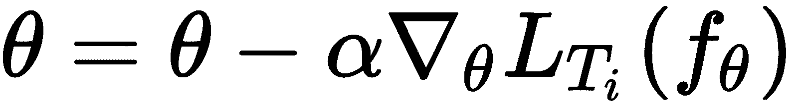
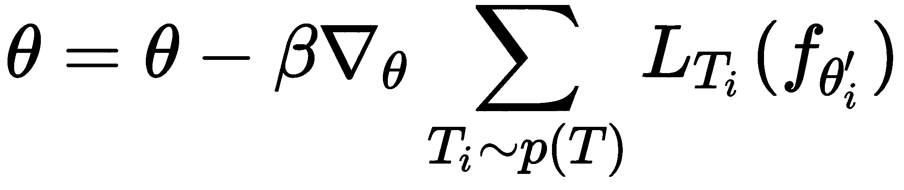
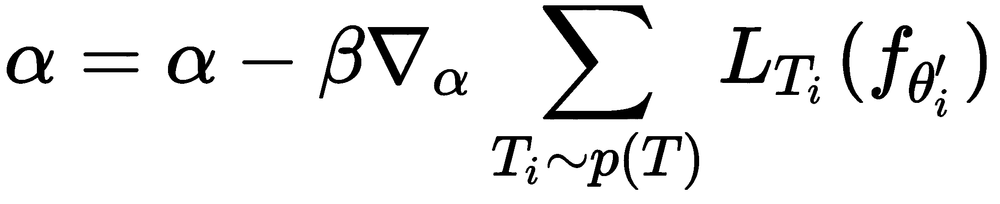
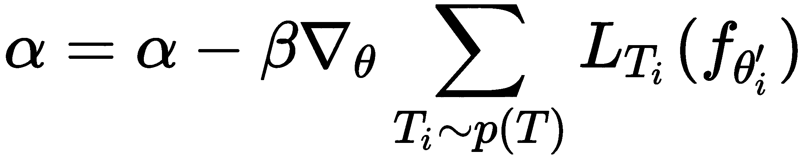
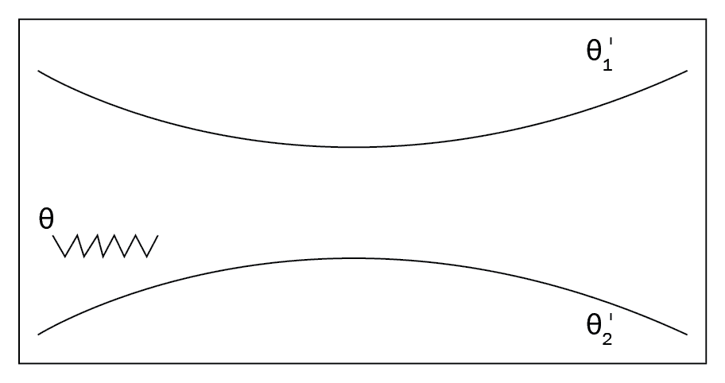
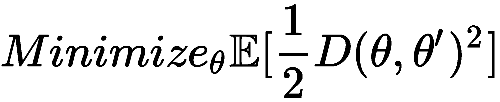
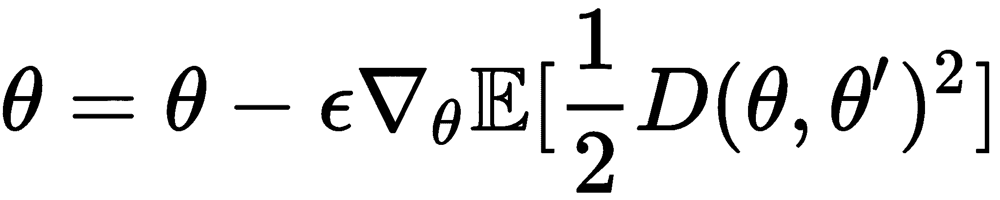
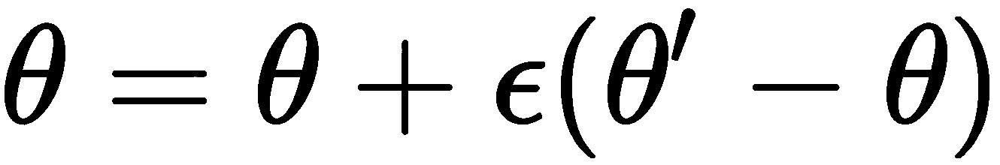

# 七、元 SGD 和 Reptile

在上一章中，我们学习了如何使用 MAML 查找可在多个任务中推广的最佳参数。 我们看到了 MAML 如何通过计算元梯度和执行元优化来计算此最佳参数。 我们还看到了对抗性元学习，它通过添加对抗性样本并使 MAML 在干净样本和对抗性样本之间进行搏斗以找到最佳参数，从而增强了 MAML。 我们还看到了 CAML，或者说是元学习的上下文适应。 在本章中，我们将学习元 SGD，这是另一种用于快速执行学习的元学习算法。 与 MAML 不同，元 SGD 不仅会找到最佳参数，还将找到最佳学习率和更新方向。 我们将看到如何在监督学习和强化学习设置中使用元 SGD。 我们还将看到如何从头开始构建元 SGD。 继续，我们将学习 Reptile 算法，该算法对 MAML 进行了改进。 我们将看到 Reptile 与 MAML 有何不同，然后将介绍如何在正弦波回归任务中使用 Reptile。

在本章中，您将了解以下内容：

*   元 SGD
*   监督学习中的元 SGD
*   强化学习中的元 SGD
*   从头开始构建元 SGD
*   Reptile
*   将 Reptile 用于正弦波回归

# 元 SGD

假设我们有一些任务`T`。 我们使用通过某些参数`θ`参数化的模型`f`，并训练模型以最大程度地减少损失。 我们使用梯度下降使损失最小化，并找到模型的最佳参数`θ'[i]`。

让我们回想一下梯度下降的更新规则：



那么，构成梯度下降的关键因素是什么？ 让我们来看看：

*   参数`θ`
*   学习率`α`
*   更新方向

我们通常将参数`θ`设置为某个随机值，并在训练过程中尝试找到最佳值，然后将学习率`α`的值设置为一个小数值，或者将其随时间衰减，以及跟随梯度的更新方向。 我们是否可以通过元学习来学习梯度下降的所有这些关键特征，以便可以从几个数据点快速学习？ 在上一章中，我们已经看到 MAML 如何找到可在各个任务之间推广的最佳初始参数`θ`。 有了最佳的初始参数，我们就可以减少梯度步骤，并快速学习新任务。

因此，现在我们是否可以学习最佳的学习率和更新方向，从而可以跨任务进行概括，从而实现更快的收敛和训练？ 让我们看看如何通过将其与 MAML 进行比较在元 SGD 中学习。 如果您还记得，请在 MAML 内循环中，通过最小化梯度下降带来的损失，找到每个任务`T[i]`的最佳参数`θ'[i]`：


对于元 SGD，我们可以按如下方式重写前面的公式：


但是有什么区别呢？ 此处`α`不仅是一个标量小值，而且是一个向量。 我们以与`θ`相同的形状随机初始化`α`。我们将`θ`称为初始参数，将`αᐁ[θ]L[T[i]](f[θ])`称为自适应项。 因此，自适应项表示更新方向，其长度成为学习率。 我们在自适应项的方向而不是在梯度方向`ᐁ[θ]L[T[i]](f[θ])`上更新我们的值，并且在自适应项中隐式地实现了我们的学习率。

因此，在元 SGD 中，我们不会使用较小的标量值来初始化学习率`α`。 相反，我们使用与`θ`相同形状的随机值来初始化学习率，并与`θ`一起学习它们。 我们采样了一些任务，并且对于每个任务，我们采样了一些`k`数据点，并使用梯度下降使损失最小化，但是我们的更新方程式变为：


也就是说，我们的更新方向是自适应项方向，而不是梯度方向，并且我们将`α`与`θ`一起学习。

现在，在外循环中，我们执行元优化-也就是说，我们计算相对于最佳参数`θ'[i]`的损失梯度，并更新我们随机初始化的模型参数`θ`。 在元 SGD 中，我们还更新了随机初始化的`α`，而不是单独更新`θ`，如下所示：





如您所见，元 SGD 只是对 MAML 的一小部分调整。 在 MAML 中，我们随机初始化模型参数`θ`，并尝试找到可跨任务通用的最佳参数。 在元 SGD 中，我们不仅学习模型参数`θ`，还学习了学习率和更新方向，这在适应性项中隐含地实现。

# 用于监督学习的元 SGD 

现在，我们将看到如何在有监督的学习环境中使用元 SGD。 与 MAML 一样，我们可以将元 SGD 应用于可以通过梯度下降训练的任何监督学习问题，无论是回归学习还是分类学习。 首先，我们需要定义我们要使用的损失函数。 例如，如果要执行分类，则可以使用交叉熵作为损失函数，如果要进行回归，则可以使用均方误差作为损失函数。 我们可以使用适合我们任务的任何损失函数。 让我们逐步进行以下操作：

1.  假设我们有一个由参数`θ`参数化的模型`f`，并且在任务!`p(T)`上有一个分布。 首先，我们随机初始化模型参数θ，并随机初始化`α`形状与`θ`相同的形状。

2.  我们从任务分布中抽样一些任务`T[i]`：`T[i] ~ p(T)`。 假设我们已经采样了三个任务，然后是`T = {T[1]m T[2], T[3]}`。
3.  **内循环**：对于任务（`T`）中的每个任务（`T[i]`），我们对`k`数据点进行采样，并准备训练和测试数据集：


现在，我们在`D_train[i]`上应用了一种监督学习算法，使用梯度下降法计算并最小化了损失，并获得了最佳参数`θ'[i]`：


因此，对于每个任务，我们对`k`个数据点进行采样，并最大程度地减少训练集`D_train[i]`上的损失，并获得最佳参数`θ'[i]`。 当我们采样三个任务时，我们将拥有三个最佳参数`θ'[i]`。

4.  **外循环**：现在，我们在测试集（元训练集）中执行元优化-也就是说，在这里，我们尝试使测试集`D_test[i]`中的损失最小化。 通过计算相对于上一步中计算出的最佳参数`θ'[i]`的梯度，我们将损失降至最低，并使用测试集更新随机初始化的参数`θ`。 我们不仅更新`θ`，还更新我们的随机初始化参数`α`，它可以表示为：


5.  对于`n`次迭代，我们重复步骤 2 到步骤 4。

# 从头开始构建元 SGD

在上一节中，我们了解了元 SGD 的工作原理。 我们看到了元 SGD 如何获得更好，更健壮的模型参数`θ`，该参数可跨任务进行通用化，并具有最佳的学习率和更新方向。 现在，我们将从头开始对元 SGD 进行编码，以更好地了解它们。 就像我们在 MAML 中所做的一样，为了更好地理解，我们将考虑一个简单的二分类任务。 我们随机生成输入数据，并使用简单的单层神经网络对其进行训练，并尝试找到最佳参数`θ'[i]`。 我们将逐步详细介绍如何执行此操作。

[您还可以在此处查看 Jupyter 笔记本中提供的代码，并提供说明](https://github.com/sudharsan13296/Hands-On-Meta-Learning-With-Python/blob/master/07.%20Meta-SGD%20and%20Reptile%20Algorithms/7.4%20Building%20Meta-SGD%20from%20Scratch.ipynb)。

首先，我们导入`numpy`库：

```py
import numpy as np
```

# 生成数据点

现在，我们定义了一个名为`sample_points`的函数，用于生成输入`(x, y)`对。 它以参数`k`作为输入，这意味着我们要采样的`(x, y)`对的数量：

```py
def sample_points(k):
    x = np.random.rand(k,50)
    y = np.random.choice([0, 1], size=k, p=[.5, .5]).reshape([-1,1])
    return x,y
```

前面的函数返回的输出如下：

```py
x, y = sample_points(10)
print x[0]
print y[0]

[5.01913307e-01 1.01874941e-01 7.16678998e-01 3.90294047e-01
 2.95330904e-01 8.66751993e-01 5.09988127e-01 8.59389493e-01
 5.16202142e-01 7.92016358e-01 8.24237307e-01 7.76739141e-01
 8.57034917e-01 2.75862141e-01 6.44874856e-01 2.75248940e-01
 5.67665047e-01 9.61564994e-01 7.58931873e-01 1.08989614e-02
 7.69325529e-01 4.05955016e-01 1.98799935e-01 9.94134622e-01
 3.07179216e-01 1.34756367e-01 2.92326855e-01 5.00026528e-01
 7.23673231e-01 5.28698231e-01 1.52495715e-01 9.20139339e-01
 1.76127500e-02 2.42244262e-01 7.09515862e-01 7.10358091e-01
 6.47656449e-01 5.15623266e-01 8.77002211e-01 4.18744855e-01
 9.67902538e-01 8.79261670e-01 5.88524781e-01 5.11397703e-02
 7.07513737e-01 4.61998029e-01 8.77306226e-01 5.32049083e-01
 8.07178697e-01 5.01521846e-04]
[1]
```

# 单层神经网络

我们使用只有一层的神经网络来预测输出：

```py
a = np.matmul(X, theta)
YHat = sigmoid(a)
```

因此，我们使用元 SGD 查找最佳参数值`theta`，学习率和梯度更新方向，这些方向可在各个任务之间推广。 因此，对于一项新任务，我们可以通过采取较少的梯度步骤，在较短的时间内从几个数据点中学习。

# 元 SGD

现在，我们定义一个名为`MetaSGD`的类，在其中实现元 SGD 算法。 在`__init__`方法中，我们将初始化所有必需的变量。 然后，我们定义 Sigmoid 激活函数。 之后，我们定义训练函数：

```py
class MetaSGD(object):
```

我们定义`__init__`方法并初始化所有必需的变量：

```py
    def __init__(self):

        #initialize number of tasks i.e number of tasks we need in each batch of tasks
        self.num_tasks = 2

        #number of samples i.e number of shots -number of data points (k) we need to have in each task
        self.num_samples = 10

        #number of epochs i.e training iterations
        self.epochs = 10000

        #hyperparameter for the outer loop (outer gradient update) i.e meta optimization
        self.beta = 0.0001

        #randomly initialize our model parameter theta
        self.theta = np.random.normal(size=50).reshape(50, 1)

        #randomly initialize alpha with same shape as theta
        self.alpha = np.random.normal(size=50).reshape(50, 1)
```

我们定义了`sigmoid`激活函数：

```py
    def sigmoid(self,a):
        return 1.0 / (1 + np.exp(-a))
```

现在，让我们开始训练：

```py
    def train(self):
```

对于周期数：

```py
        for e in range(self.epochs): 

            self.theta_ = []
```

对于一批任务中的`i`任务：

```py
           for i in range(self.num_tasks):
```

我们对`k`个数据点进行采样，并准备训练集：

```py
                XTrain, YTrain = sample_points(self.num_samples)
```

然后，我们使用单层网络预测`y`的值：

```py
                a = np.matmul(XTrain, self.theta)

                YHat = self.sigmoid(a)
```

我们计算损失并计算梯度：

```py
                #since we're performing classification, we use cross entropy loss as our loss function
                loss = ((np.matmul(-YTrain.T, np.log(YHat)) - np.matmul((1 -YTrain.T), np.log(1 - YHat)))/self.num_samples)[0][0]

                #minimize the loss by calculating gradients
                gradient = np.matmul(XTrain.T, (YHat - YTrain)) / self.num_samples
```

之后，我们更新梯度并为每个任务找到最佳参数`θ'[i]`：

```py
                self.theta_.append(self.theta - (np.multiply(self.alpha,gradient)))
```

我们初始化元梯度：

```py
            meta_gradient = np.zeros(self.theta.shape)

            for i in range(self.num_tasks):
```

我们对`k`个数据点进行采样，并准备用于元训练`D_test[i]`的测试集：

```py
                XTest, YTest = sample_points(10)
```

然后，我们预测`y`的值：

```py
                a = np.matmul(XTest, self.theta_[i])

                YPred = self.sigmoid(a)
```

我们计算元梯度：

```py
                meta_gradient += np.matmul(XTest.T, (YPred - YTest)) / self.num_samples
```

现在，我们更新模型参数`theta`和`alpha`：


```py
            self.theta = self.theta-self.beta*meta_gradient/self.num_tasks

            self.alpha = self.alpha-self.beta*meta_gradient/self.num_tasks 
```

我们每 1000 个周期打印一次损失：

```py
            if e%1000==0:
                print "Epoch {}: Loss {}\n".format(e,loss) 
                print 'Updated Model Parameter Theta\n'
                print 'Sampling Next Batch of Tasks \n'
                print '---------------------------------\n'
```

`MetaSGD`的完整代码如下：

```py
class MetaSGD(object):
    def __init__(self):

        #initialize number of tasks i.e number of tasks we need in each batch of tasks
        self.num_tasks = 2

        #number of samples i.e number of shots -number of data points (k) we need to have in each task
        self.num_samples = 10

        #number of epochs i.e training iterations
        self.epochs = 10000

        #hyperparameter for the inner loop (inner gradient update)
        self.alpha = 0.0001

        #hyperparameter for the outer loop (outer gradient update) i.e meta optimization
        self.beta = 0.0001

        #randomly initialize our model parameter theta
        self.theta = np.random.normal(size=50).reshape(50, 1)

        #randomly initialize alpha with same shape as theta
        self.alpha = np.random.normal(size=50).reshape(50, 1)

    #define our sigmoid activation function 
    def sigmoid(self,a):
        return 1.0 / (1 + np.exp(-a))

    #now let's get to the interesting part i.e training :P
    def train(self):

        #for the number of epochs,
        for e in range(self.epochs): 

            self.theta_ = []

            #for task i in batch of tasks
            for i in range(self.num_tasks):

                #sample k data points and prepare our train set
                XTrain, YTrain = sample_points(self.num_samples)

                a = np.matmul(XTrain, self.theta)

                YHat = self.sigmoid(a)

                #since we're performing classification, we use cross entropy loss as our loss function
                loss = ((np.matmul(-YTrain.T, np.log(YHat)) - np.matmul((1 -YTrain.T), np.log(1 - YHat)))/self.num_samples)[0][0]

                #minimize the loss by calculating gradients
                gradient = np.matmul(XTrain.T, (YHat - YTrain)) / self.num_samples

                #update the gradients and find the optimal parameter theta' for each of tasks
                self.theta_.append(self.theta - (np.multiply(self.alpha,gradient)))

            #initialize meta gradients
            meta_gradient = np.zeros(self.theta.shape)

            for i in range(self.num_tasks):

                #sample k data points and prepare our test set for meta training
                XTest, YTest = sample_points(10)

                #predict the value of y
                a = np.matmul(XTest, self.theta_[i])

                YPred = self.sigmoid(a)

                #compute meta gradients
                meta_gradient += np.matmul(XTest.T, (YPred - YTest)) / self.num_samples

            #update our randomly initialized model parameter theta with the meta gradients
            self.theta = self.theta-self.beta*meta_gradient/self.num_tasks

            #update our randomly initialized hyperparameter alpha with the meta gradients
            self.alpha = self.alpha-self.beta*meta_gradient/self.num_tasks

            if e%1000==0:
                print "Epoch {}: Loss {}\n".format(e,loss) 
                print 'Updated Model Parameter Theta\n'
                print 'Sampling Next Batch of Tasks \n'
                print '---------------------------------\n'
```

我们创建`MetaSGD`类的实例：

```py
model = MetaSGD()
```

让我们开始训练模型：

```py
model.train()
```

您可以通过各种周期看到损失如何最小化：

```py
Epoch 0: Loss 2.22523195333

Updated Model Parameter Theta

Sampling Next Batch of Tasks 

---------------------------------

Epoch 1000: Loss 1.951785305709

Updated Model Parameter Theta

Sampling Next Batch of Tasks 

---------------------------------

Epoch 2000: Loss 1.47382270343

Updated Model Parameter Theta

Sampling Next Batch of Tasks 

---------------------------------

Epoch 3000: Loss 1.07296354822

Updated Model Parameter Theta

Sampling Next Batch of Tasks 

---------------------------------
```

#元 SGD 用于强化学习

现在，我们将了解如何在强化学习中使用元 SGD。元 SGD 与可以通过梯度下降训练的任何 RL 算法兼容。

1.  假设我们有一个由参数`θ`参数化的模型`f`，并且在任务`p(T)`上有一个分布。 首先，我们随机初始化模型参数`θ`，并随机初始化形状与`θ`相同的`α`。
2.  从任务分布中采样一些任务`T[i]`：`T[i] ~ p(T)`。 假设我们已经采样了三个任务`T = {T[1], T[2], T[3]}`。
3.  **内循环**：对于任务（`T`）中的每个任务（`T[i]`），我们对`D_train[i]`轨迹进行采样，使用梯度下降计算损失并将损失最小化，并获得最佳参数`θ'[i]`。因此，对于每个任务，我们都对轨迹进行采样，最大程度地减少损失并获得最佳参数`θ'[i]`。 当我们采样三个任务时，对于所有三个任务，我们将拥有三个最佳参数`θ'[i]`。 接下来，我们将对另一组称为`D_test[i]`的轨迹进行元更新。
4.  **外循环**：现在，我们在`D_test[i]`轨迹中执行元优化。 我们通过计算相对于上一步获得的最佳参数`θ'[i]`的梯度，更新我们随机初始化的参数`θ`和`α`来使损失最小化：




5.  对于`n`次迭代，我们重复步骤 2 到步骤 4。

# Reptile

Reptile 算法已被 OpenAI 提出作为对 MAML 的改进。 它很容易实现。 我们知道，在 MAML 中，我们可以计算二阶导数，即梯度的梯度。 但是从计算上来说，这不是一个有效的任务。 因此，OpenAI 提出了对 MAML 的改进，称为 Reptile。 Reptile 的算法非常简单。 对一些`n`个任务进行采样，然后运行**随机梯度下降**（**SGD**），以减少每个采样任务的迭代次数，然后沿某个方向更新模型参数，这是所有任务的共同点。 由于我们对每个任务执行的 SGD 迭代次数较少，因此间接暗示我们正在计算损失的二阶导数。 与 MAML 不同，它在计算上很有效，因为我们不直接计算二阶导数也不展开计算图，因此易于实现。

假设我们从任务分布中采样了两个任务`T[1]`和`T[2]`，并随机初始化了模型参数`θ`。 首先，我们接受任务`T[1]`并对某些`n`次迭代执行 SGD，并获得最佳参数`θ'[i]`。 然后我们执行下一个任务`T[2]`，迭代执行 SGD `n`次，并获得最佳参数`θ'[i]`。 因此，我们有两个最佳参数集：`θ' = {θ'[1], θ'[2]}`。 现在，我们需要沿更靠近这两个最佳参数的方向移动参数`θ`，如下图所示：



但是，如何在更接近最佳参数`θ'[i]`的方向上移动随机初始化的模型参数`θ`呢？ 首先，我们需要找到随机初始化的模型参数`θ`与最佳参数集`θ'`之间的距离。 因此，我们使用欧几里得距离`D`作为找到该距离的距离度量。 找到`θ`和`θ'`之间的距离后，我们需要将它们最小化：



最小化`θ`和`θ'`之间的距离实际上会将我们随机初始化的模型参数`θ`移向更接近最佳参数`θ'[i]`的方向。 但是我们如何才能最小化这个距离呢？ 我们基本上计算距离`ᐁ[θ]E[1/2 D(θ, θ')^2]`的梯度以将其最小化，它可以编写如下：



因此，在计算了梯度之后，我们的最终更新方程变为：



通过使用先前的方程式更新模型参数`θ`，我们实质上使初始参数`θ`与最佳参数值`θ'`之间的距离最小。 因此，我们通过执行`n`次迭代的 SGD，找到每个任务的最佳参数。 一旦获得了最佳参数集，就可以使用先前的公式更新模型参数`θ`。

# Reptile 算法

Reptile 是一种简单而有效的算法。 Reptile 可以实现串行和批量版本。 在串行版本中，我们仅从任务分发中抽样一个任务，而在批量版本中，我们对一批任务进行抽样并尝试找到最佳参数。 我们将看到 Reptile 的串行版本如何工作。 Reptile 所涉及的步骤顺序如下：

1.  假设我们有任务的分布`p(T)`，并且我们随机初始化模型参数`θ`。
2.  现在我们从任务分布`T ~ p(T)`中抽取任务`T`。
3.  对于采样的任务`T`，我们对`k`个数据点进行采样，并准备我们的数据集`D`：`D = {(x1, y1), (x2, y2), 。.., (xk, yk)}`。 我们的数据集基本上包含`x`特征和`y`标签。 现在，我们通过对某些`n`迭代次数执行随机梯度下降来最大程度地减少数据集中的损失。 在对采样任务`T`，执行`n`次迭代的 SGD 之后，我们将获得最佳参数`θ'[i]`。
4.  我们在更接近先前步骤中获得的最佳参数`θ'[i]`的方向上更新了随机初始化的参数`θ`如下：`θ = θ + ε(θ - θ')`。
5.  对于`n`迭代次数，我们重复步骤 2 到步骤 4。

# 将 Reptile 用于正弦波回归

在上一节中，我们了解了 Reptile 的工作原理。 现在，我们将从头开始对 Reptile 进行编码，从而更好地理解它。 假设我们有一个任务集合，每个任务的目标是在给定一些输入的情况下使正弦波的输出回归。 那是什么意思呢？

假设`y = amplitude * sin(x + phase)`。 我们算法的目标是学习在给定`x`的情况下对`y`的值进行回归。 幅度的值在 0.1 到 5.0 之间随机选择，相位的值在 0 到`π`之间随机选择。 因此，对于每个任务，我们仅采样 10 个数据点并训练网络-也就是说，对于每个任务，我们仅采样 10 个`(x, y)`对。 让我们看一下代码并详细查看它。

[您还可以在此处查看 Jupyter 笔记本中提供的代码，并提供说明](https://github.com/sudharsan13296/Hands-On-Meta-Learning-With-Python/blob/master/07.%20Meta-SGD%20and%20Reptile%20Algorithms/7.7%20Sine%20wave%20Regression%20Using%20Reptile.ipynb)。

首先，我们导入所有必需的库：

```py
import tensorflow as tf
import numpy as np
```

# 生成数据点

现在，我们定义了一个称为`sample_points`的函数，用于生成`(x, y)`对。 它以参数`k`作为输入，这意味着我们要采样的`(x, y)`对的数量：

```py
def sample_points(k):

    num_points = 100

    #amplitude
    amplitude = np.random.uniform(low=0.1, high=5.0)

    #phase
    phase = np.random.uniform(low=0, high=np.pi)

    x = np.linspace(-5, 5, num_points)

    #y = a*sin(x+b)
    y = amplitude * np.sin(x + phase)

    #sample k data points
    sample = np.random.choice(np.arange(num_points), size=k)

    return (x[sample], y[sample])
```

# 两层神经网络

像 MAML 一样，Reptile 也与可以通过梯度下降训练的任何算法兼容。 因此，我们使用具有 64 个隐藏单元的简单两层神经网络。

首先，让我们重置 TensorFlow 图：

```py
tf.reset_default_graph()
```

我们初始化网络参数：

```py
num_hidden = 64
num_classes = 1
num_feature = 1
```

接下来，我们为输入和输出定义占位符：

```py
X = tf.placeholder(tf.float32, shape=[None, num_feature])
Y = tf.placeholder(tf.float32, shape=[None, num_classes])
```

我们随机初始化模型参数：

```py
w1 = tf.Variable(tf.random_uniform([num_feature, num_hidden]))
b1 = tf.Variable(tf.random_uniform([num_hidden]))

w2 = tf.Variable(tf.random_uniform([num_hidden, num_classes]))
b2 = tf.Variable(tf.random_uniform([num_classes]))
```

然后，我们执行前馈操作以预测输出`Yhat`：

```py
#layer 1
z1 = tf.matmul(X, w1) + b1
a1 = tf.nn.tanh(z1)

#output layer
z2 = tf.matmul(a1, w2) + b2
Yhat = tf.nn.tanh(z2)
```

我们使用均方误差作为损失函数：

```py
loss_function = tf.reduce_mean(tf.square(Yhat - Y))
```

然后，我们使用 Adam 优化器将损失降至最低：

```py
optimizer = tf.train.AdamOptimizer(1e-2).minimize(loss_function)
```

我们初始化 TensorFlow 变量：

```py
init = tf.global_variables_initializer()
```

# Reptile

现在，我们将看到如何使用 Reptile 找到神经网络的最佳参数。

首先，我们初始化必要的变量：

```py
#number of epochs i.e training iterations
num_epochs = 100

#number of samples i.e number of shots
num_samples = 50 

#number of tasks
num_tasks = 2

#number of times we want to perform optimization
num_iterations = 10

#mini btach size
mini_batch = 10 
```

然后，我们开始 TensorFlow 会话：

```py
with tf.Session() as sess:

    sess.run(init)

```

对于周期数：

```py
    for e in range(num_epochs):

        #for each task in batch of tasks
        for task in range(num_tasks):
```

我们得到模型的初始参数：

```py
            old_w1, old_b1, old_w2, old_b2 = sess.run([w1, b1, w2, b2,])
```

然后，我们对`x`和`y`进行采样：

```py
            x_sample, y_sample = sample_points(num_samples)
```

对于某些`k`迭代，我们对任务执行优化：

```py
            for k in range(num_iterations):

                #get the minibatch x and y
                for i in range(0, num_samples, mini_batch):

                    #sample mini batch of examples 
                    x_minibatch = x_sample[i:i+mini_batch]
                    y_minibatch = y_sample[i:i+mini_batch]

                    train = sess.run(optimizer, feed_dict={X: x_minibatch.reshape(mini_batch,1), 
                                                           Y: y_minibatch.reshape(mini_batch,1)})
```

经过几次优化迭代后，我们获得了更新的模型参数：

```py
            new_w1, new_b1, new_w2, new_b2 = sess.run([w1, b1, w2, b2])
```

现在，我们执行元更新：

```py
            epsilon = 0.1

            updated_w1 = old_w1 + epsilon * (new_w1 - old_w1) 
            updated_b1 = old_b1 + epsilon * (new_b1 - old_b1) 

            updated_w2 = old_w2 + epsilon * (new_w2 - old_w2) 
            updated_b2 = old_b2 + epsilon * (new_b2 - old_b2) 
```

我们使用新参数更新模型参数：

```py
            w1.load(updated_w1, sess)
            b1.load(updated_b1, sess)

            w2.load(updated_w2, sess)
            b2.load(updated_b2, sess)
```

然后，我们每 10 个周期打印一次损失：

```py

        if e%10 == 0:
            loss = sess.run(loss_function, feed_dict={X: x_sample.reshape(num_samples,1), Y: y_sample.reshape(num_samples,1)})

            print "Epoch {}: Loss {}\n".format(e,loss) 
            print 'Updated Model Parameter Theta\n'
            print 'Sampling Next Batch of Tasks \n'
            print '---------------------------------\n'
```

完整的代码如下：

```py
#start the tensorflow session
with tf.Session() as sess:

    sess.run(init)

    for e in range(num_epochs):

        #for each task in batch of tasks
        for task in range(num_tasks):

            #get the initial parameters of the model
            old_w1, old_b1, old_w2, old_b2 = sess.run([w1, b1, w2, b2,])

            #sample x and y
            x_sample, y_sample = sample_points(num_samples)

            #for some k number of iterations perform optimization on the task
            for k in range(num_iterations):

                #get the minibatch x and y
                for i in range(0, num_samples, mini_batch):

                    #sample mini batch of examples 
                    x_minibatch = x_sample[i:i+mini_batch]
                    y_minibatch = y_sample[i:i+mini_batch]

                    train = sess.run(optimizer, feed_dict={X: x_minibatch.reshape(mini_batch,1), 
                                                           Y: y_minibatch.reshape(mini_batch,1)})

            #get the updated model parameters after several iterations of optimization
            new_w1, new_b1, new_w2, new_b2 = sess.run([w1, b1, w2, b2])

            #Now we perform meta update

            #i.e theta = theta + epsilon * (theta_star - theta)

            epsilon = 0.1

            updated_w1 = old_w1 + epsilon * (new_w1 - old_w1) 
            updated_b1 = old_b1 + epsilon * (new_b1 - old_b1) 

            updated_w2 = old_w2 + epsilon * (new_w2 - old_w2) 
            updated_b2 = old_b2 + epsilon * (new_b2 - old_b2) 

            #update the model parameter with new parameters
            w1.load(updated_w1, sess)
            b1.load(updated_b1, sess)

            w2.load(updated_w2, sess)
            b2.load(updated_b2, sess)

        if e%10 == 0:
            loss = sess.run(loss_function, feed_dict={X: x_sample.reshape(num_samples,1), Y: y_sample.reshape(num_samples,1)})

            print "Epoch {}: Loss {}\n".format(e,loss) 
            print 'Updated Model Parameter Theta\n'
            print 'Sampling Next Batch of Tasks \n'
            print '---------------------------------\n'
```

您可以看到如下输出：

```py
Epoch 0: Loss 13.0675544739

Updated Model Parameter Theta

Sampling Next Batch of Tasks 

---------------------------------

Epoch 10: Loss 7.3604927063

Updated Model Parameter Theta

Sampling Next Batch of Tasks 

---------------------------------

Epoch 20: Loss 4.35141277313

Updated Model Parameter Theta

Sampling Next Batch of Tasks 

---------------------------------
```

# 总结

在本章中，我们学习了元 SGD 和 Reptile 算法。 我们看到了元 SGD 与 MAML 有何不同，以及如何在监督学习和强化学习设置中使用元 SGD。 我们看到了元 SGD 如何学习模型参数以及学习率和更新方向。 我们还了解了如何从头开始构建元 SGD。 然后，我们了解了 Reptile 算法。 我们看到了 Reptile 与 MAML 的不同之处，以及 Reptile 对 MAML 算法的改进。 我们还学习了如何在正弦波回归任务中使用 Reptile。

在下一章中，我们将学习如何将梯度一致性用作元学习中的优化目标。

# 问题

1. 元 SGD 与 MAML 有何不同？
2. 元 SGD 如何找到最佳学习率？
3. 元 SGD 中学习率的更新方程是什么？
4.  Reptile 算法如何工作？
5.  Reptile 算法的更新方程是什么？

# 进一步阅读

*   [元 SGD](https://arxiv.org/pdf/1707.09835.pdf)
*   [Reptile](https://arxiv.org/pdf/1803.02999.pdf)