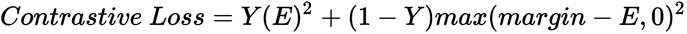
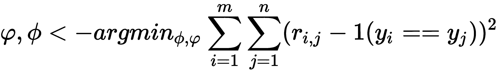
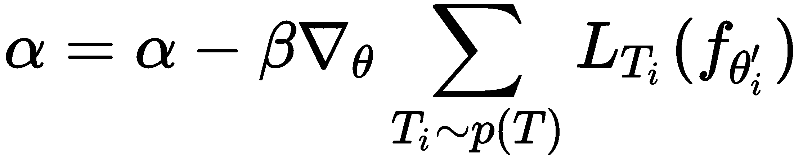
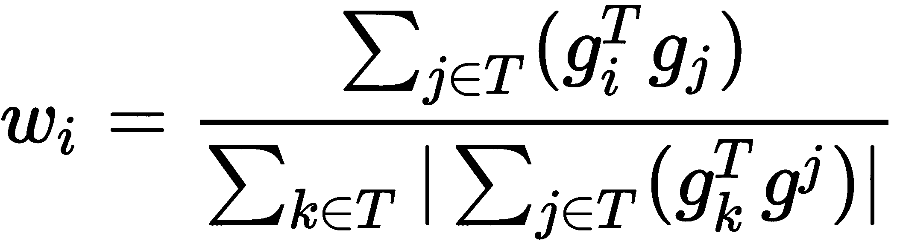

# 十、答案

# 第 1 章：元学习简介

1.  元学习产生了一种通用的 AI 模型，该模型可以学习执行各种任务，而无需从头开始进行训练。 我们使用几个数据点在各种相关任务上训练我们的元学习模型，因此对于新的但相关的任务，该模型可以利用从先前任务中学到的知识而不必从头开始进行训练。
2.  从更少的数据点学习称为**少样本学习**或 **K 次学习**，其中`k`表示在数据集的每个类别中的数据点的数量。
3.  为了使我们的模型从一些数据点中学习，我们将以相同的方式对其进行训练。 因此，当我们有一个数据集`D`时，我们从数据集中存在的每个类中采样一些数据点，并将其称为支持集。
4.  我们从与支持集不同的每个类中采样不同的数据点，并将其称为查询集。
5.  在基于度量的元学习设置中，我们将学习适当的度量空间。 假设我们要找出两个图像之间的相似性。 在基于度量的设置中，我们使用一个简单的神经网络，该网络从两个图像中提取特征并通过计算这两个图像的特征之间的距离来查找相似性。
6.  我们以**剧情方式**训练模型； 也就是说，在每个剧情中，我们从数据集`D`中采样一些数据点，并准备我们的支持集并在支持集上学习。 因此，在一系列事件中，我们的模型将学习如何从较小的数据集中学习。

# 第 2 章：使用连体网络的人脸和音频识别

1.  连体网络是神经网络的一种特殊类型，它是最简单，最常用的单次学习算法之一。 连体网络基本上由两个对称的神经网络组成，它们具有相同的权重和架构，并最终通过能量函数`E`结合在一起。

2.  对比损失函数可以表示为：

    

    在前面的公式中，`Y`的值是真实的标签，当两个输入值相似时为 1，如果两个输入值不相似则为 0，而`E`为我们的能量函数，可以是任何距离度量。 术语**边距**用于保持约束； 也就是说，当两个输入值不相同且它们之间的距离大于边距时，则不会造成损失。

3.  能量函数告诉我们两个输入的相似程度。 它基本上是任何相似性度量，例如欧几里得距离和余弦相似性。

4.  连体网络的输入应该成对`(X1, X2)`及其二进制标记`Y ∈ (0, 1)`，指出输入对是真实对（相同）还是非真实对（不同）。

5.  连体网络的应用是无止境的。 它们已经堆叠了用于执行各种任务的各种架构，例如人类动作识别，场景更改检测和机器翻译。

# 第 3 章：原型网络及其变体

1.  原型网络简单，高效，是最常用的少量学习算法之一。 原型网络的基本思想是创建每个类的原型表示形式，并根据类原型和查询点之间的距离对查询点（新点）进行分类。
2.  我们为每个数据点计算嵌入来学习特征。
3.  一旦我们了解了每个数据点的嵌入，就可以将每个类中数据点的均值嵌入并形成类原型。 因此，类原型基本上就是在类中数据点的平均嵌入。
4.  在高斯原型网络中，连同为数据点生成嵌入，我们在它们周围添加一个置信区域，该区域由高斯协方差矩阵表征。 拥有置信区域有助于表征单个数据点的质量，并且对于嘈杂且不太均匀的数据很有用。
5.  高斯原型网络与原始原型网络的不同之处在于，在原始原型网络中，我们仅学习数据点的嵌入，但在高斯原型网络中，除了学习嵌入之外，我们还为其添加了置信区域。
6.  半径和对角线是高斯原型网络中使用的协方差矩阵的不同组成部分。

# 第 4 章：使用 TensorFlow 的关系和匹配网络

1.  关系网络由两个重要函数组成：嵌入函数（由`f[φ]`表示）和关系函数由`g[φ]`表示。
2.  有了支持集`f[φ](x[i])`和查询集`f[φ](x[j])`的特征向量后，就可以使用运算符`Z`组合它们。 在这里，`Z`可以是任何组合运算符; 我们使用连接作为运算符来组合支持集和查询集的特征向量：

    。

3.  关系函数`g[φ]`将生成一个介于 0 到 1 之间的关系评分，代表支持集`x[i]`中的样本与查询集中`x[j]`中的样本之间的相似性。
4.  我们的损失函数可以表示为：

    

5.  在匹配网络中，我们使用两个嵌入函数`f`和`g`分别学习查询集`x_hat`和支持集`y_hat`的嵌入。
6.  查询点`x_hat`的输出`y_hat`可以预测如下：

    

# 第 5 章：记忆增强神经网络

1.  NTM 是一种有趣的算法，能够存储和检索内存中的信息。 NTM 的想法是通过外部存储器来增强神经网络-也就是说，它不是使用隐藏状态作为存储器，而是使用外部存储器来存储和检索信息。
2.  控制器基本上是前馈神经网络或循环神经网络。 它从内存读取和写入。
3.  读头和写头是包含其必须读取和写入的内存地址的指针。
4.  内存矩阵或内存库，或者简称为内存，是我们存储信息的地方。 内存基本上是由内存单元组成的二维矩阵。 内存矩阵包含`N`行和`M`列。 使用控制器，我们可以从内存中访问内容。 因此，控制器从外部环境接收输入，并通过与存储矩阵进行交互来发出响应。
5.  基于位置的寻址和基于内容的寻址是 NTM 中使用的不同类型的寻址机制。

6.  插值门用于决定是否应使用上一时间步获得的权重`w[t - 1]`或使用通过基于内容的寻址获得的权重`w[t]^c`。

7.  从使用权重向量`w[t]^u`计算最少使用的权重向量`w[t]^(lu)`非常简单。 我们仅将最低值使用权重向量的索引设置为 1，将其余值设置为 0，因为使用权重向量中的最小值表示最近使用最少。

# 第 6 章：MAML 及其变体

1.  MAML 是最近引入且最常用的元学习算法之一，它已导致元学习研究取得重大突破。 MAML 的基本思想是找到更好的初始参数，以便具有良好的初始参数，模型可以以更少的梯度步骤快速学习新任务。
2.  MAML 与模型无关，这意味着我们可以将 MAML 应用于可通过梯度下降训练的任何模型。
3.  ADML 是 MAML 的一种变体，它同时利用干净样本和对抗样本来查找更好且更可靠的初始模型参数θ。
4.  在 FGSM 中，我们获得了图像的对抗样本，并计算了相对于图像的损失梯度，更清楚地输入了图像的像素而不是模型参数。
5.  上下文参数是特定于任务的参数，该参数在内部循环中更新。 用 denoted 表示，它特定于每个任务，代表单个任务的嵌入。
6.  共享参数在任务之间共享，并在外循环中更新以找到最佳模型参数。 用θ表示。

# 第 7 章：元 SGD 和 Reptile 算法

1.  与 MAML 不同，在元 SGD 中，除了找到最佳参数值`θ`之外，我们还找到最佳学习率`α`并更新方向。
2.  学习率在适应项中隐式实现。 因此，在元 SGD 中，我们不会以较小的标量值初始化学习率。 相反，我们使用与`θ`相同形状的随机值初始化它们，然后与`θ`一起学习它们。

3.  学习率的更新公式可以表示为：

    
4.  对`n`个任务进行采样，并在每个采样任务上以较少的迭代次数运行 SGD，然后按照所有任务共有的方向更新模型参数。
5.  Reptile 更新方程可表示为`θ = θ + ε(θ' - θ)`。

# 第 8 章：作为优化目标的梯度一致性

1.  当所有任务的梯度都在同一方向上时，则称为梯度一致性；当某些任务的梯度与其他任务之间存在较大差异时，则称为梯度不一致。
2.  梯度一致性中的更新方程可表示为：

    。
3.  权重与任务梯度的内积和采样任务批量中所有任务的梯度平均值成正比。
4.  权重计算如下：

    

5.  归一化因子与`g[i]`和`g_avg`的内积成比例。
6.  如果任务的梯度与采样的任务批量中所有任务的平均梯度方向相同，则我们可以增加其权重，以便在更新模型参数时做出更大的贡献。 同样，如果任务的梯度方向与采样的任务批量中所有任务的平均梯度方向大不相同，那么我们可以减小其权重，以便在更新模型参数时其贡献较小。

# 第 9 章：最新进展和后续步骤

1.  不平等度量的不同类型是基尼系数，泰尔指数和算法的方差。
2.  泰尔指数是最常用的不平等度量。 它是以荷兰计量经济学家 Henri Theil 的名字命名的，是不平等度量族的一种特例，称为**广义熵度量**。 可以将其定义为最大熵与观察到的熵之差。
3.  如果我们仅通过观察动作就能使机器人学习，那么我们就可以轻松地使机器人有效地学习复杂的目标，而不必设计复杂的目标和奖励函数。 这种类型的学习（即从人类行为中学习）称为模仿学习，在这种情况下，机器人会尝试模仿人类行为。
4.  概念生成器用于提取特征。 我们可以使用由某些参数`θ[G]`参数化的深度神经网络来生成概念。 例如，如果我们的输入是图像，则概念生成器可以是 CNN。
5.  我们从任务分布中抽样一批任务，通过概念生成器学习它们的概念，对这些概念执行元学习，然后计算元学习损失：

    