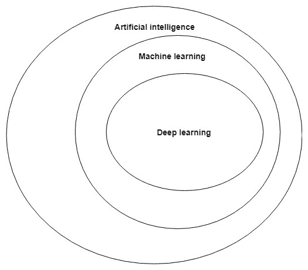
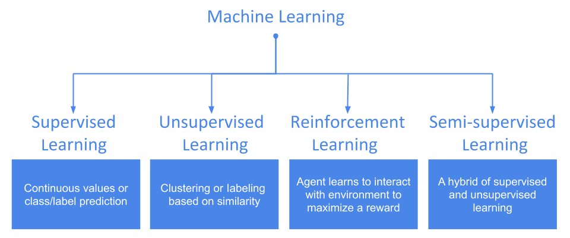
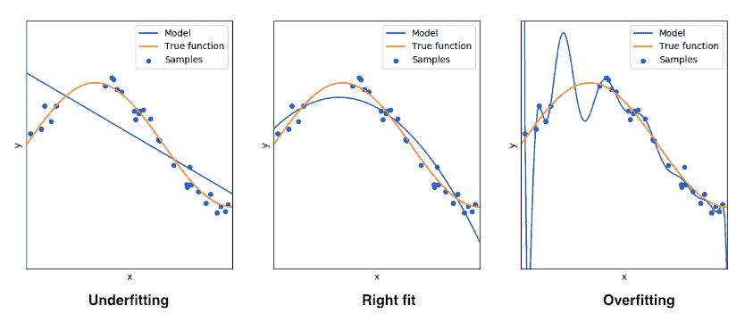
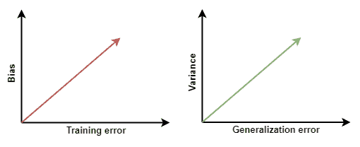
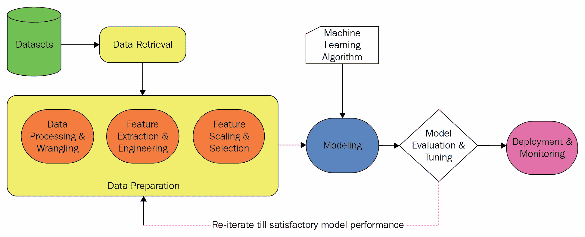

# 一、揭秘人工智能和机器学习基础

“就像电力在 100 年前改变了几乎所有事物一样，今天我实际上很难想到一个行业，我认为 AI 在未来几年内不会改变。”

——Andrew Ng

这句话可能看起来非常熟悉，不用说，它确实是对当前技术中断的强烈共鸣。 在最近的一段时间里，**人工智能**（**AI**）成为几乎每个行业都感兴趣的领域。 无论是教育公司，电信公司，还是从事医疗保健的组织，他们都已采用 AI 来增强业务。 AI 与其他多个行业的这种不可思议的整合只能保证随着时间的推移变得更好，并以智能方式解决关键的实际问题。 今天，我们的电话可以根据我们的指示为您进行临床约会，我们的电话摄像头可以告诉我们所捕获图像的一些人类感知属性，我们的汽车警报系统可以检测到我们的驾驶手势，并可以避免发生意外事故。 随着研究，技术和计算能力普及的发展，这些示例将变得越来越好，并且将变得越来越智能。

随着我们步入软件 2.0 时代，了解为什么自 1950 年代以来就存在的一项技术成为当今大多数新闻的头等重要。 是! 人工智能诞生于 1950 年代，当时诸如 **Alan Turing** 之类的少数计算机科学家和数学家开始思考机器是否可以思考以及是否可以通过智能获得支持，以便他们可以自己回答问题，而无需明确编程。

自成立以来不久，**人工智能**一词由 **John McCarthy** 在 1956 年的一次学术会议上首次提出。 从问题“**机器可以思考吗？**”（由图灵在他的论文中提出，题目为《计算机械和智能》）。从 1950 年到今天，在二十一世纪中，人工智能世界已经展现了一些我们从未想过的前所未有的成果。

今天，如果不使用**网络**，几乎不可能想到一天。 它已轻松成为我们的基本必需品之一。 我们最喜欢的搜索引擎可以直接回答我们的问题，而不是向我们提供相关链接的列表。 他们可以分析在线文本并检测其意图并总结其内容。 由于 AI，所有这些都是可能的。

本书旨在为读者提供动手操作指南，指导他们如何利用**深度学习**等 AI 技术，使基于**计算机视觉**，**自然语言处理**的智能 Web 应用变得**安全**等。 本章为读者提供了有关 AI 及其不同类型和 ML 基本概念的快速复习，并介绍了一些业内知名人士及其通过将 AI 和 Web 技术融合在一起所做的工作。 我们将涵盖以下方面：

*   人工智能及其不同类型的介绍
*   **机器学习**（**ML**）：最受欢迎的 AI
*   **深度学习**（**DL**）简介
*   AI，ML 和 DL 之间的关系
*   机器学习基础
*   AI 前后的 Web
*   最大的 Web AI 参与者及其所作所为

# 人工智能及其类型简介

从更简单的意义上讲，人工智能就是赋予机器智能执行能力的全部。 例如，我们许多人都可以下棋。 本质上，我们首先通过*学习*进行游戏的基础知识，然后再与其他人一起实际进行游戏。 但是机器可以做到吗？ 机器可以自己学习并与我们下棋吗？

AI 试图通过赋予我们一些规则来综合我们所谓的*智能*并将其灌输到机器中的能力，来实现这一目标。 这里提到的**机器**可以是任何可以计算的东西。 例如，它可以是软件或机器人。

实际上，有几种类型的 AI。 最受欢迎的是以下几种：

*   模糊系统
*   专家系统
*   机器学习系统

最终类型听起来最熟悉。 我们将在下一节中介绍它。 但是，在继续进行之前，是时候看看一些使我们今天目睹的 AI 进步成为现实的要点。

# 驱动 AI 的因素

驱动 AI 力量的主要因素如下：

*   数据
*   算法上的进步
*   计算机硬件进步
*   高性能计算的普及

# 数据

我们今天拥有的数据量是巨大的-正如 Google 首席经济学家 **Hal Varian** 在 2016 年所说：

“在文明曙光到 2003 年之间，我们只创建了 5 EB，现在每两天创建一个 EB。到 2020 年，这个数字预计将达到 53 ZB（53 万亿 GB），增长 50 倍。 ”

大量的数据。 随着数字设备数量的增长，此数据量将仅继续呈指数增长。 行驶的汽车仅在速度计上显示速度的时代已经一去不复返了。 我们处于这样一个时代，可以使汽车的每一部分都能在每一瞬间产生原木，从而使我们能够完全重建汽车生命中的任何时刻。

一个人从生活中学到的越多，他就变得越聪明，就越能预测未来事件的结果。 与机器类似，一个软件要训练的（质量）数据量越大，则预测未来看不见的数据就越好。

在过去的几年中，由于各种因素，数据的可用性得到了飞速增长：

*   便宜的存储
*   更高的数据传输速率
*   基于云的存储解决方案的可用性
*   先进的传感器
*   物联网
*   各种形式的数字电子设备的增加
*   网站和本机应用的使用增加

现在有比以往更多的数字设备。 它们都配备了可以随时生成日志并将其通过互联网传输到制造日志的公司或购买该数据的任何其他供应商的系统。 同样，很多日志是由人们使用的网站或应用创建的。 所有这些都可以轻松地存储在基于云的存储解决方案或高存储容量的物理存储中，这些存储现在比以前便宜。

如果环顾四周，您可能会看到一台笔记本电脑，在该笔记本电脑上您经常使用一些软件和网站-所有这些都可能在收集有关您对它们执行的每个操作的数据。 同样，您的电话将充当此类数据生成设备。 对于电视服务提供商提供的带有多个频道的电视，服务提供商和频道提供商都在收集有关您的数据，以更好地为您服务并改善他们的产品。 您只能想象一个人每天产生的海量数据，这个星球上有数十亿人！

# 算法的进步

算法是明确的步骤序列，可以解决给定的问题。 随着时间的流逝，随着科学的发展和人类借助数学对自然法则的理解，算法得到了改善。 大自然往往会启发人们解决复杂问题的方法。 神经网络可能是当今最受关注，自然启发的算法。

当计算机逻辑以多个`if-else`阶梯开始时，没有人会想到有一天我们会拥有一种计算机程序，该程序可以学会产生类似于`if-else`阶梯的结果，而无需手动编写条件。 此外，我们今天拥有的计算机程序可以生成其他可以模拟 AI 的程序！

当然，随着时间的流逝，由人类以及现在由机器开发的算法在执行任务时变得越来越聪明，功能越来越强大。 这直接影响了神经网络的兴起，而神经网络的基本形式似乎是解决矩阵和向量算术问题的循环的耗时超级嵌套。

# 硬件进步

英特尔在 1970 年推出其首个动态 RAM 模块时，它能够保存 1 KB 数据。 大约 50 年后，我们在市场上提供了 128 GB RAM 模块。 这几乎是内存空间的`1.28 x 10^8`倍。

硬盘也表现出类似的趋势。 随着首款个人计算机硬盘能够存储宝贵的 5 兆字节，希捷在 2016 年宣布将 60 TB 的存储空间存储在固态驱动器上。 这是`1.2 x 10^7`的增加倍数。

但是，我们只讨论了直接的个人计算比较，而没有考虑自第一台计算机问世以来技术发展的影响。 如今，随着云计算的到来，听到有人谈论**无限云存储**变得很普遍。

人工智能极大地受益于计算速度和数据存储的指数级增长。

# 高性能计算的普及

随着商品硬件成本的降低及其表现能力的提高，如今，高性能计算已不再是科技巨头独有的东西。 如今，如果每个人都不满意可以通过单个设备提供的出色表现，那么很容易就可以为自己的个人使用建立一个计算设备网络，以促进高性能计算。 但是，投资硬件并不是获得高性能计算的唯一方法。 基于云的计算解决方案的出现导致单击部署方法可以使用非常高速的计算基础结构。 用户可以随时通过网络启动基于云的实例，并在其上运行表现密集型软件，而费用却很少。

随着高性能计算变得易于个人开发者使用，人工智能解决方案的开发已进入广大开发者社区。 这导致 AI 的创新和基于研究的应用数量激增。

现在，让我们来探讨截至撰写本文时最流行的 AI 形式，并讨论有关它的一些重要概念。

# ML - 最受欢迎的 AI 形式

在不采用任何数学符号或太多理论细节的情况下，让我们尝试从直观的角度使用术语**机器学习**（**ML**）。 为此，我们将不得不看看我们如何实际学习。 当在学校被教导要识别句子中的词性时，您是否还记得学校？ 我们得到了一套识别句子中演讲部分的规则。 我们给了很多例子，我们的老师首先为我们识别了句子中的语音部分来有效地*训练*我们，以便我们可以利用这种学习经验来识别句子中的语音部分， 没有被教给我们。 而且，该学习过程从根本上适用于我们学习的任何内容。

如果我们可以类似地训练机器怎么办？ 如果我们可以对他们进行编程，使他们可以从经验中学习并可以根据这些知识开始回答问题，该怎么办？ 嗯，这已经完成了，并且，无论是有意还是无意，我们所有人都在从中受益。 而这正是直觉上讨论 ML 的意义。 为了更正式，更标准的理解，让我们看一下汤姆·米切尔（Tom Mitchell）在他的书《机器学习》中的以下定义：

“如果某个计算机程序在`T`上的表现（由`P`衡量）随着经验`E`的提高而改善，那么据说它可以从经验`E`中学习一些任务`T`和一些表现度量`P`。”

前面的定义是我们从直观的角度讨论 ML 的更为精确的版本。 在此必须注意，由于这种形式的 AI，我们今天看到的大多数 AI 向导都是可能的。

现在，我们对 ML 是个好主意了。 现在，我们将进入下一部分，该部分讨论 ML 的最强大子字段。 我们不会深入探讨数学细节。 相反，如本节所述，我们将对其进行直观地分解。

# 什么是 DL？

现在是本世纪最令人兴奋的部分，并且可能是本世纪最热门的技术术语。 分开现实，我们现在在某种程度上理解了**学习**，因此让我们进入术语*深度学习* -- **深度**的第一部分。

DL 是一种机器学习，但它完全基于**神经网络**。 我们还将在下一章中介绍神经网络。 任何机器学习系统的基本目标都是*学习提供给它的数据的有用表示*。 但是，什么使 DL 与众不同？ 事实证明，DL 系统将数据视为层的表示。 例如，可以将图像视为具有不同属性（例如边缘，轮廓，方向，纹理和梯度）的层的表示。 下图来自的《Python 深度学习》书，FrançoisChollet 很好地抓住了这个想法：

在上图中，采用 DL 系统对手写数字图像进行分类。 系统将手写数字的图像作为输入，并尝试学习其基础表示。 在第一层中，系统学习通用特征，例如笔触和线条。 随着层数的增加，它将了解特定于给定图像的特征。 层数越多，系统越深。 让我们看一下下面的定义，它是由 FrançoisChollet 在他的书《Python 深度学习》中给出的：

“深度学习中的**深度**并不是指通过这种方法实现的任何形式的更深层次的理解；它代表的是连续表示层的思想。有多少层对数据的模型有所贡献，称为模型的深度。在深度学习中，这些分层表示（几乎总是）是通过称为神经网络的模型来学习的，这些模型构造为彼此堆叠的文字层。

该定义非常恰当地捕获了 DL 的所有必要成分，并精美地引入了将数据视为分层表示的概念。 因此，从广义上讲，DL 系统以分层的方式将数据分解为简单的表示形式，并且为了学习这些表示形式，它经常利用许多层（称为*深*） 。 现在我们来看看大图，它告诉我们 AI，ML 和 DL 是如何相互关联的。

# AI，ML 和 DL 之间的关系

为了确保我们清楚了解 AI，ML 和 DL 之间的区别，让我们参考下图，该图优雅地捕获了这三个大名之间的关系：

该图是不言自明的，并且在 DL 领域的许多书籍中都已提及。 让我们尝试从该图中得出一个有趣的结论。

所有 DL 系统都是 ML 系统，因此所有 DL 系统也都是 AI 系统。 但是事实并非如此-并非所有的 AI 系统都是 DL 系统。

乍一看，该声明可能看起来有些混乱，但是，如果我们掌握了正确的基础知识，那么就可以很好地捕捉到 AI，ML 和 DL 之间的区别。 我们将着手重新审视本书后半部分所必需的一些 ML 术语和概念。

# 回顾机器学习的基础

我们已经了解了 ML 的含义。 在本节中，我们将重点介绍几种术语，例如监督学习和非监督学习，并且我们将研究标准 ML 工作流程中涉及的步骤。 但是您可能会问：为什么选择 ML？ 我们应该在本书中学习 *DL* 的应用。 我们刚刚了解到 DL 仅是 ML 的一种。 因此，快速概述与 ML 相关的基本概念肯定会有所帮助。 让我们从几种类型的 ML 以及它们之间的区别开始。

# ML 的类型

ML 包含许多算法和主题。 虽然构成 ML 模型的所有此类算法都不过是对给定数据的数学计算，但是所提供的数据形式和要在其上执行的任务的方式可能会有很大的不同。 有时，您可能希望您的 ML 模型根据先前房价的数据（相对于房屋的详细信息，例如房间数和拥有的楼层数）来预测未来的房价，而在其他时候，您可能希望 ML 模型，学习如何与您对战计算机游戏。 您可以很容易地期望第一个任务的输入数据采用表格格式，但是对于第二个示例，您可能无法提供相同的格式。 因此，ML 算法根据接收到的输入数据和应该产生的输出类型，分为三大类，以及从中得出的另一种形式：

*   监督学习
*   无监督学习
*   强化学习
*   半监督学习

下图捕获了 ML 的三种主要类型，以及第四种类型的混合形式，以及每种类型的非常简短的摘要：

您可能已经听说过 ML 的第四种形式，即半监督学习，它融合了监督学习和非监督学习的世界。

现在，根据它们的功能以及可以用来解决的问题类型，更深入地了解这些类型的 ML。

# 监督学习

在这种 ML 形式中，该算法具有大量训练样本，其中包含有关将用于确定输出特征的所有参数或*特征*的信息。 此输出特征可以是连续的值范围或离散的标签集合。 基于此，监督式机器学习算法分为两部分：

*   **分类**：在输出特征中产生离散标签的算法，例如*正常*和*异常*或一组新闻类别
*   **回归**：例如，当输出特征具有真实值时，政党在选举中可能获得的选票数，或预测达到其熔点的材料的温度

大多数 ML 爱好者在开始学习机器学习时，由于其直观的简单性，往往倾向于首先熟悉监督学习。 它具有一些最简单的算法，无需深入的数学知识即可轻松理解，甚至可以从学生在学校最后几年学到的数学知识中得出。 一些最著名的监督学习算法是线性回归，逻辑回归，支持向量机和 K 最近邻。

# 无监督学习

在训练样本不带有输出特征的情况下，无监督学习就会出现。 那么，您可能想知道，在这种情况下我们应该学习或预测什么？ 答案是相似。 用更详尽的术语讲，当我们有一个用于无监督学习的数据集时，我们通常试图学习训练样本之间的相似性，然后为它们分配类别或*标签*。

考虑一群人站在一个广阔的领域。 它们都具有年龄，性别，婚姻状况，薪资范围和受教育程度等特征。 现在，我们希望根据它们的相似性将它们分组。 我们决定组成三个小组，并看到他们以性别的方式安排自己：一组女性，一组男性以及一组认同其他性别的人。 我们再次要求他们在这些组中分组，看看人们根据年龄范围（儿童，青少年，成人和老年人）来分组。 这使我们总共有 12 个这样的子组。 我们可以根据任何两个个体表现出的相似性来进一步划分较小的子组。 同样，在前面的示例中讨论的分组方式只是形成组的几种方式中的一种。 现在，说我们有 10 个新成员加入人群。 由于我们已经定义了组，因此我们可以轻松地将这些新成员分类到这些组中。 因此，我们可以成功地将组标签应用到它们。

前面的示例仅演示了一种无监督学习形式，可以分为两种类型：

*   **聚类**：这是根据训练样本的特征相似性来形成训练样本组。
*   **关联**：这是查找特征或训练样本之间展示的抽象关联或规则。 例如，在分析商店的销售记录时，发现顾客大多在晚上 7 点以后购买啤酒。

K-均值聚类，DBSCAN 和 Apriori 算法是用于无监督学习的一些最著名算法。

# 强化学习

**强化学习**（**RL**）是 ML 的一种形式，其中虚拟智能体试图学习如何与周围的环境互动，从而可以从中获得最大的回报。 一组特定的动作。

让我们尝试通过一个小示例来理解这一点-例如，您构建了一个玩飞镖的机器人。 现在，仅当机器人击中飞镖板的中心时，它才会获得最大奖励。 它从掷飞镖开始，然后降落在最外圈。 它得到一定数量的点，例如`x1`。 现在它知道在该区域附近投掷将产生预期值`x1`。 因此，在下一次掷球时，它会稍微改变角度，并幸运地降落在第二最右端，并获得`x2`点。 由于`x2`大于`x1`，因此机器人取得了更好的效果，并且将来会学会将其扔到该区域附近。 如果飞镖降落的距离比最外圈的还要远，则机器人会继续将飞镖扔到它所进行的第一次投掷附近，直到获得更好的结果。

在几次这样的试验中，机器人一直在学习更好的投掷位置，并从这些位置绕行一些弯路，直到获得下一个更好的投掷位置为止。 最终，它找到了靶心，并且每次都达到最高点。

在前面的示例中，您的机器人是试图在环境中的飞镖板上投掷飞镖的智能体。 投掷飞镖是智能体对环境执行的动作。 智能体获得的积分将作为奖励。 智能体在多次尝试中尝试通过执行操作来最大化其所获得的回报。

一些著名的 RL 算法是 Monte Carlo，Q 学习和 SARSA。

# 半监督学习

虽然我们讨论了 ML 的三种主要类型，但还有另一种类型是半监督学习。 用这个术语的名字，您可能会猜测它必须对标记和未标记的训练样本进行混合处理。 在大多数情况下，未标记训练样本的数量超过了标记样本的数量。

当一些标记样本添加到完全属于无监督学习的问题中时，半监督学习已成功用于产生更有效的结果。 而且，由于仅标记了几个样本，因此避免了监督学习的复杂性。 通过这种方法，我们可以获得比纯无监督学习系统更好的结果，并且比纯监督学习系统产生的计算成本更低。

# 必要的术语

我们已经使自己熟悉不同类型的 ML 系统。 现在，我们将学习一些与 ML 相关的极其重要的术语，这些术语将在本书的后续章节中为我们提供帮助。

# 训练，测试和验证集

任何 ML 系统都将获得**数据**。 没有数据，实际上不可能设计 ML 系统。 到目前为止，我们并不担心数据的数量，但请务必记住，我们需要数据来设计 ML 系统。 有了这些数据后，我们将其用于*训练*我们的机器学习系统，以便它们可以用于在新数据上*预测*某些东西（*某些东西*是更广的项目，因问题而异）。 因此，用于训练目的的数据称为**训练集**，对其进行测试的数据称为**测试集**。 同样，在将模型实际应用于测试数据之前，我们倾向于在另一组数据上验证其表现，这称为**验证集**。 有时，我们不会在这些漂亮的分区中获得数据； 我们只是以原始的无法理解的格式获取数据，我们将对其进行进一步处理并进行相应的分区。*

从技术上讲，这三个不同集合中的所有实例都应该彼此不同，而数据中的分布应该是相同的。 如今，许多研究人员发现了关于这些假设的关键问题，并提出了**对抗训练**之类的东西，这超出了本书的范围。

# 偏差和方差

偏差和方差对于任何 ML 模型都是非常固有的。 很好地了解它们确实有助于进一步评估模型。 从业人员实际上使用了两者之间的*权衡*来评估机器学习系统的表现。

鼓励您观看吴安德（Andrew Ng）的讲座，[以了解有关此权衡的更多信息](https://www.youtube.com/watch?v=fDQkUN9yw44&t=293s)。

偏差是 ML 算法为学习给定数据基础的表示而做出的一组假设。 当偏差高时，这意味着相应的算法将对数据进行更多的假设，而在偏差低的情况下，算法将进行尽可能少的假设。 据说 ML 模型在训练上表现良好时具有较低的偏差。 低偏差 ML 算法的一些示例是 K 近邻算法和支持向量机，而逻辑回归和朴素贝叶斯等算法通常是高偏差算法。

ML 上下文中的差异涉及数据中存在的信息。 因此，高方差是指 ML 模型能够很好地捕获提供给它的数据中存在的全部信息的质量。 低方差正好相反。 诸如支持向量机之类的算法通常方差高，而诸如朴素贝叶斯之类的算法方差低。

# 过拟合和欠拟合

当 ML 模型在训练数据上表现很好但在测试集或验证集的数据上表现不佳时，该现象称为**过拟合**。 可能有几个原因。 以下是最常见的：

*   该模型在数据方面非常复杂。 在这种情况下，具有很高级别的决策树和具有许多层的神经网络是很好的模型复杂性示例。
*   数据具有很多特征，但总体实例很少。

在 ML 文献中，过拟合问题也被视为*高方差*的问题。 **正则化**是防止过拟合的最广泛使用的方法。

我们已经讨论了偏差的概念。 如果模型在训练数据上表现良好，则偏差较小，也就是说，模型对数据的假设不太多，无法推断其表示形式。 如果该模型在训练数据上惨败，则认为该模型具有较高的偏差，并且该模型**欠拟合**。 欠拟合也可能有很多原因。 在这种情况下，以下是最常见的情况：

*   该模型太简单了，无法学习提供给它的数据的基本表示形式。
*   在将数据馈送到 ML 模型之前，尚未对其数据进行精心设计。 工程部分非常流行，称为特征工程。

基于此讨论，我们可以得出一个非常有用的结论：过拟合的 ML 模型可能会遭受高方差问题，而欠拟合的模型可能会遭受高偏差问题。

如果没有以下图表，关于过拟合和不足拟合的讨论仍然是不完整的（Andrew Ng 在其旗舰课程《机器学习》中显示）：

上图很好地说明了通过数据点的曲线拟合方面的欠拟合和过拟合。 它还给我们提供了一个模型的想法，它**泛化得很好**，即在训练集和测试集上均表现良好。 蓝色的模型预测线偏离样本，导致欠拟合，而在过拟合的情况下，模型会捕获训练数据中的所有点，但不会产生对训练数据以外的数据表现良好的模型。

通常，学习数据表示形式的想法被视为逼近最能描述数据的函数的问题。 而且，可以像上一个一样轻松地以图形方式绘制函数，因此有了**曲线拟合**的想法。 模型能够很好地概括模型在欠拟合和过拟合之间的最佳点，称为良好拟合。

# 训练误差和泛化误差

模型在训练阶段进行预测时所犯的误差统称为**训练误差**。 模型在验证集或测试集上进行测试时所犯的误差称为**泛化误差**。

如果我们要在这两种类型的误差与偏差和方差之间建立关系（最终导致过拟合和欠拟合），则外观将类似于以下内容（尽管关系每次都可能不是线性的，如图所示）：

如果 ML 模型不适合（高偏差），则其训练误差必须很高。 另一方面，如果模型过拟合（高方差），则其泛化误差很高。

我们将在下一节中介绍标准的 ML 工作流程。

# 标准的 ML 工作流程

任何项目都首先考虑到问题，而 ML 项目也不例外。 在开始 ML 项目之前，对要使用 ML 解决的问题有清楚的了解是非常重要的。 因此，关于标准 ML 工作流程的问题表述和映射是 ML 项目中的良好起点。 但是 **ML 工作流程**是什么意思？ 本节就是关于这一点的。

设计 ML 系统并使用它们来解决复杂的问题不仅需要 ML，还需要一系列技能。 很高兴知道 ML 需要不同比例的知识，例如统计，领域知识，软件工程，特征工程和基础高中数学。 为了能够设计这样的系统，某些步骤对于几乎所有 ML 工作流程都是必不可少的，并且每个步骤都需要一定的技能。 在本节中，我们将看一下这些步骤并简要讨论它们。

该工作流程的灵感来自 **CRISP-DM**，它代表**跨行业数据挖掘标准流程**，在与数据挖掘和分析有关的许多行业中得到了广泛的应用。

# 数据获取

如本章前面所述，机器学习系统需要数据才能运行。 它并非始终可用，实际上，在大多数情况下，数据本身并不是以我们可以实际开始训练 ML 模型的格式提供的。 但是，如果没有针对我们要使用 ML 解决的特定问题的标准数据集，该怎么办？ 欢迎来到现实！ 大多数现实生活中的 ML 项目都会发生这种情况。 例如，假设我们正在尝试分析有关 2018 年新年决议的推文情感，并尝试估计最有意义的推文。 这实际上是没有标准数据集可用的问题。 我们将不得不使用其 API 从 Twitter 抓取它。 另一个很好的例子是业务日志。 商业日志是知识的宝库。 如果有效地进行挖掘和建模，它们可以在许多决策过程中提供帮助。 但是通常，日志不能直接提供给 ML 工程师。 因此，ML 工程师需要花费大量时间来确定日志的结构，他们可能会编写脚本，以便根据需要捕获日志。 所有这些过程统称为**数据检索**或**数据收集**。

# 数据准备

在数据收集阶段之后，我们倾向于准备数据以将其馈送到 ML 系统，这称为**数据准备**。 值得一提的是，这是 ML 工作流程/管道中最耗时的部分。 数据准备包括以下步骤：

*   探索性数据分析
*   数据处理与整理
*   特征工程和提取
*   特征缩放和选择

这是 ML 项目中最耗时的部分之一。 当我们更广泛地看待该过程时，我们发现数据标识和收集有时也确实是重要的方面，因为如前所述，正确的格式可能并不总是可用。

# 探索性数据分析（EDA）

收集数据之后，数据准备阶段的第一步是**探索性数据分析**，这是众所周知的 **EDA**。 EDA 技术使我们能够详细了解数据以更好地理解。 这是整个 ML 流程中极为重要的一步，因为如果没有对数据本身的充分了解，如果我们盲目地将 ML 模型拟合到数据，则很可能不会产生良好的结果。 EDA 为我们提供了前进的方向，并帮助我们确定了进一步的步骤。 EDA 涉及很多事情，例如计算有关数据的有用统计信息以及确定数据是否遭受任何异常值的影响。 它还包括有效的数据可视化，这有助于我们以图形方式解释数据，从而帮助我们以有意义的方式传达有关数据的重要事实。

简而言之，EDA 就是要更好地了解数据。

# 数据处理与整理

我们已经对数据进行了一些统计分析。 怎么办？ 大多数情况下，从多个数据源收集的数据以其原始形式存在，无法馈入 ML 模型，因此需要进一步的数据处理。

但是您可能会问，为什么不以某种方式收集数据，以便在完成所有必要的处理后就可以对其进行检索？ 这通常不是一个好习惯，因为它破坏了工作流程的模块化。

这就是为什么要在工作流的后续步骤中使数据可消耗，我们需要清理，转换和持久化数据。 其中包括几项内容，例如数据标准化，数据标准化，缺失值插补，从一个值到另一个值的编码以及离群值处理。 所有这些统称为数据处理。

# 特征工程和提取/选择

考虑一种情况，在这种情况下，会向分析公司的员工提供公司的账单数据，并要求其经理使用该数据构建机器学习系统，从而可以优化公司的整体财务预算。 现在，此数据的格式不能直接提供给 ML 模型，因为 ML 模型期望数据以数字向量的形式出现。

尽管数据可能状况良好，但是员工仍必须执行*某些操作*才能将数据转换为有利的形式。 考虑到数据已经被弄乱了，他们仍然需要确定他将要包含在最终数据集中的哪些特征。 实际上，任何可测量的都可以成为此处的特征。 这就是优秀的领域知识来的地方。 这些知识可以帮助员工选择具有*高预测能力*的特征。 听起来似乎很轻巧，但它需要很多技巧，而且绝对是一项艰巨的任务。 这是**特征工程**的经典示例。

有时，我们采用多种技术来帮助我们从给定的数据集中自动提取最有意义的特征。 当数据的维数很高且特征难以解释时，此功能特别有用。 这被称为**特征选择**。 特征选择不仅有助于开发具有最相关特征的数据的 ML 模型，而且还有助于增强模型的预测表现并减少其计算时间。

除了特征选择外，我们可能还想减少数据的维数以更好地可视化它。 此外，**降维**也用于从完整的数据特征集中捕获一组代表性特征。 **主成分分析**（**PCA**）是一种非常流行的降维技术。

重要的是要记住，特征选择和降维是不同的。

# 建模

我们终于走到了最激动人心的一步，即 **ML 建模**部分。 但是在这里值得注意的是，一个好的机器学习项目不仅仅涉及这部分。 前面提到的所有部分均对项目标准做出了同样的贡献。 实际上，如何为项目收集数据非常重要，为此，我们得到了功能强大的数据工程师的帮助。 现在，让我们将这一部分放在一边。

到目前为止，我们已经拥有了相当不错的数据。 在数据建模过程中，我们将训练数据输入到 ML 模型中进行训练，我们监视其训练进度并调整不同的超参数，从而优化其表现，并在测试集上对模型进行评估。 *模型比较*也是此阶段的一部分。 这确实是一个*迭代*过程，并且在某种程度上涉及*反复试验*。

这里的主要目的是提出一个最能代表数据的 ML 模型，即*很好地泛化*。 计算时间是我们在这里必须考虑的另一个因素，因为我们需要一个表现良好但在可行的时间范围内能够优化特定业务成果的模型。

以下是构成建模核心的部分：

*   模型训练
*   模型评估
*   模型调整

# 模型训练

这是建模的基础部分，因为我们将数据介绍给不同的 ML 模型，然后**训练**模型，以便它可以全面了解数据的表示形式。 我们可以看到模型在使用*训练误差*进行训练期间的进展。 我们也经常将*验证误差*（这意味着我们同时验证模型训练）引入此图片中，这是一种标准做法。 当今大多数现代库都允许我们这样做，我们将在本书的后续章节中看到它。 现在，我们将讨论一些最常用的误差指标。

# 模型评估

我们已经训练了一个 ML 模型，但是该模型对从未见过的数据的表现如何？ 我们使用**模型评估**回答这个问题。

不同的机器学习算法需要不同的评估指标。

对于监督学习方法，我们通常使用以下方法：

*   混淆矩阵，它是由四个值组成的矩阵：真正，假正，真负和假负
*   准确率，精确度，召回率和 F1 分数（这些都是混淆矩阵的副产品）
*   **受试者工作特征**（**ROC**）的**曲线下面积**（**AUC**）度量
*   R 平方（确定系数），**均方根误差**（**RMSE**），F 统计量，**赤池信息准则**（**AIC**）和 p 值（专门用于回归模型）

在本书中，我们将结合这些指标来评估我们的模型。 尽管这些是最常见的评估指标（无论是针对 ML 还是 DL），但还有更具体的评估指标对应于不同的域。 我们将做到这一点以及我们前进的方向。

这里值得一提的是，在*分类*问题中，*数据不平衡*的情况下，我们经常倾向于陷入*准确率悖论*的陷阱。 在这些情况下，分类准确率只能说出故事的一部分，也就是说，它给出的是正确预测所占预测总数的百分比。 在数据集不平衡的情况下，该系统严重失败，因为准确率无法捕获模型在预测数据集的否定实例时的表现（这最初是问题，即预测不常见的类）。

以下是评估无监督方法（例如聚类）的最常​​用指标：

*   轮廓系数
*   误差平方和
*   同质性，完整性和 V 度量
*   Calinski-Harabasz 指数

对于训练集，测试集或验证集，评估指标/误差指标保持不变。 我们不能仅仅通过查看训练模型的表现来得出结论。

# 模型调优

在这个阶段，我们应该有一个基准模型，通过它我们可以进一步**调整模型**，使其表现更好。 模型调整对应于**超参数调整/优化**。

ML 模型带有不同的*超参数*，这些超参数无法从模型训练中学习。 他们的值是由从业者设定的。 您可以将超参数值与音频均衡器的旋钮进行比较，在此处我们可以手动调节旋钮以获得完美的听觉体验。 在后面的章节中，我们将看到超参数调优如何极大地提高模型的表现。

有几种用于调整超参数的技术，以下是最常用的技术：

*   网格搜索
*   随机搜索
*   贝叶斯优化
*   基于梯度的优化
*   进化优化

# 模型比较与选择

在完成模型调整部分之后，我们肯定希望对除当前模型之外的其他模型重复整个*建模*部分，以期获得更好的结果。 作为 ML 的从业者，我们的工作是确保最终提出的模型比其他模型更好（显然在各个方面）。 自然地，比较不同的机器学习模型是一项耗时的任务，当我们需要满足较短的期限时，我们可能无法总是负担得起。 在这种情况下，我们合并了 ML 模型的以下方面：

*   可解释性，可回答给定的问题（模型的可解释性如何以及模型的解释和传达的容易程度？）
*   内存内与内存外建模
*   数据集中的特征和实例数
*   类别与数值特征
*   数据的非线性
*   训练速度
*   预测速度

这些指标是最受欢迎的指标，但在很大程度上取决于当前的问题。 当这些指标不适用时，一个很好的经验法则是查看模型如何在验证集中执行。

# 部署和监控

构建机器学习模型后，它将与应用的其他组件合并并投入生产。 该阶段称为**模型部署**。 在将开发的 ML 模型部署到实际系统中之后，将评估其真实表现。 此阶段还涉及对模型的全面监视，以找出模型表现不佳的领域以及可以进一步改进模型的哪些方面。 监视非常关键，因为它提供了增强模型表现的手段，从而增强了整个应用的表现。

因此，这是 ML 项目所需的最重要的术语/概念的入门。

要更深入地学习 ML 的基础知识，建议您阅读以下资源：[《Google 的机器学习速成课程》](https://developers.google.com/machine-learning/crash-course/)和[《Python 机器学习》](https://india.packtpub.com/in/big-data-and-business-intelligence/python-machine-learning)。

为了便于参考，您可以参考本书和《Python 深度学习实践指南》（Dipanjan 等人）中给出的下图，该图以图形方式描述了所有上述步骤：

实际上，ML 在许多领域都带来了许多增强，并且几乎没有任何影响。 本书着重于构建*智能 Web 应用*。 因此，我们将从下一个章节开始，从总体上讨论 Web 以及从 AI 的前后角度来看自 AI 问世以来 Web 的变化。 最终，我们将研究一些知名企业，以及它们如何促进 AI 构建世界一流的 Web 应用，这些应用不仅智能而且可以解决一些实际问题。

# AI 前后的互联网

如果您自 2014 年以来一直是万维网的普通用户，那么您会同意网站上迅速出现的快速变化。 从解决 *ReCaptcha* 挑战变得越来越难以辨认到在背景中自动将其标记为*人类*以来，Web 开发一直是显示大量人工智能的先驱之一。 在过去的二十年中创建。

互联网的发明者蒂姆·伯纳斯·李爵士在语义网上提出了自己的观点：

“我梦想着使 Web（计算机）能够分析 Web 上的所有数据，包括人与计算机之间的内容，链接和事务。Web 的梦想还没有实现。 出现了，但是当它出现时，日常的贸易，官僚主义和我们的日常生活机制将通过与机器交谈的机器来处理。被人们吹捧多年的“智能体”将最终实现。”

通过提供静态页面，其中包含大量可见信息以及可将您永久带到相关资源的链接，网络现在是不断变化的动态生成信息门户。 如果刷新网页，则可能永远不会再看到相同的网页视图。

让我们了解由于 AI 的兴起而引起的 Web 开发中一些最重要的转变。

# 聊天机器人

如果您想知道某些网页如何通过其网站上的聊天提供 24/7 全天候帮助，答案几乎总是聊天机器人正在从另一端回答您的查询。 1966 年，约瑟夫·魏岑鲍姆（Joseph Weizenbaum）的 ELIZA 聊天机器人击败图灵测试在全世界掀起了一波热潮时，我们从来没有想到过聊天机器人会在万维网上产生的影响（不过，其原因可能是 ARPANET 本身仅是由 ARPANET 创造的） 在 1969 年）。

如今，聊天机器人无处不在。 许多《财富》 500 强公司都在该领域进行研究，并提出了针对其产品和服务的聊天机器人的实现方案。 在甲骨文最近进行的一项调查中，来自几家公司和初创公司的 800 位高管的回应表明，其中近 80% 的人表示，他们已经使用或计划在 2020 年之前在面向客户的产品中使用聊天机器人。

在 AI 开始为聊天机器人提供动力之前，就像 ELIZA（及其后继产品 ALICE）一样，聊天机器人主要是关于一组固定响应的映射到几种输入模式的。 在用户输入的句子中碰到单词*母亲*或*父亲*时，几乎可以肯定会产生一个关于用户家庭或他们的幸福的回答。 如果用户写了“我不想谈论 XYZ 的家庭”之类的东西，显然这不是所需的响应。

然后，这种基于规则的聊天机器人产生了著名的“对不起，我没有得到”答复，这使它们有时显得很愚蠢。 基于神经网络的算法的出现使聊天机器人能够根据用户的情感和用户输入的上下文来理解和自定义响应。 此外，一些聊天机器人会在遇到任何新查询的情况下抓取在线数据，并实时建立有关新的未知查询中提到的主题的答案。 除此之外，聊天机器人已用于为企业门户提供替代接口。 现在可以通过 WhatsApp 提供的聊天机器人平台预订酒店或航班。

Facebook Messenger 的漫游器平台在向公众开放的前 17 个月内创建了超过 100,000 个漫游器。 如今，这家社交网络巨头的数百个页面对向其页面发送消息的用户具有自动响应。 Twitter 上运行着多个机器人，这些机器人可以创建内容，紧密模仿人类用户，并且可以回复其帖子中的消息或评论。

您可以在 [eliza.botlibre.com](http://eliza.botlibre.com) 与在线版本的 ELIZA 聊天。

# 网络分析

在互联网的早期，许多网站都在其中嵌入了里程表式计数器。 这些是对网站或特定页面获得的点击次数的简单计数。 然后，它们以可用的格式增长-普通计数器，每天/每周/每月的计数器，甚至是基于地理位置的计数器。

数据收集，本质上是用户交互以及他们如何与基于 Web 的应用交互的日志，处理这些数据以生成表现指标，然后最终确定公司可以采取的措施来改善他们的 Web 应用统称为 Web 分析。

自从互联网发明以来，当今的 Web 应用每时每刻都会生成大量日志。 即使将鼠标指针闲置在网页上，也可能会报告给 Google Analytics（分析）仪表板，从该站点上，网站管理员可以查看用户正在查看哪些页面以及他们在页面上花费了多少时间。 同样，用户在页面之间采取的流量将是一个非常有趣的指标。

最早的网络分析工具仅能衡量网页点击量，能够创建一个映射来访问给定页面的次数以及该页面是一个唯一用户的次数，但除非提供有关用户访问模式的信息，否则它们几乎无法提供任何信息。它们经过了专门的硬编码，将以非常笼统的方式呈现，并且从来都不是特定于网站的。 正在向进行电子商务的公司提供与向个人网站提供的分析相同的形式。

随着 AI 在网络分析领域带来的革命，如今部署人工智能功能的工具可以对网站的表现做出未来的预测，甚至建议删除或添加网页上的特定内容以提高用户对该页面的参与度 。

# 垃圾邮件过滤

当全世界发送的一半电子邮件被标记为垃圾邮件时，这是一个问题。 乍一想，我们将欺诈性电子邮件和不必要的电子邮件联系在一起，以宣传企业和产品为垃圾邮件，这只是定义的一部分。 重要的是要认识到，即使多次在同一文档上发布高质量的内容也是垃圾邮件。 此外，自术语*垃圾邮件*首先在 Usenet 组中使用以来，网络已经发展起来。 最初是为了使人烦恼而进行的活动，或者是强迫向某些目标用户发送消息的活动，但如今，垃圾邮件的发展更为广泛，并且可能更加危险—从能够跟踪浏览器活动到身份盗用， 如今，互联网上存在大量恶意垃圾邮件，这些垃圾邮件危及用户的安全性和隐私性。

如今，我们有各种垃圾邮件-即时通讯垃圾邮件，网站垃圾邮件，广告垃圾邮件，SMS 垃圾邮件，社交媒体垃圾邮件以及许多其他形式。

除了少数几种，大多数垃圾邮件都在互联网上展出。 因此，至关重要的是能够过滤垃圾邮件并采取针对性措施。 虽然最早的反垃圾邮件斗争始于 1990 年代，当时它确定发送垃圾邮件的 IP 地址，但是随着黑名单的规模越来越大，黑名单的分发和维护成为一种黑名单，很快人们意识到这是一种效率很低的方法。 疼痛。

在 2000 年代初期，保罗·格雷厄姆（Paul Graham）首次发表了题为《垃圾邮件计划》的论文时，部署了一种 ML 模型（贝叶斯过滤）来对抗垃圾邮件。 不久，从纸上纺出了几种反垃圾邮件工具，并证明是有效的。

贝叶斯过滤方法对垃圾邮件的影响就是这种影响。在 2004 年的*世界经济论坛*上，微软的创始人比尔·盖茨向前说：

“从现在开始的两年内，垃圾邮件将得到解决。”

然而，正如我们今天所知，比尔·盖茨在这一预测中再没有错。 垃圾邮件不断发展，垃圾邮件发送者研究贝叶斯过滤并找出避免在检测阶段被标记为垃圾邮件的方法。 如今，神经网络已大规模部署，不断扫描新电子邮件并做出确定垃圾邮件或非垃圾邮件内容的决定，而人类仅仅通过研究电子邮件垃圾邮件日志就无法达到逻辑上的目的。

# 搜索

网络搜索是 AI 崛起影响最大的领域之一。 从必须知道您希望访问的特定网页标题的确切措辞的卑微开始，到能够识别您环境中可听的歌曲的搜索引擎，由于 AI，该域已完全转型。

1991 年，蒂姆·伯纳斯·李（Tim Berners-Lee）建立了万维网虚拟图书馆，它看起来像这样：

它是手动列出的网页的集合，可通过搜索框过滤，该搜索框显示在右上角。 显然，用户本人必须决定自己的搜索项所属的类别，而不是尝试预测用户打算查找的内容。

网络搜索引擎的当前面貌是由 Johnathan Fletcher 于 1993 年 12 月提出的，当时他创建了 JumpStation，这是第一个使用现代的爬网，索引和搜索概念的搜索引擎。 JumpStation 使用的外观是我们今天如何看到领先的搜索提供商（例如 Google 和 Bing），并使 Johnathan 成为“搜索引擎之父”。

两年后的 1995 年 12 月，当 AltaVista 推出时，它带来了搜索技术的巨大转变-无限的带宽，搜索提示，甚至允许自然语言查询-1997 年 Ask Jeeves 更加强烈地引入了这一功能。

Google 于 1998 年问世。它带来了 PageRank 技术。 但是，市场上有几个竞争者，而 Google 当时并没有主导搜索引擎游戏。 五年后，当 Google 申请使用神经网络根据用户以前的搜索历史和访问过的网站的记录来定制搜索结果的专利时，该游戏迅速转向 Google，成为搜索领域最强大的提供商。

如今，庞大的代码库部署了多个深度一致的神经网络，为 Google 搜索提供了强大的动力。 由于主要使用神经网络进行的自然语言处理，使得 Google 能够确定网页的内容相关性，并且借助**卷积神经网络**（**CNN**）可以实现机器视觉 Google 图片搜索中对我们可见的准确结果。 John Ginnandrea 领导 Google 搜索并推出了知识图谱（Google 有时会针对某些问题（例如查询）提出的答案）并不令人感到惊讶； 他是人工智能领域最受追捧的专家之一，现在已经被 Apple 聘用，以改善 Siri，这又是一种神经网络产品。

# 最大的网络 AI 玩家以及他们如何使用 AI

AI 的突飞猛进使许多竞争者得以充分利用。 在过去的二十年中，数位个人，初创企业甚至大型工业家都在寻求从 AI 应用中获得的收益。 市场上有一些产品将人工智能作为其业务的核心。

> “战争是 90% 的信息。”
> 
> ————拿破仑·波拿巴，公元 18 世纪。

在第二次世界大战中，盟军部署了轰炸机。 这些是盟军采用的策略的关键。 但是不知何故，这些轰炸机未能交付，原因是它们在敌国领土上被大量击落。 很明显，轰炸机需要更多的装甲。 但是由于装甲的重量，不可能完全覆盖飞机。 因此，决定飞机的最关键区域应加装额外的装甲。 犹太数学家亚伯拉罕·瓦尔德（Abraham Wald）被要求提出一种方法，以确定飞机的哪些区域必须进行装甲。 他研究了从战斗中回来的飞机，并记下了哪些区域带有最多的子弹痕迹。

结果发现，机翼，机鼻和机尾是带有最多子弹痕的零件，并且得出的结论是这些是需要更多装甲的零件，而驾驶舱和发动机的子弹孔最少：

但是令人惊讶的是，与常规的思维方式背道而驰，沃尔德提出，需要驾驶室的是机舱和发动机，因为这些轰炸机没有返回。 机尾，机翼和机鼻中的子弹无法对飞机造成致命伤害，因此他们成功返回。

这样，通过处理数据并确定正确的模式，第二次世界大战的整个过程就被数学家改变了。 数据被称为新油。 更有意思的是，当您拥有石油时，会燃烧石油以产生电力和能源，以驱动车辆。 但是，有了数据，您就可以使用它来改善业务并制定决策，从而在将来产生更多数据。 意识到这一点并从现有数据中获得最大收益的公司在最近几年取得了巨大的增长。 让我们探索一下使用 AI 使用所有可用数据进行此类公司处理的公司。

# 谷歌

提到“人工智能”一词后，几乎每个人都想到了这个名字。

“我们现在目睹了计算领域的新变化：从移动优先到人工智能优先的转变。”——Google 首席执行官 Sundar Pichai

Google 一直在其多种产品中使用 AI； 让我们在这里进行一些探讨。

# 谷歌搜索

在 2018 年 12 月 14 日搜索`who is the google ceo`时，显示了类似于以下屏幕截图的结果页面：

前面的功能会生成常见问题的答案，称为 *Google 知识图*，我们在前面的部分中提到过。 除了这一功能，由于自然语言处理和信息提取等人工智能技术，Google 搜索的功能也成倍增长。

借助 AI，可以在视频中提出与用户查询有关的准确时间安排，这一切都要归功于 AI：

接下来，我们将看一下 Google Translate。

# 谷歌翻译

Google 翻译支持 100 多种语言，可能是互联网上公开提供的最好的翻译工具。 从能够检测输入的语言到将其转换为用户设置的所需语言，在后台运行着深层的神经网络以产生最佳结果。 Google 于 2016 年 11 月将其转换为 *Google 神经机器翻译*算法。 对于希望实时翻译其网站内容以迎合不同地区用户的 Web 开发人员，它可以作为 API 在 Web 上使用。 此外，该服务还与 Google 的浏览器 Google Chrome 集成在一起，并在用户使用浏览器访问网页后立即提供网页的实时翻译。

# 谷歌助手

谷歌助手是谷歌的最新业务之一，是苹果 Siri 和微软 Cortana 的竞争对手，也是谷歌即时的继任者。 它是一款基于 AI 的虚拟助手，可在移动和智能家居设备（商标为 *Google Home*）上使用。 目前，它可以在用户的​​Google 云端硬盘数据上进行搜索，根据用户的偏好产生结果，提醒用户提供的标注，拨号，发送短信，以及按照用户的指示（通过常规点击- 在触摸屏上输入或通过语音输入：

接下来，我们将介绍其他产品。

# 其他产品

人工智能是支持 G​​oogle Ads 的主要技术之一。 使用神经网络解决了点击诱饵或假点击的问题。 此外，使用 AI 可以有效地帮助您确定哪种类型的广告效果最好，直到每个网页的水平。 Google 广告服务的这些技术进步使其迅速从先前存在的广告平台中抢占了互联网广告空间。

Google 项目（例如 Google Lens，自动驾驶汽车和许多其他项目）主要是基于 AI 的项目。

# 脸书

作为具有多个配置文件的互联网上最大的社交网络平台，Facebook 每天都会生成大量数据。 其发布内容的用户数据，用户做出的报告，Facebook 提供的各种 API 的日志等等，所有这些每天总计产生近 4 PB 的数据。 不用说，这家科技巨头已经利用了这一数据黄金，并提出了使平台对用户更安全并提高用户参与度的方法。

# 伪造的个人资料

Facebook 面临的主要问题是大量存在*虚假个人资料*。 为了应对这些问题，Facebook 部署了基于 AI 的解决方案来自动标记和挑战此类配置文件以确认其身份。 仅在 2018 年第一季度，Facebook 就禁用了近 5.83 亿个伪造或克隆账户。

# 假新闻和令人不安的内容

Facebook 及其收购的消息服务 WhatsApp 面临的另一个问题是假新闻或误导性新闻问题。 而且，在平台上存在视觉和/或情感上令人不安的内容，这加剧了用户体验的下降。 最后，几乎所有的在线平台都必须对抗：垃圾邮件。 多年来，Facebook 的 AI 算法已经非常擅长识别和清除垃圾邮件。 通过使用 CNN 促进的计算机视觉解决方案的应用，Facebook 能够提供一种功能，该功能可以覆盖/模糊视觉干扰的图像和视频，并在允许用户查看之前征求用户的同意。

识别和删除虚假新闻的工作目前正在进行中，并且几乎完全由 AI 的应用完成。

# 其他用途

Facebook 提供了自己的 Messenger bot 平台，Facebook 页面和开发人员广泛使用该平台，以将丰富的交互功能添加到公司提供的即时消息服务中。

# 亚马逊

亚马逊是互联网上领先的电子商务平台，几乎已将 AI 集成到其所有产品和服务中。 尽管 Google，Facebook，Microsoft 和 IBM 都参加了 AI 派对的晚会，但亚马逊迅速发展并吸引了人们对其 AI 的各种用途的关注。 让我们看一下 Amazon 附带的一些主要应用。

# Alexa

为公司所有 Alexa 和 Echo 设备提供支持的 AI，Alexa 是与 Google Home（由 Google Assistant（以前称为 Google Now）提供支持）直接竞争开发的虚拟助手 AI 的名称。 不用争论哪个更好，Alexa 是一种相当先进的 AI，能够为许多用户发现的有趣和机智的问题提供答案。 最近，随着亚马逊采取行动将 Alexa Skills Studio 公开提供给开发人员，Alexa 产品的采用率有所上升，这大大增加了 Alexa 可以执行的操作。

# 亚马逊机器人

用户从网站上购买产品后，就会坐在位于华盛顿肯特郡庞大的 855,000 平方英尺庞大的配送中心（显然，仅适用于那里可用的产品）上的机器人激怒，抬起一大箱产品， 运送到现场，运送在平台上出售的商品，然后由工作器从板条箱中取出以进行进一步处理。 在此前非常成功的运行之后，亚马逊最近为其密尔沃基配送中心配备了相同的技术，并计划将其扩展到其他 10 个大型中心。

# DeepLens

启用了人工智能的摄像机在 2000 年代初将是极客的幻想。 正是由于 Amazon DeepLens 的到来，打开了无限的可能性。 想象一下这样的情况：您是聚会的主持人，而您会直接在手机上收到所有来宾的通知。 令人惊讶的是，已经实现了这一点，甚至在为公共场所配备闭路电视摄像机上进行了实验，这些摄像机可以识别罪犯并自动触发警报。

# 总结

在本章中，我们简要介绍了许多重要的概念和术语，这些概念和术语通常对执行 ML 项目至关重要。 这些将在整本书中有所帮助。

我们从什么是人工智能及其三种主要类型开始。 我们了解了导致我们周围发生的 AI 爆炸的因素。 然后，我们快速浏览了 ML 的几个组成部分以及它们如何为 ML 项目做出贡献。 我们看到了什么是 DL，以及 AI，ML 和 DL 是如何连接的。

在本章的最后，我们看到了一些示例，其中 AI 与 Web 技术融合在一起，以创建有望解决复杂问题的智能应用。 几乎所有启用了 AI 的应用的背后都是 DL。

在下一章中，我们将利用 DL 来制作智能 Web 应用。