# 二、使用 Python 入门深度学习

在第一章中，我们非常仔细地研究了深度学习及其与机器学习和人工智能的关系。 在本章中，我们将深入探讨该主题。 我们将从了解深度学习核心的内容开始，即神经网络及其基本组件，例如神经元，激活单元，反向传播等。

请注意，本章在数学上不会太繁琐，但是与此同时，我们也不会缩短对神经网络世界至关重要的最重要的公式。 如果您想对数学进行更深入的研究，建议读者阅读 Goodfellow 等人的书籍[《深度学习》](http://deeplearningbook.org)。

以下是对本章内容的概述：

*   神经网络及其相关概念揭秘
*   深度学习与浅层学习
*   不同类型的神经网络
*   设置基于深度学习的云环境
*   探索 Jupyter 笔记本

# 揭秘神经网络

让我们从找到以下问题的答案开始本节：“为什么神经网络被称为“神经”？”。 这个词背后的意义是什么？

我们的直觉说，这与我们的大脑有关，这是正确的，但只是部分原因。 在我们弄清它为什么只能部分正确的原因之前，我们需要对大脑的结构有所了解。 为此，让我们看一下我们自己大脑的解剖结构。

人脑由大约 100 亿个*神经元*组成，每个神经元都与大约 10,000 个其他神经元相连，从而使其具有类似网络的结构。 神经元的输入称为*树突*，输出称为*轴突*。 神经元的身体称为*躯体*。 因此，在较高的级别上，特定的躯体与另一个躯体相连。 “神经”一词来自“神经元”，实际上，神经是“神经元”一词的形容词形式。 在我们的大脑中，神经元是形成我们刚才讨论的密集网络的最细粒度的单元。 我们正在慢慢地了解人工神经网络与大脑的相似性，为了继续我们对这种相似性的理解，我们将简要了解神经元的功能。

网络不过是一个类似图的结构，它包含一组相互连接的节点和边。 就我们的大脑或一般任何大脑而言，神经元被称为节点，树突被称为顶点。

神经元通过其树突接收其他神经元的输入。 这些输入本质上是电化学的。 并非所有输入都同样强大。 如果输入足够强大，则连接的神经元将被激活，并继续将输入传递给其他神经元的过程。 它们的能力由预定义的阈值确定，该阈值允许激活过程具有选择性，因此它不会同时激活网络中存在的所有神经元。

总而言之，神经元从其他神经元接收输入的总和，将该总和与阈值进行比较，并相应地激活神经元。 **人工神经网络**（**ANN**），或简称为**神经网络**（**NN**），因此， 相似。

那么，是什么使网络成为*神经网络*呢？ 形成 NN 需要什么？

以下来自 Adrian Rosebrock 的书《Python 计算机视觉和深度学习》中的引言以一种非常值得称赞的方式回答了这个问题：

每个节点执行一个简单的计算。 然后，每个连接都承载从一个节点到另一节点的信号（即计算的输出），并用权重标记，该权重指示信号放大或减小的程度。 一些连接具有较大的正权重，可以放大信号，表明进行分类时信号非常重要。 其他的则具有负权重，从而降低了信号的强度，因此指定了节点的输出在最终分类中的重要性较低。 如果这种系统由具有可通过学习算法修改的连接权重的图结构组成，则我们将其称为人工神经网络。

我们已经了解了神经网络与大脑的相似之处。 现在，我们将获取这些信息，并详细了解 ANN 的粒度单位。 让我们从学习简单的神经元在人工神经网络中必须要做的事情开始。

# 人工神经元

我们将其称为 ANN 人工神经元中使用的神经元。 广义上讲，人工神经元可以分为两种类型：

*   线性神经元
*   非线性神经元

# 线性神经元的剖析

神经元是神经网络中最细粒度的单元。 让我们看一下“神经网络”的第二个词。 网络不过是一组边缘相互连接的顶点（也称为节点）。 在神经网络的情况下，神经元充当节点。 让我们考虑以下神经网络架构，并尝试对其进行逐段分析：

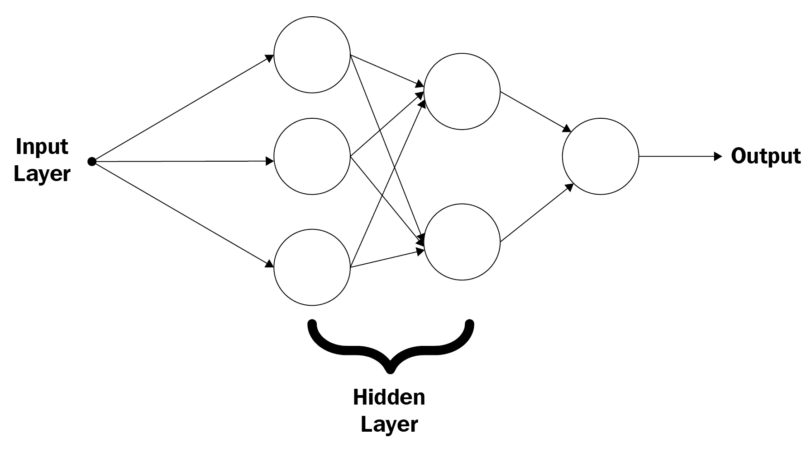

在上图中，我们可以看到一个具有两个隐藏层（在一个神经网络中，一层是一组神经元）且具有单个输出的神经网络。 实际上，这称为两层神经网络。 神经网络包含以下内容：

*   一个输入
*   两个隐藏层，其中第一个隐藏层包含三个神经元，第二个隐藏层包含两个神经元
*   一个单输出

将这些层称为隐藏层并没有更深层次的心理意义，仅因为涉及这些层的神经元既不是输入也不是输出的一部分，所以将它们称为隐藏层。 这里很明显的一件事是，第一个隐藏层之前有一层。 为什么我们不计算该层？ 在神经网络的世界中，初始层和输出不在层堆叠中。 简而言之，如果存在`n`个隐藏层，则它是`n`层神经网络。

初始层（也称为输入层）用于接收神经网络的主要输入。 接收到主要输入后，输入层中存在的神经元会将它们传递给后续隐藏层中存在的下一组神经元。 在这种传播发生之前，神经元将权重添加到输入，并将偏项添加到输入。 这些输入可以来自各个域，例如，输入可以是图像的原始像素，音频信号的频率，单词集合等。 通常，这些输入作为特征向量提供给神经网络。 在这种情况下，输入数据仅具有一个特征。

现在，接下来两层的神经元在做什么？ 这是一个重要的问题。 我们可以考虑将权重和偏差添加到输入中，作为学习的第一层/第一层（也称为决策层）。 初始隐藏层中的神经元重复此过程，但是在将计算的输出发送到下一个隐藏层中存在的神经元之前，它们会将此值与阈值进行比较。 如果满足阈值标准，则仅将输出传播到下一个级别。 整个神经网络学习过程的这一部分与我们之前讨论的生物学过程有很大的相似之处。 这也支持以分层方式学习复杂事物的哲学。

这里提出的一个问题是：“如果不使用任何隐藏层，会发生什么？”。 事实证明，与仅包含输入层和输出的网络相比，在神经网络中添加更多级别的复杂性（通过添加更多层）可以使神经网络以更简洁的方式学习输入数据的基本表示形式。 但是我们需要几层呢？ 我们稍后再讲。

让我们在这里介绍一些数学公式以形式化我们刚刚研究的内容。

我们将输入特征表示为`x`，权重表示为`w`，偏差项表示为`b`。 我们当前尝试剖析的神经网络模型基于以下规则：

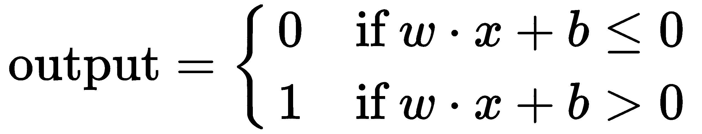

该规则表示，在计算加权输入和偏差的总和之后，如果结果大于 0，则神经元将产生 1；如果结果小于或等于 0，则神经元将简单地产生 0，换句话说，神经元就不会触发。 在具有多个输入功能的情况下，规则保持完全相同，并且规则的多元版本如下所示：

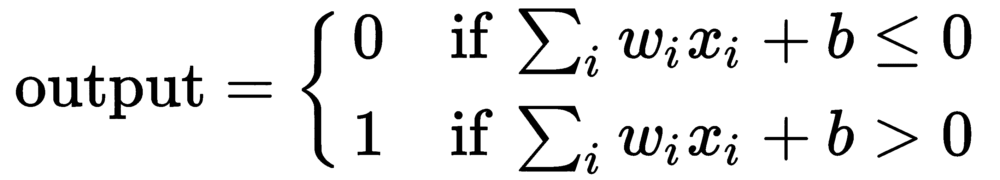

在这里，`i`意味着我们总共具有`i`个输入特征。 可以将以下规则分解为：

*   我们分别处理特征，然后将其乘以权重
*   针对所有单个输入特征完成此过程后，我们将所有加权输入进行求和并求和，最后加上偏差项。

对于网络中的层数，将继续执行前面的过程。 在这种情况下，我们有两个隐藏层，因此一层的输出将被馈送到下一层。

我们刚刚研究的元素是 Frank Rosenblatt 在 1960 年代提出的。 基于某个阈值为输入的加权总和分配 0 或 1 的想法也称为**阶跃函数**。 文献中有许多这样的规则，这些规则称为更新规则。

我们研究的神经元是能够学习线性函数的**线性神经元**。 它们不适合学习本质上是非线性的表示。 实际上，馈送神经网络的几乎所有输入实际上都是非线性的。 在下一部分中，我们将介绍另一种能够捕获数据中可能存在的非线性的神经元。

某些人可能想知道这种 NN 模型是否称为 **MLP**（**多层感知器**）。 好吧，是的。 实际上，罗森布拉特（Rosenblatt）早在 1960 年代就曾提出过这种建议。 那么什么是神经网络？ 我们将在短期内了解答案。

# 非线性神经元的剖析

非线性神经元意味着它能够响应数据中可能存在的非线性。 在这种情况下，非线性本质上意味着对于给定的输入，输出不会以线性方式变化。 看下图：

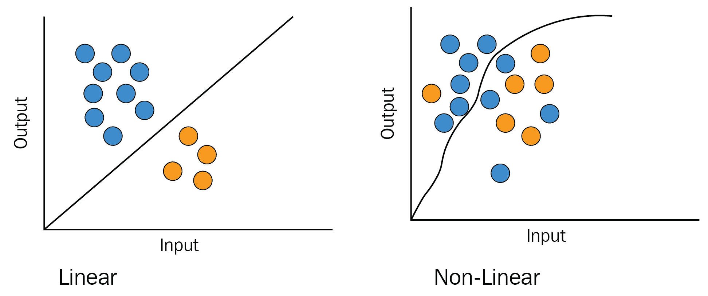

前面的两个图都描述了提供给神经网络的输入与该网络产生的输出之间的关系。 从第一个图很明显，输入数据是线性可分离的，而第二个图告诉我们输入不能线性分离。 在这种情况下，线性神经元将严重失败，因此需要非线性神经元。

在神经网络的训练过程中，可能会出现这样的情况，即偏差和权重值的微小变化可能会以剧烈的方式影响神经网络的输出。 理想情况下，这不应发生。 偏差或权重值的微小变化都应该仅导致输出的微小变化。 使用阶跃函数时，权重和偏差项的变化会在很大程度上影响输出，因此需要阶跃函数以外的其他东西。

神经元的运作背后是一种函数。 在线性神经元的情况下，我们看到其操作是基于阶跃函数的。 我们有一堆能够捕获非线性的函数。 Sigmoid 函数就是这样的函数，使用该函数的神经元通常被称为 Sigmoid 神经元。 与阶跃函数不同，对于 Sigmoid 神经元，将使用以下规则生成输出：


因此，我们最终的更新规则如下：

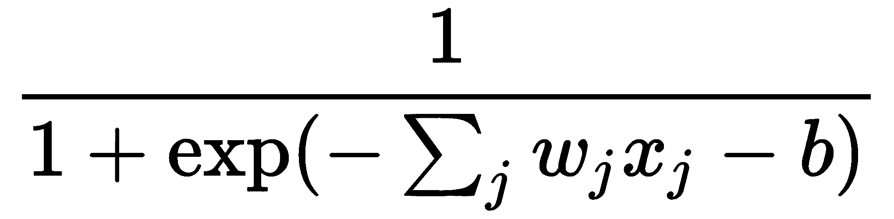

但是，为什么在捕获非线性方面，Sigmoid 函数比阶跃函数好呢？ 让我们在图形中比较它们的表现来了解这一点：

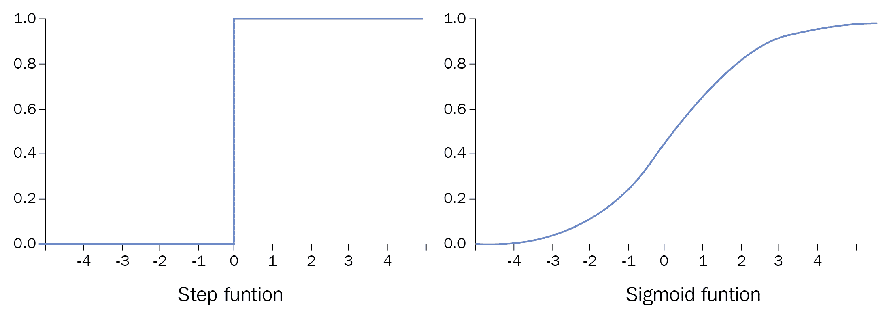

前两个图使我们清楚地了解了两个函数的内在本质。 绝对清楚的是，Sigmoid 函数比阶跃函数对非线性更为敏感。

除 Sigmoid 函数外，以下是一些众所周知的常用函数，这些函数使神经元具有非线性特征：

*   Tanh
*   ReLU
*   泄漏的 ReLU

在文献中，这些函数以及我们刚刚研究的两个函数都称为激活函数。 目前，ReLU 及其变体是迄今为止最成功的激活函数。

我们仍然剩下一些与人工神经网络有关的基本知识。 让我们总结一下到目前为止所学到的内容：

*   神经元及其两种主要类型
*   层数
*   激活函数

我们现在可以在 MLP 和神经网络之间划清界限。 迈克尔·尼尔森（Michael Nielson）在其在线书《神经网络和深度学习》中对此进行了很好的描述：

由于历史原因，这种多层网络有时令人困惑，尽管它们由 Sigmoid 神经元而非感知器组成，但有时也称为*多层感知器*或 *MLP* 。

在本书中，我们将使用神经网络和深度神经网络术语。 现在，我们将继续前进，并进一步了解神经网络的输入和输出层。

# 关于神经网络的输入和输出层的说明

重要的是要了解可以作为神经网络输入的内容。 我们是否将原始图像或原始文本数据馈送到神经网络？ 还是有其他方法可以向神经网络提供输入？ 在本节中，我们将学习计算机是如何真正解释图像的，以显示在处理图像时可以准确地输入神经网络（是的，神经网络在图像处理方面非常出色）。 我们还将学习显示如何向原始数据提供神经网络的方法。 但在此之前，我们需要清楚地了解如何将常规表格数据集作为神经网络的输入。 因为表格数据集无处不在，所以采用 SQL 表，服务器日志等形式。

为此，我们将采用以下玩具数据集：

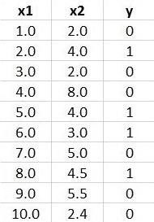

请注意有关此玩具数据集的以下几点：

*   它具有两个预测变量，`x1`和`x2`，这些预测变量通常称为输入特征向量。
*   通常将`x1`和`x2`分配给向量`X`（稍后会详细介绍）。
*   响应变量为`y`。

*   我们有 10 个实例（包含`x1`，`x2`和`y`属性）被分为两个类别，0 和 1。
*   给定`x1`和`x2`，我们的（神经网络）任务是预测`y`，这实际上使这成为分类任务。

当我们说神经网络预测某事时，是指应该学习最能近似某个函数的输入数据的底层表示（我们看到了一段时间前的特征映射看起来像）。

现在，让我们看看如何将这些数据作为神经网络的输入。 由于我们的数据具有两个预测变量（或两个输入向量），因此神经网络的输入层必须包含两个神经元。 我们将使用以下神经网络架构来完成此分类任务：

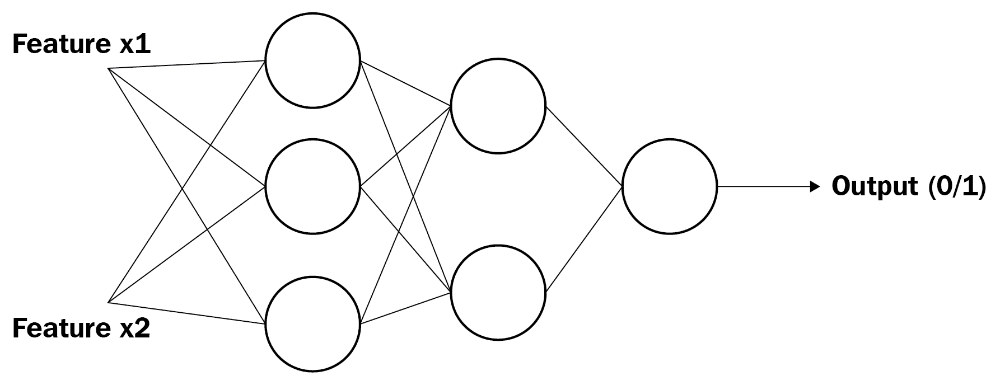

该架构与我们之前看到的架构完全相同，但是在这种情况下，我们添加了一个输入特征向量。 其余的完全一样。

为简单起见，我们没有考虑将数据馈送到网络之前可能需要的数据预处理。 现在，让我们看看如何将数据与权重和偏差项组合，以及如何将激活函数应用于权重和偏差项。

在这种情况下，特征向量和响应变量（即`y`）由神经网络分别解释，响应变量将在网络的训练过程的后期使用。 最重要的是，它用于评估神经网络的表现。 输入数据以矩阵形式组织，如下所示：

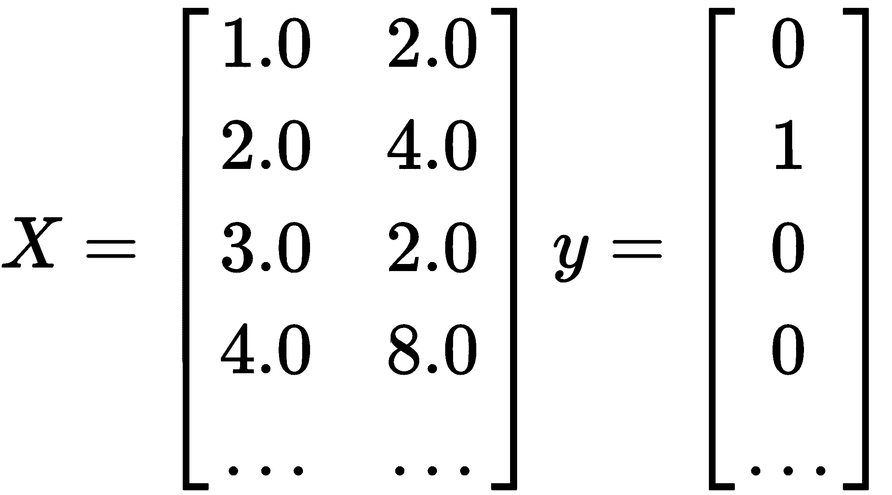

我们现在使用的 NN 架构是全连接架构，这意味着特定层中的所有神经元都与下一层中的所有其他神经元相连。

权重矩阵定义如下：

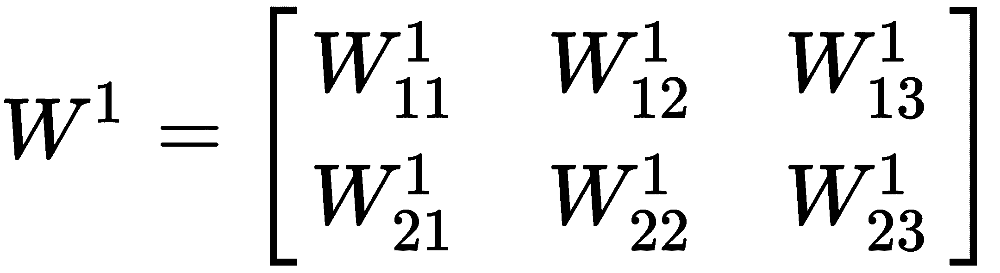

现在，让我们不用担心权重值。 权重矩阵的尺寸解释如下：

*   行数等于特征向量的数量（在我们的示例中为`x1`和`x2`）。
*   列数等于第一个隐藏层中的神经元数。

矩阵中的每个权重值都有一些后缀和上标。 如果我们将权重的一般形式表示为`W[jk]^l`，则应将其解释如下：

*   `l`表示要从其到达权重的层。 在这种情况下，我们刚刚看到的权重矩阵将与输入层相关联。
*   `j`表示神经元在`l`中的位置，而`k`表示神经元在该值传播到的下一层中的位置。

权重通常是随机初始化的，这会向神经网络添加*随机*字符。 让我们为输入层随机初始化一个权重矩阵：

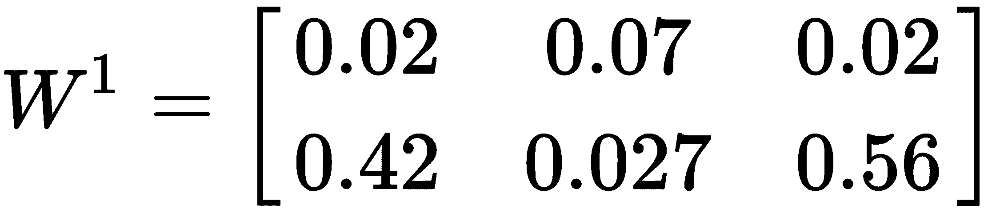

现在，我们计算要提供给 NN 的第一个隐藏层的值。 计算方法如下：

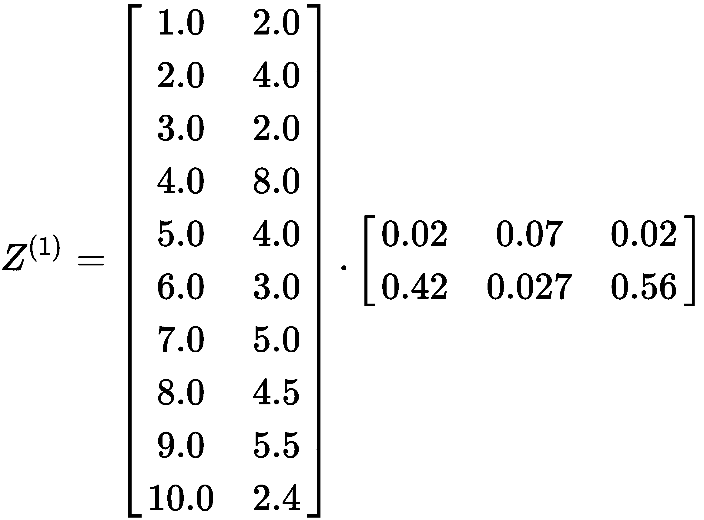

第一个矩阵包含训练集中的所有实例（没有响应变量`y`），第二个矩阵是我们刚刚定义的权重矩阵。 乘法的结果存储在变量`Z^(1)`中（此变量可以命名为任何名称，上标表示它与网络的第一个隐藏层有关）。

在将这些结果发送到下一层将应用激活函数的神经元之前，我们还有一步。 Sigmoid 激活函数和输入层的最终输出如下所示：

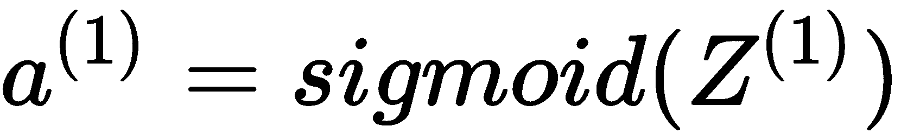

在这里，`Z^(1)`是我们对下一层神经元的最终输出。 注意，将 Sigmoid 函数应用于`Z^(1)`矩阵的每个元素。 最终矩阵的尺寸为`10 X 3`，其中每一行用于训练集中的每个实例，每一列用于第一隐藏层的每个神经元。

我们看到的整个计算没有我们最初谈到的偏差项`b`。 好吧，这只是在图片中添加另一个维度的问题。 在那种情况下，在我们将 sigmoid 函数应用于`Z^(1)`矩阵的每个元素之前，矩阵本身将被更改为以下形式：

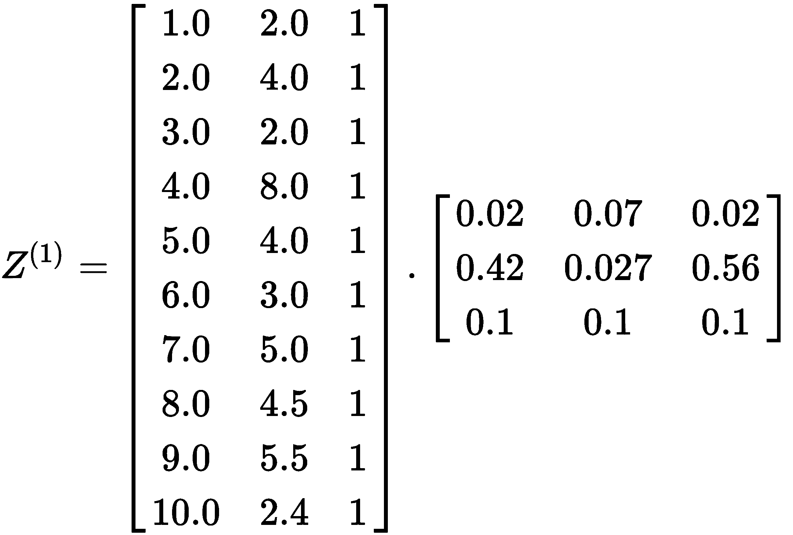

经过这个矩阵乘法处理后，应用了 Sigmoid 函数并将输出发送到下一层的神经元，整个过程对 NN 中的每个隐藏层和输出层重复。 在继续过程中，我们应该从输出层获取`a^(3)`。

Sigmoid 激活函数输出的值范围为 0-1，但是我们正在处理二分类问题，我们只希望 0 或 1 作为 NN 的最终输出。 我们可以稍作调整。 我们可以在 NN 的输出层定义一个阈值-对于小于 0.5 的值，应将其标识为 0 类，而对于大于或等于 0.5 的值应将其标识为 1 类。请注意，这称为前向通过或前向传播。

我们刚刚看到的 NN 被称为前馈网络，在学习过程中没有进一步优化。 可是等等！ 网络甚至学到什么？ 嗯，NN 通常会学习权重和偏差项，以便最终输出尽可能准确。 梯度下降和反向传播会发生这种情况。

# 梯度下降和反向传播

在开始学习在神经网络的背景下梯度下降和反向传播必须做什么之前，让我们学习一个优化问题的含义。

简短地说，优化问题对应于以下内容：

*   最小化成本
*   最大化利润

现在让我们尝试将其映射到神经网络。 如果从前馈神经网络获得输出后，如果发现其表现达不到标准（几乎所有时间都是这种情况），会发生什么情况？ 我们将如何增强 NN 的表现？ 答案是梯度下降和反向传播。

我们将使用这两种技术来优化神经网络的学习过程。 但是，我们要优化什么呢？ 我们将如何最小化或最大化？ 我们需要一种特定类型的成本，我们将尝试将其最小化。

我们将根据函数定义成本。 在为 NN 模型定义成本函数之前，我们必须确定成本函数的参数。 在我们的案例中，权重和偏差是 NN 试图学习以提供给我们准确结果的函数的参数（请参阅本节之前的信息框）。 此外，我们将必须计算网络在训练过程的每个步骤中所造成的损失量。

对于二元分类问题，称为**交叉熵**损失函数的损失函数（对于二元分类问题，称为二元交叉交叉熵损失函数）被广泛使用，我们将使用它。 那么，此函数是什么样的呢？

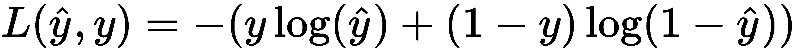

在此，`y`表示给定实例的地面真值或真实标签（记住训练集中的响应变量`y`），`y_hat`表示由 NN 模型。 该函数本质上是凸的，对于凸优化器（例如梯度下降）而言非常理想。

这是我们没有选择一个更简单且不凸的损失函数的原因之一。 （如果您不熟悉凸和非凸等术语，请不要担心。）

我们现在有损失函数。 请记住，这仅是整个数据集的一个实例，而不是我们将要应用梯度下降的函数。 前面的函数将帮助我们定义最终将使用梯度下降进行优化的成本函数。 让我们看看成本函数的样子。

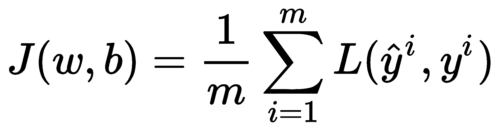

这里，`w`和`b`是网络试图学习的权重和偏差。 字母`m`表示训练实例的数量，在这种情况下为 10。 其余的似乎很熟悉。 让我们把函数的原始形式`L()`放进去，看看`J()`是什么样子：

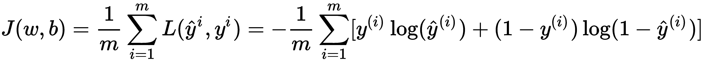

该函数可能看起来有些混乱，因此请放慢速度并确保您了解它。

我们最终可以朝优化过程迈进。 大致而言，梯度下降正在尝试执行以下操作：

*   给我们一个成本函数尽可能最小的点（此点称为最小值）。
*   给我们正确的权重和偏差值，以便成本函数达到该点。

为了可视化，让我们采用一个简单的凸函数：

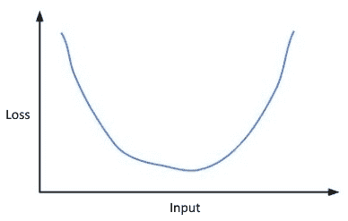

现在，假设我们从一个随机点开始旅程，如下所示：

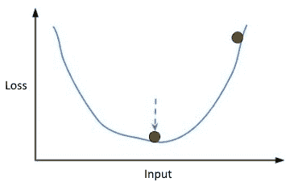

因此，右上角的点就是我们开始的点。 该点（由虚线箭头指示）是我们希望到达的点。 那么，如何通过简单的计算做到这一点呢？

为了达到这一点，使用了以下更新规则：

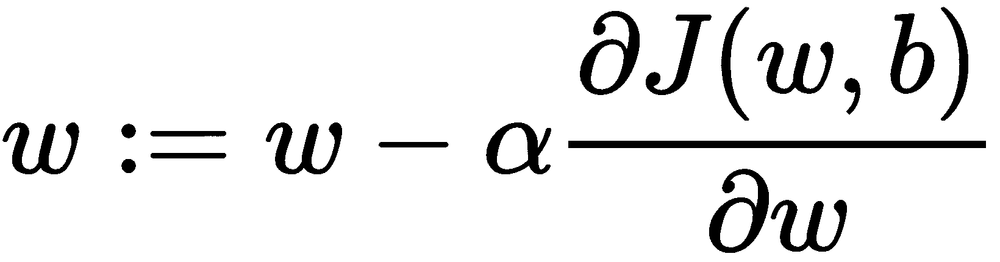

Here, we are taking the partial derivative of *J(w,b)* with respect to the weights. We are taking a partial derivative because *J(w,b)* contains`b`as one of the parameters. 𝝰 is the learning rate that speeds up this process. This update rule is applied multiple times to find the right values of the weights. But what about the bias values? The rule remains exactly the same only the equation is changed:

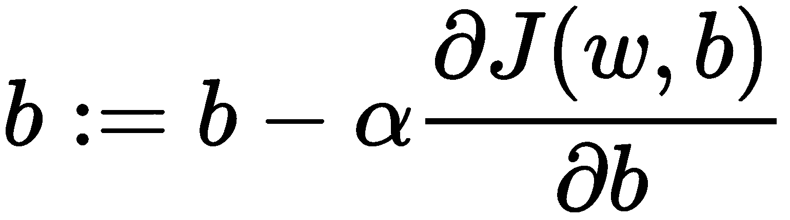

这些权重和偏差的新分配基本上称为*反向传播*，并且它是与*梯度下降*结合完成的。 在计算了权重和偏差的新值之后，重复整个前向传播过程，直到 NN 模型得到很好的概括。 请注意，这些规则仅适用于一个实例，前提是该实例仅具有一项特征。 在包含多个特征的多个实例上执行此操作可能很困难，因此，我们将跳过该部分，但是，有兴趣看到此功能的完整版本的人员可以参考 Andrew Ng 的在线讲座。

我们已经介绍了标准神经网络的必要基本单元，这并不容易。 我们先定义神经元，然后以反向传播（反向传播的讨厌术语）结束。 我们已经奠定了深度神经网络的基础。 读者可能想知道这是否是我们刚刚研究的深度神经网络。 正如 **Andriy Burkov** 所说（摘自他的书《百页机器学习书》）：

深度学习是指训练具有两个以上非输出层的神经网络。 ……术语“深度学习”是指使用现代算法和数学工具包独立于神经网络的深度来训练神经网络。 实际上，使用在输入和输出层之间具有 2-3 层的神经网络可以解决许多业务问题。

在下一部分中，我们将学习深度学习和浅层学习之间的区别。 我们还将研究两种不同类型的神经网络，即卷积神经网络和循环神经网络。

# 不同类型的神经网络

到目前为止，我们已经了解了前馈神经网络的外观，以及如何将反向传播和梯度下降等技术应用于其以优化其训练过程。 我们之前研究的二分类问题似乎过于幼稚且不切实际，不是吗？

嗯，简单的 NN 模型可以解决很多问题。 但是随着问题复杂性的增加，有必要对基本的 NN 模型进行改进。 这些复杂的问题包括对象检测，对象分类，图像标题生成，情感分析，假新闻分类，序列生成，语音翻译等。 对于此类问题，基本的 NN 模型是不够的。 它需要对架构进行一些改进，才能解决这些问题。 在本节中，我们将研究两个最强大且使用最广泛的 NN 模型：卷积神经网络和循环神经网络。 这些当今的神经网络模型是深度学习惊人应用的核心。

# 卷积神经网络

您是否曾经将朋友群组的照片上传到 Facebook？ 如果是，您是否想知道 Facebook 如何在上传完成后自动检测照片中的所有面孔？ 简而言之，答案是**卷积神经网络**（**CNN**）。

前馈网络通常由几个全连接层组成，而 CNN 由几个卷积层以及其他类型的复杂层（包括全连接层）组成。 这些全连接层通常位于最末端，通常用于进行预测。 但是什么样的预测呢？ 在图像处理和计算机视觉环境中，预测任务可以包含许多用例，例如标识提供给网络的图像中存在的对象类型。 但是 CNN 仅适合与图像相关的任务吗？ CNN 是为图像处理任务（例如对象检测，对象分类等）而设计和提出的，但它也已在许多文本处理任务中使用。 我们将在图像处理环境中学习 CNN，因为 CNN 可以在图像处理和计算机视觉领域中发挥作用，因此它是最流行的奇迹。 但是，在继续讨论该主题之前，了解如何用数字表示图像将很有用。

图像包含许多像素和尺寸-`高 x 宽 x 深`。 对于彩色图像，深度尺寸通常为 3，对于灰度图像，深度尺寸通常为 1。让我们对其进行更深入的研究。 考虑下图：


前一幅图像的尺寸为`626 x 675 x 3`，从数值上讲，它不过是一个矩阵。 每个像素代表红色，绿色和蓝色的特定强度（根据 RGB 颜色系统）。 该图像总共包含 422,550 像素（`675 x 626`）。

像素由红色，绿色和蓝色三个值的列表表示。 现在，让我们来看一下像素（对应于 422,550 像素矩阵中的第二十行和第 100 列）的编码形式：

```py
12, 24, 10
```

每个值对应于红色，绿色和蓝色的特定强度。 为了理解 CNN，我们将以较小的灰度图像进行查看。 请记住，灰度图像中的每个像素在 0 到 255 之间，其中 0 对应于黑色，255 对应于白色。

以下是代表灰度图像的像素虚拟矩阵（我们将其称为图像矩阵）：

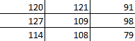

在继续之前，让我们直观地考虑如何训练 CNN 来学习图像的底层表示并使其执行某些任务。 图像具有其固有的特殊属性：图像中包含相似类型信息的像素通常保持彼此靠近。 考虑一张标准人脸的图像：表示头发的像素更暗，并且紧靠图像放置，而表示面部其他部分的像素通常更亮，并且彼此保持非常接近。 强度可能因人而异，但是您明白了。 我们可以使用图像中像素的这种空间关系，并训练 CNN 来检测相似像素以及它们在像素之间创建的边缘，以区分图像中存在的几个区域（在人脸图像中， 头发，眉毛等之间的任意边缘）。 让我们看看如何做到这一点。

CNN 通常包含以下组件：

*   卷积层
*   激活层
*   池化层
*   全连接层

CNN 的核心是一个称为卷积的操作（在计算机视觉和图像处理的文献中也称为交叉关系）。 PyImageSearch 的 Adrian Rosebrock 描述了以下操作：

在深度学习方面，（图像）卷积是两个矩阵的元素乘积，后跟一个和。

这句话告诉我们（图像）卷积运算符是如何工作的。 引用中提到的矩阵是图像矩阵本身和另一个称为核的矩阵。 原始图像矩阵可以高于核矩阵，并且在图像矩阵的左右方向上执行卷积运算。 这是卷积运算的示例，其中涉及前面的伪矩阵和大小为`2 x 2`的核：


核矩阵实际上是网络的权重矩阵，为简单起见，我们暂时忽略偏差项。 还值得注意的是，我们最喜欢的图像过滤器（锐化，模糊等）仅是应用于原始图像的某些卷积输出。 CNN 实际上会学习这些过滤器（核）值，以便它可以最好地捕获图像的空间表示。 这些值可以使用梯度下降和反向传播进一步优化。 下图描述了应用于图像的四个卷积操作：


注意核如何滑动以及如何计算卷积像素。 但是，如果我们这样进行，则会丢失图像的原始尺寸。 这可能会导致信息丢失。 为防止这种情况，我们应用了一种称为填充的技术，并保留了原始图像的尺寸。 有许多填充技术，例如复制填充，零填充，环绕等。 零填充在深度学习中非常流行。 现在，我们将看到如何将零填充应用于原始图像矩阵，从而保留图像的原始尺寸：

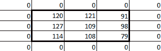

零填充意味着像素值矩阵的所有面将被零填充，如上图所示。

指导网络如何滑动图像矩阵很重要。 这是通过称为跨步的参数来控制的。 跨步的选择取决于数据集，而跨步 2 的正确使用是深度学习的标准做法。 让我们看一下第 1 步与第 2 步的区别：

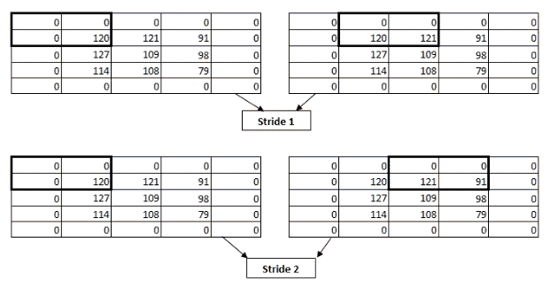

卷积的图像通常如下所示：

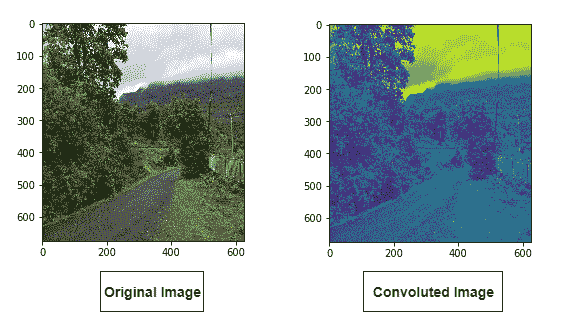

卷积的映像在很大程度上取决于所使用的核。 最终的输出矩阵将传递给激活函数，并且该函数将应用于矩阵的元素。 CNN 中的另一个重要操作是池化，但我们暂时将其跳过。 到目前为止，您应该对 CNN 的工作原理有一个很好的了解，这足以使您继续阅读本书。 如果您想更深入地了解 CNN 的工作原理，请参阅[这个页面](https://www.pyimagesearch.com/2018/04/16/keras-and-convolutional-neural-networks-cnns/)上的博客文章。

# 循环神经网络

**循环神经网络（RNN）**是另一种神经网络，非常擅长 NLP 任务，例如情感分析，序列预测，语音到文本翻译，语言到语言翻译， 等等。 考虑一个例子：打开 Goog​​le，然后开始搜索循环神经网络。 从您开始输入单词的那一刻起，Google 就会开始为您提供建议列表，其中最有可能是完整单词或以您当时键入的字母开头的最常用的短语。 这是序列预测的示例，其中任务是预测给定短语的下一个序列。

让我们再举一个例子：给您一堆英语句子，每个句子包含一个空白。 您的任务是用正确的单词适当地填补空白。 现在，为了做到这一点，您将需要大体上使用先前对英语的了解，并尽可能地利用上下文。 要使用这样的先前遇到的信息，请使用您的内存。 但是神经网络呢？ 传统的神经网络无法执行此操作，因为它们没有任何内存。 这正是 RNN 出现的地方。

我们需要回答的问题是如何赋予神经网络记忆能力？ 一个绝对幼稚的想法是执行以下操作：

*   将特定的序列输入神经元。
*   取得神经元的输出，并将其再次馈送到神经元。

事实证明，这个想法不是那么幼稚，实际上构成了 RNN 的基础。 RNN 的单个层实际上如下所示：

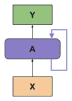

这个循环似乎有点神秘。 您可能已经在考虑循环的每次迭代中发生的情况：

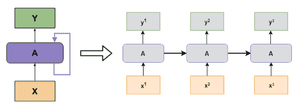

在上图中，展开了 RNN（左图）以显示三个简单的前馈网络。 但是这些展开的网络有什么作用？ 现在让我们找出答案。

让我们考虑序列预测的任务。 为简单起见，我们将研究 RNN 如何学习预测下一个字母来完成一个单词。 例如，如果我们用一组字母`{w, h, a, t}`训练网络，并将顺序提供字母`w, h`和`a`，网络应该能够预测字母应该是`t`，以便产生有意义的单词`what`。 就像我们之前看到的前馈网络一样，`X`在 RNN 项中充当网络的输入向量，该向量也称为网络的词汇表。 在这种情况下，网络词汇为`{w, h, a, t}`。

向网络依次提供字母`w, h`和`a`。 让我们尝试给这些字母指定索引：

*   `w -> (t - 1)`
*   `h -> (t)`
*   `a -> (t + 1)`

这些索引称为时间步长（图中的上标表示 RNN 的展开）。 循环层利用在先前时间步长给出的输入以及在当前时间步长上操作时的特征。 让我们一步一步地了解此循环层如何产生输出。

# 将字母输入网络

在我们看到循环层如何产生输出之前，重要的是要学习如何将字母集提供给网络。 单热编码使我们能够以非常有效的方式执行此操作：

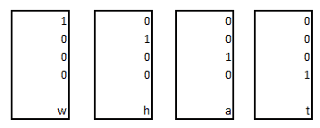

因此，在单热编码中，我们的字母输入向量/词汇量不过是四个`4 x 1`矩阵，每个矩阵表示一个特定的字母。 单热编码是这些任务的标准做法。 该步骤实际上是数据预处理步骤。

# 初始化权重矩阵

当有神经网络时，就有权重。 这是真的吧？ 但是在开始处理 RNN 的权重之前，让我们确切地了解它们的需要位置。

对于 RNN，存在两种不同的权重矩阵-一种用于输入神经元（请记住，我们仅通过神经元提供特征向量），另一种用于循环神经元。 RNN 中的特定状态使用以下两个公式生成：

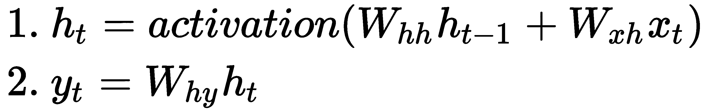

要了解每个项在第一个方程式中的含义，请参考下图（不用担心，我们将转到第二个方程式）：

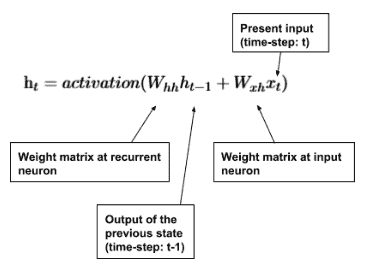

RNN `x[1]`的第一遍是字母`w`。 我们将根据等式`(1)`随机初始化两个权重矩阵。 假设初始化后的矩阵`W[xh]`如下所示：

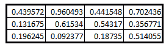

矩阵为`3 x 4`：

*   `x = 3`，因为我们在循环层中有三个循环神经元
*   `h = 4`，因为我们的词汇量是 4

矩阵`W[hh]`是`1×1`矩阵。 让我们将其值为 0.35028053。 我们还在这里介绍偏置项`b`，它也是`1 x 1`矩阵 0.6161462。 在下一步中，我们将把这些值放在一起并确定`h[t]`的值。 （稍后我们将处理第二个方程。）

# 将权重矩阵放在一起

首先确定`W[xh]x[1]`。 `x[1]`是一个`4 x 1`的矩阵，表示我们先前定义的字母`w`。 矩阵乘法的标准规则在这里适用：

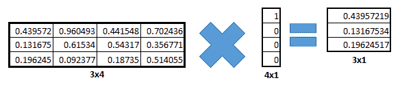

现在我们将计算`W[hh]h[0] + b`项。 我们很快就会看到偏差项的重要性。 由于`w`是我们要馈送到网络的第一个字母，因此它没有任何先前的状态，因此，我们将`h[0]`看作是一个由零组成的`3 x 1`矩阵：

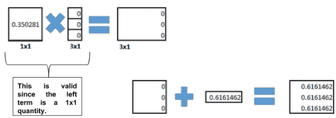

请注意，如果不采用偏差项，我们将得到仅由零组成的矩阵。 现在，我们将根据公式`(1)`将这两个矩阵相加。 加法的结果是一个`3 x 1`的矩阵，并存储在`h[t]`（在这种情况下为`h[1]`）中：

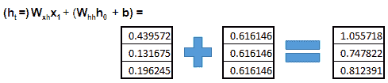

按照公式`(1)`，我们要做的就是将激活函数应用于该矩阵。

# 应用激活函数和最终输出

对于 RNN，`tanh`是激活函数的不错选择。 因此，在应用`tanh`之后，矩阵如下所示：

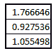

我们得到了`h[t]`的结果。 `ht`充当下一个时间步的`h[t-1]`。 现在，我们将使用公式`(2)`计算`y[t]`的值。 我们将需要另一个随机初始化的权重矩阵`W[hy]`（形状为`4 x 3`）：

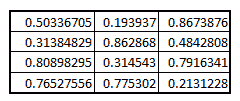

应用第二个方程式后，`y[t]`的值变为`4 x 1`矩阵：

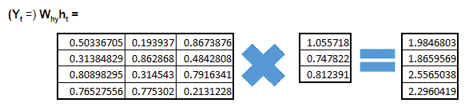

现在，为了预测`w`之后的下一个字母是什么（请记住，我们所有的计算都以字母`w`开始，但我们仍然保留了 RNN）以从给定的词汇表中得出合适的词，我们将 softmax 函数应用于`y[t]`。 这将为词汇表中的每个字母输出一组概率：

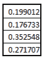

如果有人对学习 softmax 函数的外观感到好奇，可以在[这个页面](http://bit.ly/softmaxfunc)上找到一篇非常有用的文章。

因此，RNN 告诉我们`w`之后的下一个字母更有可能是`a`。 至此，我们完成了 RNN 的初始遍历。 作为练习，您可以使用从此传递中获得的`ht`值，然后将其（以及下一个字母`h`）应用于 RNN 的下一传递，以了解发生了什么。

现在，让我们解决最重要的问题-什么是网络学习？ 同样，权重和偏置！ 您可能已经猜到了下一个句子。 使用反向传播进一步优化了这些权重。 现在，这种反向传播与我们之前看到的有些不同。 此版本的反向传播称为**时间上**的反向传播。 我们不会对此进行学习。 在结束本节之前，让我们总结一下在 RNN 前向传递过程中执行的步骤（在词汇表进行一次热编码之后）：

*   随机初始化权重矩阵。
*   使用公式`(1)`计算`h[t]`。

*   使用公式`(2)`计算`y[t]`。
*   将 softmax 函数应用于`y[t]`，以获取词汇表中每个字母的概率。

很高兴知道，除了 CNN 和 RNN 之外，还有其他类型的神经网络，例如自编码器，生成对抗网络，胶囊网络等。 在前两节中，我们详细了解了两种最强大的神经网络类型。 但是，当我们谈论前沿的深度学习应用时，这些网络是否足以被使用？ 还是我们需要在这些基础上进行更多增强？ 事实证明，尽管这些架构表现良好，但是它们无法扩展，因此需要更复杂的架构。 在下一章中，我们将介绍其中一些专门的架构。

自“第 1 章”，“人工智能和机器学习基础知识揭秘”以来，我们已经涵盖了很多理论。 在接下来的几节中，我们将深入研究一些实际的例子。

# 探索 Jupyter 笔记本

在从事与深度学习相关的项目时，您必须处理大量的各种类型的变量和各种维度的数组。 另外，由于其中包含的数据非常庞大，并且几乎在每个步骤之后都会不断变化，因此我们需要一个工具来帮助我们观察每个步骤所产生的输出，以便我们可以继续进行操作。 Jupyter 笔记本就是这样一种工具。 Jupyter 笔记本以其简单性而闻名，它们对功能和平台的广泛支持目前是开发深度学习解决方案的标准工具。 考虑到一些顶级技术巨头提供了自己版本的工具，例如 Google Colaboratory 和 Microsoft Azure Notebooks，就可以理解其流行的原因。 此外，自 2016 年以来，流行的代码托管网站 GitHub 一直在提供 Jupyter 笔记本的本地渲染。

# 安装 Jupyter 笔记本

让我们从安装 Jupyter 笔记本开始。

# 使用`pip`安装

如果您的系统上已经安装了 Python，则可以从`pip`存储库安装 Jupyter 包，以快速开始使用 Jupyter 笔记本。

对于 Python 3，请使用以下命令：

```py
python3 -m pip install --upgrade pip
python3 -m pip install jupyter
```

对于 Python 2，请使用以下命令：

```py
python -m pip install --upgrade pip
python -m pip install jupyter
```

对于 Mac 用户，如果找不到`pip`安装，则可以下载最新的 Python 版本，该版本随附捆绑了`pip`。

# 使用 Anaconda 安装

虽然可以从`pip`作为单个包安装 Jupyter，但强烈建议您安装 Python 的 Anaconda 发行版，该发行版会自动安装 Python，Jupyter 以及机器学习和数据科学所需的其他几个包。 Anaconda 使处理各种包版本和更新依赖包或依赖包变得非常容易。

首先，从[这里](https://www.anaconda.com/downloads)下载适合您系统和要求的正确 Anaconda 发行版，然后按照网站上给出的相应安装步骤进行操作。

# 验证安装

要检查 Jupyter 是否已正确安装，请在命令提示符（Windows）或终端（Linux/Mac）中运行以下命令：

```py
jupyter notebook
```

您将能够在终端上看到一些日志输出（此后，这是 Windows 上命令提示符和 Linux 或 Mac 上终端的默认项）。 之后，您的默认浏览器将打开，您将被带到浏览器上的链接，该链接类似于下图：


在“文件”选项卡下，提供了一个基本文件管理器，用户可以使用该文件管理器来创建，上载，重命名，删除和移动文件。

“运行”选项卡列出了所有当前正在运行的 Jupyter 笔记本，可以从显示的列表中将其关闭。

“群集”选项卡提供了所有可用的 IPython 群集的概述。 为了使用此功能，您需要为您的 Python 环境安装 IPython Parallel 扩展。

# Jupyter 笔记本

默认情况下，Jupyter 笔记本由`.ipynb`扩展名标识。 在 Jupyter 提供的文件管理器中单击一次此类笔记本的名称后，将显示类似以下的屏幕：

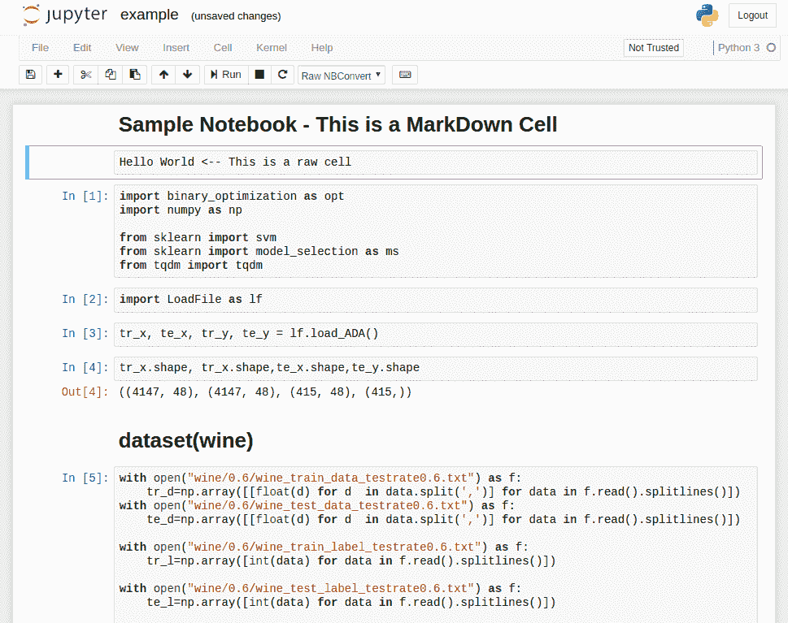

最顶部的部分称为**标头**，您可以在其中看到菜单栏，工具栏和笔记本的标题。 在标题的右侧，您可以看到笔记本在其中执行的环境，并且在运行任何任务时，环境语言名称旁边的白色圆圈变为灰色。

标题下方是笔记本的主体，它由垂直堆叠的单元组成。 笔记本电脑主体中的每个单元格都是代码块，降价单元格或原始单元格。 代码单元可以在其下方附加一个输出单元，用户无法手动对其进行编辑。 这将保留与之关联的代码单元产生的输出。

在 Jupyter 笔记本电脑中，键盘对于单元格的不同**模式**的行为有所不同。因此，这些笔记本电脑称为**模式**。 笔记本电脑电池可以在两种模式下运行：**命令**模式和 **editx** 模式。

当单元处于命令模式时，它具有灰色边框。 在这种模式下，单元格内容无法更改。 在此模式下，键盘的键被映射到多个快捷方式，这些快捷方式可用于修改单元格或整个笔记本。

在命令模式下，如果按键盘上的`Enter`键，则单元格模式将变为编辑模式。 在此模式下，可以更改单元格的内容，并可以调用浏览器中常规文本框中可用的基本键盘快捷方式。

要退出编辑模式，用户可以使用`Esc`键。 要运行特定的单元格，用户必须输入`Shift + Enter`，每种情况下将执行以下操作之一：

*   对于输出单元，应显示渲染的输出。
*   对于原始单元格，输入的原始文本应可见。
*   对于代码单元，将执行该代码，并且如果它产生一些输出，则将创建连接到该代码单元的输出单元，并在此处显示输出。 如果单元格中的代码要求输入，则将出现一个输入字段，并且该单元格的代码执行将暂停，直到提供输入为止。

Jupyter 还允许使用其内置的文本编辑器来操作文本文件和 Python 脚本文件。 也可以从 Jupyter 环境中调用系统终端。

# 设置基于深度学习的云环境

在开始建立基于云的深度学习环境之前，我们可能想知道为什么会需要它，或者基于云的深度学习环境将如何使我们受益。 深度学习需要大量的数学计算。 在神经网络的每一层，都有一个数学矩阵与另一个或几个其他这样的矩阵相乘。 此外，每个数据点本身可以​​是向量，而不是单个实体。 现在，要训练几个重复，仅由于涉及的数学运算数量众多，这种深度学习模型将需要大量时间。

支持 GPU 的机器执行这些操作的效率会更高，因为 GPU 是专门为高速数学计算而制作的，但是支持 GPU 的机器价格昂贵，而且可能并非所有人都能负担得起。 此外，考虑到多个开发人员在工作环境中使用同一个软件，为团队中的所有开发人员购买支持 GPU 的计算机可能是一个非常昂贵的选择。 由于这些原因，具有 GPU 功能的云计算环境的想法具有很强的吸引力。

如今，公司越来越倾向于在其开发团队中使用支持 GPU 的云环境，这可以导致为所有开发人员创建一个通用环境，并促进高速计算。

# 设置 AWS EC2 GPU 深度学习环境

在本部分中，我们将学习如何在 AWS 上设置深度学习特定实例。 在开始使用 AWS 之前，您需要在 AWS 控制台上创建一个帐户。 为此，请执行以下步骤：

1.  访问[这里](https://console.aws.amazon.com)，您将看到一个登录/注册屏幕。
2.  如果您还没有 AWS 账户，请单击`Create a new AWS account`，然后按照以下步骤创建一个 AWS 账户，这可能需要您输入借记卡/信用卡详细信息才能为您的账户计费。
3.  登录到您的帐户后，在仪表板上，单击“所有服务”部分中的 EC2，如以下屏幕截图所示：

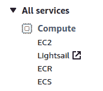

进入 AWS 控制台内的 EC2 管理页面后，您将需要完成以下各节中的步骤，以创建满足您的深度学习需求的实例。

# 步骤 1：创建启用了 EC2 GPU 的实例

首先，选择 Ubuntu 16.04 或 18.04 LTS AMI：


然后，选择启用 GPU 的实例配置。 `g2.2xlarge`是入门深度学习环境的不错选择：

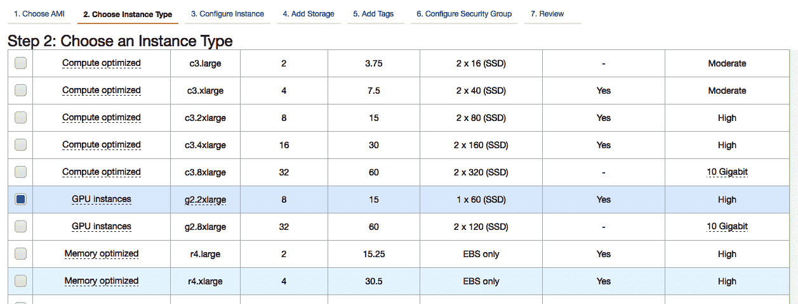

接下来，配置所需的实例设置或将其保留为默认设置，然后继续存储步骤。 在此，建议的卷大小为 30 GB。 然后，您可以继续使用默认选项启动实例。

为您的实例分配一个 EC2 密钥对，以便您可以从系统通过 SSH 访问实例的终端。 如果将密钥对命名为`abc`，则名为`abc.pem`的文件将自动下载到浏览器的默认下载位置。

# 步骤 2：使用 SSH 进入您的 EC2 实例

打开系统上的终端，然后使用`cd`导航到`abc.pem`文件存储的目录。

如果您不熟悉`cd`命令，请考虑一种情况，其中您位于名为`Folder1`的文件夹中，该文件夹包含以下内容：

```py
Folder1 /
 - Folder2
 - Folder3
 - File1.jpg
 - File2.jpg
```

要访问名为`Folder2`的文件夹内的任何文件，您必须将工作目录更改为该文件夹。 为此，可以使用`cd`命令的以下示例：

```py
cd Folder2
```

请注意，仅当您已经在`Folder1`中时，此命令才起作用。可以通过在系统上的任何位置使用`cd`命令类似的方式来访问此命令。

您可以使用以下命令来了解有关 Linux 系统上任何命令用法的更多信息：

```py
man <command>
```

例如，您可以使用以下命令：

```py
man cd
```

现在，通过输入以下命令，使用密钥文件设置 SSH 所需的权限：

```py
$ chmod 400 abc.pem
```

现在，要通过 SSH 连接到您的实例，您将需要其公共 IP 或实例公共 DNS。 例如，如果公用 IP 为`1.2.3.4`，则使用以下命令：

```py
$ ssh -i abc.pem ubuntu@1.2.3.4
```

可以在 EC2 管理页面中 AWS 控制台上正在运行的实例列表下方的详细信息面板上找到 AWS 实例的公共 IP。

# 步骤 3：在 GPU 实例上安装 CUDA 驱动

首先，更新/安装 NVIDIA 图形驱动：

```py
$ sudo add-apt-repository ppa:graphics-drivers/ppa -y
$ sudo apt-get update
$ sudo apt-get install -y nvidia-xxx nvidia-settings
```

在这里，`xxx`可以替换为实例上安装的图形硬件版本，该版本可以在实例详细信息中找到。

接下来，下载 CUDA deb 文件（此代码为撰写本文时的最新版本，自 2019 年 1 月起）：

```py
$ wget https://developer.download.nvidia.com/compute/cuda/10.0/secure/Prod/local_installers/cuda-repo-ubuntu1804-10-0-local-10.0.130-410.48_1.0-1_amd64.deb
```

然后，继续执行以下命令：

```py
$ sudo dpkg -i cuda-repo-ubuntu1804-10-0-local-10.0.130-410.48_1.0-1_amd64.deb
$ sudo apt-key add /var/cuda-repo-<version>/7fa2af80.pub
$ sudo apt-get update
$ sudo apt-get install -y cuda nvidia-cuda-toolkit
```

要验证是否已成功安装所有内容，请运行以下命令：

```py
$ nvidia-smi
$ nvcc -version
```

如果两个命令的输出都没有任何警告或错误，则说明安装成功。

# 步骤 4：安装 Python 的 Anaconda 发行版

首先，下载 Anaconda 安装程序脚本：

```py
$ wget https://repo.continuum.io/archive/Anaconda3-2018.12-Linux-x86_64.sh
```

接下来，将脚本设置为可执行文件：

```py
$ chmod +x Anaconda*.sh
```

然后，运行安装脚本：

```py
$ ./Anaconda3-2018.12-Linux-x86_64.sh
```

安装程序将询问几个选项。 要验证安装是否成功，请使用以下命令：

```py
$ python3
```

Python3 REPL 带有一个标语，反映了您实例上安装的 Anaconda 发行版，并加载到终端中。

# 步骤 5：运行 Jupyter

使用以下命令在实例上启动 Jupyter 笔记本服务器：

```py
$ jupyter notebook
```

终端上的输出将在打开时包含一个 URL，您可以使用该 URL 访问在 EC2 GPU 实例上运行的 Jupyter 笔记本。

# 在 Crestle 上进行深度学习

当您需要对系统进行更好的控制时（例如，当您希望第三方应用与您的深度学习模型一起使用时），可以使用自定义的深度学习环境，而在其他时候，您可能没有这种需求，并且您只会对以快速且协作的方式在云上执行深度学习感兴趣。 在这种情况下，支付 AWS `g2.2xlarge`实例的成本将比仅为计算时间或所用 GPU 时间支付的费用高得多。

Crestle 是一项服务，以非常实惠的价格在线提供支持 GPU 的 Jupyter 笔记本电脑。 要开始使用 Crestle，请执行以下步骤：

1.  登录到 [www.crestle.com](http://www.crestle.com) 。
2.  单击“注册”，并填写显示的注册表单。
3.  检查您的电子邮件以获取帐户确认链接。 激活您的帐户并登录。
4.  您将被带到仪表板，在该仪表板中将找到一个读取“启动 Jupyter”的按钮。 您可以选择使用 GPU 或使其保持禁用状态。 单击“启动 Jupyter”按钮，启用 GPU 选项。

您将看到在云上运行并具有 GPU 支持的 Jupyter 环境。 虽然价格会随着时间的流逝而变化，但它是截至 2020 年 1 月互联网上最实惠的解决方案之一。

# 其他深度学习环境

除了上述在云上执行启用 GPU 的深度学习的方式之外，您还可以在某些情况下选择使用其他平台。

Google 合作实验室是一项免费的 Jupyter 笔记本服务，可通过[这里](https://colab.research.google.com)访问。 协作型笔记本存储在用户的 Google 云端硬盘上，因此存储限制为 15 GB。 可以在 Google 云端硬盘上存储大型数据集，并借助 Google 云端硬盘 Python API 将其包含在项目中。 默认情况下，GPU 在 Colaboratory 上处于禁用状态，必须手动打开。

Kaggle 是又一个专门用于进行数据科学竞赛的平台。 它提供了一个类似于 Jupyter 笔记本的环境，称为**内核**。 每个内核都提供了大量的 RAM 和免费的 GPU 功能，但是，Kaggle 的存储限制比 Google Colaboratory 上的存储限制更为严格，因此，当计算密集但要使用的数据量较大时，这是一个有效的选择。 输出不是很大。

# 探索 NumPy 和 Pandas

NumPy 和 pandas 是几乎所有可用 Python 语言提供的与数据科学相关的库的骨干。 虽然 Pandas 构建在 NumPy 之上，但 NumPy 本身就是 Python 围绕高性能 C 代码的包装，以促进 Python 中纯数学形式所能提供的卓越数学计算。

几乎所有以某种方式用 Python 开发的深度学习软件都依赖 NumPy 和 pandas。 因此，重要的是要充分了解两个库及其可以提供的功能。

# NumPy

NumPy 是**数值 Python** 的首字母缩写。 原始 Python 缺少数组的实现，数组是用于开发机器学习模型的数学矩阵的紧密相似形式。 NumPy 为 Python 提供了对多维数组和高性能计算功能的支持。 可以使用以下`import`语句将其包含在任何 Python 代码中：

```py
import numpy as np
```

`np`是导入 NumPy 的常用约定。

# NumPy 数组

在 NumPy 中有几种创建数组的方法。 以下是一些值得注意的：

*   `np.array`：要将 Python 列表转换为 NumPy 数组：

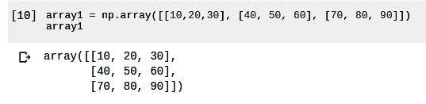

*   `np.ones`或`np.zeros`：要创建全 1 或全 0 的 NumPy 数组，请执行以下操作：

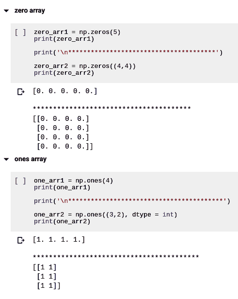

*   `np.random.rand`：要生成一个随机数数组：

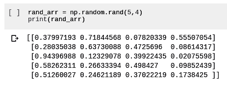

*   `np.eye`：要生成给定方阵尺寸的单位矩阵：

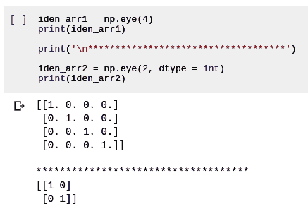

现在让我们看一下基本的 NumPy 数组操作。

# NumPy 数组的基本操作

NumPy 数组是数学矩阵的 Python 类似物，因此它们支持所有基本类型的算术运算，例如加法，减法，除法和乘法。

让我们声明两个 NumPy 数组，并将它们存储为`array1`和`array2`：

```py
array1 = np.array([[10,20,30], [40, 50, 60], [70, 80, 90]])
array2 = np.array([[90, 80, 70], [60, 50, 40], [30, 20, 10]])
```

现在让我们看一下这些数组上每个算术运算的一些示例：

*   **加法**：


*   **减法**：

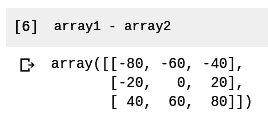

*   **乘法**：

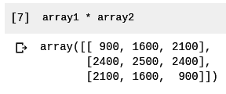

*   **除法**：

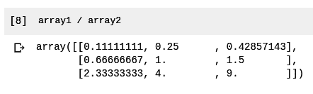

现在让我们将 NumPy 数组与 Python 列表进行比较。

# NumPy 数组与 Python 列表

现在让我们看看 NumPy 数组如何提供优于 Python 列表的优势。

# 多个行和列上的数组切片

虽然无法在 Python 中对列表列表进行切片，从而无法在列表列表中选择特定数量的行和列，但是 NumPy 数组切片根据以下语法工作：

`Array [ rowStartIndex : rowEndIndex, columnStartIndex : columnEndIndex ]`

这是一个例子：

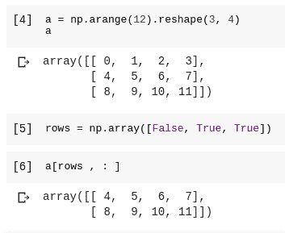

在前面的示例中，我们能够在 NumPy 数组`a`中选择两行以及这些行的所有元素。

# 切片赋值

虽然无法将值分配给 Python 列表切片，但 NumPy 允许将值分配给 NumPy 数组。 例如，要将 4 分配给 NumPy 一维数组的第三到第五个元素，我们可以使用以下代码：

```py
arr[2:5] = 4
```

接下来，我们将看 Pandas。

# Pandas

pandas 建立在 NumPy 之上，是使用 Python 进行数据科学使用最广泛的库之一。 它有助于实现高性能的数据结构和数据分析方法。 Pandas 提供了一个称为`DataFrame`的内存中二维表对象，该对象又由称为数组的一维，类似数组的结构组成。

Pandas 中的每个`DataFrame`都采用类似电子表格的表格的形式，带有行标签和列标题。 可以执行基于行或基于列的操作，或同时执行这两个操作。 Pandas 与 matplotlib 紧密集成，可提供几种直观的数据可视化效果，在进行演示或探索性数据分析过程中通常非常有用。

要将 Pandas 导入到 Python 项目中，请使用以下代码行：

```py
import pandas as pd
```

在这里，`pd`是导入 Pandas 的通用名称。

Pandas 提供以下数据结构：

*   `Series`：一维数组或向量，类似于表中的列
*   `DataFrames`：二维表，带有表标题和行标签
*   `Panel`：`DataFrames`的字典，很像一个 MySQL 数据库，其中包含多个表

可以使用`pd.Series( )`方法创建一个 Pandas 序列，而可以使用`pd.DataFrame( )`方法创建一个`DataFrame`-例如，在下面的代码中，我们使用多个序列对象创建一个 Pandas`DataFrame`对象：

```py
import pandas as pd

employees = pd.DataFrame({ "weight": pd.Series([60, 80, 100],index=["Ram", "Sam", "Max"]),"dob": pd.Series([1990, 1970, 1991], index=["Ram", "Max", "Sam"], name="year"),"hobby": pd.Series(["Reading", "Singing"], index=["Ram", "Max"])})

employees
```

前面代码的输出如下：

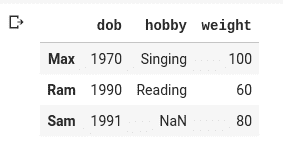

Pandas`DataFrame`可用的一些最重要的方法如下：

*   `head(n)`或`tail(n)`：要在数据帧的`n`行中显示顶部或底部。
*   `info( )`：显示有关`DataFrame`的所有列，维度和数据类型的信息。
*   `describe( )`：显示有关`DataFrame`中每个列的便捷汇总和统计信息。 非数字的列将被省略。

# 总结

在本章中，我们介绍了许多不同的内容。 我们从学习神经网络的基础开始，然后逐步进行。 我们了解了当今使用的两种最强大的神经网络类型-CNN 和 RNN-并且还从较高的层次上了解了它们，但没有跳过它们的基本单元。 我们了解到，随着神经网络复杂性的增加，它需要大量的计算能力，而哪些标准计算机可能无法满足我们的需求，我们看到了如何通过使用两个不同的供应商（AWS 和 。 我们探索了 Jupyter 笔记本，这是用于执行深度学习任务的强大工具。 我们了解了两个非常流行的 Python 库（NumPy 和 pandas）的用法。 当执行深度学习任务时，这两个库都被广泛使用。

在下一章中，我们将构建应用并集成深度学习以使其智能执行。 但是在执行此操作之前，对我们来说重要的是要了解本章介绍的基础知识。 我们现在可以进入下一章了。