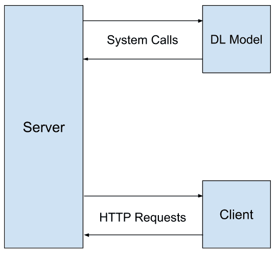
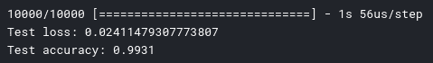
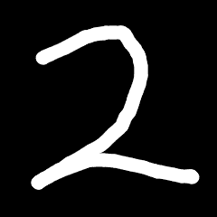
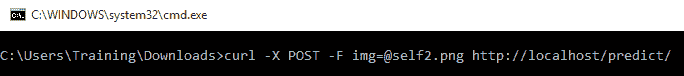
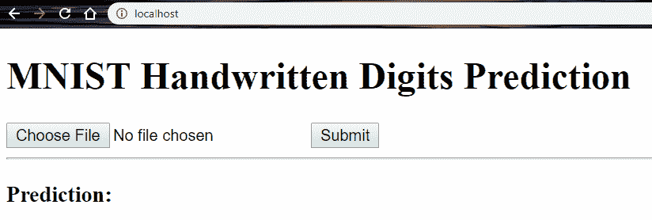
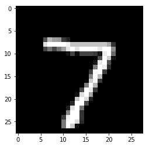

# 三、创建您的第一个深度学习 Web 应用

在对神经网络及其在实际项目中使用的设置有了了解之后，自然而然的下一步就是开发基于 Web 的深度学习应用。 本章致力于创建一个完整的 Web 应用，尽管它是一个非常简单的应用，但它以一种非常简单的方式演示了如何完成应用中深度学习的集成。

本章将介绍将在本书中使用的几个术语，因此，即使对于已经对深度学习 Web 应用有基本了解的您也可以阅读，这是一个推荐读物，以便您能够理解以后各章中使用的术语。 。 我们将从构建深度学习 Web 应用开始，并学习如何理解数据集。 然后，我们将使用 Python 实现一个简单的神经网络，并创建一个 Flask API 以与服务器端 Python 一起使用。

本章将讨论以下主题：

*   构建深度学习 Web 应用
*   了解数据集
*   使用 Python 实现简单的神经网络
*   创建与服务器端 Python 一起使用的 Flask API
*   在 Flask 中使用 cURL 和 Web 客户端
*   改善深度学习后端

# 技术要求

您可以通过[这里](https://github.com/PacktPublishing/Hands-On-Python-Deep-Learning-for-Web/tree/master/Chapter3)访问本章中使用的代码。

对于本章，您将需要以下内容：

*   Python 3.6+
*   Flask 1.1.0+
*   TensorFlow 2.0+

# 构建深度学习 Web 应用

解决拼图游戏时，重要的是要使零件合适，而不是将它们强迫在一起。 同样，在开发软件解决方案时，解决方案的各个部分必须无缝地协同工作，并且它们之间的交互必须易于理解。 好的软件需要适当的软件计划。 因此，为软件的长期使用和将来的维护提供坚实的软件结构至关重要。

在开始创建第一个可在 Web 上使用的深度学习应用之前，我们必须画出解决方案的蓝图，同时牢记我们希望解决的问题以及针对这些问题的解决方案。 这很像我们在网站开发过程中计划认证系统或将表单值从一页传递到另一页的方式。

通用的深度学习 Web 解决方案将需要以下组件：

*   可以存储数据并响应查询的服务器
*   一个可以使用存储的数据并对其进行处理以生成基于深度学习的查询响应的系统
*   客户端可以将数据发送到服务器进行存储，使用新数据发送查询，最后在查询深度学习系统后接受并使用服务器发送的响应

让我们尝试使用图表来可视化此结构。

# 通用深度学习 Web 应用的结构图

下图描述了 Web 客户端，Web 服务器和深度学习模型之间的交互：



我们将创建三个软件部分-客户端，服务器和深度学习模型-它们将一起工作。 为此，客户端将向服务器发出 HTTP 请求，作为回报，服务器将产生从经过单独训练的深度学习模型中获取的输出。 该模型可能会或可能不会在服务器上响应客户端发出的 HTTP 请求的文件中执行。 在大多数情况下，深度学习模型与处理 HTTP 请求的文件分开。

在本章介绍的示例中，我们将在单独的文件中提供服务器，客户端和深度学习模型。 我们的客户端将向服务器发送简单的 HTTP 请求，例如页面加载请求或 URL 的`GET`请求，这些请求将基于传递的查询从深度学习模型中产生输出。 但是，客户端通过 REST API 与服务器通信是非常常见的做法。

现在，让我们继续了解应用将要处理的数据集。

# 了解数据集

至关重要的是，我们必须正确理解我们正在处理的数据集，以便以最有效的代码在执行时间和空间方面获得最佳结果。 当使用带有图像的神经网络时，我们将在此处使用的数据集可能是最受欢迎的数据集-手写数字的 MNIST 数据库。

# MNIST 手写数字数据集

该数据集由 Yann LeCun，Corinna Cortes 和 Christopher J.C. Burges 组成的团队创建。 它是手写数字图像的大集合，其中包含 60,000 个训练样本和 10,000 个测试样本。 该数据集可从[这里](http://yann.lecun.com/exdb/mnist/)公开下载，其中以四个`.gz`压缩文件的形式存在。

四个文件如下：

*   `train-images-idx3-ubyte.gz`：训练集图像。 这些图像将用于训练神经网络分类器。
*   `train-labels-idx1-ubyte.gz`：训练集标签。 训练集中的每个图像都将具有与其关联的标签，该标签是该图像中可见的相应数字。
*   `t10k-images-idx3-ubyte.gz`：测试仪图像。 我们将使用这些图像来测试我们的神经网络预测准确率。
*   `t10k-labels-idx1-ubyte.gz`：测试集中图像的标签。 当我们的神经网络对测试集进行预测时，我们会将其与这些值进行比较以检查结果。

此数据集中存储的图像由于其自定义格式而无法直接用于查看。 期望数据集上的开发人员为图像创建自己的简单查看器。 完成此操作后，您将能够看到图像，如下所示：


让我们更深入地讨论图像。 如您所见，它们在两个轴上都超过 25 个像素标记。 确切地说，图像都是`28 x 28`像素的形式。 现在，由于图像是灰度图像，因此可以将它们存储在`28 x 28`的单层矩阵中。 因此，我们共有 784 个值，范围从 0 到 1，其中 0 表示一个完全暗的像素，而 1 表示一个白色像素。 该范围内的任何东西都是黑色阴影。 在 MNIST 数据集中，这些图像以 784 个浮点数的展平数组形式出现。 为了查看这些图像，您需要将一维数组转换为`28 x 28`形状的二维数组，然后使用任何自行开发或公共可用的工具（例如 Matplotlib 或 Pillow 库）绘制图像。

让我们在接下来的部分中讨论这种方法。

# 探索数据集

让我们从 MNIST 数据集网页上下载所有四个文件开始，这些文件可从[这里](http://yann.lecun.com/exdb/mnist)获得。 下载后，解压缩所有文件，您应该拥有与以下列表中的名称相似的文件夹：

*   `train-images.idx3-ubyte`
*   `train-labels.idx1-ubyte`
*   `t10k-images.idx3-ubyte`
*   `t10k-labels.idx1-ubyte`

将这些文件保存在您的工作目录中。 现在，我们将创建一个 Jupyter 笔记本，对提取的数据集文件执行**探索性数据分析**（**EDA**）。

在浏览器中打开 Jupyter 笔记本环境，然后创建一个新的 Python 笔记本。 让我们从导入必要的模块开始：

```py
import numpy as np
import matplotlib.pyplot as plt
```

前几行将`numpy`模块和`matplotlib.pyplot`导入到项目中。 `numpy`模块提供了 Python 中的高性能数学函数，而`matplotlib.pyplot`模块提供了用于绘制和可视化图形和图像的简单界面。 为了在 Jupyter 笔记本中查看此库的所有输出，请添加以下代码行：

```py
%matplotlib inline
```

如果您使用的是 Windows，则要提取`.gz`文件，可以使用 7-zip 软件，它是一款出色的压缩/解压缩工具，可以从[这里](https://www.7-zip.org)免费下载。

# 创建读取图像文件的函数

如前所述，无法直接查看下载的图像文件中的图像。 因此，我们现在将在 Python 中创建一个函数，`matplotlib`模块将可以使用该函数来显示文件中的图像：

```py
def loadImageFile(fileimage):
  f = open(fileimage, "rb")

  f.read(16)
  pixels = 28*28
  images_arr = []

  while True:
    try:
      img = []
      for j in range(pixels):
        pix = ord(f.read(1))
        img.append(pix / 255)
      images_arr.append(img)
    except:
      break

  f.close()
  image_sets = np.array(images_arr)
  return image_sets

```

前面的`loadImageFile`函数采用单个参数，该参数是包含图像的文件的名称。 在下载的文件文件夹中，我们有两个可用的此类文件：`train-images-idx3-ubyte`和`t10k-images-idx3-ubyte`。 先前函数的输出是`numpy`图像数组。 我们可以将结果存储在 Python 变量中，如下所示：

```py
test_images = loadImageFile("t10k-images-idx3-ubyte")
```

现在，要查看包含`numpy`图像数组的变量中的图像，我们可以定义另一个函数，该函数采用单个图像的 784 个浮点数的像素数组并将其绘制为单个图像。 该函数可以如下所示定义：

```py
def gen_image(arr):
 two_d = (np.reshape(arr, (28, 28)) * 255).astype(np.uint8)
 plt.imshow(two_d, interpolation='nearest', cmap='gray')
 plt.show()
 return
```

现在，假设我们要显示第一个测试图像； 因为我们已经将`numpy`图像数组存储在`test_images`变量中，所以我们可以运行以下代码：

```py
gen_image(test_images[0])
```

我们可以看到以下输出：


现在我们已经可以查看图像了，我们可以继续构建一个函数，该函数将允许我们从标签中提取相应的数字。

# 创建读取标签文件的函数

MNIST 数据集中有两个可用的标签文件：`train-labels-idx1-ubyte`和`t10k-labels-idx1-ubyte`。 要查看这些文件，我们可以使用以下函数，该函数将文件名的输入作为参数并生成一个由单热编码的标签组成的数组：

```py
def loadLabelFile(filelabel):
  f = open(filelabel, "rb")

  f.read(8)

  labels_arr = []

  while True:
    row = [0 for x in range(10)]
    try:
      label = ord(f.read(1))
      row[label] = 1
      labels_arr.append(row)
    except:
      break

  f.close()
  label_sets = np.array(labels_arr)
  return label_sets
```

此函数以单热点编码返回`numpy`标签数组，数据集中样本数量的维数乘以 10。为了观察一热点编码的本质，我们观察一个条目。 运行以下代码，该代码实际上从测试集中的第一个样本打印出单热编码的标签集：

```py
test_labels = loadLabelFile("t10k-labels-idx1-ubyte")
print(test_labels[0])
```

我们得到以下输出：

```py
[0 0 0 0 0 0 0 1 0 0]
```

我们可以注意到这一点，因为在第七个索引处的数字是`1`，所以测试数据集中第一张图像的标签是`7`。

# 数据集摘要

在对可用数据集进行了非常简洁的探索之后，我们可以得出以下结果。

训练数据集包含 60,000 张图像，尺寸为`60,000 x 784`，其中每张图像为`28 x 28`像素。 样本在数字之间的分布如下：

| **序号** | **样本数** | **序号** | **样本数** |
| --- | --- | --- | --- |
| 0 | 5,923 | 5 | 5,421 |
| 1 | 6,742 | 6 | 5,918 |
| 2 | 5,958 | 7 | 6,265 |
| 3 | 6,131 | 8 | 5,851 |
| 4 | 5,842 | 9 | 5,949 |

观察到`5`位数比`1`位数少。 因此，未经良好训练的模型很可能在识别数字`5`时出错。

标签数量的摘要告诉我们，所有 60,000 个样本都具有其相应的标签，并且没有一个标签缺失。

同样，在测试数据集上，我们有 10,000 个图像和标签，样本数量的分布如下：

| **序号** | **样本数** | **序号** | **样本数** |
| --- | --- | --- | --- |
| 0 | 980 | 5 | 892 |
| 1 | 1,135 | 6 | 958 |
| 2 | 1,032 | 7 | 1,028 |
| 3 | 1,010 | 8 | 974 |
| 4 | 982 | 9 | 1,009 |

测试数据集中的样本数量分布相当均匀。

# 使用 Python 实现简单的神经网络

在进行了非常基本的数据分析之后，我们可以继续使用 Python 编写我们的第一个神经网络。 在继续之前，您可以在“第 2 章”中复习神经网络的概念。 现在，我们将创建一个**卷积神经网络**（**CNN**），该网络将预测手写数字标签。

我们首先创建一个新的 Jupyter 笔记本。 您可以将其命名为`Model.ipynb`以作为约定。 该笔记本将用于开发深度学习模型的**转储**版本，随后将其放入将生成预测的脚本中。

# 导入必要的模块

`Model.ipynb`所需的模块如下导入：

```py
import numpy as np
import keras
from keras.models import Sequential
from keras.layers import Dense, Dropout, Flatten, Activation
from keras.layers import Conv2D, MaxPooling2D
from keras import backend as K
from keras.layers.normalization import BatchNormalization
```

需要`keras`模块才能通过 TensorFlow 后端快速实现高性能神经网络。 我们已经在前面的章节中讨论过 Keras。 要安装 Keras，可以使用以下命令：

```py
pip3 install keras 
```

上面的命令将安装 Keras。

# 复用我们的函数来加载图像和标签文件

还记得我们在探索数据集期间创建的`loadImageFile`和`loadLabelFile`函数吗？ 我们将再次需要它们，因此将这些相同的函数复制到此笔记本中。

它们一起为每个函数生成两个代码单元：

*   `loadImageFile()`方法
*   `loadLabelFile()`方法

在新的代码单元中，我们创建`loadImageFile()`函数：

```py
def loadImageFile(fileimage):
  f = open(fileimage, "rb")

  f.read(16)
  pixels = 28*28
  images_arr = []

  while True:
    try:
      img = []
      for j in range(pixels):
        pix = ord(f.read(1))
        img.append(pix / 255)
      images_arr.append(img)
    except:
      break

  f.close()
  image_sets = np.array(images_arr)
  return image_sets
```

在另一个新的代码单元中，创建了`loadLabelFile()`函数：

```py
def loadLabelFile(filelabel):
  f = open(filelabel, "rb")
  f.read(8)

  labels_arr = []

  while True:
    row = [0 for x in range(10)]
    try:
      label = ord(f.read(1))
      row[label] = 1
      labels_arr.append(row)
    except:
      break

  f.close()
  label_sets = np.array(labels_arr)
  return label_sets
```

然后，我们可以使用以下代码行以`numpy`数组的形式导入图像和标签文件：

```py
train_images = loadImageFile("train-images-idx3-ubyte")
train_labels = loadLabelFile("train-labels-idx1-ubyte")

test_images = loadImageFile("t10k-images-dx3-ubyte")
test_labels = loadLabelFile("t10k-labels-idx1-ubyte")
```

这将创建`train_images`，`train_labels`，`test_images`和`test_labels` NumPy 数组。 我们可以观察它们的形状，并获得`train_images`的以下输出：

```py
(60000, 784)
```

接下来，我们将学习如何重塑数组以进行 Keras 处理。

# 为使用 Keras 而重塑数组

图像数组的当前形状不适合 Keras。 我们必须将图像数组分别转换为`(60000, 28, 28, 1)`和`(10000, 28, 28, 1)`的形状。

为此，我们使用以下代码行：

```py
x_train = train_images.reshape(train_images.shape[0], 28, 28, 1)
x_test = test_images.reshape(test_images.shape[0], 28, 28, 1)
```

现在，如果我们观察`x_train`的形状，则会得到如下输出：

```py
(60000, 28, 28, 1)
```

我们对标签数组没有任何更改，因此我们将它们直接分配给`y_train`和`y_test`：

```py
y_train = train_labels
y_test = test_labels
```

接下来，我们将使用 Keras 创建一个神经网络。

# 使用 Keras 创建神经网络

现在，我们准备继续创建神经网络：

1.  我们将首先在 Keras 中创建`Sequential`神经网络模型：

```py
model = Sequential()
```

2.  要将神经元层添加到网络，我们使用以下代码：

```py
model.add(Conv2D(32, (3, 3), input_shape=(28,28,1)))
```

这会将二维卷积神经元层添加到网络，其输入形状与图像的形状相同。

3.  现在，让我们添加带有`relu`作为激活函数的激活层：

```py
model.add(Activation('relu'))
```

4.  添加激活层后，我们可以执行批量归一化。 在训练期间，数据会经过几个计算层，并且可能变得太大或太小。 这被称为**协变量移位**，批量归一化有助于将数据带回到中心区域。 这有助于神经网络更快地训练：

```py
BatchNormalization(axis=-1)
```

5.  现在让我们向模型添加更多隐藏层：

```py
model.add(Conv2D(32, (3, 3)))
model.add(Activation('relu'))
model.add(MaxPooling2D(pool_size=(2,2)))

BatchNormalization(axis=-1)
model.add(Conv2D(64,(3, 3)))
model.add(Activation('relu'))
BatchNormalization(axis=-1)
model.add(Conv2D(64, (3, 3)))
model.add(Activation('relu'))
model.add(MaxPooling2D(pool_size=(2,2)))

model.add(Flatten())

BatchNormalization()
model.add(Dense(512))
model.add(Activation('relu'))
BatchNormalization()
model.add(Dropout(0.2))
```

6.  在神经网络的最后一层，我们需要以热编码的形式输出 10 个值，以表示已预测的数字。 为此，我们添加了`10`神经元的最后一层。 这将在`0`到`1`的连续范围内保存 10 个值：

```py
model.add(Dense(10))
```

7.  最后，要将这 10 个浮点值转换为单点编码，我们使用`softmax`激活：

```py
model.add(Activation('softmax'))
```

现在让我们编译和训练 Keras 神经网络。

# 编译和训练 Keras 神经网络

现在，我们准备编译和训练神经网络。 要编译神经网络，我们使用以下代码：

```py
model.compile(loss=keras.losses.categorical_crossentropy,
              optimizer=keras.optimizers.Adam(),
              metrics=['accuracy'])
```

在我们的模型中（我们在前面的代码块中进行了编译），我们将分类交叉熵设置为`loss`函数； 所使用的优化程序函数是`Adam`优化程序，评估指标是`accuracy`。

然后，我们使用 Keras 模型对象的`fit()`方法训练神经网络：

```py
model.fit(x_train, y_train,
          batch_size=100,
          epochs=10,
          verbose=2,
          validation_split=0.2)
```

建议您将训练数据分解为进一步的验证和训练数据，同时保持测试集不变，但是对于此数据集而言，这是很好的。

训练完成了 10 个批量，批量大小为 100 个样本。

# 评估和存储模型

训练模型后，我们现在准备评估其准确率。 为此，我们将使用以下代码：

```py
score = model.evaluate(x_test, y_test, verbose=1)

print('Test loss:', score[0])
print('Test accuracy:', score[1])
```

对于前面的代码，我们将获得以下输出：



我们获得了 99% 的准确率，这是一个非常不错的准确率得分。 现在，我们可以保存模型，该模型将在将来用于通过 Web 门户对用户输入进行预测。 我们将模型分为两部分-模型结构和模型权重。 为了保存结构，我们将使用 JSON 格式，如下所示：

```py
model_json = model.to_json()
with open("model.json", "w") as json_file:
    json_file.write(model_json)
```

现在，为了保存 Keras 模型的权重，我们对对象使用`save_weights()`方法：

```py
model.save_weights('weights.h5')
```

接下来，我们将创建一个 Flask API 来与服务器端 Python 一起使用。

# 创建 Flask API 来与服务器端 Python 协作

我们已经完成了深度学习模型，并将其结构存储在`model.json`文件中，并将模型的权重存储在`weights.h5`文件中。 现在，我们准备将模型数据包装在 API 中，以便可以通过`GET`或`POST`方法将模型公开给基于 Web 的调用。 在这里，我们将讨论`POST`方法。 让我们从服务器上所需的设置开始。

# 搭建环境

在服务器中，我们将需要 Flask 模块（将成为服务请求），而后者又将运行需要 Keras（因此需要 TensorFlow），NumPy 和许多其他模块的代码。 为了快速为我们的项目设置环境，我们遵循以下步骤：

1.  安装 Anaconda。
2.  安装 TensorFlow 和 Keras。
3.  安装 Pillow。
4.  安装 Flask。

您可以参考以下命令块来安装 TensorFlow，Keras，Pillow 和 Flask：

```py
pip3 install tensorflow keras pillow flask
```

现在，我们准备开始开发我们的 API。

# 上传模型结构和权重

模型目录文件`model.json`和权重文件`weights.h5`必须存在于工作目录中。 您可以将文件复制到新文件夹（例如`flask_api`），如果使用远程服务器，则可以将它们上传到正确的路径。

# 创建我们的第一个 Flask 服务器

在工作目录中创建一个新文件，并将其命名为`flask_app.py`。 该文件将处理所有对服务器的请求。 将以下代码放入文件中：

```py
from flask import Flask
app = Flask(__name__)
@app.route("/")
def index():
    return "Hello World!"
if __name__ == "__main__":
    app.run(host='0.0.0.0', port=80)
```

前面的代码首先将必要的模块导入脚本。 然后，它将应用设置为 Flask 服务器对象，并定义了`index`函数，该指令具有处理对`"/"`地址发出的所有请求的指令，而与请求的类型无关。 在脚本末尾，使用 Flask 对象应用的`run()`方法将脚本绑定到系统上的指定端口。

现在，我们可以部署此简单的 *HelloWorld* Flask 服务器。 我们在终端中运行以下命令：

```py
python flask_app.py
```

现在，当我们在浏览器中打开`http://localhost/` URL 时，将看到一个页面，其中显示`Hello World`。 `index`函数处理在服务器根目录处发出的请求，因为其路由设置为`"/"`。 现在让我们将此示例扩展为创建一个可以处理专门用于预测的请求的 API。

# 导入必要的模块

在前面的示例中，我们将扩展`flask import`语句以导入其他方法`request`，这将使我们能够处理对服务器的`POST`请求。 该行如下所示：

```py
from flask import Flask, request
```

然后，我们导入读取和存储图像所需的模块。 同样，`numpy`模块也按以下代码片段所示导入：

```py
from scipy.misc import imread, imresize
import numpy as np
```

最后，我们导入 Keras 模块的`model_from_json()`方法以加载保存的模型文件。 然后，我们导入`tensorflow`，因为 Keras 依赖于它执行：

```py
from keras.models import model_from_json
import tensorflow as tf
```

接下来，我们将数据加载到脚本运行时中。

# 将数据加载到脚本运行时并设置模型

导入必要的模块后，我们将加载保存的模型 JSON 和权重，如以下代码片段所示：

```py
json_file = open('model.json','r')
model_json = json_file.read()
json_file.close()
model = model_from_json(model_json)

model.load_weights("weights.h5")
model.compile(loss='categorical_crossentropy',optimizer='adam',metrics=['accuracy'])
graph = tf.get_default_graph()
```

请注意，我们还为前面的会话创建了默认的`graph`项目。 它是在模型训练期间隐式创建的，但未保存在保存的`model`和`weights`文件中，因此我们必须在此处显式创建它。

# 设置应用和主页函数

现在，我们将`app`变量设置为 Flask 对象，并将`index`路由设置为`index`函数处理，该函数实际上不会产生任何有意义的输出。 这是因为我们将使用`/predict`路由来提供我们的预测 API，如下所示：

```py
app = Flask(__name__)

@app.route('/')
def index():
    return "Oops, nothing here!"
```

我们将在下一节介绍转换图像函数。

# 转换图像的函数

如果用户使用适当的设置发出图像`POST`请求，有时我们可能会以`base64`编码字符串的形式获取图像。 我们可以创建一个函数来处理：

```py
import re
import base64

def stringToImage(img):
    imgstr = re.search(r'base64,(.*)', str(img)).group(1)
    with open('image.png', 'wb') as output:
        output.write(base64.b64decode(imgstr))
```

我们将`re`模块用于正则表达式，以确定传递的数据是否为`base64`字符串形式。 需要`base64`模块来解码字符串，然后将文件另存为`image.png`。

# 预测 API

现在，让我们定义`/predict`路由，这将是我们的 API 通过以下方式响应预测的数字：

```py
@app.route('/predict/', methods=['POST'])
def predict():
    global model, graph

    imgData = request.get_data()
    try:
        stringToImage(imgData)
    except:
        f = request.files['img']
        f.save('image.png')

    x = imread('image.png', mode='L')
    x = imresize(x, (28, 28))
    x = x.reshape(1, 28, 28, 1)

    with graph.as_default():
        prediction = model.predict(x)
        response = np.argmax(prediction, axis=1)
        return str(response[0])
```

在这里，`predict()`函数接受`POST`方法输入，检查文件的传入格式，然后将其保存为名称为`image.png`的磁盘。 然后，将图像读入程序并调整为`28 x 28`尺寸。 接下来，对图像数组进行整形，以便可以将其放入 Keras 模型中进行预测。 然后，我们使用 Keras 模型的`predict()`方法，并获得单热编码的输出，其预测数字的索引设置为`1`，其余的保持为`0`。 我们确定数字并将其发送到 API 的输出。

现在，我们必须在文件末尾添加代码，以将服务器绑定到端口并设置所需的配置：

```py
if __name__ == "__main__":
    app.run(host='0.0.0.0', port=80)
    app.run(debug=True)
```

我们已经设置了`debug=True`参数，以便能够在服务器的控制台中查看服务器上是否发生任何错误。 在开发过程中，这始终是一个好主意，但在生产中，可以跳过此行代码。

运行应用之前的最后一步是更新`'/'`路由的代码。 每当有人调用此路由时，我们都会加载我们创建的`index.html`项目，如下所示：

```py
@app.route('/')
def index():
    return render_template("index.html")
```

现在，我们都准备启动服务器并检查它是否正常运行。 我们使用与之前用于启动服务器相同的命令：

```py
python flask_app.py
```

前面的命令将启动服务器。

# 通过 cURL 使用 API ​​并使用 Flask 创建 Web 客户端

在服务器运行的情况下，我们可以向其发送`POST`请求以及图像内容，并期望输出中有预测的数字。 无需任何第三方工具即可测试两种 API 的两种方法如下：

*   使用 cURL。
*   开发客户端来调用 API。

我们将介绍这两种方法。

# 通过 cURL 使用 API

在开发客户端以将`POST`请求发送到 API 服务器之前，让我们通过 cURL 测试 API，cURL 是用于模拟对 URL 的`GET`和`POST`请求的命令行工具。

在终端或命令提示符中使用以下命令向您的预测 API 发出`curl`请求：

```py
curl -X POST -F img=@"path_to_file" http://localhost/predict/
```

此处，`-F`标志用于指示`POST`请求将包含文件。 用于保存文件的`POST`变量的名称为`img`，应将`path_to_file`替换为您要发送到服务器的文件的完整路径，以获取要进行预测的图像 。

让我们来看一个示例的 API。

假设我们有以下图片，文件名为`self2.png`，尺寸为`275 x 275`：



显然，必须在服务器端调整图像尺寸。 要发出请求，我们使用以下命令：



API 的输出是单个整数-`2`。 因此，API 成功运行。

# 为 API 创建一个简单的 Web 客户端

现在，我们将创建一个准系统的 Web 客户端来调用 API。 为此，我们必须修改当前代码。 在`flask_app.py`中，首先将 Flask 的`import`语句更改为将其扩展到另一个模块`render_template`，如下所示：

```py
from flask import Flask, request, render_template
```

现在，我们在工作目录中创建一个文件夹`templates`，并使用以下代码向其中添加一个文件`index.html`：

```py
<!DOCTYPE html>
<html lang="en">
  <head>
    <title>MNIST CNN</title>
  </head>

  <body>
    <h1>MNIST Handwritten Digits Prediction</h1>

    <form>
      <input type="file" name="img"></input>
      <input type="submit"></input>
    </form>
    <hr>
    <h3>Prediction: <span id="result"></span></h3>

    <script src='http://cdnjs.cloudflare.com/ajax/libs/jquery/2.1.3/jquery.min.js'></script>

    <script src="{{ url_for('static',filename='index.js') }}"></script>

</body>
</html>
```

本质上，我们在这里所做的就是创建一个表单，该表单具有单个文件类型的输入元素，称为`img`。 然后，我们将 jQuery 添加到页面，并创建指向静态文件`index.js`的链接，该文件在服务器的`static`文件夹中提供。

让我们创建`index.js`文件。 首先，在根目录中创建一个文件夹`static`，然后使用以下代码创建一个新文件`index.js`：

```py
$("form").submit(function(evt){ 
    evt.preventDefault();
    var formData = new FormData($(this)[0]);
    $.ajax({
        url: '/predict/',
        type: 'POST',
        data: formData,
        async: false,
        cache: false,
        contentType: false,
        enctype: 'multipart/form-data',
        processData: false,
        success: function (response) {
            $('#result').empty().append(response);
        }
    });
    return false;
});
```

前面的 jQuery 代码向`/predict/`路由发出`POST`请求，然后使用服务器返回的值更新页面上的`result`除法。

让我们在此 Web 客户端上运行一个示例。 首先，我们需要重启 Flask 服务器。 然后，我们在浏览器中打开`http://localhost/`以获取一个如下所示的网页：



假设我们选择一个名为`mnist7.png`的文件，该文件实质上是测试数据集的第一张图像，如下所示：



预期输出为`7`。 单击“提交”后，我们在页面上获得以下输出：


我们可以观察到这是正确的输出，并得出 Web 客户端正常工作的结论。

# 改善深度学习后端

我们在这里训练的简单模型很难说是接近完美模型的模型。 我们可以使用几种方法来扩展此模型以使其更完善。 例如，我们可以采取的一些最基本的步骤来改善深度学习模型，如下所示：

*   **增加训练周期**：我们只训练了 10 个周期的模型，对于任何深度学习模型来说，这通常都是很小的值。 训练次数的增加可以提高模型的准确率。 但是，它也可能导致过拟合，因此必须尝试新的周期。
*   **更多训练样本**：我们的网络客户端目前所做的仅是显示预测值。 但是，我们可以扩展它以从用户那里获得关于我们所做的预测是否正确的反馈。 然后，我们可以将用户的输入图像添加到训练样本中，并使用用户提供的图像标签进行训练。 但是，我们必须谨慎对待垃圾邮件用户输入的图像和标签，并且仅向 Web 应用的受信任用户或 Beta 测试人员提供此功能。
*   **创建更深的网络**：我们可以增加网络中的隐藏层数，以使预测更加准确。 同样，此方法容易过拟合，必须仔细试验。

# 总结

本章详细介绍了如何创建深度学习模型，然后通过 Web 客户端或使用 cURL 通过 API 促进其使用。 本章首先讨论深度学习 Web 应用的结构，此类应用的各个组件以及它们之间的交互方式。 然后，对 MNIST 手写数字数据集进行了简短的讨论和探索。 这导致我们进入下一部分，在该部分我们建立了深度学习模型并将其存储在文件中以备将来使用。 然后将这些文件导入服务器 API 脚本，并在调用 API 时在其中执行。 最后，本章介绍了 API 的非常基本的客户端，还指导您如何通过命令行界面在 cURL 上使用 API​​。

在下一章中，我们将讨论如何使用 TensorFlow.js 在浏览器窗口中执行深度学习。