# 七、AWS 上的 Python DL：对象检测和家庭自动化

我们熟悉了 Google Cloud Platform 的一些基于深度学习的产品，并在“第 6 章”，“在 Google Cloud Platform 上使用 Python 进行深度学习”中学习了如何使用它们。 现在，我们对云计算有了一个很好的概述，在本章中，我们将介绍另一个云计算平台 **Amazon Web Services**（**AWS**），该平台还提供了一些高性能的，以及高度可靠的基于深度学习的解决方案，使生活更加轻松。 在本章中，我们将以 API 的形式介绍它们中的两个，并学习如何从 Python 程序中使用它们。

我们将首先设置我们的 AWS 账户并在 Python 中配置 boto3。 然后，我们将学习如何在 Python 中使用 Rekognition API 和 Alexa API。

在本章中，我们将介绍以下主题：

*   设置您的 AWS 账户
*   AWS 产品简介
*   在 Python 中配置 boto3
*   在 Python 中使用 Rekognition API
*   在 Python 中使用 Alexa API

# 技术要求

您可以在[这个页面](https://github.com/PacktPublishing/Hands-On-Python-Deep-Learning-for-Web/tree/master/Chapter7)上访问本章的代码。

要运行本章中的代码，您将需要以下软件：

*   Python 3.6+
*   Python PIL 库

本章将介绍所有其他安装。

# AWS 入门

在使用任何 AWS 服务或 API 之前，您必须创建您的 AWS 账户。 在本部分中，我们将快速完成在 AWS 中创建帐户的步骤：

1.  第一步是转到[这里](https://aws.amazon.com/)。 您应该进入类似于以下内容的页面：


2.  然后单击“创建 AWS 账户”按钮，这将带您到以下页面：

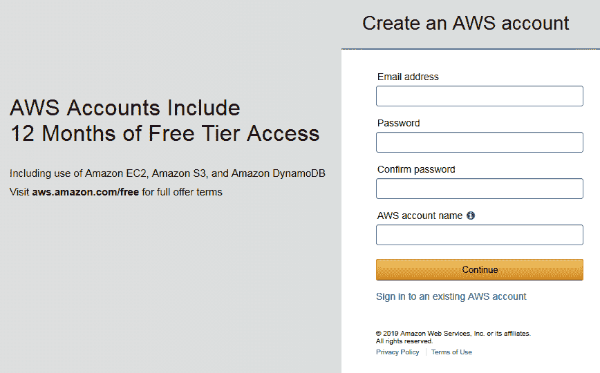

3.  填写字段，然后单击“继续”。
4.  门户将要求您提供一些更强制性的信息。 它还将要求您注册一种付款方式以验证您的详细信息。

如果您不提供此服务，则您无权使用 AWS 工具的免费层。

5.  在注册的最后一步，将要求您在三个计划中选择：免费，开发人员和商业。 选择与您的需求相关的任何一个，然后继续。

与 Google Cloud Platform 一样，AWS 还提供免费的层访问。 首次注册 AWS 时，您可以免费使用多种 AWS 服务和产品，但只能使用一定数量的配额。 您可以转到[这里](https://aws.amazon.com/free/)了解更多信息。

完成上述步骤后，您将获得如下页面：

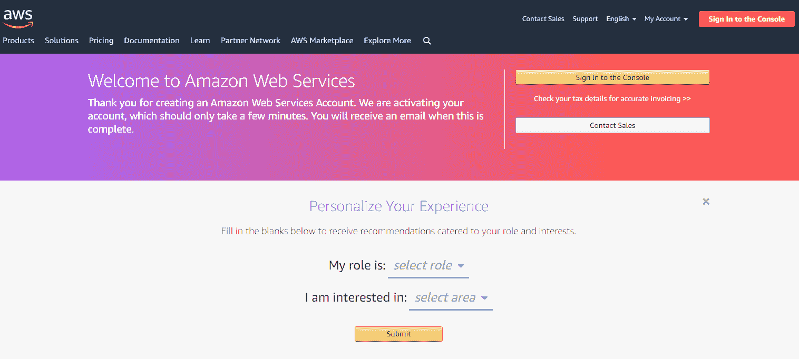

AWS 具有为用户推荐解决方案和服务的美丽功能。 为了充分利用此功能，您需要输入两件事-您的角色和您感兴趣的主题。 您可以在前面的屏幕截图中看到它。 输入这两个详细信息，然后单击“提交”以获取一些有针对性的产品建议。

6.  下一步是单击“登录到控制台”按钮。

成功登录到 AWS 控制台后，应该会看到以下窗口：

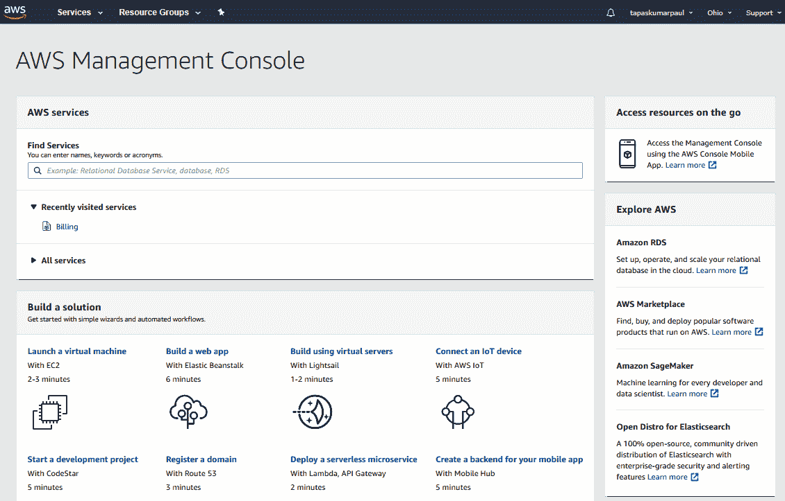

在 AWS 控制台中，您可以找到 AWS 必须提供的所有服务和解决方案。 单击“服务”选项卡，以随意探索整套服务。 您也可以从搜索栏中搜索特定的服务。

到现在为止，我们的 AWS 账户应该已经准备好让我们动手了。 在下一节中，我们将简要回顾 AWS 的产品，以更好地了解该平台。

# AWS 产品简介

AWS 在各种领域中提供其服务和解决方案。 以下是 AWS 提供的不同类型的模块（括号中的是 AWS 提供的不同服务的名称）：

*   计算（EC2，Lambda 等）
*   存储（S3，Storage Gateway 等）
*   机器学习（Amazon SageMaker，AWS DeepLens 等）
*   数据库（RDS，DynamoDB 等）

*   迁移和传输（Snowball，DataSync 等）
*   网络和内容交付（CloudFront，VPC 等）
*   开发人员工具（CodeStar，CodeCommit 等）
*   机器人技术（AWS RoboMaker）
*   区块链（Amazon Managed Blockchain）
*   分析（Athena，CloudSearch 等）

还有许多其他内容，如以下屏幕截图所示：

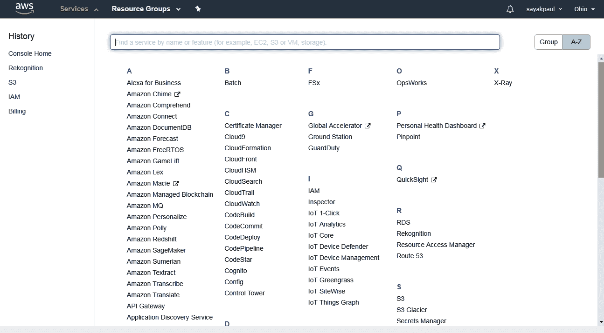

该列表实际上是相当广泛的，但是暂时让我们将重点局限于机器学习（也称为深度学习）服务。

AWS 控制台中的搜索栏还使您可以搜索可能已经听说过的 AWS API。 让我们在其中键入`Rekognition`并点击`Enter`。 应该为您提供 Rekognition 的主页，如以下屏幕截图所示：

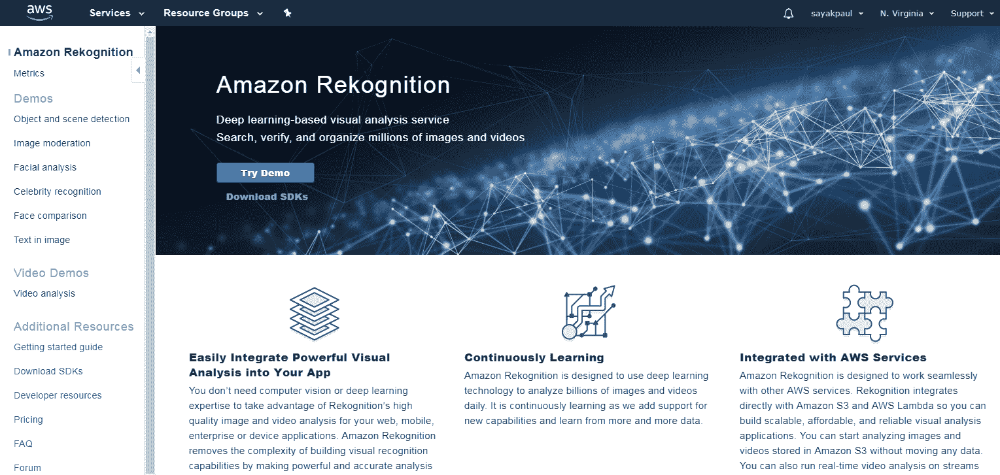

我们将在本章后面详细介绍 Rekognition API。 在下一部分中，我们将学习如何使用 boto3（一个提供 Python 编程接口的 AWS 开发工具包）与不同的 AWS 资源进行交互。

# Boto3 入门

boto3 是由 AWS 团队提供的用于与 AWS API 通信的官方库。 您可以在[这个页面](https://aws.amazon.com/sdk-for-python/)中找到该库，可以使用以下命令进行安装：

```py
pip install boto3
```

安装后，您需要配置 boto3 以用于您的项目。 要配置 [boto3](https://bit.ly/2OvXAvb)，第一步是从**身份和访问管理**（**IAM**）控制台。 请执行以下步骤来执行配置：

1.  转到[这里](https://console.aws.amazon.com/iam)的 AWS IAM 控制台。 它将如下所示：

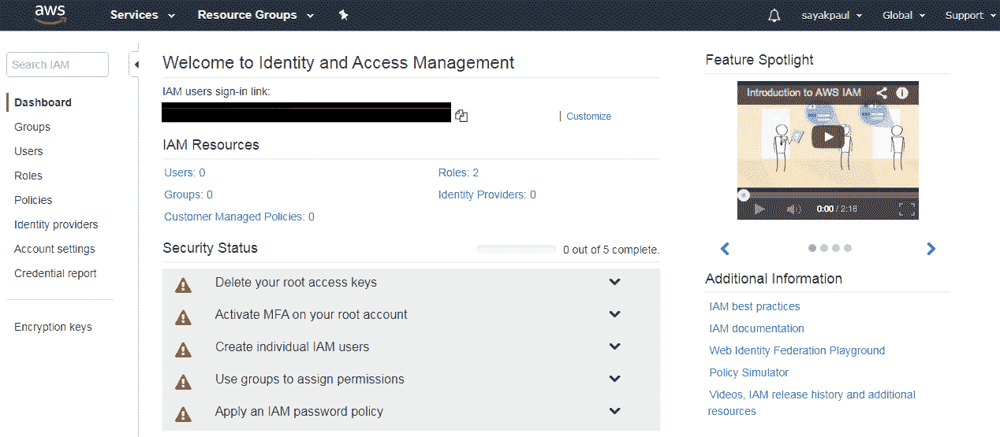

在前面的仪表板上，您将能够看到访问键。

2.  单击**删除您的根访问密钥**，然后单击**管理安全证书**。 您将看到以下窗口：

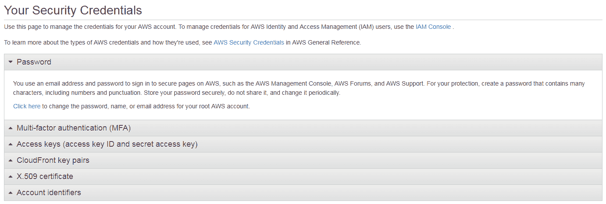

3.  展开**访问密钥（访问密钥 ID 和秘密访问密钥）**选项卡，然后从那里获取访​​问密钥。 密钥成功生成后，您应该获得以下消息：

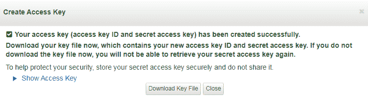

4.  下载密钥文件并将其保存在安全的地方，因为配置 boto3 时需要此文件。

# 配置环境变量并安装 boto3

获得访问密钥后，创建两个环境变量`aws_access_key_id`和`aws_secret_access_key`。 现在，在您拥有的键的帮助下相应地分配它们的值。 密钥将包含有助于您区分密钥 ID 和秘密访问密钥的信息。 现在，您已经配置了必要的环境变量，我们可以从在 Python 中加载环境变量开始。

# 在 Python 中加载环境变量

成功安装该库之后，可以使用以下代码行加载刚刚创建的环境变量：

```py
import os
aws_access_key_id= os.environ['aws_access_key_id']
aws_secret_access_key = os.environ['aws_secret_access_key']
```

一旦正确加载了环境变量，我们就可以调用 boto3 与 AWS 资源进行交互。 假设您想加入您的 AWS 账户中拥有的 S3 存储桶，并希望将图像上传到特定存储桶。 S3 是您要访问的 AWS 资源。 如果您的 AWS 账户中没有任何 S3 存储桶，则无需担心； 您可以快速创建一个。

# 创建一个 S3 存储桶

您可以通过执行以下步骤快速创建 S3 存储桶：

1.  转到 [S3 控制台的主页](https://s3.console.aws.amazon.com/s3)。 它应如下所示：


2.  点击**创建存储区**。 系统将要求您输入以下详细信息：

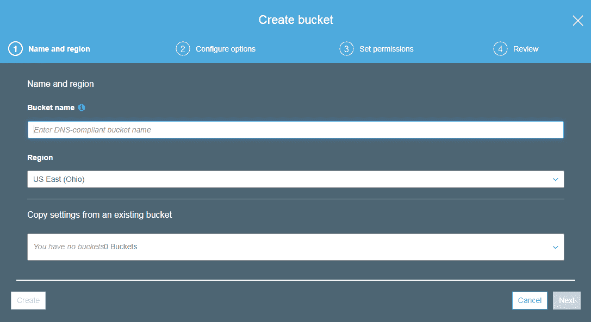

3.  为您的存储桶命名，保留所有内容，然后单击**创建**。 成功创建存储桶后，您将能够从 S3 控制台中看到它：

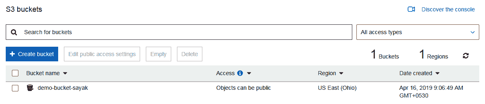

接下来，我们将学习如何使用 boto3 从 Python 代码访问 S3。

# 使用 boto3 从 Python 代码访问 S3

现在，您可以从 Python 代码访问 S3 存储桶。 以下代码行将向您显示可用的存储桶：

```py
import boto3
s3 = boto3.resource(
    's3',
    aws_access_key_id=aws_access_key_id,
    aws_secret_access_key=aws_secret_access_key
)
```

您在`resource()`的第一个参数中指定了对访问 S3 感兴趣。 您可以在[这里](https://bit.ly/2VHsvnP)阅读文档。 现在，您可以通过以下几行代码找到可用的存储桶：

```py
for bucket in s3.buckets.all():
 print(bucket.name)
```

您应该获得列表作为输出。 现在，假设您要将图像上传到存储桶之一。 假设您要上传的图像位于当前工作目录中，则以下代码行应将图像上传到特定的 S3 存储桶：

```py
data = open('my_image.jpeg', 'rb')
s3.Bucket('demo-bucket-sayak').put_object(Key='my_image.jpeg', Body=data)
```

前面的代码行包含以下功能：

*   `my_image.jpeg`是您要上传图像的路径。
*   `Bucket()`方法中是将图像上传到的 S3 存储桶的名称。

如果代码成功执行，您应该收到以下输出：

```py
s3.Object(bucket_name='demo-bucket-sayak', key='my_image.jpeg')
```

您可以转到 AWS S3 控制台，然后输入将映像上传到的存储桶，以验证是否已上传映像。 您应该在那里看到以下内容：

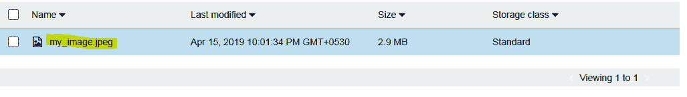

现在您已经在 Python 中成功配置了 boto3，我们现在可以继续学习如何使用 boto3 在 Python 中使用 Rekognition 和 Alexa API。

# 在 Python 中使用 Rekognition API

Amazon Rekognition 是启用了深度学习的视觉分析服务，可以帮助您无缝搜索，验证和分析数十亿张图像。 让我们首先简要回顾一下 Recognition API，然后我们将直接在 Python 中使用它。 首先让我们进入 [Rekognition API 的主页](https://console.aws.amazon.com/rekognition/home)。 我们已经在本章前面的部分之一中看到了 Rekognition 的主页。

您可能已经从导航栏中注意到了，Rekognition API 提供了几项功能：

*   **对象和场景检测**：这使您可以自动标记给定图像中的对象，标签和场景（以及置信度得分）。
*   **图像审核**：这使您可以检测图像中明显或暗示的成人内容以及置信度得分。

*   **名人识别**：使用此功能，您可以自动识别图像中的名人（以及置信度得分）。
*   **人脸比较**：可用于基于相似度百分比查看脸部匹配的紧密程度。

除了这些功能之外，它还有更多功能。

Rekognition API 提供的解决方案已被证明对各种各样的组织非常有用，因为它们可以真正解决一些现实世界和具有挑战性的问题。 您可以通过单击 API 主页上的相应解决方案来尝试快速演示上述列表中提到的任何解决方案。 让我们尝试一下名人识别解决方案。

首先，转到[这里](https://console.aws.amazon.com/rekognition/home?region=us-east-1#/celebrity-detection)（请注意，该区域可能会有所不同）。 它应如下图所示：

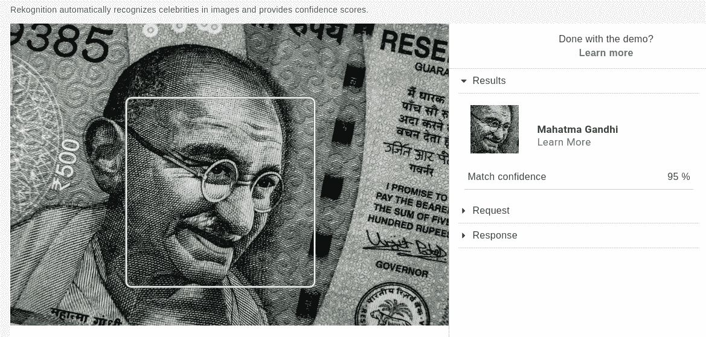

该门户将允许您上传自己的图像并进行测试。 让我们测试一下我的图像（我们可以拍摄媒体名人的图像，但是这些图像受版权保护）。 您可以看到预期的结果：


也可以尝试其他解决方案。 现在让我们看看如何从 Python 代码中使用 Rekognition API：

1.  创建一个新的 Jupyter 笔记本。 首先，您将要创建一个新的 Jupyter 笔记本，名称为`Sample.ipynb`。 您将必须提供要使用 AWS Rekognition API 进行名人识别测试的图像，如 Jupyter 的以下目录结构屏幕快照所示：

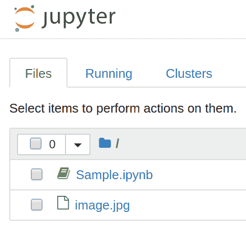

2.  将环境变量导入您的 AWS 账户中的凭证。 您将需要像之前在 boto3 配置部分中所做的那样，将帐户凭据导入到脚本中。 为此，请使用以下代码：

```py
import os
aws_access_key_id= os.environ['aws_access_key_id']
aws_secret_access_key = os.environ['aws_secret_access_key']
```

3.  使用 boto3 创建一个 AWS Rekognition API 客户端。 现在，我们可以实例化 boto3 Rekognition API 客户端对象。 为此，我们需要将希望使用的 API 以及希望使用该 API 的 AWS 区域名称传递给`boto3`对象。 您还必须传递在上一步中检索到的凭据，如以下代码所示：

```py
import boto3
client=boto3.client('rekognition', region_name='us-east-1', aws_access_key_id=aws_access_key_id, aws_secret_access_key=aws_secret_access_key) 
```

4.  从磁盘读取映像，并将其传递给 API。 从 boto3 SDK 将文件发布到 AWS API 的方法有两种。 首先，您可以直接从您具有权限的 S3 存储桶中发送它们，也可以从本地磁盘将图像作为`Bytes`数组发送。 在上一节中，我们已经了解了如何从 S3 存储桶中查找图像。

现在，我们将向您展示一个示例，其中我们从本地磁盘中获取大量图像并将其通过 API 调用传递：

1.  首先，使用 Python 的本机方法将图像读取到变量中以打开文件，如以下代码所示：

```py
image = open("image.jpg", "rb")
```

2.  现在，要通过前面实例化的客户端将其传递给 API，请使用以下代码行：

```py
response = client.recognize_celebrities(Image={'Bytes':image.read()})
```

3.  观察响应。 一旦 API 调用成功，您的`response`变量将保存 API 返回的信息。 要查看它，请打印变量：

```py
{'CelebrityFaces': [{'Urls': ['www.imdb.com/name/nm1682433'],
 'Name': 'Barack Obama',
 'Id': '3R3sg9u',
 'Face': {'BoundingBox': {'Width': 0.3392857015132904,
 'Height': 0.27056020498275757,
 'Left': 0.324404776096344,
 'Top': 0.06436233967542648},
 'Confidence': 99.97088623046875,
 'Landmarks': [{'Type': 'eyeLeft',
 'X': 0.44199424982070923,
 'Y': 0.17130307853221893},
 {'Type': 'eyeRight', 'X': 0.5501364469528198, 'Y': 0.1697501391172409},
 {'Type': 'nose', 'X': 0.4932120144367218, 'Y': 0.2165488302707672},
 {'Type': 'mouthLeft', 'X': 0.43547138571739197, 'Y': 0.25405779480934143},
 {'Type': 'mouthRight', 'X': 0.552975058555603, 'Y': 0.2527817189693451}],
 'Pose': {'Roll': -1.301725149154663,
 'Yaw': -1.5216708183288574,
 'Pitch': 1.9823487997055054},
 'Quality': {'Brightness': 82.28946685791016,
 'Sharpness': 96.63640594482422}},
 'MatchConfidence': 96.0}],
 'UnrecognizedFaces': [],
 'ResponseMetadata': {'RequestId': 'ba909ea2-67f1-11e9-8ac8-39b792b4a620',
 'HTTPStatusCode': 200,
 'HTTPHeaders': {'content-type': 'application/x-amz-json-1.1',
 'date': 'Fri, 26 Apr 2019 07:05:55 GMT',
 'x-amzn-requestid': 'ba909ea2-67f1-11e9-8ac8-39b792b4a620',
 'content-length': '813',
 'connection': 'keep-alive'},
 'RetryAttempts': 0}}
```

API 将我们的形象识别为巴拉克·奥巴马（Barack Obama）。 它为我们提供了许多其他有用的信息，例如面部匹配的`BoundingBox`，预测的`Confidence`，眼睛，嘴巴和鼻子的位置等。 我们可以使用此信息对图像进行进一步的操作，例如，简单地裁剪出匹配的部分。

4.  获取图像的匹配部分。 要在可识别的位置准备图像的裁剪版本，我们可以使用以下代码：

```py
from PIL import Image
from IPython.display import display

im=Image.open('image.jpg')
w, h = im.size

celeb = response['CelebrityFaces'][0]['Face']['BoundingBox']

x1 = (celeb["Left"])*w
y1 = (celeb["Top"])*h
x2 = (celeb["Left"] + celeb["Width"])*w
y2 = (celeb["Top"] + celeb["Height"])*h

box=(x1,y1,x2,y2)
im1=im.crop(box)

display(im1)
```

您应该看到以下图像是最终结果，它是 API 生成的用于执行名人识别的边界框：


在进一步探索适用于 AWS 的 boto3 API 时，您将认识到它能够处理所有 AWS 服务，而不仅限于 Rekognition API。 这意味着，根据 API 规范要求，只需稍作修改，即可将几乎所有可用的 API 用于前面的示例代码。

在接下来的部分中，我们将看一下 Alexa，这是亚马逊的旗舰产品，用于构建语音接口，这些接口的功能可以从聊天机器人到虚拟个人助理。 我们将学习如何使用 Alexa 构建简单的家庭自动化解决方案。

# 在 Python 中使用 Alexa API

亚马逊 Alexa 是由亚马逊开发的基于语音的个人助理。 该产品首先以 Amazon Echo 设备的界面为特色，随后又激发了使用 Google Assistant 的 Google 的 Google Home 设备。 Alexa 的其他竞争对手是微软的 Cortana 和苹果的 Siri。 作为虚拟助手，Alexa 可以轻松设置呼叫，安排会议或播放歌曲。 Alexa 可以执行的各种任务在 Alexa 术语中称为*技能*，我们将在本节中介绍这些技能。

Alexa 的技能是我们如何将功能引入平台的主要核心。 需要从 Alexa 的主界面调用每个技能，然后该技能将接管整个功能，除非程序逻辑完成或用户明确要求该技能结束。 技能将逻辑应用于要执行的任务，因此该逻辑需要存储在某个地方，也许还连同数据库和执行运行时一起存储。 尽管许多技能都托管在 Heroku，PythonAnywhere，GCP 等多种服务上，但是托管技能和逻辑代码作为 AWS Lambda 函数是很常见的。

在本节中，我们将使用适用于 Alexa 的 Python SDK 创建示例家庭自动化 Alexa 技能，并将其托管在 AWS Lambda 上。

# 项目的前提条件和框图

在开始构建 Alexa 技能之前，您将分别需要在 AWS 和 Amazon Developer 上使用以下两种类型的帐户：

*   一个 AWS 账户（免费套餐有效）— [aws.amazon.com](https://aws.amazon.com/)
*   亚马逊开发者帐户（免费）— [developer.amazon.com](https://developer.amazon.com/)

一旦创建了这些帐户（其过程超出了本书的范围），您就可以继续创建我们的家庭自动化技能。 以下框图显示了我们将要创建的家庭自动化技能的架构：

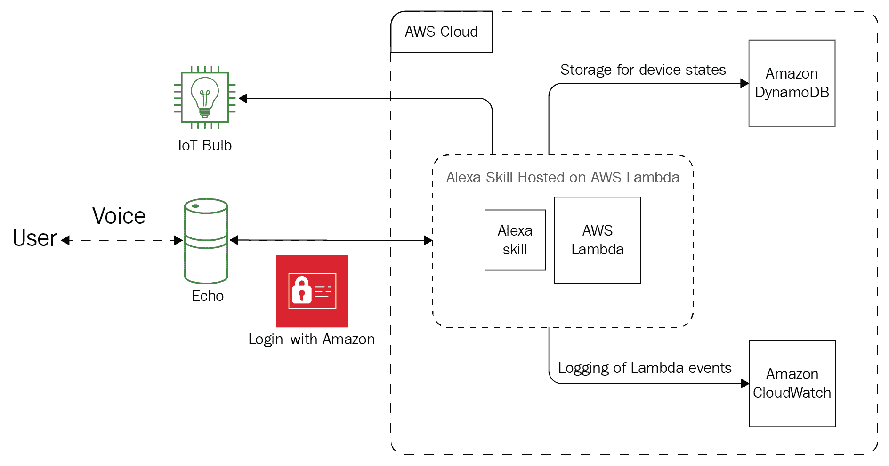

在构建此技能时，我们将使用以下服务，您可以通过以下列表中的链接来了解更多信息：

*   [**Amazon Alexa 技能套件**](https://developer.amazon.com/alexa-skills-kit)
*   [**使用 Amazon 登录**](https://developer.amazon.com/docs/login-with-amazon/minitoc-lwa-overview.html)
*   [**AWS CloudWatch**](https://aws.amazon.com/cloudwatch/)
*   [**Amazon DynamoDB**](https://aws.amazon.com/dynamodb/)
*   [**AWS Lambda**](https://aws.amazon.com/lambda/)

# 为技能创建配置

技能要求服务之间有一定程度的联系才能正常工作。 此外，需要将部署在 AWS Lambda 上的技能逻辑配置为供 Alexa 上的技能使用。 在工作文件夹的根目录中创建一个`setup.txt`文件，内容如下。 随着本节中各步骤的进行，我们将逐步添加该内容：

```py
[LWA Client ID]
amzn1.application-oa2-client.XXXXXXXXXXXXXXXXXXXXXXXXXXXXXXXX

[LWA Client Secret]
XXXXXXXXXXXXXXXXXXXXXXXXXXXXXXXXXXXXXXXXXXXXXXXXXXXXXXXXXXXXXXXX

[Alexa Skill ID]
amzn1.ask.skill.XXXXXXXX-XXXX-XXXX-XXXX-XXXXXXXXXXXX

[AWS Lambda ARN]
arn:aws:lambda:us-east-1:XXXXXXXXXXXX:function:skill-sample-language-smarthome-switch

[APIs]
https://pitangui.amazon.com/api/skill/link/XXXXXXXXXXXXXX
https://layla.amazon.com/api/skill/link/XXXXXXXXXXXXXX
https://alexa.amazon.co.jp/api/skill/link/XXXXXXXXXXXXXX
```

在以下各节中，我们将将此文件称为`setup.txt`。 这实际上仅包含有关您的技能的信息。 也可以在其他任何文本编辑器（例如 Google Docs）中随意实现此功能。

# Amazon 登录

对于家庭自动化技能，您将需要启用“使用亚马逊登录”服务。 为此，请执行以下步骤：

1.  转到[这里](https://developer.amazon.com/lwa/sp/overview.html)。 您将看到以下屏幕快照中显示的页面：


2.  在随后加载的页面上，单击“创建新的安全配置文件”按钮。
3.  将安全配置文件名称设置为`Smart Home Automation Profile`。
4.  提供配置文件的描述。
5.  对于内容隐私声明 URL，您将需要一个有效的隐私策略网页来将技能推广到生产中。 创建并托管隐私策略，并在此字段中提供指向它的链接。 可以在[这个页面](https://app-privacy-policy-generator.firebaseapp.com/)中找到用于创建隐私策略的非常方便的工具。
6.  点击“保存”。
7.  在下一页显示的齿轮菜单中，单击“安全配置文件”选项。 您将进入“安全配置文件管理”页面，如下图所示：

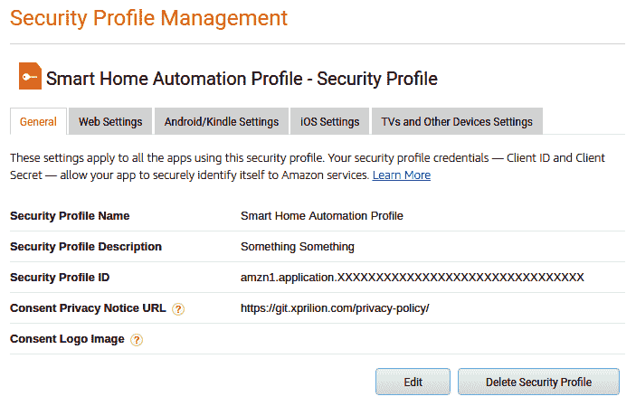

8.  在安全配置文件列表中，单击“Web 设置”选项卡，以显示“家庭自动化配置文件”的“显示客户端 ID 和客户端密钥”链接。
9.  复制显示的客户端 ID 和客户端密钥值，并将它们保存到工作目录中的`setup.txt`文件中，分别替换`[LWA Client ID]`和`[LWA Client Secret]`的格式示例条目。

保持此选项卡处于打开状态，以备将来使用。 在新的浏览器标签中，完成下一部分的步骤。

# 创建技能

现在，我们可以继续创建技能：

1.  登录[这里](https://developer.amazon.com/alexa/console/ask)开始该过程。 您将能够看到类似于以下内容的屏幕：


2.  单击“创建技能”。
3.  将名称设置为`Home Automation Skill`或您选择的名称。
4.  在“选择要添加到您的技能的模型”部分下，单击“智能家居”模型。 您的选择现在应类似于以下内容：

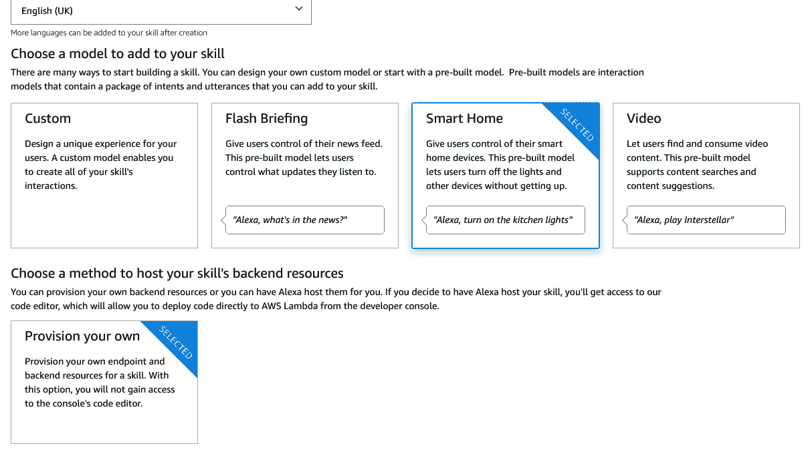

5.  单击“创建技能”以完成技能创建的初始阶段。
6.  在出现的下一页上，您将能够看到技能 ID。 将此技能 ID 复制到本地工作目录中的`setup.txt`文件。

不要关闭此标签，因为您仍然需要在此处填写字段。 打开一个新的浏览器选项卡以在下一部分中使用。

# 配置 AWS Lambda 函数

在将 Lambda 函数的 ARN 添加到技能端点配置之前，我们必须为 Lambda 函数创建一个配置。 您可以按照以下步骤进行操作：

1.  转到[这里](https://console.aws.amazon.com/iam/home#/policies)。 屏幕上将显示以下屏幕截图所示的屏幕：

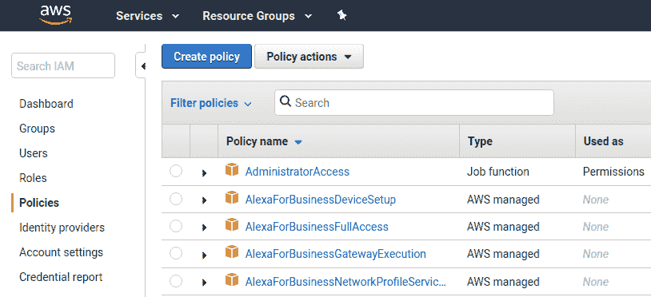

2.  单击“创建策略”。
3.  在“创建”策略编辑器的“JSON”选项卡中输入以下 JSON：

```py
{
 "Version": "2012-10-17",
 "Statement": [
 {
 "Effect": "Allow",
 "Action": [
 "logs:CreateLogStream",
 "dynamodb:UpdateItem",
 "logs:CreateLogGroup",
 "logs:PutLogEvents"
 ],
 "Resource": "*"
 }
 ]
 }
```

4.  单击“查看策略”，并将策略名称设置为`HomeAutomationPolicy`。
5.  单击“创建策略”。
6.  接下来，在页面的左侧导航菜单上，单击“角色”。
7.  单击“创建角色”。
8.  选择 AWS 服务和 Lambda，然后单击“下一步：权限”。
9.  在过滤字段中搜索`HomeAutomationPolicy`。 检查策略。 您的屏幕应类似于以下内容：

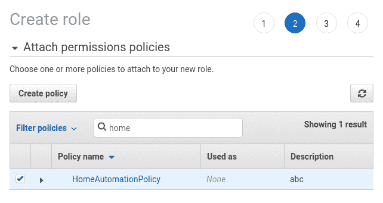

10.  单击“下一步：标签”。
11.  单击“下一步：审阅”。
12.  将角色名称设置为`lambda_home_automation`。
13.  单击“创建角色”。

现在让我们创建 Lambda 函数。

# 创建 Lambda 函数

有了适合 Lambda 函数的配置，我们现在可以创建 Lambda 函数本身。 为此，在 AWS 控制台中，导航至[这里](https://console.aws.amazon.com/lambda/home?region=us-east-1)并执行以下步骤：

1.  单击“创建函数”。
2.  将函数名称设置为`homeAutomation`。
3.  选择`Python 3.6`运行系统。
4.  从执行角色中现有角色的下拉列表中选择`lambda_home_automation`角色。
5.  点击`Create function`。
6.  从出现的下一页复制 Lambda ARN，其中包含祝贺您创建 Lambda 函数的消息。 将此 ARN 放入我们本地工作目录的`setup.txt`的`[AWS Lambda ARN]`字段中。
    此时，屏幕应类似于以下屏幕截图：


请注意，屏幕上显示的触发器和目的地可能与前面的屏幕截图不同。

7.  在左侧导航上，单击“添加触发器”以调出您的 Lambda 函数的可用触发器的下拉列表，如以下屏幕截图所示：

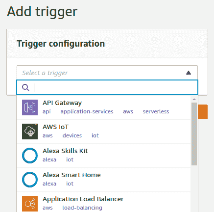

8.  单击`Alexa Skills Kit`来打开此触发器的配置对话框。
9.  将 Alexa 技能 ID 粘贴到技能 ID 字段中。 我们先前已将此值存储在`setup.txt`中，它看起来像`amzn1.ask.skill.xxxxxxxx-xxxx-xxxx-xxxx-xxxxxxxxxxxx`。
10.  单击“添加”以添加触发器并返回到 Lambda 函数管理屏幕。
11.  单击页面右上方的“保存”。

完成最后一步后，触发器部分将显示已连接的 Alexa 技能的详细信息。 如果不是，则应检查是否已正确执行上述步骤。

# 配置 Alexa 技能

现在，我们需要配置在浏览器的另一个选项卡中保持打开状态的技能。 我们将通过以下步骤进行操作：

1.  返回该选项卡，并在“默认端点”字段中填写 Lambda 函数的 ARN。
2.  点击“保存”。
3.  单击页面底部的“设置帐户链接”。
4.  对于授权 URL，输入`https://www.amazon.com/ap/oa`。
5.  对于访问令牌 URL，输入`https://api.amazon.com/auth/o2/token`。
6.  对于客户端 ID 字段，从`setup.txt`文件中复制`[LWA Client ID]`。
7.  对于“客户端密钥”字段，从`setup.txt`文件中复制`[LWA Client Secret]`。
8.  单击“添加范围”，然后输入`profile:user_id`。
9.  从页面底部复制重定向 URL，然后将其粘贴到[API]部分下的`setup.txt`文件中。 URL 类似于以下内容：

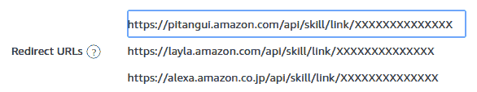

10.  点击“保存”。
11.  在“安全配置文件管理”浏览器选项卡中，单击“Web 设置”选项卡。
12.  单击“编辑”，然后将三个重定向 URL 添加到“允许的返回 URL”字段中。 您将必须单击“添加另一个”以输入多个 URL。
13.  点击“保存”。

现在，让我们为该技能设置 Amazon DynamoDB。

# 设置 Amazon DynamoDB 以获得该技能

为了能够从用户保存数据，此功能需要数据库。 我们将为此使用 Amazon DynamoDB 服务。 设置服务的步骤如下：

1.  转到[这里](https://console.aws.amazon.com/dynamodb/home?region=us-east-1)。
2.  单击“创建表”按钮。
3.  输入表名称为`SmartHome`。
4.  对于主键，输入`ItemId`。
5.  保留所有默认设置，然后单击“创建”。 在此步骤中，您的屏幕应类似于以下屏幕截图：

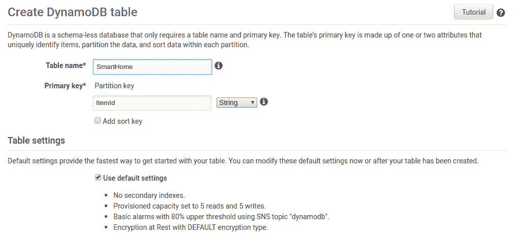

然后，您可以转到 DynamoDB 仪表板以查看刚刚创建的表。 但是，这可能需要一些时间。

# 部署 AWS Lambda 函数的代码

我们剩下的最后一部分设置是为 AWS Lambda 函数提供逻辑的代码。 转到 Lambda 函数配置页面，然后向下滚动到编辑器。

您将注意到编辑器具有两列界面：左列显示 Lambda 函数存储中的文件，而右列则可以编辑这些文件，如以下屏幕截图所示：

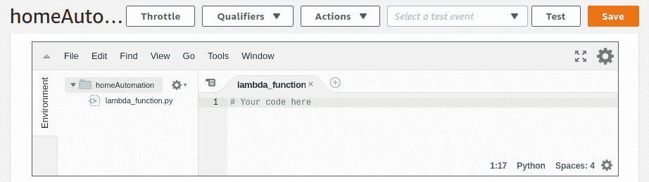

单击`lambda_function.py`开始编辑文件并执行以下步骤：

1.  导入必要的模块。 为了使该函数正常工作，我们需要一些通用库的支持，如以下代码所示：

```py
import boto3
import json
import random
import uuid
import time
```

boto3 API 用于连接到我们设置的 Amazon DynamoDB 实例。 JSON 模块有助于生成 Alexa 技能的响应。 其余模块有助于生成响应。

2.  创建`AlexaResponse`类。 为了能够完全复制 Alexa 技能的预期响应格式，我们可以快速设置一个帮助程序类，该类可以为 Lambda 函数调用生成响应。 我们命名为`AlexaReponse`； 以下代码段显示了该类的初始化：

```py
class AlexaResponse:

    def __init__(self, **kwargs):

        self.context_properties = []
        self.payload_endpoints = []

        # Set up the response structure
        self.context = {}
        self.event = {
            'header': {
                'namespace': kwargs.get('namespace', 'Alexa'),
                'name': kwargs.get('name', 'Response'),
                'messageId': str(uuid.uuid4()),
                'payloadVersion': kwargs.get('payload_version', '3')
            },
            'endpoint': {
                "scope": {
                    "type": "BearerToken",
                    "token": kwargs.get('token', 'INVALID')
                },
                "endpointId": kwargs.get('endpoint_id', 'INVALID')
            },
            'payload': kwargs.get('payload', {})
        }

        if 'correlation_token' in kwargs:
            self.event['header']['correlation_token'] = kwargs.get('correlation_token', 'INVALID')

        if 'cookie' in kwargs:
            self.event['endpoint']['cookie'] = kwargs.get('cookie', '{}')

        if self.event['header']['name'] == 'AcceptGrant.Response' or self.event['header']['name'] == 'Discover.Response':
            self.event.pop('endpoint')
```

前面用于`AlexaResponse`类的初始化方法设置了预期的输出格式和各种常量设置，例如有效负载的版本号以及对输出对象的一些基本验证。 接下来，我们创建用于添加内容属性的方法和用于在响应中设置 Cookie 的另一种方法。 最后，添加了另一种方法来设置有效负载端点：

```py
def add_context_property(self, **kwargs):
    self.context_properties.append(self.create_context_property(**kwargs))

def add_cookie(self, key, value):

    if "cookies" in self is None:
        self.cookies = {}

    self.cookies[key] = value

def add_payload_endpoint(self, **kwargs):
    self.payload_endpoints.append(self.create_payload_endpoint(**kwargs))
```

3.  现在定义上一步中创建的三个处理器方法。 上一步中声明的方法取决于它们自己的内部方法。 这些主要是辅助函数，与本章的重点无关，因此我们将把这些留给您实现该函数，您可以通过研究 AWS Lambda 函数的响应主体文档和 Alexa 技能来创建这些函数。 可以[在本章的代码存储库中](http://tiny.cc/HOPDLW_CH7_lfpy)的`lambda_function.py`文件的 65 和 102 行之间找到示例实现。
4.  接下来，我们将设置方法以从`AlexaResponse`类生成最终响应。 最终，我们创建了将所有不同部分（上下文，事件，有效负载，端点和 cookie）同化为单个对象的方法，可以与 Alexa 技能进行交互：

```py
    def get(self, remove_empty=True):

        response = {
            'context': self.context,
            'event': self.event
        }

        if len(self.context_properties) > 0:
            response['context']['properties'] = self.context_properties

        if len(self.payload_endpoints) > 0:
            response['event']['payload']['endpoints'] = self.payload_endpoints

        if remove_empty:
            if len(response['context']) < 1:
                response.pop('context')

        return response

    def set_payload(self, payload):
        self.event['payload'] = payload

    def set_payload_endpoint(self, payload_endpoints):
        self.payload_endpoints = payload_endpoints

    def set_payload_endpoints(self, payload_endpoints):
        if 'endpoints' not in self.event['payload']:
            self.event['payload']['endpoints'] = []

        self.event['payload']['endpoints'] = payload_endpoints
```

5.  `AlexaResponse`类现已完成。 现在，我们将继续使用以下行来连接 DynamoDB 服务：

```py
aws_dynamodb = boto3.client('dynamodb')
```

6.  接下来，我们定义文件的主要方法和入口点-`lambda_handler`方法：

```py
def lambda_handler(request, context):

    # JSON dump for the request
    print('Request: ')
    print(json.dumps(request))

    if context is not None:
        print('Context: ')
        print(context)
```

在本步骤的其余部分中，我们将继续添加上述方法。 在前面的几行中，我们声明了`lambda_handler`方法，该方法接受 Alexa 技能的`request`和`context`对象。 然后，它对请求进行 JSON 转储，以便我们以后可以从 Amazon CloudWatch 仪表板进行观察。 接下来，它对上下文进行了转储（如果有附加到请求中的内容）：

```py
    # Validate we have an Alexa directive
    if 'directive' not in request:
        aer = AlexaResponse(
            name='ErrorResponse',
            payload={'type': 'INVALID_DIRECTIVE',
                     'message': 'Missing key: directive, Is the request a valid Alexa Directive?'})
        return send_response(aer.get())
```

然后，我们验证请求中是否有有效的 Alexa 指令，如果找不到有效的 Alexa 指令，则会生成错误消息并作为响应发送回去。 注意此处`AlexaResponse`类对象的用法。 将来我们将使用它来从以下脚本生成响应：

```py
    # Check the payload version
    payload_version = request['directive']['header']['payloadVersion']
    if payload_version != '3':
        aer = AlexaResponse(
            name='ErrorResponse',
            payload={'type': 'INTERNAL_ERROR',
                     'message': 'This skill only supports Smart Home API version 3'})
        return send_response(aer.get())
```

同样，进行另一项检查以确保请求的有效负载版本为 3。这是因为我们仅针对 Alexa 的 Smart Home API 版本 3 开发了它：

1.  首先，我们打开请求并查看请求的内容：

```py
    name = request['directive']['header']['name']
    namespace = request['directive']['header']['namespace']
```

2.  然后，我们根据`namespace`处理来自 Alexa 的传入请求。 请注意，此示例接受任何`grant`请求，但是在您的实现中，您将使用代码和令牌来获取和存储访问令牌：

```py
    if namespace == 'Alexa.Authorization':
        if name == 'AcceptGrant':
            grant_code = request['directive']['payload']['grant']['code']
            grantee_token = request['directive']['payload']['grantee']['token']
            aar = AlexaResponse(namespace='Alexa.Authorization', name='AcceptGrant.Response')
            return send_response(aar.get())
```

前述条件适用于 Alexa 授权请求。

3.  对于发现和关闭开关的操作，我们使用以下代码：

```py
    if namespace == 'Alexa.Discovery':
        if name == 'Discover':
            adr = AlexaResponse(namespace='Alexa.Discovery', name='Discover.Response')
            capability_alexa = adr.create_payload_endpoint_capability()
            capability_alexa_powercontroller = adr.create_payload_endpoint_capability(
                interface='Alexa.PowerController',
                supported=[{'name': 'powerState'}])
            adr.add_payload_endpoint(
                friendly_name='Sample Switch',
                endpoint_id='sample-switch-01',
                capabilities=[capability_alexa, capability_alexa_powercontroller])
            return send_response(adr.get())

        if namespace == 'Alexa.PowerController':
            endpoint_id = request['directive']['endpoint']['endpointId']
            power_state_value = 'OFF' if name == 'TurnOff' else 'ON'
            correlation_token = request['directive']['header']['correlationToken']
```

对于对`TurnOff`或`TurnOn.`的请求，此示例始终返回`success`响应。

4.  现在，我们在设置状态时检查错误：

```py
        state_set = set_device_state(endpoint_id=endpoint_id, state='powerState', value=power_state_value)
        if not state_set:
            return AlexaResponse(
                name='ErrorResponse',
                payload={'type': 'ENDPOINT_UNREACHABLE', 'message': 'Unable to reach endpoint database.'}).get()

        apcr = AlexaResponse(correlation_token=correlation_token)
        apcr.add_context_property(namespace='Alexa.PowerController', name='powerState', value=power_state_value)
        return send_response(apcr.get())
```

5.  最后，我们提取指令名称和指令的名称空间，以确定要发送回的响应的类型。 根据要发送的指令，将生成不同的响应，并最终使用`AlexaResponse`类对象发送该响应。
6.  注意上一步代码中`send_response`方法的用法。 我们需要定义该方法。 它的任务是以 JSON 格式发送`AlexaResponse`对象，并将其记录下来以便在 Amazon CloudWatch 中进行观察：

```py
def send_response(response):
    print('Response: ')
    print(json.dumps(response))
    return response
```

7.  更新`device state`方法。 由于我们正在使用 Alexa 为简单的交换机设备构建自动化，因此我们需要维护交换机的状态信息。 为此，我们将其状态存储在 DynamoDB 中。 我们将为此添加一个更新方法，如以下代码所示：

```py
def set_device_state(endpoint_id, state, value):
    attribute_key = state + 'Value'
    response = aws_dynamodb.update_item(
        TableName='SmartHome',
        Key={'ItemId': {'S': endpoint_id}},
        AttributeUpdates={attribute_key: {'Action': 'PUT', 'Value': {'S': value}}})
    print(response)
    if response['ResponseMetadata']['HTTPStatusCode'] == 200:
        return True
    else:
        return False
```

接下来，我们将测试 Lambda 函数。

# 测试 Lambda 函数

现在，我们可以检查函数是否正确响应。 为此，我们必须通过以下步骤在 Lambda 函数的仪表板上创建一个测试：

1.  在上一节中创建的函数的 Lambda 函数页面的右上角，单击“测试”。
2.  将出现一个对话框，其中包含用于编写新测试或使用现有测试的选项。 选择创建新测试事件的选项。
3.  在“事件”模板中，确保已选择“Hello World”。
4.  接下来，提供事件名称`directiveDiscovery`。
5.  在编辑器中输入以下 JSON：

```py
{
  "directive": {
    "header": {
      "namespace": "Alexa.Discovery",
      "name": "Discover",
      "payloadVersion": "3",
      "messageId": "1bd5d003-31b9-476f-ad03-71d471922820"
    },
    "payload": {
      "scope": {
        "type": "BearerToken",
        "token": "access-token-from-skill"
      }
    }
  }
}
```

此时，您的屏幕应类似于以下内容：

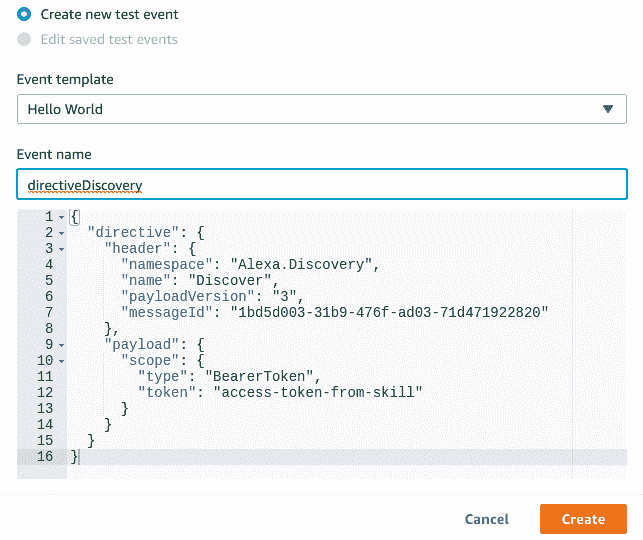

6.  向下滚动并单击“创建”。
7.  返回 Lambda 函数仪表板后，在右上方，从下拉列表中选择`directoryDiscover`测试。
8.  单击“测试”。

完成后，测试将显示响应状态和 Lambda 函数的响应。 您可以在 Lambda 函数仪表板顶部的页面上看到结果，该结果类似于以下屏幕截图：

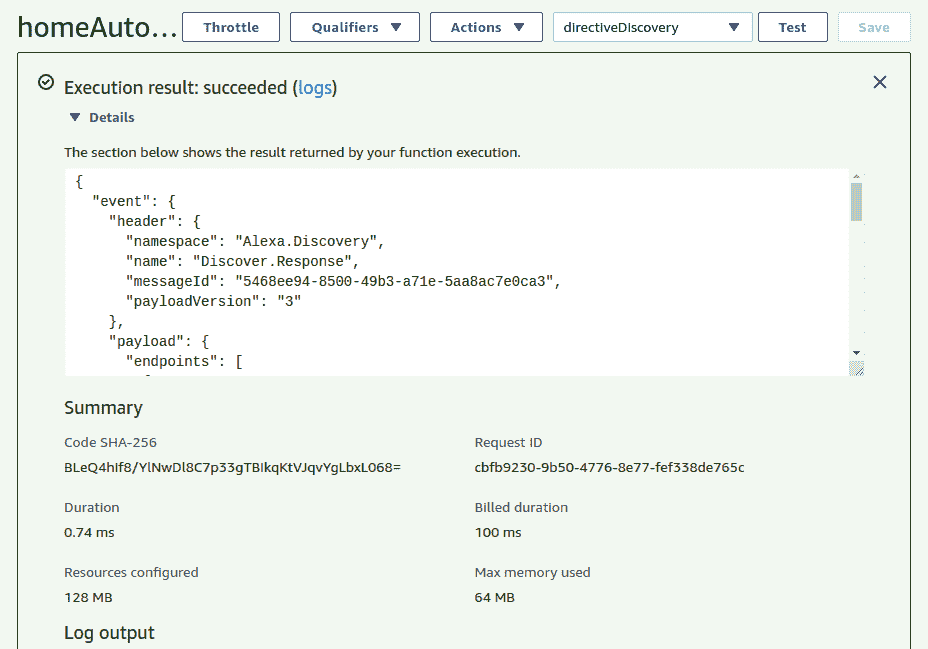

如果测试失败，请确保已仔细执行上述步骤，并确保存在不同服务的区域相同。

# 测试 AWS 家庭自动化技能

作为该项目的最后阶段，我们将在 Alexa 测试模拟器中测试我们的技能。 为此，请执行以下步骤：

1.  转到[这里](https://alexa.amazon.com/)并登录。
2.  单击左侧菜单中的“技能”。
3.  单击页面右上方的您的技能。

4.  选择“DEV SKILL”选项卡。
5.  单击`HomeAutomationSkill`。 您应该看到以下屏幕：


6.  单击“启用”按钮。 系统将要求您允许访问开发者帐户的权限。
7.  返回到 Alexa Developer 控制台，然后单击“发现设备”。 名为 Sample Switch 的新设备将显示为可用，如以下屏幕快照所示：

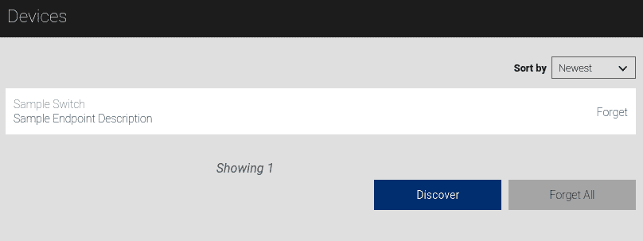

8.  现在，转到 Alexa Skills Kit 开发页面上的“测试”选项卡，以获取 HomeAutomation 技能。

9.  在模拟器中，键入`alexa, turn on the sample switch`。 如果请求被接受，那么您将收到来自 Alexa 的`OK`，如以下屏幕截图所示：

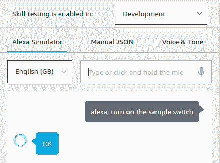

要检查该技能是否真正起作用，可以转到 DynamoDB 表 SmartHome 并切换到表的“项目”选项卡。 您应该能够看到以下记录：

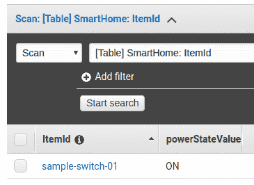

恭喜您成功在 Alexa 中建立了简单的家庭自动化技能！ 您可以玩耍此技能，并为 Alexa 建立自己的家庭自动化技能。 准备好将其发布给更广泛的受众后，您可以按照[这个页面](https://developer.amazon.com/docs/alexa-for-business/create-and-publish-private-skills.html)上提供的文档中的建议进行操作。

# 总结

在本章中，我们介绍了如何通过其 Python API boto3 使用 AWS。 我们探索了使用 API​​的各种选项和配置要求，并查看了如何与 Rekognition API 一起使用以识别名人的示例。 然后，我们深入研究了如何创建家庭自动化的 Alexa 技能，设置了打开/关闭开关的简单任务。 这可以很容易地推断到其他智能家居设备。 我们研究了如何在 AWS Lambda 上托管 Alexa 技能逻辑以及如何从 AWS CloudWatch 进行观察。 我们还探索了 Amazon DynamoDB 中动态设备数据的存储。

在接下来的章节中，我们将了解如何使用 Python 在 Microsoft Azure 平台上使用深度学习。