# 八、Microsoft Azure 上的 Python 深度学习

我们将在本章结束我们的云 API 探索之旅。 到目前为止，我们已经将自己轻轻地介绍给了 API 的美好世界，特别是让我们轻松进行深度学习的 API。 我们已经看到了如何使用 REST API 并以编程方式使用它们。 与 **Google Cloud Platform**（**GCP**）和 **Amazon Web Services**（**AWS**）一样，Microsoft 也提供了自己的云服务平台，该平台称为 Azure。 与前几章一样，我们将只专注于 Azure 必须提供的基于深度学习的解决方案。 我们将稍作调整，还将介绍 Microsoft 的**认知工具包**（**CNTK**），它是像 Keras 这样的深度学习框架。

在本章中，我们将介绍以下主题：

*   在 Azure 中设置您的帐户
*   快速浏览 Azure 提供的深度学习解决方案
*   在 Python 中使用 Face API
*   在 Python 中使用 Text Analytics API
*   CNTK 简介

# 技术要求

您可以从[这里](https://github.com/PacktPublishing/Hands-On-Python-Deep-Learning-for-Web/tree/master/Chapter8)访问本章的代码。

要运行本章中使用的代码，您将需要以下软件：

*   Python 3.6+
*   Python PIL 库
*   Matplotlib 库

本章将介绍所有其他安装，例如 CNTK 和 Django。

# 在 Azure 中设置您的帐户

根据您以前使用云平台的经验，您可能已经意识到，这一切都始于在云提供商中设置帐户和计费。 这是一个非常标准的工作流程，Azure 也不例外。 因此，让我们转到[这里](https://azure.microsoft.com/)并执行以下步骤：

1.  单击“免费启动”按钮，如下所示：


请注意，您将需要一个 Microsoft 帐户才能继续以下步骤。 因此，如果您没有，请在[这个页面](https://account.microsoft.com/account)中创建一个。

2.  您将被重定向到另一个页面，在该页面上您将再次看到另一个“免费启动”按钮。 点击它。


3.  系统将要求您登录到您的 Microsoft 帐户以继续。 相应地提供凭据，您应该进入页面，如以下屏幕截图所示：


如果您是首次使用该产品，您将在 30 天内免费获得 200 美元的信用额（取决于您的货币），以浏览 Azure 提供的其他服务。

4.  填写您的详细信息，其中还包括通过卡验证您的身份。

您可能需要为此支付象征性的费用。 请确保查看 Azure 免费套餐的条款和条件，您可以在[这个页面](https://azure.microsoft.com/en-in/offers/ms-azr-0003p/)中找到这些条款和条件。

完成此过程后，您将全部准备就绪并可以移至 [Azure 门户](https://portal.azure.com/#home)，该门户的作用方式与 GCP 和 AWS 控制台相同您已经在前面的章节中看到过。

Azure 门户如下所示：

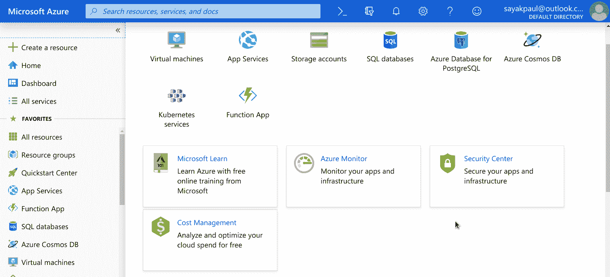

现在，您已经设置了 Azure 帐户，让我们在下一部分中探索基于深度学习的 Azure 产品。

# Azure 提供的深度学习服务一览

Azure 的基于深度学习（和通用机器学习）的产品大致分为三个部分：

*   [**Azure 机器学习服务**](https://azure.microsoft.com/en-in/services/machine-learning-service/)，它提供端到端的机器学习生命周期，包括模型构建，训练和部署：

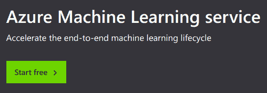

*   [**机器学习 API**](https://gallery.azure.ai/machineLearningAPIs)，它们为各种学习任务提供 API，例如内容审核，翻译，异常检测， 等等：

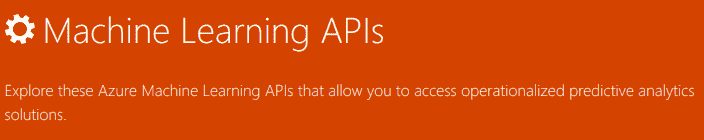

*   [**Azure AI**](https://azure.microsoft.com/en-in/overview/ai-platform/)，其重点是诸如**知识挖掘**之类的主题，**决策挖掘**以及计算机视觉和语言建模领域中的许多其他类似的机器学习功能：


现在，我们将研究分别用于计算机视觉任务和自然语言理解任务的两个 API。 我们还将研究如何从 Python 使用这些 API。 让我们潜入。

# 使用 Face API 和 Python 的对象检测

对象检测是计算机视觉的经典用例，已广泛应用于许多实际问题，例如视频监视系统。 在本节中，我们将使用 Face API 从给定图像中检测面部。 在设计视频监视系统时，可以直接使用。 您可以从[其官方页面](https://azure.microsoft.com/en-us/services/cognitive-services/face/)了解有关 Face API 的更多信息。

# 初始设置

Azure 还可以让您免费试用此 API 7 天。 但是，由于您已经拥有一个 Azure 帐户（我想拥有免费信用），因此我们可以采用另一种方式，如下所示：

1.  登录到您的 Azure 帐户。
2.  转到[这里](https://azure.microsoft.com/en-us/services/cognitive-services/face/)。
3.  单击“已经使用 Azure？ 立即免费试用此服务”。

现在，您应该有一个窗口，如以下屏幕截图所示：

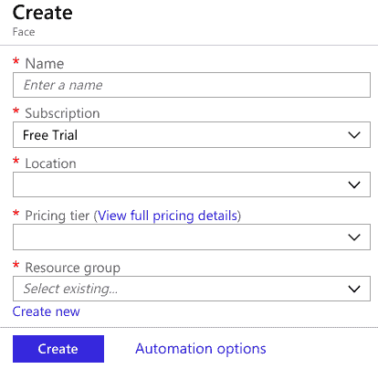

4.  相应地填写详细信息，完成后单击“创建”。 您将看到一个弹出窗口，显示“正在提交部署”。

部署完成后，您应该进入页面，如以下屏幕截图所示：

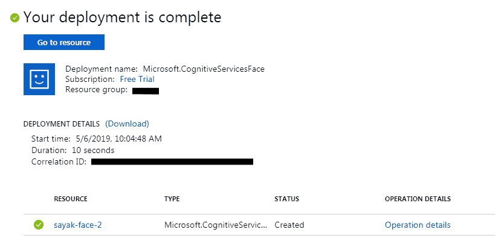

5.  单击“转到资源”，您将被重定向到资源页面，其中包含许多详细信息：

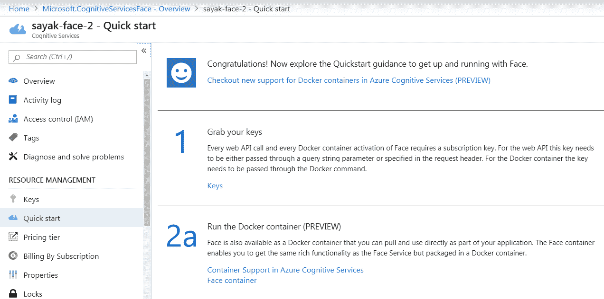

只需向下滚动一点，您将能够看到 Face API 的端点。 请注意，它会根据您在创建部署时输入的配置详细信息而有所不同。 端点看起来像[这里](https://eastus.api.cognitive.microsoft.com/face/v1.0)。 注意这一点。

现在，要能够以编程方式使用 Face API，您需要创建相应的 API 密钥。 在同一页面的顶部，有一个部分显示**抓取密钥**：

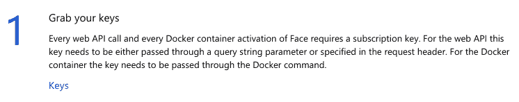

6.  在该部分下，单击“密钥”，您将看到以下屏幕截图中的内容：

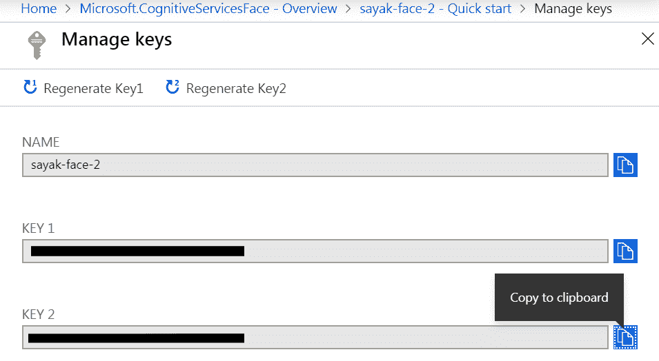

既然您已经有了 Face API 的 API 密钥，就可以使用它了。

# 从 Python 代码使用 Face API

当您的包含诸如 API 密钥之类的安全凭证时，通常最好将这些密钥定义为环境变量，然后在程序中调用它们。 因此，继续创建一个环境变量以存储 Face API 的 API 密钥之一。

要将环境变量添加到计算机，可以在[这个页面](https://www.twilio.com/blog/2017/01/how-to-set-environment-variables.html)上关注此文章。

就我而言，我已将环境变量命名为`face_api_key`。 您可以放置​​任何包含面部的图像。 对于此示例，我将使用以下图像：


创建一个新的 Jupyter 笔记本，然后按照以下步骤操作：

1.  现在，让我们使用 Python 加载环境变量，如下所示：

```py
import os
face_api_key = os.environ['face_api_key']
```

2.  现在，将 Face API 端点（用于对象检测）分配给变量。
3.  此外，将要测试的图像上载到在线文件服务器（例如 Imgur），然后检索允许从 Imgur 提取原始图像的 URL。

就我而言，我已将图像上传到 GitHub 存储库并使用了相应的 URL：

```py
face_api_url = 'https://eastus.api.cognitive.microsoft.com/face/v1.0/detect'

image_url= 'https://raw.githubusercontent.com/PacktPublishing/Hands-On-Python-Deep-Learning-for-Web/master/Chapter8/sample_image.jpg'
```

请注意，在前面的 API 中，仅 URL 末尾的终结点名称发生更改。 在大多数情况下，除非使用 Azure 平台本身要求进行更改，否则在使用认知服务期间，终结点名称之前的部分将保持不变。

4.  现在，导入`requests`模块并设置 API 有效负载，如下所示：

```py
import requests
params = {
'returnFaceId': 'true',
'returnFaceLandmarks': 'false',
'returnFaceAttributes': 'age,gender',
}
```

5.  现在，我们可以向 Face API 发出请求了。

以下代码行可为您完成此操作：

```py
# Define the header param
headers = { 'Ocp-Apim-Subscription-Key': face_api_key }
# Define the body params
params = {
'returnFaceId': 'true',
'returnFaceLandmarks': 'false',
'returnFaceAttributes': 'age,gender',
}
```

6.  现在，我们可以显示从 API 收到的响应：

```py
# Make the call to the API
response = requests.post(face_api_url, params=params, headers=headers, json={"url": image_url})
# Get the response and log
faces = response.json()
print('There are {} faces im the given image'.format(str(len(faces))))
```

在这种情况下，返回的代码如下：

```py
There are 2 faces in the given image
```

请注意`returnFaceAttributes`主体参数，该参数可让您指定面孔的多个属性，并且 Face API 将针对这些属性分析给定的面孔。 要查找有关这些属性的更多信息，请查看[这个页面](http://bit.ly/2J3j6nM)上的文档。

让我们以一种合理的方式将从 API 获得的响应嵌入到图像中。 我们将在图像中显示检测到的面部的可能的性别和可能的年龄。 我们将使用`matplotlib`，`PIL`和`io`库进行此操作，并且我们将使用 Jupyter 笔记本来处理本节中的以下代码段。 我们将从导入库开始：

```py
%matplotlib inline #Only for Jupyter Notebook
import matplotlib.pyplot as plt
from PIL import Image
from matplotlib import patches
from io import BytesIO
```

要使用从 API 收到的响应在图像上显示叠加层，我们使用以下方法：

1.  存储 API 响应：

```py
response = requests.get(image_url)
```

2.  根据响应内容创建图像：

```py
image = Image.open(BytesIO(response.content))
```

3.  创建一个空图形：

```py
plt.figure(figsize=(8,8))
```

4.  显示使用响应创建的图像：

```py
ax = plt.imshow(image, alpha=0.6)
```

5.  遍历前面部分中指定的面部并提取必要的信息：

```py
for face in faces:
 # Extract the information
 fr = face["faceRectangle"]

 fa = face["faceAttributes"]
 origin = (fr["left"], fr["top"])
 p = patches.Rectangle(origin, fr["width"], fr["height"], fill=False, 
 linewidth=2, color='b')
 ax.axes.add_patch(p)
 plt.text(origin[0], origin[1], "%s, %d"%(fa["gender"].capitalize(), fa["age"]), 
 fontsize=20, weight="bold", va="bottom")
# Turn off the axis
_ = plt.axis("off") 
plt.show()
```

您应该具有这样的图像：

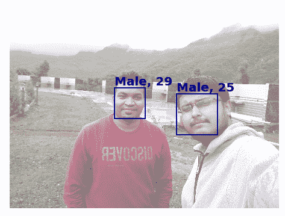

鼓励您尝试使用 API​​提供的不同参数。 现在，我们将研究**自然语言理解**（**NLU**）API。

# 使用 Text Analytics API 和 Python 提取文本信息

无论是有意还是无意，我们都必须遇到自然语言处理的一些惊人用例。 无论是自动更正，下一个单词建议还是语言翻译，这些用例都非常重要而不能忽略。 在本节中，我们将使用[文本分析 API](https://azure.microsoft.com/en-us/services/cognitive-services/text-analytics/) 从给定的一段文字中提取有意义的信息。

您可以使用前面提到的链接免费试用 API，并查看其功能。 在以下示例中，我输入了短语`I want to attend NeurIPS someday and present a paper there`，Text Analytics API 从中提取了四个有意义的信息：

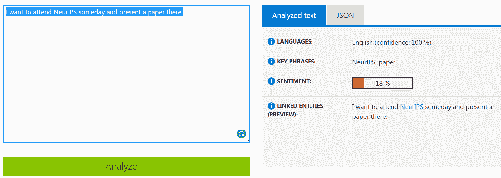

观察 API 如何从短语中提取所有关键信息。

现在，我们将看到如何使用 Python 以编程方式执行此操作。 设置步骤将与前面的步骤完全相同。 只需转到[这里](https://portal.azure.com/#create/Microsoft.CognitiveServicesTextAnalytics)并按照那里的步骤进行。 一旦拥有使用 API​​的相应 API 密钥，请继续进行以下小节。 别忘了记下各自的端点。 端点应以[这个页面](https://eastus.api.cognitive.microsoft.com/text/analytics/v2.0)开头。 该 URL 不能单独使用； 它需要有一个后缀，指向要调用的正确方法。

# 在 Python 代码中使用 Text Analytics API

本节将向您展示如何在自己的 Python 代码中使用 Text Analytics API。 以下是使用它的步骤：

1.  我们将从导入所需的库开始本节：

```py
import requests
import os
from pprint import pprint
```

2.  然后，我们将从环境变量中加载 Text Analytics API 的 API 密钥：

```py
api_key = os.environ['text_api_key']
```

3.  现在让我们指定一些 URL 来存储 API 端点：

```py
text_analytics_base_url = \
'https://eastus.api.cognitive.microsoft.com/text/analytics/v2.0'
language_api_url = text_analytics_base_url + "/languages"
sentiment_api_url = text_analytics_base_url + "/sentiment"
key_phrase_api_url = text_analytics_base_url + "/keyPhrases"
```

4.  现在，通过提供 API 密钥来定义`headers`参数：

```py
headers = {"Ocp-Apim-Subscription-Key": api_key}
```

5.  我们还要定义 body 参数。 就我而言，我将保留之前在基于 GUI 的演示中显示的相同短语：

```py
documents = { 'documents': [
{ 'id': '1', 'text': 'I want to attend NeurIPS someday and present a paper there.' }
]}
```

6.  现在，我们可以调用 Text Analytics 的各个 API。 让我们从检测语言开始：

```py
response = requests.post(language_api_url, headers=headers, json=documents)
language = response.json()
pprint(language)
```

我们得到相应的响应，如下所示：

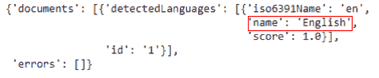

请注意，我已突出显示该语言。 现在，让我们继续进行情感分析部分：

```py
response = requests.post(sentiment_api_url, headers=headers, json=documents)
sentiment = response.json()
pprint(sentiment)
```

显示的情感如下所示：

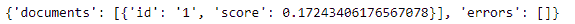

注意，此处使用的短语既不包含正面情感也不包含负面情感，因此不包含得分。 现在，我们将从给定的文本中提取关键短语：

```py
response = requests.post(key_phrase_api_url, headers=headers, json=documents)
phrases = response.json()
print(phrases)
```

关键短语如下所示：

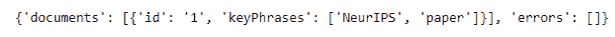

注意端点相对于任务的变化。 您可以在[这个页面](http://bit.ly/2JjLRfi)上探索有关上一示例中使用的端点的不同参数的更多信息。

# CNTK 简介

CNTK 是 Microsoft 提供的产品。 该框架是 ONNX 格式计划的一部分，该计划允许在不同的神经工具套件框架之间轻松转换模型。 该框架负责 Microsoft 软件和平台上的深度学习生产工作量的很大一部分。 该框架于 2016 年推出，一直是 TensorFlow，PyTorch 等流行框架的竞争者。 该框架是完全开源的，可以在[这个页面](http://github.com/microsoft/CNTK)中找到。

CNTK 为企业服务（例如 Cortana 和 Bing）以及广告（例如 Skype Translate，Microsoft Cognitive Services 等）提供动力。 事实证明，它在某些应用上比 TensorFlow 和 PyTorch 等竞争对手更快地工作。

在本节中，我们将研究 CNTK 的一些基础知识，然后继续创建 Django 应用以将基于 CNTK 的模型传递到网络上。

# CNTK 入门

CNTK 是最容易上手的框架之一，这得益于其简单的语法和无需会话概念即可工作的能力，就像 TensorFlow 一样，这使大多数学习器感到困惑。 让我们看看如何在本地计算机或 Google Colaboratory 上设置 CNTK。

# 在本地计算机上安装

CNTK 框架支持 64 位和 32 位架构的计算机。 但是，在编写本书时，它仅支持 3.6 版以下的 Python 版本。 您可以在[这个页面](https://pypi.org/project/cntk/)上验证最新支持的版本。 此外，目前，CNTK 无法作为 macOS 上的内置二进制文件使用。

要安装框架，可以使用`pip`包管理器，也可以使用 Anaconda 上已编译的二进制文件进行安装。 假设已设置 Python 环境，则可以使用以下命令在 Windows 和 Linux 上安装 CNTK：

*   如果没有 Anaconda，则将以下内容用于 CPU 版本：

```py
# For CPU version
pip install cntk
```

*   将以下内容用于启用 GPU 版本：

```py
# For the GPU enabled version
pip install cntk-gpu
```

*   在支持 Anaconda 的计算机上，可以使用`pip`通过以下命令安装 CNTK 框架：

```py
pip install <url>
```

可以从 [CNTK 网站](http://tiny.cc/cntk)获得`<url>`。

该命令将类似于以下内容：

```py
pip install https://cntk.ai/PythonWheel/CPU-Only/cntk-2.6-cp35-cp35m-win_amd64.whl
```

现在，我们开始在 Google Colaboratory 中安装它。

# 在 Google Colab 上安装

默认情况下，CNTK 框架在 Google Colaboratory 平台上不可用，因此必须与其他必要模块一起安装。 要在 Google Colaboratory 运行时上安装 CNTK，请在脚本顶部使用以下命令：

```py
!apt-get install --no-install-recommends openmpi-bin libopenmpi-dev libopencv-dev python3-opencv python-opencv && ln -sf /usr/lib/x86_64-linux-gnu/libmpi_cxx.so /usr/lib/x86_64-linux-gnu/libmpi_cxx.so.1 && ln -sf /usr/lib/x86_64-linux-gnu/openmpi/lib/libmpi.so /usr/lib/x86_64-linux-gnu/openmpi/lib/libmpi.so.12 && ln -sf /usr/lib/x86_64-linux-gnu/libmpi.so /usr/lib/x86_64-linux-gnu/libmpi.so.12 && pip install cntk
```

请注意，前面的命令是单行命令。 如果将其分成多行，则应确保将所需的更改添加到命令中。

一旦上一步成功运行，您将无需在该运行时再次使用此命令。 因此，该命令可以在程序的将来运行中被注释掉。

通常，通过`C`别名将 CNTK 导入 Python 项目。 我们使用以下代码将库导入项目：

```py
import cntk as C
```

我们可以使用以下行来检查已安装的 CNTK 的版本：

```py
print(C.__version__)
```

将 CNTK 导入到项目中后，我们准备着手创建深度学习模型的先决条件。

# 创建 CNTK 神经网络模型

在本节中，我们将完成创建预测神经网络之前所需的步骤，然后将创建神经网络本身：

1.  首先，将必要的模块导入项目：

```py
import matplotlib.pyplot as plt
%matplotlib inline

import numpy as np
from sklearn.datasets import fetch_openml
import random

import cntk.tests.test_utils
from sklearn.preprocessing import OneHotEncoder

import cntk as C # if you have not done this before in the project
```

`sklearn`模块的`fetch_openml()`方法可帮助我们将本示例中使用的数据集直接下载到项目中，即 MNIST 手写数字数据集。 `OneHotEncoder`方法用于标签的单热编码。

2.  接下来，设置程序执行过程中所需的几个常量：

```py
num_samples = 60000
batch_size = 64
learning_rate = 0.1
```

我们将对 60,000 个样本进行训练，初始学习率为`0.1`。 该速率可以在训练期间动态更新。

3.  然后，我们需要创建一种用于生成随机迷你批的训练方法：

```py
class Batch_Reader(object):
    def __init__(self, data , label):
        self.data = data
        self.label = label
        self.num_sample = data.shape[0]

    def next_batch(self, batch_size):
        index = random.sample(range(self.num_sample), batch_size)
        return self.data[index,:].astype(float),self.label[index,:].astype(float)
```

每次调用时，前面的方法将生成等于上一步中设置的大小的批量，例如，每个批量中有 64 个样本。 这些样本是从数据集中随机抽取的。

4.  现在需要获取数据集； 为此，我们使用以下代码行：

```py
mnist = fetch_openml('mnist_784')
```

提取数据后，可以将其分为训练和测试数据集，如下所示：

```py
train_data = mnist.data[:num_samples,:]
train_label = mnist.target[:num_samples]
test_data = mnist.data[num_samples:,:]
test_label = mnist.target[num_samples:]
```

5.  数据集中的标签在输入训练模型之前需要进行一次热编码。 为此，我们使用以下代码：

```py
enc = OneHotEncoder()
enc.fit(train_label[:,None])
train_encoded = enc.transform(train_label[:,None]).toarray()
```

6.  现在，我们可以为训练批量生成器创建一个生成器对象，如下所示：

```py
train_reader = Batch_Reader(train_data, train_encoded)
```

7.  我们也快速对`test`数据集执行前面的步骤：

```py
enc = OneHotEncoder()
enc.fit(test_label[:,None])
test_encoded = enc.transform(test_label[:,None]).toarray()

test_reader = Batch_Reader(test_data, test_encoded)
```

8.  现在，让我们创建一个 CNTK 神经网络模型。 我们首先从定义一些常量开始：

```py
dimensions = 784
classes = 10
hidden_layers = 3
hidden_layers_neurons = 400
```

我们将输入数据的维度定义为`784`。 回顾“第 3 章”，“创建第一个深度学习 Web 应用”的示例，在此我们使用了 MNIST 数据集。 MNIST 数据集中的图像以单维数组的格式存储，其中包含`0`至`255`范围内的`28 x 28`值。 图像属于 10 个不同的类别，分别对应于阿拉伯数字系统中的每个数字。 我们提供 3 个隐藏层，每个包含 400 个神经元。

9.  然后，我们创建两个 CNTK `input`变量，以在创建模型时使用。 这是 CNTK 最重要的概念之一。

```py
input = C.input_variable(dimensions)
label = C.input_variable(classes)
```

CNTK 中的`input`变量本质上是一个占位符，我们在模型训练，评估或测试期间使用它来填充样本。 在此步骤中，数据集输入的形状必须与`input`变量声明中声明的尺寸完全匹配。 在这里重要的是要提到，很多人将输入的维数与数据集具有的特征数量混为一谈。 具有`N`个特征数量和`M`个样本数量的数据集具有（`M`，`N`）形状，因此这个数据集的维度为`2`：

```py
def create_model(features):
    with C.layers.default_options(init = C.layers.glorot_uniform(), activation = C.ops.relu):
​
            hidden_out = features
​
            for _ in range(hidden_layers):
                hidden_out = C.layers.Dense(hidden_layers_neurons)(hidden_out)
​
            network_output = C.layers.Dense(classes, activation = None)(hidden_out)
            return network_output
```

10.  我们创建`create_model()`方法，该方法将特征的输入作为参数。

首先，为模型设置默认值，以使用权重初始化和其他值的均匀分布。 默认激活函数设置为`ReLU`。

第一层包含特征本身，最后一层包含向量，其维数等于类的数量。 中间的所有层都包含一个由 3 个隐藏层组成的全连接网络，每个隐藏层都有 400 个神经元，并具有 ReLU 激活函数：

```py
model = create_model(input/255.0)
```

最后，我们使用先前的函数创建模型。 除以`255`可对数据集进行归一化，从而在`0`和`1`之间的图像数组中呈现值。

# 训练 CNTK 模型

创建模型后，我们现在可以继续训练模型并使其学习预测。 为此，我们需要使用 CNTK 模型对象，并将数据集中的样本拟合到该对象。 我们可以同时记录`loss`和其他评估指标。 我们需要执行以下步骤来训练我们的模型：

1.  为`loss`和分类误差创建占位符：

```py
loss = C.cross_entropy_with_softmax(model, label)
label_error = C.classification_error(model, label)
```

2.  现在，我们可以为 CNTK 框架设置一个`trainer`对象，该对象用于执行实际的训练：

```py
lrs = C.learning_rate_schedule(learning_rate, C.UnitType.minibatch)
learner = C.sgd(model.parameters, lrs)
trainer = C.Trainer(model, (loss, label_error), [learner])
```

3.  现在开始进行训练：

```py
epochs = 10
num_iters = (num_samples * epochs) / batch_size

for i in range(int(num_iters)):

    batch_data, batch_label = train_reader.next_batch(batch_size=batch_size)

    arguments = {input: batch_data, label: batch_label}
    trainer.train_minibatch(arguments=arguments)

    if i % 1000 == 0:
        training_loss = False
        evalaluation_error = False
        training_loss = trainer.previous_minibatch_loss_average
        evalaluation_error = trainer.previous_minibatch_evaluation_average
        print("{0}: , Loss: {1:.3f}, Error: {2:.2f}%".format(i, training_loss, evalaluation_error * 100))
```

我们将训练的周期数设置为`10`，以便进行快速训练和评估。 您可以将其设置为较高的值，以提高训练的准确率； 但是，在某些情况下，这可能不会导致更好的训练或过拟合。 在第 1,000 次迭代中，我们显示直到那时为止的损失和评估误差。 这些的总体趋势应该是下降。

# 测试并保存 CNTK 模型

在继续使用 Django 框架将该项目转换为 Web 应用之前，让我们快速测试在模型训练中获得的准确率。 我们将执行以下操作以从模型进行预测：

```py
predicted_label_probs = model.eval({input: test_data})
```

这将为数据集中的每个标签创建一个 NumPy 概率数组。 必须将其转换为索引，并与测试数据的标签进行比较。 我们这样做如下所示：

```py
predictions = np.argmax(predicted_label_probs, axis=1)
actual = np.argmax(test_encoded, axis=1)
correct = np.sum(predictions == actual)
print(correct / len(actual))
```

我们发现预测的准确率约为 98%。 这是一个非常好的值，我们将继续保存模型并通过 Django 使用它。 为了保存 CNTK 模型，我们执行以下操作：

```py
model.save("cntk.model")
```

成功保存模型后，如果您已使用 Colaboratory 构建模型，则必须将`model`文件下载到本地系统。 接下来，我们可以继续在基于 Django 的服务器上部署模型。

# Django Web 开发简介

Django 是使用 Python 进行 Web 开发的最受欢迎的框架之一。 该框架轻巧，健壮，并由社区积极维护，可快速修补安全漏洞并添加新功能。 在本书中，我们介绍了 Flask 框架，该框架本质上是 Python Web 开发的基本框架。 但是，Django 随附了许多内置功能，这些功能可实现最新的方法和实践。

Django 项目的初始结构如下：

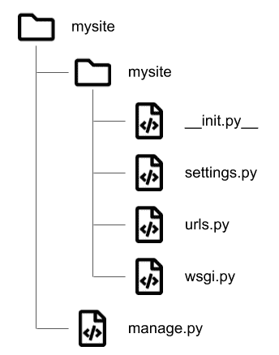

使用`django-admin`工具创建新的 Django 项目时，这些文件会自动生成。 顶级目录`mysite`表示 Django 项目的名称。 每个 Django 项目均包含应用。 应用类似于软件开发中模块的概念。 它们通常是整个项目的独立部分，并由`mysite`主应用放在项目目录中。 每个项目中可以包含多个应用。

让我们学习如何开始使用 Django 并创建一个新项目！

# Django 入门

使用 Django 之前，最重要的步骤是安装它。 幸运的是，该框架很容易从 Python PIP 存储库中作为模块安装。 它也可以在 Conda 存储库中找到。 要安装 Django，请打开一个新的终端窗口，然后使用以下命令：

```py
conda install django
```

或者，如果您更喜欢 PIP，请使用以下命令：

```py
pip install django
```

这会将 Django 模块安装到您的 Python 环境中。

要检查是否已成功安装，请在终端中使用以下命令：

```py
python -m django --version
```

这将产生版本号的输出，例如`- 2.0.8`。 如果没有，请检查您的 Django 安装。

# 创建一个新的 Django 项目

Django 提供了一个方便的工具`django-admin`工具，该工具可用于生成 Django 项目所需的样板代码。 要创建一个名为`cntkdemo`的新项目，请使用以下代码：

```py
django-admin startproject cntkdemo
```

这将创建所有样板文件夹和文件。 但是，我们必须在项目中创建至少一个应用。 使用终端将活动的工作目录更改为`cntkdemo`文件夹。 使用以下命令在此项目中创建一个应用：

```py
python manage.py startapp api
```

因此，我们创建了一个名为`api`的文件夹，其中包含以下文件夹； 所有文件都是使用占位符代码和文档自动生成的：

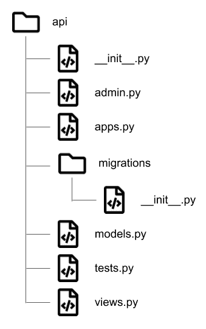

现在，我们可以进行初始 UI 的编码。

# 设置主页模板

现在让我们创建一个网页，该网页在访问`/`路由时加载。 还记得我们在项目中创建的`api`应用吗？ 为了简单起见，使索引页面成为该应用的一部分。 虽然可以在`mysite`应用的`urls.py`文件中创建此路由，但我们将为`api`应用提供其自己的路由处理文件。

让我们从设置主页模板的步骤开始：

1.  在`api`文件夹中创建一个文件`urls.py`。 该文件相对于项目目录的完整路径为`mysite/api/urls.py`。 在此文件中，让我们使用以下代码添加`/`路由：

```py
from django.urls import path

from . import views

urlpatterns = [
 path('', views.indexView), # This line handles the '/' route.
]
```

2.  保存此文件。 前面的代码从本质上为`api`应用添加了新路径`/`（注意，不是项目！）。 它将导入`api`应用的`views.py`文件中的所有可用视图。 请注意，`indexView`仍然不存在。 下一步之后，我们将创建此视图。
3.  `api`应用未链接到主项目应用。 我们需要在`mysite/mysite/urls.py`文件中添加以下几行，以通过`api`应用的路由处理器启用路由处理：

```py
from django.contrib import admin
from django.urls import path
from django.urls import include # -- Add this line!

urlpatterns = [
 path('', include('api.urls')), # -- Add this line!
 path('admin/', admin.site.urls),
]
```

第一行导入了一个工具，用于将特定于应用的路由设置包括到项目应用中。 我们使用它使用`api.urls`字符串将`urls.py`文件包含在`api`应用内。 这会自动将字符串转换为试图查找并包含正确文件的代码行。

4.  在`api`应用目录内的`views.py`文件中，添加以下行：

```py
from django.http import HttpResponse
from django.template import loader
```

`HttpResponse`方法允许`view`方法返回 HTML 响应。 `loader`类为我们提供了从磁盘加载 HTML 模板的方法。

5.  现在让我们创建`indexView`方法：

```py
def indexView(request):
 template = loader.get_template('api/index.html')
 context = {}
 return HttpResponse(template.render(context, request))
```

`indexView`方法加载`api/index.html`模板文件，并使用`context`词典中提供的变量以及模板可用的`request`参数对其进行呈现。 当前，我们传递空白上下文，因为我们没有任何值可发送到模板。 但是同样，先前定义的`api/index.html`文件不存在。

6.  让我们创建一个用于保存模板的文件夹，并将其链接到项目设置。 为此，请转到项目的根目录并创建一个名为`templates`的文件夹。 我们需要项目能够将该文件夹识别为模板的目录。 为此，我们需要修改`mysite/mysite/settings.py`文件中的`TEMPLATES`设置：

```py
TEMPLATES = [
 {
 'BACKEND': 'django.template.backends.django.DjangoTemplates',
 'DIRS': [os.path.join(BASE_DIR, 'templates')], # -- Add this line!
 'APP_DIRS': True,
 'OPTIONS': {
 'context_processors': [
```

添加上一行后，项目将在`mysite/templates/`文件夹中查找模板。

7.  创建`index.html`模板文件。

    请注意，步骤 4 中的模板文件路由存在于`api`目录中。 在`templates`目录中创建一个名为`api`的文件夹。 在其中，使用以下代码创建`index.html`文件：

```py

...
        <div class="jumbotron">
            <h3 class="jumbotronHeading">Draw here!</h3>
            ...
        </div>
        <div class="jumbotron">
            <h3>Prediction Results</h3> 
            <p id="result"></p>
        </div>
        <div id="csrf"></div>
    </div>
    <script src='https://cdnjs.cloudflare.com/ajax/libs/jquery/2.1.3/jquery.min.js'></script>
    <script src=""></script>
...
```

我们在前面的代码块的末尾包含了一些必需的脚本，其中包括一个从后端获取 CSRF 令牌的脚本。

8.  现在，让我们在上一个代码块中通过`jumbotron`类将`canvas`元素添加到`div`中，在这里我们将绘制数字。 我们还将添加一个用于选择绘图笔宽度的滑块，如下所示：

```py
        <div class="jumbotron">
            <h3 class="jumbotronHeading">Draw here!</h3>        
            <div class="slidecontainer">
                <input type="range" min="10" max="50" value="15" id="myRange">
                <p>Value: <span id="sliderValue"></span></p>
            </div>
            <div class="canvasDiv">
                <canvas id="canvas" width="350" height="350"></canvas>
                <p>
                    <button class="btn btn-success" id="predict-btn" role="button">Predict</button>
                    <button class="btn btn-primary" id="clearButton" role="button">Clear</button>
                </p>
            </div>
        </div>
```

`template`文件还包括两个静态文件-`style.css`和`script.js`。 我们将在接下来的部分中创建这些文件。 我们尚未创建用于将数据发送到服务器并呈现收到的响应的脚本。

9.  现在，我们将开始添加与后端 API 通信所需的 JavaScript 代码。 首先，我们创建一种方法来检查是否需要 CSRF 令牌才能与后端进行通信。 这只是一个工具函数，与调用后端 API 无关，后者可能有时被设计为接受没有 CSRF 令牌的请求。 我们创建此函数，如下所示：

```py
<script type="text/javascript">
    function csrfSafeMethod(method) {
        return (/^(GET|HEAD|OPTIONS|TRACE)$/.test(method));
    }
```

10.  然后，我们为`Predict`按钮创建`click`处理器。 此处理函数首先设置适当的标头，以调用后端 API，然后将画布上显示的图形转换为数据 URL 字符串：

```py
    $("#predict-btn").click(function() {

        var csrftoken = $('input[name=csrfmiddlewaretoken]').val();

        $.ajaxSetup({
            beforeSend: function(xhr, settings) {
                if (!csrfSafeMethod(settings.type) && !this.crossDomain) {
                    xhr.setRequestHeader("X-CSRFToken", csrftoken);
                }
            }
        });

        $('#predict-btn').prop('disabled', true);

        var canvasObj = document.getElementById("canvas");
        var img = canvasObj.toDataURL();

        // MORE CODE TO BE ADDED BELOW THIS LINE

        // MORE CODE TO BE ADDED ABOVE THIS LINE
    });
    </script>
```

11.  最后，我们将代码添加到`Predict`按钮的`click`处理函数中，以使用画布中的数据对后端进行 Ajax 调用，如下所示：

```py
$("#predict-btn").click(function() {
...
        // MORE CODE TO BE ADDED BELOW THIS LINE
        $.ajax({
            type: "POST",
            url: "/predict",
            data: img,
            success: function(data) {
                console.log(data);
                var tb = "<table class='table table-hover'><thead><tr><th>Item</th><th>Confidence</th></thead><tbody>";
                var res = JSON.parse(data);
                console.log(res);

                $('#result').empty.append(res.data);
                $('#predict-btn').prop('disabled', false);
            }
        });
        // MORE CODE TO BE ADDED ABOVE THIS LINE
...
});
    </script>
```

12.  在创建静态文件之前，我们需要为它们创建一个文件夹并将其链接到项目。 这类似于我们创建`templates`文件夹的方式。 首先，在项目目录中使用`mysite/static/`路径创建一个文件夹`static`。 然后，在`mysite/mysite/settings.py`文件中修改`STATIC`配置，如下所示：

```py
STATIC_URL = '/static/'

STATICFILES_DIRS = [
 os.path.join(BASE_DIR, "static"), # -- Add this line!
]
```

现在，我们可以使用模板文件顶部的``指令创建静态文件并将其加载到项目模板中，就像在`index.html`文件中一样。

13.  创建`style.css`和`script.js`-由于这些文件与本书的上下文没有明显关系，因此可以直接从[这里](http://tiny.cc/cntk-demo)下载它们。

请注意，没有`script.js`文件，该项目将无法运行。

我们已经创建了用于预测`index.html`模板文件中存在的画布上绘制的图像的设置。 但是，`/predict`路由尚未创建。 在下一部分中，让我们看看如何在 Django 中加载和使用 CNTK 模型。

# 在 Django 项目中将 CNTK 用于预测

在本节中，我们将首先设置 CNTK 模型与 Django 一起使用所需的路由，视图和导入。 然后，我们将从保存的文件中加载 CNTK 模型，并使用它进行预测。

# 设置预测路由和视图

回想一下我们如何在`api`应用中创建`/`路由及其对应的视图：

1.  首先，将以下行添加到`mysite/api/urls.py`：

```py
urlpatterns = [
 path('', views.indexView),
 path('predict', views.predictView), # -- Add this line!
]
```

这将创建`/predict`路由。 但是，视图`predictView`尚未创建。

2.  将以下行添加到`api`应用中的`views.py`文件中：

```py
from django.http import JsonResponse

def predictView(request):
 # We will add more code below this line

 # We will add more code above this line
 return JsonResponse({"data": -1})
```

请注意前几行中的占位符。 在接下来的步骤中，我们将在此处添加更多内容。

# 进行必要的模块导入

现在，让我们加载使用 CNTK 模型进行预测所需的所有模块，如以下步骤所示：

1.  将以下几行导入添加到`api`应用的`views.py`文件中：

```py
import os
from django.conf import settings
```

2.  我们需要前面的导入才能从磁盘加载模型：

```py
import cntk as C
from cntk.ops.functions import load_model
```

前几行将 CNTK 模块导入到 Django 项目。 `load_model`方法将帮助我们加载保存的 CNTK 模型文件。

以下模块用于处理将在其上进行预测的图像：

```py
from PIL import Image
import numpy as np
```

以下模块提供了用于处理 Base64 编码的字符串的工具，该格式是`index.html`页在请求中发送画布数据的格式：

```py
import re
import base64
import random 
import string
```

在接下来的部分中将对其他库进行说明。

# 加载 CNTK 模型来做出预测

现在，我们将按照以下步骤进一步编辑`predictView`视图：

1.  首先，使用以下代码将 Base64 编码的图像字符串数据读取为变量：

```py
def predictView(request):
 # We will add more code below this line

 post_data = request.POST.items()
 pd = [p for p in post_data]
 imgData = pd[1][0].replace(" ", "+")
 imgData += "=" * ((4 - len(imgData) % 4) % 4)
```

Base64 解码的字符串没有适当的填充，并且包含需要转换为`+`的空格。 上一个代码块中的最后两行对字符串执行相同的操作。

2.  接下来，我们将将此 Base64 编码的字符串转换为 PNG 图像，并通过以下几行将其保存到磁盘：

```py
filename = ''.join([random.choice(string.ascii_letters + string.digits) for n in range(32)])

convertImage(imgData, filename)
```

第一行为文件名创建一个 32 个字符长的随机字符串。 下一行调用`convertImage`方法，该方法将`base64`字符串存储为提供的文件名。

3.  但是，`convertImage`方法尚未定义。 在`predictView`方法之外，添加函数的定义，如下所示：

```py
def convertImage(imgData, filename):
 imgstr = re.search(r'base64,(.*)', str(imgData)).group(1)
 img = base64.b64decode(imgstr)
 with open(filename+'.png', 'wb') as output:
 output.write(img)
```

该方法从字符串中去除多余的元数据。 然后，它解码该字符串并将其另存为 PNG 文件。

4.  让我们回到`predictView`方法。 我们将首先加载保存的`image`文件：

```py
image = Image.open(filename+'.png').convert('1')
```

我们还将图像仅转换为黑白通道。 这样会将图像中的通道数从 3 减少到 1。

5.  回想一下，MNIST 数据集中的所有图像的尺寸均为`28 x 28`。我们必须将当前图像调整为相同的尺寸。 我们使用以下代码行：

```py
image.thumbnail((28,28), Image.ANTIALIAS)
```

6.  现在，我们使用以下几行将图像转换为 NumPy 数组：

```py
image_np = np.array(image.getdata()).astype(int)
image_np_expanded = np.expand_dims(image_np, axis = 0)
```

`np.expanded_dims`是 NumPy 中的一个简单工具，用于为数组添加额外的维度，以与大多数机器学习库保持适当的兼容性。

7.  加载 CNTK 模型。 首先，在项目的根目录中创建一个名为`data`的文件夹，然后将已保存的`model`文件复制到`mysite/data/cntk.model`中。

    现在，我们以`predictView`方法加载 CNTK 模型，如下所示：

```py
model = load_model(os.path.join(settings.BASE_DIR, "data/cntk.model"))
```

8.  最后，我们可以预测图像的标签，如下所示：

```py
predicted_label_probs = model.eval({model.arguments[0]: image_np_expanded})
data = np.argmax(predicted_label_probs, axis=1)
```

`eval`方法在其第一个参数中，期望图像的 NumPy 数组，并返回每个输出类的概率列表。 `np.argmax`方法用于找到概率最高的类别的索引。

9.  要返回输出，请修改`predictView`方法的`return`部分，如下所示：

```py
 # We will add more code above this line
 return JsonResponse({"data": str(data[0])})
```

图像的预测标签将作为 JSON 响应的`data`变量中包含的数字发送，该变量显示在页面上。

# 测试网络应用

最后，我们可以测试我们开发的 CNTK + Django 应用。 为此，打开终端并将其定向到项目的根目录。

使用以下命令启动 Django 服务器：

```py
python manage.py runserver
```

如果端口可用，则服务器从`http://localhost:8000`启动。 在网络浏览器中打开页面。 在提供的画布上绘制数字，然后单击“预测”按钮。 您将能够在页面底部看到来自模型的结果，如下所示：


请注意，该模型在前面的屏幕快照 2 中返回了正确的输出。因此，我们得出了使用 Django 部署 CNTK 模型的结论。

# 总结

在本章中，我们介绍了 Microsoft AI 和 Azure 云提供的用于在网站上执行深度学习的产品。 我们了解了如何使用 Face API 来预测图像中人物的性别和年龄，以及如何使用 Text Analytics API 来预测给定文本的语言的任何句子以及所提供文本或情感中的关键短语。 最后，我们在 MNIST 数据集上使用 CNTK 创建了深度学习模型。 我们了解了如何保存模型，然后通过基于 Django 的 Web 应用以 API 的形式部署模型。 通过 Django 保存的模型的这种部署可以轻松地适应其他深度学习框架，例如 TensorFlow 或 PyTorch。

在下一章中，我们将讨论使用 Python 构建生产级深度学习应用的通用框架。