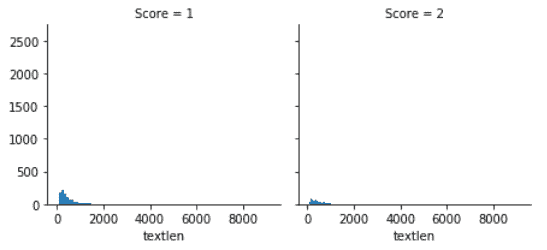
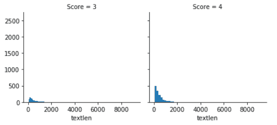
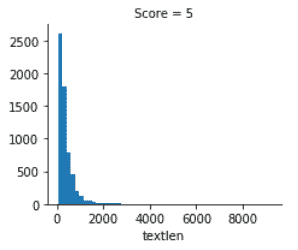
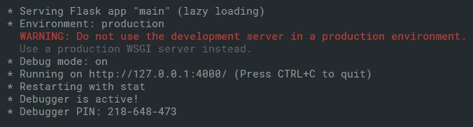
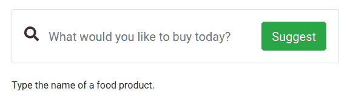
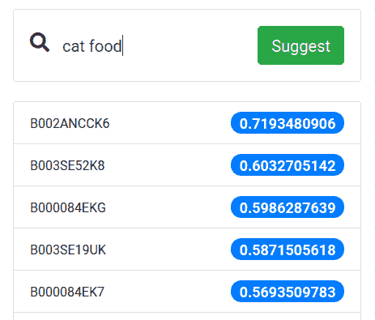

# 九、启用深度学习的网站的通用生产框架

在前面的章节中，我们已经在使用行业级云**深度学习**（**DL**）API 的方面打下了基础，并且已通过实际示例了解了它们的使用。 在本章中，我们将介绍开发支持 DL 的网站的一般概述。 这将要求我们将到目前为止所学到的所有知识汇总在一起，以便我们可以将其用于实际的用例中。 在本章中，我们将学习如何通过首先准备数据集来构建用于生产的 DL Web 应用。 然后，我们将使用 Python 训练 DL 模型，然后使用 Flask 将 DL 模型包装在 API 中。

以下是本章的简要概述：

*   定义我们的问题陈述
*   将问题分为几个部分
*   建立思维模型来绑定项目组件
*   我们应该如何收集数据
*   遵循我们项目的目录结构
*   从头开始构建项目

# 技术要求

您可以通过[这里](https://github.com/PacktPublishing/Hands-On-Python-Deep-Learning-for-Web/tree/master/Chapter9)访问本章中使用的代码。

要运行本章中使用的代码，您将需要以下软件：

*   Python 3.6+
*   Python PIL 库
*   NumPy
*   Pandas
*   **自然语言工具包**（**NLTK**）
*   Flask 1.1.0+ 和以下版本的兼容版本：
    *   FlaskForm
    *   wtforms
    *   flask_restful
    *   flask_jsonpify

本章将介绍所有其他安装。

# 定义问题陈述

任何项目都应该以定义明确的问题陈述开始，否则项目开发必定会遭受损失。 从项目计划到项目成本，问题说明控制着整个项目开发流程中涉及的所有主要步骤。

例如，在基于 DL 的 Web 项目中，问题说明将使我们了解以下内容：

*   确定我们需要哪种数据。
*   就代码，计划和其他资源而言，将有多少复杂性。
*   我们将开发什么样的用户界面。
*   会有多少人参与，以便可以估计项目的人力等。

因此，为了使我们能够开始进一步的项目开发，确实需要定义明确的问题陈述。

想象一下，正在一家公司的 DL 工程师，该公司正计划建立一个推荐系统，以根据用户提供的标准从产品列表中推荐产品。 您的老板要求您基于此开发**概念证明**（**PoC**）。 那么，我们应该怎么做呢？ 如前所述，让我们首先定义问题陈述。

向最终推荐系统提供输入的主要实体是用户。 根据用户的首选项（现在称为输入特征首选项），系统将提供最符合其首选项的产品列表。 因此，长话短说，问题陈述可以写为：

“给定一组输入特征（用户偏好），我们的任务是建议产品列表。”

现在我们有一个定义明确的问题说明，接下来继续进行，并在下一节中建立后续步骤。

# 建立项目的心理模型

查看问题陈述，您可能会想打开浏览器并开始搜索一些数据集。 但是，要正确地开发项目，就需要进行明确的规划以逐步构建项目。 没有结构的项目无非是无舵船。 因此，我们将从一开始就对此保持谨慎。 我们将讨论将在我们的项目中扮演非常重要角色的模块。 这也包括一些精神上的考虑。 我喜欢将此阶段称为建立项目的心理模型。

让我们花一些时间进一步讨论问题陈述，以便弄清楚我们需要开发的基本模块。

我们的项目涉及根据用户的偏好向用户推荐产品。 因此，为了执行此建议，我们需要一个知道如何理解用户为其提供的偏好集的系统。 为了能够理解这些偏好，系统将需要某种我们将要实现 DL 的训练。 但是偏好呢？ 他们看起来如何？ 在需要人员参与的现实世界项目情况中，您经常会遇到这些问题。

现在，请三思而后行，并尝试思考在选择要购买的产品时通常要寻找的方面。 让我们在这里列出它们：

*   产品的规格是什么？ 如果我想穿大尺寸的 T 恤，不建议我穿小尺寸的 T 恤。
*   产品的价格是多少？ 用户资金有限，此推荐对他们的钱包有利吗？
*   这个产品是什么牌子的？ 用户经常对多家公司生产的类似产品有品牌偏好。

请注意，前面的指针没有任何特定的顺序。

因此，从上一节开始，我们开始了解我们所需要的东西，这是一个界面（在我们的情况下，本质上是一个网页），供用户提供其首选项。 考虑到这些首选项，我们的系统将预测一组最合适的产品。 这是 DL 部分发挥作用的地方。 正如我们将在前面的章节中回顾的那样，要使 DL 模型能够处理给定的问题，就需要对一些表示问题的数据进行尽可能严密的训练。 现在让我们讨论系统的数据部分。

我们有一个易于使用的数据集，该数据集是由 Amazon 提供并由 Stanford Network Analysis Project 团队创建的 Amazon Fine Food Reviews 数据集。 尽管数据集很大，但在本章中创建演示时，我们不会使用完整的数据集。 此处可能触发的一个直接问题是数据集的外观如何？ 我们需要制定一个粗略的计划来决定以下内容：

*   我们将选择哪些特征来构建数据集
*   我们将在哪里收集数据

让我们对原始问题陈述进行一些增强，然后再继续进行。 这是原始的问题陈述：

“给定一组输入特征（用户偏好），我们的任务是建议产品列表。”

如果推荐不合格产品，用户将不会喜欢我们的系统。 因此，我们将对问题陈述进行一些修改，如下所示：

“给定一组输入特征（用户首选项），我们的任务是建议可能要购买的最佳产品清单。”

为了让我们的系统针对给定的标准推荐最佳产品列表，首先需要知道产品的平均等级。 除了平均评分之外，获取有关特定产品的以下信息（名称除外）将非常有用：

*   技术指标
*   产品种类
*   卖方名称
*   平均价格
*   预计交货时间

在准备数据时，我们将寻找有关特定产品的先前指示。 现在是我们将从何处收集数据的问题。 答案是亚马逊！ 亚马逊以其在电子商务行业中的服务而闻名，向我们提供各种产品和有关它们的信息，例如它们的等级，产品规格，商品价格等。 但是请说亚马逊不允许您直接将这些数据作为压缩文件下载。 为了以所需的形式从亚马逊获取数据，我们将不得不依靠网络抓取。

在讨论的这一点上，我们可以确定该项目的两个主要领域：

*   接收用户偏好的界面
*   代表我们正在处理的问题陈述的数据

对于 DL 建模，我们将从简单的，全连接，基于神经网络的架构开始。 从简单的模型开始逐步增加复杂性通常是有用的，因为它使代码库更易于调试。

因此，可以肯定地说，以下三个模块将在该项目中扮演重要角色：

*   接口
*   数据
*   DL 模型

希望您现在对开始进行项目开发有了一个不错的想法。 您现在可以从所涉及的框架中解决在此阶段您应该问什么问题以及可能需要考虑的问题。

我们不希望我们的推荐系统偏向于任何事物。 数据中可能隐藏了许多类型的偏差，并且自然而然地，它可能导致使用它的 DL 系统继承该偏差。

要了解有关机器学习系统中不同类型偏见的更多信息，建议您参考[偏差类型](https://developers.google.com/machine-learning/crash-course/fairness/types-of-bias)。 在我们的案例中，一个令人吃惊的偏见例子是男性访问者获得平均推荐的产品推荐的情况。 这些建议可能仅基于其性别，而不基于任何其他访客浏览模式。 这可能是错误的，并且可能做错了。 但是像这样的实例会使我们的模型非常不合适。 在下一节中，我们将讨论一些要点，以了解如何避免数据出现偏差。

# 避免首先获得错误数据的机会

什么是错误数据？ 我们只是在谈论错误值的数据吗？ 答案是不。 除了具有错误或缺失值的数据外，错误数据还可能具有细微但严重的错误，这可能导致模型训练不充分甚至偏差。 因此，在训练模型之前，识别出此类错误数据并将其删除非常重要。 识别这些错误的主要方法有五种：

*   寻找缺失的值。
*   寻找似乎超出规模或可能性的值，即异常值。
*   请勿在数据集中包含任何可能导致数据泄漏的功能。
*   确保所有评估类别在数据集中都有相似数量的样本。
*   确保您设计的问题解决方案本身不会带来偏差。

一旦明确了这些要点，我们就可以继续进行更具体的领域，在数据收集过程中我们需要注意这些领域。 重要的是，在数据收集期间要制定适当的计划，以牢记数据源的所有属性和问题陈述的要求。

假设您正在从亚马逊在美国的销售网点抓取产品数据，而最终在印度版本的亚马逊上搜索产品。 刮板可能会为您提供来自印度网点的数据，可能不适合推荐给美国居民。

此外，由于亚马逊以及类似的服务（例如 Flipkart）利用推荐系统为他们的客户定位最适合的*产品*，因此在数据收集期间，抓取工具不应成为此类建议的牺牲品。 重要的是，抓取工具应时不时地清除其上下文，并避免由于亚马逊实现的 AI 而产生偏见。

让我们以 Amazon Fine Food Reviews 数据集为例。 尽管乍看之下数据集看起来很平衡，但我们可以发现数据集中存在很多偏差。 考虑客户为评论产品而撰写的文字长度。 让我们根据它们的得分在图表中绘制它们。 下图显示了等级为 1 和 2 星的产品的图：



下图显示了评级为 3 星和 4 星的产品的图：



下图显示了评级为 5 星的产品的图：



请注意，越来越多的正面评论中有更多书面文字。 这将直接转换为数据集中的大多数单词，从而使用户获得更高的评分。 现在，考虑一种情况，用户撰写一篇冗长的评论，评分较低，并且对该产品普遍持消极看法。 由于我们的模型经过训练，可以将较长的评论与正面评价相关联，因此会将负面评论标记为正面。

最重要的是，如图所示，现实世界的数据可能包含许多边缘情况，如果未正确处理它们，您很可能会得到错误的模型。

# 如何不建立 AI 后端

考虑到 Web 应用可以发展的广泛性以及几乎所有其他平台对作为基于 Web 的服务运行的后端的强烈依赖，因此，对后端进行周密的考虑和正确执行非常重要。 即使在 PoC 阶段，基于 AI 的应用通常也不会很快响应或花费大量时间来训练新样本。

虽然我们将讨论使后端不因瓶颈而受阻的提示和技巧，但在为网站开发 AI 集成后端时，我们需要提出一些最好避免的指针 。

# 期望网站的 AI 部分是实时的

人工智能在计算上是昂贵的，不用说，这对于旨在以最快的时间为其客户提供服务的网站而言是不可取的。 虽然较小的模型或使用浏览器 AI（例如 TensorFlow.js 或其他库）可以提供实时 AI 响应的体验，但即使它们遇到客户端在慢速网络区域或使用低端设备的问题。 因此，浏览器内 AI 模型或轻量级 AI 模型几乎立即回复的两种方法都受设备配置和网络带宽的影响。 因此，理想情况下，应该对客户端做出快速响应的网站后端应该与处理 AI 模型响应的部分分开。 两者并行工作，应保持共同的数据存储和两者之间正确的交互方法，以使负责响应客户端的后端代码对 AI 模型部分的依赖性降低。

# 假设从网站传入的数据是理想的

即使与该项目相对应的网站或应用可能类似于理想的数据收集方法，但也不应假定来自该网站或应用的数据没有错误。 错误的网络请求，恶意连接或仅由用户提供的垃圾输入都可能导致数据不适合进行训练。 非恶意用户可能会遇到网络问题，并在短时间内刷新同一页面 10 到 20 次，这不应增加该页面基于查看的重要性。 从网站收集的所有数据必须根据模型的要求进行清理和过滤。 必须牢记，网站所面临的挑战几乎肯定会影响所收集数据的质量。

# 集成端到端 AI 的 Web 应用示例

现在，我们已经讨论了概述，以及在创建基于 AI 的网站后端时应避免的陷阱，让我们继续创建一个（尽管相当简单）来演示该解决方案的总体概述。

如上所述，我们将介绍以下步骤：

*   根据问题陈述收集数据
*   清理和预处理数据
*   建立 AI 模型
*   创建一个界面
*   在界面上使用 AI 模型

虽然我们之前讨论了收集数据的陷阱，但在这里我们将简要讨论可用于完成任务的工具和方法。

# 数据收集与清理

从总体角度来看，出于收集数据的目的，可能有多个数据源。 您可以从网站上抓取数据，也可以下载一些准备好的数据集。 也可以采用其他方法，例如：

*   在应用/网站运行时动态生成数据
*   从应用或智能设备登录
*   通过系统形式（例如测验或调查）直接从用户收集数据
*   从调查机构收集数据
*   通过特定方法（科学数据）和其他方法测得的观测数据

`beautifulsoup`是通常用于执行 Web 抓取的库。 `Scrapy`是另一种流行的工具，可以非常快速地使用。

数据清除将完全取决于您收集的数据形式，并且在本书的前几章中已进行了讨论。 我们将假定您能够将数据转换为适合您希望进行模型构建部分的格式。 对于本节中的其他主题，我们将使用一个名为 Amazon Fine Food Reviews 的准备好的数据集，可以从[这里](https://www.kaggle.com/snap/amazon-fine-food-reviews)下载。提取下载的 ZIP 文件后，您将获得名为`Reviews.csv`的数据集。

[这里](https://github.com/Nilabhra/kolkata_nlp_workshop_2019)是观察如何执行 Web 抓取和准备干净数据集的一个很好的起点。

# 建立 AI 模型

现在，我们将准备 AI 模型，该模型将根据用户的查询推荐产品。 为此，我们创建一个新的 Jupyter 笔记本。

# 进行必要的导入

首先，将所需的 Python 模块导入项目：

```py
import numpy as np
import pandas as pd
import nltk
from nltk.corpus import stopwords 
from nltk.tokenize import WordPunctTokenizer
from sklearn.model_selection import train_test_split
from sklearn.feature_extraction.text import TfidfVectorizer

# Comment below line if you already have stopwords installed
nltk.download('stopwords')
```

我们导入`TfidfVectorizer`以帮助我们创建用于执行自然语言处理的**词频逆文档频率**（**TF-IDF**）向量。 TF-IDF 是在给定多个文档可能包含或不包含单词的情况下，单个文档中单词的重要性的数字量度。 在数字上，当单个单词在单个文档中频繁出现但在其他文档中不频繁出现时，它将增加重要性值。 TF-IDF 如此流行，以至于目前全球超过 80% 的基于自然语言的推荐系统都在使用它。

我们也正在导入`WordPunctTokenizer`。 标记器执行将文本分解为基本标记的功能。 例如，一个大的段落可能被分解为句子，然后进一步分解为单词。

# 读取数据集并准备清理函数

我们将读取具有`ISO-8859-1`编码的 Amazon Fine Food Reviews 数据集。 这仅是为了确保我们不会丢失评论文本中使用的任何特殊符号：

```py
df = pd.read_csv('Reviews.csv', encoding = "ISO-8859-1")
df = df.head(10000)
```

由于数据集非常大，因此我们将本章的工作限制为数据集中的前 10,000 行。

我们将需要从文本中删除停用词，并过滤掉括号中的符号和其他文字不自然的符号。 我们将创建一个名为`cleanText()`的函数，该函数将执行停用词的过滤和删除：

```py
import string
import re

stopwordSet = set(stopwords.words("english"))

def cleanText(line):
    global stopwordSet

    line = line.translate(string.punctuation)
    line = line.lower().split()

    line = [word for word in line if not word in stopwordSet and len(word) >= 3]
    line = " ".join(line)

    return re.sub(r"[^A-Za-z0-9^,!.\/'+-=]", " ", line) 
```

使用前面的函数，我们从文本中删除了停用词和所有少于三个字符的词。 我们已过滤掉标点符号，仅保留了文本中的相关字符。

# 提取所需的数据

数据集包含的数据超出了我们手头演示所需的数据。 我们将提取`ProductId`，`UserId`，`Score`和`Text`列以准备我们的演示。 产品名称出于保密原因而被加密，就像用户名称被加密一样：

```py
data = df[['ProductId', 'UserId', 'Score', 'Text']]
```

在数据科学中，保持数据加密和不包含个人信息是一项挑战。 从数据集中删除部分很重要，这样可以识别出数据集中的私有实体。 例如，您将需要从评论文本中删除人员和组织名称，以阻止识别产品和用户，尽管他们具有加密的产品和用户 ID。

# 应用文字清理

现在，我们将应用文本过滤和停用词删除函数来清理数据集中的文本：

```py
%%time
data['Text'] = data['Text'].apply(cleanText)
```

显示执行任务所需的时间。

请注意，前面的代码块仅在 Jupyter 笔记本中有效，而在常规 Python 脚本中无效。 要在普通的 Python 脚本上运行它，请删除`%%time`命令。

# 将数据集分为训练和测试部分

由于我们只有一个数据集，因此我们将其分为两部分，特征和标签部分分开：

```py
X_train, X_valid, y_train, y_valid = train_test_split(data['Text'], df['ProductId'], test_size = 0.2) 
```

我们将使用`sklearn`模块中的`train_test_split()`方法将数据集分为 80% 用于训练和 20% 用于测试。

# 汇总有关产品和用户的文本

现在，我们将按用户和产品 ID 汇总数据集的评论。 我们需要对每种产品进行审查，以确定哪种产品将是以下方面的理想选择：

```py
user_df = data[['UserId','Text']]
product_df = data[['ProductId', 'Text']]
user_df = user_df.groupby('UserId').agg({'Text': ' '.join})
product_df = product_df.groupby('ProductId').agg({'Text': ' '.join})
```

同样，用户汇总的评论将帮助我们确定用户的喜好。

# 创建用户和产品的 TF-IDF 向量化器

现在，我们将创建两个不同的向量化程序，一个用于用户，另一个用于产品。 我们将需要这些向量化工具来确定用户需求与评论对任何给定产品的了解之间的相似性。 首先，我们将为用户创建向量化器并显示其形状：

```py
user_vectorizer = TfidfVectorizer(tokenizer = WordPunctTokenizer().tokenize, max_features=1000)
user_vectors = user_vectorizer.fit_transform(user_df['Text'])
user_vectors.shape
```

然后，我们将为产品创建向量化器：

```py
product_vectorizer = TfidfVectorizer(tokenizer = WordPunctTokenizer().tokenize, max_features=1000)
product_vectors = product_vectorizer.fit_transform(product_df['Text'])
product_vectors.shape
```

我们使用`WordPunctTokenizer`分解文本，并使用`TfidfVectorizer`对象的`fit_transform`方法准备向量，这些向量将单词词典映射到它们在文档中的重要性。

# 通过提供的评级创建用户和产品的索引

我们使用`pandas`模块的`pivot_table`方法来创建针对产品的用户评分矩阵。 我们将使用此矩阵执行矩阵分解以确定用户喜欢的产品：

```py
userRatings = pd.pivot_table(data, values='Score', index=['UserId'], columns=['ProductId'])
userRatings.shape
```

我们还将将用户和产品的`TfidfVectorizer`向量转换为适合矩阵分解的矩阵：

```py
P = pd.DataFrame(user_vectors.toarray(), index=user_df.index, columns=user_vectorizer.get_feature_names())
Q = pd.DataFrame(product_vectors.toarray(), index=product_df.index, columns=product_vectorizer.get_feature_names())
```

现在，我们可以创建矩阵分解函数。

# 创建矩阵分解函数

现在，我们将创建一个函数来执行矩阵分解。 矩阵分解已成为 2006 年 Netflix 奖挑战赛中用于推荐系统的流行算法系列。它是将用户项矩阵分解为两个低维矩形矩阵的集合的一系列算法，可以将这些矩阵相乘以恢复原始矩阵。 原始高阶矩阵：

```py
def matrix_factorization(R, P, Q, steps=1, gamma=0.001,lamda=0.02):
    for step in range(steps):
        for i in R.index:
            for j in R.columns:
                if R.loc[i,j]>0:
                    eij=R.loc[i,j]-np.dot(P.loc[i],Q.loc[j])
                    P.loc[i]=P.loc[i]+gamma*(eij*Q.loc[j]-lamda*P.loc[i])
                    Q.loc[j]=Q.loc[j]+gamma*(eij*P.loc[i]-lamda*Q.loc[j])
        e=0
        for i in R.index:
            for j in R.columns:
                if R.loc[i,j]>0:
                    e= e + pow(R.loc[i,j]-np.dot(P.loc[i],Q.loc[j]),2)+lamda*(pow(np.linalg.norm(P.loc[i]),2)+pow(np.linalg.norm(Q.loc[j]),2))
        if e<0.001:
            break

    return P,Q
```

然后，我们执行矩阵分解并记录所花费的时间：

```py
%%time
P, Q = matrix_factorization(userRatings, P, Q, steps=1, gamma=0.001,lamda=0.02)
```

之后，我们需要保存模型。

# 将模型另存为 Pickle

现在，在项目的`root`目录中创建一个名为`api`的文件夹。 然后，保存训练后的模型，该模型是用户产品评级矩阵分解后获得的低阶矩阵：

```py
import pickle
output = open('api/model.pkl', 'wb')
pickle.dump(P,output)
pickle.dump(Q,output)
pickle.dump(user_vectorizer,output)
output.close()
```

将模型另存为二进制 Pickle 文件，使我们可以在将模型部署到网站的后端时将它们快速加载回内存中。

既然我们已经完成了预测模型的开发，那么我们将继续为应用构建接口。

# 建立界面

要为 Web 应用构建界面，我们需要考虑如何让用户与系统交互。 在我们的案例中，我们希望在用户提交搜索查询时根据其在搜索栏中搜索的内容为他们提供建议。 这意味着我们需要系统实时响应并即时生成建议。 为了构建该系统，我们将创建一个 API，该 API 会响应搜索查询。

# 创建一个 API 来回答搜索查询

我们将创建一个 API，该 API 接受 HTTP 请求形式的查询，并根据用户输入的搜索查询回复产品建议。 这样做，请按照下列步骤操作：

1.  我们将从导入 API 所需的模块开始。 我们在上一节中讨论了这些导入的模块：

```py
import numpy as np
import pandas as pd
from nltk.corpus import stopwords
from nltk.tokenize import WordPunctTokenizer
from sklearn.feature_extraction.text import TfidfVectorizer
from sklearn.feature_extraction.text import CountVectorizer
from flask import Flask, request, render_template, make_response
from flask_wtf import FlaskForm
from wtforms import StringField, validators
import io
from flask_restful import Resource, Api
import string
import re
import pickle
from flask_jsonpify import jsonpify
```

2.  我们还将导入`Flask`模块以创建一个快速 HTTP 服务器，该服务器可以以 API 的形式在已定义的路由上使用。 我们将实例化`Flask`应用对象，如下所示：

```py
DEBUG = True
app = Flask(__name__)
app.config['SECRET_KEY'] = 'abcdefgh'
api = Api(app)
```

应用配置中的`SECRET_KEY`的值由您决定。

3.  然后，我们将创建一个`class`函数来处理从用户以搜索查询形式收到的文本输入：

```py
class TextFieldForm(FlaskForm):
    text = StringField('Document Content', validators=[validators.data_required()])
```

4.  为了封装 API 方法，我们将它们包装在`Flask_Work`类中：

```py
class Flask_Work(Resource):
    def __init__(self):
        self.stopwordSet = set(stopwords.words("english"))
        pass
```

5.  再次需要我们在模型创建期间使用的`cleanText()`方法。 它将用于清除和过滤用户输入的搜索查询：

```py
    def cleanText(self, line): 
        line = line.translate(string.punctuation)
        line = line.lower().split()

        line = [word for word in line if not word in self.stopwordSet and len(word) >= 3]
        line = " ".join(line)

        return re.sub(r"[^A-Za-z0-9^,!.\/'+-=]", " ", line) 
```

6.  我们为应用定义一个主页，该主页将从稍后在模板中创建的`index.html`文件加载：

```py
    def get(self):
        headers = {'Content-Type': 'text/html'}
        return make_response(render_template('index.html'), 200, headers)
```

7.  我们创建基于`post`方法的预测路由，该路由将在收到用户的搜索查询后以产品建议进行响应：

```py
    def post(self):
        f = open('model.pkl', 'rb')
        P, Q, userid_vectorizer = pickle.load(f), pickle.load(f), pickle.load(f)
        sentence = request.form['search']
        test_data = pd.DataFrame([sentence], columns=['Text'])
        test_data['Text'] = test_data['Text'].apply(self.cleanText)
        test_vectors = userid_vectorizer.transform(test_data['Text'])
        test_v_df = pd.DataFrame(test_vectors.toarray(), index=test_data.index,
                                 columns=userid_vectorizer.get_feature_names())

        predicted_ratings = pd.DataFrame(np.dot(test_v_df.loc[0], Q.T), index=Q.index, columns=['Rating'])
        predictions = pd.DataFrame.sort_values(predicted_ratings, ['Rating'], ascending=[0])[:10]

        JSONP_data = jsonpify(predictions.to_json())
        return JSONP_data
```

8.  我们将`Flask_Work`类附加到`Flask`服务器。 这样就可以在运行时完成脚本。 我们放置了一个 API，该 API 根据用户的搜索查询来建议产品：

```py
api.add_resource(Flask_Work, '/')

if __name__ == '__main__':
    app.run(host='127.0.0.1', port=4000, debug=True)
```

将此文件另存为`main.py`。 创建 API 脚本后，我们需要托管服务器。

9.  为此，请在终端上运行以下命令：

```py
python main.py
```

这将在端口`4000`上的计算机上启动服务器，如下所示：



但是，我们仍然需要准备一个用户界面来使用此 API。 我们将在以下部分中这样做。

# 创建一个使用 API​​ 的接口

现在，我们将创建一个简单，最少的 UI 来使用我们创建的 API。 本质上，我们将创建一个搜索栏，用户可以在其中输入所需的产品或产品规格，API 会根据用户的查询返回建议。 我们将不讨论构建 UI 的代码，但已将其包含在 GitHub 存储库中，该存储库可在[这个页面](http://tiny.cc/DL4WebCh9)中找到。

启动服务器后，该 UI 将在`http://127.0.0.1:4000`处可见，如“创建 API 回答搜索查询”部分的步骤 9 所示。

我们创建的界面如下所示：



用户输入搜索查询并获得建议，如下所示：



我们的应用没有保存用户会话的好处。 而且，它没有用于用户预期预算的参数，这通常是决定产品是否适合用户的决定因素。 将这些功能添加到 Web 应用并利用它们的好处很容易。

# 总结

总体而言，磨练 DL 功能的 Web 应用有几种设置方法，可通过 API，浏览器内 JavaScript 或通过将 DL 模型默默地嵌入到应用的后端来实现。 在本章中，我们了解了如何使用这些方法中最常见的方法（基于 API 的 DL Web 应用），同时，我们对如何设计类似的解决方案进行了粗略的概述。 我们介绍了确定问题陈述和后续解决方案所涉及的思考过程，以及在设计集成 DL 模型的 Web 应用时应避免的陷阱和痛点。

在下一章中，我们将讨论一个端到端项目，该项目出于安全目的将 DL 集成在 Web 应用上。 我们将了解 DL 如何帮助我们识别可疑活动并阻止垃圾邮件用户。