# 十二、使用 DL API 和客户支持聊天机器人创建 E2E Web 应用

在本章中，我们将汇总在本书前几章中已学会使用的几种工具和方法，并介绍一些出色的新工具和技术。 本章涵盖企业的一个非常重要的方面-客户支持。 对于一家新兴企业，客户支持会不断精疲力竭，难以跟上。 通常，通过参考文档或公司在其网站上提供的一组常见问题解答，可以轻松回答客户提出的问题，但是客户通常不会仔细阅读它们。 因此，最好有一个自动化层，其中最常见的查询将由一个聊天机器人来回答，该聊天机器人在一天中始终可用并且响应迅速。

本章讨论如何使用 Dialogflow 创建聊天机器人来解决一般的客户支持查询，以及如何将其集成到基于 Django 的网站中。 此外，聊天机器人还将从将单独托管的 Django API 中获得答案。 我们将探索实现机器人个性的方法，并介绍一种实现**文本到语音**（**TTS**）和**语音到文本**（STT）的用户界面。通过 Web 语音 API，该接口将神经网络直接部署到用户的浏览器。

我们将在本章介绍以下主题：

*   NLP 简介
*   聊天机器人简介

*   创建具有客户支持代表个性的 Dialogflow 机器人
*   使用 ngrok 促进本地主机上的 HTTPS API
*   使用 Django 创建测试 UI 来管理公司内的订单
*   使用 Web Speech API 在网页上进行语音识别和语音合成

我们将从先前各章中学到的知识中汲取见识，并在此基础上加以借鉴，同时修改一些概念并在此过程中引入新的概念。 让我们从理解**自然语言处理**（**NLP**）开始。

# 技术要求

您可以在[这个页面](https://github.com/PacktPublishing/Hands-On-Python-Deep-Learning-for-Web/tree/master/Chapter12)上访问本章的代码。

您需要以下软件来运行本章中使用的代码：

*   Python 3.6+
*   Django 2.x

本章将介绍所有其他安装。

# NLP 简介

NLP 是机器学习和深度学习应用中最受欢迎的也是最令人兴奋的领域之一，它是指为理解和生成人类语言而开发的一系列技术和方法。 NLP 的目标始于理解人类语言文本的含义，并扩展到生成人类语言，从而使生成的句子有意义并且对阅读该文本的人类有意义。 NLP 已在构建系统中找到了主要用途，该系统能够以自然语言的形式直接从人类接收指令和请求，例如聊天机器人。 但是，聊天机器人还需要以自然语言进行响应，这是 NLP 的另一个方面。

让我们研究一些与 NLP 相关的常用术语。

# 语料库

在学习 NLP 时，您经常会遇到**语料库**。 用外行的术语来说，语料库是任何一位作者或文学体裁的著作的集合。 在 NLP 的研究中，对语料库的词典定义进行了一些修改，可以表示为书面文本文档的集合，以便可以通过任何选择的度量将它们全部归类。 这些指标可能是作者，出版者，类型，写作类型，时间范围以及与书面文本相关的其他特征。

例如，莎士比亚作品集或任何论坛上针对任何给定主题的话题都可以被视为语料库。

# 词性

当我们将一个句子分解成其组成词，并对该句子中每个词对句子整体含义的贡献进行定性分析时，我们执行确定词性的动作。 因此，词性是基于句子中单词对句子含义的贡献而提供给它们的符号。

在英语中，我们通常有八种类型的词性-动词，名词，代词，形容词，副词，介词，连接词和感叹词。

例如，在句子`Ram is reading a book.`中，`Ram`是名词和主语，`reading`是单词和动作，而`book`是名词和宾语。

您可以在[这个页面](http://partofspeech.org/)上阅读有关词性的更多信息。 您可以尝试在[这个页面](https://linguakit.com/en/part-of-speech-tagging)上找出自己句子的词性。

# 分词

分词是将文档分解为句子并将句子分解为单词的过程。 这很重要，因为如果任何计算机程序都试图将整个文档作为单个字符串处理，这将是计算上的噩梦，因为与处理字符串相关的资源密集型。

此外，非常罕见的是，需要一次阅读所有句子才能理解整个文档的含义。 通常，每个句子都有自己独立的含义，可以通过统计方法将其与文档中的其他句子同化，以确定任何文档的整体含义和内容。

同样，我们经常需要将句子分解为单词，以便更好地处理句子，以便可以概括句子的含义并从其中每个单词单独列出的字典中导出。

# 词干提取和词形还原

在 NLP 中，词干提取和词形还原是紧密相关的术语，但有细微但显着的差异。 两种方法的目的都是确定任何给定单词所源自的词根，以便该词根的任何派生词都可以与字典中的词根匹配。

词干提取是一个基于规则的过程，在该过程中，单词会被修剪，有时还会附加指示其词根的修饰符。 但是，词干提取有时可能会产生人类词典中不存在的词根，因此对人类读者毫无意义。

词形还原是将单词转换为词典中给出的词形或词根的过程。 因此，单词的最初含义可以从人类词典中获得，使词形还原的文本比词干提取的文本更易于使用。 此外，词形还原在确定其正确的词性之前考虑了词在任何给定句子中的词性，词干提取算法会忽略该词性。 使得词形还原比词干提取更具有上下文感知能力。

# 词袋

计算机不可能直接处理和使用文本。 因此，在将所有文本输入机器学习模型之前，必须将其转换为数字。 将文本更改为数字数组的过程，以便可以在任何时间点从转换后的文本中检索最重要的原始文本，这称为特征提取或编码。 **词袋**（**BoW**）是一种流行的简单技术，用于对文本执行特征提取。

与 BoW 实现相关的步骤如下：

1.  从文档中提取所有唯一的单词。
2.  用文档中所有唯一的单词创建一个向量。
3.  根据单词向量中是否存在任何单词，将每个文档转换为布尔数组。

例如，考虑以下三个文档：

1.  `Ram is a boy.`
2.  `Ram is a good boy.`
3.  `Ram is not a girl.`

这些文档中存在的唯一词可以在向量中列出为`["Ram"，"is"，"a"，"boy"，"good"，"not"，"girl"]`。

因此，每个句子可以按如下方式转换：

1.  `[1, 1, 1, 1, 0, 0, 0]`
2.  `[1, 1, 1, 1, 1, 0, 0]`
3.  `[1, 1, 1, 0, 0, 1, 1]`

您将观察到 BoW 往往会丢失有关每个单词出现在句子中的位置或其对句子有什么意义的信息。 因此，BoW 是一种非常基本的特征提取方法，可能不适用于需要上下文感知的多个应用。

# 相似度

相似度是任何两个给定句子的相似度的量度。 它在计算机科学领域以及维护记录的任何地方都是非常流行的操作，用于搜索正确的文档，在任何文档中搜索单词，认证和其他应用。

有两种方法可以计算两个给定文档之间的相似度。 Jaccard 索引是最基本的形式之一，它根据两个文档中相同令牌总数占文档中唯一令牌总数的百分比来计算两个文档的相似性。

余弦相似度是另一个非常流行的相似度指数，通过使用 BoW 或任何其他特征提取技术将两个文档的向量转换为向量后形成的余弦来计算。

考虑到这些概念，让我们继续研究聊天机器人，这是 NLP 最受欢迎的应用形式之一。

# 聊天机器人简介

聊天机器人是 NLP 应用的一部分，专门处理会话接口。 这些界面还可以扩展其工作以处理基本的命令和动作，在这些情况下，它们被称为基于语音的虚拟助手。 最近，随着专用设备（如 Google 的 Google Home 和 Alexa）的推出，基于语音的虚拟助手正在兴起。

聊天机器人可以以多种形式存在。 他们并不需要仅以虚拟助手的身份出现。 您可以在游戏中与聊天机器人对话，尝试在特定方向绘制故事剧情，也可以与一些公司用来在社交媒体平台（例如 Twitter 或 Facebook）上回复其客户的社交聊天机器人进行交互。 聊天机器人可以看作是在**交互式语音响应**（**IVR**）系统上移动的系统，它们具有增强的智能和对未知输入的响应能力，有时仅使用回退响应，有时甚至利用提供的输入进行响应。

虚拟助手也可以存在于网站上，为访问者提供指导和帮助。 诸如此类的助手经常在网站上找到，主要是为消费者查询提供即时支持。 您一定已经注意到几个销售产品或服务的网站上的“问问题”或“可以帮助您”聊天框，通常在屏幕的右下角。 他们经常使用自动聊天机器人代替真实的人来回答查询。 仅在查询过于复杂而无法由自动客户支持聊天机器人回答的情况下，查询才会转移到真实的人。

创建对话式 UI 本身就是一门艺术。 您需要能够使用清晰但对口语很自然的单词。 您可以通过[这里](https://designguidelines.withgoogle.com/conversation/)了解有关创建对话式用户界面的更多信息。

在下一部分中，我们将创建一个充当客户支持智能体的聊天机器人。

# 创建具有客户支持代表个性的 Dialogflow 机器人

Dialogflow 是用于创建聊天机器人的非常流行的工具。 类似于 Wit.ai，Botpress，Microsoft Bot Framework 和其他一些可用于创建聊天机器人的即时部署服务，Dialogflow 还具有与 **Google Cloud Platform**（**GCP**），并可以将 Dialogflow 智能体用作 Google 助手的操作，该助手可在数十亿个 Android 设备上本地运行。

Dialogflow 以前称为 Api.ai。 在被 Google 收购之后，它被重命名，并且自那时以来，它的受欢迎程度和可扩展性都在增长。 该平台可以非常轻松地与多个平台集成，例如 Facebook Messenger，Telegram，Slack，Line，Viber 和其他几个主要的通信平台。

我们将在本章中开发的项目将遵循以下架构图：

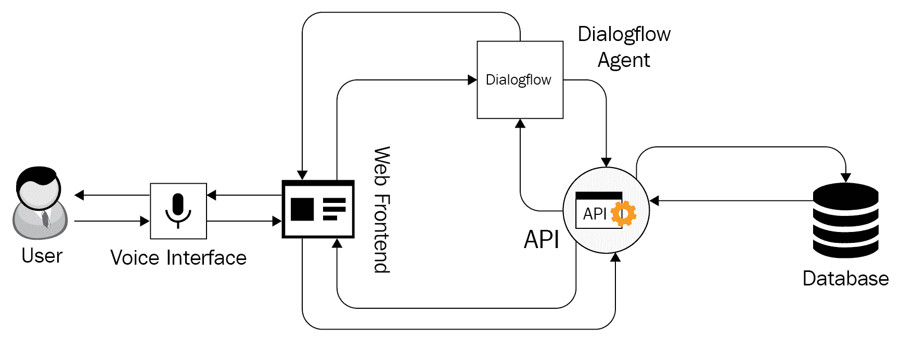

我们将使用上图中未提及的几个库和服务。 我们将在项目过程中介绍它们，并讨论为什么对我们了解它们很有趣。

# Dialogflow 入门

要开始使用 Dialogflow，您应该访问[官方网站](https://dialogflow.com)，进入首页，该页面显示了产品信息和文档链接。 研究您要学习的任何产品或服务的文档始终是一个好主意，因为它包含软件的全部工作和功能。 我们将在本章的后续部分中参考文档中的部分。

您可以在[这个页面](https://cloud.google.com/dialogflow/docs/)上找到 Dialogflow 文档。

Dialogflow 与 GCP 紧密集成，因此我们必须首先创建一个 Google 帐户。 为此，请转到[这里](https://account.google.com)创建一个帐户。 如果您是第一次使用 Dialogflow 使用您的帐户，则可能需要为您的 Google 帐户提供许多权限。

让我们继续进行探索和了解 Dialogflow 帐户创建过程以及 UI 各个部分的步骤。

# 步骤 1 – 打开 Dialogflow 控制台

您需要单击[页面右上角](https://dialogflow.com)的“转到控制台”按钮。 或者，您可以在浏览器中输入`https://dialogflow.cloud.google.com/`。 如果您是初次使用，您将看到如下屏幕：

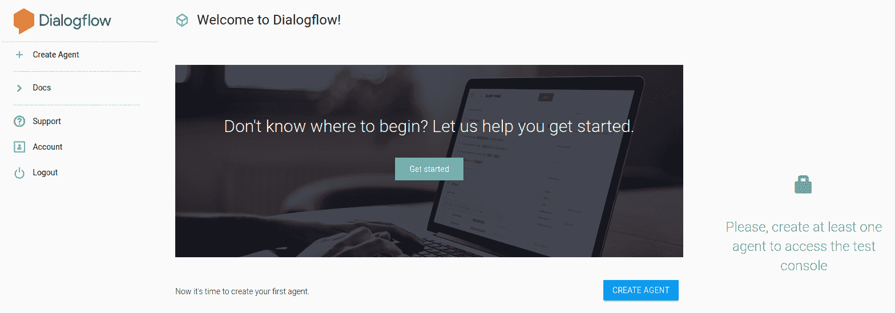

仪表板会提示您创建一个新智能体。

# 第 2 步 - 创建新智能体

现在，我们将创建一个 Dialogflow 智能体。 就 Dialogflow 而言，智能体是聊天机器人的别称。 它是接收，处理和响应用户提供的所有输入的智能体。

单击“创建智能体”按钮，然后根据您的喜好填写有关智能体的必要信息，其中包括智能体的名称，默认语言，时区和 Google 项目名称。

如果您在此步骤之前没有使用过 GCP，则必须创建一个项目。 我们已经在 “第 6 章”，“使用 Python 在 Google Cloud Platform 上进行深度学习”中，讨论了 GCP 项目的创建。 或者，您可以简单地让 GCP 在创建智能体时自动为您创建一个新项目。

# 步骤 3 – 了解仪表板

成功创建 Dialogflow 智能体后，将为您提供一个仪表板，如以下屏幕截图所示：

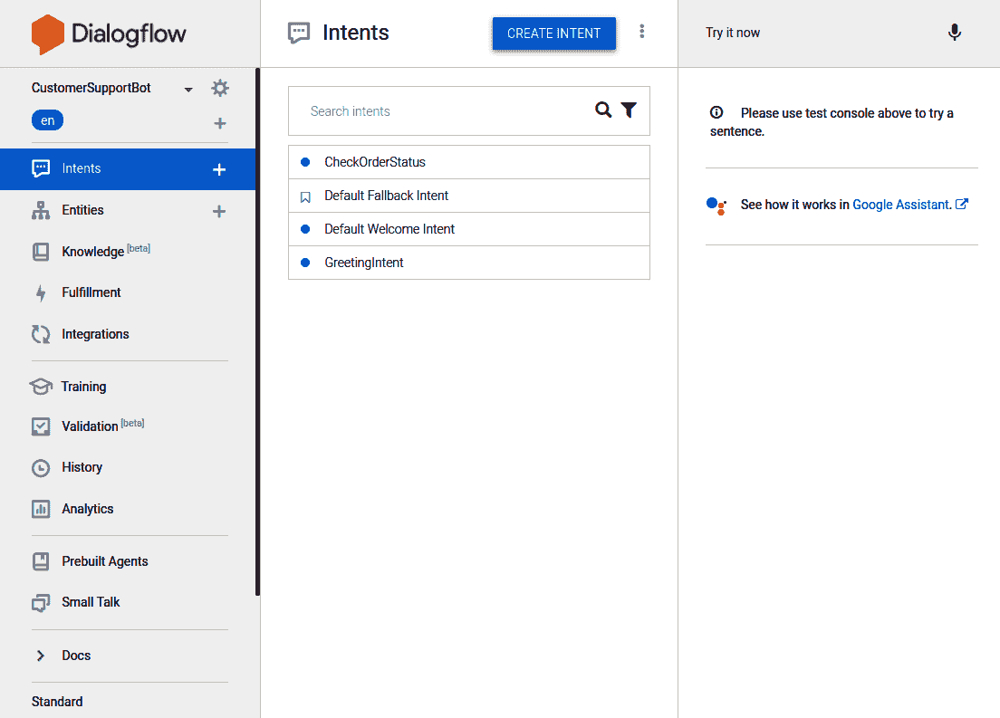

在左侧，您可以看到一个菜单，其中包含构成聊天机器人的各种组件。 该菜单将非常有用，您应该仔细阅读其所有内容，以确保您了解菜单项中我们所指的内容。 当我们使用诸如“单击实体”之类的句子时，是指我们希望您单击此菜单中的“实体”项。

中心部分将包含不同的内容，具体取决于单击菜单中的哪个组件。 默认情况下，当您打开 Dialogflow 控制台时，它包含聊天机器人的意图列表。 目的是什么？

意图是用户希望通过对聊天机器人的任何说话来执行的动作。 例如，当用户说`Bring me a cup of coffee`时，他们的意图是让聊天机器人“喝咖啡”：

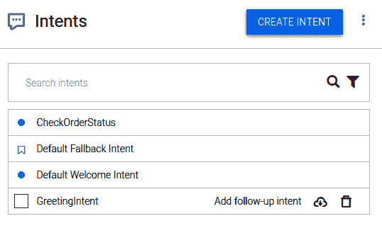

在最右边，提供了一个面板来随时测试聊天机器人。 您可以编写任何想要用来测试聊天机器人的响应的输入文本，并且会向您显示一系列信息以及聊天机器人产生的响应。

考虑以下测试输入和响应：

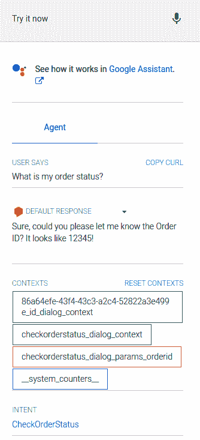

当用户输入`What is my order status`时，聊天机器人将答复，询问所涉及订单的订单 ID。 这与`CheckOrderStatus`意图匹配，并且需要名为`OrderId`的参数。 在开发过程中，我们将在整个项目中定期使用此控制台来调试聊天机器人。

虽然在先前的屏幕截图中，我们已经为您显示了一个带有意图的预配置智能体，但是您新创建的智能体此时将没有任何自定义意图。 让我们创建它们！

# 步骤 4 – 建立意图

现在，让我们创建两个意图。 一种意图将为用户提供帮助，另一种意图将对用户提供的订单 ID 的状态进行检查。

# 步骤 4.1 – 创建`HelpIntent`

在此子步骤中，单击左侧菜单中“意图”项目右侧的`+`按钮。 您将看到一个空白的意向创建表单。

您可以在意向创建表单中看到以下标题：

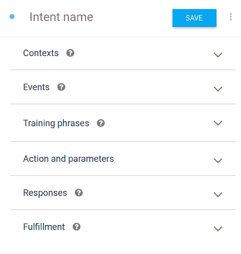

为此，在[Intent Name]中填写`HelpIntent`。

现在，按照以下步骤完成此意图创建。

**步骤 4.1.1 – 输入`HelpIntent`的训练短语**

现在，我们需要定义可能调用此行动意图的短语。 为此，请单击“训练短语”标题并输入一些样本训练短语，如下所示：

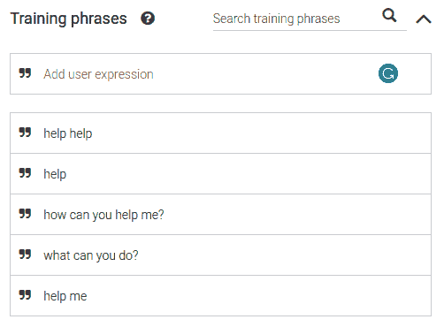

对意图进行任何更改时，请确保单击“保存”。

**步骤 4.1.2 – 添加响应**

为了以这种意图响应用户查询，我们需要定义可能的响应。 单击“意图创建”表单中的“响应”标题，然后向查询中添加示例响应，如下所示：


保存意图。 一旦完成构建，我们就可以通过输入类似于我们为此目的定义的训练短语的输入来测试聊天机器人。

**步骤 4.1.3 – 测试意图**

让我们测试`HelpIntent`。 在右侧测试面板中，输入`Can you help me?`。 智能体产生以下响应：

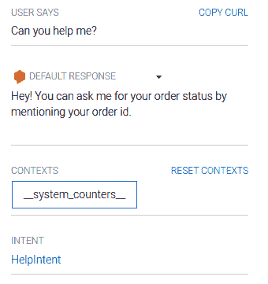

请注意上述屏幕截图底部的匹配意图。 由于`HelpIntent`已成功匹配输入，训练短语中未明确定义该输入，因此我们可以得出结论，该智能体运作良好。

为什么业务代表响应尚未接受过训练的输入很重要？ 这是因为在针对特定意图测试座席时，我们希望确保与该训练短语完全或紧密匹配的所有言语都与该意图匹配。 如果它与期望的目的没有紧密相关的查询，则需要提供更多的训练短语，并检查座席的其他任何目的中是否有任何冲突的训练。

现在，我们有一个意图告诉用户该聊天机器人可以做什么—即检查订单状态—现在创建一个可以实际检查订单状态的意图。

# 步骤 4.2 – 创建`CheckOrderStatus`意图

单击“创建意图”按钮，然后将意图的名称输入为`CheckOrderStatus`。

**步骤 4.2.1 – 输入`CheckOrderStatus`意图的训练短语**

为此，我们输入以下训练短语：

1.  `What is the status for order id 12345?`
2.  `When will my product arrive?`
3.  `What has happened to my order?`
4.  `When will my order arrive?`
5.  `What's my order status?`

请注意，第一个训练短语与其他短语不同，因为它包含一个订单 ID。

我们需要能够将其标识为订单 ID，并使用它来获取订单状态。

**步骤 4.2.2 – 从输入中提取并保存订单 ID**

在`CheckOrderStatus`目的的第一个训练短语中，双击 12345 并弹出一个菜单，如下所示：

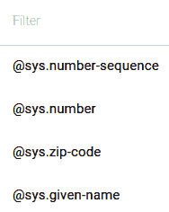

选择`@sys.number`，然后将参数名称输入为`OrderId`。 您的训练短语如下所示：


但是有时，就像其余的训练短语一样，用户不会在没有提示的情况下提及订单 ID。 让我们添加一个提示以及一种在找到订单 ID 时将其存储的方法。

**步骤 4.2.3 – 存储参数并提示是否找到**

向下滚动到意图创建表单中的“动作和参数”标题。 输入`OrderId`作为参数名称和值，然后选中需要的复选框。 以下屏幕截图应类似于您当前屏幕上的屏幕截图：

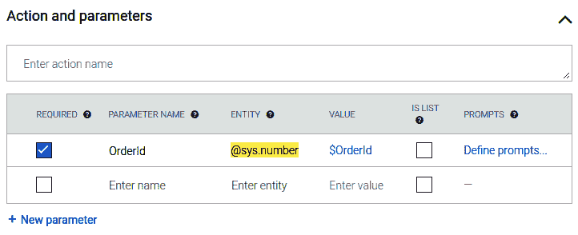

在`OrderId`参数的右侧，单击“定义提示”以添加此参数的提示。 示例提示可能是`Sure, could you please let me know the Order ID? It looks like 12345!`。

我们希望在出现此提示后，用户一定会说出订单 ID，然后该 ID 将与该意图的第一个训练短语匹配。

此后，我们需要为此目的定义响应。

**步骤 4.2.4 – 通过履行`CheckOrderStatus`意向打开响应**

请记住，此意图需要从获得的订单 ID 中获取订单状态。 在这种情况下，恒定的响应集将无法达到目的。 因此，我们将在意图创建表单中使用“实现”标题。

向下滚动并为此目的启用实现方法 Webhook。 现在，此部分应如下所示：

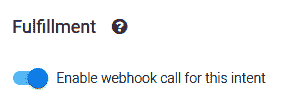

完全填充使您的 Dialogflow 智能体可以查询外部 API，以生成该智能体必须做出的响应。 与智能体接收到的查询相关联的元数据被发送到外部 API，该 API 然后了解并决定需要给出查询的响应。 这对于通过聊天机器人进行动态响应很有用。

现在，我们必须定义此 webhook 来使用订单 ID 处理订单状态的获取。

# 步骤 5 – 创建一个 webhook

现在，我们将创建一个 Webhook，该 Webhook 将在 Firebase 云控制台上运行并调用一个外部 API，该 API 位于我们的订单管理门户中。

单击菜单栏中的“实现项目”。 系统会为您提供打开 Webhook 或使用 Firebase Cloud Functions 的选项。 打开内联编辑器。 您的屏幕将类似于以下屏幕截图：

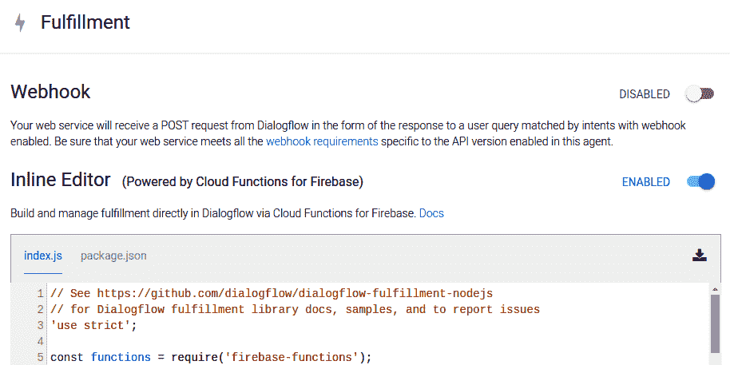

我们将自定义内联编辑器中存在的两个文件。

# 第 6 步 – 创建 Firebase Cloud Functions

Firebase Cloud Functions 在 Firebase 平台上运行，并按您在创建 Dialogflow 智能体期间选择或创建的 GCP 项目的规定计费。 您可以在[这个页面](https://dialogflow.com/docs/how-tos/getting-started-fulfillment)上了解有关 Cloud Functions 的更多信息。

# 步骤 6.1 – 将所需的包添加到`package.json`

在内联编辑器的`package.json`文件中，我们将`request`和`request-promise-native`包添加到依赖项中，如下所示：

```py
"dependencies": {
    "actions-on-google": "^2.2.0",
    "firebase-admin": "^5.13.1",
    "firebase-functions": "^2.0.2",
    "dialogflow": "^0.6.0",
    "dialogflow-fulfillment": "^0.5.0",
    "request": "*",
    "request-promise-native": "*"
  }
```

这些包将在构建智能体的过程中自动获取，因此您无需显式执行任何命令来安装它们。

# 步骤 6.2 – 向`index.js`添加逻辑

我们将添加调用订单管理系统 API 所需的代码。 在`dialogflowFirebaseFulfillment`对象定义内添加以下函数：

```py
function checkOrderStatus(){
    const request = require('request-promise-native');
    var orderId = agent.parameters.OrderId;
    var url = "https://example.com/api/checkOrderStatus/"+orderId;
    return request.get(url)
        .then(jsonBody => {
            var body = JSON.parse(jsonBody);
            agent.add("Your order is: " + body.order[0].order_status);
            return Promise.resolve(agent);
        })
        .catch(err => {
            agent.add('Unable to get result');
            return Promise.resolve(agent);
        });
  }
```

在文件末尾，就在结束`dialogflowFirebaseFulfillment`对象定义之前，在调用 webhook 调用以生成响应之前，将先前创建的函数的映射添加到 Dialogflow 智能体中匹配的意图。

```py
  let intentMap = new Map();
  intentMap.set('Default Welcome Intent', welcome);
  intentMap.set('Default Fallback Intent', fallback);
  intentMap.set('CheckOrderStatus', checkOrderStatus);
  agent.handleRequest(intentMap);
```

现在，单击“部署”以部署此函数。 您将在屏幕的右下角收到有关部署状态的通知。 等待部署并完成构建。

# 第 7 步 – 向机器人添加个性

为机器人添加个性，更多地是关于如何选择响应方式以及如何通过智能体中的响应和提示推动对话。

例如，尽管在上一个示例中我们选择了一个非常标准的对用户输入的响应，但是通过在响应中使用真实的语言或其他装饰元素，我们肯定可以使它更加有趣。 如果我们不是直接显示响应获取 API 的输出，而是添加了会话修饰符（例如`Great, now let me see where your order is...`），并且在将响应获取和加载到智能体过程中，使 Fulfillment 函数生成了会话填充符，这将显得非常现实。 作为`almost there...`，`just getting there...`，`hmmm, let me see...`和其他填充剂，取决于情况的要求。

您还可以使用 Dialogflow 的 Small Talk 模块为聊天机器人设置一些有趣的琐事。 要使用它，请单击左侧的“闲聊”菜单项并启用闲聊。 您可以添加一些有趣的响应，让您的机器人在遇到特定查询时会做出如下所示：

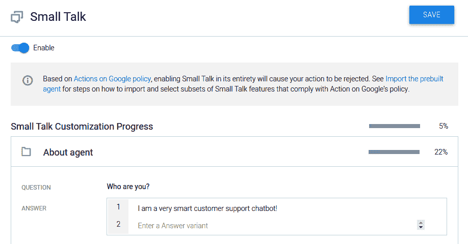

闲聊对于在聊天机器人中添加非常独特的个性非常有用！

在下一步中，我们将创建一个 UI，以直接从订单管理网站与此聊天机器人进行交互。 但是，由于我们谈论的是基于 REST API 的接口，因此我们很可能将这个 UI 与为订单管理系统创建的 API 分开托管。

此云函数调用您将需要创建的 HTTPS API。 在下一节中，我们将学习如何创建一个可以在本地计算机上处​​理 HTTPS 请求的 API。

# 使用 ngrok 改进本地主机上的 HTTPS API

您将需要创建自己的订单管理系统 API 才能使 Cloud Functions 脚本正常工作，以便它可以从 API 中获取订单状态。 您可以在[这个页面](http://tiny.cc/omsapi)中找到快速样本。 您的 API 必须在 HTTPS URL 上运行。 为此，您可以使用 PythonAnywhere 和 ngrok 之类的服务。 尽管 PythonAnywhere 将代码托管在其服务器上并提供固定的 URL，但是 ngrok 可以安装并在本地运行以向`localhost`提供转发地址。

假设您必须在系统的端口`8000`上为订单管理 API 运行 Django 项目，并且现在希望提供 HTTPS URL 以便进行测试； 您可以按照以下步骤使用 ngrok 轻松做到这一点：

1.  下载 ngrok 工具。

首先，转到[这里](https://ngrok.com)，然后单击顶部导航菜单中的“下载”按钮。 根据需要选择正确的工具版本，并将其下载到系统中。

2.  创建一个帐户。

接下来，在网站上注册一个帐户，然后转到仪表板。 您可以使用 GitHub 或 Google 认证来快速设置您的帐户。

您将看到以下仪表板：

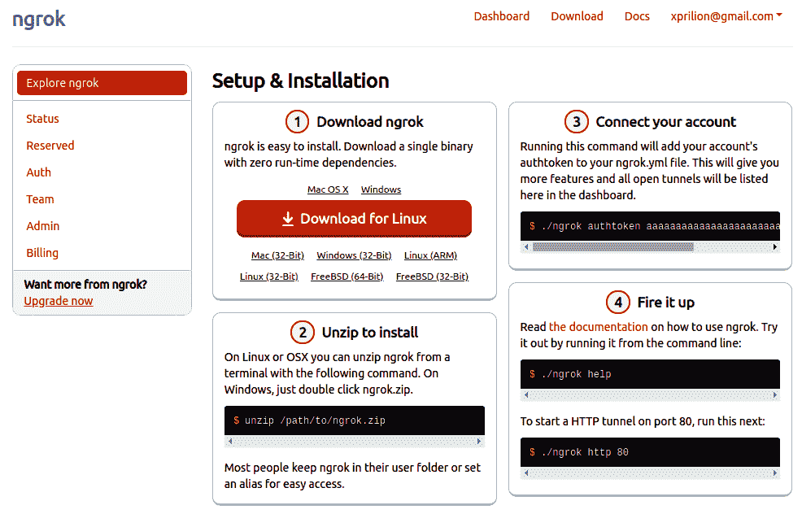

由于您已经下载并安装了该工具，因此可以直接跳至连接您的帐户。

3.  将您的 ngrok 帐户与您的工具关联。

复制 ngrok 仪表板在*连接帐户*部分下给出的命令-它包含您帐户的 authtoken，并在运行时将系统上的 ngrok 工具连接到网站上的 ngrok 帐户。

然后，我们准备移至`localhost`端口。

4.  设置 ngrok 地址以转发到`localhost`。

最后，使用以下命令开始将对随机生成的 ngrok URL 的所有请求转发到`localhost`：

```py
ngrok http 8000
```

只要您保持终端打开，ngrok 服务就会启动并保持活动状态。 您应该在屏幕上看到类似于以下屏幕截图的输出：

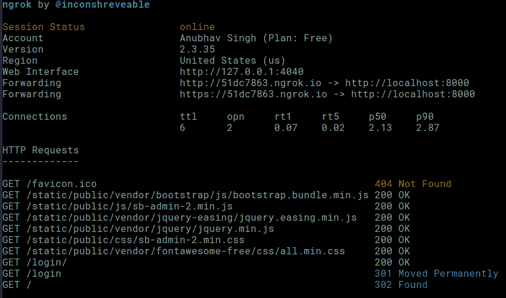

对您的 ngrok URL 的所有请求都将记录在终端上。 您可以在请求日志上方表格的`Forwarding`行中找到您的 ngrok URL。 请注意，`http`和`https`端口都正在转发。 现在，您可以使用在本地计算机上运行的 API 服务来从 Firebase 进行调用，后者仅允许 HTTPS 调用。

# 使用 Django 创建测试 UI 来管理订单

我们之前在本书中使用了 Django，即在“第 8 章”，“在 Microsoft Azure 上使用 Python 进行深度学习”和“第 10 章”，“使用深度学习的应用保护网络安全”。 因此，我们将跳过有关 Django 如何工作以及如何开始使用它的实质性细节。 让我们直接研究创建可以与您的声音进行交互的 UI！

如果尚未在系统上安装 Django，请按照“第 8 章”，“在 Microsoft Azure 上使用 Python 进行深度学习”的“Django Web 开发的简介”部分。 

# 第 1 步 - 创建 Django 项目

每个 Django 网站都是一个项目。 要创建一个，请使用以下命令：

```py
django-admin startproject ordersui
```

使用以下目录结构创建名为`ordersui`的目录：

```py
ordersui/
| -- ordersui/
|         __init.py__
|         settings.py
|         urls.py
|         wsgi.py
| -- manage.py
```

让我们继续为该项目创建模块。

# 第 2 步 – 创建使用订单管理系统 API 的应用

请记住，每个 Django 项目都由几个协同工作的 Django 应用组成。 现在，我们将在该项目中创建一个 Django 应用，该应用将使用订单管理系统 API，并提供一个 UI 来查看 API 数据库中包含的内容。 这对于验证 Dialogflow 智能体是否正常工作很重要。

在新终端或命令提示符中使用`cd`命令切换到`ordersui`目录。 然后，使用以下命令创建一个应用：

```py
python manage.py startapp apiui
```

这将在`ordersui` Django 项目应用目录中创建具有以下结构的目录：

```py
apiui/ 
| -- __init__.py
| -- admin.py
| -- apps.py
| -- migrations/
|         __init__.py
| -- models.py
| -- tests.py
| -- views.py
```

在开始开发模块之前，让我们在下一部分中定义一些项目级设置。

# 第 3 步 – 设置`settings.py`

现在，我们将进行`ordersui/settings.py`文件中所需的一些配置。

# 步骤 3.1 – 将 apiui 应用添加到已安装应用的列表中

在`INSTALLED_APPS`列表中，添加`apiui`应用，如下所示：

```py
# Application definition

INSTALLED_APPS = [
 'apiui',
 'django.contrib.admin',
 'django.contrib.auth',
 'django.contrib.contenttypes',
 'django.contrib.sessions',
 'django.contrib.messages',
 'django.contrib.staticfiles',
]
```

Django 框架仅包含`INSTALLED_APPS`指令中列出的运行时应用，如前面的代码中所示。 我们还需要为项目定义数据库连接，这将在下一部分中显示。

# 步骤 3.2 – 删除数据库设置

由于此 UI 中不需要数据库连接，因此我们将删除数据库连接设置配置。

注释掉`DATABASES`词典，如下所示：

```py
# Database
# https://docs.djangoproject.com/en/2.2/ref/settings/#databases

# DATABASES = {
#     'default': {
#         'ENGINE': 'django.db.backends.sqlite3',
#         'NAME': os.path.join(BASE_DIR, 'db.sqlite3'),
#     }
# }
```

保存文件。 完成此操作后，我们将设置一个 URL 路由以指向`apiui`路由。

# 步骤 4 – 将路由添加到 apiui

更改`ordersui/urls.py`中的代码以添加路径，以将路径设置文件包含在`apiui`应用内。 您的文件将包含以下代码：

```py
from django.contrib import admin
from django.urls import path, include

urlpatterns = [
 path('', include('apiui.urls')),
]
```

保存文件。 在项目级别设置路由之后，我们将需要在模块级别设置路由，就像在下一节中所做的那样。

# 步骤 5 – 在 apiui 应用中添加路由

现在，我们已指示项目使用`apiui` URL 路由，我们需要创建此应用所需的文件。 在`apiui`目录中创建一个名为`urls.py`的文件，其内容如下：

```py
from django.urls import path

from . import views

urlpatterns = [
 path('', views.indexView, name='indexView'),
 path('<int:orderId>', views.viewOrder, name='viewOrder'),
]
```

保存文件。 现在，我们已经指定了应用中可用的路由，我们需要为每个路由创建视图，就像我们在下一节中所做的那样。

# 步骤 6 – 创建所需的视图

在我们创建的路由中，我们提到了两个视图-`indexView`，它不带任何参数； `viewOrder`，它带一个名为`orderId`的参数。 在`apiui`目录中创建一个名为`views.py`的新文件，然后按照以下步骤创建所需的视图。

# 步骤 6.1 – 创建`indexView`

该路由将仅显示放置在订单管理系统上的订单。 我们使用以下代码：

```py
from django.shortcuts import render, redirect
from django.contrib import messages
import requests

def indexView(request):
 URL = "https://example.com/api/"
 r = requests.get(url=URL)
 data = r.json()
 return render(request, 'index.html', context={'orders': data['orders']})
```

我们将在以下部分中创建`viewOrder`视图。

# 步骤 6.2 – 创建`viewOrder`

如果我们以`/orderId`的形式将订单 ID 传递到同一`/`路由，则我们应该返回订单的状态。 使用以下代码：

```py
def viewOrder(request, orderId):
 URL = "https://example.com/api/" + str(orderId)
 r = requests.get(url=URL)
 data = r.json()
 return render(request, 'view.html', {'order': data['order']})
```

我们已经完成了创建该项目所需的不同视图的工作； 但是，我们尚未创建将要渲染的模板。 让我们创建下一部分中所需的模板。

# 步骤 7 – 创建模板

在我们先前定义的视图中，我们使用了两个模板-`index.html`和`view.html`。 但是为了使它们与设计同步显示，我们还将设置一个`base.html`模板，它将作为 UI 中其余视图模板的主模板。

由于模板大多只是 HTML 模板，对网站的重要内容影响不大，因此我们在[这里](http://tiny.cc/ordersui-templates)提供了这些文件的代码。 您必须将模板文件保存在`apiui`目录内名为`templates`的文件夹中。

在此阶段，您将能够使用以下命令启动 Django 项目服务器并在浏览器中检出网站：

```py
python manage.py runserver
```

现在我们的服务器正在运行，我们将在下一部分中围绕它创建一个语音界面。

# 使用 Web Speech API 的网页上的语音识别和语音合成

Web 开发领域中一项最新且非常令人兴奋的开发是 Web Speech API 的引入。 虽然 Google 已在桌面和 Android 的 Google Chrome 浏览器中全面支持 Web Speech API，但 Safari 和 Firefox 仅提供部分实现。 Web Speech API 主要包含两个组件：

*   **语音合成**：更广为人知的 **TTS**。 它执行为任何给定文本生成语音旁白的动作。
*   **语音识别**：也称为 **STT**。 它执行识别用户说出的单词并将其转换为相应文本的功能。

您可以浏览 Web 语音 API 的非常详细的文档，该文档可从 [Mozilla 文档页面](http://tiny.cc/webspeech-moz)获得。 您可以在[这个页面](http://tiny.cc/webspeech-demo)上找到 Google 提供的技术演示：

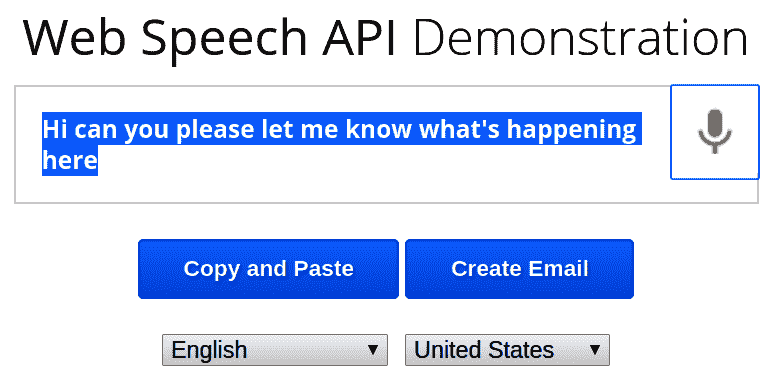

在以下步骤中，我们将基于 Web Speech API 的“问问题”按钮添加到我们的网站 UI 中。

# 步骤 1 – 创建按钮元素

此部分中的所有代码都必须放入 UI 的`base.html`模板中，以便它可以在网站的所有页面上使用。

我们使用以下代码快速创建一个按钮，该按钮的“提问”文本将位于整个站点的网页的右下角：

```py
<div id="customerChatRoot" class="btn btn-warning">Ask a question</div>
```

现在，我们将需要初始化和配置 Web Speech API，就像在下一节中所做的那样。

# 步骤 2 – 初始化 Web Speech API 并执行配置

网页加载完成后，我们需要初始化 Web Speech API 对象并为其设置必要的配置。 为此，请使用以下代码：

```py
$(document).ready(function(){
            window.SpeechRecognition = window.webkitSpeechRecognition || window.SpeechRecognition;
            var finalTranscript = '';
            var recognition = new window.SpeechRecognition();
            recognition.interimResults = false;
            recognition.maxAlternatives = 10;
            recognition.continuous = true;
            recognition.onresult = (event) => {
               // define success content here 
            }

            // click handler for button here
        });
```

您可以看到我们已经初始化了一个 Web `SpeechRecognition` API 对象，然后对其进行了一些配置。 让我们尝试了解以下配置：

*   `recognition.interimResults`（布尔值）指示 API 是应该尝试识别临时结果还是要说出的单词。 这将增加我们的用例的开销，因此将其关闭。 在转录速度比转录准确率更重要的情况下，例如在为讲话人生成实时转录时，将其打开会更有益。
*   `recognition.maxAlternatives`（数字）告诉浏览器可以为同一语音段生成多少个替代项。 在浏览器不太清楚说了什么并且可以为用户提供选择正确识别的选项的情况下，这很有用。
*   `recognition.continuous`（布尔值）告诉浏览器是必须连续捕获音频还是在一次识别语音后停止音频。

但是，我们尚未定义执行 STT 后收到结果时执行的代码。 为此，我们向`recognition.onresult`函数添加了代码，如下所示：

```py
              let interimTranscript = '';
              for (let i = event.resultIndex, len = event.results.length; i < len; i++) {
                let transcript = event.results[i][0].transcript;
                if (event.results[i].isFinal) {
                  finalTranscript += transcript;
                } else {
                  interimTranscript += transcript;
                }
              }
              goDialogFlow(finalTranscript);

              finalTranscript = '';
```

前面的代码块在用户讲话时创建一个临时笔录，当说出更多单词时，该笔录会不断更新。 当用户停止讲话时，临时笔录将附加到最终笔录中，并传递给处理与 Dialogflow 交互的功能。 从 Dialogflow 智能体收到响应后，将为来自用户的下一个语音输入重置最终笔录。

请注意，我们已将用户语音的最终识别成绩单发送给名为`goDialogFlow()`的函数。 让我们定义这个函数。

# 步骤 3 – 调用 Dialogflow 智能体

获得用户基于语音的查询的文本版本后，将其发送到 Dialogflow 智能体，如下所示：

```py
function goDialogFlow(text){
            $.ajax({
                type: "POST",
                url: "https://XXXXXXXX.gateway.dialogflow.cloud.ushakov.co",
                contentType: "application/json; charset=utf-8",
                dataType: "json",
                data: JSON.stringify({ 
                    "session": "test",
                    "queryInput": {
                    "text": {
                        "text": text,
                        "languageCode": "en"
                        }
                    } 
                }),
                success: function(data) {
                    var res = data.queryResult.fulfillmentText;
                    speechSynthesis.speak(new SpeechSynthesisUtterance(res));
                },
                error: function() {
                    console.log("Internal Server Error");
                }
            }); 
        }
```

您会发现，当 API 调用成功时，我们使用 SpeechSynthesis API 向用户说出结果。 它的用法比 SpeechRecognition API 更为简单，因此是出现在 Firefox 和 Safari 中的第一个。

注意上一个函数中使用的 API URL。 当前可能看起来很奇怪，您可能想知道我们从何处获得此 URL。 我们所做的基本上是跳过使用终端设置 Dialogflow 智能体服务帐户配置的要求，该终端始终位于脚本正在处理的系统本地，因此很难传输。

要为您的项目获得相似的 URL，请遵循以下步骤； 否则，请跳过“步骤 4”并直接进入“步骤 5”。

# 步骤 4 – 通过 Ushakov 在 Dialogflow Gateway 上创建 Dialogflow API 智能体

转到[这里](https://dialogflow.cloud.ushakov.co/)。 您将看到一个界面，如下所示：

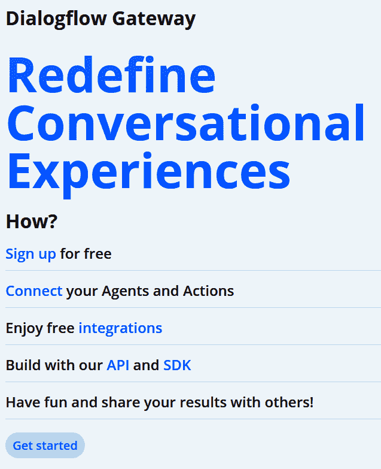

Dialogflow Gateway 促进了语音 UI 和 Dialogflow 智能体之间的交互。 在我们的项目作为静态网站托管的情况下，这非常有用。 Dialogflow 网关围绕 Dialogflow API 提供了简化的 API 包装器，并且非常易于使用。

您必须创建一个帐户才能开始使用 Dialogflow，如下一节所示。

# 步骤 4.1 – 在 Dialogflow 网关上创建帐户

单击“入门”，开始在平台上创建帐户。 系统会要求您使用您的 Google 帐户登录。 确保使用与以前创建 Dialogflow 智能体相同的帐户。

# 步骤 4.2 – 为 Dialogflow 智能体项目创建服务帐户

我们先前在“第 6 章”，“使用 Python 在 Google Cloud Platform 上进行深度学习”中详细讨论了如何为 GCP 项目创建服务帐户。 为链接到 Dialogflow 智能体的项目创建一个新的服务密钥，如下所示：

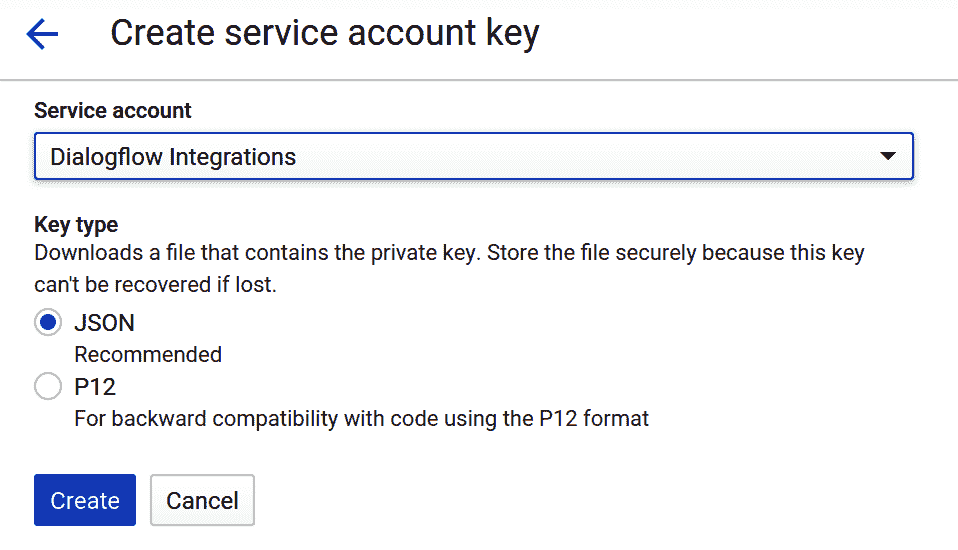

成功创建密钥后，将弹出一个对话框，通知您密钥已保存到计算机中，如下所示：

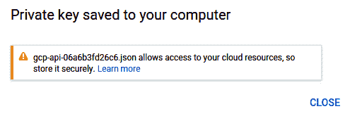

服务帐户凭据以 JSON 的形式下载到本地系统，其名称如前面的屏幕快照所示。

现在，我们将使用该服务帐户凭据文件将 Dialogflow Gateway 连接到我们的 Dialogflow 智能体。

# 步骤 4.3 – 将服务密钥文件上传到 Dialogflow Gateway

在 Dialogflow Gateway 控制台上，您会找到“上传密钥”按钮。 单击它以上传您生成的服务帐户密钥文件。 上传后，控制台将显示您的 Dialogflow API 智能体 URL，如下所示：

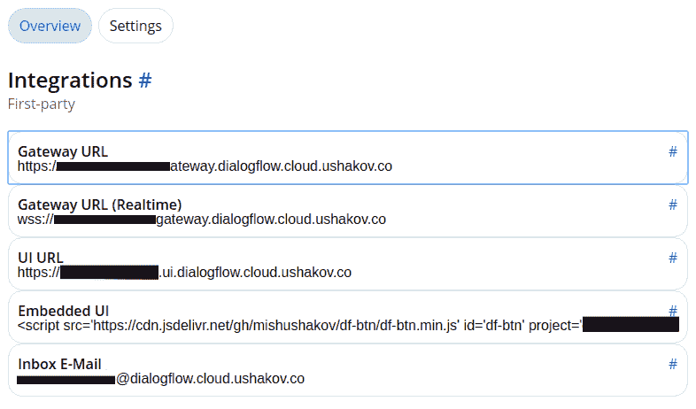

我们将在先前定义的函数中使用网关 URL。

# 步骤 5 – 为按钮添加点击处理器

最后，我们向“提问”按钮添加`click`处理器，以便它可以触发用户输入的语音识别以及 Dialogflow 智能体的输出合成。

在“步骤 2”中定义的文档`ready`函数中，添加以下`click`处理器代码：

```py
$('#customerChatRoot').click(function(){
 recognition.start();
 $(this).text('Speak!');
});
```

现在，当麦克风开始收听用户输入时，按钮文本将变为`Speak!`，提示用户开始讲话。

尝试在您的设置上测试该网站，然后查看如何使其正常工作！

# 总结

在本章中，我们结合了多种技术，提出了一个端到端项目，该项目展示了将深度学习应用于网站的最快速发展的方面之一。 我们介绍了 Dialogflow，Dialogflow 网关，GCP IAM，Firebase Cloud Functions 和 ngrok 等工具。 我们还演示了如何构建基于 REST API 的 UI，以及如何使用 Web Speech API 对其进行访问。 Web 语音 API 尽管目前尚处于起步阶段，但它是 Web 浏览器中使用的一项前沿技术，并且有望在未来几年中快速增长。

可以肯定地说，Web 深度学习具有巨大的潜力，并将成为许多即将开展的业务成功的关键因素。 在下一章中，我们将探讨深度学习中用于 Web 开发的一些最热门的研究领域，以及我们如何计划以最佳方式取得进展。