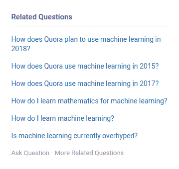
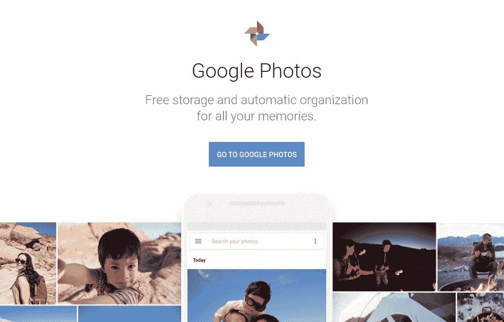
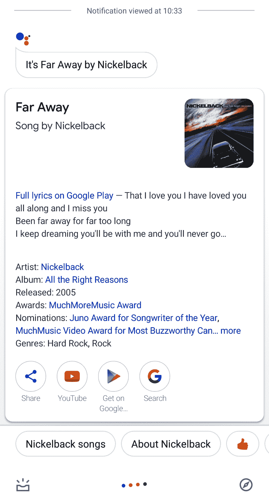

# 十三、附录：Web 深度学习的成功案例和新兴领域

通常重要的是要知道其他人正在使用任何技术做什么，以了解其适用性的规模以及它可以承诺的投资回报。 本章介绍了一些最著名的网站，这些网站的产品很大程度上依赖于利用深度学习的力量。 本章还讨论了可以使用深度学习增强的 Web 开发中的一些关键研究领域。 本章将帮助您更深入地研究 Web 技术和深度学习的融合，并激发您提出自己的智能 Web 应用。

本章包括两个主要部分：

*   Quora 和 Duolingo 等组织在其产品中应用了深度学习的成功案例
*   深度学习中的一些关键新兴领域，例如阅读理解，音频搜索等

让我们开始吧！

# 成功的故事

在本节中，我们将简要介绍一些以 AI 为核心以促进业务增长的产品/公司。 在此值得注意的是，整个产品或服务是否基于任何 AI 技术或算法并不重要； 仅在其中的一小部分或具有特定功能的情况下使用 AI 即可提高产品的实用性，从而提高客户对产品的广泛使用。 有时，您甚至可能没有在产品的任何功能中使用 AI，相反，您可能仅使用它来执行数据分析并提出预期趋势，以确保您的产品符合即将到来的趋势。 让我们看一下这些公司扩大规模后对它们有用的方法。

# Quora

在 Quora 之前，已经有很多问答网站和论坛。 在互联网历史上的某个时刻，在线论坛被视为无法再改进的东西； 但是，Quora 提出了一些使用深度学习进行的调整，以帮助他们快速胜过其他论坛。 以下是他们实现的调整：

*   他们使贡献者能够使用“问与答”功能在发布任何问题后立即请求答案。 这使问题更容易到达相关主题专家，他们迅速给出了答案，并使该平台响应更快，更准确。
*   他们使用**自然语言处理**（**NLP**）屏蔽了写得不好的问题和答案。 这引入了具有高质量内容的自动审核论坛的概念。
*   确定任何给定问题-答案线程的标签和相关文章使发现类似问题变得容易。 这使 Quora 用户花费大量时间阅读与他们相似的问题的答案，只是为了在他们每个人中找到新的信息。
*   Quora Digest 时事通讯是根据用户的兴趣精心策划的文章集，几乎总是成功地将用户带回了平台：

Quora 在某个时间点成为（现在仍然算是）互联网上最令人上瘾的社交平台。 他们使用了一个简单的问答网站，并使用深度学习将其转变为一个了不起的平台。 您可以通过[这里](https://quora.com)检出平台。

# Duolingo

学习新语言一直是一项艰巨的任务。 当 Duolingo 于 2012 年投放市场时，它带来了一个越来越重要和广泛的术语-人工智能。 他们将记忆单词和语法规则等平凡的东西转换为微型游戏，这些微型游戏对每个用户的反应不同。 Duolingo AI 考虑了人脑的时间特性。 他们制定了关于一个人可能很快忘记他/她学到的单词的研究。 他们称此概念为半衰期回归，并用它来增强对它预测用户在任何给定时间点会忘记的单词的了解。

这在他们的支持下取得了巨大的成功，使 Duolingo 成为移动应用商店中最受欢迎的应用之一。 他们的网站也是非正统设计的经典例子，广受好评。 您可以通过[这里](https://duolingo.com)了解有关 Duolingo 的更多信息。

# Spotify

音频播放器已经存在很长时间了，但是没有人将 Spotify 带到桌面上。 Spotify 使用深度学习来确定用户希望在任何给定时间点收听的歌曲。 多年来，他们的 AI 取得了突飞猛进的发展，根据用户最近播放的歌曲来建议整个播放列表。 Spotify 的迅速崛起激发了许多试图做到这一点并试图赶上 Spotify 受欢迎程度的产品。

Spotify 还引入了一项非常强大的功能-根据音频样本搜索歌曲。 这是一个即时热门功能； 许多用户下载 Spotify 只是因为他们不记得他们正在听的一首好听的歌曲的名字，所以想迅速找出它的名字。 您只需记录附近正在播放的歌曲的音频并将其馈送到 Spotify 即可知道正在播放的歌曲。

# Google 搜索/照片

尽管云图像存储是 Dropbox 等公司提供的现有解决方案，但 Google Photos 通过将 AI 纳入方程式，彻底改变了云图像存储空间。 Google 相册由于其令人惊叹的功能，例如以下内容，已被全球数十亿人采用：

*   **人脸识别**：此功能存在于名为 Picasa 的较早的 Google 产品中，该产品被认为是 Google Photos 的前身。
*   **向导**：Google 相册自动确定在同一事件或场合拍摄的照片。 然后，它尝试创建有关图片的电影，或者只是触摸图像以使其看起来更好。 有时，Google 相册还会用看起来似乎是连续的照片来创建动画 GIF。
*   **文档和模因的识别**：Google 相册建议其用户归档旧文档，屏幕截图和模因。 这对于节省设备存储空间非常有帮助：

Google 相册由于在后台使用了深度学习，因此在个人在线画廊方面处于市场领先地位。 如果您想了解更多信息，请访问[这里](https://photos.google.com)。

在本节中，我们看了一些受深度学习极大影响的产品。 在下一部分中，我们将看到一些新兴领域，其中深度学习似乎会带来很多积极成果。

# 重点新兴领域

在前面的部分中，我们看到了几家公司如何结合基于深度学习的技术来改进其产品。 在本节中，我们将讨论当前正在大量研究的一些领域，并且我们将通过 Web 开发的角度看到它们的影响力。

# 音频搜索

假设您在一家酒吧中，并且喜欢现场乐队播放的歌曲。 在您的脑海中，您知道自己曾经听过这首歌，但是无法回忆起这首歌的名字。 如果您有一个可以听这首歌并搜索其名称的系统，那不是很好吗？ 欢迎来到音频搜索引擎的世界！

有很多现有的音频搜索引擎，其中声音搜索（由 Google Assistant 提供）是最受欢迎的搜索引擎之一。 您可能还想看看 Shazam。 在以下屏幕截图中，您可以看到通过声音搜索产生的示例音频搜索结果：

为了使系统根据接收到的音频信号执行音频搜索，系统首先需要处理该信号，这被称为音频信号处理。 然后，系统将处理后的信号与其现有的成千上万首歌曲的数据库进行比较。 在将信号与现有数据库进行比较之前，使用神经网络对其进行特定表示，通常将其称为指纹。 但是，这仍然是一个活跃的研究领域，我强烈建议您阅读[这个页面](https://ai.googleblog.com/2018/09/googles-next-generation-music.html)上的文章，详细了解这些技术。

# 阅读理解

您是否曾经希望搜索引擎能为您提供搜索查询的答案，而不是找到可能包含搜索查询答案的资源的合适链接？ 好吧，如果系统通过阅读理解进行编程，那么现在就有可能实现这一目标。 让我们看下面的屏幕截图，以了解这意味着什么：

如果您仔细地注意到，我们甚至都没有将 Sachin Tendulkar 的父亲的陈述作为疑问。 现代系统有足够的能力自行推断出这样的属性。

现在，为了能够理解具有阅读理解能力的系统（或机器）的深度，请说您想在执行网络搜索后找到问题的答案。 这是您需要经历的多步骤过程：

1.  首先，用相关的关键字制定搜索查询，然后搜索引擎执行搜索。
2.  然后，搜索引擎为您提供给定搜索查询的相关文档列表。
3.  您仔细阅读这些文档，根据自己的理解整理其中的信息，然后得出结论。

本质上，仍然存在许多手动的步骤，而且这个问题仍然存在：我们是否可以设计一个系统来自动为我们找到合适答案的过程？ 现有的搜索引擎为我们提供了给定搜索查询的相关文档列表，但不足以开发能够实际产生搜索查询答案的系统。 简而言之，这样的系统需要执行以下操作：

1.  遵循相关文件的结构。
2.  理清这些文档中提供的内容。
3.  得出最终答案。

让我们简化一下问题。 假设对于一个给定的问题，我们已经有了相关段落的列表，现在我们需要开发一种系统，该系统实际上可以从这些段落中理解并为我们提供给定问题的明确答案。 在阅读理解系统中，神经网络通常学会捕捉给定问题与相关段落之间的深层语义关系，然后制定最终答案。

您可能已经知道，诸如 Google 搜索，必应等之类的搜索引擎已经具备阅读理解能力。

# 在社交媒体上检测假新闻

随着社交媒体的飞速发展，从来没有新闻。 社交媒体已轻松成为我们新闻的主要来源之一； 但是，通常不能保证其真实性。 并非您在社交媒体上偶然发现的每篇新闻都是真实的，可以肯定地说，其中有很多是假的。 这种现象的后果可能非常令人震惊，并且确实可以导致虐待，暴力等行为。

少数组织和机构正试图与此作斗争，并使人们意识到新闻报道的真实性。 考虑到我们每天在社交媒体上看到的新闻数量众多，这项任务可能非常繁琐。 因此，现在的问题变成了我们可以利用机器学习的力量来自动检测假新闻吗？ 实际上，这是一个活跃的研究领域，尚无可大规模解决此问题的实际应用。

但是，以下是各个小组使用经典机器学习和深度学习方法进行的一些研究：

*   [《在社交媒体网络中检测虚假新闻》](https://www.sciencedirect.com/science/article/pii/S1877050918318210)
*   [《使用几何深度学习在社交媒体上进行虚假新闻检测》](https://arxiv.org/abs/1902.06673)

鼓励您在[这个页面](https://arxiv.org/pdf/1812.00315.pdf)上查看调查报告，该报告提供了有关各种假新闻检测技术的综合指南，并讨论了有关该主题的相关研究。 另一方面，一家名为 [Varia](https://www.varia.media/) 的德国初创公司正试图以一种独特的方式解决假新闻问题。 他们没有提供新闻的真实性，而是提供了某些新闻的不同观点。 换句话说，他们正在提供透视服务。 要了解更多信息，您绝对应该在[这个页面](https://alpha.varia.media/)中进行检查。

# 总结

在本书的最后一章中，我们试图激发您构建下一个深度学习项目并将其在 Web 平台上使用。 您可能对更多这样的公司的故事感兴趣，这些公司使用 AI 转变了业务并统治了市场空间。 如果您浏览几乎所有访问的网站，它们都会以某种方式使用人工智能和深度学习的元素，无论是推荐系统还是广告形式（又是促销推荐系统）。 然后，我们介绍了深度学习领域中即将出现的主题，这些主题正在寻找在不久的将来在网站上实现的主题。 如果您能根据这些主题中的任何一个来提供服务，那就太好了！