# 二、线性模型

## 广播

当我们操作不同维度的数组时，它们可以以不同的方式组合，无论是逐元素还是通过广播。

让我们从头开始，构建更复杂的例子。 在下面的示例中，我们有表示单个数字的 TensorFlow 常量。

```py
import tensorflow as tf

a = tf.constant(3, name='a')

with tf.Session() as session:
    print(session.run(a))
```

这里没什么惊喜！ 我们也可以进行计算，例如将其加上另一个数字：

```py
a = tf.constant(3, name='a')
b = tf.constant(4, name='b')
add_op = a + b

with tf.Session() as session:
    print(session.run(add_op))
```

让我们将这个概念扩展到一个数字列表。 首先，让我们创建一个包含三个数字的列表，然后创建另一个数字列表：

```py
a = tf.constant([1, 2, 3], name='a')
b = tf.constant([4, 5, 6], name='b')
add_op = a + b

with tf.Session() as session:
    print(session.run(add_op))
```

这称为逐元素操作，其中依次考虑每个列表中的元素，将它们相加，然后合并结果。

如果我们将这个列表和仅仅一个数字相加，会发生什么？

```py
a = tf.constant([1, 2, 3], name='a')
b = tf.constant(4, name='b')
add_op = a + b

with tf.Session() as session:
    print(session.run(add_op))
```

这是你所期望的吗？ 这被称为广播操作。 我们的主要对象引用是`a`，它是一个数字列表，也称为数组或一维向量。 与单个数字（称为标量）相加会产生广播操作，其中标量将与列表的每个元素相加。

现在让我们看一个扩展，它是一个二维数组，也称为矩阵。 这个额外的维度可以被认为是“列表的列表”。 换句话说，列表是标量的组合，矩阵是列表的列表。

也就是说，矩阵上的操作如何工作？

```py
a = tf.constant([[1, 2, 3], [4, 5, 6]], name='a')
b = tf.constant([[1, 2, 3], [4, 5, 6]], name='b')
add_op = a + b

with tf.Session() as session:
    print(session.run(add_op))
```

这是逐元素的。 如果我们加上一个标量，结果是可以预测的：

```py
a = tf.constant([[1, 2, 3], [4, 5, 6]], name='a')
b = tf.constant(100, name='b')
add_op = a + b

with tf.Session() as session:
    print(session.run(add_op))
```

事情开始变得棘手。 如果我们将一维数组与二维矩阵相加会发生什么？

```py
a = tf.constant([[1, 2, 3], [4, 5, 6]], name='a')
b = tf.constant([100, 101, 102], name='b')
add_op = a + b

with tf.Session() as session:
    print(session.run(add_op))
```

在这种情况下，数组被广播为矩阵的形状，导致数组与矩阵的每一行相加。 使用此术语，矩阵是行的列表。

如果我们不想要这个，而是想将矩阵的列与`b`相加呢？

```py
a = tf.constant([[1, 2, 3], [4, 5, 6]], name='a')
b = tf.constant([100, 101,], name='b')
add_op = a + b

with tf.Session() as session:
    print(session.run(add_op))
```

这不起作用，因为 TensorFlow 试图按照行广播。 它不能这样做，因为`b`中的值的数量（2）与每行中的标量数量（3）不同。

我们可以通过从列表中创建一个新矩阵来执行此操作。

```py
a = tf.constant([[1, 2, 3], [4, 5, 6]], name='a')
b = tf.constant([[100], [101]], name='b')
add_op = a + b

with tf.Session() as session:
    print(session.run(add_op))
```

这里发生了什么？ 要理解这一点，让我们看一下矩阵形状。

```py
a.shape
    TensorShape([Dimension(2), Dimension(3)])
b.shape
    TensorShape([Dimension(2), Dimension(1)])
```

你可以从这两个示例中看到`a`有两个维度，第一个大小为 2，第二个大小为 3。换句话说，它有两行，每行有三个标量。

我们的常数`b`也有两个维度，两行，每行一个标量。如果有一行两个标量，这与列表不同，也与矩阵不同。

由于形状在第一维匹配，而第二维不匹配的事实，广播发生在列而不是行中。 广播规则的更多信息请参见[此处](https://www.tensorflow.org/versions/master/experimental/xla/broadcasting)。

创建一个三维矩阵。 如果将其与标量，数组或矩阵相加，会发生什么？
使用`tf.shape`（这是一个操作）在图的操作期间获得常量的形状。
考虑更高维矩阵的用例。 换句话说，在哪里你可能需要 4D 矩阵，甚至是 5D 矩阵？ 提示：考虑集合而不是单个对象。

## 随机性

机器学习模型是许多变量的复杂集合，但必须经过训练才能找到好的值。这也意味着必须将这些“权重”设置为初始值。一种选择是从所有权重为零开始。但是，这会在算法上引起问题 - 基本上，错误的梯度无法修复错误。相反，我们经常将这些权重设置为随机值。然后，模型学习并调整。

TensorFlow 有许多用于生成随机数的内置方法。这包括我们熟悉的分布，如“均匀”，以及你可能听说过的其他分布，如“正态”分布。均匀分布就像你掷骰子时得到的东西那样 - 有一组值，它们都是等可能的。正态分布是统计课程中教授的标准，其中数据具有更可能的平均值，以及围绕它的“钟形”曲线。我们将看到的，其他的也包括在内。

在本节中，我们将创建一个基本的辅助函数，它只运行一个 TensorFlow 变量。这个小函数非常有用！它创建一个会话，初始化变量并为我们运行它。它仅限于单个变量，因此对于较大的程序可能没有用。

```py
import tensorflow as tf

def run_variable(variable):
    tf.initialize_all_variables()
    with tf.Session() as sess:
        return sess.run(variable)
```

希望现在这对你来说都很熟悉。 如果没有，请再看看第一章，开始吧。

让我们从一个基本的分布开始，均匀分布。

```py
my_distribution = tf.random_uniform((6, 4), seed=42)
uniform = run_variable(my_distribution)
```

这为我们提供了一个 6 乘 4 的张量（随机值的更多信息，请参阅上一节）。为了可视化，我们可以使用直方图：

```py
from matplotlib import pyplot as plt

plt.hist(uniform.flatten())
plt.show()
```

请注意，如果你使用的是 Jupyter 笔记本，请使用`%matplotlib inline`并删除`plt.show()`行。

所得图像显示了图片，虽然还不是很清楚......

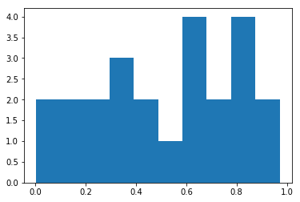

此直方图显示可能的值介于 0 和 1 之间。每个值应该是等可能的，但它看起来并不是那样。 原因是我们只选择了少量的值。 如果我们增加数组的大小，它会变得更加均匀。

```py
large_normal = tf.random_uniform((600, 400), seed=42)
large_uniform = run_variable(large_normal)

plt.hist(large_uniform.flatten())
plt.show()
```

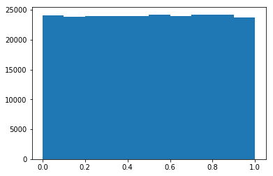

更均匀了！

如果你没有任何其他信息，对于在机器学习模型中初始化权重，均匀分布非常有用。 它也是一个“有界”分布，它具有设定的最小值和最大值，随机值不能超出该范围。 要更改范围，例如更改为 0 和 10，请乘以范围并添加最小值。 在课程结束时有一个练习。

另一种常用的分布是正态分布，在 TensorFlow 中实现为`random_normal`函数：

```py
distribution = tf.random_normal((600, 4), seed=42)
normal = run_variable(distribution)
plt.hist(normal.flatten())
plt.show()
```

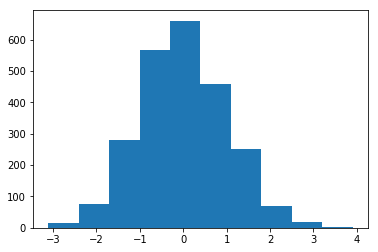

默认情况下，此分布的平均值约为 0，标准差为 1。这些值不受限制，但越来越不可能偏离平均值，标准差设置了可能性减小的速率。 在实践中，大约 60% 的值落在距离平均值一个标准差的“半径”内，并且 99% 落在 4 个标准差内。

均值和标准差是`random_normal`函数的参数。 例如，身高可近似建模为正态分布，平均值约为 170cm，标准差约为 15cm。

```py
distribution = tf.random_normal((10000,), seed=42, mean=170, stddev=15)
normal = run_variable(distribution)
plt.hist(normal.flatten())
plt.show()
```

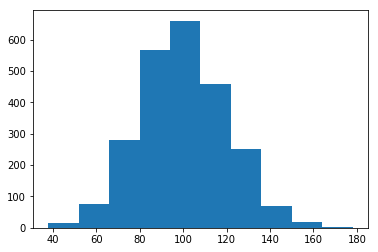

到目前为止，我们的直方图使用`matplotlib`生成。 我们也可以使用 TensorFlow 来创建它们！`histogram_fixed_width`函数接受值的列表（如我们的随机值），范围和要计算的桶数。 然后计算每个桶的范围内有多少个值，并将结果作为数组返回。

```py
import numpy as np
bins = tf.histogram_fixed_width(normal, (normal.min(), normal.max()), nbins=20)
histogram_bins = run_variable(bins)
x_values = np.linspace(normal.min(), normal.max(), len(histogram_bins))
plt.bar(x_values, histogram_bins,)
```

在`plt.bar`调用中，我们再次手动生成`bin`值，然后使用条形图将这些值绘制为`x`值，并使用`histogram_bins`作为高度。

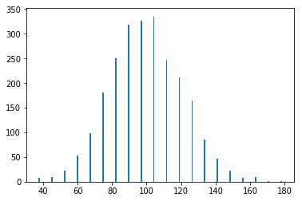

这是正确的，但看起来不对。 直方图的值在那里，但宽度非常窄（我们的箱桶仅由单个值表示）。 我们来解决这个问题：

```py
bar_width = (normal.max() - normal.min()) / len(histogram_bins)
plt.bar(x_values, histogram_bins, width=bar_width)
```

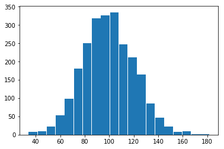

+   使用均匀分布建模单次掷骰子。 绘制结果来确保其符合你的期望
+   使用单个图中的纯 TensorFlow 调用替换本课程的最后一个代码块。 换句话说，使用 TensorFlow 概念来替换`.min()`,`.max()`和`len`调用。 只有绘图在没有 TensorFlow 的情况下进行！

## 线性方程

通过`tf.solve`函数，TensorFlow 可以求解线性方程组。 你可能会将这些视为连接的方程，如下所示：

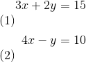

这些类型的线性方程用于数学中的许多问题，从优化工厂输出到几何。 你可以使用多种方法解决这些方程，但在本课中，我们将了解如何使用`tf.solve`为我们执行此操作。

我将专注于几何。 这是位于二维`(x, y)`空间的两个点，`p1`和`p2`：

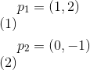

这是他们在图上的样子：

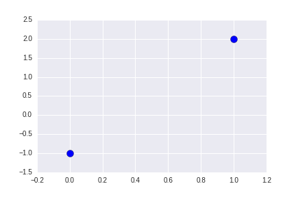

要在 TensorFlow 中执行此操作，我们首先设置线性方程组，我们的点位于中心。 首先，我们创建我们的点矩阵。 第一行对应于第一个点，第二行对应于第二个点。 同样，第一列是`x`值，而第二列是`y`值。

```py
import tensorflow as tf

# 点 1
x1 = tf.constant(2, dtype=tf.float32)
y1 = tf.constant(9, dtype=tf.float32)
point1 = tf.stack([x1, y1])

# 点 2
x2 = tf.constant(-1, dtype=tf.float32)
y2 = tf.constant(3, dtype=tf.float32)
point2 = tf.stack([x2, y2])

# 将点组合为数组
X = tf.transpose(tf.stack([point1, point2]))
```

直线的方程是：

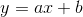

重新排列方程（5），使`x`和`y`在同一侧，我们得到以下结果：

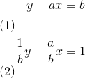

我们的任务是在给定观测点的情况下，找到上面的方程中的`a`和`b`的值。 我们可以通过取点数组的逆并将其乘以一个矩阵，来轻易做到这一点。

使用矩阵（因为我们使用的是 TensorFlow），如果`X`是我们观察点的矩阵，而`A`是我们需要学习的参数，我们设置一个系统：


接下来要学习的参数就是：

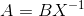

矩阵`B`很简单，适当广播的数字 1，它源于上面方程的右侧。

矩阵`A`是上面方程 3 中的参数。

```py
B = tf.ones((1, 2), dtype=tf.float32)

parameters = tf.matmul(B, tf.matrix_inverse(X))

with tf.Session() as session:
    A = session.run(parameters)
```

最后一步是从上面的方程（5）中找到我们的`a`和`b`值，即从这些参数转换（符合方程（7））。

```py
b = 1 / A[0][1]
a = -b * A[0][0]
print("Equation: y = {a}x + {b}".format(a=a, b=b))
```

这个解决方案很好地包含在`tf.solve`函数中。 为了看到它，让我们看另一个例子。 这是一个圆圈：

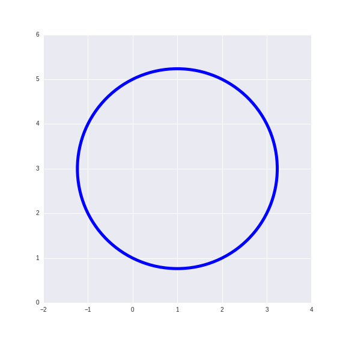

以下是圆圈上的三个观察点：

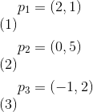

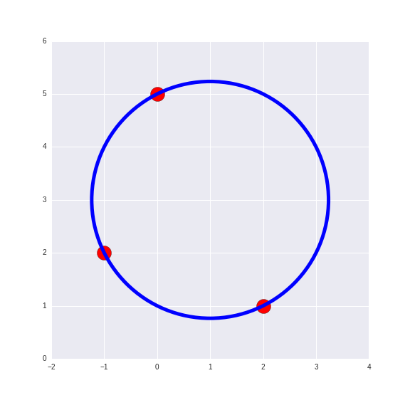

圆的规范方程是：

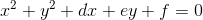

为了求解参数`d`，`e`和`f`，我们创建另一个点数组，并用 1 填充它来创建一个方阵。 我们正在寻找三个参数，因此我们的`A`矩阵必须具有形状`(3, 3)`。

由于这个方程的平方部分没有参数，当我们有`x`和`y`的观测值时，我们的方程变得有点不同：

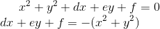

因此，我们的`A`矩阵由`x`和`y`值（以及另一列 1）组成，我们的`B`矩阵是负的`x`和`y`的平方和。

```py
import tensorflow as tf

points = tf.constant([[2, 1],
                 [0, 5],
                 [-1, 2]], dtype=tf.float64)

A = tf.constant([
    [2, 1, 1],
    [0, 5, 1],
    [-1, 2, 1]
], dtype='float64')

B = -tf.constant([[5], [25], [5]])
```

然后我们使用`tf.matrix_solve`来找到我们的`X`数组，这是我们方程的参数。 在会话中运行它，我们得到三个值，即`D`，`E`和`F`。

```py
X = tf.matrix_solve(A, B)

with tf.Session() as session:
    result = session.run(X)
    D, E, F = result.flatten()

    print("Equation: x**2 + y**2 + {D}x + {E}y + {F} = 0".format(**locals()))
```

1）求解包含以下三点的圆：`P(2,1)`, `Q(0,5)`, `R(-1,2)`

2）下面给出椭圆的一般形式。 解决以下几点（解决这个方程需要五点）：

椭圆的一般形式：

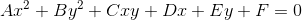

观测点：

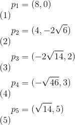

## 3D 中的 TensorFlow

TensorFlow 不仅仅是一个深度学习库 - 它是一个但数值操作库，因此它可以执行许多其他库可以执行的任务。 在本课中，我们将介绍如何使用 TensorFlow 对 3D 对象执行操作。

3D 对象可以被建模为三维空间中的一系列三角形，我们通常将其称为`(x, y, z)`。 这些名称不是必需的，但通常使用。 从这些 3D 点中的三个创建三角形。 点本身可以表示为大小为`(3,)`的向量。 这些数组是一个大小为`(n, 3),`的矩阵，其中`n`是我们拥有的点数。 让我们深入去看一个基本的立方体。 我们稍后将需要此功能，所以让我们创建一个绘制基本形状的函数：


```py
from mpl_toolkits.mplot3d import Axes3D
import numpy as np
from matplotlib import cm
import matplotlib.pyplot as plt
from scipy.spatial import Delaunay
​
def plot_basic_object(points):
    """绘制一个基本对象，假设它是凸的而不是太复杂"""
    
    tri = Delaunay(points).convex_hull
    fig = plt.figure(figsize=(8, 8))
    ax = fig.add_subplot(111, projection='3d')
    S = ax.plot_trisurf(points[:,0], points[:,1], points[:,2],
                        triangles=tri,
                        shade=True, cmap=cm.Blues,lw=0.5)
    ax.set_xlim3d(-5, 5)
    ax.set_ylim3d(-5, 5)
    ax.set_zlim3d(-5, 5)

    plt.show()
```

如果你正在使用 Jupyter 笔记本，我建议运行这一行代码，它为你提供了一个非常棒的交互式 3D 绘图。 左键单击并拖动来左右移动，右键单击并拖动来放大或缩小。

```py
%matplotlib notebook
```

现在让我们创建一个形状。 下面的函数将返回组成立方体的六个点。 如果你回到上一个函数，你将看到 Delaunay 线，它将这些点转换成三角形，以便我们可以渲染它们。

```py
import numpy as np
def create_cube(bottom_lower=(0, 0, 0), side_length=5):
    """从给定的左下角点（最小的 x，y，z 值）开始创建一个立方体"""
    bottom_lower = np.array(bottom_lower)
    points = np.vstack([
        bottom_lower,
        bottom_lower + [0, side_length, 0],
        bottom_lower + [side_length, side_length, 0],
        bottom_lower + [side_length, 0, 0],
        bottom_lower + [0, 0, side_length],
        bottom_lower + [0, side_length, side_length],
        bottom_lower + [side_length, side_length, side_length],
        bottom_lower + [side_length, 0, side_length],
        bottom_lower,
    ])
    return points
```

现在让我们把这些碎片放在一起，看看它是什么样的：

```py
cube_1 = create_cube(side_length=2)
​
​
plot_basic_object(cube_1)
```

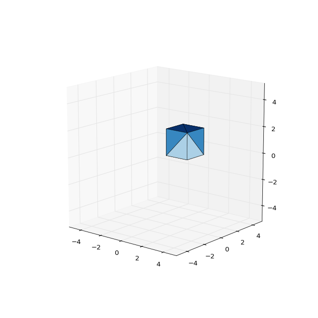

我只是在这里显示一个图像，但是你可以看到立方体，它已被我们的代码变成三角形并且颜色不同（取决于`z`值）。 这很好，但现在让我们使用 TensorFlow 对此进行一些操作。

### 平移

平移是一个简单的动作：向上/向下，向左/向右，向前/向后，或这些的某种组合。 它是通过简单地向每个点添加一个向量来创建的。 如果向所有点添加相同的向量，则整个对象将一致地移动。 查看我们关于广播的章节，了解当我们将大小为`(3,)`的平移向量添加到大小`(n, 3)`的点矩阵时会发生什么。

```py
import tensorflow as tf

def translate(points, amount):
    return tf.add(points, amount)


points = tf.constant(cube_1, dtype=tf.float32)
​
# 更新此处的值来移动多维数据集。
translation_amount = tf.constant([3, -3, 0], dtype=tf.float32)


translate_op = translate(points, translation_amount)
​
with tf.Session() as session:
    translated_cube = session.run(translate_op)


plot_basic_object(translated_cube)
```

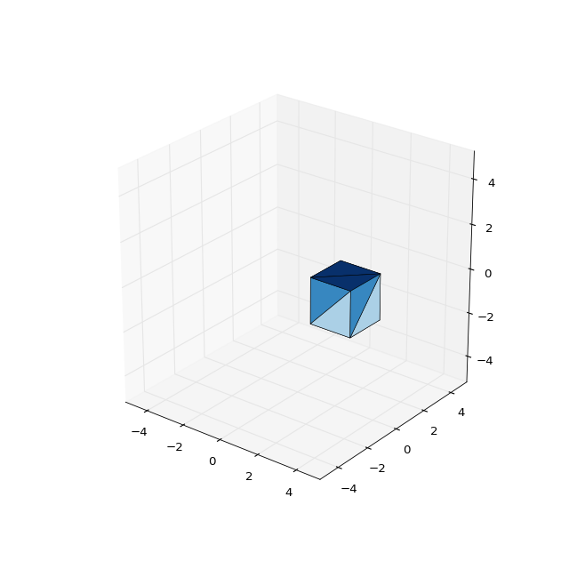

### 旋转

通过创建点积或旋转矩阵和原点来形成旋转。 旋转对象首先需要你确定要旋转的轴。 要围绕特定轴旋转，请将该轴的值设置为 0，相关轴中的值为 1。 你需要三个矩阵：

### 沿`x`轴旋转

```py
[[1, 0, 0],
 [0, cos \theta, sin \theta],
 [0, -sin \theta, cos \theta]]
```

### 沿`y`轴旋转

```py
[[cos \theta, 0, -sin \theta],
 [0, 1, 0],
 [sin \theta, 0, cos \theta]]
```

### 沿`z`轴旋转

```py
[[cos \theta, sin \theta, 0],
 [-sin \theta, cos \theta, 0],
 [0, 0, 1]]
```

```py
def rotate_around_z(points, theta):
    theta = float(theta)
    rotation_matrix = tf.stack([[tf.cos(theta), tf.sin(theta), 0],
                                   [-tf.sin(theta), tf.cos(theta), 0],
                                   [0, 0, 1]])
    return tf.matmul(tf.to_float(points), tf.to_float(rotation_matrix))


with tf.Session() as session:
    result = session.run(rotate_around_z(cube_1, 75))


plot_basic_object(result)
```

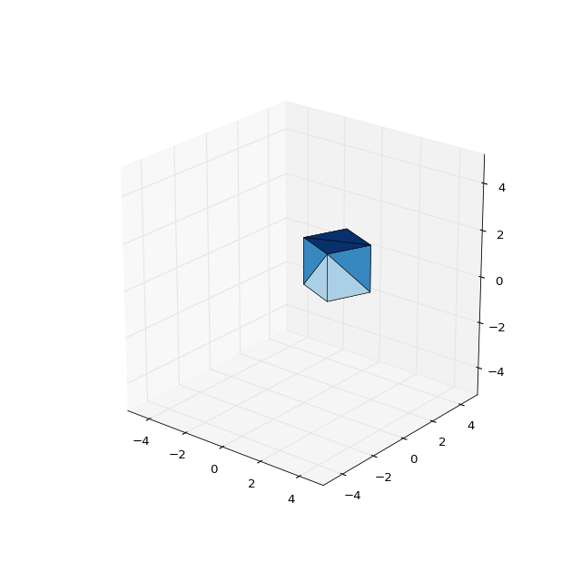

通过这些简单，但是可以大规模组合的矩阵操作，你可以像这样为 3D 对象创建一系列的变换。 此概念可以用于实现剪切，缩放，交叉等。 GPU 非常擅长进行这些转换，这些转换恰好与数据分析工作（如深度学习）所需的相同类型的转换相关。 因此，TensorFlow 可以很好地配合 GPU，处理 3D 对象以及深度学习任务。

+   创建不同的对象，例如四棱锥或者六棱柱。 如果你不确定如何开始，请先从棱柱开始，然后先在2D中创建它。
+   围绕`x`轴和`y`轴旋转对象。
+   你可以将旋转组合到单个变换矩阵中。 为此，只需计算旋转的点积。
+   对于问题 3，顺序是否重要？
+   剪切矩阵是具有非对角线值的单位矩阵。 一个例子如下。 创建剪切矩阵并测试不同的值。

```py
[[1, 0.5, 0],
 [0, 1, 0],
 [0, 0, 1]]
```

## 线性模型的分类

在本课中，我们将了解使用 TensorFlow 进行机器学习。

我们将创建自己的线性分类器，并使用 TensorFlow 的内置优化算法来训练它。

首先，我们将查看数据以及我们要做的事情。 对于那些刚接触机器学习的人来说，我们尝试执行的任务称为监督机器学习或分类。

任务是尝试计算一些输入数据和输出值之间的关系。 实际上，输入数据可以是测量值，例如高度或重量，输出值可以是预期的预测值，例如“cat”或“dog”。

这里的课程扩展自我们的课程“收敛”，在后面的章节中。 我建议你先完成那个课程。

让我们创建并可视化一些数据：

```py
from sklearn.datasets import make_blobs

import numpy as np

from sklearn.preprocessing import OneHotEncoder

X_values, y_flat = make_blobs(n_features=2, n_samples=800, centers=3, random_state=500)
y = OneHotEncoder().fit_transform(y_flat.reshape(-1, 1)).todense()
y = np.array(y)

%matplotlib inline


from matplotlib import pyplot as plt

# 可选的行：将默认数字大小设置得稍大。
plt.rcParams['figure.figsize'] = (24, 10)

plt.scatter(X_values[:,0], X_values[:,1], c=y_flat, alpha=0.4, s=150)
```

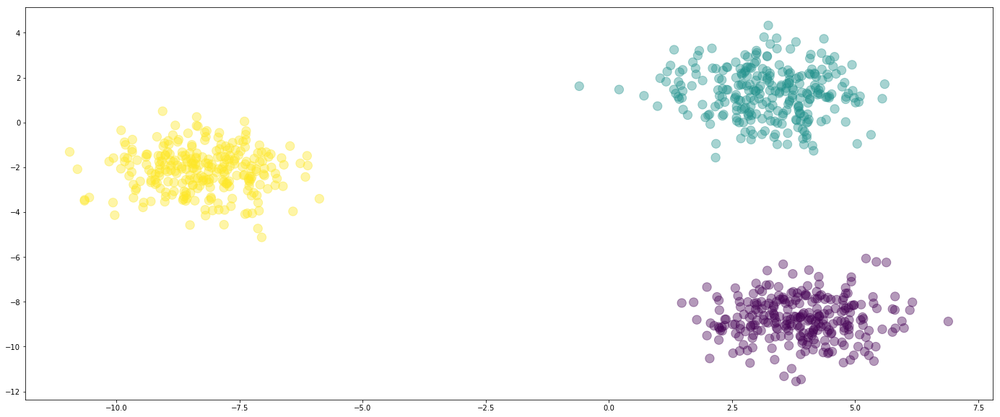

在这里，我们有三种数据，黄色，蓝色和紫色。 它们绘制在两个维度上，我们称之为`x0x0`和`x1x1`。

这些值存储在`X`数组中。

当我们执行机器学习时，有必要将数据拆分为我们用于创建模型的训练集和用于评估它的测试集。 如果我们不这样做，那么我们可以简单地创建一个“作弊分类器”，只记得我们的训练数据。 通过拆分，我们的分类器必须学习输入（绘图上的位置）和输出之间的关系。

```py
from sklearn.model_selection import train_test_split

X_train, X_test, y_train, y_test, y_train_flat, y_test_flat = train_test_split(X_values, y, y_flat)

X_test += np.random.randn(*X_test.shape) * 1.5
```

现在我们绘制测试数据。 从训练数据中学习位置和颜色之间的关系之后，将给予分类器以下几个点，并且将评估它对点着色的准确度。

```py
#plt.scatter(X_train[:,0], X_train[:,1], c=y_train_flat, alpha=0.3, s=150)
plt.plot(X_test[:,0], X_test[:,1], 'rx', markersize=20)
```

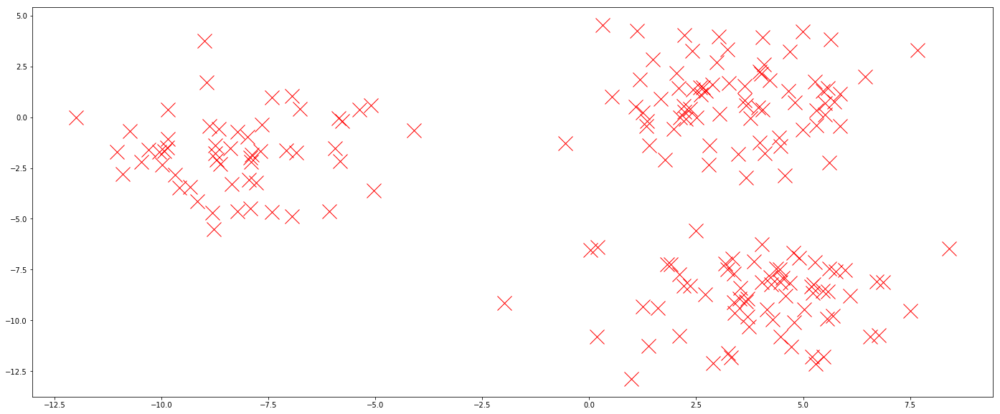

### 创建模型

我们的模型将是一个简单的线性分类器。 这意味着它将在三种颜色之间绘制直线。 一条线上方的点被赋予一种颜色，而一条线下方的点被赋予另一种颜色。 我们将这些称为决策直线，尽管它们通常被称为决策边界，因为其他模型可以学习比线更复杂的形状。

为了在数学上表示我们的模型，我们使用以下等式：

```
​Y = XW + b
```

我们的权重`W`是`(n_features, n_classes)`矩阵，表示我们模型中的学习权重。 它决定了决策直线的位置。 `X`是`(n_rows, n_features)`矩阵，并且是位置数据 - 给定点位于图上。 最后，`b`是`(1, n_classes)`向量，并且是偏差。 我们需要这样，以便我们的线不必经过点`(0,0)`，使我们能够在图上的任何位置“绘制”直线。

`X`中的点是固定的 - 这些是训练或测试数据，称为观测数据。 `W`和`b`的值是我们模型中的参数，我们可以控制这些值。 为这些值选择好的值，可以为我们提供良好的决策线。

在我们的模型中为参数选择好的值的过程，称为训练算法，并且是机器学习中的“学习”。

让我们从上面得到我们的数学模型，并将其转换为 TensorFlow 操作。

```py
import tensorflow as tf

n_features = X_values.shape[1]
n_classes = len(set(y_flat))

weights_shape = (n_features, n_classes)

W = tf.Variable(dtype=tf.float32, initial_value=tf.random_normal(weights_shape))  # Weights of the model

X = tf.placeholder(dtype=tf.float32)

Y_true = tf.placeholder(dtype=tf.float32)

bias_shape = (1, n_classes)
b = tf.Variable(dtype=tf.float32, initial_value=tf.random_normal(bias_shape))

Y_pred = tf.matmul(X, W)  + b
```

上面的`Y_pred`张量代表我们的数学模型。通过传入观测数据（`X`），我们可以得到预期值，在我们的例子中，是给定点的预期颜色。请注意偏差使用广播在所有预测中应用。

`Y_pred`中的实际值由“似然”组成，模型将为给定点选择每个类的似然，生成`(n_rows， n_classes)`大小的矩阵。它们不是真正的似然，但我们可以通过找到最大值，来找出我们的模型认为的最有可能的类。

接下来，我们需要定义一个函数来评估给定权重集的好坏程度。请注意，我们尚未学习权重，只是给出了随机值。 TensorFlow 具有内置的损失函数，可以接受预测的输出的（即模型产生的值）与实际值（我们首次创建测试集时创建的真实情况）。我们比较它们，并评估我们的模型表现如何。我们称之为损失函数，因为我们做得越差，值越高 - 我们试图将损失最小化。

```py
loss_function = tf.losses.softmax_cross_entropy(Y_true, Y_pred)
```

最后一步是创建一个优化步骤，该步骤接受我们的损失函数，并找到给定变量的最小化损失的值。 请注意，`loss`函数引用`Y_true`，后者又引用`W`和`b`。 TensorFlow 选择此关系，并更改这些变量中的值来寻找良好的值。

```py
learner = tf.train.GradientDescentOptimizer(0.1).minimize(loss_function)
```

现在开始训练了！

我们在循环中遍历学习器，来找到最佳权重。 每次循环中，前一循环的学习权重会在下一个循环中略有改善。 前一行代码中的`0.1`是学习率。 如果增加该值，算法学得更快。 但是，较小的值通常会收敛到更好的值。 当你查看模型的其他方面时，值为`0.1`是一个很好的起点。

每次循环中，我们通过占位符将我们的训练数据传递给学习器。 每隔 100 个循环，我们通过将测试数据直接传递给损失函数，来了解我们的模型是如何学习的。

```py
with tf.Session() as sess:
    sess.run(tf.global_variables_initializer())
    for i in range(5000):
        result = sess.run(learner, {X: X_train, Y_true: y_train})
        if i % 100 == 0:
            print("Iteration {}:\tLoss={:.6f}".format(i, sess.run(loss_function, {X: X_test, Y_true: y_test})))
    y_pred = sess.run(Y_pred, {X: X_test})
    W_final, b_final = sess.run([W, b])

predicted_y_values = np.argmax(y_pred, axis=1)
predicted_y_values

h = 1
x_min, x_max = X_values[:, 0].min() - 2 * h, X_values[:, 0].max() + 2 * h
y_min, y_max = X_values[:, 1].min() - 2 * h, X_values[:, 1].max() + 2 * h
x_0, x_1 = np.meshgrid(np.arange(x_min, x_max, h),
                     np.arange(y_min, y_max, h))
decision_points = np.c_[x_0.ravel(), x_1.ravel()]
```

有点复杂，但我们正在有效地创建一个二维网格，涵盖`x0`和`x1`的可能值。

```py
# 我们在 NumPy 中重建我们的模型
Z = np.argmax(decision_points @ W_final[[0,1]] + b_final, axis=1)

# 创建 x_0 和 x_1 值的等高线图
Z = Z.reshape(xx.shape)
plt.contourf(x_0, x_1, Z, alpha=0.1)

plt.scatter(X_train[:,0], X_train[:,1], c=y_train_flat, alpha=0.3)
plt.scatter(X_test[:,0], X_test[:,1], c=predicted_y_values, marker='x', s=200)

plt.xlim(x_0.min(), x_0.max())
plt.ylim(x_1.min(), x_1.max())
```

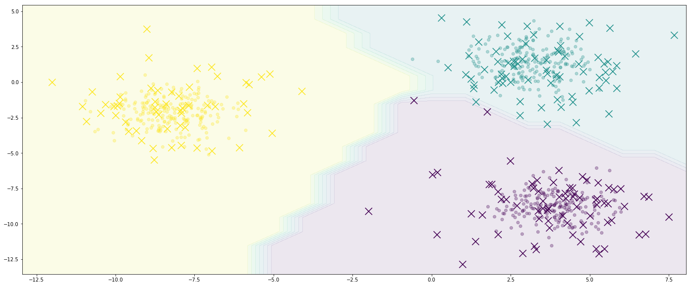

你就实现了它！ 我们的模型会将黄色区域中的任何东西分类为黄色，依此类推。 如果覆盖实际测试值（存储在`y_test_flat`中），则可以高亮任何差异。

+   绘制迭代和损失之间的关系。 出现什么样的形状，你认为它将如何继续？
+   使用 TensorBoard，将图写入文件，并查看 TensorBoard 中变量的值。 更多信息请参阅其余教程。
+   通过在传递到线性模型之前对`X`执行一些变换来创建非线性模型。 这可以通过多种方式完成，你的模型的准确性将根据你的选择而改变。
+   使用以下代码加载 64 维（称为数字）的数据集，并将其传递给分类器。 你得到了什么预测准确度？

```py
from sklearn.datasets import load_digits
digits = load_digits()
X = digits.data
y = digits.target
```
