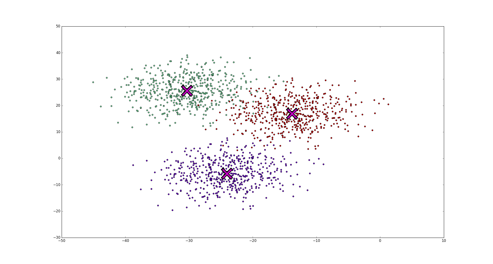
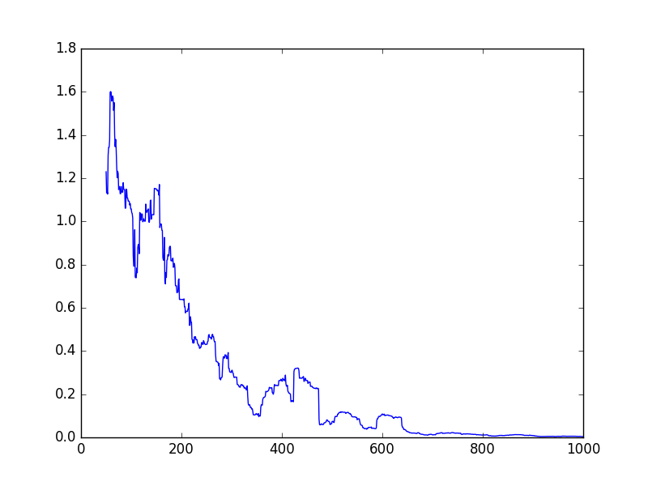
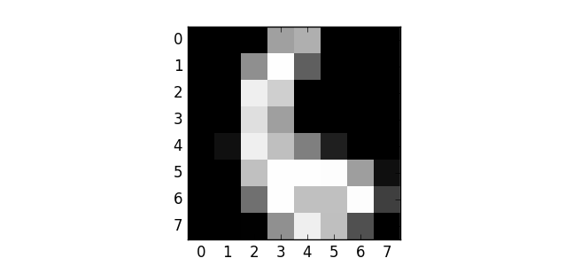

# 三、学习

## 聚类和 KMeans

我们现在冒险进入我们的第一个应用，即使用 k-means 算法进行聚类。 聚类是一种数据挖掘练习，我们获取大量数据并找到彼此相似的点的分组。 K-means 是一种非常善于在许多类型的数据集中查找簇的算法。

对于簇和 k-means的 更多信息，请参阅 [k-means 算法的 scikit-learn 文档](http://scikit-learn.org/stable/modules/clustering.html#k-means)或观看[此视频](https://www.youtube.com/embed/_aWzGGNrcic)。

### 生成样本

首先，我们需要生成一些样本。 我们可以随机生成样本，但这可能会给我们提供非常稀疏的点，或者只是一个大分组 - 对于聚类来说并不是非常令人兴奋。

相反，我们将从生成三个质心开始，然后在该点周围随机选择（具有正态分布）。 首先，这是一个执行此操作的方法

```py
import tensorflow as tf
import numpy as np


def create_samples(n_clusters, n_samples_per_cluster, n_features, embiggen_factor, seed):
    np.random.seed(seed)
    slices = []
    centroids = []
    # 为每个簇创建样本
    for i in range(n_clusters):
        samples = tf.random_normal((n_samples_per_cluster, n_features),
                                   mean=0.0, stddev=5.0, dtype=tf.float32, seed=seed, name="cluster_{}".format(i))
        current_centroid = (np.random.random((1, n_features)) * embiggen_factor) - (embiggen_factor/2)
        centroids.append(current_centroid)
        samples += current_centroid
        slices.append(samples)
    # 创建一个大的“样本”数据集
    samples = tf.concat(slices, 0, name='samples')
    centroids = tf.concat(centroids, 0, name='centroids')
    return centroids, samples
```

这种方法的工作方式是随机创建`n_clusters`个不同的质心（使用`np.random.random((1, n_features))`）并将它们用作`tf.random_normal`的质心。 `tf.random_normal`函数生成正态分布的随机值，然后我们将其添加到当前质心。 这会在该形心周围创建一些点。 然后我们记录质心（`centroids.append`）和生成的样本（`slices.append(samples)`）。 最后，我们使用`tf.concat`创建“一个大样本列表”，并使用`tf.concat`将质心转换为 TensorFlow 变量。

将`create_samples`方法保存在名为`functions.py`的文件中，允许我们为这个（以及下一个！）课程，将这些方法导入到我们的脚本中。 创建一个名为`generate_samples.py`的新文件，其中包含以下代码：

```py
import tensorflow as tf
import numpy as np

from functions import create_samples

n_features = 2
n_clusters = 3
n_samples_per_cluster = 500
seed = 700
embiggen_factor = 70

np.random.seed(seed)

centroids, samples = create_samples(n_clusters, n_samples_per_cluster, n_features, embiggen_factor, seed)

model = tf.global_variables_initializer()
with tf.Session() as session:
    sample_values = session.run(samples)
    centroid_values = session.run(centroids)
```

这只是设置了簇和特征的数量（我建议将特征的数量保持为 2，以便我们以后可以可视化它们），以及要生成的样本数。 增加`embiggen_factor`将增加簇的“散度”或大小。 我在这里选择了一个提供良好学习机会的值，因为它可以生成视觉上可识别的集群。

为了使结果可视化，我们使用`matplotlib`创建绘图函数。 将此代码添加到`functions.py`：

```py
def plot_clusters(all_samples, centroids, n_samples_per_cluster):
    import matplotlib.pyplot as plt
    # 绘制出不同的簇
    # 为每个簇选择不同的颜色
    colour = plt.cm.rainbow(np.linspace(0,1,len(centroids)))
    for i, centroid in enumerate(centroids):
        # 为给定簇抓取样本，并用新颜色绘制出来
        samples = all_samples[i*n_samples_per_cluster:(i+1)*n_samples_per_cluster]
        plt.scatter(samples[:,0], samples[:,1], c=colour[i])
        # 还绘制质心
        plt.plot(centroid[0], centroid[1], markersize=35, marker="x", color='k', mew=10)
        plt.plot(centroid[0], centroid[1], markersize=30, marker="x", color='m', mew=5)
     plt.show()
```

所有这些代码都是使用不同的颜色绘制每个簇的样本，并在质心位置创建一个大的红色`X`。 质心提供为参数，稍后会很方便。

更新`generate_samples.py`，通过将`import plot_clusters`添加到文件顶部来导入此函数。 然后，将这行代码添加到底部：

```py
plot_clusters(sample_values, centroid_values, n_samples_per_cluster)
```

运行`generate_samples.py`现在应该提供以下绘图：



### 初始化

k-means 算法从初始质心的选择开始，初始质心只是数据中实际质心的随机猜测。 以下函数将从数据集中随机选择多个样本作为此初始猜测：

```py
def choose_random_centroids(samples, n_clusters):
    # 第 0 步：初始化：选择 n_clusters 个随机点
    n_samples = tf.shape(samples)[0]
    random_indices = tf.random_shuffle(tf.range(0, n_samples))
    begin = [0,]
    size = [n_clusters,]
    size[0] = n_clusters
    centroid_indices = tf.slice(random_indices, begin, size)
    initial_centroids = tf.gather(samples, centroid_indices)
    return initial_centroids
```

这段代码首先为每个样本创建一个索引（使用`tf.range(0, n_samples)`，然后随机打乱它。从那里，我们使用`tf.slice`选择固定数量（`n_clusters`）的索引。这些索引与我们的初始质心相关，然后使用`tf.gather`组合在一起形成我们的初始质心数组。

将这个新的`choose_random_centorids`函数添加到`functions.py`中，并创建一个新脚本（或更新前一个脚本），写入以下内容：

```py
import tensorflow as tf
import numpy as np

from functions import create_samples, choose_random_centroids, plot_clusters

n_features = 2
n_clusters = 3
n_samples_per_cluster = 500
seed = 700
embiggen_factor = 70

centroids, samples = create_samples(n_clusters, n_samples_per_cluster, n_features, embiggen_factor, seed)
initial_centroids = choose_random_centroids(samples, n_clusters)

model = tf.global_variables_initializer()
with tf.Session() as session:
    sample_values = session.run(samples)
    updated_centroid_value = session.run(initial_centroids)

plot_clusters(sample_values, updated_centroid_value, n_samples_per_cluster)
```

这里的主要变化是我们为这些初始质心创建变量，并在会话中计算其值。 然后，我们将初始猜测绘制到`plot_cluster`，而不是用于生成数据的实际质心。

运行此操作会将得到与上面类似的图像，但质心将处于随机位置。 尝试运行此脚本几次，注意质心移动了很多。

### 更新质心

在开始对质心位置进行一些猜测之后，然后 k-means 算法基于数据更新那些猜测。 该过程是为每个样本分配一个簇号，表示它最接近的质心。 之后，将质心更新为分配给该簇的所有样本的平均值。 以下代码处理分配到最近的簇的步骤：

```py
def assign_to_nearest(samples, centroids):
    # 为每个样本查找最近的质心

    # START from http://esciencegroup.com/2016/01/05/an-encounter-with-googles-tensorflow/
    expanded_vectors = tf.expand_dims(samples, 0)
    expanded_centroids = tf.expand_dims(centroids, 1)
    distances = tf.reduce_sum( tf.square(
               tf.subtract(expanded_vectors, expanded_centroids)), 2)
    mins = tf.argmin(distances, 0)
    # END from http://esciencegroup.com/2016/01/05/an-encounter-with-googles-tensorflow/
    nearest_indices = mins
    return nearest_indices
```

请注意，我从[这个页面](http://esciencegroup.com/2016/01/05/an-encounter-with-googles-tensorflow/)借用了一些代码，这些代码具有不同类型的 k-means 算法，以及许多其他有用的信息。

这种方法的工作方式是计算每个样本和每个质心之间的距离，这通过`distances =`那行来实现。 这里的距离计算是欧几里德距离。 这里重要的一点是`tf.subtract`会自动扩展两个参数的大小。 这意味着将我们作为矩阵的样本，和作为列向量的质心将在它们之间产生成对减法。 为了实现，我们使用`tf.expand_dims`为样本和质心创建一个额外的维度，强制`tf.subtract`的这种行为。

下一步代码处理质心更新：

```py
def update_centroids(samples, nearest_indices, n_clusters):
    # 将质心更新为与其相关的所有样本的平均值。
    nearest_indices = tf.to_int32(nearest_indices)
    partitions = tf.dynamic_partition(samples, nearest_indices, n_clusters)
    new_centroids = tf.concat([tf.expand_dims(tf.reduce_mean(partition, 0), 0) for partition in partitions], 0)
    return new_centroids
```

此代码选取每个样本的最近索引，并使用`tf.dynamic_partition`将这些索引分到单独的组中。 从这里开始，我们在一个组中使用`tf.reduce_mean`来查找该组的平均值，从而形成新的质心。 我们只需将它们连接起来形成我们的新质心。

现在我们有了这个部分，我们可以将这些调用添加到我们的脚本中（或者创建一个新脚本）：

```py
import tensorflow as tf
import numpy as np

from functions import *

n_features = 2
n_clusters = 3
n_samples_per_cluster = 500
seed = 700
embiggen_factor = 70


data_centroids, samples = create_samples(n_clusters, n_samples_per_cluster, n_features, embiggen_factor, seed)
initial_centroids = choose_random_centroids(samples, n_clusters)
nearest_indices = assign_to_nearest(samples, initial_centroids)
updated_centroids = update_centroids(samples, nearest_indices, n_clusters)

model = tf.global_variables_initializer()
with tf.Session() as session:
    sample_values = session.run(samples)
    updated_centroid_value = session.run(updated_centroids)
    print(updated_centroid_value)

plot_clusters(sample_values, updated_centroid_value, n_samples_per_cluster)
```

此代码将：

+   从初始质心生成样本
+   随机选择初始质心
+   关联每个样本和最近的质心
+   将每个质心更新为与关联的样本的平均值

这是 k-means 的单次迭代！ 我鼓励你们练习一下，把它变成一个迭代版本。

1）传递给`generate_samples`的种子选项可确保每次运行脚本时，“随机”生成的样本都是一致的。 我们没有将种子传递给`choose_random_centroids`函数，这意味着每次运行脚本时这些初始质心都不同。 更新脚本来为随机质心包含新的种子。

2）迭代地执行 k 均值算法，其中来自之前迭代的更新的质心用于分配簇，然后用于更新质心，等等。 换句话说，算法交替调用`assign_to_nearest`和`update_centroids`。 在停止之前，更新代码来执行此迭代 10 次。 你会发现，随着 k-means 的更多迭代，得到的质心平均上更接近。 （对于那些对 k-means 有经验的人，未来的教程将研究收敛函数和其他停止标准。）

## 训练和收敛

大多数人工智能和机器学习的关键组成部分是循环，即系统在多次训练迭代中得到改善。 以这种方式训练的一种非常简单的方法，就是在`for`循环中执行更新。 我们在第 2 课中看到了这种方式的一个例子：

```py
import tensorflow as tf


x = tf.Variable(0, name='x')

model = tf.global_variables_initializer()

with tf.Session() as session:
    for i in range(5):
        session.run(model)
        x = x + 1
        print(session.run(x))
```

我们可以改变此工作流，使用变量来收敛循环，如下所示：

```py
import tensorflow as tf

x = tf.Variable(0., name='x')
threshold = tf.constant(5.)

model = tf.global_variables_initializer()

with tf.Session() as session:
    session.run(model)
    while session.run(tf.less(x, threshold)):
        x = x + 1
        x_value = session.run(x)
        print(x_value)
```

这里的主要变化是，循环现在是一个`while`循环，测试（`tf.less`用于小于测试）为真时继续循环。 在这里，我们测试`x`是否小于给定阈值（存储在常量中），如果是，我们继续循环。

### 梯度下降

任何机器学习库都必须具有梯度下降算法。 我认为这是一个定律。 无论如何，Tensorflow 在主题上有一些变化，它们可以直接使用。

梯度下降是一种学习算法，尝试最小化某些误差。 你问哪个误差？ 嗯，这取决于我们，虽然有一些常用的方法。

让我们从一个基本的例子开始：

```py
import tensorflow as tf
import numpy as np

# x 和 y 是我们的训练数据的占位符
x = tf.placeholder("float")
y = tf.placeholder("float")
# w 是存储我们的值的变量。 它使用“猜测”来初始化
# w[0] 是我们方程中的“a”，w[1] 是“b”
w = tf.Variable([1.0, 2.0], name="w")
# 我们的模型是 y = a*x + b
y_model = tf.multiply(x, w[0]) + w[1]

# 我们的误差定义为差异的平方
error = tf.square(y - y_model)
# GradientDescentOptimizer 完成繁重的工作
train_op = tf.train.GradientDescentOptimizer(0.01).minimize(error)

# TensorFlow 常规 - 初始化值，创建会话并运行模型
model = tf.global_variables_initializer()

with tf.Session() as session:
    session.run(model)
    for i in range(1000):
        x_value = np.random.rand()
        y_value = x_value * 2 + 6
        session.run(train_op, feed_dict={x: x_value, y: y_value})

    w_value = session.run(w)
    print("Predicted model: {a:.3f}x + {b:.3f}".format(a=w_value[0], b=w_value[1]))
```

这里的主要兴趣点是`train_op = tf.train.GradientDescentOptimizer(0.01).minimize(error)`，其中定义了训练步长。 它旨在最小化误差变量的值，该变量先前被定义为差的平方（常见的误差函数）。 0.01 是尝试学习更好的值所需的步长。

### 其它优化器

TensorFlow 有一整套优化器，并且你也可以定义自己的优化器（如果你对这类事情感兴趣）。 如何使用它们的 API，请参阅[此页面](https://tensorflow.google.cn/versions/master/api_docs/python/train.html#optimizers)。 列表如下：

+   `GradientDescentOptimizer`
+   `AdagradOptimizer`
+   `MomentumOptimizer`
+   `AdamOptimizer`
+   `FtrlOptimizer`
+   `RMSPropOptimizer`

其他优化方法可能会出现在 TensorFlow 的未来版本或第三方代码中。 也就是说，上述优化对于大多数深度学习技术来说已经足够了。 如果你不确定要使用哪一个，请使用`AdamOptimizer`，除非失败。

> 译者注：原文推荐随机梯度优化器，在所有优化器里是最烂的，已更改。

这里一个重要的注意事项是，我们只优化了一个值，但该值可以是一个数组。 这就是为什么我们使用`w`作为变量，而不是两个单独的变量`a`和`b`。

### 绘制误差



这个代码是上面的一个小改动。 首先，我们创建一个列表来存储误差。然后，在循环内部，我们显式地计算`train_op`和误差。 我们在一行中执行此操作，因此误差仅计算一次。 如果我们在单独的行中这样做，它将计算误差，然后是训练步骤，并且在这样做时，它将需要重新计算误差。

下面我把代码放在上一个程序的`tf.global_variables_initializer()`行下面 - 这一行上面的所有内容都是一样的。

```py
errors = []
with tf.Session() as session:
    session.run(model)
    for i in range(1000):
        x_train = tf.random_normal((1,), mean=5, stddev=2.0)
        y_train = x_train * 2 + 6
        x_value, y_value = session.run([x_train, y_train])
        _, error_value = session.run([train_op, error], feed_dict={x: x_value, y: y_value})
        errors.append(error_value)
    w_value = session.run(w)
    print("Predicted model: {a:.3f}x + {b:.3f}".format(a=w_value[0], b=w_value[1]))

import matplotlib.pyplot as plt
plt.plot([np.mean(errors[i-50:i]) for i in range(len(errors))])
plt.show()
plt.savefig("errors.png")
```

你可能已经注意到我在这里采用窗口平均值 - 使用`np.mean(errors[i-50:i])`而不是仅使用`errors[i]`。 这样做的原因是我们只在循环中测试一次，所以虽然误差会减小，但它会反弹很多。 采用这个窗口平均值可以平滑一点，但正如你在上面所看到的，它仍然会跳跃。

1）创建第 6 课中的 k-means 示例的收敛函数，如果旧质心与新质心之间的距离小于给定的`epsilon`值，则停止训练。

2）尝试从梯度下降示例（`w`）中分离`a`和`b`值。

3）我们的例子一次只训练一个示例，这是低效的。 扩展它来一次使用多个（例如 50 个）训练样本来学习。

## TFLearn

> 已更新到最新的 TFLearn API。

这些教程主要关注 TensorFlow 的机制，但真正的用例是机器学习。 TensorFlow 有许多用于构建机器学习模型的方法，其中许多可以在官方 API 页面上找到。 这些函数允许你从头开始构建模型，包括自定义层面，例如如何构建神经网络中的层。

在本教程中，我们将查看 TensorFlow Learn，它是名为`skflow`的软件包的新名称。 TensorFlow Learn（以下简称：TFLearn）是一个机器学习包装器，基于 scikit-learn API，允许你轻松执行数据挖掘。 这意味着什么？ 让我们一步一步地完成它：

### 机器学习

机器学习是一种概念，构建从数据中学习的算法，以便对新数据执行操作。 在这种情况下，这意味着我们有一些输入的训练数据和预期结果 - 训练目标。 我们将看看著名的数字数据集，这是一堆手绘数字的图像。 我们的输入训练数据是几千个这些图像，我们的训练目标是预期的数字。

任务是学习一个模型，可以回答“这是什么数字？”，对于这样的输入：



这是一个分类任务，是数据挖掘最常见的应用之一。 还有一些称为回归和聚类的变体（以及许多其他变体），但在本课中我们不会涉及它们。

如果你想了解数据挖掘的更多信息，请查看我的书“[Python 数据挖掘](http://www.amazon.com/Learning-Mining-Python-Robert-Layton/dp/1784396052)”。

### Scikit-Learn API

Scikit-learn 是一个用于数据挖掘和分析的 Python 包，它非常受欢迎。 这是因为它广泛支持不同的算法，令人惊叹的文档，以及庞大而活跃的社区。 其他一个因素是它的一致接口，它的 API，允许人们构建可以使用 scikit-learn 辅助函数训练的模型，并允许人们非常容易地测试不同的模型。

我们来看看 scikit-learn 的 API，但首先我们需要一些数据。 以下代码加载了一组可以使用`matplotlib.pyplot`显示的数字图像：

```py
from sklearn.datasets import load_digits
from matplotlib import pyplot as plt


digits = load_digits()
```

我们可以使用`pyplot.imshow`显示其中一个图像。 在这里，我设置`interpolation ='none'`来完全按原样查看数据，但是如果你删除这个属性，它会变得更清晰（也尝试减小数字大小）。

```py
fig = plt.figure(figsize=(3, 3))

plt.imshow(digits['images'][66], cmap="gray", interpolation='none')

plt.show()
```

在 scikit-learn 中，我们可以构建一个简单的分类器，训练它，然后使用它来预测图像的数字，只需使用四行代码：

```py
from sklearn import svm

classifier = svm.SVC(gamma=0.001)
classifier.fit(digits.data, digits.target)
predicted = classifier.predict(digits.data)
```

第一行只是导入支持向量机模型，这是一种流行的机器学习方法。

第二行构建“空白”分类器，`gamma`设置为 0.001。

第三行使用数据来训练模型。 在这一行（这是该代码的大部分“工作”）中，调整 SVM 模型的内部状态来拟合训练数据。 我们还传递`digits.data`，因为这是一个展开的数组，是该算法的可接受输入。

最后，最后一行使用这个训练好的分类器来预测某些数据的类，在这种情况下再次是原始数据集。

要了解这是多么准确，我们可以使用 NumPy 计算准确度：

```py
import numpy as np
print(np.mean(digits.target == predicted))
```

结果非常令人印象深刻（近乎完美），但这些有点误导。 在数据挖掘中，你永远不应该在用于训练的相同数据上评估你的模型。 潜在的问题被称为“过拟合”，其中模型准确地学习了训练数据所需的内容，但是无法很好地预测新的没见过的数据。 为解决这个问题，我们需要拆分我们的训练和测试数据：

```py
from sklearn.cross_validation import train_test_split
X_train, X_test, y_train, y_test = train_test_split(digits.data, digits.target)
```

结果仍然非常好，大约 98%，但这个数据集在数据挖掘中是众所周知的，其特征已有详细记录。 无论如何，我们现在知道我们要做什么，让我们在 TFLearn 中实现它！

### TFLearn

TensorFlow Learn 接口距离 scikit-learn 的接口只有一小步之遥：

```py
from tensorflow.contrib import learn
n_classes = len(set(y_train))
classifier = learn.LinearClassifier(feature_columns=[tf.contrib.layers.real_valued_column("", dimension=X_train.shape[1])],
                                    n_classes=n_classes)
classifier.fit(X_train, y_train, steps=10)

y_pred = classifier.predict(X_test)
```

唯一真正的变化是`import`语句和模型，它来自不同的可用算法列表。 一个区别是分类器需要知道它将预测多少个类，可以使用`len(set(y_train))`找到，或者换句话说，训练数据中有多少个唯一值。

另一个区别是，需要告知分类器预期的特征类型。 对于这个例子，我们有真正重要的连续特征，所以我们可以简单地指定`feature_columns`值（它需要在列表中）。 如果你使用类别特征，则需要单独说明。 这方面的更多信息，请查看 [TFLearn 示例的文档](https://www.tensorflow.org/get_started/input_fn)。

可以像以前一样评估结果，来计算准确性，但 scikit-learn 有 classification_report，它提供了更深入的了解：

```py
from sklearn import metrics
print(metrics.classification_report(y_true=y_test, y_pred=y_pred))
```

结果显示每个类的召回率和精度，以及总体值和 f 度量。这些分数比准确性更可靠，更多信息请参阅维基百科上的[此页面](https://en.wikipedia.org/wiki/F1_score)。

这是 TFLearn 的高级概述。你可以定义自定义分类器，你将在练习 3 中看到它们，并将分类器组合到流水线中（对此的支持很小，但正在改进）。该软件包有可能成为工业和学术界广泛使用的数据挖掘软件包。

1）将分类器更改为`DNNClassifier`并重新运行。随意告诉所有朋友你现在使用深度学习来做数据分析。

2）`DNNClassifier`的默认参数是好的，但不完美。尝试更改参数来获得更高的分数。

3）从 TFLearn 的文档中查看[此示例](https://github.com/tensorflow/tensorflow/blob/master/tensorflow/examples/learn/mnist.py)并下载 [CIFAR 10](https://www.cs.toronto.edu/~kriz/cifar.html) 数据集。构建一个使用卷积神经网络预测图像的分类器。你可以使用此代码加载数据：

```py
def load_cifar(file):
    import pickle
    import numpy as np
    with open(file, 'rb') as inf:
        cifar = pickle.load(inf, encoding='latin1')
    data = cifar['data'].reshape((10000, 3, 32, 32))
    data = np.rollaxis(data, 3, 1)
    data = np.rollaxis(data, 3, 1)
    y = np.array(cifar['labels'])

    # 最开始只需 2 和 9
    # 如果要构建大型模型，请删除这些行
    mask = (y == 2) | (y == 9)
    data = data[mask]
    y = y[mask]

    return data, y
```
