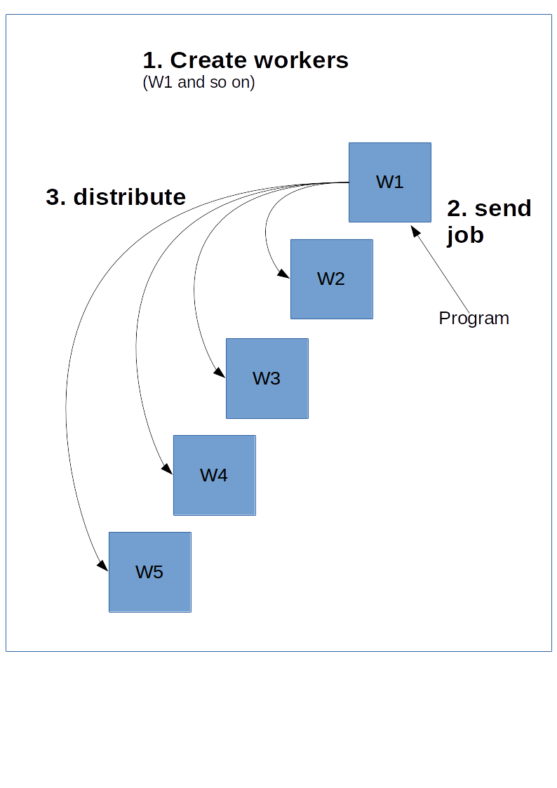
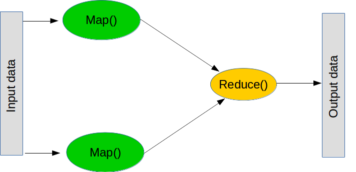

# 四、分布式

## 自定义函数

Conway 的生命游戏是一个有趣的计算机科学模拟，它在地图上发生，有许多正方形的单元格，就像棋盘一样。 模拟以特定的时间步骤进行，并且板上的每个单元可以是 1（生存）或 0（死亡）。 经过特定的时间步骤后，每个单元格都处于生存状态或死亡状态：

+   如果细胞是活着的，但是有一个或零个邻居，它会由于“人口不足”而“死亡”。
+   如果细胞存活并且有两个或三个邻居，它就会活着。
+   如果细胞有三个以上的邻居，它就会因人口过多而死亡。
+   任何有三个邻居的死细胞都会再生。

虽然这些规则似乎非常病态，但实际的模拟非常简单，创造了非常有趣的模式。 我们将创建一个 TensorFlow 程序来管理 Conway 的生命游戏，并在此过程中了解自定义`py_func`函数，并生成如下动画：

<http://learningtensorflow.com/images/game.mp4>

首先，让我们生成地图。 这是非常基本的，因为它只是一个 0 和 1 的矩阵。 我们随机生成初始地图，每次运行时都会提供不同的地图：

```py
import tensorflow as tf
from matplotlib import pyplot as plt

shape = (50, 50)
initial_board = tf.random_uniform(shape, minval=0, maxval=2, dtype=tf.int32)

with tf.Session() as session:
    X = session.run(initial_board)

fig = plt.figure()
plot = plt.imshow(X, cmap='Greys',  interpolation='nearest')
plt.show()
```

我们生成一个随机选择的 0 和 1 的`initial_board`，然后运行它来获取值。 然后我们使用`matplotlib.pyplot`来显示它，使用`imshow`函数，它基本上只根据一些`cmap`颜色方案绘制矩阵中的值。 在这种情况下，使用`'Greys'`会产生黑白矩阵，以及我们生命游戏的单个初始起点：


### 更新地图的状态

由于生命游戏的地图状态表示为矩阵，因此使用矩阵运算符更新它是有意义的。 这应该提供一种快速方法，更新给定时间点的状态。

非常有才华的 [Jake VanderPlas](http://staff.washington.edu/jakevdp/) 在使用 SciPy 和 NumPy 更新生命游戏中的特定状态方面做了一些出色的工作。 他的写作值得一读，可以在[这里]找到。 如果你对以下代码的工作原理感兴趣，我建议你阅读 Jake 的说明。 简而言之，`convolve2d`那行标识每个单元有多少邻居（这是计算机视觉中的常见操作符）。 我稍微更新了代码以减少行数，请参阅下面的更新后的函数：

```py
def update_board(X):
    # Check out the details at: https://jakevdp.github.io/blog/2013/08/07/conways-game-of-life/
    # Compute number of neighbours,
    N = convolve2d(X, np.ones((3, 3)), mode='same', boundary='wrap') - X
    # Apply rules of the game
    X = (N == 3) | (X & (N == 2))
    return X
```

`update_board`函数是 NumPy 数组的函数。 它不适用于张量，迄今为止，在 TensorFlow 中没有一种好方法可以做到这一点（虽然你可以使用现有的工具自己编写它，它不是直截了当的）。

在 TensorFlow 的 0.7 版本中，添加了一个新函数`py_func`，它接受 python 函数并将其转换为 TensorFlow 中的节点。

在撰写本文时（3 月 22 日），0.6 是正式版，并且它没有`py_func`。 我建议按照 TensorFlow 的 Github 页面上的说明为你的系统安装每晚构建。 例如，对于 Ubuntu 用户，你下载相关的 wheel 文件（python 安装文件）并安装它：

```
python -m wheel install --force ~/Downloads/tensorflow-0.7.1-cp34-cp34m-linux_x86_64.whl
```

请记住，你需要正确激活 TensorFlow 源（如果你愿意的话）。

最终结果应该是你安装了 TensorFlow 的 0.7 或更高版本。 你可以通过在终端中运行此代码来检查：

```
python -c "import tensorflow as tf; print(tf.__version__)"
```

结果将是版本号，在编写时为 0.7.1。

在代码上：

```py
board = tf.placeholder(tf.int32, shape=shape, name='board')
board_update = tf.py_func(update_board, [board], [tf.int32])
```

从这里开始，你可以像往常一样，对张量操作节点（即`board_update`）运行初始地图。 要记住的一点是，运行`board_update`的结果是一个矩阵列表，即使我们的函数只定义了一个返回值。 我们通过在行尾添加`[0]`来获取第一个结果，我们更新的地图存储在`X`中。

```py
with tf.Session() as session:
    initial_board_values = session.run(initial_board)
    X = session.run(board_update, feed_dict={board: initial_board_values})[0]
```

所得值`X`是初始配置之后更新的地图。 它看起来很像一个初始随机地图，但我们从未显示初始的（虽然你可以更新代码来绘制两个值）

### 循环

这是事情变得非常有趣的地方，尽管从 TensorFlow 的角度来看，我们已经为本节做了很多努力。 我们可以使用`matplotlib`来显示和动画，因此显示时间步骤中的模拟状态，就像我们的原始 GIF 一样。 `matplotlib`动画的复杂性有点棘手，但是你创建一个更新并返回绘图的函数，并使用该函数调用动画代码：

```py
import matplotlib.animation as animation
def game_of_life(*args):
    X = session.run(board_update, feed_dict={board: X})[0]
    plot.set_array(X)
    return plot,

ani = animation.FuncAnimation(fig, game_of_life, interval=200, blit=True)
plt.show()
```

> 提示：你需要从早期代码中删除`plt.show()`才能运行！

我将把拼图的各个部分作为练习留给读者，但最终结果将是一个窗口出现，游戏状态每 200 毫秒更新一次。

如果你实现了，请给我们发消息！

1）获取完整的代码示例，使用`matplotlib`和 TensorFlow 生成游戏的动画

2）康威的生命游戏已被广泛研究，并有许多有趣的模式。 创建一个从文件加载模式的函数，并使用它们而不是随机地图。 我建议从 Gosper 的滑翔枪开始。

3）生命游戏的一个问题（特征？）是地图可以重复，导致循环永远不会停止。 编写一些跟踪之前游戏状态的代码，并在游戏状态重复时停止循环。

## 使用 GPU

GPU（图形处理单元）是大多数现代计算机的组件，旨在执行 3D 图形所需的计算。 它们最常见的用途是为视频游戏执行这些操作，计算多边形向用户显示游戏。 总的来说，GPU 基本上是一大批小型处理器，执行高度并行化的计算。 你现在基本上有了一个迷你超级计算机！

> 注意：不是真正的超级计算机，但在许多方面有些相似。

虽然 GPU 中的每个“CPU”都很慢，但它们中有很多并且它们专门用于数字处理。 这意味着 GPU 可以同时执行许多简单的数字处理任务。 幸运的是，这正是许多机器学习算法需要做的事情。


> 没有 GPU 吗？
> 
> 大多数现代（最近10年）的计算机都有某种形式的 GPU，即使它内置在你的主板上。 出于本教程的目的，这就足够了。
> 
> 你需要知道你有什么类型的显卡。 Windows 用户可以遵循[这些说明](https://help.sketchup.com/en/article/36253)，其他系统的用户需要查阅他们系统的文档。

> 非 N 卡用户
> 
> 虽然其他显卡可能是受支持的，但本教程仅在最近的 NVidia 显卡上进行测试。 如果你的显卡属于不同类型，我建议你寻找 NVidia 显卡来学习，购买或者借用。 如果这对你来说真的很难，请联系你当地的大学或学校，看看他们是否可以提供帮助。 如果你仍然遇到问题，请随意阅读以及使用标准 CPU 进行操作。 你将能够在以后迁移所学的东西。

### 安装 GPU 版的 TensorFlow

如果你之前没有安装支持 GPU 的 TensorFlow，那么我们首先需要这样做。我们在第 1 课中没有说明，所以如果你没有按照你的方式启用 GPU 支持，那就是没有了。

我建议你为此创建一个新的 Anaconda 环境，而不是尝试更新以前的环境。

### 在你开始之前

前往 [TensorFlow 官方安装说明](https://www.tensorflow.org/versions/r0.9/get_started/os_setup.html#anaconda-installation)，并遵循 Anaconda 安装说明。这与我们在第 1 课中所做的主要区别在于，你需要为你的系统启用支持 GPU 的 TensorFlow 版本。但是，在将 TensorFlow 安装到此环境之前，你需要使用 CUDA 和 CuDNN，将计算机设置为启用 GPU 的。[TensorFlow 官方文档](https://www.tensorflow.org/versions/r0.9/get_started/os_setup.html#optional-install-cuda-gpus-on-linux)逐步概述了这一点，但如果你尝试设置最近的 Ubuntu 安装，我推荐[本教程](http://www.computervisionbytecnalia.com/es/2016/06/deep-learning-development-setup-for-ubuntu-16-04-xenial/)。主要原因是，在撰写本文时（2016 年 7 月），尚未为最新的 Ubuntu 版本构建 CUDA，这意味着该过程更加手动。

### 使用你的 GPU

真的很简单。 至少是字面上。 只需将这个：

```py
# 起步操作

with tf.Session() as sess:
    # 运行你的代码
```

改为这个：

```py
with tf.device("/gpu:0"):
    # 起步操作

with tf.Session() as sess:
    # 运行你的代码
```

这个新行将创建一个新的上下文管理器，告诉 TensorFlow 在 GPU 上执行这些操作。

我们来看一个具体的例子。 下面的代码创建一个随机矩阵，其大小在命令行中提供。 我们可以使用命令行选项在 CPU 或 GPU 上运行代码：


```py
import sys
import numpy as np
import tensorflow as tf
from datetime import datetime

device_name = sys.argv[1]  # Choose device from cmd line. Options: gpu or cpu
shape = (int(sys.argv[2]), int(sys.argv[2]))
if device_name == "gpu":
    device_name = "/gpu:0"
else:
    device_name = "/cpu:0"

with tf.device(device_name):
    random_matrix = tf.random_uniform(shape=shape, minval=0, maxval=1)
    dot_operation = tf.matmul(random_matrix, tf.transpose(random_matrix))
    sum_operation = tf.reduce_sum(dot_operation)


startTime = datetime.now()
with tf.Session(config=tf.ConfigProto(log_device_placement=True)) as session:
        result = session.run(sum_operation)
        print(result)

# 很难在终端上看到具有大量输出的结果 - 添加一些换行符以提高可读性。
print("\n" * 5)
print("Shape:", shape, "Device:", device_name)
print("Time taken:", datetime.now() - startTime)

print("\n" * 5)
```

你可以在命令行运行此命令：

```
python matmul.py gpu 1500
```

这将使用 GPU 和大小为 1500 平方的矩阵。 使用以下命令在 CPU 上执行相同的操作：

```
python matmul.py cpu 1500
```

与普通的 TensorFlow 脚本相比，在运行支持 GPU 的代码时，你会注意到的第一件事是输出大幅增加。 这是我的计算机在打印出任何操作结果之前打印出来的内容。

```
I tensorflow/stream_executor/dso_loader.cc:108] successfully opened CUDA library libcublas.so locally
I tensorflow/stream_executor/dso_loader.cc:108] successfully opened CUDA library libcudnn.so.5 locally
I tensorflow/stream_executor/dso_loader.cc:108] successfully opened CUDA library libcufft.so locally
I tensorflow/stream_executor/dso_loader.cc:108] successfully opened CUDA library libcuda.so.1 locally
I tensorflow/stream_executor/dso_loader.cc:108] successfully opened CUDA library libcurand.so locally
I tensorflow/stream_executor/cuda/cuda_gpu_executor.cc:925] successful NUMA node read from SysFS had negative value (-1), but there must be at least one NUMA node, so returning NUMA node zero
I tensorflow/core/common_runtime/gpu/gpu_init.cc:102] Found device 0 with properties: 
name: GeForce GTX 950M
major: 5 minor: 0 memoryClockRate (GHz) 1.124
pciBusID 0000:01:00.0
Total memory: 3.95GiB
Free memory: 3.50GiB
I tensorflow/core/common_runtime/gpu/gpu_init.cc:126] DMA: 0 
I tensorflow/core/common_runtime/gpu/gpu_init.cc:136] 0:   Y 
I tensorflow/core/common_runtime/gpu/gpu_device.cc:838] Creating TensorFlow device (/gpu:0) -> (device: 0, name: GeForce GTX 950M, pci bus id: 0000:01:00.0)
```

如果你的代码没有产生与此类似的输出，那么你没有运行支持 GPU 的 Tensorflow。或者，如果你收到`ImportError: libcudart.so.7.5: cannot open shared object file: No such file or directory`这样的错误，那么你还没有正确安装 CUDA 库。在这种情况下，你需要返回，遵循指南来在你的系统上安装 CUDA。

尝试在 CPU 和 GPU 上运行上面的代码，慢慢增加数量。从 1500 开始，然后尝试 3000，然后是 4500，依此类推。你会发现 CPU 开始需要相当长的时间，而 GPU 在这个操作中真的非常快！

如果你有多个 GPU，则可以使用其中任何一个。 GPU 是从零索引的 - 上面的代码访问第一个 GPU。将设备更改为`gpu:1`使用第二个 GPU，依此类推。你还可以将部分计算发送到一个 GPU，然后是另一个 GPU。此外，你可以以类似的方式访问计算机的 CPU - 只需使用`cpu:0`（或其他数字）。

### 我应该把什么样的操作发送给 GPU？

通常，如果该过程的步骤可以描述，例如“执行该数学运算数千次”，则将其发送到 GPU。 示例包括矩阵乘法和计算矩阵的逆。 实际上，许多基本矩阵运算是 GPU 的拿手好戏。 作为一个过于宽泛和简单的规则，应该在 CPU 上执行其他操作。

更换设备和使用 GPU 还需要付出代价。 GPU 无法直接访问你计算机的其余部分（当然，除了显示器）。 因此，如果你在 GPU 上运行命令，则需要先将所有数据复制到 GPU，然后执行操作，然后将结果复制回计算机的主存。 TensorFlow 在背后处理这个问题，因此代码很简单，但仍需要执行工作。

并非所有操作都可以在 GPU 上完成。 如果你收到以下错误，你正在尝试执行无法在 GPU 上执行的操作：

> Cannot assign a device to node 'PyFunc': Could not satisfy explicit device specification '/device:GPU:1' because no devices matching that specification are registered in this process;

如果是这种情况，你可以手动将设备更改为 CPU 来执行此函数，或者设置 TensorFlow，以便在这种情况下自动更改设备。 为此，请在配置中设置`allow_soft_placement`为`True`，作为创建会话的一部分。 原型看起来像这样：

```py
with tf.Session(config=tf.ConfigProto(allow_soft_placement=True)):
    # 在这里运行你的图
```

我还建议在使用 GPU 时记录设备的放置，这样可以轻松调试与不同设备使用情况相关的问题。 这会将设备的使用情况打印到日志中，从而可以查看设备何时更改以及它对图的影响。

```py
with tf.Session(config=tf.ConfigProto(allow_soft_placement=True, log_device_placement=True)):
    # 在这里运行你的图
```

1）设置你的计算机，将 GPU 用于 TensorFlow（或者如果你最近没有 GPU，就借一台）。

2）尝试在 GPU 上运行以前的练习的解决方案。 哪些操作可以在 GPU 上执行，哪些不可以？

3）构建一个在 GPU 和 CPU 上都使用操作的程序。 使用我们在第 5 课中看到的性能分析代码，来估计向 GPU 发送数据和从 GPU 获取数据的影响。

4）把你的代码发给我！ 我很乐意看到你的代码示例，如何使用 Tensorflow，以及你找到的任何技巧。

## 分布式计算

TensorFlow 支持分布式计算，允许在不同的进程上计算图的部分，这些进程可能位于完全不同的服务器上！ 此外，这可用于将计算分发到具有强大 GPU 的服务器，并在具有更多内存的服务器上完成其他计算，依此类推。 虽然接口有点棘手，所以让我们从头开始构建。

这是我们的第一个脚本，我们将在单个进程上运行，然后转移到多个进程。

```py
import tensorflow as tf

x = tf.constant(2)
y1 = x + 300
y2 = x - 66
y = y1 + y2

with tf.Session() as sess:
    result = sess.run(y)
    print(result)
```

到现在为止，这个脚本不应该特别吓到你。 我们有一个常数和三个基本方程。 结果（238）最后打印出来。

TensorFlow 有点像服务器 - 客户端模型。 这个想法是你创造了一大堆能够完成繁重任务的工作器。 然后，你可以在其中一个工作器上创建会话，它将计算图，可能将其中的一部分分发到服务器上的其他集群。

为此，主工作器，主机，需要了解其他工作器。 这是通过创建`ClusterSpec`来完成的，你需要将其传递给所有工作器。 `ClusterSpec`使用字典构建，其中键是“作业名称”，每个任务包含许多工作器。

下面是这个图表看上去的样子。



以下代码创建一个`ClusterSpect`，其作业名称为`local`，和两个工作器进程。

> 请注意，这些代码不会启动这些进程，只会创建一个将启动它们的引用。

```py
import tensorflow as tf

cluster = tf.train.ClusterSpec({"local": ["localhost:2222", "localhost:2223"]})
```

接下来，我们启动进程。 为此，我们绘制其中一个工作器的图，并启动它：

```py
server = tf.train.Server(cluster, job_name="local", task_index=1)
```

上面的代码在`local`作业下启动`localhost:2223`工作器。

下面是一个脚本，你可以从命令行运行来启动这两个进程。 将代码在你的计算机上保存为`create_worker.py`并运行`python create_worker.py 0`然后运行`python create_worker.py 1`。你需要单独的终端来执行此操作，因为脚本不会自己停止（他们正在等待指令）。

```py
# 从命令行获取任务编号
import sys
task_number = int(sys.argv[1])

import tensorflow as tf

cluster = tf.train.ClusterSpec({"local": ["localhost:2222", "localhost:2223"]})
server = tf.train.Server(cluster, job_name="local", task_index=task_number)

print("Starting server #{}".format(task_number))

server.start()
server.join()
```

执行此操作后，你将发现服务器运行在两个终端上。 我们准备分发！

“分发”作业的最简单方法是在其中一个进程上创建一个会话，然后在那里执行图。 只需将上面的`session`行更改为：

```py
with tf.Session("grpc://localhost:2222") as sess:
```

现在，这并没有真正分发，不足以将作业发送到该服务器。 TensorFlow 可以将进程分发到集群中的其他资源，但可能不会。 我们可以通过指定设备来强制执行此操作（就像我们在上一课中对 GPU 所做的那样）：

```py
import tensorflow as tf


cluster = tf.train.ClusterSpec({"local": ["localhost:2222", "localhost:2223"]})

x = tf.constant(2)


with tf.device("/job:local/task:1"):
    y2 = x - 66

with tf.device("/job:local/task:0"):
    y1 = x + 300
    y = y1 + y2


with tf.Session("grpc://localhost:2222") as sess:
    result = sess.run(y)
    print(result)
```

现在我们正在分发！ 这可以通过根据名称和任务编号，为工作器分配任务来实现。 格式为：

```py
/job:JOB_NAME/task:TASK_NUMBER
```

通过多个作业（即识别具有大型 GPU 的计算机），我们可以以多种不同方式分发进程。

### 映射和归约

MapReduce 是执行大型操作的流行范式。 它由两个主要步骤组成（虽然在实践中还有一些步骤）。



第一步称为映射，意思是“获取列表，并将函数应用于每个元素”。 你可以在普通的 python 中执行这样的映射：

```py
def myfunction(x):
    return x + 5
    
map_result = map(myfunction, [1, 2, 3])

print(list(map_result))
```

第二步是归约，这意味着“获取列表，并使用函数将它们组合”。 常见的归约操作是求和 - 即“获取数字列表并通过将它们全部加起来组合它们”，这可以通过创建相加两个数字的函数来执行。 `reduce`的原理是获取列表的前两个值，执行函数，获取结果，然后使用结果和下一个值执行函数。 总之，我们将前两个数字相加，取结果，加上下一个数字，依此类推，直到我们到达列表的末尾。 同样，`reduce`是普通 python 的一部分（尽管它不是分布式的）：

```py
from functools import reduce

def add(a, b):
    return a + b

print(reduce(add, [1, 2, 3]))
```

> 译者注：原作者这里的话并不值得推荐，比如`for`你更应该使用`reduce`，因为它更安全。

回到分布式 TensorFlow，执行`map`和`reduce`操作是许多非平凡程序的关键构建块。 例如，集成学习可以将单独的机器学习模型发送给多个工作器，然后组合分类结果来形成最终结果。另一个例子是一个进程。

这是我们将分发的另一个基本脚本：

```py
import numpy as np
import tensorflow as tf

x = tf.placeholder(tf.float32, 100)

mean = tf.reduce_mean(x)


with tf.Session() as sess:
    result = sess.run(mean, feed_dict={x: np.random.random(100)})
    print(result)

import numpy as np
import tensorflow as tf

x = tf.placeholder(tf.float32, 100)

mean = tf.reduce_mean(x)


with tf.Session() as sess:
    result = sess.run(mean, feed_dict={x: np.random.random(100)})
    print(result)
```

转换为分布式版本只是对先前转换的更改：

```py
import numpy as np
import tensorflow as tf

cluster = tf.train.ClusterSpec({"local": ["localhost:2222", "localhost:2223"]})

x = tf.placeholder(tf.float32, 100)


with tf.device("/job:local/task:1"):
    first_batch = tf.slice(x, [0], [50])
    mean1 = tf.reduce_mean(first_batch)

with tf.device("/job:local/task:0"):
    second_batch = tf.slice(x, [50], [-1])
    mean2 = tf.reduce_mean(second_batch)
    mean = (mean1 + mean2) / 2


with tf.Session("grpc://localhost:2222") as sess:
    result = sess.run(mean, feed_dict={x: np.random.random(100)})
    print(result)
```

如果你从映射和归约的角度来考虑它，你会发现分发计算更容易。 首先，“我怎样才能将这个问题分解成可以独立解决的子问题？” - 这就是你的映射。 第二，“我如何将答案结合起来来形成最终结果？” - 这就是你的归约。

在机器学习中，映射最常用的场景就是分割数据集。 线性模型和神经网络通常都非常合适，因为它们可以单独训练，然后再进行组合。

1）将`ClusterSpec`中的`local`更改为其他内容。 你还需要在脚本中进行哪些更改才能使其正常工作？

2）计算平均的脚本目前依赖于切片大小相同的事实。 尝试使用不同大小的切片并观察错误。 通过使用`tf.size`和以下公式来组合切片的平均值来解决此问题：

```py
overall_average = ((size_slice_1 * mean_slice_1) + (size_slice_2 * mean_slice_2) + ...) / total_size 
```

3）你可以通过修改设备字符串来指定远程计算机上的设备。 例如，`/job:local/task:0/gpu:0`会定位`local`作业的 GPU。 创建一个使用远程 GPU 的作业。 如果你有备用的第二台计算机，请尝试通过网络执行此操作。
