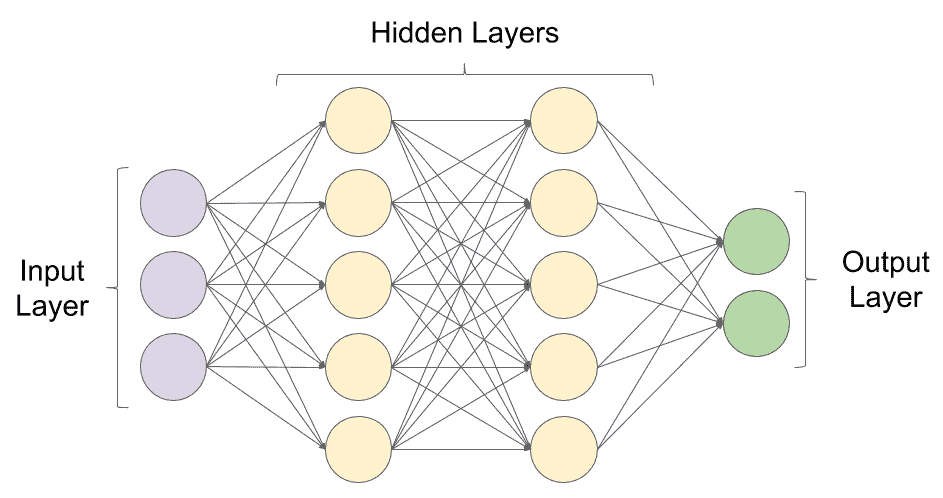
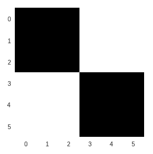
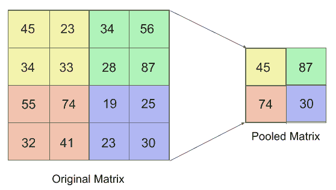
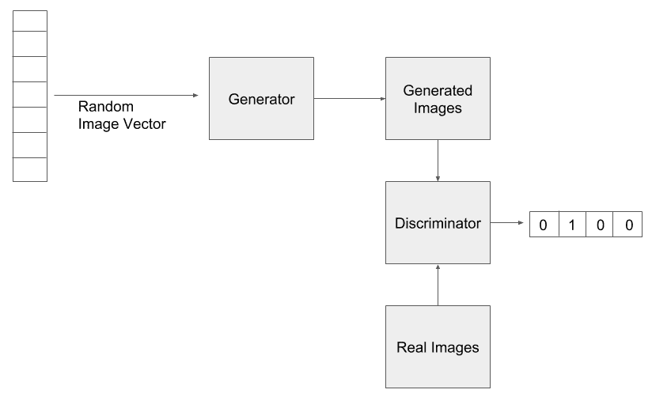
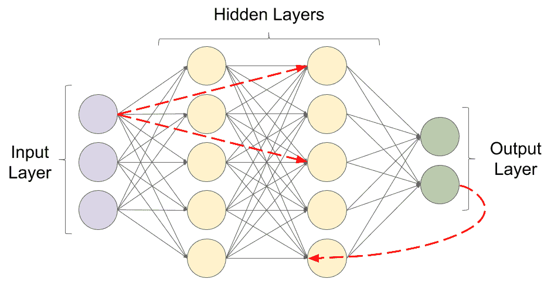
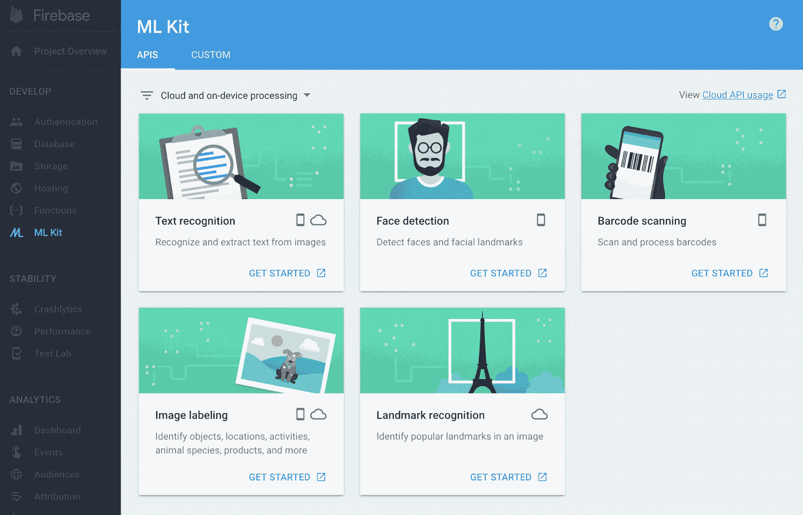
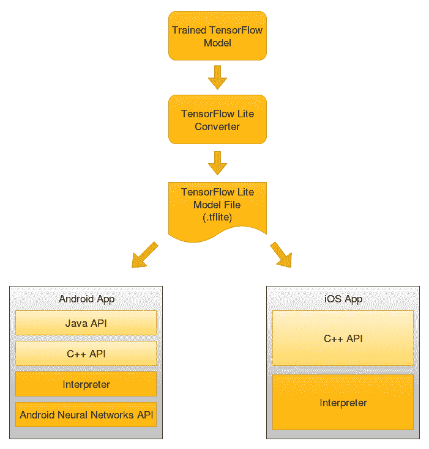

# 一、移动深度学习简介

在本章中，我们将探索移动设备上深度学习的新兴途径。 我们将简要讨论机器学习和深度学习的基本概念，并将介绍可用于将深度学习与 Android 和 iOS 集成的各种选项。 本章还介绍了使用本机和基于云的学习方法进行深度学习项目的实现。

在本章中，我们将介绍以下主题：

*   基于**人工智能**（**AI**）的移动设备的发展
*   了解机器学习和深度学习
*   介绍一些常见的深度学习架构
*   强化学习和**自然语言处理**（**NLP**）简介
*   在 Android 和 iOS 上集成 AI 的方法

# 人工智能移动设备的增长

AI 变得比以前更加移动，因为更小的设备具有更多的计算能力。 移动设备原本仅用于拨打电话和发送短信，但随着 AI 的引入，如今已转变为智能手机。 这些设备现在能够利用 AI 不断增强的功能来学习用户的行为和喜好，增强照片，进行全面的对话等等。 人工智能驱动的智能手机的功能预计只会一天一天地增长。 根据 Gartner 的数据，到 2022 年，80% 的智能手机将支持 AI。

# 支持 AI 的硬件变化

为了应对 AI 的高计算能力，对手机的硬件支持进行了定期更改和增强，以使他们具有思考和行动的能力。 移动制造公司一直在不断升级移动设备上的硬件支持，以提供无缝和个性化的用户体验。

华为已经发布了麒麟 970 SoC，该芯片可以使用专门的神经网络处理单元来实现设备上的 AI 体验。 苹果设备装有称为*神经引擎*的 AI 芯片，该芯片是 A11 Bionic 芯片的一部分。 它专用于机器学习和深度学习任务，例如面部和语音识别，记录动画和拍摄照片时的对象检测。 高通公司和联发科已经发布了他们自己的芯片，这些芯片支持设备上的 AI 解决方案。 三星宣布的 Exynos 9810 是一种基于神经网络的芯片，例如高通的 Snapdragon 845。 2018 年的三星设备 Galaxy S9 和 S9+ 包括这些基于其销售国家/地区的芯片。 借助 Galaxy S9，该公司非常明显地表明它将集成 AI 以改善设备相机的功能和实时文本翻译。 最新的三星 Galaxy S10 系列由 Qualcomm Snapdragon 855 提供支持，以支持设备上的 AI 计算。

Google Translate Word Lens 和 Bixby 个人助理已用于开发该功能。 有了这些技术，该设备即可翻译多达 54 种语言。 这些电话足够智能，可以在 f/2.4 和 f/1.5 的传感器之间进行选择，非常适合在弱光条件下拍摄照片。 Google Pixel 2 利用其机器学习的强大功能，通过其协处理器 Pixel Visual Core 集成了八个图像处理单元。

# 为什么移动设备需要使用 AI 芯片？

集成 AI 芯片不仅有助于提高效率和计算能力，而且还保留了用户的数据和隐私。 在移动设备上包含 AI 芯片的优势可以列举如下：

*   **性能**：当前日期中移动设备的 CPU 不适合机器学习的需求。 尝试在这些设备上部署机器学习模型通常会导致服务速度缓慢和电池消耗更快，从而导致不良的用户体验。 这是因为 CPU 缺乏执行 AI 计算所需的大量小型计算的效率。 AI 芯片类似于负责处理设备上图形的**图形处理器**（**GPU**）芯片，提供了单独的空间来执行与机器学习和深度学习过程专门相关的计算 。 这使 CPU 可以将时间集中在其他重要任务上。 通过合并专用的 AI 硬件，设备的性能和电池寿命得到了改善。
*   **用户隐私**：硬件还确保提高用户隐私和安全性。 在传统的移动设备中，数据分析和机器学习过程将需要将用户数据的大块发送到云中，从而威胁到用户数据隐私和移动设备的安全性。 借助设备上的 AI 芯片，可以在设备本身上离线执行所有必需的分析和计算。 在移动设备中包含专用硬件的这种方式极大地降低了用户数据被黑或泄漏的风险。
*   **效率**：在现实世界中，通过集成 AI 芯片，诸如图像识别和处理之类的任务可能会快得多。 华为的神经网络处理单元就是一个很好的例子。 它能够以每秒 2,000 张图片的效率识别图像。 该公司声称这比标准 CPU 所花费的时间快 20 倍。 当使用 16 位浮点数时，它可以执行 1.92 teraflops 或每秒 1 万亿次浮点运算。 苹果公司的神经引擎每秒可处理约 6000 亿次操作。
*   **经济性**：设备上的 AI 芯片减少了将数据发送到云中的需求。 此功能使用户可以脱机访问服务并保存数据。 因此，可以避免使用应用的人为服务器付费。 这对用户和开发人员都是有利的。

让我们简要概述一下移动设备上的 AI 如何影响我们与智能手机交互的方式。

# 在移动设备上使用 AI 改善用户体验

人工智能的使用极大地增强了移动设备上的用户体验。 可以将其大致分为以下几类。

# 个性化

个性化主要是指修改服务或产品以适合特定个人的偏好，有时与个人集群有关。 在移动设备上，使用 AI 通过使设备和应用适应用户的习惯及其独特的个人资料（而不是面向通用个人资料的应用）来帮助改善用户体验。 移动设备上的 AI 算法利用可用的特定于用户的数据（例如位置，购买历史记录和行为模式）来预测和个性化当前和将来的交互，例如在一天的特定时间段内用户的首选活动或音乐。

例如，AI 收集有关用户购买历史的数据，并将其与从在线流量，移动设备，电子设备中嵌入的传感器和车辆中获得的其他数据进行编译。 然后，这些经过编译的数据将用于分析用户的行为，并允许品牌采取必要的措施来提高用户参与率。 因此，用户可以利用基于 AI 的应用的好处来获得个性化的结果，这将减少他们的滚动时间，并让他们探索更多的产品和服务。

最好的例子是通过购物平台（如沃尔玛，亚马逊）或媒体平台（如 YouTube 或 Netflix）运行的推荐系统。

2011 年，亚马逊报告的销售额增长了 29%，从 99 亿美元增至 128.3 亿美元。 凭借最成功的推荐率，亚马逊 35% 的销售额来自遵循其产品推荐引擎生成的推荐的客户。

# 虚拟助手

虚拟助手是一种可以理解语音命令并为用户完成任务的应用。 他们能够使用**自然语言理解**（**NLU**）来解释人的语音，并且通常会通过合成语音进行响应。 您可能会使用虚拟助手来完成真正的私人助手为您执行的几乎所有任务，即代表您打电话给他人，记下您指定的笔记，打开或关闭家中的电灯/ 在家庭自动化的帮助下办公，为您播放音乐，甚至只是与您讨论您想谈论的任何话题！ 虚拟助手可能能够接受文本，音频或视觉手势形式的命令。 虚拟助手会随着时间的推移适应用户习惯并变得更聪明。

利用 NLP 的功能，虚拟助手可以识别口头语言的命令，并从您上传到助手或保存在他们可以访问的任何在线相册中的图像中识别人和宠物。

目前市场上最受欢迎的虚拟助手是亚马逊上运行的 Amazon Alexa，Google 助手，iPhone 的 Siri，微软的 Cortana 和在三星设备上运行的 Bixby。 一些虚拟助手是被动监听器，仅当他们收到特定的唤醒命令时才响应。 例如，可以使用“嘿谷歌”或“确定谷歌”激活 Google 助手，然后使用“关闭卧室灯”命令关闭谷歌助手，或者使用来从联系人列表中呼叫某人。 “打给”。 在 Google IO '18 中，Google 推出了双工电话预订 AI，这表明 Google Assistant 不仅能够拨打电话，而且还可以进行对话并有可能独自在美发沙龙中进行预订 。

虚拟助手的使用呈指数增长，预计到 2021 年将达到 18 亿用户。54% 的用户同意虚拟助手有助于简化日常任务，而 31% 的人已经在日常生活中使用助手。 此外，有 64% 的用户将虚拟助手用于多个目的。

# 面部识别

足以识别或验证面部或从数字图像和视频中识别面部表情的技术被称为面部识别。 该系统通常通过将给定图像中最常见和最显着的面部特征与数据库中存储的面部进行比较来工作。 面部识别还具有根据个人的面部纹理和形状来理解图案和变化的能力，以唯一地识别一个人，通常被称为基于 AI 的生物识别应用。

最初，面部识别是计算机应用的一种形式。 但是，近来它在移动平台上被广泛使用。 面部识别以及诸如指纹和虹膜识别之类的生物识别技术在移动设备的安全系统中得到了普遍的应用。 通常，人脸识别过程分两个步骤进行：特征提取和选择是第一步，对象分类是第二步。 后来的发展引入了其他几种方法，例如使用面部识别算法，三维识别，皮肤纹理分析和热像仪。

Apple 的 iPhone X 中引入的 Face ID 是生物识别认证的后继产品，是几种基于 Android 的智能手机中基于指纹的认证系统的继任者。 人脸 ID 的人脸识别传感器由两部分组成：`Romeo`模块和`Juliet`模块。 `Romeo` 模块负责将 30,000 多个红外点投射到用户的脸上。 该模块的对应部分`Juliet` 模块，读取用户面部上的点形成的图案。 然后将图案发送到设备 CPU 中的设备上`Secure Enclave`模块，以确认面部是否与所有者匹配。 苹果无法直接访问这些面部图案。 当用户闭上眼睛时，系统不允许授权工作，这是增加的安全性。

该技术从用户外观的变化中吸取教训，并可以用于化妆，胡须，眼镜，太阳镜和帽子。 它也可以在黑暗中工作。 **泛光照明器**是专用的红外闪光灯，可将不可见的红外光投射到用户的脸上，以正确读取面部表情，并帮助系统在弱光条件下甚至在完全黑暗的情况下运行。 与 iPhone 相反，三星设备主要依赖于二维面部识别，并带有虹膜扫描仪，该虹膜扫描仪可在 Galaxy Note 8 中用作生物识别。印度领先的高级智能手机销售商 OnePlus 也仅依赖于二维面部识别。

到 2023 年，利用面部识别的软件全球市场预计将从 2017 年的 38.5 亿美元增长到 97.8 亿美元。亚太地区是增长最快的地区，其市场份额约为 16%。

# 人工智能相机

相机中的 AI 集成使他们能够识别，理解和增强场景和照片。 AI 摄像机能够理解和控制摄像机的各种参数。 这些相机基于称为**计算摄影**的数字图像处理技术的原理工作。 它使用算法而不是光学过程来寻求使用机器视觉来识别和改善图片内容。 这些相机使用深度学习模型，这些模型在包​​含数百万个样本的巨大图像数据集上进行训练，可自动识别场景，光线的可用性以及所捕获场景的角度。

当相机指向正确的方向时，相机的 AI 算法将接管更改相机的设置，以产生最佳质量的图像。 在幕后，实现 AI 摄影的系统并不简单。 所使用的模型经过高度优化，可在检测到几乎实时捕获的场景特征时产生正确的相机设置。 它们还可以添加动态曝光，颜色调整以及图像的最佳效果。 有时，图像可能会由 AI 模型自动进行后处理，而不是在单击照片时进行处理，以减少设备的计算开销。

如今，移动设备通常配备双镜头相机。 这些相机使用两个镜头在照片上添加散景效果（日语中为“模糊”）。 **背景虚化**效果为主要拍摄对象周围的背景增添了模糊感，使其在美学上令人愉悦。 基于 AI 的算法有助于模拟识别对象的效果，并使剩余部分模糊，从而产生人像效果。

Google Pixel 3 相机可以在 **Top Shot** 和 **Photobooth** 两种拍摄模式下工作。 相机最初在用户尝试捕获之前和之后捕获几帧。 然后，设备中可用的 AI 模型就可以选择最佳帧。 通过为相机的图像识别系统提供大量训练，使之成为可能，然后，该系统便能够选择看上去最好的图片，几乎就像人在捡照片一样。 **照相棚**模式允许用户简单地将设备对准动作场景，并在相机预测为图像完美的时刻自动拍摄图像。

# 预测文本

预测文本是一种输入技术，通常在消息传递应用中使用，根据输入的单词和短语向用户建议单词。 每次按键后的预测都是唯一的，而不是以相同的恒定顺序产生重复的字母序列。 预测性文本可以通过一次按键即可输入整个单词，从而可以大大加快输入过程。 这使得输入书写任务（例如键入文本消息，编写电子邮件或使用较少的设备键来使地址簿中的条目高效输入）成为可能。 预测文本系统将用户的首选界面样式与他们学习预测文本软件的能力水平联系在一起。 通过分析和适应用户的语言，系统最终变得更智能。 T9 词典是此类文​​本预测器的一个很好的例子。 它分析使用的单词的频率，并生成多个最可能的单词。 它也能够考虑单词的组合。

快速类型是苹果公司在其 iOS 8 版本中宣布的一种预想性文本功能。 它使用机器学习和 NLP，这使软件可以根据用户的打字习惯来构建自定义词典。 这些词典随后用于预测。 这些预测系统还取决于对话的上下文，并且能够区分正式和非正式语言。 此外，它支持全球多种语言，包括美国英语，英国英语，加拿大英语，澳大利亚英语，法语，德语，意大利语，巴西葡萄牙语，西班牙语和泰语。

Google 还推出了一项新功能，该功能将帮助用户比以前更快地撰写和发送电子邮件。 名为 Smart Compose 的功能可以理解键入的文本，以便 AI 可以建议单词和短语来完成句子。 智能撰写功能可通过纠正拼写错误和语法错误以及建议用户最常用的单词，帮助用户节省编写电子邮件的时间。 智能回复是另一个功能，类似于 LinkedIn 消息中的回复建议，该建议根据用户接收到的电子邮件的上下文，建议单击一次即可发送的回复。 例如，如果用户收到一封祝贺他们接受的应用的电子邮件，则“智能回复”功能可能会提供以下选项来进行回复：“谢谢！”，“谢谢让我知道”和“谢谢您” 接受我的申请。” 然后，用户可以单击首选答复并发送快速答复。

在 1940 年代，林语堂创建了一种打字机，其中的启动键会根据所选字符提示字符。

# 使用 AI 的最受欢迎的移动应用

近年来，我们看到将 AI 集成到其功能中以增加用户参与度和定制服务交付的应用数量激增。 在本节中，我们将简要讨论移动应用领域中一些最大的参与者如何利用 AI 的优势来促进其业务发展。

# Netflix

Netflix 是移动应用中机器学习的最佳和最受欢迎的例子。 该应用使用线性回归，逻辑回归和其他机器学习算法为用户提供完美的个性化推荐体验。 按演员，体裁，时长，评论，年等分类的内容用于训练机器学习算法。 所有这些机器学习算法都会学习并适应用户的动作，选择和偏好。 例如，约翰看了一个新电视连续剧的第一集，但并不十分喜欢，所以他不会看后续的几集。 Netflix 涉及的推荐系统了解他不喜欢这种电视节目，因此将其从推荐中删除。 同样，如果约翰从推荐列表中选择了第八条推荐，或者在看完电影预告片后写了一篇不好的评论，则所涉及的算法会尝试适应其行为和偏好，以提供极为个性化的内容。

# Seeing AI

微软开发的 Seeing AI 是一款智能相机应用，它使用计算机视觉来听觉上帮助盲人和视障人士了解周围的环境。 它具有一些功能，例如为用户读取简短的文本和文档，提供有关人的描述，使用设备的相机识别其他应用中的货币，颜色，笔迹，光线甚至图像。 为了使该应用具有先进的实时响应能力，开发人员采用了使服务器与 Microsoft Cognitive Services 通信的想法。 OCR，条形码扫描仪，面部识别和场景识别是该应用整合在一起的最强大的技术，可为用户提供一系列出色的功能。

# Allo

Allo 是 Google 开发的以 AI 为中心的消息传递应用。 自 2019 年 3 月起，Allo 已停产。 但是，这是 Google 推动 AI 应用发展的重要里程碑。 该应用允许用户通过语音在 Android 手机上执行操作。 它使用了智能回复功能，该功能可以通过分析对话的上下文来建议单词和短语。 该应用不仅限于文本。 实际上，它同样能够分析对话期间共享的图像并提出回复建议。 强大的图像识别算法使之成为可能。 后来，此智能回复功能也在 Google 收件箱中实现，现在已在 Gmail 应用中提供。

# 英语语音助手

**英语语音助手**（**ELSA**）被评为全球基于 AI 的应用排名前五的应用，它是世界上最智能的 AI 语音导师。 该移动应用可以帮助人们提高发音。 它被设计为冒险游戏，按级别进行区分。 每个级别呈现一组供用户发音的单词，将其作为输入。 仔细检查用户的响应以指出他们的错误并帮助他们改进。 当应用检测到错误的发音时，它会通过指示用户嘴唇和舌头的正确运动来教给用户正确的发音，以便正确地说出单词。

# Socratic

Socratic 是一个导师应用，它允许用户拍摄数学问题，并给出答案以解释其背后的理论，并详细说明应如何解决。 该应用不仅限于数学。 当前，它可以为 23 个不同主题的用户提供帮助，包括英语，物理，化学，历史，心理学和微积分。 该应用使用 AI 的功能来分析所需的信息，并通过分步解决方案返回视频。 该应用的算法与计算机视觉技术相结合，能够读取图像中的问题。 此外，它使用针对数百万个示例问题训练的机器学习分类器，有助于准确预测解决问题所涉及的概念。

现在，让我们更深入地研究机器学习和深度学习。

# 了解机器学习和深度学习

在能够研究包含与 AI 领域相关的技术和算法的解决方案之前，了解一些机器学习和深度学习的关键概念很重要。 当我们谈论 AI 的当前状态时，我们通常指的是能够搅动大量数据以找到模式并根据这些模式进行预测的系统。

尽管“人工智能”一词可能会带来说话的类人机器人或自动驾驶到外行的图像，但对于研究该领域的人来说，它们可能是互连的计算模块图和网络的形式。

在下一节中，我们将首先介绍机器学习。

# 了解机器学习

1959 年，亚瑟·塞缪尔（Arthur Samuel）创造了术语**机器学习**。 在他对机器学习的定义的轻描淡写中，使机器能够从过去的经验中学习并在提供未知输入的情况下基于它们进行预测的计算机科学领域称为机器学习。

机器学习的更精确定义可以描述如下：

*   通过学习有关任务`T`的经验`E`来提高其在任何任务`T`上的性能`P`的计算机程序，称为机器学习程序。
*   使用前面的定义，在目前类似的情况下，`T`是与预测有关的任务，而`P`是计算机程序在执行任务`T`时所达到的准确率度量，基于程序能够学习的内容，该学习称为`E`。 随着`E`的增加，计算机程序会做出更好的预测，这意味着`P`得到改善，因为该程序以更高的精度执行任务`T`。
*   在现实世界中，您可能会遇到一位老师在教学生执行特定任务，然后通过让学生参加考试来评估学生执行任务的技能。 学生接受的训练越多，他们执行任务的能力就越好，并且他们的考试成绩也就越高。

在下一节中，让我们尝试了解深度学习。

# 了解深度学习

我们已经很长时间听到了**学习**一词，并且在某些情况下通常意味着获得执行任务的经验。 但是，以学习为前缀的**深度**是什么意思？

在计算机科学中，深度学习是指一种机器学习模型，其中涉及多个学习层。 这意味着计算机程序由多种算法组成，数据通过这些算法逐一传递，最终产生所需的输出。

深度学习系统是使用神经网络的概念创建的。 神经网络是连接在一起的神经元层的组成，因此数据从一层神经元传递到另一层，直到到达最终层或输出层。 神经元的每一层以与最初将数据作为输入提供给神经网络的形式相同或不同的形式获取数据输入。

考虑以下神经网络图：



前面的屏幕截图中介绍了一些术语。 让我们简要地讨论其中的每一个。

# 输入层

保留输入值的层称为输入层。 有人认为该层实际上不是一个层，而仅仅是一个保存数据的变量，因此是数据本身，而不是一个层。 但是，保持该层的矩阵的尺寸很重要，必须正确定义，以使神经网络与第一隐藏层进行通信。 因此，从概念上讲，它是保存数据的层。

# 隐藏层

输入层和输出层之间的任何中间层都称为隐藏层。 生产环境中使用的典型神经网络可能包含数百个输入层。 通常，隐藏层比输入或输出层包含更多的神经元。 但是，在某些特殊情况下，这可能不成立。 通常会在隐藏层中包含大量神经元，以处理输入以外的维度中的数据。 这使程序可以以用户将其馈入网络时所呈现的格式，以数据的形式获得洞察力或模式，这些数据可能不可见。

神经网络的复杂性直接取决于网络中神经元的层数。 尽管神经网络可以通过添加更多层来发现数据中更深的模式，但它也增加了网络的计算成本。 网络也有可能进入称为**过拟合**的错误状态。 相反，如果网络太简单，或者说网络不够深，它将到达另一个错误状态，称为**欠拟合**。

您可以在[这个页面](https://towardsdatascience.com/overfitting-vs-underfitting-a-conceptual-explanation-d94ee20ca7f9)上了解有关过拟合和不足的更多信息。

# 输出层

产生并存储所需输出的最后一层称为输出层。 该层通常对应于所需输出类别的数量，或具有一个包含所需回归输出的单个神经元。

# 激活函数

神经网络中的每一层都接受称为**激活函数**的函数。 此函数的作用是将神经元内部包含的数据保持在正常范围内，否则该范围会变得太大或太小，并导致与计算机中大十进制系数或大数的处理有关的计算错误。 另外，激活函数使神经网络能够处理数据中模式的非线性。

# 一些常见的深度学习架构简介

在对关键术语进行简短修订之后，我们现在准备更深入地研究深度学习领域。 在本节中，我们将学习一些著名的深度学习算法及其工作原理。

# 卷积神经网络

从动物视觉皮层得到启发，**卷积神经网络**（**CNN**）主要用于图像处理，并且实际上已经成为图像处理的标准。 卷积层的核心概念是核（或过滤器）的存在，这些核学习区分图像的特征。 核通常比图像矩阵短得多，并且以滑动窗口的方式传递到整个图像上，从而产生核的点积与待处理图像的相应矩阵切片。 点积使程序可以识别图像中的特征。

考虑以下图像向量：

```py
[[10, 10, 10, 0, 0, 0],
 [10, 10, 10, 0, 0, 0],
 [10, 10, 10, 0, 0, 0],
 [0, 0, 0, 10, 10, 10],
 [0, 0, 0, 10, 10, 10],
 [0, 0, 0, 10, 10, 10]]
```

前面的矩阵对应于如下图像：



在应用过滤器检测水平边缘时，过滤器由以下矩阵定义：

```py
[[1, 1, 1],
 [0, 0, 0],
 [-1, -1, -1]]
```

原始图像与过滤器卷积后产生的输出矩阵如下：

```py
[[ 0, 0, 0, 0],
 [ 30, 10, -10, -30],
 [ 30, 10, -10, -30],
 [ 0, 0, 0, 0]]
```

在图像的上半部或下半部没有检测到边缘。 从左边缘移到图像的垂直中间时，会发现清晰的水平边缘。 在向右移动时，在水平边缘的另一个清晰实例之前找到了两个水平边缘的不清楚实例。 但是，现在发现的清晰水平边缘的颜色与上一个相反。

因此，通过简单的卷积，可以发现图像文件中的图案。 CNN 还使用其他几个概念，例如池化。

可以从以下屏幕截图中了解池化：



用最简单的术语来说，合并是将多个图像像素合并为单个像素的方法。 前面的屏幕快照中使用的合并方法称为**最大池化**，其中只有来自所选滑动窗口核的最大值保留在所得矩阵中。 这极大地简化了图像，并有助于训练通用且不是单个图像专用的过滤器。

# 生成对抗网络

**生成对抗网络**（**GAN**）是 AI 领域中一个相当新的概念，并且最近已成为一项重大突破。 它们是由 Ian Goodfellow 在 2014 年的研究论文中介绍的。GAN 的核心思想是两个相互竞争的神经网络的并行运行。 第一个神经网络执行生成样本的任务，称为**生成器**。 另一个神经网络尝试根据先前提供的数据对样本进行分类，称为**判别器**。 可以通过以下屏幕截图了解 GAN 的功能：



在此，随机图像向量经过生成过程以生成伪造图像，然后由已经用真实图像训练的判别器对伪造图像进行分类。 具有较高分类置信度的伪图像将进一步用于生成，而具有较低置信度的伪图像将被丢弃。 随着时间的流逝，判别器学会正确识别伪造的图像，而生成器学会在每一代之后逐渐生成与真实图像相似的图像。

在学习结束时，我们将拥有一个可以产生近乎真实数据的系统，以及一个可以非常精确地对样本进行分类的系统。

在接下来的章节中，我们将了解有关 GAN 的更多信息。

对于 GAN 的深入研究，您可以阅读 Ian Goodfellow 在[这个页面](https://arxiv.org/abs/1406.2661)上发表的研究论文。

# 循环神经网络

并非世界上所有数据都独立于时间而存在。 股市价格和口语/书面文字只是与时间序列相关的数据的几个示例。 因此，数据序列具有时间维度，您可能会假设能够以适合数据的方式使用它（随时间的流逝而不是保持不变的数据块）会更直观，更直观。 会产生更好的预测精度。 在许多情况下，这是事实，并导致了神经网络架构的出现，在学习和预测时可能需要时间。

一种这样的架构是**循环神经网络**（**RNN**）。 这种网络的主要特征是它不仅以顺序的方式将数据从一层传递到另一层，而且还从任何先前的层获取数据。 回顾“了解机器学习和深度学习”部分的示意图，该图具有两个隐藏层，是一个简单的**人工神经网络**（**ANN**）。 数据仅由上一层馈入下一层。 在具有两个隐藏层的 RNN 中，并非强制要求仅由第一隐藏层提供对第二隐藏层的输入，就像在简单的 ANN 中那样。

以下屏幕截图中的虚线箭头表示了这一点：



与简单的 ANN 相比，RNN 使用一种称为**时间上的反向传播**（**BPTT**）的方法，而不是 ANN 中的经典反向传播。 BPTT 通过在与网络中必须重复出现的输入有关的函数中定义时间，从而确保在错误的反向传播中很好地表示时间。

# 长期记忆

在 RNN 中观察到**消失**和**爆炸**梯度非常普遍。 在深度 RNN 的实现中，这是一个严重的瓶颈，在深度 RNN 中，数据以特征之间的关系比线性函数更复杂的形式存在。 为了克服消失的梯度问题，德国研究人员 Sepp Hochreiter 和 Juergen Schmidhuber 于 1997 年提出了**长短期记忆**（**LSTM**）的概念。

LSTM 已被证明在 NLP，图像标题生成，语音识别和其他领域中非常有用，在引入后，LSTM 打破了先前建立的记录。 LSTM 将信息存储在网络外部，可以随时调用，就像计算机系统中的辅助存储设备一样。 这允许将延迟的奖励引入网络。 对 LSTM 进行了精神上的类比，称其为一个人因过去所采取的行动而获得的“业力”或报酬。

在本书的后续章节中，我们将更深入地研究 LSTM 和 CNN。

# 强化学习和自然语言处理简介

在本节中，我们将研究强化学习和自然语言处理的基本概念。 这些是 AI 领域中非常重要的主题。 他们可能会也可能不会使用深度学习网络来实现，但是通常会使用深度网络来实现。 因此，了解它们的功能至关重要。

# 强化学习

强化学习是机器学习的一个分支，用于创建 AI“智能体”，以在给定环境中执行一组可能的动作，以使报酬最大化。 机器学习的其他两个分支（有监督的和无监督的机器学习）通常以表的形式在数据集上执行学习，而强化学习智能体通常使用决策树进行学习，以在任何给定情况下进行决策，最终使决策树到达具有最大奖励的叶子。

例如，考虑一个希望学习走路的人形机器人。 它可以首先将其两条腿推到自己的前面，在这种情况下它会掉落，而奖励（在这种情况下，是人形机器人所覆盖的距离）将为 0。然后，它将学会在提出的前一条和提出的下一条之间增加一定的延迟。 由于存在一定程度的延迟，这可能是机器人能够在再次踩踏双脚同时向外并且摔倒之前采取`x1`的步骤。

强化学习采用**探索**的概念，这意味着寻求更好的解决方案，而**利用**的概念则意味着使用先前获得的知识。 继续我们的示例，由于`x1`大于 0，因此该算法学会了在跨步之间放置大约相同的特定延迟量。 随着时间的推移，在开发和探索的共同作用下，强化学习算法变得非常强大，在这种情况下，类人动物不仅能够学习如何走路，而且还能学习跑步。

# 自然语言处理

NLP 是 AI 的广阔领域，它通过使用计算机算法来处理和理解人类语言。 NLP 包含几种针对人类语言理解的不同部分的方法和技术，例如，基于两个文本摘录的相似性来理解含义，生成人类语言响应，理解人类语言中提出的问题或指令以及将文本从一种语言翻译到另一种语言。

NLP 已在当今的技术领域中得到了广泛的应用，几家顶尖的技术公司都在朝着该领域迈进。 有几种基于语音的用户助手，例如 Siri，Cortana 和 Google Assistant，它们严重依赖准确的 NLP 才能正确执行其功能。 NLP 还发现可以通过自动客户支持平台在客户支持中使用它们，这些平台可以回答最常见的查询，而无需人工代表来回答。 这些基于 NLP 的客户支持系统在与客户互动时，还可以从真实代表的响应中学习。 在新加坡开发银行创建的 DBS DigiBank 应用的“帮助”部分中，可以找到一种这样的主要部署系统。

目前正在这一领域进行广泛的研究，并有望在未来几天主导 AI 的所有其他领域。 在下一部分中，让我们看一下将深度学习与移动应用集成的当前可用方法。

# 在 Android 和 iOS 上集成 AI 的方法

随着 AI 的日益普及，移动应用用户希望应用能够适应提供给他们的信息。 使应用适应数据的唯一方法是部署经过微调的机器学习模型，以提供令人愉悦的用户体验。

# Firebase ML 套件

Firebase ML Kit 是机器学习**软件开发工具包**（**SDK**），可在 Firebase 上为移动开发人员使用。 它促进了移动机器学习模型的托管和服务。 它减少了在移动设备上运行机器学习模型的繁重任务，从而减少了 API 调用，该 API 调用涵盖了常见的移动用例，例如面部检测，文本识别，条形码扫描，图像标记和地标识别。 它只是将输入作为参数，以便输出大量分析信息。 ML Kit 提供的 API 可以在设备上，在云上或在两者上运行。 设备上的 API 独立于网络连接，因此，与基于云的 API 相比，工作速度更快。 基于云的 API 托管在 Google Cloud Platform 上，并使用机器学习技术来提供更高的准确率。 如果可用的 API 无法满足所需的用例，则可以使用 Firebase 控制台构建，托管和提供自定义 TensorFlow Lite 模型。 ML Kit 充当自定义模型之间的 API 层，使其易于运行。 让我们看下面的截图：



在这里，您可以查看 Firebase ML Kit 的仪表板外观。

# Core ML

Core ML 是 Apple 在 iOS 11 中发布的一种机器学习框架，用于使在 iOS 上运行的应用（例如 Siri，Camera 和 QuickType）更加智能。 通过提供有效的性能，Core ML 促进了 iOS 设备上机器学习模型的轻松集成，使应用能够根据可用数据进行分析和预测。 Core ML 支持标准的机器学习模型，例如树状集成体，SVM 和广义线性模型。 它包含具有 30 多种类型的神经元层的广泛的深度学习模型。

使用 Vision 框架，可以轻松地将面部跟踪，面部检测，文本检测和对象跟踪等功能与应用集成。 自然语言框架有助于分析自然文本并推导其特定于语言的元数据。 与 Create ML 一起使用时，该框架可用于部署自定义 NLP 模型。 对 GamePlayKit 的支持有助于评估学习的决策树。 Core ML 建立在诸如 Metal 和 Accelerate 之类的底层技术之上，因此非常高效。 这使其可以利用 CPU 和 GPU。 此外，Core ML 不需要活动的网络连接即可运行。 它具有很高的设备上优化能力。 这样可确保所有计算都在设备本身内部离线进行，从而最大程度地减少了内存占用和功耗。

# Caffe2

Caffe2 建立在由加州大学伯克利分校开发的**用于快速嵌入的原始卷积架构**（**Caffe**）上，是一种轻量级，模块化，可扩展的深度学习框架，由 Facebook 开发。 它可以帮助开发人员和研究人员部署机器学习模型，并在 Android，iOS 和 Raspberry Pi 上提供 AI 驱动的性能。 此外，它支持在 Android Studio，Microsoft Visual Studio 和 Xcode 中进行集成。 Caffe2 带有可互换使用的本机 Python 和 C++  API，从而简化了原型设计和优化过程。 它足够有效地处理大量数据，并且有助于自动化，图像处理以及统计和数学运算。 Caffe2 是开源的，托管在 GitHub 上，它利用社区的贡献来开发新模型和算法。

# TensorFlow

TensorFlow 是 Google Brain 开发的开源软件库，可促进高性能数值计算。 由于其灵活的架构，它允许在 CPU，GPU 和 TPU 之间轻松部署深度学习模型和神经网络。 Gmail 使用 TensorFlow 模型来了解邮件的上下文，并通过其广为人知的功能“智能回复”来预测回复。 TensorFlow Lite 是 TensorFlow 的轻量级版本，有助于在 Android 和 iOS 设备上部署机器学习模型。 它利用 Android 神经​​网络 API 的功能来支持硬件加速。

下图说明了可通过 TensorFlow Lite 用于移动设备的 TensorFlow 生态系统：



在上图中，您可以看到我们需要将 TensorFlow 模型转换为 TensorFlow Lite 模型，然后才能在移动设备上使用它。 这很重要，因为与优化运行在移动设备上的 Lite 模型相比，TensorFlow 模型体积更大且延迟更大。 转换是通过 TF Lite 转换器执行的，可以通过以下方式使用：

*   使用 Python API：可以使用 Python 和以下任何代码行将 TensorFlow 模型转换为 TensorFlow Lite 模型。

```py
TFLiteConverter.from_saved_model(): Converts SavedModel directories.
TFLiteConverter.from_keras_model(): Converts tf.keras models.
TFLiteConverter.from_concrete_functions(): Converts concrete functions.
```

*   使用命令行工具：TensorFlow Lite 转换器也可以作为 CLI 工具使用，尽管它的功能与 Python API 版本相比有些不同：

```py
tflite_convert \
  --saved_model_dir=/tf_model \
  --output_file=/tflite_model.tflite
```

在接下来的章节中，我们将演示将 TensorFlow 模型转换为 TensorFlow Lite 模型。

# 总结

在本章中，我们了解了移动设备中 AI 的增长，这使机器无需进行明确编程即可推理和做出决策。 我们还研究了机器学习和深度学习，其中包括与 AI 领域相关的技术和算法。 我们研究了各种深度学习架构，包括 CNN，GAN，RNN 和 LSTM。

我们介绍了强化学习和 NLP，以及在 Android 和 iOS 上集成 AI 的不同方法。 深度学习的基本知识以及如何将其与移动应用集成对于接下来的章节非常重要，在这些章节中，我们将广泛使用该知识来创建一些实际应用。

在下一章中，我们将学习使用设备上模型进行面部检测的知识。