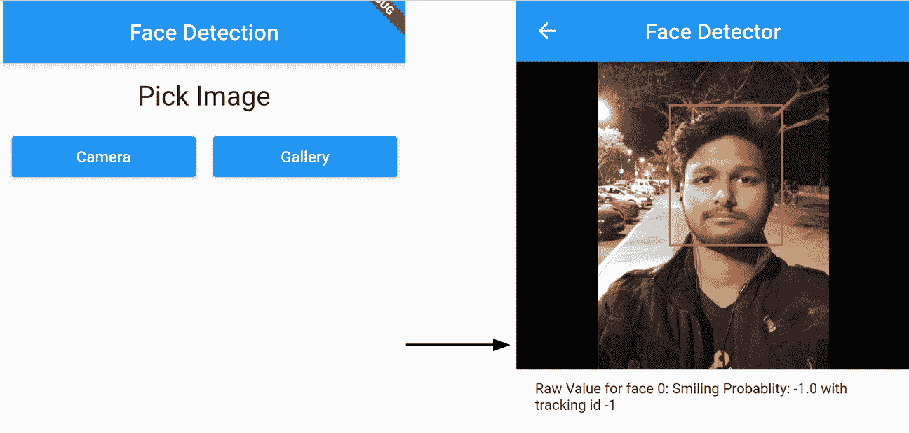
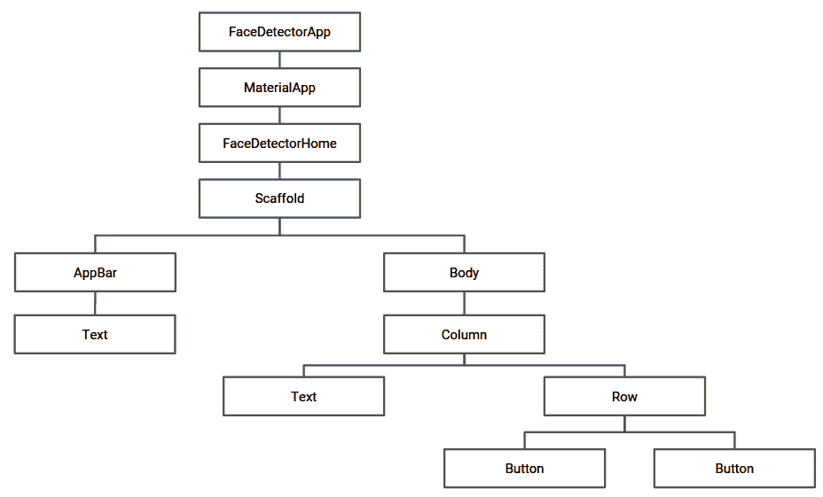
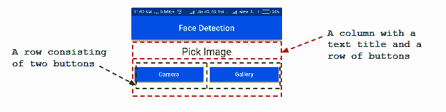
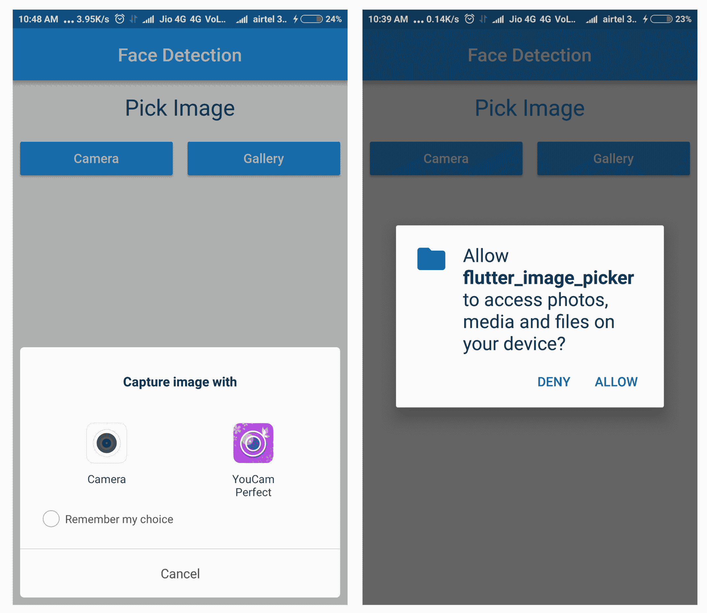

# 二、移动视觉 - 使用设备上的模型的人脸检测

在本章中，我们将构建一个 Flutter 应用，该应用能够使用 ML Kit 的 Firebase Vision 人脸检测 API 从从设备图库上传的媒体中或直接从相机中检测人脸。 该 API 利用了 Firebase 上托管的预训练模型的功能，并为应用提供了识别面部关键特征，检测表情并获取检测到的面部轮廓的功能。 由于人脸检测是通过 API 实时执行的，因此它还可用于跟踪视频序列，视频聊天或响应用户表情的游戏中的人脸。 用 Dart 编码的应用将在 Android 和 iOS 设备上有效运行。

在本章中，我们将讨论以下主题：

*   图像处理简介
*   使用 Flutter 开发人脸检测应用

让我们先简单介绍一下图像识别的工作原理！

# 技术要求

您需要带有 Flutter 和 Dart 插件的 Visual Studio Code，并且需要设置 Firebase 控制台。 本章的 GitHub 存储库位于[这里](https://github.com/PacktPublishing/Mobile-Deep-Learning-Projects/tree/master/Chapter2)。

# 图像处理简介

在本章中，我们将检测图像中的人脸。 在人工智能的上下文中，为了提取有关该图像的视觉内容的信息而处理图像的动作称为图像处理。

得益于更好的人工智能驱动相机，基于医学图像的机器学习，自动驾驶汽车，人们从图像中分析人的情感以及许多其他应用的数量激增，图像处理是一个新兴领域。

考虑使用自动驾驶车辆进行图像处理。 车辆需要尽可能接近实时地做出决策，以确保最佳的无事故驾驶。 汽车驾驶 AI 模型的响应延迟可能会导致灾难性后果。 已经开发了几种技术和算法来进行快速和准确的图像处理。 图像处理领域中最著名的算法之一是**卷积神经网络**（**CNN**）。

我们不会在本章中开发完整的 CNN，但是，我们在 “第 1 章”，“移动深度学习简介”中简要讨论了 CNN。 稍后，我们将使用设备上存在的预训练模型构建面部检测 Flutter 应用。

# 了解图像

在深入研究图像处理之前，让我们从计算机软件的角度讨论图像的解剖结构。 考虑以下简单图像：


前面的图像是`10 x 10`像素的图像（放大）； 前两行像素为紫色，后六行像素为红色，后两行像素为黄色。

但是，计算机看不到该图像中的颜色。 计算机以像素密度矩阵的形式看到此图像。 我们在这里处理 RGB 图像。 RGB 图像由三层颜色组成，即红色，绿色和蓝色。 这些层中的每一个都由图像中的矩阵表示。 每个矩阵的元素对应于图像的每个像素中该矩阵表示的颜色的强度。

让我们检查程序中的上一个图像。 紫色的两行像素之一由以下数组表示：

```py
[[255, 0, 255],
[255, 0, 255],
[255, 0, 255],
[255, 0, 255],
[255, 0, 255],
[255, 0, 255],
[255, 0, 255],
[255, 0, 255],
[255, 0, 255],
[255, 0, 255]]
```

在前面的矩阵中，`255`的第一列表示红色。 第二列代表绿色，第三列代表蓝色。 因此，图像左上角的第一个像素是红色，绿色和蓝色的组合。 红色和蓝色都处于最大强度，而绿色则完全缺失。 因此，正如预期的那样，产生的组合颜色是紫色，基本上是红色和蓝色以相等的比例混合。 如果我们按预期观察到图像红色区域中的任何像素，则会得到以下数组：

```py
[ 255, 0, 0 ]
```

同样，从黄色区域开始，由于黄色是红色和绿色的等比例组合，因此像素用以下形式表示：

```py
[  255, 255, 0 ]
```

现在，如果我们关闭图像的红色和绿色部分，仅打开蓝色通道，则会得到以下图像：


根据我们之前的观察，这非常多，只有前两行像素包含蓝色成分，而图像的其余部分没有蓝色成分，因此将其显示为黑色，这表示没有强度或`0` 蓝色强度。

# 处理图像

在本节中，我们将讨论如何对图像进行一些常见的操作以帮助图像处理。 通常，对图像进行一些简单的操作可以导致更快，更好的预测。

# 旋转

假设我们希望将示例中的图像旋转 90 度。 如果检查旋转后从顶部开始的第一行像素，则可以预期该行的前两个像素为紫色，中间的六个像素为红色，最后两个像素为黄色。 与矩阵旋转类似，这可以看作是转置操作，其中行转换为列，反之亦然。 图像如下所示：


而且，正如预期的那样，第一行像素由以下矩阵表示：

```py
[[255,   0, 255],
[255, 0, 255],
[255, 0,   0],
[255, 0,   0],
[255, 0,   0],
[255, 0,   0],
[255, 0,   0],
[255, 0,   0],
[255, 255,   0],
[255, 255,   0]]
```

在此矩阵中，前两个元素代表紫色，然后是六个红色，最后两个是黄色。

# 灰度转换

在对其进行机器学习之前，从图像中完全删除颜色信息通常很有用。 原因是颜色有时不是所要求的预测的促成因素。 例如，在检测图像中数字的系统中，数字的形状很重要，而数字的颜色对解决方案无济于事。

简而言之，灰度图像是对图像区域中可见光的量度。 通常，最占主导地位的浅色元素会被完全去除，以显示可见度较低的区域的对比度。

将 RGB 转换为灰度的公式如下：


`Y`是要转换为灰度的像素将保留的最终值。`R`，`G`和`B`是该特定像素的红色，绿色和蓝色值。 产生的输出如下：


现在让我们开始研究面部检测应用！

# 使用 Flutter 开发人脸检测应用

通过“第 1 章”，“移动深度学习简介”以及如何在最基本的水平上完成图像处理，对 CNN 的工作原理有了基本的了解，我们准备继续使用 Firebase ML Kit 中的预训练模型来检测给定图像中的人脸。

我们将使用 Firebase ML Kit 人脸检测 API 来检测图像中的人脸。 Firebase Vision 人脸检测 API 的主要功能如下：

*   识别并返回检测到的每个脸部的面部特征的坐标，例如眼睛，耳朵，脸颊，鼻子和嘴巴。
*   获取检测到的面部和面部特征的轮廓。
*   检测面部表情，例如一个人在微笑还是闭着眼睛。
*   获取在视频帧中检测到的每个人脸的标识符。 该标识符在调用之间是一致的，可用于对视频流中的特定面孔执行图像处理。

让我们从第一步开始，添加所需的依赖项。

# 添加发布依赖

我们首先添加发布依赖项。 **依赖项**是特定功能正常运行所需的外部包。 在`pubspec.yaml`文件中指定了应用所需的所有依赖项。 对于每个依赖项，都应提及包的名称。 通常在其后跟随一个版本号，指定我们要使用的包的版本。 此外，还可以包括包的源代码，该资源告诉 pub 如何找到该包，以及源代码需要查找该包的任何描述。

要获取有关特定包的信息，请访问[这里](https://pub.dartlang.org/packages)。

我们将用于此项目的依赖项如下：

*   `firebase_ml_vision`：一种 Flutter 插件，增加了对 Firebase ML Kit 功能的支持

*   `image_picker`：Flutter 插件，可使用相机拍照并从 Android 或 iOS 图像库中选择图像

包含依赖项后，`pubspec.yaml`文件的`dependencies`部分如下所示：

```py
dependencies:
  flutter:
    sdk: flutter
  firebase_ml_vision: ^0.9.2+1
  image_picker: ^0.6.1+4
```

为了使用我们添加到`pubspec.yaml`文件的依赖项，我们需要安装它们。 只需在终端中运行`flutter pub get`或单击`pubspec.yaml`文件顶部操作区域右侧的“获取包”即可完成此操作。 一旦安装了所有依赖项，我们就可以简单地将它们导入我们的项目中。 现在，让我们看一下本章将要处理的应用的基本功能。

# 建立应用

现在我们构建应用。 名为**人脸检测**的应用将包含两个屏幕。 第一个带有两个按钮的文本标题，允许用户从设备的图片库中选择图像或使用相机拍摄新图像。 此后，用户被引导至第二屏幕，该屏幕显示高亮显示检测到的面部而选择用于面部检测的图像。 以下屏幕截图显示了该应用的流程：



该应用的小部件树如下所示：



现在让我们详细讨论每个小部件的创建和实现。

# 创建第一个屏幕

在这里，我们创建第一个屏幕。 第一个屏幕的用户界面将包含一个文本标题`Pick Image`和两个按钮`Camera`和`Gallery`。 可以将其视为包含文本标题的列和带有两个按钮的行，如以下屏幕截图所示：



在以下各节中，我们将构建称为**小部件**的每个元素，然后将它们放在**支架**下。

用英语讲，**支架**表示提供某种支持的结构或平台。 就 Flutter 而言，可以将支架视为设备屏幕上的主要结构，所有次要组件（在此情况下为小部件）都可以放置在其上。

在 Flutter 中，每个 UI 组件都是**小部件**。 它们是 Flutter 框架中的中心类层次结构。 如果您以前使用过 Android Studio，则可以将小部件视为`TextView`或`Button`或任何其他视图组件。

# 建立行标题

然后正在建立行标题。 我们首先在`face_detection_home.dart file`内创建一个有状态的小部件`FaceDetectionHome`。 `FaceDetectionHomeState`将包含构建应用第一个屏幕所需的所有方法。

让我们定义一个称为`buildRowTitle()`的方法来创建文本标题：

```py
Widget buildRowTitle(BuildContext context, String title) {
    return Center(
        child: Padding(
            padding: EdgeInsets.symmetric(horizontal: 8.0, vertical: 16.0),
            child: Text(
                title,
                style: Theme.of(context).textTheme.headline,
            ), //Text
        ) //Padding
    ); //Center
}
```

该方法用于使用`title`字符串中传递的值作为参数来创建带有标题的窗口小部件。 使用`Center()`将文本水平对齐到中心，并使用`EdgeInsets.symmetric(horizontal: 8.0, vertical: 16.0)`将文本水平`8.0`和`16.0`垂直填充。 它包含一个子级，用于创建带有标题的`Text`。 文本的印刷样式被修改为`textTheme.headline`，以更改文本的默认大小，粗细和间距。

Flutter 使用**逻辑像素**作为度量单位，与**与设备无关的像素**（**dp**）相同。 此外，每个逻辑像素中的设备像素的数量可以根据`devicePixelRatio`来表示。 为了简单起见，我们将仅使用数字项来谈论宽度，高度和其他可测量的属性。

# 使用按钮小部件构建行

接下来是使用按钮小部件构建行。 放置文本标题后，我们现在将创建一行两个按钮，使用户可以从图库中选择图像或从相机中获取新图像。 让我们按照以下步骤进行操作：

1.  我们首先定义`createButton()`以创建具有所有必需属性的按钮：

```py
Widget createButton(String imgSource) {
    return Expanded(
        child: Padding(
            padding: EdgeInsets.symmetric(horizontal: 8.0),
            child: RaisedButton(
                color: Colors.blue,
                textColor: Colors.white,
                splashColor: Colors.blueGrey,
                onPressed: () {
                    onPickImageSelected(imgSource);
                },
                child: new Text(imgSource)
            ),
        )
    );
}
```

在提供`8.0`的水平填充之后，该方法返回一个小部件，即`RaisedButton`。 按钮的颜色设置为`blue`，按钮文本的颜色设置为`white`。 `splashColor`设置为`blueGrey`表示通过产生波纹效果来单击按钮。

按下按钮时，将执行`onPressed`内部的代码段。 在这里，我们调用了`onPickImageSelected()`，它在本章的后面部分中定义。 按钮内显示的文本设置为`imgSource`，这里可以是图库或照相机。 此外，整个代码段都包装在`Expanded()`中，以确保所创建的按钮完全占据所有可用空间。

2.  现在，我们使用`buildSelectImageRowWidget()`方法来构建带有两个按钮的行，以列出两个图像源：

```py
Widget buildSelectImageRowWidget(BuildContext context) {
    return Row(
        children: <Widget>[
            createButton('Camera'),
            createButton('Gallery')
        ],
    );
}
```

在前面的代码片段中，我们调用先前定义的`createButton()`方法将`Camera`和`Gallery`添加为图像源按钮，并将它们添加到该行的`children`小部件列表中。

3.  现在，让我们定义`onPickImageSelected()`。 此方法使用`image_picker`库将用户定向到图库或照相机以获取图像：

```py
void onPickImageSelected(String source) async {
    var imageSource;
    if (source == 'Camera') {
        imageSource = ImageSource.camera;
    } else {
        imageSource = ImageSource.gallery;
    }
    final scaffold = _scaffoldKey.currentState;
    try {
        final file = await ImagePicker.pickImage(source: imageSource);
        if (file == null) {
            throw Exception('File is not available');
        }
        Navigator.push(
            context,
            new MaterialPageRoute(
                builder: (context) => FaceDetectorDetail(file)),
            );
        } catch (e) {
        scaffold.showSnackBar(SnackBar(
        content: Text(e.toString()),
        ));
    }
}
```

首先，使用`if`-`else`块将`imageSource`设置为摄像机或图库。 如果传递的值为`Camera`，则图像文件的源设置为`ImageSource.camera`； 否则，将其设置为`ImageSource.gallery`。

一旦确定了图像的来源，就使用`pickImage()`来选择正确的`imageSource`。 如果源是`Camera`，则将引导用户到相机拍摄图像； 否则，将指示他们从图库中选择图片。

如果`pickImage()`未成功返回图像，则为处理异常，对该方法的调用包含在`try`-`catch`块内。 如果发生异常，则通过调用`showSnackBar()`将执行定向到`catch`块和小吃店，并在屏幕上显示错误消息：



在成功选择图像并且`file`变量具有所需的`uri`之后，用户将迁移到下一个屏幕`FaceDetectorDetail`，这在“创建第二个屏幕”部分中进行了介绍，并使用`Navigator.push()`将当前上下文和所选文件传递到构造器中。 在`FaceDetectorDetail`屏幕上，我们用所选图像填充图像支架并显示有关检测到的面部的详细信息。

# 创建整个用户界面

现在，我们创建了整个用户界面，所有创建的小部件都放在了`FaceDetectorHomeState`类中被覆盖的`build()`方法中。

在以下代码片段中，我们为应用的第一个屏幕创建了最终的支架：

```py
@override
Widget build(BuildContext context) {
    return Scaffold(
        key: _scaffoldKey,  
        appBar: AppBar(
            centerTitle: true,
            title: Text('Face Detection'),
        ),
        body: SingleChildScrollView(
            child: Column(
                children: <Widget>[
                    buildRowTitle(context, 'Pick Image'),
                    buildSelectImageRowWidget(context)
                ],
            )
        )
    );
}
```

通过在`appBar`中设置标题，可以将工具栏的文本设置为`Face Detection`。 另外，通过将`centerTitle`设置为`true`，文本将居中对齐。 接下来，支架的主体是一列小部件。 第一个是文本标题，第二个是一行按钮。

可以在[这个页面](https://github.com/PacktPublishing/Mobile-Deep-Learning-Projects/blob/master/Chapter2/flutter_face_detection/lib/face_detection_home.dart)上查看`FaceDetectorHome.dart`中的整个代码。

# 创建第二个屏幕

接下来，我们创建第二个屏幕。 成功获取用户选择的图像后，我们迁移到应用的第二个屏幕，在其中显示选择的图像。 此外，我们使用 Firebase ML Kit 标记在图像中检测到的面部。 我们首先在新的 Dart 文件`face_detection.dart`中创建一个名为`FaceDetection`的有状态小部件。

# 获取图像文件

首先，需要将所选图像传递到第二个屏幕进行分析。 我们使用`FaceDetection()`构造器执行此操作。

**构造器**是用于初始化类变量的特殊方法。 它们与类具有相同的名称。 构造器没有返回类型，并且在创建类的对象时会自动调用它们。

我们声明一个`file`变量，并使用参数化的构造器对其进行初始化，如下所示：

```py
File file; 
FaceDetection(File file){
 this.file = file;
}
```

现在让我们继续下一步。

# 分析图像来检测面部

现在，我们分析图像以检测面部。 我们将创建`FirebaseVision`人脸检测器的实例，以使用以下步骤检测人脸：

1.  首先，我们在`FaceDetectionState`类内创建一个全局`faces`变量，如以下代码所示：

```py
List<Face> faces;
```

2.  现在我们定义一个`detectFaces()`方法，在其中实例化`FaceDetector`如下：

```py
void detectFaces() async{
    final FirebaseVisionImage visionImage = FirebaseVisionImage.fromFile(widget.file);
    final FaceDetector faceDetector = FirebaseVision.instance.faceDetector(FaceDetectorOptions( mode:     FaceDetectorMode.accurate, enableLandmarks: true, enableClassification: true));
    List<Face> detectedFaces = await faceDetector.processImage(visionImage);
    for (var i = 0; i < faces.length; i++) {
        final double smileProbablity = detectedFaces[i].smilingProbability;
        print("Smiling: $smileProb");
    }
    faces = detectedFaces;
 }
```

我们首先创建一个使用`FirebaseVisionImage.fromFile()`方法选择的图像文件的`FirebaseVisionImage`实例，该实例称为`visionImage`。 接下来，我们使用`FirebaseVision.instance.faceDetector()`方法创建`FaceDetector`的实例，并将其存储在名为`faceDetector`的变量中。 现在我们使用先前创建的`FaceDetector`实例`faceDetector`调用`processImage()`，并将图像文件作为参数传递。 方法调用返回检测到的面部列表，该列表存储在名为`detectedFaces`的列表变量中。 请注意，`processImage()`返回类型为`Face`的列表。 `Face`是一个对象，其属性包含检测到的脸部的特征。 `Face`对象具有以下属性：

*   `getLandmark`
*   `hashCode`
*   `hasLeftEyeOpenProbability`
*   `hasRightEyeOpenProbability`
*   `headEulerEyeAngleY`
*   `headEylerEyeAngleZ`
*   `leftEyeOpenProbability`
*   `rightEyeOpenProbability`
*   `smilingProbability`

现在，我们使用`for`循环遍历脸部列表。 我们可以使用`detectedFaces[i].smilingProbability`获得第`i`个`smilingProbablity`值。 我们将其存储在名为`smileProbablity`的变量中，然后使用`print()`将其值打印到控制台。 最后，我们将全局`faces`列表的值设置为`detectedFaces`。

添加到`detectFaces()`方法的`async`修饰符使该方法能够异步执行，这意味着将创建一个与执行主线程不同的单独线程。 `async`方法适用于回调机制，以在执行完成后返回由其计算的值。

为了确保在用户迁移到第二个屏幕后立即检测到面部，我们将覆盖`initState()`并从其中调用`detectFaces()`：

```py
 @override
 void initState() {
     super.initState();
     detectFaces();
 }
```

`initState()`是在创建窗口小部件之后调用的第一个方法。

# 标记检测到的面部

接下来，标记检测到的面部。 检测到图像中存在的所有面部之后，我们将通过以下步骤在其周围绘制矩形框：

1.  首先，我们需要将图像文件转换为原始字节。 为此，我们定义`loadImage`方法如下：

```py
void loadImage(File file) async {
    final data = await file.readAsBytes();
    await decodeImageFromList(data).then(
        (value) => setState(() {
        image = value;
        }),
    );
}
```

`loadImage()`方法将图像文件作为输入。 然后，我们使用`file.readAsByte()`将文件的内容转换为字节，并将结果存储在数据中。 接下来，我们调用`decodeImageFromList()`，它用于将单个图像帧从字节数组加载到`Image`对象中，并将最终结果值存储在图像中。 我们从先前定义的`detectFaces()`内部调用此方法。

2.  现在，我们定义一个名为`FacePainter`的`CustomPainter`类，以便在所有检测到的面部周围绘制矩形框。 我们开始如下：

```py
class FacePainter extends CustomPainter {
    Image image;
    List<Face> faces;
    List<Rect> rects = [];
    FacePainter(ui.Image img, List<Face> faces) {
        this.image = img;
        this.faces = faces;
            for(var i = 0; i < faces.length; i++) {
                rects.add(faces[i].boundingBox);
            }
        }
    }
}
```

我们首先定义三个全局变量`image`，`faces`和`rects`。 类型为`Image`的`image`用于获取图像文件的字节格式。 `faces`是检测到的`Face`对象的`List`。 `image`和`faces`都在`FacePainter`构造器中初始化。 现在我们遍历这些面，并使用`faces[i].boundingBox`获得每个面的边界矩形，并将其存储在`rects`列表中。

3.  接下来，我们覆盖`paint()`，以用矩形绘制`Canvas`，如下所示：

```py
 @override
 void paint(Canvas canvas, Size size) {
     final Paint paint = Paint()
         ..style = PaintingStyle.stroke
         ..strokeWidth = 8.0
         ..color = Colors.red;
     canvas.drawImage(image, Offset.zero, Paint());
     for (var i = 0; i < faces.length; i++) {
         canvas.drawRect(rects[i], paint);
     }
 }
```

我们从创建`Paint`类的实例开始，以描述绘制`Canvas`的样式，即我们一直在使用的图像。 由于我们需要绘制矩形边框，因此将`style`设置为`PaintingStyle.stroke`以仅绘制形状的边缘。 接下来，我们将`strokeWidth`，即矩形边框的宽度设置为`8`。 另外，我们将`color`设置为`red`。 最后，我们使用`cavas.drawImage()`绘制图像。 我们遍历`rects`列表内检测到的面部的每个矩形，并使用`canvas.drawRect()`绘制矩形。

# 在屏幕上显示最终图像

成功检测到面部并在其周围绘制矩形后，我们现在将在屏幕上显示最终图像。 我们首先为第二个屏幕构建最终的脚手架。 我们将覆盖`FaceDetectionState`中的`build()`方法，以返回支架，如下所示：

```py
 @override
 Widget build(BuildContext context) {
     return Scaffold(
         appBar: AppBar(
         title: Text("Face Detection"),
         ),
         body: (image == null) 
         ? Center(child: CircularProgressIndicator(),)
         : Center(
             child: FittedBox(
                 child: SizedBox(
                     width: image.width.toDouble(),
                     height: image.width.toDouble(),
                     child: CustomPaint(painter: FacePainter(image, faces))
                 ),
             ),
         )
     );
 }

```

我们首先为屏幕创建`appBar`，并提供标题`Face Detection`。 接下来，我们指定支架的`body`。 我们首先检查`image`的值，该值存储所选图像的字节数组。 直到时间为零，我们确信检测面部的过程正在进行中。 因此，我们使用`CircularProgressIndicator()`。 一旦检测到脸部的过程结束，用户界面就会更新，以显示具有与所选图像相同的宽度和高度的`SizedBox`。 `SizedBox`的`child`属性设置为`CustomPaint`，它使用我们之前创建的`FacePainter`类在检测到的脸部周围绘制矩形边框。

可以在[这个页面](https://github.com/PacktPublishing/Mobile-Deep-Learning-Projects/blob/master/Chapter2/flutter_face_detection/lib/face_detection.dart)上查看`face_detection.dart`中的整个代码。

# 创建最终的 MaterialApp

最后，我们创建最终的`MaterialApp`。 我们创建`main.dart`文件，该文件提供了整个代码的执行点。 我们创建一个名为`FaceDetectorApp`的无状态小部件，该小部件用于返回指定标题，主题和主屏幕的`MaterialApp`：

```py
class FaceDetectorApp extends StatelessWidget {
  @override
  Widget build(BuildContext context) {
    return new MaterialApp(
      debugShowCheckedModeBanner: false,
      title: 'Flutter Demo',
      theme: new ThemeData(
        primarySwatch: Colors.blue,
      ),
      home: new FaceDetectorHome(),
    );
  }
}
```

现在，我们通过传入`FaceDetectorApp()`的实例，定义`main()`方法来执行整个应用，如下所示：

```py
void main() => runApp(new FaceDetectorApp());
```

可以在[这个页面](https://github.com/PacktPublishing/Mobile-Deep-Learning-Projects/blob/master/Chapter2/flutter_face_detection/lib/main.dart)中查看`main.dart`中的整个代码。

# 总结

在本章中，我们研究了图像处理背后的概念，以及如何将其与使用 Flutter 进行面部检测的基于 Android 或 iOS 的应用集成。 本章从添加相关的依赖关系开始，以支持 Firebase ML Kit 和`image_picker`库的功能。 添加了具有必要功能的必需 UI 组件。 该实现主要介绍了使用 Flutter 插件选择图像文件以及选择图像后如何对其进行处理。 给出了设备上人脸检测器模型用法的示例，并深入讨论了实现方法。

在下一章中，我们将讨论如何创建自己的 AI 驱动的聊天机器人，该聊天机器人可以使用 Google 平台上的 Actions 兼作虚拟助手。