# 三、使用 Google Action 的聊天机器人

在这个项目中，我们将介绍使用 Dialogflow API 实现对话聊天机器人的方法，以及如何借助 Google 的操作使对话聊天机器人在 Google Assistant 上执行不同的操作。 该项目将使您对如何构建使用引人入胜的基于语音和文本的对话界面的产品有很好的了解。

我们将实现一个聊天机器人，该机器人将询问用户名称，然后为该用户生成一个幸运数字。 我们还将研究如何使用 Google 的 Actions 在 Google Assistant 平台上提供聊天机器人。

本章将涵盖以下主题：

*   了解可用于创建聊天机器人的工具
*   创建一个 Dialogflow 帐户
*   创建一个 Dialogflow 智能体
*   了解 Dialogflow 控制台
*   在 Google 上创建您的第一个动作
*   在 Google 项目上创建操作
*   实现 Webhook
*   将 Webhook 部署到 Firebase 的 Cloud Functions
*   在 Google 版本上创建动作
*   为对话应用创建 UI
*   集成 Dialogflow 智能体
*   与助手添加音频交互

# 技术要求

对于移动应用，您将需要带有 Flutter 和 Dart 插件的 Visual Studio Code，以及 Firebase 控制台的设置和运行。

[可以在本书的 GitHub 存储库中](https://github.com/PacktPublishing/Mobile-Deep-Learning-Projects/tree/master/Chapter3)找到本章的代码文件。

# 了解可用于创建聊天机器人的工具

如果您希望使用聊天机器人为用户建立对话体验，那么您将有很多选择可以建立。 有几种平台具有不同的功能集，每种平台在其提供的服务方面都是独一无二的。

人工智能聊天机器人是近十年来一直在持续增长的聊天机器人类型，它已经成功地为聊天机器人更容易地进入专业网站和行业铺平了道路。 这些漫游器提供什么样的情报？ 他们解决什么业务目标？

让我们尝试用一个场景回答这两个问题。

假设您拥有一家百货商店，并在商店中雇用了几名员工，以便他们可以将您的客户引导到正确的部门。 有一天，您意识到这些员工实际上正在加剧商店的拥挤。 为了替换它们，您想出了一个能够响应“在哪里可以找到一些谷物？”之类的问题的应用， 带有“谷物部分朝向商店的西北部，就在水果部分旁边！”之类的答案。

聊天机器人因此具有理解用户需求的能力，在这种情况下，该需求是找到**谷物**。 然后，聊天机器人能够确定**谷物**与**杂货**之间的关系。 根据对商店库存的了解，它可以将用户定向到正确的部门。 为了能够提出联想，甚至将单词从一种语言翻译成另一种语言，深度学习在聊天机器人的内部工作中起着至关重要的作用。

在以下各节中，我们将探讨各种支持人工智能的工具，这些工具可用于创建聊天机器人并将其部署在手机上。

# Wit.ai

`Wit.ai`平台由 Facebook 制作，围绕**自然语言处理**（**NLP**）和语音转文本服务提供了一套 API。 `Wit.ai`平台是完全开源的，并在 NLP 领域提供一些最新服务。 它可以轻松地与移动应用和可穿戴设备集成，甚至可以用于家庭自动化。 该平台提供的语音文本服务使其非常适合创建使用语音接口的应用。

开发人员可以轻松设计完整的对话，甚至可以为聊天机器人添加个性。 `Wit.ai`支持超过 130 种语言的对话和语音到文本服务，这使其成为专注于全球语言可访问性的应用的绝佳选择。

要了解有关该平台的更多信息，请访问[这里](https://wit.ai/)。

# Dialogflow

从`Api.ai`重命名的 Dialogflow 提供了基于深度神经网络的自然语言处理，以创建可与多个平台（例如 Facebook Messenger，Slack，WhatsApp，Telegram 等）无缝集成的对话界面。

Dialogflow 项目在 Google Cloud 上运行，并且能够从与构建会话相关的所有 Google Cloud 产品中受益，例如获取用户的位置，在 Firebase 或 App Engine 上部署 Webhooks 以及在这两个平台上由 Google 开发的应用中启动操作 Android 和 iOS。 您可以通过[这里](https://dialogflow.com/)了解有关该平台的更多信息。

现在，让我们更深入地研究 Dialogflow 及其功能，以了解如何为移动设备开发类似 Google Assistant 的应用。

# Dialogflow 如何工作？

在上一节中，我们简要介绍了一些可用于根据需要使用文本和语音开发聊天机器人和对话界面的工具。 我们遇到了 Dialogflow，我们将在本节中对其进行深入讨论。 我们还将使用它来快速开发行业级的聊天解决方案。

在开始开发 Dialogflow 聊天机器人之前，我们需要了解 Dialogflow 的工作原理，并了解与 Dialogflow 相关的一些术语。

下图显示了使用 Dialogflow 的应用中的信息流：

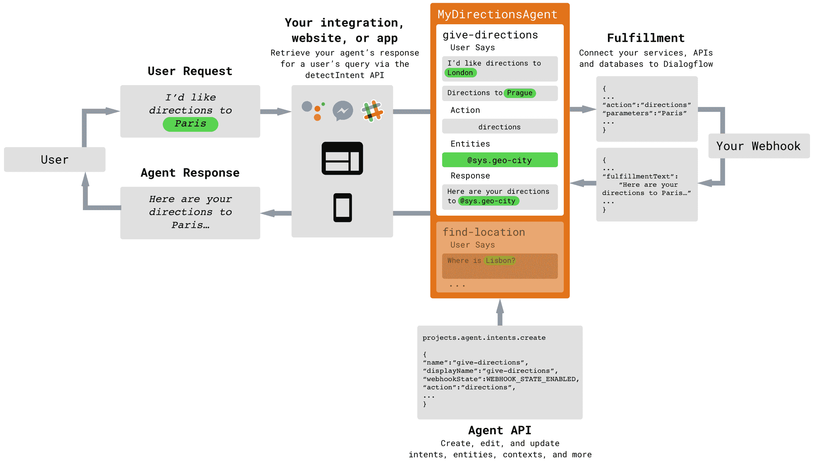

让我们讨论上图中引入的术语：

*   **用户**：用户是使用聊天机器人/应用的人，并且负责发出**用户请求**。 **用户请求**只是由用户发出的口语或句子，必须由聊天机器人进行解释。 需要针对它生成适当的响应。
*   **集成**：集成是一个软件组件，负责将用户请求传递给聊天机器人逻辑，并将**智能体响应**传递给用户。 这种集成可以是您创建的应用或网站，也可以是现有服务（例如 Slack，Facebook Messenger），也可以是调用 Dialogflow 聊天机器人的脚本。
*   **智能体**：我们使用 Dialogflow 工具开发的聊天机器人称为智能体。 聊天机器人生成的响应称为**智能体响应**。
*   **意图**：这表示用户在其用户请求中尝试执行的操作。 用户输入的自然语言必须与意图相匹配，以确定针对任何特定请求要生成的响应类型。
*   **实体**：在用户请求中，用户有时可能会使用处理响应所需的单词或短语。 这些以实体的形式从用户请求中提取，然后按需使用。 例如，如果用户说“我在哪里可以买到芒果？” 聊天机器人应该提取**芒果**一词，以便搜索其可用的数据库或互联网以提出适当的响应。
*   **上下文**：要了解 Dialogflow 中的**上下文**，请考虑以下情形，在这种情况下，您无法与聊天机器人交谈来维护上下文：
    您问您的聊天机器人“谁是主要角色？ 印度大臣？” 并生成适当的响应。 接下来，您问您的聊天机器人“他几岁了？” 您的聊天机器人不知道“他的”是指谁。 因此，上下文是在**聊天会话**或会话的一部分上维护的会话状态，除非上下文被与聊天机器人的会话中的新事物所覆盖。
*   **实现**：实现是处理聊天机器人内业务逻辑的软件组件。 它是一个可以通过 Webhooks 访问的 API，可以接收有关传递给它的实体的输入，并生成响应，然后聊天机器人可以使用该响应来生成最终的智能体响应。

涵盖了 Dialogflow 的基本术语和工作流程之后，我们现在将构建一个基本的 Dialogflow 智能体，该智能体可以提供对用户请求的响应。

# 创建一个 Dialogflow 帐户

要开始使用 Dialogflow，您需要在 Dialogflow 网站上创建一个帐户。 为此，请按照下列步骤操作：

1.  访问[这里](https://dialogflow.com)开始帐户创建过程。

您将需要一个 Google 帐户来创建 Dialogflow 帐户。 如果尚未创建一个，请访问[这里](https://accounts.google.com)。

2.  在 Dialogflow 网站的主页上，单击“免费注册”以创建帐户，或单击“进入控制台”以打开 Dialogflow 控制台：

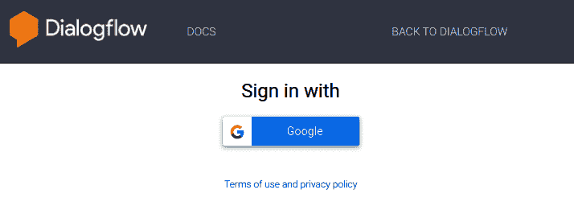

3.  单击“使用 Google 登录”后，系统会要求您使用 Google 帐户登录。 您将被要求获得使用 Dialogflow 的帐户权限，然后接受条款和条件。

现在，我们可以开始创建 Dialogflow 智能体。

# 创建一个 Dialogflow 智能体

正如我们在“Dialogflow 如何工作”部分中讨论的那样，智能体是我们在 Dialogflow 平台中创建的聊天机器人。

成功创建帐户后，将显示 Dialogflow 控制台的登录屏幕，提示您创建智能体：

1.  单击“创建智能体”提示。 您将被带到一个类似于以下内容的屏幕：

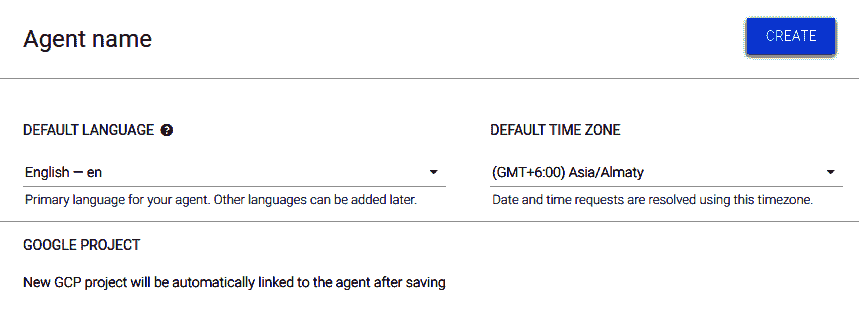

3.  填写智能体的名称。 我们将其命名为`DemoBot`。
4.  将任何现有的 Google Project 链接到聊天机器人。 如果您还没有合格的 Google Project，则单击“创建”按钮时将创建一个新项目。

您需要在 Google Project 上启用结算功能才能创建 Dialogflow 聊天机器人。 要了解如何创建 Google Project，请访问[这里](https://cloud.google.com/billing/docs/how-to/manage-billing-account)。

# 了解 Dialogflow 控制台

Dialogflow 控制台是图形用户界面，用于管理聊天机器人，意图，实体以及 Dialogflow 提供的所有其他功能。

创建智能体后，您应该能够看到以下屏幕：

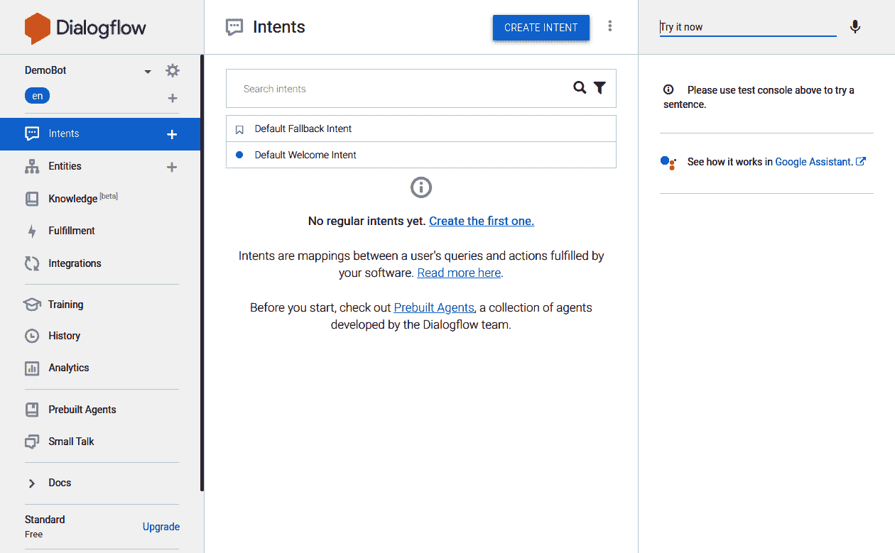

Dialogflow 控制台提示您创建一个新的意图。 让我们创建一个新的意图，该意图可以识别用户名并使用它为用户生成一个幸运数字。

# 创建一个意图并获取实体

现在，我们将创建一个意图，该意图从用户那里获取输入并确定用户名称。 然后，该意图提取名称的值并将其存储在一个实体中，该实体稍后将传递给 Webhook 进行处理。 请按照以下步骤操作：

1.  单击屏幕右上方的“创建意图”按钮。 意向创建表单打开。
2.  我们必须为该意图提供一个名称，例如`luckyNum`。 然后，向下滚动到“训练短语”部分并添加一个训练短语：`name is John`。

3.  抓住所需的实体，然后选择单词`John`。 将出现一个下拉列表，将单词与任何预定义实体匹配。 我们将使用`@sys.person`实体获取名称并将其存储为`userName`参数，如以下屏幕截图所示：

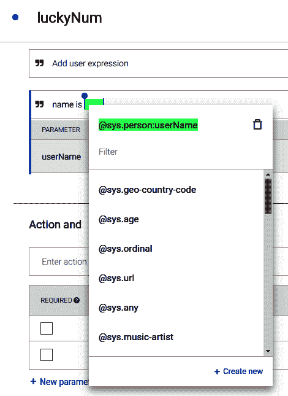

4.  向下滚动到“操作和参数”部分，并添加`userName`参数，如以下屏幕快照所示：

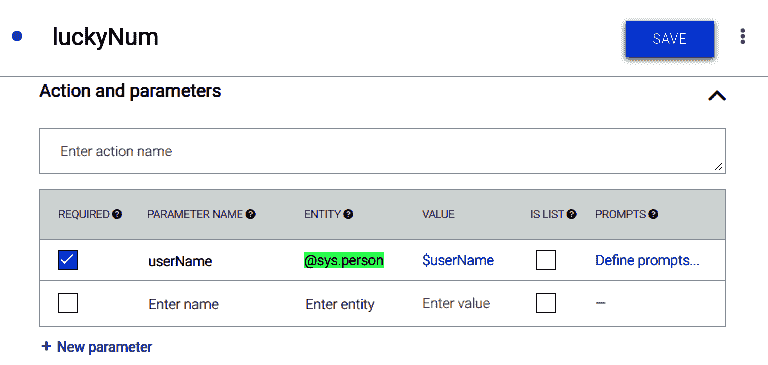

5.  现在，只要用户查询类似于名称的东西，就会将某些东西提取到`$userName`变量中。 现在可以将其传递到 webhook 或 Firebase Cloud Function 以根据其值生成响应。

现在，让我们添加一个操作，以便可以通过 Google Assistant 访问 Dialogflow 智能体。

# 在 Google 上创建您的第一个动作

在 Google 上创建动作之前，让我们尝试了解什么是动作。 您可能听说过 Google 助手，它在本质上可以与 Siri 或 Cortana 媲美。 它围绕虚拟助手的概念构建，虚拟助手是一种软件，能够根据用户的指示以文本或语音形式为用户执行任务。

Google 助手可以执行的每个任务称为**操作**。 因此，当用户发出类似于“向我显示购物清单”或“打给 Sam 的请求”的请求时执行的任务是这样的动作，其中，函数`showShoppingList()`或`makeCall(Sam)`以适当的方式执行附加的参数。

Google 平台上的 Actions 使我们能够创建充当 Google Assistant 上的 Actions 的聊天机器人。 一旦调用，我们就可以进行对话，直到被用户结束为止。

调用操作是在 Google 助手中执行的，该助手将调用请求与其目录中的操作列表进行匹配，并启动适当的操作。 然后，用户接下来要做的几个动作就是与动作。 因此，Google 助手会充当多个此类操作的汇总器，并提供对其进行调用的方法。

# 您为什么是 Google Action？

Google 平台上的操作为有兴趣构建聊天机器人的开发人员提供了哪些商业利益？ 考虑以下屏幕截图：

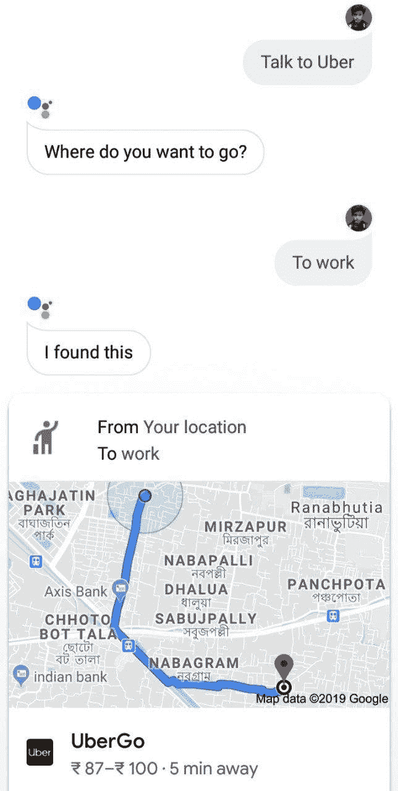

只需与 Google 助理交谈，用户便可以获取 Uber 选项。 这是因为“与 Uber 对话”调用与由 Uber 开发并通过 Google 平台上的“操作”提供的聊天机器人相匹配，该聊天机器人正在响应“与 Uber 对话”用户请求。

因此，Uber 通过提供无文本的界面（如果使用语音输入）来提高其可用性和交互性，并受益于 Google 助手中最先进的 NLP 算法，从而最终增强了其销量。

有效地将您创建的聊天机器人发布到 Google 的 Actions 上，可以为您的企业提供对话界面。 您可以使用 webhooks（我们将在本章稍后介绍）来管理业务逻辑。现在，让我们在 Google 上创建一个 Action 并将其链接到我们的聊天机器人。

# 在 Google 项目上创建操作

在本部分中，我们将在 Google Project 上创建一个 Actions，然后将其与 Google Assistant 应用集成。 这将使我们构建的聊天机器人可以通过 Google 助手应用访问，该助手在全球数十亿设备上都可用。

让我们从在 Google 项目上创建操作开始：

1.  在浏览器中，打开[这里](https://developers.google.com/actions/)，以打开 xGoogle 主页上的“操作”，您可以在其中阅读有关该平台的所有信息，并对其进行介绍。
2.  要进入控制台，请单击**开始构建**或**转到操作控制台**按钮。 您将被带到 Google 控制台上的“操作”，系统将提示您创建一个项目。
3.  在继续进行项目创建时，您将看到一个对话框，如以下屏幕截图所示：

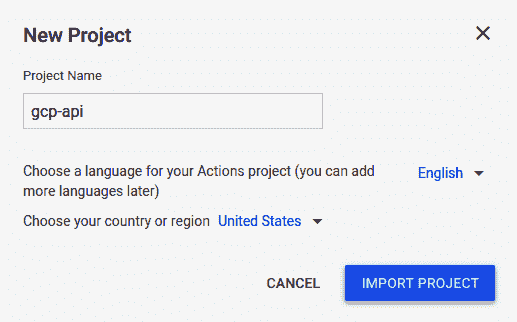

您必须选择在其中创建 Dialogflow chatbot 智能体的同一 Google Project。

4.  单击“导入项目”，将 Dialogflow 聊天机器人的操作添加到 Google 助手。 在加载的下一个屏幕上，选择“对话”模板以创建我们的操作。
5.  然后，您将被带到 Google 控制台上的“操作”，如下所示：

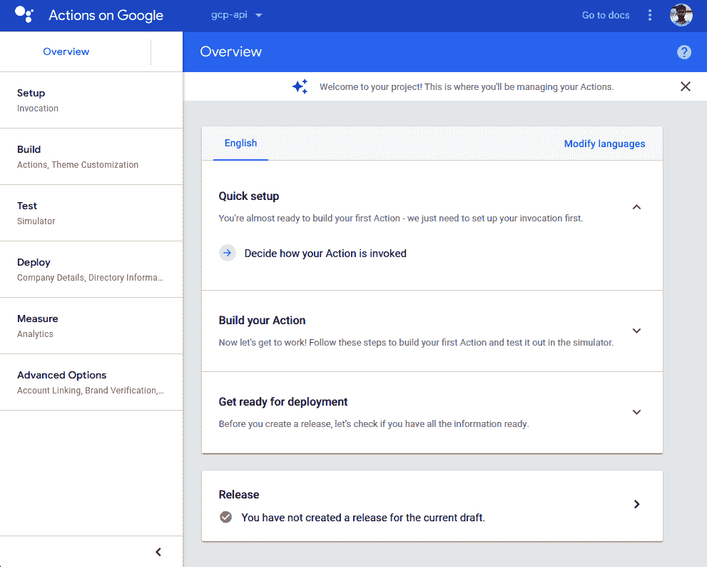

在顶部栏上，您将看到内置 Action 的 Google Project 的项目 ID。在左侧垂直导航栏上，将列出所有不同步骤，您需要执行它们才能完成设置 Action。 在右侧的主要内容部分，提供了一个快速演练来设置您的第一个 Action。

6.  单击“确定”如何调用操作。 您需要为您的操作提供唯一的调用字符串。 对于本章中的示例，我们使用了`Talk to Peter please`调用。 您将需要选择稍微不同的调用。

成功设置调用后，演练将要求您添加一个动作。

7.  单击“添加动作”链接以开始动作创建过程。
8.  在出现的“创建操作”对话框中，在左侧列表中选择“自定义意图”，然后单击“构建”按钮。 这将带您回到 Dialogflow 界面。

现在，您需要在 Google 上启用“操作”才能访问您的聊天机器人的意图。

# 创建与 Google Assistant 的集成

默认情况下，您在 Dialogflow 控制台中构建的聊天机器人不允许 Google Actions 项目访问其中可用的意图。 通过执行以下步骤，我们可以启用对意图的访问：

1.  在 Dialogflow 界面上，单击左侧导航窗格上的`Integrations`按钮。
2.  在加载的页面上，将为您提供 Dialogflow 支持的各种服务的集成选项，其中包括所有主要的社交聊天平台，以及 Amazon 的 Alexa 和 Microsoft 的 Cortana。
3.  在屏幕上，您应该看到 Google 助手的“集成设置”按钮。 单击该按钮。 将打开一个对话框，如以下屏幕截图所示：


前面的屏幕快照中的对话框使您可以快速定义 Dialogflow 智能体与 Google 项目中的操作之间的集成设置。

4.  在“默认调用”下，将“默认欢迎意图”设置为当用户开始通过 Google Assistant 与您的聊天机器人进行交互时将首先运行的意图。
5.  在隐式调用中，指定我们之前创建的`luckyNum`意图。 这将用于为用户生成幸运数字。
6.  启用自动预览更改是个好主意，因为它使您可以将集成设置自动传播到 Google Console 上的“操作”和 Google Assistant 测试模拟器（我们将在稍后讨论），以便在为以下版本创建版本之前测试我们的应用。

现在，让我们为“默认欢迎意图”提供有意义的提示，以要求用户输入其名称，以便在用户做出响应时，其输入类似于`luckyNum`意图的训练短语，从而调用它：

1.  单击“意图”按钮。 然后，单击“默认欢迎意图”。 向下滚动到“意图”编辑页面的“响应”部分，然后删除那里的所有响应。 由于`luckyNum`意图希望用户说类似`My name is XYZ`的内容，因此合适的问题是`What is your name?`。 因此，我们将响应设置为`Hi, what is your name?`。

请注意，“响应”部分的选项卡式导航中有一个名为“Google 助手”的新导航栏。 这样，当我们从 Google Assistant 调用此意图时，我们可以为其指定其他响应。

2.  单击选项卡，然后从默认选项卡中启用用户响应作为第一个响应。 我们这样做是因为我们不想在聊天机器人中指定特定于 Google 助手的其他响应。
3.  向上滚动到“事件”部分，并检查它是否类似于以下屏幕截图：

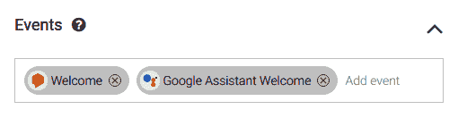

4.  如果缺少前面两个事件中的任何一个，则可以通过简单地键入它们并从出现的自动建议框中选择它们来包括它们。
5.  单击 Dialogflow 控制台中间部分右上方的“保存”。

现在，我们准备创建我们的业务逻辑，以便为用户生成幸运数字。 首先，我们将为`luckyNum`意图创建一个 Webhook，然后将其部署到 Firebase 的 Cloud Functions 中。

# 实现 Webhook

在本节中，我们将为`luckyNum`意图启用 webhook，并为`luckyNum`意图的逻辑准备 webhook 代码。 请按照以下步骤操作：

1.  打开`luckyNum`意图的意图编辑页面，然后向下滚动到“实现”部分。 在这里，启用“为此意图启用 webhook 调用”选项。

现在，此意图将寻找从 webhook 生成的响应。

2.  打开您选择的文本编辑器以创建用于 Webhook 的代码，使其使用 JavaScript 并在 Firebase 提供的 Node.js 平台上运行：

```py
'use strict';
```

上一行确保我们使用 ECMAScript 5 中定义的一组编码标准，这些编码标准对 JavaScript 语言进行了一些有用的修改，从而使其更加安全并且减少了混乱。

3.  使用`require`函数将 JavaScript 中的模块导入到项目中。 包括`actions-on-google`模块和`firebase-functions`模块，因为脚本将部署到 Firebase：

```py
// Import the Dialogflow module from the Actions on Google client library.
const {dialogflow} = require('actions-on-google');

// Import the firebase-functions package for deployment.
const functions = require('firebase-functions');
```

4.  为我们构建的 Dialogflow 智能体实例化一个新的客户端对象：

```py
// Instantiate the Dialogflow client.
const app = dialogflow({debug: true});
```

注意，这里的 Dialogflow 变量是`actions-on-google`模块的对象。

5.  将 Webhook 响应的意图设置为`luckyNum`，然后将其传递给`conv`变量：

```py
app.intent('luckyNum', (conv, {userName}) => {

 let name = userName.name;
 conv.close('Your lucky number is: ' + name.length );

});
```

`app`变量保存正在处理的会话的状态信息以及我们从`luckyNum`意图中提取的`userName`参数。 然后，我们声明变量名称，并将其设置为`userName`变量的名称键。 这样做是因为`userName`变量是一个 JavaScript 对象。 您可以在右侧部分的“测试”控制台中通过为`luckyNum`意图（例如`My name is Max`）键入匹配的调用来查看此内容。

6.  设置 Webhook，使其响应所有 HTTPS POST 请求，并通过 Firebase 将其导出为 Dialogflow 实现：

```py
// Set the DialogflowApp object to handle the HTTPS POST request.
exports.dialogflowFirebaseFulfillment = functions.https.onRequest(app);
```

我们在本节中开发的脚本需要部署到服务器以使其响应。 我们将为 Firebase 使用 Cloud Functions 部署此脚本并将其用作聊天机器人的 webhook 端点。

# 将 Webhook 部署到 Firebase 的 Cloud Functions

既然我们已经完成了 Webhook 的逻辑创建，那么在 Firebase 上使用 Cloud Functions 部署它就非常简单。 请按照以下步骤操作：

1.  单击 Dialogflow 控制台左侧导航上的`Fulfillment`按钮。 使内联编辑器能够添加您的 Webhook 并将其直接部署到 Cloud Functions。

您必须清除内联编辑器中的默认样板代码才能执行此操作。

2.  将上一部分中的编辑器中的代码粘贴到`index.js`选项卡式导航丸中，然后单击`Deploy`。

请记住，用于部署的环境是 Node.js，因此`index.js`是包含所有业务逻辑的文件。 `package.json`文件管理您的项目所需的包。

使用 Cloud Functions 具有部署 Webhook 的简单性和最小化设置的优势。 另一方面，仅设置`index.js`的限制可防止您将 Webhook 逻辑拆分为多个文件，这通常是在大型 chatbot 应用中完成的。 现在，您准备为 Action 创建一个发行版。

# 在 Google 版本上创建动作

最后，我们处于可以在 Google chatbot 上为 Actions 创建发行版的阶段。 但在这样做之前，重要的是在 Google Assistant 测试模拟器中测试聊天机器人：

1.  单击 Google 控制台上“操作”左侧导航窗格中的“模拟器”按钮，以进入模拟器。 在模拟器中，将显示一个类似于在手机上使用 Google Assistant 的界面。 建议的输入将包含您的操作的调用方法。

2.  在模拟器中为您的操作输入调用，在本例中为`Talk to Peter Please`。 这将产生来自默认欢迎意图要求您输入名称的输出。 输入您的姓名作为响应后，类似于`My name is Sammy`，您将看到您的幸运数字，如下所示：

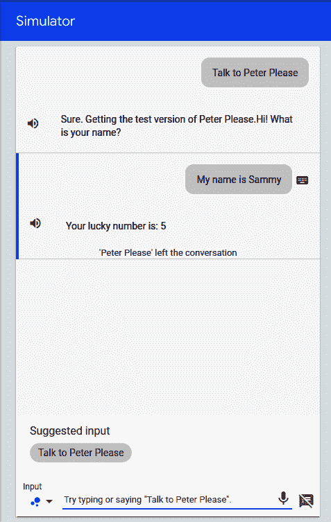

现在我们知道我们的聊天机器人可以正常工作，并且可以与 Google 上的 Action 集成在一起，让我们为其创建一个发行版：

1.  在 Google 控制台上的操作中单击“概述”，您将看到准备部署的提示。
2.  Actions 测试控制台要求您输入一些 Action 所需的信息。 这些通常是简短和长格式的说明，开发人员的详细信息，隐私策略，操作条款和条件以及徽标。 成功填写所有内容后，单击“保存”。
3.  在“部署”类别下的左侧导航栏中单击“发布”，以打开“发布”页面。 在这里，选择`Alpha`发布选项，然后单击`Submit`发布。

部署将需要几个小时才能完成。 部署完成后，您将能够在已登录到内置 Action 的 Google 帐户的任何设备上测试您的操作。成功创建并部署 Dialogflow 智能体后，我们现在将使用以下方法开发 Flutter 应用： 与智能体进行交互的能力。 单屏应用将具有与任何基本的移动聊天应用非常相似的用户界面，带有一个用于输入消息的文本框，这些消息是 Dialogflow 智能体的查询，还有一个将每个查询发送到智能体的发送按钮。 该屏幕还将包含一个列表视图，以显示来自用户的所有查询和来自智能体的响应。 另外，在“发送”按钮旁边将有一个麦克风选项，以便用户可以利用语音到文本功能将查询发送到智能体。

# 为对话应用创建 UI

我们将从使用一些硬编码文本为应用创建基本用户界面开始，以测试 UI 是否正确更新。 然后，我们将集成 Dialogflow 智能体，以便它可以回答查询并告诉用户他们的幸运数字，然后添加一个`mic`选项，以便我们可以利用语音转文本功能。

该应用的整体小部件树如下所示：

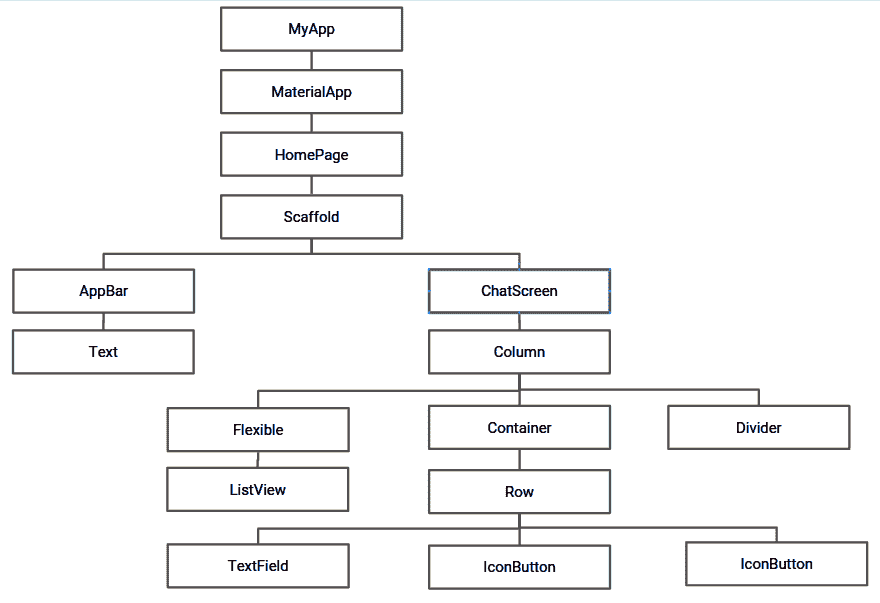

现在，让我们详细讨论每个小部件的实现。

# 创建文本控制器

首先，让我们在名为`chat_screen.dart`的新 dart 文件中创建一个名为`ChatScreen`的 StatefulWidget。 现在，请按照下列步骤操作：

1.  创建一个文本框-用 Flutter 项`TextField`-允许用户输入输入文本。 要创建`TextField`，我们需要定义`createTextField()`：

```py
Widget createTextField() {
     return new Flexible(
         child: new TextField(
             decoration:
             new InputDecoration.collapsed(hintText: "Enter your message"),
             controller: _textController,
             onSubmitted: _handleSubmitted,
         ),
     );
 }
```

当用户指示已完成将文本输入到文本字段中时，`onSubmitted`属性用作文本字段的回调，以处理文本输入。 当按下键盘上的`Enter`按钮时，将触发该属性。

在前面的`TextField`小部件中，当用户输入完文本后便会调用`_handleSubmitted()`。 稍后将详细描述`_handleSubmitted()`。

我们还将`decoration`属性指定为折叠状态，以删除可能出现在文本字段中的默认边框。 我们还将`hintText`属性指定为`Enter your message`。 要收听更改并更新`TextField`，我们还附加了`TextEditingController`的实例。 可以通过执行以下代码来创建实例：

```py
final TextEditingController _textController = new TextEditingController();
```

与 Java 不同，Dart 没有诸如`public`，`private`或`protected`之类的关键字来定义变量的使用范围。 而是在标识符名称之前使用下划线`_`来指定该标识符是类专有的。

2.  接下来，创建一个发送按钮，该按钮可用于向`createSendButton()`函数内部的智能体发送查询：

```py
Widget createSendButton() {
     return new Container(
         margin: const EdgeInsets.symmetric(horizontal: 4.0),
         child: new IconButton(
             icon: new Icon(Icons.send),
             onPressed: () => _handleSubmitted(_textController.text),
         ),
     );
 }
```

在 Flutter 中，可以使用`Icons`类轻松添加类似于发送按钮的图形图标。 为此，我们创建一个新的`Icon`实例并指定`Icons.send`，以便将小部件用作发送按钮。 用作`icon`属性的参数。 我们还设置了`onPressed`属性，该属性在用户点击“发送”按钮时调用。 在这里，我们再次致电`_handleSubmitted`。

`=>`（有时称为箭头）是一种速记符号，用于定义包含一行的方法。 定义为`fun() { return 10; }`的方法可以写为`fun() => return 10;`。

3.  文本字段和发送按钮应该并排显示，因此可以通过将它们作为子代添加到`Row`小部件中来将它们包装在一行中。 包装好的`Row`小部件位于屏幕底部。 我们在`_buildTextComposer()`中创建此小部件：

```py
Widget _buildTextComposer() {
     return new IconTheme(
         data: new IconThemeData(color: Colors.blue),
         child: new Container(
             margin: const EdgeInsets.symmetric(horizontal: 8.0),
             child: new Row(
                 children: <Widget>[
                     createTextField(),
                     createSendButton(),
                 ],
             ),
         ),
     );
 }
```

`_buildTextComposer()`函数返回一个以`Container`作为其子元素的`IconTheme`小部件。 容器包含由文本字段和我们在“步骤 1”和`2`中创建的发送按钮组成的`Row`小部件。

在下一节中，我们将构建`ChatMessage`小部件，该小部件用于显示用户与聊天机器人的交互。

# 创建`ChatMessage`

来自用户的查询和来自智能体的响应可以被视为单个组件的两个不同部分。 我们将为它们创建两个不同的容器，然后将它们添加到名为`ChatMessage`的单个单元中。 这样可以确保每个查询及其答案的显示顺序与用户输入的顺序相同。 我们将在一个名为`chat_message.dart`的新 dart 文件中创建一个名为`ChatMessage`的有状态小部件。 下图显示了`ChatMesage`的查询和响应划分：

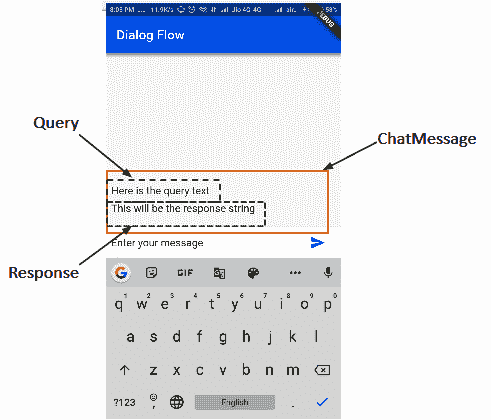

要创建屏幕的 UI，请按照下列步骤操作：

1.  创建一个包含一些文本的容器，该容器将在屏幕上显示用户输入的查询：

```py
new Container(
    margin: const EdgeInsets.only(top: 8.0),
    child: new Text("Here is the query text",
        style: TextStyle(
            fontSize: 16.0,
            color: Colors.black45,
        ),
    ),
)
```

我们从为容器提供`8.0`的上边距开始，该边距包含一个当用户输入查询时将显示的字符串。 当调用`_handleSubmitted()`时，我们会将这个硬编码的字符串修改为字符串参数。 我们还将`fontSize`属性的边距修改为`16.0`，并将颜色设置为`black45`（深灰色），以帮助用户区分查询和响应。

2.  创建一个容器以显示响应字符串：

```py
new Container(
    margin: const EdgeInsets.only(top: 8.0),
    child: new Text("This will be the response string",
        style: TextStyle(
            fontSize: 16.0
        ),
    ),
)
```

顶部边距属性为`8.0`的容器包含一个硬编码的响应字符串。 稍后将对其进行修改，使其可以适应用户的响应。

3.  将两个容器包装在单个`Column`中，然后将其作为有状态窗口小部件（即`ChatMessage`）中覆盖的`build()`方法的容器返回：

```py
@override
Widget build(BuildContext context) {
    return new Container(
        margin: const EdgeInsets.symmetric(vertical: 10.0),
        child: new Column(
            crossAxisAlignment: CrossAxisAlignment.start,
            children: <Widget>[
                new Container(
                   margin: const EdgeInsets.only(top: 8.0),
                    child: new Text("Here is the query text",
                        style: TextStyle(
                            fontSize: 16.0,
                            color: Colors.black45,
 ),
 ),
 ),
 new Container(
 margin: const EdgeInsets.only(top: 8.0),
 child: new Text("this will be the response text",
                    style: TextStyle(
                            fontSize: 16.0
                    ),
                ),
            )
        ]
    )
);
```

在 Flutter 中，文本包装在`Container`中。 通常，当它们太长而无法水平放置在屏幕中时，它们往往会从屏幕上溢出。 这可以看成是屏幕角落的红色标记。 为避免文本溢出，请确保将`Container`和`Text`包裹在`Flexible`内，以便文本可以垂直占据可用空间并自行调整。

4.  为了存储和显示所有字符串（查询和响应），我们将使用`ChatMessage`类型的`List`：

```py
final List<ChatMessage> _messages = <ChatMessage>[];
```

此列表应出现在我们先前创建的`TextField`上方，以接受用户输入。

5.  为了确保字段以垂直顺序正确显示，我们需要将它们包装在列中，然后从`ChatScreen.dart`的`Widget build()`方法返回它们。 该列的三个子级是一个灵活的列表视图，一个分隔符和一个带有文本字段的容器。 通过重写`build()`方法来创建 UI，如下所示：

```py
@override
Widget build(BuildContext context) {
    return new Column(
        children: <Widget>[
            new Flexible(
                child: new ListView.builder(
                    padding: new EdgeInsets.all(8.0),
                    reverse: true,
                    itemBuilder: (_, int index) => _messages[index],
                    itemCount: _messages.length,
                ),
            ),
            new Divider(
                height: 1.0,
            ),
            new Container(
                decoration: new BoxDecoration(
                    color: Theme.of(context).cardColor,
                ),
                child: _buildTextComposer(),
            ),
        ],
    );
}
```

以`ChatMessages`作为其子元素的`ListView`被制作为`Flexible`，以便在放置分隔符和文本字段的容器之后，可以在垂直方向上占据屏幕上可用的整个空间。 在所有四个基本方向上都给`8.0`填充。 另外，将`reverse`属性设置为`true`可以使其在底部到顶部的方向上滚动。 `itemBuilder`属性被分配索引的当前值，以便它可以构建子项。 另外，为`itemCount`分配了一个值，该值可帮助列表视图正确估计最大可滚动内容。 列的第二个子级创建分隔符。 这是一条`devicePixel`粗水平线，标记了列表视图和文本字段的分隔。 在该列的最底部位置，我们将带有文本字段的容器作为其子容器。 这是通过对我们先前定义的`_buildTextComposer()`进行方法调用而构建的。

6.  在`ChatScreen.dart`方法内定义`_handleSubmit()`，以正确响应用户的“发送消息”操作：

```py
void _handleSubmitted(String query) {
    _textController.clear();
    ChatMessage message = new ChatMessage(
        query: query, response: "This is the response string",
    );
    setState(() {
        _messages.insert(0, message);
    });
}
```

方法的字符串参数包含用户输入的查询字符串的值。 该查询字符串以及一个硬编码的响应字符串用于创建`ChatMessage`的实例，并插入到`_messages`列表中。

7.  在`ChatMessage`中定义一个构造器，以便正确传递和初始化参数值，查询和响应：

```py
final String query, response;
ChatMessage({this.query, this.response});
```

8.  分别在`ChatMessages.dart`中修改用于查询和响应的容器内`Text`属性的值，以使屏幕上显示的文本与用户和用户输入的文本相同。 从动作助手获得的回复：

```py
//Modifying the query text
child: new Text(query,
    style:.......
)

//Modify the response text
child: new Text(response,
    style:.......
)
```

成功编译到目前为止我们编写的代码后，屏幕应如下所示：

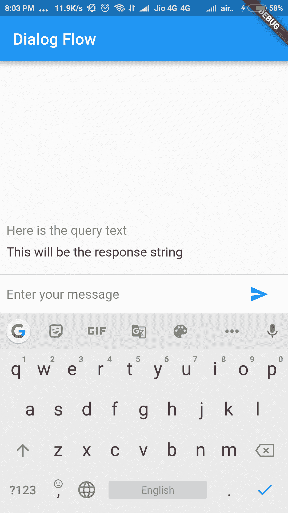

在前面的屏幕截图中，您可以看到将由用户编写的虚拟查询文本以及来自聊天机器人的响应字符串。

整个`chat_message.dart`文件可以在 [GitHub](https://github.com/PacktPublishing/Mobile-Deep-Learning-Projects/blob/master/Chapter3/ActionsOnGoogleWithFlutter-master/lib/chat_message.dart) 上查看。

在下一节中，我们将集成 Dialogflow 智能体，以便我们对用户查询具有实时响应。

# 集成 Dialogflow 智能体

现在，我们已经为应用创建了一个非常基本的用户界面，我们将把 Dialogflow 智能体与应用集成在一起，以便该智能体实时响应用户输入的文本。 按着这些次序：

1.  为了将 Dialogflow 集成到应用中，我们将使用名为`flutter_dialogflow`的 Flutter 插件。

要浏览此插件，请转到[这里](https://pub.dartlang.org/packages/flutter_dialogflow)。

将依赖项添加到`pubspec.yaml`文件中的插件：

```py
dependencies:
    flutter_dialogflow: ^0.1.0
```

2.  接下来，我们需要安装依赖项。 可以使用`$ flutter pub get`命令行参数，也可以通过单击屏幕上显示的选项来完成。 在这里，我们将使用`dialogflow_v2`，因此让我们将包导入`chat_screen.dart`文件中：

```py
import 'package:flutter_dialogflow/dialogflow_v2.dart';
```

3.  添加`.json`文件，其中包含您在项目的控制台上创建 Dialogflow 智能体时下载的 GCP 凭据。 为此，创建一个`assets`文件夹并将文件放在其中：


4.  将文件的路径添加到`pubspec.yaml`文件的`assets`部分：

```py
flutter:
    uses-material-design: true
    assets:
 - assets/your_file_downloaded_google_cloud.json
```

5.  修改`_handleSubmitted()`，以便它可以与智能体进行通信并获得对用户输入的查询的响应：

```py
Future _handleSubmitted(String query) async {
    _textController.clear();

    //Communicating with DailogFlow agent
    AuthGoogle authGoogle = await AuthGoogle(fileJson: "assets/gcp-api.json").build();
    Dialogflow dialogflow = Dialogflow(authGoogle: authGoogle,language: Language.english);
    AIResponse response = await dialogflow.detectIntent(query);
    String rsp = response.getMessage();
    ChatMessage message = new ChatMessage(
        query: query, response: rsp
     );
    setState(() {
        _messages.insert(0, message);
    });
}
```

首先，我们通过指定`assets`文件夹的路径来创建一个名为`authGoogle`的`AuthGoogle`实例。 接下来，我们创建`Dialogflow`智能体的实例，该实例指定 Google 认证实例以及用于与其通信的语言。 在这里，我们选择了英语。 然后使用`response.getMessage()`提取响应，并将其存储在`rsp`字符串变量中，然后在创建`ChatMessage`实例时传递该变量，以确保两个字符串（输入文本和响应）均在屏幕上正确更新。 

以下屏幕快照显示了在进行上述修改以反映用户的实际查询和 Dialogflow 智能体的响应之后的应用：

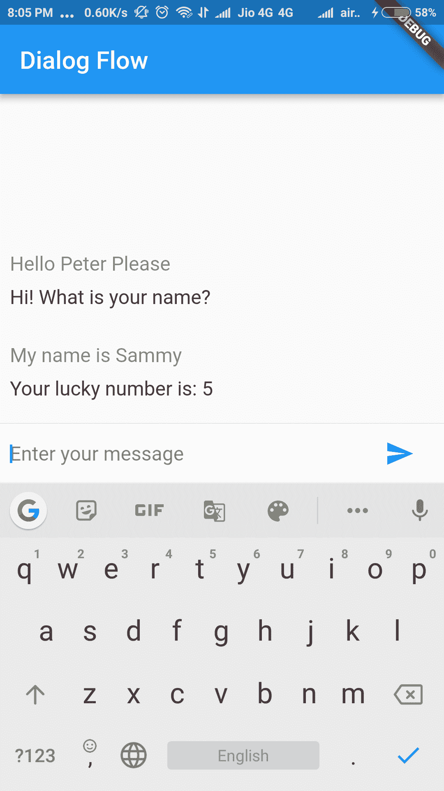

在下一部分中，我们将向应用添加音频交互功能。

# 添加与助手的音频交互

现在，我们将语音识别添加到应用中，以便它可以监听用户的查询并采取相应的措施。

# 添加插件

我们将在此处使用`speech_recognition`插件。 让我们添加依赖项，如下所示：

1.  将依赖项添加到`pubspec.yaml`文件，如下所示：

```py
dependencies:
    speech_recognition: "^0.3.0"
```

2.  通过运行以下命令行参数来获取包：

```py
 flutter packages get
```

3.  现在，由于我们正在使用设备的麦克风，因此我们需要征得用户的许可。 为此，我们需要添加以下代码行：

在 iOS 上，权限是在`infos.plist`中指定的：

```py
<key>NSMicrophoneUsageDescription</key>
<string>This application needs to access your microphone</string>
<key>NSSpeechRecognitionUsageDescription</key>
<string>This application needs the speech recognition permission</string>
```

在 Android 上，权限在`AndroidManifest.xml`文件中指定：

```py
<uses-permission android:name="android.permission.RECORD_AUDIO" />
```

4.  现在，我们准备将包导入到`chat_screen.dart`文件中，以便可以使用它：

```py
import 'package:speech_recognition/speech_recognition.dart';
```

在下一节中，我们将添加将利用`speech_recognition`插件来帮助进行音频交互的方法。

# 添加语音识别

添加`speech_recognition`插件并导入包后，我们都准备在我们的应用中使用它。 让我们从添加将在应用内部处理语音识别的方法开始，如下所示：

1.  添加并初始化所需的变量：

```py
SpeechRecognition _speechRecognition;
bool _isAvailable = false;
bool _isListening = false;
String transcription = '';
```

`_speechRecognition`是`SpeechRecognition`的实例。 `_isAvailable`很重要，因为它可以让平台（Android/iOS）知道我们正在与之交互，并且`_isListening`将用于检查应用当前是否正在监听麦克风。

最初，我们将两个`boolean`变量的值都设置为`false`。 `transcription`是一个字符串变量，将用于存储已监听的字符串。

2.  定义`activateSpeechRecognizer()`方法以设置音频操作：

```py
void activateSpeechRecognizer() {
    _speechRecognition = SpeechRecognition();

    _speechRecognition.setAvailabilityHandler((bool result)
        => setState(() => _isAvailable = result));

    _speechRecognition.setRecognitionStartedHandler(()
        => setState(() => _isListening = true));

    _speechRecognition.setRecognitionResultHandler((String text)
        => setState(() => transcription = text));

    _speechRecognition.setRecognitionCompleteHandler(()
        => setState(() => _isListening = false));
}
```

在前面的代码片段中，我们在`_speechRecognition`内部初始化了`SpeechRecognition`的实例。 然后，我们通过调用`_speechRecognition.setAvailabilityHandler()`回调函数来设置`AvailabilityHandler`，该回调函数需要传回可以分配给`_isAvailable`的`boolean`结果。 接下来，我们设置`RecognitionStartedHandler`，它在启动语音识别服务时执行，并将`_isListening`设置为`true`表示移动设备的麦克风当前处于活动状态并且正在监听。 然后，我们使用`setRecognitionResultHandler`设置`RecognitionResultHandler`，这将给我们返回生成的文本。 这存储在字符串转录中。 最后，我们设置`RecognitionCompleteHandler`，当麦克风停止收听时，将`_isListening`设置为`false`。

3.  公开内部的`initState()`函数调用`activateSpeechRecognizer()`来设置`_speechRecognition`实例，如下所示：

```py
@override
void initState(){
    super.initState();
    activateSpeechRecognizer();
}
```

此时，该应用能够识别音频并将其转换为文本。 现在，我们将增强 UI，以便用户可以提供音频作为输入。

# 添加麦克风按钮

现在，我们已经激活了语音识别器，我们将在发送按钮旁边添加一个麦克风图标，以允许用户利用该选项进行语音识别。 请按照以下步骤操作：

1.  首先，我们定义`createMicButton()`函数，该函数作为第三个子项添加到`_buildTextComposer()`内部的`Row`小部件中：

```py
Widget createMicButton() {
     return new Container(
     margin: const EdgeInsets.symmetric(horizontal: 4.0),
         child: new IconButton(
         icon: new Icon(Icons.mic),
         onPressed: () {
             if (_isAvailable && !_isListening) {
                 _speechRecognition.recognitionStartedHandler();
                 _speechRecognition .listen(locale: "en_US")
                 .then((transcription) => print('$transcription'));
             } else if (_isListening) {
                 _isListening = false;
                 transcription = '';
                 _handleSubmitted(transcription);
                 _speechRecognition
                 .stop()
                 .then((result) => setState(() => _isListening = result));
                 }
             }
         ),
     );
 }
```

在前面的代码片段中，我们返回带有子项`IconButton`的`Container`，其子项为`Icons.mic`。 我们为使用`onPressed()`的按钮提供了双重功能，以便它可以开始收听用户的声音，并且再次按下该按钮时，可以通过传递记录的字符串以与智能体进行交互来停止记录并调用`_handleSubmitted()`方法。

首先，我们使用`_isAvailable`和`_isListening`变量检查麦克风是否可用并且尚未在收听用户的声音。 如果`if`语句中的条件为`true`，则将`_isListening`的值设置为`true`。 然后，我们通过调用`_speechRecognition`上的`.listen()`方法开始监听。 `locale`参数指定语言，此处为`en_US`。 相应的字符串存储在`transcription`变量中。

当第二次按下麦克风停止录制时，由于`_isListening`的值设置为`true`，因此`if`条件将不满足。 现在，执行`else`块。 在这里，通过传递记录的字符串以使其可以与智能体进行交互来调用`_handleSubmitted()`，然后使用结果将`_isListening`的值设置为`true`：

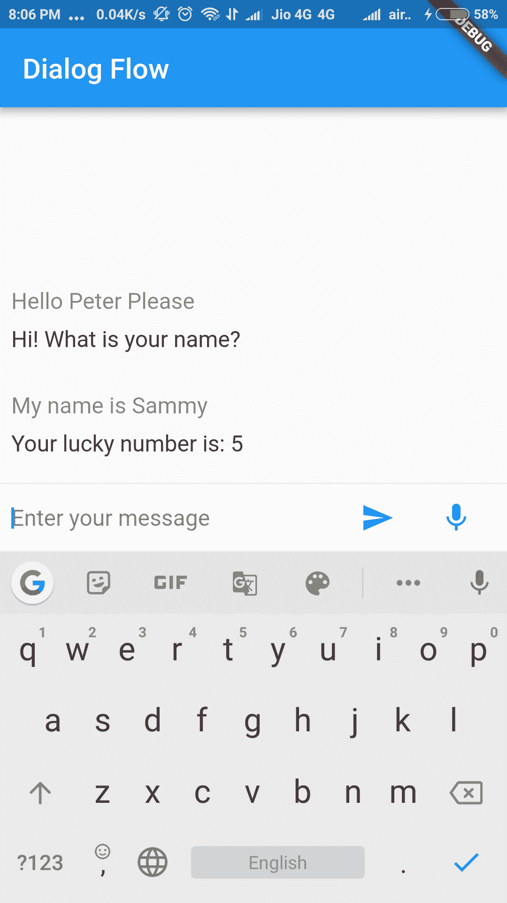

成功编译所有代码并将`ChatScreen`包裹在`main.dart`文件中的`MaterialApp`实例中之后，该应用的外观将与前面的屏幕快照类似。

可以在[这个页面](https://github.com/PacktPublishing/Mobile-Deep-Learning-Projects/blob/master/Chapter3/ActionsOnGoogleWithFlutter-master/lib/chat_screen.dart)和[这个页面](https://github.com/PacktPublishing/Mobile-Deep-Learning-Projects/tree/master/Chapter3/ActionsOnGoogleWithFlutter-master)上查看`chat_screen.dart`文件。

# 总结

在本章中，我们研究了一些可用于创建聊天机器人的最常用工具，然后对 Dialogflow 进行了深入讨论，以了解所使用的基本术语。 我们了解了 Dialogflow 控制台的工作方式，以便我们可以创建自己的 Dialogflow 智能体。 为此，我们创建了一个意图，该意图可以提取用户的姓名并将其添加为与 Google Assistant 的集成，从而可以用幸运数字进行响应。

在将 Webhook 部署为 Firebase 的 Cloud Functions 并在 Google 版本上创建 Actions 之后，我们创建了一个对话式 Flutter 应用。 我们学习了如何创建对话应用界面，并集成了 Dialogflow 智能体以根据聊天机器人的响应促进深度学习模型。 最后，我们使用 Flutter 插件向应用添加语音识别，该应用再次使用基于深度学习的模型将语音转换为文本。

在下一章中，我们将研究定义和部署自己的自定义深度学习模型并将其集成到移动应用中。