# 五、从摄像机源生成实时字幕

作为人类，我们每天在不同的场景中看到一百万个物体。 对于人类来说，描述场景通常是一件微不足道的任务：我们所做的事情甚至都不需要花费大量的时间去思考。 但是，机器要理解图像或视频等视觉媒体中呈现给它的元素和场景是一项艰巨的任务。 但是，对于**人工智能**（**AI**）的几种应用，具有在计算机系统中理解此类图像的功能很有用。 例如，如果我们能够设计出可以将周围环境实时转换为音频的机器，则对视障人士将大有帮助。 此外，研究人员一直在努力实时生成图像和视频的字幕，以提高网站和应用上呈现的内容的可访问性。

本章介绍了一种使用摄像机供稿实时生成自然语言字幕的方法。 在此项目中，您将创建一个使用存储在设备上的自定义预训练模型的相机应用。 该模型使用深层**卷积神经网络**（**CNN**）和**长短期记忆**（**LSTM**）生成字幕。

我们将在本章介绍以下主题：

*   设计项目架构
*   了解图像字幕生成器
*   了解相机插件
*   创建相机应用
*   从相机源生成图像字幕
*   创建材质应用

让我们从讨论此项目将要遵循的架构开始。

# 设计项目架构

在这个项目中，我们将构建一个移动应用，当指向任何风景时，它将能够创建描述该风景的标题。 这样的应用对于有视觉缺陷的人非常有用，因为它既可以用作网络上的辅助技术，又可以与 Alexa 或 Google Home 等语音界面搭配使用，用作日常应用。 该应用将调用一个托管 API，该 API 将为传递给它的任何给定图像生成标题。 API 返回该图像的三个最佳字幕，然后该应用将其显示在应用中相机视图的正下方。

从鸟瞰图可以通过下图说明项目架构：

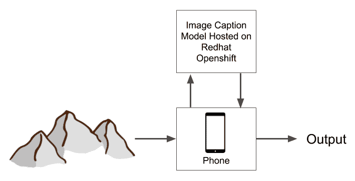

输入将是在智能手机中获得的相机提要，然后将其发送到托管为网络 API 的图像标题生成模型。 该模型在 Red Hat OpenShift 上作为 Docker 容器托管。 图像标题生成模型返回图像的标题，然后将其显示给用户。

有了关于如何构建应用的清晰思路，让我们首先讨论图像字幕的问题以及如何解决它们。

# 了解图像字幕生成器

计算机科学的一个非常流行的领域是图像处理领域。 它涉及图像的操纵以及我们可以从中提取信息的各种方法。 另一个流行的领域是**自然语言处理**（**NLP**），涉及如何制造可以理解和产生有意义的自然语言的机器。 图像标题定义了两个主题的混合，试图首先提取出现在任何图像中的对象的信息，然后生成描述对象的标题。

标题应以有意义的字串形式生成，并以自然语言句子的形式表示。

考虑下图：


图像中可以检测到的物体如下：勺子，玻璃杯，咖啡和桌子。

但是，我们对以下问题有答案吗？

1.  杯子里装着咖啡还是汤匙，还是空的？
2.  桌子在玻璃上方还是下方？
3.  汤匙在桌子上方还是下方？

我们意识到，为了回答上述问题，我们需要使用如下语句：

1.  杯子里装着咖啡。
2.  玻璃放在桌子上。
3.  汤匙放在桌子上。

因此，如果我们试图在图像周围创建标题，而不是简单地识别图像中的项目，我们还需要在可见项目之间建立一些位置和特征关系。 这将帮助我们获得良好的图像标题，例如**一杯咖啡在桌子上，旁边放着勺子**。 在图像标题生成算法中，我们尝试从图像创建此类标题。

但是，一个字幕可能并不总是足以描述风景，我们可能必须在两个可能相同的字幕之间进行选择，如以下屏幕截图所示：

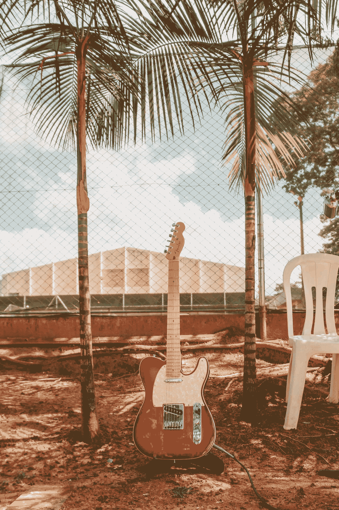

Allef Vinicius 在 Unsplash 上​​的照片

您如何在前面的屏幕快照中描述图像？

您可以提出以下任何标题：

1.  背景中有两棵树和多云的天空。
2.  一把椅子和一把吉他放在地上。

根据用户，这提出了在任何图像中重要的问题。 尽管最近有一些设计用于处理这种情况的方法，例如“注意机制”方法，但在本章中我们将不对其进行深入讨论。

您可以在 CaptionBot 的[这个页面](https://www.captionbot.ai/)上查看由 Microsoft 创建的图像字幕系统的非常酷的演示。

现在让我们定义将用于创建图像字幕模型的数据集。

# 了解数据集

不出所料，我们需要大量的通用图像以及可能列出的标题。 我们已经在上一节“了解图像字幕生成器”中显示，单个图像可以具有多个字幕，而不必任何一个都错了。 因此，在这个项目中，我们将研究 Flickr8k 数据集。 除此之外，我们还需要由 Jeffrey Pennington，Richard Socher 和 Christopher D. Manning 创建的 GloVE 嵌入。 简而言之，GloVE 告诉我们在给定单词之后可能跟随哪些单词，从而帮助我们从一组不连续的单词中形成有意义的句子。

您可以在[这个页面](https://nlp.stanford.edu/projects/glove/)上阅读有关 GloVE 嵌入的更多信息，以及描述它们的论文。

Flickr8k 数据集包含 8,000 个图像样本，以及每个图像的五个可能的标题。 还有其他可用于该任务的数据集，例如具有 30,000 个样本的 Flickr30k 数据集，或具有 180,000 张图像的 Microsoft COCO 数据集。 虽然使用较大的数据库会产生更好的结果，但是为了能够在普通机器上训练模型，我们将不再使用它们。 但是，如果可以使用高级计算能力，则可以肯定地尝试围绕较大的数据集构建模型。

[您可以通过伊利诺伊大学厄本那香槟分校提供的以下格式的请求来下载 Flickr8k 数据集](https://forms.illinois.edu/sec/1713398)。

下载数据集时，您将能够看到以下文件夹结构：

```py
Flickr8k/
    - dataset
        - images
            - 8091 images
    - text
        - Flickr8k.token.txt
        - Flickr8k.lemma.txt
        - Flickr_8k.trainImages.txt 
        - Flickr_8k.devImages.txt
        - Flickr_8k.testImages.txt 
        - ExpertAnnotations.txt
        - CrowdFlowerAnnotations.txt 

```

在可用的文本文件中，我们感兴趣的是`Flickr8k.token.txt`，其中包含`dataset`目录下`images`文件夹中每个图像的原始标题。

字幕以以下格式显示：

```py
1007129816_e794419615.jpg#0 A man in an orange hat staring at something .
1007129816_e794419615.jpg#1 A man wears an orange hat and glasses .
1007129816_e794419615.jpg#2 A man with gauges and glasses is wearing a Blitz hat .
1007129816_e794419615.jpg#3 A man with glasses is wearing a beer can crocheted hat .
1007129816_e794419615.jpg#4 The man with pierced ears is wearing glasses and an orange hat .
```

通过检查，我们可以观察到前面示例中的每一行都包含以下部分：

```py
Image_Filename#Caption_Number Caption
```

因此，通过浏览`dataset/images`文件夹中存在的图像的文件中的每一行，我们可以将标题映射到每个图像。

现在开始处理图像标题生成器代码。

# 建立图像字幕生成模型

在本节中，我们将看一看代码，这些代码将帮助我们创建一个管道，以将抛出该图像的图像转换为字幕。 我们将本节分为四个部分，如下所示：

1.  初始化字幕数据集
2.  准备字幕数据集
3.  训练
4.  测试

让我们从项目初始化开始。

# 初始化字幕数据集

在本节介绍的步骤中，我们将导入项目所需的模块并将数据集加载到内存中。 让我们从导入所需的模块开始，如下所示：

1.  导入所需的库，如下所示：

```py
import numpy as np
import pandas as pd

import nltk
from nltk.corpus import stopwords

import re
import string
import pickle

import matplotlib.pyplot as plt

%matplotlib inline
```

您会看到在这个项目中将使用许多模块和子模块。 在模型的运行中，它们都非常重要，从本质上讲，帮助器模块也是如此。 下一步，我们将导入更多特定于构建模型的模块。

2.  导入 Keras 和子模块，如下所示：

```py
import keras
from keras.layers.merge import add
from keras.preprocessing import image
from keras.utils import to_categorical
from keras.models import Model, load_model
from keras.applications.vgg16 import VGG16
from keras.preprocessing.sequence import pad_sequences
from keras.layers import Input, Dense, Dropout, Embedding, LSTM
from keras.applications.resnet50 import ResNet50, preprocess_input, decode_predictions
```

我们导入了 Keras 模块以及其他几个子模块和方法，以帮助我们快速构建深度学习模型。 Keras 是可用的最受欢迎的深度学习库之一，除 TensorFlow 外，还可以与 Theano 和 PyTorch 等其他框架一起使用。

3.  加载字幕-在这一步中，我们将`Flickr8k.token.txt`文件中存在的所有字幕加载到单个`captions`列表中，如下所示：

```py
caption_file = "./data/Flickr8k/text/Flickr8k.token.txt"

captions = []

with open(caption_file) as f:
    captions = f.readlines()

captions = [x.strip() for x in captions]
```

从文件加载所有标题后，让我们看看它们包含的内容，如下所示：

```py
captions[:5]
```

正如预期的那样，并在前面的“了解数据集”部分中提到，我们获得了数据集中的以下前五行：

```py
['1000268201_693b08cb0e.jpg#0\tA child in a pink dress is climbing up a set of stairs in an entry way .',
 '1000268201_693b08cb0e.jpg#1\tA girl going into a wooden building .',
 '1000268201_693b08cb0e.jpg#2\tA little girl climbing into a wooden playhouse .',
 '1000268201_693b08cb0e.jpg#3\tA little girl climbing the stairs to her playhouse .',
 '1000268201_693b08cb0e.jpg#4\tA little girl in a pink dress going into a wooden cabin .']
```

既然我们已经看到了写入每一行的模式，那么我们就可以继续分割每一行，以便可以将数据放入数据结构中，这比一大串字符串有助于更快地访问和更新。

# 准备字幕数据集

在以下步骤中，我们将处理加载的字幕数据集，并将其转换为适合对其进行训练的形式：

1.  在此步骤中，我们将图像描述拆分并以字典格式存储，以方便将来的代码中使用，如以下代码块所示：

```py
descriptions = {}

for x in captions:
    imgid, cap = x.split('\t')
    imgid = imgid.split('.')[0]

    if imgid not in descriptions.keys():
        descriptions[imgid] = []

    descriptions[imgid].append(cap)
```

在前面的代码行中，我们将文件中的每一行细分为图像 ID 和每个图像标题的部分。 我们用它创建了一个字典，其中图像 ID 是字典键，每个键值对都包含五个标题的列表。

2.  接下来，我们开始进行基本的字符串预处理，以便继续在字幕上应用自然语言技术，如下所示：

```py
for key, caps in descriptions.items():
    for i in range(len(caps)):
        caps[i] = caps[i].lower()
        caps[i] = re.sub("[^a-z]+", " ", caps[i])
```

3.  另外，为了帮助我们将来分配合适的内存空间大小并准备词汇表，让我们创建标题文本中所有单词的列表，如下所示：

```py
allwords = []

for key in descriptions.keys():
    _ = [allwords.append(i) for cap in descriptions[key] for i in cap.split()]
```

4.  一旦创建了所有单词的列表，就可以创建单词的频率计数。 为此，我们使用`collections`模块的`Counter`方法。 一些单词在数据集中很少出现。 删除这些单词是一个好主意，因为它们不太可能频繁出现在用户提供的输入中，因此不会为字幕生成算法增加太多价值。 我们使用以下代码进行操作：

```py
from collections import Counter

freq = dict(Counter(allwords))
freq = sorted(freq.items(), reverse=True, key=lambda x:x[1])

threshold = 15
freq = [x for x in freq if x[1]>threshold]

print(len(freq))

allwords = [x[0] for x in freq]
```

让我们通过运行以下代码来尝试查看最常用的单词：

```py
freq[:10]
```

我们看到以下输出：

```py
[('a', 62995),
 ('in', 18987),
 ('the', 18420),
 ('on', 10746),
 ('is', 9345),
 ('and', 8863),
 ('dog', 8138),
 ('with', 7765),
 ('man', 7275),
 ('of', 6723)]
```

我们可以得出结论，停用词在字幕文本中占很大比例。 但是，由于我们在生成句子时需要它们，因此我们不会将其删除。

# 训练

在以下步骤中，我们加载训练并测试图像数据集并对其进行训练：

1.  现在，将分离的训练和测试文件加载到数据集中。 它们包含图像文件名列表，它们实际上是带有文件扩展名的图像 ID，如以下代码块所示：

```py
train_file = "./data/Flickr8k/text/Flickr_8k.trainImages.txt"
test_file = "./data/Flickr8k/text/Flickr_8k.testImages.txt"
```

现在，我们将处理训练图像列表文件以提取图像 ID，并省略文件扩展名，因为在所有情况下它都相同，如以下代码片段所示：

```py
with open(train_file) as f:
    cap_train = f.readlines()

cap_train = [x.strip() for x in cap_train]
```

我们对测试图像列表进行相同的操作，如下所示：

```py
with open(test_file) as f:
    cap_test = f.readlines()

cap_test = [x.strip() for x in cap_test]

train = [row.split(".")[0] for row in cap_train]
test = [row.split(".")[0] for row in cap_test]
```

2.  现在，我们将创建一个字符串，其中合并每个图像的所有五个可能的标题，并将它们存储在`train_desc`中。 字典。 我们使用`#START#`和`#STOP#`区分字幕，以便将来在字幕生成中使用它们，如以下代码块所示：

```py
train_desc = {}
max_caption_len = -1

for imgid in train:
    train_desc[imgid] = []
    for caption in descriptions[imgid]:
        train_desc[imgid].append("#START# " + caption + " #STOP#")
        max_caption_len = max(max_caption_len, len(caption.split())+1)
```

3.  我们将使用 Keras 模型资源库中的`ResNet50`预训练模型。 我们将输入形状设置为`224 x 224 x 3`，其中`224 x 244`是将传递给模型的每个图像的尺寸，而 3 是颜色通道的数量。 请注意，与**美国国家混合标准技术研究院**（**MNIST**）数据集不同，在该数据集中每个图像的尺寸均相等，而 Flickr8k 数据集则并非如此。 该代码可以在以下代码段中看到：

```py
model = ResNet50(weights="imagenet", input_shape=(224,224,3))
model.summary()
```

从高速缓存中下载或加载模型后，将为每个层显示模型摘要。 但是，我们需要根据需要重新训练模型，因此我们将删除并重新创建模型的最后两层。 为此，我们使用与加载的模型相同的输入来创建一个新模型，并且输出等效于倒数第二层的输出，如以下代码片段所示：

```py
model_new = Model(model.input, model.layers[-2].output)
```

4.  我们将需要一个函数来重复预处理图像，预测图像中包含的特征，并根据图像中识别出的对象或属性形成特征向量。 因此，我们创建一个`encode_image`函数，该函数接受图像作为输入参数，并通过`ResNet50`重新训练的模型运行图像，从而返回图像的特征向量表示，如下所示：

```py
def encode_img(img):
    img = image.load_img(img, target_size=(224,224))
    img = image.img_to_array(img)
    img = np.expand_dims(img, axis=0)

    img = preprocess_input(img)
    feature_vector = model_new.predict(img)

    feature_vector = feature_vector.reshape((-1,))
    return feature_vector
```

5.  现在，我们需要将数据集中的所有图像编码为特征向量。 为此，我们首先需要将数据集中的所有图像一张一张地加载到内存中，并对其应用`encode_img`函数。 首先，设置`images`文件夹的路径，如以下代码片段所示：

```py
img_data = "./data/Flickr8k/dataset/images/"
```

完成后，我们使用先前创建的训练图像列表遍历文件夹中的所有图像，并对每个图像应用`encode_img`函数。 然后，将特征向量存储在以图像 ID 为键的字典中，如下所示：

```py
train_encoded = {}

for ix, imgid in enumerate(train):
    img_path = img_data + "/" + imgid + ".jpg"

    train_encoded[imgid] = encode_img(img_path)

    if ix%100 == 0:
        print(".", end="")
```

我们类似地使用以下代码对测试数据集中的所有图像进行编码：

```py
test_encoded = {}

for i, imgid in enumerate(test):
    img_path = img_data + "/" + imgid + ".jpg"

    test_encoded[imgid] = encode_img(img_path)

    if i%100 == 0:
        print(".", end="")
```

6.  在接下来的几个步骤中，我们需要将加载的 GloVe 嵌入与项目中包含的单词列表进行匹配。 为此，我们当然必须找到任何给定单词的索引或在任何给定索引处找到该单词。 为方便起见，我们将在字幕数据集中找到的所有单词创建两个字典，将它们映射到索引和索引之间，如以下代码片段所示：

```py
word_index_map = {}
index_word_map = {}

for i,word in enumerate(allwords):
    word_index_map[word] = i+1
    index_word_map[i+1] = word
```

我们还将在两个字典中分别使用`"#START#"`和`"#STOP#"`字创建两个附加的键值对，如下所示：

```py
index_word_map[len(index_word_map)] = "#START#"
word_index_map["#START#"] = len(index_word_map)

index_word_map[len(index_word_map)] = "#STOP#"
word_index_map["#STOP#"] = len(index_word_map)
```

7.  现在，将 GloVe 嵌入内容加载到项目中，如下所示：

```py
f = open("./data/glove/glove.6B.50d.txt", encoding='utf8')
```

使用发现`open`，我们将嵌入内容读入字典，其中每个词都是键，如下所示：

```py
embeddings = {}

for line in f:
    words = line.split()
    word_embeddings = np.array(words[1:], dtype='float')

    embeddings[words[0]] = word_embeddings
```

读取完`embeddings`文件后，我们将其关闭以实现更好的内存管理，如下所示：

```py
f.close()
```

8.  现在，让我们在数据集中的标题中的所有单词与 GloVe 嵌入之间创建嵌入矩阵，如以下代码块所示：

```py
embedding_matrix = np.zeros((len(word_index_map) + 1, 50))
for word, index in word_index_map.items():
    embedding_vector = embeddings.get(word)

    if embedding_vector is not None:
        embedding_matrix[index] = embedding_vector
```

请注意，我们存储的最大嵌入数量为 50，这对于生成长而有意义的字符串是足够的。

9.  接下来，我们将创建另一个模型，该模型将在从之前的步骤中获取特征向量后，专门用于为看不见的图像生成标题。 为此，我们将特征向量的形状作为输入来创建`Input`层，如以下代码块所示：

```py
in_img_feats = Input(shape=(2048,))
in_img_1 = Dropout(0.3)(in_img_feats)
in_img_2 = Dense(256, activation='relu')(in_img_1)
```

完成后，我们还需要以 LSTM 的形式在整个训练数据集中的标题中输入单词，以便给定任何单词，我们都能够预测接下来的 50 个单词。 我们使用以下代码进行操作：

```py
in_caps = Input(shape=(max_caption_len,))
in_cap_1 = Embedding(input_dim=len(word_index_map) + 1, output_dim=50, mask_zero=True)(in_caps)
in_cap_2 = Dropout(0.3)(in_cap_1)
in_cap_3 = LSTM(256)(in_cap_2)
```

最后，我们需要添加一个`decoder`层，该层以 LSTM 的形式接受图像特征和单词，并在字幕生成过程中输出下一个可能的单词，如下所示：

```py
decoder_1 = add([in_img_2, in_cap_3])
decoder_2 = Dense(256, activation='relu')(decoder_1)
outputs = Dense(len(word_index_map) + 1, activation='softmax')(decoder_2)
```

现在，通过运行以下代码，在适当添加输入和输出层之后，让我们对该模型进行总结：

```py
model = Model(inputs=[in_img_feats, in_caps], outputs=outputs)
model.summary()
```

我们得到以下输出，描述了模型层：

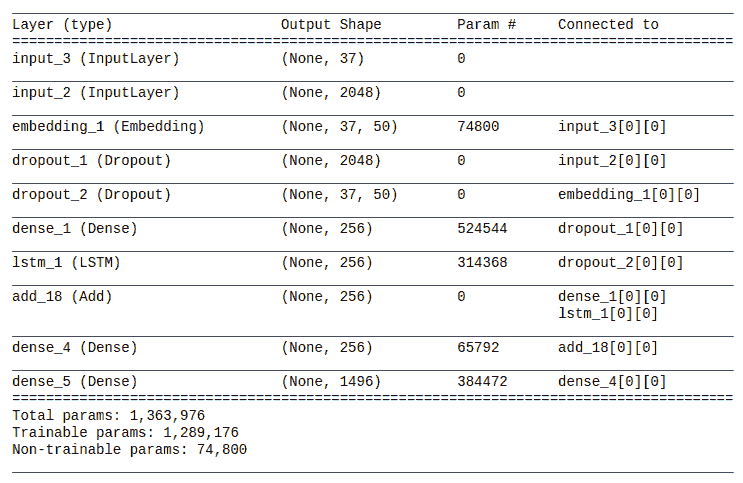

接下来，让我们在训练模型之前设置其权重。

10.  我们将在 GloVe 嵌入中的单词和数据集的标题中的可用单词之间插入我们先前创建的`embedding_matrix`，如以下代码块所示：

```py
model.layers[2].set_weights([embedding_matrix])
model.layers[2].trainable = False
```

这样，我们就可以编译模型了，如下所示：

```py
model.compile(loss='categorical_crossentropy', optimizer='adam')
```

11.  由于数据集很大，因此我们不想在训练时将所有图像同时加载到数据集中。 为了促进模型的内存有效训练，我们使用生成器函数，如下所示：

```py
def data_generator(train_descs, train_encoded, word_index_map, max_caption_len, batch_size):
    X1, X2, y = [], [], []

    n = 0
    while True:
        for key, desc_list in train_descs.items():
            n += 1

            photo = train_encoded[key]
            for desc in desc_list:

                seq = [word_index_map[word] for word in desc.split() if word in word_index_map]
                for i in range(1, len(seq)):
                    xi = seq[0:i]
                    yi = seq[i]

                    xi = pad_sequences([xi], maxlen=max_caption_len, value=0, padding='post')[0]
                    yi = to_categorical([yi], num_classes=len(word_index_map) + 1)[0]

                    X1.append(photo)
                    X2.append(xi)
                    y.append(yi)

                if n==batch_size:
                    yield [[np.array(X1), np.array(X2)], np.array(y)]
                    X1, X2, y = [], [], []
                    n = 0
```

12.  我们现在准备训练模型。 在执行此操作之前，我们必须设置模型的一些超参数，如以下代码片段所示：

```py
batch_size = 3
steps = len(train_desc)//batch_size
```

设置超参数后，我们可以使用以下代码行开始训练：

```py
generator = data_generator(train_desc, train_encoded, word_index_map, max_caption_len, batch_size)
model.fit_generator(generator, epochs=1, steps_per_epoch=steps, verbose=1)
model.save('./model_weights/model.h5')
```

# 测试

现在，在以下步骤中，我们将基于前面步骤中训练的模型创建用于预测字幕的功能，并在示例图像上测试字幕：

1.  我们终于到了可以使用模型生成图像标题的阶段。 我们创建了一个函数，该函数可以吸收图像并使用`model.predict`方法在每个步骤中提出一个单词，直到在预测中遇到`#STOP#`。 它在那里停止并输出生成的字幕，如下所示：

```py
def predict_caption(img):

    in_text = "#START#"
    for i in range(max_caption_len):
        sequence = [word_index_map[w] for w in in_text.split() if w in word_index_map]
        sequence = pad_sequences([sequence], maxlen=max_caption_len, padding='post')

        pred = model.predict([img, sequence])
        pred = pred.argmax()
        word = index_word_map[pred]
        in_text += (' ' + word)

        if word == "#STOP#":
            break

    caption = in_text.split()[1:-1]

    return ' '.join(caption)
```

2.  让我们在测试数据集中的某些图像上测试生成模型，如下所示：

```py
img_name = list(test_encoded.keys())[np.random.randint(0, 1000)]
img = test_encoded[img_name].reshape((1, 2048))

im = plt.imread(img_data + img_name + '.jpg')
caption = predict_caption(img)

print(caption)
plt.imshow(im)
plt.axis('off')
plt.show()
```

假设我们将以下屏幕截图中显示的图像输入了算法：

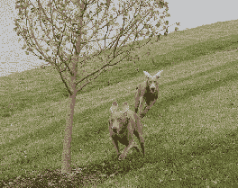

对于前面的屏幕快照中显示的图像，我们获得了以下生成的标题：**一只棕色的狗正穿过草丛**。 虽然标题不是很准确，但完全遗漏了图片中的第二只动物，但它的确足以确定一条棕色的狗在草地上奔跑。

但是，我们训练有素的模型非常不准确，因此不适合用于生产或实验以外的用途。 您可能已经注意到，我们将训练中的周期数设置为 1，这是一个非常低的值。 这样做是为了使该程序的训练在合理的时间内完成，以供您阅读本书！

在下一节中，我们将研究如何将图像字幕生成模型部署为 API 并使用它来生成实时的摄像机供稿字幕。

# 创建一个简单的可单击部署的图像标题生成模型

虽然我们在上一节“测试”中开发的图像标题生成模型看起来不错，但不是很好。 因此，在本节中，我们将向您展示一种方法，以单击方式将可直接用于生产环境的模型作为 Docker 映像部署在 Red Hat OpenShift 上，并由 IBM 出色的机器学习专家创建。

将微服务用于在任何网站上执行的此类微小且专用的操作是一种非常普遍的做法，因此，我们将把此图像标题服务视为微服务。

我们将使用的图像是 IBM 开发的 *MAX 图像字幕生成器*模型。 它基于`im2txt`模型的代码，作为 《Show and Tell: Lessons learned from the 2015 MSCOCO Image Captioning Challenge》论文的可公开使用的 TensorFlow 实现托管在 GitHub 上。

在更大的 Microsoft COCO 数据集上训练了图像中使用的模型，该数据集包含超过 200,000 个带标签图像的实例，以及总共超过 300,000 个图像实例。 该数据集包含包含超过 150 万个不同对象的图像，并且是用于构建对象检测和图像标记模型的最大，最受欢迎的数据集之一。 但是，由于其巨大的尺寸，很难在低端设备上训练模型。 因此，我们将使用已经可用的 Docker 映像，而不是尝试在其上训练我们的模型。 但是，项目章节前面各节中描述的方法与 Docker 映像中的代码所使用的方法非常相似，并且在有足够的可用资源的情况下，您绝对可以尝试训练并提高模型的准确率。

[您可以在以下链接中查看有关此 Docker 映像项目的所有详细信息](https://developer.ibm.com/exchanges/models/all/max-image-caption-generator/)。

您可以在此 Docker 映像的项目页面上了解其他可用的方法来部署此映像，但我们将向您展示在 Red Hat OpenShift 上的部署，从而使您只需单击几下即可快速测试模型。 。

让我们看看如何部署此映像，如下所示：

1.  创建一个 Red Hat OpenShift 帐户。 为此，请将浏览器指向[这里](https://www.openshift.com/)，然后单击“免费试用”。
2.  选择尝试 RedHat OpenShift Online，如以下屏幕截图所示：


3.  在下一个屏幕中，选择“注册 Openshift Online”。 然后，单击页面右上方的“注册”以找到“注册”页面。
4.  填写所有必要的详细信息，然后提交表格。 系统将要求您进行电子邮件验证，完成后将带您进入订阅确认页面，该页面将要求您确认平台免费订阅的详细信息，如以下屏幕快照所示：

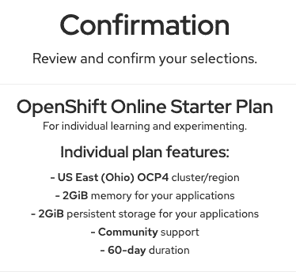

请注意，前面的订阅详细信息随时可能更改，并且可能反映订阅的其他值，区域或持续时间。

5.  确认订阅后，您将需要等待几分钟才能配置系统资源。 设置完成后，您应该能够看到将带您进入管理控制台的按钮，如以下屏幕截图所示：

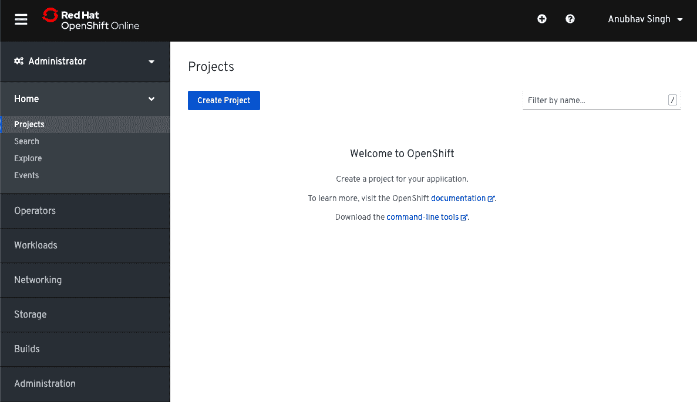

在上一个屏幕快照中显示的管理控制台的左侧，您可以找到各种菜单选项，并且在当前页面的中心，将提示您创建一个新项目。

6.  单击“创建项目”，然后在出现的对话框中填写项目名称。 确保您创建的项目具有唯一的名称。 创建项目后，将为您提供一个仪表板，其中显示了对所有可用资源及其使用情况的监视。

在左侧菜单上，选择“开发人员”以切换到控制台的“开发人员”视图，如以下屏幕截图所示：

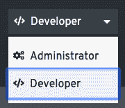

7.  现在，您应该能够看到控制台的 Developer 视图以及更新的左侧菜单。 在这里，单击“拓扑”以获取以下部署选项：

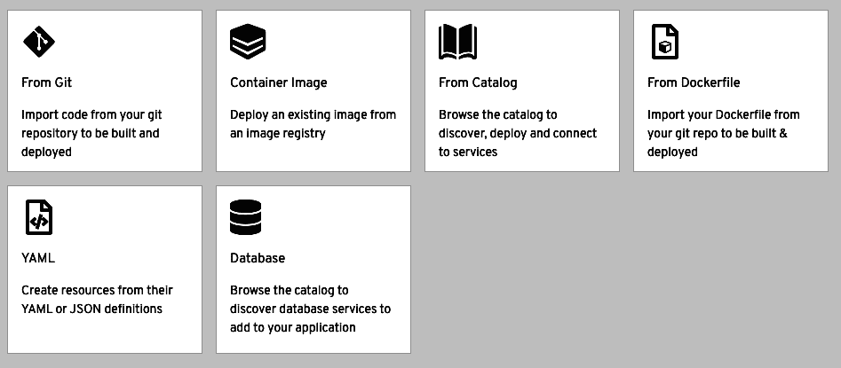

8.  在显示有部署选项的屏幕中单击“容器映像”，以调出用于容器映像部署的表单。

在此处，将图像名称填写为`codait/max-image-caption-generator`，然后单击“搜索”图标。 其余字段将自动获取，并且将显示与图像有关的信息，如以下屏幕截图所示：

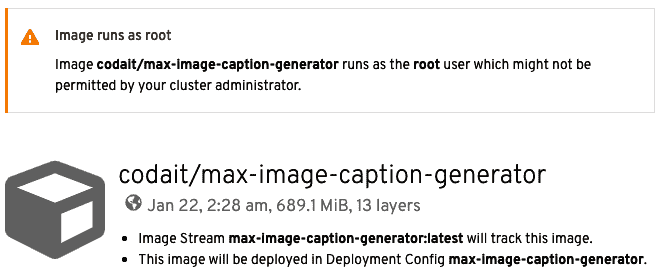

9.  在显示部署详细信息的下一个屏幕中，单击屏幕中央的“部署的映像”选项，如以下屏幕截图所示：

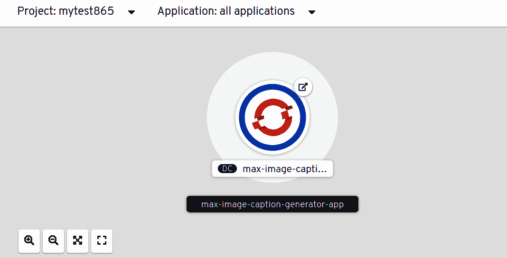

10.  然后，向下滚动显示在屏幕右侧的信息面板，找到“路由”信息，该信息类似于以下屏幕截图：

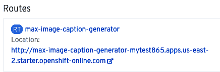

单击此路由，将为您提供以下已成功部署的 API 的 Swagger UI：

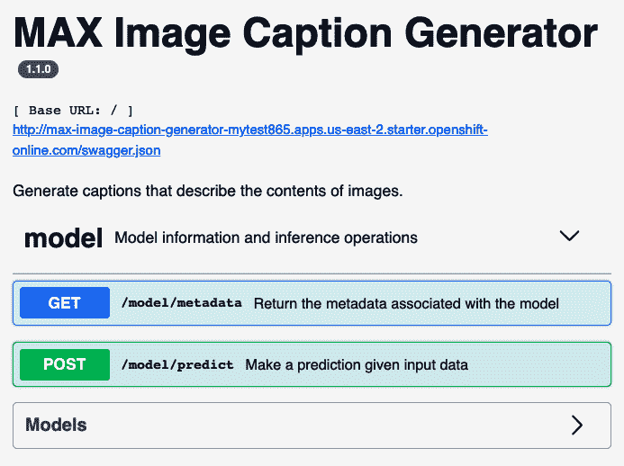

您可以通过将图像发布到`/model/predict`路由来快速检查模型的工作情况。 随意使用 Swagger UI 可以很好地了解其表现。 您也可以使用`/model/metadata`路由找到模型元数据。

我们准备在项目中使用此 API。 让我们在接下来的部分中了解如何构建相机应用以及如何将此 API 集成到应用中。 我们首先使用相机插件构建应用。

# 了解相机插件

通过`camera`依赖项提供的相机插件，使我们可以自由访问设备的摄像机。 它为 Android 和 iOS 设备提供支持。 该插件是开源的，并托管在 GitHub 上，因此任何人都可以自由访问代码，修复错误并提出对当前版本的增强建议。

该插件可用于在小部件上显示实时摄像机预览，捕获图像并将其本地存储在设备上。 它也可以用来录制视频。 此外，它具有访问图像流的功能。

可以通过以下三个简单步骤将相机插件添加到任何应用：

1.  安装包
2.  添加用于持久存储和正确执行的方法
3.  编程

现在让我们详细讨论每个步骤。

# 安装相机插件

要在应用中使用相机插件，我们需要在`pubspec.yaml`文件中添加`camera`作为依赖项。 可以按照以下步骤进行：

```py
camera: 0.5.7+3
```

最后，运行`flutter pub get`将依赖项添加到应用。

# 添加用于持久存储和正确执行的方法

对于 iOS 设备，我们还需要指定一个空间来存储系统可以轻松访问的配置数据。 iOS 设备借助`Info.plist`文件来确定要显示的图标，应用支持的文档类型以及其他行为。 您需要在此步骤中修改`ios/Runner/Info.plist`中存在的`Info.plist`文件。

这可以通过添加以下文本来完成：

```py
<key>NSCameraUsageDescription</key>
<string>Can I use the camera please?</string>
<key>NSMicrophoneUsageDescription</key>
<string>Can I use the mic please?</string>
```

对于 Android 设备，插件正常运行所需的最低**软件开发套件**（**SDK**）版本是 21。因此，请将最低 Android SDK 版本更改为 21（或更高版本）， 存储在`android/app/build.gradle`文件中，如下所示：

```py
minSdkVersion 21
```

安装依赖项并进行必要的更改之后，现在让我们开始编写应用代码。

# 编码

安装插件并进行必要的修改后，现在就可以使用它来访问相机，单击图片并录制视频。

涉及的最重要步骤如下：

1.  通过运行以下代码导入插件：

```py
import 'package:camera/camera.dart';
```

2.  通过运行以下代码来检测可用的摄像机：

```py
List<CameraDescription> cameras = await availableCameras();
```

3.  初始化相机控件实例，如下所示：

```py
CameraController controller = CameraController(cameras[0], ResolutionPreset.medium);
    controller.initialize().then((_) {
      if (!mounted) {
        return;
      }
      setState(() {});
    });
```

4.  通过运行以下代码来处理控制器实例：

```py
controller?.dispose();
```

现在，我们已经具备了相机插件的基本知识，让我们为应用构建实时相机预览。

# 创建相机应用

现在，我们将开始构建移动应用，以为指向相机的对象生成标题。 它包括一个用于捕获图像的相机预览和一个用于显示模型返回的字幕的文本视图。

该应用可以大致分为两部分，如下所示：

1.  建立相机预览
2.  集成模型来获取标题

在以下部分中，我们将讨论构建基本的相机预览。

# 建立相机预览

现在，我们将为应用构建摄像机预览。 我们首先创建一个新文件`generate_live_caption.dart`和一个`GenerateLiveCaption`有状态小部件。

让我们看一下创建实时摄像机预览的以下步骤：

1.  要添加实时摄像机预览，我们将使用`camera`插件。 首先，将依存关系添加到`pubspec.yaml`文件中，如下所示：

```py
camera: ^0.5.7
```

接下来，我们需要通过运行`flutter pub get`将依赖项添加到项目中。

2.  现在，我们创建一个新文件`generate_live_captions.dart`，其中包含`GenerateLiveCaptions`有状态的小部件。 进一步步骤中描述的所有代码将包含在`_GenerateLiveCaptionState`类中。

3.  导入`camera`库。 我们将其导入`generate_live_captions.dart`，如下所示：

```py
import 'package:camera/camera.dart';
```

4.  现在，我们需要检测设备上所有可用的摄像机。 为其定义`detectCameras()`函数，如下所示：

```py
Future<void> detectCameras() async{
    cameras = await availableCameras();
}
```

`cameras`是包含所有可用摄像机的全局列表，并在`GenerateLiveCaptionState`中声明，如下所示：

```py
List<CameraDescription> cameras;
```

5.  现在，我们使用`initializeController()`方法创建`CameraController`的实例，如下所示：

```py
 void initializeController() {
    controller = CameraController(cameras[0], ResolutionPreset.medium);
      controller.initialize().then((_) {
        if (!mounted) {
          return;
        }
        setState(() {});
    });
  }
```

在应用中，我们将使用设备的后置摄像头，因此我们使用`camera[0]`创建`CameraController`实例，并使用`ResolutionPreset.medium`将分辨率指定为中等。 接下来，我们使用`controller.initialize()`初始化控制器。

6.  为了在应用的屏幕上显示摄像机源，我们定义了`buildCameraPreview()`方法，如下所示：

```py
 Widget _buildCameraPreview() {
    var size = MediaQuery.of(context).size.width;
      return Container(
        child: Column(
          children: <Widget>[
              Container(
                width: size,
                height: size,
                child: CameraPreview(controller),
              ),
          ]
        )
      );
  }
```

在前面的方法中，我们使用`MediaQuery.of(context).size.width`获取容器的宽度并将其存储在`size`变量中。 接下来，我们创建一列小部件，其中第一个元素是`Container`。 `Container`的子项只是`CameraPreview`，用于在应用的屏幕上显示摄像机的信息。

7.  现在，我们覆盖`initState`，以便在初始化`GenerateLiveCaption`后立即检测到所有摄像机，如下所示：

```py
 @override
  void initState() {
    super.initState();  
    detectCameras().then((_){
      initializeController();
    });
  }
```

在前面的代码片段中，我们仅调用`detectCameras()`首先检测所有可用的摄像机，然后调用`initializeController()`用后置摄像机初始化`CameraController`。

8.  要从相机供稿生成字幕，我们将从相机供稿中拍摄照片并将其存储在本地设备中。 这些单击的图片将稍后从图像文件中检索以生成标题。 因此，我们需要一种读取和写入文件的机制。 我们通过在`pubspec.yaml`文件中添加以下依赖项来使用`path_provider`插件：

```py
path_provider: ^1.4.5
```

接下来，我们通过在终端中运行`flutter pub get`来安装包。

9.  要在应用中使用`path_provider`插件，我们需要通过在文件顶部添加`import`语句将其导入`generate_live_caption.dart`中，如下所示：

```py
import 'package:path_provider/path_provider.dart';
```

10.  要将图像文件保存到磁盘，我们还需要导入`dart:io`库，如下所示：

```py
import 'dart:io';
```

11.  现在，让我们定义一种方法`captureImages()`，以从相机源中捕获图像并将其存储在设备中。 这些存储的图像文件将在以后用于生成字幕。 该方法定义如下：

```py
capturePictures() async {
   String timestamp = DateTime.now().millisecondsSinceEpoch.toString();
   final Directory extDir = await getApplicationDocumentsDirectory();
   final String dirPath = '${extDir.path}/Pictures/generate_caption_images';
   await Directory(dirPath).create(recursive: true);
   final String filePath = '$dirPath/${timestamp}.jpg';
   controller.takePicture(filePath).then((_){
     File imgFile = File(filePath);
     });
  }
```

在前面的代码片段中，我们首先使用`DateTime.now().millisecondsSinceEpoch()`找出当前时间（以毫秒为单位），然后将其转换为字符串并将其存储在变量`timestamp`中。 时间戳将用于为我们将进一步存储的图像文件提供唯一的名称。 接下来，我们使用`getApplicationDocumentsDirectory()`获取可用于存储图像的目录的路径，并将其存储在`Directory`类型的`extDir`中。 现在，我们通过在外部目录后附加`'/Pictures/generate_caption_images'`来创建适当的目录路径。 然后，我们通过将目录路径与当前时间戳组合并为其指定`.jpg`格式来创建最终的`filePath`。 由于时间戳始终具有不同的值，因此所有单击的图像的`filePath`将始终是唯一的。 最后，我们使用当前的相机控制器实例调用`takePicture()`并传入`filePath`来捕获图像。 我们存储在`imgFile`中创建的图像文件，稍后将用于生成适当的字幕。

12.  如前所述，为了从实时摄像机的提要中生成字幕，我们会定期捕获图像。 为了使它起作用，我们修改`initializeController()`并添加一个计时器，如下所示：

```py
void initializeController() {
    controller = CameraController(cameras[0], ResolutionPreset.medium);
      controller.initialize().then((_) {
        if (!mounted) {
          return;
        }
        setState(() {});
        const interval = const Duration(seconds:5);
        new Timer.periodic(interval, (Timer t) => capturePictures());
    });
  }
```

在`initializeController()`内部，一旦正确初始化并安装了摄像机控制器，我们将使用`Duration()`类创建 5 秒的持续时间，并将其存储在间隔中。 现在，我们使用`Timer.periodic`创建一个定期计时器，并为其设置 5 秒的间隔。 此处指定的回调为`capturePictures()`。 将在指定间隔内重复调用它。

至此，我们创建了一个实时摄像机供稿，该供稿显示在屏幕上，并且能够以 5 秒的间隔捕获图像。 在下一部分中，我们将集成模型以为所有捕获的图像生成标题。

# 从相机源生成图像字幕

现在，我们对图像标题生成器有了一个清晰的想法，并有了一个带有摄像头提要的应用，我们准备为摄像头提要生成图像的标题。 要遵循的逻辑非常简单。 图像是在特定时间间隔从实时摄像机的提要中捕获的，并存储在设备的本地存储中。 接下来，检索存储的图片，并为托管模型创建`HTTP POST`请求，传入检索的图像以获取生成的字幕，解析响应并将其显示在屏幕上。

现在让我们看一下详细步骤，如下所示：

1.  我们首先将`http`依赖项添加到`pubspec.yaml`文件，以发出`http`请求，如下所示：

```py
http: ^0.12.0
```

使用`flutter pub get`将依赖项安装到项目。

2.  要在应用中使用`http`包，我们需要将其导入`generate_live_caption.dart`中，如下所示：

```py
import 'package:http/http.dart'  as http;
```

3.  现在，我们定义一个方法`fetchResponse()`，它使用一个图像文件并使用该图像为托管模型创建一个帖子，如下所示：

```py
Future<Map<String, dynamic>> fetchResponse(File image) async {

    final mimeTypeData =
        lookupMimeType(image.path, headerBytes: [0xFF, 0xD8]).split('/');

    final imageUploadRequest = http.MultipartRequest(
        'POST',
        Uri.parse(
            "http://max-image-caption-generator-mytest865.apps.us-east-2.starter.openshift-online.com/model/predict"));

    final file = await http.MultipartFile.fromPath('image', image.path,
        contentType: MediaType(mimeTypeData[0], mimeTypeData[1]));

    imageUploadRequest.fields['ext'] = mimeTypeData[1];
    imageUploadRequest.files.add(file);
    try {
      final streamedResponse = await imageUploadRequest.send();
      final response = await http.Response.fromStream(streamedResponse);
      final Map<String, dynamic> responseData = json.decode(response.body);
      parseResponse(responseData);
      return responseData;

    } catch (e) {
      print(e);
      return null;
    }
  }
```

在上述方法中，我们首先通过查看文件的头字节来找到所选文件的 mime 类型。 然后，我们按照托管 API 的要求初始化一个多部分请求。 我们将传递给函数的文件附加为`image` POST 参数。 由于`image_picker`存在一些错误，因此错误地将图像扩展名与文件名（例如`filenamejpeg`）混合在一起，因此我们在请求正文中明确传递了图像扩展名，这会在服务器端管理或验证文件扩展名时产生问题。 响应采用 JSON 格式，因此，我们需要使用`json.decode()`对其进行解码，并使用`res.body`传入响应的主体。 现在，我们通过调用下一步定义的`parseResponse()`来解析响应。 此外，我们使用`catchError()`检测并打印执行`POST`请求时可能发生的任何错误。

4.  成功执行`POST`请求并从模型中获得带有传递的图像的标题的响应之后，我们在`parseResponse()`方法内部解析响应，如下所示：

```py
void parseResponse(var response) {
    String resString = "";
    var predictions = response['predictions'];
    for(var prediction in predictions) {
      var caption = prediction['caption'];
      var probability = prediction['probability'];
      resString = resString + '${caption}: ${probability}\n\n';
    }
    setState(() {
      resultText = resString;
    });
  }
```

在上述方法中，我们首先存储`response['predictions']`中存在的所有预测的列表，并将其存储在`prediction`变量中。 现在，我们使用`prediction`变量遍历`for each`循环内的每个预测。 对于每个预测，我们分别取出`prediction['caption']`和`prediction['probability']`中存储的标题和概率。 我们将它们附加到`resString`字符串变量，该变量将包含所有预测的字幕以及概率。 最后，我们将`resultText`的状态设置为`resString`中存储的值。 `resultText`是此处的全局字符串变量，将在接下来的步骤中使用它来显示预测的字幕。

5.  现在，我们修改`capturePictures()`，以便每次捕获新图像时都会发出 HTTP 发布请求，如下所示：

```py
capturePictures() async {
   . . . . .
   controller.takePicture(filePath).then((_){
     File imgFile = File(filePath);
     fetchResponse(imgFile);
     });
  }
```

在前面的代码片段中，我们向`fetchResponse()`添加了一个调用，并传入了图像文件。

6.  现在，让我们修改`buildCameraPreview()`以显示所有预测，如下所示：

```py
Widget buildCameraPreview() {
    . . . . .
    return Container(
      child: Column(
        children: <Widget>[
          Container(
            . . . . .
            child: CameraPreview(controller),
          ),
          Text(resultText),  
        ]
      )
    );
  }
```

在前面的代码片段中，我们简单地将`Text`与`result.Text`相加。 `result.Text`是一个全局字符串变量，它将包含“步骤 5”中所述的所有预测，并声明如下：

```py
String resultText = "Fetching Response..";
```

7.  最后，我们重写`build()`方法以为应用创建最终的脚手架，如下所示：

```py
@override
  Widget build(BuildContext context) {
    return Scaffold(
      appBar: AppBar(title: Text('Generate Image Caption'),),
      body: (controller.value.isInitialized)?buildCameraPreview():new Container(),
      );
  }
```

在前面的代码片段中，我们返回了一个标题为`Generate Image Caption`的`appBar`支架。 主体最初设置为空容器。 初始化摄像机控制器后，将更新主体以显示摄像机供稿以及预测的字幕。

8.  最后，我们按以下方式处置摄像头控制器：

```py
@override
  void dispose() {
    controller?.dispose();
    super.dispose();
  }
```

现在，我们已经成功创建了一种在屏幕上显示实时摄像机供稿的机制。 实时摄像头的提要以 5 秒的间隔被捕获，并作为输入发送到模型。 然后，所有捕获图像的预测字幕将显示在屏幕上。

在下一节中，我们现在创建最终的材质应用以将所有内容整合在一起。

# 创建材质应用

在使所有段正常工作之后，让我们创建最终的材质应用。 在`main.dart`文件中，我们创建`StatelessWidget`并覆盖`build()`方法，如下所示：

```py
class MyApp extends StatelessWidget {  
@override
  Widget build(BuildContext context) {
    return MaterialApp(
      title: 'Flutter Demo',
      theme: ThemeData(
        primarySwatch: Colors.blue,
      ),
      home: GenerateLiveCaption()
    );
  }
}
```

最后，我们执行以下代码：

```py
void main() => runApp(MyApp());
```

您应该能够拥有一个应用屏幕，如以下屏幕截图所示：

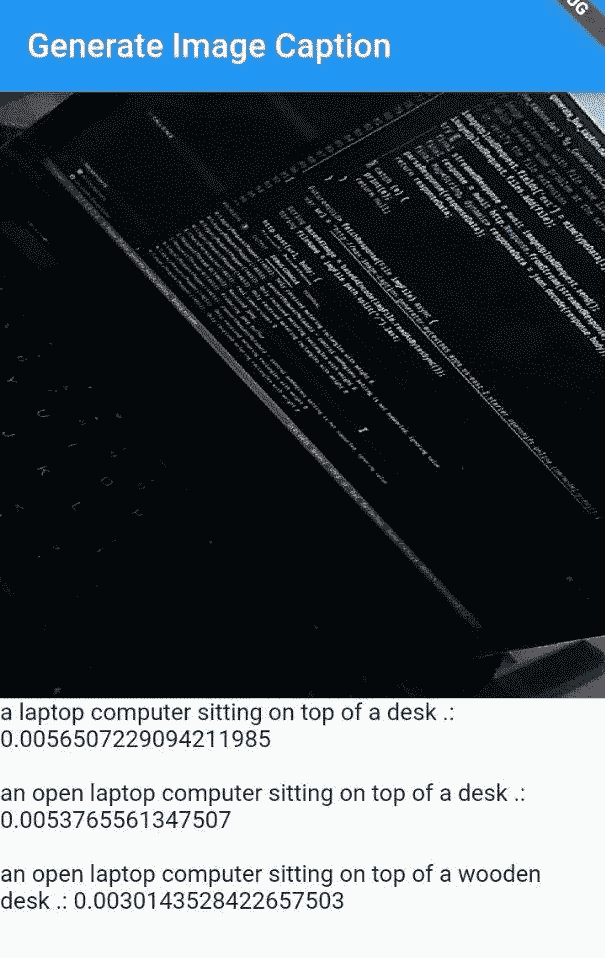

请注意图像中显示的标题，如下所示：

*   放在桌子上的便携式计算机。
*   放在桌子上的一台打开的便携式计算机。
*   放在一张木桌上的一台打开的便携式计算机。

这些标题的描述非常准确。 但是，由于训练数据集中相关图片的不可用，它们有时可能表现不佳。

# 总结

在本章中，我们了解了如何创建一个应用，该应用使用深层的 CNN 和 LSTM 为摄像机的提要实时生成字幕。 我们还看到了如何快速将以 Docker 映像形式提供的某些机器学习/深度学习模型部署到 Red Hat OpenShift，并以可调用 API 的形式轻松获取它们。 从应用开发人员的角度来看，这是至关重要的，因为当与一组机器学习开发人员一起工作时，他们通常会为您提供要使用的模型的 Docker 映像，这样您就无需在其中执行任何代码或配置。 系统。 可以将这种应用用于多种用途，例如为盲人创建辅助技术，生成当时发生的事件的成绩单，或者（例如）为孩子提供现场指导，以帮助他们识别环境中的物体。 我们介绍了如何应用 Flutter 相机插件并在框架上进行深度学习。

在下一章中，我们将研究如何开发用于执行应用安全性的深度学习模型。