# 七、语音/多媒体处理 - 使用 AI 生成音乐

鉴于**人工智能**（**AI**）的应用越来越多，将 AI 与音乐结合使用的想法已经存在了很长时间，并且受到了广泛的研究。 由于音乐是一系列音符，因此它是时间序列数据集的经典示例。 最近证明时间序列数据集在许多预测领域中非常有用–股市，天气模式，销售模式以及其他基于时间的数据集。 **循环神经网络**（**RNN**）是处理时间序列数据集的最多模型之一。 对 RNN 进行的流行增强称为**长短期记忆**（**LSTM**）神经元。 在本章中，我们将使用 LSTM 处理音符。

多媒体处理也不是一个新话题。 在本项目系列的早期，我们在多章中详细介绍了图像处理。 在本章中，我们将讨论并超越图像处理，并提供一个带有音频的深度学习示例。 我们将训练 Keras 模型来生成音乐样本，每次都会生成一个新样本。 然后，我们将此模型与 Flutter 应用结合使用，以通过 Android 和 iOS 设备上的音频播放器进行部署。

在本章中，我们将介绍以下主题：

*   设计项目的架构
*   了解多媒体处理
*   开发基于 RNN 的音乐生成模型
*   在 Android 和 iOS 上部署音频生成 API

让我们首先概述该项目的架构。

# 设计项目的架构

该项目的架构与作为应用部署的常规深度学习项目略有不同。 我们将有两组不同的音乐样本。 第一组样本将用于训练可以生成音乐的 LSTM 模型。 另一组样本将用作 LSTM 模型的随机输入，该模型将输出生成的音乐样本。 我们稍后将开发和使用的基于 LSTM 的模型将部署在 **Google Cloud Platform**（**GCP**）上。 但是，您可以将其部署在 AWS 或您选择的任何其他主机上。

下图总结了将在本项目中使用的不同组件之间的交互：

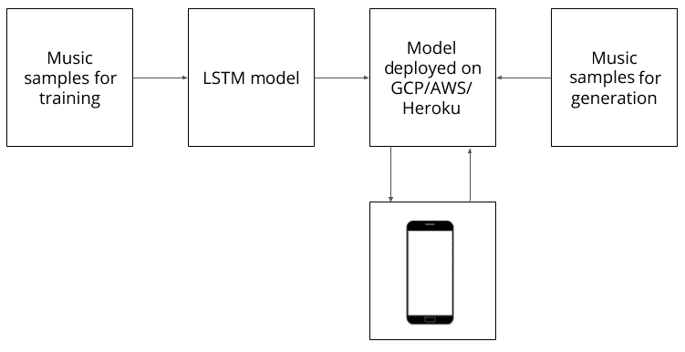

移动应用要求部署在服务器上的模型生成新的音乐样本。 该模型使用随机音乐样本作为输入，以使其通过预先训练的模型来生成新的音乐样本。 然后，新的音乐样本由移动设备获取并播放给用户。

您可以将此架构与我们之前介绍的架构进行比较，在该架构中，将有一组用于训练的数据样本，然后将模型部署在云上或本地，并用于作出预测。

我们还可以更改此项目架构，以在存在为 Dart 语言编写的 midi 文件处理库的情况下在本地部署模型。 但是，在撰写本文时，还没有与我们在开发模型时使用的 Python midi 文件库的要求兼容的稳定库。

让我们从学习多媒体处理的含义以及如何使用 OpenCV 处理多媒体文件开始。

# 了解多媒体处理

多媒体是几乎所有形式的视觉，听觉或两者兼有的内容的总称。 术语**多媒体处理**本身非常模糊。 讨论该术语的更精确方法是将其分解为两个基本部分-视觉或听觉。 因此，我们将讨论多媒体处理的术语，即图像处理和音频处理。 这些术语的混合产生了视频处理，这只是多媒体的另一种形式。

在以下各节中，我们将以单独的形式讨论它们。

# 图像处理

图像处理或计算机视觉是迄今为止人工智能研究最多的分支之一。 在过去的几十年中，它发展迅速，并在以下几种技术的进步中发挥了重要作用：

*   图像过滤器和编辑器
*   面部识别
*   数字绘画
*   自动驾驶汽车

我们在较早的项目中讨论了图像处理的基础知识。 在这个项目中，我们将讨论一个非常流行的用于执行图像处理的库-OpenCV。 OpenCV 是*开源计算机视觉*的缩写。 它由 Intel 开发，并由 Willow Garage 和 Itseez（后来被 Intel 收购）推动。 毫无疑问，由于它与所有主要的机器学习框架（例如 TensorFlow，PyTorch 和 Caffe）兼容，因此它是执行图像处理的全球大多数开发人员的首要选择。 除此之外，OpenCV 还可以使用多种语言，例如 C++，Java 和 Python。

要在 Python 环境中安装 OpenCV，可以使用以下命令：

```py
pip install opencv-contrib-python
```

前面的命令将同时安装主 OpenCV 模块和`contrib`模块。 [您可以在此处找到更多模块供您选择](https://docs.opencv.org/master/)。 有关更多安装说明，如果前面的链接不符合您的要求，[则可以在此处遵循官方文档](https://docs.opencv.org/master/df/d65/tutorial_table_of_content_introduction.html)。

让我们为您介绍一个非常简单的示例，说明如何使用 OpenCV 执行图像处理。 创建一个新的 Jupyter 笔记本，并从以下步骤开始：

1.  要将 OpenCV 导入笔记本，请使用以下代码行：

```py
import cv2
```

2.  我们还要将 matplotlib 导入笔记本，因为如果您尝试使用本机 OpenCV 图像显示功能，Jupyter 笔记本将会崩溃：

```py
from matplotlib import pyplot as plt
%matplotlib inline
```

3.  让我们使用 matplotlib 为 OpenCV 的本机图像显示功能创建一个替代函数，以方便在笔记本中显示图像：

```py
def showim(image):
    image = cv2.cvtColor(image, cv2.COLOR_BGR2RGB)
    plt.imshow(image)
    plt.show()
```

请注意，我们将图像的配色方案从**蓝色绿色红色**（**BGR**）转换为**红色绿色蓝色**（**RGB**）。 这是由于默认情况下 OpenCV 使用 BGR 配色方案。 但是，matplotlib 在显示图片时会使用 RGB 方案，并且如果不进行这种转换，我们的图像就会显得奇怪。

4.  现在，让我们将图像读取到 Jupyter 笔记本中。 完成后，我们将能够看到加载的图像：

```py
image = cv2.imread("Image.jpeg")
showim(image)
```

前面代码的输出取决于您选择加载到笔记本中的图像：

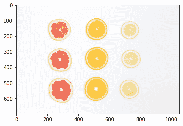

在我们的示例中，我们加载了柑橘类水果切片的图像，这是艾萨克·奎萨达（Isaac Quesada）在“Unsplash”上拍摄的惊人照片。

您可以在[这里](https://unsplash.com/photos/6mw7bn9k9jw)找到上一张图片。

5.  让我们通过将之前的图像转换为灰度图像来进行简单的操作。 为此，我们就像在声明的`showim()`函数中那样简单地使用转换方法：

```py
gray_image = cv2.cvtColor(image, cv2.COLOR_BGR2GRAY)
showim(gray_image)
```

这将产生以下输出：

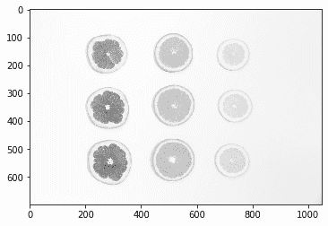

6.  现在让我们执行另一种常见的操作，即图像模糊。 在图像处理中通常采用模糊处理，以消除图像中信息的不必要的细节（此时）。 我们使用高斯模糊过滤器，这是在图像上创建模糊的最常见算法之一：

```py
blurred_image = cv2.GaussianBlur(image, (7, 7), 0)
showim(blurred_image)
```

这将产生以下输出：


请注意，前面的图像不如原始图像清晰。 但是，它很容易达到愿意计算此图像中对象数量的目的。

7.  为了在图像中定位对象，我们首先需要标记图像中的边缘。 为此，我们可以使用`Canny()`方法，该方法是 OpenCV 中可用的其他选项之一，用于查找图像的边缘：

```py
canny = cv2.Canny(blurred_image, 10, 50)
showim(canny)
```

这将产生以下输出：

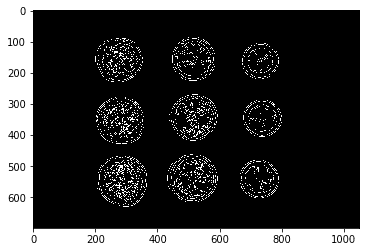

请注意，在上图中找到的边缘数量很高。 虽然这会显示图像的细节，但是如果我们尝试对边缘进行计数以尝试确定图像中的对象数量，这将无济于事。

8.  让我们尝试计算上一步生成的图像中不同项目的数量：

```py
contours, hierarchy= cv2.findContours(canny, cv2.RETR_EXTERNAL, cv2.CHAIN_APPROX_SIMPLE)
print("Number of objects found = ", len(contours))
```

上面的代码将产生以下输出：

```py
Number of objects found = 18
```

但是，我们知道前面的图像中没有 18 个对象。 只有 9。因此，在寻找边缘时，我们将在`canny`方法中处理阈值。

9.  让我们在 canny 方法中增加边缘发现的阈值。 这使得更难检测到边缘，因此仅使最明显的边缘可见：

```py
canny = cv2.Canny(blurred_image, 50, 150)
showim(canny)
```

这将产生以下输出：

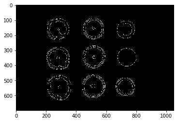

请注意，在柑橘类水果体内发现的边缘急剧减少，仅清晰可见其轮廓。 我们希望这会在计数时产生较少的对象。

10.  让我们再次运行以下代码块：

```py
contours, hierarchy= cv2.findContours(canny, cv2.RETR_EXTERNAL, cv2.CHAIN_APPROX_SIMPLE)
print("Number of objects found = ", len(contours))
```

这将产生以下输出：

```py
Number of objects found = 9
```

这是期望值。 但是，只有在特殊情况下，该值才是准确的。

11.  最后，让我们尝试概述检测到的对象。 为此，我们绘制了`findContours()`方法的上一步中确定的轮廓：

```py
_ = cv2.drawContours(image, contours, -1, (0,255,0), 10)
showim(image)
```

这将产生以下输出：

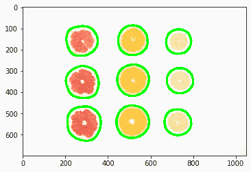

请注意，我们已经在拍摄的原始图像中非常准确地识别出了九片水果。 我们可以进一步扩展此示例，以在任何图像中找到某些类型的对象。

要了解有关 OpenCV 的更多信息并找到一些可供学习的示例，[请访问以下存储库](https://github.com/ayulockin/myopenCVExperiments)。

现在让我们学习如何处理音频文件。

# 音频处理

我们已经看到了如何处理图像以及可以从中提取信息。 在本节中，我们将介绍音频文件的处理。 音频或声音是吞没您周围环境的东西。 在许多情况下，您仅能从该区域的音频剪辑中正确预测该区域或环境，而无需实际看到任何视觉提示。 声音或语音是人与人之间交流的一种形式。 安排良好的节奏模式形式的音频称为音乐，可以使用乐器制作。

音频文件的一些流行格式如下：

*   **MP3**：一种非常流行的格式，广泛用于共享音乐文件。
*   **AAC**：是对 MP3 格式的改进，AAC 主要用于 Apple 设备。
*   **WAV**：由 Microsoft 和 IBM 创建，这种格式是无损压缩，即使对于小的音频文件也可能很大。
*   **MIDI**：乐器数字接口文件实际上不包含音频。 它们包含乐器音符，因此体积小且易于使用。

音频处理是以下技术的增长所必需的：

*   用于基于语音的界面或助手的语音处理
*   虚拟助手的语音生成
*   音乐生成
*   字幕生成
*   推荐类似音乐

TensorFlow 团队的 Magenta 是一种非常流行的音频处理工具。

您可以通过[这里](https://magenta.tensorflow.org/)访问 Magenta 主页。 该工具允许快速生成音频和音频文件的转录。

让我们简要地探讨 Magenta。

# Magenta

Magenta 是 Google Brain 团队参与研究的一部分，该团队也参与了 TensorFlow。 它被开发为一种工具，可允许艺术家借助深度学习和强化学习算法来增强其音乐或艺术创作渠道。 这是 Magenta 的徽标：

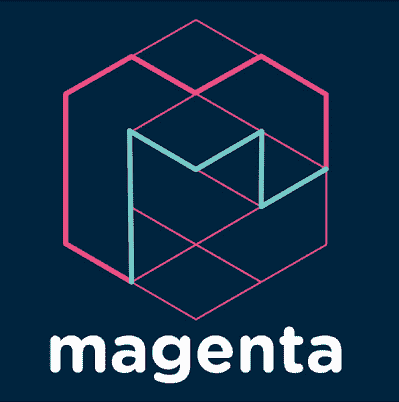

让我们从以下步骤开始：

1.  要在系统上安装 Magenta，可以使用 Python 的 pip 存储库：

```py
pip install magenta
```

2.  如果缺少任何依赖项，则可以使用以下命令安装它们：

```py
!apt-get update -qq && apt-get install -qq libfluidsynth1 fluid-soundfont-gm build-essential libasound2-dev libjack-dev

!pip install -qU pyfluidsynth pretty_midi
```

3.  要将 Magenta 导入项目中，可以使用以下命令：

```py
import magenta
```

或者，按照流行的惯例，仅加载 Magenta 的音乐部分，可以使用以下命令：

```py
import magenta.music as mm
```

您可以使用前面的导入在线找到很多样本。

让我们快速创作一些音乐。 我们将创建一些鼓声，然后将其保存到 MIDI 文件：

1.  我们首先需要创建一个`NoteSequence`对象。 在 Magenta 中，所有音乐都以音符序列的格式存储，类似于 MIDI 存储音乐的方式：

```py
from magenta.protobuf import music_pb2

drums = music_pb2.NoteSequence()
```

2.  创建`NoteSequence`对象后，该对象为空，因此我们需要向其添加一些注解：

```py
drums.notes.add(pitch=36, start_time=0, end_time=0.125, is_drum=True, instrument=10, velocity=80)
drums.notes.add(pitch=38, start_time=0, end_time=0.125, is_drum=True, instrument=10, velocity=80)
drums.notes.add(pitch=42, start_time=0, end_time=0.125, is_drum=True, instrument=10, velocity=80)
drums.notes.add(pitch=46, start_time=0, end_time=0.125, is_drum=True, instrument=10, velocity=80)
.
.
.
drums.notes.add(pitch=42, start_time=0.75, end_time=0.875, is_drum=True, instrument=10, velocity=80)
drums.notes.add(pitch=45, start_time=0.75, end_time=0.875, is_drum=True, instrument=10, velocity=80)
```

请注意，在前面的代码中，每个音符都有音高和力度。 再次类似于 MIDI 文件。

3.  现在让我们为音符添加节奏，并设置音乐播放的总时间：

```py
drums.total_time = 1.375

drums.tempos.add(qpm=60)
```

完成此操作后，我们现在准备导出 MIDI 文件。

4.  我们首先需要将 Magenta`NoteSequence`对象转换为 MIDI 文件：

```py
mm.sequence_proto_to_midi_file(drums, 'drums_sample_output.mid')
```

前面的代码首先将音符序列转换为 MIDI，然后将它们写入磁盘上的`drums_sample_output.mid`文件。 您现在可以使用任何合适的音乐播放器播放`midi`文件。

继续前进，让我们探索如何处理视频。

# 视频处理

视频处理是多媒体处理的另一个重要部分。 通常，我们需要弄清楚移动场景中发生的事情。 例如，如果我们要生产自动驾驶汽车，则它需要实时处理大量视频才能平稳行驶。 这种情况的另一个实例可以是将手语转换为文本以帮助与语音障碍者互动的设备。 此外，需要视频处理来创建电影和动作效果。

我们将在本节中再次探讨 OpenCV。 但是，我们将演示如何在 OpenCV 中使用实时摄像机供稿来检测面部。

创建一个新的 Python 脚本并执行以下步骤：

1.  首先，我们需要对脚本进行必要的导入。 这将很简单，因为我们只需要 OpenCV 模块：

```py
import cv2
```

2.  现在，让我们将 Haar 级联模型加载到脚本中。 Haar 级联算法是一种用于检测任何给定图像中的对象的算法。 由于视频不过是图像流，因此我们将其分解为一系列帧并检测其中的人脸：

```py
faceCascade = cv2.CascadeClassifier("haarcascade_frontalface_default.xml")
```

[您将不得不从以下位置获取`haarcascade_frontalface_default.xml`文件](https://github.com/opencv/opencv/blob/master/data/haarcascades/haarcascade_frontalface_default.xml)。

Haar 级联是一类使用级联函数执行分类的分类器算法。 保罗·维奥拉（Paul Viola）和迈克尔·琼斯（Michael Jones）引入了它们，以试图建立一种对象检测算法，该算法足够快以在低端设备上运行。 级联函数池来自几个较小的分类器。

Haar 级联文件通常以**可扩展标记语言**（**XML**）的格式找到，并且通常执行一项特定功能，例如面部检测，身体姿势检测， 对象检测等。 [您可以在此处阅读有关 Haar 级联的更多信息](http://www.willberger.org/cascade-haar-explained/)。

3.  现在，我们必须实例化摄像机以进行视频捕获。 为此，我们可以使用默认的笔记本电脑摄像头：

```py
video_capture = cv2.VideoCapture(0)
```

4.  现在让我们从视频中捕获帧并显示它们：

```py
while True:
    # Capture frames
    ret, frame = video_capture.read()

    ### We'll add code below in future steps

    ### We'll add code above in future steps

    # Display the resulting frame
    cv2.imshow('Webcam Capture', frame)

    if cv2.waitKey(1) & 0xFF == ord('q'):
        break
```

这样您就可以在屏幕上显示实时视频供稿。 在运行此程序之前，我们需要释放相机并正确关闭窗户。

5.  要正确关闭实时捕获，请使用以下命令：

```py
video_capture.release()
cv2.destroyAllWindows()
```

现在，让我们对脚本进行测试运行。

您应该会看到一个窗口，其中包含您的脸部实时捕捉的图像（如果您不害羞的话）。

6.  让我们向该视频提要添加面部检测。 由于用于面部检测的 Haar 级联在使用灰度图像时效果更好，因此我们将首先将每个帧转换为灰度，然后对其进行面部检测。 我们需要将此代码添加到`while`循环中，如以下代码所示：

```py
    ### We'll add code below in future steps

    gray = cv2.cvtColor(frame, cv2.COLOR_BGR2GRAY)

    faces = faceCascade.detectMultiScale(
        gray,
        scaleFactor=1.1,
        minNeighbors=5,
        minSize=(30, 30),
        flags=cv2.CASCADE_SCALE_IMAGE
    )

    ### We'll add code above in future steps
```

这样，我们就可以检测到人脸了，因此让我们在视频供稿中对其进行标记！

7.  我们将简单地使用 OpenCV 的矩形绘制函数在屏幕上标记面孔：

```py
    minNeighbors=5,
        minSize=(30, 30),
        flags=cv2.CASCADE_SCALE_IMAGE
    )

    for (x, y, w, h) in faces:
        cv2.rectangle(frame, (x, y), (x+w, y+h), (0, 255, 0), 2)

    ### We'll add code above in future steps
```

现在让我们再次尝试运行脚本。

转到终端并使用以下命令运行脚本：

```py
python filename.py
```

在这里，文件名是您保存脚本文件时的名称。

您应该获得类似于以下屏幕截图的输出：

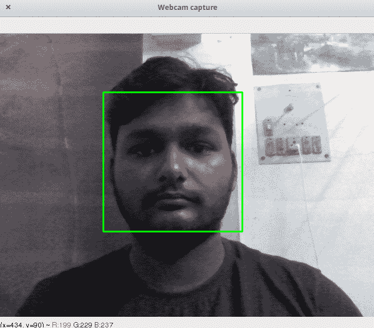

要退出实时网络摄像头捕获，请使用键盘上的`Q`键（我们已在前面的代码中进行了设置）。

我们已经研究了多媒体处理的三种主要形式的概述。 现在，让我们继续前进，构建基于 LSTM 的模型以生成音频。

# 开发基于 RNN 的音乐生成模型

在本节中，我们将开发音乐生成模型。 我们将为此使用 RNN，并使用 LSTM 神经元模型。 RNN 与简单的**人工神经网络**（**ANN**）有很大的不同-允许在层之间重复使用输入。

虽然在 ANN 中，我们希望输入到神经网络的输入值向前移动，然后产生基于错误的反馈，并将其合并到网络权重中，但 RNN 使输入多次循环返回到先前的层。

下图表示 RNN 神经元：

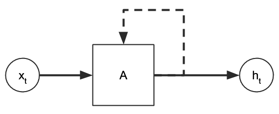

从上图可以看到，通过神经元激活函数后的输入分为两部分。 一部分在网络中向前移动到下一层或输出，而另一部分则反馈到网络中。 在时间序列数据集中，可以相对于给定样本在`t`的时间标记每个样本，我们可以扩展前面的图，如下所示：

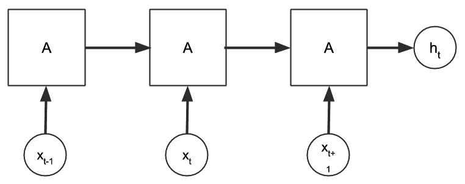

但是，由于通过激活函数反复暴露值，RNN 趋向于**梯度消失**，其中 RNN 的值逐梯度小到可以忽略不计（或在梯度爆炸的情况下变大）。 为避免这种情况，引入了 LSTM 单元，该单元通过将信息存储在单元中而允许将信息保留更长的时间。 每个 LSTM 单元由三个门和一个存储单元组成。 三个门（输入，输出和遗忘门）负责确定哪些值存储在存储单元中。

因此，LSTM 单元变得独立于 RNN 其余部分的更新频率，并且每个单元格都有自己的时间来记住它所拥有的值。 就我们而言，与其他信息相比，我们忘记了一些随机信息的时间要晚得多，这更自然地模仿了自然。

您可以在以下链接中找到[有关 RNN 和 LSTM 的详细且易于理解的解释](https://skymind.ai/wiki/lstm)。

在开始为项目构建模型之前，我们需要设置项目目录，如以下代码所示：

```py
├── app.py
├── MusicGenerate.ipynb
├── Output/
└── Samples/
    ├── 0.mid
    ├── 1.mid
    ├── 2.mid
    └── 3.mid
```

请注意，我们已经在`Samples`文件夹中下载了四个 MIDI 文件样本。 然后，我们创建了要使用的`MusicGenerate.ipynb` Jupyter 笔记本。 在接下来的几个步骤中，我们将仅在此 Jupyter 笔记本上工作。 `app.py`脚本当前为空，将来，我们将使用它来托管模型。

现在让我们开始创建基于 LSTM 的用于生成音乐的模型。

# 创建基于 LSTM 的模型

在本节中，我们将在 Jupyter 笔记本环境中研究`MusicGenerate.ipynb`笔记本：

1.  在此笔记本中，我们将需要导入许多模块。 使用以下代码导入它们：

```py
import mido
from mido import MidiFile, MidiTrack, Message
from tensorflow.keras.layers import LSTM, Dense, Activation, Dropout, Flatten
from tensorflow.keras.preprocessing import sequence
from tensorflow.keras.models import Sequential
from tensorflow.keras.optimizers import Adam
from sklearn.preprocessing import MinMaxScaler
import numpy as np
```

我们使用了`mido`库。 如果您的系统上未安装它，则可以使用以下命令来安装它：

```py
pip install mido
```

注意，在前面的代码中，我们还导入了 Keras 模块和子部件。 该项目中使用的 TensorFlow 版本为 2.0。 为了在您的系统上安装相同版本或升级当前的 TensorFlow 安装，可以使用以下命令：

```py
pip install --upgrade pip

pip install --upgrade tensorflow
```

现在，我们将继续阅读示例文件。

2.  要将 MIDI 文件读入项目笔记本，请使用以下代码：

```py
notes = []
for msg in MidiFile('Samples/0.mid') :
    try:
        if not msg.is_meta and msg.channel in [0, 1, 2, 3] and msg.type == 'note_on':
            data = msg.bytes()
            notes.append(data[1])
    except:
        pass
```

这将在`notes`列表中加载通道`0`，`1`，`2`和`3`的所有开头音符。

要了解有关注解，消息和频道的更多信息，[请使用以下文档](https://mido.readthedocs.io/en/latest/messages.html)。

3.  由于音符处于大于 0–1 范围的可变范围内，因此我们将使用以下代码将其缩放以适合公共范围：

```py
scaler = MinMaxScaler(feature_range=(0,1))
scaler.fit(np.array(notes).reshape(-1,1))
notes = list(scaler.transform(np.array(notes).reshape(-1,1)))
```

4.  我们基本上拥有的是随时间变化的笔记列表。 我们需要将其转换为时间序列数据集格式。 为此，我们使用以下代码转换列表：

```py
notes = [list(note) for note in notes]

X = []
y = []

n_prev = 20
for i in range(len(notes)-n_prev):
    X.append(notes[i:i+n_prev])
    y.append(notes[i+n_prev])
```

我们已将其转换为一个集合，其中每个样本都带有未来的 20 个音符，并且在数据集的末尾具有过去的 20 个音符。这可以通过以下方式进行：如果我们有 5 个样本，例如`M[1]`，`M[2]`，`M[3]`，`M[4]`和`M[5]`，然后我们将它们安排在大小为 2 的配对中（类似于我们的 20），如下所示：

*  `M[1] M[2]`
*  `M[2] M[3]`
*  `M[3] M[4]`，依此类推

5.  现在，我们将使用 Keras 创建 LSTM 模型，如以下代码所示：

```py
model = Sequential()
model.add(LSTM(256, input_shape=(n_prev, 1), return_sequences=True))
model.add(Dropout(0.3))
model.add(LSTM(128, input_shape=(n_prev, 1), return_sequences=True))
model.add(Dropout(0.3))
model.add(LSTM(256, input_shape=(n_prev, 1), return_sequences=False))
model.add(Dropout(0.3))
model.add(Dense(1))
model.add(Activation('linear'))
optimizer = Adam(lr=0.001)
model.compile(loss='mse', optimizer=optimizer)
```

随意使用此 LSTM 模型的超参数。

6.  最后，我们将训练样本适合模型并保存模型文件：

```py
model.fit(np.array(X), np.array(y), 32, 25, verbose=1)
model.save("model.h5")
```

这将在我们的项目目录中创建`model.h5`文件。 每当用户从应用发出生成请求时，我们都会将此文件与其他音乐样本一起使用，以随机生成新的乐曲。

现在，让我们使用 Flask 服务器部署此模型。

# 使用 Flask 部署模型

对于项目的这一部分，您可以使用本地系统，也可以在其他地方的`app.py`中部署脚本。 我们将编辑此文件以创建 Flask 服务器，该服务器生成音乐并允许下载生成的 MIDI 文件。

该文件中的某些代码与 Jupyter 笔记本类似，因为每次加载音频样本并将其与我们生成的模型一起使用时，音频样本始终需要进行类似的处理：

1.  我们使用以下代码将所需的模块导入此脚本：

```py
import mido
from mido import MidiFile, MidiTrack, Message
from tensorflow.keras.models import load_model
from sklearn.preprocessing import MinMaxScaler
import numpy as np
import random
import time
from flask import send_file
import os

from flask import Flask, jsonify

app = Flask(__name__)
```

请注意，我们进行的最后四次导入与之前在 Jupyter 笔记本中导入的内容不同。 同样，我们不需要将几个 Keras 组件导入此脚本，因为我们将从已经准备好的模型中加载。

在上一个代码块的最后一行代码中，我们实例化了一个名为`app`的 Flask 对象。

2.  在此步骤中，我们将创建函数的第一部分，当在 API 上调用`/generate`路由时，该函数将生成新的音乐样本：

```py
@app.route('/generate', methods=['GET'])
def generate():

    songnum = random.randint(0, 3)

    ### More code below this
```

3.  一旦我们随机决定在音乐生成过程中使用哪个样本文件，我们就需要像 Jupyter 笔记本中的训练样本那样对它进行类似的转换：

```py
def generate():
    .
    .
    .    
    notes = []

    for msg in MidiFile('Samples/%s.mid' % (songnum)):
        try:
            if not msg.is_meta and msg.channel in [0, 1, 2, 3] and msg.type == 'note_on':
                data = msg.bytes()
                notes.append(data[1])
        except:
            pass

    scaler = MinMaxScaler(feature_range=(0, 1))
    scaler.fit(np.array(notes).reshape(-1, 1))
    notes = list(scaler.transform(np.array(notes).reshape(-1, 1)))

    ### More code below this
```

在前面的代码块中，我们加载了示例文件，并从训练过程中使用的相同通道中提取了其注解。

4.  现在，我们将像在训练期间一样缩放音符：

```py
def generate():
    .
    .
    .     
    notes = [list(note) for note in notes]

    X = []
    y = []

    n_prev = 20
    for i in range(len(notes) - n_prev):
        X.append(notes[i:i + n_prev])
        y.append(notes[i + n_prev])

    ### More code below this
```

我们也将这些笔记列表转换为适合模型输入的形状，就像我们在训练过程中对输入所做的一样。

5.  接下来，我们将使用以下代码来加载 Keras 模型并从该模型创建新的注解列表：

```py
def generate():
    .
    .
    . 
    model = load_model("model.h5")

    xlen = len(X)

    start = random.randint(0, 100)

    stop = start + 200

    prediction = model.predict(np.array(X[start:stop]))
    prediction = np.squeeze(prediction)
    prediction = np.squeeze(scaler.inverse_transform(prediction.reshape(-1, 1)))
    prediction = [int(i) for i in prediction]    

    ### More code below this
```

6.  现在，我们可以使用以下代码将此音符列表转换为 MIDI 序列：

```py
def generate():
    .
    .
    . 
    mid = MidiFile()
    track = MidiTrack()
    t = 0
    for note in prediction:
        vol = random.randint(50, 70)
        note = np.asarray([147, note, vol])
        bytes = note.astype(int)
        msg = Message.from_bytes(bytes[0:3])
        t += 1
        msg.time = t
        track.append(msg)
    mid.tracks.append(track)

    ### More code below this
```

7.  现在，我们准备将文件保存到磁盘。 它包含从模型随机生成的音乐：

```py
def generate():
    .
    .
    . 
    epoch_time = int(time.time())

    outputfile = 'output_%s.mid' % (epoch_time)
    mid.save("Output/" + outputfile)

    response = {'result': outputfile}

    return jsonify(response)
```

因此，`/generate` API 以 JSON 格式返回生成的文件的名称。 然后，我们可以下载并播放此文件。

8.  要将文件下载到客户端，我们需要使用以下代码：

```py
@app.route('/download/<fname>', methods=['GET'])
def download(fname):
    return send_file("Output/"+fname, mimetype="audio/midi", as_attachment=True)
```

请注意，前面的函数在`/download/filename`路由上起作用，在该路由上，客户端根据上一代 API 调用的输出提供文件名。 下载的文件的 MIME 类型为`audio/midi`，它告诉客户端它是 MIDI 文件。

9.  最后，我们可以添加将执行此服务器的代码：

```py
if __name__ == '__main__':
    app.run(host="0.0.0.0", port=8000)
```

完成此操作后，我们可以在终端中使用以下命令来运行服务器：

```py
python app.py
```

如果代码中产生任何警告，您将从控制台获得一些调试信息。 完成此操作后，我们准备在下一节中为我们的 API 构建 Flutter 应用客户端。

# 在 Android 和 iOS 上部署音频生成 API

成功创建和部署模型后，现在开始构建移动应用。 该应用将用于获取和播放由先前创建的模型生成的音乐。

它将具有三个按钮：

*   **生成音乐**：生成新的音频文件
*   **播放**：播放新生成的文件
*   **停止**：停止正在播放的音乐

另外，它的底部将显示一些文本，以显示应用的当前状态。

该应用将显示如下：

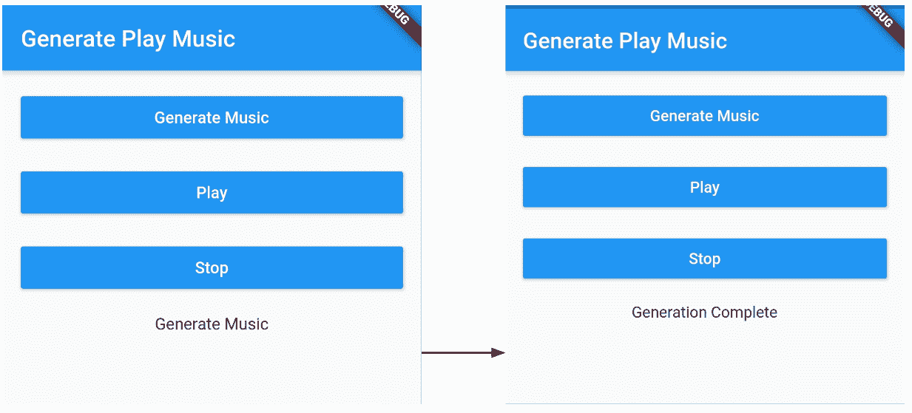

该应用的小部件树如下所示：

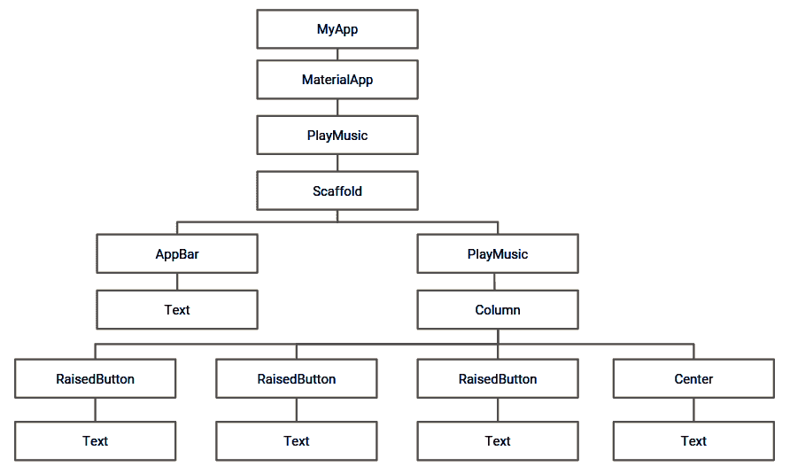

现在开始构建应用的 UI。

# 创建 UI

我们首先创建一个新的 Dart 文件`play_music.dart`和一个有状态的小部件`PlayMusic`。 如前所述，在该文件中，我们将创建三个按钮来执行基本功能。 以下步骤描述了如何创建 UI：

1.  定义`buildGenerateButton()`方法以创建`RaisedButton`变量，该变量将用于生成新的音乐文件：

```py
 Widget buildGenerateButton() {
   return Padding(
     padding: EdgeInsets.only(left: 16, right: 16, top: 16),
     child: RaisedButton(
       child: Text("Generate Music"),
       color: Colors.blue,
       textColor: Colors.white,
     ),
   );
 }
```

在前面定义的函数中，我们创建一个`RaisedButton`，并添加`Generate Music`文本作为子元素。 `color`属性的`Colors.blue`值用于为按钮赋予蓝色。 另外，我们将`textColor`修改为`Colors.white`，以使按钮内的文本为白色。 使用`EdgeInsets.only()`给按钮提供左，右和顶部填充。 在后面的部分中，我们将在按钮上添加`onPressed`属性，以便每次按下按钮时都可以从托管模型中获取新的音乐文件。

2.  定义`buildPlayButton()`方法以播放新生成的音频文件：

```py
Widget buildPlayButton() {
   return Padding(
   padding: EdgeInsets.only(left: 16, right: 16, top: 16),
   child: RaisedButton(
     child: Text("Play"),
     onPressed: () {
       play();
     },
     color: Colors.blue,
     textColor: Colors.white,
     ),
   );
 }
```

在前面定义的函数中，我们创建一个`RaisedButton`，并添加`"Play"`文本作为子元素。 `color`属性的`Colors.blue`值用于为按钮赋予蓝色。 另外，我们将`textColor`修改为`Colors.white`，以使按钮内的文本为白色。 使用`EdgeInsets.only()`给按钮提供左，右和顶部填充。 在后面的部分中，我们将在按钮上添加`onPressed`属性，以在每次按下按钮时播放新生成的音乐文件。

3.  定义`buildStopButton()`方法以停止当前正在播放的音频：

```py
Widget buildStopButton() {
   return Padding(
     padding: EdgeInsets.only(left: 16, right: 16, top: 16),
     child: RaisedButton(
       child: Text("Stop"),
       onPressed: (){
         stop();
       },
       color: Colors.blue,
       textColor: Colors.white,
     )
   );
 }
```

在前面定义的函数中，我们创建一个`RaisedButton`，并添加`"Stop"`文本作为子元素。 `color`属性的`Colors.blue`值用于为按钮赋予蓝色。 另外，我们将`textColor`修改为`Colors.white`，以使按钮内的文本为白色。 使用`EdgeInsets.only()`给按钮提供左，右和顶部填充。 在下一节中，我们将向按钮添加`onPressed`属性，以在按下按钮时停止当前播放的音频。

4.  覆盖`PlayMusicState`中的`build()`方法，以创建先前创建的按钮的`Column`：

```py
 @override
 Widget build(BuildContext context) {
   return Scaffold(
     appBar: AppBar(
       title: Text("Generate Play Music"),
     ),
     body: Column(
       crossAxisAlignment: CrossAxisAlignment.stretch,
       children: <Widget>[
         buildGenerateButton(),
         buildPlayButton(),
         buildStopButton(),
       ],
     )
   );
 }
```

在前面的代码片段中，我们返回`Scaffold`。 它包含一个`AppBar`，其中具有[Generate Play Music]作为`title`。 `Scaffold`的主体是`Column`。 列的子级是我们在上一步中创建的按钮。 通过调用相应方法将按钮添加到该列中。 此外，`crossAxisAlignment`属性设置为`CrossAxisAlignment.stretch`，以便按钮占据父容器（即列）的总宽度。

此时，该应用如下所示：


在下一节中，我们将添加一种在应用中播放音频文件的机制。

# 添加音频播放器

创建应用的用户界面后，我们现在将音频播放器添加到应用中以播放音频文件。 我们将使用`audioplayer`插件添加音频播放器，如下所示：

1.  我们首先将依赖项添加到`pubspec.yaml`文件中：

```py
audioplayers: 0.13.2
```

现在，通过运行`flutter pub get`获得包。

2.  接下来，我们将插件导入`play_music.dart`。

```py
import 'package:audioplayers/audioplayers.dart';
```

3.  然后，在`PlayMusicState`内创建`AudioPlayer`的实例：

```py
AudioPlayer audioPlayer = AudioPlayer();
```

4.  现在，让我们定义一个`play()`方法来播放远程可用的音频文件，如下所示：

```py
play() async {
   var url = 'http://34.70.80.18:8000/download/output_1573917221.mid';
   int result = await audioPlayer.play(url);
   if (result == 1) {
     print('Success');
     }
 }
```

最初，我们将使用存储在`url`变量中的样本音频文件。 通过传递`url`中的值，使用`audioPlayer.play()`播放音频文件。 另外，如果从`url`变量成功访问和播放了音频文件，则结果将存储在结果变量中，其值将为`1`。

5.  现在，将`onPressed`属性添加到`buildPlayButton`内置的播放按钮中，以便每当按下该按钮时就播放音频文件：

```py
Widget buildPlayButton() {
   return Padding(
   padding: EdgeInsets.only(left: 16, right: 16, top: 16),
   child: RaisedButton(
     ....
     onPressed: () {
       play();
     },
     ....
     ),
   );
 }
```

在前面的代码片段中，我们添加`onPressed`属性并调用`play()`方法，以便每当按下按钮时就播放音频文件。

6.  现在，我们将定义`stop()`以停止正在播放的音乐：

```py
void stop() {
   audioPlayer.stop();
 }
```

在`stop()`方法内部，我们只需调用`audioPlayer.stop()`即可停止正在播放的音乐。

7.  最后，我们为`buildStopButton()`中内置的停止按钮添加`onPressed`属性：

```py
 Widget buildStopButton() {
   return Padding(
     padding: EdgeInsets.only(left: 16, right: 16, top: 16),
     child: RaisedButton(
       ....
       onPressed: (){
         stop();
       },
       ....
     )
   );
 }
```

在前面的代码片段中，我们向`onPressed`中的`stop()`添加了一个调用，以便一旦按下停止按钮就停止音频。

现在开始使用 Flutter 应用部署模型。

# 部署模型

在为应用成功添加基本的播放和停止功能之后，现在让我们访问托管模型以每次生成，获取和播放新的音频文件。 以下步骤详细讨论了如何在应用内部访问模型：

1.  首先，我们定义`fetchResponse()`方法来生成和获取新的音频文件：

```py
void fetchResponse() async {
   final response =
     await http.get('http://35.225.134.65:8000/generate');
   if (response.statusCode == 200) {
     var v = json.decode(response.body);
     fileName = v["result"] ;
   } else {
     throw Exception('Failed to load');
   }
 }
```

我们首先使用`http.get()`从 API 获取响应，然后传入托管模型的 URL。 `get()`方法的响应存储在`response`变量中。 `get()`操作完成后，我们使用`response.statusCode`检查状态码。 如果状态值为`200`，则获取成功。 接下来，我们使用`json.decode()`将响应的主体从原始 JSON 转换为`Map<String,dynamic>`，以便可以轻松访问响应主体中包含的键值对。 我们使用`v["result"]`访问新音频文件的值，并将其存储在全局`fileName`变量中。 如果`responseCode`不是`200`，我们只会抛出一个错误。

2.  现在让我们定义`load()`以对`fetchResponse()`进行适当的调用：

```py
void load() {
   fetchResponse();
 }
```

在前面的代码行中，我们仅定义一个`load()`方法，该方法用于调用`fetchResponse()`来获取新生成的音频文件的值。

3.  现在，我们将修改`buildGenerateButton()`中的`onPressed`属性，以每次生成新的音频文件：

```py
Widget buildGenerateButton() {
   return Padding(
     ....
     child: RaisedButton(
       ....
       onPressed: () {
         load();
       },
       ....
     ),
   );
 }
```

根据应用的功能，每当按下生成按钮时，都应生成一个新的音频文件。 这直接意味着无论何时按下“生成”按钮，我们都需要调用 API 以获取新生成的音频文件的名称。 因此，我们修改`buildGenerateButton()`以添加`onPressed`属性，以便每当按下按钮时，它都会调用`load()`，该调用随后将调用`fetchResponse()`并将新音频文件的名称存储在输出中。

4.  托管的音频文件有两个部分，`baseUrl`和`fileName`。 `baseUrl`对于所有调用均保持不变。 因此，我们声明一个存储`baseUrl`的全局字符串变量：

```py
String baseUrl = 'http://34.70.80.18:8000/download/';
```

回想一下，我们已经在“步骤 1”中将新音频文件的名称存储在`fileName`中。

5.  现在，让我们修改`play()`以播放新生成的文件：

```py
play() async {
   var url = baseUrl + fileName;
   AudioPlayer.logEnabled = true;
   int result = await audioPlayer.play(url);
   if (result == 1) {
     print('Success');
     }
 }
```

在前面的代码片段中，我们修改了前面定义的`play()`方法。 我们通过附加`baseUrl`和`fileName`创建一个新的 URL，以便`url`中的值始终与新生成的音频文件相对应。 我们在调用`audioPlayer.play()`时传递 URL 的值。 这样可以确保每次按下播放按钮时，都会播放最新生成的音频文件。

6.  此外，我们添加了`Text`小部件以反映文件生成状态：

```py
 Widget buildLoadingText() {
   return Center(
     child: Padding(
       padding: EdgeInsets.only(top: 16),
       child: Text(loadText)
     )
   );
 }
```

在前面定义的函数中，我们创建了一个简单的`Text`小部件，以反映提取操作正在运行以及何时完成的事实。 `Text`小部件具有顶部填充，并与`Center`对齐。 `loadText`值用于创建窗口小部件。

全局声明该变量，其初始值为`'Generate Music'`：

```py
String loadText = 'Generate Music';
```

7.  更新`build()`方法以添加新的`Text`小部件：

```py
@override
 Widget build(BuildContext context) {
   return Scaffold(
     ....
     body: Column(
       ....
       children: <Widget>[
         buildGenerateButton(),
         ....
         buildLoadingText()
       ],
     )
   );
 }
```

现在，我们更新`build()`方法以添加新创建的`Text`小部件。 该窗口小部件只是作为先前创建的`Column`的子级添加的。

8.  当用户想要生成一个新的文本文件时，并且在进行提取操作时，我们需要更改文本：

```py
void load() {
   setState(() {
    loadText = 'Generating...';
   });
   fetchResponse();
 }
```

在前面的代码段中，`loadText`值设置为`'Generating...'`，以反映正在进行`get()`操作的事实。

9.  最后，获取完成后，我们将更新文本：

```py
void fetchResponse() async {
   final response =
     await http.get('http://35.225.134.65:8000/generate').whenComplete((){
       setState(() {
        loadText = 'Generation Complete';
       });
     });
   ....
 }
```

提取完成后，我们将`loadText`的值更新为`'Generation Complete'`。 这表示应用现在可以播放新生成的文件了。

[可以在此处查看`play_music.dart`的整个代码](https://github.com/PacktPublishing/Mobile-Deep-Learning-Projects/blob/master/Chapter7/flutter_generate_music/lib/play_music.dart)。

在使应用的所有部分正常工作之后，现在让我们通过创建最终的材质应用将所有内容放在一起。

# 创建最终的材质应用

现在创建`main.dart`文件。 该文件包含无状态窗口小部件`MyApp`。 我们重写`build()`方法并将`PlayMusic`设置为其子级：

```py
 @override
 Widget build(BuildContext context) {
   return MaterialApp(
     title: 'Flutter Demo',
     theme: ThemeData(
       primarySwatch: Colors.blue,
     ),
     home: PlayMusic(),
   );
 }
```

在覆盖的`build()`方法中，我们简单地将`home`创建为`PlayMusic()`的`MaterialApp`。

[整个项目可以在这里查看](https://github.com/PacktPublishing/Mobile-Deep-Learning-Projects/tree/master/Chapter7/flutter_generate_music)。

# 总结

在本章中，我们通过将多媒体处理分解为图像，音频和视频处理的核心组件来进行研究，并讨论了一些最常用的处理工具。 我们看到了使用 OpenCV 执行图像或视频处理变得多么容易。 另外，我们看到了一个使用 Magenta 生成鼓音乐的简单示例。 在本章的下半部分，我们介绍了 LSTM 如何与时间序列数据一起使用，并构建了一个 API，该 API 可以从提供的样本文件生成器乐。 最后，我们将此 API 与 Flutter 应用结合使用，该应用是跨平台的，可以同时部署在 Android，iOS 和 Web 上。

在下一章中，我们将研究如何使用**深度强化学习**（**DRL**）来创建可以玩棋盘游戏（例如国际象棋）的智能体。