# 八、基于强化神经网络的国际象棋引擎

在几个在线应用商店以及几乎每个软件商店中，游戏都提供了自己的完整版块。 游戏的重要性和热情不容忽视，这就是为什么全世界的开发人员都在不断尝试开发出更好，更吸引人的游戏的原因。

在流行的棋盘游戏世界中，国际象棋是全世界最有竞争力和最复杂的游戏之一。 已经尝试了一些强大的自动化程序来下棋和与人类竞争。 本章将讨论 DeepMind 的开发人员所使用的方法，他们创建了 Alpha Zero，这是一种自学算法，可以自学下棋，从而能够以一个单打击败市场上当时最好的国际象棋 AI，Stockfish 8。 在短短 24 小时的训练中得分较高。

在本章中，我们将介绍您需要理解的概念，以便构建这种深度强化学习算法，然后构建示例项目。 请注意，该项目将要求您具有 Python 和机器学习的丰富知识。

我们将在本章介绍以下主题：

*   强化学习导论
*   手机游戏中的强化学习
*   探索 Google 的 DeepMind
*   适用于 Connect 4 的 Alpha 类零 AI
*   基础项目架构
*   为国际象棋引擎开发 GCP 托管的 REST API
*   在 Android 上创建简单的国际象棋 UI
*   将国际象棋引擎 API 与 UI 集成

让我们从讨论增强学习智能体在手机游戏中的用法和普及程度开始。

# 强化学习导论

在过去的几年中，强化学习已成为机器学习研究人员中一个重要的研究领域。 人们越来越多地使用它来构建能够在任何给定环境中表现更好的智能体，以寻求对他们所执行行为的更好回报。 简而言之，这为我们提供了强化学习的定义–在人工智能领域，这是一种算法，旨在创建虚拟的**智能体**，它可在任何给定条件下，在**环境**中执行**动作**，在执行一系列动作后，取得最佳的**奖励**。

让我们尝试通过定义与通用强化学习算法关联的变量来赋予此定义更多的结构：

*   **智能体**：执行动作的虚拟实体。 是替换游戏/软件的指定用户的实体。
*   **操作**（`a`）：智能体可以执行的可能操作。
*   **环境**（`e`）：在软件/游戏中可用的一组场景。
*   **状态**（`S`）：所有方案的集合，以及其中可用的配置。
*   **奖励**（`R`）：对于智能体执行的任何操作返回的值，然后智能体尝试将其最大化。
*   **策略**（`π`）：智能体用来确定接下来必须执行哪些操作的策略。
*   **值**（`V`）：`R`是短期每动作奖励，而值是在一组动作结束时预期的总奖励。`V[π](s)`通过遵循状态`S`下的策略`π`来定义预期的总回报。

下图显示了该算法的流程：

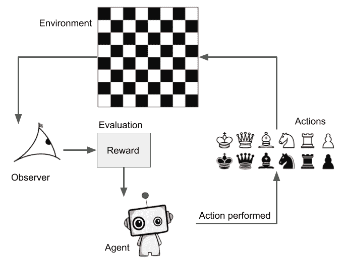

尽管我们在前面的定义列表中没有提到观察者，但必须有观察者或评估者才能产生奖励。 有时，观察者本身可能是一个复杂的软件，但是通常，这是一个简单的评估函数或指标。

要获得关于强化学习的更详细的想法，您可以阅读[这个页面](https://en.wikipedia.org/wiki/Reinforcement_learning)上的 Wikipedia 文章。 有关正在使用的强化学习智能体的快速样本，[请阅读以下 DataCamp 文章](https://www.datacamp.com/community/tutorials/introduction-reinforcement-learning)。

在下一部分中，我们将学习强化学习在手机游戏中的地位。

# 手机游戏中的强化学习

出于各种原因而希望构建具有游戏性的 AI 的开发人员中，强化学习已变得越来越流行-只需检查 AI 的功能，建立可以帮助专业人士改善游戏水平的训练智能体等等。 从研究人员的角度来看，游戏为强化学习智能体提供了最佳的测试环境，可以根据经验做出决策并学习在任何给定环境中的生存/成就。 这是因为可以使用简单而精确的规则设计游戏，从而可以准确预测环境对特定动作的反应。 这使得更容易评估强化学习智能体的表现，从而为 AI 提供良好的训练基础。 考虑到在玩游戏的 AI 方面的突破，也有人表示，我们向通用 AI 的发展速度比预期的要快。 但是强化学习概念如何映射到游戏？

让我们考虑一个简单的游戏，例如井字棋。 另外，如果您觉得古怪，只需使用 Google 搜索*井字棋*，您就会在搜索结果中看到一个游戏！

考虑您正在用计算机玩井字棋。 这里的计算机是智能体。 在这种情况下，环境是什么？ 您猜对了–井字棋板以及在环境中管理游戏的一组规则。 井字棋盘上已经放置的标记可以确定环境所在的状态。座席可以在棋盘上放置的`X`或`O`是他们可以执行的动作，即输掉，赢得比赛或平局。 或朝着损失，胜利或平局前进是他们执行任何行动后回馈给智能体的奖励。 智能体赢得比赛所遵循的策略是遵循的策略。

因此，从该示例可以得出结论，强化学习智能体非常适合构建学习玩任何游戏的 AI。 这导致许多开发人员想出了象围棋，跳棋，反恐精英等国际象棋以外的几种流行游戏的游戏 AI。 甚至 Chrome Dino 之类的游戏也发现开发人员试图使用 AI 进行游戏。

在下一部分中，我们将简要概述 Google 的 DeepMind，它是游戏 AI 制造商领域中最受欢迎的公司之一。

# 探索 Google 的 DeepMind

当您谈论自学习人工智能的发展时，DeepMind 可能是最著名的名称之一，这是由于它们在该领域的开创性研究和成就。 自 2015 年 Google 重组以来，DeepMind 在 2014 年被 Google 收购，目前是 Alphabet 的全资子公司。DeepMind 最著名的作品包括 AlphaGo 及其继任者 Alpha Zero。 让我们更深入地讨论这些项目，并尝试了解是什么使它们在当今如此重要。

# AlphaGo

2015 年，AlphaGo 成为第一个在`19x19`棋盘上击败职业围棋选手 Lee Sedol 的计算机软件。 突破被记录下来并作为纪录片发行。 击败李·塞多尔的影响如此之大，以至于韩国 Baduk 协会授予了荣誉 9 丹证书，这实际上意味着围棋选手的游戏技能与神性息息相关。 这是围棋历史上第一次提供 9 荣誉荣誉证书，因此提供给 AlphaGo 的证书编号为 001。ELO 等级为 3,739。

AlphaGo Master 的继任者 AlphaGo Master 在三场比赛中击败了当时统治世界的游戏冠军 Ke Jie。 为了表彰这一壮举，它获得了中国围棋协会颁发的 9 丹证书。 该软件当时的 ELO 等级为 4,858。

但是，这两款软件都被其继任者 AlphaGo Zero 压倒了，后者在 3 天的自学式学习中，能够在 21 分之后以 100：0 的游戏得分击败 AlphaGo，在 89:11 的游戏得分下击败 AlphaGo Master。 天的训练。 40 天后，它的 ELO 评分达到了 5,185，超过了以前所有 Go AI 的技能。

AlphaGo 基于蒙特卡洛树搜索算法，并采用了对生成的和人类玩家游戏日志进行的深度学习。 该模型的初始训练是通过人类游戏进行的。 然后，计算机将与自己对战并尝试改善其游戏性。 树搜索将被设置为一定的深度，以避免巨大的计算开销，在这种开销下，计算机将尝试达到所有可能的动作，然后再进行任何动作。

总而言之，遵循以下过程：

1.  最初，该模型将在人类游戏日志上进行训练。
2.  一旦在基线上进行了训练，计算机将使用在先前步骤中训练过的模型与自己竞争，并使用有上限的蒙特卡洛树搜索来确保进行移动而不会长时间停滞该软件。 这些游戏的日志已生成。
3.  然后对生成的游戏进行了训练，从而改善了整体模型。

现在，让我们讨论 Alpha Zero。

# Alpha Zero 

Alpha Zero 是 AlphaGo Zero 的后继产品，它是对算法进行泛化的尝试，以便也可以用于其他棋盘游戏。 Alpha Zero 经过训练可以下棋，将棋（类似于棋的日式游戏）和围棋，其表现与相应游戏的现有 AI 相当。 经过 34 小时的训练，Alpha Zero for Go 击败了经过 3 天训练的 AlphaGo Zero，得分为 60:40。 这导致 ELO 等级为 4,430。

经过约 9 个小时的训练，Alpha Zero 击败了 TCEC 竞赛 2016 年冠军的 Stockfish 8。 因此，它仍然是迄今为止最强大的国际象棋 AI，尽管有人声称最新版本的 Stockfish 将能够击败它。

AlphaGo Zero 和 Alpha Zero 变体之间的主要区别如下：

*   **出现平局的可能性**：在围棋中，保证有一名选手获胜，而对于象棋则不是这样。 因此，对 Alpha Zero 进行了修改，以允许并列游戏。
*   **对称性**：AlphaGo Zero 利用了电路板的对称性。 但是，由于国际象棋不是非对称游戏，因此必须对 Alpha Zero 进行修改以使其工作。
*   **硬编码的超参数搜索**：Alpha Zero 具有用于超参数搜索的硬编码规则。
*   在 Alpha Zero 的情况下，神经网络会不断更新。

此时，您可能会想，“什么是蒙特卡罗树搜索？”。 让我们尝试回答这个问题！

# 蒙特卡洛树搜索

当我们谈论象棋，围棋或井字棋等基于当前场景的战略游戏时，我们所谈论的是大量可能的场景和可以在任何情况下在其中的给定点执行的动作。 尽管对于井字棋等较小的游戏，可能的状态和动作的数量在现代计算机可以计算的范围内，但对于游戏可以生成的状态数量，更复杂的游戏（如国际象棋和围棋）呈指数增长。

蒙特卡洛树搜索尝试找到在给定环境下赢得任何游戏或获得更好奖励所需要的正确动作序列。 之所以将其称为**树搜索**是因为它创建了游戏中所有可能状态的树，并通过创建每个状态的分支来实现其中的所有可能动作。 表示为树中的节点。

让我们考虑以下简单的游戏示例。 假设您正在玩一个游戏，要求您猜一个三位数的数字，每个猜中都有一个相关的奖励。 可能的数字范围是 1 到 5，您可以猜测的次数是 3。 如果您做出准确的猜测，即正确猜测任意给定位置的数字，则将获得 5 分。但是，如果您做出错误的猜测，将得到正确数字两边的线性差值的分数。

例如，如果要猜测的数字是 2，则可能获得以下奖励分数：

*   如果您猜 1，则得分为 4
*   如果您猜 2，则得分为 5
*   如果您猜 3，则得分为 4
*   如果您猜 4，则得分为 3
*   如果您猜 5，则得分为 2

因此，游戏中的最佳总得分为 15，即每个正确的猜测为 5 分。 鉴于此，您可以在每个步骤中的五个选项中进行选择，游戏中可能的状态总数为`5 * 5 * 5 = 125`，只有一个状态会给出最佳分数。

让我们尝试在树上描绘前面的游戏。 假设您要猜测的数字是 413。在第一步中，您将具有以下树：

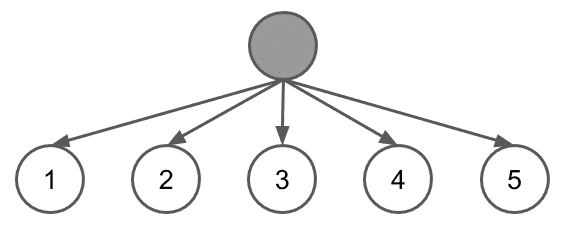

做出选择后，您将获得奖励，再次有五个选项可供选择-换句话说，每个节点中有五个分支可以遍历。 在最佳游戏玩法中，将获得以下树：

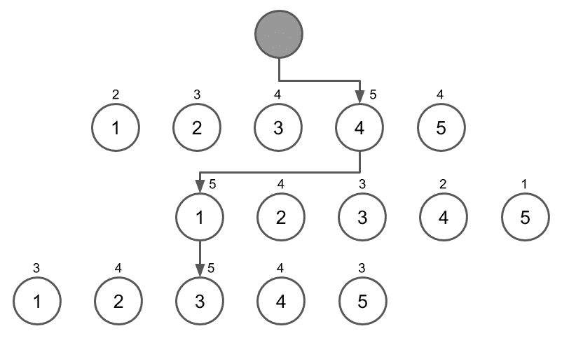

现在，让我们考虑以下事实：围棋游戏共有`3^361`个可能状态。 在 AI 采取行动之前尝试计算每种可能性变得不切实际。 这是蒙特卡罗树搜索与上限可信度算法相结合的地方，它比其他方法更具优势，因为它可以终止到任何搜索深度，并且可以产生趋向于最佳分数的结果。 因此，算法不需要遍历树的每个分支。 一旦树形搜索算法意识到任何特定分支的表现不佳，就可以停止沿该路径前进，而专注于表现更好的路径。 而且，它可以尽早终止任何路径并在该点返回预期的回报，从而可以调整 AI 采取任何行动所需的时间。

更确切地说，蒙特卡罗树搜索遵循以下步骤：

1.  **选择**：从树的当前节点中选择最佳回报分支。 例如，在前面的游戏树中，选择除 4 以外的任何分支将产生较低的分数，因此选择了 4。

2.  **扩展**：一旦选择了最佳回报节点，该节点下的树将进一步扩展，从而创建具有该节点可用的所有可能选项（分支）的节点。 这可以理解为从游戏的任何位置布局 AI 的未来动作。
3.  **模拟**：现在，由于事先不知道在扩展阶段创建的哪个未来选项最有回报，因此我们使用强化学习逐个模拟游戏的每个选项。 请注意，与上限可信度上限算法结合使用时，直到结束游戏才算重要。 计算任何`n`个步骤的奖励也是一种不错的方法。
4.  **更新**：最后，更新节点和父节点的奖励分数。 尽管不可能回到游戏中，并且由于任何节点的值都已减小，但如果在以后的游戏中的那个阶段找到了更好的替代方案，那么 AI 将不会遵循这条路径，从而通过多次迭代来改善其游戏玩法。

接下来，我们将构建一个系统，该系统的工作原理类似于 Alpha Zero，并尝试学习玩 Connect 4 游戏，该游戏比 Tic-Tac-Toe 游戏要复杂得多，但对我们来说足够大，来解释如何构建类似的国际象棋引擎。

# 适用于 Connect 4 的类似 Alpha Zero 的 AI

在开始研究可玩 Connect4 的 AI 之前，让我们简要了解一下游戏及其动态。 Connect 4，有时也称为连续四人，连续四人，四人以上，等等，是全世界儿童中最受欢迎的棋盘游戏之一。 我们也可以将它理解为井字棋的更高级版本，在其中您必须水平，垂直或对角放置三个相同类型的标记。 棋盘通常是一个`6x7`的网格，两个玩家各自玩一个标记。

Connect 4 的规则可能会有所不同，因此让我们为 AI 将学习的规则版本制定一些具体规则：

*   该游戏被模拟为在具有七个空心列和六行的垂直板上玩。 每列在板的顶部都有一个开口，可以在其中插入片段。可以查看已放入板的片段。
*   两位玩家都有 21 个形状像不同颜色硬币的硬币。
*   将硬币放在板上构成一个动作。
*   碎片从顶部的开口下降到最后一行，或者堆积在该列的最后一块。
*   第一个以任意方向连接其任意四枚硬币的玩家，因此彼此之间不会存在任何间隙或其他玩家的硬币获胜。

现在，让我们分解将 Connect 4 播放式自学 AI 分解为子问题的问题：

1.  首先，我们需要创建棋盘的虚拟表示。
2.  接下来，我们必须创建允许根据游戏规则移动的函数。
3.  然后，为了保存游戏状态，我们需要一个状态管理系统。
4.  接下来，我们将简化游戏玩法，其中将提示用户进行移动并宣布游戏终止。
5.  之后，我们必须创建一个脚本，该脚本可以生成示例游戏玩法，供系统学习。
6.  然后，我们必须创建训练函数来训练系统。
7.  接下来，我们需要**蒙特卡洛树搜索**（**MCTS**）实现。
8.  最后，我们需要一个神经网络的实现。
9.  除了前面的具体步骤之外，我们还需要为系统创建许多驱动脚本以使其更加可用。

让我们依次移至前面的要点，一次覆盖系统的每个部分。 但是，首先，我们将快速浏览该项目中存在的目录结构和文件，[这在本书的 GitHub 存储库中也可以找到](https://github.com/PacktPublishing/Mobile-Deep-Learning-Projects/tree/master/Chapter8/connect4)。 让我们来看看：

*   `command/`：
*   `__init__.py`：此文件使我们可以将此文件夹用作模块。
*   `arena.py`：此文件获取并解析用于运行游戏的命令。
*   `generate.py`：此文件接受并分析自玩招式生成系统的命令。
*   `newmodel.py`：此文件用于为智能体创建新的空白模型。
*   `train.py`：此文件用于训练基于增强学习的神经网络如何玩游戏。
*   `util/`：
*   `__init__.py`：此文件使我们可以将此文件夹用作模块。
*   `arena.py`：此文件创建并维护玩家之间进行的比赛的记录，并允许我们在轮到谁之间切换。
*   `compat.py`：此文件是用于使程序与 Python 2 和 Python 3 兼容的便捷工具。如果您确定正在开发的版本并希望在其上运行，则可以跳过此文件。
*   `generate.py`：此文件播放一些随机移动的游戏，再加上 MCTS 移动，以生成可用于训练目的的游戏日志。 该文件存储每个游戏的获胜者以及玩家做出的动作。
*   `internal.py`：此文件创建棋盘的虚拟表示并定义与棋盘相关的函数，例如将棋子放置在棋盘上，寻找获胜者或只是创建新棋盘。
*   `keras_model.py`：此文件定义充当智能体大脑的模型。 在本项目的后面，我们将更深入地讨论该文件。
*   `mcts.py`：此文件提供 MCTS 类，该类实质上是蒙特卡罗树搜索的实现。
*   `nn.py`：此文件提供 NN 类，它是神经网络的实现，以及与神经网络相关的函数，例如拟合，预测，保存等。
*   `player.py`：此文件为两种类型的播放器提供了类-MCTS 播放器和人工播放器。 MCTS 玩家是我们将训练的智能体，以玩游戏。
*   `state.py`：这是`internal.py`文件的包装，提供了用于访问电路板和与电路板相关的函数的类。
*   `trainer.py`：这使我们可以训练模型。 这与`nn.py`中提供的内容不同，因为它更专注于涵盖游戏的训练过程，而`nn.py`中的内容主要是围绕此功能的包装。

接下来，我们将继续探索这些文件中每个文件的一些重要部分，同时遵循我们先前为构建 AI 制定的步骤。

# 创建棋盘的虚拟表示

您将如何代表 Connect 4 棋盘？ 代表 Connect 4 棋盘的两种常用方法以及游戏状态。 让我们来看看：

*   **人类可读的长格式**：在这种形式中，木板的行和列分别显示在 x 和 y 轴上，并且两个玩家的标记都显示为`x`和`o`， 分别（或任何其他合适的字符）。 可能如下所示：

```py
  |1 2 3 4 5 6 7 
--+--------------
 1|. . . . . . .
 2|. . . . . . .
 3|. . . . . . .
 4|. . . . o x .
 5|x o x . o o .
 6|o x x o x x o
```

但是，这种形式有点冗长并且在计算上不是很友好。

*   **计算有效的形式**：在此形式中，我们将板存储为 2D NumPy 数组：

```py
array([[1, 1, 0, 0, 0, 0, 0],
       [0, 0, 0, 0, 0, 0, 0],
       [0, 0, 0, 0, 0, 0, 0],
       [0, 0, 0, 0, 0, 0, 0],
       [0, 0, 0, 0, 1, 0, 0],
       [0, 0, 0, 0, 0, 0, 0]], dtype=int8)
```

以这种方式创建该数组，当将其展平为一维数组时，板位置按顺序排列，就好像该数组实际上是一维数组一样。 前两个位置分别编号为 0 和 1，而第 5 个位置位于第 5 行和第 5 列，编号为 32。通过将前一个代码块中的矩阵与给定的表进行映射，可以轻松理解此条件。 在下图中：

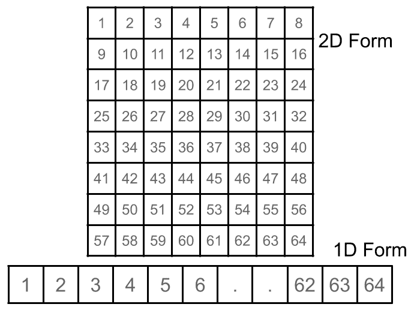

这种形式适合于进行计算，但不适合玩家在游戏过程中观看，因为对于玩家而言很难解密。

*   一旦决定了如何表示电路板及其部件，就可以开始在`util/internal.py`文件中编写代码，如下所示：

```py
BOARD_SIZE_W = 7
BOARD_SIZE_H = 6
KEY_SIZE = BOARD_SIZE_W * BOARD_SIZE_H
```

前几行设置了板子的常数，在这种情况下，是板子上的行数和列数。 我们还通过将它们相乘来计算板上的按键或位置的数量。

*   现在，让我们准备在板上生成获胜位置的代码，如下所示：

```py
LIST4 = []
LIST4 += [[(y, x), (y + 1, x + 1), (y + 2, x + 2), (y + 3, x + 3)] for y in range(BOARD_SIZE_H - 3) for x in range(BOARD_SIZE_W - 3)]
LIST4 += [[(y, x + 3), (y + 1, x + 2), (y + 2, x + 1), (y + 3, x)] for y in range(BOARD_SIZE_H - 3) for x in range(BOARD_SIZE_W - 3)]
LIST4 += [[(y, x), (y, x + 1), (y, x + 2), (y, x + 3)] for y in range(BOARD_SIZE_H) for x in range(BOARD_SIZE_W - 3)]
NO_HORIZONTAL = len(LIST4)
LIST4 += [[(y, x), (y + 1, x), (y + 2, x), (y + 3, x)] for y in range(BOARD_SIZE_H - 3) for x in range(BOARD_SIZE_W)]
```

`LIST4`变量存储任何玩家赢得比赛时可以实现的可能组合。

我们不会在此文件中讨论整个代码。 但是，重要的是要了解以下函数及其作用：

*   `get_start_board()`：此函数以 NumPy 数组的形式返回电路板的空白 2D 数组表示形式。
*   `clone_board(board)`：此函数用于按板级克隆整个 NumPy 数组。
*   `get_action(board)`：此函数返回播放器已修改的数组中的位置。
*   `action_to_string(action)`：此函数将玩家执行的动作的内部数字表示形式转换为可以以易于理解的形式显示给用户的字符串。 例如`place_at(board, pos,`。
*   `player)`：执行为任何给定玩家在板上放置一块棋子的动作。 它还会更新板。
*   `def get_winner(board)`：此函数确定棋盘当前状态下的游戏是否有赢家。 如果是，则返回获胜玩家的标识符，该标识符将为 1 或 -1。
*   `def to_string(board)`：此函数将板的 NumPy 数组表示形式转换为字符串，该字符串为人类可读的格式。

接下来，我们将研究如何对 AI 进行编程，使其根据游戏规则进行并仅接受有效的动作。

# 允许根据游戏规则移动

为了确定玩家（无论是人还是机器）做出的动作的有效性，我们需要建立一种机制，在机器的情况下，该机制连续不断地只生成有效的动作，或者不断验证任何人类玩家的输入。 让我们开始吧：

1.  可以在`util/generator.py`文件的`_selfplay(self, state, args)`函数中找到一个这样的实例，如以下代码所示：

```py
turn = 0
hard_random_turn = args['hard_random'] if 'hard_random' in args else 0
soft_random_turn = (args['soft_random'] if 'soft_random' in args else 30) + hard_random_turn
history = []
```

首先，我们将移动切换设置为`0`，指示游戏开始时尚未进行任何移动。 我们还考虑了用户在其 AI 自行生成的游戏中想要的硬性和软性随机回合的数量。 然后，我们将移动的历史记录设置为空白。

2.  现在，我们可以开始为 AI 生成动作，如下所示：

```py
while state.getWinner() == None:
    if turn < hard_random_turn:
        # random action
        action_list = state.getAction()
        index = np.random.choice(len(action_list))
        (action, key) = action_list[index]
```

前面的代码说，直到没有游戏的获胜者，都必须生成招式。 在前面的案例中，我们可以看到，只要进行一次随机随机转弯的可能性为真，AI 就会选择一个完全随机的位置来放置其棋子。

3.  通过在前面的`if`语句中添加`else`块，我们告诉 AI，只要它需要进行柔和转弯，它就可以检查是否有任何随机位置将其放置在其中，但只能在 MCTS 算法所建议的移动范围内，如下所示：

```py
else:
    action_list = self.mcts.getActionInfo(state, args['simulation'])
    if turn < soft_random_turn:
        # random action by visited count
        visited = [1.0 * a.visited for a in action_list]
        sum_visited = sum(visited)
        assert(sum_visited > 0)
        p = [v / sum_visited for v in visited]
        index = np.random.choice(len(action_list), p = p)
    else:
        # select most visited count
        index = np.argmax([a.visited for a in action_list])
```

请注意，如果既不进行硬转弯也不进行软转弯，则坐席会在游戏的那一刻进行最常用的动作，这有望使它朝着胜利迈进。

因此，在非人类玩家的情况下，智能体只能在任何给定阶段在一组填充的有效动作之间进行选择。 对于人类玩家而言，情况并非如此，根据他们的创造力，他有可能尝试做出无效的举动。 因此，当人类玩家做出动作时，需要对其进行验证。

4.  可以在`util/player.py`文件的`getNextAction(self, state)`函数中找到验证人类玩家移动的方法，如下所示：

```py
action = state.getAction()
available_x = []
for i in range(len(action)):
    a, k = action[i]
    x = a % util.BOARD_SIZE_W + 1
    y = a // util.BOARD_SIZE_W + 1
    print('{} - {},{}'.format(x, x, y))
    available_x.append(x)
```

5.  首先，我们现在计算人类玩家可能采取的合法行动，并将其显示给用户。 然后，我们提示用户输入一个动作，直到他们做出有效的动作为止，如下所示：

```py
while True:
    try:
        x = int(compat_input('enter x: '))
        if x in available_x:
            for i in range(len(action)):
                if available_x[i] == x:
                    select = i
                    break
            break
    except ValueError:
        pass
```

因此，我们根据填充的一组有效动作来验证用户所做的动作。 我们还可以选择向用户显示错误。

接下来，我们将研究程序的状态管理系统，您肯定已经注意到，到目前为止，我们一直在看该代码。

# 状态管理系统

游戏的状态管理系统是整个程序中最重要的部分之一，因为它控制着所有的游戏玩法，并在 AI 的自学习过程中促进了游戏玩法。 这样可以确保向玩家展示棋盘，并在进行有效的移动。 它还存储了几个与状态有关的变量，这些变量对于游戏进行很有用。 让我们来看看：

1.  让我们讨论`util/state.py`文件中提供的`State`类中最重要的特性和函数：

```py
import .internal as util
```

此类使用`util/internal.py`文件中定义的名称为`util`的变量和函数。

2.  `__init__(self, prototype = None)`：此类在启动时，会继承现有状态或创建新状态。 该函数的定义如下：

```py
def __init__(self, prototype = None):
    if prototype == None:
        self.board = util.get_start_board()
        self.currentPlayer = 1
        self.winner = None
    else:
        self.board = util.clone_board(prototype.board)
        self.currentPlayer = prototype.currentPlayer
        self.winner = prototype.winner
```

在这里，您可以看到该类可以使用游戏的现有状态启动，并作为参数传递给该类的构造器； 否则，该类将创建一个新的游戏状态。

3.  `getRepresentativeString(self)`：此函数返回可以由人类玩家读取的游戏状态的格式正确的字符串表示形式。 其定义如下：

```py
def getRepresentativeString(self):
        return ('x|' if self.currentPlayer > 0 else 'o|') + util.to_oneline(self.board)
```

状态类中的许多其他重要方法如下：

*   `getCurrentPlayer(self)`：此方法返回游戏的当前玩家； 也就是说，应该采取行动的玩家。
*   `getWinner(self)`：如果游戏结束，则此方法返回游戏获胜者的标识符。
*   `getAction(self)`：此方法检查游戏是否结束。 如果没有，它将在任何给定状态下返回一组下一个可能的动作。
*   `getNextState(self, action)`：此方法返回游戏的下一个状态； 也就是说，在将当前正在移动的棋子放在棋盘上并评估游戏是否结束之后，它将执行从一种状态到另一种状态的切换。
*   `getNnInput(self)`：此方法返回玩家到目前为止在游戏中执行的动作，并为每个玩家的动作使用不同的标记。

现在，让我们看一下如何改善程序的游戏玩法。

# 实现游戏玩法

负责控制程序中游戏玩法的文件是`util/arena.py`文件。

它在`Arena`类中定义了以下两种方法：

```py
def fight(self, state, p1, p2, count):
    stats = [0, 0, 0]
    for i in range(count):
        print('==== EPS #{} ===='.format(i + 1))
        winner = self._fight(state, p1, p2)
        stats[winner + 1] += 1
        print('stats', stats[::-1])
        winner = self._fight(state, p2, p1)
        stats[winner * -1 + 1] += 1
        print('stats', stats[::-1])
```

前面的`fight()`函数管理玩家的胜利/损失或平局的状态。 它确保在每个回合中进行两场比赛，其中每位玩家只能先玩一次。

此类中定义的另一个`_fight()`函数如下：

```py
def _fight(self, state, p1, p2):
    while state.getWinner() == None:
        print(state)
        if state.getCurrentPlayer() > 0:
            action = p1.getNextAction(state)
        else:
            action = p2.getNextAction(state)
        state = state.getNextState(action)
    print(state)
    return state.getWinner()
```

此函数负责切换棋盘上的玩家，直到找到赢家为止。

现在，让我们看一下如何生成随机的游戏玩法以使智能体自学。

# 生成示例游戏

到目前为止，我们已经讨论了`util/gameplay.py`文件，以演示该文件中与移动规则相关的代码-特别是该文件的自播放函数。 现在，我们来看看这些自玩游戏如何在迭代中运行以生成完整的游戏玩法日志。 让我们开始吧：

1.  请考虑此文件提供的`Generator`类的`generate()`方法的代码：

```py
def generate(self, state, nn, cb, args):
    self.mcts = MCTS(nn)

    iterator = range(args['selfplay'])
    if args['progress']:
        from tqdm import tqdm
        iterator = tqdm(iterator, ncols = 50)

    # self play
    for pi in iterator:
        result = self._selfplay(state, args)
        if cb != None:
            cb(result)
```

本质上，此函数负责运行该类的`_selfplay()`函数，并确定一旦完成自播放后必须执行的操作。 在大多数情况下，您会将输出保存到文件中，然后将其用于训练。

2.  这已在`command/generate.py`文件中定义。 该脚本可以作为具有以下签名的命令运行：

```py
usage: run.py generate [-h]
             [--model, default='latest.h5', help='model filename']
             [--number, default=1000000, help='number of generated states']
             [--simulation, default=100, help='number of simulations per move']
             [--hard, default=0, help='number of random moves']
             [--soft, default=1000, help='number of random moves that depends on visited node count']
             [--progress, help='show progress bar']
             [--gpu, help='gpu memory fraction']
             [--file, help='save to a file']
             [--network, help='save to remote server']
```

3.  该命令的示例调用如下：

```py
python run.py generate --model model.h5 --simulation 100 -n 5000 --file selfplay.txt --progress
```

现在，让我们看一下一旦生成自播放日志就可以训练模型的函数。

# 系统训练

要训​​练智能体，我们需要创建`util/trainer.py`文件，该文件提供`train()`函数。 让我们来看看：

1.  签名如下：

```py
train(state, nn, filename, args = {})
```

该函数接受`State`类，神经网络类和其他参数。 它还接受文件名，该文件名是包含生成的游戏玩法的文件的路径。 训练后，我们可以选择将输出保存到另一个模型文件中，如`command/train.py`文件的`train()`函数所提供的。

2.  此命令具有以下签名：

```py
usage: run.py train [-h]
              [--progress, help='show progress bar']
              [--epoch EPOCH, help='training epochs']
              [--batch BATCH, help='batch size']
              [--block BLOCK, help='block size']
              [--gpu GPU, help='gpu memory fraction']
              history, help='history file'
              input, help='input model file name'
              output, help='output model file name'
```

历史参数是存储生成的游戏玩法的文件。 输入文件是当前保存的模型文件，而输出文件是将新训练的模型保存到的文件。

3.  该命令的示例调用如下：

```py
python run.py train selfplay.txt model.h5 newmodel.h5 --epoch 3 --progress
```

现在我们已经有了一个训练系统，我们需要创建 MCTS 和神经网络实现。

# 实现蒙特卡罗树搜索

`util/mcts.py`文件中提供了完整的 MCTS 算法实现。 该文件提供了 MCTS 类，该类具有以下重要函数：

*   `getMostVisitedAction`：此函数返回将状态传递给访问次数最多的操作。
*   `getActionInfo`：执行任何操作后，此函数返回状态信息。
*   `_simulation`：此函数执行单个游戏模拟，并返回有关在模拟过程中玩过的游戏的信息。

最后，我们需要创建一个神经网络实现。

# 实现神经网络

在最后一节中，我们将了解为智能体进行训练而创建的神经网络。 我们将探索`util/nn.py`文件，该文件提供`NN`类以及以下重要方法：

*   `__init__(self, filename)`：如果磁盘上不存在此函数，则使用`util/keras_model.py`函数创建新模型。 否则，它将模型文件加载到程序中。
*   `util/keras_model.py`文件中定义的模型是残差 CNN，它与 MCTS 和 UCT 结合使用，表现得像深度强化学习神经网络。 形成的模型具有以下配置：

```py
input_dim: (2, util.BOARD_SIZE_H, util.BOARD_SIZE_W),
policy_dim: util.KEY_SIZE,
res_layer_num: 5,
cnn_filter_num: 64,
cnn_filter_size: 5,
l2_reg: 1e-4,
learning_rate: 0.003,
momentum: 0.9
```

默认情况下，模型具有五个残差卷积层块。 我们先前在`util/internal.py`文件中定义了`BOARD_SIZE_H`，`BOARD_SIZE_W`和`KEY_SIZE`常量：

*   `save(self, filename)`：此函数将模型保存到提供的文件名中。
*   `predict(self, x)`：提供了板状态以及已经进行的移动，此函数输出可以下一步进行的单个移动。
*   `fit(self, x, policy, value, batch_size = 256, epochs = 1)`：此函数用于将新样本拟合到模型并更新权重。

除了上述脚本之外，我们还需要一些驱动脚本。 您可以在该项目的存储库中查找它们，以了解它们的用法。

要运行已完成的项目，您需要执行以下步骤：

1.  使用以下命令创建新模型：

```py
python run.py newmodel model.h5
```

这将创建一个新模型并打印出其摘要。

2.  生成示例游戏日志：

```py
python run.py generate --model model.h5 --simulation 100 -n 5000 --file selfplay.txt --progress
```

在仿真过程中，上一行为 MCTS 生成了 5,000 个示例游戏，深度为 100。

3.  训练模型：

```py
python run.py train selfplay.txt model.h5 newmodel.h5 --epoch 3 --progress
```

前面的命令在游戏文件上训练模型三个时间，并将训练后的模型另存为`newmodel.h5`。

4.  与 AI 对抗：

```py
python run.py arena human mcts,newmodel.h5,100
```

前面的命令开始与 AI 进行游戏。 在这里，您将在终端中看到一个面板和游戏选项，如下所示：

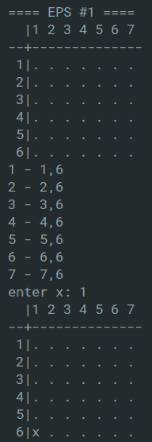

现在，我们已经成功创建了一个基于 Alpha Zero 的程序来学习玩棋盘游戏，现在我们可以将其推论到国际象棋 AI 上了。 但是，在这样做之前，我们将简要地介绍项目架构。

# 基础项目架构

为了创建国际象棋引擎，将其作为 REST API 托管在 GCP 上，我们将遵循常规项目架构：

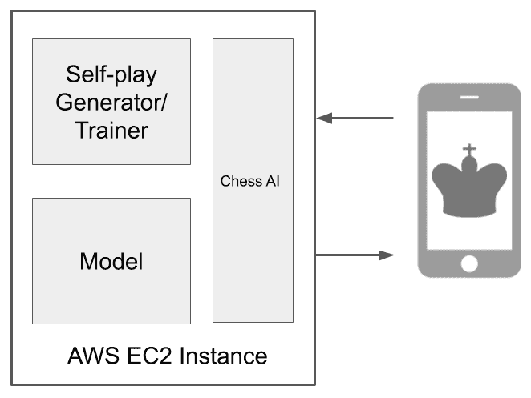

虽然上图提供了该项目的非常简化的概述，但它可以用于更复杂的系统，这些系统可以产生更好的自学习象棋引擎。

GCP 上托管的模型将放置在 EC2 VM 实例中，并将包装在基于 Flask 的 REST API 中。

# 为国际象棋引擎开发 GCP 托管的 REST API

现在我们已经看到了如何继续进行此项目，我们还需要讨论如何将 Connect 4 的游戏映射到国际象棋，以及如何将国际象棋 RL 引擎部署为 API。

您可以在[这个页面](https://github.com/PacktPublishing/Mobile-Deep-Learning-Projects/tree/master/Chapter8/chess)上找到我们为该象棋引擎创建的文件。 在将这些文件与 Connect 4 项目中的文件映射之前，让我们快速了解一些最重要的文件：

*   `src/chess_zero/agent/`：
*   `player_chess.py`：此文件描述`ChessPlayer`类，该类保存有关在任何时间点玩游戏的玩家的信息。 它为与使用蒙特卡洛树搜索来搜索新动作，更改玩家状态以及每个用户在玩游戏期间所需的其他功能的相关方法提供了包装。
*   `model_chess.py`：此文件描述了此系统中使用的剩余 CNN。
*   `src/chess_zero/config/`：
*   `mini.py`：此文件定义国际象棋引擎学习或玩的配置。 您将需要在此处有时调整这些参数，以降低在低端计算机上进行训练期间的批量大小或虚拟 RAM 消耗。
*   `src/chess_zero/env/`：
*   `chess_env.py`：此文件描述棋盘的设置，游戏规则以及执行游戏操作所需的函数。 它还包含检查游戏状态和验证移动的方法。
*   `src/chess_zero/worker/`：
*   `evaluate.py`：此文件负责与当前最佳模型和下一代模型玩游戏。 如果下一代模型的表现优于 100 款游戏，则它将替代以前的模型。
*   `optimize.py`：此文件加载当前最佳模型，并在其上执行更多监督的基于学习的训练。
*   `self.py`：引擎与自己对战并学习新的游戏玩法。
*   `sl.py`：监督学习的缩写，此文件将来自其他玩家的游戏的 PGN 文件作为输入，并对其进行监督学习。
*   `src/chess_zero/play_game/`：
*   `uci.py`：此文件提供了**通用国际象棋界面**（**UCI**）标准环境，可以与引擎进行交互。
*   `flask_server.py`：该文件创建一个 Flask 服务器，该服务器使用国际象棋游戏的 UCI 表示法与引擎进行通信。

现在我们知道每个文件的作用，让我们建立这些文件与 Connect 4 游戏中文件的映射。

还记得我们在讨论 Connect 4 AI 时制定的步骤吗？ 让我们看看国际象棋项目是否也遵循相同的步骤：

1.  创建棋盘的虚拟代表。 这是在`src/chess_zero/env/chess_env.py`文件中完成的。
2.  创建允许根据游戏规则进行移动的函数。 这也可以在`src/chess_zero/env/chess_env.py`文件中完成。
3.  **原地的状态管理系统**：此功能在许多文件上维护，例如`src/chess_zero/agent/player_chess.py`和`src/chess_zero/env/chess_env.py`。
4.  **简化游戏**：这是通过`src/chess_zero/play_game/uci.py`文件完成的。
5.  创建一个可以生成示例游戏玩法的脚本，以供系统学习。 尽管此系统未将生成的游戏玩法明确地存储为磁盘上的文件，但该任务由`src/chess_zero/worker/self_play.py`执行。
6.  创建训练函数来训练系统。 这些训练函数位于`src/chess_zero/worker/sl.py`和`src/chess_zero/worker/self.py`处。
7.  现在，我们需要一个 MCTS 实现。 可以在`src/chess_zero/agent/player_chess.py`的文件的移动搜索方法中找到该项目的 MCTS 实现。
8.  **神经网络的实现**：`src/chess_zero/agent/model_chess.py`中定义了项目的神经网络。

除了前面的映射之外，我们还需要讨论 Universal Chess Interface 和 Flask 服务器脚本，这两个都是游戏性和 API 部署所必需的。

# 了解通用国际象棋界面

`/src/chess_zero/play_game/uci.py`上的文件为引擎创建了通用国际象棋界面。 但是，UCI 到底是什么？

UCI 是 Rudolf Huber 和 Stefan Meyer-Kahlen 引入的一种通信标准，它允许在任何控制台环境中使用国际象棋引擎进行游戏。 该标准使用一小组命令来调用国际象棋引擎，以搜索并输出板子任何给定位置的最佳动作。

通过 UCI 进行的通信与标准输入/输出发生，并且与平台无关。 在我们程序的 UCI 脚本中可用的命令如下：

*   `uci`：打印正在运行的引擎的详细信息。
*   `isready`：这查询引擎是否准备好进行对抗。
*   `ucinewgame`：这将启动带有引擎的新游戏。
*   `position [fen | startpos] moves`：此设置板的位置。 如果用户从非起始位置开始，则用户需要提供 FEN 字符串来设置板。
*   `go`：这要求引擎进行搜索并提出最佳建议。
*   `quit`：这将结束游戏并退出界面。

以下代码显示了带有 UCI 引擎的示例游戏玩法：

```py
> uci
id name ChessZero
id author ChessZero
uciok

> isready
readyok

> ucinewgame

> position startpos moves e2e4

> go
bestmove e7e5

> position rnbqkbnr/pppp1ppp/8/4p3/4P3/8/PPPP1PPP/RNBQKBNR w KQkq - 0 1 moves g1f3

> go
bestmove b8c6

> quit
```

要快速生成任何板位置的 FEN 字符串，[可以使用板编辑器](https://lichess.org/editor/)。

现在，让我们讨论一下 Flask 服务器脚本以及如何在 GCP 实例上部署它。

# 在 GCP 上部署

该国际象棋引擎程序需要存在 GPU。 因此，我们必须遵循其他步骤，才能在 GCP 实例上部署脚本。

大致的工作流程如下：

1.  请求增加帐户可用的 GPU 实例的配额。
2.  创建基于 GPU 的计算引擎实例。
3.  部署脚本。

我们将在以下各节中详细介绍这些步骤。

# 请求增加 GPU 实例的配额

第一步将是请求增加 GPU 实例的配额。 默认情况下，您的 GCP 帐户上可拥有的 GPU 实例数为 0。此限制由您的帐户的配额配置设置，您需要请求增加。 这样做，请按照下列步骤操作：

1.  通过[这里](https://console.cloud.google.com/)打开 Goog​​le Cloud Platform 控制台。
2.  在左侧菜单上，单击“IAM&Admin | 配额”，如以下屏幕截图所示：

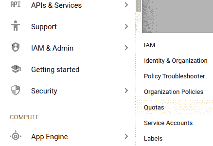

3.  单击`Metrics`过滤器，然后键入 GPU 以找到读取 GPU（所有区域）的条目，如以下屏幕截图所示：

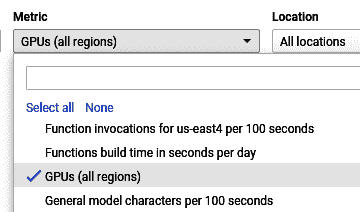

4.  选择条目，然后单击“编辑配额”。
5.  系统将要求您提供身份证明，包括您的电话号码。 填写详细信息，然后单击“下一步”。
6.  输入您想要将 GPU 配额设置为的限制（最好是`1`，以避免滥用）。 另外，请提供您提出要求的理由，例如学术研究，机器学习探索或任何适合您的东西！
7.  单击“提交”。

提出要求后，大约需要 10 到 15 分钟才能将您的配额增加/设置为您指定的数量。 您将收到一封电子邮件，通知您有关此更新。 现在，您准备创建一个 GPU 实例。

# 创建一个 GPU 实例

下一步是创建 GPU 实例。 创建 GPU 实例的过程与创建非 GPU 实例的过程非常相似，但是需要额外的步骤。 让我们快速完成所有这些步骤：

1.  在您的 Google Cloud Platform 仪表板上，单击左侧导航菜单中的“Compute Engine | VM 实例”。
2.  单击“创建实例”。
3.  单击“计算机类型选择”部分正下方的 CPU 平台和 GPU，如以下屏幕截图所示：

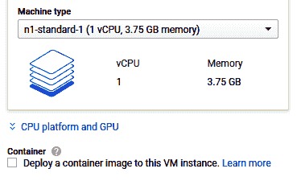

4.  单击“添加 GPU”（大加号（`+`）按钮）。 选择要附加到此 VM 的 GPU 类型和 GPU 数量。
5.  将启动盘操作系统更改为 Ubuntu 版本 10.10。
6.  在“防火墙”部分中，检查 HTTP 和 HTTPS 通信权限，如以下屏幕截图所示：

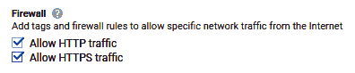

7.  单击表单底部的“创建”。

几秒钟后，您的实例将成功创建。 如果遇到任何错误，例如超出了区域资源限制，请尝试更改要在其中创建实例的区域/区域。这通常是一个临时问题。

现在，我们可以部署 Flask 服务器脚本。

# 部署脚本

现在，我们将部署 Flask 服务器脚本。 但是在我们这样做之前，让我们先看一下该脚本的作用：

1.  脚本的前几行导入了必要的模块，脚本才能正常工作：

```py
from flask import Flask, request, jsonify
import os
import sys
import multiprocessing as mp
from logging import getLogger

from chess_zero.agent.player_chess import ChessPlayer
from chess_zero.config import Config, PlayWithHumanConfig
from chess_zero.env.chess_env import ChessEnv

from chess_zero.agent.model_chess import ChessModel
from chess_zero.lib.model_helper import load_best_model_weight

logger = getLogger(__name__)
```

2.  其余代码放入`start()`函数中，该函数由`config`对象实例化：

```py
def start(config: Config):
    ## rest of the code
```

3.  以下几行创建了引擎和人类玩家的实例，并在脚本开始运行时重置了游戏环境：

```py
def start(config: Config):
    ...
    PlayWithHumanConfig().update_play_config(config.play)

    me_player = None
    env = ChessEnv().reset()
    ...
```

4.  将创建模型，并使用以下代码将模型的最佳权重加载到其中：

```py
def start(config: Config):
    ...
    model = ChessModel(config)

        if not load_best_model_weight(model):
            raise RuntimeError("Best model not found!")

    player = ChessPlayer(config, model.get_pipes(config.play.search_threads))
    ...
```

5.  前面代码中的最后一行创建具有指定配置和模型知识的国际象棋引擎玩家实例：

```py
def start(config: Config):
    ...
    app = Flask(__name__)

        @app.route('/play', methods=["GET", "POST"])
        def play():
            data = request.get_json()
            print(data["position"])
            env.update(data["position"])
            env.step(data["moves"], False)
            bestmove = player.action(env, False)
            return jsonify(bestmove) 
    ...
```

前面的代码创建了 Flask 服务器应用的实例。 定义`/play`路由，使其可以接受位置并移动参数，这与我们先前在 UCI 游戏中使用的命令相同。

6.  游戏状态将更新，并且要求象棋引擎计算下一个最佳移动。 这以 JSON 格式返回给用户：

```py
def start(config: Config):
    ...
    app.run(host="0.0.0.0", port="8080")
```

脚本的最后一行在主机`0.0.0.0`处启动 Flask 服务器，这意味着脚本将监听其运行所在设备的所有打开的 IP。 指定的端口为`8080`。

7.  最后，我们将脚本部署到我们创建的 VM 实例。 为此，请执行以下步骤：

1.  打开 GCP 控制台的 VM 实例页面。
2.  输入在上一节中创建的 VM 后，单击`SSH`按钮。
3.  SSH 会话激活后，通过运行以下命令来更新系统上的存储库：

```py
sudo apt update
```

4.  接下来，使用以下命令克隆存储库：

```py
git clone https://github.com/PacktPublishing/Mobile-Deep-Learning-Projects.git
```

5.  将当前工作目录更改为`chess`文件夹，如下所示：

```py
cd Mobile-Deep-Learning-Projects/Chapter8/chess
```

6.  为 Python3 安装 PIP：

```py
sudo apt install python3-pip
```

7.  安装项目所需的所有模块：

```py
pip3 install -r requirements.txt
```

8.  为最初的监督学习提供训练 PGN。 您可以从[这里](https://github.com/xprilion/ficsdata)下载示例 PGN。 `ficsgamesdb2017.pgn`文件包含 5,000 个已存储的游戏。 您需要将此文件上传到`data/play_data/`文件夹。
9.  运行监督学习命令：

```py
python3 src/chess_zero/run.py sl
```

10.  运行自学习命令：

```py
python3 src/chess_zero/run.py self
```

当您对程序可以自行播放的时间感到满意时，请使用`Ctrl + C/Z`停止脚本。

11.  运行以下命令以启动服务器：

```py
python3 src/chess_zero/run.py server
```

现在，您应该能够将职位和移动发送到服务器并获得响应。 让我们快速测试一下。 使用 Postman 或其他任何用于 API 测试的工具，我们将使用 FEN 字符串向 API 发出请求，以设置位置和正在进行的移动。

假设您的 VM 实例正在公共 IP 地址上运行（在 VM 实例仪表板的实例条目上可见）1.2.3.4。 在这里，我们发送以下`POST`请求：

```py
endpoint: http://1.2.3.4:8080/play
Content-type: JSON
Request body:
{
  "position": "r1bqk2r/ppp2ppp/2np1n2/2b1p3/2B1P3/2N2N2/PPPPQPPP/R1B1K2R w KQkq - 0 1",
  "moves": "f3g5"
}
```

先前代码的输出为`"h7h6"`。 让我们直观地了解这种交互。 FEN 中定义的板看起来如下：

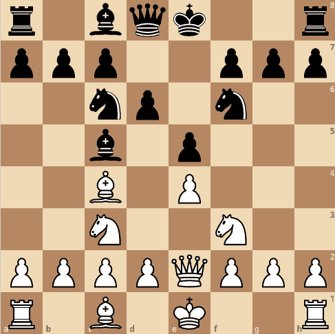

我们告诉服务器这是怀特的举动，而怀特玩家的举动是`f3g5`，这意味着将怀特骑士移动到板上的 G5 位置。 我们传递给 API 的棋盘 FEN 字符串中的`'w'`表示白人玩家将进行下一回合。

引擎通过将 H7 处的棋子移动到 H6 进行响应，威胁到马的前进，如以下屏幕快照所示：

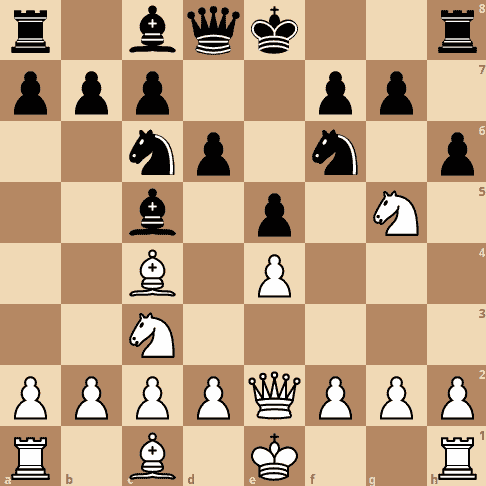

现在，我们可以将此 API 与 Flutter 应用集成！

# 在 Android 上创建简单的国际象棋 UI

现在，我们了解了强化学习以及如何使用它来开发可部署到 GCP 的国际象棋引擎，让我们为游戏创建 Flutter 应用。 该应用将具有两个播放器–用户和服务器。 用户是玩游戏的人，而服务器是我们在 GCP 上托管的国际象棋引擎。 首先，用户采取行动。 记录此移动并将其以 POST 请求的形式发送到国际象棋引擎。 然后，国际象棋引擎以自己的动作进行响应，然后在屏幕上进行更新。

我们将创建一个简单的单屏应用，将棋盘和棋子放置在中间。 该应用将显示如下：


该应用的小部件树如下所示：

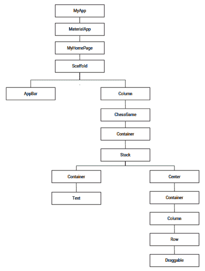

让我们开始编写应用代码。

# 将依赖项添加到`pubspec.yaml`

首先，将`chess_vectors_flutter`包添加到`pubspec.yaml`文件中，以便在将要构建的棋盘上显示实际的棋子。 将以下行添加到`pubspec.yaml`的依赖项部分：

```py
chess_vectors_flutter: ">=1.0.6 <2.0.0"
```

运行`flutter pub get`安装包。

将棋子放置在正确的位置可能会有些棘手。 让我们了解将所有片段放置在正确位置的约定。

# 了解映射结构

我们将首先创建一个名为`chess_game.dart`的新 dart 文件。 这将包含所有游戏逻辑。 在文件内部，我们声明一个名为`ChessGame`的有状态小部件：

1.  要将棋子映射到棋盘的正方形，我们将使用与构建模型时相同的符号，以便每个正方形均由字母和数字表示。 我们将在`ChessGameState`内创建一个列表`squareList`，以便我们可以存储所有索引的正方形，如下所示：

```py
var squareList = [ 
 ["a8","b8","c8","d8","e8","f8","g8","h8"],
 ["a7","b7","c7","d7","e7","f7","g7","h7"],
 ["a6","b6","c6","d6","e6","f6","g6","h6"],
 ["a5","b5","c5","d5","e5","f5","g5","h5"],
 ["a4","b4","c4","d4","e4","f4","g4","h4"],
 ["a3","b3","c3","d3","e3","f3","g3","h3"],
 ["a2","b2","c2","d2","e2","f2","g2","h2"],
 ["a1","b1","c1","d1","e1","f1","g1","h1"],
 ];
```

2.  为了将正确的棋子存储在正确的正方形中并根据玩家的移动来更新它们，我们将创建一个名为`board`的`HashMap`：

```py
HashMap board = new HashMap<String, String>();
```

`HashMap`的键将包含正方形的索引，而值将是正方形将保留的片段。 我们将使用一个字符串来表示一块特定的作品，该字符串将根据作品的名称包含一个字母。 例如，`K`代表王，`B`代表相。 我们通过使用大写和小写字母来区分白色和黑色部分。 大写字母代表白色，小写字母代表黑色。 例如，`K`代表白王，`b`代表黑相。 `board['e7'] = "P"`表示索引为`'e7'`的盒子当前有一个白色棋子。

3.  现在，让我们将它们放置在初始位置。 为此，我们需要定义`initializeBoard()`方法，如下所示：

```py
 void initializeBoard() {
   setState(() {
     for(int i = 8; i >= 1; i--) {
       for(int j = 97; j <= 104; j++) {
         String ch = String.fromCharCode(j)+'$i';
         board[ch] = " ";
       }
     }

   //Placing White Pieces
   board['a1'] = board['h1']= "R";
   board['b1'] = board['g1'] = "N";
   board['c1'] = board['f1'] = "B";
   board['d1'] = "Q";
   board['e1'] = "K";
   board['a2'] = board['b2'] = board['c2'] = board['d2'] =
   board['e2'] = board['f2'] = board['g2'] = board['h2'] = "P";

   //Placing Black Pieces
   board['a8'] = board['h8']= "r";
   board['b8'] = board['g8'] = "n";
   board['c8'] = board['f8'] = "b";
   board['d8'] = "q";
   board['e8'] = "k";
   board['a7'] = board['b7'] = board['c7'] = board['d7'] =
   board['e7'] = board['f7'] = board['g7'] = board['h7'] = "p";
   });
 }
```

在前面的方法中，我们使用一个简单的嵌套循环通过从`a`到`h`的所有行以及从 1 到 8 的所有列进行遍历，使用空白字符串初始化哈希映射板的所有索引。 如“步骤 2”中所述，将其放置在其初始位置上。 为了确保在初始化棋盘时重新绘制 UI，我们将整个分配放在`setState()`中。

4.  屏幕启动后，板将被初始化。 为了确保这一点，我们需要覆盖`initState()`并从那里调用`initializeBoard()`：

```py
 @override
 void initState() {
   super.initState();
   initializeBoard();
 } 
```

现在我们对映射棋子有了更好的了解，让我们开始在屏幕上放置棋子的实际图像。

# 放置实际片段的图像

将片段映射到其初始位置后，我们可以开始放置实际的图像向量：

1.  我们首先定义一个名为`mapImages()`的函数，该函数采用正方形的索引（即哈希图板的键值）并返回图像：

```py
Widget mapImages(String squareName) {
   board.putIfAbsent(squareName, () => " ");
   String p = board[squareName];
   var size = 6.0;
   Widget imageToDisplay = Container();
   switch (p) {
     case "P":
       imageToDisplay = WhitePawn(size: size);
       break;
     case "R":
       imageToDisplay = WhiteRook(size: size);
       break;
     case "N":
       imageToDisplay = WhiteKnight(size: size);
       break;
     case "B":
       imageToDisplay = WhiteBishop(size: size);
       break;
     case "Q":
       imageToDisplay = WhiteQueen(size: size);
       break;
     case "K":
       imageToDisplay = WhiteKing(size: size);
       break;
     case "p":
       imageToDisplay = BlackPawn(size: size);
       break;
     case "r":
       imageToDisplay = BlackRook(size: size);
       break;
     case "n":
       imageToDisplay = BlackKnight(size: size);
       break;
     case "b":
       imageToDisplay = BlackBishop(size: size);
       break;
     case "q":
       imageToDisplay = BlackQueen(size: size);
       break;
     case "k":
       imageToDisplay = BlackKing(size: size);
       break;
     case "p":
       imageToDisplay = BlackPawn(size: size);
       break;
   }
   return imageToDisplay;
 }
```

在前面的函数中，我们构建一个与矩形中所含件名相对应的开关盒块。 我们使用哈希图在特定的正方形中找到片段，然后返回相应的图像。 例如，如果将`a1`的值传递到`squareName`中，并且哈希图板具有与键值`a1`对应的值`P`，则白兵的图像将存储在变量`imageToDisplay`中。

请注意，在 64 个棋盘格正方形中，只有 32 个包含棋子。 其余将为空白。 因此，在哈希表`board`中，将存在没有值的键。 如果`squareName`没有片段，则将其传递给`imageToDisplay`变量，该变量将只有一个空容器。

2.  在上一步中，我们构建了对应于棋盘上每个正方形的小部件（图像或空容器）。 现在，让我们将所有小部件排列成行和列。 `squareName`中的特定元素（例如`[a1,b1,....,g1]`）包含应并排放置的正方形。 因此，我们将它们包装成一行并将这些行中的每一个包装成列。

3.  让我们从定义`buildRow()`方法开始，该方法包含一个列表。 这本质上是`sqaureName`中的元素列表，并构建完整的行。 该方法如下所示：

```py
 Widget buildRow(List<String> children) {
    return Expanded(
      flex: 1,
      child: Row(
        children: children.map((squareName) => getImage(squareName)).toList()
      ),
    );
  }
```

在前面的代码片段中，我们迭代使用`map()`方法传递的列表的每个元素。 这会调用`getImage()`以获取对应于正方形的适当图像。 然后，我们将所有这些返回的图像添加为一行的子级。 该行将一个子代添加到展开的窗口小部件并返回。

4.  `getImage()`方法定义如下：

```py
 Widget getImage(String squareName) {
   return Expanded(
     child: mapImages(squareName),
   );
 }
```

只需输入`squareName`的值，然后返回一个扩展的小部件，其中将包含我们先前定义的`mapImages`返回的图像。 我们稍后将修改此方法，以确保玩家可以拖动每个图像，以便它们可以在棋盘上移动。

5.  现在，我们需要构建将包含已构建行的列。 为此，我们需要定义`buildChessBoard()`方法，如下所示：

```py
  Widget buildChessBoard() {
    return Container(
      height: 350,
      child: Column(
            children: widget.squareList.map((row) {
                return buildRow(row,);
                }).toList()   
      )
    );
  }
```

在前面的代码中，我们迭代了`squareList`内部的每一行，这些行表示为一个列表。 我们通过调用`buildRow()`来构建行，并将它们作为子级添加到列中。 此列作为子级添加到容器中并返回。

6.  现在，让我们将所有片段以及实际的棋盘图像放到屏幕上。 我们将覆盖`build()`方法，以构建由棋盘图像及其碎片组成的小部件栈：

```py
@override
 Widget build(BuildContext context) {
   return Container(
       child: Stack(
         children: <Widget>[
           Container(
             child: new Center(child: Image.asset("assets/chess_board.png", fit: BoxFit.cover,)),
           ),
           Center(
             child: Container(
               child: buildChessBoard(),
             ),
           )
         ],
     )
   );
 }
```

前面的方法使用容器来构建栈，该容器添加存储在`assets`文件夹中的棋盘图像。 栈的下一个子项是居中对齐的容器，其中所有片段图像都通过对`buildChessBoard()`的调用以小部件的形式添加为行和列包装。 整个栈作为子级添加到容器中并返回，以便出现在屏幕上。

此时，应用显示棋盘，以及所有放置在其初始位置的棋子。 如下所示：

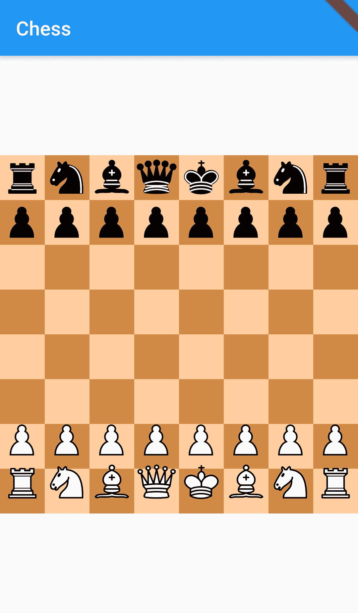

现在，让我们使这些棋子变得可移动，以便我们可以玩一个真实的游戏。

# 使片段移动

在本节中，我们将用可拖动的工具包装每块棋子，以便用户能够将棋子拖动到所需位置。 让我们详细看一下实现：

1.  回想一下，我们声明了一个哈希图来存储片段的位置。 移动将包括从一个盒子中移出一块并将其放在另一个盒子中。 假设我们有两个变量`'from'`和`'to'`，它们存储用于移动片段的盒子的索引。 进行移动后，我们拿起`'from'`处的片段并将其放入`'to'`中。 因此，`'from'`的框变为空。 按照相同的逻辑，我们将定义`refreshBoard()`方法，该方法在每次移动时都会调用：

```py
void refreshBoard(String from, String to) {
   setState(() {
     board[to] = board[from];
     board[from] = " ";
   });
 }
```

`from`和`to`变量存储源和目标正方形的索引。 这些值在`board` HasMhap 中用作键。 进行移动时，`from`处的棋子会移至`to.`。此后，`from`处的方块应该变空。 它包含在`setState()`中，以确保每次移动后都更新 UI。

2.  现在，让我们将其拖曳。 为此，我们将拖动项附加到`getPieceImage()`方法返回的木板的每个图像小部件上。 我们通过修改方法来做到这一点：

```py
Widget getImage(String squareName) {
   return Expanded(
     child: DragTarget<List>(builder: (context, accepted, rejected) {
             return Draggable<List>(
                 child: mapImages(squareName),
                 feedback: mapImages(squareName),
                 onDragCompleted: () {},
                 data: [
                   squareName,
                 ],
               );
       }, onWillAccept: (willAccept) {
         return true;
       }, onAccept: (List moveInfo) {
         String from = moveInfo[0];
         String to = squareName;
         refreshBoard(from, to);
       })
     );
 }
```

在前面的函数中，我们首先将特定正方形的图像包装在`Draggable`中。 此类用于感测和跟随屏幕上的拖动手势。 `child`属性用于指定要拖动的窗口小部件，而反馈内部的窗口小部件用于跟踪手指在屏幕上的移动。 当拖动完成并且用户抬起手指时，目标将有机会接受所携带的数据。 由于我们正在源和目标之间移动，因此我们将添加`Draggable`作为`DragTarget`的子代，以便可以在源和目标之间移动小部件。 `onWillAccept`设置为`true`，以便可以进行所有移动。

可以修改此属性，以使其具有可以区分合法象棋动作并且不允许拖动非法动作的功能。 放下片段并完成拖动后，将调用`onAccept`。 `moveInfo`列表保存有关拖动源的信息。 在这里，我们调用`refreshBoard()`，并传入`from`和`to`的值，以便屏幕可以反映运动。 至此，我们完成了向用户显示初始棋盘的操作，并使棋子可以在盒子之间移动。

在下一节中，我们将通过对托管的国际象棋服务器进行 API 调用来增加应用的交互性。 这些将使游戏栩栩如生。

# 将国际象棋引擎 API 与 UI 集成

托管的棋牌服务器将作为对手玩家添加到应用中。 用户将是白色的一面，而服务器将是黑色的一面。 这里要实现的游戏逻辑非常简单。 第一步是提供给应用用户。 用户进行移动时，他们将棋盘的状态从状态 X 更改为状态 Y。棋盘的状态由 FEN 字符串表示。 同样，他们将一块`from`移到一个特定的正方形`to`移到一个特定的正方形，这有助于他们的移动。 当用户完成移动时，状态 X 的 FEN 字符串及其当前移动（通过将`from`和`to`正方形连接在一起而获得）以`POST`请求的形式发送到服务器。 作为回报，服务器从其侧面进行下一步移动，然后将其反映在 UI 上。

让我们看一下此逻辑的代码：

1.  首先，我们定义一个名为`getPositionString()`的方法来为应用的特定状态生成 FEN 字符串：

```py
String getPositionString(String move) {
    String s = "";
    for(int i = 8; i >= 1; i--) {
        int count = 0;
        for(int j = 97; j <= 104; j++) {
            String ch = String.fromCharCode(j)+'$i';
            if(board[ch] == " ") {
                count += 1;
                if(j == 104) 
                    s = s + "$count";
            } else {
                if(count > 0) 
                    s = s + "$count";
                s = s + board[ch];count = 0;
            }
        }
    s = s + "/";
    }
    String position = s.substring(0, s.length-1) + " w KQkq - 0 1";
    var json = jsonEncode({"position": position, "moves": move});
}
```

在前面的方法中，我们将`move`作为参数，它是`from`和`to`变量的连接。 接下来，我们为棋盘的当前状态创建 FEN 字符串。 创建 FEN 字符串背后的逻辑是，我们遍历电路板的每一行并为该行创建一个字符串。 然后将生成的字符串连接到最终字符串。

让我们借助示例更好地理解这一点。 考虑一个`rnbqkbnr/pp1ppppp/8/1p6/8/3P4/PPP1PPPP/RNBQKBNR w KQkq - 0 1`的 FEN 字符串。 在此，每行可以用八个或更少的字符表示。 特定行的状态通过使用分隔符“/”与另一行分开。 对于特定的行，每件作品均以其指定的符号表示，其中`P`表示白兵，`b`表示黑相。 每个占用的正方形均由件符号明确表示。 例如，`PpkB`指示板上的前四个正方形被白色棋子，黑色棋子，黑色国王和白色主教占据。 对于空盒子，使用整数，该数字表示可传染的空盒子的数量。 注意示例 FEN 字符串中的`8`。 这表示该行的所有 8 个正方形均为空。 `3P4`表示前三个正方形为空，第四个方框被白色棋子占据，并且四个正方形为空。

在`getPositionString()`方法中，我们迭代从 8 到 1 的每一行，并为每行生成一个状态字符串。 对于每个非空框，我们只需在`'s'`变量中添加一个表示该块的字符。 对于每个空框，当找到非空框或到达行末时，我们将`count`的值增加 1 并将其连接到`'s'`字符串。 遍历每一行后，我们添加“/”以分隔两行。 最后，我们通过将生成的`'s'`字符串与`w KQkq - 0 1`连接来生成位置字符串。 然后，我们通过将`jsonEncode()`与键值对结合使用来生成所需的 JSON 对象

2.  我们使用“步骤 1”的“步骤 1”中的`from`和`to`变量来保存用户的当前移动。 我们可以通过在`refreshBoard()`方法中添加两行来实现：

```py
void refreshBoard(String from, String to) {
    String move= from + to;
    getPositionString(move);
    .....
}
```

在前面的代码片段中，我们将`from`和`to`的值连接起来，并将它们存储在名为`move`的字符串变量中。 然后，我们调用`getPositionString()`，并将`move`的值传递给参数。

3.  接下来，我们使用在上一步中`makePOSTRequest()`方法中生成的`JSON`向服务器发出`POST`请求：

```py
void makePOSTRequest(var json) async{
    var url = 'http://35.200.253.0:8080/play';
    var response = await http.post(url, headers: {"Content-Type": "application/json"} ,body: json);
    String rsp = response.body;
    String from = rsp.substring(0,3);
    String to = rsp.substring(3);
}
```

首先，将国际象棋服务器的 IP 地址存储在`url`变量中。 然后，我们使用`http.post()`发出`HTTP POST`请求，并为 URL，标头和正文传递正确的值。 POST 请求的响应包含服务器端的下一个动作，并存储在变量响应中。 我们解析响应的主体并将其存储在名为`rsp`的字符串变量中。 响应基本上是一个字符串，是服务器端的源方和目标方的连接。 例如，响应字符串`f4a3`表示国际象棋引擎希望将棋子以`f4`正方形移动到`a3`正方形。 我们使用`substring()`分隔源和目标，并将值存储在`from`和`to`变量中。

4.  现在，通过将调用添加到`makePOSTrequest()`来从`getPositionString()`发出 POST 请求：

```py
String getPositionString(String move) {
    .....
    makePOSTRequest(json);
}
```

在 FEN 字符串生成板的给定状态之后，对`makePOSTrequest()`的调用添加在函数的最后。

5.  最后，我们使用`refreshBoardFromServer()`方法刷新板以反映服务器在板上的移动：

```py
void refreshBoardFromServer(String from, String to) {
    setState(() {    
        board[to] = board[from];
        board[from] = " ";
    });
}
```

前述方法中的逻辑非常简单。 首先，我们将映射到`from`索引正方形的片段移动到`to`索引正方形，然后清空`from`索引正方形。

6.  最后，我们调用适当的方法以用最新的动作更新 UI：

```py
void makePOSTRequest(var json) async{
    ......
    refreshBoardFromServer(from, to);
    buildChessBoard();
}
```

发布请求成功完成后，我们收到了服务器的响应，我们将调用`refreshBoardFromServer()`以更新板上的映射。 最后，我们调用`buildChessBoard()`以在应用屏幕上反映国际象棋引擎所做的最新动作。

以下屏幕快照显示了国际象棋引擎进行移动后的更新的用户界面：


请注意，黑色的块在白色的块之后移动。 这就是代码的工作方式。 首先，用户采取行动。 它以板的初始状态发送到服务器。 然后，服务器以其移动进行响应，更新 UI。 作为练习，您可以尝试实现一些逻辑以区分有效动作和无效动作。

可以在[这个页面](https://github.com/PacktPublishing/Mobile-Deep-Learning-Projects/blob/master/Chapter8/flutter_chess/lib/chess_game.dart)中找到此代码。

现在，让我们通过创建材质应用来包装应用。

# 创建材质应用

现在，我们将在`main.dart`中创建最终的材质应用。 让我们从以下步骤开始：

1.  首先，我们创建无状态窗口小部件`MyApp`，并覆盖其`build()`方法，如下所示：

```py
class MyApp extends StatelessWidget {
    @override
    Widget build(BuildContext context) {
        return MaterialApp(
            title: 'Chess',
            theme: ThemeData(primarySwatch: Colors.blue,),
            home: MyHomePage(title: 'Chess'),
        );
    }
}
```

2.  我们创建一个单独的`StatefulWidget`，称为`MyHomePage`，以便将 UI 放置在屏幕中央。 `MyHomePage`的`build()`方法如下所示：

```py
@override
Widget build(BuildContext context) {
    return Scaffold(
        appBar: AppBar(title: Text('Chess'),),
        body: Center(
            child: Column(
                mainAxisAlignment: MainAxisAlignment.center,
                children: <Widget>[ChessGame()
                ],
            ),
        ),
    );
}
```

3.  最后，我们通过在`main.dart`中添加以下行来执行整个代码：

```py
void main() => runApp(MyApp());
```

而已！ 现在，我们有一个交互式的国际象棋游戏应用，您可以与聪明的对手一起玩。 希望你赢！

整个文件的代码可以在[这个页面](https://github.com/PacktPublishing/Mobile-Deep-Learning-Projects/blob/master/Chapter8/flutter_chess/lib/main.dart)中找到。

# 总结

在此项目中，我们介绍了强化学习的概念以及为什么强化学习在创建游戏性 AI 的开发人员中很受欢迎。 我们讨论了 Google DeepMind 的 AlphaGo 及其兄弟项目，并深入研究了它们的工作算法。 接下来，我们创建了一个类似的程序来玩 Connect 4，然后下棋。 我们将基于 AI 的国际象棋引擎作为 API 部署到 GPU 实例的 GCP 上，并将其与基于 Flutter 的应用集成。 我们还了解了如何使用 UCI 促进国际象棋的无状态游戏。 完成此项目后，您将对如何将游戏转换为强化学习环境，如何以编程方式定义游戏规则以及如何创建用于玩这些游戏的自学智能体有很好的了解。

在下一章中，我们将创建一个应用，该应用可以使低分辨率图像变成非常高分辨率的图像。 我们将在 AI 的帮助下进行此操作。