# 九、构建图像超分辨率应用

还记得上次和亲人一起旅行并拍了一些漂亮的照片作为记忆，但是当您回到家并刷过它们时，您发现它们非常模糊且质量低下吗？ 现在，您剩下的所有美好时光就是您自己的心理记忆和那些模糊的照片。 如果可以使您的照片清晰透明并且可以看到其中的每个细节，那不是很好吗？

超分辨率是基于像素信息的近似将低分辨率图像转换为高分辨率图像的过程。 虽然今天可能还不完全是神奇的，但当技术发展到足以成为通用 AI 应用时，它肯定会在将来挽救生命。

在此项目中，我们将构建一个应用，该应用使用托管在 **DigitalOcean Droplet** 上的深度学习模型，该模型可以同时比较低分辨率和高分辨率图像，从而使我们更好地了解今天的技术。 我们将使用**生成对抗网络**（**GAN**）生成超分辨率图像。

在本章中，我们将介绍以下主题：

*   基本项目架构
*   了解 GAN
*   了解图像超分辨率的工作原理
*   创建 TensorFlow 模型以实现超分辨率
*   构建应用的 UI
*   从设备的本地存储中获取图片
*   在 DigitalOcean 上托管 TensorFlow 模型
*   在 Flutter 上集成托管的自定义模型
*   创建材质应用

让我们从了解项目的架构开始。

# 基本项目架构

让我们从了解项目的架构开始。

我们将在本章中构建的项目主要分为两个部分：

*   Jupyter 笔记本，它创建执行超分辨率的模型。
*   使用该模型的 Flutter 应用，在 Jupyter 笔记本上接受训练后，将托管在 DigitalOcean 中的 Droplet 中。

从鸟瞰图可以用下图描述该项目：

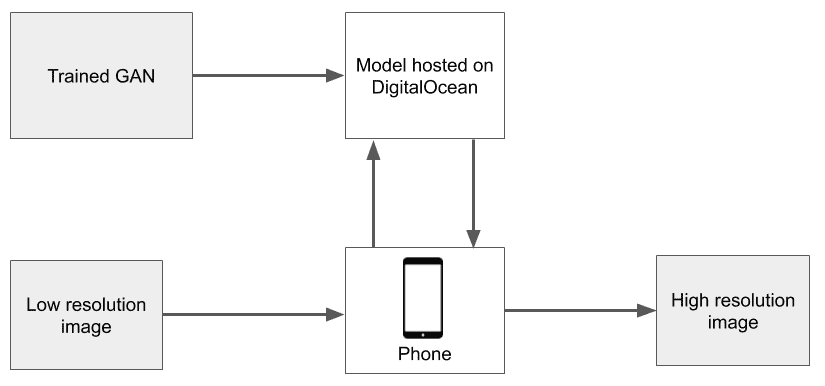

将低分辨率图像放入模型中，该模型是从 Firebase 上托管的 ML Kit 实例中获取的，并放入 Flutter 应用中。 生成输出并将其作为高分辨率图像显示给用户。 该模型缓存在设备上，并且仅在开发人员更新模型时才更新，因此可以通过减少网络延迟来加快预测速度。

现在，让我们尝试更深入地了解 GAN。

# 了解 GAN

Ian Goodfellow，Yoshua Bengio 和其他人在 NeurIPS 2014 中引入的 GAN 席卷全球。 可以应用于各种领域的 GAN 会根据模型对实际数据样本的学习近似，生成新的内容或序列。 GAN 已被大量用于生成音乐和艺术的新样本，例如下图所示的面孔，而训练数据集中不存在这些面孔：


经过 60 个周期的训练后，GAN 生成的面孔。 该图像取自[这里](https://github.com/gsurma/face_generator)。

前面面孔中呈现的大量真实感证明了 GAN 的力量–在为他们提供良好的训练样本量之后，他们几乎可以学习生成任何类型的模式。

GAN 的核心概念围绕两个玩家玩游戏的想法。 在这个游戏中，一个人说出一个随机句子，另一个人仅仅考虑第一人称使用的单词就指出它是事实还是假。 第二个人唯一可以使用的知识是假句子和实句中常用的单词（以及如何使用）。 这可以描述为由 minimax 算法玩的两人游戏，其中每个玩家都试图以其最大能力抵消另一位玩家所做的移动。 在 GAN 中，第一个玩家是**生成器**（`G`），第二个玩家是**判别器**（`D`）。 `G`和`D`都是常规 GAN 中的神经网络。 生成器从训练数据集中给出的样本中学习，并基于其认为当观察者查看时可以作为真实样本传播的样本来生成新样本。

判别器从训练样本（正样本）和生成器生成的样本（负样本）中学习，并尝试对哪些图像存在于数据集中以及哪些图像进行分类。 它从`G`获取生成的图像，并尝试将其分类为真实图像（存在于训练样本中）或生成图像（不存在于数据库中）。

通过反向传播，GAN 尝试不断减少判别器能够对生成器正确生成的图像进行分类的次数。 一段时间后，我们希望达到识别器在识别生成的图像时开始表现不佳的阶段。 这是 GAN 停止学习的地方，然后可以使用生成器生成所需数量的新样本。 因此，训练 GAN 意味着训练生成器以从随机输入产生输出，从而使判别器无法将其识别为生成的图像。

判别器将传递给它的所有图像分为两类：

*   **真实图像**：数据集中存在的图像或使用相机拍摄的图像
*   **伪图像**：使用某软件生成的图像

生成器欺骗判别器的能力越好，当向其提供任何随机输入序列时，生成的输出将越真实。

让我们以图表形式总结前面关于 GAN 进行的讨论：

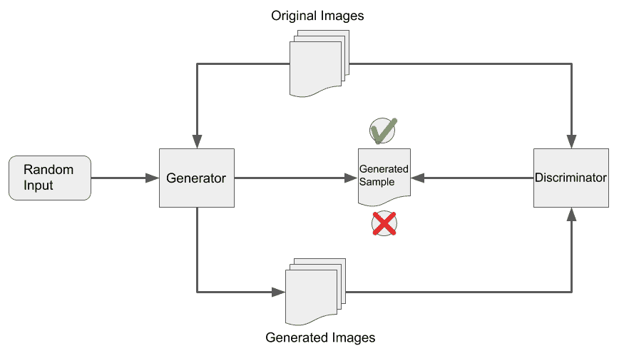

GAN 具有许多不同的变体，所有变体都取决于它们正在执行的任务。 其中一些如下：

*   **渐进式 GAN**：在 ICLR 2018 上的一篇论文中介绍，渐进式 GAN 的生成器和判别器均以低分辨率图像开始，并随着图像层的增加而逐渐受到训练，从而使系统能够生成高分辨率图像。 例如，在第一次迭代中生成的图像为`10x10`像素，在第二代中它变为`20x20`，依此类推，直到获得非常高分辨率的图像为止。 生成器和判别器都在深度上一起增长。
*   **条件 GAN**：假设您有一个 GAN 可以生成 10 个不同类别的样本，但是在某个时候，您希望它在给定类别或一组类别内生成样本。 这是有条件 GAN 起作用的时候。有条件 GAN 使我们可以生成 GAN 中经过训练可以生成的所有标签中任何给定标签的样本。 在图像到图像的翻译领域中，已经完成了条件 GAN 的一种非常流行的应用，其中将一个图像生成为相似或相同域的另一个更逼真的图像。 您可以通过[这个页面](https://affinelayer.com/pixsrv/)上的演示来尝试涂鸦一些猫，并获得涂鸦的真实感版本。
*   **栈式 GAN**：栈式 GAN 的最流行的应用是基于文本描述生成图像。 在第一阶段，GAN 生成描述项的概述，在第二阶段，根据描述添加颜色。 然后，后续层中的 GAN 将更多细节添加到图像中，以生成图像的真实感版本，如描述中所述。 通过观察堆叠 GAN 的第一次迭代中的图像已经处于将要生成最终输出的尺寸，可以将栈式 GAN 与渐进式 GAN 区别开来。但是，与渐进式 GAN 相似，在第一次迭代中， 图像是最小的，并且需要进一步的层才能将其馈送到判别器。

在此项目中，我们将讨论 GAN 的另一种形式，称为**超分辨率 GAN**（**SRGAN**）。 我们将在下一部分中了解有关此变体的更多信息。

# 了解图像超分辨率的工作原理

几十年来，人们一直在追求并希望能够使**低分辨率**图像更加精细，以及使**高分辨率**图像化。 **超分辨率**是用于将低分辨率图像转换为超高分辨率图像的技术的集合，是图像处理工程师和研究人员最激动人心的工作领域之一。 已经建立了几种方法和方法来实现图像的超分辨率，并且它们都朝着自己的目标取得了不同程度的成功。 然而，近来，随着 SRGAN 的发展，关于使用任何低分辨率图像可以实现的超分辨率的量有了显着的改进。

但是在讨论 SRGAN 之前，让我们了解一些与图像超分辨率有关的概念。

# 了解图像分辨率

用质量术语来说，图像的分辨率取决于其清晰度。 分辨率可以归类为以下之一：

*   像素分辨率
*   空间分辨率
*   时间分辨率
*   光谱分辨率
*   辐射分辨率

让我们来看看每个。

# 像素分辨率

指定分辨率的最流行格式之一，像素分辨率最通常是指形成图像时涉及的像素数量。 单个像素是可以在任何给定查看设备上显示的最小单个单元。 可以将几个像素组合在一起以形成图像。 在本书的前面，我们讨论了图像处理，并将像素称为存储在矩阵中的颜色信息的单个单元，它代表图像。 像素分辨率定义了形成数字图像所需的像素元素总数，该总数可能与图像上可见的有效像素数不同。

标记图像像素分辨率的一种非常常见的表示法是以百万像素表示。 给定`NxM`像素分辨率的图像，其分辨率可以写为（`NxM / 1000000`）百万像素。 因此，尺寸为`2,000x3,000`的图像将具有 6,000,000 像素，其分辨率可以表示为 6 兆像素。

# 空间分辨率

这是观察图像的人可以分辨图像中紧密排列的线条的程度的度量。 在这里，严格说来，图像的像素越多，清晰度越好。 这是由于具有较高像素数量的图像的空间分辨率较低。 因此，需要良好的空间分辨率以及具有良好的像素分辨率以使图像以良好的质量呈现。

它也可以定义为像素一侧所代表的距离量。

# 时间分辨率

分辨率也可能取决于时间。 例如，卫星或使用**无人飞行器**（**UAV**）无人机拍摄的同一区域的图像可能会随时间变化。 重新捕获相同区域的图像所需的时间称为时间分辨率。

时间分辨率主要取决于捕获图像的设备。 如在图像捕捉的情况下，这可以是变型，例如当在路边的速度陷阱照相机中触发特定传感器时执行图像捕捉。 它也可以是常数。 例如，在配置为每`x`间隔拍照的相机中。

# 光谱分辨率

光谱分辨率是指图像捕获设备可以记录的波段数。 也可以将其定义为波段的宽度或每个波段的波长范围。 在数字成像方面，光谱分辨率类似于图像中的通道数。 理解光谱分辨率的另一种方法是在任何给定图像或频带记录中可区分的频带数。

黑白图像中的波段数为 1，而彩色（RGB）图像中的波段数为 3。可以捕获数百个波段的图像，其中其他波段可提供有关图像的不同种类的信息。 图片。

# 辐射分辨率

辐射分辨率是捕获设备表示在任何频带/通道上接收到的强度的能力。 辐射分辨率越高，设备可以更准确地捕获其通道上的强度，并且图像越真实。

辐射分辨率类似于图像每个像素的位数。 虽然 8 位图像像素可以表示 256 个不同的强度，但是 256 位图像像素可以表示`2 ^ 256`个不同的强度。 黑白图像的辐射分辨率为 1 位，这意味着每个像素只能有两个不同的值，即 0 和 1。

现在，让我们尝试了解 SRGAN。

# 了解 SRGAN

SRGAN 是一类 GAN，主要致力于从低分辨率图像创建超分辨率图像。

SRGAN 算法的功能描述如下：该算法从数据集中选取高分辨率图像，然后将其采样为低分辨率图像。 然后，生成器神经网络尝试从低分辨率图像生成高分辨率图像。 从现在开始，我们将其称为超分辨率图像。 将超分辨率图像发送到鉴别神经网络，该神经网络已经在高分辨率图像和一些基本的超分辨率图像的样本上进行了训练，以便可以对它们进行分类。

判别器将由生成器发送给它的超分辨率图像分类为有效的高分辨率图像，伪高分辨率图像或超分辨率图像。 如果将图像分类为超分辨率图像，则 GAN 损失会通过生成器网络反向传播，以便下次产生更好的伪造图像。 随着时间的流逝，生成器将学习如何创建更好的伪造品，并且判别器开始无法正确识别超分辨率图像。 GAN 在这里停止学习，被列为受过训练的人。

可以用下图来总结：

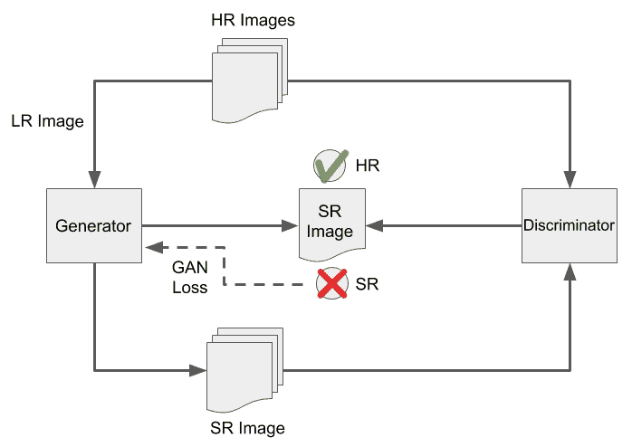

现在，让我们开始创建用于超分辨率的 SRGAN 模型。

# 创建 TensorFlow 模型来实现超分辨率

现在，我们将开始构建在图像上执行超分辨率的 GAN 模型。 在深入研究代码之前，我们需要了解如何组织项目目录。

# 项目目录结构

本章中包含以下文件和文件夹：

*   `api/`：
*   `model /`：
*   `__init __.py`：此文件指示此文件的父文件夹可以像模块一样导入。
*   `common.py`：包含任何 GAN 模型所需的常用函数。
*   `srgan.py`：其中包含开发 SRGAN 模型所需的函数。
*   `weights/`：
*   `gan_generator.h5`：模型的预训练权重文件。 随意使用它来快速运行并查看项目的工作方式。
*   `data.py`：用于在 DIV2K 数据集中下载，提取和加载图像的工具函数。
*   `flask_app.py`：我们将使用此文件来创建将在 DigitalOcean 上部署的服务器。
*   `train.py`：模型训练文件。 我们将在本节中更深入地讨论该文件。

您可以在[这个页面](https://github.com/PacktPublishing/Mobile-Deep-Learning-Projects/tree/master/Chapter9/api)中找到项目此部分的源代码。

**多样 2K**（**DIV2K**）数据集由**图像恢复和增强的新趋势**（**NTIRE**）2017 单张图像超分辨率挑战赛引入，也用于挑战赛的 2018 版本中。

在下一节中，我们将构建 SRGAN 模型脚本。

# 创建用于超分辨率的 SRGAN 模型

首先，我们将从处理`train.py`文件开始：

1.  让我们从将必要的模块导入项目开始：

```py
import os

from data import DIV2K
from model.srgan import generator, discriminator
from train import SrganTrainer, SrganGeneratorTrainer
```

前面的导入引入了一些现成的类，例如`SrganTrainer`，`SrganGeneratorTrainer`等。 在完成此文件的工作后，我们将详细讨论它们。

2.  现在，让我们为权重创建一个目录。 我们还将使用此目录来存储中间模型：

```py
weights_dir = 'weights'
weights_file = lambda filename: os.path.join(weights_dir, filename)

os.makedirs(weights_dir, exist_ok=True)
```

3.  接下来，我们将从 DIV2K 数据集中下载并加载图像。 我们将分别下载训练和验证图像。 对于这两组图像，可以分为两对：高分辨率和低分辨率。 但是，这些是单独下载的：

```py
div2k_train = DIV2K(scale=4, subset='train', downgrade='bicubic')
div2k_valid = DIV2K(scale=4, subset='valid', downgrade='bicubic')
```

4.  将数据集下载并加载到变量后，我们需要将训练图像和验证图像都转换为 TensorFlow 数据集对象。 此步骤还将两个数据集中的高分辨率和低分辨率图像结合在一起：

```py
train_ds = div2k_train.dataset(batch_size=16, random_transform=True)
valid_ds = div2k_valid.dataset(batch_size=16, random_transform=True, repeat_count=1)
```

5.  现在，回想一下我们在“了解 GAN”部分中提供的 GAN 的定义。 为了使生成器开始产生判别器可以评估的伪造品，它需要学习创建基本的伪造品。 为此，我们将快速训练神经网络，以便它可以生成基本的超分辨率图像。 我们将其命名为**预训练器**。 然后，我们将**预训练器**的权重迁移到实际的 SRGAN，以便它可以通过使用判别器来学习更多。 让我们构建并运行**预训练器**：

```py
pre_trainer = SrganGeneratorTrainer(model=generator(), checkpoint_dir=f'.ckpt/pre_generator')
pre_trainer.train(train_ds,
                  valid_ds.take(10),
                  steps=1000000, 
                  evaluate_every=1000, 
                  save_best_only=False)

pre_trainer.model.save_weights(weights_file('pre_generator.h5'))
```

现在，我们已经训练了一个基本模型并保存了权重。 我们可以随时更改 SRGAN 并通过加载其权重从基础训练中重新开始。

6.  现在，让我们将**预训练器**权重加载到 SRGAN 对象中，并执行训练迭代：

```py
gan_generator = generator()
gan_generator.load_weights(weights_file('pre_generator.h5'))

gan_trainer = SrganTrainer(generator=gan_generator, discriminator=discriminator())
gan_trainer.train(train_ds, steps=200000)
```

请注意，在具有 8 GB RAM 和 Intel i7 处理器的普通计算机上，上述代码中的训练操作可能会花费大量时间。 建议在具有**图形处理器**（**GPU**）的基于云的虚拟机中执行此训练。

7.  现在，让我们保存 GAN 生成器和判别器的权重：

```py
gan_trainer.generator.save_weights(weights_file('gan_generator.h5'))
gan_trainer.discriminator.save_weights(weights_file('gan_discriminator.h5'))
```

现在，我们准备继续进行下一部分，在该部分中将构建将使用此模型的 Flutter 应用的 UI。

# 构建应用的 UI

现在，我们了解了图像超分辨率模型的基本功能并为其创建了一个模型，让我们深入研究构建 Flutter 应用。 在本节中，我们将构建应用的 UI。

该应用的用户界面非常简单：它将包含两个图像小部件和按钮小部件。 当用户单击按钮小部件时，他们将能够从设备的库中选择图像。 相同的图像将作为输入发送到托管模型的服务器。 服务器将返回增强的图像。 屏幕上将放置的两个图像小部件将用于显示服务器的输入和服务器的输出。

下图说明了应用的基本结构和最终流程：

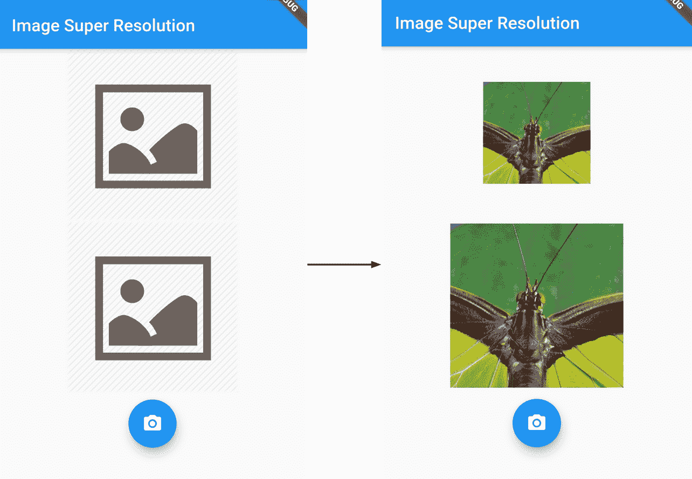

该应用的三个主要小部件可以简单地排列在一列中。 该应用的小部件树如下所示：

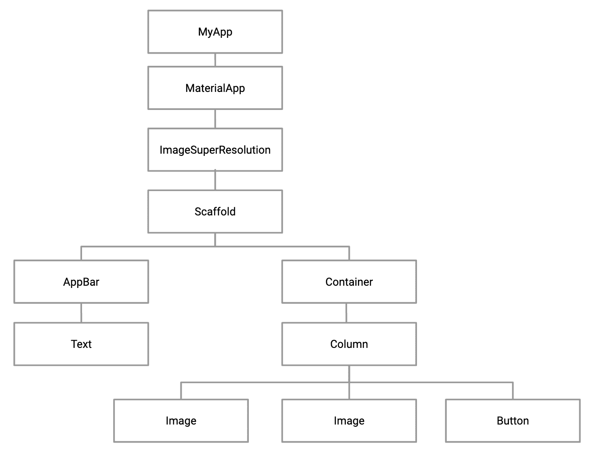

现在，让我们编写代码以构建主屏幕。 以下步骤讨论了该应用小部件的创建和放置：

1.  首先，我们创建一个名为`image_super_resolution.dart`的新文件。 这将包含一个名为`ImageSuperResolution`的无状态窗口小部件。 该小部件将包含应用主屏幕的代码。
2.  接下来，我们将定义一个名为`buildImageInput()`的函数，该函数返回一个小部件，该小部件负责显示用户选择的图像：

```py
Widget buildImage1() {
     return Expanded(
         child: Container(
             width: 200, 
             height: 200, 
             child: img1
         )
     );
 }
```

此函数返回带有`Container`作为其`child.`的`Expanded`小部件。`Container`的`width`和`height`为`200`。 `Container`的子元素最初是存储在资产文件夹中的占位符图像，可以通过`img1`变量进行访问，如下所示：

```py
 var img1 = Image.asset('assets/place_holder_image.png');
```

我们还将在`pubspec.yaml`文件中添加图像的路径，如下所示：

```py
flutter:
    assets:
        - assets/place_holder_image.png
```

3.  现在，我们将创建另一个函数`buildImageOutput()`，该函数返回一个小部件，该小部件负责显示模型返回的增强图像：

```py
Widget buildImageOutput() {
     return Expanded(
         child: Container(
             width: 200, 
             height: 200, 
             child: imageOutput
         )
     );
 }
```

此函数返回一个以其`Container`作为其子元素的`Expanded`小部件。 `Container`的宽度和高度设置为`200`。 `Container`的子级是名为`imageOutput`的小部件。 最初，`imageOutput`还将包含一个占位符图像，如下所示：

```py
Widget imageOutput = Image.asset('assets/place_holder_image.png');
```

将模型集成到应用中后，我们将更新`imageOutput`。

4.  现在，我们将定义第三个函数`buildPickImageButton()`，该函数返回一个`Widget`，我们可以使用它从设备的图库中选择图像：

```py
Widget buildPickImageButton() {
     return Container(
         margin: EdgeInsets.all(8),
         child: FloatingActionButton(
             elevation: 8,
             child: Icon(Icons.camera_alt),
             onPressed: () => {},
        )
     );
 }
```

此函数返回以`FloatingActionButton`作为其子元素的`Container`。 按钮的`elevation`属性控制其下方阴影的大小，并设置为`8`。 为了反映该按钮用于选择图像，通过`Icon`类为它提供了摄像机的图标。 当前，我们已经将按钮的`onPressed`属性设置为空白。 我们将在下一部分中定义一个函数，使用户可以在按下按钮时从设备的图库中选择图像。

5.  最后，我们将覆盖`build`方法以返回应用的`Scaffold`：

```py
@override
 Widget build(BuildContext context) {
     return Scaffold(
         appBar: AppBar(title: Text('Image Super Resolution')),
         body: Container(
             child: Column(
                 crossAxisAlignment: CrossAxisAlignment.center,
                 children: <Widget>[
                     buildImageInput(),
                     buildImageOutput(),
                     buildPickImageButton()
                 ]
             )
         )
     );
 }

```

`Scaffold`包含一个`appBar`，其标题设置为“图像超分辨率”。 `Scaffold`的主体为`Container`，其子代为`Column`。 该列的子级是我们在先前步骤中构建的三个小部件。 另外，我们将`Column`的`crossAxisAlignment`属性设置为`CrossAxisAlignment.center`，以确保该列位于屏幕的中央。

至此，我们已经成功构建了应用的初始状态。 以下屏幕截图显示了该应用现在的外观：


尽管屏幕看起来很完美，但目前无法正常工作。 接下来，我们将向应用添加功能。 我们将添加让用户从图库中选择图像的功能。

# 从设备的本地存储中获取图片

在本节中，我们将添加`FloatingActionButton`的功能，以使用户可以从设备的图库中选择图像。 这最终将被发送到服务器，以便我们能够收到响应。

以下步骤描述了如何启动图库并让用户选择图像：

1.  为了允许用户从设备的图库中选择图像，我们将使用`image_picker`库。 这将启动图库并存储用户选择的图像文件。 我们将从在`pubspec.yaml`文件中添加依赖项开始：

```py
image_picker: 0.4.12+1
```

另外，我们通过在终端上运行`flutter pub get`来获取库。

2.  接下来，我们将库导入`image_super_resolution.dart`文件中：

```py
import 'package:image_picker/image_picker.dart';
```

3.  现在，让我们定义`pickImage()`函数，该函数使用户可以从图库中选择图像：

```py
void pickImage() async {
     File pickedImg = await ImagePicker.pickImage(source: ImageSource.gallery);
 }
```

4.  从函数内部，我们只需调用`ImagePicker.pickImage()`并将`source`指定为`ImageSource.gallery`即可。 该库本身处理启动设备图库的复杂性。 用户选择的图像文件最终由该函数返回。 我们将函数返回的文件存储在`File`类型的`pickedImg`变量中。
5.  接下来，我们定义`loadImage()`函数，以便在屏幕上显示用户选择的图像：

```py
void loadImage(File file) {
     setState(() {
         img1 = Image.file(file);
     });
 }
```

此函数将用户选择的图像文件作为输入。 在函数内部，我们将先前声明的`img1`变量的值设置为`Image.file(file)`，这将返回从`'file'`构建的`Image`小部件。 回想一下，最初，`img1`被设置为占位符图像。 为了重新渲染屏幕并显示用户选择的图像，我们将`img1`的新分配放在`setState()`中。

6.  现在，将`pickImage()`添加到`builtPickImageButton()`内的`FloatingActionButton`的`onPressed`属性中：

```py
 Widget buildPickImageButton() {
     return Container(
        ....
        child: FloatingActionButton(
            ....
            onPressed: () => pickImage(),
         )
    );
 }

```

前面的补充内容确保单击按钮时，会启动图库，以便可以选择图像。

5.  最后，我们将从`pickImage()`向`loadImage()`添加一个调用：

```py
void pickImage() async {
     ....
     loadImage(pickedImg);
 }
```

在`loadImage()`内部，我们传入用户选择的图像，该图像存储在`pickedImage`变量中，以便可以在应用的屏幕上查看该图像。

完成上述所有步骤后，该应用将如下所示：

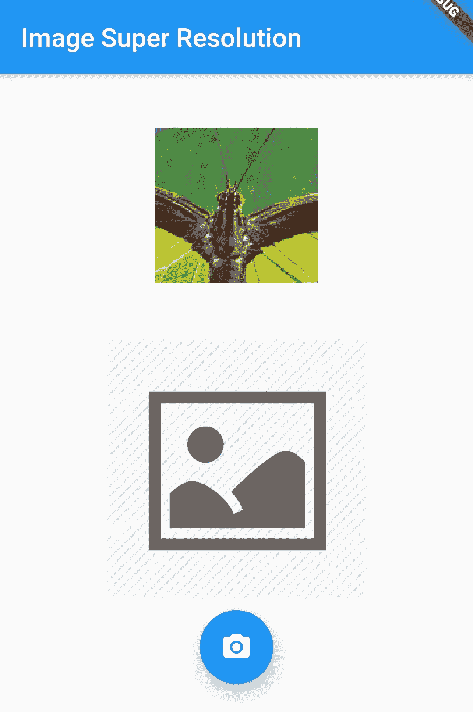

至此，我们已经构建了应用的用户界面。 我们还添加了一些功能，使用户可以从设备的图库中选择图像并将其显示在屏幕上。

在下一部分中，我们将学习如何托管在“为超分辨率创建 TensorFlow 模型”中创建的模型作为 API，以便我们可以使用它执行超分辨率。

# 在 DigitalOcean 上托管 TensorFlow 模型

DigitalOcean 是一个了不起的低成本云解决方案平台，非常易于上手，并提供了应用开发人员为立即可用的应用后端提供动力所需的几乎所有功能。 该界面非常易于使用，并且 DigitalOcean 拥有一些最广泛的文档，这些文档围绕着如何在云上设置不同类型的应用服务器提供入门。

在这个项目中，我们将使用 DigitalOcean 的 Droplet 部署我们的超分辨率 API。 DigitalOcean 中的 Droplet 只是通常在共享硬件空间上运行的虚拟机。

首先，我们将在项目目录中创建`flask_app.py`文件，并添加服务器工作所需的代码。

# 创建一个 Flask 服务器脚本

在本节中，我们将处理`flask_app.py`文件，该文件将作为服务器在云虚拟机上运行。 让我们开始吧：

1.  首先，我们将对文件进行必要的导入：

```py
from flask import Flask, request, jsonify, send_file
import os
import time

from matplotlib.image import imsave

from model.srgan import generator

from model import resolve_single
```

2.  现在，我们将定义`weights`目录并将生成器权重加载到文件中：

```py
weights_dir = 'weights'
weights_file = lambda filename: os.path.join(weights_dir, filename)

gan_generator = generator()
gan_generator.load_weights(weights_file('gan_generator.h5'))
```

3.  接下来，我们将使用以下代码行实例化`Flask`应用：

```py
app = Flask(__name__)
```

4.  现在，我们准备构建服务器将监听的路由。 首先，我们将创建`/generate`路由，该路由将图像作为输入，生成其超分辨率版本，并将所生成的高分辨率图像的文件名返回给用户：

```py
@app.route('/generate', methods=["GET", "POST"])
def generate():

    global gan_generator
    imgData = request.get_data()
    with open("input.png", 'wb') as output:
        output.write(imgData)

    lr = load_image("input.png")
    gan_sr = resolve_single(gan_generator, lr)
    epoch_time = int(time.time())
    outputfile = 'output_%s.png' % (epoch_time)
    imsave(outputfile, gan_sr.numpy())
    response = {'result': outputfile}

    return jsonify(response)
```

让我们尝试了解前面的代码块中发生的情况。 `/generate`路由已设置为仅监听 HTTP 请求的 GET 和 POST 方法。 首先，该方法获取 API 请求中提供给它的图像，将其转换为 NumPy 数组，然后将其提供给 SRGAN 模型。 SRGAN 模型返回超分辨率图像，然后为其分配一个唯一的名称并存储在服务器上。 用户显示文件名，他们可以使用该文件名调用另一个端点来下载文件。 让我们现在构建此端点。

5.  为了创建端点以便下载生成的文件，我们可以使用以下代码：

```py
@app.route('/download/<fname>', methods=['GET'])
def download(fname):
    return send_file(fname)
```

在这里，我们创建了一个名为`/download`的端点，该端点附加了文件名后，将其提取并发送回给用户。

6.  最后，我们可以编写执行该脚本并设置服务器的代码：

```py
app.run(host="0.0.0.0", port="8080")
```

保存此文件。 确保此时将您的存储库推送到 GitHub/GitLab 存储库。

现在，我们准备将该脚本部署到`DigitalOcean` Droplet。

# 将 Flask 脚本部署到 DigitalOcean Droplet

要将 Flask 脚本部署到 DigitalOcean Droplet，您必须创建一个 DigitalOcean 帐户并创建一个 Droplet。 请按照以下步骤操作：

1.  在您喜欢的 Web 浏览器中转到 [digitalocean.com](https://digitalocean.com) 。

如果您希望在添加帐单详细信息时获得 100 美元的赠金，也可以转到[这里](https://m.do.co/c/ca4f8fcaa7e9)。 我们稍后再做。

2.  在 DigitalOcean 的注册表格中填写您的详细信息，然后提交表格继续进行下一步。
3.  系统将要求您验证电子邮件并为 DigitalOcean 帐户添加结算方式。

4.  在下一步中，系统将提示您创建第一个项目。 输入所需的详细信息并提交表单以创建您的项目：

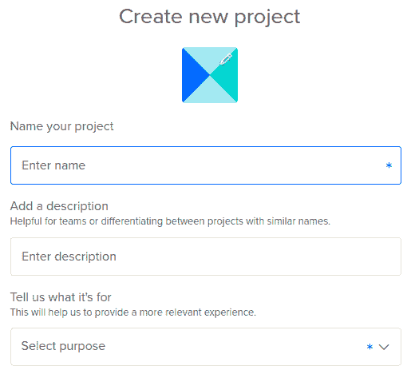

5.  创建项目后，您将被带到 DigitalOcean 仪表板。 您将能够看到创建 Droplet 的提示，如以下屏幕截图所示：

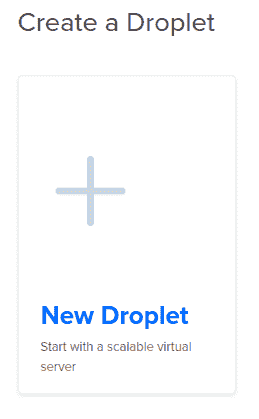

6.  单击“提示”以弹出 Droplet 创建表单。 选择下表中描述的选项：

    | **字段** | **说明** | **要使用的值** |
    | --- | --- | --- |
    | 选择一张图片 | Droplet 将在其上运行的操作系统。 | Ubuntu 18.04（或最新可用版本） |
    | 选择一个计划 | 选择 Droplet 的配置。 | 4 GB RAM 或更高 |
    | 添加块存储 | Droplet 的其他持久性，可拆卸存储容量。 | 保留默认值 |
    | 选择数据中心区域 | 投放 Droplet 的区域。 | 根据您的喜好选择任何一个 |
    | 选择其他选项 | 选择将与您的 Droplet 一起使用的所有其他功能。 | 保留默认值 |
    | 认证方式 | 选择虚拟机的认证方法。 | 一次性密码 |
    | 完成并创建 | Droplet 的一些其他设置和选项。 | 保留默认值 |

7.  单击“创建 Droplet”，然后等待 DigitalOcean 设置您的 Droplet。
8.  创建 Droplet 后，单击其名称以打开 Droplet 管理控制台，该控制台应如下所示：

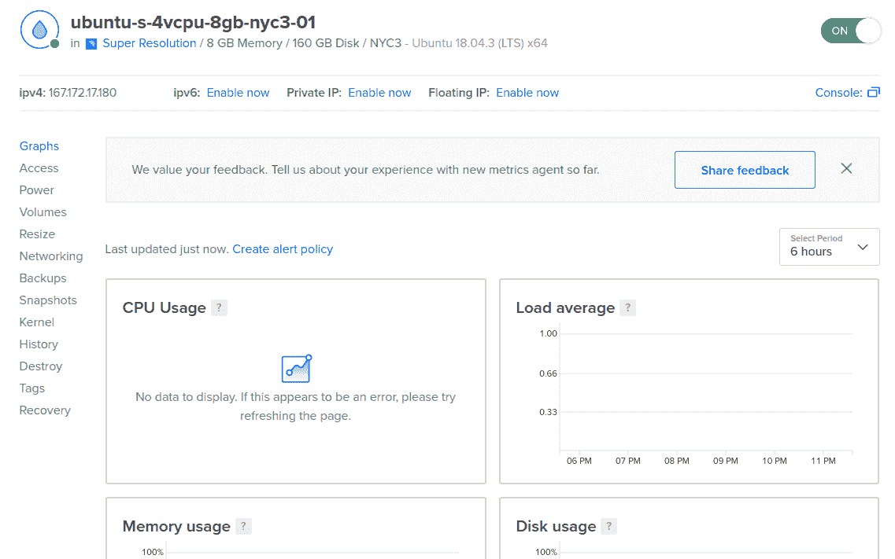

9.  现在，我们可以使用上一幅截图所示的 Droplet 控制台左侧导航菜单上的 Access 选项卡登录到 Droplet。 单击“访问”，然后启动控制台。
10.  将打开一个新的浏览器窗口，显示您的 Droplet 的 VNC 视图。 系统将要求您输入 Droplet 的用户名和密码。 您必须在此处使用的用户名是`root`。 可以在您已注册的电子邮件收件箱中找到该密码。
11.  首次登录时，系统会要求您更改 Droplet 密码。 确保您选择一个强密码。

12.  登录 Droplet 后，将在 VNC 终端上看到一些 Ubuntu 欢迎文本，如以下屏幕截图所示：

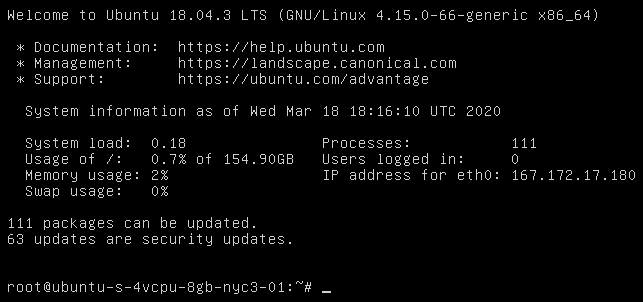

13.  现在，按照本书的“附录”中的说明，执行在云 VM 上设置深度学习环境的步骤。
14.  接下来，将项目存储库克隆到您的 Droplet，并使用以下命令将工作目录更改为存储库的`api`文件夹：

```py
git clone https://github.com/yourusername/yourrepo.git
cd yourrepo/api
```

15.  使用以下命令运行服务器：

```py
python3 flask_app.py
```

除了来自 TensorFlow 的一些警告消息之外，在终端输出的末尾，您还应该看到以下几行指示服务器已成功启动：

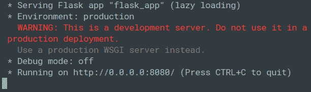

现在，如 Droplet 控制台所示，您的服务器已启动并在 Droplet 的 IP 上运行。

在下一部分中，我们将学习如何使用 Flutter 应用向服务器发出 POST 请求，并在屏幕上显示服务器的响应。

# 在 Flutter 上集成托管的自定义模型

在本节中，我们将向托管模型发出 POST 请求，并将其传递给用户选择的图像。 服务器将以 PNG 格式响应`NetworkImage`。 然后，我们将更新之前添加的图像小部件，以显示模型返回的增强图像。

让我们开始将托管模型集成到应用中：

1.  首先，我们将需要两个以上的外部库来发出成功的 POST 请求。 因此，我们将以下库作为依赖项添加到`pubspec.yaml`文件：

```py
dependencies:
     flutter:
          http: 0.12.0+4
          mime: 0.9.6+3
```

`http`依赖项包含一组类和函数，这些类和函数使使用 HTTP 资源非常方便。 `mime`依赖性用于处理 MIME 多部分媒体类型的流。

现在，我们需要运行`flutter pub get`以确保所有依赖项均已正确安装到我们的项目中。

2.  接下来，我们将所有新添加的依赖项导入`image_super_resolution.dart`文件：

```py
import 'package:http/http.dart' as http;
import 'package:mime/mime.dart';
```

3.  现在，我们需要定义`fetchResponse()`，它接受所选的图像文件并向服务器创建 POST 请求：

```py
void fetchResponse(File image) async {

    final mimeTypeData =
        lookupMimeType(image.path, headerBytes: [0xFF, 0xD8]).split('/');

    final imageUploadRequest = http.MultipartRequest('POST', Uri.parse("http://x.x.x.x:8080/generate"));

    final file = await http.MultipartFile.fromPath('image', image.path,
        contentType: MediaType(mimeTypeData[0], mimeTypeData[1]));

    imageUploadRequest.fields['ext'] = mimeTypeData[1];
    imageUploadRequest.files.add(file);
    try {
      final streamedResponse = await imageUploadRequest.send();
      final response = await http.Response.fromStream(streamedResponse);
      final Map<String, dynamic> responseData = json.decode(response.body);      
      String outputFile = responseData['result'];
    } catch (e) {
      print(e);
      return null;
    }
  }
```

在前面的方法中，我们通过使用`lookupMimeType`函数并使用文件的路径及其头来查找所选文件的 MIME 类型。 然后，按照托管模型的服务器的预期，初始化一个多部分请求。 我们使用 HTTP 执行此操作。 我们使用`MultipartFile.fromPath`并将`image`的值设置为作为`POST`参数附加的路径。 由于`image_picker`存在一些错误，因此我们将图片的扩展名明确传递给请求主体。 因此，它将图像扩展名与文件名（例如`filenamejpeg`）混合在一起，这在管理或验证文件扩展名时在服务器端造成了问题。 然后，来自服务器的响应将存储在`response`变量中。 响应为 JSON 格式，因此我们需要使用`json.decode()`对其进行解码。 该函数接收响应的主体，可以使用`response.body`进行访问。 我们将解码后的 JSON 存储在`responseData`变量中。 最后，使用`responseDate['result']`访问服务器的输出并将其存储在`outputFile`变量中。

4.  接下来，我们定义`displayResponseImage()`函数，该函数接受服务器在`outputFile`参数内返回的 PNG 文件的名称：

```py
void displayResponseImage(String outputFile) {
     print("Updating Image");
     outputFile = 'http://x.x.x.x:8080/download/' + outputFile;
     setState(() {        
        imageOutput = Image(image: NetworkImage(outputFile));
    });
 }

```

根据服务器的自定义，我们需要在文件名之前附加一个字符串以将其显示在屏幕上。 该字符串应包含服务器正在运行的端口地址，后跟`'/download/<outputFile>'`。 然后，我们将`outputFile`的最终值用作`url`值，将`imageOutput`小部件的值设置为`NetworkImage`。 另外，我们将其封装在[H​​TG5]中，以便在正确获取响应后可以刷新屏幕。

5.  接下来，我们在`fetchResponse()`的最后调用`displayResponseImage()`，并传入从托管模型收到的`outputFile`：

```py
void fetchResponse(File image) async {
    ....   
    displayResponseImage(outputFile);
}
```

6.  最后，通过传入用户最初选择的图像，将调用从`pickImage()`添加到`fetchResponse()`：

```py
void pickImage() async {
     ....
     fetchResponse(pickedImg);
 }
```

在前面的步骤中，我们首先向托管模型的服务器发出 POST 请求。 然后，我们解码响应并添加代码以在屏幕上显示它。 在`pickImage()`末尾添加`fetchResponse()`可确保仅在用户选择图像后才发出 POST 请求。 另外，为了确保在成功解码来自服务器的输出之后已经尝试显示响应图像，在`fetchResponse()`的末尾调用`displayImageResponse()`。 以下屏幕快照显示了屏幕的最终预期状态：

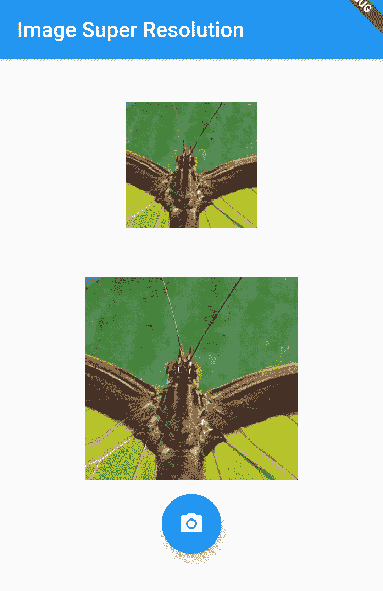

因此，我们已经完成了应用的构建，以便可以显示模型的输出。 我们将两个图像保存在屏幕上，以便我们可以看到它们之间的差异。

可以在[这个页面](https://github.com/PacktPublishing/Mobile-Deep-Learning-Projects/tree/master/Chapter9/flutter_image_super_resolution)上访问`image_super_resolution.dart`文件的代码。

# 创建材质应用

现在，我们将添加`main.dart`以创建最终的 Material 应用。 我们将创建一个名为`MyApp`的无状态小部件，并覆盖`build()`方法：

```py
class MyApp extends StatelessWidget {
     @override
     Widget build(BuildContext context) {
         return MaterialApp(
             title: 'Flutter Demo',
             theme: ThemeData(
                 primarySwatch: Colors.blue,
             ),
             home: ImageSuperResolution(),
         );
     }
}
```

最后，我们执行代码，如下所示：

```py
void main() => runApp(MyApp());
```

至此，我们完成了一个应用的创建，该应用允许用户选择图像并修改其分辨率。

# 总结

在本章中，我们研究了超分辨率图像以及如何使用 SRGAN 应用它们。 我们还研究了其他类型的 GAN 以及 GAN 的总体工作方式。 然后，我们讨论了如何创建一个 Flutter 应用，该应用可以与 DigitalOcean Droplet 上托管的 API 集成在一起，以便当从图库中拾取图像时可以执行图像超分辨率。 接下来，我们介绍了如何使用 DigitalOcean Droplet，以及由于其低成本和易于使用的界面而成为托管应用后端的理想选择。

在下一章中，我们将讨论一些流行的应用，这些应用通过将深度学习集成到其功能中而获得了很大的改进。 我们还将探索手机深度学习中的一些热门研究领域，并简要讨论已在其上进行的最新工作。