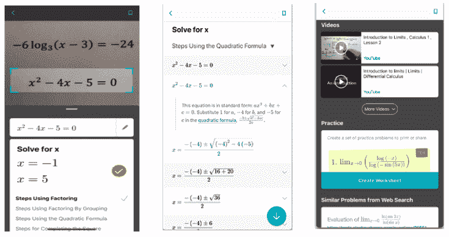
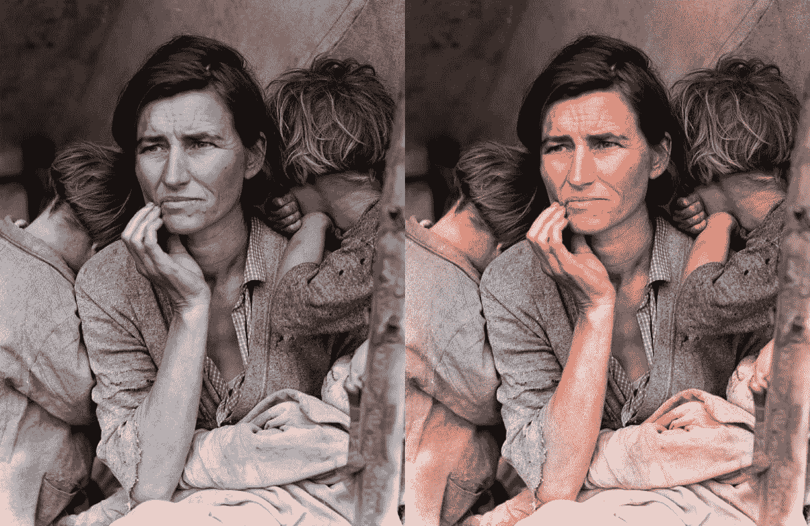

# 十、前方的路

旅程中最重要的部分是知道结束后要去哪里。 到目前为止，在本系列项目中，我们已经介绍了一些与 Flutter 应用相关的独特且功能强大的**深度学习**（**DL**）应用，但重要的是，您必须知道在哪里可以找到更多这样的项目，灵感和知识来构建自己的出色项目。 在本章中，我们将简要介绍当今在移动应用上使用 DL 的最流行的应用，当前趋势以及将来在该领域中将会出现的情况。

在本章中，我们将介绍以下主题：

*   了解移动应用中 DL 的最新趋势
*   探索移动设备上 DL 的最新发展
*   探索移动应用中 DL 的当前研究领域

让我们开始研究 DL 移动应用世界中的一些趋势。

# 了解移动应用中 DL 的最新趋势

特别是 DL，随着最新技术和硬件的发展，**人工智能**（**AI**）变得越来越移动。 组织一直在使用智能算法来提供个性化的用户体验并提高应用参与度。 借助人脸检测，图像处理，文本识别，对象识别和语言翻译等技术，移动应用已不仅仅是提供静态信息的媒介。 它们能够适应用户的个人偏好和选择以及当前和过去的环境状况，以提供无缝的用户体验。

让我们看一下一些流行的应用及其部署的方法，以提供良好的用户体验，同时增加应用的参与度。

# 数学求解器

数学求解器应用由微软于 2020 年 1 月 16 日启动，可通过简单地单击智能手机上有问题的图片来帮助学生完成数学作业。 该应用为基本和高级数学问题提供支持，涵盖了广泛的主题，包括基本算术，二次方程，微积分和统计。 以下屏幕截图显示了该应用的工作方式：

用户可以在其智能手机上单击手写或打印问题的图片，或直接在设备上涂鸦或键入图片。 该应用利用 AI 来识别问题并准确解决。 此外，它还可以提供分步说明，并提供其他学习资料，例如与问题有关的工作表和视频教程。

# Netflix

Netflix 的推荐系统是在移动应用上使用 DL 的最大成功案例之一。 Netflix 利用多种算法来了解用户的偏好，并提供了他们可能感兴趣的推荐列表。所有内容都标记有标签，这些标签提供了可以从中学习算法的初始数据集。 此外，该系统监视着超过 1 亿个用户个人资料，以分析人们观看的内容，以后可能观看的内容，以前观看的内容，一年前观看的内容，等等。 将收集的所有数据汇总在一起，以了解用户可能感兴趣的内容类型。

然后，将使用标签和用户行为收集的数据汇总在一起，并输入到复杂的 ML 算法中。 这些数据有助于解释可能最重要的因素-例如，如果用户一年前观看的电影与上周观看的系列相比应被计数两次。 该算法还可以从用户行为中学习，例如用户喜欢还是不喜欢特定的内容，或者用户在 2 个晚上观看和观看的节目。 将所有因素汇总在一起并进行仔细分析，从而得出用户可能最感兴趣的建议列表。

# 谷歌地图

Google Maps 已帮助通勤者前往新地方，探索新城市并监控每日流量。 在 2019 年 6 月上旬，谷歌地图发布了一项新功能，使用户可以监控印度 10 个主要城市的巴士旅行时间，以及从印度铁路局获得实时更新。 该功能位于班加罗尔，钦奈，哥印拜陀，德里，海得拉巴，勒克瑙，孟买，浦那和苏拉特，它利用 Google 的实时交通数据和公交时刻表来计算准确的出行时间和延误。 支持该功能的算法可从总线位置随时间的顺序中学习。 该数据还与通勤时公交车上的汽车速度结合在一起。 数据还用于捕获特定街道的独特属性。 研究人员还模拟了围绕某个区域弹出查询的可能性，以使该模型更加健壮和准确。

# Tinder

作为结识新朋友的全球最受欢迎的应用，Tinder 部署了许多学习模型，以增加喜欢特定个人资料的人数。 **智能照片**功能增加了用户找到正确匹配项的可能性。 该功能随机排序特定用户的图片并将其显示给其他人。 支持该功能的算法分析了向左或向右滑动图片的频率。 它使用该知识根据图片的受欢迎程度对其重新排序。 随着越来越多的数据收集，该算法的准确率一直在不断提高。

# Snapchat

Snapchat 使用的过滤器是在图片和视频的顶部添加的设计叠加层，可以跟踪面部移动。 这些过滤器是通过计算机视觉实现的。 应用使用的算法的第一步是检测图像中存在的面部。 它输出包围检测到的面部的框。 然后，它为检测到的每个脸部标记面部标志（例如眼睛，鼻子和嘴唇）。 这里的输出通常是一个包含`x`-坐标和`y`-坐标的二维点。 正确检测到面部和面部特征后，它将使用图像处理功能在整个面部上正确放置或应用过滤器。 该算法使用 Active Shape Model 进一步分析了关键的面部特征。 在通过手动标记关键面部特征的边界进行训练后，该模型将创建与屏幕上出现的面部对齐的平均面部。 该模型将创建一个网格，以正确放置过滤器并跟踪其运动。

现在，我们来看看 DL 领域的研究领域。

# 探索移动设备上 DL 的最新发展

随着 DL 和 AI 的复杂性与移动应用的结合，正在不断进行软件和硬件优化，以在设备上高效运行模型。 让我们看看其中的一些。

# 谷歌的 MobileNet

Google 的 MobileNet 于 2017 年推出。它是基于 TensorFlow 的一组移动优先计算机视觉模型，经过精心优化以在受限的移动环境中高效运行。 它充当复杂神经网络结构的准确率与移动运行时性能约束之间的桥梁。 由于这些模型具有在设备本身上本地运行的能力，因此 MobileNet 具有安全性，隐私性和灵活的可访问性的优点。 MobileNet 的两个最重要的目标是在处理计算机视觉模型时减小尺寸并降低复杂性。 MobileNet 的第一个版本提供了低延迟模型，该模型能够在受限资源下正常工作。 它们可用于分类，检测，嵌入和分段，支持各种用例。

于 2018 年发布的 MobileNetV2 是对第一个版本的重大增强。 它可以用于语义分割，对象检测和分类。 作为 TensorFlow-Slim 图像分类库的一部分启动的 MobileNetV2，可以从 Colaboratory 直接访问。 也可以在本地下载，使用 Jupyter 进行浏览，也可以从 TF-Hub 和 GitHub 访问。 添加到架构中的两个最重要的功能是层之间的线性瓶颈和瓶颈之间的快捷连接。 瓶颈对中间的输入和输出进行编码，并且内层支持从较低级别的概念转换为较高级别的描述符的功能。 传统的剩余连接和快捷方式有助于减少训练时间并提高准确率。 与第一个版本相比，MobileNetV2 更快，更准确，并且所需的操作和参数更少。 它非常有效地用于对象检测和分割以提取特征。

[您可以在此处阅读有关此研究工作的更多信息](https://arxiv.org/abs/1905.02244)。

# 阿里巴巴移动神经网络

阿里巴巴**移动神经网络**（**MNN**）是开源的轻量级 DL 推理引擎。 阿里巴巴工程副总裁贾阳清说：“与 TensorFlow 和 Caffe2 等通用框架相比，它既涵盖训练又包括推理，MNN 专注于推理的加速和优化，并解决了模型部署过程中的效率问题。 因此可以在移动端更高效地实现模型背后的服务，这实际上与 TensorRT 等服务器端推理引擎中的思想相符在大型机器学习应用中，推理的计算量通常是 10 倍以上，因此，进行推理的优化尤为重要。”

MNN 的主要关注领域是**深度神经网络**（**DNN**）模型的运行和推断。 它专注于模型的优化，转换和推断。 MNN 已被成功用于阿里巴巴公司的许多移动应用中，例如 Mobile Tmall，Mobile Taobao，Fliggy，UC，Qianuu 和 Juhuasuan。 它涵盖了搜索推荐，短视频捕获，直播，资产分配，安全风险控制，交互式营销，按图像搜索产品以及许多其他实际场景。 菜鸟呼叫机柜等**物联网**（**IoT**）设备也越来越多地使用技术。 MNN 具有很高的稳定性，每天可以运行超过 1 亿次。

MNN 具有高度的通用性，并为市场上大多数流行的框架提供支持，例如 TensorFlow，Caffe 和**开放式神经网络交换**（**ONNX**）。 它与**卷积神经网络**（**CNN**）和**循环神经网络**（**RNN**）等通用神经网络兼容。 MNN 轻巧且针对移动设备进行了高度优化，并且没有依赖关系。 它可以轻松部署到移动设备和各种嵌入式设备。 它还通过**便携式操作系统接口**（**POSIX**）支持主要的 Android 和 iOS 移动操作系统以及嵌入式设备。 MNN 不受任何外部库的影响，可提供非常高的性能。 它的核心操作通过大量的手写汇编代码来实现，以充分利用**高级 RISC 机器**（**ARM**）CPU 的优势。 借助高效的**图像处理模块**（**IPM**），无需 libyuv 或 OpenCV 即可加速仿射变换和色彩空间变换，MNN 易于使用。

在积极开发和研究这些产品的同时，现在让我们看一下将来有望变得越来越重要的一些领域。

# 探索移动应用中 DL 的当前研究领域

活跃的研究人员社区要投入时间和精力，对于任何研究领域的健康发展至关重要。 幸运的是，DL 在移动设备上的应用引起了全球开发人员和研究人员的强烈关注，许多手机制造商（例如三星，苹果，Realme 和 Xiaomi）将 DL 直接集成到了系统**用户界面**中 （**UI**）为所有设备生成。 这极大地提高了模型的运行速度，并且通过系统更新定期提高模型的准确率。

让我们看一下该领域中一些最受欢迎的研究领域，以及它们是如何发展的。

# DeepFashion

在 2019 年，DeepFashion2 数据集由葛玉英，张瑞茂等提出。 该数据集是对 DeepFashion 数据集的改进，包括来自卖方和消费者的 491,000 张图像。 数据集可识别 801,000 件服装。 数据集中的每个项目都标有比例，遮挡，放大，视点，类别，样式，边界框，密集的界标和每个像素的蒙版。

数据集在训练集中有 391,000 张图像，在验证集中有 34,000 张图像，在测试集中有 67,000 张图像。 该数据集提供了提出更好的模型的可能性，该模型能够从图像中识别时装和不同的服装。 可以轻松想象此数据集可能会导致的应用范围-包括在线商店根据消费者经常穿的衣服推荐要购买的产品，以及首选品牌和产品的预期价格范围。 仅通过识别他们所穿的服装和品牌，也有可能识别任何人可能从事的职业及其财务，宗教和地理细节。

[您可以在此处阅读有关 DeepFashion2 数据集的更多信息](https://arxiv.org/abs/1901.07973)。

# 自我注意生成对抗网络

我们在“第 9 章”，“构建图像超分辨率应用”中讨论了**生成对抗网络**（**GAN**）的应用，其中我们从低分辨率图像中生成高分辨率图像。 GAN 在学习模仿艺术和图案方面做得相当不错。 但是，在需要记住更长的序列的情况下，以及在序列的多个部分对于生成生成的输出很重要的情况下，它们无法很好地执行。 因此，我们期待 Ian Goodfellow 及其团队推出的**自我注意力 GAN**（**SAGAN**），它们是对图像生成任务应用注意力驱动的远程依赖建模的 GAN 系统。 该系统在 ImageNet 数据集上具有更好的性能，并有望在将来被广泛采用。

Jason Antic 的 DeOldify 项目是使用 SAGANs 完成的工作的衍生产品。 该项目旨在将色彩带入旧的图像和视频中，从而使它们似乎从来没有缺少色彩。 以下屏幕快照显示了 DeOldify 项目的示例：

**Dorothea Lange（1936）的《移民母亲》**。 图像取自 [DeOldify GitHub 存储库](https://github.com/jantic/DeOldify)。 该项目可通过[这里](https://deoldify.ai/)进行测试和演示。 您可以在[这个页面](https://arxiv.org/abs/1805.08318)上了解有关 SAGAN 的更多信息。

# 图片动画

Facebook 是一个流行的社交媒体平台，具有用于多个平台的专用应用，一直在致力于创建工具，使您可以使用普通的相机生成 3D 图像，否则这些相机只会生成 2D 图像。 图像动画是一项类似的技术，可让我们将动画带入静态图像。 可以想象这种技术非常令人兴奋的用法，人们拍摄自拍照，然后从运动库中进行选择以对其图像进行动画处理，就好像他们自己在进行这些运动一样。

图像动画虽然还处于起步阶段，但可以成为流行和有趣的应用，考虑到采用 Deepfake 技术的类似应用已成功地成为一项业务-例如，中国的 Zao 应用。

[您可以在此处阅读图像动画研究论文](https://arxiv.org/abs/2003.00196v1)。

# 总结

在本章中，我们讨论了一些最流行的移动应用，这些应用因其在业务产品中最前沿地使用 DL 而著称，还讨论了 DL 影响其增长的方式。 我们还讨论了移动应用 DL 领域的最新发展。 最后，我们讨论了该领域的一些令人兴奋的研究领域，以及它们将来如何发展成潜在的流行应用。 我们相信，到目前为止，您将对如何在移动应用上部署 DL 以及如何使用 Flutter 来构建可在所有流行的移动平台上运行的跨平台移动应用有一个很好的了解。

我们在本章结束时希望，您将充分利用本项目系列中介绍的思想和知识，并构建出令人敬畏的东西，从而在此技术领域带来一场革命。
