# 十一、附录

计算机科学领域令人兴奋的是，它允许多个软件组件组合在一起并致力于构建新的东西。 在这个简短的附录中，我们介绍了在移动设备上进行深度学习之前需要设置的工具，软件和在线服务。

在本章中，我们将介绍以下主题：

*   在 Cloud VM 上设置深度学习环境
*   安装 Dart SDK
*   安装 Flutter SDK
*   配置 Firebase
*   设置 **Visual Studio**（**VS**）代码

# 在 Cloud VM 上设置深度学习环境

在本节中，我们将提供有关如何在 **Google Cloud Platform**（**GCP**）计算引擎**虚拟机**（VM）实例以执行深度学习。 您也可以轻松地将此处描述的方法扩展到其他云平台。

我们将以快速指南开始，介绍如何创建您的 GCP 帐户并为其启用结算功能。

# 创建 GCP 帐户并启用结算

要创建 GCP 帐户，您需要一个 Google 帐户。 如果您有一个以`@gmail.com`结尾的电子邮件地址或 G Suite 上的帐户，则您已经有一个 Google 帐户。 否则，您可以通过访问[这里](https://accounts.google.com/sigNup)创建一个 Google 帐户。 登录到 Google 帐户后，请执行以下步骤：

1.  在浏览器上访问[这里](https://console.cloud.google.com/)。
2.  接受在弹出窗口中显示给您的所有条款。
3.  您将能够查看 GCP 控制台信息中心。 您可以通过阅读[这个页面](https://support.google.com/cloud/answer/3465889)上的支持文档来快速使用此仪表板。
4.  在左侧导航菜单上，单击“计费”以打开计费管理仪表板。 系统将提示您添加一个计费帐户，如以下屏幕截图所示：

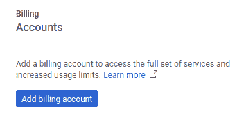

5.  点击“添加结算帐户”。 如果有资格，您将被重定向到`GCP Free Trial`注册页面。 您可以在[这个页面](https://cloud.google.com/free/docs/gcp-free-tier)上了解有关免费试用的更多信息。 您应该看到类似于以下屏幕截图的屏幕：


6.  根据需要填写表格。 创建完帐单后，请返回 GCP 控制台信息中心。

您已成功创建 GCP 帐户并为其启用了结算功能。 接下来，您将能够在 GCP 控制台中创建一个项目并将资源分配给该项目。 我们将在接下来的部分中对此进行演示。

# 创建一个项目和 GCP Compute Engine 实例

在本部分中，您将在 GCP 帐户上创建一个项目。 GCP 中的所有资源都封装在项目下。 项目可能属于或不属于组织。 一个组织下可以有多个项目，而一个项目中可能有多个资源。 让我们开始创建项目，如以下步骤所示：

1.  在屏幕的左上方，单击“选择项目”下拉菜单。
2.  在出现的对话框中，单击对话框右上方的“新建项目”。

3.  您将看到新的项目创建表单，如以下屏幕截图所示：

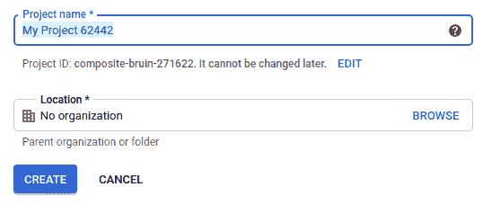

4.  填写必要的详细信息后，单击`CREATE`完成创建项目。 创建项目后，将带您到项目的仪表板。 在这里，您将能够查看与当前所选项目相关的一些基本日志记录和监视。 您可以在[这个页面](https://cloud.google.com/docs/overview)上了解有关 GCP 资源组织方式的更多信息。
5.  在左侧导航窗格中，单击`Compute Engine`。 系统将提示您创建一个 VM 实例。
6.  点击“创建”以显示 Compute Engine 实例创建表单。 根据需要填写表格。 我们假设您在创建实例时选择了 Ubuntu 18.04 LTS 发行版。
7.  确保在防火墙设置中启用对 VM 实例的 HTTP 和 HTTPS 连接的访问​​，如以下屏幕快照所示：

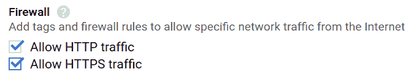

8.  单击“创建”。 GCP 开始为您配置 VM 实例。 您将被带到 VM 实例管理页面。 您应该在此页面上看到您的 VM，如以下屏幕截图所示：

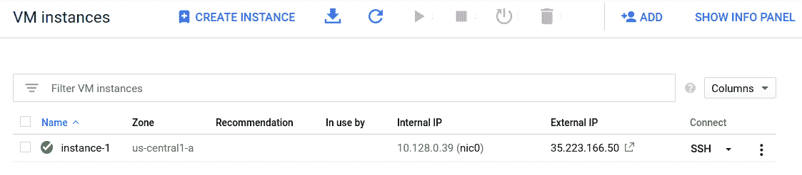

现在，您准备开始配置此 VM 实例以执行深度学习。 我们将在下一部分中对此进行介绍。

# 配置您的 VM 实例来执行深度学习

在本节中，我们将指导您如何安装包和模块，以在创建的 VM 实例上执行深度学习。 这些包和模块的安装说明在您选择的任何云服务提供商中都是相似的。

您还可以在本地系统上使用类似的命令，以设置本地深度学习环境。

首先调用 VM 的终端：

1.  单击 VM 实例页面上的`SSH`按钮，以启动到 VM 的终端会话。

2.  您应该看到终端会话开始，其中包含一些与系统有关的常规信息以及上次登录的详细信息，如以下屏幕截图所示：

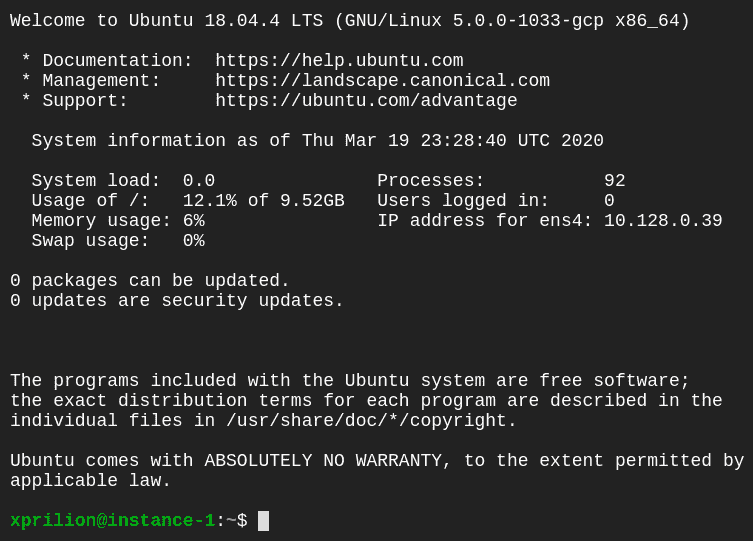

3.  现在，让我们对该新创建的实例的包存储库执行更新：

```py
sudo apt update
```

4.  接下来，我们将在此 VM 上安装 **Anaconda**。 Anaconda 是一个受欢迎的包集合，用于使用 Python 执行深度学习和与数据科学相关的任务。 它带有`conda`包管理器打包在一起，这使得管理系统上安装的 Python 包的不同版本非常容易。 要安装它，我们首先需要获取 Anaconda 安装程序下载链接。 前往[这里](https://www.anaconda.com/distribution/#download-section)。 您将转到一个页面，为您提供要安装的 Anaconda 版本的选择，如以下屏幕截图所示：

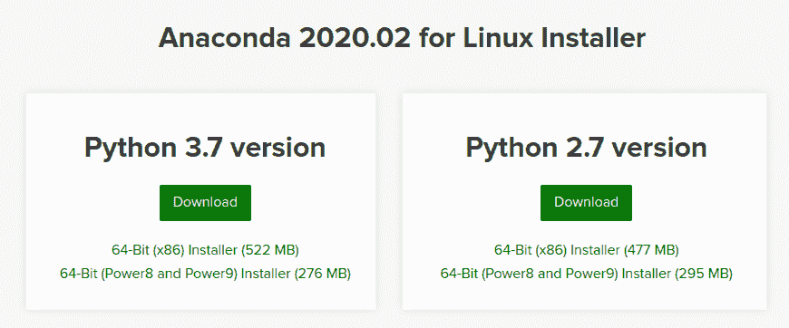

5.  建议您选择 Python 3.7 版本。 右键单击“下载”按钮，然后在菜单中找到允许您复制链接地址的选项。
6.  切换到您的 VM 实例的终端会话。 使用以下命令将占位符文本粘贴到命令中，从而将其替换为您复制的链接，如下所示：

```py
curl -O <link_you_have_copied>
```

7.  前面的命令会将 Anaconda 安装程序下载到当前用户的主目录中。 要对其进行验证，可以使用`ls`命令。 现在，要将此文件设置为可执行文件，我们将使用以下命令：

```py
chmod +x Anaconda*.sh
```

8.  现在，安装程序文件可以由您的系统执行。 要开始执行，请使用以下命令：

```py
./Anaconda*.sh
```

9.  安装应开始。 应该显示一个提示，询问您是否接受 Anaconda 软件的许可协议，如下所示：

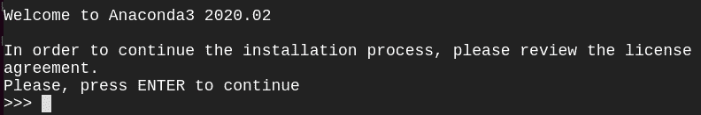

10.  点击`Enter`继续检查许可证。 您会看到许可证文件。
11.  点击向下箭头键以阅读协议。 输入`yes`接受许可证。
12.  系统将要求您确认 Anaconda 安装的位置，如以下屏幕截图所示：

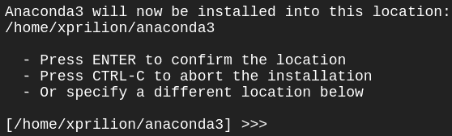

13.  点击`Enter`确认位置。 包提取和安装将开始。 完成此操作后，系统将询问您是否要初始化 Anaconda 环境。 在此处输入`yes`，如下所示：

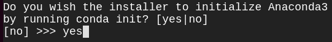

14.  现在，安装程序将完成其任务并退出。 要激活 Anaconda 环境，请使用以下命令：

```py
source ~/.bashrc
```

15.  您已经成功安装了 Anaconda 环境并激活了它。 要检查安装是否成功，请在终端中输入以下命令：

```py
python3
```

如果以下命令的输出在第二行包含单词 Anaconda，Inc.，则表明安装成功。 您可以在以下屏幕截图中看到它：

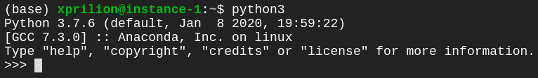

现在，您可以在此环境上开始运行深度学习脚本。 但是，您将来可能希望向此环境添加更多工具库，例如 PyTorch 或 TensorFlow 或任何其他包。 由于本书假定读者熟悉 Python，因此我们不会详细讨论`pip`工具。

现在让我们看一下如何在 VM 上安装 TensorFlow。

# 在 VM 上安装 TensorFlow

TensorFlow 是执行深度学习的绝佳框架。

要安装它，可以使用以下命令：

```py
# TensorFlow 1 with CPU only support
python3 -m pip install tensorflow==1.15

# TensorFlow 1 with GPU support
python3 -m pip install tensorflow-gpu==1.15

# TensorFlow 2 with CPU only support
python3 -m pip install tensorflow

# Tensorflow 2 with GPU support
python3 -m pip install tensorflow-gpu

```

Python 中另一个经常安装的流行库是自然语言工具包（NLTK）库。 我们将在接下来的部分中演示其安装过程。

# 在 VM 上安装 NLTK 并下载包

要在 VM 上安装 NLTK 并为其下载数据包，请执行以下步骤：

1.  使用`pip`安装 NLTK：

```py
python3 -m pip install nltk
```

2.  NLTK 有几种不同的数据包。 在大多数情况下，您并不需要全部。 要列出 NLTK 的所有可用数据包，请使用以下命令：

```py
python3 -m nltk.downloader
```

前面命令的输出将允许您交互式地查看所有可用的包，选择所需的包，然后下载它们。

3.  但是，如果您只希望下载一个包，请使用以下命令：

```py
python3 -m nltk.downloader stopwords
```

前面的命令将下载 NLTK 的`stopwords`数据包。 在极少数情况下，您可能会发现自己需要或使用 NLTK 中可用的所有数据包。

通过这种设置，您应该能够在云 VM 上运行大多数深度学习脚本。

在下一部分中，我们将研究如何在本地系统上安装 Dart。

# 安装 Dart SDK

Dart 是 Google 开发的一种面向对象的语言。 它用于移动和 Web 应用开发。 Flutter 是用 Dart 构建的。 Dart 具有**即时**（**JIT**）开发周期，该状态与有状态的热重载兼容，并且具有提前编译的功能，可以快速启动并提供可预测的性能，这使其成为了可能。 适用于 Flutter。

以下各节讨论如何在 Windows，macOS 和 Linux 上安装 Dart。

# Windows

在 Windows 中安装 Dart 的最简单方法是使用 Chocolatey。 只需在终端中运行以下命令：

```py
 C:\> choco install dart-sdk
```

接下来，我们将研究如何在 Mac 系统上安装 Dart。

# MacOS

要在 macOS 上安装 Dart，请执行以下步骤：

1.  通过在终端中运行以下命令来安装 Homebrew：

```py
$ /usr/bin/ruby -e "$(curl -fsSL https://raw.githubusercontent.com/Homebrew/install/master/install)"
```

2.  运行以下命令以安装 Dart：

```py
$brew tap dart-lang/dart
$brew install dart
```

接下来，我们将研究如何在 Linux 系统上安装 Dart。

# Linux

Dart SDK 可以如下安装在 Linux 中：

1.  执行以下一次性设置：

```py
$sudo apt-get update
$sudo apt-get install apt-transport-https
$sudo sh -c 'wget -qO- https://dl-ssl.google.com/linux/linux_signing_key.pub | apt-key add -'
$sudo sh -c 'wget -qO- https://storage.googleapis.com/download.dartlang.org/linux/debian/dart_stable.list > /etc/apt/sources.list.d/dart_stable.list'
```

2.  安装稳定版本：

```py
$sudo apt-get update
$sudo apt-get install dart
```

接下来，我们将研究如何在本地计算机上安装 Flutter SDK。

# 安装 Flutter SDK

Flutter 是 Google 的一个工具包，用于使用单个代码库构建本地编译的 Android，iOS 和 Web 应用。 Flutter 具有热重载的快速开发，易于构建的表达性 UI 和本机性能等功能，这些都使 Flutter 成为应用开发人员的首选。

以下各节讨论如何在 Windows，macOS 和 Linux 上安装 Flutter SDK。

# Windows

以下步骤详细概述了如何在 Windows 上安装 Flutter：

1.  从[这里](https://storage.googleapis.com/flutter_infra/releases/stable/windows/flutter_windows_v1.9.1+hotfix.6-stable.zip)下载最新的 Flutter SDK 稳定版本。
2.  解压缩 ZIP 文件夹，并导航到要安装 Flutter SDK 的目录，以放置`flutter`文件夹。

避免将`flutter`放在可能需要特殊特权的目录中，例如`C:\Program Files\`。

3.  在“开始”搜索栏中输入`env`，然后选择“编辑环境变量”。
4.  使用`;`作为分隔符，将`flutter/bin`的完整路径附加到**用户变量**下的**路径**。

如果缺少`Path`条目，只需创建一个新的`Path`变量并将`path`设置为`flutter/bin`作为其值。

5.  在终端中运行`flutter doctor`。

`flutter doctor`分析整个 Flutter 的安装，以检查是否需要更多工具才能在计算机上成功运行 Flutter。

接下来，我们将研究如何在 Mac 系统上安装 Flutter。

# MacOS

Flutter 可以如下安装在 macOS 上：

1.  从[这里](https://storage.googleapis.com/flutter_infra/releases/stable/macos/flutter_macos_v1.9.1+hotfix.6-stable.zip)下载最新的稳定 SDK。
2.  将下载的 ZIP 文件夹解压缩到合适的位置，如下所示：

```py
$cd ~/
$unzip ~/Downloads/flutter_macos_v1.9.1+hotfix.6-stable.zip
```

3.  将`flutter`工具添加到路径变量：`$ export PATH=`pwd`/flutter/bin:$PATH`。
4.  打开`bash_profile`以永久更新`PATH`：

```py
$cd ~
$nano .bash_profile
```

5.  将以下行添加到`bash_profile`：

```py
$export PATH=$HOME/flutter/bin:$PATH
```

6.  运行`flutter doctor`。

# Linux

以下步骤概述了如何在 Linux 上安装 Flutter：

1.  从[这里](https://storage.googleapis.com/flutter_infra/releases/stable/linux/flutter_linux_v1.9.1+hotfix.6-stable.tar.xz)下载 SDK 的最新稳定版本。
2.  将文件提取到合适的位置：

```py
 $cd ~/development
 $tar xf ~/Downloads/flutter_linux_v1.9.1+hotfix.6-stable.tar.xz
```

3.  将`flutter`添加到`path`变量中：

```py
$export PATH="$PATH:`pwd`/flutter/bin"
```

4.  运行`flutter doctor`。

接下来，我们将研究如何配置 Firebase 以提供 ML Kit 和自定义模型。

# 配置 Firebase

Firebase 提供了可促进应用开发并帮助支持大量用户的工具。 Firebase 可以轻松用于 Android，iOS 和 Web 应用。 Firebase 提供的产品（例如 Cloud Firestore，ML Kit，Cloud Functions，Authentication，Crashlytics，Performance Monitoring，Cloud Messaging 和 Dynamic Links）有助于构建应用，从而在不断发展的业务中提高应用质量。

要集成 Firebase 项目，您需要创建一个 Firebase 项目并将其集成到您的 Android 或 iOS 应用中。 以下各节讨论如何创建 Firebase 项目并将其集成到 Android 和 iOS 项目中。

# 创建 Firebase 项目

首先，我们需要创建一个 Firebase 项目并将其链接到我们的 Android 和 iOS 项目。 此链接有助于我们利用 Firebase 提供的功能。

要创建 Firebase 项目，请执行以下步骤：

1.  通过[这里](https://console.firebase.google.com)访问 Firebase 控制台。
2.  单击“添加项目”以添加新的 Firebase 项目：

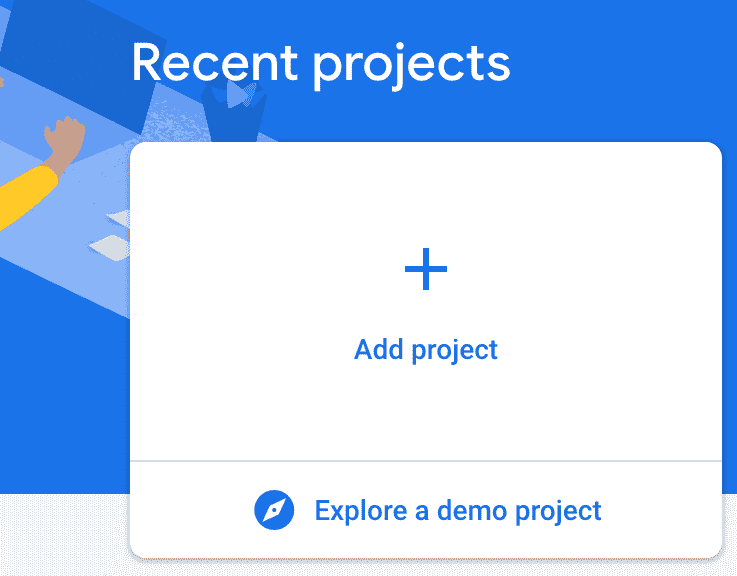

3.  为您的项目提供一个名称：

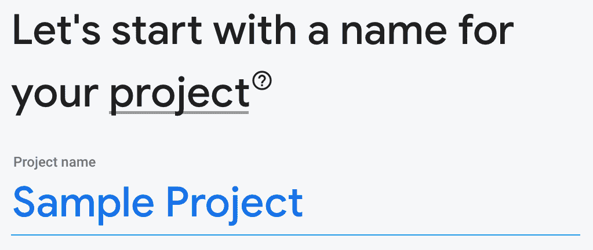

4.  根据您的要求启用/禁用 Google Analytics（分析）。 通常建议您保持启用状态。

**Google Analytics** 是一种免费且不受限制的分析解决方案，可在 Firebase Crashlytics，Cloud Messaging，应用内消息传递，远程配置，A/B 测试，预测和 Cloud Functions 中实现目标定位，报告等功能。

4.  如果您选择 Firebase Analytics，则还需要选择一个帐户：

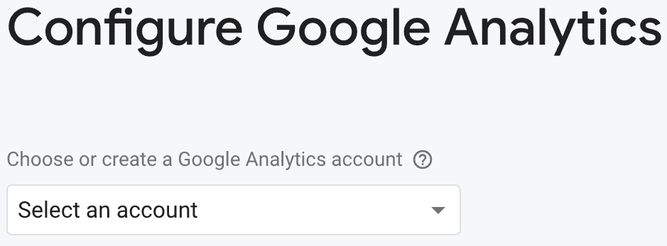

在 Firebase 控制台上创建项目后，您将需要分别为 Android 和 iOS 平台进行配置。

# 配置 Android 项目

以下步骤讨论了如何配置 Android 项目以支持 Firebase：

1.  导航到 Firebase 控制台上的应用。 在项目概述页面的中心，单击 Android 图标以启动工作流程设置：

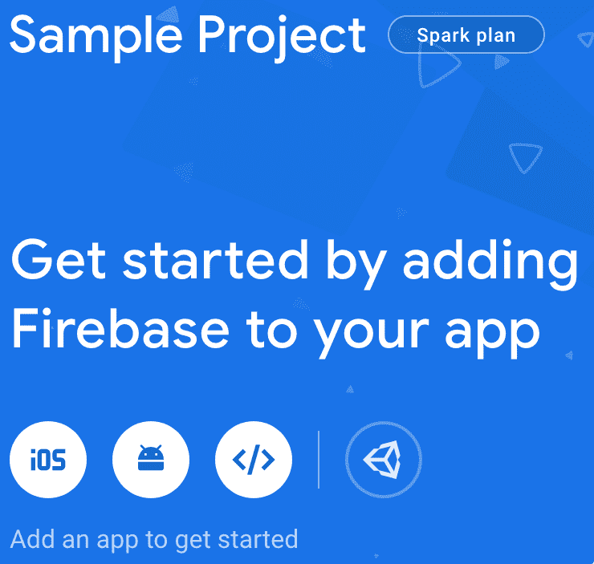

2.  添加包名称以在 Firebase 控制台上注册该应用。 此处填写的包名称应与您的应用的包名称匹配。 此处提供的包名称用作标识的唯一密钥：


此外，您可以提供昵称和调试签名证书 SHA-1。

3.  下载`google-services.json`文件并将其放在`app`文件夹中：

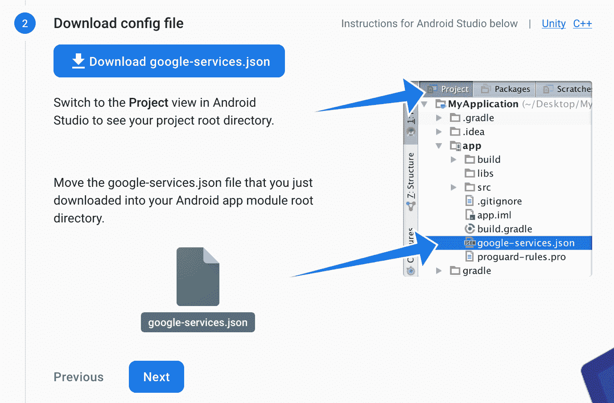

`google-services.json`文件存储开发人员凭据和配置设置，并充当 Firebase 项目和 Android 项目之间的桥梁。

4.  用于 Gradle 的 Google 服务插件会加载您刚刚下载的`google-services.json`文件。 项目级别的`build.gradle`（`<project>/build.gradle`）应该进行如下修改，以使用该插件：

```py
buildscript {
  repositories {
    // Check that you have the following line (if not, add it):
    google()  // Google's Maven repository
  }
  dependencies {
    ...
    // Add this line
    classpath 'com.google.gms:google-services:4.3.3'
  }
}

allprojects {
  ...
  repositories {
    // Check that you have the following line (if not, add it):
    google()  // Google's Maven repository
    ...
  }
}

```

5.  这是应用级别的`build.gradle`（`<p` `roject>/<app-module>build.gradle`）：

```py
apply plugin: 'com.android.application'
// Add this line
apply plugin: 'com.google.gms.google-services'

dependencies {
  // add SDKs for desired Firebase products
  // https://firebase.google.com/docs/android/setup#available-libraries
}
```

现在，您都可以在 Android 项目中使用 Firebase。

# 配置 iOS 项目

以下步骤演示了如何配置 iOS 项目以支持 Firebase：

1.  导航到 Firebase 控制台上的应用。 在项目概述页面的中心，单击 iOS 图标以启动工作流程设置：

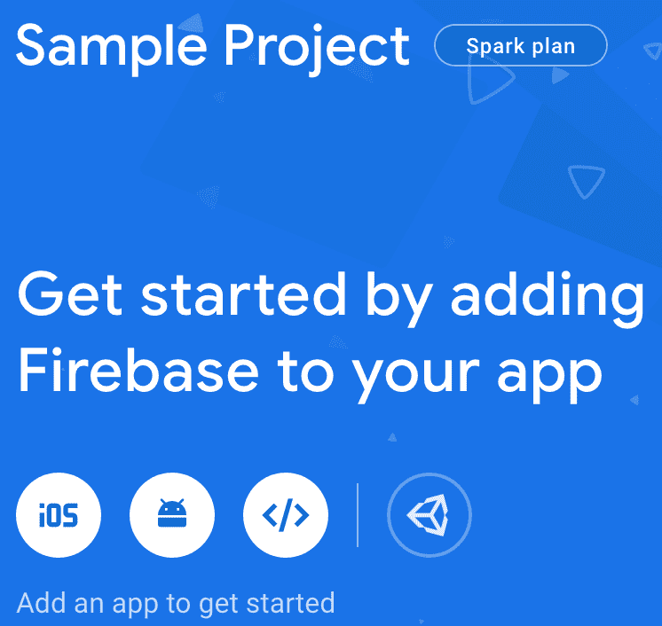

2.  添加 iOS 捆绑包 ID 名称，以在 Firebase 控制台上注册该应用。 您可以在“常规”选项卡中的**捆绑包标识符**中找到应用主要目标的 Xcode。 它用作标识的唯一密钥：

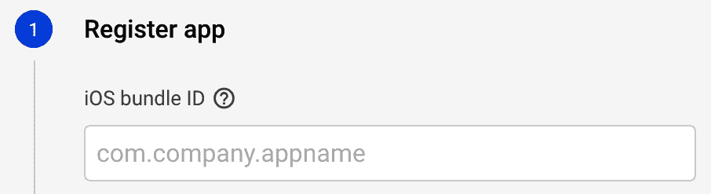

此外，您可以提供昵称和 App Store ID。

3.  下载`GoogleService-Info.plist`文件：

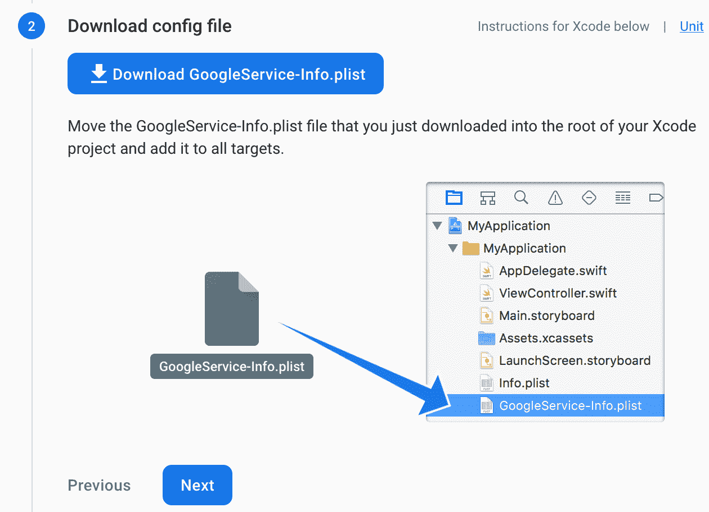

4.  将刚刚下载的`GoogleService-Info.plist`文件移到 Xcode 项目的根目录中，并将其添加到所有目标中。

Google 服务使用 CocoaPods 来安装和管理依赖项。

5.  打开一个终端窗口，然后导航到您的应用的 Xcode 项目的位置。 如果没有，请在此文件夹中创建一个 Podfile：

```py
pod init
```

6.  打开您的 Podfile 并添加以下内容：

```py
# add pods for desired Firebase products # https://firebase.google.com/docs/ios/setup#available-pods
```

7.  保存文件并运行：

```py
pod install
```

这将为您的应用创建一个`.xcworkspace`文件。 使用此文件进行应用的所有将来开发。

8.  要在应用启动时连接到 Firebase，请将以下初始化代码添加到主`AppDelegate`类中：

```py
import UIKit
import Firebase

@UIApplicationMain
class AppDelegate: UIResponder, UIApplicationDelegate {

  var window: UIWindow?

  func application(_ application: UIApplication,
    didFinishLaunchingWithOptions launchOptions:
      [UIApplicationLaunchOptionsKey: Any]?) -> Bool {
    FirebaseApp.configure()
    return true
  }
}
```

现在，您都可以在 Android 项目中使用 Firebase。

# 设置 VS 代码

**Visual Studio**（**VS**）Code 是由 Microsoft 开发的轻型代码编辑器。 它的简单性和广泛的插件存储库使其成为开发人员的便捷工具。 凭借其 Dart 和 Flutter 插件，以及应用执行和调试支持，Flutter 应用非常易于开发。

在接下来的部分中，我们将演示如何设置 VS Code 以开发 Flutter 应用。 我们将从[这里](https://code.visualstudio.com/)下载最新版本的 VS Code 开始。

# 安装 Flutter 和 Dart 插件

首先，我们需要在 VS Code 上安装 Flutter 和 Dart 插件。

可以按照以下步骤进行：

1.  在计算机上加载 VS Code。
2.  导航到“查看 | 命令面板”。
3.  开始输入`install`，然后选择扩展：安装扩展。
4.  在扩展搜索字段中键入`flutter`，从列表中选择 Flutter，然后单击**安装**。 这还将安装所需的 Dart 插件。
5.  或者，您可以导航到侧栏来安装和搜索扩展：

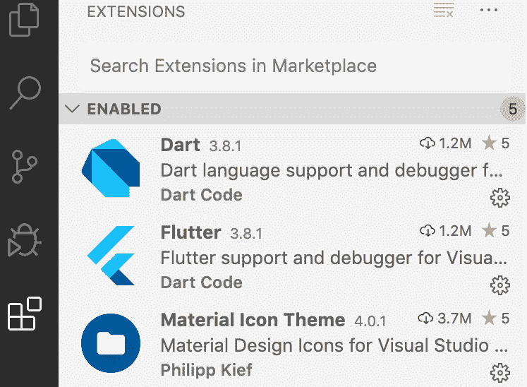

成功安装 Flutter 和 Dart 扩展后，我们需要验证设置。 下一节将对此进行描述。

# 用 Flutter Doctor 验证设置

通常建议您验证设置以确保一切正常。

Flutter 安装可以通过以下方式验证：

1.  导航到“查看 | 命令面板”。
2.  输入`doctor`，然后选择`Flutter: Run Flutter Doctor`。
3.  查看“输出”窗格中的输出。 输出中列出了所有错误或缺少库。
4.  另外，您可以在终端上运行`flutter doctor`来检查一切是否正常：

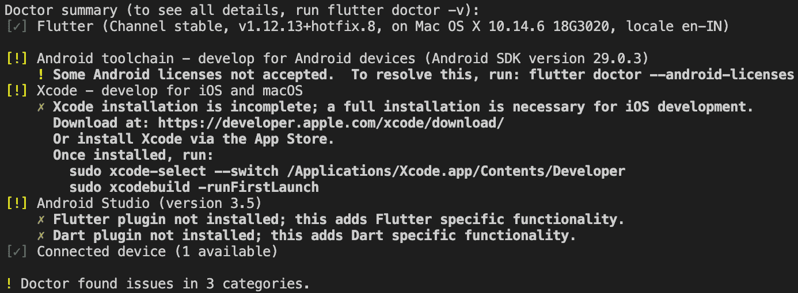

上面的屏幕快照显示，尽管 Flutter 很好用，但其他一些相关的配置却丢失了。 在这种情况下，您可能需要安装所有支持软件并重新运行`flutter doctor`以分析设置。

在 VS Code 上成功设置 Flutter 之后，我们可以继续创建我们的第一个 Flutter 应用。

# 创建第一个 Flutter 应用

创建第一个 Flutter 应用非常简单。 执行以下步骤：

1.  导航到“查看 | 命令面板”。
2.  开始输入`flutter`，然后选择`Flutter: New Project`。

3.  输入项目名称，例如`my_sample_app`。
4.  点击`Enter`。
5.  创建或选择新项目文件夹的父目录。
6.  等待项目创建完成，然后显示`main.dart`文件。

有关更多详细信息，请参阅[这个页面](https://flutter.dev/docs/get-started/test-drive)上的文档。

在下一节中，我们将讨论如何运行您的第一个 Flutter 应用。

# 运行应用

一个新的 Flutter 项目的创建带有一个模板代码，我们可以直接在移动设备上运行它。 创建第一个模板应用后，可以尝试如下运行它：

1.  导航至“VS Code”状态栏（即窗口底部的蓝色栏）：

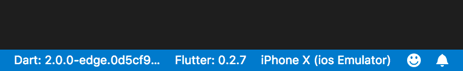

2.  从设备选择器区域中选择您喜欢的设备：

*   如果没有可用的设备，并且要使用设备模拟器，请单击“无设备”并启动模拟器：

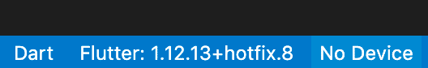

*   您也可以尝试设置用于调试的真实设备。

3.  单击**设置**按钮-位于右上角的齿轮图标齿轮（现已标记为红色或橙色指示器），位于`DEBUG`文本框旁边，显示为`No Configuration`。 选择 Flutter，然后选择调试配置以创建仿真器（如果已关闭）或运行仿真器或已连接的设备。
4.  导航到“调试 | 开始调试”或按`F5`。
5.  等待应用启动，进度会显示在`DEBUG CONSOLE`视图中：

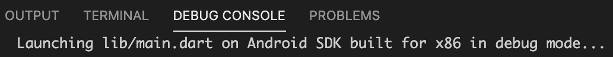

应用构建完成后，您应该在设备上看到已初始化的应用：

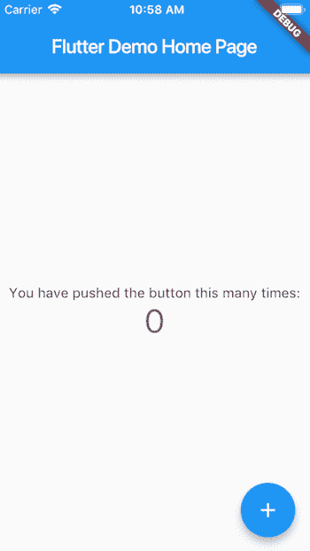

在下一节中，我们将介绍 Flutter 的热重载功能，该功能有助于快速开发。

# 尝试热重载

Flutter 提供的快速开发周期使其适合于时间优化的开发。 它支持**有状态热重载**，这意味着您可以重载正在运行的应用的代码，而不必重新启动或丢失应用状态。 热重装可以描述为一种方法，您可以通过该方法对应用源进行更改，告诉命令行工具您要热重装，并在几秒钟内在设备或仿真器上查看更改。

在 VS Code 中，可以按以下方式执行热重装：

1.  打开`lib/main.dart`。
2.  将`You have pushed the button this many times:`字符串更改为`You have clicked the button this many times:`。 不要停止您的应用。 让您的应用运行。

3.  保存更改：调用**全部保存**，或单击`Hot Reload`。