# 一、深度学习演练和 PyTorch 简介

目前，有数十种深度学习框架可以解决 GPU 上的任何种类的深度学习问题，那么为什么我们还需要一个呢？ 本书是对这一百万美元问题的解答。 PyTorch 进入了深度学习家族，并有望成为 GPU 上的 NumPy。 自加入以来，社区一直在努力兑现这一承诺。 如官方文档所述，PyTorch 是针对使用 GPU 和 CPU 进行深度学习的优化张量库。 尽管所有著名的框架都提供相同的功能，但 PyTorch 相对于几乎所有框架都具有某些优势。

本书中的各章为希望从 PyTorch 的功能中受益的开发人员提供了逐步指南，以处理和解释数据。 在探索深度学习工作流程的不同阶段之前，您将学习如何实现简单的神经网络。 我们将深入研究基本的卷积网络和生成对抗网络，然后是有关如何使用 OpenAI 的 Gym 库训练模型的动手教程。 在最后一章中，您将准备生产 PyTorch 模型。

在第一章中，我们将介绍 PyTorch 背后的理论，并解释为什么 PyTorch 在某些用例上胜过其他框架。 在此之前，我们将简要介绍 PyTorch 的历史，并了解为什么 PyTorch 是需要而不是选择。 在上一部分中，我们还将介绍 NumPy-PyTorch 桥和 PyTorch 内部，这将使我们在即将到来的代码密集型章节中有所作为。

## 了解 PyTorch 的历史

随着越来越多的人迁移到引人入胜的机器学习世界，不同的大学和组织开始建立自己的框架来支持日常研究，并且 Torch 是该家族的早期成员之一。 Ronan Collobert，Koray Kavukcuoglu 和 Clement Farabet 于 2002 年发布了 Torch，后来被 Facebook AI Research 以及其他几所大学和研究小组的许多人所采用。 许多初创公司和研究人员接受了 Torch，公司开始生产其 Torch 模型，以服务数百万用户。 Twitter，Facebook，DeepMind 等都属于该列表。 根据核心团队发布的 Torch7 官方论文[1]，Torch 在设计时考虑了三个关键功能：

1.  它应该简化数值算法的开发。
2.  它应该容易扩展。
3.  应该很快。

尽管 Torch 赋予了骨骼灵活性，并且 Lua + C 组合满足了上述所有要求，但是社区面临的主要缺点是对新语言 Lua 的学习曲线。 尽管 Lua 并不难掌握，并且已经在行业中使用了一段时间以进行高效的产品开发，但是它并没有像其他几种流行语言一样被广泛接受。

Python 在深度学习社区中的广泛接受使一些研究人员和开发人员重新考虑了核心作者做出的选择 Lua 而不是 Python 的决定。 这不仅仅是语言：缺少具有易于调试功能的命令式框架也触发了 PyTorch 的构想。

深度学习的前端开发人员发现符号图的概念很困难。 不幸的是，几乎所有的深度学习框架都是在此基础上构建的。 实际上，一些开发人员小组试图通过动态图来改变这种方法。 哈佛智能概率系统集团的 Autograd 是第一个这样做的流行框架。 然后，Twitter 上的 Torch 社区采纳了这个想法，并实现了 torch-autograd。

接下来，来自**卡内基梅隆大学**（**CMU**）的研究小组提出了 DyNet，然后 Chainer 提出了动态图的功能和可解释的开发环境。

所有这些事件都是启动惊人的框架 PyTorch 的巨大灵感，事实上，PyTorch 最初是 Chainer 的分支。 它最初是由 Torch 的核心开发人员 Soumith Chintala 领导的 Adam Paszke 的实习项目开始的。 然后，PyTorch 聘请了另外两名核心开发人员以及来自不同公司和大学的约 100 位 Alpha 测试人员。

整个团队在六个月内将链条拉到了一起，并于 2017 年 1 月向公众发布了该 Beta。尽管产品开发人员最初并未使用 PyTorch，但大部分研究社区都接受了 PyTorch。 一些大学开始在 PyTorch 上开设课程，包括**纽约大学**（**NYU**），牛津大学和其他一些欧洲大学。

## 什么是 PyTorch？

如前所述，PyTorch 是可以由 GPU 提供支持的张量计算库。 PyTorch 的构建具有特定目标，这使其与所有其他深度学习框架有所不同。 在本书中，您将通过不同的应用重新审视这些目标，并且到本书结束时，无论您打算要进行原型设计，您都应该能够开始使用 PyTorch 的各种用例。 一个想法或建立生产的超可扩展模型。

作为 **Python 优先框架**，PyTorch 大大超越了在整体 C++ 或 C 引擎上实现 Python 包装器的其他框架。 在 PyTorch 中，您可以继承 PyTorch 类并根据需要进行自定义。 内置于 PyTorch 核心的命令式编码风格仅由于 Python 优先方法才有可能。 尽管诸如 TensorFlow，MXNet 和 CNTK 的某些符号图框架提出了一种强制性方法，但由于社区的支持及其灵活性，PyTorch 仍能保持领先地位。

基于磁带的**自动微分**系统使 PyTorch 具有**动态图**功能。 这是 PyTorch 与其他流行的符号图框架之间的主要区别之一。 基于磁带的 Autograd 也支持 Chainer，Autograd 和 Torch-Autograd 的反向传播算法。 具有动态图功能，您的图将在 Python 解释器到达相应行时创建。 与 TensorFlow 的*定义并运行*方法不同，这称为*通过运行定义*。

基于磁带的 Autograd 使用反向模式自动微分，在前进过程中，图将每个操作保存到磁带中，然后在磁带中向后移动以进行反向传播。 动态图和 Python 优先方法使**易于调试**，您可以在其中使用常用的 Python 调试器，例如 Pdb 或基于编辑器的调试器。

PyTorch 核心社区不仅为 Torch 的 C 二进制文件构建了 Python 包装器，还优化了内核并对其进行了改进。 PyTorch 根据输入数据智能地选择要为定义的每个操作运行的算法。

### 安装 PyTorch

如果您已安装 CUDA 和 CuDNN，则 PyTorch 的安装非常简单（出于对 GPU 的支持，但是如果您尝试在 PyTorch 中尝试并且没有 GPU，那也可以）。 PyTorch 的主页[2]显示一个交互式屏幕，用于选择您所选择的操作系统和包管理器。 选择选项并执行命令进行安装。

尽管最初仅支持 Linux 和 Mac 操作系统，但从 PyTorch 0.4 Windows 开始，Windows 也在受支持的操作系统列表中。 PyTorch 已包装并运送到 PyPI 和 Conda。 PyPI 是包的官方 Python 存储库，并且包管理器`pip`可以在 Torch 的名称下找到 PyTorch。

但是，如果您想冒险并获取最新代码，则可以按照 GitHub `README`页面上的说明从源代码安装 PyTorch。 PyTorch 的每晚版本都将推送到 PyPI 和 Conda。 如果您希望获得最新的代码而无需经历从源代码安装的麻烦，那么每晚构建将非常有用。


图 1.1：来自 PyTorch 网站的交互式 UI 中的安装过程

### 是什么让 PyTorch 受欢迎？

在可靠的深度学习框架的众多中，由于速度和效率的原因，几乎每个人都在使用静态图或基于符号图的方法。 动态网络的内在问题（例如表现问题）使开发人员无法花费大量时间来实现它。 但是，静态图的限制使研究人员无法思考解决问题的多种不同方法，因为思维过程必须限制在静态计算图的框内。

如前所述，哈佛大学的 Autograd 包最初是作为解决此问题的方法，然后 Torch 社区从 Python 采纳了这个想法并实现了 torch-autograd。 Chainer 和 CMU 的 DyNet 可能是接下来的两个基于动态图的框架，得到了社区的大力支持。 尽管所有这些框架都可以解决借助强制方法创建的静态图所产生的问题，但它们没有其他流行的静态图框架所具有的动力。 PyTorch 绝对是答案。 PyTorch 团队采用了经过良好测试的著名 Torch 框架的后端，并将其与 Chainer 的前端合并以得到最佳组合。 团队优化了内核，添加了更多的 Pythonic API，并正确设置了抽象，因此 PyTorch 不需要像 Keras 这样的抽象库即可让初学者入门。

PyTorch 在研究界获得了广泛的接受，因为大多数人已经在使用 Torch，并且可能对 TensorFlow 之类的框架在没有提供太多灵活性的情况下的发展感到沮丧。 PyTorch 的动态性质对许多人来说是一个好处，并帮助他们在早期阶段接受 PyTorch。

PyTorch 允许用户定义 Python 在向前传递中允许他们执行的任何操作。 向后遍历自动找到遍历图直到根节点的路径，并在向后遍历时计算梯度。 尽管这是一个革命性的想法，但是产品开发社区并未接受 PyTorch，就像他们不能接受遵循类似实现的其他框架一样。 但是，随着时间的流逝，越来越多的人开始迁移到 PyTorch。 Kaggle 目睹了所有顶级玩家都使用 PyTorch 进行的比赛，并且如前所述，大学开始在 PyTorch 中开设课程。 这有助于学生避免像使用基于符号图的框架时那样学习新的图语言。

在 Caffe2 发布之后，自社区宣布 PyTorch 模型向 Caffe2 的迁移策略以来，甚至产品开发人员也开始尝试 PyTorch。 Caffe2 是一个静态图框架，即使在移动电话中也可以运行您的模型，因此使用 PyTorch 进行原型设计是一种双赢的方法。 构建网络时，您可以获得 PyTorch 的灵活性，并且可以将其转移到 Caffe2 并在任何生产环境中使用。 但是，在 1.0 版本说明中，PyTorch 团队从让人们学习两个框架（一个用于生产，一个用于研究）到学习在原型阶段具有动态图功能并且可以突然转换为一个框架的巨大跃进。 需要速度和效率的静态优化图。 PyTorch 团队将 Caffe2 的后端与 PyTorch 的 Aten 后端合并在一起，这使用户可以决定是要运行优化程度较低但高度灵活的图，还是运行优化程度较不灵活的图而无需重写代码库。

ONNX 和 DLPack 是 AI 社区看到的下两个“大事情”。 微软和 Facebook 共同宣布了 **开放神经网络交换**（**ONNX**）协议，该协议旨在帮助开发人员将任何模型从任何框架迁移到任何其他框架。 ONNX 与 PyTorch，Caffe2，TensorFlow，MXNet 和 CNTK 兼容，并且社区正在构建/改善对几乎所有流行框架的支持。

ONNX 内置在 PyTorch 的核心中，因此将模型迁移到 ONNX 表单不需要用户安装任何其他包或工具。 同时，DLPack 通过定义不同框架应遵循的标准数据结构，将互操作性提高到一个新水平，从而使张量在同一程序中从一个框架到另一个框架的迁移不需要用户序列化数据，或遵循任何其他解决方法。 例如，如果您有一个程序可以将训练过的 TensorFlow 模型用于计算机视觉，而一个高效的 PyTorch 模型用于循环数据，则可以使用一个程序来处理视频中的每个三维帧， TensorFlow 模型并将 TensorFlow 模型的输出直接传递给 PyTorch 模型以预测视频中的动作。 如果您退后一步，看看深度学习社区，您会发现整个世界都趋向于一个单一的点，在这个点上，所有事物都可以与其他事物互操作，并尝试以类似方法解决问题。 那是我们大家都想生活的世界。

## 使用计算图

通过的演变，人类发现对神经网络进行图绘制可以使我们将复杂性降低到最低限度。 计算图通过操作描述了网络中的数据流。

由一组节点和连接它们的边组成的图是一种已有数十年历史的数据结构，仍然在几种不同的实现方式中大量使用，并且该数据结构可能一直有效，直到人类不复存在。 在计算图中，节点表示张量，边表示它们之间的关系。

计算图可帮助我们解决数学问题并使大型网络变得直观。 神经网络，无论它们有多复杂或多大，都是一组数学运算。 解决方程的明显方法是将方程分成较小的单元，并将一个输出传递给另一个，依此类推。 图方法背后的想法是相同的。 您将网络内部的操作视为节点，并将它们映射到一个图，图中节点之间的关系表示从一个操作到另一个操作的过渡。

计算图是，是人工智能当前所有先进技术的核心。 他们奠定了深度学习框架的基础。 现在，所有现有的深度学习框架都使用图方法进行计算。 这有助于框架找到独立的节点并作为独立的线程或进程进行计算。 计算图可帮助您轻松进行反向传播，就像从子节点移动到先前的节点一样，并在返回时携带梯度。 此操作称为自动微分，这是 40 年前的想法。 自动微分被认为是上个世纪十大数值算法之一。 具体来说，反向模式自动微分是计算图背后用于反向传播的核心思想。 PyTorch 是基于反向模式自动微分而构建的，因此所有节点都将与它们一起保留操作信息，直到控件到达叶节点为止。 然后，反向传播从叶节点开始并向后遍历。 在向后移动时，流将随其一起获取梯度，并找到与每个节点相对应的偏导数。 1970 年，芬兰数学家和计算机科学家 Seppo Linnainmaa 发现自动微分可以用于算法验证。 几乎同时在同一概念上记录了许多其他并行的工作。

在深度学习中，神经网络用于求解数学方程。 无论任务多么复杂，一切都取决于一个巨大的数学方程式，您可以通过优化神经网络的参数来求解。 解决问题的明显方法是“手工”。 考虑使用大约 150 层神经网络来求解 ResNet 的数学方程； 对于人类来说，要遍历数千次图，每次手动进行相同的操作来优化参数，都是不可能的。 计算图通过将所有操作逐级映射到图并一次求解每个节点来解决此问题。 “图 1.2”显示了具有三个运算符的简单计算图。

两侧的矩阵乘法运算符给出两个矩阵作为输出，它们经过加法运算符，加法运算符又经过另一个 Sigmoid 运算符。 整个图实际上是在尝试求解以下等式：

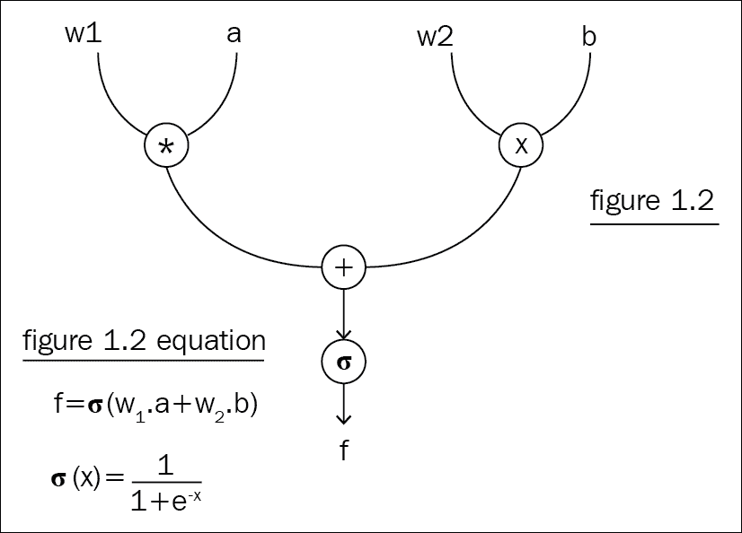

图 1.2：等式的图形表示

但是，当您将映射到图时，一切都变得清晰起来。 您可以可视化并了解正在发生的事情，并轻松编写代码，因为流程就在您的眼前。

所有深度学习框架都建立在自动微分和计算图的基础上，但是有两种固有的实现方法–静态图和动态图。

### 使用静态图

处理神经网络架构的传统方法是使用静态图。 在对给出的数据进行任何处理之前，该程序将构建图的正向和反向传递。 不同的开发小组尝试了不​​同的方法。 有些人先构建正向传播，然后将相同的图实例用于正向传播和后向传递。 另一种方法是先构建前向静态图，然后创建后向图并将其附加到前向图的末尾，以便可以将整个前向-后向传递作为单个图执行来执行。 按时间顺序排列节点。

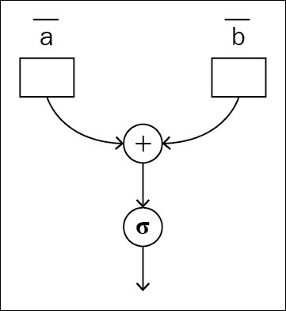

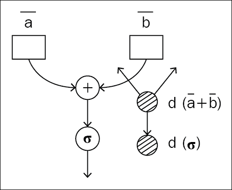

图 1.3 和 1.4：用于正向和反向传递的静态图相同

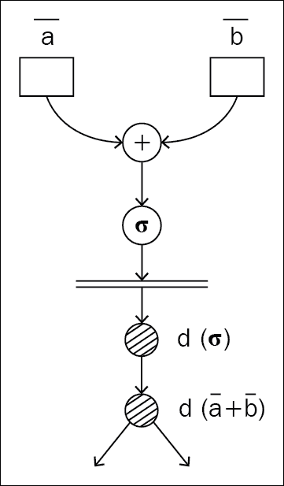

图 1.5：静态图：正向和反向传递的不同图

静态图具有相对于其他方法的某些固有优势。 由于要限制程序的动态变化，因此程序可以在执行图时做出与内存优化和并行执行有关的假设。 内存优化是框架开发人员在整个开发过程中都会担心的关键方面，原因是优化内存的范围非常庞大，并且伴随着这些优化的微妙之处。 Apache MXNet 开发人员已经写了一个很棒的博客[3]，详细讨论了这个问题。

TensorFlow 静态图 API 中用于预测 XOR 输出的神经网络如下所示。 这是静态图如何执行的典型示例。 最初，我们声明所有输入的占位符，然后构建图。 如果仔细看，我们在图定义中的任何地方都不会将数据传递给它。 输入变量实际上是占位符，期望在将来的某个时间获取数据。 尽管图定义看起来像我们在对数据执行数学操作，但实际上是在定义流程，这就是 TensorFlow 使用内部引擎构建优化的图实现的时候：

```py
x = tf.placeholder(tf.float32, shape=[None, 2], name='x-input')
y = tf.placeholder(tf.float32, shape=[None, 2], name='y-input')
w1 = tf.Variable(tf.random_uniform([2, 5], -1, 1), name="w1")
w2 = tf.Variable(tf.random_uniform([5, 2], -1, 1), name="w2")
b1 = tf.Variable(tf.zeros([5]), name="b1")
b2 = tf.Variable(tf.zeros([2]), name="b2")
a2 = tf.sigmoid(tf.matmul(x, w1) + b1)
hyp = tf.matmul(a2, w2) + b2
cost = tf.reduce_mean(tf.losses.mean_squared_error(y, hyp))
train_step = tf.train.GradientDescentOptimizer(lr).minimize(cost)
prediction = tf.argmax(tf.nn.softmax(hyp), 1)
```

解释器读取完图定义后，我们就开始遍历数据：

```py
with tf.Session() as sess:
    sess.run(init)
    for i in range(epoch):
        sess.run(train_step, feed_dict={x_: XOR_X, y_: XOR_Y})
```

接下来我们开始 TensorFlow 会话。 这是与预先构建的图进行交互的唯一方法。 在会话内部，您可以遍历数据，并使用`session.run`方法将数据传递到图。 因此，输入的大小应与图中定义的大小相同。

如果您忘记了什么是 XOR，则下表应为您提供足够的信息以从内存中重新收集它：

| | 输入 | 输出 |
| --- | --- | --- |
| A | B | 异或 |
| 0 | 0 | 0 |
| 0 | 1 | 1 |
| 1 | 0 | 1 |
| 1 | 1 | 0 |

### 使用动态图

势在必行的编程风格始终拥有较大的用户群，因为程序流程对于任何开发人员都是直观的。 动态能力是命令式图构建的良好副作用。 与静态图不同，动态图架构不会在数据传递之前构建图。 程序将等待数据到达并在遍历数据时构建图。 结果，每次数据迭代都会构建一个新的图实例，并在完成反向传播后销毁它。 由于图为每次迭代构建的，因此它不依赖于数据大小，长度或结构。 自然语言处理是需要这种方法的领域之一。

例如，如果您试图对成千上万的句子进行情感分析，则需要使用静态图来破解并采取变通办法。 在普通的**循环神经网络**（**RNN**）模型中，每个单词都经过一个 RNN 单元，该单元生成输出和隐藏状态。 该隐藏状态将提供给下一个 RNN，后者处理句子中的下一个单词。 由于您在构建静态图时做了一个固定长度的插槽，因此您需要增加短句并减少长句。

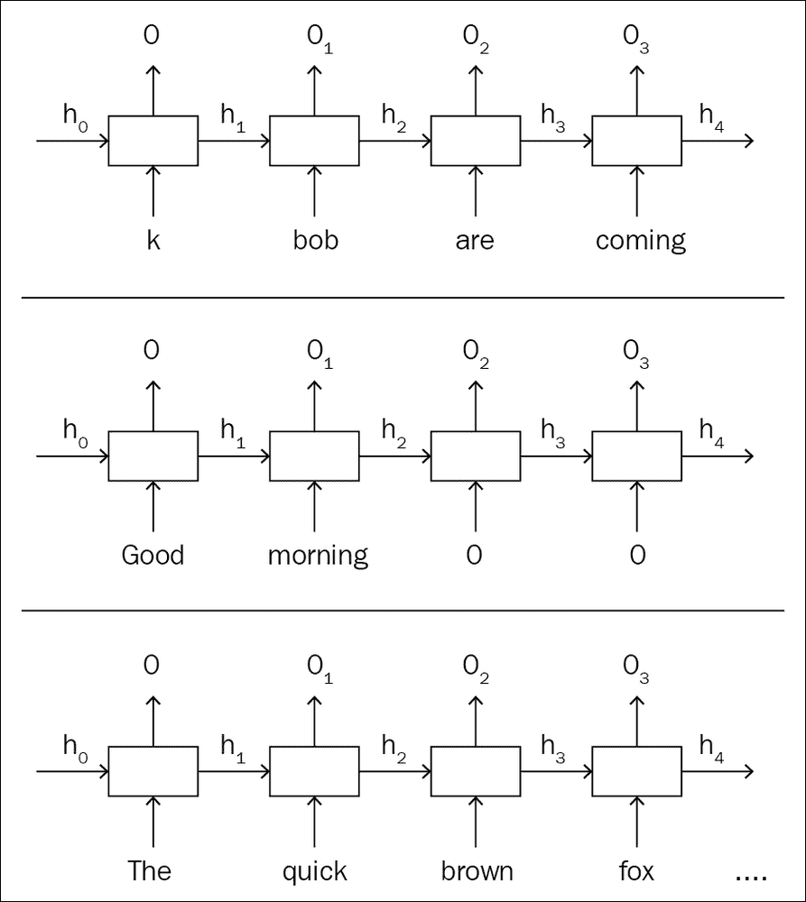

图 1.6：带有短句，适当句和长句的 RNN 单元的静态图

示例中给出的静态图显示了如何为每次迭代设置数据格式，以免破坏预建图。 但是，在动态图中，网络是灵活的，因此每次传递数据时都会创建网络，如上图所示。

动态能力附带成本。 您不能基于假设对图进行预优化，因此必须在每次迭代时支付创建图的开销。 但是，PyTorch 旨在尽可能降低成本。 由于预优化不是动态图所能做的事情，因此 PyTorch 开发人员设法将即时图创建的成本降低到可以忽略的程度。 由于所有优化都进入了 PyTorch 的核心，因此即使提供了动态功能，它也比其他几个针对特定用例的框架要快。

以下是用 PyTorch 编写的代码段，用于与我们之前在 TensorFlow 中开发的 XOR 操作相同的代码：

```py
x = torch.FloatTensor(XOR_X)
y = torch.FloatTensor(XOR_Y)
w1 = torch.randn(2, 5, requires_grad=True)
w2 = torch.randn(5, 2, requires_grad=True)
b1 = torch.zeros(5, requires_grad=True)
b2 = torch.zeros(2, requires_grad=True)

for epoch in range(epochs):
    a1 = x @ w1 + b1
    h1 = a2.sigmoid()
    a2 = h2 @ w2 + b1
    hyp = a3.sigmoid()
    cost = (hyp - y).pow(2).sum()
    cost.backward()
```

在 PyTorch 代码中，输入变量定义未创建占位符。 而是将变量对象包装到您的输入上。 图定义不会执行一次； 相反，它在循环内，并且每次迭代都在构建图。 您在每个图实例之间共享的唯一信息是您要优化的权重矩阵。

在这种方法中，如果您在遍历数据时改变了数据大小或形状，则在图中运行新形状的数据绝对好，因为新创建的图可以接受新形状。 可能性不止于此。 如果要动态更改图的行为，也可以这样做。 在第 5 章，“序列数据处理”中的循环神经网络会话中给出的示例均基于此思想。

## 探索深度学习

自从人类发明了计算机以来，我们就将它们称为智能系统，但我们一直在努力增强其智能。 在过去，计算机可以做的任何人类无法做到的事情都被认为是人工智能。 记住大量数据，对数百万或数十亿个数字进行数学运算，等等，被认为是人工智能。 我们称其为 Deep Blue，这是一款在国际象棋上击败国际象棋大师 Garry Kasparov 的机器。

最终，人类不能做的事情和计算机可以做的事情变成了计算机程序。 我们意识到对于程序员来说，人类可以轻松完成的某些事情是不可能的。 这种演变改变了一切。 我们可以写下并让像我们这样的计算机正常工作的可能性或规则的数量如此之大。 机器学习解救了人们。 人们找到了一种方法，使计算机可以从示例中学习规则，而不必明确地编写代码。 这就是所谓的机器学习。 “图 1.9”中给出了一个示例，该示例显示了我们如何根据客户过去的购物历史来预测客户是否会购买产品。

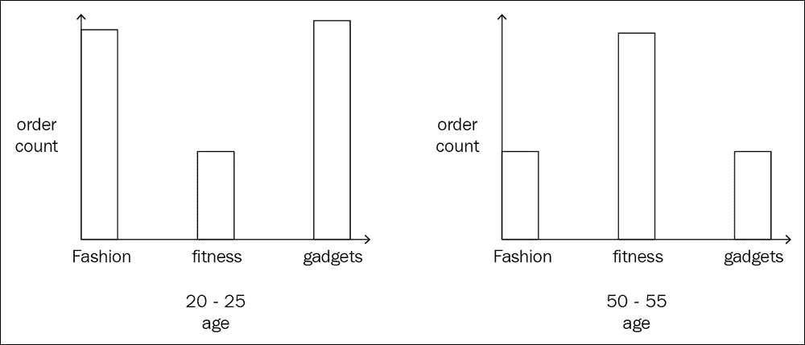

图 1.7：显示客户购买产品的数据集

即使不是全部，我们也可以预测大多数结果。 但是，如果我们可以从中进行预测的数据点数量太多而又无法用凡人的大脑来处理它们该怎么办？ 计算机可以浏览数据，并可能根据以前的数据吐出答案。 这种数据驱动的方法可以为我们提供很多帮助，因为我们唯一要做的就是假设相关的特征，然后将其交给包含不同算法的黑盒，以从特征集中学习规则或模式。

有问题。 即使我们知道要查找的内容，清理数据并提取特征也不是一件有趣的事情。 然而，最主要的麻烦不是这个。 我们无法有效预测高维数据和其他媒体类型的数据的特征。 例如，在人脸识别中，我们最初使用基于规则的程序找到人脸的细节长度，并将其作为输入输入神经网络，因为我们认为这是人类用来识别人脸的特征集。

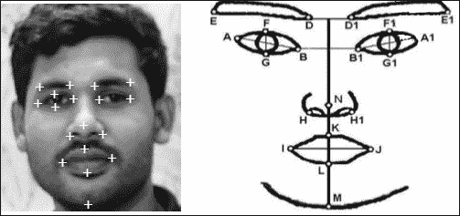

图 1.8：人为选择的面部特征

事实证明，对于人类来说如此明显的功能对计算机而言并不那么明显，反之亦然。 特征选择问题的实现使我们进入了深度学习的时代。 这是机器学习的子集，其中我们使用相同的数据驱动方法，但不是让计算机明确选择特征，而是让计算机决定特征应该是什么。

让我们再次考虑面部识别示例。 Google 于 2014 年发表的 FaceNet 论文在深度学习的帮助下解决了它。 FaceNet 使用两个深层网络实现了整个应用。 第一个网络是从面孔识别特征集，第二个网络是使用该特征集并识别面孔（从技术上讲，将面孔分类为不同的存储桶）。 本质上，第一个网络正在做我们以前做的事情，第二个网络是一个简单而传统的机器学习算法。

深度网络能够从数据集中识别特征，前提是我们拥有大型的标记数据集。 FaceNet 的第一个网络接受了带有相应标签的庞大人脸数据集的训练。 第一个网络经过训练，可以预测每个人脸的 128 个特征（通常来说，从我们的面孔有 128 个测量值，例如左眼和右眼之间的距离），第二个网络仅使用这 128 个特征来识别人。

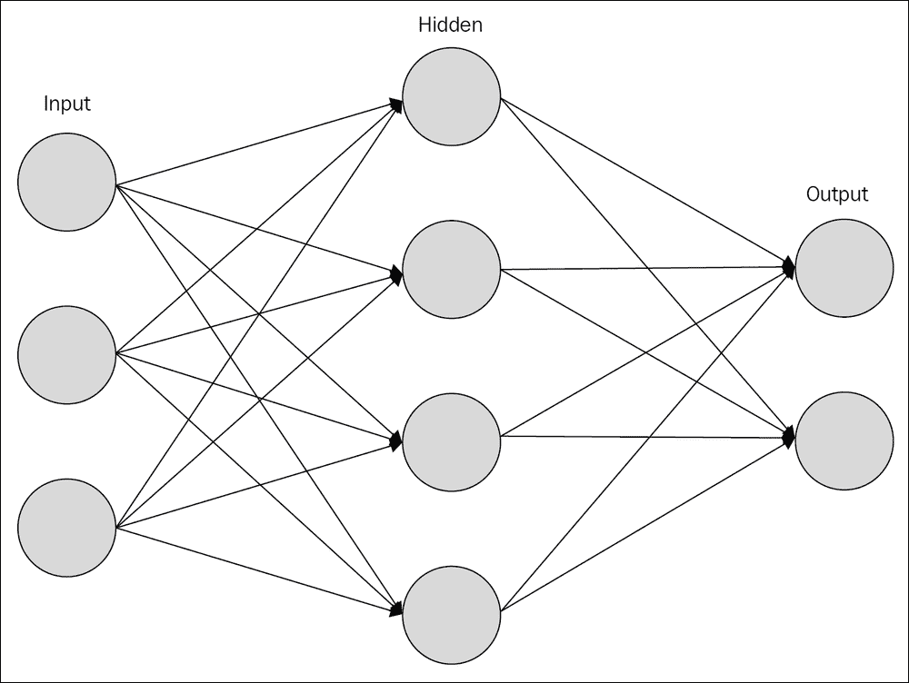

图 1.9：一个简单的神经网络

一个简单的神经网络具有一个单独的隐藏层，一个输入层和一个输出层。 从理论上讲，单个隐藏层应该能够近似任何复杂的数学方程式，并且对于单个层我们应该没问题。 然而，事实证明，单隐藏层理论并不是那么实用。 在深度网络中，每一层负责查找某些特征。 初始层找到更详细的特征，而最终层抽象这些详细特征并找到高级特征。

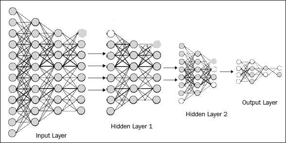

图 1.10：深度神经网络

### 了解不同的架构

深度学习已经存在了数十年，针对不同的用例演变出了不同的结构和架构。 其中一些基于我们对大脑的想法，而另一些则基于大脑的实际工作。 即将到来的所有章节均基于业界正在使用的的最新架构。 我们将介绍每种架构下的一个或多个应用，每一章都涵盖所有概念，规范和技术细节，其中显然都包含 PyTorch 代码。

#### 全连接网络

全连接或密集或线性网络是最基本但功能最强大的架构。 这是通常所谓的机器学习的直接扩展，在该机器学习中，您使用具有单个隐藏层的神经网络。 全连接层充当所有架构的端点，以使用下面的深度网络来找到分数的概率分布。 顾名思义，一个全连接网络将所有神经元在上一层和下一层相互连接。 网络可能最终决定通过设置权重来关闭某些神经元，但是在理想情况下，最初，所有神经元都参与了通信。

#### 编码器和解码器

编码器和解码器可能是深度学习框架下的下一个最基本的架构。 所有网络都有一个或多个编码器-解码器层。 您可以将全连接层中的隐藏层视为来自编码器的编码形式，而将输出层视为将隐藏层解码为输出的解码器。 通常，编码器将输入编码为中间状态，其中输入表示为向量，然后解码器网络将其解码为我们想要的输出形式。

编码器-解码器网络的一个典型示例是**序列到序列**（**seq2seq**）网络，可以将其用作机器翻译。 用英语说的句子将被编码为中间向量表示，其中整个句子将以一些浮点数的形式进行分块，并且解码器从中间向量以另一种语言解码输出句子。

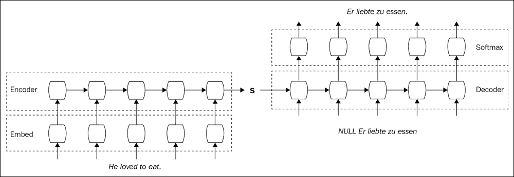

图 1.11：Seq2seq 网络

自编码器是一种特殊的编码器-解码器网络，属于无监督学习类别。 自编码器尝试从未标记的数据中学习，将目标值设置为等于输入值。 例如，如果输入的图像尺寸为`100 x 100`，则输入向量的尺寸为 10,000。 因此，输出大小也将为 10,000，但隐藏层的大小可能为 500。简而言之，您尝试将输入转换为较小尺寸的隐藏状态表示，从而从隐藏状态重新生成相同的输入 。

如果您能够训练一个可以做到这一点的神经网络，那么，您将找到一个很好的压缩算法，可以将高维输入转移到低维向量，并获得一个数量级的幅度的收益。

如今，自编码器被用于不同的情况和行业。 当我们讨论语义分割时，您将在第 4 章，“计算机视觉”中看到类似的架构。


图 1.12：自编码器的结构

#### 循环神经网络

RNN 是最常见的深度学习算法之一，它们席卷全球。 我们现在在自然语言处理或理解中几乎拥有所有最先进的表现，这是由于 RNN 的变体。 在循环网络中，您尝试识别数据中的最小单位，并使数据成为这些单位的组。 在自然语言的示例中，最常见的方法是使一个单词成为一个单元，并在处理该句子时将其视为一组单词。 您展开整个句子的 RNN，然后一次处理一个单词。 RNN 具有适用于不同数据集的变体，有时，选择变体时可以考虑效率。 **长短期记忆**（**LSTM**）和**门控循环单元**（**GRU**）单元是最常见的 RNN 单元。

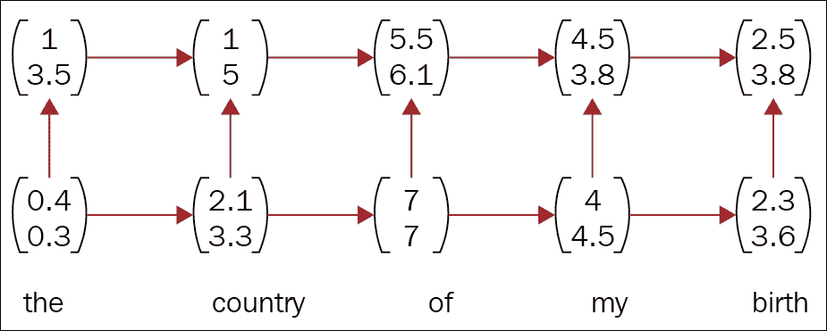

图 1.13：循环网络中单词的向量表示

#### 递归神经网络

顾名思义，递归神经网络是树状网络，用于了解序列数据的层次结构。 递归网络已在**自然语言处理**应用中大量使用，尤其是 Salesforce 首席科学家 Richard Socher 及其团队。

词向量，我们将在第 5 章，“序列数据处理”中很快看到，它们能够将词的含义有效地映射到向量空间中，但是涉及到整个句子中的含义，没有像 word2vec 这样的单词适合的解决方案。 递归神经网络是此类应用最常用的算法之一。 递归网络可以创建一个解析树和组成向量，并映射其他层次关系，这反过来又帮助我们找到了结合单词和句子的规则。 **斯坦福自然语言推断**小组发现了一种著名的且使用良好的算法，称为 **SNLI**，这是递归网络使用的一个很好的例子。

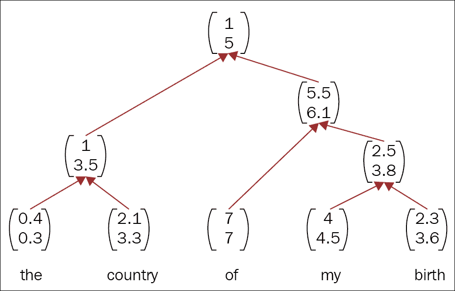

图 1.14：递归网络中单词的向量表示

#### 卷积神经网络

**卷积神经网络**（**CNN**）使我们能够在计算机视觉中获得超人的表现。 在的早期，我们达到了的人类准确率，并且我们仍在逐年提高准确率。

卷积网络是最易理解的网络，因为我们有可视化工具可以显示每一层的特征。 **Facebook AI Research**（**FAIR**）负责人 Yann LeCun 于 1990 年代发明了 CNN。 那时我们无法使用它们，因为我们没有足够的数据集和计算能力。 CNN 基本上像滑动窗口一样扫描您的输入并进行中间表示，然后在最终到达全连接层之前对其进行逐层抽象。 CNN 也成功地用于非图像数据集中。

Facebook 研究团队发现了一种具有卷积网络的先进自然语言处理系统，该系统优于 RNN，RNN 被认为是任何序列数据集的首选架构。 尽管一些神经科学家和一些 AI 研究人员不喜欢 CNN，但是由于他们认为大脑不能像 CNN 那样工作，因此基于 CNN 的网络正在击败所有现有实现。

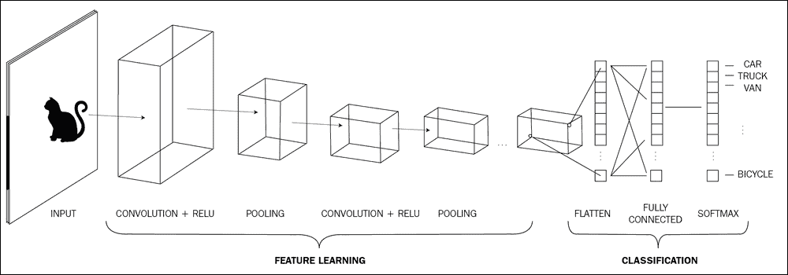

图 1.15：典型的 CNN

#### 生成对抗网络

**生成对抗网络**（**GAN**）由 Ian Goodfellow 于 2014 年发明，从那时起，它们使整个 AI 社区颠倒了。 它们是最简单，最明显的实现方式之一，但具有以其功能吸引世界的力量。 在 GAN 中，两个网络相互竞争并达到平衡，生成器网络可以生成数据，而判别器网络很难与实际图像区分开来。 一个真实的例子就是警察与假冒者之间的斗争。

造假者试图制造假币，而警察试图对其进行侦查。 最初，造假者知识不足，无法制作出看起来很原始的假币。 随着时间的流逝，造假者越来越擅长制作看起来更像原始货币的货币。 然后，警察开始无法识别假币，但最终他们会再次变得更好。 这一世代歧视过程最终导致了平衡。 GAN 的优势是巨大的，我们将在后面详细讨论。

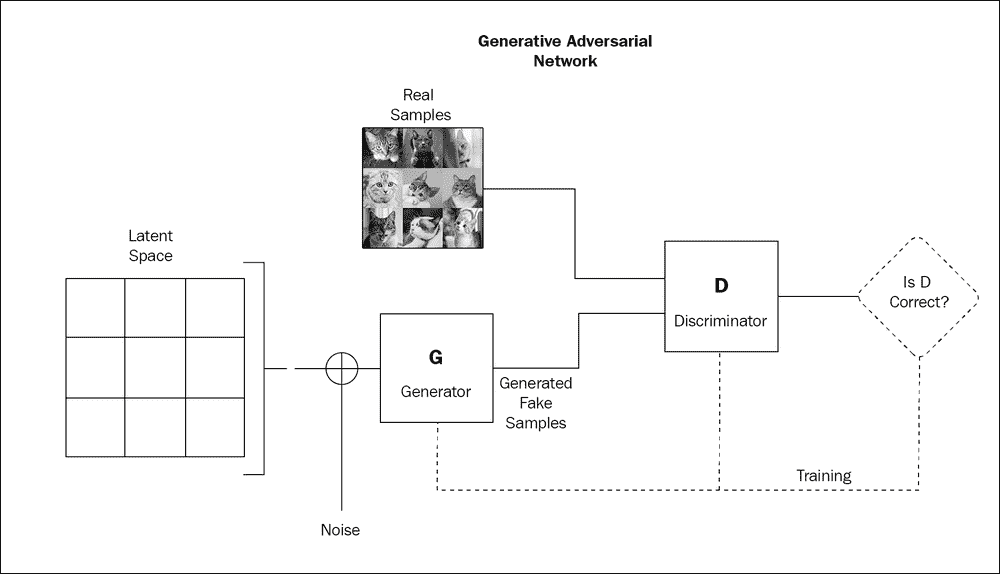

Figure 1.16: GAN setup

#### 强化学习

通过互动学习是人类智能的基础。 强化学习是引导我们朝这个方向发展的方法。 强化学习曾经是一个完全不同的领域，它是基于概念的，即人们通过反复试验来学习。 但是，随着深度学习的发展，弹出了另一个领域，称为深度强化学习，它将深度学习和强化学习的力量结合在一起。

现代强化学习使用深度网络进行学习，这与我们以前明确编码那些规则的旧方法不同。 我们将研究 Q 学习和深度 Q 学习，向您展示有无深度学习的强化学习之间的区别。

强化学习被认为是通向一般智能的途径之一，在这种途径中，计算机或智能体通过与现实世界，对象或实验的交互或从反馈中学习。 教一个强化学习智能体人相当于通过负面和正面奖励来训练狗。 当您给一块饼干拿起球时，或者当您对狗不捡球而大喊时，您会通过消极和积极的奖励来增强对狗大脑的了解。 我们对 AI 智能体执行相同的操作，但是正数奖励将为正数，负数奖励将为负数。 即使我们不能将强化学习视为类似于 CNN/RNN 等的另一种架构，但我还是在这里将其作为使用深度神经网络解决实际问题的另一种方法：

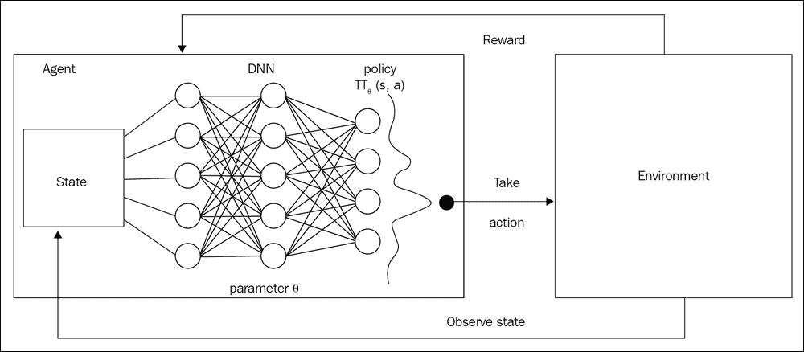

图 1.17：强化学习设置的图示

## 代码入门

让我们用一些代码弄脏一下。 如果您以前使用过 NumPy，那么您将在这里。 如果没有，请不要担心。 PyTorch 旨在简化初学者的生活。

作为深度学习框架，PyTorch 也可以用于数值计算。 在这里，我们讨论 PyTorch 中的基本操作。 本章中的基本 PyTorch 操作将在下一章中简化您的工作，在下一章中，我们将尝试为一个简单的用例构建一个实际的神经网络。 本书中的所有程序都将使用 Python 3.7 和 PyTorch 1.0。 GitHub 存储库也使用相同的配置构建：尽管 PyTorch 团队推荐使用该包管理器，但它是从 PyPI 而不是 Conda 获得的 PyTorch。

### 学习基本操作

让我们从导入`torch`到命名空间开始编码：

```py
import torch
```

PyTorch 中的基本数据抽象是`Tensor`对象，它是 NumPy 中`ndarray`的替代方案。 您可以在 PyTorch 中以多种方式创建张量。 我们将在此处讨论一些基本方法，在构建应用时，您将在接下来的各章中看到所有这些方法：

```py
uninitialized = torch.Tensor(3,2)
rand_initialized = torch.rand(3,2)
matrix_with_ones = torch.ones(3,2)
matrix_with_zeros = torch.zeros(3,2)
```

`rand`方法为您提供给定大小的随机矩阵，而`Tensor`函数返回未初始化的张量。 要从 Python 列表创建张量对象，请调用`torch.FloatTensor(python_list)`，它类似于`np.array(python_list)`。 `FloatTensor`是 PyTorch 支持的几种类型之一。 下表列出了可用的类型：

| 数据类型 | CPU 张量 | GPU 张量 |
| --- | --- | --- |
| 32 位浮点 | `torch.FloatTensor` | `torch.cuda.FloatTensor` |
| 64 位浮点 | `torch.DoubleTensor` | `torch.cuda.DoubleTensor` |
| 16 位浮点 | `torch.HalfTensor` | `torch.cuda.HalfTensor` |
| 8 位整数（无符号） | `torch.ByteTensor` | `torch.cuda.ByteTensor` |
| 8 位整数（有符号） | `torch.CharTensor` | `torch.cuda.CharTensor` |
| 16 位整数（有符号） | `torch.ShortTensor` | `torch.cuda.ShortTensor` |
| 32 位整数（有符号） | `torch.IntTensor` | `torch.cuda.IntTensor` |
| 64 位整数（有符号） | `torch.LongTensor` | `torch.cuda.LongTensor` |

> 表 1.1：PyTorch 支持的数据类型。 [资料来源](http://pytorch.org/docs/master/tensors.html)

在每个版本中，PyTorch 都会对该 API 进行一些更改，以使所有可能的 API 都类似于 NumPy API。 形状是 0.2 版本中引入的那些更改之一。 调用`shape`属性可以得到张量的形状（在 PyTorch 术语中为大小），也可以通过`size`函数进行访问：

```py
>>> size = rand_initialized.size()
>>> shape = rand_initialized.shape
>>> print(size == shape)
True

```

`shape`对象是从 PythoN 元组继承的，因此对`shape`对象也可以对元组进行所有可能的操作。 作为一个很好的副作用，`shape`对象是不可变的。

```py
>>> print(shape[0])
3
>>> print(shape[1])
2

```

现在，由于您知道张量是什么以及如何创建张量，因此我们将从最基本的数学运算开始。 一旦您熟悉乘法加法和矩阵运算之类的操作，其他所有都不过是乐高积木。

PyTorch 张量对象具有覆盖了 Python 的数值运算，并且您可以使用普通运算符。 张量标量运算可能是最简单的：

```py
 >>> x = torch.ones(3,2)
>>> x
tensor([[1., 1.],
	   [1., 1.],
	   [1., 1.]])
>>>
>>> y = torch.ones(3,2) + 2
>>> y
tensor([[3., 3.],
	   [3., 3.],
	   [3., 3.]])
>>>
>>> z = torch.ones(2,1)
>>> z
tensor([[1.],
      [1.]])
>>>
>>> x * y @ z
tensor([[6.],
	   [6.],
	   [6.]]) 

```

变量`x`和`y`为`3 x 2`张量，Python 乘法运算符执行逐元素乘法并给出相同形状的张量。 这个张量和形状为`3 x 2`的`z`张量正在通过 Python 的矩阵乘法运算符，并吐出`3 x 2`矩阵。

如上例所示，张量-张量操作有多个选项，例如普通的 Python 运算符，原地 PyTorch 函数和原地 PyTorch 函数。

```py
 >>> z = x.add(y) 
>>> print(z) 
tensor([[1.4059, 1.0023, 1.0358], 
             [0.9809, 0.3433, 1.7492]]) 
>>> z = x.add_(y) #in place addition. 
>>> print(z) 
tensor([[1.4059, 1.0023, 1.0358], 
            [0.9809, 0.3433, 1.7492]]) 
>>> print(x) 
tensor([[1.4059, 1.0023, 1.0358],
            [0.9809, 0.3433, 1.7492]]) 
>>> print(x == z) 
tensor([[1, 1, 1], 
            [1, 1, 1]], dtype=torch.uint8) 
>>> 
>>> 
>>> 
>>> x = torch.rand(2,3) 
>>> y = torch.rand(3,4) 
>>> x.matmul(y) 
tensor([[0.5594, 0.8875, 0.9234, 1.1294], 
            [0.7671, 1.7276, 1.5178, 1.7478]]) 

```

可以使用`+`运算符或`add`函数将两个大小相同的张量相加，以获得相同形状的输出张量。 PyTorch 遵循对相同操作使用尾部下划线的约定，但这确实发生了。 例如，`a.add(b)`为您提供了一个新的张量，其总和超过了`a`和`b`。 此操作不会对现有的`a`和`b`张量进行任何更改。 但是`a.add_(b)`用总和值更新张量`a`并返回更新后的`a`。 这适用于 PyTorch 中的所有运算符。

#### 注意

原地运算符遵循尾部下划线的约定，例如`add_`和`sub_`。

可以使用函数`matmul`完成矩阵乘法，而出于相同目的，还有其他函数，例如`mm`和 Python 的`@`。 切片，索引和连接是在对网络进行编码时最终要完成的下一个最重要的任务。 PyTorch 使您能够使用基本的 Pythonic 或 NumPy 语法来完成所有这些操作。

索引张量就像索引普通的 Python 列表一样。 可以通过递归索引每个维度来索引多个维度。 索引从第一个可用维中选择索引。 索引时可以使用逗号分隔每个维度。 切片时可以使用此方法。 起始和结束索引可以使用完整的冒号分隔。 可以使用属性`t`访问矩阵的转置。 每个 PyTorch 张量对象都具有`t`属性。

连接是工具箱中需要执行的另一项重要操作。 PyTorch 出于相同的目的制作了函数`cat`。 所有尺寸上的两个张量相同的张量（一个张量除外）可以根据需要使用`cat`进行连接。 例如，大小为`3 x 2 x 4`的张量可以与另一个大小为`3 x 2 x 4`的张量在第一维上级联，以获得大小为`3 x 2 x 4`的张量。`stack`操作看起来非常类似于连接，但这是完全不同的操作。 如果要向张量添加新尺寸，则可以使用`stack`。 与`cat`相似，您可以将轴传递到要添加新尺寸的位置。 但是，请确保两个张量的所有尺寸都与附着尺寸相同。

`split`和`chunk`是用于拆分张量的类似操作。 `split`接受每个输出张量要的大小。 例如，如果要在第 0 个维度上拆分大小为`3 x 2`的张量，尺寸为 1，则将得到三个大小均为`3 x 2`的张量。但是，如果在第 0 个维度上使用 2 作为大小，则会得到`3 x 2`的张量和另一个`3 x 2`的张量。

`squeeze`函数有时可以节省您的时间。 在某些情况下，您将具有一个或多个尺寸为 1 的张量。有时，您的张量中不需要那些多余的尺寸。 这就是`squeeze`将为您提供帮助的地方。 `squeeze`删除值为 1 的维。例如，如果您正在处理句子，并且有 10 个句子的批量，每个句子包含 5 个单词，则将其映射到张量对象时，将得到`10 x 5`的张量。然后，您意识到必须将其转换为一热向量，以便神经网络进行处理。

您可以使用大小为 100 的单热点编码向量为张量添加另一个维度（因为词汇量为 100 个单词）。 现在，您有了一个尺寸为`10 x 5 x 100`的张量对象，并且每个批量和每个句子一次传递一个单词。

现在，您必须对句子进行拆分和切分，最有可能的结果是，张量的大小为`10 x 1 x 100`（每 10 个单词中的一个单词带有 100 维向量）。 您可以使用`10 x 100`的张量处理它，这使您的生活更加轻松。 继续使用`squeeze`从`10 x 1 x 100`张量得到`10 x 100`张量。

PyTorch 具有称为`unsqueeze`的防挤压操作，该操作会为张量对象添加另一个伪尺寸。 不要将`unsqueeze`与`stack`混淆，这也会增加另一个维度。 `unsqueeze`添加了伪尺寸，并且不需要其他张量，但是`stack`正在将其他形状相同的张量添加到参考张量的另一个尺寸中。

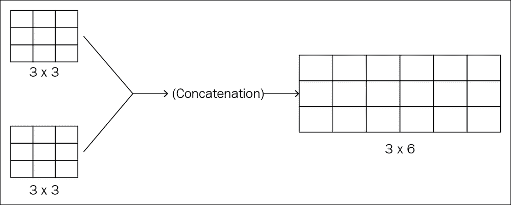

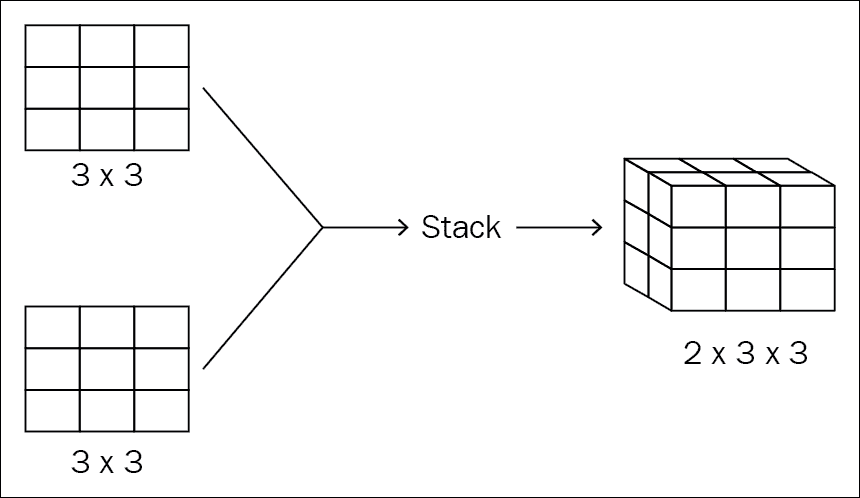

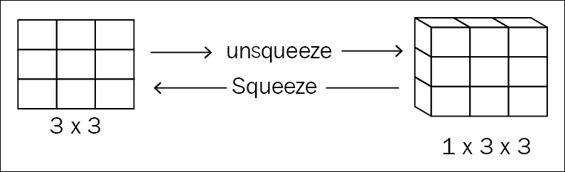

图 1.18：级联，栈，压缩和取消压缩的图示

如果您对的所有这些基本操作感到满意，则可以继续第二章并立即开始编码会话。 PyTorch 附带了许多其他重要操作，当您开始构建网络时，您一定会发现它们非常有用。 我们将在接下来的各章中看到其中的大多数内容，但是如果您想首先学习这一点，请访问 PyTorch 网站并查看其张量教程页面，该页面描述了张量对象可以执行的所有操作。

#### PyTorch 的内部

互操作性是 PyTorch 自身发展的核心哲学之一。 开发团队投入了大量时间来实现不同框架（例如 ONNX，DLPack 等）之间的互操作性。 这些示例将在后面的章节中显示，但是在这里，我们将讨论 PyTorch 的内部设计如何在不影响速度的前提下满足这一要求。

普通的 Python 数据结构是可以保存数据和元数据的单层内存对象。 但是 PyTorch 数据结构是分层设计的，这使得该框架不仅可以互操作而且还可以提高内存效率。 PyTorch 核心的计算密集型部分已通过 ATen 和 Caffe2 库迁移到了 C/C++ 后端，而不是将其保留在 Python 本身中，以便提高速度。

即使将 PyTorch 创建为研究框架，也已将其转换为面向研究但可用于生产的框架。 通过引入两种执行类型，可以解决多用例需求所带来的折衷。 我们将在第 8 章和“生产中的 PyTorch”中看到更多相关信息，我们将在其中讨论如何将 PyTorch 投入生产。

C/C++ 后端中设计的自定义数据结构已分为不同的层。 为简单起见，我们将省略 CUDA 数据结构，而将重点放在简单的 CPU 数据结构上。 PyTorch 中的面向用户的主要数据结构是`THTensor`对象，它保存有关尺寸，偏移，步幅等信息。 但是，`THTensor`存储的另一个主要信息是指向`THStorage`对象的指针，该对象是为存储而保存的张量对象的内部层。

```py
x = torch.rand(2,3,4)
x_with_2n3_dimension = x[1, :, :]
scalar_x = x[1,1,1]     # first value from each dimension

# numpy like slicing
x = torch.rand(2,3)
print(x[:, 1:])        # skipping first column
print(x[:-1, :])       # skipping last row

# transpose
x = torch.rand(2,3)
print(x.t())           # size 3x2

# concatenation and stacking
x = torch.rand(2,3)
concat = torch.cat((x,x))
print(concat)         # Concatenates 2 tensors on zeroth dimension

x = torch.rand(2,3)
concat = torch.cat((x,x), dim=1)
print(concat)         # Concatenates 2 tensors on first dimension

x = torch.rand(2,3)
stacked = torch.stack((x,x), dim=0)
print(stacked)        # returns 2x2x3 tensor

# split: you can use chunk as well
x = torch.rand(2,3)
splitted = x.split(split_size=2, dim=0)
print(splitted)       # 2 tensors of 2x2 and 1x2 size

#sqeeze and unsqueeze
x = torch.rand(3,2,1) # a tensor of size 3x2x1
squeezed = x.squeeze()
print(squeezed)       # remove the 1 sized dimension

x = torch.rand(3)
with_fake_dimension = x.unsqueeze(0)
print(with_fake_dimension)        # added a fake zeroth dimension
```

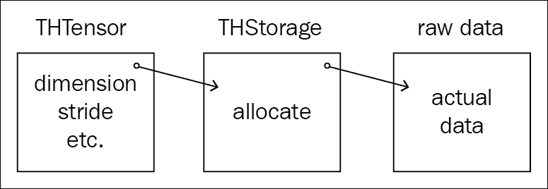

图 1.19：THTensor 到 THStorage 到原始数据

正如您可能已经假设的那样，`THStorage`层不是一个智能数据结构，它实际上并不知道张量的元数据。 `THStorage`层负责保持指向原始数据和分配器的指针。 分配器完全是另一个主题，中有用于 CPU，GPU，共享内存等的不同分配器。 来自`THStorage`的指向**原始数据**的指针是互操作性的关键。 **原始数据**是存储实际数据的位置，但没有任何结构。 每个张量对象的这种三层表示使 PyTorch 的实现内存效率更高。 以下是一些示例。

将变量`x`创建为`2 x 2`的张量，并填充 1。 然后，我们创建另一个变量`xv`，它是同一张量`x`的另一个视图。 我们将`2 x 2`张量展平为大小为 4 的单维张量。我们还通过调用`.NumPy()`方法并将其存储在变量`xn`中来创建 NumPy 数组：

```py
>>> import torch
>>> import numpy as np >>> x = torch.ones(2,2)
>>> xv = x.view(-1)
>>> xn = x.numpy()
>>> x
tensor([[1., 1.],[1., 1.]])
>>> xv
tensor([1., 1., 1., 1.])
>>> xn
array([[1\. 1.],[1\. 1.]], dtype=float32)

```

PyTorch 提供了多种 API 来检查内部信息，`storage()`是其中之一。 `storage()`方法返回存储对象（`THStorage`），该存储对象是先前描述的 PyTorch 数据结构中的第二层。 `x`和`xv`的存储对象如下所示。 即使两个张量的视图（尺寸）不同，存储区仍显示相同的尺寸，这证明`THTensor`存储有关尺寸的信息，但存储层是一个转储层，仅将用户指向原始数据对象。 为了确认这一点，我们使用`THStorage`对象中的另一个 API `data_ptr`。 这将我们指向原始数据对象。 将`x`和`xv`的`data_ptr`等同可证明两者相同：

```py
>>> x.storage()
1.0
1.0
1.0
1.0
[torch.FloatStorage of size 4]
>>> xv.storage()
1.0
1.0
1.0
1.0
[torch.FloatStorage of size 4]
>>> x.storage().data_ptr() == xv.storage().data_ptr()
True

```

接下来，我们更改张量中的第一个值，索引值为 0、0 到 20。变量`x`和`xv`具有不同的`THTensor`层，因为尺寸已更改，但实际原始数据对于两者都相同，这使得在不同张量下创建同一张量的`n`个视图确实非常容易且节省存储空间。

甚至 NumPy 数组`xn`也与其他变量共享相同的原始数据对象，因此一个张量中值的变化反映了指向同一原始数据对象的所有其他张量中相同值的变化。 DLPack 是该思想的扩展，它使同一程序中不同框架之间的通信变得容易。

```py
>>> x[0,0]=20
>>> x
tensor([[20.,  1.],[ 1.,  1.]])
>>> xv
tensor([20.,  1.,  1.,  1.])
>>> xn
array([[20.,  1.],[ 1.,  1.]], dtype=float32)

```

### 总结

在本章中，我们了解了 PyTorch 的历史以及动态图库相对于静态图库的优缺点。 我们还浏览了人们为解决各个领域的复杂问题而提出的不同架构和模型。 我们介绍了 PyTorch 中最重要的内容：Torch 张量的内部。 张量的概念是深度学习的基础，并且对于您使用的所有深度学习框架都是通用的。

在下一章中，我们将采用更多的动手方法，并将在 PyTorch 中实现一个简单的神经网络。

### 参考

1.  Ronan Collobert，Koray Kavukcuoglu 和 Clement Farabet，[《Torch7：类似于 Matlab 的机器学习环境》](https://pdfs.semanticscholar.org/3449/b65008b27f6e60a73d80c1fd990f0481126b.pdf?_ga=2.194076141.1591086632.1553663514-2047335409.1553576371)
2.  [PyTorch 的主页](https://pytorch.org/)
3.  [《优化深度学习的内存消耗》](https://mxnet.incubator.apache.org/versions/master/architecture/note_memory.html)