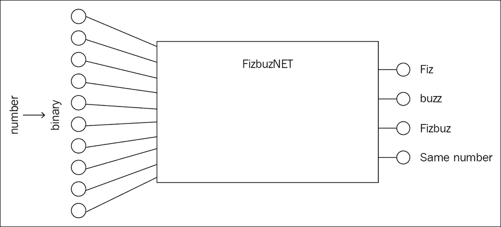
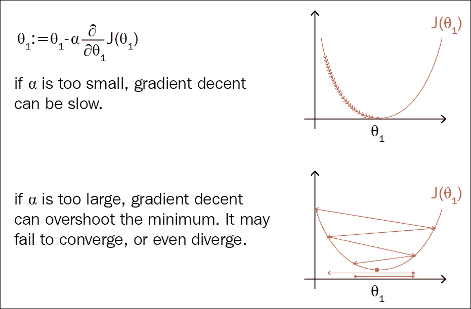
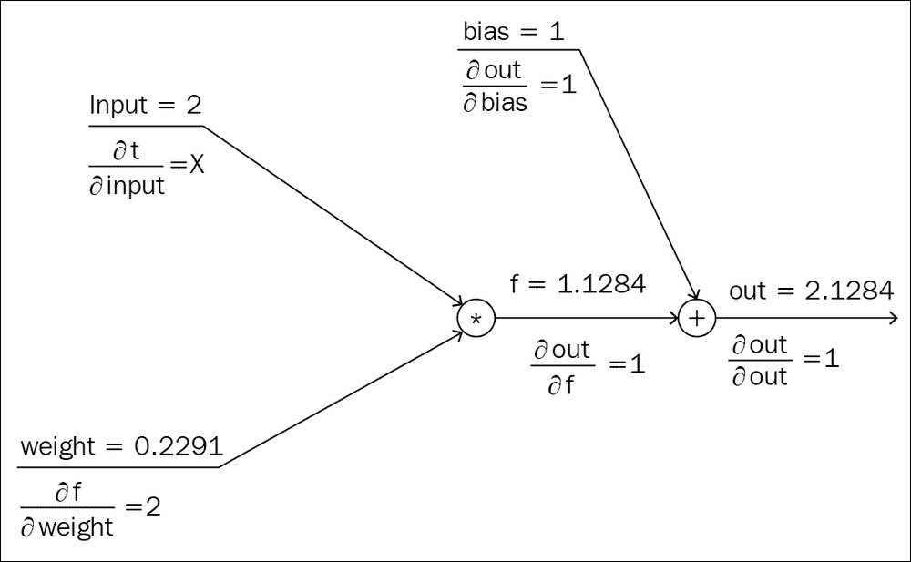
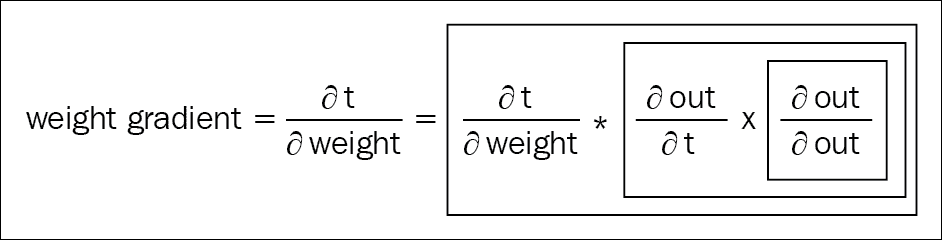
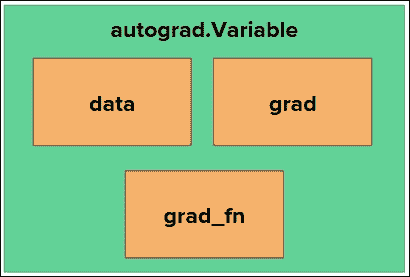
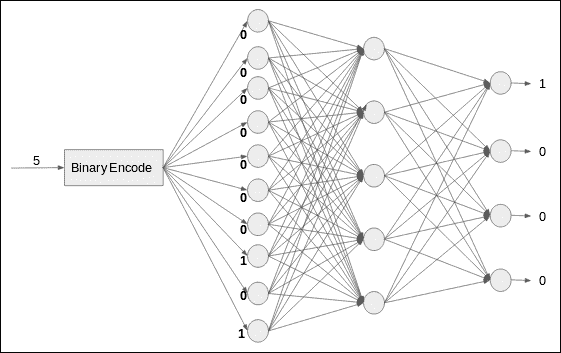
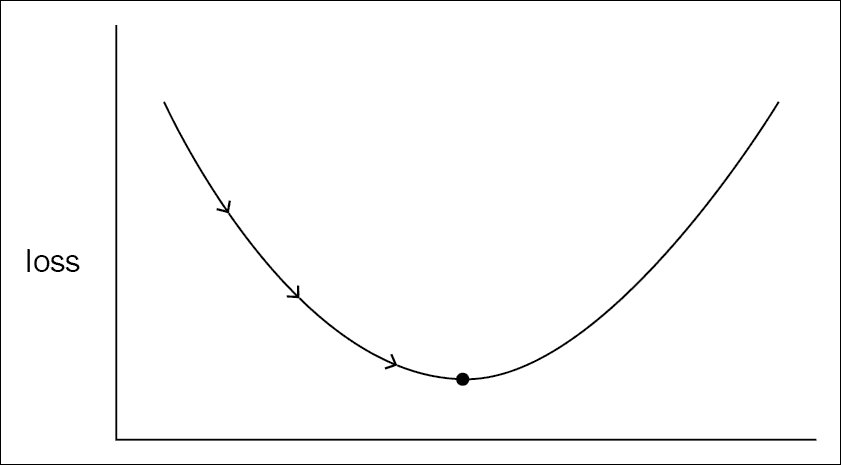
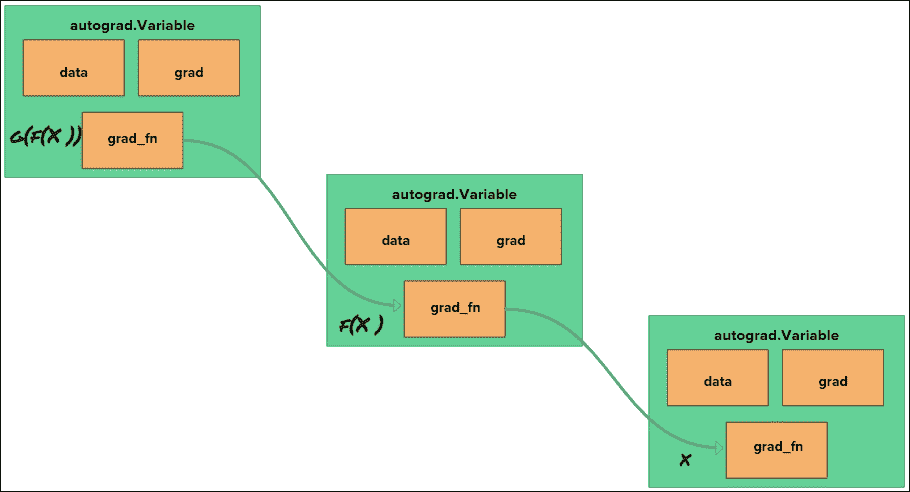
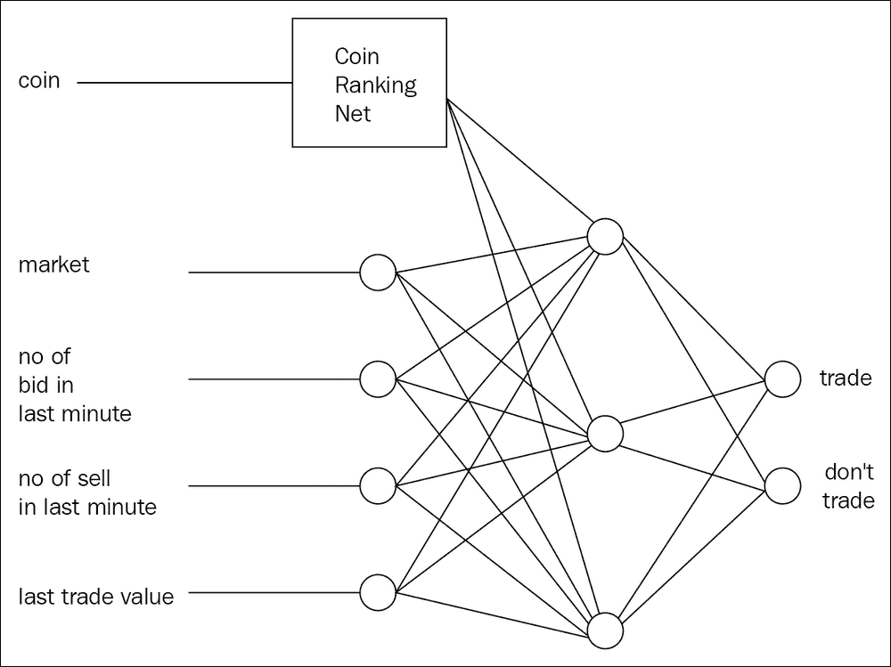
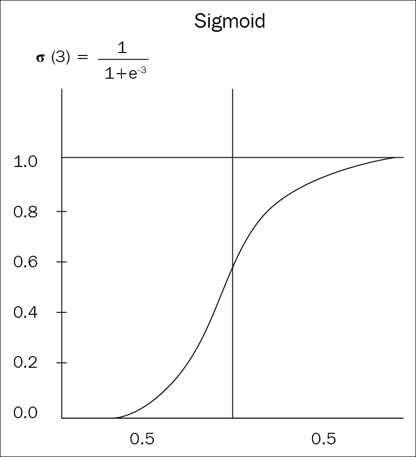

# 二、简单的神经网络

学习构建神经网络的 PyTorch 方法非常重要。 这是编写 PyTorch 代码的最有效，最简洁的方法，并且由于它们具有相同的结构，因此还可以帮助您找到易于理解的教程和示例代码片段。 更重要的是，您将获得高效的代码形式，该形式也具有很高的可读性。

不用担心，PyTorch 不会尝试通过采用全新的方法来在学习曲线中增加另一个峰值。 如果您知道如何使用 Python 进行编码，那么您会立刻感到宾至如归。 但是，我们不会像在第一章中那样学习这些构件。 在本章中，我们将构建一个简单的网络。 与其选择典型的入门级神经网络用例，不如讲授我们的网络以 NumPy 方式进行数学运算。 然后，我们将其转换为 PyTorch 网络。 在本章结束时，您将具备成为 PyTorch 开发人员的技能。

## 神经网络介绍

在本节中，我们将通过手头的问题陈述以及正在使用的数据集。 然后，我们将构建一个基本的神经网络，然后再将其构建为适当的 PyTorch 网络。

## 问题

您曾经玩过 **Fizz buzz** 游戏吗？ 如果没有，请不要担心。 以下是有关游戏的简单说明。

### 注意

根据维基百科的说法，Fizz buzz [1]是一款针对儿童的小组文字游戏，可以教他们有关分裂的知识。 玩家轮流进行递增计数。 被三整除的任何数字[2]被单词 fizz 替换，被五整除的任何数字被 buzz 单词替换。 两者均分的数字成为嘶嘶声。

**艾伦人工智能研究所**（**AI2**）的研究工程师之一乔尔·格鲁斯（Joel Grus）在一个有趣的示例中使用了 Fizz 嗡嗡声，而则在博客中发文[3]在 TensorFlow 上。 尽管该示例没有解决任何实际问题，但该博客文章颇具吸引力，很高兴看到神经网络如何学会从数字流中找到数学模式。

## 数据集

建立数据管道与网络的架构一样重要，尤其是在实时训练网络时。 从野外获得的数据永远不会干净，在将其扔到网络之前，您必须对其进行处理。 例如，如果我们要收集数据以预测某人是否购买产品，那么最终将出现异常值。 离群值可以是任何种类且不可预测的。 例如，某人可能不小心下了订单，或者他们可以访问后来下订单的朋友，依此类推。

从理论上讲，深度神经网络非常适合从数据集中查找模式和解，因为它们应该模仿人的大脑。 但是，实际上，情况并非总是如此。 如果您的数据干净且格式正确，您的网络将能够通过找到模式来轻松解决问题。 PyTorch 开箱即用地提供了数据预处理包装器，我们将在第 3 章和“深度学习工作流程”中进行讨论。 除此之外，我们将讨论如何格式化或清除数据集。

为简单起见，我们将使用一些简单的函数来生成数据。 让我们开始为 *FizzBu​​zz* 模型构建简单的数据集。 当我们的模型得到一个数字时，它应该预测下一个输出，就好像是在玩游戏的人一样。 例如，如果输入为三，则模型应预测下一个数字为四。 如果输入为八，则模型应显示“嘶嘶声”，因为九可以被三整除。

我们不希望我们的模型遭受复杂的输出。 因此，为使我们的模型更容易，我们将问题描述为一个简单的分类问题，其中模型将输出分为四个不同类别：`fizz`，`buzz`，`fizzbuzz`和`Continue_without_change`。 对于任何输入模型，我们都将尝试在这四个类别上进行概率分布，而在训练下，我们可以尝试使概率分布集中在正确类别上。

我们还将输入的数字转换为二进制编码的形式，这使网络比整数更容易处理。



图 2.1：输入到输出映射

以下代码以二进制形式生成输入，并以大小为 4 的向量生成输出：

```py
def binary_encoder(input_size):
    def wrapper(num):
        ret = [int(i) for i in '{0:b}'.format(num)]
        return [0] * (input_size - len(ret)) + ret
    return wrapper

def get_numpy_data(input_size=10, limit=1000):
    x = []
    y = []
    encoder = binary_encoder(input_size)
    for i in range(limit):
        x.append(encoder(i))
        if i % 15 == 0:
            y.append([1, 0, 0, 0])
        elif i % 5 == 0:
            y.append([0, 1, 0, 0])
        elif i % 3 == 0:
            y.append([0, 0, 1, 0])
        else:
            y.append([0, 0, 0, 1])
    return training_test_gen(np.array(x), np.array(y))
```

编码器函数将输入编码为二进制数，从而使神经网络易于学习。 将数值直接传递到神经网络会对网络施加更多约束。 不要担心最后一行中的`training_test_gen`函数； 我们将在第 3 章和“深度学习工作流程”中进行更多讨论。 现在，请记住，它将数据集拆分为训练和测试集，并将其作为 NumPy 数组返回。

利用到目前为止我们拥有的关于数据集的信息，我们可以按以下方式构建网络：

*   我们将输入转换为 10 位二进制数，因此我们的第一个输入层需要 10 个神经元才能接受这 10 位数字。
*   由于我们的输出始终是大小为 4 的向量，因此我们需要有四个输出神经元。
*   看来我们要解决的问题很简单：比较深度学习在当今世界中产生的虚构冲动。 首先，我们可以有一个大小为 100 的隐藏层。
*   由于在处理之前批量数据总是更好，为了获得良好的结果，我们将对输入的批量添加 64 个数据点。 请查看本章末尾的“查找误差”部分，以了解批量为什么更好。

让我们定义超参数并调用我们先前定义的函数以获取训练和测试数据。 我们将为各种神经网络模型定义五个典型的超参数：

```py
epochs = 500
batches = 64
lr = 0.01
input_size = 10
output_size = 4
hidden_size = 100
```

我们需要在程序顶部定义输入和输出大小，这将帮助我们在不同的地方使用输入和输出大小，例如网络设计函数。 隐藏大小是隐藏层中神经元的数量。 如果要手动设计神经网络，则权重矩阵的大小为`input_size` x `hidden_size`，这会将您输入的大小`input_size`转换为大小`hidden_size`。 `epoch`是通过网络进行迭代的计数器值。 `epoch`的概念最终取决于程序员如何定义迭代过程。 通常，对于每个周期，您都要遍历整个数据集，然后对每个周期重复一次。

```py
for i in epoch:
    network_execution_over_whole_dataset()
```

**学习率**决定了我们希望我们的网络从每次迭代的误差中获取反馈的速度。 它通过忘记网络从所有先前迭代中学到的知识来决定从当前迭代中学到的知识。 将学习率保持为 1 可使网络考虑完全误差，并根据完全误差调整权重。 学习率为零意味着向网络传递的信息为零。 学习率将是神经网络中梯度更新方程式中的选择因子。 对于每个神经元，我们运行以下公式来更新神经元的权重：

```py
weight -= lr * loss
```

较低的学习率可帮助网络沿着山路走很小的步，而较高的学习率可帮助网络沿山路走。 但是，这是有代价的。 一旦损失接近最小值，较高的学习率可能会使网络跳过最小值，并导致网络永远找不到最小值。 从技术上讲，在每次迭代中，网络都会对近似值进行线性近似，而学习率将控制该近似值。

如果损失函数高度弯曲，则以较高的学习率进行较长的步骤可能会导致模型变坏。 因此，理想的学习率始终取决于问题陈述和当前的模型架构。 《深度学习》[4]的第四章是了解学习重要性的好资料。 来自 Coursera 上著名的吴恩达（Andrew Ng）课程的精美图片代表清楚地了解了学习率如何影响网络学习。



图 2.2：学习率低而学习率高

## 徒手模型

现在，我们将建立一个徒手，类似于 NumPy 的模型，而不使用任何 PyTorch 特定的方法。 然后，在下一个会话中，我们将把相同的模型转换为 PyTorch 的方法。 如果您来自 NumPy，那么您会感到宾至如归，但是如果您是使用其他框架的高级深度学习从业者，请随意跳过本节。

### Autograd

因此，既然我们知道张量应该为类型，就可以根据从`get_numpy_data()`获得的 NumPy 数组创建 PyTorch 张量。

```py
x = torch.from_numpy(trX).to(device=device, dtype=dtype)
y = torch.from_numpy(trY).to(device=device, dtype=dtype)
w1 = torch.randn(input_size, hidden_size, requires_grad=True, device=device, dtype=dtype)
w2 = torch.randn(hidden_size, output_size, requires_grad=True, device=device, dtype=dtype)
b1 = torch.zeros(1, hidden_size, requires_grad=True, device=device, dtype=dtype)
b2 = torch.zeros(1, output_size, requires_grad=True, device=device, dtype=dtype)

```

对于初学者来说，这可能看起来很吓人，但是一旦您学习了基本的构建块，就只有六行代码。 我们从 PyTorch 中最重要的模块开始，该模块是 PyTorch 框架的主框架 autograd。 它可以帮助用户进行自动微分，从而使我们在深度学习领域取得了所有突破。

#### 注意

**注意**：自动微分，有时也称为算法微分，是通过计算机程序利用函数执行顺序的技术。 自动微分的两种主要方法是正向模式和反向模式。 在前向模式自动微分中，我们首先找到外部函数的导数，然后递归进入内部，直到我们探索所有子节点。 反向模式自动微分正好相反，并且被深度学习社区和框架使用。 它由 Seppo Linnainmaa 于 1970 年在其硕士论文中首次出版。反向模式微分的主要构建模块是存储中间变量的存储器，以及使这些变量计算导数的功能，同时从子节点移回到父节点。

正如 PyTorch 主页所说，PyTorch 中所有神经网络的中心都是 Autograd 包。 PyTorch 借助 Autograd 包获得了动态功能。 程序执行时，Autograd 将每个操作写入磁带状数据结构并将其存储在内存中。

这是反向模式自动微分的关键特征之一。 这有助于 PyTorch 动态化，因为无论用户在向前传递中作为操作编写的内容都可以写入磁带，并且在反向传播开始时，Autograd 可以在磁带上向后移动并随梯度一起移动，直到到达最外层父级。

磁带或内存的写操作可忽略不计，PyTorch 通过将操作写到磁带上并在向后遍历后销毁磁带来利用每次正向遍历中的行为。 尽管我会在本书中尽量避免使用尽可能多的数学方法，但是有关 Autograd 如何工作的数学示例绝对可以为您提供帮助。 在下面的两个图中，说明了反向传播算法和使用链式规则的 Autograd 的方法。 下图中我们有一个小型网络，其中有一个乘法节点和一个加法节点。 乘法节点获取输入张量和权重张量，将其传递到加法节点以进行加法运算。

```py
output = X * W + B
```

由于将方程分为几步，因此我们可以根据下一阶段找到每个阶段的斜率，然后使用链式规则将其链接在一起，从而根据最终输出获得权重的误差。 第二张图显示了 Autograd 如何将这些导数项中的每一个链接起来以获得最终误差。



图 2.3：Autograd 的工作方式



图 2.4：Autograd 使用的链式规则

前面的图可以使用以下代码转换为 PyTorch 图：

```py
>>> import torch
>>> inputs = torch.FloatTensor([2])
>>> weights = torch.rand(1, requires_grad=True)
>>> bias = torch.rand(1, requires_grad=True)
>>> t = inputs @ weights
>>> out = t + bias
>>> out.backward()
>>> weights.grad
tensor([2.])
>>>bias.grad
tensor([1.])

```

通常，用户可以使用两个主要的 API 访问 autograd，这将处理您在构建神经网络时几乎会遇到的所有操作。

#### 张量的 Autograd 属性

当成为图的一部分时，张量需要存储 Autograd 自动微分所需的信息。 张量充当计算图中的一个节点，并通过函数式模块实例连接到其他节点。 张量实例主要具有支持 Autograd 的三个属性：`.grad`，`.data`和`grad_fn()`（注意字母大小写：`Function`代表 PyTorch `Function`模块，而`function`代表 Python 函数）。

`.grad`属性在任何时间点存储梯度，所有向后调用将当前梯度累积到`.grad`属性。 `.data`属性可访问其中包含数据的裸张量对象。



图 2.5：`data`，`grad`和`grad_fn`

如果您想知道，前面的代码片段中的`required_grad`参数会通知张量或 Autograd 引擎在进行反向传播时需要梯度。 创建张量时，可以指定是否需要该张量来承载梯度。 在我们的示例中，我们没有使用梯度更新输入张量（输入永远不会改变）：我们只需要更改权重即可。 由于我们没有在迭代中更改输入，因此不需要输入张量即可计算梯度。 因此，在包装输入张量时，我们将`False`作为`required_grad`参数传递，对于权重，我们传递`True`。 检查我们之前创建的张量实例的`grad`和`data`属性。

`Tensor`和`Function`实例在图中时是相互连接的，并且一起构成了非循环计算图。 除了用户明确创建的张量以外，每个张量都连接到一个函数。 （如果用户未明确创建张量，则必须通过函数创建张量。例如，表达式`c = a + b`中的`c`由加法函数创建。 ）您可以通过在张量上调用`grade_fn`来访问创建器函数。 打印`grad`，`.data`和`.grade_fn()`的值可得到以下结果：

```py
print(x.grad, x.grad_fn, x)
# None None tensor([[...]])
print(w1.grad, w1.grad_fn, w1)
# None None tensor([[...]])
```

我们的输入`x`和第一层权重矩阵`w1`目前没有`grad`或`grad_fn`。 我们将很快看到这些属性的更新方式和时间。 `x`的`.data`属性为`900 x 10`形状，因为我们传递了 900 个数据点，每个数据点的大小均为 10（二进制编码数）。 现在，您可以准备进行数据迭代了。

我们已经准备好输入，权重和偏差，并等待数据输入。如前所述，PyTorch 是一个基于动态图的网络，该网络在每次迭代时构建计算图。 因此，当我们遍历数据时，我们实际上是在动态构建图，并在到达最后一个或根节点时对其进行反向传播。 这是显示此代码段：

```py
for epoch in range(epochs):
    for batch in range(no_of_batches):
        start = batch * batches
        end = start + batches
        x_ = x[start:end]
        y_ = y[start:end]

        # building graph
        a2 = x_.matmul(w1)
        a2 = a2.add(b1)
        print(a2.grad, a2.grad_fn, a2)
        # None <AddBackward0 object at 0x7f5f3b9253c8> tensor([[...]])
        h2 = a2.sigmoid()
        a3 = h2.matmul(w2)
        a3 = a3.add(b2)
        hyp = a3.sigmoid()
        error = hyp - y_
        output = error.pow(2).sum() / 2.0

        output.backward()

        print(x.grad, x.grad_fn, x)
        # None None tensor([[...]])
        print(w1.grad, w1.grad_fn, w1)
        # tensor([[...]], None, tensor([[...]]
        print(a2.grad, a2.grad_fn, a2)
        # None <AddBackward0 object at 0x7f5f3d42c780> tensor([[...]])

        # parameter update
        with torch.no_grad():
            w1 -= lr * w1.grad
            w2 -= lr * w2.grad
            b1 -= lr * b1.grad
            b2 -= lr * b2.grad
```

前面的代码段与在第 1 章，“深度学习演练和 PyTorch 简介”中看到的相同，其中解释了静态和动态计算图，但在这里我们从另一个角度来看一下代码：模型说明。 它从循环遍历每个周期的批量开始，并使用我们正在构建的模型处理每个批量。 与基于静态计算图的框架不同，我们尚未构建图。 我们刚刚定义了超参数，并根据我们的数据制作了张量。

##### 构建图

我们正在构建该图，如下图所示：



图 2.6：网络架构

第一层由批量输入矩阵，权重和偏差之间的矩阵乘法和加法组成。 此时，`a2`张量应具有一个`grad_fn`，这应该是矩阵加法的后向操作。 但是，由于我们还没有进行反向传递，因此`.grad`应该返回`None`和`.data`，并且将一如既往地返回张量，以及矩阵乘法和偏差加法的结果。 神经元活动由 Sigmoid 激活函数定义，它以`h2`（代表第二层中的隐藏单元）的输出形式提供给我们。 第二层采用相同的结构：矩阵乘法，偏差加法和 Sigmoid。 最后得到`hyp`，它具有预期的结果：

```py
print(a2.grad, a2.grad_fn, a2)
# None <AddBackward0 object at 0x7f5f3b9253c8> tensor([[...]])
```

###### 注意

**Softmax**：让 Sigmoid 曲面吐出分类问题的预测是很不寻常的，但是我们将其保留下来，因为这样会使我们的模型易于理解，因为它重复了第一层。 通常，分类问题由 softmax 层和交叉熵损失处理，这会增加一类相对于另一类的概率。 由于所有类别的概率加在一起，因此增加一个类别的概率会降低其他类别的概率，这是一个不错的函数。 在以后的章节中将对此进行更多介绍。

##### 查找误差

是时候找出了，我们的模型在 Fizz 嗡嗡声中的预测效果如何。 我们使用最基本的回归损失，称为**均方误差**（**MSE**）。 最初，我们发现批量中每个元素的预测与输出之间的差异（还记得我们为每个输入数据点创建的大小为 4 的向量吗？）。 然后我们对所有差异求平方，并将所有差异求和在一起，以获得一个单一值。 如果您不熟悉损失函数，则不必担心被 2.0 除。 这样做是为了使数学在进行反向传播时保持整洁。

##### 反向传播

来自 NumPy 背景的人们，准备被吹走。 在 TensorFlow 或 PyTorch 等高级框架中开始进行深度学习的人，不要认为这是理所当然的。 现代框架的强大功能（自动微分）使反向传播成为一线。 图中的最后一个节点是我们刚刚发现的损失结果。 现在，我们有了一个值，该值说明了我们的模型对结果的预测程度（或良好），我们需要根据该值更新参数。 反向传播可以为您提供帮助。 我们需要承担这种损失，然后移回每个神经元以查找每个神经元的贡献。



图 2.7：反向传播和减少损失的例子

考虑损失函数的图形，其中`Y`轴是误差（我们的模型有多糟糕）。 最初，模型的预测将是随机的，并且对于整个数据集而言确实是不利的，也就是说，`Y`轴上的误差确实很高。 我们需要像爬山一样将其向下移动：我们要爬下山并找到山谷中能提供接近准确结果的最低点。

反向传播通过找到每个参数应移动的方向来实现这一点，从而使损失值的整体运动爬下山。 我们为此寻求微积分的帮助。 任何函数相对于最终误差的导数都可以告诉我们上图中该函数的斜率是多少。 因此，反向传播通过获取关于最终损失的每个神经元（通常每个神经元通常是非线性函数）的导数并告诉我们必须移动的方向来帮助我们。

在拥有框架之前，这不是一个容易的过程。 实际上，找到每个参数的导数并进行更新是一项繁琐且容易出错的任务。 在 PyTorch 中，您要做的就是在最后一个节点上调用`backward`，它将反向传播并更新它。 具有梯度的`grad`属性。

PyTorch 的`backward`函数进行反向传播，并找到每个神经元的误差。 但是，我们需要基于此误差因子来更新神经元的权重。 更新发现的误差的过程通常称为优化，并且有不同的优化策略。 PyTorch 为我们提供了另一个名为`optim`的模块，用于实现不同的优化算法。 在先前的实现中，我们使用了基本且最受欢迎的优化算法，称为**随机梯度下降**（**SGD**）。 当我们使用复杂的神经网络时，我们将在后面的章节中看到不同的优化算法。

PyTorch 还通过将反向传播和优化分为不同的步骤，为我们提供了更大的灵活性。 请记住，反向传播会在`.grad`属性中累积梯度。 这是有帮助的，特别是在我们的项目更注重研究，或者想要深入研究权重-梯度关系，或者想要了解梯度的变化方式时。 有时，我们希望更新除特定神经元之外的所有参数，或者有时我们可能认为不需要更新特定层。 在需要对参数更新进行更多控制的情况下，具有显式的参数更新步骤会带来很大的好处。

在前进之前，我们检查之前检查过的所有张量，以了解在反向传播之后发生了什么变化。

```py
print(x.grad, x.grad_fn, x)
# None None tensor([[...]])
print(w1.grad, w1.grad_fn, w1)
# tensor([[...]], None, tensor([[...]]
print(a2.grad, a2.grad_fn, a2)
# None <AddBackward0 object at 0x7f5f3d42c780> tensor([[...]])
```

事情变了！ 由于我们使用`required_grad`作为`False`创建了输入张量，因此我们首先进行打印以检查输入的属性没有显示任何差异。 `w1`已更改。 在反向传播之前，`.grad`属性为`None`，现在它具有一些梯度。 令人耳目一新！

权重是我们需要根据梯度更改的参数，因此我们获得了它们的梯度。 我们没有梯度函数，因为它是由用户创建的，因此`grad_fn`仍然是`None`，而`.data`仍然相同。 如果我们尝试打印数据的值，它将仍然是相同的，因为反向传播不会隐式更新张量。 总之，在`x`，`w1`和`a2`中，只有`w1`得到了梯度。 这是因为由内部函数（例如`a2`）创建的中间节点将不保存梯度，因为它们是无参数节点。 影响神经网络输出的唯一参数是我们为层定义的权重。

##### 参数更新

参数更新或优化步骤采用反向传播生成的梯度，并使用一些策略来更新权重，以通过一小步来减小参数的贡献因子。 然后重复此步骤，直到找到一组良好的参数。

所有用户创建的张量都要求梯度在`gradient`属性中具有值，并且我们需要更新参数。 所有参数张量都具有`.data`属性和`.grad`属性，它们分别具有张量值和梯度。 显然，我们需要做的是获取梯度并将其从数据中减去。 但是，事实证明，从参数减小整个梯度并不是一个好主意。 其背后的想法是，参数更新的数量决定了网络从每个示例（每次迭代）中学到的知识，并且如果我们给出的特定示例是一个异常值，我们不希望我们的网络学习虚假信息。

我们希望我们的网络得到推广，从所有示例中学习一些，并最终变得擅长于推广任何新示例。 因此，我们不是从数据中减少整个梯度，而是使用学习率来决定在特定更新中应使用多少梯度。 找到最佳学习率始终是一个重要的决定，因为这会影响模型的整体表现。 基本的经验法则是找到一个学习率，该学习率应足够小以使模型最终能够学习，而又要足够高以至于不会永远收敛。

前面描述的训练策略称为梯度下降。 诸如亚当之类的更复杂的训练策略将在下一章中讨论。 梯度下降本身已从其他两个变体演变而来。 梯度下降的最原始版本是 SGD，如前所述。 使用 SGD，每个网络执行都在单个样本上运行，并使用从一个样本获得的梯度更新模型，然后继续进行下一个样本。

SGD 的主要缺点是效率低下。 例如，考虑我们的 *FizzBu​​zz* 数据集，每个数据集包含 1,000 个大小为 10 的样本。一次执行一个样本要求我们将大小为`1 x 10`的张量传递给隐藏层，并使用权重张量`1 x 10`的像素，将`1 x 10`的输入转换为`1 x 10`的隐藏状态。 为了处理整个数据集，我们必须运行 1,000 次迭代。 通常，我们会在具有数千个内核的 GPU 上运行我们的模型，但是一次只有一个样本，我们就不会使用 GPU 的全部功能。 现在考虑一次传递整个数据集。 第一层获得大小为`1,000 x 10`的输入，该输入将转移到大小为`1,000 x 100`的隐藏状态。现在这很有效，因为张量乘法将在多核 GPU 上并行执行。

使用完整数据集的梯度下降的变种称为批梯度下降。 它并不比 SGD 更好。 批量梯度下降实际上提高了效率，但降低了网络的泛化能力。 SGD 必须逐个通过噪声，因此它将具有很高的抖动率，这会导致网络移出局部最小值，而分批梯度下降避免了陷入局部最小值的机会。

批量梯度下降的另一个主要缺点是其内存消耗。 由于整个批量都在一起处理，因此应将庞大的数据集加载到 RAM 或 GPU 内存中，这在大多数情况下我们尝试训练数百万个样本时不切实际。 下一个变体是前面两种方法的混合，称为“小批量梯度下降”（尽管顾名思义是“小批量梯度下降”，但人们通常会使用 SGD 来指代）。

除了我们刚才介绍的新超参数，学习率和批量大小以外，其他所有内容均保持不变。 我们用学习率乘以`.grad`属性来更新`.data`属性，并针对每次迭代进行此操作。 选择批量大小几乎总是取决于内存的可用性。 我们尝试使小批量尽可能大，以便可以将其放置在 GPU 内存中。 将整个批量划分为小批量，以确保每次梯度更新都会产生足够的抽动，从而在使用 GPU 提供的全部功能的同时，将模型从局部最小值中剔除。

我们已经到达了模型构建旅程的最后一部分。 到目前为止，所有操作都很直观，简单，但是最后一部分有点令人困惑。 `zero_grad`做什么？ 还记得关于权重`w1.grad`的第一份印刷声明吗？ 它是空的，现在具有当前反向传递的梯度。 因此，我们需要在下一次反向传播之前清空梯度，因为梯度会累积而不是被重写。 参数更新后，我们在每个迭代的每个张量上调用`zero_grad()`，然后继续进行下一个迭代。

`.grad_fn`通过连接函数和张量将图保持在一起。 在`Function`模块中定义了对张量的每种可能的操作。 所有张量的`.grad_fn`始终指向函数对象，除非用户创建了它。 PyTorch 允许您使用`grad_fn`向后浏览图。 从图中的任何节点，可以通过在`grad_fn`的返回值上调用`next_functions`来到达任何父节点。

```py
# traversing the graph using .grad_fn
print(output.grad_fn)
# <DivBackward0 object at 0x7eff00ae3ef0>
print(output.grad_fn.next_functions[0][0])
# <SumBackward0 object at 0x7eff017b4128>
print(output.grad_fn.next_functions[0][0].next_functions[0][0])
# <PowBackward0 object at 0x7eff017b4128>
```

训练显示出其创建者之后，立即在输出张量上打印`grad_fn`，在`output`的情况下，是除法运算符执行最后的二分运算。 然后，对任何梯度函数（或向后函数）的`next_functions`调用都会向我们展示返回输入节点的方式。 在该示例中，除法运算符遵循求和函数，该函数将一批中所有数据点的平方误差相加。 下一个运算符是幂运算符，该运算符用于平方各个误差。 下图显示了使用函数链接张量的想法：



图 2.8：链接张量和函数

## PyTorch 方式

到目前为止，我们已经以 NumPy-PyTorch 混合形式开发了一个简单的两层神经网络。 我们已经在 NumPy 中逐行编码了每个操作，就像我们在 NumPy 中进行编码一样，并且我们采用了与 PyTorch 的自动微分，因此我们不必对反向传递进行编码。

在途中，我们学习了如何在 PyTorch 中包装矩阵（或张量），这有助于我们进行反向传播。 使用 PyTorch 进行相同操作的方式更加方便，这就是我们将在本节中讨论的内容。 PyTorch 可以访问内置的深度学习项目所需的几乎所有功能。 由于 PyTorch 支持 Python 中所有可用的数学函数，因此，如果在内核中不可用，则构建一个函数并不是一件艰巨的任务。 您不仅可以构建所需的任何函数，而且 PyTorch 隐式定义了所构建函数的导函数。

PyTorch 对需要了解底层操作的人很有帮助，但同时，PyTorch 通过`torch.nn`模块提供了高层 API。 因此，如果用户不想知道黑盒内部发生了什么，而只需要构建模型，则 PyTorch 允许他们这样做。 同样，如果用户不喜欢引擎盖下的提升操作，并且需要知道到底发生了什么，PyTorch 也可以提供这种灵活性。 将这种组合构建到单个框架上可以改变游戏规则，并使 PyTorch 成为整个深度学习社区最喜欢的框架之一。

### 高级 API

高级 API 使初学者可以从头开始构建网络，同时，它们使高级用户可以花时间在其他关键部件上，而不必将发明的模块留给 PyTorch。 PyTorch 中构建神经网络所需的所有模块都是具有正向反向函数的 Python 类实例。 当您开始执行神经网络时，在后台执行的是正向函数，该函数又将操作添加到磁带上。 由于 PyTorch 知道所有操作的导函数，因此 PyTorch 很容易在磁带上移回。 现在，我们将代码模块化为较小的单元，以制造相同的 *FizzBu​​zz* 网络。

模块化代码具有相同的结构，因为我们获取数据并从 NumPy 数据输入创建张量。 其余的“复杂”代码可以替换为我们创建的模型类。

```py
net = FizBuzNet(input_size, hidden_size, output_size)
```

我们使该类灵活地接受任何输入大小和输出大小，如果我们改变主意通过单次热编码而不是二进制编码输入，这将使我们更容易。 那么，`FizBuzNet`来自哪里？

```py
class FizBuzNet(nn.Module):
    """
    2 layer network for predicting fiz or buz
    param: input_size -> int
    param: output_size -> int
    """

    def __init__(self, input_size, hidden_size, output_size):
        super(FizBuzNet, self).__init__()
        self.hidden = nn.Linear(input_size, hidden_size)
        self.out = nn.Linear(hidden_size, output_size)

    def forward(self, batch):
        hidden = self.hidden(batch)
        activated = torch.sigmoid(hidden)
        out = self.out(activated)
        return out
```

我们定义了`FizBuzNet`的结构，并将其包装在从`torch.nn.Module`继承的 Python 类中。 PyTorch 中的`nn`模块是用于访问深度学习世界中所有流行层的高级 API。 让我们逐步进行。

#### `nn.Module`

允许用户编写其他高级 API 的高级 API 是`nn.Module`。 您可以将网络的每个可分离部分定义为单独的 Python 类，并继承自`nn.Module`。 例如，假设您想建立一个深度学习模型来交易加密货币。 您已经从某个交易所收集了每种硬币的交易数据，并将这些数据解析为可以传递到网络的某种形式。 现在您处于两难境地：如何对每个硬币进行排名？ 一种简单的方法是对硬币进行一次热编码，然后将其传递给神经元，但是您对此并不满意。 另一种相当简单的方法是制作另一个小模型来对硬币进行排名，您可以将该排名从该小模型传递到您的主模型作为输入。 啊哈！ 这看起来很简单而且很聪明，但是您又该怎么做呢？ 让我们看一下下图：



图 2.9：一个简单的网络，用于硬币排名并将输出传递给主要网络

`nn.Module`使您更容易拥有如此漂亮的抽象。 初始化`class`对象时，将调用`__init__()`，这又将初始化层并返回对象。 `nn.Module`实现了两个主要函数，即`__call__`和`backward()`，并且用户需要覆盖`forward`和`__init__()`。

一旦返回了层初始化的对象，就可以通过调用`model`对象本身将输入数据传递给模型。 通常，Python 对象不可调用。 要调用对象方法，用户必须显式调用它们。 但是，`nn.Module`实现了魔术函数`__call__()`，该函数又调用了用户定义的`forward`函数。 用户具有在正向调用中定义所需内容的特权。

只要 PyTorch 知道如何反向传播`forward`中的内容，您就很安全。 但是，如果您在`forward`中具有自定义函数或层，则 PyTorch 允许您覆盖`backward`函数，并且该函数将在返回磁带时执行。

用户可以选择在`__init__()`定义中构建层，这将照顾我们在新手模型中手工完成的权重和偏差创建。 在下面的`FizBuzNet`中，`__init__()`中的线创建了线性层。 线性层也称为全连接层或密集层，它在权重和输入之间进行矩阵乘法，并在内部进行偏差加法：

```py
self.hidden = nn.Linear(input_size, hidden_size)
self.out = nn.Linear(hidden_size, output_size)
```

让我们看一下 PyTorch 的`nn.Linear`的源代码，它应该使我们对 `nn.Module`的工作方式以及如何扩展`nn.Module`来创建另一个自定义模块有足够的了解：

```py
class Linear(torch.nn.Module):
    def __init__(self, in_features, out_features, bias):
        super(Linear, self).__init__()
        self.in_features = in_features
        self.out_features = out_features
        self.weight = torch.nn.Parameter(torch.Tensor(out_features, in_features))
        self.bias = torch.nn.Parameter(torch.Tensor(out_features))

    def forward(self, input):
        return input.matmul(self.weight.t()) + self.bias
```

该代码段是 PyTorch 源代码中`Linear`层的修改版本。 用`Parameter`包裹张量对于您来说似乎很奇怪，但是不必担心。 `Parameter`类将权重和偏差添加到模块参数列表中，当您调用`model.parameters()`时将可用。 初始化器将所有参数保存为对象属性。 `forward`函数的功能与我们在上一示例中的自定义线性层中完全一样。

```py
a2 = x_.matmul(w1)
a2 = a2.add(b1)
```

在以后的章节中，我们将使用`nn.module`的更重要的函数。

##### `apply()`

此函数可帮助我们将自定义函数应用于模型的所有参数。 它通常用于进行自定义权重初始化，但是通常，`model_name.apply(custom_function)`对每个模型参数执行`custom_function`。

##### `cuda()`和`cpu()`

这些函数与我们之前讨论的目的相同。 但是，`model.cpu()`将所有参数转换为 CPU 张量，当您的模型中有多个参数并且分别转换每个参数很麻烦时，这非常方便。

```py
net = FizBuzNet(input_size, hidden_size, output_size)
net.cpu()     # convert all parameters to CPU tensors
net.cuda()    # convert all parameters to GPU tensors
```

在整个程序中，此决定应统一。 如果我们决定将网络保留在 GPU 上，并且如果我们通过 CPU 张量（张量的存储位于 CPU 内存中），它将无法对其进行处理。 在创建张量本身时，PyTorch 允许您通过将张量类型作为参数传递给工厂函数来执行此操作。 做出此决定的理想方法是使用 PyTorch 的内置`cuda.is_available()`函数测试 CUDA 是否可用，并相应地创建张量：

```py
if torch.cuda.is_available():
    xtype = torch.cuda.FloatTensor
    ytype = torch.cuda.LongTensor
else:
    xtype = torch.FloatTensor
    ytype = torch.LongTensor
x = torch.from_numpy(trX).type(xtype)
y = torch.from_numpy(trY).type(ytype)
```

我们不止于此。 如果您已开始在 GPU 上进行操作，并且在脚本之间进行了 CPU 优化的操作，则只需调用 CPU 方法即可将 GPU 张量转换为 CPU 张量，反之亦然。 我们将在以后的章节中看到这样的例子。

##### `train()`和`eval()`

就像名称所示，这些函数告诉 PyTorch 模型正在训练模式或评估模式下运行。 仅在要关闭或打开模块（例如`Dropout`或`BatchNorm`）时，此函数才有效。 在以后的章节中，我们将经常使用它们。

##### `parameters()`

调用`parameters()`会返回所有模型参数，这对于优化程序或要使用参数进行实验非常有用。 在我们开发的新手模型中，它具有四个参数`w1`，`w2`，`b1`和`b2`，并且逐行使用梯度更新了参数。 但是，在`FizBuzNet`中，由于我们有一个模型类，并且尚未创建模型的权重和偏差，因此`.parameter()`调用是可行的方法。

```py
net = FizBuzNet(input_size, hidden_size, output_size)

#building graph
# backpropagation
# zeroing the gradients

with torch.no_grad():
    for p in net.parameters():
        p -= p.grad * lr
```

无需用户逐行写下的每个参数更新，我们可以归纳为`for`循环，因为`.parameters()`返回所有具有特殊张量并具有`.grad`和`.data`属性的参数。 我们有更好的方法来更新权重，但这是人们不需要像 Adam 这样的奇特更新策略时最常用和直观的方式之一。

##### `zero_grad()`

这是一个方便的函数，可将梯度设为零。 但是，与我们在新手模型中执行此操作的方式不同，它是一个更简单，直接的函数调用。 使用`zero_grad`驱动的模型，我们不必查找每个参数并分别调用`zero_grad`，但是对模型对象的单个调用将使所有参数的梯度为零。

##### 其他层

`nn`模块具有丰富的，具有不同的层，您需要使用当前的深度学习技术来构建几乎所有内容。

`nn.Module`附带的一个重要层是顺序容器，如果模型的结构是连续且直接的，则它提供了一个易于使用的 API 来制作模型对象而无需用户编写类结构。 `FizBuzNet`结构为**线性 | Sigmoid | 线性 | Sigmoid**，可以通过单行代码用`Sequential`实现，这就像我们之前构建的`FizBuzNet`网络一样：

```py
import torch.nn as nn

net = nn.Sequential(
    nn.Linear(i, h),
    nn.Sigmoid(),
    nn.Linear(h, o),
    nn.Sigmoid())
```

### `functional`模块

`nn.functional`模块附带我们需要将网络节点连接在一起的操作。 在我们的模型中，我们使用`functional`模块中的 Sigmoid 作为非线性激活。 `functional`模块具有更多函数，例如您正在执行的所有数学函数都指向`functional`模块。 在下面的示例中，乘法运算符从`functional`模块调用`mul`运算符：

```py
>>> a = torch.randn(1,2)
>>> b = torch.randn(2,1,requires_grad=True)
>>> a.requires_grad
False
>>> b.requires_grad
True
>>> c = a @ b
>>> c.grad_fn
<MmBackward at 0x7f1cd5222c88>

```

`functional`模块也具有层次，但是它比`nn`提供的抽象程度小，比我们构建新手模型的方式更抽象：

```py
>>> import torch
>>> import torch.nn.functional as F
>>> a = torch.Tensor([[1,1]])
>>> w1 = torch.Tensor([[2,2]])
>>> F.linear(a,w1) == a.matmul(w1.t())
tensor([[1]], dtype=torch.uint8)

```

如前面的示例所示，`F.linear`允许我们传递权重和输入，并返回与在新手模型中使用的普通`matmul`相同的值。 `functional`中的其他层函数也以相同的方式工作。

#### 注意

**Sigmoid 激活**：激活函数在神经网络的各层之间创建非线性。 这是必不可少的，因为在没有非线性的情况下，各层只是将输入值与权重相乘。 在那种情况下，神经网络的单层可以完成 100 层的确切函数； 这只是增加或减少权重值的问题。 Sigmoid 激活可能是最传统的激活函数。 它将输入压缩到`[0,1]`的范围。



图 2.10：Sigmoid 激活

尽管 sigmoid 对输入非线性作用，但它不会产生以零为中心的输出。 逐渐梯度消失和计算上昂贵的取幂是 Sigmoid 曲线的其他缺点，由于这些原因，几乎所有深度学习从业人员如今都没有在任何用例中使用 Sigmoid 曲线。 找到合适的非线性是一个主要的研究领域，人们已经提出了更好的解决方案，例如 ReLU，Leaky ReLU 和 ELU。 在以后的章节中，我们将看到其中的大多数。

在`FizBuzNet`的`forward`函数内部，我们有两个线性层和两个非线性激活层。 通常，`forward`函数的输出返回是代表概率分布的对数，其中正确的类获得较高的值，但是在我们的模型中，我们从 Sigmoid 返回输出。

### 损失函数

现在我们有了`FizBuzNet`返回的预测，我们需要找出模型预测的水平，然后反向传播该误差。 我们调用损失函数来查找误差。 社区中普遍存在不同的损失函数。 PyTorch 带有`nn`模块中内置的所有流行损失函数。 损失函数接受对数和实际值，并在其上应用损失函数以查找损失得分。 此过程给出了错误率，该错误率代表了模型预测的好坏。 在新手模型中，我们使用了基本的 MSE 损失，已在`nn`模块中将其定义为`MSELoss()`。

```py
loss = nn.MSELoss()
output = loss(hyp, y_)
output.backward()
```

`nn`模块的损失比我们在以后的章节中看到的要复杂得多，但是对于我们当前的用例，我们将使用`MSELoss`。 我们用`nn.MSELoss()`创建的损失节点等效于我们在第一个示例中定义的损失：

```py
error = hyp - y_
output = error.pow(2).sum() / 2.0
```

然后，由`loss(hyp, y_)`返回的节点将成为叶节点，我们可以在该叶节点上向后调用以找到梯度。

### 优化器

在新手模型中，在我们调用`backward()`之后，我们通过减去梯度的一小部分来更新权重。 我们通过显式调用权重参数来做到这一点。

```py
# updating weight
with torch.no_grad():
    w1 -= lr * w1.grad
    w2 -= lr * w2.grad
    b1 -= lr * b1.grad
    b2 -= lr * b2.grad
```

但是，对于具有很多参数的大型模型，我们无法做到这一点。 更好的替代方法是像我们以前看到的那样循环遍历`net.parameters()`，但是这样做的主要缺点是，循环遍历了作为样板的 Python 中的参数。 此外，有不同的权重更新策略。 我们使用的是最基本的梯度下降方法。 复杂的方法可以处理学习率衰减，动量等等。 这些帮助网络比常规 SGD 更快地达到全局最小值。

`optim`包是 PyTorch 提供的替代方案，可有效处理权重更新。 除此之外，一旦使用模型参数初始化了优化器对象，用户就可以在其上调用`zero_grad`。 因此，不再像以前那样显式地在每个权重和偏置参数上调用`zero_grad`。

```py
w1.grad.zero_()
w2.grad.zero_()
b1.grad.zero_()
b2.grad.zero_()
```

`optim`包内置了所有流行的优化器。 在这里，我们使用完全相同的简单优化程序– `SGD`：

```py
optimizer = optim.SGD(net.parameters(), lr=lr)
```

`optimizer`对象现在具有模型参数。 `optim`包提供了一个方便的函数，称为`step()`，该函数根据优化程序定义的策略进行参数更新：

```py
for epoch in range(epochs):
    for batch in range(no_of_batches):
        start = batch * batches
        end = start + batches
        x_ = x[start:end]
        y_ = y[start:end]
        hyp = net(x_)
        loss = loss_fn(hyp, y_)
        optimizer.zero_grad()
        loss.backward()
        optimizer.step()
```

这是循环遍历批量并使用输入批量调用`net`的代码。 然后，将`net(x_)`返回的`hyp`与实际值`y_`一起传递给损失函数。 损失函数返回的误差用作叶子节点来调用`backward()`。 然后，我们调用`optimizer`的`step()`函数，该函数将更新参数。 更新之后，用户负责将梯度归零，这现在可以通过`optimizer.zero_grad()`实现。

## 总结

在本章中，我们学习了如何以最基本的方式构建简单的神经网络，并将其转换为 PyTorch 的方式。 深度学习的基本构建模块从此处开始。 一旦知道了我们遵循的方法的方式和原因，那么我们将能够采取重大措施。 任何深度学习模型，无论大小，用法或算法如何，都可以使用我们在本章中学到的概念来构建。 因此，全面理解本章对于以后的章节至关重要。 在下一章中，我们将深入研究深度学习工作流程。

## 参考

1.  [Fizz buzz 维基百科页面](https://en.wikipedia.org/wiki/Fizz_buzz)
2.  [除法（数学）维基百科页面](https://en.wikipedia.org/wiki/Division_(mathematics))
3.  Joel Grus，[《Tensorflow 中的 Fizz buzz》](http://joelgrus.com/2016/05/23/fizz-buzz-in-tensorflow/)
4.  Ian Goodfellow，Yoshua Bengio 和 Aaron Courville，[《深度学习》](http://www.deeplearningbook.org/)