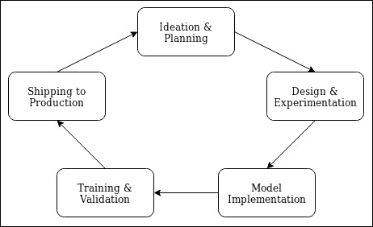
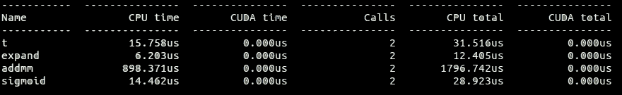
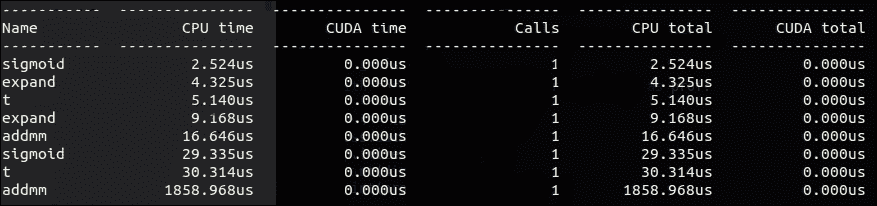
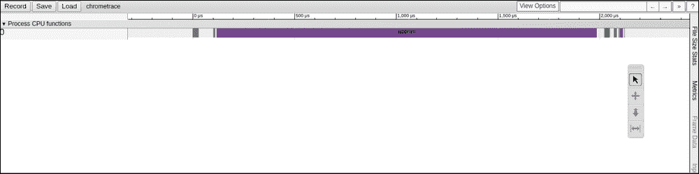
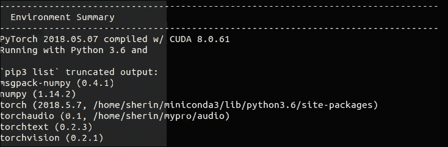
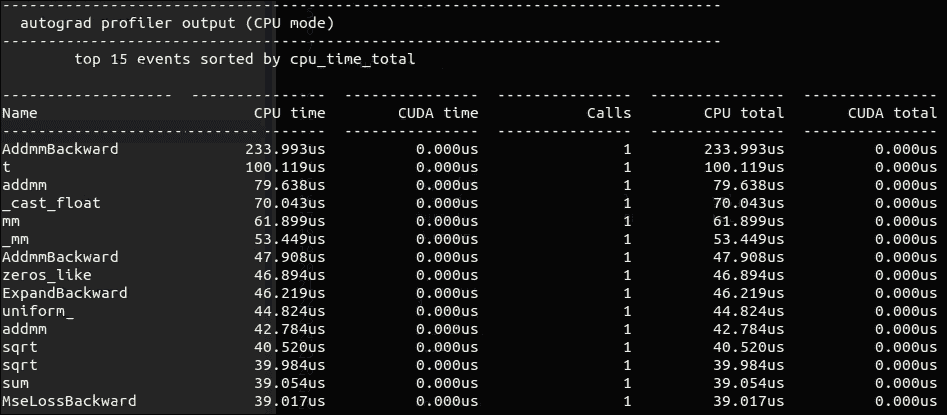
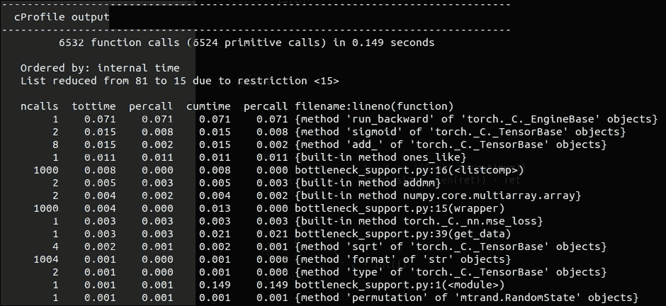

# 三、深度学习工作流程

尽管深度学习正在从学术界向行业发展转变，并每天为数百万用户的需求提供动力，但该领域的新参与者仍在努力建立深度学习管道的工作流程。 本章旨在介绍 PyTorch 可以帮助完成的工作流部分。

PyTorch 最初是由 Facebook 实习生作为研究框架开始的，现已发展到由超级优化的 Caffe2 核心支持后端的阶段。 因此，简而言之，PyTorch 可以用作研究或原型框架，同时可以用来编写带有服务模块的有效模型，并且还可以部署到单板计算机和移动设备上。

典型的深度学习工作流程始于围绕问题陈述的构想和研究，这是架构设计和模型决策发挥作用的地方。 然后使用原型对理论模型进行实验。 这包括尝试不同的模型或技术（例如跳跃连接），或决定不尝试什么。 同样，选择合适的数据集进行原型设计并将数据集的无缝集成添加到管道中对于此阶段至关重要。 一旦实现了模型并通过训练和验证集对其进行了验证，则可以针对生产服务优化该模型。 下图描述了一个五阶段的深度学习工作流程：



图 3.1：深度学习工作流程

先前的深度学习工作流程几乎等同于业内几乎每个人所实现的工作流程，即使对于高度复杂的实现，也略有不同。 本章简要说明了第一和最后一个阶段，并进入了中间三个阶段的核心，即设计和实验，模型实现以及训练和验证。

工作流的最后阶段通常是人们很费劲的，尤其是在应用规模很大的情况下。 之前我曾提到，尽管 PyTorch 是作为面向研究的框架构建的，但是社区设法将 Caffe2 集成到 PyTorch 的后端，这为 Facebook 使用的数千种模型提供了支持。 因此，在第 8 章， “生产中的 PyTorch”中详细讨论了将模型交付生产的过程，并举例说明了如何使用 ONNX，PyTorch JIT 等来展示如何交付用于服务数百万个请求的 PyTorch 模型，以及将模型迁移到单板计算机和移动设备。

## 构思和计划

通常，在组织中，产品团队会向工程团队显示问题陈述，希望知道他们是否可以解决。 这是构想阶段的开始。 在学术界，这可能是决策阶段，在此阶段，候选人必须为其论文找到问题。 在构思阶段，工程师们集思广益并找到了可能解决问题的理论方法。 除了将问题陈述转换为理论解决方案外，构想阶段还包括确定数据类型以及应使用哪些数据集来构建**概念证明**（**POC**）或**最低可行产品**（**MVP**）。 在这个阶段，团队通过分析问题陈述的行为，现有的可用实现，可用的预先训练的模型等来决定采用哪种框架。

这个阶段在行业中很常见，我有成千上万个示例，其中计划周密的构思阶段帮助团队按时推出了可靠的产品，而计划外的构思阶段破坏了整个产品的创建。

## 设计与实验

构建问题陈述的理论基础之后，我们进入设计和/或实验阶段，在其中通过尝试几种模型实现来构建 POC。 设计和实验的关键部分在于数据集和数据集的预处理。 对于任何数据科学项目，主要的时间份额都花在了数据清理和预处理上。 深度学习与此不同。

数据预处理是构建深度学习管道的重要部分之一。 通常，不清理或格式化现实世界的数据集以供神经网络处理。 在进行进一步处理之前，需要转换为浮点数或整数，进行规范化等操作。 建立数据处理管道也是一项艰巨的任务，其中包括编写大量样板代码。 为了使其更容易，将数据集构建器和`DataLoader`管道包内置到 PyTorch 的核心中。

### 数据集和`DataLoader`类

不同类型的深度学习问题需要不同类型的数据集，并且每种类型的可能需要不同类型的预处理，具体取决于我们使用的神经网络架构。 这是深度学习管道构建中的核心问题之一。

尽管社区已经免费提供了用于不同任务的数据集，但是编写预处理脚本几乎总是很痛苦。 PyTorch 通过提供抽象类来编写自定义数据集和数据加载器来解决此问题。 这里给出的示例是一个简单的`dataset`类，用于加载我们在第 2 章，“一个简单神经网络”中使用的`fizzbuzz`数据集，但是将其扩展来可以处理任何类型的数据集非常简单。 PyTorch 的官方文档使用类似的方法对图像数据集进行预处理，然后再将其传递给复杂的**卷积神经网络**（**CNN**）架构。

PyTorch 中的`dataset`类是高级抽象，可处理数据加载程序几乎需要的所有内容。 用户定义的自定义`dataset`类需要覆盖父类的`__len__`函数和`__getitem__`函数，其中数据加载程序正在使用`__len__`来确定数据集的长度，而`__getitem__` 数据加载器正在使用该物品来获取物品。 `__getitem__`函数希望用户将索引作为参数传递，并获取驻留在该索引上的项目：

```py
from dataclasses import dataclass
from torch.utils.data import Dataset, DataLoader

@dataclass(eq=False)
class FizBuzDataset(Dataset):
    input_size: int
    start: int = 0
    end: int = 1000

    def encoder(self,num):
        ret = [int(i) for i in '{0:b}'.format(num)]
        return[0] * (self.input_size - len(ret)) + ret

    def __getitem__(self, idx):
        idx += self.start
		x = self.encoder(idx)
        if idx % 15 == 0:
            y = [1,0,0,0]
        elif idx % 5 ==0:
            y = [0,1,0,0]
        elif idx % 3 == 0:
            y = [0,0,1,0]
        else:
            y = [0,0,0,1]
        return x,y

    def __len__(self):
        return self.end - self.start
```

自定义数据集的实现使用 Python 3.7 中的全新`dataclasses`。 `dataclasses`通过使用动态代码生成，有助于消除 Python 魔术函数的样板代码，例如`__init__`。 这需要代码被类型提示，这就是类中前三行的用途。 您可以在 Python 的官方文档[1]中阅读有关`dataclasses`的更多信息。

`__len__`函数返回传递给该类的结束值和起始值之间的差。 在`fizzbuzz`数据集中，数据正在由程序生成。 数据生成的实现在`__getitem__`函数内部，其中，类实例根据`DataLoader`传递的索引生成数据。 PyTorch 使类抽象尽可能通用，以便用户可以定义数据加载器应为每个 ID 返回的内容。 在这种特殊情况下，类实例为每个索引返回输入和输出，其中输入`x`是索引本身的二进制编码器版本，而输出是具有四个状态的单热编码输出。 四个状态表示下一个数字是三的倍数（嘶嘶声）或五的倍数（嗡嗡声），三或五的倍数（嘶嘶声）或不是三或五的倍数。

#### 注意

对于 Python 新手，可以通过首先查看从 0 到数据集长度的整数循环来理解数据集的工作方式（当`len(object)`为`len(object)`时，长度由`__len__`函数返回） 称为）。 以下代码段显示了简单的循环。

```py
dataset = FizBuzDataset()
for i in range(len(dataset)):
    x, y = dataset[i]

dataloader = DataLoader(dataset, batch_size=10, shuffle=True, num_workers=4)
for batch in dataloader:
    print(batch)
```

`DataLoader`类接受从`torch.utils.data.Dataset`继承的`dataset`类。 `DataLoader`接受`dataset`并执行不重要的操作，例如小批量，多线程，打乱等，以从数据集中获取数据。 它接受来自用户的`dataset`实例，并使用采样器策略以小批量的形式采样数据。

`num_worker`参数决定应该操作多少个并行线程来获取数据。 这有助于避免 CPU 瓶颈，以便 CPU 可以赶上 GPU 的并行操作。 数据加载器允许用户指定是否使用固定的 CUDA 内存，这会将数据张量复制到 CUDA 的固定的内存中，然后再返回给用户。 使用固定内存是设备之间快速数据传输的关键，因为数据是由数据加载程序本身加载到固定内存中的，而无论如何，这都是由 CPU 的多个内核完成的。

大多数情况下，尤其是在进行原型制作时，开发人员可能无法使用自定义数据集，在这种情况下，自定义数据集必须依赖现有的开放数据集。 处理开放数据集的好处是，大多数数据集免于许可负担，成千上万的人已经尝试过对其进行预处理，因此社区将提供帮助。 PyTorch 提出了针对所有三种类型的数据集的工具包，这些包具有经过预训练的模型，经过预处理的数据集以及与这些数据集一起使用的工具函数。

### 工具包

该社区针对视觉（`torchvision`），文本（`torchtext`）和音频（`torchaudio`）制作了三种不同的工具包。 它们针对不同的数据域都解决了相同的问题，并且使用户不必担心用户可能拥有的几乎所有用例中的数据处理和清理问题。 实际上，所有工具包都可以轻松地插入到可能理解或不理解 PyTorch 数据结构的任何类型的程序中。

#### `torchvision`

```py
pip install torchvision

```

`torchvision`是 PyTorch 中最成熟，使用最多的工具包，它由数据集，预先训练的模型和预先构建的转换脚本组成。 `torchvision`具有功能强大的 API，使用户能够轻松进行数据的预处理，并且在原型阶段（甚至可能无法使用数据集）特别有用。

`torchvision`的功能分为三类：预加载的，可下载的数据集，用于几乎所有类型的计算机视觉问题； 流行的计算机视觉架构的预训练模型； 以及用于计算机视觉问题的常见转换函数。 另外一个好处是，`torchvision`包的函数式 API 的简单性使用户可以编写自定义数据集或转换函数。 以下是`torchvision`包中可用的所有当前数据集的表格及其说明：

| 数据集 | 描述 |
| --- | --- |
| MNIST | 70,000 `28 x 28`手写数字的数据集。 |
| KMNIST | 平假名字符的排列方式与普通 MNIST 相同。 |
| 时尚 MNIST | 类似于 MNIST 的数据集，包含 70,000 张`28 x 28`张标记的时尚图片。 |
| EMNIST | 该数据集是一组`28 x 28`个手写字符数字。 |
| COCO | 大规模对象检测，分割和字幕数据集。 |
| LSUN | 类似于 COCO 的大规模“场景理解挑战”数据集。 |
| Imagenet-12 | 2012 年大规模视觉识别挑战赛的 1400 万张图像的数据集。 |
| CIFAR | 以 10/100 类标记的 60,000 张`32 x 32`彩色图像的数据集。 |
| STL10 | 另一个受 CIFAR 启发的图像数据集。 |
| SVHN | 街景门牌号码的数据集，类似于 MNIST。 |
| PhotoTour | 华盛顿大学提供的旅游景点数据集。 |

以下代码片段给出了 MNIST 数据集的一个示例。 上表中的所有数据集都需要传递一个位置参数，即要下载的数据集所在的路径，或者如果已经下载了该数据集则用于存储该数据集的路径。 数据集的返回值将打印有关数据集状态的基本信息。 稍后，我们将使用相同的数据集来启用转换，并查看数据集输出的描述性。

```py
>>> mnist = v.datasets.MNIST('.', download=True)
Downloading …
Processing…
Done!

>>> mnist
Dataset MNIST
 Number of datapoints: 60000
 Split: train
 Root Location: .
 Transforms (if any): None
 Target Transforms (if any): None

```

`torchvision`使用枕头（`PIL`）作为加载图像的默认后端。 但是通过方便的函数`torchvision.set_image_backend(backend)`，可以将其更改为任何兼容的后端。 `torchvision`提供的所有数据都继承自`torch.utils.data.Dataset`类，因此，已经针对其中每个实现了`__len__`和`__getitem__`。 这两个魔术函数都使所有这些数据集都能与`DataLoader`兼容，就像我们实现简单数据集并将其加载到`DataLoader`的方式一样。

```py
>>> mnist[1]
(<PIL.Image.Image image mode=L size=28×28 at 0x7F61AE0EA518>, tensor(0))
>>> len(mnist)
60000

```

如果用户已经有需要从磁盘上的某个位置读取的图像数据该怎么办？ 传统方式是通过编写预处理脚本来循环遍历图像，并使用`PIL`或`skimage`之类的任何包加载它们，然后将其传递给 PyTorch（或任何其他框架），可能会通过 NumPy。

`torchvision`对此也有解决方案。 将图像数据集以适当的目录层次结构存储在磁盘中后，`torchvision.ImageFolder`可以从目录结构本身中获取所需的信息，就像我们使用自定义脚本所做的一样，并使加载更加容易。 用户。 给定的代码段和文件夹结构显示了工作所需的简单步骤。 一旦将图像作为类名存储在层次结构中的最后一个文件夹中（图像的名称在这里并不重要），那么`ImageFolder`就会读取数据并智能地累积所需的信息：

```py
>>> images = torchvision.datasets.ImageFolder('/path/to/image/folder')
>>> images [0]
(<PIL.Image.Image image mode=RGB size=1198×424 at 0x7F61715D6438>, 0)

/path/to/image/folder/class_a/img1.jpg
/path/to/image/folder/class_a/img2.jpg
/path/to/image/folder/class_a/img3.jpg
/path/to/image/folder/class_a/img4.jpg

/path/to/image/folder/class_b/img1.jpg
/path/to/image/folder/class_b/img2.jpg
/path/to/image/folder/class_b/img3.jpg

```

`torchvision`的`models`模块包装有几种常用的模型，可以直接使用。 由于当今大多数高级模型都使用迁移学习来获得其他架构学习的权重（例如，第三章中的语义分段模型使用经过训练的 resnet18 网络），因此这是模型最常用的`torchvision`功能之一。 以下代码段显示了如何从`torchvision.models`下载 resnet18 模型。 标志`pretrained`告诉`torchvision`仅使用模型或获取从 PyTorch 服务器下载的预训练模型。

```py
>>> resnet18 = torchvision.models.resnet18(pretrained=False)
>>> resnet18 = torchvision.models.resnet18(pretrained=True)
>>> for param in resnet18.layer1.parameters():
 param.requires_grad = False

```

PyTorch 的 Python API 允许冻结用户决定使其不可训练的模型部分。 前面的代码中给出了一个示例。 循环访问`resnet18`的第 1 层参数的循环可访问每个参数的`requires_grad`属性，这是 Autograd 在反向传播以进行梯度更新时所寻找的。 将`requires_grad`设置为`False`会屏蔽`autograd`中的特定参数，并使权重保持冻结状态。

`torchvision`的`transforms`模块是另一个主要参与者，它具有用于数据预处理和数据扩充的工具模块。 `transforms`模块为常用的预处理函数（例如填充，裁切，灰度缩放，仿射变换，将图像转换为 PyTorch 张量等）提供了开箱即用的实现，以及一些实现数据扩充，例如翻转，随机裁剪和色彩抖动。 `Compose`工具将多个转换组合在一起，以形成一个管道对象。

```py
transform = transforms.Compose(
    [
        transforms.ToTensor(),
        transforms.Normalize(mean, std),
    ]
)
```

前面的示例显示了`transforms.Compose`如何将`ToTensor`和`Normalize`组合在一起以组成单个管道。 `ToTensor`将三通道输入 RGB 图像转换为尺寸为`通道×宽度×高度`的三维张量。 这是 PyTorch 中视觉网络期望的尺寸顺序。

`ToTensor`还将每个通道的像素值从 0 到 255 转换为 0.0 到 1.0 的范围。 `Transforms.Normalize`是具有均值和标准差的简单归一化。 因此，`Compose`循环遍历所有转换，并使用先前转换的结果调用转换。 以下是从源代码复制的`torchvision`转换撰写的`__call__`函数：

```py
def __call__(self, img):
    for t in self.transforms:
        img = t(img)
    return img
```

转换带有很多工具，并且它们在不同的情况下都非常有用。 最好阅读不断完善的`torchvision`文档，以详细了解更多功能。

#### `torchtext`

```py
pip install torchtext

```

与其他两个工具包不同，`torchtext`保留自己的 API 结构，该结构与`torchvision`和`torchaudio`完全不同。 `torchtext`是一个非常强大的库，可以为**自然语言处理**（**NLP**）数据集执行所需的预处理任务。 它带有一组用于常见 NLP 任务的数据集，但是与`torchvision`不同，它没有可供下载的预训练网络。

`torchtext`可以插入输入或输出端的任何 Python 包中。 通常，spaCy 或 NLTK 是帮助`torchtext`进行预处理和词汇加载的好选择。 `torchtext`提供 Python 数据结构作为输出，因此可以连接到任何类型的输出框架，而不仅仅是 PyTorch。 由于`torchtext`的 API 与`torchvision`或`torchaudio`不相似，并且不如其他人简单明了，因此下一个部分将通过一个示例演示`torchtext`在 NLP 中的主要作用。

`torchtext`本身是一个包装器工具，而不是支持语言操作，因此这就是我在以下示例中使用 spaCy 的原因。 例如，我们使用**文本检索会议**（**TREC**）数据集，它是一个问题分类器。

| 文本 | 标签 |
| --- | --- |
| `How do you measure earthquakes?`（您如何测量地震？） | `DESC` |
| `Who is Duke Ellington?`（埃灵顿公爵是谁？） | `HUM` |

用于此类数据集上的 NLP 任务的常规数据预处理管道包括：

*   将数据集分为训练集，测试集和验证集。
*   将数据集转换为神经网络可以理解的形式。 数值化，单热编码和词嵌入是常见的方法。
*   批量。
*   填充到最长序列的长度。

没有像`torchtext`这样的帮助程序类，这些平凡的任务令人沮丧且无济于事。 我们将使用`torchtext`的强大 API 来简化所有这些任务。

`torchtext`有两个主要模块：`Data`模块和`Datasets`模块。 如官方文档所述，`Data`模块承载了多个数据加载器，抽象和文本迭代器（包括词汇和单词向量），而`Datasets`模块则为常见的 NLP 任务预先构建了数据集。

在此示例中，我们将使用`Data`模块加载以制表符分隔的数据，并使用 spaCy 的分词对其进行预处理，然后再将文本转换为向量。

```py
spacy_en = spacy.load('en')

def tokenizer(text):
    return [tok.text for tok in spacy_en.tokenizer(text)]

TEXT = data.Field(sequential=True, tokenize=tokenizer, lower=True)
LABEL = data.Field(sequential=False, use_vocab=True)

train, val, test = data.TabularDataset.splits(
    path='./data/', train='TRECtrain.tsv',
    validation='TRECval.tsv', test='TRECtest.tsv', format='tsv',
    fields=[('Text', TEXT), ('Label', LABEL)])
```

上一小节的第一部分在 spaCy 中加载英语，并定义了分词器函数。 下一部分是使用`torchtext.data.Field`定义输入和输出字段的位置。 `Field`类用于定义将数据加载到`DataLoader`之前的预处理步骤。

在所有输入语句之间共享`Field`变量`TEXT`，并且在所有输出标签之间共享`Field`变量`LABEL`。 该示例中的`TEXT`设置为顺序的，这告诉`Field`实例数据是顺序相关的，并且分词是将其分成较小块的更好选择。 如果`sequential`设置为`False`，则不会对数据应用分词。

由于`sequential`是`TEXT`的`True`，因此我们开发的分词函数设置为`tokenizer`。 该选项默认为 Python 的`str.split`，但是我们需要更智能的分词函数，而 spaCy 的分词功能可以为我们提供帮助。

常规 NLP 管道所做的另一个重要修改是将所有数据转换为相同的情况。 将`lower`设置为`True`会发生这种情况，但是默认情况下是`False`。 除了示例中给出的三个参数外，`Field`类还接受许多其他参数，其中包括`fix_length`以固定序列的长度； `pad_token`，默认为`<pad>`，用于填充序列以匹配`fixed_length`或批量中最长序列的长度； 和`unk_token`（默认为`<unk>`），用于替换没有词汇向量的标记。

`Field`的官方文档详细介绍了所有参数。 因为我们只有一个单词作为标签，所以`LABEL`字段的`sequential`设置为`False`。 这对于不同的实例非常方便，尤其是在语言翻译（输入和输出均为序列）的情况下。

`Field`的另一个重要参数是`use_vocab`，默认情况下将其设置为`True`。 此参数告诉`Field`实例是否对数据使用词汇表生成器。 在示例数据集中，我们将输入和输出都用作单词，甚至将输出转换为单词向量也是有意义的，但是在几乎所有情况下，输出将是单编码的向量或将其数字化。 在`torchtext`不会尝试将其转换为单词嵌入词典的索引的情况下，将`use_vocab`设置为`False`很有帮助。

一旦使用`Field`设置了预处理机制，我们就可以将它们与数据位置一起传递给`DataLoader`。 现在`DataLoader`负责从磁盘加载数据并将其通过预处理管道。

`Data`模块带有多个`DataLoader`实例。 我们在这里使用的是`TabularDataset`，因为我们的数据是 TSV 格式。 `torchtext`的官方文档显示了其他示例，例如 JSON 加载器。 `TabularDataset`接受磁盘中数据位置的路径以及训练，测试和验证数据的名称。 这对于加载不同的数据集非常方便，因为将数据集加载到内存中的时间少于，只需少于五行代码。 如前所述，我们将之前制作的`Field`对象传递给`DataLoader`，它知道现在如何进行预处理。 `DataLoader`返回`torchtext`对象以获取训练，测试和验证数据。

我们仍然必须从一些预训练的词嵌入词典构建词汇表，然后将我们的数据集转换为词典中的索引。 `Field`对象通过放弃名为`build_vocab`的 API 来实现这一点。 但是在这里，它变得有些古怪，变成了类似循环依赖的东西，但是请放心。 我们会习惯的。

`Field`的`build_vocab`要求我们传递上一步中`DataSet.split`方法返回的`data`对象。 `Field`就是这样知道数据集中存在的单词，总词汇量的长度等等。 `build_vocab`方法还可以为您下载预训练的词汇向量（如果您还没有的话）。 通过`torchtext`可用的词嵌入为：

*   字符 N 元组
*   Fasttext
*   GloVe 向量

```py
TEXT.build_vocab(train, vectors="glove.6B.50d")
LABEL.build_vocab(train, vectors="glove.6B.50d")
train_iter, val_iter, test_iter = data.Iterator.splits((train, val, test), sort_key=lambda x: len(x.Text),batch_sizes=(32, 99, 99), device=-1)

print(next(iter(test_iter)))

# [torchtext.data.batch.Batch of size 99]
# [.Text]:[torch.LongTensor of size 16x99]
# [.Label]:[torch.LongTensor of size 99]
```

建立词汇表后，我们可以要求`torchtext`给我们迭代器，该迭代器可以循环执行神经网络。 上面的代码片段显示了`build_vocab`如何接受参数，然后如何调用`Iterator`包的`splits`函数来为我们的训练，验证和测试数据创建三个不同的迭代器。

为了使用 CPU，将`device`参数设置为`-1`。 如果是`0`，则`Iterator`会将数据加载到默认 GPU，或者我们可以指定设备编号。 批量大小期望我们传递的每个数据集的批量大小。 在这种情况下，我们具有用于训练，验证和测试的三个数据集，因此我们传递具有三个批量大小的元组。

`sort_key`使用我们传递的`lambda`函数对数据集进行排序。 在某些情况下，对数据集进行排序会有所帮助，而在大多数情况下，随机性会帮助网络学习一般情况。 `Iterator`足够聪明，可以使用通过参数传递的批量大小来批量输入数据集，但是它并不止于此。 它可以动态地将所有序列填充到每批最长序列的长度。 `Iterator`的输出（如`print`语句所示）为`TEXT`数据，其大小为`16x99`，其中`99`是我们为测试数据集传递的批量大小，而 16 是该数据集的长度。 该特定批量中最长的序列。

如果`Iterator`类需要更巧妙地处理事情怎么办？ 如果数据集用于语言建模，并且我们需要一个数据集来进行**时间上的反向传播**（**BPTT**），那该怎么办？ `torchtext`也为这些模块抽象了模块，这些模块继承自我们刚刚使用的`Iterator`类。 `BucketIterator`模块将序列进行更智能的分组，以便将具有相同长度的序列归为一组，并且此减少了将噪声引入数据集的不必要填充的长度。 `BucketIterator`还可以在每个周期对批量进行混洗，并在数据集中保持足够的随机性，从而使网络无法从数据集中的顺序中学习，这实际上并没有在教授任何现实世界的信息。

`BPTTIterator`是从`Iterator`类继承的另一个模块，可帮助语言建模数据集，并且需要为`t`的每个输入从`t + 1`获取标签。`t`是时间。 `BPTTIterator`接受输入数据的连续流和输出数据的连续流（在翻译网络的情况下，输入流和输出流可以不同，在语言建模网络的情况下，输入流和输出流可以相同）并将其转换为迭代器，它遵循前面描述的时间序列规则。

`torchtext`还保存了开箱即用的数据集。 下面是一个示例，说明访问数据集的可用版本有多么容易：

```py
>>> import torchtext
>>> from torchtext import data
>>> TextData = data.Field()
>>> LabelData = data.Field()
>>> dataset = torchtext.datasets.SST('torchtextdata', TextData, LabelData)
>>> dataset.splits(TextData, LabelData)
(<torchtext.datasets.sst.SST object at 0x7f6a542dcc18>, <torchtext.datasets.sst.SST object at 0x7f69ff45fcf8>, <torchtext.datasets.sst.SST object at 0x7f69ff45fc88>)
>>> train, val, text = dataset.splits(TextData, LabelData)
>>> train[0]
<torchtext.data.example.Example object at 0x7f69fef9fcf8>

```

在这里，我们下载了 SST 情感分析数据集，并使用相同的`dataset.splits`方法来获取具有`__len__`和`__getitem__`定义为与实例相似的`data`对象。

下表显示`torchtext`中当前可用的数据集以及它们特定的任务：

| 数据集 | 任务 |
| --- | --- |
| BaBi | 问题回答 |
| SST | 情感分析 |
| IMDB | 情感分析 |
| TREC | 问题分类 |
| SNLI | 蕴涵 |
| MultiNLI | 蕴涵 |
| WikiText2 | 语言建模 |
| WikiText103 | 语言建模 |
| PennTreebank | 语言建模 |
| WMT14 | 机器翻译 |
| IWSLT | 机器翻译 |
| Multi30k | 机器翻译 |
| UDPOS | 序列标记 |
| CoNLL2000Chunking | 序列标记 |

#### `torchaudio`

音频工具可能是 PyTorch 所有工具包中最不成熟的包。 无法安装在`pip`之上的事实证明了这一主张。 但是，`torchaudio`涵盖了音频域中任何问题陈述的基本用例。 此外，PyTorch 还向内核添加了一些方便的功能，例如**逆快速傅里叶变换**（**IFFT**）和**稀疏快速傅里叶变换**（**SFFT**） ，显示 PyTorch 在音频领域的进步。

`torchaudio`依赖于跨平台音频格式更改器**声音交换**（**SoX**）。 一旦安装了依赖项，就可以使用 Python 设置文件从源文件中安装。

```py
python setup.py install

```

`torchaudio`带有两个预先构建的数据集，一些转换以及一个用于音频文件的加载和保存工具。 让我们深入探讨其中的每一个。 加载和保存音频文件总是很麻烦，并且依赖于其他几个包。 `torchaudio`通过提供简单的加载和保存函数式 API 使其变得更加容易。 `torchtext`可以加载任何常见的音频文件并将其转换为 PyTorch 张量。 它还可以对数据进行规范化和非规范化，以及以任何通用格式写回磁盘。 保存的 API 接受文件路径，并从文件路径推断输出格式，然后将其转换为该格式，然后再将其写回磁盘。

```py
>>> data, sample_rate = torchaudio.load('foo.mp3')
>>> print(data.size())
torch.Size([278756, 2])
>>> print(sample_rate)
44100
>>> torchaudio.save('foo.wav', data, sample_rate)

```

与`torchvision`一样，`torchaudio`的数据集直接继承自`torch.utils.data.Dataset`，这意味着它们已经实现了`__getitem__`和`__len__`，并且与`DataLoader`兼容。 现在，`torchaudio`的`datasets`模块预先加载了两个不同的音频数据集`VCTK`和`YESNO`，它们都具有与`torchvision`的数据集相似的 API。 使用 Torch `DataLoader`加载`YESNO`数据集的示例如下：

```py
yesno_data = torchaudio.datasets.YESNO('.', download=True)
data_loader = torch.utils.data.DataLoader(yesno_data)
```

`transforms`模块也受到`torchvision` API 的启发，借助`Compose`，我们可以将一个或多个转换包装到一个管道中。 此处提供了一个来自官方文档的示例。 它依次将`Scale`转换和`PadTrim`转换组成一个管道。 官方文档中详细说明了所有可用转换的列表。

```py
transform = transforms.Compose(
    [
        transforms.Scale(),
        transforms.PadTrim(max_len=16000)
    ]
)
```

## 模型实现

毕竟，实现模型是我们开发流程中最重要的一步。 在某种程度上，我们为此步骤构建了整个管道。 除了构建网络架构之外，我们还需要考虑许多细节来优化实现（在工作量，时间以及代码效率方面）。

在本次会议中，我们将讨论 PyTorch 包本身和`ignite`（PyTorch 的推荐训练者工具）中提供的性能分析和瓶颈工具。 第一部分介绍了瓶颈和性能分析工具，当模型开始表现不佳并且您需要知道哪里出了问题时，这是必不可少的。 本课程的第二部分介绍了训练器模块`ignite`。

训练器网络并不是真正必需的组件，但它是一个很好的帮助程序工具，可以节省大量时间来编写样板文件和修复错误。 有时，它可以将程序的行数减少一半，这也有助于提高可读性。

#### 瓶颈和性能分析

PyTorch 的 Python 优先方法阻止核心团队在的第一年建立一个单独的探查器，但是当模块开始转向 C/C++ 内核时，就很明显需要在 Python 的 cProfiler 上安装一个独立的探查器，这就是 `autograd.profiler`故事的开始。

本节将提供更多的表和统计信息，而不是分步指导，因为 PyTorch 已经使概要分析尽可能简单。 对于概要分析，我们将使用在第二章中开发的相同的 *FizzBu​​zz* 模型。 尽管`autograd.profiler`可以分析图中的所有操作，但是在此示例中，仅分析了主网络的正向传播，而没有损失函数和后向通过。

```py
with torch.autograd.profiler.profile() as prof:
    hyp = net(x_)

print(prof)
prof.export_chrome_trace('chrometrace')
print(prof.key_averages())
print(prof.table('cpu_time'))
```

第一个`print`语句只是以表格形式吐出`t`概要文件输出，而第二个`print`语句将 op 节点分组在一起并平均一个特定节点所花费的时间。 在下面的屏幕快照中显示了该内容：



图 3.2：按名称分组的`autograd.profiler`输出

下一个`print`语句基于作为参数传递的头按升序对数据进行排序。 该有助于找到需要更多时间的节点，并可能提供某种方式来优化模型。



图 3.3：`autograd.profiler`输出按 CPU 时间排序

最后一个`print`语句只是可视化 Chrome 跟踪工具执行时间的另一种方式。 `export_chrome_trace`函数接受文件路径，并将输出写入 Chrome 跟踪器可以理解的文件：



图 3.4：`autograd.profiler`输出转换为 chrometrace

但是，如果用户需要结合使用`autograd.profiler`和 cProfiler（这将使我们在多个节点操作之间实现简洁的关联），或者用户仅需要调用另一个工具而不是更改用于获取配置文件的源代码， 信息是瓶颈。 瓶颈是 Torch 工具，可以从命令行作为 Python 模块执行：

```py
python -m torch.utils.bottleneck /path/to/source/script.py [args]

```

瓶颈可以找到有关环境的更多信息，还可以从`autograd.profiler`和 cProfiler 提供配置文件信息。 但是对于两者而言，瓶颈都会两次执行该程序，因此减少的周期数是使程序在相当长的时间内停止执行的一个好选择。 我在第二章的同一程序上使用了瓶颈，这是输出屏幕：



图 3.5：环境摘要上的瓶颈输出



图 3.6：瓶颈输出显示`autograd.profiler`



图 3.7：瓶颈输出显示 cProfile 输出

## 训练和验证

尽管工作流实际上以将深度模型的部署到生产中而结束，但我们已经到达深度学习工作的最后一步，我们将在第 8 章和“PyTorch 投入生产”。 在完成所有预处理和模型构建之后，现在我们必须训练网络，测试准确率并验证可靠性。 在开源世界（甚至在本书中）中，我们看到的大多数现有代码实现都使用直接方法，在该方法中，我们明确编写了训练，测试和验证所需的每一行，以提高可读性，因为可以避免样板的特定工具会增加学习曲线，尤其是对于新手。 很显然，对于那些每天都在使用神经网络的程序员来说，可以避免样板的工具将是一个救生员。 因此，PyTorch 社区构建的不是一个而是两个工具：Torchnet 和 Ignite。 本次会议仅与点燃有关，因为它被发现比 Torchnet 更为有用和抽象，但两者都是积极开发的工具，有可能在不久的将来合并。

### Ignite

Ignite 是一种神经网络训练工具，可将某些样板代码抽象出来，以使代码简洁明了。 Ignite 的核心是`Engine`模块。 该模块非常强大，因为：

*   它基于默认/自定义训练器或评估者运行模型。
*   它可以接受处理器和指标，并对其执行操作。
*   它可以创建触发器并执行回调。

#### `Engine`

`Engine`接受一个训练器函数，该函数实质上是用于训练神经网络算法的典型循环。 它包括循环遍历，循环遍历，将现有梯度值归零，使用批量调用模型，计算损失以及更新梯度。 以下示例显示了这一点，该示例取自第 2 章和“简单神经网络”：

```py
for epoch in range(epochs):
    for x_batch, y_batch in dataset:
        optimizer.zero_grad()
        hyp = net(x_batch)
        loss = loss_fn(hyp, y_batch)
        loss.backward()
        optimizer.step()
```

`Engine`可以帮助您避免前两个循环，并且如果您定义了需要执行其余代码的函数，它将为您完成。 以下是与`Engine`兼容的先前代码段的重写版本：

```py
def training_loop(trainer, batch)
    x_batch, y_batch = process_batch(batch)
    optimizer.zero_grad()
    hyp = net(x_batch)
    loss = loss_fn(hyp, y_batch)
    loss.backward()
    optimizer.step()

trainer = Engine(training_loop)
```

这很聪明，但这并没有节省用户大量时间，也没有兑现承诺，例如删除样板。 它所做的只是删除两个`for`循环并添加`Engine`对象创建的另一行。 这并不是 Ignite 的真正目的。 Ignite 尝试同时使编码变得有趣且灵活，从而有助于避免重复样板。

Ignite 提供了一些常用函数，例如有监督的训练或有监督的评估，并且还使用户可以灵活地定义自己的训练函数，例如训练 GAN，**强化学习**（**RL**）算法，依此类推。

```py
from ignite.engine import create_supervised_trainer, create_supervised_evaluator

epochs = 1000
train_loader, val_loader = get_data_loaders(train_batch_size, val_batch_size)
trainer = create_supervised_trainer(model, optimizer, F.nll_loss)
evaluator = create_supervised_evaluator(model)
trainer.run(train_loader, max_epochs=epochs)
evaluator.run(val_loader)
```

函数`create_supervised_trainer`和`create_supervised_evaluator`返回一个`Engine`对象，该对象具有类似于`training_loop`的函数来执行代码的公共模式，如先前给出的那样。 除了给定的参数，这两个函数还接受一个设备（CPU 或 GPU），该设备返回在我们指定的设备上运行的训练器或评估器`Engine`实例。 现在情况越来越好了吧？ 我们传递了定义的模型，所需的优化器以及正在使用的损失函数，但是在有了训练器和`evaluator`对象之后我们该怎么办？

`Engine`对象定义了`run`方法，该方法使循环根据传递给`run`函数的周期和加载器开始执行。 与往常一样，`run`方法使`trainer`循环从零到周期数。 对于每次迭代，我们的训练器都会通过加载程序进行梯度更新。

训练完成后，`evaluator`与`val_loader`开始，并通过使用评估数据集运行相同的模型来确保情况得到改善。

那很有趣，但仍然缺少一些片段。 如果用户需要在每个周期之后运行`evaluator`，或者如果用户需要训练器将模型的精度打印到终端，或者将其绘制到 Visdom，Turing 或 Network 图上，该怎么办？ 在前面的设置中，有没有办法让知道验证准确率是什么？ 您可以通过覆盖`Engine`的默认记录器来完成大部分操作，该记录器本质上是保存在`trainer_logger`变量中的 Python 记录器，但实际的答案是事件。

#### 事件

Ignite 打开了一种通过事件或触发器与循环进行交互的特殊方式。 当事件发生并执行用户在函数中定义的操作时，每个设置函数都会触发。 这样，用户就可以灵活地设置任何类型的事件，并且通过避免将那些复杂的事件写入循环中并使循环变得更大且不可读，从而使用户的生活变得更加轻松。 `Engine`中当前可用的事件是：

*   `EPOCH_STARTED`
*   `EPOCH_COMPLETED`
*   `STARTED`
*   `COMPLETED`
*   `ITERATION_STARTED`
*   `ITERATION_COMPLETED`
*   `EXCEPTION_RAISED`

在这些事件上设置函数触发器的最佳和推荐方法是使用 Python 装饰器。 训练器的`on`方法接受这些事件之一作为参数，并返回一个装饰器，该装饰器设置要在该事件上触发的自定义函数。 这里给出了一些常见事件和用例：

```py
@trainer.on(Events.ITERATION_COMPLETED)
def log_training_loss(engine):
    epoch = engine.state.epoch
    iteration = engine.state.iteration
    loss = engine.state.output
    print("Epoch:{epoch} Iteration:{iteration} Loss: {loss}")

@trainer.on(Events.EPOCH_COMPLETED)
def run_evaluator_on_training_data(engine):
    evaluator.run(train_loader)

@trainer.on(Events.EPOCH_COMPLETED)
def run_evaluator_on_validation_data(engine):
    evaluator.run(val_loader)
```

到目前为止，我必须已经使您相信 Ignite 是工具箱中的必备工具。 在前面的示例中，已为三个事件设置了`@trainer.on`装饰器； 实际上，在两个事件上，我们在`EPOCH_COMPLETED`事件上设置了两个函数。 使用第一个函数，我们可以将训练状态打印到终端上。 但是有些事情我们还没有看到。 状态是`Engine`用来保存有关执行信息的`state`变量。 在示例中，我们看到状态保存了有关周期，迭代乃至输出的信息，这实际上是训练循环的损失。 `state`属性包含周期，迭代，当前数据，指标（如果有）（我们将很快了解指标）； 调用`run`函数时设置的最大周期，以及`training_loop`函数的输出。

##### 注意

**注意**：在`create_supervised_trainer`的情况下，`training_loop`函数返回损失，在`create_supervised_evaluator`的情况下，`training_loop`函数返回模型的输出。 但是，如果我们定义一个自定义`training_loop`函数，则此函数返回的内容将是`Engine.state.output`保留的内容。

第二和第三事件处理器正在`EPOCH_COMPLETED`上运行`evaluator`，但具有不同的数据集。 在第一个函数中，`evaluator`使用训练数据集，在第二个函数中，它使用评估数据集。 太好了，因为现在我们可以在每个周期完成时运行`evaluator`，而不是像第一个示例那样在整个执行结束时运行。 但是，除了运行它之外，处理器实际上并没有做任何事情。 通常，这里是我们检查平均准确率和平均损失的地方，并且我们会进行更复杂的分析，例如混淆度量的创建，我们将在后面看到。 但是，目前的主要收获是：可以为单个事件设置`n`处理器数量，Ignite 会毫不犹豫地依次调用所有这些处理器。 接下来是事件的内部`_fire_event`函数，该事件在`training_loop`函数的每个事件中触发。

```py
def _fire_event(self, event_name, *event_args):
    if event_name in self._event_handlers.keys():
        self._logger.debug("firing handlers for event %s", event_name)
        for func, args, kwargs in self._event_handlers[event_name]:
            func(self, *(event_args + args), **kwargs)
```

在下一节中，我们将使`EPOCH_COMPLETED`事件处理器使用 Ignite 的指标进行更明智的操作。

#### 指标

就像`Engine`一样，指标也是 Ignite 源代码的重要组成部分，源代码正在不断发展。 度量将用于分析神经网络的表现和效率的几种常用度量包装为`Engine`可以理解的简单可配置类。 接下来给出当前构建的指标。 我们将使用其中一些来构建前面的事件处理器：

*   `Accuracy`
*   `Loss`
*   `MeanAbsoluteError`
*   `MeanPairwiseDistance`
*   `MeanSquaredError`
*   `Precision`
*   `Recall`
*   `RootMeanSquaredError`
*   `TopKCategoricalAccuracy`
*   `RunningAverageŁ`
*   `IoU`
*   `mIoU`

Ignite 具有父`metrics`类，该类由列表中的所有类继承。 可以通过将词典对象传递给用户，该词典对象以用户可读的名称作为键，并将先前类之一的实例化对象作为值传递给`Engine`创建调用，以完成设置指标。 因此，我们现在使用指标重新定义`evaluator`的创建。

```py
metrics = {'accuracy': CategoricalAccuracy(), 'null': Loss(F.null_loss)}
evaluator = create_supervised_evaluator(model, metrics=metrics)
```

`Engine`的初始化器获取指标，并调用`Metrics.attach`函数来设置触发器，以计算`EPOCH_STARTED`，`ITERATION_COMPLETED`和`EPOCH_COMPLETED`的指标。 来自`Metrics`源代码的`attach`函数如下：

```py
def attach(self, engine, name):
    engine.add_event_handler(Events.EPOCH_STARTED, self.started)
    engine.add_event_handler(Events.ITERATION_COMPLETED, self.iteration_completed)
    engine.add_event_handler(Events.EPOCH_COMPLETED, self.completed, name)
```

通过`Engine`设置事件处理器后，事件发生时将自动调用它们。 `EPOCH_STARTED`事件通过调用`reset()`方法来清理指标，并使存储对于当前周期指标集合保持干净。

`ITERATION_COMPLETED`触发器将调用相应指标的`update()`方法并进行指标更新。 例如，如果度量等于损失，则它会在创建`Engine`时调用我们作为参数传递给`Loss`类的损失函数来计算当前损失。 然后将计算出的损失保存到对象变量中，以备将来使用。

`EPOCH_COMPLETED`事件将是最终事件，它将使用`ITERATION_COMPLETED`中更新的内容来计算最终指标得分。 一旦将`metrics`字典作为参数传递给`Engine`创建，所有这些都将作为流在用户不知道的情况下发生。 以下代码段显示了用户如何在运行`evaluator`的`EPOCH_COMPLETED`触发器上取回此信息：

```py
@trainer.on(Events.EPOCH_COMPLETED)
def run_evaluator_on_validation_data(engine):
    evaluator.run(val_loader)
    metrics = evaluator.state.metrics
    avg_accuracy = metrics['accuracy']
    avg_null = metrics['nll']
    print(f"Avg accuracy: {avg_accuracy} Avg loss: {avg_nll}")
```

`metrics`状态以与最初传递的用户同名的名称保存在`Engine`状态变量中，作为字典，并以输出作为值。 Ignite 只是为用户提供了整个流程流畅和无缝的接口，因此用户不必担心编写所有普通代码。

#### 保存检查点

使用 Ignite 的另一个好处是检查点保存功能，PyTorch 中不提供此功能。 人们想出了不同的方法来有效地编写和加载检查点。 `EngineCheckpoint`是 Ignite 处理器的一部分，可以这样导入：

```py
from ignite.handlers import EngineCheckpoint
```

Ignite 的检查点保护程序具有非常简单的 API。 用户需要定义检查点的保存位置，检查点的保存频率以及除默认参数（如迭代计数，用于恢复操作的周期数）以外的对象要保存的内容。 在该示例中，我们为每一百次迭代检查点。 然后可以将定义的值作为参数传递给`EngineCheckpoint`模块，以获取检查点事件处理器对象。

返回的处理器具有常规事件处理器的所有功能，并且可以为 Ignite 触发的任何事件进行设置。 在以下示例中，我们将其设置为`ITERATION_COMPLETED`事件：

```py
dirname = 'path/to/checkpoint/directory'
objects_to_checkpoint = {"model": model, "optimizer": optimizer}
engine_checkpoint = EngineCheckpoint(dirname=dirname,to_save=objects_to_checkpoint,save_interval=100)
trainer.add_event_handler(Events.ITERATION_COMPLETED, engine_checkpoint)
```

触发器在每个`ITERATION_COMPLETED`事件上调用处理器，但是我们只需要为每百次迭代保存一次即可，并且 Ignite 没有用于自定义事件的方法。 Ignite 通过为用户提供在处理器内部进行此检查的灵活性来解决此问题。 对于检查点处理器，Ignite 在内部检查当前完成的迭代是否为百分之一，并仅在检查通过后才保存该迭代，如以下代码片段所示：

```py
if engine.state.iteration % self.save_interval !=0:
    save_checkpoint()
```

可以使用`torch.load('checkpont_path')`加载保存的检查点。 这将为您提供具有模型和优化器的字典`objects_to_checkpoint`。

## 总结

本章都是关于如何为深度学习开发建立基础管道的。 我们在本章中定义的系统是一种非常普遍/通用的方法，其后是不同类型的公司，但略有变化。 从这样的通用工作流程开始的好处是，随着团队/项目的发展，您可以构建一个非常复杂的工作流程。

同样，在开发的早期阶段拥有工作流本身将使您的冲刺稳定且可预测。 最后，工作流中各个步骤之间的划分有助于定义团队成员的角色，为每个步骤设置截止日期，尝试有效地将每个步骤容纳在 sprint 中以及并行执行这些步骤。

PyTorch 社区正在制作不同的工具和工具包以整合到工作流中。 `ignite`，`torchvision`，`torchtext`，`torchaudio`等是这样的示例。 随着行业的发展，我们可以看到很多此类工具的出现，可以将其安装到此工作流的不同部分中，以帮助我们轻松地对其进行迭代。 但最重要的部分是：从一个开始。

在下一章中，我们将探讨计算机视觉和 CNN。

## 参考

1.  [`dataclasses`的 Python 官方文档](https://docs.python.org/3/library/dataclasses.html)
2.  Ignite 部分中使用的示例均受 Ignite [官方示例](https://github.com/pytorch/ignite/blob/master/examples/mnist/mnist.py)的启发