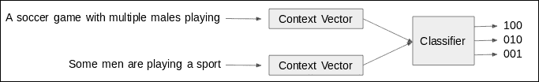
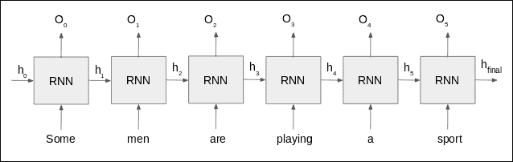
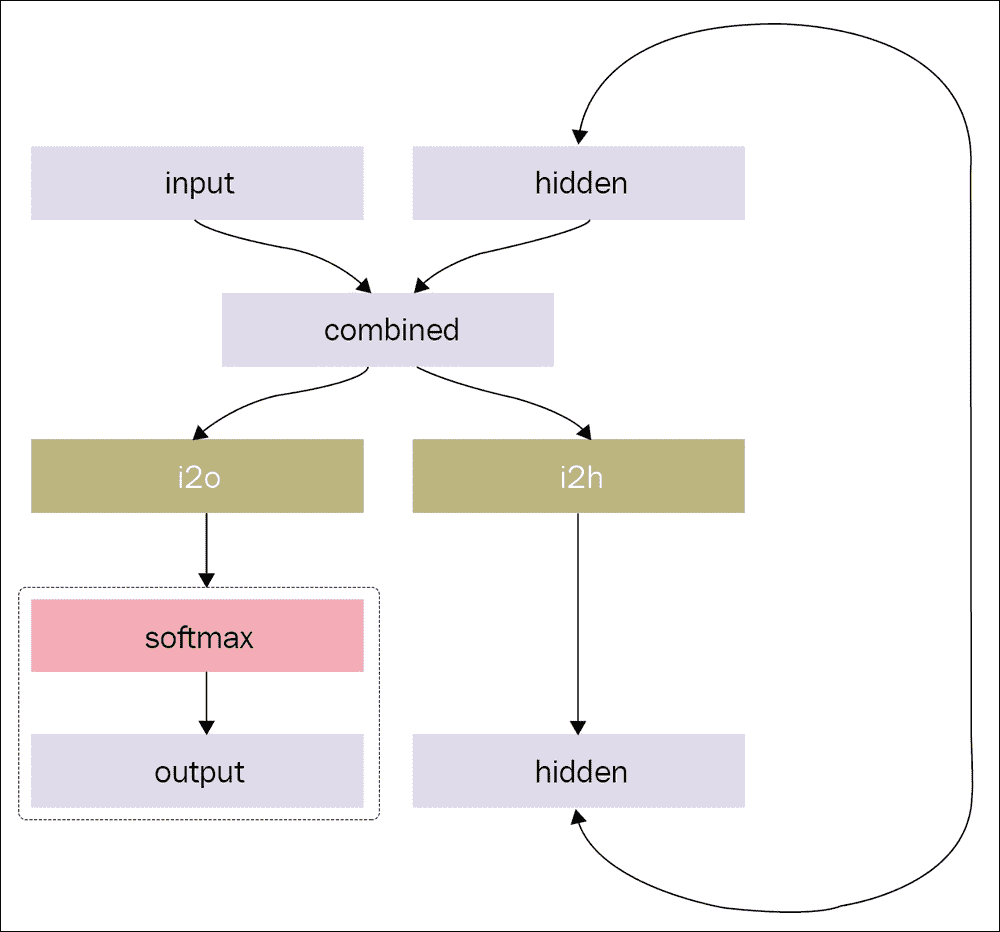
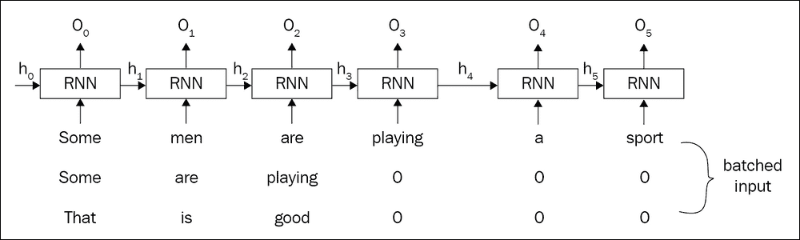
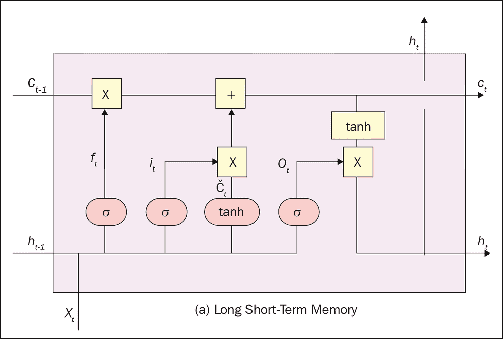
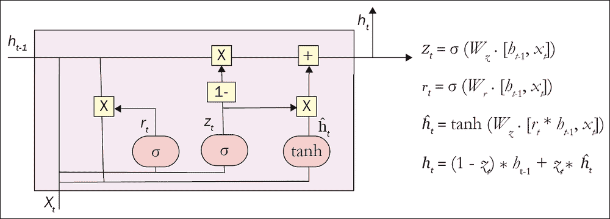
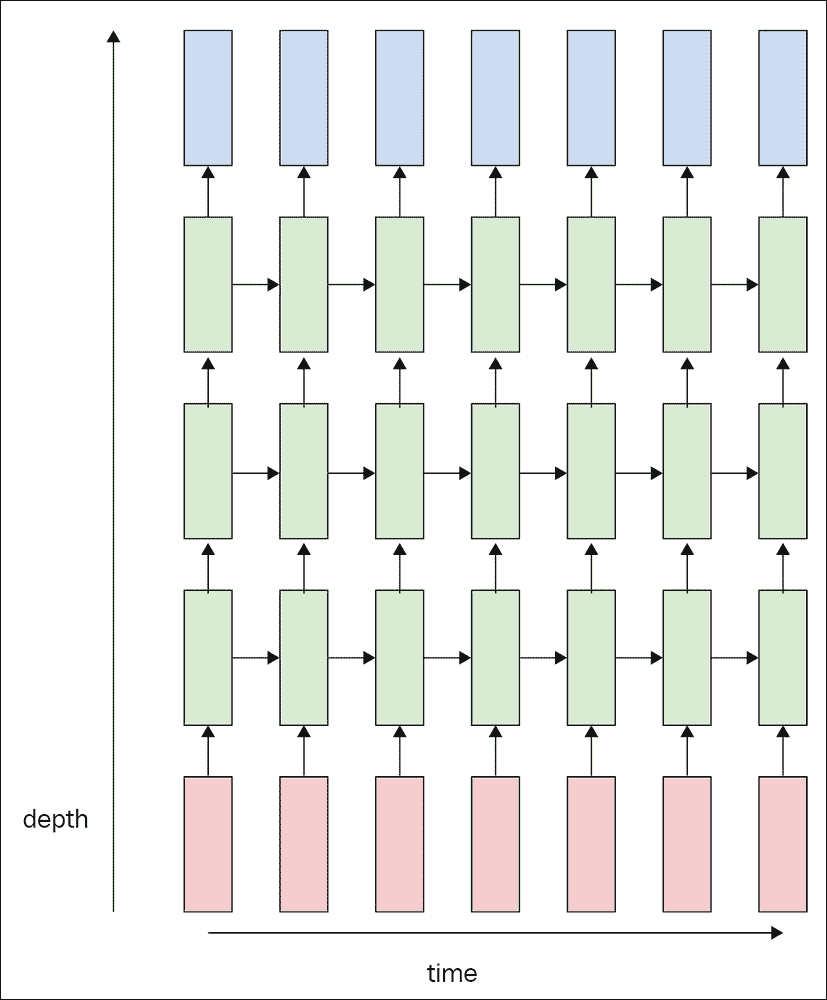
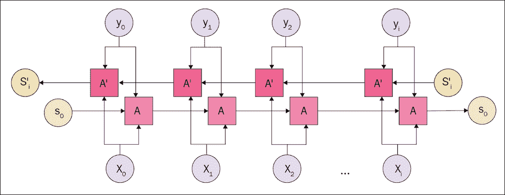

# 五、序列数据处理

神经网络今天试图解决的主要挑战是处理，理解，压缩和生成序列数据。 序列数据可以被模糊地描述为任何依赖于上一个数据点和下一个数据点的东西。 尽管可以概括基本方法，但是处理不同类型的序列数据需要不同的技术。 我们将探讨序列数据处理单元的基本构建模块，以及常见问题及其广泛接受的解决方案。

在本章中，我们将研究序列数据。 人们用于序列数据处理的规范数据是自然语言，尽管时间序列数据，音乐，声音和其他数据也被视为序列数据。 **自然语言处理**（**NLP**）和理解已被广泛探索，并且它是当前活跃的研究领域。 人类的语言异常复杂，我们整个词汇的可能组合超过了宇宙中原子的数量。 但是，深层网络通过使用诸如嵌入和注意之类的某些技术可以很好地处理此问题。

## 循环神经网络简介

**循环神经网络**（**RNN**）是序列数据处理的实际实现。 顾名思义，RNN 重新遍历上一次运行中保存的信息的数据，并试图像人类一样找到序列的含义。

尽管原始 RNN（在输入中为每个单元展开一个简单的 RNN 单元）是一个革命性的想法，但未能提供可用于生产的结果。 主要障碍是长期依赖问题。 当输入序列的长度增加时，网络到达最后一个单元时将无法从初始单元（单词，如果是自然语言）中记住信息。 我们将在接下来的部分中看到 RNN 单元包含的内容以及如何将其展开。

几次迭代和多年的研究得出了 RNN 架构设计的几种不同方法。 最新的模型现在使用**长短期记忆**（**LSTM**）实现或**门控循环单元**（**GRU**）。 这两种实现都将 RNN 单元内的门用于不同目的，例如遗忘门，它使网络忘记不必要的信息。 这些架构具有原始 RNN 所存在的长期依赖性问题，因此使用门不仅要忘记不必要的信息，而且要记住在长距离移动到最后一个单元时所必需的信息。

注意是下一个重大发明，它可以帮助网络将注意力集中在输入的重要部分上，而不是搜索整个输入并试图找到答案。 实际上，来自 Google Brain 和多伦多大学的一个团队证明，注意力可以击败 LSTM 和 GRU 网络[1]。 但是，大多数实现都同时使用 LSTM/GRU 和注意力。

嵌入是通过比较单词在单词群集中的分布来找到单词的概念含义的另一种革命性思想。 嵌入保持单词之间的关系，并将这种关系（它从单词群集中的单词分布中找到）转换为一组浮点数。 嵌入大大减少了输入大小，并极大地提高了表现和准确率。 我们将使用 word2vec 进行实验。

数据处理是序列数据（尤其是自然语言）的主要挑战之一。 PyTorch 提供了一些工具包来处理该问题。 我们将使用预处理后的数据来简化实现，但是我们将遍历工具包以了解它们的工作原理。 与这些工具包一起，我们将使用`torchtext`，它消除了处理输入数据时将面临的许多困难。

尽管本章全都是关于序列数据的，但我们将专注于序列数据的一个子集，这是自然语言。 特定于自然语言的一些研究人员认为，我们使用 LSTM 或 GRU 处理输入的方式不是应该如何处理自然语言。 自然语言在单词之间保持树状的层次关系，我们应该加以利用。 **栈式增强型解析器-解释器神经网络**（**SPINN**）[2]是来自 Stanford NLP 组的一种此类实现。 这种处理树状结构序列数据的特殊类型的网络是*递归神经网络*（与循环神经网络不同）。 在本章的最后一部分中，我们将详细介绍 SPINN。

## 问题

在本章中，我将首先解决要解决的问题，然后说明概念，同时解决我们遇到的问题。 问题是用三种不同的方法来找到两个英语句子之间的相似性。 为了使比较公平，我们将在所有实现中使用单词嵌入。 不用担心，我们还将进行单词嵌入。 手头的问题通常称为**包含问题**，其中我们每次都有两个句子，我们的工作是预测这些句子之间的相似性。 我们可以将句子分为三类：

*   蕴含：这两个句子是同一意思：
    *   `A soccer game with multiple males playing.`
    *   `Some men are playing a sport.`
*   中性：两个句子有一个共同点：
    *   `An older and younger man smiling.`
    *   `Two men are smiling and laughing at the cats playing on the floor.`
*   矛盾：两个句子都传达两种不同的含义：
    *   `A black race car starts up in front of a crowd of people.`
    *   `A man is driving down a lonely road.`



图 5.1：问题的图示

## 方法

在遍历 SNLI 数据集之前，我们将实现所有这三种方法：基本 RNN，高级 LNN（如 LSTM 或 GRU）和递归网络（如 SPINN）。 每个数据实例给我们一对句子，一个前提和一个假设句子。 句子首先转换为嵌入，然后传递到每个实现中。 虽然简单 RNN 和高级 RNN 的过程相同，但 SPINN 引入了完全不同的训练和推理流程。 让我们从一个简单的 RNN 开始。

### 简单 RNN

RNN 已被用作理解数据含义的 NLP 技术，并且我们可以根据从中发现的顺序关系来完成许多任务。 我们将使用这个简单的 RNN 来展示循环如何有效地积累单词的含义并根据单词所处的上下文来理解单词的含义。

在开始构建网络的任何核心模块之前，我们必须处理数据集并对其进行修改以供使用。 我们将使用来自 Stanford 的 SNLI 数据集（包含标记为包含，矛盾和中立的句子对的数据集），该数据集已经过预处理并保存在`torchtext`中。

加载的数据集包含数据实例，这些实例是标记为蕴含，矛盾和中立的句子对。 每个句子与一组将与循环网络一起使用的转换相关联。 在以下代码块中显示了从`BucketIterator`加载的数据集。 我们可以通过调用`batch.premise`和`.hypothesis`访问一对句子（`get_data()`函数是伪代码，以避免显示长行；获取数据的实际代码可在 GitHub 存储库中找到）：

```py
>>> train_iter, dev_iter, test_iter = get_data()
>>> batch = next(iter(train_iter))
>>> batch
[torchtext.data.batch.Batch of size 64 from SNLI]
 [.premise]:[torch.LongTensor of size 32x64]
 [.hypothesis]:[torch.LongTensor of size 22x64]
 [.label]:[torch.LongTensor of size 64]

```

现在我们有了所需的一切（每个数据实例两个句子和一个相应的标签），我们可以开始对网络进行编码。 但是我们如何使我们的神经网络处理英语呢？ 普通的神经网络对数值执行运算，但是现在我们有了字符。 旧的方法是将输入转换为单编码序列。 这是一个很好的旧 NumPy 的简单示例：

```py
>>> vocab = {
 'am': 0,
 'are': 1,
 'fine': 2,
 'hai': 3,
 'how': 4,
 'i': 5,
 'thanks': 6,
 'you': 7,
 ',': 8,
 '.': 9
 }
>>> # input = hai, how are you -> 3, 8, 4, 1, 7
 seq = [3, 8, 4, 1, 7]
>>> a = np.array(seq)
>>> b = np.zeros((len(seq), len(vocab)))
>>> b[np.arange(len(seq)), seq] = 1
>>> b
array([[O., 0., 0., 1., 0., 0., 0., 0., 0., 0.],
 [0., 0., 0., 0., 0., 0., 0., 0., 1., 0.],
 [0., 0., 0., 0., 1., 0., 0., 0., 0., 0.],
 [0., 1., 0., 0., 0., 0., 0., 0., 0., 0.],
 [0., 0., 0., 0., 0., 0., 0., 1., 0., 0.]])

```

该示例中的`b`变量是我们传递给神经网络的变量。 因此，我们的神经网络将具有与词汇量相等的许多输入神经元。 对于每个实例，我们传递一个只有一个元素的稀疏数组作为`1`。 您看到单热编码会出现什么问题吗？ 随着词汇量的增加，您最终将拥有巨大的输入层。 就是说嵌入可以为您提供帮助。

#### 词嵌入

使用自然语言（或由离散的单个单元组成的任何序列）的标准方法是将每个单词转换为单热编码向量，并将其用于网络的后期。 这种方法的明显缺点是，随着词汇量的增加，输入层的大小也会增加。

词嵌入是减少数组或张量维数的数十年历史的想法。 **潜在迪利克雷分配**（**LDA**）和**潜在语义分析**（**LSA**）是我们用来进行嵌入的两个此类示例。 但是，在 Facebook 研究科学家 Tomas Mikolov 和他的团队于 2013 年实现 word2vec 之后，就开始将嵌入视为前提。

Word2vec 是一种无监督的学习算法，在这种算法中，网络未经训练就进行嵌入。 这意味着您可以在一个英语数据集上训练 word2vec 模型，并使用它为另一模型生成嵌入。

另一种流行的单词嵌入算法叫做 GloVe（我们将在本章中使用它），它来​​自斯坦福大学 NLP 小组。 尽管两种实现都试图解决相同的问题，但是它们都使用了截然不同的方法。 Word2vec 正在使用嵌入来提高预测能力； 也就是说，算法尝试通过使用上下文词来预测目标词。 随着预测精度的提高，嵌入变得更强。 GloVe 是一个基于计数的模型，其中我们制作了一个庞大的表，该表显示每个单词与其他单词对应的频率。 显然，如果词汇量很高，并且使用的是诸如维基百科之类的大型文本集，那么这将构成一个巨大的表格。 因此，我们对该表进行降维，以获得大小合理的嵌入矩阵。

像其他 PyTorch 层一样，PyTorch 在`torch.nn`中创建了一个嵌入层。 尽管我们可以使用预训练的模型，但它对于我们的自定义数据集是可训练的。 嵌入层需要词汇量和我们要保留的嵌入尺寸的大小。 通常，我们使用`300`作为嵌入维度：

```py
>>> vocab_size = 100
>>> embedding_dim = 300
>>> embed = nn.Embedding(vocab_size, embedding_dim)
>>> input_tensor = torch.LongTensor([5])
>>> embed(input_tensor).size()
torch.Size([1, 300])

```

如今，嵌入层还用于所有类型的分类输入，而不仅仅是嵌入自然语言。 例如，如果您要为英超联赛预测获胜者，则最好嵌入球队名称或地名，而不是将它们作为一站式编码向量传递给您的网络。

但是对于我们的用例，`torchtext`将前面的方法包装为一种将输入转换为嵌入的简单方法。 下面是一个示例，其中我们转移了从 GloVe 向量获得的学习信息，以从 Google 新闻中获得对 60 亿个标记进行训练的预训练嵌入：

```py
inputs = data.Field(lower=True)
answers = data.Field(sequential=False)
train, dev, test = datasets.SNLI.splits(inputs, answers)
inputs.build_vocab(train, dev, test)
inputs.vocab.load_vectors('glove.6B.300d')
```

我们将 SNLI 数据集分为`training`，`dev`和`test`集，并将它们作为参数传递给`build_vocab`函数。 `build_vocab`函数遍历给定的数据集，并找到单词，频率和其他属性的数字，并创建`vocab`对象。 该`vocab`对象公开了`load_vectors` API，以接受预先训练的模型来进行迁移学习。

#### `RNNCell`

接下来，我们将开始构建网络的最小基础构建块，即 RNN 单元。 它的工作方式是一个 RNN 单元能够一一处理句子中的所有单词。 最初，我们将句子中的第一个单词传递到单元格，该单元格生成输出和中间状态。 此状态是序列的运行含义，由于在完成对整个序列的处理之前不会输出此状态，因此将其称为隐藏状态。

在第一个单词之后，我们具有从 RNN 单元生成的输出和隐藏状态。 输出状态和隐藏状态都有自己的目的。 可以训练输出以预测句子中的下一个字符或单词。 这就是大多数语言建模任务的工作方式。

如果您试图创建一个顺序网络来预测诸如股票价格之类的时间序列数据，那么很可能这就是您构建网络的方式。 但是在我们的例子中，我们只担心句子的整体含义，因此我们将忽略每个单元格生成的输出。 除了输出，我们将重点放在隐藏状态。 如前所述，隐藏状态的目的是保持句子的连续含义。 听起来像我们要找的东西，对吗？ 每个 RNN 单元都将一个隐藏状态作为输入之一，并吐出另一个隐藏状态，如“图 5.2”中所给。

我们将为每个单词使用相同的 RNN 单元，并将从上一次单词处理生成的隐藏状态作为当前单词执行的输入传递。 因此，RNN 单元在每个字处理阶段具有两个输入：字本身和上一次执行时的隐藏状态。

开始执行时会发生什么？ 我们手中没有隐藏状态，但是我们设计了单元以期望隐藏状态。 我们几乎总是创建一个零值的隐藏状态，只是为了模拟第一个单词的过程，尽管已经进行了研究以尝试使用不同的值而不是零。



图 5.2：具有输入，隐藏状态和输出展开序列的通用 RNN 单元流程图

“图 5.2”显示了展开的同一 RNN 单元，以可视化如何处理句子中的每个单词。 由于我们为每个单词使用相同的 RNN 单元，因此大大减少了神经网络所需的参数数量，这使我们能够处理大型小批量。 网络参数学习的方式是处理序列的顺序。 这是 RNN 的核心原则。



图 5.3：RNN 单元流程图

已经尝试了不同的布线机制来设计 RNN 单元以获得最有效的输出。 在本节中，我们将使用最基本的一层，它由两个全连接层和一个 softmax 层组成。 但是在现实世界中，人们将 LSTM 或 GRU 用作 RNN 单元，事实证明，这在许多用例中都可以提供最新的结果。 我们将在下一部分中看到它们。 实际上，已经进行了大量比较以找到所有顺序任务的最佳架构，例如《LSTM：搜索空间漫游》[3]。

我们开发了一个简单的 RNN，如以下代码所示。 没有复杂的门控机制，也没有架构模式。 这是理所当然的。

```py
class RNNCell(nn.Module):
    def __init__(self, embed_dim, hidden_size, vocab_dim):
        super().__init__()

        self.hidden_size = hidden_size
        self.input2hidden = nn.Linear(embed_dim + hidden_size,hidden_size)
        # Since it's encoder
		# We are not concerned about output
		# self.input2output = nn.Linear(embed_dim + hidden_size, vocab_dim)
		# self.softmax = nn.LogSoftmax(dim=1)

    def forward(self, inputs, hidden):
        combined = torch.cat((inputs, hidden), 1)
        hidden = torch.relu(self.input2hidden(combined))
        output = self.input2output(combined)
        output = self.softmax(output)
        return output, hidden

    def init_hidden(self):
        return torch.zeros(1, self.hidden_size)
```

如图“图 5.3”所示，我们有两个全连接层，每个层负责创建输出和输入的隐藏状态。 `RNNCell`的`forward`函数接受先前状态的当前输入和隐藏状态，然后我们将它们连接在一起。

一个`Linear`层采用级联张量并为下一个单元生成隐藏状态，而另一`Linear`层为当前单元生成输出。 然后，输出返回`softmax`，然后返回训练循环。 `RNNCell`拥有一个称为`init_hidden`的类方法，可以方便地保留该类方法，以便在初始化`RNNCell`中的对象时使用我们通过的隐藏状态大小生成第一个隐藏状态。 在开始遍历序列以获取第一个隐藏状态之前，我们将调用`init_hidden`，该状态将被初始化为零。

现在，我们已准备好网络中最小的组件。 下一个任务是创建循环遍历序列的更高级别的组件，并使用`RNNCell`处理序列中的每个单词以生成隐藏状态。 我们称这个`Encoder`节点，它用词汇量大小和隐藏大小初始化`RNNCell`。 请记住，`RNNCell`需要用于嵌入层的词汇量和用于生成隐藏状态的隐藏大小。 在`forward`函数中，我们获得输入作为自变量，这将是一个小批量的序列。 在这种特殊情况下，我们遍历`torchtext`的`BucketIterator`，它识别相同长度的序列并将它们分组在一起。

#### 工具

如果我们不使用`BucketIterator`怎么办，或者如果我们根本没有相同长度的序列怎么办？ 我们有两种选择：要么逐个执行序列，要么将除最长句子之外的所有句子填充为零，以使所有句子的长度与最长序列相同。

##### 注意

尽管如果在 PyTorch 中一个接一个地传递序列长度，我们不会遇到不同序列长度的问题，但是如果我们的框架是基于静态计算图的框架，则会遇到麻烦。 在静态计算图中，甚至序列长度也必须是静态的，这就是基于静态图的框架与基于 NLP 的任务极不兼容的原因。 但是，像 TensorFlow 这样的高度复杂的框架通过为用户提供另一个名为`dynamic_rnn`的 API 来处理此问题。

第一种方法似乎很好用，因为我们每次分别为每个句子处理一个单词。 但是，小批量的输入要比一次处理一个数据输入更有效，以使我们的损失函数收敛到全局最小值。 做到这一点的明显有效的方法是填充。 用零填充输入（或输入数据集中不存在的任何预定义值）有助于我们解决此特定问题。 但是，当我们尝试手动执行操作时，它变得很繁琐，并且变得多余，因为每次处理序列数据时都必须这样做。 PyTorch 在`torch.nn`下有一个单独的工具包，其中包含我们 RNN 所需的工具。

##### 填充序列

函数`pad_sequence`听起来很像：在标识批量中最长的序列后，将序列用零填充，然后将其他所有句子填充到该长度：

```py
>>> import torch.nn.utils.rnn as rnn_utils
>>> a = torch.Tensor([1, 2, 3])
>>> b = torch.Tensor([4, 5])
>>> c = torch.Tensor([6])
>>> rnn_utils.pad_sequence([a, b, c], True)

1 2 3
4 5 0
6 0 0

[torch.FloatTensor of size (3,3)]

```

在给定的示例中，我们具有三个具有三个不同长度的序列，其中最长的序列的长度为三个。 PyTorch 填充其他两个序列，以使它们现在的长度均为三。 `pad_sequence`函数接受一个位置参数，该位置参数是序列的排序序列（即最长序列（`a`）在前和最短序列（`c`）在后）和一个关键字参数，该参数决定用户是否希望它是否为`batch_first`。

##### 打包序列

您是否看到用零填充输入并使用 RNN 处理输入的问题，特别是在我们如此关心最后一个隐藏状态的情况下？ 批量中包含一个非常大的句子的简短句子最终将填充很多零，并且在生成隐藏状态时，我们也必须遍历这些零。

下图显示了一个包含三个句子的批量输入示例。 短句子用零填充，以使长度等于最长句子。 但是在处理它们时，我们最终也会处理零。 对于双向 RNN，问题更加复杂，因为我们必须从两端进行处理。



图 5.4：具有零的句子也具有针对零计算的隐藏状态

将零添加到输入将污染结果，这是非常不希望的。 打包序列是为了避免这种影响。 PyTorch 完全具有工具函数`pack_sequence`：

```py
>>> import torch.nn.utils.rnn as rnn_utils
>>> import torch
>>> a = torch.Tensor([1, 2, 3])
>>> b = torch.Tensor([1, 2])
>>> c = torch.Tensor([1])
>>> packed = rnn_utils.pack_sequence([a, b, c])
>>> packed
PackedSequence(data=tensor([1., 1., 1., 2., 2., 3.]), batch_sizes=tensor([3, 2, 1]))

```

`pack_sequence`函数返回`PackedSequence`类的实例，所有用 PyTorch 编写的 RNN 模块都可以接受。 由于`PackedSequence`掩盖了输入中不需要的部分，因此提高了模型的效率和准确率。 前面的示例显示了`PackedSequence`的内容。 但是，为简单起见，我们将避免在模型中使用打包序列，而将始终使用填充序列或`BucketIterator`的输出。

#### 编码器

```py
class Encoder(nn.Module):

    def __init__(self, embed_dim, vocab_dim, hidden_size):
        super(Encoder, self).__init__()
        self.rnn = RNNCell(embed_dim, hidden_size, vocab_dim)

    def forward(self, inputs):
        ht = self.rnn.init_hidden()
        for word in inputs.split(1, dim=1):
            outputs, ht = self.rnn(word, ht)
        return ht
```

在`forward`函数中，我们首先将`RNNCell`的隐藏状态初始化为零； 这是通过调用我们先前创建的`init_hidden`完成的。 然后，我们通过将输入的序列以大小 1 拆分为维度 1 来遍历该序列。 这是在假设输入为`batch_first`，因此是之后，第一维将是序列长度。 为了遍历每个单词，我们必须遍历第一维。

对于每个单词，我们用当前单词（输入）和先前状态的隐藏状态调用`self.rnn`的`forward`。 `self.rnn`返回下一个单元的输出和隐藏状态，我们继续循环直到序列结束。 对于我们的问题案例，我们不担心输出，也不对可能从输出中获得的损失进行反向传播。 相反，我们假设最后一个隐藏状态具有句子的含义。

如果我们也能获得该对中另一个句子的含义，则可以比较这些含义以预测该类是矛盾的，必然的或中立的，并反向传播损失。 这听起来像个主意。 但是，我们将如何比较这两种含义？ 接下来。

#### 分类器

我们网络的最后一个组成部分是分类器。 因此，我们手头有两个句子，经过编码器，我们得到了两个句子的最终隐藏状态。 现在是时候定义损失函数了。 一种方法是从两个句子中找出高维隐藏状态之间的距离。 可以按以下方式处理损失：

1.  如果需要的话，将损失最大化到一个很大的正值。
2.  如果存在矛盾，请将损失最小化为较大的负值。
3.  如果它是中性的，则将损失保持在零附近（在两到三倍的范围内可行）。

另一种方法可能是连接两个句子的隐藏状态并将它们传递到另一组层，并定义最终的分类器层，该层可以将连接的值分类为我们想要的三个类。 实际的 SPINN 实现使用后一种方法，但是合并机制比简单的连接更为复杂。

```py
class Merger(nn.Module):

    def __init__(self, size, dropout=0.5):
        super().__init__()
        self.bn = nn.BatchNorm1d(size * 4)
        self.dropout = nn.Dropout(p=dropout)

    def forward(self, data):
		prem = data[0]
		hypo = data[1]
		diff = prem - hypo
		prod = prem * hypo
		cated_data = torch.cat([prem, hypo, diff, prod], 2)
		cated_data = cated_data.squeeze()
		return self.dropout(self.bn(cated_data))

```

在这里，`Merger`节点被构建为模拟 SPINN 的实际实现。 `Merger`的`forward`函数获得两个序列：`prem`和`hypo`。 我们首先通过正常减法确定两个句子之间的差异，然后通过逐元素相乘找到它们之间的乘积。 然后，我们将实际句子与差异和刚刚找到的乘积连接起来，然后将它们传递给批量规范化层和丢弃层。

`Merger`节点也是我们的简单 RNN 的最终分类器层的一部分，该分类器由其他几个节点组成。

包装类`RNNClassifier`包装到目前为止我们定义的所有组件，并创建最终的分类器层作为`torch.nn.Sequential`的实例。 整个网络的流程显示在“图 5.3”中，并在以下块中以代码形式表示：

```py
class RNNClassifier(nn.Module):

    def __init__(self, config):
        super().__init__()
        self.config = config
        self.embed = nn.Embedding(config.vocab_dim,config.embed_dim)
        self.encoder = Encoder(config)
        self.classifier = nn.Sequential(
            Merger(config.embed_dim, config.dropout),
            nn.Linear(4 * config.embed_dim, config.fc1_dim),
            nn.ReLU(),
            nn.BatchNorm1d(config.fc1_dim),
            nn.Dropout(p=config.dropout),
            nn.Linear(config.fci_dim, config.fc2_dim)
        )

    def forward(self, batch):
        prem_embed = self.embed(batch.premise)
        hypo_embed = self.embed(batch.hypothesis)
        premise = self.encoder(prem_embed)
        hypothesis = self.encoder(hypo_embed)
        scores = self.classifier(premise, hypothesis)
        return scores
```

`RNNClassifier`模块具有三个主要层，我们在前面进行了讨论：

*   嵌入层已保存到`self.embed`
*   使用`RNNCell`的编码器层，该层存储在`self.encoder`中
*   `self.classifier`中存储的`nn.Sequential`层的实例

最后的顺序层从`Merger`节点开始。 合并后的输出的序列长度维度将增大四倍，因为我们将两个句子，它们的差和它们的乘积都附加到`Merger`的输出中。 然后将其穿过一个全连接层，然后在`ReLU`非线性之后使用`batchnorm1d`将其标准化。 之后的丢弃减少了过拟合的机会，过拟合的机会随后传递到另一个全连接层，该层为我们的输入数据创建了得分。 输入数据决定数据点所属的包围，矛盾或中性类​​别。

##### 丢弃

丢弃是 Apple 的机器学习工程师 Nitish Srivastava 提出的革命性想法。 它消除了对通常的正则化技术的需要，该技术在引入丢弃之前一直很普遍。 借助丢弃，我们丢弃了网络中神经元之间的随机连接，因此网络必须泛化并且不能偏向任何类型的外部因素。 要删除神经元，只需将​​其输出设置为零即可。 丢弃随机神经元可防止网络共同适应，因此在很大程度上减少了过拟合。


图 5.5：丢弃

PyTorch 作为`torch.nn`包的一部分提供了更高级别的丢弃层，该层在初始化时接受退出因子。 它的`forward`函数只是关闭一些输入。

#### 训练

我们为制作的所有小组件提供了一个包装模块，称为`RNNClassifier`。 训练过程与我们整本书所遵循的过程相似。 我们初始化`model`类，定义损失函数，然后定义优化器。 一旦完成所有这些设置并初始化了超参数，就将整个控件交给`ignite`。 但是在简单的 RNN 中，由于我们正在从 GloVe 向量的学习的嵌入中进行迁移学习，因此我们必须将这些学习的权重转移到嵌入层的权重矩阵中。 这是通过以下代码段的第二行完成的。

```py
model = RNNClassifier(config)
model.embed.weight.data = inputs.vocab.vectors
criterion = nn.CrossEntropyLoss()
opt = optim.Adam(model.parameters(), lr=lr)
```

尽管 PyTorch 会为用户进行反向传播，并且反向传播在概念上始终是相同的，但顺序网络的反向传播与我们在普通网络中看到的反向传播并不完全相似。 在这里，我们进行**时间上的反向传播**（**BPTT**）。 为了了解 BPTT 的工作原理，我们必须假设 RNN 是相似 RNN 单元的长重复单元，而不是将相同的输入视为通过同一 RNN 单元传递。

如果我们在句子中有五个单词，则我们有五个 RNN 单元，但是所有单元的权重都相同，并且当我们更新一个 RNN 单元的权重时，我们将更新所有 RNN 单元的权重。 现在，如果将输入分为五个时间步，每个单词位于每个时间步，则我们应该能够轻松描绘每个单词如何通过每个 RNN 单元。 在进行反向传播时，我们将遍历每个 RNN 单元，并在每个时间步长累积梯度。 更新一个 RNN 单元的权重也会更新其他 RNN 单元的权重。 由于所有五个单元都具有梯度，并且每次更新都会更新所有五个单元的权重，因此我们最终将每个单元的权重更新了五次。 无需进行五次更新，而是将梯度累加在一起并更新一次。 这是 BPTT。

### 高级 RNN

对于基于 LSTM 和 GRU 的网络，高级可能是一个模糊的术语，因为默认情况下，这些是在所有序列数据处理网络中使用的网络架构。 与 1990 年代提出的 LSTM 网络相比，GRU 网络是一个相对较新的设计。 两种网络都是门控循环网络的不同形式，其中 LSTM 网络建立的架构比 GRU 网络复杂。 这些架构被概括为门控循环网络，因为它们具有用于处理通过网络的输入/梯度流的门。 门从根本上是激活，例如 Sigmoid，以决定要流经的数据量。 在这里，我们将详细研究 LSTM 和 GRU 的架构，并了解 PyTorch 如何提供对 LSTM 和 GRU 的 API 的访问。

##### LSTM



图 5.6：LSTM 单元

LSTM 网络由 Sepp Hochreiter 于 1991 年引入，并于 1997 年发布。LSTM 网络在循环单元中建立了多个门，其中正常的`RNNCell`具有`Linear`层，该层通过`softmax`层相互作用以生成输出，另一个`Linear`层会生成隐藏状态。 有关 LSTM 的详细说明，请参见原始论文或克里斯托弗·奥拉（Christopher Olah）的博客，标题为《了解 LSTM 网络》[4]。

LSTM 主要由遗忘门，更新门和单元状态组成，这使得 LSTM 与常规 RNN 单元不同。 该架构经过精心设计，可以执行特定任务。 遗忘门使用输入向量和先前状态的隐藏状态来确定例如应忘记的内容，更新门使用当前输入和先前的隐藏状态来确定应添加到信息存储库中的内容。

这些决定基于 Sigmoid 层的输出，该层始终输出一个介于 0 到 1 范围内的值。 因此，“遗忘门”中的值 1 表示记住所有内容，而值 0 则表示忘记所有内容。 更新门同样适用。

所有操作都将在并行流经网络的单元状态上执行，这与网络中的信息仅具有线性交互作用，因此允许数据无缝地向前和向后流动。

#### GRU

GRU 是一个相对较新的设计，与 LSTM 相比，它效率高且复杂度低。 简而言之，GRU 将遗忘门和更新门合并在一起，并且只对单元状态进行一次一次性更新。 实际上，GRU 没有单独的单元状态和隐藏状态，两者都合并在一起以创建一个状态。 这些简化在不影响网络准确率的前提下，极大地降低了 GRU 的复杂性。 由于 GRU 比 LSTM 具有更高的表现，因此 GRU 如今已被广泛使用。



图 5.7：一个 GRU 单元

#### 架构

我们的模型架构与`RNNClassifier`相似，但是`RNNCell`被 LSTM 或 GRU 单元所替代。 PyTorch 具有函数式 API，可用于将 LSTM 单元或 GRU 单元用作循环网络的最小单元。 借助动态图功能，使用 PyTorch 完全可以遍历序列并调用单元。

高级 RNN 和简单 RNN 之间的唯一区别在于编码器网络。 `RNNCell`类已替换为`torch.nn.LSTMCell`或`torch.nn.GRUCell`，并且`Encoder`类使用了这些预建单元，而不是我们上次创建的自定义`RNNCell`：

```py
class Encoder(nn.Module):

    def __init__(self, config):
        super(Encoder, self).__init__()
        self.config = config
        if config.type == 'LSTM':
            self.rnn = nn.LSTMCell(config.embed_dim,config.hidden_size)
        elif config.type == 'GRU':
            self.rnn = nn.GRUCell(config.embed_dim,config.hidden_size)

    def forward(self, inputs):
        ht = self.rnn.init_hidden()
        for word in inputs.split(1, dim=1):
            ht, ct = self.rnn(word, (ht, ct))
```

##### `LSTMCell`和`GRUCell`

`LSTMCell`和`GRUCell`的函数式 API 绝对相似，这也正是定制`RNNCell`的方式。 它们接受输入大小和初始化器的隐藏大小。 `forward`调用接受具有输入大小的微型输入批量，并为该实例创建单元状态和隐藏状态，然后将其传递给下一个执行输入。 在静态图框架中实现这种的实现非常困难，因为该图在整个执行期间都是预先编译的并且是静态的。 循环语句也应作为图节点作为图的一部分。 这需要用户学习那些额外的操作节点或其他在内部处理循环的函数式 API。

#### LSTM 和 GRU

虽然 PyTorch 允许访问粒度`LSTMCell`和`GRUCell` API，但它也可以处理用户不需要粒度的情况。 这在用户不需要更改 LSTM 工作原理的内部但表现最为重要的情况下特别有用，因为 Python 循环的速度很慢。 `torch.nn`模块具有用于 LSTM 和 GRU 网络的高级 API，这些 API 封装了`LSTMCell`和`GRUCell`，并使用 **cuDNN**（**CUDA 深度神经网络**）实现了有效执行。 LSTM 和 cuDNN GRU。

```py
class Encoder(nn.Module):

    def __init__(self, config):
        super(Encoder, self).__init__()
        self.config = config
        if config.type == 'LSTM':
            self.rnn = nn.LSTM(input_size=config.out_dim,hidden_size=config.hidden_size,num_layers=config.n_layers,dropout=config.dropout,bidirectional=config.birnn)
        elif config.type == 'GRU':
            self.rnn = nn.GRU(input_size=config.out_dim,hidden_size=config.hidden_size,num_layers=config.n_layers,dropout=config.dropout,bidirectional=config.birnn)

    def forward(self, inputs):
        batch_size = inputs.size()[1]
        state_shape = self.config.n_cells, batch_size,self.config.hidden_size
        h0 = c0 = inputs.new(*state_shape).zero_()
        outputs, (ht, ct) = self.rnn(inputs, (h0, c0))
        if not self.config.birnn:
            return ht[-1]
        else:
            return ht[-2:].transpose(0, 1).contiguous().view(batch_size, -1)
```

与`LSTMCell`和`GRUCell`相似，LSTM 和 GRU 具有相似的函数式 API，以使它们彼此兼容。 此外，与单元对应物相比，LSTM 和 GRU 接受更多的参数，其中`num_layers`，`dropout`和`bidirectional`很重要。

如果将`True`作为参数，则`dropout`参数将为网络实现添加一个丢弃层，这有助于避免过拟合和规范化网络。 使用 LSTM 之类的高级 API 消除了对 Python 循环的需要，并一次接受了完整的序列作为输入。 尽管可以接受常规序列作为输入，但始终建议传递打包（掩码）输入，这样可以提高性能，因为 cuDNN 后端希望输入如此。

##### 增加层数



图 5.8：多层 RNN

RNN 中的层数在语义上类似于任何类型的神经网络中层数的增加。 由于它可以保存有关数据集的更多信息，因此增加了网络的学习能力。

在 PyTorch 中的 LSTM 中，添加多个层只是对象初始化的一个参数：`num_layers`。 但这要求单元状态和隐藏状态的形状为`[num_layers * num_directions, batch, hidden_size]`，其中`num_layers`是层数，`num_directions`对于单向是`1`，对于双向是`2`（尝试通过使用更多数量的层和双向 RNN 来保留示例的表现）。

##### 双向 RNN

RNN 实现通常是单向的，这就是到目前为止我们已经实现的。 单向和双向 RNN 之间的区别在于，在双向 RNN 中，后向通过等效于在相反方向上的正向传播。 因此，反向传递的输入是相同的序列，但是是反向的。

事实证明，双向 RNN 的表现要优于单方向的 RNN，并且很容易理解原因，尤其是对于 NLP。 但这不能一概而论，并非在所有情况下都是如此。 从理论上讲，如果手头的任务需要过去和将来的信息，则双向 RNN 往往会工作得更好。 例如，预测单词填补空白需要上一个序列和下一个序列。

在我们的分类任务中，双向 RNN 效果更好，因为当 RNN 使序列具有上下文的含义时，它会在两侧使用序列流。 PyTorch 的 LSTM 或 GRU 接受参数`bidirectional`的布尔值，该值确定网络是否应该是双向的。

如前一节所述，隐藏状态和单元状态必须与`bidirectional`标志一起保持形状`[num_layers * num_directions, batch, hidden_size]`，如果`num_directions`是双向的，则必须为`2`。 另外，我还警告您，双向 RNN 并非总是首选，尤其是对于那些我们手头没有未来信息（例如股价预测等）的数据集。



图 5.9：双向 RNN

#### 分类器

高级`RNNClassifier`与简单`RNNClassifier`完全相同，唯一的例外是 RNN 编码器已被 LSTM 或 GRU 编码器替代。 但是，高级分类器由于使用了高度优化的 cuDNN 后端，因此可以显着提高网络表现，尤其是在 GPU 上。

我们为高级 RNN 开发的模型是多层双向 LSTM/GRU 网络。 增加对秘籍的关注可大大提高性能。 但这不会改变分类器，因为所有这些组件都将使用`Encoder`方法包装，并且分类器仅担心`Encoder`的函数式 API 不会改变。

##### 注意

如前所述，注意力是与正常神经网络过程一起集中在重要区域上的过程。 注意不是我们现有实现的一部分； 而是充当另一个模块，该模块始终查看输入，并作为额外输入传递到当前网络。

注意背后的想法是，当我们阅读句子时，我们专注于句子的重要部分。 例如，将一个句子从一种语言翻译成另一种语言，我们将更专注于上下文信息，而不是构成句子的文章或其他单词。

一旦概念清晰，在 PyTorch 中获得关注就很简单。 注意可以有效地用于许多应用中，包括语音处理； 翻译，以前自编码器是首选实现； CNN 到 RNN，用于图像字幕； 和别的。

实际上，《注意力就是您所需要的全部》[5]是该论文的作者仅通过关注并删除所有其他复杂的网络架构（如 LSTM）就能够获得 SOTA 结果的方法。

### 循环神经网络

语言研究人员的一部分永远不会认可 RNN 的工作方式，即从左到右依次进行，尽管那是多少人阅读一个句子。 某些人坚信语言具有层次结构，利用这种结构有助于我们轻松解决 NLP 问题。 循环神经网络是使用该方法解决 NLP 的尝试，其中，基于要处理的语言的短语，将序列安排为树。 SNLI 是为此目的而创建的数据集，其中每个句子都排列成一棵树。

我们正在尝试构建的特定递归网络是 SPINN，它是通过充分考虑这两个方面的优点而制成的。 SPINN 从左到右处理数据，就像人类的阅读方式一样，但仍保持层次结构完整。 从左向右读取的方法相对于按层次进行解析还有另一个优势：网络从左向右读取时可以最终学习生成解析树。 这可以通过使用称为移位减少解析器的特殊实现以及栈和缓冲区数据结构的使用来实现。


图 5.10：Shift-Reduce 解析器

SPINN 将输入的句子编码为固定长度的向量，就像基于 RNN 的编码器如何从每个序列创建“含义”向量一样。 来自每个数据点的两个句子都将通过 SPINN 传递并为每个句子创建编码的向量，然后使用合并网络和分类器网络对其进行处理以获得这三个类别中每个类别的得分。

如果您想知道需要在不公开 PyTorch 的任何其他函数式 API 的情况下显示 SPINN 实现的方法，那么答案是 SPINN 是展示 PyTorch 如何适应任何类型的神经网络架构的最佳示例。 你发展。 无论您考虑的架构要求如何，PyTorch 都不会妨碍您。

静态计算图之上构建的框架不能实现 SPINN 这样的网络架构，而不会造成混乱。 这可能是所有流行框架围绕其核心实现构建动态计算图包装的原因，例如 TensorFlow 的热切需求，MXNet，CNTK 的 Gluon API 等。 我们将看到 PyTorch 的 API 对实现任何类型的条件或循环到计算图中的 API 有多么直观。 SPINN 是展示这些的完美示例。

#### 简化

简化网络将最左边的单词，最右边的单词和句子上下文作为输入，并在`forward`调用中生成单个归约的输出。 句子上下文由另一个称为`Tracker`的深度网络给出。 `Reduce`不在乎网络中正在发生的事情； 它总是接受三个输入，并由此减少输出。 树 LSTM 是标准 LSTM 的变体，用于与`bundle`和`unbundle`等其他辅助函数一起批量`Reduce`网络中发生的繁重操作。

```py
class Reduce(nn.Module):

    def __init__(self, size, tracker_size=None):
        super().__init__()
        self.left = nn.Linear(size, 5 * size)
        self.right = nn.Linear(size, 5 * size, bias=False)
        if tracker_size is not None:
            self.track = nn.Linear(tracker_size, 5 * size,bias=False)
    def forward(self, left_in, right_in, tracking=None):
        left, right = bundle(left_in), bundle(right_in)
        tracking = bundle(tracking)
        lstm_in = self.left(left[0])
        lstm_in += self.right(right[0])
        if hasattr(self, 'track'):
            lstm_in += self.track(tracking[0])
        out = unbundle(tree_lstm(left[1], right[1], lstm_in))
        return out
```

`Reduce`本质上是一个典型的神经网络模块，它对三参数输入执行 LSTM 操作。

#### 追踪器

在循环中每次 SPINN 的`forward`调用中都会调用`Tracker`的`forward`方法。 在归约运算开始之前，我们需要将上下文向量传递到`Reduce`网络，因此，我们需要遍历`transition`向量并创建缓冲区，栈和上下文向量，然后才能执行 SPINN 的`forward()`函数。 由于 PyTorch 变量会跟踪历史事件，因此将跟踪所有这些循环操作并可以反向传播：

```py
class Tracker(nn.Module):

    def __init__(self, size, tracker_size, predict):
        super().__init__()
        self.rnn = nn.LSTMCell(3 * size, tracker_size)
        if predict:
            self.transition = nn.Linear(tracker_size, 4)
        self.state_size = tracker_size

    def reset_state(self):
        self.state = None

    def forward(self, bufs, stacks):
        buf = bundle(buf[-1] for buf in bufs)[0]
        stack1 = bundle(stack[-1] for stack in stacks)[0]
        stack2 = bundle(stack[-2] for stack in stacks)[0]
        x = torch.cat((buf, stack1, stack2), 1)
        if self.state is None:
            self.state = 2 * [x.data.new(x.size(0),self.state_size).zero_()]
        self.state = self.rnn(x, self.state)
        if hasattr(self, 'transition'):
            return unbundle(self.state),self.transition(self.state[0])
        return unbundle(self.state), None
```

#### `SPINN`

`SPINN`模块是所有小型组件的包装器类。 `SPINN`的初始化器与一样简单，包括组件模块`Reduce`和`Tracker`的初始化。 内部节点之间的所有繁重工作和协调都通过 SPINN 的`forward`调用进行管理。

```py
class SPINN(nn.Module):

    def __init__(self, config):
        super().__init__()
        self.config = config
        assert config.d_hidden == config.d_proj / 2
        self.reduce = Reduce(config.d_hidden, config.d_tracker)
        self.tracker = Tracker(config.d_hidden, config.d_tracker,predict=config.predict)
```

`forward`调用的主要部分是对`Tracker`的`forward`方法的调用，该方法将处于循环中。 我们遍历输入序列，并为转换序列中的每个单词调用`Tracker`的`forward`方法，然后根据转换实例将输出保存到上下文向量列表中。 如果转换是`shift`，则栈将在后面附加当前单词；如果转换是`reduce`，则将调用`Reduce`并创建跟踪，并在最左边和最右边的单词， 这将从左侧和右侧列表中弹出。

```py
def forward(self, buffers, transitions):
    buffers = [list(torch.split(b.squeeze(1), 1, 0))
               for b in torch.split(buffers, 1, 1)]
    stacks = [[buf[0], buf[0]] for buf in buffers]
    if hasattr(self, 'tracker'):
        self.tracker.reset_state()
    else:
        assert transitions is not None
    if transitions is not None:
        num_transitions = transitions.size(0)
    else:
        num_transitions = len(buffers[0]) * 2 - 3
    for i in range(num_transitions):
        if transitions is not None:
            trans = transitions[i]
        if hasattr(self, 'tracker'):
            tracker_states, trans_hyp = self.tracker(buffers,stacks)
            if trans_hyp is not None:
                trans = trans_hyp.max(1)[1]
        else:
            tracker_states = itertools.repeat(None)
        lefts, rights, trackings = [], [], []
        batch = zip(trans.data, buffers, stacks, tracker_states)
        for transition, buf, stack, tracking in batch:
            if transition == 3: # shift
                stack.append(buf.pop())
            elif transition == 2: # reduce
                rights.append(stack.pop())
                lefts.append(stack.pop())
                trackings.append(tracking)
        if rights:
            reduced = iter(self.reduce(lefts, rights, trackings))
            for transition, stack in zip(trans.data, stacks):
                if transition == 2:
                    stack.append(next(reduced))
    return bundle([stack.pop() for stack in stacks])[0]
```

## 总结

序列数据是深度学习中最活跃的研究领域之一，尤其是因为自然语言数据是顺序的。 但是，序列数据处理不仅限于此。 时间序列数据本质上是我们周围发生的一切，包括声音，其他波形等等，实际上都是顺序的。

处理序列数据中最困难的问题是长期依赖性，但是序列数据要复杂得多。 RNN 是序列数据处理领域的突破。 研究人员已经探索了成千上万种不同的 RNN 变体，并且它仍然是一个活跃的领域。

在本章中，我们介绍了序列数据处理的基本构建块。 尽管我们只使用英语，但是我们在这里学到的技术通常适用于任何类型的数据。 对于初学者来说，了解这些构建模块至关重要，因为随后的所有操作都基于它们。

即使我没有详细解释高级主题，本章中给出的解释也应该足以进入更高级的解释和教程。 存在不同的 RNN 组合，甚至存在 RNN 与 CNN 的组合以用于序列数据处理。 了解本书给出的概念将使您开始探索人们尝试过的不同方法。

在下一章中，我们将探索生成对抗网络，这是深度学习的最新巨大发展。

## 参考

1.  <https://arxiv.org/pdf/1706.03762.pdf>
2.  <https://github.com/stanfordnlp/spinn>
3.  [《LSTM：搜索空间漫游》](https://arxiv.org/abs/1503.04069)，Greff，Klaus，Rupesh Kumar Srivastava，JanKoutník，Bas R.Steunebrink 和 JürgenSchmidhuber，IEEE Transactions on Neural Networks and Learning Systems，2017 年 12 月 28 日，第 2222-2232 页
4.  <http://colah.github.io/posts/2015-08-Understanding-LSTMs/>
5.  《您所需要的是注意力》，Vaswani，Ashish，Noam Shazeer，Niki Parmar，Jakob Uszkoreit，Llion Jones，Aidan N. Gomez，Lukasz Kaiser 和 Illia Polosukhin，NIPS，2017 年