# 七、强化学习

让我们谈谈学习的本质。 我们不是天生就知道这个世界。 通过与世界互动，我们了解了行动的效果。 一旦我们了解了世界的运转方式，我们就可以利用这些知识来做出可以将我们引向特定目标的决策。

在本章中，我们将使用一种称为强化学习的方法来制定这种计算学习方法。 它与本书中介绍的其他类型的深度学习算法非常不同，并且本身就是一个广阔的领域。

强化学习的应用范围从在数字环境中玩游戏到在现实环境中控制机器人的动作。 它也恰好是您用来训练狗和其他动物的技术。 如今，强化学习已被用于驾驶自动驾驶汽车，这是一个非常受欢迎的领域。

当计算机（AlphaGo）击败世界围棋冠军 Lee Sedol [1]时，发生了最近的重大突破之一。 这是一个突破，因为围棋一直以来被认为是让计算机掌握很长时间的游戏圣杯。 这是因为据说围棋游戏中的配置数量大于我们宇宙中的原子数量。

在世界冠军输给 AlphaGo 之后，甚至有人说他已经从计算机中学到了一些东西。 这听起来很疯狂，但这是事实。 听起来更疯狂的是，算法的输入只不过是棋盘游戏当前状态的图像，而 AlphaGo 则一遍又一遍地对自己进行训练。 但在此之前，它从观看世界冠军的视频中学习了数小时。

如今，强化学习已被用于使机器人学习如何走路。 在这种情况下，输入将是机器人可以施加到其关节的力以及机器人将要行走的地面状态。 强化学习也被用于预测股价，并且在该领域引起了很多关注。

这些现实问题似乎非常复杂。 我们将需要对所有这些事情进行数学公式化，以便计算机可以解决它们。 为此，我们需要简化环境和决策过程以实现特定目标。

在强化学习的整个范式中，我们仅关注从交互中学习，而学习器或决策者则被视为智能体。 在自动驾驶汽车中，智能体是汽车，而在乒乓球中，智能体是球拍。 当智能体最初进入世界时，它将对世界一无所知。 智能体将必须观察其环境并根据其做出决策或采取行动。 它从环境中返回的响应称为奖励，可以是肯定的也可以是否定的。 最初，智能体将随机采取行动，直到获得正面奖励为止，并告诉他们这些决定可能对其有利。

这似乎很简单，因为智能体程序要做的就是考虑环境的当前状态进行决策，但是我们还想要更多。 通常，座席的目标是在其一生中最大化其累积奖励，重点是“累积”一词。 智能体不仅关心在下一步中获得的报酬，而且还关心将来可能获得的报酬。 这需要有远见，并将使智能体学习得更好。

这个元素使问题变得更加复杂，因为我们必须权衡两个因素：探索与利用。 探索将意味着做出随机决策并对其进行测试，而利用则意味着做出智能体已经知道的决策将给其带来积极的结果，因此智能体现在需要找到一种方法来平衡这两个因素以获得最大的累积结果。 。 这是强化学习中非常重要的概念。 这个概念催生了各种算法来平衡这两个因素，并且是一个广泛的研究领域。

在本章中，我们将使用 OpenAI 名为 Gym 的库。 这是一个开放源代码库，为强化学习算法的训练和基准测试设定了标准。 体育馆提供了许多研究人员用来训练强化学习算法的环境。 它包括许多 Atari 游戏，用于拾取物品的机器人仿真，用于步行和跑步的各种机器人仿真以及驾驶仿真。 该库提供了智能体程序和环境之间相互交互所必需的参数。

## 问题

现在，我们已经准备好用数学公式来表达强化学习问题，因此让我们开始吧。

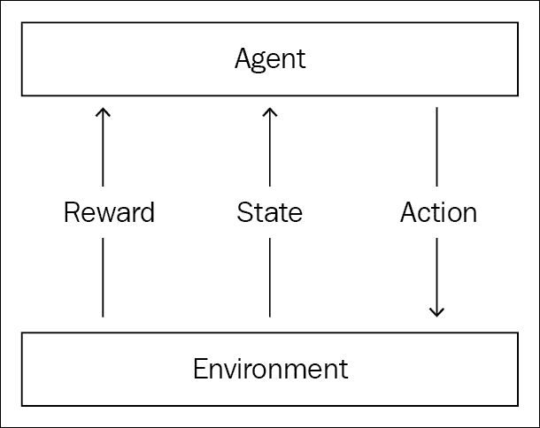

图 7.1：强化学习框架

在上图中，您可以看到任何强化学习问题的设置。 通常，强化学习问题的特征在于，智能体试图学习有关其环境的信息，如前所述。

假设时间以不连续的时间步长演化，则在时间步长 0 处，智能体查看环境。 您可以将这种观察视为环境呈现给智能体的情况。 这也称为观察环境状态。 然后，智能体必须为该特定状态选择适当的操作。 接下来，环境根据智能体采取的行动向智能体提出了新的情况。 在同一时间步长中，环境会给智能体提供奖励，从而可以指示智能体是否做出了适当的响应。 然后该过程继续。 环境为坐席提供状态和奖励，然后坐席采取行动。

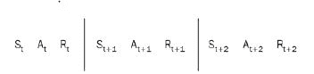

图 7.2：每个时间步骤都有一个状态，动作和奖励

因此，状态，动作和奖励的顺序现在随着时间而流动，在这个过程中，对智能体而言最重要的是其奖励。 话虽如此，智能体的目标是使累积奖励最大化。 换句话说，智能体需要制定一项策略，以帮助其采取使累积奖励最大化的行动。 这只能通过与环境交互来完成。

这是因为环境决定了对每个动作给予智能体多少奖励。 为了用数学公式表述，我们需要指定状态，动作和奖励，以及环境规则。

## 情景任务与连续任务

在现实世界中，我们指定的许多任务都有明确定义的终点。 例如，如果智能体正在玩游戏，则当智能体获胜或失败或死亡时，剧集或任务便会结束。

在无人驾驶汽车的情况下，任务在汽车到达目的地或撞车时结束。 这些具有明确终点的任务称为剧集任务。 智能体在每个剧集的结尾都会获得奖励，这是智能体决定自己在环境中做得如何的时候。 然后，智能体从头开始但继续拥有下一个剧集的先验信息，然后继续执行下一个剧集，因此效果更好。

随着时间的流逝，在一段剧集中，智能体将学会玩游戏或将汽车开到特定的目的地，因此将受到训练。 您会记得，智能体的目标是在剧集结束时最大限度地提高累积奖励。

但是，有些任务可能永远持续下去。 例如，在股票市场上交易股票的机器人没有明确的终点，必须在每个时间步骤中学习和提高自己。 这些任务称为连续任务。 因此，在那种情况下，奖励是在特定的时间间隔提供给业务代表的，但任务没有尽头，因此业务代表必须从环境中学习并同时进行预测。

在本章中，我们将只关注情景任务，但为连续任务制定问题陈述并不会有太大不同。

## 累积折扣奖励

为了使智能体最大化累积奖励，可以考虑的一种方法是在每个时间步长上最大化奖励。 这样做可能会产生负面影响，因为在初始时间步长中最大化回报可能会导致智能体在将来很快失败。 让我们以步行机器人为例。 假定机器人的速度是奖励的一个因素，如果机器人在每个时间步长上都最大化其速度，则可能会使其不稳定并使其更快落下。

我们正在训练机器人走路； 因此，我们可以得出结论，智能体不能仅仅专注于当前时间步长来最大化报酬。 它需要考虑所有时间步骤。 所有强化学习问题都会是这种情况。 动作可能具有短期或长期影响，智能体需要了解动作的复杂性以及环境带来的影响。

在前述情况下，如果智能体将了解到其移动速度不能超过某个可能会使它不稳定并对其产生长期影响的极限，则它将自行学习阈值速度。 因此，智能体将在每个时间步长处获得较低的报酬，但会避免将来跌倒，从而使累积报酬最大化。

假设在所有未来时间步长处的奖励都由`R[t]`，`R[t + 1]`，`R[t + 2]`表示，依此类推：

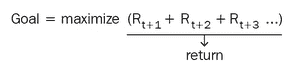

由于这些时间步伐是在将来，智能体无法确定地知道将来的回报是什么。 它只能估计或预测它们。 未来奖励的总和也称为回报。 我们可以更明确地指定智能体的目标是使期望收益最大化。

让我们还考虑一下，未来回报中的所有回报并不那么重要。 为了说明这一点，假设您想训练一只狗。 您给它命令，如果它正确地遵循了它们，则给它一种奖赏。 您能期望狗像称重从现在起数年可能获得的奖励一样，来权衡明天可能获得的奖励吗？ 这似乎不可行。

为了让狗决定现在需要采取什么行动，它需要更加重视可能早日获得的奖励，而不再重视可能会从现在开始获得的奖励。 这也被认为是合乎逻辑的，因为狗不确定未来的把握，特别是当狗仍在学习环境并改变其从环境中获得最大回报的策略时。 因为与未来成千上万步长的奖励相比，未来数个时间步长的奖励更可预测，所以折扣收益的概念应运而生。

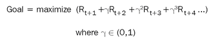

可以看到，我们在`Goal`方程中引入了可变伽玛。 接近 1 的`Gamma`表示您将来对每个奖励的重视程度相同。 接近 0 的`Gamma`表示只有最近的奖励才具有很高的权重。

一个良好的做法是将`Gamma = 0.9`，因为您希望智能体对未来有足够的关注，但又不是无限远。 您可以在训练时设置`Gamma`，并且`Gamma`会保持固定，直到实验结束。 重要的是要注意，折扣在连续任务中非常有用，因为它们没有尽头。 但是，继续执行的任务不在本章范围之内。

## 马尔可夫决策过程

让我们通过学习称为**马尔可夫决策过程**（**MDP**）的数学框架来完成对强化学习问题的定义。

MDP 定义有五件事：

*   有限状态集
*   有限动作集
*   有限奖励集
*   折扣率
*   环境的单步动态

我们已经了解了如何指定状态，操作，奖励和折扣率。 让我们找出如何指定环境的一步式动态。

下图描述了垃圾收集机器人的 MDP。 机器人的目标是收集垃圾桶。 机器人将继续寻找垃圾桶，并不断收集垃圾桶，直到电池用完，然后再回到扩展坞为电池充电。 可以将机器人的状态定义为高和低，以表示其电池电量。 机器人可以执行的一组操作是搜索垃圾桶，在自己的位置等待，然后返回对接站为电池充电。

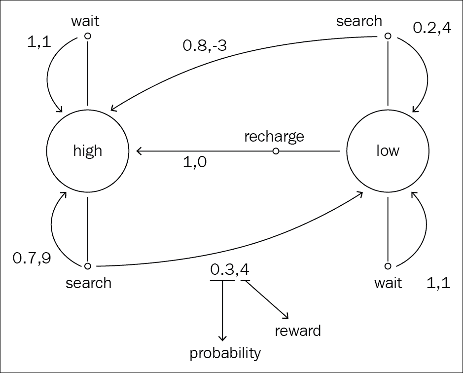

图 7.3：垃圾收集机器人的 MDP

例如，假设机器人处于高电量状态。 如果决定搜索垃圾桶，则状态保持高状态的概率为 70%，状态变为低状态的概率为 30%，每种状态获得的奖励为 4。

同样，如果电池处于高电量状态，则决定在其当前位置等待，电池处于高电量状态的可能性为 100%，但是获得的奖励也很低。

花一点时间浏览所有动作和状态，以更好地了解它们。 通过详细说明智能体可以处于的所有状态以及智能体在其所有状态下可以执行的所有操作，并确定每个操作的概率，可以指定环境。 一旦指定了所有这些，就可以指定环境的一站式动态。

在任何 MDP 中，智能体都会知道状态，操作和折扣率，而不会知道环境的回报和一步动态。

现在，您了解了制定任何实际问题（通过强化学习解决）的所有知识。

## 解决方案

既然我们已经学习了如何使用 MDP 来指定问题，那么智能体需要制定解决方案。 此策略也可以称为策略。

### 策略和值函数

策略定义学习智能体在给定时间的行为方式。 保单用希腊字母`Pi`表示。 该策略不能用公式定义； 它更多是基于直觉的概念。

让我们举个例子。 对于需要在房间外寻找出路的机器人，它可能具有以下策略：

*   随机走
*   沿着墙壁走
*   找到通往门的最短路径

为了使我们能够数学地预测在特定状态下要采取的行动，我们需要一个函数。 让我们定义一个函数，该函数将设为当前状态，并输出一个数字，该数字表示该状态的值。例如，如果您要越过河流，那么靠近桥梁的位置的值将比远离目标位置更大。 此函数称为值函数，也用`V`表示。

我们可以使用另一个函数来帮助我们度量事物：一个函数，该函数为我们提供由所有可以采取的行动所导致的所有未来状态的值。

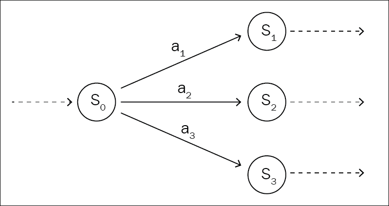

图 7.4：MDP 中的状态和动作

让我们举个例子。 让我们考虑通用状态`S0`。 现在我们需要预测在`a1`，`a2`和`a3`之间要采取什么行动才能获得最大的回报（累积折扣奖励）。 我们将此函数命名为`Q`。 我们的函数`Q`，将预测每个操作的预期收益（值（`V`））。 此`Q`函数也称为动作值函数，因为它考虑了状态和动作，并预测了它们各自的组合的预期收益。

我们通常会选择最大值。 因此，这些最高限额将指导智能体到最后，这将是我们的策略。 请注意，我大部分时间都在说。 通常，在选择非最大动作值对时，我们会保持很小的随机机会。 我们这样做是为了提高模型的可探索性。 该随机探索机会的百分比称为`ε`，该策略称为 ε 贪婪策略。 这是人们用来解决强化学习问题的最常见策略。 如果我们一直都只选择最大值，而不进行任何探索，则该策略简称为贪婪策略。 我们将在实现过程中同时使用这两种策略。

但是起初，我们可能不知道最佳作用值函数。 因此，由此产生的策略也将不是最佳策略。 我们将需要遍历动作值函数，并找到提供最佳回报的函数。 一旦找到它，我们将获得最优的`Q`。 最佳`Q`也称为`Q*`。 因此，我们将能够找到最优的`Pi`，也称为`Pi*`。

此`Q`函数是智能体必须学习的函数。 我们将使用神经网络来学习此函数，因为神经网络也是通用函数逼近器。 一旦有了行动值函数，座席就可以了解问题的最佳策略，我们就可以完成目标。

### 贝尔曼方程

如果我们使用最近定义的 Q 函数重新定义目标方程，则可以编写：

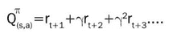

现在让我们递归定义相同的方程式。 我们将提出贝尔曼方程：

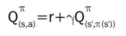

简而言之，Bellman 等式指出，每个点的收益等于下一时间步长的估计报酬加上随后状态的折扣报酬。 可以肯定地说，某些策略的任何值函数都遵循贝尔曼方程。

#### 寻找最佳 Q 函数

现在我们知道，如果我们具有最优 Q 函数，则可以通过选择收益最高的操作来找到最优策略。

### 深度 Q 学习

深度 Q 学习算法使用神经网络来解决 Q 学习问题。 它对于连续空间的强化学习问题非常有效。 也就是说，任务不会结束。

前面我们讨论了值函数（`V`）和操作值函数（`Q`）。 由于神经网络是通用函数逼近器，因此我们可以假设它们中的任何一个都是神经网络，具有可以训练的权重。

因此，值函数现在将接受网络的状态和权重，并输出当前状态的值。 我们将需要计算某种误差并将其反向传播到网络，然后使用梯度下降进行训练。 我们需要将网络的输出（值函数）与我们认为最佳的值进行比较。

根据贝尔曼方程：


我们可以通过考虑下一个状态的值来计算预期的`Q`。 我们可以通过考虑到目前为止的累积奖励来计算当前的`Q`。 在这些 Q 函数之间的差上使用**均方误差**（**MSE**）可能是我们的损失。 研究人员建议的一项改进是，当误差较大时，使用平均绝对误差代替 MSE。 当 Q 函数的估计值非常嘈杂时，这使它对异常值更加健壮。 这种损失称为胡贝尔损失。


我们的代码的训练循环如下所示：

*   随机初始化`w, π <- ε`
*   对于所有剧集：
    *   观察`S`
    *   虽然`S`并非在每个时间步都是终端：
    *   使用`π, Q`从`S`中选择`A`
    *   观察`R`和`S'`
    *   更新`Q`
    *   `S <- S'`

这里要注意的一件事是，我们将使用相同的 ε 贪婪策略在“步骤 6”中选择动作，并在“步骤 8”中更新相同的策略。 这种算法称为策略上算法。 从某种意义上讲，这是很好的，因为在我们观察和更新同一策略时，将更快地学习该策略。 它收敛非常快。 它也有一些缺点，即所学习的策略和用于决策的策略彼此紧密地联系在一起。 如果我们想要一个更具探索性的策略，以便在“步骤 6”中选择观察结果，并在“步骤 8”中更新更优化的策略，该怎么办？ 这样的算法被称为非策略算法。

Q 学习是一种非策略算法，因此，在 Q 学习中，我们将有两个策略。 我们用来推断动作的策略将是 ε 贪婪策略，并且我们将其称为策略网络。 我们将使用更新步骤更新的网络将是我们的目标网络。 那只能由一个贪婪的策略来控制，这意味着我们将始终选择`ε`等于零的最大值。 我们不会对此策略采取随机措施。 我们这样做是为了使我们更快地朝着更高的值前进。 我们将通过不时复制策略网的权重（例如每隔一集一次）来更新目标网的权重。

其背后的想法是不追逐一个移动的目标。 让我们举个例子：假设您想训练一头驴走路。 如果您坐在驴上并在其嘴前悬挂胡萝卜，驴可能会向前走，胡萝卜仍与驴保持相同的距离。 但是，与普遍的看法相反，这并不那么有效。 胡萝卜可能会随机反弹，并可能使驴远离其路径。 取而代之的是，通过从驴上下来并站在要驴来的地方使驴和胡萝卜脱钩，这似乎是一个更好的选择。 它提供了一个更稳定的学习环境。

### 经验回放

我们可以对算法进行的另一项改进是添加有限的经验和已保存交易记录。 每笔交易都包含学习某些东西所需的所有相关信息。 它是状态，执行的动作，随后的下一个状态以及对该动作给予的奖励的元组。

```py
Transition = namedtuple('Transition', ('state', 'action', 'next_state', 'reward'))
```

我们将随机采样一些经验或交易，并在优化模型时向他们学习。

```py
class ReplayMemory(object):
    def __init__(self, capacity):
        self.capacity = capacity
        self.memory = []
        self.position = 0

    def push(self, *args):
        if len(self.memory) < self.capacity:
            self.memory.append(None)
            self.memory[self.position] = Transition(*args)
            self.position = (self.position + 1) % self.capacity

    def sample(self, batch_size):
        return random.sample(self.memory, batch_size)

    def __len__(self):
        return len(self.memory)

memory = ReplayMemory(10000)
```

在这里，我们为交易定义了一个存储库。 有一个称为`push`的函数可将事务推送到内存中。 还有另一个函数可以从内存中随机采样。

### Gym

我们将使用 OpenAI 的 Gym 从环境`env`中获取参数。 环境变量很多，例如智能体的速度和位置。 我们将训练一个平衡点来平衡自己。


图 7.5：卡特彼勒平衡环境

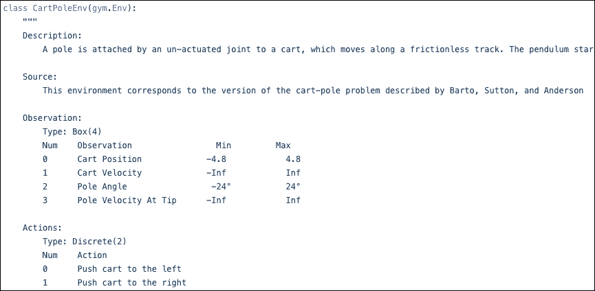

图 7.6：Gym 暴露的环境变量

在环境中的每个观察值或状态在 Cartpole 环境（`env`）中都有四个值。 上面的屏幕快照来自于 Cartpole 环境的 Gym 代码。 每个观测值在尖端都有位置，速度，极角和极速度。 您可以采取的行动是向左或向右移动。

```py
env = gym.make('CartPole-v0').unwrapped
device = torch.device("cuda" if torch.cuda.is_available() else "cpu")

screen_width = 600

def get_screen():
    screen = env.render(mode='rgb_array').transpose((2, 0, 1))  # transpose into torch order (CHW)
    screen = screen[:, 160:320]  # Strip off the top and bottom of the screen

    # Get cart location
    world_width = env.x_threshold * 2
    scale = screen_width / world_width
    cart_location = int(env.state[0] * scale + screen_width / 2.0)  # MIDDLE OF CART

    # Decide how much to strip
    view_width = 320
    if cart_location < view_width // 2:
        slice_range = slice(view_width)
    elif cart_location > (screen_width - view_width // 2):
        slice_range = slice(-view_width, None)
    else:
        slice_range = slice(cart_location - view_width // 2,
                            cart_location + view_width // 2)

    # Strip off the edges, so that we have a square image centered on a cart
    screen = screen[:, :, slice_range]

    screen = np.ascontiguousarray(screen, dtype=np.float32) / 255
    screen = torch.from_numpy(screen)
    resize = T.Compose([T.ToPILImage(),
                        T.Resize(40, interpolation=Image.CUBIC),
                        T.ToTensor()])

    return resize(screen).unsqueeze(0).to(device)  # Resize, and add a batch dimension (BCHW)
```

在这里，我们定义了`get_screen`函数。 柱状环境渲染并返回一个屏幕（3D 像素数组）。 我们将要剪裁一个正方形的图像，其中心是小刀。 我们从`env.state[0]`获得了位置。 根据文档，第一个参数是推车位置。 然后我们去掉顶部，底部，左侧和右侧，以使小柱位于中心。 接下来，我们将其转换为张量，进行一些转换，添加另一个尺寸，然后返回图像。

```py
class DQN(nn.Module):
    def __init__(self):
        super(DQN, self).__init__()
        self.conv1 = nn.Conv2d(3, 16, kernel_size=5, stride=2)
        self.bn1 = nn.BatchNorm2d(16)
        self.conv2 = nn.Conv2d(16, 32, kernel_size=5, stride=2)
        self.bn2 = nn.BatchNorm2d(32)
        self.conv3 = nn.Conv2d(32, 32, kernel_size=5, stride=2)
        self.bn3 = nn.BatchNorm2d(32)
        self.head = nn.Linear(448, 2)

    def forward(self, x):
        x = F.relu(self.bn1(self.conv1(x)))
        x = F.relu(self.bn2(self.conv2(x)))
        x = F.relu(self.bn3(self.conv3(x)))
        return self.head(x.view(x.size(0), -1))

policy_net = DQN().to(device)
target_net = DQN().to(device)
target_net.load_state_dict(policy_net.state_dict())
target_net.eval()
```

接下来，我们定义我们的网络。 网络采用当前状态，对其进行一些卷积运算，最后收敛到线性层，并给出当前状态值的输出，和表示在该状态下有多大好处的值。

我们定义了两个网络`policy_net`和`target_net`。 我们将`policy_net`的权重复制到`target_net`，以便它们代表相同的网络。 我们将`target_net`设为评估模式，以便在反向传播时不更新网络的权重。 我们将在每个步骤中推断`policy_net`，但会不时更新`target_net`。

```py
EPS_START = 0.9
EPS_END = 0.05
EPS_DECAY = 200
steps_done = 0

def select_action(state):
    global steps_done
    eps_threshold = EPS_END + (EPS_START - EPS_END) * \
        math.exp(-1\. * steps_done / EPS_DECAY)
    steps_done += 1

    sample = random.random()
    if sample > eps_threshold:

        # freeze the network and get predictions
        with torch.no_grad():
            return policy_net(state).max(1)[1].view(1, 1)

    else:

        # select random action
        return torch.tensor([[random.randrange(2)]], device=device, dtype=torch.long)
```

接下来，我们定义一种使用 ε 贪婪策略为我们采取行动的方法。 我们可以从策略网中推断出一定时间百分比，但是也有`eps_threshold`的机会，这意味着我们将随机选择操作。

```py
num_episodes = 20
TARGET_UPDATE = 5

for i_episode in range(num_episodes):
    env.reset()
    last_screen = get_screen()
    current_screen = get_screen()
    state = current_screen - last_screen

    for t in count():  # for each timestep in an episode
        # Select action for the given state and get rewards
        action = select_action(state)
        _, reward, done, _ = env.step(action.item())
        reward = torch.tensor([reward], device=device)

        # Observe new state
        last_screen = current_screen
        current_screen = get_screen()
        if not done:
            next_state = current_screen - last_screen
        else:
            next_state = None

        # Store the transition in memory
        memory.push(state, action, next_state, reward)

        # Move to the next state
        state = next_state

        # Perform one step of the optimization (on the target network)
        optimize_model()
        if done:
            break

    # Update the target network every TARGET_UPDATE episodes
    if i_episode % TARGET_UPDATE == 0:
        target_net.load_state_dict(policy_net.state_dict())

env.close()
```

让我们看看我们的训练循环。 对于每个剧集，我们都会重置环境。 我们从环境中获得了两个屏幕，将当前状态定义为两个屏幕之间的差异。 然后，对于剧集中的每个时间步，我们使用`select_action`函数选择一个动作。 我们要求环境采取该行动，并将奖励和`done`标志归还（它告诉我们剧集是否结束，也就是卡塔普尔跌倒了）。 我们观察到已经提出的新状态。 然后，我们将刚刚经历的事务推入存储体，并移至下一个状态。 下一步是优化模型。 我们将很快介绍该函数。

我们还将每五集使用`policy_net`权重的副本更新`target_net`。

```py
BATCH_SIZE = 64
GAMMA = 0.999
optimizer = optim.RMSprop(policy_net.parameters())

def optimize_model():

    # Dont optimize till atleast BATCH_SIZE memories are filled
    if len(memory) < BATCH_SIZE:
        return

    transitions = memory.sample(BATCH_SIZE)
    batch = Transition(*zip(*transitions))

    # Get the actual Q
    state_batch = torch.cat(batch.state)
    action_batch = torch.cat(batch.action)
    state_values = policy_net(state_batch)  # Values of States for all actions

    # Values of states for the selected action
    state_action_values = state_values.gather(1, action_batch)

    # Get the expected Q
    # # Mask to identify if next state is final
    non_final_mask = torch.tensor(tuple(map
                                        (lambda s: s is not None,
                                         batch.next_state)),
                                         device=device, 
                                         dtype=torch.uint8)
    non_final_next_states = torch.cat([s for s in batch.next_state if s is not None])
    next_state_values = torch.zeros(BATCH_SIZE, device=device)  # init to zeros
    # predict next non final state values from target_net using next states
    next_state_values[non_final_mask] = target_net(non_final_next_states).max(1)[0].detach()
    reward_batch = torch.cat(batch.reward)
    # calculate the predicted values of states for actions
    expected_state_action_values = (next_state_values * GAMMA) + reward_batch

    # Compute Huber loss
    loss = F.smooth_l1_loss(state_action_values, expected_state_action_values.unsqueeze(1))

    # Optimize the model
    optimizer.zero_grad()
    loss.backward()
    for param in policy_net.parameters():
        param.grad.data.clamp_(-1, 1)
    optimizer.step()
```

然后是主要部分：优化器步骤。 这是我们使用`RMSProp`找出损失和反向传播的地方。 我们从存储库中提取了一些经验。 然后，我们将所有状态，动作和奖励转换为批量。 我们通过`policy_net`传递状态并获得相应的值。

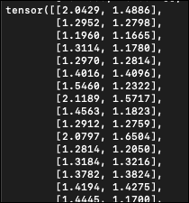

然后，我们收集与操作批量相对应的值。

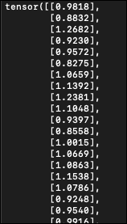

现在我们有了状态动作对，以及与之相关的值。 这对应于实际的 Q 函数。

接下来，我们需要找到期望的 Q 函数。 我们创建一个由 0 和 1 组成的掩码，将非 0 状态映射为 1，将 0 状态（终端状态）映射为 0。通过算法的设计，我们知道终端状态将始终具有值 0。 状态的值为正，但终端状态的值为 0。掩码如下所示：

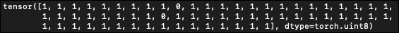

在那批状态中，置于 0 的 1 是终端状态。 所有其他均为非最终状态。 我们将所有非最终的下一个状态连接到`non_final_next_states`中。 之后，我们将`next_state_values`初始化为全 0。 然后，我们将`non_final_next_states`传递给`target_network`，从中获得最大值的操作值，并将其应用于`next_state_values[non_final_mask]`。 我们将从非最终状态预测的所有值都放入非最终`next_state_values`数组。 `next_state_values`的外观如下：

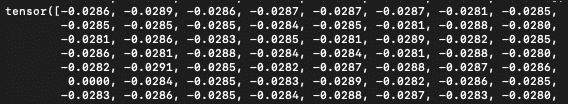

最后，我们计算期望的 Q 函数。 根据我们先前的讨论，它将是`R + Gamma`（下一个状态值）。 然后，我们根据实际 Q 函数和预期 Q 函数计算损失，然后将误差反向传播到策略网络（请记住`target_net`处于`eval`模式）。 我们还使用梯度钳制来确保梯度较小且不会转移得太远。

训练神经网络将花费一些时间，因为该过程将渲染每个帧并计算该误差。 我们本可以使用一种更简单的方法，直接获取速度和位置来表示损失函数，并且由于不需要渲染每一帧，因此可以花费更少的时间进行训练。 它只会直接从`env.state`接受输入。

此算法有许多改进，例如为智能体增加了想象力，以便可以更好地探索和想象其脑海中的动作，并做出更好的预测。

## 总结

在本章中，我们学习了无监督学习的一个全新领域：强化学习。 这是一个完全不同的领域，我们在本章中仅涉及了这个主题。 我们学习了如何对问题进行措辞以进行强化学习，然后我们训练了一个模型，该模型可以看到环境提供的一些测量结果，并且可以学习如何平衡赤字。 您可以应用相同的知识来教机器人走路，驾驶汽车以及玩游戏。 这是深度学习的更多物理应用之一。

在下一章和最后一章中，我们将着眼于生产我们的 PyTorch 模型，以便您可以在任何框架或语言上运行它们，并扩展您的深度学习应用。

## 参考

1.  [Google DeepMind 挑战赛：Lee Sedol 与 AlphaGo](https://www.youtube.com/watch?v=vFr3K2DORc8)

本章由 Sudhanshu Passi 贡献。