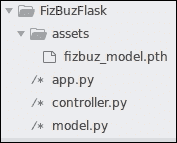
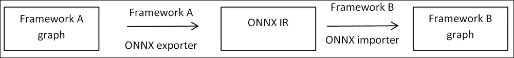
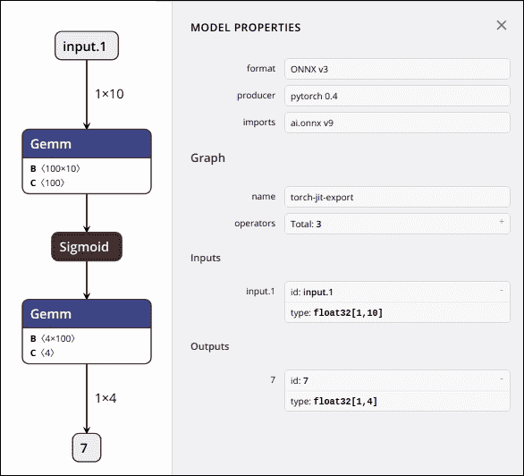
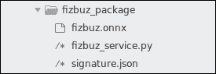
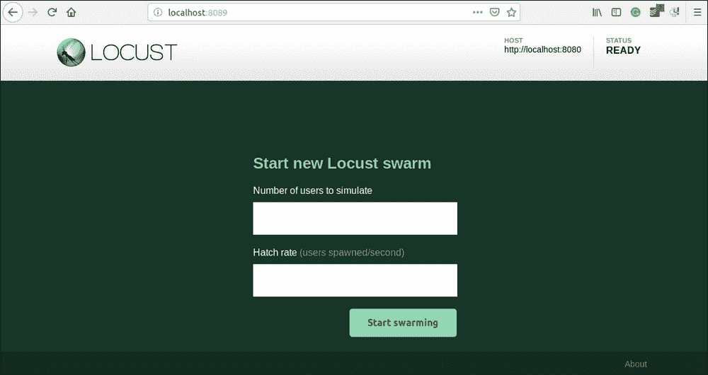

# 八、生产中的 PyTorch 

2017 年，当 PyTorch 发布其可用版本时，它的承诺是成为研究人员的 Python 优先框架。 PyTorch 社区对此严格了一年，但随后看到了大量的生产要求，并决定将生产能力与 PyTorch 的第一个稳定版本 1.0 合并，但又不影响其创建的可用性和灵活性。

PyTorch 以其干净的框架而闻名，因此要获得研究所需的生产能力和灵活性是一项艰巨的任务。 我认为，将生产支持推向核心的主要障碍是摆脱 Python 的境界，并将 PyTorch 模型转移到具有多线程功能的更快的线程安全语言中。 但是随后，这违反了 PyTorch 当时所遵循的 Python 优先原则。

解决此问题的第一步是使**开放式神经网络交换**（**ONNX**）格式稳定，并与所有流行的框架兼容（至少与具有良好功能的框架兼容） 模块）。 ONNX 定义了深度学习图所需的基本运算符和标准数据类型。 这引导了 ONNX 进入 PyTorch 核心的道路，并且它与 ONNX 转换器一起为流行的深度学习框架（例如 CNTK，MXNet，TensorFlow 等）构建。

ONNX 很棒，并且每个人都喜欢它，但是 ONNX 的主要缺点之一是其脚本模式。 也就是说，ONNX 运行一次图以获取有关图的信息，然后将其转换为 ONNX 格式。 因此，ONNX 无法迁移模型中的控制流（将`for`循环用于循环神经网络（RNN）模型的不同序列长度）。

生产 PyTorch 的第二种方法是在 PyTorch 本身中构建高性能后端。 Caffe2 的核心与 PyTorch 核心合并在一起，而不是从头开始构建一个，但 Python API 保持不变。 但是，这并不能解决 Python 语言所具有的问题。

接下来是 TorchScript 的引入，它可以将本机 Python 模型转换为可以在高性能 Universe 中加载的序列化形式，例如 C++ 线程。 PyTorch 的后端 LibTorch 可以读取 TorchScript，这使 PyTorch 高效。 有了它，开发人员可以对模型进行原型设计，甚至可以使用 Python 本身对其进行训练。 训练后，可以将模型转换为到**中间表示**（**IR**）。 目前，仅开发了 C++ 后端，因此可以将 IR 作为 C++ 对象加载，然后可以从 PyTorch 的 C++ API 中读取。 TorchScript 甚至可以在 Python 程序中转换控制流，这在生产支持的情况下使其优于 ONNX 方法。 TorchScript 本身是 Python 语言中可能的操作的子集，因此不允许任何 Python 操作用 TorchScript 编写。 官方文档本身提供了非常详细的说明，并讨论了可能的情况和不可能的情况，以及许多示例[1]。

在本章中，我们将从使用 Flask（流行的 Python Web 框架）提供普通的 Python PyTorch 模型开始。 这样的设置通常就足够了，特别是如果您要设置示例 Web 应用或满足您个人需求或类似用例的东西。 然后，我们将探索 ONNX 并将 PyTorch 模型转换为 MXNet，然后可以使用 MXNet 模型服务器提供服务。 从那里，我们将转到 TorchScript，这是 PyTorch 社区的新东西。 使用 TorchScript，我们将制作 C++ 可执行文件，然后可以在 LibTorch 的帮助下从 C++ 执行该可执行文件。 然后，可以从稳定，高性能的 C++ 服务器甚至使用 cgo 的 Go 服务器提供高效的 C++ 可执行文件。 对于所有份量，我们将使用在第 2 章，“简单神经网络”中构建的 fizzbuzz 网络。

## 与 Flask 一起使用

在 Python 本身中提供 PyTorch 模型是在生产环境中提供模型的最简单方法。 但是在解释如何完成之前，让我们快速看一下 Flask 是什么。 完全解释 Flask 不在本章的讨论范围内，但我们仍将介绍 Flask 的最基本概念。

### Flask 简介

Flask 是的微框架，已被 Python 领域的多家大公司用于生产。 即使 Flask 提供了可用于将 UI 推送到客户端的模板引擎，我们也没有使用它。 相反，我们将制作一个提供 API 的 RESTful 后端。

可以使用`pip`来安装 Flask ，就像其他任何 Python 包一样：

```py
pip install Flask

```

这将安装其他依赖项 Werkzeug（应用和服务器之间的 Python 接口），Jinga（作为模板引擎），其危险（用于安全签名数据）和 Click（作为 CLI 构建器）。

安装后，用户将可以访问 CLI，并使用`flask run`调用我们的脚本将启动服务器：

```py
from flask import Flask
app = Flask(__name__)

@app.route("/")
def hello():
    return "Hello World!"
```

该示例包含四个部分：

*   第一行是我们导入 Flask 包的位置。
*   我们创建一个 Flask 对象，这是我们的大型 Web 应用对象，Flask 服务器将使用该对象来运行我们的服务器。
*   有了应用对象后，我们需要存储有关对象应对其执行操作的 URL 的信息。 为此，应用对象带有`route`方法，该方法接受所需的 URL 并返回装饰器。 这是我们希望应用现在提供的 URL。
*   由应用对象返回的装饰器对一个函数进行装饰，当 URL 命中时，将触发该函数。 我们将其命名为`hello`。 函数的名称在这里并不重要。 在前面的示例中，它只是检查输入并做出相应的响应。 但是对于我们的模型服务器，我们使此函数稍微复杂一点，以便它可以接受输入并将该输入提供给我们构建的模型。 然后，我们模型的返回值将作为 HTTP 响应推回给用户。

我们通过建立`flask_trial`目录开始实现，并将该文件另存为`app.py`在该目录中：

```py
mkdir flask_trial
cd flask_trial

```

然后，我们执行 Flask 随附的 CLI 命令来启动服务器。 执行后，如果未提供自定义参数，您将看到`http://127.0.0.1:5000`正在为服务器提供服务。

```py
flask run

```

我们可以通过向服务器位置发出 HTTP 请求来测试简单的 Flask 应用。 如果一切正常，我们应该得到一个“你好，世界！” 来自服务器的消息。

```py
-> curl "http://127.0.0.1:5000"
-> Hello World!

```

我们已经建立了简单的 Flask 应用。 现在，将 fizzbuzz 模型引入我们的应用。 以下代码片段显示了与第 2 章和“简单神经网络”相同的模型，供您参考。 该模型将从路由函数中调用。 我们已经在第 2 章和“一个简单的神经网络”中对模型进行了训练，因此，我们将在这里加载训练后的模型，而不是再次对其进行训练：

```py
import torch.nn as nn
import torch

class FizBuzNet(nn.Module):
    """
    2 layer network for predicting fiz or buz
    param: input_size -> int
    param: output_size -> int
    """

    def __init__(self, input_size, hidden_size, output_size):
        super(FizBuzNet, self).__init__()
        self.hidden = nn.Linear(input_size, hidden_size)
        self.out = nn.Linear(hidden_size, output_size)

    def forward(self, batch):
        hidden = self.hidden(batch)
        activated = torch.sigmoid(hidden)
        out = self.out(activated)
        return out
```

#### 用于 Flask 的模型

下面的屏幕快照给出了我们应用的目录结构。 `assets`文件夹具有训练好的模型，在加载模型时，`controller.py`文件将使用该模型。 根目录中的`app.py`是 Flask 应用的入口。 Flask 首选`app.py`作为入口点文件的默认名称。

当您执行`flask run`时，Flask 将在当前目录中查找`app.py`文件并执行该文件。 `controller.py`文件是我们从`model.py`文件加载模型的地方。 然后，加载的模型将等待用户通过 HTTP 端点输入。 `app.py`将用户输入重定向到`controller`，然后将其转换为 Torch 张量。

张量对象将通过神经网络传递，并且`controller`将神经网络的结果传递给后处理操作后，从神经网络返回结果。



图 8.1：当前目录

目录中有四个组件用于制作 Flask 应用。 `assets`文件夹是我们保留模型的地方。 其他三个文件是代码所在的位置。 让我们研究一下每个。 我们将从入口文件`app.py`开始。 它是先前提供的简单 Flask 应用的扩展版本。 该文件教我们如何定义 URL 端点，以及如何将 URL 端点映射到 Python 函数。 我们的扩展`app.py`文件显示在以下代码块中：

```py
import json

from flask import Flask
from flask import request

import controller

app = Flask('FizBuzAPI')

@app.route('/predictions/fizbuz_package', methods=['POST'])
def predict():
    which = request.get_json().get('input.1')
    if not which:
        return "InvalidData"
    try:
        number = int(which) + 1
        prediction = controller.run(number)
        out = json.dumps({'NextNumber': prediction})
    except ValueError:
        out = json.dumps({'NextNumber': 'WooHooo!!!'})
    return out
```

Flask 为我们提供了`request`工具，它是一个全局变量，但对于存储有关当前请求信息的当前线程而言是局部的。 我们使用`request`对象的`get_json`函数从`request`对象获取主体`POST`参数。 然后，将通过 HTTP 传入的字符串数据转换为整数。 这个整数是我们从前端传递的数字。 我们应用的任务是预测下一个数字的状态。 那将是下一个数字本身还是嘶嘶声，嗡嗡声或嘶嘶声？ 但是，如果您还记得，我们会训练我们的网络来预测我们通过的号码的状态。 但是，我们需要下一个号码的状态。 因此，我们将一个加到当前数上，然后将结果传递给我们的模型。

我们的下一个导入是`controller`，我们在其中加载了模型文件。 我们正在调用`run`方法并将数字传递给模型。 然后，将`controller`的预测值作为字典传递回。 Flask 会将其转换为响应正文并将其发送回用户。

在继续之前，我们可以从以前的简单 Flask 应用的扩展版本中看到两个主要差异。 一种是 URL 路由：`/predictions/fizbuz_package`。 如前所述，Flask 允许您将任何 URL 端点映射到您选择的函数。

其次，我们在装饰器中使用了另一个关键字参数：`methods`。 这样，我们告诉 Flask，不仅需要通过 URL 规则来调用此函数，而且还需要在对该 URL 的`POST`方法调用上进行调用。 因此，我们像以前一样使用`flask run`运行该应用，并使用`curl`命令对其进行测试。

```py
-> curl -X POST http://127.0.0.1:5000/predictions/fizbuz_package \
 -H "Content-Type: application/json" \
 -d '{"input.1": 14}'

-> {"NextNumber": "FizBuz"}

```

在 HTTP `POST`请求中，我们传递了输入数字为`14`的 JSON 对象，我们的服务器返回了下一个数字`FizBuz`。 所有这些魔术都发生在我们的`app.py`调用的`controller.run()`方法中。 现在，让我们看看该函数在做什么。

接下来是使用`run()`方法的`controller`文件。 在这里，我们将输入数字转换为 10 位二进制数（请记住，在第 2 章，“简单神经网络”中，这是我们作为输入传递给 fizzbuzz 网络的东西），将其变为 Torch 张量。 然后将二进制张量传递给我们模型的正向函数，以得到具有预测的`1 x 4`张量。

通过从加载了保存的`.pth`文件的模型文件中调用`FizBuz`类来创建我们的模型。 我们使用 Torch 的`load_state_dict`方法将参数加载到初始化的模型中。 之后，我们将模型转换为`eval()`模式，这将模型设置为评估模式（它在评估模式下关闭了`batchnorm`丢弃层）。 模型的输出是运行`max`并确定哪个索引具有最大值，然后将其转换为可读输出的概率分布。

#### 为生产准备的服务器

这是关于如何使用 Flask 将 PyTorch 模型部署到服务器的非常基本的演练。 但是 Flask 的内置服务器尚未投入生产，只能用于开发目的。 开发完成后，我们应该使用其他服务器包在生产中为 Flask 应用提供服务。

Gunicorn 是 Python 开发人员使用的最受欢迎的服务器包之一，将其与 Flask 应用绑定非常容易。 您可以使用`pip`安装 Gunicorn，就像我们安装 Flask 一样：

```py
pip install gunicorn

```

Gunicorn 需要我们传递模块名称，以便它能够拾取模块并运行服务器。 但是 Gunicorn 希望应用对象具有名称`application`，而我们的项目则不是这样。 因此，我们需要显式传递应用对象名称和模块名称。 Gunicorn 的命令行工具有很多选择，但是我们正在尝试使其尽可能简单：

```py
gunicorn app:app

```

```py
import torch
from model import FizBuzNet

input_size = 10
output_size = 4
hidden_size = 100

def binary_encoder():
    def wrapper(num):
        ret = [int(i) for i in '{0:b}'.format(num)]
        return [0] * (input_size - len(ret)) + ret
    return wrapper

net = FizBuzNet(input_size, hidden_size, output_size)
net.load_state_dict(torch.load('assets/fizbuz_model.pth'))
net.eval()
encoder = binary_encoder()

def run(number):
    with torch.no_grad():
        binary = torch.Tensor([encoder(number)])
        out = net(binary)[0].max(0)[1].item()
    return get_readable_output(number, out)
```

## ONNX

建立 ONNX 协议是为了创建不同框架之间的互操作性。 这可以帮助 AI 开发人员和组织选择合适的框架来开发他们花费大部分时间的 AI 模型。 一旦开发和训练阶段结束，他们便可以将模型迁移到他们选择的任何框架中，以在生产中提供服务。

可以针对不同目的优化不同的框架，例如移动部署，可读性和灵活性，生产部署等。 有时将模型转换为不同的框架是不可避免的，手动转换很耗时。 这是 ONNX 试图通过互操作性解决的另一个用例。

让我们以任何框架示例为例，看看 ONNX 适合什么地方。框架将具有语言 API（供开发人员使用），然后是由他们开发的模型的图形表示。 然后，该 IR 进入高度优化的运行时以执行。 ONNX 为此 IR 提供了统一的标准，并使所有框架都了解 ONNX 的 IR。 借助 ONNX，开发人员可以使用 API​​制作模型，然后将其转换为框架的 IR。 ONNX 转换器可以将该 IR 转换为 ONNX 的标准 IR，然后可以将其转换为其他框架的 IR。

这是 PyTorch 的 Fizzbuzz 网络的 IR 的可读表示：

```py
graph(%input.1 : Float(1, 10)
      %weight.1 : Float(100, 10)
      %bias.1 : Float(100)
      %weight : Float(4, 100)
      %bias : Float(4)) {
  %5 : Float(10!, 100!) = aten::t(%weight.1),scope: FizBuzNet/Linear[hidden]
  %6 : int = prim::Constant[value=1](),scope: FizBuzNet/Linear[hidden]
  %7 : int = prim::Constant[value=1](),scope: FizBuzNet/Linear[hidden]
  %hidden : Float(1, 100) = aten::addmm(%bias.1, %input.1, %5, %6,%7), scope: FizBuzNet/Linear [hidden]
  %input : Float(1, 100) = aten::sigmoid(%hidden),scope: FizBuzNet
  %10 : Float(100!, 4!) = aten::t(%weight),scope: FizBuzNet/Linear[out]
  %11 : int = prim::Constant[value=1](),scope: FizBuzNet/Linear[out]
  %12 : int = prim::Constant[value=1](),scope: FizBuzNet/Linear[out]
  %13 : Float(1, 4) = aten::addmm(%bias, %input, %10, %11, %12),scope: FizBuzNet/Linear[out]
  return (%13);
}
```

表示清楚地表明了整个网络的结构。 前五行显示参数和输入张量，并为每一个标记一个名称。 例如，整个网络将输入张量定为`input.i`，它是形状为`1 x 10`的浮点张量。然后，它显示了我们第一层和第二层的权重和偏差张量。

从第六行开始，显示了图的结构。 每行的第一部分（以`%`符号开头的全冒号之前的字符）是每行的标识符，这是其他行中用来引用这些行的标识符。 例如，以`%5`作为标识符的线对`aten::t(%weight.i)`表示的第一层的权重进行转置，从而输出形状为`10 x 100`的浮点张量。



图 8.2：另一个 IR 转换为 ONNX 的 IR，然后又转换为另一个 IR

PyTorch 具有内置的 ONNX 导出器，它可以帮助我们创建 ONNX IR，而无需离开 PyTorch。 在此处给出的示例中，我们将 fizbuzz 网络导出到 ONNX，然后由 MXNet 模型服务器提供服务。 在以下代码段中，我们使用 PyTorch 的内置`export`模块将 fizzbuzz 网络转换为 ONNX 的 IR：

```py
>>> import torch
>>> dummy_input = torch.Tensor([[0, 0, 0, 0, 0, 0, 0, 0, 1, 0]])
>>> dummy_inputtensor([[O., 0., 0., 0., 0., 0., 0., O., 1., 0.]])
>>> net = FizBuzNet(input_size, hidden_size, output_size)
>>> net.load_state_dict(torch.load('assets/fizbuz_model.pth'))
>>> dummy_input = torch.Tensor([[0, 0, 0, 0, 0, 0, 0, 0, 1, 0]])
>>> torch.onnx.export(net, dummy_input, "fizbuz.onnx", verbose=True)

```

在最后一行，我们调用`export`模块，并传递 PyTorch 的`net`，虚拟输入和输出文件名。 ONNX 通过跟踪图进行转换； 也就是说，它使用我们提供的虚拟输入执行一次图。

在执行图时，它会跟踪我们执行的 PyTorch 操作，然后将每个操作转换为 ONNX 格式。 键值参数`verbose=True`在导出时将输出写入到终端屏幕。 它为我们提供了 ONNX 中相同图的 IR 表示：

```py
graph(%input.1 : Float(1, 10)
      %1 : Float(100, 10)
      %2 : Float(100)
      %3 : Float(4, 100)
      %4 : Float(4)) {
  %5 : Float(1, 100) = onnx::Gemm[alpha=1, beta=1,transB=1](%input.1, %1, %2),scope: FizBuzNet/Linear[hidden]
  %6 : Float(1, 100) = onnx::Sigmoid(%5), scope: FizBuzNet
  %7 : Float(1, 4) = onnx::Gemm[alpha=1, beta=1,transB=1](%6, %3, %4),scope: FizBuzNet/Linear[out]
  return (%7);
}
```

它还显示了图执行所需的所有操作，但比 PyTorch 的图形表示要小。 虽然 PyTorch 向我们显示了每个操作（包括转置操作），但 ONNX 会在高级功能（例如`onnx:Gemm`）下抽象该粒度信息，前提是其他框架的`import`模块可以读取这些抽象。

PyTorch 的`export`模块将 ONNX 模型保存在`fizbuz.onnx`文件中。 可以从 ONNX 本身或其他框架中内置的 ONNX 导入程序中加载。 在这里，我们将 ONNX 模型加载到 ONNX 本身并进行模型检查。 ONNX 还具有由 Microsoft 管理的高性能运行时，这超出了本书的解释范围，但可在[这个页面](https://github.com/Microsoft/onnxruntime)上获得。

由于 ONNX 已成为框架之间互操作性的规范，因此围绕它构建了其他工具。 最常用/最有用的工具可能是 Netron，它是 ONNX 模型的可视化工具。 尽管 Netron 不像 TensorBoard 那样具有交互性，但 Netron 足以用于基本可视化。

拥有`.onnx`文件后，您可以将文件位置作为参数传递给 Netron 命令行工具，该工具将构建服务器并在浏览器中显示该图：

```py
pip install netron
netron -b fizbuz.onnx

```

前面的命令将使用 Fizzbuzz 网络的图可视化来启动 Netron 服务器，如下图所示。 除了可缩放的图外，Netron 还可以可视化其他基本信息，例如版本，生成器，图的生成方式等等。 另外，每个节点都是可单击的，它将显示有关该特定节点的信息。 当然，这还不够复杂，无法满足可视化工具所需的所有要求，但足以让我们对整个网络有所了解。



图 8.3：Fizzbuzz 网络的 Netron 可视化

从成为 ONNX 可视化工具开始，Netron 逐渐接受所有流行框架的导出模型。 目前，根据官方文件，Netron 接受 ONNX，Keras，CoreML，Caffe2，MXNet，TensorFlow Lite，TensorFlow.js，TensorFlow，Caffe，PyTorch，Torch，CNTK，PaddlePaddle，Darknet 和 scikit-learn 的模型。

### MXNet 模型服务器

现在我们离开了 PyTorch 世界。 我们现在有不同的模型服务器，但我们选择了 MXNet 模型服务器。 MXNet 模型服务器由社区维护，由亚马逊团队领导，也称为 MMS。 从这里开始，我将交替使用 MMS 和 MXNet 模型服务器。

MXNet 比其他服务模块更好。 在撰写本文时，TensorFlow 与 Python 3.7 不兼容，并且 MXNet 的服务模块已与内置的 ONNX 模型集成，这使开发人员可以轻松地以很少的命令行为模型提供服务，而无需了解分布式或高度可扩展的部署的复杂性。

其他模型服务器，例如 TensorRT 和 Clipper，不像 MXNet 服务器那样易于设置和管理。 而且，MXNet 附带了另一个名为 MXNet 存档器的工具，该工具将所有必需的文件打包成一个捆绑包，这些文件可以独立部署，而不必担心其他依赖项。 除了 MXNet 模型服务器具备的所有这些很酷的功能之外，最大的好处是能够自定义预处理和后处理步骤。 我们将在接下来的部分中介绍如何完成所有这些操作。

整个过程的流程从我们尝试使用模型存档器创建具有`.mar`格式的单个存档文件的位置开始。 单个捆绑包文件需要 ONNX 模型文件`signature.json`，该文件提供有关输入大小，名称等的信息。 认为它是可以随时更改的配置文件。 如果您决定将所有值硬编码到代码中，而不是从配置中读取，则它甚至不必成为存档的一部分。 然后，您需要服务文件，您可以在其中定义预处理，推理功能，后处理功能和其他工具函数。

制作完模型档案后，我们可以调用模型服务器，并将位置作为输入传递给我们的模型档案。 而已; 您现在可以从超级性能模型服务器提供模型。

#### MXNet 模型存档器

我们将通过安装 MXNet 模型存档器开始我们的旅程。 MXNet 模型服务器随附的默认模型存档器不支持 ONNX，因此我们需要单独安装。 ONNX 的模型存档器依赖于协议缓冲区和 MXNet 包本身。 官方文档中提供了为每个操作系统安装 protobuf 编译器的指南。 可以通过`pip`来安装 MXNet 包，就像我们已经安装了其他包一样（对于 GPU，MXNet 还有另一个包，但是这里我们正在安装 MXNet 的基本版本）：

```py
pip install mxnet
pip install model-archiver[onnx]

```

现在，我们可以安装 MXNet 模型服务器。 它基于 **Java 虚拟机**（**JVM**）构建，因此从 JVM 调用了运行有我们模型实例的多个线程。 利用 JVM 支持的复杂性，可以将 MXNet 服务器扩展为处理数千个请求的多个进程。

MXNet 服务器带有管理 API，该 API 通过 HTTP 提供。 这有助于生产团队根据需要增加/减少资源。 除了处理工作器规模之外，管理 API 还具有其他选项。 但是我们不会在这里深入探讨。 由于模型服务器在 JVM 上运行，因此我们需要安装 Java8。此外，MXNet 模型服务器在 Windows 上仍处于试验模式，但在 Linux 风味和 Mac 上稳定。

```py
pip install mxnet-model-server

```

现在，在安装了所有前提条件之后，我们可以开始使用 MXNet 模型服务器对可用于生产的 PyTorch 模型进行编码。 首先，我们创建一个新目录，以保存所有需要的文件以供模型存档器创建捆绑文件。 然后，我们移动在上一步中创建的`.onnx`文件。

MMS 的一项强制性要求是其中包含服务类的服务文件。 MMS 执行服务文件中唯一可用类的`initialize()`和`handle()`函数。 在下一节中，我们将逐一进行介绍，但这是我们可以用来制作服务文件的框架。



图 8.4：`fizbuz_package`的目录结构

```py
class MXNetModelService(object):

    def __init__(self):
        ...
    def initialize(self, context):
        ...
    def preprocess(self, batch):
        ...
    def inference(self, model_input):
        ...
    def postprocess(self, inference_output):
        ...
    def handle(self, data, context):
        ...
```

然后，我们需要一个签名文件。 正如我们之前所看到的，签名文件只是配置文件。 我们可以通过将值硬编码到脚本本身来避免发生这种情况，但是 MMS 人士也建议这样做。 我们为 fizzbuzz 网络制作了最小的签名文件，如下所示：

```py
{
  "inputs": [
    {
      "data_name": "input.1",
      "data_shape": [
        1,
        10
      ]
    }
  ],
  "input_type": "application/json"
}
```

在签名文件中，我们描述了数据名称，输入形状和输入类型。 当通过 HTTP 读取数据流时，这就是我们的服务器假定的数据信息。 通常，我们可以通过在签名文件中进行配置来使我们的 API 接受任何类型的数据。 但是然后我们的脚本也应该能够处理这些类型。 让我们完成服务文件，然后将其与 MMS 捆绑在一起。

如您先前所见，MMS 调用服务文件中唯一可用的单个类的`initialize()`方法。 如果服务文件中存在更多类，那就完全是另一回事了，但是让我们足够简单地理解它。 顾名思义，`initialize()`文件初始化所需的属性和方法：

```py
def initialize(self, context):
    properties = context.system_properties
    model_dir = properties.get("model_dir")
    gpu_id = properties.get("gpu_id")
    self._batch_size = properties.get('batch_size')
    signature_file_path = os.path.join(
        model_dir, "signature.json")
    if not os.path.isfile(signature_file_path):
        raise RuntimeError("Missing signature.json file.")
    with open(signature_file_path) as f:
        self.signature = json.load(f)
    data_names = []
    data_shapes = []
    input_data = self.signature["inputs"][0]
    data_name = input_data["data_name"]
    data_shape = input_data["data_shape"]
    data_shape[0] = self._batch_size
    data_names.append(data_name)
    data_shapes.append((data_name, tuple(data_shape)))
    self.mxnet_ctx = mx.cpu() if gpu_id is None elsemx.gpu(gpu_id)
    sym, arg_params, aux_params = mx.model.load_checkpoint(checkpoint_prefix, self.epoch)
    self.mx_model = mx.mod.Module(
        symbol=sym, context=self.mxnet_ctx,
        data_names=data_names, label_names=None)
    self.mx_model.bind(
        for_training=False, data_shapes=data_shapes)
    self.mx_model.set_params(
        arg_params, aux_params,
        allow_missing=True, allow_extra=True)
    self.has_initialized = True
```

MMS 在调用`initialize()`时传递上下文参数，该参数具有在解压缩存档文件时获取的信息。 当首先使用存档文件路径作为参数调用 MMS 时，在调用服务文件之前，MMS 解压缩存档文件并安装模型，并收集信息，其中存储模型，MMS 可以使用多少个内核，它是否具有 GPU 等。 所有这些信息都作为上下文参数传递给`initialize()`。

`initialize()`的第一部分是收集此信息以及来自签名 JSON 文件的信息。 函数的第二部分从第一部分中收集的信息中获取与输入有关的数据。 然后，该函数的第三部分是创建 MXNet 模型并将训练后的参数加载到模型中。 最后，我们将`self.has_initialized`变量设置为`True`，然后将其用于检查服务文件其他部分的初始化状态：

```py
def handle(self, data, context):
    try:
        if not self.has_initialized:
            self.initialize()
        preprocess_start = time.time()
        data = self.preprocess(data)
        inference_start = time.time()
        data = self.inference(data)
        postprocess_start = time.time()
        data = self.postprocess(data)
        end_time = time.time()

        metrics = context.metrics
        metrics.add_time(self.add_first())
        metrics.add_time(self.add_second())
        metrics.add_time(self.add_third())
        return data
    except Exception as e:
        request_processor = context.request_processor
        request_processor.report_status(
            500, "Unknown inference error")
        return [str(e)] * self._batch_size
```

MMS 被编程为在每个请求上调用相同类的`handle()`方法，这是我们控制流程的地方。 `initialize()`函数只会在启动线程时被调用一次； 每个用户请求都将调用`handle()`函数。 由于`handle()`函数是针对每个用户请求被调用的，以及上下文信息，因此它也将在参数中获取当前数据。 但是，为了使程序模块化，我们没有在`handle()`中进行任何操作； 取而代之的是，我们正在调用其他仅指定做一件事的函数：该函数应该做什么。

我们将整个流分为四个部分：预处理，推理，后处理和矩阵记录。 在`handle()`的第一行中，我们验证是否正在使用上下文和数据信息初始化线程。 完成后，我们将进入流程。 现在，我们将逐步完成流程。

我们首先使用`data`作为参数调用`self.preprocess()`函数，其中`data`将是 HTTP 请求的`POST`正文内容。 `preprocess`函数以与我们在`signature.json`文件中配置的名称相同的名称获取传递的数据。 一旦有了数据，这就是我们需要系统预测下一个数字的整数。 由于我们已经训练了模型来预测当前号码的嘶嘶声状态，因此我们将在数据中为号码添加一个嗡嗡声，然后在新号码的二进制文件上创建一个 MXNet 数组：

```py
def preprocess(self, batch):
    param_name = self.signature['inputs'][0]['data_name']
    data = batch[0].get('body').get(param_name)
    if data:
        self.input = data + 1
        tensor = mx.nd.array(
            [self.binary_encoder(self.input, input_size=10)])
        return tensor
    self.error = 'InvalidData'
```

`handle()`函数获取已处理的数据，并将其传递给`inference()`函数，该函数将使用已处理的数据调用保存在`initialize()`函数上的 MXNet 模型。 `inference()`函数返回大小为`1 x 4`的输出张量，然后将其返回到`handle()`函数。

```py
def inference(self, model_input):
    if self.error is not None:
        return None
    self.mx_model.forward(DataBatch([model_input]))
    model_output = self.mx_model.get_outputs()
    return model_output
```

然后将张量传递给`postprocess()`函数，以将其转换为人类可读的输出。 我们具有`self.get_readable_output()`函数，可根据需要将模型的输出转换为嘶嘶声，嗡嗡声，嘶嘶声嗡嗡声或下一个数字。

然后，后处理的数据返回到`handle()`函数，在其中进行矩阵创建。 之后，数据将返回到`handle()`函数的被调用方，该函数是 MMS 的一部分。 MMS 将该数据转换为 HTTP 响应，并将其返回给用户。 MMS 还记录矩阵的输出，以便操作可以实时查看矩阵并基于此做出决策：

```py
def postprocess(self, inference_output):
    if self.error is not None:
        return [self.error] * self._batch_size
    prediction = self.get_readable_output(
        self.input,
        int(inference_output[0].argmax(1).asscalar()))
    out = [{'next_number': prediction}]
    return out
```

一旦将所有文件包含在前面给出的目录中，就可以创建`.mar`存档文件：

```py
model-archiver \
        --model-name fizbuz_package \
        --model-path fizbuz_package \
        --handler fizbuz_service -f
```

这将在当前目录中创建一个`fizbuz_package.mar`文件。 然后可以将其作为 CLI 参数传递给 MMS：

```py
mxnet-model-server \
        --start \
        --model-store FizBuz_with_ONNX \
        --models fizbuz_package.mar
```

现在，我们的模型服务器已启动并在端口 8080 上运行（如果您尚未更改端口）。 我们可以尝试执行与 Flask 应用相同的`curl`命令（显然，我们必须更改端口号）并检查模型。 我们应该获得与 Flask 应用完全相同的结果，但是现在我们可以根据需要动态地动态扩展或缩减工作器的数量。 MMS 为此提供了管理 API。 管理 API 带有几个可配置的选项，但是这里我们只关注于增加或减少工作器的数量。

除了在端口 8080 上运行的服务器之外，还将在 8081 上运行管理 API 服务，我们可以对其进行调用和控制配置。 使用简单的`GET`请求命中该端点将为您提供服务器的状态。 但是在探究这一点之前，我们将工作器数量设为 1（默认情况下为 4）。 API 端点是适当的 REST 端点； 我们在路径中指定模型名称，并传递参数`max_worker=1`以使工作器数为 1。 我们也可以通过`min_worker=<number>`来增加工作器数量。 官方文档[2]中详细介绍了管理 API 上可能的配置。

```py
-> curl -v -X PUT "http://localhost:8081/models/fizbuz_package?max_worker=1"
...
{
 "status": "Processing worker updates..."
}
...

```

一旦减少了工作器的数量，我们就可以命中端点来确定服务器的状态。 示例输出（在我们减少了工作器数量之后）如下：

```py
-> curl "http://localhost:8081/models/fizbuz_package"
{
 "modelName": "fizbuz_package",
 "modelUrl": "fizbuz_package.mar",
 "runtime": "python",
 "minWorkers": 1,
 "maxWorkers": 1,
 "batchSize": 1,
 "maxBatchDelay": 100,
 "workers": [
 {
 "id": "9000",
 "startTime": "2019-02-11T19:03:41.763Z",
 "status": "READY",
 "gpu": false,
 "memoryUsage": 0
 }
 ]
}

```

我们已经设置了模型服务器，现在我们知道如何根据比例配置服务器。 让我们使用 Locust 对服务器进行负载测试，并检查服务器的负载情况，以及根据我们的需求增加/减少资源有多容易。 将 AI 模型部署到生产环境并非易事。

#### 负载测试

随后是示例蝗虫脚本，应将其另存为`locust.py`在当前目录中。 如果已安装 Locust（可以使用`pip`进行安装），则调用`locust`将打开 Locust 服务器并打开 UI，我们可以在其中输入要测试的比例尺。 我们可以逐步提高规模，并检查服务器在什么时候开始崩溃，然后点击管理 API 以增加工作量并确保我们的服务器可以容纳规模：

```py
import random
from locust import HttpLocust, TaskSet, task

class UserBehavior(TaskSet):
    def on_start(self):
        self.url = "/predictions/fizbuz_package"
        self.headers = {"Content-Type": "application/json"}

    @task(1)
    def success(self):
        data = {'input.1': random.randint(0, 1000)}
        self.client.post(self.url, headers=self.headers, json=data)

class WebsiteUser(HttpLocust):
    task_set = UserBehavior
    host = "http://localhost: 8081"
```



图 8.5：Locust UI，我们可以在其中配置用户数量以模拟生产负载

## TorchScript 的效率

我们已经设置了简单的 Flask 应用服务器来为我们的模型提供服务，并且已经使用 MXNet 模型服务器实现了相同的模型，但是如果我们需要摆脱 Python 的世界，并使用 C++ 或 Go 创建高效的服务器 ，或使用其他有效的语言，PyTorch 提出了 TorchScript，它可以生成模型中最有效的形式，并且可以在 C++ 中读取。

现在的问题是：这不是我们对 ONNX 所做的吗？ 也就是说，从 PyTorch 模型创建另一个 IR？ 是的，过程相似，但区别在于 ONNX 使用跟踪创建了优化的 IR； 也就是说，它通过模型传递虚拟输入，并在执行模型时记录 PyTorch 操作，然后将这些操作转换为中间 IR。

这种方法有一个问题：如果模型是数据相关的，例如 RNN 中的循环，或者`if`/`else`条件是基于输入的，那么跟踪就不能真正做到这一点。 跟踪将仅发现在特定执行周期中发生的情况，而忽略其他情况。 例如，如果我们的虚拟输入是 10 个单词的句子，而我们的模型是基于循环的 RNN，则跟踪的图将对 RNN 单元的 10 次执行进行硬编码，如果句子的长度大于 10，或者较短的句子带有更少的单词，则它将中断。 考虑到这一点引入了 TorchScript。

TorchScript 支持此类 Python 控制流的一个子集，唯一要做的就是将现有程序转换为所有控制流都是 TorchScript 支持的控制流的阶段。 LibTorch 可以读取 TorchScript 创建的中间阶段。 在此会话中，我们将创建 TorchScript 输出并编写一个 C++ 模块以使用 LibTorch 加载它。

即使 TorchScript 是 PyTorch 早期版本的 JIT 包的一部分，它仍在 PyTorch 1.0 中引入了可用且稳定的 TorchScript 版本。 TorchScript 可以序列化和优化用 PyTorch 编写的模型。

与 ONNX 一样，TorchScripts 可以作为 IR 保存到磁盘中，但是与 ONNX 不同，该 IR 经过优化可在生产环境中运行。 保存的 TorchScript 模型可以在不依赖 Python 的环境中加载。 由于性能和多线程原因，Python 一直是生产部署的瓶颈，即使 Python 可以带给您的扩展能力足以满足现实世界中的大多数使用情况。

避免这种基本的瓶颈是所有可用于生产环境的框架的主要任务，这就是为什么静态计算图统治框架世界的原因。 PyTorch 通过引入具有高级 API 的基于 C++ 的运行库来解决此问题，如果开发人员希望使用 C++ 进行编程，则可以使用这些 API。

通过将 TorchScript 推到核心，PyTorch 可以投入生产了。 TorchScript 可以将用 Python 编写的模型转换为高度优化的 IR，然后可由 LibTorch 读取。 然后，可以将 LibTorch 加载的模型保存为 C++ 对象，并可以在 C++ 程序或其他高效编程语言（例如 Go）中运行。

PyTorch 允许您通过两种方法制作 TorchScript IR。 最简单的是通过跟踪，就像 ONNX 一样。 您可以通过虚拟输入将模型（甚至函数）传递给`torch.jit.trace`。 PyTorch 通过模型/函数运行虚拟输入，并在运行输入时跟踪操作。

然后，可以将跟踪的函数（PyTorch 操作）转换为优化的 IR，也称为静态单分配 IR。 像 ONNX 图一样，该图中的指令也具有张量库（ATen，PyTorch 的后端）可以理解的原始运算符。

这确实很容易，但是要付出代价。 基于跟踪的推理具有 ONNX 的基本问题：它无法处理依赖于数据的模型结构更改，即`if`/`else`条件检查或循环（序列数据）。 为了处理这种情况，PyTorch 引入了脚本模式。

可以通过使用`torch.jit.script`装饰器（用于常规函数）和`torch.jit.script_method`（用于 PyTorch 模型上的方法）来启用脚本模式。 通过此装饰器，函数/方法中的内容将直接转换为 TorchScript。 在对模型类使用`torch.jit.script_method`时要记住的另一件重要事情是关于父类。 通常，我们从`torch.nn.Module`继承，但是为了制作 TorchScript，我们从`torch.jit.ScriptModule`继承。 这有助于 PyTorch 避免使用无法转换为 TorchScript 的纯 Python 方法。 目前，TorchScript 不支持所有 Python 函数，但具有支持数据相关张量操作的所有必需函数。

我们将首先将模型导出到`ScriptModule` IR，以此开始 fizzbuzz 模型的 C++ 实现，就像我们对 ONNX 导出所做的一样：

```py
net = FizBuzNet(input_size, hidden_size, output_size)
traced = torch.jit.trace(net, dummy_input)
traced.save('fizbuz.pt')
```

可以通过`torch.load()`方法将保存的模型加载回 Python，但是我们将使用 C++ 中引入的类似 API LibTorch 将模型加载到 C++。 在讨论逻辑之前，让我们将所需的标头导入当前作用域：

```py
#include <torch/script.h>
#include <iostream>
#include <memory>
#include <string>
```

最重要的头是`torch/script.h`，它带来了 LibTorch 所需的所有方法和函数。 我们决定将模型名称和示例输入作为命令行参数传递。 因此，主程序的第一部分是读取命令行参数并将其解析为程序的其余部分：

```py
std::string arg = argv[2];
int x = std::stoi(arg);
float array[10];

int i;
int j = 9;
for (i = 0; i < 10; ++i) {
    array[j] = (x >> i) & 1;
    j--;
}
```

程序读取第二个命令行参数，这是用户给出的用于获取预测的编号。 从命令行读取时，该数字为`string`类型。 我们将其转换为`int`。 对于`string`到`int`转换后的循环，我们需要将其转换为二进制数组。 这是 LibTorch 执行开始的地方：

```py
std::shared_ptr<torch::jit::script::Module> module = torch::jit::load(argv[1]);
auto options = torch::TensorOptions().dtype(torch::kFloat32);
torch::Tensor tensor_in = torch::from_blob(array, {1, 10},options);
std::vector<torch::jit::IValue> inputs;
inputs.push_back(tensor_in);
at::Tensor output = module->forward(inputs).toTensor();
```

在第一行中，我们从路径加载模型，该路径作为第一个命令行参数传递（我们将变量声明为`ScriptModule`）。 在第三行，我们使用`from_blob`方法将二进制数组转换为二维 LibTorch 张量。 在最后一行，我们使用我们制作的张量执行模型的`forward`方法，并将输出返回给用户。 这可能是我们可以实现以展示 TorchScript 实际操​​作的最基本示例。 官方文档中有许多示例，它们显示了脚本模式（与跟踪模式不同）的功能，可以理解 Python 控制流并将模型推向 C++ 世界。

## 探索 RedisAI

我们已经看到可以通过 TorchScript 获得的优化，但是优化的二进制文件将如何处理？ 是的，我们可以在 C++ 世界中加载它，并制作 Go 服务器，然后在其中加载它，但这仍然很痛苦。

Redis Labs 和 Orobix 为我们带来了另一个名为 RedisAI 的解决方案。 它是基于 LibTorch 构建的高度优化的运行时，可以接受已编译的 TorchScript 二进制文件，以通过 Redis 协议提供服务。 对于没有 Redis 经验的人， [这里](http://redis.io)有很好的文档，那里的介绍文档[3]应该是一个好的开始。

RedisAI 带有三个选项来配置三个后端：PyTorch，TensorFlow 和 ONNX 运行时。 它并不仅限于此：RedisAI 在后端使用 DLPack 来使张量能够通过不同的框架，而无需花费很多转换成本。

那有什么意思？ 假设您有一个 TensorFlow 模型，该模型将人脸转换为 128 维嵌入（这是 FaceNet 所做的）。 现在，您可以使 PyTorch 模型使用此 128 维嵌入进行分类。 在正常情况下，将张量从 TensorFlow 传递到 PyTorch 需要深入了解事物在幕后的工作方式，但是使用 RedisAI，您可以使用几个命令来完成。

RedisAI 是作为 Redis 服务器（`loadmodule`开关）的模块构建的。 通过 RedisAI 提供模型的好处不仅在于拥有多个运行时以及它们之间的互操作性。 实际上，这对于生产部署来说是最不重要的。 RedisAI 附带的最重要的功能是故障转移和分布式部署选项已经嵌入到 Redis 服务器中。

借助 Redis Sentinel 和 Redis Cluster，我们可以在多集群，高可用性设置中部署 RedisAI，而无需对 DevOps 或基础架构建设有足够的了解。 另外，由于 Redis 拥有所有流行语言的客户端，因此，通过 RedisAI 部署 TorchScript 模型后，您基本上可以使用 Redis 的任何语言客户端与服务器通信以运行模型，将输入传递给模型，从模型获取输出，以及更多。

使用 RedisAI 的下一个亮点是 Redis 整个大型生态系统的可用性，例如 RedisGears（可将任何 Python 函数作为管道的一部分运行），RedisTimeSeries，Redis Streams 等。

让我们开始将使用 TorchScript 编译的 fizzbuzz 网络模型加载到 RedisAI。 首先，我们需要安装 Redis 服务器和 RedisAI 来设置环境。 `installation.sh`文件包含三个部分来执行此操作：

```py
sudo apt update
sudo apt install -y build-essential tcl libjemalloc-dev
sudo apt install -y git cmake unzip

curl -O http://download.redis.io/redis-stable.tar.gz
tar xzvf redis-stable.tar.gz
cd redis-stable
make
sudo make install
cd ~
rm redis-stable.tar.gz

git clone https://github.com/RedisAI/RedisAI.git
cd RedisAl
bash get_deps.sh cpu
mkdir build
cd build
cmake -DDEPS_PATH=../deps/install ..
make
cd ~

```

第一部分是我们安装所需依赖项的位置。 第二部分是我们下载 Redis 服务器二进制文件并进行安装的地方。 第三部分是克隆 RedisAI 服务器并使用`make`进行构建。 安装完成后，我们可以运行`run_server.sh`文件以将 RedisAI 作为已加载的模块来构建 Redis 服务器。

```py
cd redis-stable
redis-server redis.conf --loadmodule ../RedisAI/build/redisai.so

```

现在，我们的 Redis 服务器已全部就绪。 设置 RedisAI 服务器就这么简单。 现在，使用 Sentinel 或 Cluster 对其进行扩展也并不可怕。 官方文档具有足够的信息供您入门。

在这里，我们从最小的 Python 脚本开始，以使用 RedisAI 运行 fizzbuzz 示例。 我们正在使用 Python 包`Redis`与 Redis 服务器通信。 RedisAI 已经建立了一个正式的客户端，但是在撰写本文时还不能使用它。

```py
r = redis.Redis()
MODEL_PATH = 'fizbuz_model.pt'
with open(MODEL_PATH,'rb') as f:
    model_pt = f.read()
r.execute_command('AI.MODELSET', 'model', 'TORCH', 'CPU',model_pt)
```

上面的脚本首先打开与本地主机的 Redis 连接。 它读取以前使用 TorchScript 保存的二进制模型，并使用命令`AI.MODELSET`在 RedisAI 中设置 Torch 模型。 该命令需要我们为服务器中的模型传递所需的名称，无论是要使用 CPU 还是 GPU，我们都想使用该后端，然后是二进制模型文件本身。 模型设置命令返回一条正常消息，然后循环浏览并等待用户输入。 如前所述，用户输入通过编码器传递，以将其转换为二进制编码格式。

```py
while True:
    number = int(input('Enter number, press CTRL+c to exit: ')) + 1
    inputs = encoder(number)

    r.execute_command('AI. TENSORSET', 'a', 'FLOAT', *inputs.shape, 'BLOB',inputs.tobytes())
    r.execute_command('AI.MODELRUN', 'model', 'INPUTS', 'a','OUTPUTS', 'out')
    typ, shape, buf = r.execute_command('AI.TENSORGET', 'out','BLOB')
    prediction = np.frombuffer(buf, dtype=np.float32).argmax()
    print(get_readable_output(number, prediction))
```

然后，我们使用`AI.TENSORSET`来设置张量并将其映射到关键点。 您可能已经看到了我们将输入 NumPy 数组传递给后端的方式。 NumPy 有一个方便的函数`tobytes()`，它给出了如何将数据存储在内存中的字符串格式。 我们明确告诉命令我们需要将模型另存为`BLOB`。 保存模型的另一个选项是`VALUES`，当您要保存更大的数组时，它不是很有用。

我们还必须传递数据类型和输入张量的形状。 做张量集时，我们应该考虑的一件事是数据类型和形状。 由于我们将输入作为缓冲区传递，因此 RedisAI 尝试使用我们传递的形状和数据类型信息将缓冲区转换为 DLPack 张量。 如果这与我们传递的字节串的长度不匹配，RedisAI 将抛出错误。

设置张量后，我们将模型保存在名为`model`的键中，并将张量保存在名为`a`的键中。 现在，我们可以通过传递模型键名称和张量键名称来运行`AI.MODELRUN`命令。

如果有多个输入要传递，我们将使用张量集不止一次，并将所有键作为`INPUTS`传递给`MODELRUN`命令。 `MODELRUN`命令将输出保存到`OUTPUTS`下提到的键，然后`AI.TENSORGET`可以读取。

在这里，我们像保存了一样将张量读为`BLOB`。 张量命令为我们提供类型，形状和自身的缓冲。 然后将缓冲区传递给 NumPy 的`frombuffer()`函数，该函数为我们提供了结果的 NumPy 数组。

一旦我们从 RedisAI 中获得了数据，那么其他章节中的内容将相同。 RedisAI 似乎是当前市场上可用于 AI 开发人员的最有前途的生产部署系统。 它甚至还处于早期阶段，并于 4 月在 RedisConf 2019 上发布。 我们可以在不久的将来看到 RedisAI 带来的许多惊人功能，这使其成为大部分 AI 社区事实上的部署机制。

## 总结

在本章中，我们从最简单但性能最低的方法开始，使用了三种不同的方法将 PyTorch 投入生产：使用 Flask。 然后，我们转移到 MXNet 模型服务器，这是一个预先构建的，优化的服务器实现，可以使用管理 API 进行管理。 MXNet 模型服务器对不需要太多复杂性但需要可以根据需要扩展的高效服务器实现的人很有用。

最后，我们尝试使用 TorchScript 创建模型的最有效版本，并将其导入 C++ 中。 对于那些准备承担构建和维护 C++，Go 或 Rust 等底层语言服务器的复杂性的人，可以采用这种方法并构建自定义服务器，直到我们有可以读取脚本模块的更好的运行时为止，就像 MXNet 在 ONNX 模型上一样。

2018 年是模型服务器的一年; 有许多来自不同组织的模型服务器，它们具有不同的观点。 但是未来是光明的，我们可以看到越来越多的模型服务器每天都在问世，这可能会使所有前面提到的方法过时。

## 参考

1.  <https://pytorch.org/docs/stable/jit.html>
2.  <https://github.com/awslabs/mxnet-model-server/blob/master/docs/management_api.md>
3.  <https://redis.io/topics/introduction>