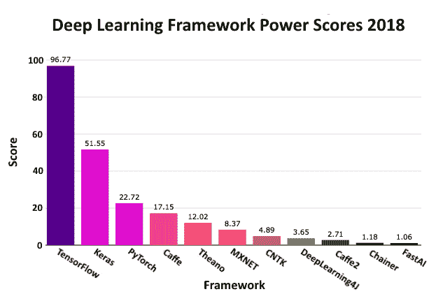
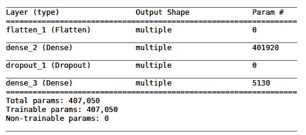
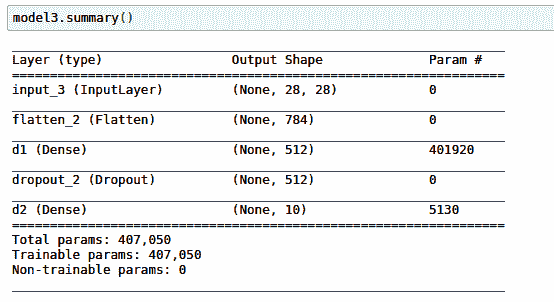

# 二、Keras：TensorFlow 2 的高级 API

在本章中，我们将讨论 Keras，这是 TensorFlow 2 的高级 API。Keras 是由 FrançoisChollet 在 Google 上开发的。 Keras 在快速原型制作，深度学习模型的构建和训练以及研究和生产方面非常受欢迎。 Keras 是一个非常丰富的 API。 正如我们将看到的，它支持急切的执行和数据管道以及其他功能。

自 2017 年以来，Keras 已可用于 TensorFlow，但随着 TensorFlow 2.0 的发布，其用途已扩展并进一步集成到 TensorFlow 中。 TensorFlow 2.0 已将 Keras 用作大多数深度学习开发工作的首选 API。

可以将 Keras 作为独立模块导入，但是在本书中，我们将集中精力在 TensorFlow 2 内部使用 Keras。因此，该模块为`tensorflow.keras`。

在本章中，我们将介绍以下主题：

*   Keras 的采用和优势
*   Keras 的特性
*   默认的 Keras 配置文件
*   Keras 后端
*   Keras 数据类型
*   Keras 模型
*   Keras 数据集

# Keras 的采用和优势

下图显示了 Keras 在工业和研究领域的广泛应用。 *PowerScore* 排名由 Jeff Hale 设计，他使用了 7 个不同类别的 11 个数据源来评估框架的使用，兴趣和受欢迎程度。 然后，他对数据进行了加权和合并，[如 2018 年 9 月的这篇文章所示](https://towardsdatascience.com/deep-learning-framework-power-scores-2018-23607ddf297a)：



Keras 具有许多优点，其中包括：

*   它专为新用户和专家而设计，提供一致且简单的 API
*   通过简单，一致的接口对用户友好，该接口针对常见用例进行了优化
*   它为用户错误提供了很好的反馈，这些错误很容易理解，并且经常伴随有用的建议
*   它是模块化且可组合的； Keras 中的模型是通过结合可配置的构建块来构建的
*   通过编写自定义构建块很容易扩展
*   无需导入 Keras，因为它可以作为`tensorflow.keras`获得

# Keras 的特性

如果您想知道 TensorFlow 随附的 Keras 版本，请使用以下命令：

```py
import tensorflow as tf
print(tf.keras.__version__)
```

在撰写本文时，这产生了以下内容（来自 TensorFlow 2 的 Alpha 版本）：

```py
2.2.4-tf
```

Keras 的其他功能包括对多 GPU 数据并行性的内置支持，以及 Keras 模型可以转化为 TensorFlow Estimators 并在 Google Cloud 上的 GPU 集群上进行训练的事实。

Keras 可能是不寻常的，因为它具有作为独立开源项目维护的参考实现，位于 [www.keras.io](http://www.keras.io) 。

尽管 TensorFlow 在`tf.keras`模块中确实具有 Keras 的完整实现，但它独立于 TensorFlow 进行维护。 默认情况下，该实现具有 TensorFlow 特定的增强功能，包括对急切执行的支持。

急切的执行意味着代码的执行是命令式编程环境，而不是基于图的环境，这是在 TensorFlow（v1.5 之前）的初始产品中工作的唯一方法。 这种命令式（即刻）风格允许直观的调试，快速的开发迭代，支持 TensorFlow `SavedModel`格式，并内置支持对 CPU，GPU 甚至 Google 自己的硬件**张量处理单元**（**TPU**）进行分布式训练。

TensorFlow 实现还支持`tf.data`，分发策略，导出模型（可通过 TensorFlow Lite 部署在移动和嵌入式设备上）以及用于表示和分类结构化数据的特征列。

# 默认的 Keras 配置文件

Linux 用户的默认配置文件如下：

```py
$HOME/.keras/keras.json
```

对于 Windows 用户，将`$HOME`替换为`%USERPROFILE%`。

它是在您第一次使用 Keras 时创建的，可以进行编辑以更改默认值。 以下是`.json`文件包含的内容：

```py
{ "image_data_format": "channels_last", "epsilon": 1e-07, "floatx": "float32", "backend": "tensorflow" }
```

默认值如下：

*   `image_data_format`：这是图像格式的字符串，`"channels_last"`或`channels_first`。 在 TensorFlow 之上运行的 Keras 使用默认值。
*   `epsilon`：这是一个浮点数，是一个*模糊*常数，用于在某些操作中避免被零除。

*   `floatx`：这是一个字符串，指定默认的浮点精度，为`"float16"`，`"float32"`或`"float64"`之一。
*   `backend`：这是一个字符串，指定 Keras 在`"tensorflow"`，`"theano"`或`"cntk"`中的一种之上发现自己的工具。

对于所有这些值，在`keras.backend`中有获取器和设置器方法。 参见[这里](https://keras.io/backend/)。

例如，在以下集合中，供 Keras 使用的浮点类型为`floatx`，其中`floatx`参数是以下命令中所示的三种精度之一：

```py
keras.backend.set_floatx(floatx)
```

# Keras 后端

由于其模型级别的库结构，Keras 可能具有处理低级操作（例如卷积，张量乘积等）的不同张量操纵引擎。 这些引擎称为**后端**。 其他后端可用； 我们在这里不考虑它们。

相同的[链接](https://keras.io/backend/)可带您使用许多`keras.backend`函数。

使用 Keras `backend`的规范方法是：

```py
from keras import backend as K
```

例如，以下是有用函数的签名：

```py
K.constant(value, dtype=None, shape=None, name=None)
```

`value`是要赋予常数的值，`dtype`是创建的张量的类型，`shape`是创建的张量的形状，`name`是可选名称。

实例如下：

```py
from tensorflow.keras import backend as K
const = K.constant([[42,24],[11,99]], dtype=tf.float16, shape=[2,2])
const
```

这将产生以下恒定张量。 注意，由于启用了急切执行，（默认情况下）在输出中给出常量的值：

```py
<tf.Tensor: id=1, shape=(2, 2), dtype=float16, numpy= array([[42., 24.], [11., 99.]], dtype=float16)>
```

急切不启用，输出将如下所示：

```py
<tf.Tensor 'Const:0' shape=(2, 2) dtype=float16>
```

# Keras 数据类型

Keras **数据类型**（`dtypes`）与 TensorFlow Python 数据类型相同，如下表所示：

| Python 类型 | 描述 |
| --- | --- |
| `tf.float16` | 16 位浮点 |
| `tf.float32` | 32 位浮点 |
| `tf.float64` | 64 位浮点 |
| `tf.int8` | 8 位有符号整数 |
| `tf.int16` | 16 位有符号整数 |
| `tf.int32` | 32 位有符号整数 |
| `tf.int64` | 64 位有符号整数 |
| `tf.uint8` | 8 位无符号整数 |
| `tf.string` | 可变长度字节数组 |
| `tf.bool` | 布尔型 |
| `tf.complex64` | 由两个 32 位浮点组成的复数-一个实部和虚部 |
| `tf.complex128` | 由两个 64 位浮点组成的复数-一个实部和一个虚部 |
| `tf.qint8` | 量化运算中使用的 8 位有符号整数 |
| `tf.qint32` | 量化运算中使用的 32 位有符号整数 |
| `tf.quint8` | 量化运算中使用的 8 位无符号整数 |

# Keras 模型

Keras 基于神经网络模型的概念。 主要模型称为**序列**，是层的线性栈。 还有一个使用 Keras 函数式 API 的系统。

# Keras 顺序模型

要构建 Keras `Sequential`模型，请*向其中添加层*，其顺序与您希望网络进行计算的顺序相同。

建立模型后，您可以*编译*； 这样可以优化要进行的计算，并且可以在其中分配优化器和希望模型使用的损失函数。

下一步是*使模型拟合数据*。 这通常称为训练模型，是所有计算发生的地方。 可以分批或一次将数据呈现给模型。

接下来，您评估模型以建立其准确率，损失和其他指标。 最后，在训练好模型之后，您可以使用它对新数据进行预测。 因此，工作流程是：构建，编译，拟合，评估，做出预测。

有两种创建`Sequential`模型的方法。 让我们看看它们中的每一个。

# 创建顺序模型的第一种方法

首先，可以将层实例列表传递给构造器，如以下示例所示。

在下一章中，我们将对层进行更多的讨论。 目前，我们将仅作足够的解释，以使您了解此处发生的情况。

采集数据。 `mnist`是手绘数字的数据集，每个数字在`28 x 28`像素的网格上。 每个单独的数据点都是一个无符号的 8 位整数（`uint8`），如标签所示：

```py
mnist = tf.keras.datasets.mnist
(train_x,train_y), (test_x, test_y) = mnist.load_data()
```

`epochs`变量存储我们将数据呈现给模型的次数：

```py
epochs=10
batch_size = 32 # 32 is default in fit method but specify anyway
```

接下来，将所有数据点（`x`）归一化为`float32`类型的浮点数范围为 0 到 1。 另外，根据需要将标签（`y`）投射到`int64`：

```py
train_x, test_x = tf.cast(train_x/255.0, tf.float32), tf.cast(test_x/255.0, tf.float32)
train_y, test_y = tf.cast(train_y,tf.int64),tf.cast(test_y,tf.int64) 
```

模型定义如下。

注意在模型定义中我们如何传递层列表：

*   `Flatten`接受`28 x 28`（即 2D）像素图像的输入，并产生 784（即 1D）向量，因为下一个（密集）层是一维的。
*   `Dense`是一个完全连接的层，意味着其所有神经元都连接到上一层和下一层中的每个神经元。 下面的示例有 512 个神经元，其输入通过 ReLU（非线性）激活函数传递。
*   `Dropout`随机关闭上一层神经元的一部分（在这种情况下为 0.2）。 这样做是为了防止任何特定的神经元变得过于专业化，并导致模型*与数据*过拟合，从而影响测试数据上模型的准确率指标（在后面的章节中将对此进行更多介绍）。
*   最后的`Dense`层具有一个称为`softmax`的特殊激活函数，该函数将概率分配给可能的 10 个输出单元中的每一个：

```py
model1 = tf.keras.models.Sequential([
 tf.keras.layers.Flatten(),
 tf.keras.layers.Dense(512,activation=tf.nn.relu),
 tf.keras.layers.Dropout(0.2),
 tf.keras.layers.Dense(10,activation=tf.nn.softmax)
])
```

`model.summary()`函数是一种有用的同义词方法，并为我们的模型提供以下输出：



`401920`的数字来自输入`28 x 28 = 784 x 512`（`dense_2`层）输出`784 * 512 = 401,408`以及每个`dense_1`层神经元的偏置单元 ，则`401,408 + 512 = 401,920`。

`5130`的数字来自`512 * 10 + 10 = 5,130`。

接下来，我们编译模型，如以下代码所示：

```py
optimiser = tf.keras.optimizers.Adam()
model1.compile (optimizer= optimiser, loss='sparse_categorical_crossentropy', metrics = ['accuracy'])
```

`optimizer`是一种方法，通过该方法可以调整模型中加权连接的权重以减少损失。

`loss`是模型所需输出与实际输出之间差异的度量，而`metrics`是我们评估模型的方式。

为了训练我们的模型，我们接下来使用`fit`方法，如下所示：

```py
model1.fit(train_x, train_y, batch_size=batch_size, epochs=epochs)
```

调用`fit()`的输出如下，显示了周期训练时间，损失和准确率：

```py
Epoch 1/10 60000/60000 [==============================] - 5s 77us/step - loss: 0.2031 - acc: 0.9394 ...
Epoch 10/10 60000/60000 [==============================] - 4s 62us/step - loss: 0.0098 - acc: 0.9967
```

最后，我们可以使用`evaluate`方法检查我们训练有素的模型的准确率：

```py
model1.evaluate(test_x, test_y)
```

这将产生以下输出：

```py
10000/10000 [==============================] - 0s 39us/step [0.09151900197149189, 0.9801]
```

这表示测试数据的损失为 0.09，准确率为 0.9801。 精度为 0.98 意味着该模型平均可以识别出 100 个测试数据点中的 98 个。

# 创建顺序模型的第二种方法

对于同一体系结构，将层列表传递给`Sequential`模型的构造器的替代方法是使用`add`方法，如下所示：

```py
model2 = tf.keras.models.Sequential();
model2.add(tf.keras.layers.Flatten())
model2.add(tf.keras.layers.Dense(512, activation='relu'))
model2.add(tf.keras.layers.Dropout(0.2))
model2.add(tf.keras.layers.Dense(10,activation=tf.nn.softmax))
model2.compile (optimizer= tf.keras.Adam(), loss='sparse_categorical_crossentropy', 
 metrics = ['accuracy'])
```

如我们所见，`fit()`方法执行训练，使用模型将输入拟合为输出：

```py
model2.fit(train_x, train_y, batch_size=batch_size, epochs=epochs)
```

然后，我们使用`test`数据评估模型的表现：

```py
model2.evaluate(test_x, test_y)
```

这给我们带来了`0.07`的损失和`0.981`的准确率。

因此，这种定义模型的方法产生的结果与第一个结果几乎相同，这是可以预期的，因为它是相同的体系结构，尽管表达方式略有不同，但具有相同的`optimizer`和`loss`函数。 现在让我们看一下函数式 API。

# Keras 函数式 API

与以前看到的`Sequential`模型的简单线性栈相比，函数式 API 使您可以构建更复杂的体系结构。 它还支持更高级的模型。 这些模型包括多输入和多输出模型，具有共享层的模型以及具有剩余连接的模型。

这是函数式 API 的使用的简短示例，其架构与前两个相同。

设置代码与先前演示的相同：

```py
import tensorflow as tf
mnist = tf.keras.datasets.mnist
(train_x,train_y), (test_x, test_y) = mnist.load_data()
train_x, test_x = train_x/255.0, test_x/255.0
epochs=10
```

这是模型定义。

注意如何在`tensor`上调用层并返回张量作为输出，然后如何使用这些输入和输出张量来定义模型：

```py
inputs = tf.keras.Input(shape=(28,28)) # Returns a 'placeholder' tensor
x = tf.keras.layers.Flatten()(inputs)
x = tf.layers.Dense(512, activation='relu',name='d1')(x)
x = tf.keras.layers.Dropout(0.2)(x)
predictions = tf.keras.layers.Dense(10,activation=tf.nn.softmax, name='d2')(x)

model3 = tf.keras.Model(inputs=inputs, outputs=predictions)
```

请注意，此代码如何产生与`model1`和`model2`相同的体系结构：



`None`出现在这里是因为我们没有指定我们有多少输入项（即批量大小）。 这确实意味着*未提供*。

其余代码与前面的示例相同：

```py
optimiser = tf.keras.optimizers.Adam()
model3.compile (optimizer= optimiser, loss='sparse_categorical_crossentropy', metrics = ['accuracy'])

model3.fit(train_x, train_y, batch_size=32, epochs=epochs)

model3.evaluate(test_x, test_y)
```

对于相同的体系结构，这同样会产生`0.067`的损失和`0.982`的精度。

接下来，让我们看看如何对 Keras `model`类进行子类化。

# 子类化 Keras 模型类

Keras `Model`类可以被子类化，如下面的代码所示。 Google 指出，*纯*函数风格（如前面的示例所示）比子类风格更可取（我们在此包括其内容是出于完整性的考虑，因为它很有趣）。

首先，请注意如何在构造器（`.__init__()`）中分别声明和命名层。

然后，注意在`call()`方法中各层如何以函数风格链接在一起。 此方法封装了*前向传播*：

```py
class MyModel(tf.keras.Model):
 def __init__(self, num_classes=10):
  super(MyModel, self).__init__()
 # Define your layers here.
   inputs = tf.keras.Input(shape=(28,28)) # Returns a placeholder tensor
   self.x0 = tf.keras.layers.Flatten()
   self.x1 = tf.keras.layers.Dense(512, activation='relu',name='d1')
   self.x2 = tf.keras.layers.Dropout(0.2)
   self.predictions = tf.keras.layers.Dense(10,activation=tf.nn.softmax, name='d2')

 def call(self, inputs):
 # This is where to define your forward pass
 # using the layers previously defined in `__init__`
   x = self.x0(inputs)
   x = self.x1(x)
   x = self.x2(x) 
   return self.predictions(x)

model4 = MyModel()
```

该定义可以代替本章中的任何较早的模型定义使用，它们具有相同的数据下载支持代码，以及相似的用于训练/评估的代码。 下面的代码显示了最后一个示例：

```py
model4 = MyModel()
batch_size = 32
steps_per_epoch = len(train_x.numpy())//batch_size
print(steps_per_epoch)

model4.compile (optimizer= tf.keras.Adam(), loss='sparse_categorical_crossentropy', 
 metrics = ['accuracy'])

model4.fit(train_x, train_y, batch_size=batch_size, epochs=epochs)

 model4.evaluate(test_x, test_y)
```

结果是`0.068`的损失，准确率为`0.982`； 再次与本章中其他三种模型构建风格产生的结果几乎相同。

# 使用数据管道

也可以使用以下代码将数据作为`tf.data.Dataset()`迭代器传递到`fit`方法中（数据获取代码与先前描述的相同）。 `from_tensor_slices()`方法将 NumPy 数组转换为数据集。 注意`batch()`和`shuffle()`方法链接在一起。 接下来，`map()`方法在输入图像`x`上调用一种方法，该方法在`y`轴上随机翻转其中的两个，有效地增加了图像集的大小。 标签`y`在这里保持不变。 最后，`repeat()`方法意味着在到达数据集的末尾（连续）时，将从头开始重新填充该数据集：

```py
batch_size = 32
buffer_size = 10000

train_dataset = tf.data.Dataset.from_tensor_slices((train_x, train_y)).batch(32).shuffle(10000)

train_dataset = train_dataset.map(lambda x, y: (tf.image.random_flip_left_right(x), y))
train_dataset = train_dataset.repeat()

```

`test`设置的代码类似，除了不进行翻转：

```py
test_dataset = tf.data.Dataset.from_tensor_slices((test_x, test_y)).batch(batch_size).shuffle(10000)

test_dataset = train_dataset.repeat()
```

现在，在`fit()`函数中，我们可以直接传递数据集，如下所示：

```py
steps_per_epoch = len(train_x)//batch_size # required because of the repeat on the dataset
optimiser = tf.keras.optimizers.Adam()
model5.compile (optimizer= optimiser, loss='sparse_categorical_crossentropy', metrics = ['accuracy'])
model.fit(train_dataset, batch_size=batch_size, epochs=epochs, steps_per_epoch=steps_per_epoch)
```

编译和评估代码与之前看到的类似。

使用`data.Dataset`迭代器的优点在于，管道可以处理通常用于准备数据的大部分管道，例如批量和改组。 我们也已经看到，各种操作可以链接在一起。

# 保存和加载 Keras 模型

TensorFlow 中的 Keras API 具有轻松保存和恢复模型的能力。 这样做如下，并将模型保存在当前目录中。 当然，这里可以通过更长的路径：

```py
model.save('./model_name.h5')
```

这将保存模型体系结构，权重，训练状态（`loss`，`optimizer`）和优化器的状态，以便您可以从上次中断的地方继续训练模型。

加载保存的模型的步骤如下。 请注意，如果您已经编译了模型，那么负载将使用保存的训练配置来编译模型：

```py
from tensorflow.keras.models import load_model
new_model = load_model('./model_name.h5')
```

也可以仅保存模型权重并以此加载它们（在这种情况下，必须构建体系结构以将权重加载到其中）：

```py
model.save_weights('./model_weights.h5')
```

然后使用以下内容加载它：

```py
model.load_weights('./model_weights.h5')
```

# Keras 数据集

可从 Keras 中获得以下数据集：`boston_housing`，`cifar10`，`cifar100`，`fashion_mnist`，`imdb`，`mnist`和`reuters`。

它们都可以通过`load_data()`函数访问。 例如，要加载`fashion_mnist`数据集，请使用以下命令：

```py
(x_train, y_train), (x_test, y_test) = tf.keras.datasets.fashion_mnist.load_data()
```

可以在[这个页面](https://www.tensorflow.org/versions/r2.0/api_docs/python/tf/keras/datasets/)中找到更多详细信息。

# 总结

在本章中，我们使用通用注释和见解探索了 Keras API，然后以四种不同的方式表示相同的基本体系结构，以训练`mnist`数据集。

在下一章中，我们将通过探索许多监督的学习场景，包括线性回归，逻辑回归和 K 近邻，开始认真使用 TensorFlow。