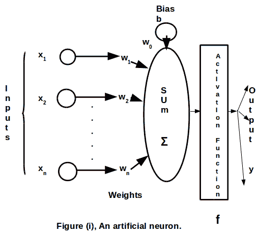
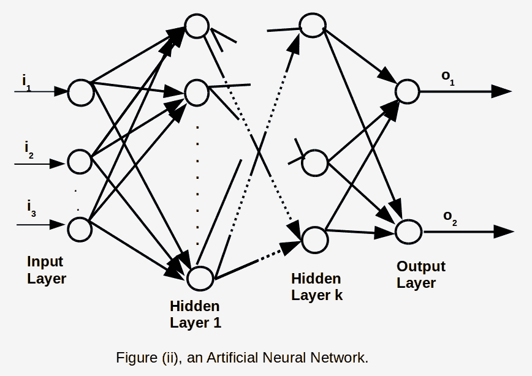
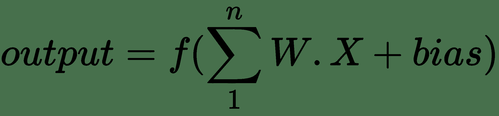
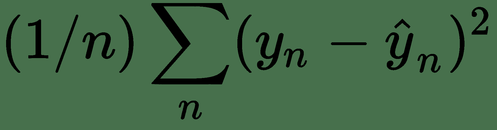

# 三、TensorFlow 2 和 ANN 技术

在本章中，我们将讨论并举例说明 TensorFlow 2 的那些部分，这些部分对于构建，训练和评估人工神经网络及其推理的利用目的是必需的。 最初，我们不会提供完整的申请。 相反，在将所有概念和技术放在一起并在随后的章节中介绍完整的模型之前，我们将重点关注它们。

在本章中，我们将介绍以下主题：

*   将数据呈现给**人工神经网络**（**ANN**）
*   神经网络层
*   梯度下降算法的梯度计算
*   损失函数

# 将数据呈现给人工神经网络

Google 推荐的将数据呈现给 TensorFlow ANN 的规范方法是通过由`tf.data.Dataset`对象和`tf.data.Iterator`方法组成的数据管道。 `tf.data.Dataset`对象由一系列元素组成，其中每个元素包含一个或多个张量对象。 `tf.data.Iterator`是一种用于遍历数据集以便可以访问其中的连续单个元素的方法。

我们将研究构建数据管道的两种重要方法，首先是从内存中的 **NumPy** 数组，其次是从**逗号分隔值**（**CSV**）文件。 我们还将研究二进制 TFRecord 格式。

# 将 NumPy 数组与数据集结合使用

首先让我们看一些简单的例子。 这是一个 NumPy 数组：

```py
import tensorflow as tf
import numpy as np 

num_items = 11
num_list1 = np.arange(num_items)
num_list2 = np.arange(num_items,num_items*2)
```

这是使用`from_tensor_slices()`方法创建数据集的方法：

```py
num_list1_dataset = tf.data.Dataset.from_tensor_slices(num_list1)
```

这是使用`make_one_shot_iterator()`方法在其上创建`iterator`的方法：

```py
iterator = tf.compat.v1.data.make_one_shot_iterator(num_list1_dataset)
```

这是使用`get_next`方法将它们一起使用的方法：

```py
for item in num_list1_dataset:
    num = iterator1.get_next().numpy()
    print(num)
```

请注意，由于我们使用的是**单次**迭代器，因此在同一程序运行中两次执行此代码会引发错误。

也可以使用`batch`方法批量访问数据。 请注意，第一个参数是每个批次中要放置的元素数，第二个参数是不言自明的`drop_remainder`参数：

```py
num_list1_dataset = tf.data.Dataset.from_tensor_slices(num_list1).batch(3, drop_remainder = False)
iterator = tf.compat.v1.data.make_one_shot_iterator(num_list1_dataset)
for item in num_list1_dataset:
    num = iterator.get_next().numpy()
    print(num)
```

还有一种`zip`方法，可用于一起显示特征和标签：

```py
dataset1 = [1,2,3,4,5]
dataset2 = ['a','e','i','o','u']
dataset1 = tf.data.Dataset.from_tensor_slices(dataset1)
dataset2 = tf.data.Dataset.from_tensor_slices(dataset2)
zipped_datasets = tf.data.Dataset.zip((dataset1, dataset2))
iterator = tf.compat.v1.data.make_one_shot_iterator(zipped_datasets)
for item in zipped_datasets:
    num = iterator.get_next()
    print(num)
```

我们可以使用`concatenate`方法如下连接两个数据集：

```py
ds1 = tf.data.Dataset.from_tensor_slices([1,2,3,5,7,11,13,17])
ds2 = tf.data.Dataset.from_tensor_slices([19,23,29,31,37,41])
ds3 = ds1.concatenate(ds2)
print(ds3)
iterator = tf.compat.v1.data.make_one_shot_iterator(ds3)
for i in range(14):
  num = iterator.get_next()
  print(num)
```

我们还可以完全取消迭代器，如下所示：

```py
epochs=2
for e in range(epochs):
  for item in ds3:
    print(item)
```

请注意，此处的外部循环不会引发错误，因此在大多数情况下将是首选方法。

# 将逗号分隔值（CSV）文件与数据集一起使用

CSV 文件是一种非常流行的数据存储方法。 TensorFlow 2 包含灵活的方法来处理它们。 这里的主要方法是`tf.data.experimental.CsvDataset`。

# CSV 示例 1

使用以下参数，我们的数据集将由`filename`文件每一行中的两项组成，均为浮点类型，忽略文件的第一行，并使用第 1 列和第 2 列（当然，列编号为 ，从 0 开始）：

```py
filename = ["./size_1000.csv"]
record_defaults = [tf.float32] * 2 # two required float columns
dataset = tf.data.experimental.CsvDataset(filename, record_defaults, header=True, select_cols=[1,2])
for item in dataset:
  print(item)
```

# CSV 示例 2

在此示例中，使用以下参数，我们的数据集将包含一个必需的浮点数，一个默认值为`0.0`的可选浮点和一个`int`，其中 CSV 文件中没有标题，而只有列 1 ，2 和 3 被导入：

```py
#file Chapter_2.ipynb
filename = "mycsvfile.txt"
record_defaults = [tf.float32, tf.constant([0.0], dtype=tf.float32), tf.int32,]
dataset = tf.data.experimental.CsvDataset(filename, record_defaults, header=False, select_cols=[1,2,3])
for item in dataset:
  print(item)
```

# CSV 示例 3

对于最后一个示例，我们的`dataset`将由两个必需的浮点数和一个必需的字符串组成，其中 CSV 文件具有`header`变量：

```py
filename = "file1.txt"
record_defaults = [tf.float32, tf.float32, tf.string ,]
dataset = tf.data.experimental.CsvDataset(filename, record_defaults, header=False)
or item in dataset:
    print(item[0].numpy(), item[1].numpy(),item[2].numpy().decode() ) 
# decode as string is in binary format.
```

# TFRecord

另一种流行的存储数据选择是 TFRecord 格式。 这是一个二进制文件格式。 对于大文件，这是一个不错的选择，因为二进制文件占用的磁盘空间更少，复制所需的时间更少，并且可以非常有效地从磁盘读取。 所有这些都会对数据管道的效率以及模型的训练时间产生重大影响。 该格式还以多种方式与 TensorFlow 一起进行了优化。 这有点复杂，因为在存储之前必须将数据转换为二进制格式，并在回读时将其解码。

# TFRecord 示例 1

我们在此处显示的第一个示例将演示该技术的基本内容。 （文件为`TFRecords.ipynb`）。

由于 TFRecord 文件是二进制字符串序列，因此必须在保存之前指定其结构，以便可以正确地写入并随后回读。 TensorFlow 为此具有两个结构，即`tf.train.Example`和`tf.train.SequenceExample`。 您要做的是将每个数据样本存储在这些结构之一中，然后对其进行序列化，然后使用`tf.python_io.TFRecordWriter`将其保存到磁盘。

在下面的示例中，浮点数组`data`被转换为二进制格式，然后保存到磁盘。 `feature`是一个字典，包含在序列化和保存之前传递给`tf.train.Example`的数据。 “TFRecord 示例 2”中显示了更详细的示例：

TFRecords 支持的字节数据类型为`FloatList`，`Int64List`和`BytesList`。

```py
# file: TFRecords.ipynb
import tensorflow as tf
import numpy as np

data=np.array([10.,11.,12.,13.,14.,15.])

def npy_to_tfrecords(fname,data):
    writer = tf.io.TFRecordWriter(fname)
    feature={}
    feature['data'] = tf.train.Feature(float_list=tf.train.FloatList(value=data))
    example = tf.train.Example(features=tf.train.Features(feature=feature))
    serialized = example.SerializeToString()
    writer.write(serialized)
    writer.close()

npy_to_tfrecords("./myfile.tfrecords",data)
```

读回记录的代码如下。 构造了`parse_function`函数，该函数对从文件读回的数据集进行解码。 这需要一个字典（`keys_to_features`），其名称和结构与保存的数据相同：

```py
dataset = tf.data.TFRecordDataset("./myfile.tfrecords")

def parse_function(example_proto):
 keys_to_features = {'data':tf.io.FixedLenSequenceFeature([], dtype = tf.float32, allow_missing = True) }
    parsed_features = tf.io.parse_single_example(serialized=example_proto, features=keys_to_features)
    return parsed_features['data']

dataset = dataset.map(parse_function)
iterator = tf.compat.v1.data.make_one_shot_iterator(dataset)
# array is retrieved as one item
item = iterator.get_next()
print(item)
print(item.numpy())
print(item[2].numpy())
```

# TFRecord 示例 2

在这个例子中，我们看一下这个字典给出的更复杂的记录结构：

```py
filename = './students.tfrecords'
data = {
            'ID': 61553,
            'Name': ['Jones', 'Felicity'],
            'Scores': [45.6, 97.2] 
        }
```

使用此方法，我们可以再次使用`Feature()`方法构造一个`tf.train.Example`类。 注意我们如何编码字符串：

```py
ID = tf.train.Feature(int64_list=tf.train.Int64List(value=[data['ID']]))

Name = tf.train.Feature(bytes_list=tf.train.BytesList(value=[n.encode('utf-8') for n in data['Name']]))

Scores = tf.train.Feature(float_list=tf.train.FloatList(value=data['Scores']))

example = tf.train.Example(features=tf.train.Features(feature={'ID': ID, 'Name': Name, 'Scores': Scores }))
```

将此记录串行化并将其写入光盘与“TFRecord 示例 1”相同：

```py
writer = tf.io.TFRecordWriter(filename)
writer.write(example.SerializeToString())
writer.close()
```

为了回读这一点，我们只需要构造我们的`parse_function`函数即可反映记录的结构：

```py
dataset = tf.data.TFRecordDataset("./students.tfrecords")

def parse_function(example_proto):
    keys_to_features = {'ID':tf.io.FixedLenFeature([], dtype = tf.int64),
                       'Name':tf.io.VarLenFeature(dtype = tf.string),
                        'Scores':tf.io.VarLenFeature(dtype = tf.float32)
                       }
    parsed_features = tf.io.parse_single_example(serialized=example_proto, features=keys_to_features)
    return parsed_features["ID"], parsed_features["Name"],parsed_features["Scores"]
```

下一步与之前相同：

```py
dataset = dataset.map(parse_function)

iterator = tf.compat.v1.data.make_one_shot_iterator(dataset)
item = iterator.get_next()
# record is retrieved as one item
print(item)
```

输出如下：

```py
(<tf.Tensor: id=264, shape=(), dtype=int64, numpy=61553>, <tensorflow.python.framework.sparse_tensor.SparseTensor object at 0x7f1bfc7567b8>, <tensorflow.python.framework.sparse_tensor.SparseTensor object at 0x7f1bfc771e80>)
```

现在我们可以从`item`中提取数据（注意，必须解码（从字节开始）字符串，其中 Python 3 的默认值为`utf8`）。 还要注意，字符串和浮点数数组将作为稀疏数组返回，并且要从记录中提取它们，我们使用稀疏数组`value`方法：

```py
print("ID: ",item[0].numpy())
name = item[1].values.numpy()
name1= name[0].decode()returned
name2 = name[1].decode('utf8')
print("Name:",name1,",",name2)
print("Scores: ",item[2].values.numpy())
```

# 单热编码

**单热编码**（**OHE**）是根据数据标签构造张量的方法，在每个标签中，与标签值相对应的每个元素中的数字为 1，其他地方为 0； 也就是说，张量中的位之一是热的（1）。

# OHE 示例 1

在此示例中，我们使用`tf.one_hot()`方法将十进制值`5`转换为一个单编码的值`0000100000`：

```py
y = 5
y_train_ohe = tf.one_hot(y, depth=10).numpy() 
print(y, "is ",y_train_ohe,"when one-hot encoded with a depth of 10")
# 5 is 00000100000 when one-hot encoded with a depth of 10
```

# OHE 示例 2

在下面的示例中，还使用从时尚 MNIST 数据集导入的示例代码很好地展示了这一点。

原始标签是从 0 到 9 的整数，因此，例如`2`的标签在进行一次热编码时变为`0010000000`，但请注意索引与该索引处存储的标签之间的区别：

```py
import tensorflow as tf
from tensorflow.python.keras.datasets import fashion_mnist
tf.enable_eager_execution()
width, height, = 28,28
n_classes = 10

# load the dataset
(x_train, y_train), (x_test, y_test) = fashion_mnist.load_data()
split = 50000
#split feature training set into training and validation sets
(y_train, y_valid) = y_train[:split], y_train[split:]

# one-hot encode the labels using TensorFlow. 
# then convert back to numpy for display 
y_train_ohe = tf.one_hot(y_train, depth=n_classes).numpy() 
y_valid_ohe = tf.one_hot(y_valid, depth=n_classes).numpy()
y_test_ohe = tf.one_hot(y_test, depth=n_classes).numpy()

# show difference between the original label and a one-hot-encoded label

i=5
print(y_train[i]) # 'ordinary' number value of label at index i=5 is 2
# 2
# note the difference between the *index* of 5 and the *label* at that index which is 2
print(y_train_ohe[i]) # 
# 0\. 0\. 1\. 0\. 0.0 .0 .0\. 0\. 0.
```

接下来，我们将检查神经网络的基本数据结构：神经元的**层**。

# 层

ANN 使用的基本数据结构是**层**，许多相互连接的层构成了一个完整的 ANN。 可以将一层设想为神经元的数组，尽管使用单词*神经元*可能会产生误导，因为在人脑神经元和构成一层的人工神经元之间只有很少的对应关系。 记住这一点，我们将在下面使用术语*神经元*。 与任何计算机处理单元一样，神经元的特征在于其输入和输出。 通常，神经元具有许多输入和一个输出值。 每个输入连接均带有权重`w[i]`。

下图显示了一个神经元。 重要的是要注意，激活函数`f`对于平凡的 ANN 而言是非线性的。 网络中的一般神经元接收来自其他神经元的输入，并且每个神经元的权重为`w[i]`，如图所示，网络*通过调整这些权重来学习权重*，以便输入生成所需的输出：



图 1：人工神经元

通过将输入乘以权重，将偏差乘以其权重相加，然后应用激活函数，可以得出神经元的输出（请参见下图）。

下图显示了如何配置各个人工神经元和层以创建 ANN：



图 2：人工神经网络

层的输出由以下公式给出：



在此， `W`是输入的权重， `X`是输入向量， `f`是非线性激活函数。

层的类型很多，支持大量的 ANN 模型结构。 可以在[这个页面](https://www.tensorflow.org/api_docs/python/tf/keras/layers)中找到非常全面的列表。

在这里，我们将研究一些更流行的方法，以及 TensorFlow 如何实现它们。

# 密集（完全连接）层

**密集层**是完全连接的层。 这意味着上一层中的所有神经元都连接到下一层中的所有神经元。 在密集的网络中，所有层都是密集的。 （如果网络具有三个或更多隐藏层，则称为**深度网络**）。

`layer = tf.keras.layers.Dense(n)`行构成了一个密集层，其中`n`是输出单元的数量。

注意，密集层是一维的。 请参考“模型”的部分。

# 卷积层

**卷积层**是一层，其中层中的神经元通过使用通常为正方形的过滤器分组为小块，并通过在该层上滑动过滤器来创建。 每个色块由*卷积*，即乘以滤波器并相加。 简而言之，**卷积网**或 **ConvNets** 已经证明自己非常擅长图像识别和处理。

对于图像，卷积层具有部分签名`tf.keras.layers.Conv2D(filters, kernel_size, strides=1, padding='valid')`。

因此，在下面的示例中，该第一层具有一个大小为`(1, 1)`的过滤器，并且其填充`'valid'`。 其他填充可能性是`'same'`。

区别在于，使用`'same'`填充，必须在外部填充该层（通常用零填充），以便在卷积发生后，输出大小与该层大小相同。 如果使用`'valid'`填充，则不会进行填充，并且如果跨度和内核大小的组合不能完全适合该层，则该层将被截断。 输出大小小于正在卷积的层：

```py
seqtial_Net = tf.keras.Sequential([tf.keras.layers.Conv2D(   1, (1, 1), strides = 1, padding='valid')
```

# 最大池化层

当窗口在层上滑动时，**最大池化层**在其窗口内取最大值，这与卷积发生的方式几乎相同。

空间数据（即图像）的最大池签名如下：

```py
tf.keras.layers.MaxPooling2D(pool_size=(2, 2), strides=None, padding='valid', data_format=None)
```

因此，要使用默认值，您只需拥有以下内容：

```py
layer = tf.keras.maxPooling2D()
```

# 批量归一化层和丢弃层

**批量归一化**是一个接受输入并输出相同数量的输出的层，其中激活的平均值和单位方差为零，因为这对学习有益。 批量标准化规范了激活，使它们既不会变得很小也不会爆炸性地变大，这两种情况都阻止了网络的学习。

`BatchNormalization`层的签名如下：

```py
tf.keras.layers.BatchNormalization(axis=-1, momentum=0.99, epsilon=0.001, center=True, scale=True, beta_initializer='zeros', gamma_initializer='ones', moving_mean_initializer='zeros', moving_variance_initializer='ones', beta_regularizer=None, gamma_regularizer=None, beta_constraint=None, gamma_constraint=None)
```

因此，要使用默认值，只需使用以下命令：

```py
layer = tf.keras.layers.BatchNormalization()
```

**丢弃层**是其中一定百分比的神经元在训练过程中（而不是在推理过程中）随机关闭的层。 由于不鼓励单个神经元对其输入进行专门化，因此这迫使网络在泛化方面变得更好。

`Dropout`层的签名如下：

```py
tf.keras.layers.Dropout(rate, noise_shape=None, seed=None)
```

`rate`参数是神经元被关闭的部分。

因此，要使用它，例如，您需要：

```py
layer = tf.keras.layers.Dropout(rate = 0.5)
```

随机选择的 50% 的神经元将被关闭。

# Softmax 层

**softmax 层**是其中每个输出单元的激活对应于输出单元与给定标签匹配的概率的层。 因此，具有最高激活值的输出神经元是网络的预测。 当要学习的类互斥时使用此函数，以使 softmax 层输出的概率总计为 1。

它被实现为在密集层上的激活。

因此，例如，我们有以下内容：

```py
model2.add(tf.keras.layers.Dense(10,activation=tf.nn.softmax))
```

这将添加具有 10 个神经元的密集 softmax 层，其中神经元的激活总数为 1。

接下来，我们将进一步讨论激活函数。

# 激活函数

重要的是要注意，神经网络具有非线性激活函数，即应用于神经元加权输入之和的函数。 除了平凡的神经网络模型外，线性激活单元无法将输入层映射到输出层。

有许多常用的激活函数，包括 Sigmoid，tanh，ReLU 和泄漏的 ReLU。 一个很好的总结，以及这些函数的图表，[可以在这里找到](https://towardsdatascience.com/activation-functions-neural-networks-1cbd9f8d91d6)。

# 建立模型

使用 Keras 创建 ANN 模型的方法有四种：

*   **方法 1** ：参数已传递给`tf.keras.Sequential`
*   **方法 2** ：使用`tf.keras.Sequential`的`.add`方法
*   **方法 3** ：使用 Keras 函数式 API
*   **方法 4** ：通过将`tf.keras.Model`对象子类化

有关这四种方法的详细信息，请参考第 2 章“TensorFlow 2 的高级 API，Keras”。

# 梯度下降算法的梯度计算

TenorFlow 的一大优势是它能够自动计算梯度以用于梯度下降算法，这当然是大多数机器学习模型的重要组成部分。 TensorFlow 提供了许多用于梯度计算的方法。

启用急切执行时，有四种自动计算梯度的方法（它们也适用于图模式）：

1.  `tf.GradientTape`：上下文记录了计算，因此您可以调用`tf.gradient()`来获取记录时针对任何可训练变量计算的任何张量的梯度
2.  `tfe.gradients_function()`：采用一个函数（例如`f()`）并返回一个梯度函数（例如`fg()`），该函数可以计算`f()`的输出相对于`f()`或其部分参数的梯度
3.  `tfe.implicit_gradients()`：这非常相似，但是`fg()`会针对这些输出所依赖的所有可训练变量计算`f()`输出的梯度
4.  `tfe.implicit_value_and_gradients()`：几乎相同，但`fg()`也返回函数`f()`的输出

我们将看看其中最流行的`tf.GradientTape`。 同样，在其上下文中，随着计算的进行，对这些计算进行记录（录音），以便可以使用`tf.gradient()`重放磁带，并实现适当的自动微分。

在以下代码中，当计算`sum`方法时，磁带将在`tf.GradientTape()`上下文中记录计算结果，以便可以通过调用`tape.gradient()`找到自动微分。

注意在`[weight1_grad] = tape.gradient(sum, [weight1])`中的此示例中如何使用列表。

默认情况下，仅可以调用`tape.gradient()`：

```py
# by default, you can only call tape.gradient once in a GradientTape context
weight1 = tf.Variable(2.0)
def weighted_sum(x1):
   return weight1 * x1
with tf.GradientTape() as tape:
   sum = weighted_sum(7.)
   [weight1_grad] = tape.gradient(sum, [weight1])
print(weight1_grad.numpy()) # 7 , weight1*x diff w.r.t. weight1 is x, 7.0, also see below.
```

在下一个示例中，请注意，参数`persistent=True`已传递给`tf.GradientTape()`。 这使我们可以多次调用`tape.gradient()`。 同样，我们在`tf.GradientTape`上下文中计算一个加权和，然后调用`tape.gradient()`来计算每项相对于`weight`变量的导数：

```py
# if you need to call tape.gradient() more than once
# use GradientTape(persistent=True) 
weight1 = tf.Variable(2.0)
weight2 = tf.Variable(3.0)
weight3 = tf.Variable(5.0)

def weighted_sum(x1, x2, x3):
    return weight1*x1 + weight2*x2 + weight3*x3

with tf.GradientTape(persistent=True) as tape:
   sum = weighted_sum(7.,5.,6.)

[weight1_grad] = tape.gradient(sum, [weight1])
[weight2_grad] = tape.gradient(sum, [weight2])
[weight3_grad] = tape.gradient(sum, [weight3])

print(weight1_grad.numpy()) #7.0
print(weight2_grad.numpy()) #5.0
print(weight3_grad.numpy()) #6.0
```

接下来，我们将研究损失函数。 这些是在训练神经网络模型期间优化的函数。

# 损失函数

`loss`函数（即，误差测量）是训练 ANN 的必要部分。 它是网络在训练期间计算出的输出与其所需输出的差异程度的度量。 通过微分`loss`函数，我们可以找到一个量，通过该量可以调整各层之间的连接权重，以使 ANN 的计算输出与所需输出更紧密匹配。

最简单的`loss`函数是均方误差：

，

在此， `y`是实际标签值，`y_hat`是预测标签值。

特别值得注意的是分类交叉熵`loss`函数，它由以下方程式给出：


当所有可能的类别中只有一类正确时，使用`loss`函数；当`softmax`函数用作 ANN 的最后一层的输出时，将使用此`loss`函数。

请注意，这两个函数可以很好地微分，这是反向传播所要求的。

# 总结

在本章中，我们研究了许多支持神经网络创建和使用的技术。

我们涵盖了到 ANN 的数据表示，ANN 的各层，创建模型，梯度下降算法的梯度计算，损失函数以及保存和恢复模型的内容。 这些主题是在开发神经网络模型时将在后续章节中遇到的概念和技术的重要前提。

确实，在下一章中，我们将通过探索许多监督的学习场景，包括线性回归，逻辑回归和 K 近邻，来认真地使用 TensorFlow。