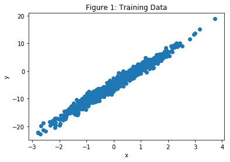
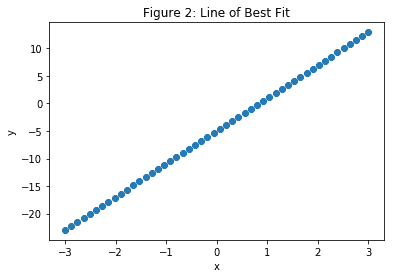
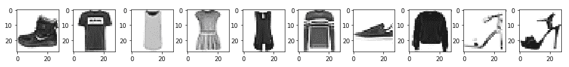
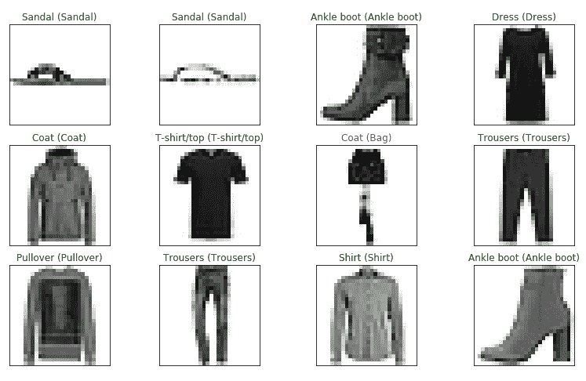

# 四、TensorFlow 2 和监督机器学习

在本章中，我们将讨论并举例说明 TensorFlow 2 在以下情况下的监督机器学习问题中的使用：线性回归，逻辑回归和 **K 最近邻**（**KNN**） 。

在本章中，我们将研究以下主题：

*   监督学习
*   线性回归
*   我们的第一个线性回归示例
*   波士顿住房数据集
*   逻辑回归（分类）
*   **K 最近邻**（**KNN**）

# 监督学习

监督学习是一种机器学习场景，其中一组数据点中的一个或多个数据点与标签关联。 然后，模型*学习*，以预测看不见的数据点的标签。 为了我们的目的，每个数据点通常都是张量，并与一个标签关联。 在计算机视觉中，有很多受监督的学习问题； 例如，算法显示了许多成熟和未成熟的西红柿的图片，以及表明它们是否成熟的分类标签，并且在训练结束后，该模型能够根据训练集预测未成熟的西红柿的状态。 这可能在番茄的物理分拣机制中有非常直接的应用。 或一种算法，该算法可以在显示许多示例以及它们的性别和年龄之后，学会预测新面孔的性别和年龄。 此外，如果模型已经在许多树图像及其类型标签上进行了训练，则可以学习根据树图像来预测树的类型可能是有益的。

# 线性回归

线性回归问题是在给定一个或多个其他变量（数据点）的值的情况下，您必须预测一个*连续*变量的值的问题。 例如，根据房屋的占地面积，预测房屋的售价。 在这些示例中，您可以将已知特征及其关联的标签绘制在简单的线性图上，如熟悉的`x, y`散点图，并绘制最适合数据的线 。 这就是最适合的**系列**。 然后，您可以读取对应于该图的`x`范围内的任何特征值的标签。

但是，线性回归问题可能涉及几个特征，其中使用了术语**多个**或**多元线性回归**。 在这种情况下，不是最适合数据的线，而是一个平面（两个特征）或一个超平面（两个以上特征）。 在房价示例中，我们可以将房间数量和花园的长度添加到特征中。 有一个著名的数据集，称为波士顿住房数据集，[涉及 13 个特征](https://www.kaggle.com/c/ml210-boston)。 考虑到这 13 个特征，此处的回归问题是预测波士顿郊区的房屋中位数。

术语：特征也称为预测变量或自变量。 标签也称为响应变量或因变量。

# 我们的第一个线性回归示例

我们将从一个简单的，人为的，线性回归问题开始设置场景。 在此问题中，我们构建了一个人工数据集，首先在其中创建，因此知道了我们要拟合的线，但是随后我们将使用 TensorFlow 查找这条线。

我们执行以下操作-在导入和初始化之后，我们进入一个循环。 在此循环内，我们计算总损失（定义为点的数据集`y`的均方误差）。 然后，我们根据我们的权重和偏置来得出这种损失的导数。 这将产生可用于调整权重和偏差以降低损失的值； 这就是所谓的梯度下降。 通过多次重复此循环（技术上称为**周期**），我们可以将损失降低到尽可能低的程度，并且可以使用训练有素的模型进行预测。

首先，我们导入所需的模块（回想一下，急切执行是默认的）：

```py
 import tensorflow as tf
 import numpy as np
```

接下来，我们初始化重要的常量，如下所示：

```py
n_examples = 1000 # number of training examples
training_steps = 1000 # number of steps we are going to train for
display_step = 100 # after multiples of this, we display the loss
learning_rate = 0.01 # multiplying factor on gradients
m, c = 6, -5 # gradient and y-intercept of our line, edit these for a different linear problem
```

给定`weight`和`bias`（`m`和`c`）的函数，用于计算预测的`y`：

```py
def train_data(n, m, c):
    x = tf.random.normal([n]) # n values taken from a normal distribution,
    noise = tf.random.normal([n])# n values taken from a normal distribution
    y = m*x + c + noise # our scatter plot
    return x, y
def prediction(x, weight, bias):
    return weight*x + bias # our predicted (learned) m and c, expression is like y = m*x + c
```

用于获取初始或预测的权重和偏差并根据`y`计算均方损失（偏差）的函数：

```py
def loss(x, y, weights, biases): 
    error = prediction(x, weights, biases) - y # how 'wrong' our predicted (learned) y is
    squared_error = tf.square(error)
    return tf.reduce_mean(input_tensor=squared_error) # overall mean of squared error, scalar value.
```

这就是 TensorFlow 发挥作用的地方。 使用名为`GradientTape()`的类，我们可以编写一个函数来计算相对于`weights`和`bias`的损失的导数（梯度）：

```py
def grad(x, y, weights, biases):
    with tf.GradientTape() as tape:
         loss_ = loss(x, y, weights, biases)
    return tape.gradient(loss, [weights, bias]) # direction and value of the gradient of our weights and biases
```

为训练循环设置回归器，并显示初始损失，如下所示：

```py
x, y = train_data(n_examples,m,c) # our training values x and y
plt.scatter(x,y)
plt.xlabel("x")
plt.ylabel("y")
plt.title("Figure 1: Training Data")
W = tf.Variable(np.random.randn()) # initial, random, value for predicted weight (m)
B = tf.Variable(np.random.randn()) # initial, random, value for predicted bias (c)

print("Initial loss: {:.3f}".format(loss(x, y, W, B)))
```

输出如下所示：



接下来，我们的主要训练循环。 这里的想法是根据我们的`learning_rate`来少量调整`weights`和`bias`，以将损失依次降低到我们最适合的线上收敛的点：

```py
for step in range(training_steps): #iterate for each training step
     deltaW, deltaB = grad(x, y, W, B) # direction(sign) and value of the gradients of our loss 
   # with respect to our weights and bias
     change_W = deltaW * learning_rate # adjustment amount for weight
     change_B = deltaB * learning_rate # adjustment amount for bias
     W.assign_sub(change_W) # subract change_W from W
     B.assign_sub(change_B) # subract change_B from B
     if step==0 or step % display_step == 0:

   # print(deltaW.numpy(), deltaB.numpy()) # uncomment if you want to see the gradients

  print("Loss at step {:02d}: {:.6f}".format(step, loss(x, y, W, B)))
```

最终结果如下：

```py
print("Final loss: {:.3f}".format(loss(x, y, W, B)))
print("W = {}, B = {}".format(W.numpy(), B.numpy()))
print("Compared with m = {:.3f}, c = {:.3f}".format(m, c)," of the original line")
xs = np.linspace(-3, 4, 50)
ys = W.numpy()*xs + B.numpy()
plt.scatter(xs,ys)
plt.xlabel("x")
plt.ylabel("y")
plt.title("Figure 2: Line of Best Fit")
```

您应该看到，发现`W`和`B`的值非常接近我们用于`m`和`c`的值，这是可以预期的：



# 波士顿住房数据集

接下来，我们将类似的回归技术应用于波士顿房屋数据集。

此模型与我们之前的仅具有一个特征的人工数据集之间的主要区别在于，波士顿房屋数据集是真实数据，具有 13 个特征。 这是一个回归问题，因为我们认为房价（即标签）被不断估价。

同样，我们从导入开始，如下所示：

```py
import tensorflow as tf
from sklearn.datasets import load_boston
from sklearn.preprocessing import scale
import numpy as np
```

我们的重要常数如下所示：

```py
learning_rate = 0.01
epochs = 10000
display_epoch = epochs//20
n_train = 300
n_valid = 100
```

接下来，我们加载数据集并将其分为训练，验证和测试集。 我们在训练集上进行训练，并在验证集上检查和微调我们的训练模型，以确保例如没有过拟合。 然后，我们使用测试集进行最终精度测量，并查看我们的模型在完全看不见的数据上的表现如何。

注意`scale`方法。 这用于将数据转换为均值为零且单位标准差为零的集合。 `sklearn.preprocessing`方法`scale`通过从特征集中的每个数据点减去平均值，然后将每个特征除以该特征集的标准差来实现此目的。

这样做是因为它有助于我们模型的收敛。 所有特征也都转换为`float32`数据类型：

```py
features, prices = load_boston(True)
 n_test = len(features) - n_train - n_valid

# Keep n_train samples for training
 train_features = tf.cast(scale(features[:n_train]), dtype=tf.float32) 
 train_prices = prices[:n_train]

# Keep n_valid samples for validation
 valid_features = tf.cast(scale(features[n_train:n_train+n_valid]), dtype=tf.float32)
 valid_prices = prices[n_train:n_train+n_valid]

# Keep remaining n_test data points as test set)
 test_features = tf.cast(scale(features[n_train+n_valid:n_train+n_valid+n_test]), dtype=tf.float32)

test_prices = prices[n_train + n_valid : n_train + n_valid + n_test]
```

接下来，我们具有与上一个示例相似的函数。 首先，请注意我们现在使用的是更流行的路径，均方误差：

```py
# A loss function using root mean-squared error
def loss(x, y, weights, bias):
  error = prediction(x, weights, bias) - y # how 'wrong' our predicted (learned) y is
  squared_error = tf.square(error)
  return tf.sqrt(tf.reduce_mean(input_tensor=squared_error)) # squre root of overall mean of squared error.
```

接下来，我们找到相对于`weights`和`bias`的损失梯度的方向和值：

```py
# Find the derivative of loss with respect to weight and bias
def gradient(x, y, weights, bias):
  with tf.GradientTape() as tape:
    loss_value = loss(x, y, weights, bias)
  return tape.gradient(loss_value, [weights, bias])# direction and value of the gradient of our weight and bias
```

然后，我们查询设备，将初始权重设置为随机值，将`bias`设置为`0`，然后打印初始损失。

请注意，`W`现在是`1`向量的`13`，如下所示：

```py
# Start with random values for W and B on the same batch of data
W = tf.Variable(tf.random.normal([13, 1],mean=0.0, stddev=1.0, dtype=tf.float32))
B = tf.Variable(tf.zeros(1) , dtype = tf.float32)
print(W,B)
print("Initial loss: {:.3f}".format(loss(train_features, train_prices,W, B)))
```

现在，进入我们的主要训练循环。 这里的想法是根据我们的`learning_rate`将`weights`和`bias`进行少量调整，以将损失逐步降低至我们已经收敛到最佳拟合线的程度。 如前所述，此技术称为**梯度下降**：

```py
for e in range(epochs): #iterate for each training epoch
    deltaW, deltaB = gradient(train_features, train_prices, W, B) # direction (sign) and value of the gradient of our weight and bias
    change_W = deltaW * learning_rate # adjustment amount for weight
    change_B = deltaB * learning_rate # adjustment amount for bias
    W.assign_sub(change_W) # subract from W
    B.assign_sub(change_B) # subract from B
    if e==0 or e % display_epoch == 0:
        # print(deltaW.numpy(), deltaB.numpy()) # uncomment if you want to see the gradients
        print("Validation loss after epoch {:02d}: {:.3f}".format(e, loss(valid_features, valid_prices, W, B)))
```

最后，让我们将实际房价与其预测值进行比较，如下所示：

```py
example_house = 69
y = test_prices[example_house]
y_pred = prediction(test_features,W.numpy(),B.numpy())[example_house]
print("Actual median house value",y," in $10K")
print("Predicted median house value ",y_pred.numpy()," in $10K")
```

# 逻辑回归（分类）

这类问题的名称令人迷惑，因为正如我们所看到的，回归意味着连续值标签，例如房屋的中位数价格或树的高度。

逻辑回归并非如此。 当您遇到需要逻辑回归的问题时，这意味着标签为`categorical`； 例如，零或一，`True`或`False`，是或否，猫或狗，或者它可以是两个以上的分类值； 例如，红色，蓝色或绿色，或一，二，三，四或五，或给定花的类型。 标签通常具有与之相关的概率； 例如，`P(cat = 0.92)`，`P(dog = 0.08)`。 因此，逻辑回归也称为**分类**。

在下一个示例中，我们将使用`fashion_mnist`数据集使用逻辑回归来预测时尚商品的类别。

这里有一些例子：



逻辑回归以预测项目类别

我们可以在 50,000 张图像上训练模型，在 10,000 张图像上进行验证，并在另外 10,000 张图像上进行测试。

首先，我们导入建立初始模型和对其进行训练所需的模块，并启用急切的执行：

```py
import numpy as np
import tensorflow as tf
import keras
from tensorflow.python.keras.datasets import fashion_mnist #this is our dataset 
from keras.callbacks import ModelCheckpoint

tf.enable_eager_execution()
```

接下来，我们初始化重要的常量，如下所示：

```py
# important constants
batch_size = 128
epochs = 20
n_classes = 10
learning_rate = 0.1
width = 28 # of our images
height = 28 # of our images
```

然后，我们将我们训练的时尚标签的`indices`与它们的标签相关联，以便稍后以图形方式打印出结果：

```py
fashion_labels =

["Shirt/top","Trousers","Pullover","Dress","Coat","Sandal","Shirt","Sneaker","Bag","Ankle boot"]
 #indices 0       1         2          3      4         5       6       7       8        9

# Next, we load our fashion data set, 
# load the dataset
 (x_train, y_train), (x_test, y_test) = fashion_mnist.load_data()
```

然后，我们将每个图像中的每个整数值像素转换为`float32`并除以 255 以对其进行归一化：

```py
# normalize the features for better training
 x_train = x_train.astype('float32') / 255.
 x_test = x_test.astype('float32') / 255.
```

`x_train`现在由`60000`，`float32`值组成，并且`x_test`保持`10000`相似的值。

然后，我们展平特征集，准备进行训练：

```py
# flatten the feature set for use by the training algorithm
 x_train = x_train.reshape((60000, width * height))
 x_test = x_test.reshape((10000, width * height))
```

然后，我们将训练集`x_train`和`y_train`进一步分为训练集和验证集：

```py
split = 50000
 #split training sets into training and validation sets
 (x_train, x_valid) = x_train[:split], x_train[split:]
 (y_train, y_valid) = y_train[:split], y_train[split:]
```

如果标签是单热编码的，那么许多机器学习算法效果最好，因此我们接下来要做。 但请注意，我们会将产生的一束热张量转换回（单热）NumPy 数组，以备稍后由 Keras 使用：

```py
# one hot encode the labels using TensorFLow.
 # then convert back to numpy as we cannot combine numpy
 # and tensors as input to keras later
 y_train_ohe = tf.one_hot(y_train, depth=n_classes).numpy()
 y_valid_ohe = tf.one_hot(y_valid, depth=n_classes).numpy()
 y_test_ohe = tf.one_hot(y_test, depth=n_classes).numpy()
 #or use tf.keras.utils.to_categorical(y_train,10)
```

这是一段代码，其中显示了一个介于零到九之间的值以及其单热编码版本：

```py
# show difference between original label and one-hot-encoded label
i=5
print(y_train[i]) # 'ordinairy' number value of label at index i
print (tf.one_hot(y_train[i], depth=n_classes))# same value as a 1\. in correct position in an length 10 1D tensor
print(y_train_ohe[i]) # same value as a 1\. in correct position in an length 10 1D numpy array
```

在这里重要的是要注意索引`i`和存储在索引`i`的标签之间的差异。 这是另一段代码，显示`y_train`中的前 10 个时尚项目：

```py
# print sample fashion images.
# we have to reshape the image held in x_train back to width by height
# as we flattened it for training into width*height
import matplotlib.pyplot as plt
%matplotlib inline
_,image = plt.subplots(1,10,figsize=(8,1))

for i in range(10):
    image[i].imshow(np.reshape(x_train[i],(width, height)), cmap="Greys")
    print(fashion_labels[y_train[i]],sep='', end='')
```

现在，我们进入代码的重要且可概括的部分。 Google 建议，对于创建任何类型的机器学习模型，都可以通过将其分类为`tf.keras.Model`来创建模型。

这具有直接的优势，即我们可以在我们的子类化模型中使用`tf.keras.Model`的所有功能，包括编译和训练例程以及层功能，在后续的章节中，我们将详细介绍。

对于我们的逻辑回归示例，我们需要在子类中编写两个方法。 首先，我们需要编写一个构造器，该构造器调用超类的构造器，以便正确创建模型。 在这里，我们传入正在使用的类数（`10`），并在实例化模型以创建单个层时使用此构造器。 我们还必须声明`call`方法，并使用该方法来编程在模型训练的正向传递过程中发生的情况。

稍后，当我们考虑具有前向和后向传递的神经网络时，我们将对这种情况进行更多说明。 对于我们当前的目的，我们只需要知道在`call`方法中，我们采用输入的`softmax`来产生输出。 `softmax`函数的作用是获取一个向量（或张量），然后在其元素具有该向量最大值的位置上用几乎为 1 的值覆盖，在所有其他位置上使用几乎为零的值覆盖。 这与单热编码很相似。 请注意，在此方法中，由于`softmax`未为 GPU 实现，因此我们必须在 CPU 上强制执行：

```py
# model definition (the canonical Google way)
class LogisticRegression(tf.keras.Model):

    def __init__(self, num_classes):
        super(LogisticRegression, self).__init__() # call the constructor of the parent class (Model)
        self.dense = tf.keras.layers.Dense(num_classes) #create an empty layer called dense with 10 elements.

    def call(self, inputs, training=None, mask=None): # required for our forward pass
        output = self.dense(inputs) # copy training inputs into our layer

        # softmax op does not exist on the gpu, so force execution on the CPU
        with tf.device('/cpu:0'):
            output = tf.nn.softmax(output) # softmax is near one for maximum value in output
                                           # and near zero for the other values.

        return output
```

现在，我们准备编译和训练我们的模型。

首先，我们确定可用的设备，然后使用它。 然后，使用我们开发的类声明模型。 声明要使用的优化程序后，我们将编译模型。 我们使用的损失，分类交叉熵（也称为**对数损失**），通常用于逻辑回归，因为要求预测是概率。

优化器是一个选择和有效性的问题，[有很多可用的方法](https://www.tensorflow.org/api_guides/python/train#Optimizers)。 接下来是带有三个参数的`model.compile`调用。 我们将很快看到，它为我们的训练模型做准备。

在撰写本文时，优化器的选择是有限的。 `categorical_crossentropy`是多标签逻辑回归问题的正态损失函数，`'accuracy'`度量是通常用于分类问题的度量。

请注意，接下来，我们必须使用样本大小仅为输入图像之一的`model.call`方法进行虚拟调用，否则`model.fit`调用将尝试将整个数据集加载到内存中以确定输入特征的大小 。

接下来，我们建立一个`ModelCheckpoint`实例，该实例用于保存训练期间的最佳模型，然后使用`model.fit`调用训练模型。

找出`model.compile`和`model.fit`（以及所有其他 Python 或 TensorFlow 类或方法）的所有不同参数的最简单方法是在 Jupyter 笔记本中工作，然后按`Shift + TAB + TAB`，当光标位于相关类或方法调用上时。

从代码中可以看到，`model.fit`在训练时使用`callbacks`方法（由验证准确率确定）保存最佳模型，然后加载最佳模型。 最后，我们在测试集上评估模型，如下所示：

```py
# build the model
model = LogisticRegression(n_classes)
# compile the model
#optimiser = tf.train.GradientDescentOptimizer(learning_rate)
optimiser =tf.keras.optimizers.Adam() #not supported in eager execution mode.
model.compile(optimizer=optimiser, loss='categorical_crossentropy', metrics=['accuracy'], )

# TF Keras tries to use the entire dataset to determine the shape without this step when using .fit()
# So, use one sample of the provided input dataset size to determine input/output shapes for the model
dummy_x = tf.zeros((1, width * height))
model.call(dummy_x)

checkpointer = ModelCheckpoint(filepath="./model.weights.best.hdf5", verbose=2, save_best_only=True, save_weights_only=True)
    # train the model
model.fit(x_train, y_train_ohe, batch_size=batch_size, epochs=epochs,
              validation_data=(x_valid, y_valid_ohe), callbacks=[checkpointer], verbose=2)
    #load model with the best validation accuracy
model.load_weights("./model.weights.best.hdf5")

    # evaluate the model on the test set
scores = model.evaluate(x_test, y_test_ohe, batch_size, verbose=2)
print("Final test loss and accuracy :", scores)
y_predictions = model.predict(x_test)
```

最后，对于我们的逻辑回归示例，我们有一些代码可以检查一个时尚的测试项目，以查看其预测是否准确：

```py
    # example of one predicted versus one true fashion label
index = 42
index_predicted = np.argmax(y_predictions[index]) # largest label probability
index_true = np.argmax(y_test_ohe[index]) # pick out index of element with a 1 in it
print("When prediction is ",index_predicted)
print("ie. predicted label is", fashion_labels[index_predicted])
print("True label is ",fashion_labels[index_true])

print ("\n\nPredicted V (True) fashion labels, green is correct, red is wrong")
size = 12 # i.e. 12 random numbers chosen out of x_test.shape[0] =1000, we do not replace them
fig = plt.figure(figsize=(15,3))
rows = 3
cols = 4
```

检查 12 个预测的随机样本，如下所示：

```py
for i, index in enumerate(np.random.choice(x_test.shape[0], size = size, replace = False)):
          axis = fig.add_subplot(rows,cols,i+1, xticks=[], yticks=[]) # position i+1 in grid with rows rows and cols columns
          axis.imshow(x_test[index].reshape(width,height), cmap="Greys")
          index_predicted = np.argmax(y_predictions[index])
          index_true = np.argmax(y_test_ohe[index])
          axis.set_title(("{} ({})").format(fashion_labels[index_predicted],fashion_labels[index_true]),
                                                  color=("green" if index_predicted==index_true else "red"))
```

以下屏幕快照显示了真实与（预测）时尚标签：



时尚标签

到此结束我们对逻辑回归的研究。 现在，我们将看看另一种非常强大的监督学习技术，即 K 最近邻。

# K 最近邻（KNN）

KNN 背后的想法相对简单。 给定新的特定数据点的值，请查看该点的 KNN，并根据该 k 个邻居的标签为该点分配标签，其中`k`是算法的参数。

在这种情况下，没有这样构造的模型。 该算法仅查看数据集中新点与所有其他数据点之间的所有距离，接下来，我们将使用由三种类型的鸢尾花组成的著名数据集：`iris setosa`， `iris virginica`和`iris versicolor`。 对于这些标签中的每一个，特征都是花瓣长度，花瓣宽度，萼片长度和萼片宽度。 有关显示此数据集的图表，请参见[这里](https://en.wikipedia.org/wiki/Iris_flower_data_set#/media/File:Iris_dataset_scatterplot.svg)。

有 150 个数据点（每个数据点都包含前面提到的四个测量值）和 150 个相关标签。 我们将它们分为 120 个训练数据点和 30 个测试数据点。

首先，我们有通常的导入，如下所示：

```py
import numpy as np
from sklearn import datasets
import tensorflow as tf
# and we next load our data:

iris = datasets.load_iris()
x = np.array([i for i in iris.data])
y = np.array(iris.target)

x.shape, y.shape
```

然后，我们将花标签放在列表中以备后用，如下所示：

```py
flower_labels = ["iris setosa", "iris virginica", "iris versicolor"]
```

现在是时候对标签进行一次热编码了。 `np.eye`返回一个二维数组，在对角线上有一个，默认为主对角线。 然后用`y`进行索引为我们提供了所需的`y`单热编码：

```py
#one hot encoding, another method
y = np.eye(len(set(y)))[y]
y[0:10]
```

接下来，我们将特征规格化为零到一，如下所示：

```py
x = (x - x.min(axis=0)) / (x.max(axis=0) - x.min(axis=0))
```

为了使算法正常工作，我们必须使用一组随机的训练特征。 接下来，我们还要通过从数据集的整个范围中删除训练指标来设置测试指标：

```py
# create indices for the train-test split
np.random.seed(42)
split = 0.8 # this makes 120 train and 30 test features
train_indices = np.random.choice(len(x), round(len(x) * split), replace=False)
test_indices =np.array(list(set(range(len(x))) - set(train_indices)))
```

我们现在可以创建我们的训练和测试特征，以及它们的相关标签：

```py
# the train-test split
 train_x = x[train_indices]
 test_x = x[test_indices]
 train_y = y[train_indices]
 test_y = y[test_indices]
```

现在，我们将`k`的值设置为`5`，如下所示：

```py
k = 5
```

接下来，在 Jupyter 笔记本中，我们具有预测测试数据点类别的函数。 我们将逐行对此进行细分。

首先是我们的`distance`函数。 执行此函数后，可变距离包含我们 120 个训练点与 30 个测试点之间的所有（曼哈顿）距离； 也就是说，由 30 行乘 120 列组成的数组-曼哈顿距离，有时也称为**城市街区距离**，是`x[1], x[2]`的两个数据点向量的值之差的绝对值； 即`|x[1] - x[2]|`。 如果需要的话（如本例所示），将使用各个特征差异的总和。

`tf.expand`在`test_x`上增加了一个额外的维数，以便在减法发生之前，可以通过广播使两个数组*扩展*以使其与减法兼容。 由于`x`具有四个特征，并且`reduce_sum`超过`axis=2`，因此结果是我们 30 个测试点和 120 个训练点之间的距离的 30 行。 所以我们的`prediction`函数是：

```py
def prediction(train_x, test_x, train_y,k):
    print(test_x)
    d0 = tf.expand_dims(test_x, axis =1)
    d1 = tf.subtract(train_x, d0)
    d2 = tf.abs(d1)
    distances = tf.reduce_sum(input_tensor=d2, axis=2)
    print(distances)
    # or
    # distances = tf.reduce_sum(tf.abs(tf.subtract(train_x, tf.expand_dims(test_x, axis =1))), axis=2)
```

然后，我们使用`tf.nn.top_k`返回 KNN 的索引作为其第二个返回值。 请注意，此函数的第一个返回值是距离本身的值，我们不需要这些距离，因此我们将其“扔掉”（带下划线）：

```py
_, top_k_indices = tf.nn.top_k(tf.negative(distances), k=k)
```

接下来，我们`gather`，即使用索引作为切片，找到并返回与我们最近的邻居的索引相关联的所有训练标签：

```py
top_k_labels = tf.gather(train_y, top_k_indices)
```

之后，我们对预测进行汇总，如下所示：

```py
predictions_sum = tf.reduce_sum(input_tensor=top_k_labels, axis=1)
```

最后，我们通过找到最大值的索引来返回预测的标签：

```py
pred = tf.argmax(input=predictions_sum, axis=1)
```

返回结果预测`pred`。 作为参考，下面是一个完整的函数：

```py
def prediction(train_x, test_x, train_y,k):
     distances = tf.reduce_sum(tf.abs(tf.subtract(train_x, tf.expand_dims(test_x, axis =1))), axis=2)
     _, top_k_indices = tf.nn.top_k(tf.negative(distances), k=k)
     top_k_labels = tf.gather(train_y, top_k_indices)
     predictions_sum = tf.reduce_sum(top_k_labels, axis=1)
     pred = tf.argmax(predictions_sum, axis=1)
     return pred
```

打印在此函数中出现的各种张量的形状可能非常有启发性。

代码的最后一部分很简单。 我们将花朵标签的预测与实际标签压缩（连接）在一起，然后我们可以遍历它们，打印出来并求出正确性总计，然后将精度打印为测试集中数据点数量的百分比 ：

```py
i, total = 0 , 0
results = zip(prediction(train_x, test_x, train_y,k), test_y) #concatenate predicted label with actual label
print("Predicted Actual")
print("--------- ------")
for pred, actual in results:
    print(i, flower_labels[pred.numpy()],"\t",flower_labels[np.argmax(actual)] )
    if pred.numpy() == np.argmax(actual):
        total += 1
    i += 1
accuracy = round(total/len(test_x),3)*100
print("Accuracy = ",accuracy,"%")
```

如果您自己输入代码，或运行提供的笔记本电脑，则将看到准确率为 96.7%，只有一个`iris versicolor`被误分类为`iris virginica`（测试索引为 25）。

# 总结

在本章中，我们看到了在涉及线性回归的两种情况下使用 TensorFlow 的示例。 其中将特征映射到具有连续值的已知标签，从而可以对看不见的特征进行预测。 我们还看到了逻辑回归的一个示例，更好地描述为分类，其中将特征映射到分类标签，再次允许对看不见的特征进行预测。 最后，我们研究了用于分类的 KNN 算法。

我们现在将在第 5 章“将 TensorFlow 2 用于无监督学习”，继续进行无监督学习，在该过程中，特征和标签之间没有初始映射，并且 TensorFlow 的任务是发现特征之​​间的关系。