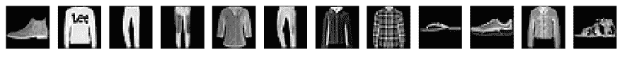
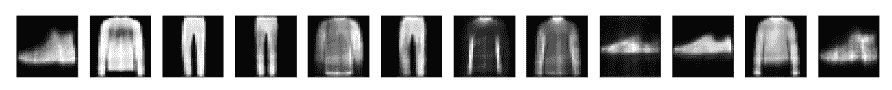
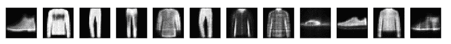
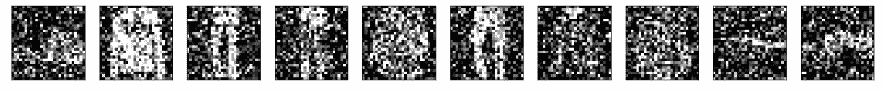
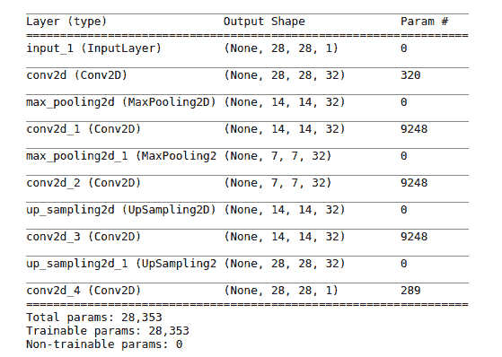
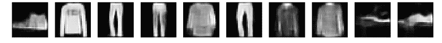
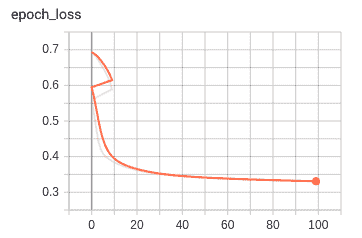
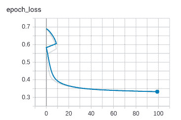

# 五、TensorFlow 2 和无监督学习

在本章中，我们将研究使用 TensorFlow 2 进行无监督学习。无监督学习的目的是在数据中发现以前未标记数据点的模式或关系； 因此，我们只有特征。 这与监督式学习形成对比，在监督式学习中，我们既提供了特征及其标签，又希望预测以前未见过的新特征的标签。 在无监督学习中，我们想找出我们的数据是否存在基础结构。 例如，可以在不事先了解其结构的情况下以任何方式对其进行分组或组织吗？ 这被称为**聚类**。 例如，亚马逊在其推荐系统中使用无监督学习来建议您以书本方式可能购买的商品，例如，通过识别以前购买的商品类别来提出建议。

无监督学习的另一种用途是在数据压缩技术中，其中数据中的模式可以用更少的内存表示，而不会损害数据的结构或完整性。 在本章中，我们将研究两个自编码器，以及如何将它们用于压缩数据以及如何消除图像中的噪声。

在本章中，我们将深入探讨自编码器。

# 自编码器

自编码是一种使用 ANN 实现的数据压缩和解压缩算法。 由于它是学习算法的无监督形式，因此我们知道只需要未标记的数据。 它的工作方式是通过强制输入通过瓶颈（即，宽度小于原始输入的一层或多层）来生成输入的压缩版本。 要重建输入（即解压缩），我们可以逆向处理。 我们使用反向传播在中间层中创建输入的表示形式，并重新创建输入作为表示形式的输出。

自编码是有损的，也就是说，与原始输入相比，解压缩后的输出将变差。 这与 MP3 和 JPEG 压缩格式相似。

自编码是特定于数据的，也就是说，只有与它们经过训练的数据相似的数据才可以正确压缩。 例如，训练有素的自编码器在汽车图片上的表现会很差，这是因为其学习到的特征将是汽车特有的。

# 一个简单的自编码器

让我们编写一个非常简单的自编码器，该编码器仅使用一层 ANN。 首先，像往常一样，让我们​​从导入开始，如下所示：

```py
from tensorflow.keras.layers import Input, Dense
from tensorflow.keras.models import Model
from tensorflow.keras.datasets import fashion_mnist
from tensorflow.keras.callbacks import ModelCheckpoint, EarlyStopping
from tensorflow.keras import regularizers

import numpy as np
import matplotlib.pyplot as plt

%matplotlib inline
```

# 预处理数据

然后，我们加载数据。 对于此应用，我们将使用`fashion_mnist`数据集，该数据集旨在替代著名的 MNIST 数据集。 本节末尾有这些图像的示例。 每个数据项（图像中的像素）都是 0 到 255 之间的无符号整数，因此我们首先将其转换为`float32`，然后将其缩放为零至一的范围，以使其适合以后的学习过程：

```py
(x_train, _), (x_test, _) = fashion_mnist.load_data() # we don't need the labels
x_train = x_train.astype('float32') / 255\. # normalize
x_test = x_test.astype('float32') / 255.

print(x_train.shape) # shape of input
print(x_test.shape)
```

这将给出形状，如以下代码所示：

```py
(60000, 28, 28)
(10000, 28, 28)
```

接下来，我们将图像展平，因为我们要将其馈送到一维的密集层：

```py
x_train = x_train.reshape(( x_train.shape[0], np.prod(x_train.shape[1:]))) #flatten
x_test = x_test.reshape((x_test.shape[0], np.prod(x_test.shape[1:])))

print(x_train.shape)
print(x_test.shape)
```

现在的形状如下：

```py
(60000, 784)
(10000, 784)
```

分配所需的尺寸，如以下代码所示：

```py
image_dim = 784 # this is the size of our input image, 784
encoding_dim = 32 # this is the length of our encoded items.Compression of factor=784/32=24.5
```

接下来，我们构建单层编码器和自编码器模型，如下所示：

```py
input_image = Input(shape=(image_dim, )) # the input placeholder

encoded_image = Dense(encoding_dim, activation='relu',
 activity_regularizer=regularizers.l1(10e-5))(input_image)# "encoded" is the encoded representation of the input

encoder = Model(input_image, encoded_image)

decoded_image = Dense(image_dim, activation='sigmoid')(encoded_image)# "decoded" is the lossy reconstruction of the input

autoencoder = Model(input_image, decoded_image) # this model maps an input to its reconstruction
```

然后，我们构造解码器模型，如下所示：

```py
encoded_input = Input(shape=(encoding_dim,))# create a placeholder for an encoded (32-dimensional) input

decoder_layer = autoencoder.layers[-1]# retrieve the last layer of the autoencoder model

decoder = Model(encoded_input, decoder_layer(encoded_input))# create the decoder model
```

接下来，我们可以编译我们的自编码器。 由于数据几乎是二元的，因此选择了`binary_crossentropy`损失，因此，我们可以最小化每个像素的二元交叉熵：

```py
autoencoder.compile(optimizer='adadelta', loss='binary_crossentropy')
```

我们可以定义两个有用的检查点。 第一个在每个周期后保存模型。 如果`save_best_only=True`，根据监视的数量（验证损失），最新的最佳模型将不会被覆盖。

其签名如下：

```py
keras.callbacks.ModelCheckpoint(filepath, monitor='val_loss', verbose=0, save_best_only=False, save_weights_only=False, mode='auto', period=1)
```

我们声明如下：

```py
checkpointer1 = ModelCheckpoint(filepath= 'model.weights.best.hdf5' , verbose =2, save_best_only = True)
```

当监视器中的更改（验证损失）小于`min_delta`时，即小于`min_delta`的更改不算改善时，第二个检查点停止训练。 这对于`patience`周期必定会发生，然后停止训练。 其签名如下：

```py
EarlyStopping(monitor='val_loss', min_delta=0, patience=0, verbose=0, mode='auto', baseline=None)
```

我们声明如下：

```py
checkpointer2 = EarlyStopping(monitor='val_loss', min_delta=0.0005, patience=2, verbose=2, mode='auto')
```

# 训练

训练运行使用`.fit`方法，其签名如下：

```py
autoencoder.fit(x=None, y=None, batch_size=None, epochs=1, verbose=1, callbacks=None, validation_split=0.0, validation_data=None, shuffle=True, class_weight=None, sample_weight=None, initial_epoch=0, steps_per_epoch=None, validation_steps=None, max_queue_size=10, workers=1, use_multiprocessing=False, **kwargs)
```

香草训练运行如下。 注意，我们如何传递`x`和`y`的`x_train`，因为我们要使用`x`输入并尝试在输出（`y=x`）上再现它。 请注意以下代码：

```py
epochs = 50
autoencoder.fit(x_train, x_train, epochs=epochs, batch_size=256, verbose=2, shuffle=True, validation_data=(x_test, x_test))
```

这之后是一些代码，用于压缩和解压缩（编码和解码）`test`数据。 请记住，`encoder`和`decoder`都是模型，所以我们可以调用该方法。 在它们上使用`predict`方法生成其输出：

```py
encoded_images = encoder.predict(x_test) #compress
decoded_images = decoder.predict(encoded_images) #decompress
```

我们还可以使用`ModelCheckpoint`检查点，在这种情况下，我们的`.fit`调用如下：

```py
epochs = 50
autoencoder.fit(x_train, x_train, epochs=epochs, batch_size=256, verbose=2, callbacks=[checkpointer1], shuffle=True, validation_data=(x_test, x_test))
```

我们还需要按如下方式加载保存的权重，以获取最佳模型：

```py
autoencoder.load_weights('model.weights.best.hdf5' )
encoded_images = encoder.predict(x_test)
decoded_images = decoder.predict(encoded_images)
```

以类似的方式，我们可以使用`EarlyStopping`，在这种情况下，`.fit`调用如下：

```py
epochs = 50
autoencoder.fit(x_train, x_train, epochs=epochs, batch_size=256, verbose=2, callbacks=[checkpointer2], shuffle=True, validation_data=(x_test, x_test))
```

# 显示结果

下面是一些代码，可以在屏幕上前后打印一些内容。 我们正在使用以下代码：

```py
plt.subplot(nrows, ncols, index, **kwargs)
```

子图在具有`nrows`行和`ncols`列的网格上的`index`位置处，`index`位置从左上角的一个位置开始，并向右增加以定位时尚项目：

```py
number_of_items = 12 # how many items we will display
plt.figure(figsize=(20, 4))
for i in range(number_of_items):
    # display items before compression 
    graph = plt.subplot(2, number_of_items, i + 1)
    plt.imshow(x_test[i].reshape(28, 28))
    plt.gray()
    graph.get_xaxis().set_visible(False)
    graph.get_yaxis().set_visible(False)

    # display items after decompression
    graph = plt.subplot(2, number_of_items, i + 1 + number_of_items)
    plt.imshow(decoded_images[i].reshape(28, 28))
    plt.gray()
    graph.get_xaxis().set_visible(False)
    graph.get_yaxis().set_visible(False)
plt.show()
```

压缩前的结果如下：



减压后，结果如下所示：



因此，压缩/解压缩的有损性很明显。 作为一种可能的健全性检查，如果我们使用`encoding_dim = 768`（与输入相同数量的隐藏层节点），我们将得到以下结果：



这可能与原始版本略有不同。 接下来，我们将看一下自编码的应用。

# 自编码器应用–去噪

自编码器的一个很好的应用是去噪：去除图像（噪声）中小的随机伪像的过程。 我们将用多层卷积码代替简单的一层自编码器。

我们将人造噪声添加到我们的时装中，然后将其消除。 我们还将借此机会研究使用 TensorBoard 来检查一些网络训练指标。

# 构建模型

我们最初的导入包括我们的卷积网络的导入。

注意，我们不必显式地使用 Keras，因为它是 TensorFlow 本身的模块，如以下代码所示：

```py
from tensorflow.keras.layers import Input, Dense, Conv2D, MaxPooling2D, UpSampling2D
from tensorflow.keras.models import Model
from tensorflow.keras.datasets import fashion_mnist
from tensorflow.keras.callbacks import TensorBoard
import numpy as np
import matplotlib.pyplot as plt
%matplotlib inline
```

# 预处理数据

首先，加载图像数据； 我们不需要标签，因为我们只关注图像本身：

```py
(train_x, _), (test_x, _) = fashion_mnist.load_data()
```

接下来，像以前一样，将图像数据点转换为零至一范围内的`float32`值：

```py
train_x = train_x.astype('float32') / 255.
test_x = test_x.astype('float32') / 255.
```

检查形状，如以下代码所示：

```py
print(train_x.shape)
print(test_x.shape)
```

它给出以下结果：

```py
(60000, 28, 28) (10000, 28, 28)
```

输入卷积层需要以下形状：

```py
train_x = np.reshape(train_x, (len(train_x), 28, 28, 1)) 
test_x = np.reshape(test_x, (len(test_x), 28, 28, 1))
```

在这里，形状中的一个是用于灰度通道； 以下是形状的完整性检查：

```py
print(train_x.shape)
print(test_x.shape)
```

得到以下结果：

```py
(60000, 28, 28, 1) (10000, 28, 28, 1)
```

为了在图像中引入一些随机噪声，我们在训练和测试集中添加了`np.random.normal`（即高斯）值数组。 所需的签名如下：

```py
numpy.random.normal(loc=0.0, scale=1.0, size=None)
```

在这里，`loc`是分布的中心，`scale`是标准差，`size`是输出形状。 因此，我们使用以下代码：

```py
noise = 0.5
train_x_noisy = train_x + noise * np.random.normal(loc=0.0, scale=1.0, size=train_x.shape) 
test_x_noisy = test_x + noise * np.random.normal(loc=0.0, scale=1.0, size=test_x.shape) 
```

由于这可能会使我们的值超出零至一的范围，因此我们将值裁剪到该范围：

```py
train_x_noisy = np.clip(train_x_noisy, 0., 1.)
test_x_noisy = np.clip(test_x_noisy, 0., 1.)
```

# 噪声图像

下面的代码从测试集中打印出一些嘈杂的图像。 注意如何调整图像的显示形状：

```py
plt.figure(figsize=(20, 2))
for i in range(number_of_items):
    display = plt.subplot(1, number_of_items,i+1)
    plt.imshow(test_x_noisy[i].reshape(28, 28))
    plt.gray()
    display.get_xaxis().set_visible(False)
    display.get_yaxis().set_visible(False)
plt.show()
```

这是结果，如以下屏幕快照所示：



因此很明显，原始图像与噪点几乎没有区别。

# 创建编码层

接下来，我们创建编码和解码层。 我们将使用 Keras 函数式 API 风格来设置模型。 我们从一个占位符开始，以（下一个）卷积层所需的格式输入：

```py
input_image = Input(shape=(28, 28, 1))
```

接下来，我们有一个卷积层。 回忆卷积层的签名：

```py
Conv2D(filters, kernel_size, strides=(1, 1), padding='valid', data_format=None, dilation_rate=(1, 1), activation=None, use_bias=True, kernel_initializer='glorot_uniform', bias_initializer='zeros', kernel_regularizer=None, bias_regularizer=None, activity_regularizer=None, kernel_constraint=None, bias_constraint=None, **kwargs)
```

我们将主要使用默认值； 接下来是我们的第一个`Conv2D`。 注意`(3,3)`的内核大小； 这是 Keras 应用于输入图像的滑动窗口的大小。 还记得`padding='same'`表示图像用 0 左右填充，因此卷积的输入和输出层是内核（过滤器）以其中心“面板”开始于图像中第一个像素时的大小。 。 默认步幅`(1, 1)`表示滑动窗口一次从图像的左侧到末尾水平移动一个像素，然后向下移动一个像素，依此类推。 接下来，我们将研究每个层的形状，如下所示：

```py
im = Conv2D(filters=32, kernel_size=(3, 3), activation='relu', padding='same')(input_image)
print(x.shape)
```

得到以下结果：

```py
(?, 28, 28, 32)
```

`?`代表输入项目的数量。

接下来，我们有一个`MaxPooling2D`层。 回想一下，在此情况下，此操作将在图像上移动`(2, 2)`大小的滑动窗口，并采用在每个窗口中找到的最大值。 其签名如下：

```py
MaxPooling2D(pool_size=(2, 2), strides=None, padding='valid', data_format=None, **kwargs)
```

这是下采样的示例，因为生成的图像尺寸减小了。 我们将使用以下代码：

```py
im = MaxPooling2D((2, 2), padding='same')(im)
print(im.shape)
```

得到以下结果：

```py
(?, 14, 14, 32)
```

其余的编码层如下：

```py
im = Conv2D(32, (3, 3), activation='relu', padding='same')(im)
print(im.shape)
encoded = MaxPooling2D((2, 2), padding='same')(im)
print(encoded.shape)
```

所有这些都结束了编码。

# 创建解码层

为了进行解码，我们反转了该过程，并使用上采样层`UpSampling2D`代替了最大池化层。 上采样层分别按大小[0]和大小[1]复制数据的行和列。

因此，在这种情况下，*会取消*最大合并层的效果，尽管会损失细粒度。 签名如下：

```py
 UpSampling2D(size=(2, 2), data_format=None, **kwargs)
```

我们使用以下内容：

```py
im = UpSampling2D((2, 2))(im)
```

以下是解码层：

```py
im = Conv2D(32, (3, 3), activation='relu', padding='same')(encoded)
print(im.shape)
im = UpSampling2D((2, 2))(im)
print(im.shape)
im = Conv2D(32, (3, 3), activation='relu', padding='same')(im)
print(im.shape)
im = UpSampling2D((2, 2))(im)
print(im.shape)
decoded = Conv2D(1, (3, 3), activation='sigmoid', padding='same')(im)
print(decoded.shape)
```

得到以下结果：

```py
(?, 7, 7, 32) (?, 14, 14, 32) (?, 14, 14, 32) (?, 28, 28, 32) (?, 28, 28, 1)
```

因此，您可以看到解码层如何逆转编码层的过程。

# 模型摘要

这是我们模型的摘要：



看看我们如何得出参数数字很有启发性。

公式是参数数量 = 过滤器数量 x 内核大小 x 上一层的深度 + 过滤器数量（用于偏差）：

*   `input_1`：这是一个占位符，没有可训练的参数
*   `conv2d`：过滤器数量`= 32`，内核大小`= 3 * 3 = 9`，上一层的深度`= 1`，因此`32 * 9 + 32 = 320`
*   `max_pooling2d`：最大池化层没有可训练的参数。
*   `conv2d_1`：过滤器数`= 32`，内核大小`= 3 * 3 = 9`，上一层的深度`= 14`，因此`32 * 9 * 32 + 32 = 9,248`
*   `conv_2d_2`，`conv2d_3`：与`conv2d_1`相同
*   `conv2d_4`：`1 * 9 * 32 + 1 = 289`

# 模型实例化，编译和训练

接下来，我们用输入层和输出层实例化模型，然后使用`.compile`方法设置模型以进行训练：

```py
autoencoder = Model(inputs=input_img, outputs=decoded)
autoencoder.compile(optimizer='adadelta', loss='binary_crossentropy')
```

现在，我们准备训练模型以尝试恢复时尚商品的图像。 请注意，我们已经为 TensorBoard 提供了回调，因此我们可以看一下一些训练指标。 Keras TensorBoard 签名如下：

```py
keras.callbacks.TensorBoard(
    ["log_dir='./logs'", 'histogram_freq=0', 'batch_size=32', 'write_graph=True', 'write_grads=False', 'write_images=False', 'embeddings_freq=0', 'embeddings_layer_names=None', 'embeddings_metadata=None', 'embeddings_data=None', "update_freq='epoch'"],
)
```

我们将主要使用默认值，如下所示：

```py
tb = [TensorBoard(log_dir='./tmp/tb', write_graph=True)]
```

接下来，我们使用`.fit()`方法训练自编码器。 以下代码是其签名：

```py
fit(x=None, y=None, batch_size=None, epochs=1, verbose=1, callbacks=None, validation_split=0.0, validation_data=None, shuffle=True, class_weight=None, sample_weight=None, initial_epoch=0, steps_per_epoch=None, validation_steps=None, validation_freq=1)
```

注意我们如何将`x_train_noisy`用于特征（输入），并将`x_train`用于标签（输出）：

```py
epochs=100
batch_size=128

autoencoder.fit(x_train_noisy, x_train, epochs=epochs,batch_size=batch_size, shuffle=True, validation_data=(x_test_noisy, x_test), callbacks=tb)
```

# 去噪图像

现在，通过解码以下第一行中的所有测试集，然后循环遍历一个固定数字（`number_of_items`）并显示它们，来对测试集中的一些噪点图像进行去噪。 请注意，在显示每个图像（`im`）之前，需要对其进行重塑：

```py
decoded_images = autoencoder.predict(test_noisy_x)
number_of_items = 10
plt.figure(figsize=(20, 2))
for item in range(number_of_items):
    display = plt.subplot(1, number_of_items,item+1)
    im = decoded_images[item].reshape(28, 28)
   plt.imshow(im, cmap="gray")
    display.get_xaxis().set_visible(False)
    display.get_yaxis().set_visible(False)
plt.show()
```

我们得到以下结果：



考虑到图像最初模糊的程度，降噪器已经做了合理的尝试来恢复图像。

# TensorBoard 输出

要查看 TensorBoard 输出，请在命令行上使用以下命令：

```py
tensorboard  --logdir=./tmp/tb
```

然后，您需要将浏览器指向`http://localhost:6006`。

下图显示了作为训练和验证时间的函数（`x`轴）的损失（`y`轴）：

下图显示了训练损失：



验证损失如下图所示：



到此结束我们对自编码器的研究。

# 总结

在本章中，我们研究了自编码器在无监督学习中的两种应用：首先用于压缩数据，其次用于降噪，这意味着从图像中去除噪声。

在下一章中，我们将研究如何在图像处理和识别中使用神经网络。