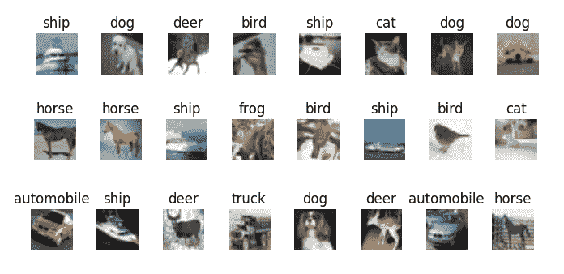
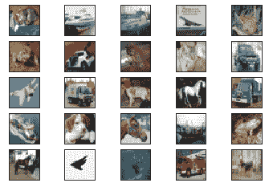

# 六、使用 TensorFlow 2 识别图像

本章分为两部分，但我们将同时学习使用 TensorFlow 进行图像分类。

在本章中，我们将涵盖以下主要主题：

*   QuickDraw – 使用 TensorFlow 进行图像分类
*   使用 TensorFlow 的 CIFAR 10 图像分类

在第一部分中，我们将使用在前几章中学到的技术开发 TensorFlow 2 模型以进行图像识别，尤其是第 2 章， “Keras，TensorFlow 2 的高级 API”。 这将使我们能够看到如何使用 TensorFlow 2 将所有相关技术结合在一起来创建，训练和评估完整的模型。我们将利用 Google 提供的 QuickDraw 图片数据集可帮助您解决此问题。

# QuickDraw – 使用 TensorFlow 进行图像分类

我们将使用从 Google QuickDraw 拍摄的图像数据集。 这是一个公开的开放源代码，它包含 345 个类别的 5000 万张图像的数据集，所有这些图像都是由参与挑战的 1500 万名用户在 20 秒或更短的时间内绘制的。 我们将训练 10 个类别的 10,000 张图像，其中一些被选择为相似图像，以便我们可以测试模型的区分能力。 您可以在[这个页面](https://quickdraw.withgoogle.com/data)上查看这些图像的示例。 这些图片有多种格式，请参见[这个页面](https://github.com/googlecreativelab/quickdraw-dataset)中的所有格式。

在这里，我们将使用已存储为`.npy`文件的图像。 `.npy`文件的公共数据集托管在[这个页面](https://console.cloud.google.com/storage/browser/quickdraw_dataset/full/numpy_bitmap?pli=1)上。 从这里可以一次下载一组。 要使用不同的图像运行此示例，请从数据目录中删除图像文件，然后将所需的图像下载到存储库中的同一目录中。 该程序从文件名中读取标签。

在本节中，我们将涵盖以下主题：

*   采集数据
*   预处理数据
*   建立模型
*   训练和测试模型
*   保存，加载和重新测试模型
*   使用`.h5`格式保存和加载 NumPy 图像数据
*   加载预训练的模型
*   使用预训练的模型

我们将逐步开发和呈现代码片段。 这些代码段通过螺栓连接在一起，[成为存储库中的完整程序](https://github.com/PacktPublishing/Tensorflow-2.0-Quick-Start-Guide)。

# 采集数据

我们将需要从 Google 下载数据。 您可以将数据下载到一个空目录`data_files`。

转到[这里](https://console.cloud.google.com/storage/browser/quickdraw_dataset/full/numpy_bitmap?pli=1)并将 10 个数据集下载到`data_files`文件夹中。 以下是将要下载的文件的示例：

```py
'alarm_clock.npy', 'broom.npy', 'ant.npy', 'bee.npy', 'cell_phone.npy', 'baseball.npy', 'dolphin.npy', 'crocodile.npy', 'aircraft_carrier.npy', 'asparagus.npy'
```

您将下载的文件名称前会带有多余的位，例如`full_numpy_bitmap_alarm clock.npy`。

为了使这些内容更简洁，请删除开头的位，然后重命名文件，以使文件名在我们的示例中变为`alarm_clock.npy`。 对所有 10 个文件执行此操作。

# 建立环境

首先，我们需要导入依赖项：

```py
import tensorflow as tf
import keras
import numpy as np
from sklearn.model_selection import train_test_split
from os import walk
```

您可能需要运行`pip install sklearn`。 接下来，我们将建立一些常量供以后使用：

```py
batch_size = 128
img_rows, img_cols = 28, 28 # image dimensions
```

接下来，我们将使用`os.walk`方法从`data_files`文件夹中收集数据集的文件名：

请注意，文件名收集在列表变量`filenames`中。

```py
data_path = "data_files/" 
for (dirpath, dirnames, filenames) in walk(data_path):
     pass # filenames accumulate in list 'filenames'
print(filenames)
```

对于我们的示例，文件名（对应于`label`类别）如下：

```py
['alarm_clock.npy', 'broom.npy', 'ant.npy', 'bee.npy', 'cell_phone.npy', 'baseball.npy', 'dolphin.npy', 'crocodile.npy', 'aircraft_carrier.npy', 'asparagus.npy']
```

要使用不同的图像运行该示例，只需将 10 个不同的文件下载到`data`文件夹中。

接下来，我们将定义模型所需的更多值。 图像总数（`num_images`）可在此处更改：

```py
num_images = 1000000 ### was 100000, reduce this number if memory issues.
num_files = len(filenames) # we have 10 files
images_per_category = num_images//num_files
seed = np.random.randint(1, 10e7)
i=0
print(images_per_category)
```

# 预处理数据

接下来是将图像加载到内存中的代码。 我们将遍历文件，并在获取文件路径的值之后，加载该文件或一组图像（`x`）。 然后，将`x`转换为浮点数，然后除以 255，将其设置为 0 到 1 的范围。之后，我们为该组图像`x`创建一个数字标签`y`。 对于第一组图像，该值为 0，对于下一组图像，此值为 1，一直到最后一组图像的 9，由变量`i`控制。 然后，我们将集合`x`和`y`切片，以将图像和标签放回`x`和`y`中。 之后，我们将`x`和`y`累积到`x_all`和`y_all`中，如果这是它们第一次进入循环（即`i=0`），则创建这两个新列表，并将`x`和[ 如果这不是他们第一次通过循环（即`i>0`），则将它们移到`y`上。 当此循环终止时，`x_all`和`y_all`将分别包含带有标签的图像：

```py
i=0
for file in filenames:
     file_path = data_path + file
     x = np.load(file_path)
     x = x.astype('float32') ##normalize images
     x /= 255.0
     y = [i] * len(x) # create numeric label for this image

     x = x[:images_per_category] # get the sample of images 
     y = y[:images_per_category] # get the sample of labels 

     if i == 0: 
         x_all = x
         y_all = y
     else: 
         x_all = np.concatenate((x,x_all), axis=0)
         y_all = np.concatenate((y,y_all), axis=0)
     i += 1
```

之后，我们将使用`sklearn.model_selection`模块中的`train_test_split`方法将`x_all`和`y_all`分为训练和测试集，并以 80/20 的训练/测试进行分割：

```py
#split data arrays into train and test segments
x_train, x_test, y_train, y_test = train_test_split(x_all, y_all, test_size=0.2, random_state=42)
```

由于我们将使用卷积神经网络（`convNet`）对快速抽奖进行分类！ 图像，接下来要做的是将`x_train`和`x_test`重塑为`28 x 28 x 1`图像，它们开始出现时的样子，其中前两个维度是图像的高度和宽度（以像素为单位），第三个维度是每个像素的灰度。 我们还将建立`input_shape`，并将其用于`convNet`的第一层：

```py
x_train = x_train.reshape(x_train.shape[0], img_rows, img_cols, 1) 
x_test = x_test.reshape(x_test.shape[0], img_rows, img_cols, 1) 
input_shape = (img_rows, img_cols, 1)
```

此后，我们将根据`convNet`的要求对`y_train`和`y_test`标签进行一次热编码：

```py
y_train = tf.keras.utils.to_categorical(y_train, num_files) 
y_test = tf.keras.utils.to_categorical(y_test, num_files)
```

接下来，我们将训练和测试`x`集进一步与验证集一起分成 90/10 的更小的测试集：

```py
x_train, x_valid, y_train, y_valid = train_test_split(x_train, y_train, test_size=0.1, random_state=42)
```

# 建立模型

现在，我们准备创建`convNet`模型。

有两个卷积层（具有 ReLU 激活），每个卷积层都插入最大池化和丢弃层，然后是一个将卷积层的输出展平为一维的层。 在这些层之后是密集的（完全连接的）一维层（同样具有 ReLU 激活），最后的丢弃层，最后是具有 10 个单元的 softmax 层。 softmax 层中每个输出单元的激活给出了该图像是 10 张图像之一的可能性。 这种 ANN 架构有足够的实验空间。

然后使用分类交叉熵的损失来编译模型：

```py
model = tf.keras.Sequential()

model.add(tf.keras.layers.Conv2D(32, kernel_size=(3, 3), activation='relu', input_shape=input_shape)) 
model.add(tf.keras.layers.MaxPooling2D(pool_size=(2, 2))) 
model.add(tf.keras.layers.Dropout(0.25))

model.add(tf.keras.layers.Conv2D(64, (3, 3), activation='relu')) 
model.add(tf.keras.layers.MaxPooling2D(pool_size=(2, 2))) 
model.add(tf.keras.layers.Dropout(0.25))

model.add(tf.keras.layers.Flatten())
model.add(tf.keras.layers.Dense(128, activation='relu')) 
model.add(tf.keras.layers.Dropout(0.5))
model.add(tf.keras.layers.Dense(num_files, activation='softmax')) 

print("Compiling...........")
model.compile(loss=tf.keras.losses.categorical_crossentropy,
 optimizer=tf.keras.optimizers.Adadelta(),
 metrics=['accuracy'])
```

# 训练和测试模型

现在，我们可以使用`fit`方法训练模型。 注意验证集的使用，它不同于训练集。 `callbacks`列表还可以用于诸如保存最佳模型或在学习停止时终止训练（如果在所有周期完成之前发生这种情况）的操作。 有关详细信息，请参见[这里](https://keras.io/callbacks/)：

```py
epochs=25
callbacks=[tf.keras.callbacks.TensorBoard(logdir = "./tb_log_dir")]
model.fit( x_train, y_train,
 batch_size=batch_size,
 epochs=epochs,
 callbacks=callbacks,
 verbose=1,
 validation_data=(x_valid, y_valid)
)
```

根据模型所处的硬件配置，如果该模型在 GPU 上运行，或者在 CPU 上运行缓慢，则训练速度将非常快。 为了说明的目的，可以减少周期的数量。 在 NVIDIA GTX 1080 GPU 上，时间/周期约为 38 秒。

为了确定模型的准确率，按以下方法使用`evaluate`方法。 请注意，测试集用于此评估：

```py
score = model.evaluate(x_test, y_test, verbose=1)
print('Test loss:', score[0])
print('Test accuracy:', score[1])
```

我们还可以对测试图像进​​行随机采样，并使用以下代码查看模型的效果。 从文件名中检索标签并打印以供参考，然后再打印成对的预测标签与实际标签：

```py
import os
labels = [os.path.splitext(file)[0] for file in filenames]
print(labels)
print("\nFor each pair in the following, the first label is predicted, second is actual\n")
for i in range(20):
  t = np.random.randint(len(x_test) )
  x1= x_test[t]
  x1 = x1.reshape(1,28,28,1) 
  p = model.predict(x1)
  print("-------------------------")
  print(labels[np.argmax(p)])
  print(labels[np.argmax(y_test[t])])
  print("-------------------------")
```

# TensorBoard 回调

TensorBoard 是用于训练模型的可视化工具。 TensorBoard 回调的完整签名如下：

```py
tf.keras.callbacks.TensorBoard(log_dir='./logs', histogram_freq=0, batch_size=32, write_graph=True, write_grads=False, write_images=False, embeddings_freq=0, embeddings_layer_names=None, embeddings_metadata=None, embeddings_data=None, update_freq='epoch')
```

在[这个页面](https://keras.io/callbacks/) 上有所有这些参数的非常清晰而详细的描述。 TensorBoard 可以从命令行调用，如下所示：

```py
tensorboard --logdir=/full_path_to_your_logs
```

例如，我们可以使用`tensorboard --logdir=./logs`作为默认目录。 将`histogram_freq`设置为非 0 的值会导致在写入数据时`epochs`之间有明显的停顿，并且仅在需要模型所有层的激活和权重直方图时才应使用。

# 保存，加载和重新测试模型

现在，我们可以保存模型并将其删除：

```py
model.save("./QDrawModel.h5")
del model
```

然后，我们需要重新加载它：

```py
from tensorflow.keras.models import load_model
model = load_model('./QDrawModel.h5')
```

最后，我们必须对其进行总结以表明我们已经成功地重新加载了保存的模型：

```py
model.summary()
```

最后，我们打印出 20 种时尚商品的测试样本，以确保网络正常运行：

```py
print("For each pair, first is predicted, second is actual")
for i in range(20):
  t = np.random.randint(len(x_test))
  x1= x_test[t]
  x1 = x1.reshape(1,28,28,1) 
  p = model.predict(x1)
  print("-------------------------")
  print(labels[np.argmax(p)])
  print(labels[np.argmax(y_test[t])])
  print("-------------------------")
```

# 使用`.h5`格式保存和加载 NumPy 图像数据

如果需要保存先前程序中的训练和测试数据，则可以使用以下代码：

```py
import h5py
with h5py.File('x_train.h5', 'w') as hf:
  hf.create_dataset("QuickDraw", data=x_train)
with h5py.File('y_train.h5', 'w') as hf:
  hf.create_dataset("QuickDraw", data=y_train)
with h5py.File('x_test.h5', 'w') as hf:
  hf.create_dataset("QuickDraw", data=x_test)
with h5py.File('y_test.h5', 'w') as hf:
  hf.create_dataset("QuickDraw", data=y_test)
```

请注意，加载数据集时传递给`h5py.File()`方法的数据集名称必须与使用`h5py.File.create_dataset()`方法保存数据集时使用的名称相同：

```py
import h5py
hf = h5py.File('x_train.h5', 'r')
x_train = np.array(hf["QuickDraw"][:])
hf = h5py.File('x_test.h5', 'r')
x_test = np.array(hf["QuickDraw"][:])
hf = h5py.File('y_train.h5', 'r')
y_train = np.array(hf["QuickDraw"][:])
hf = h5py.File('y_test.h5', 'r')
y_test = np.array(hf["QuickDraw"][:])
```

# 使用预训练的模型进行加载和推断

经过训练的模型`'QDrawModel.h5'`已运行 25 个周期，并且达到了 90% 以上的测试准确率，已保存在存储库中。 您已经看过此代码； 为方便起见，在此复制。

因此，重申一下，您可以使用以下代码加载此经过训练的模型：

```py
from keras.models import load_model
model = load_model('./QDrawModel.h5')
model.summary()
```

同样，可以使用以下代码加载训练/测试数据：

```py
import h5py
import numpy as np
hf = h5py.File('x_train.h5', 'r')
x_train = np.array(hf["QuickDraw"][:])
hf = h5py.File('x_test.h5', 'r')
x_test = np.array(hf["QuickDraw"][:])
hf = h5py.File('y_train.h5', 'r')
y_train = np.array(hf["QuickDraw"][:])
hf = h5py.File('y_test.h5', 'r')
y_test = np.array(hf["QuickDraw"][:])
```

再次重申，我们可以使用以下代码获取标签（我们看到的标签对应于图像文件名）：

```py
from os import walk
import os
data_path = "data_files/" # folder for image files
for (dirpath, dirnames, filenames) in walk(data_path):
  pass # filenames accumulate in list 'filenames'
labels = [os.path.splitext(file)[0] for file in filenames]
print(labels)
```

然后，可以通过以下代码使用我们加载的模型进行推理。 请注意，如果有必要，这还将演示如何强制在 CPU 上进行计算：

```py
import tensorflow as tf
with tf.device('/cpu:0'):
     for i in range(10):
         t = np.random.randint(len(x_test) )
         x1= x_test[t]
         x1 = x1.reshape(1,28,28,1) 
         p = model.predict(x1)
         y1 = y_test[t]
         print("-------------------------")
         print(labels[np.argmax([p])])
         print(labels[y1]) 
         print("-------------------------")
```

# 使用 TensorFlow 的 CIFAR 10 图像分类

在第二部分中，我们将研究训练模型以识别 CIFAR10 图像数据集中的图像。 这将使我们有机会举例说明顺序模型创建的稍有不同的风格。

# 介绍

具有 10 个类别的 CIFAR 10 图像数据集是 8000 万个微型图像数据集的标记子集。 这些图像由 Alex Krizhevsky，Vinod Nair 和 Geoffrey Hinton 收集。 有关此数据集的完整详细信息，请访问[这里](https://www.cs.toronto.edu/~kriz/cifar.html)。

在 10 个类别中，总共有 60,000 个`32 x 32`彩色图像，包括 50,000 个训练图像和 10,000 个测试图像。

类别如下：

```py
labels = ['airplane','automobile','bird','cat','deer','dog','frog','horse','ship','truck']
```

以下是这些类别的图像的一些示例：



# 应用

首先，以下是设置所需的导入：

```py
import tensorflow as tf
import numpy as np
from tensorflow.keras.datasets import cifar10
from tensorflow.keras.preprocessing.image import ImageDataGenerator
from tensorflow.keras.models import Sequential
from tensorflow.keras.layers import Dense, Dropout, Activation, Flatten
from tensorflow.keras.layers import Conv2D, MaxPooling2D,BatchNormalization
from tensorflow.keras import regularizers
from tensorflow.keras.models import load_model
import os
from matplotlib import pyplot as plt
from PIL import Image
```

您可能需要运行`pip install PIL`。

接下来，我们将在其余的代码中使用一组值：

```py
batch_size = 32
number_of_classes = 10
epochs = 100 # for testing; use epochs = 100 for training ~30 secs/epoch on CPU
weight_decay = 1e-4
save_dir = os.path.join(os.getcwd(), 'saved_models')
model_name = 'keras_cifar10_trained_model.h5'
number_of_images = 5
```

然后，我们可以加载并查看数据的形状：

```py
(x_train, y_train), (x_test, y_test) = cifar10.load_data()
print('x_train shape:', x_train.shape)
print(x_train.shape[0], 'train samples')
print(x_test.shape[0], 'test samples')
```

这将产生预期的输出：

```py
x_train shape: (50000, 32, 32, 3) 50000 train samples 10000 test samples
```

现在，我们有了一个显示图像子集的函数。 这将在网格中显示它们：

```py
def show_images(images):
    plt.figure(1)
    image_index = 0
    for i in range(0,number_of_images):
        for j in range(0,number_of_images):
            plt.subplot2grid((number_of_images, number_of_images),(i,j))
            plt.imshow(Image.fromarray(images[image_index]))
            image_index +=1
            plt.gca().axes.get_yaxis().set_visible(False)
            plt.gca().axes.get_xaxis().set_visible(False) 
    plt.show()
```

让我们执行以下函数的调用：

```py
show_images(x_test[:number_of_images*number_of_images])
```

这给我们以下输出：



请注意，图像在原始数据集中故意很小。

现在，我们可以将图像投射到浮动对象上，并将其范围更改为`[0, 1]`：

```py
x_train = x_train.astype('float32')/255
x_test = x_test.astype('float32')/255
```

如果将标签作为一站式向量提供，则最好了解它们，因此，我们现在将这样做：

```py
y_train = tf.keras.utils.to_categorical(y_train, number_of_classes) # or use tf.one_hot()
y_test = tf.keras.utils.to_categorical(y_test, number_of_classes)
```

接下来，我们可以指定模型的架构。 请注意，与之前的操作相比，我们使用的激活指定方法略有不同：

```py
model.add(Activation('elu'))
```

`elu`激活函数代表指数线性单元。 在[这个页面](https://sefiks.com/2018/01/02/elu-as-a-neural-networks-activation-function/)中有很好的描述。

注意，我们正在使用具有卷积层，`BatchNormalization`和 MaxPooling 层的顺序模型。 倒数第二层使结构变平，最后一层使用 softmax 激活，因此我们预测的类将显示为具有最高激活的输出神经元：

```py
model = Sequential()
model.add(Conv2D(32, (3,3), padding='same', kernel_regularizer=regularizers.l2(weight_decay), input_shape=x_train.shape[1:]))
model.add(Activation('elu'))
model.add(BatchNormalization())
model.add(Conv2D(32, (3,3), padding='same', kernel_regularizer=regularizers.l2(weight_decay)))
model.add(Activation('elu'))
model.add(BatchNormalization())
model.add(MaxPooling2D(pool_size=(2,2)))
model.add(Dropout(0.2))

model.add(Conv2D(64, (3,3), padding='same', kernel_regularizer=regularizers.l2(weight_decay)))
model.add(Activation('elu'))
model.add(BatchNormalization())
model.add(Conv2D(64, (3,3), padding='same', kernel_regularizer=regularizers.l2(weight_decay)))
model.add(Activation('elu'))
model.add(BatchNormalization())
model.add(MaxPooling2D(pool_size=(2,2)))
model.add(Dropout(0.3))

model.add(Conv2D(128, (3,3), padding='same', kernel_regularizer=regularizers.l2(weight_decay)))
model.add(Activation('elu'))
model.add(BatchNormalization())
model.add(Conv2D(128, (3,3), padding='same', kernel_regularizer=regularizers.l2(weight_decay)))
model.add(Activation('elu'))
model.add(BatchNormalization())
model.add(MaxPooling2D(pool_size=(2,2)))
model.add(Dropout(0.4))

model.add(Flatten())
model.add(Dense(number_of_classes, activation='softmax'))
```

接下来，我们必须定义我们的优化器； `RMSprop`。 `decay`是每次更新后学习率降低的速度：

```py
opt = tf.keras.optimizers.RMSprop(lr=0.0001, decay=decay)
```

现在，我们将编译我们的模型：

```py
model.compile(loss='categorical_crossentropy', optimizer=opt,metrics=['accuracy'])
```

为了帮助模型学习和推广，我们将实现实时数据增强。

这是通过`ImageDataGenerator()`函数完成的。 其签名如下：

```py
keras.preprocessing.image.ImageDataGenerator(featurewise_center=False, samplewise_center=False, featurewise_std_normalization=False, samplewise_std_normalization=False, zca_whitening=False, zca_epsilon=1e-06, rotation_range=0, width_shift_range=0.0, height_shift_range=0.0, brightness_range=None, shear_range=0.0, zoom_range=0.0, channel_shift_range=0.0, fill_mode='nearest', cval=0.0, horizontal_flip=False, vertical_flip=False, rescale=None, preprocessing_function=None, data_format=None, validation_split=0.0, dtype=None)
```

但是，我们将主要使用前面签名中所示的默认值。 数据将分批循环。

这是对图像应用各种转换，例如水平翻转，高度偏移，宽度偏移，旋转等。 我们将使用以下代码进行演示：

```py
 # This will do preprocessing and real-time data augmentation:
datagen = ImageDataGenerator(
 rotation_range=10, # randomly rotate images in the range 0 to 10 degrees

 width_shift_range=0.1,# randomly shift images horizontally (fraction of total width)

 height_shift_range=0.1,# randomly shift images vertically (fraction of total height)

 horizontal_flip=True, # randomly flip images

 validation_split=0.1)
```

我们还将建立一个回调，以便如果模型的准确率停止提高，训练将停止，并且将为模型恢复最佳权重。

`EarlyStopping`回调的签名如下：

```py
keras.callbacks.EarlyStopping(monitor='val_loss', min_delta=0, patience=0, verbose=0, mode='auto', baseline=None, restore_best_weights=False)
```

`Monitor`是要跟踪的数量，`min_delta`是被算作改进的跟踪数量的最小变化，`patience`是没有变化的周期数，之后将停止训练，而`mode` 是['min'，'max'，'auto']之一，它分别确定所跟踪的值是应该减少还是增加，或者分别从其名称中确定。 `baseline`是要达到的跟踪值的值，而`restore_best_weights`确定是否应恢复最佳周期的模型权重（如果使用`false`，则使用最新权重）。

我们将有以下代码：

```py
callback = tf.keras.callbacks.EarlyStopping(monitor='accuracy', min_delta=0, patience=1, verbose=1,mode='max', restore_best_weights=True) 
```

现在，我们可以训练模型了。 `fit.generator()`函数用于根据`flow()`生成器批量显示的数据训练模型。 可以在[这个页面](https://keras.io/models/sequential/#fit_generator)中找到更多详细信息：

```py
model.fit_generator(datagen.flow(x_train, y_train, batch_size=batch_size), epochs=epochs, callbacks=[callback])
```

让我们保存模型，以便以后可以重新加载它：

```py
if not os.path.isdir(save_dir):
  os.makedirs(save_dir)

model_path = os.path.join(save_dir, model_name)
model.save(model_path)
print('Model saved at: %s ' % model_path)
```

现在让我们重新加载它：

```py
model1 = tf.keras.models.load_model(model_path)
model1.summary()
```

最后，让我们看看我们的模型在测试集上的表现如何。 我们需要重新加载数据，因为它已被损坏：

```py
(x_train, y_train), (x_test, y_test) = cifar10.load_data()
show_images(x_test[:num_images*num_images])
x_test = x_test.astype('float32')/255
```

这里又是标签：

```py
labels = ['airplane','automobile','bird','cat','deer','dog','frog','horse','ship','truck']
```

最后，我们可以检查预测的标签：

```py
indices = tf.argmax(input=model1.predict(x_test[:number_of_images*number_of_images]),axis=1)
i = 0
print('Learned \t True')
print('=====================')
for index in indices:
    print(labels[index], '\t', labels[y_test[i][0]])
    i+=1
```

在一次运行中，提前停止开始了 43 个周期，测试准确率为 81.4%，并且前 25 张图像的测试结果如下：

```py
Learned  True
=====================
cat      cat
ship     ship
ship     ship
ship     airplane
frog     frog
frog     frog
automobile       automobile
frog     frog
cat      cat
automobile       automobile
airplane         airplane
truck    truck
dog      dog
horse    horse
truck    truck
ship     ship
dog      dog
horse    horse
ship     ship
frog     frog
horse    horse
airplane         airplane
deer     deer
truck    truck
deer     dog
```

可以通过进一步调整模型架构和超参数（例如学习率）来提高此准确率。

到此结束了我们对 CIFAR 10 图像数据集的了解。

# 总结

本章分为两个部分。 在第一部分中，我们研究了来自 Google 的数据集 QuickDraw。 我们介绍了它，然后看到了如何将其加载到内存中。 这很简单，因为 Google 善意地将数据集作为一组`.npy`文件提供，这些文件可以直接加载到 NumPy 数组中。 接下来，我们将数据分为训练，验证和测试集。 创建`ConvNet`模型后，我们对数据进行了训练并进行了测试。 在测试中，经过 25 个周期，该模型的准确率刚好超过 90%，我们注意到，通过进一步调整模型，可能会改善这一精度。 最后，我们看到了如何保存经过训练的模型，然后如何重新加载它并将其用于进一步的推断。

在第二部分中，我们训练了一个模型来识别 CIFAR 10 图像数据集中的图像。 该数据集包含 10 类图像，是用于测试体系结构和进行超参数研究的流行数据集。 我们的准确率刚刚超过 81%。

在下一章中，我们将研究神经风格迁移，其中涉及获取一个图像的内容并将第二个图像的风格强加于其上，以生成第三个混合图像。