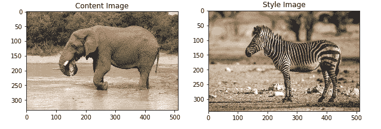
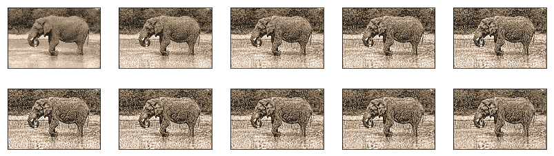
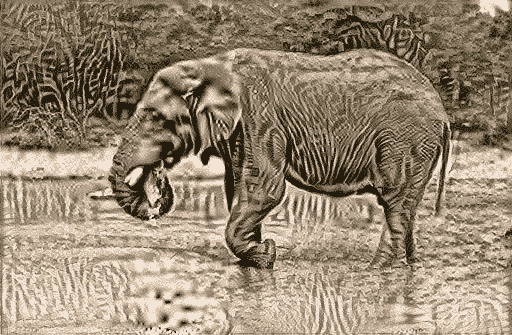

# 七、TensorFlow 2 和神经风格迁移

神经风格迁移是一种使用神经网络将一幅图像的艺术风格施加到另一幅图像的内容上的技术，因此最终得到的是两种图像的混合体。 您开始使用的图像称为**内容图像**。 您在内容图像上加上风格的图像称为**风格参考图像**。 Google 将转换后的图像称为**输入图像**，这似乎令人困惑（输入是从两个不同来源获取输入的意思）； 让我们将其称为**混合图像**。 因此，混合图像是具有风格参考图像风格的内容图像。

神经风格迁移通过定义两个损失函数来工作-一个描述两个图像的内容之间的差异，另一个描述两个图像之间的风格差异。

为了开始该过程，用内容图像初始化混合图像。 然后，使用反向传播将内容和内容以及混合图像的风格之间的差异（也称为损失或距离）最小化。 这将创建具有风格参考图像风格和内容图像内容的新图像（即混合图像）。

此过程中涉及一些技术-使用函数式 API，使用预训练的模型及其特征图以及使用自定义训练循环以最小化`loss`函数。 我们将在下面的代码中满足所有这些要求。

要充分利用该技术，有两个先决条件-Gatys 等人在 2015 年发表的[原始论文](https://arxiv.org/abs/1508.06576)虽非必要，但确实可以解释该技术。 技术非常好，因此非常有必要了解如何通过梯度下降来减少损失。

我们将使用 VGG19 架构中的特征层（已在著名的 ImageNet 数据集上进行了训练，其中包含 1400 万张图像和 1000 个类别）。

我们将检查的代码源自 Google 提供的代码； 它使用了急切的执行程序，我们当然不需要编写代码，因为它是 TensorFlow 2 中的默认代码。该代码在 GPU 上运行得更快，但在耐心等待的情况下仍可以在 CPU 上合理的时间内进行训练。

在本章中，我们将介绍以下主题：

*   配置导入
*   预处理图像
*   查看原始图像
*   使用 VGG19 架构
*   建立模型
*   计算损失
*   执行风格迁移

# 配置导入

要对您自己的图像使用此实现，您需要将这些图像保存在下载的存储库的`./tmp/nst`目录中，然后编辑`content_path`和`style_path`路径，如以下代码所示。

与往常一样，我们要做的第一件事是导入（并配置）所需的模块：

```py
import numpy as np
from PIL import Image
import time
import functools

import matplotlib.pyplot as plt
import matplotlib as mpl
# set things up for images display
mpl.rcParams['figure.figsize'] = (10,10)
mpl.rcParams['axes.grid'] = False
```

您可能需要`pip install pillow`，这是 PIL 的分支。 接下来是 TensorFlow 模块：

```py
import tensorflow as tf

from tensorflow.keras.preprocessing import image as kp_image
from tensorflow.keras import models
from tensorflow.keras import losses
from tensorflow.keras import layers
from tensorflow.keras import backend as K
from tensorflow.keras import optimizers
```

这是我们最初将使用的两个图像：

```py
content_path = './tmp/nst/elephant.jpg'#Andrew Shiva / Wikipedia / CC BY-SA 4.0
style_path = './tmp/nst/zebra.jpg' # zebra:Yathin S Krishnappa, https://creativecommons.org/licenses/by-sa/4.0/deed.en
```

# 预处理图像

下一个函数只需稍作预处理即可加载图像。 `Image.open()`是所谓的惰性操作。 该函数找到文件并将其打开以进行读取，但是实际上直到从您尝试对其进行处理或加载数据以来，才从文件中读取图像数据。 下一组三行会调整图像的大小，以便任一方向的最大尺寸为 512（`max_dimension`）像素。 例如，如果图像为`1,024 x 768`，则`scale`将为 0.5（`512 / 1,024`），并且这将应用于图像的两个尺寸，从而将图像大小调整为`512 x 384`。`Image.ANTIALIAS`参数保留最佳图像质量。 接下来，使用`img_to_array()`调用（`tensorflow.keras.preprocessing`的方法）将 PIL 图像转换为 NumPy 数组。

最后，为了与以后的使用兼容，图像需要沿零轴的批次尺寸（由于图像是彩色的，因此共给出了四个尺寸）。 这可以通过调用`np.expand_dims()`实现：

```py
def load_image(path_to_image):
    max_dimension = 512
    image = Image.open(path_to_image)
    longest_side = max(image.size)
    scale = max_dimension/longest_side
    image = image.resize((round(image.size[0]*scale), round(image.size[1]*scale)), Image.ANTIALIAS)

    image = kp_image.img_to_array(image) # keras preprocessing

    # Broadcast the image array so that it has a batch dimension on axis 0
    image = np.expand_dims(image, axis=0)
    return image
```

下一个函数显示已由`load_image()`预处理过的图像。 由于我们不需要额外的尺寸来显示，因此可以通过调用`np.squeeze()`将其删除。 之后，根据对`plt.imshow()`的调用（后面带有可选标题）的要求，将图像数据中的值转换为无符号的 8 位整数：

```py
def show_image(image, title=None):
  # Remove the batch dimension from the image
    image1 = np.squeeze(image, axis=0)
  # Normalize the image for display 
    image1 = image1.astype('uint8')
    plt.imshow(image1)
    if title is not None:
        plt.title(title)
    plt.imshow(image1)
```

# 查看原始图像

接下来，我们使用对前面两个函数的调用来显示内容和风格图像，请记住图像像素必须是无符号 8 位整数类型。 `plt.subplot(1,2,1)`函数意味着在位置 1 使用一排两列的网格； `plt.subplot(1,2,2)`表示在位置 2 使用一排两列的网格：

```py
channel_means = [103.939, 116.779, 123.68] # means of the BGR channels, for VGG processing

plt.figure(figsize=(10,10))

content_image = load_image(content_path).astype('uint8')
style_image = load_image(style_path).astype('uint8')

plt.subplot(1, 2, 1)
show_image(content_image, 'Content Image')

plt.subplot(1, 2, 2)
show_image(style_image, 'Style Image')

plt.show()
```

输出显示在以下屏幕截图中：



接下来是加载图像的函数。 正如我们将要提到的那样，在经过训练的`vgg19`模型中，我们需要相应地预处理图像数据。

`tf.keras`模块为我们提供了执行此操作的方法。 这里的预处理将我们的 RGB 彩色图像翻转为 BGR：

```py
def load_and_process_image(path_to_image):
  image = load_image(path_to_image)
  image = tf.keras.applications.vgg19.preprocess_input(image)
  return image
```

为了显示我们的图像，我们需要一个函数来获取用`load_and_process_image`处理的数据，并将图像数据返回到其原始状态。 这必须手动完成。

首先，我们检查图像的尺寸是否正确，如果不是 3 或 4，则会引发错误。

预处理从每个通道中减去其平均值，因此通道的平均值为零。 减去的值来自 ImageNet 分析，其中 BGR 通道的均值分别为`103.939`，`116.779`和`123.68`。

因此，接下来，我们将这些值添加回 BGR（彩色）通道以恢复原始值，然后将 BGR 序列翻转回 RGB。

最后，对于此函数，我们需要确保我们的值是无符号的 8 位整数，其值在 0 到 255 之间； 这可以通过`np.clip()`函数实现：

```py
def deprocess_image(processed_image):
  im = processed_image.copy()
  if len(im.shape) == 4:
    im = np.squeeze(im, 0)
  assert len(im.shape) == 3, ("Input to deprocess image must be an image of "
                             "dimension [1, height, width, channel] or [height, width, channel]")
  if len(im.shape) != 3:
    raise ValueError("Invalid input to deprocessing image")

  # the inverse of the preprocessing step
  im[:, :, 0] += channel_means[0] # these are the means subtracted by the preprocessing step
  im[:, :, 1] += channel_means[1]
  im[:, :, 2] += channel_means[2]
  im= im[:, :, ::-1] # channel last

  im = np.clip(im, 0, 255).astype('uint8')
  return im
```

# 使用 VGG19 架构

了解下一个代码片段的最好方法是查看 VGG19 架构。 [这是一个好地方](https://github.com/fchollet/deep-learning-models/blob/master/vgg19.py)（大约位于页面的一半）。

在这里，您将看到 VGG19 是一个相当简单的体系结构，由卷积层的块组成，每个块的末尾都有一个最大池化层。

对于内容层，我们使用`block5`中的第二个卷积层。 之所以使用这个最高的块，是因为较早的块具有更能代表单个像素的特征图。 网络中的高层会根据对象及其在输入图像中的排列来捕获高级内容，[但不会限制重建的实际精确像素值](https://arxiv.org/abs/1508.06576)。

对于风格层，我们将在每个层块中使用第一个卷积层，即`block1_conv1`到`block5_conv5`。

然后保存内容和风格层的长度，以供以后使用：

```py
# The feature maps are obtained from this content layer
content_layers = ['block5_conv2']

# Style layers we need
style_layers = ['block1_conv1',
                'block2_conv1',
                'block3_conv1',
                'block4_conv1',
                'block5_conv1'
               ]

number_of_content_layers = len(content_layers)
number_of_style_layers = len(style_layers)
```

# 建立模型

现在，接下来是一系列函数，这些函数最终导致执行风格迁移（`run_style_transfer()`）的主要函数。

此序列中的第一个函数`get_model()`创建我们将要使用的模型。

它首先加载训练后的`vgg_model`（已在`ImageNet`上进行训练），而没有其分类层（`include_top=False`）。 接下来，它冻结加载的模型（`vgg_model.trainable = False`）。

然后，使用列表推导获取风格和内容层的输出值，该列表推导遍历我们在上一节中指定的层的名称。

然后将这些输出值与 VGG 输入一起使用，以创建可以访问 VGG 层的新模型，即`get_model()`返回 Keras 模型，该模型输出已训练的 VGG19 模型的风格和内容中间层。 不必使用顶层，因为这是 VGG19 中的最终分类层，我们将不再使用。

我们将创建一个输出图像，以使输出和相应特征层上的输入/风格之间的距离（差异）最小化：

```py
def get_model():
 vgg_model = tf.keras.applications.vgg19.VGG19(include_top=False, weights='imagenet')
 vgg_model.trainable = False

 # Acquire the output layers corresponding to the style layers and the content layers 
 style_outputs = [vgg_model.get_layer(name).output for name in style_layers]
 content_outputs = [vgg_model.get_layer(name).output for name in content_layers]
 model_outputs = style_outputs + content_outputs

# Build model 
 return models.Model(vgg_model.input, model_outputs)
```

# 计算损失

现在，我们需要两个图像的内容和风格之间的损失。 我们将使用均方损失如下。 请注意，`image1 - image2`中的减法是两个图像数组之间逐元素的。 此减法有效，因为图像已在`load_image`中调整为相同大小：

```py
def rms_loss(image1,image2):
    loss = tf.reduce_mean(input_tensor=tf.square(image1 - image2))
    return loss
```

接下来，我们定义`content_loss`函数。 这只是函数签名中`content`和`target`之间的均方差：

```py
def content_loss(content, target):
  return rms_loss(content, target)
```

风格损失是根据称为 **Gram 矩阵**的数量定义的。 Gram 矩阵（也称为度量）是风格矩阵及其自身的转置的点积。 因为这意味着图像矩阵的每一列都与每一行相乘，所以我们可以认为原始表示中包含的空间信息已经*分配*。 结果是有关图像的非本地化信息，例如纹理，形状和权重，即其风格。

产生`gram_matrix`的代码如下：

```py
def gram_matrix(input_tensor):
  channels = int(input_tensor.shape[-1]) # channels is last dimension
  tensor = tf.reshape(input_tensor, [-1, channels]) # Make the image channels first 
  number_of_channels = tf.shape(input=tensor)[0] # number of channels
  gram = tf.matmul(tensor, tensor, transpose_a=True) # produce tensorT*tensor
  return gram / tf.cast(number_of_channels, tf.float32) # scaled by the number of channels.
```

因此，风格损失（其中`gram_target`将是混合图像上风格激活的 Gram 矩阵）如下：

```py
def style_loss(style, gram_target):
  gram_style = gram_matrix(style)
  return rms_loss(gram_style, gram_target) 
```

接下来，我们通过获取`content_image`和`style_image`并将它们馈入模型来找到`content_features`和`style_features`表示形式。 此代码分为两个块，一个用于`content_features`，另一个用于`style_features`。 对于内容块，我们加载图像，在其上调用我们的模型，最后，提取先前分配的特征层。 `style_features`的代码是相同的，除了我们首先加载风格图像：

```py
def get_feature_representations(model, content_path, style_path):
  #Function to compute content and style feature representations.

  content_image = load_and_process_image(content_path)
  content_outputs = model(content_image)
  #content_features = [content_layer[0] for content_layer in content_outputs[:number_of_content_layers]]
  content_features = [content_layer[0] for content_layer in content_outputs[number_of_style_layers:]]

  style_image = load_and_process_image(style_path)
  style_outputs = model(style_image)
  style_features = [style_layer[0] for style_layer in style_outputs[:number_of_style_layers]]

  return style_features, content_features
```

接下来，我们需要计算总损失。 查看该方法的签名，我们可以看到，首先，我们传入模型（可以访问 VGG19 的中间层）。 接下来，进入`loss_weights`，它们是每个损失函数（`content_weight`，`style_weight`和总变化权重）的每个贡献的权重。 然后，我们有了初始图像，即我们正在通过优化过程更新的图像。 接下来是`gram_style_features`和`content_features`，分别对应于我们正在使用的风格层和内容层。

首先从方法签名中复制风格和`content_weight`。 然后，在我们的初始图像上调用模型。 我们的模型可以直接调用，因为我们使用的是急切执行，如我们所见，这是 TensorFlow 2 中的默认执行。此调用返回所有模型输出值。

然后，我们有两个类似的块，一个块用于内容，一个块用于风格。 对于第一个（内容）块，获取我们所需层中的内容和风格表示。 接下来，我们累积来自所有内容损失层的内容损失，其中每一层的贡献均被加权。

第二个块与第一个块相似，不同之处在于，这里我们累积来自所有风格损失层的风格损失，其中每个损失层的每个贡献均被平均加权。

最后，该函数返回总损失，风格损失和内容损失，如以下代码所示：

```py
def compute_total_loss(model, loss_weights, init_image, gram_style_features, content_features):

   style_weight, content_weight = loss_weights
   model_outputs = model(init_image)

   content_score = 0
   content_output_features = model_outputs[number_of_style_layers:] 
   weight_per_content_layer = 1.0 / float(number_of_content_layers)
   for target_content, comb_content in zip(content_features, content_output_features):
      content_score += weight_per_content_layer*content_loss(comb_content[0], target_content)
   content_score *= content_weight

   style_score = 0
   style_output_features = model_outputs[:number_of_style_layers]
   weight_per_style_layer = 1.0 / float(number_of_style_layers)
   for target_style, comb_style in zip(gram_style_features, style_output_features):
     style_score += weight_per_style_layer *style_loss(comb_style[0], target_style)
   style_score ***= style_weight

 total_loss = style_score + content_score
 return total_loss, style_score, content_score
```

接下来，我们有一个计算梯度的函数：

```py
def compute_grads(config):
   with tf.GradientTape() as tape: 
      all_loss = compute_total_loss(**config)
    # Compute gradients wrt input image
  total_loss = all_loss[0]
  return tape.gradient(total_loss, config['init_image']), all_loss

import IPython.display
```

# 执行风格迁移

执行`style_transfer`的函数很长，因此我们将分节介绍。 其签名如下：

```py
def run_style_transfer(content_path,
                       style_path,
                       number_of_iterations=1000,
                       content_weight=1e3,
                       style_weight=1e-2):
```

由于我们实际上不想训练模型中的任何层，因此只需使用如前所述的层的输出值即可。 我们相应地设置其可训练属性：

```py
model = get_model() 
for layer in model.layers:
  layer.trainable = False
```

接下来，我们使用先前定义的函数从模型的各层获得`style_features`和`content_features`表示形式：

```py
style_features, content_features = get_feature_representations(model, content_path, style_path)
```

`gram_style_features`使用`style_features`上的循环，如下所示：

```py
gram_style_features = [gram_matrix(style_feature) for style_feature in style_features]
```

接下来，我们通过加载内容图像并将其转换为张量，来初始化将成为算法输出的图像，即混合图像（也称为 **Pastiche 图像**）：

```py
initial_image = load_and_process_image(content_path)
initial_image = tf.Variable(initial_image, dtype=tf.float32)
```

下一行定义所需的`AdamOptimizer`函数：

```py
optimizer = tf.compat.v1.train.AdamOptimizer(learning_rate=5, beta1=0.99, epsilon=1e-1)
```

我们将继续保存`best_image`和`best_loss`，因此请初始化变量以存储它们：

```py
 best_loss, best_image = float('inf'), None
```

接下来，我们设置将被传递到`compute_grads()`函数的配置值字典：

```py
loss_weights = (style_weight, content_weight)
  config = {
      'model': model,
      'loss_weights': loss_weights,
      'init_image': initial_image,
      'gram_style_features': gram_style_features,
      'content_features': content_features
  }
```

这是显示常量：

```py
number_rows = 2
number_cols = 5
display_interval = number_of_iterations/(number_rows*number_cols)
```

接下来，我们计算图像边界，如下所示：

```py
norm_means = np.array(channel_means)
minimum_vals = -norm_means
maximum_vals = 255 - norm_means 
```

此列表将存储混合图像：

```py
images = []
```

接下来，我们开始主图像处理循环，如下所示：

```py
for i in range(number_of_iterations):
```

因此，接下来我们计算梯度，计算损失，调用优化器以应用梯度，并将图像裁剪到我们先前计算的边界：

```py
   grads, all_loss = compute_grads(config)
   loss, style_score, content_score = all_loss
   optimizer.apply_gradients([(grads, initial_image)])
   clipped_image = tf.clip_by_value(initial_image, minimum_vals, maximum_vals)
   initial_image.assign(clipped_image)
```

我们将继续保存`best_loss`和`best_image`，因此下一步：

```py
 if loss < best_loss:
 # Update best loss and best image from total loss. 
   best_loss = loss
   best_image = deprocess_image(initial_image.numpy()
```

然后，我们有条件地保存混合图像（总共 10 张图像），并将其与训练指标一起显示：

```py
if i % display_interval== 0:
  # Use the .numpy() method to get the numpy image array, needs eager execution
  plot_image = initial_image.numpy()
  plot_image = deprocess_image(plot_image)
  images.append(plot_image)
  IPython.display.clear_output(wait=True)
  IPython.display.display_png(Image.fromarray(plot_image))
  print('Iteration: {}'.format(i)) 
  print('Total loss: {:.4e}, ' 
        'style loss: {:.4e}, '
        'content loss: {:.4e} '
        .format(loss, style_score, content_score))
```

最后，对于此函数，我们显示所有`best_image`和`best_loss`：

```py
 IPython.display.clear_output(wait=True)
 plt.figure(figsize=(14,4))
 for i,image in enumerate(images):
   plt.subplot(number_rows,number_cols,i+1)
   plt.imshow(image)
   plt.xticks([])
   plt.yticks([])

 return best_image, best_loss
```

接下来，我们调用前面的函数来获取`best_image`和`best_loss`（还将显示 10 张图像）：



的代码如下：

```py
best_image, best_loss = run_style_transfer(content_path, style_path, number_of_iterations=100)
Image.fromarray(best_image)
```

以下是`best_image`的显示：



# 最终展示

最后，我们有一个函数，它与`best_image`一起显示内容和风格图像：

```py
def show_results(best_image, content_path, style_path, show_large_final=True):
 plt.figure(figsize=(10, 5))
  content = load_image(content_path)
  style = load_image(style_path)

  plt.subplot(1, 2, 1)
  show_image(content, 'Content Image')

  plt.subplot(1, 2, 2)
  show_image(style, 'Style Image')

  if show_large_final:
    plt.figure(figsize=(10, 10))

    plt.imshow(best_image)
    plt.title('Output Image')
    plt.show()
```

接下来是对该函数的调用，如下所示：

```py
show_results(best_image, content_path, style_path)
```

# 总结

到此结束我们对神经风格迁移的研究。 我们看到了如何拍摄内容图像和风格图像并生成混合图像。 我们使用训练有素的 VGG19 模型中的层来完成此任务。

在下一章中，我们将研究循环神经网络。 这些网络可以处理顺序的输入值，并且输入值和输出值中的一个或两个具有可变长度。