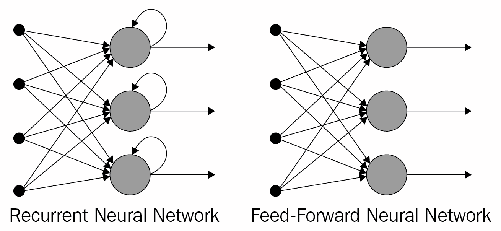
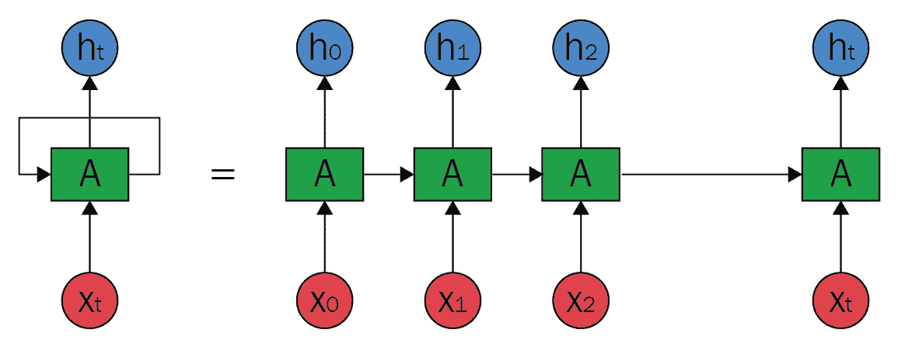
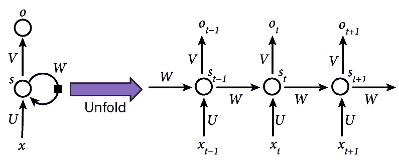
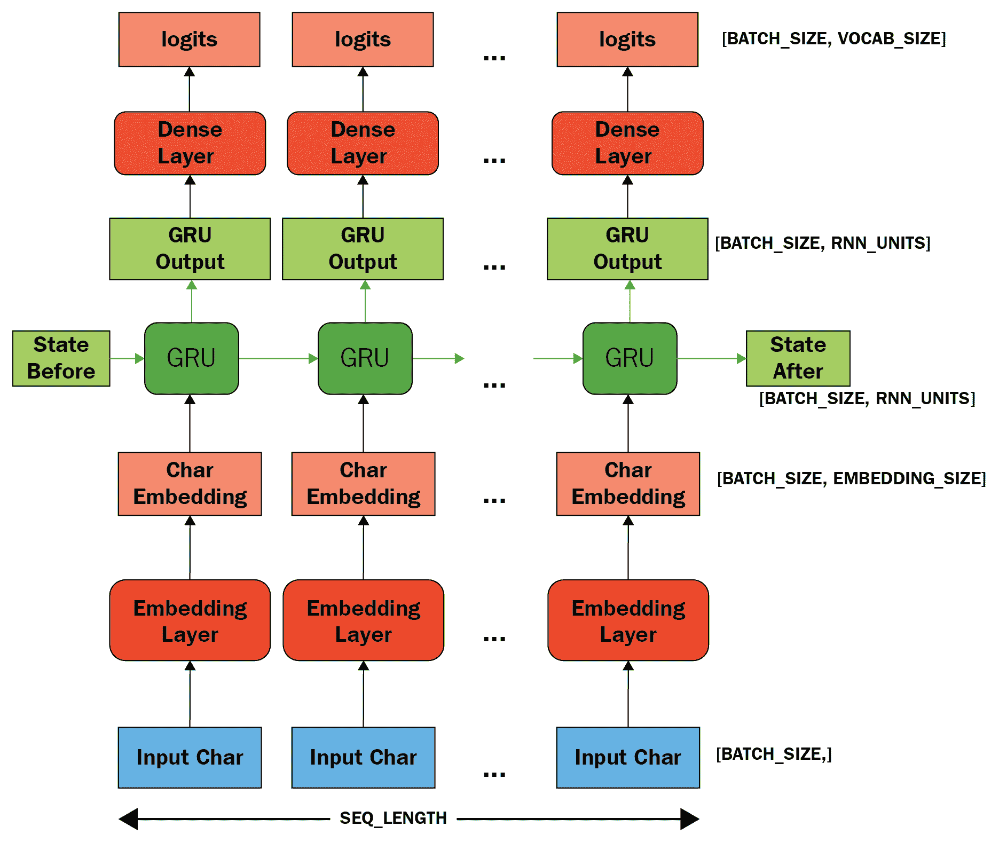
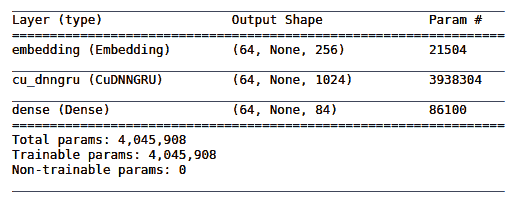
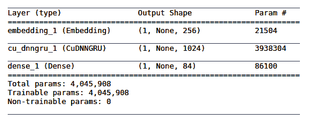
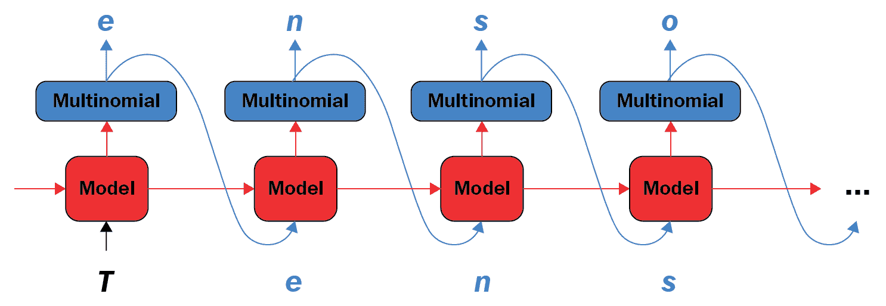

# 八、TensorFlow 2 和循环神经网络

包括卷积网络（CNN）在内的许多神经网络体系结构的主要缺点之一是它们不允许处理顺序数据。 换句话说，一个完整的特征（例如图像）必须一次全部呈现。 因此，输入是固定长度张量，而输出必须是固定长度张量。 先前特征的输出值也不会以任何方式影响当前特征。 同样，所有输入值（和输出值）都应视为彼此独立。 例如，在我们的`fashion_mnist`模型（第 4 章“使用 TensorFlow 2的监督机器学习”）中，每个输入时尚图像都独立于并且完全不了解先前图像。

**循环神经网络**（**RNN**）克服了这个问题，并使许多新的应用成为可能。

在本章中，我们将研究以下主题：

*   神经网络处理模式
*   循环架构
*   RNN 的应用
*   我们的 RNN 示例的代码
*   建立并实例化我们的模型
*   训练和使用我们的模型

# 神经网络处理模式

下图说明了各种神经网络处理模式：


矩形代表张量，箭头代表函数，红色是输入，蓝色是输出，绿色是张量状态。

从左到右，我们有以下内容：

*   普通前馈网络，固定尺寸的输入和固定尺寸的输出，例如图像分类
*   序列输出，例如，拍摄一张图像并输出一组用于标识图像中项目的单词的图像字幕
*   序列输入，例如情感识别（如我们的 IMDb 应用），其中句子被分为正面情感或负面情感
*   序列输入和输出，例如机器翻译，其中 RNN 接受英语句子并将其翻译为法语输出
*   逐帧同步输入和输出的序列，例如，类似于视频分类的两者

# 循环架构

因此，需要一种新的体系结构来处理顺序到达的数据，并且其输入值和输出值中的一个或两个具有可变长度，例如，语言翻译应用中句子中的单词。 在这种情况下，模型的输入和输出都具有不同的长度，就像之前的第四种模式一样。 同样，为了预测给定当前词的后续词，还需要知道先前的词。 这种新的神经网络架构称为 RNN，专门设计用于处理顺序数据。

出现术语**循环**是因为此类模型对序列的每个元素执行相同的计算，其中每个输出都依赖于先前的输出。 从理论上讲，每个输出都取决于所有先前的输出项，但实际上，RNN 仅限于回顾少量步骤。 这种布置等效于具有存储器的 RNN，该存储器可以利用先前的计算结果。

RNN 用于顺序输入值，例如时间序列，音频，视频，语音，文本，财务和天气数据。 它们在消费产品中的使用示例包括 Apple 的 Siri，Google 翻译和亚马逊的 Alexa。

将传统前馈网络与 RNN 进行比较的示意图如下：



每个 RNN 单元上的回送代表*记忆*。 前馈网络无法区分序列中的项目顺序，而 RNN 从根本上取决于项目的顺序。 例如，假设前馈网络接收到输入字符串`aardvark`：到输入为`d`时，网络已经忘记了先前的输入值为`a`，`a`和`r`，因此无法预测下一个`va`。 另一方面，在给定相同输入的情况下，循环网络“记住”先前的输入值为`a`，`a`和`r`，因此*有可能*根据其先前的训练来预测`va`是下一个。

RNN 的每个单独项目到网络的输入称为**时间步长**。 因此，例如，在字符级 RNN 中，每个字符的输入都是一个时间步。 下图说明了 RNN 的*展开*。

时间步长从`t = 0`开始，输入为`X[0]`，一直到时间步长`t = t`，输入为`X[t]`，相应的输出值为`h[0]`至`h[t]`，如下图所示：



展开式循环神经网络

RNN 在称为**沿时间反向传播**（**BPTT**）的过程中通过反向传播进行训练。 在此可以想象 RNN 的展开（也称为**展开**）会创建一系列神经网络，并且会针对每个时间步长计算误差并将其合并，以便可以使用反向传播更新网络中的权重。 例如，为了计算梯度，从而计算误差，在时间步`t = 6`时，我们将向后传播五个步，并对梯度求和。 但是，在尝试学习长期依赖关系时（即在相距很远的时间步之间），这种方法存在问题，因为梯度可能变得太小而使学习变得不可能或非常缓慢，或者它们可能变得太大并淹没了网络。 这被称为消失/爆炸梯度问题，并且已经发明了各种修改方法来解决它，包括**长短期记忆**（**LSTM**）网络和**门控循环单元**（**GRU** **s**），我们将在以后使用。

下图显示了有关展开（或展开）的更多详细信息：



循环神经网络的示意图

在该图中，我们可以看到以下内容：

*   `x[t]`是时间步长`t`的输入。 例如，`x[t]`可以是基于字符的 RNN 中的第十个字符，表示为来自字符集的索引。
*   `s[t]`是时间步`t`的隐藏状态，因此是网络的内存。
*   `s[t]`的计算公式为`s[t] = f(Ux[t] + Ws[t-1])`，其中`f`是非线性函数，例如 ReLU。 `U`，`V`和`W`是权重。
*   `o[t]`是时间步长`t`的输出。 例如，如果我们要计算字符序列中的下一个字母，它将是字符集`o[t] = Vs[t]`的概率向量。

如前所述，我们可以将`s[t]`视为网络的内存，因为它包含有关网络中较早时间步长发生了什么的信息。 请注意，权重`U`，`V`和`W`在每个步骤中都是共享的，因为我们在每个步骤都执行相同的计算，只是使用不同的输入值（ 结果是学习权重的数量大大减少了）。 还要注意，我们可能不需要每个时间步长的输出值（如图所示）。 如果我们要进行情感分析，每个步骤都是一个词，比如说电影评论，那么我们可能只关心最终的输出（正面或负面）。

现在，让我们看一个使用 RNN 的有趣示例，在该示例中，我们尝试以给定的写作风格创建文本。

# RNN 的应用

在此应用中，我们将看到如何使用基于字符的循环神经网络创建文本。 更改要使用的文本的语料库很容易（请参见下面的示例）； 在这里，我们将使用查尔斯·狄更斯（Charles Dickens）的小说《伟大的期望》。 我们将在此文本上训练网络，以便如果我们给它一个字符序列，例如`thousan`，它将产生序列中的下一个字符`d`。 此过程可以继续进行，可以通过在不断演变的序列上反复调用模型来创建更长的文本序列。

这是训练模型之前创建的文本的示例：

```py
Input: 
 'o else is there to inform?”\n\n“Is there no chance person who might identify you in the street?” said\n'
Next Char Predictions: 
 "dUFdZ!mig())'(ZIon“4g&HZ”@\nWGWtlinnqQY*dGJ7ioU'6(vLKL&cJ29LG'lQW8n-,M!JSVy”cjN;1cH\ndEEeMXhtW$U8Mt&sp"
```

这是一些文本，其中包含`Pip`序列，该序列是在模型经过 0.1 个温度（请参阅下文）进行 100 个周期（约 10 秒每个）的训练后创建的：

```py
Pip; it was not to be done. I had been a little while I was a look out and the strength of considerable particular by the windows of the rest of his prospering look at the windows of the room wing and the courtyard in the morning was the first time I had been a very much being strictly under the wall of my own person to me that he had done my sister, and I went on with the street common, I should have been a very little for an air of the river by the fire. For the man who was all the time of the money. My dear Herbert, who was a little way to the marshes he had ever seemed to have had once more than once and the more was a ragged hand before I had ever seemed to have him a dreadful loveriement in his head and with a falling to the table, and I went on with his arms, I saw him ever so many times, and we all the courtyard to the fire to be so often to be on some time when I saw his shoulder as if it were a long time in the morning I was a woman and a singer at the tide was remained by the 
```

对于不了解语法或拼写的系统来说，这并不是一个坏结果。 这显然是荒谬的，但那时我们并不是在追求理性。 只有一个不存在的单词（`loveriement`）。 因此，网络已经完成了学习拼写和学习单词是文本单元的工作。 还要注意，在下面的代码中，仅在短序列（`sequence_length = 100`）上训练网络。

接下来，我们将查看用于设置，训练和测试循环神经网络的代码。

# 我们的 RNN 示例的代码

此应用基于 Google 根据 Apache 2 许可提供的应用。

像往常一样，我们会将代码分解成片段，然后将您引到存储库中获取许可证和完整的工作版本。 首先，我们有模块导入，如下所示：

```py
import tensorflow as tf
import numpy as np
import os
import time
```

接下来，我们有文本文件的下载链接。

您可以通过在`file`中指定文件名和在`url`中指定文件的完整 URL，轻松地将其更改为所需的任何文本：

```py
file='1400-0.txt'
url='https://www.gutenberg.org/files/1400/1400-0.txt' # Great Expectations by Charles Dickens
```

然后，我们为该文件设置了 Keras `get_file()`工具，如下所示：

```py
path = tf.keras.utils.get_file(file,url)
```

然后，我们打开并读取文件，并以字符为单位查看文件的长度：

```py
text = open(path).read()
print ('Length of text: {} characters'.format(len(text)))
```

在文件开头没有我们不需要的文本，因此我们将其剥离掉，然后再看一下前几个字符就很有帮助了，接下来我们要做：

```py
# strip off text we don't need
text = text[835:]

# Take a look at the first 300 characters in text
print(text[:300])
```

输出应如下所示：

```py
My father's family name being Pirrip, and my Christian name Philip, my
infant tongue could make of both names nothing longer or more explicit
than Pip. So, I called myself Pip, and came to be called Pip.

I give Pirrip as my father's family name, on the authority of his
tombstone and my sister,--Mrs
```

现在，让我们看一下文本中有多少个唯一字符，使用一组字符来获取它们，并按其 ASCII 码的顺序对其进行排序：

```py
# The unique characters in the file
vocabulary = sorted(set(text))
print ('{} unique characters.'.format(len(vocabulary)))
```

这应该提供 84 个唯一字符。

接下来，我们创建一个字典，其中字符是键，而连续的整数是值。

这样我们就可以找到索引，表示任何给定字符的数值：

```py
# Create a  dictionary of unique character keys to index values
char_to_index = {char:index for index, char in enumerate(vocabulary)}
print(char_to_index)
```

输出如下：

```py
{'\n': 0, ' ': 1, '!': 2, '$': 3, '%': 4, '&': 5, "'": 6, '(': 7, ')': 8, '*': 9, ',': 10, '-': 11, '.': 12, '/': 13, '0': 14, '1': 15, '2': 16, '3': 17, '4': 18, '5': 19, '6': 20, '7': 21, '8': 22, '9': 23, ':': 24, ';': 25, '?': 26, '@': 27, 'A': 28, 'B': 29, 'C': 30, 'D': 31, 'E': 32, 'F': 33, 'G': 34, 'H': 35, 'I': 36, 'J': 37, 'K': 38, 'L': 39, 'M': 40, 'N': 41, 'O': 42, 'P': 43, 'Q': 44, 'R': 45, 'S': 46, 'T': 47, 'U': 48, 'V': 49, 'W': 50, 'X': 51, 'Y': 52, 'Z': 53, 'a': 54, 'b': 55, 'c': 56, 'd': 57, 'e': 58, 'f': 59, 'g': 60, 'h': 61, 'i': 62, 'j': 63, 'k': 64, 'l': 65, 'm': 66, 'n': 67, 'o': 68, 'p': 69, 'q': 70, 'r': 71, 's': 72, 't': 73, 'u': 74, 'v': 75, 'w': 76, 'x': 77, 'y': 78, 'z': 79, 'ê': 80, 'ô': 81, '“': 82, '”': 83}
```

我们还需要将字符存储在数组中。 这样我们就可以找到与任何给定数值对应的字符，即`index`：

```py
index_to_char = np.array(vocabulary)
print(index_to_char)
```

输出如下：

```py
['\n' ' ' '!' '$' '%' '&' "'" '(' ')' '*' ',' '-' '.' '/' '0' '1' '2' '3' '4' '5' '6' '7' '8' '9' ':' ';' '?' '@' 'A' 'B' 'C' 'D' 'E' 'F' 'G' 'H' 'I' 'J' 'K' 'L' 'M' 'N' 'O' 'P' 'Q' 'R' 'S' 'T' 'U' 'V' 'W' 'X' 'Y' 'Z' 'a' 'b' 'c' 'd' 'e' 'f' 'g' 'h' 'i' 'j' 'k' 'l' 'm' 'n' 'o' 'p' 'q' 'r' 's' 't' 'u' 'v' 'w' 'x' 'y' 'z' 'ê' 'ô' '“' '”']
```

现在，我们正在使用的整个文本已转换为我们作为字典创建的整数数组`char_to_index`：

```py
text_as_int = np.array([char_to_index[char] for char in text]
```

这是字符及其索引的示例：

```py
print('{')
for char,_ in zip(char_to_index, range(20)):
    print(' {:4s}: {:3d},'.format(repr(char), char_to_index[char]))
print(' ...\n}')
```

输出如下：

```py
{
  '\n':   0,
  ' ' :   1,
  '!' :   2,
  '$' :   3,
  '%' :   4,
  '&' :   5,
  "'" :   6,
  '(' :   7,
  ')' :   8,
  '*' :   9,
  ',' :  10,
  '-' :  11,
  '.' :  12,
  '/' :  13,
  '0' :  14,
  '1' :  15,
  '2' :  16,
  '3' :  17,
  '4' :  18,
  '5' :  19,
  ...
}
```

接下来，查看文本如何映射为整数很有用； 这是前几个：

```py
# Show how the first 15 characters from the text are mapped to integers
print ('{} ---- characters mapped to int ---- > {}'.format(repr(text[:15]), text_as_int[:15]))
```

输出如下：

```py
"My father's fam" ---- characters mapped to int ---- > [40 78  1 59 54 73 61 58 71  6 72  1 59 54 66]
```

然后，我们设置每个输入的句子长度，并因此设置训练周期中的示例数：

```py
# The maximum length sentence we want for a single input in characters
sequence_length = 100
examples_per_epoch = len(text)//seq_length
```

接下来，我们创建`data.Dataset`以在以后的训练中使用：

```py
# Create training examples / targets
char_dataset = tf.data.Dataset.from_tensor_slices(text_as_int)
# Display , sanity check
for char in char_dataset.take(5):
  print(index_to_char[char.numpy()])
```

输出如下：

```py
M y f a
```

我们需要批量此数据以将其馈送到我们的 RNN，因此接下来我们要这样做：

```py
sequences = char_dataset.batch(sequence_length+1, drop_remainder=True)
```

请记住，我们已经设置了`sequence_length = 100`，所以批量中的字符数是 101。

现在，我们有了一个函数来创建我们的输入数据和目标数据（必需的输出）。

该函数返回我们一直在处理的文本以及相同的文本，但是一起移动了一个字符，即，如果第一个单词是`Python`和`sequence_length = 5`，则该函数返回`Pytho`和`ython` 。

然后，我们通过连接输入和输出字符序列来创建数据集：

```py
def split_input_target(chunk):
   input_text = chunk[:-1]
   target_text = chunk[1:]
   return input_text, target_text

dataset = sequences.map(split_input_target)
```

接下来，我们执行另一个健全性检查。 我们使用先前创建的数据集来显示输入和目标数据。

请注意，`dataset.take(n)`方法从数据集中返回`n`批次。

在这里还请注意，由于我们已经启用了急切执行（当然，默认情况下，在 TensorFlow 2 中是这样），因此我们可以使用`numpy()`方法来查找张量的值：

```py
for input_example, target_example in dataset.take(1):
 print ('Input data: ', repr(''.join(index_to_char[input_example.numpy()]))) #101 characters
 print ('Target data:', repr(''.join(index_to_char[target_example.numpy()])))
```

输出如下：

```py
Input data: "My father's family name being Pirrip, and my Christian name Philip, my\ninfant tongue could make of b" Target data: "y father's family name being Pirrip, and my Christian name Philip, my\ninfant tongue could make of bo"
```

现在，我们可以通过几个步骤显示输入和预期输出：

```py
for char, (input_index, target_index) in enumerate(zip(input_example[:5], target_example[:5])):
    print("Step {:4d}".format(char))
    print(" input: {} ({:s})".format(input_index, repr(index_to_char[input_index])))
    print(" expected output: {} ({:s})".format(target_index, repr(index_to_char[target_index])))
```

以下是此输出：

```py
Step 0:      input: 40 ('M'),  expected output: 78 ('y') Step 1:      input: 78 ('y'),  expected output: 1 (' ') Step 2:      input: 1 (' '),  expected output: 59 ('f') Step 3:      input: 59 ('f'),  expected output: 54 ('a') Step 4:      input: 54 ('a'),  expected output: 73 ('t')
```

接下来，我们为训练进行设置，如下所示：

```py
# how many characters in a batch
batch = 64

# the number of training steps taken in each epoch
steps_per_epoch = examples_per_epoch//batch # note integer division

# TF data maintains a buffer in memory in which to shuffle data 
# since it is designed to work with possibly endless data
buffer = 10000

dataset = dataset.shuffle(buffer).batch(batch, drop_remainder=True)

# call repeat() on dataset so data can be re-fed into the model from the beginning
dataset = dataset.repeat()

dataset
```

这给出了以下数据集结构：

```py
<RepeatBatchDataset shapes: ((64, 100), (64, 100)), types: (tf.int64, tf.int64)>
```

此处，`64`是批次大小，`100`是序列长度。 以下是我们训练所需的一些值：

```py
# The vocabulary length in characters
vocabulary_length = len(vocabulary)

# The embedding dimension 
embedding_dimension = 256

# The number of recurrent neural network units
recurrent_nn_units = 1024
```

我们正在使用 GRU，在 **CUDA 深度神经网络**（**cuDNN**）库中，如果代码在 GPU 上运行，则可以使用这些例程进行快速计算。 GRU 是在 RNN 中实现内存的一种方式。 下一节将实现此想法，如下所示：

```py
if tf.test.is_gpu_available():
    recurrent_nn = tf.compat.v1.keras.layers.CuDNNGRU
    print("GPU in use")
else:
    import functools
    recurrent_nn = functools.partial(tf.keras.layers.GRU, recurrent_activation='sigmoid')
    print("CPU in use")
```

# 建立并实例化我们的模型

如我们先前所见，一种用于构建模型的技术是将所需的层传递到`tf.keras.Sequential()`构造器中。 在这种情况下，我们分为三层：嵌入层，RNN 层和密集层。

第一嵌入层是向量的查找表，一个向量用于每个字符的数值。 它的尺寸为`embedding_dimension`。 中间，循环层是 GRU； 其大小为`recurrent_nn_units`。 最后一层是长度为`vocabulary_length`单元的密集输出层。

该模型所做的是查找嵌入，使用嵌入作为输入来运行 GRU 一次，然后将其传递给密集层，该层生成下一个字符的对数（对数赔率）。

如下图所示：



因此，实现此模型的代码如下：

```py
def build_model(vocabulary_size, embedding_dimension, recurrent_nn_units, batch_size):
    model = tf.keras.Sequential(
        [tf.keras.layers.Embedding(vocabulary_size, embedding_dimension, batch_input_shape=[batch_size, None]),
    recurrent_nn(recurrent_nn_units, return_sequences=True, recurrent_initializer='glorot_uniform', stateful=True),
    tf.keras.layers.Dense(vocabulary_length)
  ])
    return model
```

现在我们可以实例化我们的模型，如下所示：

```py
model = build_model(
  vocabulary_size = len(vocabulary),
  embedding_dimension=embedding_dimension,
  recurrent_nn_units=recurrent_nn_units,
  batch_size=batch)
```

现在，我们可以进行健全性检查，以确保我们的模型输出正确的形状。 注意使用`dataset.take()`提取数据集的元素：

```py
for batch_input_example, batch_target_example in dataset.take(1):
    batch_predictions_example = model(batch_input_example)
    print(batch_predictions_example.shape, "# (batch, sequence_length, vocabulary_length)")
```

以下是此输出：

```py
(64, 100, 84) # (batch, sequence_length, vocabulary_length)
```

这是预期的； 回想一下，我们的字符集中有`84`个唯一字符。

这是显示我们的模型外观的代码：

```py
model.summary()
```

我们的模型架构摘要的输出如下：



再次回想一下，我们有`84`输入值，我们可以看到，对于嵌入层，`84 * 256 = 21,504`，对于密集层，`1024 * 84 + 84（偏置单元）= 86,100`。

# 使用我们的模型获得预测

为了从我们的模型中获得预测，我们需要从输出分布中抽取一个样本。 此采样将为我们提供该输出分布所需的字符（对输出分布进行采样很重要，因为像通常那样对它进行`argmax`提取，很容易使模型陷入循环）。

在显示索引之前，`tf.random.categorical`进行此采样，`axis=-1`与`tf.squeeze`删除张量的最后一个维度。

`tf.random.categorical`的签名如下：

```py
tf.random.categorical(logits, num_samples, seed=None, name=None, output_dtype=None)
```

将其与调用进行比较，我们看到我们正在从预测（`example_batch_predictions[0]`）中获取一个样本（长度为`sequence_length = 100`）。 然后删除了多余的尺寸，因此我们可以查找与示例相对应的字符：

```py
sampled_indices = tf.random.categorical(logits=batch_predictions_example[0], num_samples=1)

sampled_indices = tf.squeeze(sampled_indices,axis=-1).numpy()

sampled_indices
```

这将产生以下输出：

```py
array([79, 43, 3, 12, 20, 24, 54, 10, 61, 43, 46, 15, 0, 24, 39, 77, 2, 73, 4, 78, 5, 60, 13, 65, 1, 75, 47, 33, 61, 13, 64, 41, 32, 42, 40, 20, 37, 10, 60, 51, 21, 17, 69, 8, 3, 74, 64, 68, 2, 3, 35, 13, 67, 16, 46, 48, 47, 1, 38, 80, 47, 8, 32, 53, 50, 28, 63, 33, 35, 72, 80, 0, 7, 64, 2, 79, 1, 56, 61, 13, 55, 28, 62, 30, 40, 22, 32, 40, 27, 46, 21, 51, 10, 76, 64, 47, 72, 83, 45, 8])
```

让我们看一下到训练之前的一些输入和输出*：*

```py
print("Input: \n", repr("".join(index_to_char[batch_input_example[0]])))

print("Next Char Predictions: \n", repr("".join(index_to_char[sampled_indices ])))
#
```

因此输出如下。 输入的文本之后是下一个字符预测（在训练之前）：

```py
Input: 
 'r, that I might refer to it again; but I could not find it, and\nwas uneasy to think that it must hav'
Next Char Predictions: 
 "hFTzJe;rAô:G*'”x4d?&ôce9QekL:*O7@KuoZM&“$r0mg\n%/2-6QaE&$)/'Y8m.x)94b?fKp.rRô.3IMMTMjMMag.iL1LuM6 ?';"
```

接下来，我们定义`loss`函数：

```py
def loss(labels, logits):
 return tf.keras.losses.sparse_categorical_crossentropy(labels, logits, from_logits=True)
```

然后，我们在训练之前查看模型的损失，并进行另一次尺寸完整性检查：

```py
batch_loss_example = tf.compat.v1.losses.sparse_softmax_cross_entropy(batch_target_example, batch_predictions_example)
print("Prediction shape: ", batch_predictions_example.shape, " # (batch_size, sequence_length, vocab_size)")
print("scalar_loss: ", batch_loss_example.numpy())
```

这将产生以下输出：

```py
Prediction shape: (64, 100, 84) # (batch, sequence_length, vocabulary_length) 
scalar_loss: 4.429237
```

为了准备我们的训练模型，我们现在使用`AdamOptimizer`和 softmax 交叉熵损失对其进行编译：

```py
#next produced by upgrade script.... 
#model.compile(optimizer = tf.compat.v1.train.AdamOptimizer(), loss = loss) 
#.... but following optimizer is available.
model.compile(optimizer = tf.optimizers.Adam(), loss = loss)

```

我们将保存模型的权重，因此，接下来，我们为此准备检查点：

```py
# The checkpoints will be saved in this directory
directory = './checkpoints'

# checkpoint files
file_prefix = os.path.join(directory, "ckpt_{epoch}")
callback=[tf.keras.callbacks.ModelCheckpoint(filepath=file_prefix, save_weights_only=True)]
```

最后，我们可以使用对`model.fit()`的调用来训练模型：

```py
epochs=45 # *much* faster on GPU, ~10s / epoch, reduce this figure significantly if on CPU 

history = model.fit(dataset, epochs=epochs, steps_per_epoch=steps_per_epoch, callbacks=callback)
```

这给出以下输出：

```py
Epoch 1/50 158/158 [==============================] - 10s 64ms/step - loss: 2.6995 .................... Epoch 50/50 158/158 [==============================] - 10s 65ms/step - loss: 0.6143
```

以下是最新的检查点：

```py
tf.train.latest_checkpoint(directory)
```

可以解决以下结果：

```py
'./checkpoints/ckpt_45'
```

因此，我们可以重建模型（以展示其完成方式）：

```py
model = build_model(vocabulary_size, embedding_dimension, recurrent_nn_units, batch_size=1)

model.load_weights(tf.train.latest_checkpoint(directory))

model.build(tf.TensorShape([1, None]))

model.summary()
```

下表显示了我们模型的摘要：



接下来，在给定训练有素的模型，起始字符串和温度的情况下，我们使用一个函数来生成新文本，其值确定文本的随机性（低值给出更多可预测的文本；高值给出更多随机的文本）。

首先，我们确定要生成的字符数，然后向量化起始字符串，并为其添加空白尺寸。 我们将额外的维添加到`input_string`变量中，因为 RNN 单元需要它（两个必需的维是批量长度和序列长度）。 然后，我们初始化一个变量，用于存储生成的文本。

`temperature`的值确定生成的文本的随机性（较低的随机性较小，意味着更可预测）。

在一个循环中，对于要生成的每个新字符，我们使用包含 RNN 状态的模型来获取下一个字符的预测分布。 然后使用多项式分布来找到预测字符的索引，然后将其用作模型的下一个输入。 由于存在循环，模型返回的 RNN 状态将反馈到模型中，因此它现在不仅具有一个字符，而且具有更多信息。 一旦预测了下一个字符，就将修改后的 RNN 状态反复反馈到模型中，以便模型学习，因为它从先前预测的字符获得的上下文会增加。

下图显示了它是如何工作的：



在这里，多项式用`tf.random.categorical`实现； 现在我们准备生成我们的预测文本：

```py
def generate_text(model, start_string, temperature, characters_to_generate):

# Vectorise the start string into numbers 
  input_string = [char_to_index[char] for char in start_string]
# add extra dimension to input_string
  input_string = tf.expand_dims(input_string, 0)

# Empty list to store generated text
  generated = []

# (batch size is 1)
  model.reset_states()
  for i in range(characters_to_generate):
    predictions = model(input_string) #here's where we need the extra dimension

    # remove the batch dimension
    predictions = tf.squeeze(predictions, 0)

    # using a random categorical (multinomial) distribution to predict word returned by the model
    predictions = predictions / temperature
    predicted_id = tf.random.categorical(logits=predictions, num_samples=1)[-1,0].numpy()

    # Pass  predicted word as  next input to the model along with previous hidden state
    input_string = tf.expand_dims([predicted_id], 0)

    generated.append(index_to_char[predicted_id])
return (start_string + ''.join(generated)) # generated is a list
```

因此，在定义函数之后，我们可以调用它以返回生成的文本。

在给定的函数参数中，低温给出更多可预测的文本，而高温给出更多随机的文本。 同样，您可以在此处更改起始字符串并更改函数生成的字符数：

```py
generated_text = generate_text(model=model, start_string="Pip", temperature=0.1, characters_to_generate = 1000)
print(generated_text)
```

经过 30 个训练周期后，将产生以下输出：

```py
Pip; it was a much better to and the Aged and weaking his hands of the windows of the way who went them on which the more I had been a very little for me, and I went on with his back in the soldiers of the room with the whole hand the other gentleman with the hand on the service, when I was a look of half of the room was was the first time of the money. I forgetter, Mr. Pip?” “I don't know that I have no more than I know what I have no inquiry with the rest of its being straight up again. He came out of the room, and in the midst of the room was was all the words, “and he came into the Castle. One would repeat it to your expectations condition of the courtyard. In a moment was the first time in the house to the fork, and we all lighted and at his being so beautiful looking at the convicts. My depression of the morning, I looked at him in the morning, I should not have been made a strong for the first time of the wall before the table to the forefinger of the room, and had not quite diffi
```

`Loss = 0.6761`； 该文本或多或少地被正确地拼写和标点，尽管其含义（我们并未试图实现）的含义在很大程度上是愚蠢的。 它还没有学习如何正确使用语音标记。 只有两个无意义的单词（`forgetter`和`weaking`），经过检查，在语义上仍然是合理的。 生成的是否为 Charles Dickens 风格是一个悬而未决的问题。

周期数的实验表明，损失在约 45 周期时达到最小值，此后它开始增加。

45 个周期后，输出如下：

```py
Pip; or I should
have felt painfully consciousness that he was the man with his back to the kitchen, and he seemed to have no
strength, and as I had often seen her shutters with the poker on
the parlor, through having been every disagreeable to be seen; I thought I would give him more letters of my own
eyes and flared about the fire, and showed the greatest state of mind,
I thought I would give up of his having fastened out of the room, and had
made some advance in that respect to me to feel an
indescribable awe as it was a to be even than ever of her steps, or for old
asked, “Yes.”

“What is it?” repeated Mr. Jaggers. “You know I was in my mind by his blue eyes most of all admirers,
and that she had shaken hands contributing the poker out of his
hands in his pockets and his dinner loosely tied in a busy preparation for the reference to my United and
self-possession when Miss Havisham and Estella now that I had been too much to be the salvey dark night, which seemed so long
ago. “Yes, de
```

`Loss = 0.6166`； 该模型现在似乎已正确配对了语音标记，并且没有无意义的单词。

# 总结

这样就结束了我们对 RNN 的研究。 在本章中，我们首先讨论了 RNN 的一般原理，然后介绍了如何获取和准备一些供模型使用的文本，并指出在此处使用替代文本源很简单。 然后，我们看到了如何创建和实例化我们的模型。 然后，我们训练了模型并使用它从起始字符串中产生文本，并注意到网络已了解到单词是文本的单元以及如何拼写各种各样的单词（有点像文本作者的风格）， 几个非单词。

在下一章中，我们将研究 TensorFlow Hub 的使用，它是一个软件库。