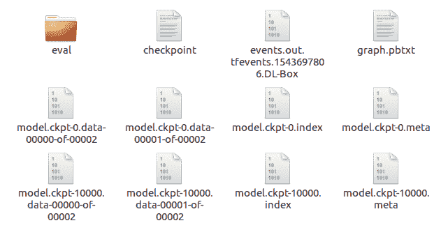
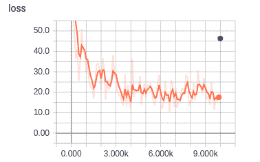
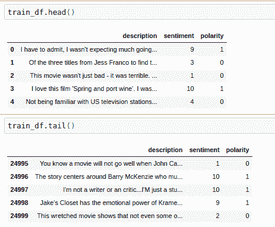
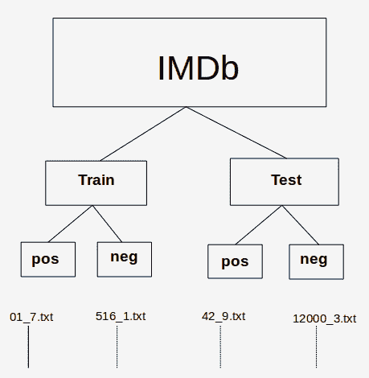
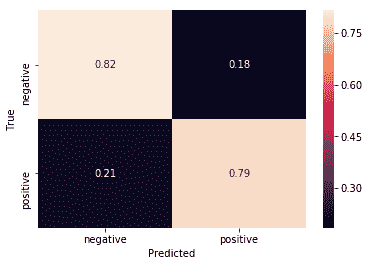
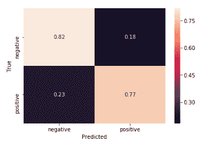

# 九、TensorFlow 估计器和 TensorFlow HUB

本章分为两部分，但是此处的技术是相关的。 首先，我们将研究 TensorFlow 估计器如何为 TensorFlow 提供简单的高级 API，其次，我们将研究 TensorFlow Hub 如何包含可在自己的应用中使用的模块。

在本章中，我们将涵盖以下主要主题：

*   TensorFlow 估计器
*   TensorFlow HUB

# TensorFlow 估计器

`tf.estimator`是 TensorFlow 的高级 API。 它通过提供用于服务模型的直接训练，评估，预测和导出的方法来简化机器学习编程。

估计器为 TensorFlow 开发人员带来了许多优势。 与低级 API 相比，使用估计器开发模型更容易，更直观。 特别是，同一模型可以在本地计算机或分布式多服务器系统上运行。 该模型也不了解其所处的处理器，即 CPU，GPU 或 TPU。 估计器还通过简化模型开发人员共享实现的过程，简化了开发过程，并且由于构建在 Keras 层上，因此使自定义更加简单。

估计器会处理与 TensorFlow 模型一起使用的所有背景管线。 它们支持安全，分布式的训练循环，用于图构建，变量初始化，数据加载，异常处理，创建检查点文件，从故障中恢复以及为 TensorBoard 保存摘要。 正如我们将看到的，由于它们创建检查点，因此它们支持在给定数量的步骤之后停止和开始训练。

开发估计器模型的过程分为四个步骤：

1.  采集数据并创建数据函数
2.  创建特征列
3.  实例化估计器
4.  评估模型的表现

我们将在以下代码中举例说明这些步骤。

我们之前已经看过`fashion_mnist`数据集（在第 5 章“将 TensorFlow 2 用于无监督学习”），因此我们将再次使用该数据集来演示估计器的用例。

# 代码

首先，这是必需的导入：

```py
import tensorflow as tf
import numpy as np
```

接下来，我们获取并预处理数据。 注意，`tf.keras.datasets`中方便地存在`fashion_mnist`。 数据集中的`x`值采用整数 NumPy 数组的形式，每个元素的范围为 0 到 255，代表`28 x 28`像素时尚图像中每个像素的灰度值。 为了进行训练，必须将这些值转换为 0 到 1 范围内的浮点数。`y`值采用无符号 8 位整数`(uint8)`的形式，并且必须转换为 32 位整数（`int32` ），供估计工具再次使用。

尽管可以用以下方法试验该超参数值，但将学习率设置为一个很小的值：

```py
fashion = tf.keras.datasets.fashion_mnist
(x_train, y_train),(x_test, y_test) = fashion.load_data()
print(type(x_train))
x_train, x_test = x_train / 255.0, x_test / 255.0

y_train, y_test = np.int32(y_train), np.int32(y_test)

learning_rate = 1e-4
```

之后，是我们的训练输入特征。

当您具有数组中的完整数据集并需要快速进行批量，混排和/或重复的方法时，将使用`tf.compat.v1.estimator.inputs.numpy_input_fn`。

其签名如下：

```py
tf.compat.v1.estimator.inputs.numpy_input_fn(
 x,
 y=None,
 batch_size=128,
 num_epochs=1,
 shuffle=None,
 queue_capacity=1000,
 num_threads=1
)
```

将此与我们对函数的调用进行比较，您可以看到`x`值如何作为 NumPy 数组的字典（与张量兼容）传递，以及`y`照原样传递。 在此阶段，我们尚未指定周期数，即该函数将永远运行（稍后将指定步骤），我们的批量大小（即一步中显示的图像数）为`50`， 并在每一步之前将数据在队列中混洗。 其他参数保留为其默认值：

```py
train_input_fn = tf.compat.v1.estimator.inputs.numpy_input_fn(
    x={"x": x_train},
        y=y_train,
        num_epochs=None,
        batch_size=50,
        shuffle=True
)
```

值得一提的是，尽管这样的便利函数虽然在 TensorFlow 2.0 alpha 中不可用，但仍有望改用 TensorFlow2。

测试函数具有相同的签名，但是在这种情况下，我们仅指定一个周期，并且正如 Google 所建议的那样，我们不会对数据进行混洗。 同样，其余参数保留为其默认值：

```py
test_input_fn = tf.compat.v1.estimator.inputs.numpy_input_fn(
    x={"x": x_test},
        y=y_test,
        num_epochs=1,
        shuffle=False
)
```

接下来，我们建立特征列。 特征列是一种将数据传递给估计器的方法。

特征列函数的签名如下。 `key`是唯一的字符串，是与我们先前在输入函数中指定的字典名称相对应的列名称（有关不同类型的特征列的更多详细信息，请参见[这里](https://www.tensorflow.org/api_docs/python/tf/feature_column)）：

```py
tf.feature_column.numeric_column(
    key,
    shape=(1,),
    default_value=None,
    dtype=tf.float32,
    normalizer_fn=None
)
```

在我们的特定特征列中，我们可以看到关键是`"x"`，并且形状就是`fashion_mnist`数据集图像的`28 x 28`像素形状：

```py
feature_columns = [tf.feature_column.numeric_column("x", shape=[28, 28])]
```

接下来，我们实例化我们的估计器，它将进行分类。 它将为我们构建一个深度神经网络。 它的签名很长很详细，因此我们将带您参考[这里](https://www.tensorflow.org/api_docs/python/tf/estimator/DNNClassifier)，因为我们将主要使用其默认参数。 它的第一个参数是我们刚刚指定的特征，而第二个参数是我们的网络规模。 （输入层和输出层由估计器在后台添加。）`AdamOptimizer`是安全的选择。 `n_classes`对应于我们`fashion_mnist`数据集的`y`标签数量，我们在其中添加了`0.1`的适度`dropout`。 然后，`model_dir`是我们保存模型参数及其图和检查点的目录。 此目录还用于将检查点重新加载到估计器中以继续训练：

```py
# Build 2 layer DNN classifier
classifier = tf.estimator.DNNClassifier(
    feature_columns=feature_columns,
    hidden_units=[256, 32],
    optimizer=tf.compat.v1.train.AdamOptimizer(learning_rate),
    n_classes=10,
    dropout=0.1,
    model_dir="./tmp/mnist_modelx"
, loss_reduction=tf.compat.v1.losses.Reduction.SUM)
```

现在，我们准备训练模型。 如果您第二次或之后运行`.train`循环，则 Estimator 将从`model_dir`加载其模型参数，并进行进一步的`steps`训练（要完全从头开始，只需通过`model_dir`删除指定的目录）：

```py
classifier.train(input_fn=train_input_fn, steps=10000)
```

典型的输出线如下所示：

```py
INFO:tensorflow:loss = 25.540459, step = 1600 (0.179 sec) INFO:tensorflow:global_step/sec: 523.471
```

最终输出如下所示：

```py
INFO:tensorflow:Saving checkpoints for 10000 into ./tmp/mnist_modelx/model.ckpt.
INFO:tensorflow:Loss for final step: 13.06977.
```

`model_dir`中指定的目录如下所示：



为了评估模型的表现，使用了`classifier.evaluate`方法。 其签名如下：

```py
classifier.evaluate(input_fn, steps=None, hooks=None, checkpoint_path=None, name=None)
```

这将返回一个字典，因此在我们的调用中，我们正在提取准确率指标。

在此，`steps`默认为`None`。 这将评估模型，直到`input_fn`引发输入结束异常，即，它将评估整个测试集：

```py
 accuracy_score = classifier.evaluate(input_fn=test_input_fn)["accuracy"]
 print("\nTest Accuracy: {0:f}%\n".format(accuracy_score*100))
```

我们还可以使用以下命令在 TensorBoard 中查看训练的进度：

```py
tensorboard --logdir=./tmp/mnist_modelx
```

此处，损失图如下所示，其中`x`轴以 1,000（k）单位表示：



到此结束我们对时尚估计器分类器的了解。 现在我们来看看 TensorFlow Hub。

# TensorFlow HUB

TensorFlow Hub 是一个软件库。 其目的是提供可重用的组件（称为模块），这些组件可在开发组件的原始上下文之外的上下文中使用。 所谓模块，是指 TensorFlow 图的一个独立部分及其权重，可以在其他类似任务中重复使用。

# IMDb（电影评论数据库）

在本节中，我们将研究一种基于 Google 的应用，该应用在**情感分析**中分析了电影评论的 IMDb 的子集。 该子集由斯坦福大学主持，包含每部电影的评论，以及情感积极性等级为 1 到 4（差）和 7 到 10（好）的情感。 问题在于确定关于每个电影的文本句子中表达的视图的极性，即针对每个评论，以确定它是正面评论还是负面评论。 我们将在 TensorFlow Hub 中使用一个模块，该模块先前已经过训练以生成单词嵌入。

词嵌入是数字的向量，因此具有相似含义的词也具有类似的向量。 这是监督学习的示例，因为评论的训练集将使用 IMDB 数据库提供的阳性值来训练模型。 然后，我们将在测试集上使用经过训练的模型，并查看其预测与 IMDB 数据库中存储的预测相比如何，从而为我们提供了一种准确率度量。

可以在[这个页面](http://ai.stanford.edu/~amaas/data/sentiment/)中找到该数据库论文的引文。

# 数据集

[以下是数据库随附的自述文件](http://ai.stanford.edu/~amaas/data/sentiment/)：

"The core dataset contains 50,000 reviews split evenly into 25k train and 25k test sets. The overall distribution of labels is balanced (25k pos and 25k neg)."
"In the entire collection, no more than 30 reviews are allowed for any given movie because reviews for the same movie tend to have correlated ratings. Further, the train and test sets contain a disjoint set of movies, so no significant performance is obtained by memorizing movie-unique terms and their associated with observed labels. In the labeled train/test sets, a negative review has a score <= 4 out of 10, and a positive review has a score >= 7 out of 10\. Thus, reviews with more neutral ratings are not included in the train/test sets."

这是从 IMDb 训练头的顶部起的五行示例：

|  | **句子** | **情感** | **极性** |
| --- | --- | --- | --- |
| 0 | `I came here for a review last night before dec...` | 3 | 0 |
| 1 | `Look, I'm reading and reading these comments and...` | 4 | 0 |
| 2 | `I was overtaken by the emotion. Unforgettable ...` | 10 | 1 |
| 3 | `This movie could have been a decent B-movie if...` | 4 | 0 |
| 4 | `I have a thing for old black and white movies ...` | 10 | 1 |

这是其尾部的五行：

|  | 句子 | 情感 | 极性 |
| --- | --- | --- | --- |
| 24995 | `I have watched some pretty poor films in the p...` | 1 | 0 |
| 24996 | `This film is a calculated attempt to cash in t...` | 1 | 0 |
| 24997 | `This movie was so very badly written. The char...` | 1 | 0 |
| 24998 | `I am a huge Stooges fan but the one and only r...` | 2 | 0 |
| 24999 | `Well, let me start off by saying how utterly H...` | 3 | 0 |

以下是测试集：



# 代码

现在，让我们看一下在这些数据上训练的代码。 在程序的顶部，我们有通常的导入，以及可能需要与`pip` – `tensorflow_hub`，`pandas`和`seaborn`一起安装的三个额外的导入。 如前所述，我们将使用`tensorflow_hub`中的模块； 我们还将使用`pandas`的一些`DataFrame`属性和`seaborn`的一些绘制方法：

```py
import tensorflow as tf
import tensorflow_hub as hub
import matplotlib.pyplot as plt
import numpy as np
import os
import pandas as pd
import re
import seaborn as sns
```

另外，这是一些值和我们稍后需要的方法：

```py
n_classes = 2
hidden_units = [500,100]
learning_rate = 1e-4
steps = 1000
optimizer = tf.optimizers.Adagrad(learning_rate=learning_rate)
# upgrade script gave this:
#optimizer = tf.compat.v1.train.AdagradOptimizer(learning_rate = learning_rate)
```

重要的是要认识到，这里使用的 IMDb 数据是目录的分层结构形式。

顶级 IMDb 目录包含两个子目录：`train`和`test`。 `train`和`test`子目录分别包含另外两个子目录`pos`和`neg`：

*   `pos`：包含文本文件的集合。 每个文本文件都是正面评价（极性为 1）。
*   `neg`：包含文本文件的集合。 每个文本文件都是负面评论（极性为 0）。

情感（分别为 7 到 10 或 1 到 4）记录在文件名中； 例如，文件名为`18_7.txt`的文本文件评论的情感为 7（`pos`），而文件名为`38_2.txt`的文本文件评论的情感为 2（`neg`）：



IMDb 目录/文件层次结构

我们从调用层次结构中的三个函数开始，这些函数获取并预处理审阅数据。

在第一个函数`load_data(directory)`中，`directory_data`是一个字典，其中加载了`directory`中的数据，该数据作为参数传入并作为 pandas `DataFrame`返回。

用`description`和`sentiment`键初始化`directory_data`字典，然后将它们分配为空列表作为值。

然后，该函数循环遍历`directory`中的每个文件，并且对于每个文本文件，读取其内容（作为电影评论）并将其附加到情感列表中。 然后，它使用正则表达式分析文件名并提取数字情感，如前所示，该数字情感紧随文件名中的下划线（`_`）。 该函数将此数字情感附加到`sentiment`列表中。 当所有`.txt`文件都循环通过后，该函数将返回已转换为 pandas `DataFrame`的字典：

```py
# Load all files from a directory into a Pandas DataFrame.
def load_data(directory):
    directory_data = {}
    directory_data["description"] = []
    directory_data["sentiment"] = []
    for file in os.listdir(directory):
        with tf.io.gfile.GFile(os.path.join(directory, file), "r") as f:
            directory_data["description"].append(f.read())
            directory_data["sentiment"].append(re.match("\d+_(\d+)\.txt", file).group(1))
    return pd.DataFrame.from_dict(directory_data)
```

如我们前面所述，下一个函数`load(directory)`调用`load_data(directory)`从`pos`和`neg`子目录创建一个`DataFrame`。 它将适当的极性作为额外字段添加到每个`DataFrame`。 然后，它返回一个新的`DataFrame`，该数据帧由`pos`和`neg`的`DataFrame`的连接组成，经过混洗（`sample(frac=1)`），并插入了新的数字索引（因为我们已经对行进行了混排）：

```py
# Merge positive and negative examples, add a polarity column and shuffle.
def load(directory):
    positive_df = load_data(os.path.join(directory, "pos"))
    positive_df["polarity"] = 1

    negative_df = load_data(os.path.join(directory, "neg"))
    negative_df["polarity"] = 0
    return pd.concat([positive_df, negative_df]).sample(frac=1).reset_index(drop=True)
```

第三个也是最后一个函数是`acquire_data()`。 如果缓存中不存在该函数，则使用 Keras 工具从 Stanford URL 中获取我们所需的文件。 默认情况下，高速缓存是位于`~/.keras/datasets`的目录，如有必要，文件将提取到该位置。 该工具将返回到我们的 IMDb 的路径。 然后将其传递给`load_dataset()`的两个调用，以获取训练和测试`DataFrame`：

```py
# Download and process the dataset files.
def acquire_data():
    data = tf.keras.utils.get_file(
    fname="aclImdb.tar.gz",
    origin="http://ai.stanford.edu/~amaas/data/sentiment/aclImdb_v1.tar.gz", extract=True)

    train_df = load(os.path.join(os.path.dirname(data), "aclImdb", "train"))
    test_df = load(os.path.join(os.path.dirname(data), "aclImdb", "test"))

    return train_df, test_df
tf.compat.v1.logging.set_verbosity(tf.compat.v1.logging.ERROR)
```

主程序要做的第一件事是通过调用我们刚刚描述的函数来获取训练并测试 pandas `DataFrame`：

```py
train_df, test_df = acquire_data()
```

此时，`train_df`和`test_df`包含我们要使用的数据。

在查看下一个片段之前，让我们看一下它的签名。 这是一个估计器，它返回用于将 Pandas `DataFrame`馈入模型的输入函数：

```py
tf.compat.v1.estimator.inputs.pandas_input_fn(x, y=None, batch_size=128, num_epochs=1, shuffle=None, queue_capacity=1000, num_threads=1, target_column='target')
```

调用本身如下：

```py
# Training input on the whole training set with no limit on training epochs
train_input_fn = tf.compat.v1.estimator.inputs.pandas_input_fn(train_df, train_df["polarity"], num_epochs=None, shuffle=True)
```

通过将此调用与函数签名进行比较，我们可以看到训练数据帧`train_df`与每个评论的极性一起传入。 `num_epochs =None`表示对训练周期的数量没有限制，因为我们将在后面进行指定； `shuffle=True`表示以随机顺序读取记录，即文件的每一行。

接下来是预测训练结果的函数：

```py
# Prediction on the whole training set.
predict_train_input_fn = tf.compat.v1.estimator.inputs.pandas_input_fn(train_df, train_df["polarity"], shuffle=False)
```

我们还具有预测测试结果的函数：

```py
# Prediction on the test set.
predict_test_input_fn = tf.compat.v1.estimator.inputs.pandas_input_fn(test_df, test_df["polarity"], shuffle=False)
```

然后，我们有特征列。 特征列是原始数据和估计器之间的中介。 共有九种特征列类型。 它们根据其类型采用数值或分类数据，然后将数据转换为适用于估计器的格式。 在[这个页面](https://www.tensorflow.org/guide/feature_columns)上有一个出色的描述以及许多示例。

请注意，嵌入来自`tf.hub`：

```py
embedded_text_feature_column = hub.text_embedding_column(
    key="description",
    module_spec="https://tfhub.dev/google/nnlm-en-dim128/1")
```

接下来，我们有我们的深度神经网络估计器。 估计器是用于处理模型的高级工具。

估计器的示例包括`DNNClassifier`，即用于 TensorFlow 深层神经网络的分类器（在以下代码中使用），以及`LinearRegressor`，即用于线性回归问题的分类器。 其签名如下：

```py
tf.estimator.DNNClassifier(hidden_units, feature_columns, model_dir=None, n_classes=2, weight_column=None, label_vocabulary=None, optimizer='Adagrad', activation_fn=<function relu at 0x7fbb75512488>, dropout=None, input_layer_partitioner=None, config=None, warm_start_from=None, loss_reduction='weighted_sum', batch_norm=False, loss_reduction=None)
```

让我们将此与通话进行比较：

```py
estimator = tf.estimator.DNNClassifier(
    hidden_units = hidden_units,
    feature_columns=[embedded_text_feature_column],
    n_classes=n_classes,
    optimizer= optimiser,
    model_dir = "./tmp/IMDbModel"
, loss_reduction=tf.compat.v1.losses.Reduction.SUM)
```

我们可以看到，我们将使用具有 500 和 100 个单元的隐藏层的神经网络，我们先前定义的特征列，两个输出类（标签）和`ProximalAdagrad`优化器。

请注意，与前面的示例一样，由于我们指定了`model_dir`，因此估计器将保存一个检查点和各种模型参数，以便在重新训练时，将从该目录加载模型并对其进行进一步的训练`steps`。

现在，我们可以使用以下代码来训练我们的网络：

```py
estimator.train(input_fn=train_input_fn, steps=steps);
```

此代码块为我们的结果造成混淆矩阵。

在我们的上下文中，混淆矩阵是一个图表，显示了经过训练的模型的以下内容：

*   **真阳性**：真实的正面情感被正确地预测为正面的评论（右下）
*   **真阴性**：真实的负面情感被正确地预测为负面的评论（左上）
*   **假阳性**：真实的负面情感被错误地预测为正面的评论（右上）
*   **假阴性**：真实的正面情感被错误地预测为负面的评论（左下）

以下是我们的训练集的混淆矩阵：



训练集的混淆矩阵

原始数据如下：

| 9,898 | 2602 |
| 2,314 | 10,186 |

注意总数是 25,000，这是我们使用的训练示例的数量。

这是我们测试集的混淆矩阵：



测试集的混淆矩阵

原始数据如下：

| 9859 | 2641 |
| 2500 | 10000 |

对于混淆矩阵，重要的是，对角线的值（左上到右下）要比该对角线的值高得多。 我们可以从混淆矩阵中立即看到，我们的模型在训练和测试集上都表现良好（如果在测试集上差一些）。

在代码中，我们首先有一个获取预测的函数：

```py
def get_predictions(estimator, input_fn):
    return [prediction["class_ids"][0] for prediction in estimator.predict(input_fn=input_fn)]
```

TensorFlow 有一种创建混淆矩阵的方法（如前所述，它们可以显示在原始图中）。

其签名如下：

```py
tf.math.confusion_matrix(labels, predictions, num_classes=None, dtype=tf.int32, name=None, weights=None)
```

在这里，`labels`是真实的标签。

我们的代码调用如下方法：

```py
confusion_train = tf.math.confusion_matrix(labels=train_df["polarity"], predictions=get_predictions(estimator, predict_train_input_fn))
print("Raw figures:")
print(confusion_train.numpy())
```

接下来，我们对混淆矩阵进行归一化，以便其行总计为 1：

```py
# Normalize the confusion matrix so that each row sums to 1.

top = confusion_train.numpy()
bottom = np.sum(top)
confusion_train = 2*top/bottom
```

最后，我们使用`seaborn`方法`heatmap`绘制混淆矩阵。 此方法的签名很长且很详细，因此，查看它的最简单方法是在 Jupyter 笔记本中将光标放在`Shift + TAB`上。

我们在这里只需要四个参数：

```py
sns.heatmap(confusion_train, annot=True, xticklabels=LABELS, yticklabels=LABELS)
plt.xlabel("Predicted")
plt.ylabel("True")
```

在这里，我们得到以下内容：

```py
LABELS = ["negative", "positive"]
```

除了使用测试集代替训练集之外，用于显示测试集的混淆矩阵的代码是相同的：

```py
# Create a confusion matrix on test data.
confusion_test = tf.math.confusion_matrix(labels=test_df["polarity"], predictions=get_predictions(estimator, predict_test_input_fn))
print(confusion_test.numpy())
# Normalize the confusion matrix so that each row sums to 1.
top = confusion_test.numpy()
bottom = np.sum(top)
confusion_test = 2*top/bottom
sns.heatmap(confusion_test, annot=True, xticklabels=LABELS, yticklabels=LABELS);
plt.xlabel("Predicted");
plt.ylabel("True");
```

到此结束我们对 IMDb 情感分析的研究。

# 总结

在本章中，我们介绍了用于训练时装数据集的估计器。 我们了解了估计器如何为 TensorFlow 提供简单直观的 API。

然后，我们查看了另一个应用，这一次是对 IMDb 中电影评论的情感分类。 我们看到了 TensorFlow Hub 如何为我们提供文本嵌入，即单词的向量，这是具有相似含义的单词具有相似向量的地方。

在本书中，我们看到了 TensorFlow 2.0 alpha 的概述。