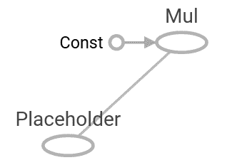
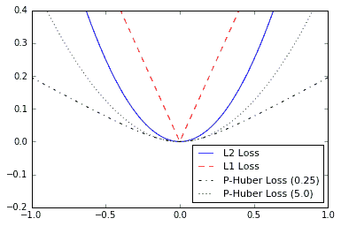
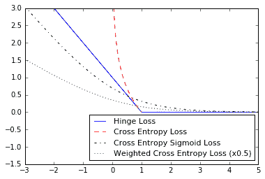
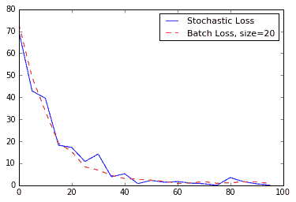
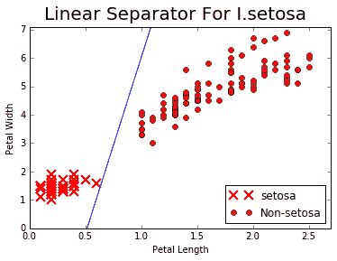
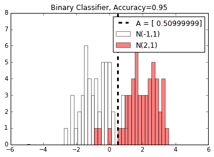

# 二、TensorFlow 的方式

在本章中，我们将介绍 TensorFlow 如何运作的关键组件。然后，我们将它们组合在一起以创建一个简单的分类器并评估结果。到本章结束时，您应该了解以下内容：

*   计算图中的操作
*   分层嵌套操作
*   使用多个层
*   实现损失函数
*   实现反向传播
*   使用批量和随机训练
*   把所有东西结合在一起
*   评估模型

# 介绍

现在我们已经介绍了 TensorFlow 如何创建张量，并使用变量和占位符，我们将介绍如何在计算图中对这些对象进行操作。由此，我们可以设置一个简单的分类器，看看它的表现如何。

> 此外，请记住，[本书中的当前和更新代码可以在 GitHub 上在线获取](https://github.com/nfmcclure/tensorflow_cookbook)。

# 计算图中的操作

现在我们可以将对象放入计算图中，我们将介绍对这些对象起作用的操作。

## 准备

要启动图，我们加载 TensorFlow 并创建一个会话，如下所示：

```py
import tensorflow as tf 
sess = tf.Session() 
```

## 操作步骤

在这个例子中，我们将结合我们学到的东西并将列表中的每个数字提供给图中的操作并打印输出：

首先，我们宣布我们的张量和占位符。在这里，我们将创建一个 NumPy 数组来提供给我们的操作：

```py
import numpy as np 
x_vals = np.array([1., 3., 5., 7., 9.]) 
x_data = tf.placeholder(tf.float32) 
m_const = tf.constant(3.) 
my_product = tf.multiply(x_data, m_const) 
for x_val in x_vals: 
    print(sess.run(my_product, feed_dict={x_data: x_val})) 
```

上述代码的输出如下：

```py
3.0 
9.0 
15.0 
21.0 
27.0 
```

## 工作原理

本节中的代码在计算图上创建数据和操作。下图是计算图的样子：



图 1：`x_data`占位符以及乘法常数输入到乘法运算中

# 对嵌套操作分层

在本文中，我们将学习如何在同一计算图上放置多个操作。

## 准备

了解如何将操作链接在一起非常重要。这将在计算图中设置分层操作。对于演示，我们将占位符乘以两个矩阵，然后执行加法。我们将以三维 NumPy 数组的形式提供两个矩阵：

```py
import tensorflow as tf 
sess = tf.Session() 
```

## 操作步骤

同样重要的是要注意数据在通过时如何改变形状。我们将输入两个大小为`3 x 5`的 NumPy 数组。我们将每个矩阵乘以一个大小常数`5 x 1,`，这将产生一个大小为`3 x 1`的矩阵。然后我们将其乘以`1 x 1`矩阵，再次产生`3 x 1`矩阵。最后，我们在最后添加`3 x 1`矩阵，如下所示：

1.  首先，我们创建要输入的数据和相应的占位符：

```py
my_array = np.array([[1., 3., 5., 7., 9.], 
                   [-2., 0., 2., 4., 6.], 
                   [-6., -3., 0., 3., 6.]]) 
x_vals = np.array([my_array, my_array + 1]) 
x_data = tf.placeholder(tf.float32, shape=(3, 5)) 
```

1.  接下来，我们创建将用于矩阵乘法和加法的常量：

```py
m1 = tf.constant([[1.], [0.], [-1.], [2.], [4.]]) 
m2 = tf.constant([[2.]]) 
a1 = tf.constant([[10.]]) 
```

1.  现在，我们声明操作并将它们添加到图中：

```py
prod1 = tf.matmul(x_data, m1) 
prod2 = tf.matmul(prod1, m2) 
add1 = tf.add(prod2, a1)
```

1.  最后，我们为图提供数据：

```py
for x_val in x_vals: 
    print(sess.run(add1, feed_dict={x_data: x_val})) 
[[ 102.] 
 [  66.] 
 [  58.]] 
[[ 114.] 
 [  78.] 
 [  70.]] 
```

## 工作原理

我们刚刚创建的计算图可以使用 TensorBoard 进行可视化。 TensorBoard 是 TensorFlow 的一个功能，它允许我们可视化计算图和这些图中的值。与其他机器学习框架不同，这些功能是本机提供的。要了解如何完成此操作，请参阅第 11 章中的 TensorBoard 秘籍中的可视化图，更多内容使用 TensorFlow。以下是我们的分层图如下所示：


图 2：向上传播到图时的数据大小

## 更多

在通过图运行数据之前，我们必须声明数据形状并知道操作的结果形状。这并非总是如此。可能有一两个我们事先不知道的维度，或者一些可能变化的维度。为实现此目的，我们将可以改变（或未知）的维度或维度指定为值`None`。例如，要使先前的数据占位符具有未知数量的列，我们将编写以下行：

```py
x_data = tf.placeholder(tf.float32, shape=(3,None))
```

这允许我们打破矩阵乘法规则，但我们仍然必须遵守乘法常数必须具有相同行数的事实。当我们将数据输入图时，我们可以动态生成或重新整形`x_data`。当我们以不同批次大小的多批次提供数据时，这将在后面的章节中派上用场。

> 虽然使用`None`作为大小允许我们使用可变大小的大小，但在填充大小时始终建议尽可能明确。如果我们将大小标准化为固定大小，那么我们应该明确地将该大小写为大小。建议将`None`用作维度，以限制数据的批量大小（或我们一次计算的数据点数）。

# 使用多个层

现在我们已经介绍了多个操作，我们将介绍如何连接具有通过它们传播的数据的各个层。

## 准备

在本文中，我们将介绍如何最好地连接各种层，包括自定义层。我们将生成和使用的数据将代表小型随机图像。最好通过一个简单的例子来理解这种类型的操作，看看我们如何使用一些内置层来执行计算。我们将探索的第一层称为移动窗口。我们将在 2D 图像上执行小的移动窗口平均值，然后第二层将是自定义操作层。

在本节中，我们将看到计算图可能变得庞大且难以查看。为了解决这个问题，我们还将介绍命名操作和创建层范围的方法。首先，加载`numpy`和`tensorflow`，然后使用以下命令创建图：

```py
import tensorflow as tf 
import numpy as np 
sess = tf.Session() 
```

## 操作步骤

我们按如下方式处理秘籍：

1.  首先，我们使用 NumPy 创建示例 2D 图像。该图像将是`4 x 4`像素图像。我们将在四个方面创建它；第一个和最后一个维度的大小为 1。请注意，某些 TensorFlow 图像函数将在四维图像上运行。这四个维度是图像编号，高度，宽度和通道，为了使其成为一个具有一个通道的图像，我们将两个维度设置为`1`，如下所示：

```py
x_shape = [1, 4, 4, 1] 
x_val = np.random.uniform(size=x_shape) 
```

1.  现在，我们必须在图中创建占位符，我们可以在其中提供示例图像，如下所示：

```py
x_data = tf.placeholder(tf.float32, shape=x_shape) 
```

1.  为了在我们的`4 x 4`图像上创建一个移动窗口平均值，我们将使用一个内置函数，它将在形状窗口`2 x 2`上收敛一个常量。我们将使用的函数是`conv2d()`;此函数在图像处理和 TensorFlow 中非常常用。此函数采用窗口的分段产品和我们指定的过滤器。我们还必须在两个方向上指定移动窗口的步幅。在这里，我们将计算四个移动窗口平均值：左上角，右上角，左下角和右下角四个像素。我们通过创建`2 x 2`窗口并在每个方向上具有长度`2`的步幅来实现这一点。为取平均值，我们将`2 x 2`窗口用`0.25`的常数卷积，如下：

```py
my_filter = tf.constant(0.25, shape=[2, 2, 1, 1]) 
my_strides = [1, 2, 2, 1] 
mov_avg_layer= tf.nn.conv2d(x_data, my_filter, my_strides, 
                            padding='SAME', name='Moving_Avg_Window') 
```

> 请注意，我们还使用函数的`name`参数命名此层`Moving_Avg_Window`。 为了计算卷积层的输出大小，我们可以使用下面的公式`: Output = (W - F + 2P) / S + 1`，其中`W`是输入大小，`F`是过滤器大小，`P`是零填充，并且`S`是步幅。

1.  现在，我们定义一个自定义层，它将在移动窗口平均值的`2 x 2`输出上运行。自定义函数将首先将输入乘以另一个`2 x 2`矩阵张量，然后为每个条目添加 1。在此之后，我们取每个元素的 sigmoid 并返回`2 x 2`矩阵。由于矩阵乘法仅对二维矩阵进行操作，因此我们需要删除大小为`1`的图像的额外维度。 TensorFlow 可以使用内置的`squeeze()`函数执行此操作。在这里，我们定义新层：

```py
    def custom_layer(input_matrix): 
        input_matrix_sqeezed = tf.squeeze(input_matrix) 
        A = tf.constant([[1., 2.], [-1., 3.]]) 
        b = tf.constant(1., shape=[2, 2]) 
        temp1 = tf.matmul(A, input_matrix_sqeezed) 
        temp = tf.add(temp1, b) # Ax + b 
        return tf.sigmoid(temp) 
```

1.  现在，我们必须将新层放在图上。我们将使用命名范围执行此操作，以便它在计算图上可识别和可折叠/可扩展，如下所示：

```py
with tf.name_scope('Custom_Layer') as scope: 
    custom_layer1 = custom_layer(mov_avg_layer) 
```

1.  现在，我们只需输入`4 x 4`图像来替换占位符并告诉 TensorFlow 运行图，如下所示：

```py
print(sess.run(custom_layer1, feed_dict={x_data: x_val})) 
[[ 0.91914582 0.96025133] 
 [ 0.87262219  0.9469803 ]] 
```

## 工作原理

通过命名操作和层范围，可视化绘图看起来更好。我们可以折叠和展开自定义层，因为我们在命名范围内创建了它。在下图中，请参阅左侧的折叠版本和右侧的展开版本：


图 3：具有两层的计算图

第一层名为`Moving_Avg_Window`。第二个是名为`Custom_Layer`的操作集合。它在左侧折叠并在右侧展开。

# 实现损失函数

损失函数对于机器学习算法非常重要。它们测量模型输出与目标（真值）值之间的距离。在这个秘籍中，我们在 TensorFlow 中展示了各种损失函数实现。

## 准备

为了优化我们的机器学习算法，我们需要评估结果。评估 TensorFlow 中的结果取决于指定损失函数。损失函数告诉 TensorFlow 预测与期望结果相比有多好或多坏。在大多数情况下，我们将有一组数据和一个目标来训练我们的算法。损失函数将目标与预测进行比较，并给出两者之间的数值距离。

对于这个秘籍，我们将介绍我们可以在 TensorFlow 中实现的主要损失函数。

要了解不同损失函数的运行方式，我们将在此秘籍中绘制它们。我们将首先启动一个计算图并加载`matplotlib`，一个 Python 绘图库，如下所示：

```py
import matplotlib.pyplot as plt 
import tensorflow as tf 
```

## 操作步骤

1.  首先，我们将讨论回归的损失函数，这意味着预测连续的因变量。首先，我们将创建一个预测序列和一个作为张量的目标。我们将在 -1 和 1 之间输出 500 个值的结果。有关输出的绘图，请参阅“工作原理”部分。使用以下代码：

```py
x_vals = tf.linspace(-1., 1., 500) 
target = tf.constant(0.) 
```

1.  L2 范数损失也称为欧几里德损失函数。它只是到目标的距离的平方。在这里，我们将计算损失函数，就像目标为零一样。 L2 范数是一个很大的损失函数，因为它在目标附近非常弯曲，并且算法可以使用这个事实来越慢地收敛到目标，越接近零。我们可以按如下方式实现：

```py
l2_y_vals = tf.square(target - x_vals) 
l2_y_out = sess.run(l2_y_vals)
```

> TensorFlow 具有 L2 范数的内置形式，称为`nn.l2_loss()`。这个函数实际上是 L2 范数的一半。换句话说，它与前一个相同，但除以 2。

1.  L1 范数损失也称为绝对损失函数。我们不是平衡差异，而是取绝对值。 L1 范数对于异常值比 L2 范数更好，因为对于较大的值，它不是那么陡峭。需要注意的一个问题是 L1 范数在目标处不平滑，这可能导致算法收敛不好。它看起来如下：

```py
l1_y_vals = tf.abs(target - x_vals) 
l1_y_out = sess.run(l1_y_vals) 
```

1.  伪 Huber 损失是 Huber 损失函数的连续且平滑的近似。这种损失函数试图通过在目标附近凸起并且对于极值不太陡峭来充分利用 L1 和 L2 范数。表格取决于额外的参数`delta`，它决定了它的陡峭程度。我们将绘制两种形式，`delta1 = 0.25`和`delta2 = 5`，以显示差异，如下所示：

```py
delta1 = tf.constant(0.25) 
phuber1_y_vals = tf.multiply(tf.square(delta1), tf.sqrt(1\. +  
                        tf.square((target - x_vals)/delta1)) - 1.) 
phuber1_y_out = sess.run(phuber1_y_vals) 
delta2 = tf.constant(5.) 
phuber2_y_vals = tf.multiply(tf.square(delta2), tf.sqrt(1\. +  
                        tf.square((target - x_vals)/delta2)) - 1.) 
phuber2_y_out = sess.run(phuber2_y_vals) 
```

现在，我们继续讨论分类问题的损失函数。分类损失函数用于在预测分类结果时评估损失。通常，我们的类别类型的输出是 0 到 1 之间的实数值。然后，我们选择截止值（通常选择 0.5）并且如果数字高于截止值，则将结果分类为该类别。在这里，我们考虑分类输出的各种损失函数：

1.  首先，我们需要重新定义我们的预测（`x_vals`）和`target`。我们将保存输出并在下一节中绘制它们。使用以下内容：

```py
x_vals = tf.linspace(-3., 5., 500) 
target = tf.constant(1.) 
targets = tf.fill([500,], 1.)
```

1.  铰链损失主要用于支持向量机，但也可用于神经网络。它旨在计算两个目标类 1 和 -1 之间的损失。在下面的代码中，我们使用目标值`1`，因此我们的预测越接近 1，损失值越低：

```py
hinge_y_vals = tf.maximum(0., 1\. - tf.multiply(target, x_vals)) 
hinge_y_out = sess.run(hinge_y_vals) 
```

1.  二元情形的交叉熵损失有时也称为逻辑损失函数。它是在我们预测两个 0 或 1 类时出现的。我们希望测量从实际类（0 或 1）到预测值的距离，预测值通常是介于 0 和 1 之间的实数。为了测量这个距离，我们可以使用信息论中的交叉熵公式，如下：

```py
xentropy_y_vals = - tf.multiply(target, tf.log(x_vals)) - tf.multiply((1\. - target), tf.log(1\. - x_vals)) 
xentropy_y_out = sess.run(xentropy_y_vals) 
```

1.  Sigmoid 交叉熵损失与之前的损失函数非常相似，除了我们在将它们置于交叉熵损失之前使用 sigmoid 函数转换 x 值，如下所示：

```py
xentropy_sigmoid_y_vals = tf.nn.sigmoid_cross_entropy_with_logits_v2(logits=x_vals, labels=targets) 
xentropy_sigmoid_y_out = sess.run(xentropy_sigmoid_y_vals) 
```

1.  加权交叉熵损失是 Sigmoid 交叉熵损失的加权版本。我们对积极目标给予了重视。举个例子，我们将正面目标加权 0.5，如下：

```py
weight = tf.constant(0.5) 
xentropy_weighted_y_vals = tf.nn.weighted_cross_entropy_with_logits(logits=x_vals, targets=targets, pos_weight=weight) 
xentropy_weighted_y_out = sess.run(xentropy_weighted_y_vals) 
```

1.  Softmax 交叉熵损失在非标准化输出上运行。当只有一个目标类别而不是多个目标类别时，此函数用于测量损失。因此，函数通过 softmax 函数将输出转换为概率分布，然后根据真实概率分布计算损失函数，如下所示：

```py
unscaled_logits = tf.constant([[1., -3., 10.]]) 
target_dist = tf.constant([[0.1, 0.02, 0.88]]) 
softmax_xentropy = tf.nn.softmax_cross_entropy_with_logits_v2(logits=unscaled_logits, labels=target_dist) 
print(sess.run(softmax_xentropy)) 
[ 1.16012561] 
```

1.  稀疏 softmax 交叉熵损失与前一个相同，除了目标是概率分布，它是哪个类别为真的索引。我们只传递真值的类别的索引，而不是稀疏的全零目标向量，其值为 1，如下所示：

```py
unscaled_logits = tf.constant([[1., -3., 10.]]) 
sparse_target_dist = tf.constant([2]) 
sparse_xentropy = tf.nn.sparse_softmax_cross_entropy_with_logits(logits=unscaled_logits, labels=sparse_target_dist) 
print(sess.run(sparse_xentropy)) 
[ 0.00012564] 
```

## 工作原理

以下是如何使用`matplotlib`绘制回归损失函数：

```py
x_array = sess.run(x_vals) 
plt.plot(x_array, l2_y_out, 'b-', label='L2 Loss') 
plt.plot(x_array, l1_y_out, 'r--', label='L1 Loss') 
plt.plot(x_array, phuber1_y_out, 'k-.', label='P-Huber Loss (0.25)') 
plt.plot(x_array, phuber2_y_out, 'g:', label='P-Huber Loss (5.0)') 
plt.ylim(-0.2, 0.4) 
plt.legend(loc='lower right', prop={'size': 11}) 
plt.show() 
```

我们得到以下图作为上述代码的输出：



图 4：绘制各种回归损失函数

以下是如何使用`matplotlib`绘制各种分类损失函数：

```py
x_array = sess.run(x_vals) 
plt.plot(x_array, hinge_y_out, 'b-''', label='Hinge Loss''') 
plt.plot(x_array, xentropy_y_out, 'r--''', label='Cross' Entropy Loss') 
plt.plot(x_array, xentropy_sigmoid_y_out, 'k-.''', label='Cross' Entropy Sigmoid Loss') 
plt.plot(x_array, xentropy_weighted_y_out, g:''', label='Weighted' Cross Enropy Loss (x0.5)') 
plt.ylim(-1.5, 3) 
plt.legend(loc='lower right''', prop={'size''': 11}) 
plt.show() 
```

我们从前面的代码中得到以下图：

Figure 5: Plots of classification loss functions

## 更多

这是一个总结我们描述的不同损失函数的表：

| 损失函数 | 任务 | 优点 | 缺点 |
| --- | --- | --- | --- |
| L2 | 回归 | 更稳定 | 不太强大 |
| L1 | 回归 | 更强大 | 不太稳定 |
| 伪 Huber | 回归 | 更强大，更稳定 | 还有一个参数 |
| Hinge | 分类 | 创建 SVM 中使用的最大边距 | 受到异常值影响的无限损失 |
| 交叉熵 | 分类 | 更稳定 | 无限损失，不那么强大 |

剩余的分类损失函数都与交叉熵损失的类型有关。交叉熵 sigmoid 损失函数用于未缩放的对率，并且优于计算 sigmoid 然后交叉熵，因为 TensorFlow 具有更好的内置方式来处理数字边缘情况。 softmax 交叉熵和稀疏 softmax 交叉熵也是如此。

> 这里描述的大多数分类损失函数用于两类预测。通过对每个预测/目标上的交叉熵项求和，可以将其扩展到多个类。

评估模型时还需要考虑许多其他指标。以下列出了一些需要考虑的事项：

| 模型指标 | 描述 |
| --- | --- |
| R 平方（确定系数） | 对于线性模型，这是因变量的方差比例，由独立数据解释。对于具有大量特征的模型，请考虑使用调整后的 R 平方。 |
| 均方根误差 | 对于连续模型，它通过平均平方误差的平方根来测量预测与实际之间的差异。 |
| 混淆矩阵 | 对于分类模型，我们查看预测类别与实际类别的矩阵。一个完美的模型具有沿对角线的所有计数。 |
| 召回 | 对于分类模型，这是所有预测阳性的真阳性分数。 |
| 精确 | 对于分类模型，这是所有实际阳性的真阳性分数。 |
| F-得分 | 对于分类模型，这是精度和召回的调和平均值。 |

# 实现反向传播

使用 TensorFlow 的一个好处是它可以跟踪操作并根据反向传播自动更新模型变量。在本文中，我们将介绍如何在训练机器学习模型时将此方面用于我们的优势。

## 准备

现在，我们将介绍如何以最小化损失函数的方式更改模型中的变量。我们已经学会了如何使用对象和操作，并创建了测量我们的预测和目标之间距离的损失函数。现在，我们只需告诉 TensorFlow 如何通过我们的计算图反向传播误差来更新变量并最小化损失函数。这是通过声明优化函数完成的。一旦我们声明了一个优化函数，TensorFlow 将通过并计算出图中所有计算的反向传播项。当我们输入数据并最小化损失函数时，TensorFlow 将相应地修改图中的变量。

对于这个秘籍，我们将做一个非常简单的回归算法。我们将从正态分布中抽取随机数，均值为 1，标准差为 0.1。然后，我们将通过一个操作来运行数字，这将是它们乘以变量`A`。由此，损失函数将是输出和目标之间的 L2 范数，其总是值 10。理论上，A 的最佳值将是数字 10，因为我们的数据将具有平均值 1。

第二个例子是一个非常简单的二分类算法。在这里，我们将从两个正态分布`N(-1,1)`和`N(3,1)`生成 100 个数字。来自`N(-1, 1)`的所有数字将在目标等级 0 中，并且来自`N(3, 1)`的所有数字将在目标等级 1 中。用于区分这些数字的模型将是翻译的 Sigmoid 函数。换句话说，模型将是`sigmoid(x + A)`，其中`A`是我们将适合的变量。从理论上讲，A 将等于 -1。我们得到这个数字是因为如果`m1`和`m2`是两个正常函数的平均值，那么加到它们以将它们等距离转换为零的值将是 - `(m1 + m2) / 2`。我们将在第二个例子中看到 TensorFlow 如何达到该数字。

虽然指定良好的学习率有助于算法的收敛，但我们还必须指定一种优化。从前两个例子中，我们使用标准梯度下降。这是通过`GradientDescentOptimizer()` TensorFlow 函数实现的。

## 操作步骤

以下是回归示例的工作原理：

1.  我们首先加载`numpy`和`tensorflow`数值 Python 包：

```py
import numpy as np 
import tensorflow as tf 
```

1.  现在，我们启动图会话：

```py
sess = tf.Session() 
```

1.  接下来，我们创建数据，占位符和`A`变量：

```py
x_vals = np.random.normal(1, 0.1, 100) 
y_vals = np.repeat(10., 100) 
x_data = tf.placeholder(shape=[1], dtype=tf.float32) 
y_target = tf.placeholder(shape=[1], dtype=tf.float32) 
A = tf.Variable(tf.random_normal(shape=[1])) 
```

1.  我们将乘法运算添加到图中：

```py
my_output = tf.mul(x_data, A) 
```

1.  接下来，我们在乘法输出和目标数据之间添加 L2 `Loss`函数：

```py
loss = tf.square(my_output - y_target)
```

1.  现在，我们必须声明一种优化图中变量的方法。我们声明了一种优化算法。大多数优化算法需要知道每次迭代中的步进距离。该距离由学习率控制。如果我们的学习率太大，我们的算法可能会超过最小值，但如果我们的学习率太小，我们的算法可能需要很长时间才能收敛；这与消失和爆炸的梯度问题有关。学习率对收敛有很大影响，我们将在本节末尾讨论这个问题。虽然我们在这里使用标准梯度下降算法，但是有许多不同的优化算法可以不同地运行，并且可以根据问题做得更好或更差。有关不同优化算法的精彩概述，请参阅 Sebastian Ruder 在本文末尾的另见部分中的文章：

```py
my_opt = tf.train.GradientDescentOptimizer(learning_rate=0.02)
train_step = my_opt.minimize(loss)
```

1.  现在我们可以初始化我们的模型变量：

```py
init = tf.global_variable_initializer()
sess.run(init) 
```

There is a lot of theory on which learning rates are best. This is one of the harder things to figure out in machine learning algorithms. Good papers to read about how learning rates are related to specific optimization algorithms are listed in the See also section at the end of this recipe.

1.  最后一步是循环我们的训练算法并告诉 TensorFlow 多次训练。我们将这样做 101 次，并且每 25 次迭代打印出结果。为了训练，我们将选择随机`x`和`y`条目并通过图提供。 TensorFlow 将自动计算损失，并略微改变`A`偏差以最小化损失：

```py
for i in range(100): 
    rand_index = np.random.choice(100) 
    rand_x = [x_vals[rand_index]] 
    rand_y = [y_vals[rand_index]] 
    sess.run(train_step, feed_dict={x_data: rand_x, y_target: rand_y}) 
    if (i + 1) % 25 == 0: 
        print('Step #' + str(i+1) + ' A = ' + str(sess.run(A))) 
        print('Loss = ' + str(sess.run(loss, feed_dict={x_data: rand_x, y_target: rand_y}))) 
# Here is the output: 
Step #25 A = [ 6.23402166] 
Loss = 16.3173 
Step #50 A = [ 8.50733757] 
Loss = 3.56651 
Step #75 A = [ 9.37753201] 
Loss = 3.03149 
Step #100 A = [ 9.80041122] 
Loss = 0.0990248 
```

现在，我们将介绍简单分类示例的代码。如果我们先重置图，我们可以使用相同的 TensorFlow 脚本。请记住，我们将尝试找到一个最佳平移`A`，它将两个分布转换为原点，而 sigmoid 函数将两个分为两个不同的类：

1.  首先，我们重置图并重新初始化图会话：

```py
from tensorflow.python.framework import ops 
ops.reset_default_graph() 
sess = tf.Session() 
```

1.  接下来，我们从两个不同的正态分布`N(-1, 1)`和`N(3, 1)`中提取数据。我们还将生成目标标签，数据占位符和偏差变量`A`：

```py
x_vals = np.concatenate((np.random.normal(-1, 1, 50), np.random.normal(3, 1, 50))) 
y_vals = np.concatenate((np.repeat(0., 50), np.repeat(1., 50))) 
x_data = tf.placeholder(shape=[1], dtype=tf.float32) 
y_target = tf.placeholder(shape=[1], dtype=tf.float32) 
A = tf.Variable(tf.random_normal(mean=10, shape=[1])) 
```

> 我们将`A`初始化为大约 10 的值，远离理论值-1。我们这样做的目的是为了说明算法如何从 10 的值收敛到最佳值 -1。

1.  接下来，我们将转换操作添加到图中。请记住，我们不必将它包装在 sigmoid 函数中，因为损失函数将为我们执行此操作：

```py
my_output = tf.add(x_data, A)
```

1.  由于特定损失函数需要具有与之关联的额外维度的批量数据（添加的维度，即批次编号），因此我们将使用`expand_dims()`函数为输出添加额外维度。在下一节中，我们将讨论如何在训练中使用可变大小的批次。现在，我们将再次使用一个随机数据点：

```py
my_output_expanded = tf.expand_dims(my_output, 0) 
y_target_expanded = tf.expand_dims(y_target, 0) 
```

1.  接下来，我们将初始化我们的一个变量`A`：

```py
init = tf.initialize_all_variables() 
sess.run(init) 
```

1.  现在，我们宣布我们的损失函数。我们将使用带有未缩放的对率的交叉熵，它使用 sigmoid 函数对它们进行转换。在名为`nn.sigmoid_cross_entropy_with_logits()`的神经网络包中，TensorFlow 为我们提供了这一函数。如前所述，它希望参数具有特定的维度，因此我们必须相应地使用扩展的输出和目标：

```py
xentropy = tf.nn.sigmoid_cross_entropy_with_logits( my_output_expanded, y_target_expanded) 
```

1.  与回归示例一样，我们需要向图中添加优化器函数，以便 TensorFlow 知道如何更新图中的偏差变量：

```py
my_opt = tf.train.GradientDescentOptimizer(0.05) 
train_step = my_opt.minimize(xentropy) 
```

1.  最后，我们循环遍历随机选择的数据点数百次并相应地更新`A`变量。每 200 次迭代，我们将打印出`A`的值和损失：

```py
for i in range(1400): 
    rand_index = np.random.choice(100) 
    rand_x = [x_vals[rand_index]] 
    rand_y = [y_vals[rand_index]] 
    sess.run(train_step, feed_dict={x_data: rand_x, y_target: rand_y}) 
    if (i + 1) % 200 == 0: 
        print('Step #' + str(i+1) + ' A = ' + str(sess.run(A))) 
        print('Loss = ' + str(sess.run(xentropy, feed_dict={x_data: rand_x, y_target: rand_y}))) 
Step #200 A = [ 3.59597969] 
Loss = [[ 0.00126199]] 
Step #400 A = [ 0.50947344] 
Loss = [[ 0.01149425]] 
Step #600 A = [-0.50994617] 
Loss = [[ 0.14271219]] 
Step #800 A = [-0.76606178] 
Loss = [[ 0.18807337]] 
Step #1000 A = [-0.90859312] 
Loss = [[ 0.02346182]] 
Step #1200 A = [-0.86169094] 
Loss = [[ 0.05427232]] 
Step #1400 A = [-1.08486211] 
Loss = [[ 0.04099189]] 
```

## 工作原理

有关回顾和解释，对于这两个示例，我们执行了以下操作：

1.  创建了数据。这两个示例都需要通过占位符加载数据。
2.  初始化占位符和变量。这些是非常相似的数据占位符。变量非常相似，它们都有乘法矩阵`A`，但第一个分类算法有一个偏差项来找到数据中的分裂。
3.  创建了损失函数，我们使用 L2 损失进行回归，使用交叉熵损失进行分类。
4.  定义了一种优化算法。两种算法都使用梯度下降。
5.  迭代随机数据样本以迭代更新我们的变量。

## 更多

如前所述，优化算法对学习率的选择很敏感。重要的是要以简洁的方式总结这种选择的效果：

| 学习率大小 | 优点缺点 | 用途 |
| --- | --- | --- |
| 较小的学习率 | 收敛速度较慢但结果更准确 | 如果解决方案不稳定，请先尝试降低学习率 |
| 学习率更高 | 不太准确，但收敛速度更快 | 对于某些问题，有助于防止解决方案停滞不前 |

有时，标准梯度下降算法会显着卡住或减速。当优化卡在马鞍的平坦点时，可能会发生这种情况。为了解决这个问题，还有另一种算法考虑了动量项，它增加了前一步骤的梯度下降值的一小部分。 TensorFlow 内置了`MomentumOptimizer()`函数。

另一种变体是为我们模型中的每个变量改变优化器步骤。理想情况下，我们希望为较小的移动变量采取较大的步骤，为较快的变化变量采取较短的步骤。我们不会深入研究这种方法的数学，但这种思想的常见实现称为 Adagrad 算法。该算法考虑了变量梯度的整个历史。 TensorFlow 中的函数称为`AdagradOptimizer()`。

有时候，Adagrad 会过早地强调梯度为零，因为它考虑了整个历史。解决方法是限制我们使用的步数。这样做称为 Adadelta 算法。我们可以使用`AdadeltaOptimizer()`函数来应用它。

还有一些不同的梯度下降算法的其他实现。对于这些，我们会让读者参考 [TensorFlow 文档](https://www.tensorflow.org/api_guides/python/train)。

## 另见

有关优化算法和学习率的一些参考，请参阅以下文章和文章：

*   另见本章的秘籍如下：
    *   在实现损失函数部分。
    *   在实现反向传播部分。
*   [Kingma，D.，Jimmy，L.，Adam：一种随机优化方法，ICLR 2015](https://arxiv.org/pdf/1412.6980.pdf)
*   [Ruder，S.，梯度下降优化算法概述，2016](https://arxiv.org/pdf/1609.04747v1.pdf)
*   [Zeiler，M.，ADADelta：一种自适应学习率方法，2012](http://www.matthewzeiler.com/pubs/googleTR2012/googleTR2012.pdf)

# 使用批量和随机训练

虽然 TensorFlow 根据反向传播更新我们的模型变量，但它可以同时操作从一个基准观察到一大批数据的任何事物。在一个训练示例上操作可以使得学习过程非常不稳定，而使用太大的批次可能在计算上是昂贵的。选择正确类型的训练对于使我们的机器学习算法融合到解决方案至关重要。

## 准备

为了使 TensorFlow 计算反向传播的可变梯度，我们必须测量样本或多个样本的损失。随机训练一次只适用于一个随机抽样的数据 - 目标对，就像我们在上一个秘籍中所做的那样。另一种选择是一次放置大部分训练样例并平均梯度计算的损失。训练批次的大小可以一次变化，直到并包括整个数据集。在这里，我们将展示如何将先前的回归示例（使用随机训练）扩展到批量训练。

我们将首先加载`numpy`，`matplotlib`和`tensorflow`，然后启动图会话，如下所示：

```py
import matplotlib as plt 
import numpy as np 
import tensorflow as tf 
sess = tf.Session() 
```

## 操作步骤

我们按如下方式处理秘籍：

1.  我们将从声明批量大小开始。这将是我们将同时通过计算图提供多少数据观察：

```py
batch_size = 20
```

1.  接下来，我们在模型中声明数据，占位符和变量。我们在这里做的改变是我们改变了占位符的形状。它们现在是两个维度，第一个维度是`None`，第二个维度是批次中的数据点数。我们可以明确地将它设置为 20，但我们可以推广并使用`None`值。同样，正如第 1 章，TensorFlow 入门中所述，我们仍然需要确保维度在模型中运行，这不允许我们执行任何非法矩阵操作：

```py
x_vals = np.random.normal(1, 0.1, 100) 
y_vals = np.repeat(10., 100) 
x_data = tf.placeholder(shape=[None, 1], dtype=tf.float32) 
y_target = tf.placeholder(shape=[None, 1], dtype=tf.float32) 
A = tf.Variable(tf.random_normal(shape=[1,1])) 
```

1.  现在，我们将操作添加到图中，现在将是矩阵乘法而不是常规乘法。请记住，矩阵乘法不是可交换的，因此我们必须在`matmul()`函数中以正确的顺序输入矩阵：

```py
my_output = tf.matmul(x_data, A) 
```

1.  我们的`loss`函数会发生变化，因为我们必须采用批次中每个数据点的所有 L2 损失的平均值。我们通过将先前的损失输出包装在 TensorFlow 的`reduce_mean()`函数中来实现：

```py
loss = tf.reduce_mean(tf.square(my_output - y_target)) 
```

1.  我们像以前一样声明我们的优化器并初始化我们的模型变量，如下所示：

```py
my_opt = tf.train.GradientDescentOptimizer(0.02) 
train_step = my_opt.minimize(loss)
init = tf.global_variables_initializer()
sess.run(init)
```

1.  最后，我们将循环并迭代训练步骤以优化算法。这部分与以前不同，因为我们希望能够绘制随时间的损失并比较批次与随机训练的收敛。因此，我们初始化一个列表，每隔五个时间间隔存储一次损失函数：

```py
loss_batch = [] 
for i in range(100): 
    rand_index = np.random.choice(100, size=batch_size) 
    rand_x = np.transpose([x_vals[rand_index]]) 
    rand_y = np.transpose([y_vals[rand_index]]) 
    sess.run(train_step, feed_dict={x_data: rand_x, y_target: rand_y}) 
    if (i + 1) % 5 == 0: 
        print('Step #' + str(i+1) + ' A = ' + str(sess.run(A))) 
        temp_loss = sess.run(loss, feed_dict={x_data: rand_x, y_target: rand_y}) 
        print('Loss = ' + str(temp_loss)) 
        loss_batch.append(temp_loss) 
```

1.  这是 100 次迭代的最终输出。请注意，`A`的值有一个额外的维度，因为它现在必须是一个 2D 矩阵：

```py
Step #100 A = [[ 9.86720943]] 
Loss = 0\. 
```

## 工作原理

批量训练和随机训练的优化方法和收敛性不同。找到一个好的批量大小可能很困难。为了了解批量与随机指标之间的收敛程度如何不同，建议读者将批量大小更改为各种级别。以下是保存和记录训练循环中随机损失的代码。只需在上一个秘籍中替换此代码：

```py
loss_stochastic = [] 
for i in range(100): 
    rand_index = np.random.choice(100) 
    rand_x = [x_vals[rand_index]] 
    rand_y = [y_vals[rand_index]] 
    sess.run(train_step, feed_dict={x_data: rand_x, y_target: rand_y}) 
    if (i + 1) % 5 == 0: 
        print('Step #' + str(i+1) + ' A = ' + str(sess.run(A))) 
        temp_loss = sess.run(loss, feed_dict={x_data: rand_x, y_target: rand_y}) 
        print('Loss = ' + str(temp_loss)) 
        loss_stochastic.append(temp_loss) 
```

下面是为同一回归问题生成随机和批量损失图的代码：

```py
plt.plot(range(0, 100, 5), loss_stochastic, 'b-', label='Stochastic Loss') 
plt.plot(range(0, 100, 5), loss_batch, 'r--', label='Batch' Loss, size=20') 
plt.legend(loc='upper right', prop={'size': 11}) 
plt.show() 
```

我们得到以下绘图：



图 6：在 100 次迭代中绘制的随机损失和批量损失（批量大小为 20）。请注意，批次损失更加平滑，随机损失更加不稳定。

## 更多

| 训练类型 | 优点 | 缺点 |
| --- | --- | --- |
| 随机 | 随机性可能有助于摆脱局部的最小值。 | 通常，需要更多迭代才能收敛。 |
| 批量 | 更快地找到最小值。 | 需要更多资源来计算。 |

# 把所有东西结合在一起

在本节中，我们将结合到目前为止所示的所有内容，并为鸢尾数据集创建分类器。

## 准备

鸢尾数据集在第 1 章，TensorFlow 入门中使用数据源秘籍中有更详细的描述。我们将加载这些数据并制作一个简单的二元分类器来预测花是否是山鸢尾的种类。需要说明的是，这个数据集有三个种类，但我们只能预测一种花是单一种，是否是一种花，给我们一个二元分类器。我们将首先加载库和数据，然后相应地转换目标。

## 操作步骤

我们按如下方式处理秘籍：

1.  首先，我们加载所需的库并初始化计算图。注意我们也在这里加载`matplotlib`，因为我们想在之后绘制结果行：

```py
import matplotlib.pyplot as plt 
import numpy as np 
from sklearn import datasets 
import tensorflow as tf 
sess = tf.Session() 
```

1.  接下来，我们加载鸢尾数据。我们还需要将目标数据转换为 1 或 0，无论目标是否为山鸢尾。由于鸢尾数据集将山鸢尾标记为 0，我们将更改所有目标，值为 0 到 1，其他值全部为 0.我们也将只使用两个特征，花瓣长度和花瓣宽度。这两个特征是每个`x-value`中的第三和第四个条目：

```py
iris = datasets.load_iris() 
binary_target = np.array([1\. if x==0 else 0\. for x in iris.target]) 
iris_2d = np.array([[x[2], x[3]] for x in iris.data]) 
```

1.  让我们声明我们的批量大小，数据占位符和模型变量。请记住，可变批量大小的数据占位符将`None`作为第一个维度：

```py
batch_size = 20 
x1_data = tf.placeholder(shape=[None, 1], dtype=tf.float32) 
x2_data = tf.placeholder(shape=[None, 1], dtype=tf.float32) 
y_target = tf.placeholder(shape=[None, 1], dtype=tf.float32) 
A = tf.Variable(tf.random_normal(shape=[1, 1])) 
b = tf.Variable(tf.random_normal(shape=[1, 1])) 
```

> 请注意，我们可以通过使用`dtype=tf.float32`来减少浮点数的字节来提高算法的表现（速度）。

1.  在这里，我们定义线性模型。模型将采用`x2 = x1 * A + b`的形式，如果我们想要找到该行上方或下方的点，我们会在插入等式`x2 - x1 * A - b`时看到它们是高于还是低于零。我们将通过取该方程的 sigmoid 并从该方程预测 1 或 0 来实现。请记住，TensorFlow 具有内置 sigmoid 的`loss`函数，因此我们只需要在 sigmoid 函数之前定义模型的输出：

```py
my_mult = tf.matmul(x2_data, A) 
my_add = tf.add(my_mult, b) 
my_output = tf.sub(x1_data, my_add) 
```

1.  现在，我们使用 TensorFlow 的内置`sigmoid_cross_entropy_with_logits()`函数添加 sigmoid 交叉熵损失函数：

```py
xentropy = tf.nn.sigmoid_cross_entropy_with_logits(my_output, y_target) 
```

1.  我们还必须告诉 TensorFlow 如何通过声明优化方法来优化我们的计算图。我们希望最大限度地减少交叉熵损失。我们还会选择`0.05`作为我们的学习率：

```py
my_opt = tf.train.GradientDescentOptimizer(0.05) 
train_step = my_opt.minimize(xentropy) 
```

1.  现在，我们创建一个变量初始化操作并告诉 TensorFlow 执行它：

```py
init = tf.global_variables_initializer() 
sess.run(init) 
```

1.  现在，我们将训练我们的线性模型 1000 次迭代。我们将提供我们需要的三个数据点：花瓣长度，花瓣宽度和目标变量。每 200 次迭代，我们将打印变量值：

```py
for i in range(1000): 
    rand_index = np.random.choice(len(iris_2d), size=batch_size) 
    rand_x = iris_2d[rand_index] 
    rand_x1 = np.array([[x[0]] for x in rand_x]) 
    rand_x2 = np.array([[x[1]] for x in rand_x]) 
    rand_y = np.array([[y] for y in binary_target[rand_index]]) 
    sess.run(train_step, feed_dict={x1_data: rand_x1, x2_data: rand_x2, y_target: rand_y}) 
    if (i + 1) % 200 == 0: 
        print('Step #' + str(i+1) + ' A = ' + str(sess.run(A)) + ', b = ' + str(sess.run(b)))

Step #200 A = [[ 8.67285347]], b = [[-3.47147632]] 
Step #400 A = [[ 10.25393486]], b = [[-4.62928772]] 
Step #600 A = [[ 11.152668]], b = [[-5.4077611]] 
Step #800 A = [[ 11.81016064]], b = [[-5.96689034]] 
Step #1000 A = [[ 12.41202831]], b = [[-6.34769201]] 
```

1.  下一组命令提取模型变量并在绘图上绘制线条。结果绘图在它的工作原理...部分：

```py
[[slope]] = sess.run(A) 
[[intercept]] = sess.run(b) 
x = np.linspace(0, 3, num=50) 
ablineValues = [] 
for i in x: 
    ablineValues.append(slope*i+intercept) 

setosa_x = [a[1] for i,a in enumerate(iris_2d) if binary_target[i]==1] 
setosa_y = [a[0] for i,a in enumerate(iris_2d) if binary_target[i]==1] 
non_setosa_x = [a[1] for i,a in enumerate(iris_2d) if binary_target[i]==0] 
non_setosa_y = [a[0] for i,a in enumerate(iris_2d) if binary_target[i]==0] 
plt.plot(setosa_x, setosa_y, 'rx', ms=10, mew=2, label='setosa') 
plt.plot(non_setosa_x, non_setosa_y, 'ro', label='Non-setosa') 
plt.plot(x, ablineValues, 'b-') 
plt.xlim([0.0, 2.7]) 
plt.ylim([0.0, 7.1]) 
plt.suptitle('Linear' Separator For I.setosa', fontsize=20) 
plt.xlabel('Petal Length') 
plt.ylabel('Petal Width') 
plt.legend(loc='lower right') 
plt.show() 
```

## 工作原理

我们的目标是仅使用花瓣宽度和花瓣长度在山鸢尾点和其他两个物种之间拟合一条线。如果我们绘制点和结果线，我们看到我们已经实现了这个：



图 7：花瓣宽度与花瓣长度的山鸢尾和其它鸢尾的图；实线是我们在 1000 次迭代后实现的线性分离器

## 更多

虽然我们实现了用一条线分隔两个类的目标，但它可能不是分离两个类的最佳模型。在第 4 章，支持向量机中，我们将讨论支持向量机，它是在特征空间中分离两个类的更好方法。

## 另见

*   有关 scikit-learn 鸢尾花数据集实现的信息，请参阅[此链接](http://scikit-learn.org/stable/auto_examples/datasets/plot_iris_dataset.html)的文档。

# 评估模型

我们已经学会了如何在 TensorFlow 中训练回归和分类算法。在此之后，我们必须能够评估模型的预测，以确定它的效果。

## 准备

评估模型非常重要，每个后续模型都将采用某种形式的模型评估。使用 TensorFlow，我们必须将此函数构建到计算图中，并在我们的模型进行训练时和/或完成训练后调用它。

在训练期间评估模型可以让我们深入了解算法，并可以提供调试，改进或完全更改模型的提示。虽然训练期间的评估并不总是必要的，但我们将展示如何使用回归和分类进行评估。

训练结束后，我们需要量化模型对数据的执行方式。理想情况下，我们有一个单独的训练和测试集（甚至是验证集），我们可以在其上评估模型。

当我们想要评估模型时，我们希望在大批数据点上进行评估。如果我们已经实现了批量训练，我们可以重用我们的模型来对这样的批次进行预测。如果我们实现了随机训练，我们可能必须创建一个可以批量处理数据的单独评估器。

> 如果我们在`loss`函数中包含对模型输出的转换，例如`sigmoid_cross_entropy_with_logits()`，我们必须在计算精度计算的预测时考虑到这一点。不要忘记将此包含在您对模型的评估中。

我们要评估的任何模型的另一个重要方面是它是回归还是分类模型。

回归模型试图预测连续数。目标不是类别，而是所需数量。为了评估这些针对实际目标的回归预测，我们需要对两者之间的距离进行综合测量。大多数情况下，有意义的损失函数将满足这些标准。此秘籍向您展示如何将之前的简单回归算法更改为打印出训练循环中的损失并在结束时评估损失。例如，我们将在本章的先前实现反向传播秘籍中重新审视并重写我们的回归示例。

分类模型基于数字输入预测类别。实际目标是 1 和 0 的序列，我们必须衡量我们与预测的真实程度。分类模型的损失函数通常对解释模型的运行情况没有帮助。通常，我们需要某种分类准确率，这通常是正确预测类别的百分比。对于此示例，我们将使用本章中先前实现反向传播秘籍的分类示例。

## 操作步骤

首先，我们将展示如何评估简单回归模型，该模型简单地适应目标的常数乘法，即 10，如下所示：

1.  首先，我们首先加载库并创建图，数据，变量和占位符。本节还有一个非常重要的部分。在我们创建数据之后，我们将数据随机分成训练和测试数据集。这很重要，因为我们总是会测试我们的模型，看看它们是否预测良好。在训练数据和测试数据上评估模型还可以让我们看到模型是否过拟合：

```py
import matplotlib.pyplot as plt 
import numpy as np 
import tensorflow as tf 
sess = tf.Session() 
x_vals = np.random.normal(1, 0.1, 100) 
y_vals = np.repeat(10., 100) 
x_data = tf.placeholder(shape=[None, 1], dtype=tf.float32) 
y_target = tf.placeholder(shape=[None, 1], dtype=tf.float32) 
batch_size = 25 
train_indices = np.random.choice(len(x_vals), round(len(x_vals)*0.8), replace=False) 
test_indices = np.array(list(set(range(len(x_vals))) - set(train_indices))) 
x_vals_train = x_vals[train_indices] 
x_vals_test = x_vals[test_indices] 
y_vals_train = y_vals[train_indices] 
y_vals_test = y_vals[test_indices] 
A = tf.Variable(tf.random_normal(shape=[1,1])) 
```

1.  现在，我们声明我们的模型，`loss`函数和优化算法。我们还将初始化模型变量`A`。使用以下代码：

```py
my_output = tf.matmul(x_data, A) 
loss = tf.reduce_mean(tf.square(my_output - y_target))
my_opt = tf.train.GradientDescentOptimizer(0.02)
train_step = my_opt.minimize(loss)
init = tf.global_variables_initializer() 
sess.run(init) 
```

1.  我们正如我们之前看到的那样运行训练循环，如下所示：

```py
for i in range(100): 
    rand_index = np.random.choice(len(x_vals_train), size=batch_size) rand_x = np.transpose([x_vals_train[rand_index]]) 
    rand_y = np.transpose([y_vals_train[rand_index]]) 
    sess.run(train_step, feed_dict={x_data: rand_x, y_target: rand_y}) 
    if (i + 1) % 25 == 0: 
        print('Step #' + str(i+1) + ' A = ' + str(sess.run(A))) 
        print('Loss = ' + str(sess.run(loss, feed_dict={x_data: rand_x, y_target: rand_y}))) 
Step #25 A = [[ 6.39879179]] 
Loss = 13.7903 
Step #50 A = [[ 8.64770794]] 
Loss = 2.53685 
Step #75 A = [[ 9.40029907]] 
Loss = 0.818259 
Step #100 A = [[ 9.6809473]] 
Loss = 1.10908 
```

1.  现在，为了评估模型，我们将在训练和测试集上输出 MSE（损失函数），如下所示：

```py
mse_test = sess.run(loss, feed_dict={x_data: np.transpose([x_vals_test]), y_target: np.transpose([y_vals_test])}) 
mse_train = sess.run(loss, feed_dict={x_data: np.transpose([x_vals_train]), y_target: np.transpose([y_vals_train])}) 
print('MSE' on test:' + str(np.round(mse_test, 2))) 
print('MSE' on train:' + str(np.round(mse_train, 2))) 
MSE on test:1.35 
MSE on train:0.88 
```

对于分类示例，我们将做一些非常相似的事情。这一次，我们需要创建我们自己的精确度函数，我们可以在最后调用。其中一个原因是我们的损失函数内置了 sigmoid，我们需要单独调用 sigmoid 并测试它以查看我们的类是否正确：

1.  在同一个脚本中，我们可以重新加载图并创建数据，变量和占位符。请记住，我们还需要将数据和目标分成训练和测试集。使用以下代码：

```py
from tensorflow.python.framework import ops 
ops.reset_default_graph() 
sess = tf.Session() 
batch_size = 25 
x_vals = np.concatenate((np.random.normal(-1, 1, 50), np.random.normal(2, 1, 50))) 
y_vals = np.concatenate((np.repeat(0., 50), np.repeat(1., 50))) 
x_data = tf.placeholder(shape=[1, None], dtype=tf.float32) 
y_target = tf.placeholder(shape=[1, None], dtype=tf.float32) 
train_indices = np.random.choice(len(x_vals), round(len(x_vals)*0.8), replace=False) 
test_indices = np.array(list(set(range(len(x_vals))) - set(train_indices))) 
x_vals_train = x_vals[train_indices] 
x_vals_test = x_vals[test_indices] 
y_vals_train = y_vals[train_indices] 
y_vals_test = y_vals[test_indices] 
A = tf.Variable(tf.random_normal(mean=10, shape=[1])) 
```

1.  我们现在将模型和损失函数添加到图中，初始化变量，并创建优化过程，如下所示：

```py
my_output = tf.add(x_data, A) 
init = tf.initialize_all_variables() 
sess.run(init) 
xentropy = tf.reduce_mean(tf.nn.sigmoid_cross_entropy_with_logits(my_output, y_target)) 
my_opt = tf.train.GradientDescentOptimizer(0.05) 
train_step = my_opt.minimize(xentropy) 
```

1.  现在，我们运行我们的训练循环，如下所示：

```py
for i in range(1800): 
    rand_index = np.random.choice(len(x_vals_train), size=batch_size) 
    rand_x = [x_vals_train[rand_index]] 
    rand_y = [y_vals_train[rand_index]] 
    sess.run(train_step, feed_dict={x_data: rand_x, y_target: rand_y}) 
    if (i+1)%200==0: 
        print('Step #' + str(i+1) + ' A = ' + str(sess.run(A))) 
        print('Loss = ' + str(sess.run(xentropy, feed_dict={x_data: rand_x, y_target: rand_y}))) 
Step #200 A = [ 6.64970636] 
Loss = 3.39434 
Step #400 A = [ 2.2884655] 
Loss = 0.456173 
Step #600 A = [ 0.29109824] 
Loss = 0.312162 
Step #800 A = [-0.20045301] 
Loss = 0.241349 
Step #1000 A = [-0.33634067] 
Loss = 0.376786 
Step #1200 A = [-0.36866501] 
Loss = 0.271654 
Step #1400 A = [-0.3727718] 
Loss = 0.294866 
Step #1600 A = [-0.39153299] 
Loss = 0.202275 
Step #1800 A = [-0.36630616] 
Loss = 0.358463 
```

1.  为了评估模型，我们将创建自己的预测操作。我们将预测操作包装在挤压函数中，因为我们希望使预测和目标形成相同的形状。然后，我们用相等的函数测试相等性。在那之后，我们留下了一个真值和假值的张量，我们将其转换为`float32`并取平均值。这将产生准确率值。我们将为训练集和测试集评估此函数，如下所示：

```py
y_prediction = tf.squeeze(tf.round(tf.nn.sigmoid(tf.add(x_data, A)))) 
correct_prediction = tf.equal(y_prediction, y_target) 
accuracy = tf.reduce_mean(tf.cast(correct_prediction, tf.float32)) 
acc_value_test = sess.run(accuracy, feed_dict={x_data: [x_vals_test], y_target: [y_vals_test]}) 
acc_value_train = sess.run(accuracy, feed_dict={x_data: [x_vals_train], y_target: [y_vals_train]}) 
print('Accuracy' on train set: ' + str(acc_value_train)) 
print('Accuracy' on test set: ' + str(acc_value_test)) 
Accuracy on train set: 0.925 
Accuracy on test set: 0.95 
```

1.  通常，查看模型结果（准确率，MSE 等）将有助于我们评估模型。我们可以在这里轻松绘制模型和数据的绘图，因为它是一维的。以下是使用`matplotlib`使用两个单独的直方图可视化模型和数据的方法：

```py
A_result = sess.run(A) 
bins = np.linspace(-5, 5, 50) 
plt.hist(x_vals[0:50], bins, alpha=0.5, label='N(-1,1)', color='white') 
plt.hist(x_vals[50:100], bins[0:50], alpha=0.5, label='N(2,1)', color='red') 
plt.plot((A_result, A_result), (0, 8), 'k--', linewidth=3, label='A = '+ str(np.round(A_result, 2))) 
plt.legend(loc='upper right') 
plt.title('Binary Classifier, Accuracy=' + str(np.round(acc_value, 2))) 
plt.show() 
```

## 工作原理

这导致绘图显示两个单独数据类的直方图中两个类的预测最佳分隔符。



图 8：数据和最终模型的可视化。两个正常值以 -1 和 2 为中心，使理论最佳分割为 0.5。在这里，模型发现最接近该数字的最佳分割。

