# 三、线性回归

在本章中，我们将介绍涉及线性回归的秘籍。我们从用矩阵求解线性回归的数学公式开始，然后继续使用 TensorFlow 范例实现标准线性回归和变量。我们将涵盖以下领域：

*   使用矩阵逆方法
*   实现分解方法
*   学习 TensorFlow 回归方式
*   理解线性回归中的损失函数
*   实现戴明回归
*   实现套索和岭回归
*   实现弹性网络回归
*   实现逻辑回归

# 介绍

线性回归可能是统计学，机器学习和一般科学中最重要的算法之一。它是最广泛使用的算法之一，了解如何实现它及其各种风格非常重要。线性回归优于许多其他算法的优点之一是它是非常可解释的。我们最终得到一个数字，用于直接表示该特征如何影响目标或因变量的每个特征。在本章中，我们将介绍线性回归是如何经典实现的，然后继续讨论如何在 TensorFlow 范例中最好地实现它。

> 请记住，所有代码都可以在 [Github](https://github.com/nfmcclure/tensorflow_cookbook) 以及 [Packt 仓库](https://github.com/PacktPublishing/TensorFlow-Machine-Learning-Cookbook-Second-Edition)获得。

# 使用矩阵逆方法

在这个秘籍中，我们将使用 TensorFlow 用矩阵逆方法求解二维线性回归。

## 准备

线性回归可以表示为一组矩阵方程，比如`Ax = b`。在这里，我们感兴趣的是求解矩阵`x`中的系数。如果我们的观察矩阵（设计矩阵）`A`不是正方形，我们必须要小心。解决`x`的解决方案可以表示为：


为了证明确实如此，我们将生成二维数据，在 TensorFlow 中解决它，并绘制结果。

## 操作步骤

我们按如下方式处理秘籍：

1.  首先，我们加载必要的库，初始化图并创建数据。请参阅以下代码：

```py
import matplotlib.pyplot as plt 
import numpy as np 
import tensorflow as tf 
sess = tf.Session() 
x_vals = np.linspace(0, 10, 100) 
y_vals = x_vals + np.random.normal(0, 1, 100) 
```

1.  接下来，我们创建要在逆方法中使用的矩阵。我们首先创建`A`矩阵，它将是`x`数据列和全 1 的列。然后，我们从`y`数据创建`b`矩阵。使用以下代码：

```py
x_vals_column = np.transpose(np.matrix(x_vals)) 
ones_column = np.transpose(np.matrix(np.repeat(1, 100))) 
A = np.column_stack((x_vals_column, ones_column)) 
b = np.transpose(np.matrix(y_vals)) 
```

1.  然后我们将`A`和`b`矩阵转换为张量，如下所示：

```py
A_tensor = tf.constant(A) 
b_tensor = tf.constant(b)
```

1.  现在我们已经设置了矩阵，我们可以使用 TensorFlow 通过矩阵逆方法解决这个问题，如下所示：

```py
tA_A = tf.matmul(tf.transpose(A_tensor), A_tensor) 
tA_A_inv = tf.matrix_inverse(tA_A) 
product = tf.matmul(tA_A_inv, tf.transpose(A_tensor)) 
solution = tf.matmul(product, b_tensor) 
solution_eval = sess.run(solution) 
```

1.  我们现在使用以下代码从解，斜率和 y 截距中提取系数：

```py
slope = solution_eval[0][0] 
y_intercept = solution_eval[1][0] 
print('slope: ' + str(slope)) 
print('y_intercept: ' + str(y_intercept)) 
slope: 0.955707151739 
y_intercept: 0.174366829314 
best_fit = [] 
for i in x_vals: 
    best_fit.append(slope*i+y_intercept) 

plt.plot(x_vals, y_vals, 'o', label='Data') 
plt.plot(x_vals, best_fit, 'r-', label='Best fit line', linewidth=3) 
plt.legend(loc='upper left') 
plt.show() 
```

我们得到前面代码的图，如下所示：

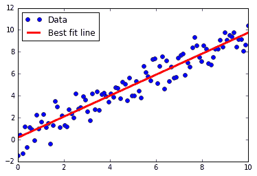

图 1：数据点和通过矩阵逆方法获得的最佳拟合线

## 工作原理

与之前的秘籍或本书中的大多数秘籍不同，此处的解决方案仅通过矩阵运算找到。我们将使用的大多数 TensorFlow 算法都是通过训练循环实现的，并利用自动反向传播来更新模型变量。在这里，我们通过实现将模型拟合到数据的直接解决方案来说明 TensorFlow 的多功能性。

> 我们在这里使用了一个二维数据示例来显示与数据拟合的图。值得注意的是，用于求解系数的公式
> 
> 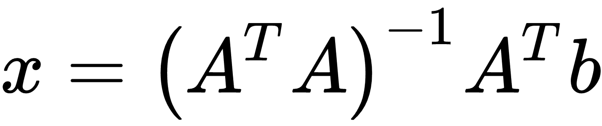
> 
> 将根据需要扩展到数据中的许多特征（除非存在任何共线性问题）。

# 实现分解方法

对于这个秘籍，我们将实现一个用于线性回归的矩阵分解方法。具体来说，我们将使用 Cholesky 分解，TensorFlow 中存在相关函数。

## 准备

在大多数情况下，实现前一个秘籍中的逆方法在数值上效率低，尤其是当矩阵变得非常大时。另一种方法是分解`A`矩阵并对分解执行矩阵运算。一种方法是在 TensorFlow 中使用内置的 Cholesky 分解方法。

人们对将矩阵分解为更多矩阵如此感兴趣的一个原因是，所得到的矩阵将具有允许我们有效使用某些方法的保证属性。 Cholesky 分解将矩阵分解为下三角矩阵和上三角矩阵，比如`L`和`L'`，使得这些矩阵是彼此的转置。有关此分解属性的更多信息，有许多可用资源来描述它以及如何到达它。在这里，我们将通过将其写为`LL'x = b`来解决系统`Ax = b`。我们首先解决`Ly = b`的`y`，然后求解`L'x = y`得到我们的系数矩阵`x`。

## 操作步骤

我们按如下方式处理秘籍：

1.  我们将以与上一个秘籍完全相同的方式设置系统。我们将导入库，初始化图并创建数据。然后，我们将以之前的方式获得我们的`A`矩阵和`b`矩阵：

```py
import matplotlib.pyplot as plt 
import numpy as np 
import tensorflow as tf 
from tensorflow.python.framework import ops 
ops.reset_default_graph() 
sess = tf.Session() 
x_vals = np.linspace(0, 10, 100) 
y_vals = x_vals + np.random.normal(0, 1, 100) 
x_vals_column = np.transpose(np.matrix(x_vals)) 
ones_column = np.transpose(np.matrix(np.repeat(1, 100))) 
A = np.column_stack((x_vals_column, ones_column)) 
b = np.transpose(np.matrix(y_vals)) 
A_tensor = tf.constant(A) 
b_tensor = tf.constant(b) 
```

1.  接下来，我们找到方阵的 Cholesky 分解，`A^T A`：

```py
tA_A = tf.matmul(tf.transpose(A_tensor), A_tensor) 
L = tf.cholesky(tA_A) 
tA_b = tf.matmul(tf.transpose(A_tensor), b) 
sol1 = tf.matrix_solve(L, tA_b) 
sol2 = tf.matrix_solve(tf.transpose(L), sol1) 
```

> 请注意，TensorFlow 函数`cholesky()`仅返回分解的下对角线部分。这很好，因为上对角矩阵只是下对角矩阵的转置。

1.  现在我们有了解决方案，我们提取系数：

```py
solution_eval = sess.run(sol2) 
slope = solution_eval[0][0] 
y_intercept = solution_eval[1][0] 
print('slope: ' + str(slope)) 
print('y_intercept: ' + str(y_intercept)) 
slope: 0.956117676145 
y_intercept: 0.136575513864 
best_fit = [] 
for i in x_vals: 
    best_fit.append(slope*i+y_intercept) 
plt.plot(x_vals, y_vals, 'o', label='Data') 
plt.plot(x_vals, best_fit, 'r-', label='Best fit line', linewidth=3) 
plt.legend(loc='upper left') 
plt.show() 
```

绘图如下：

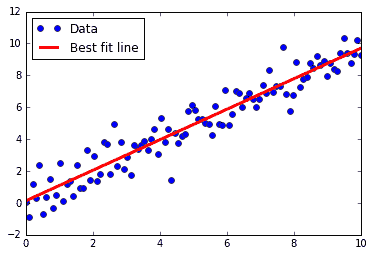

图 2：通过 Cholesky 分解获得的数据点和最佳拟合线

## 工作原理

如您所见，我们得出了与之前秘籍非常相似的答案。请记住，这种分解矩阵然后对碎片执行操作的方式有时会更加高效和数值稳定，尤其是在考虑大型数据矩阵时。

# 学习 TensorFlow 线性回归方法

虽然使用矩阵和分解方法非常强大，但 TensorFlow 还有另一种解决斜率和截距的方法。 TensorFlow 可以迭代地执行此操作，逐步学习最小化损失的线性回归参数。

## 准备

在这个秘籍中，我们将遍历批量数据点并让 TensorFlow 更新斜率和`y`截距。我们将使用内置于 scikit-learn 库中的鸢尾花数据集，而不是生成的数据。具体来说，我们将通过数据点找到最佳线，其中`x`值是花瓣宽度，`y`值是萼片长度。我们选择了这两个，因为它们之间似乎存在线性关系，我们将在最后的绘图中看到。我们还将在下一节中详细讨论不同损失函数的影响，但对于这个秘籍，我们将使用 L2 损失函数。

## 操作步骤

我们按如下方式处理秘籍：

1.  我们首先加载必要的库，创建图并加载数据：

```py
import matplotlib.pyplot as plt 
import numpy as np 
import tensorflow as tf 
from sklearn import datasets 
from tensorflow.python.framework import ops 
ops.reset_default_graph() 
sess = tf.Session() 
iris = datasets.load_iris() 
x_vals = np.array([x[3] for x in iris.data]) 
y_vals = np.array([y[0] for y in iris.data])
```

1.  然后我们声明我们的学习率，批量大小，占位符和模型变量：

```py
learning_rate = 0.05 
batch_size = 25 
x_data = tf.placeholder(shape=[None, 1], dtype=tf.float32) 
y_target = tf.placeholder(shape=[None, 1], dtype=tf.float32) 
A = tf.Variable(tf.random_normal(shape=[1,1])) 
b = tf.Variable(tf.random_normal(shape=[1,1])) 
```

1.  接下来，我们编写线性模型的公式`y = Ax + b`：

```py
model_output = tf.add(tf.matmul(x_data, A), b)
```

1.  然后，我们声明我们的 L2 损失函数（包括批量的平均值），初始化变量，并声明我们的优化器。请注意，我们选择`0.05`作为我们的学习率：

```py
loss = tf.reduce_mean(tf.square(y_target - model_output)) 
init = tf.global_variables_initializer() 
sess.run(init) 
my_opt = tf.train.GradientDescentOptimizer(learning_rate) 
train_step = my_opt.minimize(loss)
```

1.  我们现在可以在随机选择的批次上循环并训练模型。我们将运行 100 个循环并每 25 次迭代打印出变量和损失值。请注意，在这里，我们还保存了每次迭代的损失，以便我们以后可以查看它们：

```py
loss_vec = [] 
for i in range(100): 
    rand_index = np.random.choice(len(x_vals), size=batch_size) 
    rand_x = np.transpose([x_vals[rand_index]]) 
    rand_y = np.transpose([y_vals[rand_index]]) 
    sess.run(train_step, feed_dict={x_data: rand_x, y_target: rand_y}) 
    temp_loss = sess.run(loss, feed_dict={x_data: rand_x, y_target: rand_y}) 
    loss_vec.append(temp_loss) 
    if (i+1)%25==0: 
        print('Step #' + str(i+1) + ' A = ' + str(sess.run(A)) + ' b = ' + str(sess.run(b))) 
        print('Loss = ' + str(temp_loss)) 

Step #25 A = [[ 2.17270374]] b = [[ 2.85338426]] 
Loss = 1.08116 
Step #50 A = [[ 1.70683455]] b = [[ 3.59916329]] 
Loss = 0.796941 
Step #75 A = [[ 1.32762754]] b = [[ 4.08189011]] 
Loss = 0.466912 
Step #100 A = [[ 1.15968263]] b = [[ 4.38497639]] 
Loss = 0.281003
```

1.  接下来，我们将提取我们找到的系数并创建一个最合适的线以放入图中：

```py
[slope] = sess.run(A) 
[y_intercept] = sess.run(b) 
best_fit = [] 
for i in x_vals: 
    best_fit.append(slope*i+y_intercept)
```

1.  在这里，我们将创建两个图。第一个是覆盖拟合线的数据。第二个是 100 次迭代中的 L2 损失函数。这是生成两个图的代码。

```py
plt.plot(x_vals, y_vals, 'o', label='Data Points') 
plt.plot(x_vals, best_fit, 'r-', label='Best fit line', linewidth=3) 
plt.legend(loc='upper left') 
plt.title('Sepal Length vs Petal Width') 
plt.xlabel('Petal Width') 
plt.ylabel('Sepal Length') 
plt.show() 
plt.plot(loss_vec, 'k-') 
plt.title('L2 Loss per Generation') 
plt.xlabel('Generation') 
plt.ylabel('L2 Loss') 
plt.show() 
```

此代码生成以下拟合数据和损失图。

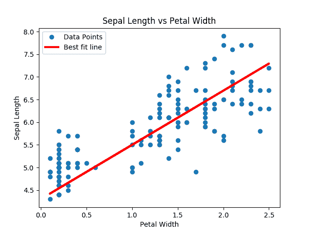

图 3：来自鸢尾数据集的数据点（萼片长度与花瓣宽度）重叠在 TensorFlow 中找到的最佳线条拟合。

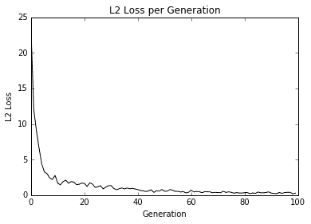

图 4：用我们的算法拟合数据的 L2 损失；注意损失函数中的抖动，可以通过较大的批量大小减小抖动，或者通过较小的批量大小来增加。

Here is a good place to note how to see whether the model is overfitting or underfitting the data. If our data is broken into test and training sets, and the accuracy is greater on the training set and lower on the test set, then we are overfitting the data. If the accuracy is still increasing on both test and training sets, then the model is underfitting and we should continue training.

## 工作原理

找到的最佳线不保证是最合适的线。最佳拟合线的收敛取决于迭代次数，批量大小，学习率和损失函数。随着时间的推移观察损失函数总是很好的做法，因为它可以帮助您解决问题或超参数变化。

# 理解线性回归中的损失函数

了解损失函数在算法收敛中的作用非常重要。在这里，我们将说明 L1 和 L2 损失函数如何影响线性回归中的收敛。

## 准备

我们将使用与先前秘籍中相同的鸢尾数据集，但我们将更改损失函数和学习率以查看收敛如何变化。

## 操作步骤

我们按如下方式处理秘籍：

1.  程序的开始与上一个秘籍相同，直到我们达到我们的损失函数。我们加载必要的库，启动会话，加载数据，创建占位符，并定义我们的变量和模型。需要注意的一点是，我们正在提取学习率和模型迭代。我们这样做是因为我们希望显示快速更改这些参数的效果。使用以下代码：

```py
import matplotlib.pyplot as plt 
import numpy as np 
import tensorflow as tf 
from sklearn import datasets 
sess = tf.Session() 
iris = datasets.load_iris() 
x_vals = np.array([x[3] for x in iris.data]) 
y_vals = np.array([y[0] for y in iris.data]) 
batch_size = 25 
learning_rate = 0.1 # Will not converge with learning rate at 0.4 
iterations = 50 
x_data = tf.placeholder(shape=[None, 1], dtype=tf.float32) 
y_target = tf.placeholder(shape=[None, 1], dtype=tf.float32) 
A = tf.Variable(tf.random_normal(shape=[1,1])) 
b = tf.Variable(tf.random_normal(shape=[1,1])) 
model_output = tf.add(tf.matmul(x_data, A), b)
```

1.  我们的损失函数将变为 L1 损失（`loss_l1`），如下所示：

```py
loss_l1 = tf.reduce_mean(tf.abs(y_target - model_output)) 
```

1.  现在，我们通过初始化变量，声明我们的优化器以及通过训练循环迭代数据来恢复。请注意，我们也在节省每一代的损失来衡量收敛。使用以下代码：

```py
init = tf.global_variables_initializer() 
sess.run(init) 
my_opt_l1 = tf.train.GradientDescentOptimizer(learning_rate) 
train_step_l1 = my_opt_l1.minimize(loss_l1) 
loss_vec_l1 = [] 
for i in range(iterations): 
    rand_index = np.random.choice(len(x_vals), size=batch_size) 
    rand_x = np.transpose([x_vals[rand_index]]) 
    rand_y = np.transpose([y_vals[rand_index]]) 
    sess.run(train_step_l1, feed_dict={x_data: rand_x, y_target: rand_y}) 
    temp_loss_l1 = sess.run(loss_l1, feed_dict={x_data: rand_x, y_target: rand_y}) 
    loss_vec_l1.append(temp_loss_l1) 
    if (i+1)%25==0: 
        print('Step #' + str(i+1) + ' A = ' + str(sess.run(A)) + ' b = ' + str(sess.run(b))) 

plt.plot(loss_vec_l1, 'k-', label='L1 Loss') 
plt.plot(loss_vec_l2, 'r--', label='L2 Loss') 
plt.title('L1 and L2 Loss per Generation') 
plt.xlabel('Generation') 
plt.ylabel('L1 Loss') 
plt.legend(loc='upper right') 
plt.show() 
```

## 工作原理

在选择损失函数时，我们还必须选择适合我们问题的相应学习率。在这里，我们将说明两种情况，一种是首选 L2，另一种是首选 L1。

如果我们的学习率很小，我们的收敛会花费更多时间。但是如果我们的学习速度太大，我们的算法就会遇到问题从不收敛。下面是当学习率为 0.05 时，鸢尾线性回归问题的 L1 和 L2 损失的损失函数图：

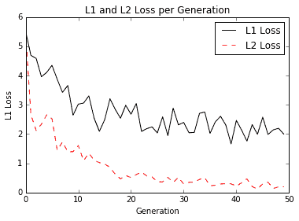

图 5：鸢尾线性回归问题的学习率为 0.05 的 L1 和 L2 损失

学习率为 0.05 时，似乎 L2 损失是首选，因为它会收敛到较低的损失。下面是我们将学习率提高到 0.4 时的损失函数图：

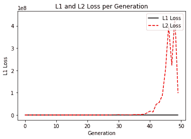

图 6：鸢尾线性回归问题的 L1 和 L2 损失，学习率为 0.4;请注意，由于 y 轴的高比例，L1 损失不可见

在这里，我们可以看到高学习率可以在 L2 范数中超调，而 L1 范数收敛。

## 更多

为了理解正在发生的事情，我们应该看看大学习率和小学习率如何影响 L1 范数和 L2 范数。为了使这个可视化，我们查看两个规范的学习步骤的一维表示，如下所示：

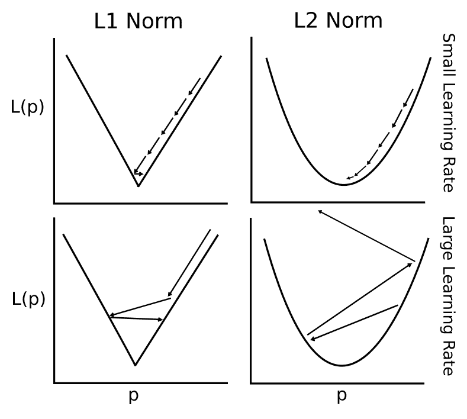

图 7：学习率越来越高的 L1 和 L2 范数会发生什么

# 实现戴明回归

在这个秘籍中，我们将实现戴明回归，这意味着我们需要一种不同的方法来测量模型线和数据点之间的距离。

> 戴明回归有几个名字。它也称为总回归，正交距离回归（ODR）和最短距离回归。

## 准备

如果最小二乘线性回归最小化到线的垂直距离，则戴明回归最小化到线的总距离。这种类型的回归可以最小化`y`和`x`值的误差。

请参阅下图进行比较：


图 8：常规线性回归和戴明回归之间的差异；左边的线性回归最小化了到线的垂直距离，右边的变形回归最小化了到线的总距离

要实现戴明回归，我们必须修改损失函数。常规线性回归中的损失函数使垂直距离最小化。在这里，我们希望最小化总距离。给定线的斜率和截距，到点的垂直距离是已知的几何公式​​。我们只需要替换此公式并告诉 TensorFlow 将其最小化。

## 操作步骤

我们按如下方式处理秘籍：

1.  代码与之前的秘籍非常相似，除非我们进入损失函数。我们首先加载库；开始一个会议；加载数据；声明批量大小；并创建占位符，变量和模型输出，如下所示：

```py
import matplotlib.pyplot as plt 
import numpy as np 
import tensorflow as tf 
from sklearn import datasets 
sess = tf.Session() 
iris = datasets.load_iris() 
x_vals = np.array([x[3] for x in iris.data]) 
y_vals = np.array([y[0] for y in iris.data]) 
batch_size = 50 
x_data = tf.placeholder(shape=[None, 1], dtype=tf.float32) 
y_target = tf.placeholder(shape=[None, 1], dtype=tf.float32) 
A = tf.Variable(tf.random_normal(shape=[1,1])) 
b = tf.Variable(tf.random_normal(shape=[1,1])) 
model_output = tf.add(tf.matmul(x_data, A), b)
```

1.  损失函数是由分子和分母组成的几何公式​​。为清楚起见，我们将分别编写这些内容。给定一条线`y = mx + b`和一个点`(x0, y0)`，两者之间的垂直距离可以写成如下：

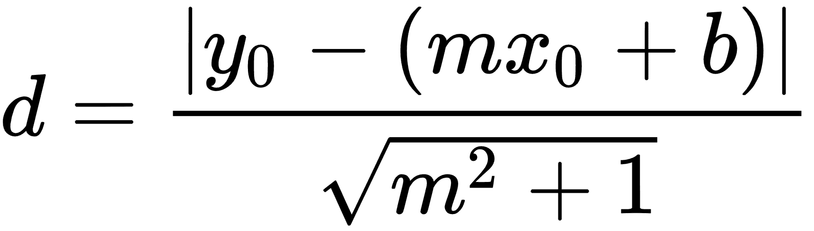

```py
deming_numerator = tf.abs(tf.sub(y_target, tf.add(tf.matmul(x_data, A), b))) 
deming_denominator = tf.sqrt(tf.add(tf.square(A),1)) 
loss = tf.reduce_mean(tf.truediv(deming_numerator, deming_denominator)) 
```

1.  我们现在初始化变量，声明我们的优化器，并循环遍历训练集以获得我们的参数，如下所示：

```py
init = tf.global_variables_initializer() 
sess.run(init) 
my_opt = tf.train.GradientDescentOptimizer(0.1) 
train_step = my_opt.minimize(loss) 
loss_vec = [] 
for i in range(250): 
    rand_index = np.random.choice(len(x_vals), size=batch_size) 
    rand_x = np.transpose([x_vals[rand_index]]) 
    rand_y = np.transpose([y_vals[rand_index]]) 
    sess.run(train_step, feed_dict={x_data: rand_x, y_target: rand_y}) 
    temp_loss = sess.run(loss, feed_dict={x_data: rand_x, y_target: rand_y}) 
    loss_vec.append(temp_loss) 
    if (i+1)%50==0: 
        print('Step #' + str(i+1) + ' A = ' + str(sess.run(A)) + ' b = ' + str(sess.run(b))) 
        print('Loss = ' + str(temp_loss)) 
```

1.  我们可以使用以下代码绘制输出：

```py
[slope] = sess.run(A) 
[y_intercept] = sess.run(b) 
best_fit = [] 
for i in x_vals: 
    best_fit.append(slope*i+y_intercept)

plt.plot(x_vals, y_vals, 'o', label='Data Points') 
plt.plot(x_vals, best_fit, 'r-', label='Best fit line', linewidth=3) 
plt.legend(loc='upper left') 
plt.title('Sepal Length vs petal Width') 
plt.xlabel('petal Width') 
plt.ylabel('Sepal Length') 
plt.show() 
```

我们得到上面代码的以下图：

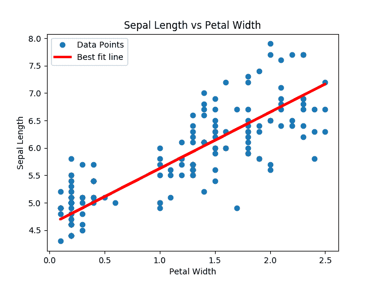

图 9：对鸢尾数据集进行戴明回归的解决方案

## 工作原理

戴明回归的方法几乎与常规线性回归相同。关键的区别在于我们如何衡量预测和数据点之间的损失。而不是垂直损失，我们对`y`和`x`值有垂直损失（或总损失）。

> 当我们假设`x`和`y`值中的误差相似时，使用这种类型的回归。根据我们的假设，我们还可以根据误差的差异在距离计算中缩放`x`和`y`轴。

# 实现套索和岭回归

还有一些方法可以限制系数对回归输出的影响。这些方法称为正则化方法，两种最常见的正则化方法是套索和岭回归。我们将介绍如何在本文中实现这两个方面。

## 准备

套索和岭回归与常规线性回归非常相似，除了我们添加正则化项以限制公式中的斜率（或部分斜率）。这可能有多种原因，但一个常见的原因是我们希望限制对因变量产生影响的特征。这可以通过在损失函数中添加一个取决于我们的斜率值`A`的项来实现。

对于套索回归，如果斜率`A`超过某个值，我们必须添加一个能大大增加损失函数的项。我们可以使用 TensorFlow 的逻辑运算，但它们没有与之关联的梯度。相反，我们将使用称为连续重阶函数的阶梯函数的连续近似，该函数按比例放大到我们选择的正则化截止值。我们将展示如何在此秘籍中进行套索回归。

对于岭回归，我们只是在 L2 范数中添加一个项，这是斜率系数的缩放 L2 范数。这种修改很简单，并在本秘籍末尾的“更多”部分中显示。

## 操作步骤

我们按如下方式处理秘籍：

1.  我们将再次使用鸢尾花数据集并以与以前相同的方式设置我们的脚本。我们先加载库；开始一个会议；加载数据；声明批量大小；并创建占位符，变量和模型输出，如下所示：

```py
import matplotlib.pyplot as plt 
import numpy as np 
import tensorflow as tf 
from sklearn import datasets 
from tensorflow.python.framework import ops 
ops.reset_default_graph() 
sess = tf.Session() 
iris = datasets.load_iris() 
x_vals = np.array([x[3] for x in iris.data]) 
y_vals = np.array([y[0] for y in iris.data]) 
batch_size = 50 
learning_rate = 0.001 
x_data = tf.placeholder(shape=[None, 1], dtype=tf.float32) 
y_target = tf.placeholder(shape=[None, 1], dtype=tf.float32) 
A = tf.Variable(tf.random_normal(shape=[1,1])) 
b = tf.Variable(tf.random_normal(shape=[1,1])) 
model_output = tf.add(tf.matmul(x_data, A), b)
```

1.  我们添加了损失函数，它是一个改进的连续 Heaviside 阶梯函数。我们还为`0.9`设定了套索回归的截止值。这意味着我们希望将斜率系数限制为小于`0.9`。使用以下代码：

```py
lasso_param = tf.constant(0.9) 
heavyside_step = tf.truediv(1., tf.add(1., tf.exp(tf.multiply(-100., tf.subtract(A, lasso_param))))) 
regularization_param = tf.mul(heavyside_step, 99.) 
loss = tf.add(tf.reduce_mean(tf.square(y_target - model_output)), regularization_param) 
```

1.  我们现在初始化变量并声明我们的优化器，如下所示：

```py
init = tf.global_variables_initializer() 
sess.run(init) 
my_opt = tf.train.GradientDescentOptimizer(learning_rate) 
train_step = my_opt.minimize(loss) 
```

1.  我们将训练循环延长了一段时间，因为它可能需要一段时间才能收敛。我们可以看到斜率系数小于`0.9`。使用以下代码：

```py
loss_vec = [] 
for i in range(1500): 
    rand_index = np.random.choice(len(x_vals), size=batch_size) 
    rand_x = np.transpose([x_vals[rand_index]]) 
    rand_y = np.transpose([y_vals[rand_index]]) 
    sess.run(train_step, feed_dict={x_data: rand_x, y_target: rand_y}) 
    temp_loss = sess.run(loss, feed_dict={x_data: rand_x, y_target: rand_y}) 
    loss_vec.append(temp_loss[0]) 
    if (i+1)%300==0: 
        print('Step #' + str(i+1) + ' A = ' + str(sess.run(A)) + ' b = ' + str(sess.run(b))) 
        print('Loss = ' + str(temp_loss)) 

Step #300 A = [[ 0.82512331]] b = [[ 2.30319238]] 
Loss = [[ 6.84168959]] 
Step #600 A = [[ 0.8200165]] b = [[ 3.45292258]] 
Loss = [[ 2.02759886]] 
Step #900 A = [[ 0.81428504]] b = [[ 4.08901262]] 
Loss = [[ 0.49081498]] 
Step #1200 A = [[ 0.80919558]] b = [[ 4.43668795]] 
Loss = [[ 0.40478843]] 
Step #1500 A = [[ 0.80433637]] b = [[ 4.6360755]] 
Loss = [[ 0.23839757]] 
```

## 工作原理

我们通过在线性回归的损失函数中添加连续的 Heaviside 阶跃函数来实现套索回归。由于阶梯函数的陡峭性，我们必须小心步长。步长太大而且不会收敛。对于岭回归，请参阅下一节中所需的更改。

## 更多

对于岭回归，我们将损失`ss`函数更改为如下：

```py
ridge_param = tf.constant(1.) 
ridge_loss = tf.reduce_mean(tf.square(A)) 
loss = tf.expand_dims(tf.add(tf.reduce_mean(tf.square(y_target - model_output)), tf.multiply(ridge_param, ridge_loss)), 0) 
```

# 实现弹性网络回归

弹性网络回归是一种回归类型，通过将 L1 和 L2 正则化项添加到损失函数，将套索回归与岭回归相结合。

## 准备

在前两个秘籍之后实现弹性网络回归应该是直截了当的，因此我们将在鸢尾数据集上的多元线性回归中实现这一点，而不是像以前那样坚持二维数据。我们将使用花瓣长度，花瓣宽度和萼片宽度来预测萼片长度。

## 操作步骤

我们按如下方式处理秘籍：

1.  首先，我们加载必要的库并初始化图，如下所示：

```py
import matplotlib.pyplot as plt 
import numpy as np 
import tensorflow as tf 
from sklearn import datasets 
sess = tf.Session()
```

1.  现在，我们加载数据。这次，`x`数据的每个元素将是三个值的列表而不是一个。使用以下代码：

```py
iris = datasets.load_iris() 
x_vals = np.array([[x[1], x[2], x[3]] for x in iris.data]) 
y_vals = np.array([y[0] for y in iris.data]) 
```

1.  接下来，我们声明批量大小，占位符，变量和模型输出。这里唯一的区别是我们更改`x`数据占位符的大小规范，取三个值而不是一个，如下所示：

```py
batch_size = 50 
learning_rate = 0.001 
x_data = tf.placeholder(shape=[None, 3], dtype=tf.float32) 
y_target = tf.placeholder(shape=[None, 1], dtype=tf.float32) 
A = tf.Variable(tf.random_normal(shape=[3,1])) 
b = tf.Variable(tf.random_normal(shape=[1,1])) 
model_output = tf.add(tf.matmul(x_data, A), b) 
```

1.  对于弹性网络，损失函数具有部分斜率的 L1 和 L2 范数。我们创建这些项，然后将它们添加到损失函数中，如下所示：

```py
elastic_param1 = tf.constant(1.) 
elastic_param2 = tf.constant(1.) 
l1_a_loss = tf.reduce_mean(tf.abs(A)) 
l2_a_loss = tf.reduce_mean(tf.square(A)) 
e1_term = tf.multiply(elastic_param1, l1_a_loss) 
e2_term = tf.multiply(elastic_param2, l2_a_loss) 
loss = tf.expand_dims(tf.add(tf.add(tf.reduce_mean(tf.square(y_target - model_output)), e1_term), e2_term), 0)
```

1.  现在，我们可以初始化变量，声明我们的优化函数，运行训练循环，并拟合我们的系数，如下所示：

```py
init = tf.global_variables_initializer() 
sess.run(init) 
my_opt = tf.train.GradientDescentOptimizer(learning_rate) 
train_step = my_opt.minimize(loss) 
loss_vec = [] 
for i in range(1000): 
    rand_index = np.random.choice(len(x_vals), size=batch_size) 
    rand_x = x_vals[rand_index] 
    rand_y = np.transpose([y_vals[rand_index]]) 
    sess.run(train_step, feed_dict={x_data: rand_x, y_target: rand_y}) 
    temp_loss = sess.run(loss, feed_dict={x_data: rand_x, y_target: rand_y}) 
    loss_vec.append(temp_loss[0]) 
    if (i+1)%250==0: 
        print('Step #' + str(i+1) + ' A = ' + str(sess.run(A)) + ' b = ' + str(sess.run(b))) 
        print('Loss = ' + str(temp_loss)) 
```

1.  这是代码的输出：

```py
Step #250 A = [[ 0.42095602] 
 [ 0.1055888 ] 
 [ 1.77064979]] b = [[ 1.76164341]] 
Loss = [ 2.87764359] 
Step #500 A = [[ 0.62762028] 
 [ 0.06065864] 
 [ 1.36294949]] b = [[ 1.87629771]] 
Loss = [ 1.8032167] 
Step #750 A = [[ 0.67953539] 
 [ 0.102514 ] 
 [ 1.06914485]] b = [[ 1.95604002]] 
Loss = [ 1.33256555] 
Step #1000 A = [[ 0.6777274 ] 
 [ 0.16535147] 
 [ 0.8403284 ]] b = [[ 2.02246833]] 
Loss = [ 1.21458709]
```

1.  现在，我们可以观察训练迭代的损失，以确保算法收敛，如下所示：

```py
plt.plot(loss_vec, 'k-') 
plt.title('Loss per Generation') 
plt.xlabel('Generation') 
plt.ylabel('Loss') 
plt.show() 
```

我们得到上面代码的以下图：

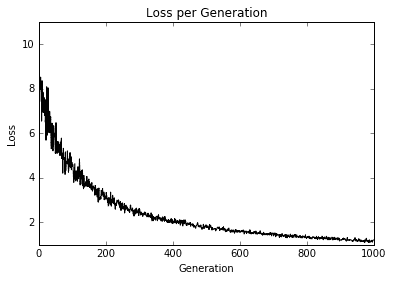

图 10：在 1,000 次训练迭代中绘制的弹性净回归损失

## 工作原理

这里实现弹性网络回归以及多元线性回归。我们可以看到，利用损失函数中的这些正则化项，收敛速度比先前的秘籍慢。正则化就像在损失函数中添加适当的项一样简单。

# 实现逻辑回归

对于这个秘籍，我们将实现逻辑回归来预测样本人群中低出生体重的概率。

## 准备

逻辑回归是将线性回归转换为二元分类的一种方法。这是通过将线性输出转换为 Sigmoid 函数来实现的，该函数将输出在 0 和 1 之间进行缩放。目标是零或一，表示数据点是在一个类还是另一个类中。由于我们预测 0 和 1 之间的数字，如果预测高于指定的截止值，则预测被分类为类值 1，否则分类为 0。出于此示例的目的，我们将指定截断为 0.5，这将使分类像舍入输出一样简单。

我们将用于此示例的数据将是从作者的 GitHub 仓库获得的[低出生体重数据](https://github.com/nfmcclure/tensorflow_cookbook/raw/master/01_Introduction/07_Working_with_Data_Sources/birthweight_data/birthweight.dat)。我们将从其他几个因素预测低出生体重。

## 操作步骤

我们按如下方式处理秘籍：

1.  我们首先加载库，包括`request`库，因为我们将通过超链接访问低出生体重数据。我们还发起了一个会议：

```py
import matplotlib.pyplot as plt 
import numpy as np 
import tensorflow as tf 
import requests 
from sklearn import datasets 
from sklearn.preprocessing import normalize 
from tensorflow.python.framework import ops 
ops.reset_default_graph() 
sess = tf.Session()
```

1.  接下来，我们通过请求模块加载数据并指定我们要使用的特征。我们必须具体，因为一个特征是实际出生体重，我们不想用它来预测出生体重是大于还是小于特定量。我们也不想将 ID 列用作预测器：

```py
birth_weight_file = 'birth_weight.csv'
# Download data and create data file if file does not exist in current directory
if not os.path.exists(birth_weight_file):
    birthdata_url = 'https://github.com/nfmcclure/tensorflow_cookbook/raw/master/01_Introduction/07_Working_with_Data_Sources/birthweight_data/birthweight.dat'
    birth_file = requests.get(birthdata_url)
    birth_data = birth_file.text.split('\r\n')
    birth_header = birth_data[0].split('\t')
    birth_data = [[float(x) for x in y.split('\t') if len(x)>=1] for y in birth_data[1:] if len(y)>=1]
    with open(birth_weight_file, 'w', newline='') as f:
        writer = csv.writer(f)
        writer.writerow(birth_header)
        writer.writerows(birth_data)

# Read birth weight data into memory
birth_data = []
with open(birth_weight_file, newline='') as csvfile:
    csv_reader = csv.reader(csvfile)
    birth_header = next(csv_reader)
    for row in csv_reader:
        birth_data.append(row)
    birth_data = [[float(x) for x in row] for row in birth_data]
# Pull out target variable
y_vals = np.array([x[0] for x in birth_data])
# Pull out predictor variables (not id, not target, and not birthweight)
x_vals = np.array([x[1:8] for x in birth_data])
```

1.  首先，我们将数据集拆分为测试和训练集：

```py
train_indices = np.random.choice(len(x_vals), round(len(x_vals)*0.8), replace=False) 
test_indices = np.array(list(set(range(len(x_vals))) - set(train_indices))) 
x_vals_train = x_vals[train_indices] 
x_vals_test = x_vals[test_indices] 
y_vals_train = y_vals[train_indices] 
y_vals_test = y_vals[test_indices]
```

1.  当特征在 0 和 1 之间缩放（最小 - 最大缩放）时，逻辑回归收敛效果更好。那么，接下来我们将扩展每个特征：

```py
def normalize_cols(m, col_min=np.array([None]), col_max=np.array([None])):
    if not col_min[0]:
        col_min = m.min(axis=0)
    if not col_max[0]:
        col_max = m.max(axis=0)
    return (m-col_min) / (col_max - col_min), col_min, col_max

x_vals_train, train_min, train_max = np.nan_to_num(normalize_cols(x_vals_train))
x_vals_test = np.nan_to_num(normalize_cols(x_vals_test, train_min, train_max))
```

> 请注意，在缩放数据集之前，我们将数据集拆分为训练和测试。这是一个重要的区别。我们希望确保测试集完全不影响训练集。如果我们在分裂之前缩放整个集合，那么我们不能保证它们不会相互影响。我们确保从训练组中保存缩放以缩放测试集。

1.  接下来，我们声明批量大小，占位符，变量和逻辑模型。我们不将输出包装在 sigmoid 中，因为该操作内置于损失函数中。另请注意，每次观察都有七个输入特征，因此`x_data`占位符的大小为`[None, 7]`。

```py
batch_size = 25 
x_data = tf.placeholder(shape=[None, 7], dtype=tf.float32) 
y_target = tf.placeholder(shape=[None, 1], dtype=tf.float32) 
A = tf.Variable(tf.random_normal(shape=[7,1])) 
b = tf.Variable(tf.random_normal(shape=[1,1])) 
model_output = tf.add(tf.matmul(x_data, A), b)
```

1.  现在，我们声明我们的损失函数，它具有 sigmoid 函数，初始化我们的变量，并声明我们的优化函数：

```py
loss = tf.reduce_mean(tf.nn.sigmoid_cross_entropy_with_logits(model_output, y_target)) 
init = tf.global_variables_initializer() 
sess.run(init) 
my_opt = tf.train.GradientDescentOptimizer(0.01) 
train_step = my_opt.minimize(loss)
```

1.  在记录损失函数的同时，我们还希望在训练和测试集上记录分类准确率。因此，我们将创建一个预测函数，返回任何大小的批量的准确率：

```py
prediction = tf.round(tf.sigmoid(model_output)) 
predictions_correct = tf.cast(tf.equal(prediction, y_target), tf.float32) 
accuracy = tf.reduce_mean(predictions_correct)
```

1.  现在，我们可以开始我们的训练循环并记录损失和准确率：

```py
loss_vec = [] 
train_acc = [] 
test_acc = [] 
for i in range(1500): 
    rand_index = np.random.choice(len(x_vals_train), size=batch_size) 
    rand_x = x_vals_train[rand_index] 
    rand_y = np.transpose([y_vals_train[rand_index]]) 
    sess.run(train_step, feed_dict={x_data: rand_x, y_target: rand_y}) 
    temp_loss = sess.run(loss, feed_dict={x_data: rand_x, y_target: rand_y}) 
    loss_vec.append(temp_loss) 
    temp_acc_train = sess.run(accuracy, feed_dict={x_data: x_vals_train, y_target: np.transpose([y_vals_train])}) 
    train_acc.append(temp_acc_train) 
    temp_acc_test = sess.run(accuracy, feed_dict={x_data: x_vals_test, y_target: np.transpose([y_vals_test])}) 
    test_acc.append(temp_acc_test)
```

1.  以下是查看损失和准确率图的代码：

```py
plt.plot(loss_vec, 'k-') 
plt.title('Cross' Entropy Loss per Generation') 
plt.xlabel('Generation') 
plt.ylabel('Cross' Entropy Loss') 
plt.show() 
plt.plot(train_acc, 'k-', label='Train Set Accuracy') 
plt.plot(test_acc, 'r--', label='Test Set Accuracy') 
plt.title('Train and Test Accuracy') 
plt.xlabel('Generation') 
plt.ylabel('Accuracy') 
plt.legend(loc='lower right') 
plt.show() 
```

## 工作原理

这是迭代和训练和测试精度的损失。由于数据集仅为 189 次观测，因此随着数据集的随机分裂，训练和测试精度图将发生变化。第一个数字是交叉熵损失：

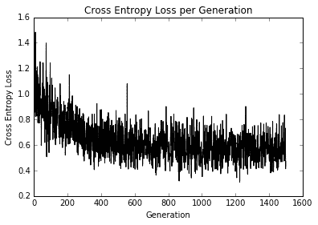

图 11：在 1,500 次迭代过程中绘制的交叉熵损失

第二个图显示了训练和测试装置的准确率：

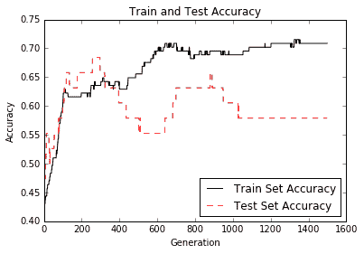Figure 12: Test and train set accuracy plotted over 1,500 generations

