# 五、最近邻方法

本章将重点介绍最近邻方法，以及如何在 TensorFlow 中实现它们。我们将首先介绍这些方法，然后我们将说明如何实现各种形式。本章将以地址匹配和图像识别的示例结束。

在本章中，我们将介绍以下内容：

*   使用最近邻
*   使用基于文本的距离
*   计算混合距离函数
*   使用地址匹配的示例
*   使用最近邻进行图像识别

> 请注意，所有最新代码均可在 [Github](https://github.com/nfmcclure/tensorflow_cookbook) 和 [Packt 仓库](https://github.com/PacktPublishing/TensorFlow-Machine-Learning-Cookbook-Second-Edition)获得。

# 介绍

最近邻方法植根于基于距离的概念思想。我们认为我们的训练设定了一个模型，并根据它们与训练集中的点的接近程度对新点进行预测。一种简单的方法是使预测类与最接近的训练数据点类相同。但由于大多数数据集包含一定程度的噪声，因此更常见的方法是采用一组`k-`最近邻的加权平均值。该方法称为 K 最近邻（KNN）。

给定具有相应目标（`y[1], y[2]....y[n]`）的训练数据集（`x[1],x[2].....x[n]`），我们可以通过查看一组最近邻来对点`z`进行预测。实际的预测方法取决于我们是进行回归（连续`y[i]`）还是分类（离散`y[i]`）。

对于离散分类目标，可以通过最大投票方案给出预测，通过到预测点的距离加权：

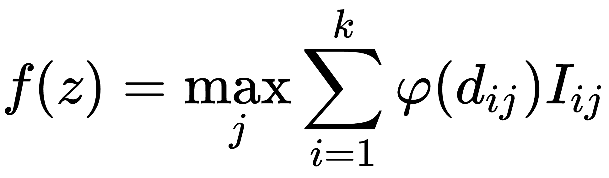

我们这里的预测`f(z)`是所有类别`j`的最大加权值，其中从预测点到训练点的加权距离`i`由`φ(d[ij])`给出。如果点`i`在类`j.`中，`l[ij]`只是一个指示器函数如果点`i`在类`j`中，则指示器函数取值 1，如果不是，则取值 0 另外，`k`是要考虑的最近点数。

对于连续回归目标，预测由最接近预测的所有`k`点的加权平均值给出：

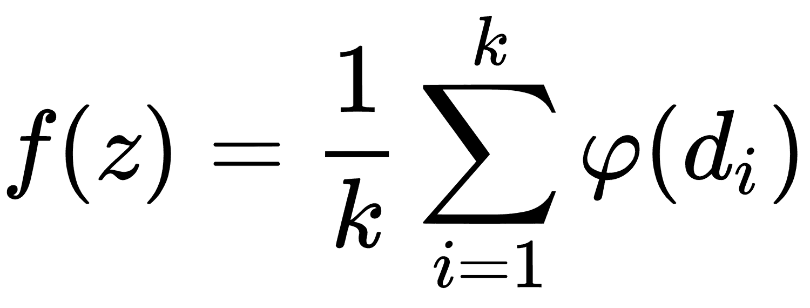

很明显，预测很大程度上取决于距离度量的选择`d`。

距离度量的常用规范是 L1 和 L2 距离，如下所示：

*   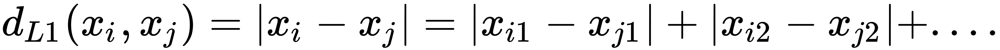
*   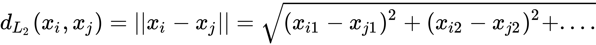

我们可以选择许多不同规格的距离指标。在本章中，我们将探讨 L1 和 L2 指标，以及编辑和文本距离。

我们还必须选择如何加权距离。对距离进行加权的直接方法是距离本身。远离我们预测的点应该比较近点的影响小。最常见的权重方法是通过距离的归一化逆。我们将在下一个秘籍中实现此方法。

> 注意，KNN 是一种聚合方法。对于回归，我们正在执行邻居的加权平均。因此，预测将不那么极端，并且与实际目标相比变化较小。这种影响的大小将由算法中邻居的数量`k`决定。

# 使用最近邻

我们将通过实现最近邻来预测住房价值来开始本章。这是从最近邻开始的好方法，因为我们将处理数字特征和连续目标。

## 准备

为了说明如何在 TensorFlow 中使用最近邻进行预测，我们将使用波士顿住房数据集。在这里，我们将预测邻域住房价值中位数作为几个特征的函数。

由于我们考虑训练集训练模型，我们将找到预测点的 KNN，并将计算目标值的加权平均值。

## 操作步骤

我们按如下方式处理秘籍：

1.  我们将从加载所需的库并启动图会话开始。我们将使用`requests`模块从 UCI 机器学习库加载必要的波士顿住房数据：

```py
import matplotlib.pyplot as plt 
import numpy as np 
import tensorflow as tf 
import requests 

sess = tf.Session() 
```

1.  接下来，我们将使用`requests`模块加载数据：

```py
housing_url = 'https://archive.ics.uci.edu/ml/machine-learning-databases/housing/housing.data' 
housing_header = ['CRIM', 'ZN', 'INDUS', 'CHAS', 'NOX', 'RM', 'AGE', 'DIS', 'RAD', 'TAX', 'PTRATIO', 'B', 'LSTAT', 'MEDV'] 
cols_used = ['CRIM', 'INDUS', 'NOX', 'RM', 'AGE', 'DIS', 'TAX', 'PTRATIO', 'B', 'LSTAT'] 
num_features = len(cols_used) 
# Request data 
housing_file = requests.get(housing_url) 
# Parse Data 
housing_data = [[float(x) for x in y.split(' ') if len(x)>=1] for y in housing_file.text.split('n') if len(y)>=1] 
```

1.  接下来，我们将数据分为依赖和独立的特征。我们将预测最后一个变量`MEDV`，这是房屋组的中值。我们也不会使用`ZN`，`CHAS`和`RAD`特征，因为它们没有信息或二元性质：

```py
y_vals = np.transpose([np.array([y[13] for y in housing_data])]) 
x_vals = np.array([[x for i,x in enumerate(y) if housing_header[i] in cols_used] for y in housing_data]) 

x_vals = (x_vals - x_vals.min(0)) / x_vals.ptp(0) 
```

1.  现在，我们将`x`和`y`值分成训练和测试集。我们将通过随机选择大约 80% 的行来创建训练集，并将剩下的 20% 留给测试集：

```py
train_indices = np.random.choice(len(x_vals), round(len(x_vals)*0.8), replace=False) 
test_indices = np.array(list(set(range(len(x_vals))) - set(train_indices))) 
x_vals_train = x_vals[train_indices] 
x_vals_test = x_vals[test_indices] 
y_vals_train = y_vals[train_indices] 
y_vals_test = y_vals[test_indices] 
```

1.  接下来，我们将声明`k`值和批量大小：

```py
k = 4 
batch_size=len(x_vals_test)
```

1.  我们接下来会申报占位符。请记住，没有模型变量需要训练，因为模型完全由我们的训练集确定：

```py
x_data_train = tf.placeholder(shape=[None, num_features], dtype=tf.float32)
x_data_test = tf.placeholder(shape=[None, num_features], dtype=tf.float32)
y_target_train = tf.placeholder(shape=[None, 1], dtype=tf.float32)
y_target_test = tf.placeholder(shape=[None, 1], dtype=tf.float32) 
```

1.  接下来，我们将为一批测试点创建距离函数。在这里，我们将说明 L1 距离的使用：

```py
distance = tf.reduce_sum(tf.abs(tf.subtract(x_data_train, tf.expand_dims(x_data_test,1))), reduction_indices=2) 
```

> 注意，也可以使用 L2 距离函数。我们将距离公式改为`distance = tf.sqrt(tf.reduce_sum(tf.square(tf.subtract(x_data_train, tf.expand_dims(x_data_test,1))), reduction_indices=1))`。

1.  现在，我们将创建我们的预测函数。为此，我们将使用`top_k()`函数，该函数返回张量中最大值的值和索引。由于我们想要最小距离的指数，我们将找到`k` - 最大负距离。我们还将声明目标值的预测和均方误差（MSE）：

```py
top_k_xvals, top_k_indices = tf.nn.top_k(tf.negative(distance), k=k) 
x_sums = tf.expand_dims(tf.reduce_sum(top_k_xvals, 1),1) 
x_sums_repeated = tf.matmul(x_sums,tf.ones([1, k], tf.float32)) 
x_val_weights = tf.expand_dims(tf.divide(top_k_xvals,x_sums_repeated), 1) 

top_k_yvals = tf.gather(y_target_train, top_k_indices) 
prediction = tf.squeeze(tf.batch_matmul(x_val_weights,top_k_yvals), squeeze_dims=[1]) 
mse = tf.divide(tf.reduce_sum(tf.square(tf.subtract(prediction, y_target_test))), batch_size)
```

1.  现在，我们将遍历测试数据并存储预测和准确率值：

```py
num_loops = int(np.ceil(len(x_vals_test)/batch_size)) 

for i in range(num_loops): 
    min_index = i*batch_size 
    max_index = min((i+1)*batch_size,len(x_vals_train)) 
    x_batch = x_vals_test[min_index:max_index] 
    y_batch = y_vals_test[min_index:max_index] 
    predictions = sess.run(prediction, feed_dict={x_data_train: x_vals_train, x_data_test: x_batch, y_target_train: y_vals_train, y_target_test: y_batch}) 
    batch_mse = sess.run(mse, feed_dict={x_data_train: x_vals_train, x_data_test: x_batch, y_target_train: y_vals_train, y_target_test: y_batch}) 

    print('Batch #' + str(i+1) + ' MSE: ' + str(np.round(batch_mse,3))) 

Batch #1 MSE: 23.153 
```

1.  另外，我们可以查看实际目标值与预测值的直方图。看待这一点的一个原因是要注意这样一个事实：使用平均方法，我们无法预测目标的极端：

```py
bins = np.linspace(5, 50, 45) 
plt.hist(predictions, bins, alpha=0.5, label='Prediction') 
plt.hist(y_batch, bins, alpha=0.5, label='Actual') 
plt.title('Histogram of Predicted and Actual Values') 
plt.xlabel('Med Home Value in $1,000s') 
plt.ylabel('Frequency') 
plt.legend(loc='upper right') 
plt.show() 
```

然后我们将获得直方图，如下所示：

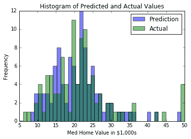

图 1：KNN 的预测值和实际目标值的直方图（其中`k=4`）

一个难以确定的是`k`的最佳值。对于上图和预测，我们将`k=4`用于我们的模型。我们之所以选择这个，是因为它给了我们最低的 MSE。这通过交叉验证来验证。如果我们在`k`的多个值上使用交叉验证，我们将看到`k=4`给我们一个最小的 MSE。我们在下图中说明了这一点。绘制预测值的方差也是值得的，以表明它会随着我们平均的邻居越多而减少：

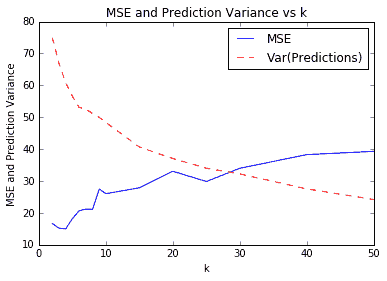

图 2：各种`k`值的 KNN 预测的 MSE。我们还绘制了测试集上预测值的方差。请注意，随着`k`的增加，方差会减小。

## 工作原理

使用最近邻算法，模型是训练集。因此，我们不必在模型中训练任何变量。唯一的参数`k`是通过交叉验证确定的，以最大限度地减少我们的 MSE。

## 更多

对于 KNN 的加权，我们选择直接按距离加权。还有其他选择我们也可以考虑。另一种常见方法是通过反平方距离加权。

# 使用基于文本的距离

最近邻比处理数字更通用。只要我们有一种方法来测量特征之间的距离，我们就可以应用最近邻算法。在本文中，我们将介绍如何使用 TensorFlow 测量文本距离。

## 准备

在本文中，我们将说明如何在字符串之间使用 TensorFlow 的文本距离度量，Levenshtein 距离（编辑距离）。这将在本章后面重要，因为我们扩展了最近邻方法以包含带有文本的特征。

Levenshtein 距离是从一个字符串到另一个字符串的最小编辑次数。允许的编辑是插入字符，删除字符或用不同的字符替换字符。对于这个秘籍，我们将使用 TensorFlow 的 Levenshtein 距离函数`edit_distance()`。值得说明这个函数的用法，因为它的用法将适用于后面的章节。

> 请注意，TensorFlow 的`edit_distance()`函数仅接受稀疏张量。我们必须创建我们的字符串作为单个字符的稀疏张量。

## 操作步骤

1.  首先，我们将加载 TensorFlow 并初始化图：

```py
import tensorflow as tf 
sess = tf.Session() 
```

1.  然后，我们将说明如何计算两个单词`'bear'`和`'beer'`之间的编辑距离。首先，我们将使用 Python 的`list()`函数从我们的字符串创建一个字符列表。接下来，我们将从该列表中创建一个稀疏的 3D 矩阵。我们必须告诉 TensorFlow 字符索引，矩阵的形状以及我们在张量中想要的字符。之后，我们可以决定是否要使用总编辑距离`(normalize=False)`或标准化编辑距离`(normalize=True)`，我们将编辑距离除以第二个单词的长度：

```py
hypothesis = list('bear') 
truth = list('beers') 
h1 = tf.SparseTensor([[0,0,0], [0,0,1], [0,0,2], [0,0,3]], 
                     hypothesis, [1,1,1]) 
t1 = tf.SparseTensor([[0,0,0], [0,0,1], [0,0,1], [0,0,3],[0,0,4]], truth, [1,1,1]) 

print(sess.run(tf.edit_distance(h1, t1, normalize=False))) 

[[ 2.]]
```

> TensorFlow 的文档将两个字符串视为提议（假设）字符串和基础事实字符串。我们将在这里用`h`和`t`张量继续这个表示法。函数`SparseTensorValue()`是一种在 TensorFlow 中创建稀疏张量的方法。它接受我们希望创建的稀疏张量的索引，值和形状。

1.  接下来，我们将说明如何将两个单词`bear`和`beer`与另一个单词`beers`进行比较。为了达到这个目的，我们必须复制`beers`以获得相同数量的可比词：

```py
hypothesis2 = list('bearbeer') 
truth2 = list('beersbeers') 
h2 = tf.SparseTensor([[0,0,0], [0,0,1], [0,0,2], [0,0,3], [0,1,0], [0,1,1], [0,1,2], [0,1,3]], hypothesis2, [1,2,4]) 
t2 = tf.SparseTensor([[0,0,0], [0,0,1], [0,0,2], [0,0,3], [0,0,4], [0,1,0], [0,1,1], [0,1,2], [0,1,3], [0,1,4]], truth2, [1,2,5]) 

print(sess.run(tf.edit_distance(h2, t2, normalize=True))) 

[[ 0.40000001  0.2      ]]
```

1.  在此示例中显示了将一组单词与另一单词进行比较的更有效方法。我们将事先为假设和基本真实字符串创建索引和字符列表：

```py
hypothesis_words = ['bear','bar','tensor','flow'] 
truth_word = ['beers''] 
num_h_words = len(hypothesis_words) 
h_indices = [[xi, 0, yi] for xi,x in enumerate(hypothesis_words) for yi,y in enumerate(x)] 
h_chars = list(''.join(hypothesis_words)) 
h3 = tf.SparseTensor(h_indices, h_chars, [num_h_words,1,1]) 
truth_word_vec = truth_word*num_h_words 
t_indices = [[xi, 0, yi] for xi,x in enumerate(truth_word_vec) for yi,y in enumerate(x)] 
t_chars = list(''.join(truth_word_vec)) 
t3 = tf.SparseTensor(t_indices, t_chars, [num_h_words,1,1]) 

print(sess.run(tf.edit_distance(h3, t3, normalize=True))) 

[[ 0.40000001]
 [ 0.60000002]
 [ 0.80000001]
 [ 1\.        ]]
```

1.  现在，我们将说明如何使用占位符计算两个单词列表之间的编辑距离。这个概念是一样的，除了我们将`SparseTensorValue()`而不是稀疏张量。首先，我们将创建一个从单词列表创建稀疏张量的函数：

```py
def create_sparse_vec(word_list): 
    num_words = len(word_list) 
    indices = [[xi, 0, yi] for xi,x in enumerate(word_list) for yi,y in enumerate(x)] 
    chars = list(''.join(word_list)) 
    return(tf.SparseTensorValue(indices, chars, [num_words,1,1])) 

hyp_string_sparse = create_sparse_vec(hypothesis_words) 
truth_string_sparse = create_sparse_vec(truth_word*len(hypothesis_words)) 

hyp_input = tf.sparse_placeholder(dtype=tf.string) 
truth_input = tf.sparse_placeholder(dtype=tf.string) 

edit_distances = tf.edit_distance(hyp_input, truth_input, normalize=True) 

feed_dict = {hyp_input: hyp_string_sparse, 
             truth_input: truth_string_sparse} 

print(sess.run(edit_distances, feed_dict=feed_dict)) 

[[ 0.40000001]
 [ 0.60000002]
 [ 0.80000001]
 [ 1\.        ]]
```

## 工作原理

在这个秘籍中，我们展示了我们可以使用 TensorFlow 以多种方式测量文本距离。这对于在具有文本特征的数据上执行最近邻非常有用。当我们执行地址匹配时，我们将在本章后面看到更多内容。

## 更多

我们应该讨论其他文本距离指标。这是一个定义表，描述了两个字符串`s1`和`s2`之间的其他文本距离：

| 名称 | 描述 | 公式 |
| --- | --- | --- |
| 汉明距离 | 相同位置的相等字符的数量。仅在字符串长度相等时有效。 | 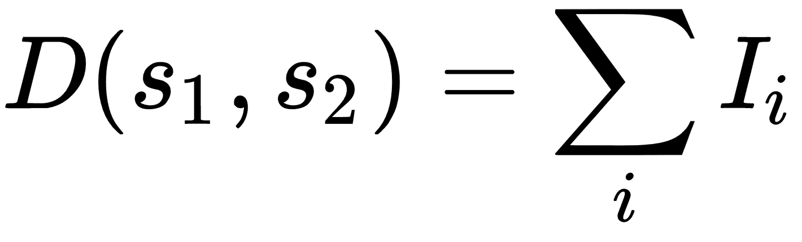，其中`I`是相等字符的指示函数。 |
| 余弦距离 | `k`差异的点积除以`k`差异的 L2 范数。 | 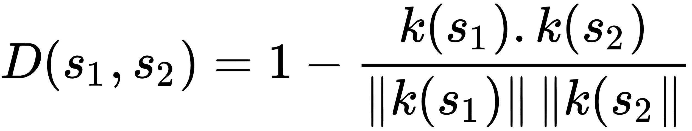 |
| 雅克卡距离 | 共同的字符数除以两个字符串中的字符总和。 | 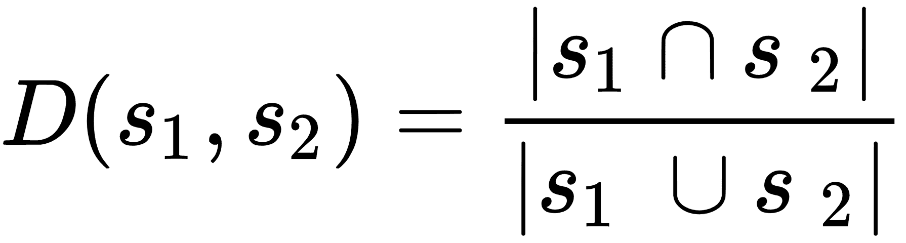 |

# 使用混合距离函数的计算

在处理具有多个特征的数据观察时，我们应该意识到特征可以在不同的尺度上以不同的方式缩放。在这个方案中，我们将考虑到这一点，以改善我们的住房价值预测。

## 准备

扩展最近邻算法很重要，要考虑不同缩放的变量。在这个例子中，我们将说明如何缩放不同变量的距离函数。具体来说，我们将距离函数作为特征方差的函数进行缩放。

加权距离函数的关键是使用权重矩阵。用矩阵运算写的距离函数变为以下公式：

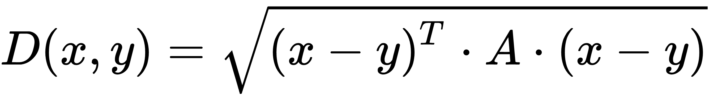

这里，`A`是一个对角线权重矩阵，我们将用它来缩放每个特征的距离度量。

在本文中，我们将尝试在波士顿住房价值数据集上改进我们的 MSE。该数据集是不同尺度上的特征的一个很好的例子，并且最近邻算法将受益于缩放距离函数。

## 操作步骤

我们将按如下方式处理秘籍：

1.  首先，我们将加载必要的库并启动图会话：

```py
import matplotlib.pyplot as plt
import numpy as np
import tensorflow as tf
import requests
sess = tf.Session() 
```

1.  接下来，我们将加载数据并将其存储在 NumPy 数组中。再次注意，我们只会使用某些列进行预测。我们不使用 id，也不使用方差非常低的变量：

```py
housing_url = 'https://archive.ics.uci.edu/ml/machine-learning-databases/housing/housing.data' 
housing_header = ['CRIM', 'ZN', 'INDUS', 'CHAS', 'NOX', 'RM', 'AGE', 'DIS', 'RAD', 'TAX', 'PTRATIO', 'B', 'LSTAT', 'MEDV'] 
cols_used = ['CRIM', 'INDUS', 'NOX', 'RM', 'AGE', 'DIS', 'TAX', 'PTRATIO', 'B', 'LSTAT'] 
num_features = len(cols_used) 
housing_file = requests.get(housing_url) 
housing_data = [[float(x) for x in y.split(' ') if len(x)>=1] for y in housing_file.text.split('\n') if len(y)>=1] 
y_vals = np.transpose([np.array([y[13] for y in housing_data])]) 
x_vals = np.array([[x for i,x in enumerate(y) if housing_header[i] in cols_used] for y in housing_data]) 
```

1.  现在，我们将`x`值缩放到 0 到 1 之间，最小 - 最大缩放：

```py
x_vals = (x_vals - x_vals.min(0)) / x_vals.ptp(0)
```

1.  然后，我们将创建对角线权重矩阵，该矩阵将通过特征的标准偏差提供距离度量的缩放：

```py
weight_diagonal = x_vals.std(0) 
weight_matrix = tf.cast(tf.diag(weight_diagonal), dtype=tf.float32)
```

1.  现在，我们将数据分成训练和测试集。我们还将声明`k`，最近邻的数量，并使批量大小等于测试集大小：

```py
train_indices = np.random.choice(len(x_vals), round(len(x_vals)*0.8), replace=False) 
test_indices = np.array(list(set(range(len(x_vals))) - set(train_indices))) 
x_vals_train = x_vals[train_indices] 
x_vals_test = x_vals[test_indices] 
y_vals_train = y_vals[train_indices] 
y_vals_test = y_vals[test_indices] 
k = 4 
batch_size=len(x_vals_test) 
```

1.  我们将声明接下来需要的占位符。我们有四个占位符 - 训练和测试集的[​​HTG0] - 输入和`y` - 目标：

```py
x_data_train = tf.placeholder(shape=[None, num_features], dtype=tf.float32) 
x_data_test = tf.placeholder(shape=[None, num_features], dtype=tf.float32) 
y_target_train = tf.placeholder(shape=[None, 1], dtype=tf.float32) 
y_target_test = tf.placeholder(shape=[None, 1], dtype=tf.float32) 
```

1.  现在，我们可以声明我们的距离函数。为了便于阅读，我们将把距离函数分解为其组件。请注意，我们必须按批量大小平铺权重矩阵，并使用`batch_matmul()`函数在批量大小中执行批量矩阵乘法：

```py
subtraction_term =  tf.subtract(x_data_train, tf.expand_dims(x_data_test,1)) 
first_product = tf.batch_matmul(subtraction_term, tf.tile(tf.expand_dims(weight_matrix,0), [batch_size,1,1])) 
second_product = tf.batch_matmul(first_product, tf.transpose(subtraction_term, perm=[0,2,1])) 
distance = tf.sqrt(tf.batch_matrix_diag_part(second_product))
```

1.  在我们计算每个测试点的所有训练距离之后，我们将需要返回顶部 KNN。我们可以使用`top_k()`函数执行此操作。由于此函数返回最大值，并且我们想要最小距离，因此我们返回最大的负距离值。然后，我们将预测作为顶部`k`邻居的距离的加权平均值：

```py
top_k_xvals, top_k_indices = tf.nn.top_k(tf.neg(distance), k=k) 
x_sums = tf.expand_dims(tf.reduce_sum(top_k_xvals, 1),1) 
x_sums_repeated = tf.matmul(x_sums,tf.ones([1, k], tf.float32)) 
x_val_weights = tf.expand_dims(tf.div(top_k_xvals,x_sums_repeated), 1) 
top_k_yvals = tf.gather(y_target_train, top_k_indices) 
prediction = tf.squeeze(tf.batch_matmul(x_val_weights,top_k_yvals), squeeze_dims=[1]) 
```

1.  为了评估我们的模型，我们将计算预测的 MSE：

```py
mse = tf.divide(tf.reduce_sum(tf.square(tf.subtract(prediction, y_target_test))), batch_size) 
```

1.  现在，我们可以遍历我们的测试批次并计算每个的 MSE：

```py
num_loops = int(np.ceil(len(x_vals_test)/batch_size))
for i in range(num_loops):
    min_index = i*batch_size
    max_index = min((i+1)*batch_size,len(x_vals_train))
    x_batch = x_vals_test[min_index:max_index]
    y_batch = y_vals_test[min_index:max_index]
    predictions = sess.run(prediction, feed_dict={x_data_train: x_vals_train, x_data_test: x_batch, y_target_train: y_vals_train, y_target_test: y_batch})
    batch_mse = sess.run(mse, feed_dict={x_data_train: x_vals_train, x_data_test: x_batch, y_target_train: y_vals_train, y_target_test: y_batch})
    print('Batch #' + str(i+1) + ' MSE: ' + str(np.round(batch_mse,3))) 

Batch #1 MSE: 21.322
```

1.  作为最终比较，我们可以使用以下代码绘制实际测试集的住房值分布和测试集的预测：

```py
bins = np.linspace(5, 50, 45) 
plt.hist(predictions, bins, alpha=0.5, label='Prediction') 
plt.hist(y_batch, bins, alpha=0.5, label='Actual') 
plt.title('Histogram of Predicted and Actual Values') 
plt.xlabel('Med Home Value in $1,000s') 
plt.ylabel('Frequency') 
plt.legend(loc='upper right') 
plt.show() 
```

我们将获得前面代码的以下直方图：

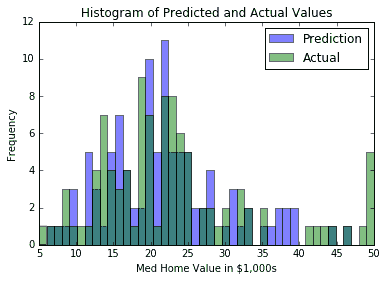

图 3：波士顿数据集上预测房屋价值和实际房屋价值的两个直方图；这一次，我们为每个特征不同地缩放了距离函数

## 工作原理

我们通过引入一种缩放每个特征的距离函数的方法来减少测试集上的 MSE。在这里，我们通过特征标准偏差的因子来缩放距离函数。这提供了更准确的测量视图，其中测量哪些点是最近的邻居。由此，我们还将顶部`k`邻域的加权平均值作为距离的函数，以获得住房价值预测。

## 更多

该缩放因子还可以用于最近邻距离计算中的向下加权或向上加权的特征。这在我们比某些特征更信任某些特征的情况下非常有用。

# 使用地址匹配的示例

现在我们已经测量了数值和文本距离，我们将花一些时间学习如何将它们组合起来测量具有文本和数字特征的观察之间的距离。

## 准备

最近邻是一种用于地址匹配的好算法。地址匹配是一种记录匹配，其中我们在多个数据集中具有地址并且想要匹配它们。在地址匹配中，我们可能在地址，不同城市或不同的邮政编码中存在拼写错误，但它们可能都指向相同的地址。在地址的数字和字符组件上使用最近邻算法可以帮助我们识别实际上相同的地址。

在此示例中，我们将生成两个数据集。每个数据集将包含街道地址和邮政编码。但是，一个数据集在街道地址中存在大量拼写错误。我们将非拼写数据集作为我们的黄金标准，并将为每个拼写错误地址返回一个地址，该地址最接近字符串距离（对于街道）和数字距离（对于邮政编码）的函数。

代码的第一部分将侧重于生成两个数据集。然后，代码的第二部分将运行测试集并返回训练集中最接近的地址。

## 操作步骤

我们将按如下方式处理秘籍：

1.  我们将从加载必要的库开始：

```py
import random 
import string 
import numpy as np 
import tensorflow as tf 
```

1.  我们现在将创建参考数据集。为了显示简洁的输出，我们只会使每个数据集由`10`地址组成（但它可以运行更多）：

```py
n = 10 street_names = ['abbey', 'baker', 'canal', 'donner', 'elm']
street_types = ['rd', 'st', 'ln', 'pass', 'ave'] 
rand_zips = [random.randint(65000,65999) for i in range(5)] 
numbers = [random.randint(1, 9999) for i in range(n)] 
streets = [random.choice(street_names) for i in range(n)] 
street_suffs = [random.choice(street_types) for i in range(n)] 
zips = [random.choice(rand_zips) for i in range(n)] 
full_streets = [str(x) + ' ' + y + ' ' + z for x,y,z in zip(numbers, streets, street_suffs)] 
reference_data = [list(x) for x in zip(full_streets,zips)] 
```

1.  要创建测试集，我们需要一个函数，它将在字符串中随机创建一个拼写错误并返回结果字符串：

```py
def create_typo(s, prob=0.75):
    if random.uniform(0,1) < prob:
        rand_ind = random.choice(range(len(s)))
        s_list = list(s)
        s_list[rand_ind]=random.choice(string.ascii_lowercase)
        s = ''.join(s_list)
    return s

typo_streets = [create_typo(x) for x in streets]
typo_full_streets = [str(x) + ' ' + y + ' ' + z for x,y,z in zip(numbers, typo_streets, street_suffs)]
test_data = [list(x) for x in zip(typo_full_streets,zips)] 
```

1.  现在，我们可以初始化图会话并声明我们需要的占位符。我们在每个测试和参考集中需要四个占位符，我们需要一个地址和邮政编码占位符：

```py
sess = tf.Session() 
test_address = tf.sparse_placeholder( dtype=tf.string) 
test_zip = tf.placeholder(shape=[None, 1], dtype=tf.float32) 
ref_address = tf.sparse_placeholder(dtype=tf.string) 
ref_zip = tf.placeholder(shape=[None, n], dtype=tf.float32) 
```

1.  现在，我们将声明数字拉链距离和地址字符串的编辑距离：

```py
zip_dist = tf.square(tf.subtract(ref_zip, test_zip)) 
address_dist = tf.edit_distance(test_address, ref_address, normalize=True)
```

1.  我们现在将拉链距离和地址距离转换为相似之处。对于相似性，当两个输入完全相同时，我们想要`1`的相似性，当它们非常不同时，我们想要`0`附近。对于拉链距离，我们可以通过获取距离，从最大值减去，然后除以距离的范围来实现。对于地址相似性，由于距离已经在`0`和`1`之间缩放，我们只需从 1 中减去它以获得相似性：

```py
zip_max = tf.gather(tf.squeeze(zip_dist), tf.argmax(zip_dist, 1)) 
zip_min = tf.gather(tf.squeeze(zip_dist), tf.argmin(zip_dist, 1)) 
zip_sim = tf.divide(tf.subtract(zip_max, zip_dist), tf.subtract(zip_max, zip_min)) 
address_sim = tf.subtract(1., address_dist) 
```

1.  为了结合两个相似度函数，我们将采用两者的加权平均值。对于这个秘籍，我们对地址和邮政编码给予同等重视。我们可以根据我们对每个特征的信任程度来改变这一点。然后，我们将返回参考集的最高相似度的索引：

```py
address_weight = 0.5 
zip_weight = 1\. - address_weight 
weighted_sim = tf.add(tf.transpose(tf.multiply(address_weight, address_sim)), tf.multiply(zip_weight, zip_sim)) 
top_match_index = tf.argmax(weighted_sim, 1) 
```

1.  为了在 TensorFlow 中使用编辑距离，我们必须将地址字符串转换为稀疏向量。在本章的先前秘籍中，使用基于文本的距离，我们创建了以下函数，我们也将在此秘籍中使用它：

```py
def sparse_from_word_vec(word_vec): 
    num_words = len(word_vec) 
    indices = [[xi, 0, yi] for xi,x in enumerate(word_vec) for yi,y in enumerate(x)] 
    chars = list(''.join(word_vec)) 
    # Now we return our sparse vector 
    return tf.SparseTensorValue(indices, chars, [num_words,1,1])
```

1.  我们需要将参考数据集中的地址和邮政编码分开，以便在循环测试集时将它们提供给占位符：

```py
reference_addresses = [x[0] for x in reference_data] 
reference_zips = np.array([[x[1] for x in reference_data]])
```

1.  我们需要使用我们在步骤 8 中创建的函数创建稀疏张量参考地址集：

```py
sparse_ref_set = sparse_from_word_vec(reference_addresses)
```

1.  现在，我们可以循环遍历测试集的每个条目，并返回它最接近的引用集的索引。我们将为每个条目打印测试和参考集。如您所见，我们在此生成的数据集中获得了很好的结果：

```py
for i in range(n): 
    test_address_entry = test_data[i][0] 
    test_zip_entry = [[test_data[i][1]]] 

    # Create sparse address vectors 
    test_address_repeated = [test_address_entry] * n 
    sparse_test_set = sparse_from_word_vec(test_address_repeated) 

    feeddict={test_address: sparse_test_set, 
               test_zip: test_zip_entry, 
               ref_address: sparse_ref_set, 
               ref_zip: reference_zips} 
    best_match = sess.run(top_match_index, feed_dict=feeddict)
    best_street = reference_addresses[best_match[0]]
    [best_zip] = reference_zips[0][best_match]
    [[test_zip_]] = test_zip_entry
    print('Address: ' + str(test_address_entry) + ', ' + str(test_zip_))
    print('Match : ' + str(best_street) + ', ' + str(best_zip))
```

我们将得到以下结果：

```py
Address: 8659 beker ln, 65463 
Match  : 8659 baker ln, 65463 
Address: 1048 eanal ln, 65681 
Match  : 1048 canal ln, 65681 
Address: 1756 vaker st, 65983 
Match  : 1756 baker st, 65983 
Address: 900 abbjy pass, 65983 
Match  : 900 abbey pass, 65983 
Address: 5025 canal rd, 65463 
Match  : 5025 canal rd, 65463 
Address: 6814 elh st, 65154 
Match  : 6814 elm st, 65154 
Address: 3057 cagal ave, 65463 
Match  : 3057 canal ave, 65463 
Address: 7776 iaker ln, 65681 
Match  : 7776 baker ln, 65681 
Address: 5167 caker rd, 65154
```

```py
Match  : 5167 baker rd, 65154 
Address: 8765 donnor st, 65154 
Match  : 8765 donner st, 65154 
```

## 工作原理

在像这样的地址匹配问题中要弄清楚的一个难点是权重的值以及如何缩放距离。这可能需要对数据本身进行一些探索和洞察。此外，在处理地址时，我们应该考虑除此处使用的组件之外的组件。我们可以将街道号码视为街道地址的独立组成部分，甚至可以包含其他组成部分，例如城市和州。

> 处理数字地址组件时，请注意它们可以被视为数字（具有数字距离）或字符（具有编辑距离）。由您决定选择哪个。请注意，如果我们认为邮政编码中的拼写错误来自人为错误而不是计算机映射错误，我们可以考虑使用邮政编码的编辑距离。

为了了解拼写错误如何影响结果，我们鼓励读者更改拼写错误函数以进行更多拼写错误或更频繁的拼写错误，并增加数据集大小以查看此算法的工作情况。

# 使用最近邻进行图像识别

最近邻也可用于图像识别。图像识别数据集的问题世界是 MNIST 手写数字数据集。由于我们将在后面的章节中将此数据集用于各种神经网络图像识别算法，因此将结果与非神经网络算法进行比较将会很棒。

## 准备

MNIST 数字数据集由数千个大小为`28×28`像素的标记图像组成。虽然这被认为是一个小图像，但它对于最近邻算法总共有 784 个像素（或特征）。我们将通过考虑最近的`k`邻居（`k=4`，在该示例中）的模式预测来计算该分类问题的最近邻预测。

## 操作步骤

我们将按如下方式处理秘籍：

1.  我们将从加载必要的库开始。请注意，我们还将导入 Python 图像库（PIL），以便能够绘制预测输出的样本。 TensorFlow 有一个内置方法来加载我们将使用的 MNIST 数据集，如下所示：

```py
import random 
import numpy as np 
import tensorflow as tf 
import matplotlib.pyplot as plt 
from PIL import Image 
from tensorflow.examples.tutorials.mnist import input_data 
```

1.  现在，我们将启动图会话并以单热编码形式加载 MNIST 数据：

```py
sess = tf.Session() 
mnist = input_data.read_data_sets("MNIST_data/", one_hot=True)
```

> 单热编码是更适合数值计算的分类值的数值表示。这里，我们有 10 个类别（数字 0-9），并将它们表示为长度为 10 的 0-1 向量。例如，类别 0 由向量`1,0,0,0,0,0`表示，类别 1 用`0,1,0,0,0,0`表示，依此类推。

1.  因为 MNIST 数据集很大并且计算数万个输入上的 784 个特征之间的距离在计算上是困难的，所以我们将采样一组较小的图像来训练。此外，我们将选择一个可被 6 整除的测试集编号，仅用于绘图目的，因为我们将绘制最后一批六个图像以查看结果的示例：

```py
train_size = 1000 
test_size = 102 
rand_train_indices = np.random.choice(len(mnist.train.images), train_size, replace=False) 
rand_test_indices = np.random.choice(len(mnist.test.images), test_size, replace=False) 
x_vals_train = mnist.train.images[rand_train_indices] 
x_vals_test = mnist.test.images[rand_test_indices] 
y_vals_train = mnist.train.labels[rand_train_indices] 
y_vals_test = mnist.test.labels[rand_test_indices]
```

1.  我们将声明我们的`k`值和批量大小：

```py
k = 4 
batch_size=6 
```

1.  现在，我们将初始化将添加到图中的占位符：

```py
x_data_train = tf.placeholder(shape=[None, 784], dtype=tf.float32) 
x_data_test = tf.placeholder(shape=[None, 784], dtype=tf.float32) 
y_target_train = tf.placeholder(shape=[None, 10], dtype=tf.float32) 
y_target_test = tf.placeholder(shape=[None, 10], dtype=tf.float32) 
```

1.  然后我们将声明我们的距离度量。在这里，我们将使用 L1 度量（绝对值）：

```py
distance = tf.reduce_sum(tf.abs(tf.subtract(x_data_train, tf.expand_dims(x_data_test,1))), reduction_indices=2) 
```

> 请注意，我们也可以使用以下代码来改变距离函数：`distance = tf.sqrt(tf.reduce_sum(tf.square(tf.subtract(x_data_train, tf.expand_dims(x_data_test,1))), reduction_indices=1))`。

1.  现在，我们将找到最接近的顶级`k`图像并预测模式。该模式将在单热编码索引上执行，计数最多：

```py
top_k_xvals, top_k_indices = tf.nn.top_k(tf.negative(distance), k=k) 
prediction_indices = tf.gather(y_target_train, top_k_indices) 
count_of_predictions = tf.reduce_sum(prediction_indices, reduction_indices=1) 
prediction = tf.argmax(count_of_predictions) 
```

1.  我们现在可以遍历我们的测试集，计算预测并存储它们，如下所示：

```py
num_loops = int(np.ceil(len(x_vals_test)/batch_size)) 
test_output = [] 
actual_vals = [] 
for i in range(num_loops): 
    min_index = i*batch_size 
    max_index = min((i+1)*batch_size,len(x_vals_train)) 
    x_batch = x_vals_test[min_index:max_index] 
    y_batch = y_vals_test[min_index:max_index] 
    predictions = sess.run(prediction, feed_dict={x_data_train: x_vals_train, x_data_test: x_batch, y_target_train: y_vals_train, y_target_test: y_batch}) 
    test_output.extend(predictions) 
    actual_vals.extend(np.argmax(y_batch, axis=1)) 
```

1.  现在我们已经保存了实际和预测的输出，我们可以计算出准确率。由于我们对测试/训练数据集进行随机抽样，这会发生变化，但最终我们的准确率值应该在 80%-90% 左右：

```py
accuracy = sum([1./test_size for i in range(test_size) if test_output[i]==actual_vals[i]]) 
print('Accuracy on test set: ' + str(accuracy)) 
Accuracy on test set: 0.8333333333333325 
```

1.  以下是绘制前面批量结果的代码：

```py
actuals = np.argmax(y_batch, axis=1) 
Nrows = 2 
Ncols = 3 
for i in range(len(actuals)): 
    plt.subplot(Nrows, Ncols, i+1) 
    plt.imshow(np.reshape(x_batch[i], [28,28]), cmap='Greys_r') 
    plt.title('Actual: ' + str(actuals[i]) + ' Pred: ' + str(predictions[i]), fontsize=10) 
    frame = plt.gca() 
    frame.axes.get_xaxis().set_visible(False) 
    frame.axes.get_yaxis().set_visible(False) 
```

结果如下：


图 4：我们运行最近邻预测的最后一批六个图像。我们可以看到，我们并没有完全正确地获得所有图像。

## 工作原理

给定足够的计算时间和计算资源，我们可以使测试和训练集更大。这可能会提高我们的准确率，也是防止过拟合的常用方法。另外，请注意，此算法需要进一步探索理想的`k`值进行选择。可以在数据集上进行一组交叉验证实验后选择`k`值。

## 更多

我们还可以使用最近邻算法来评估用户看不见的数字。有关使用此模型评估用户输入数字的方法，[请参阅在线仓库](https://github.com/nfmcclure/tensorflow_cookbook)。

在本章中，我们探讨了如何使用 KNN 算法进行回归和分类。我们讨论了距离函数的不同用法，以及如何将它们混合在一起。我们鼓励读者探索不同的距离度量，权重和`k`值，以优化这些方法的准确率。

