# 六、神经网络

在本章中，我们将介绍神经网络以及如何在 TensorFlow 中实现它们。大多数后续章节将基于神经网络，因此学习如何在 TensorFlow 中使用它们非常重要。在开始使用多层网络之前，我们将首先介绍神经网络的基本概念。在上一节中，我们将创建一个神经网络，学习如何玩井字棋。

在本章中，我们将介绍以下秘籍：

*   实现操作门
*   使用门和激活函数
*   实现单层神经网络
*   实现不同的层
*   使用多层网络
*   改进线性模型的预测
*   学习玩井字棋

读者可以在 [Github](https://github.com/nfmcclure/tensorflow_cookbook) 和[ Packt 仓库](https://github.com/PacktPublishing/TensorFlow-Machine-Learning-Cookbook-Second-Edition)中找到本章中的所有代码。

# 介绍

神经网络目前在诸如图像和语音识别，阅读手写，理解文本，图像分割，对话系统，自动驾驶汽车等任务中打破记录。虽然这些上述任务中的一些将在后面的章节中介绍，但重要的是将神经网络作为一种易于实现的机器学习算法引入，以便我们以后可以对其进行扩展。

神经网络的概念已经存在了几十年。然而，它最近才获得牵引力，因为我们现在具有训练大型网络的计算能力，因为处理能力，算法效率和数据大小的进步。

神经网络基本上是应用于输入数据矩阵的一系列操作。这些操作通常是加法和乘法的集合，然后是非线性函数的应用。我们已经看到的一个例子是逻辑回归，我们在第 3 章，线性回归中看到了这一点。逻辑回归是部分斜率 - 特征乘积的总和，其后是应用 Sigmoid 函数，这是非线性的。神经网络通过允许操作和非线性函数的任意组合（包括绝对值，最大值，最小值等的应用）来进一步概括这一点。

神经网络的重要技巧称为反向传播。反向传播是一种允许我们根据学习率和损失函数输出更新模型变量的过程。我们使用反向传播来更新第 3 章，线性回归和第 4 章，支持向量机中的模型变量。

关于神经网络的另一个重要特征是非线性激活函数。由于大多数神经网络只是加法和乘法运算的组合，因此它们无法对非线性数据集进行建模。为了解决这个问题，我们在神经网络中使用了非线性激活函数。这将允许神经网络适应大多数非线性情况。

重要的是要记住，正如我们在许多算法中所看到的，神经网络对我们选择的超参数敏感。在本章中，我们将探讨不同学习率，损失函数和优化程序的影响。

> 学习神经网络的资源更多，更深入，更详细地涵盖了该主题。这些资源如下：

*   [描述反向传播的开创性论文是 Yann LeCun 等人的 Efficient Back Prop](http://yann.lecun.com/exdb/publis/pdf/lecun-98b.pdf)
*   [CS231，用于视觉识别的卷积神经网络，由斯坦福大学提供。](http://cs231n.stanford.edu/)
*   [CS224d，斯坦福大学自然语言处理的深度学习。](http://cs224d.stanford.edu/)
*   [深度学习，麻省理工学院出版社出版的一本书，Goodfellow 等人，2016]http://www.deeplearningbook.org)。

*   迈克尔·尼尔森（Michael Nielsen）有一本名为[“神经网络与深度学习”](http://neuralnetworksanddeeplearning.com/)的在线书籍。
*   对于一个更实用的方法和神经网络的介绍，Andrej Karpathy 用 JavaScript 实例写了一个很棒的总结，称为[黑客的神经网络指南](http://karpathy.github.io/neuralnets/)。
*   另一个总结深度学习的网站被 Ian Goodfellow，Yoshua Bengio 和 Aaron Courville 称为[初学者深度学习](http://randomekek.github.io/deep/deeplearning.html)。

# 实现操作门

神经网络最基本的概念之一是作为操作门操作。在本节中，我们将从乘法操作开始作为门，然后再继续考虑嵌套门操作。

## 准备

我们将实现的第一个操作门是`f(x) = a · x`。为优化此门，我们将`a`输入声明为变量，将`x`输入声明为占位符。这意味着 TensorFlow 将尝试更改`a`值而不是`x`值。我们将创建损失函数作为输出和目标值之间的差异，即 50。

第二个嵌套操作门将是`f(x) = a · x + b`。同样，我们将`a`和`b`声明为变量，将`x`声明为占位符。我们再次将输出优化到目标值 50。值得注意的是，第二个例子的解决方案并不是唯一的。有许多模型变量组合可以使输出为 50.对于神经网络，我们并不关心中间模型变量的值，而是更加强调所需的输出。

将这些操作视为我们计算图上的操作门。下图描绘了前面两个示例：

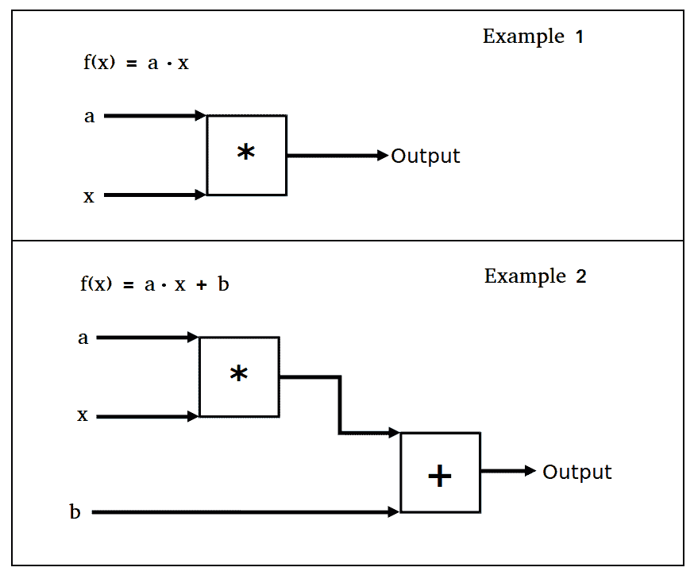

图 1：本节中的两个操作门示例

## 操作步骤

要在 TensorFlow 中实现第一个操作门`f(x) = a · x`并将输出训练为值 50，请按照下列步骤操作：

1.  首先加载`TensorFlow`并创建图会话，如下所示：

```py
import tensorflow as tf 
sess = tf.Session() 
```

1.  现在我们需要声明我们的模型变量，输入数据和占位符。我们使输入数据等于值`5`，因此得到 50 的乘法因子将为 10（即`5X10=50`），如下所示：

```py
a = tf.Variable(tf.constant(4.))
x_val = 5.
x_data = tf.placeholder(dtype=tf.float32)
```

1.  接下来，我们使用以下输入将操作添加到计算图中：

```py
multiplication = tf.multiply(a, x_data) 
```

1.  我们现在将损失函数声明为输出与`50`的期望目标值之间的 L2 距离，如下所示：

```py
loss = tf.square(tf.subtract(multiplication, 50.)) 
```

1.  现在我们初始化我们的模型变量并将我们的优化算法声明为标准梯度下降，如下所示：

```py
init = tf.global_variables_initializer() 
sess.run(init) 
my_opt = tf.train.GradientDescentOptimizer(0.01) 
train_step = my_opt.minimize(loss)
```

1.  我们现在可以将模型输出优化到`50`的期望值。我们通过连续输入 5 的输入值并反向传播损失来将模型变量更新为`10`的值，如下所示：

```py
print('Optimizing a Multiplication Gate Output to 50.') 
for i in range(10): 
    sess.run(train_step, feed_dict={x_data: x_val}) 
    a_val = sess.run(a) 
    mult_output = sess.run(multiplication, feed_dict={x_data: x_val}) 
    print(str(a_val) + ' * ' + str(x_val) + ' = ' + str(mult_output)) 
```

1.  上一步应该产生以下输出：

```py
Optimizing a Multiplication Gate Output to 50\. 
7.0 * 5.0 = 35.0 
8.5 * 5.0 = 42.5 
9.25 * 5.0 = 46.25 
9.625 * 5.0 = 48.125 
9.8125 * 5.0 = 49.0625 
9.90625 * 5.0 = 49.5312 
9.95312 * 5.0 = 49.7656 
9.97656 * 5.0 = 49.8828 
9.98828 * 5.0 = 49.9414 
9.99414 * 5.0 = 49.9707 
```

接下来，我们将对两个嵌套的操作门`f(x) = a · x + b`进行相同的操作。

1.  我们将以与前面示例完全相同的方式开始，但将初始化两个模型变量`a`和`b`，如下所示：

```py
from tensorflow.python.framework import ops 
ops.reset_default_graph() 
sess = tf.Session() 

a = tf.Variable(tf.constant(1.)) 
b = tf.Variable(tf.constant(1.)) 
x_val = 5\. 
x_data = tf.placeholder(dtype=tf.float32) 

two_gate = tf.add(tf.multiply(a, x_data), b) 

loss = tf.square(tf.subtract(two_gate, 50.)) 

my_opt = tf.train.GradientDescentOptimizer(0.01) 
train_step = my_opt.minimize(loss) 

init = tf.global_variables_initializer() 
sess.run(init) 
```

1.  我们现在优化模型变量以将输出训练到`50`的目标值，如下所示：

```py
print('Optimizing Two Gate Output to 50.') 
for i in range(10): 
    # Run the train step 
    sess.run(train_step, feed_dict={x_data: x_val}) 
    # Get the a and b values 
    a_val, b_val = (sess.run(a), sess.run(b)) 
    # Run the two-gate graph output 
    two_gate_output = sess.run(two_gate, feed_dict={x_data: x_val}) 
    print(str(a_val) + ' * ' + str(x_val) + ' + ' + str(b_val) + ' = ' + str(two_gate_output)) 
```

1.  上一步应该产生以下输出：

```py
Optimizing Two Gate Output to 50\. 
5.4 * 5.0 + 1.88 = 28.88 
7.512 * 5.0 + 2.3024 = 39.8624 
8.52576 * 5.0 + 2.50515 = 45.134 
9.01236 * 5.0 + 2.60247 = 47.6643 
9.24593 * 5.0 + 2.64919 = 48.8789 
9.35805 * 5.0 + 2.67161 = 49.4619 
9.41186 * 5.0 + 2.68237 = 49.7417 
9.43769 * 5.0 + 2.68754 = 49.876 
9.45009 * 5.0 + 2.69002 = 49.9405 
9.45605 * 5.0 + 2.69121 = 49.9714 
```

> 这里需要注意的是，第二个例子的解决方案并不是唯一的。这在神经网络中并不重要，因为所有参数都被调整为减少损失。这里的最终解决方案将取决于`a`和`b`的初始值。如果这些是随机初始化的，而不是值 1，我们会看到每次迭代的模型变量的不同结束值。

## 工作原理

我们通过 TensorFlow 的隐式反向传播实现了计算门的优化。 TensorFlow 跟踪我们的模型的操作和变量值，并根据我们的优化算法规范和损失函数的输出进行调整。

我们可以继续扩展操作门，同时跟踪哪些输入是变量，哪些输入是数据。这对于跟踪是很重要的，因为 TensorFlow 将更改所有变量以最小化损失而不是数据，这被声明为占位符。

每个训练步骤自动跟踪计算图并自动更新模型变量的隐式能力是 TensorFlow 的强大功能之一，也是它如此强大的原因之一。

# 使用门和激活函数

现在我们可以将操作门连接在一起，我们希望通过激活函数运行计算图输出。在本节中，我们将介绍常见的激活函数。

## 准备

在本节中，我们将比较和对比两种不同的激活函数：Sigmoid 和整流线性单元（ReLU）。回想一下，这两个函数由以下公式给出：

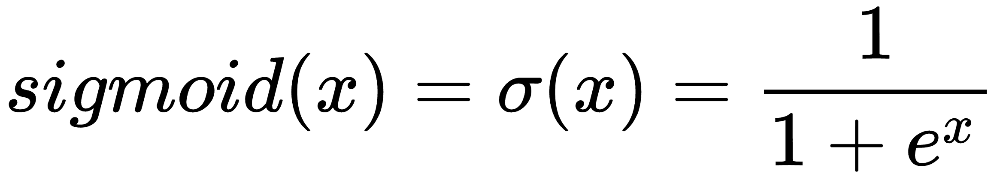


在这个例子中，我们将创建两个具有相同结构的单层神经网络，除了一个将通过 sigmoid 激活并且一个将通过 ReLU 激活。损失函数将由距离值 0.75 的 L2 距离控制。我们将从正态分布`(Normal(mean=2, sd=0.1))`中随机抽取批量数据，然后将输出优化为 0.75。

## 操作步骤

我们按如下方式处理秘籍：

1.  我们将首先加载必要的库并初始化图。这也是我们可以提出如何使用 TensorFlow 设置随机种子的好点。由于我们将使用 NumPy 和 TensorFlow 中的随机数生成器，因此我们需要为两者设置随机种子。使用相同的随机种子集，我们应该能够复制结果。我们通过以下输入执行此操作：

```py
import tensorflow as tf 
import numpy as np 
import matplotlib.pyplot as plt 
sess = tf.Session() 
tf.set_random_seed(5) 
np.random.seed(42) 
```

1.  现在我们需要声明我们的批量大小，模型变量，数据和占位符来输入数据。我们的计算图将包括将我们的正态分布数据输入到两个相似的神经网络中，这两个神经网络的区别仅在于激活函数。结束，如下所示：

```py
batch_size = 50 
a1 = tf.Variable(tf.random_normal(shape=[1,1])) 
b1 = tf.Variable(tf.random_uniform(shape=[1,1])) 
a2 = tf.Variable(tf.random_normal(shape=[1,1])) 
b2 = tf.Variable(tf.random_uniform(shape=[1,1])) 
x = np.random.normal(2, 0.1, 500) 
x_data = tf.placeholder(shape=[None, 1], dtype=tf.float32) 
```

1.  接下来，我们将声明我们的两个模型，即 sigmoid 激活模型和 ReLU 激活模型，如下所示：

```py
sigmoid_activation = tf.sigmoid(tf.add(tf.matmul(x_data, a1), b1)) 
relu_activation = tf.nn.relu(tf.add(tf.matmul(x_data, a2), b2)) 
```

1.  损失函数将是模型输出与值 0.75 之间的平均 L2 范数，如下所示：

```py
loss1 = tf.reduce_mean(tf.square(tf.subtract(sigmoid_activation, 0.75))) 
loss2 = tf.reduce_mean(tf.square(tf.subtract(relu_activation, 0.75)))
```

1.  现在我们需要声明我们的优化算法并初始化我们的变量，如下所示：

```py
my_opt = tf.train.GradientDescentOptimizer(0.01) 
train_step_sigmoid = my_opt.minimize(loss1) 
train_step_relu = my_opt.minimize(loss2) 
init = tf.global_variable_initializer() 
sess.run(init) 
```

1.  现在，我们将针对两个模型循环我们的 750 次迭代训练，如下面的代码块所示。我们还将保存损失输出和激活输出值，以便稍后进行绘图：

```py
loss_vec_sigmoid = [] 
loss_vec_relu = [] 
activation_sigmoid = [] 
activation_relu = [] 
for i in range(750): 
    rand_indices = np.random.choice(len(x), size=batch_size) 
    x_vals = np.transpose([x[rand_indices]]) 
    sess.run(train_step_sigmoid, feed_dict={x_data: x_vals}) 
    sess.run(train_step_relu, feed_dict={x_data: x_vals}) 

    loss_vec_sigmoid.append(sess.run(loss1, feed_dict={x_data: x_vals})) 
    loss_vec_relu.append(sess.run(loss2, feed_dict={x_data: x_vals}))     

    activation_sigmoid.append(np.mean(sess.run(sigmoid_activation, feed_dict={x_data: x_vals}))) 
    activation_relu.append(np.mean(sess.run(relu_activation, feed_dict={x_data: x_vals})))
```

1.  要绘制损失和激活输出，我们需要输入以下代码：

```py
plt.plot(activation_sigmoid, 'k-', label='Sigmoid Activation') 
plt.plot(activation_relu, 'r--', label='Relu Activation') 
plt.ylim([0, 1.0]) 
plt.title('Activation Outputs') 
plt.xlabel('Generation') 
plt.ylabel('Outputs') 
plt.legend(loc='upper right') 
plt.show() 
plt.plot(loss_vec_sigmoid, 'k-', label='Sigmoid Loss') 
plt.plot(loss_vec_relu, 'r--', label='Relu Loss') 
plt.ylim([0, 1.0]) 
plt.title('Loss per Generation') 
plt.xlabel('Generation') 
plt.ylabel('Loss') 
plt.legend(loc='upper right') 
plt.show() 
```

激活输出需要绘制，如下图所示：

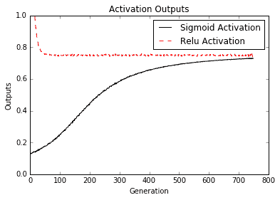

图 2：来自具有 Sigmoid 激活的网络和具有 ReLU 激活的网络的计算图输出

两个神经网络使用类似的架构和目标（0.75），但有两个不同的激活函数，sigmoid 和 ReLU。重要的是要注意 ReLU 激活网络收敛到比 sigmoid 激活所需的 0.75 目标更快，如下图所示：

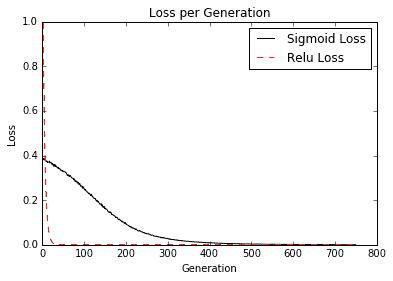

图 3：该图描绘了 Sigmoid 和 ReLU 激活网络的损耗值。注意迭代开始时 ReLU 损失的极端程度

## 工作原理

由于 ReLU 激活函数的形式，它比 sigmoid 函数更频繁地返回零值。我们认为这种行为是一种稀疏性。这种稀疏性导致收敛速度加快，但失去了受控梯度。另一方面，Sigmoid 函数具有非常良好控制的梯度，并且不会冒 ReLU 激活所带来的极值的风险，如下图所示：

| 激活函数 | 优点 | 缺点 |
| --- | --- | --- |
| Sigmoid | 不太极端的输出 | 收敛速度较慢 |
| RELU | 更快地收敛 | 可能有极端的输出值 |

## 更多

在本节中，我们比较了神经网络的 ReLU 激活函数和 Sigmoid 激活函数。还有许多其他激活函数通常用于神经网络，但大多数属于两个类别之一；第一类包含形状类似于 sigmoid 函数的函数，如 arctan，hypertangent，heavyiside step 等；第二类包含形状的函数，例如 ReLU 函数，例如 softplus，leaky ReLU 等。我们在本节中讨论的关于比较这两个函数的大多数内容都适用于任何类别的激活。然而，重要的是要注意激活函数的选择对神经网络的收敛和输出有很大影响。

# 实现单层神经网络

我们拥有实现对真实数据进行操作的神经网络所需的所有工具，因此在本节中我们将创建一个神经网络，其中一个层在`Iris`数据集上运行。

## 准备

在本节中，我们将实现一个具有一个隐藏层的神经网络。重要的是要理解完全连接的神经网络主要基于矩阵乘法。因此，重要的是数据和矩阵的大小正确排列。

由于这是一个回归问题，我们将使用均方误差作为损失函数。

## 操作步骤

我们按如下方式处理秘籍：

1.  要创建计算图，我们首先加载以下必要的库：

```py
import matplotlib.pyplot as plt
import numpy as np
import tensorflow as tf
from sklearn import datasets 
```

1.  现在我们将加载`Iris`数据并将长度存储为目标值。然后我们将使用以下代码启动图会话：

```py
iris = datasets.load_iris() 
x_vals = np.array([x[0:3] for x in iris.data]) 
y_vals = np.array([x[3] for x in iris.data]) 
sess = tf.Session() 
```

1.  由于数据集较小，我们需要设置种子以使结果可重现，如下所示：

```py
seed = 2 
tf.set_random_seed(seed) 
np.random.seed(seed)
```

1.  为了准备数据，我们将创建一个 80-20 训练测试分割，并通过最小 - 最大缩放将 x 特征标准化为 0 到 1 之间，如下所示：

```py
train_indices = np.random.choice(len(x_vals), round(len(x_vals)*0.8), replace=False) 
test_indices = np.array(list(set(range(len(x_vals))) - set(train_indices))) 
x_vals_train = x_vals[train_indices] 
x_vals_test = x_vals[test_indices] 
y_vals_train = y_vals[train_indices] 
y_vals_test = y_vals[test_indices]

def normalize_cols(m): 
    col_max = m.max(axis=0) 
    col_min = m.min(axis=0) 
    return (m-col_min) / (col_max - col_min) 

x_vals_train = np.nan_to_num(normalize_cols(x_vals_train)) 
x_vals_test = np.nan_to_num(normalize_cols(x_vals_test))
```

1.  现在，我们将使用以下代码声明数据和目标的批量大小和占位符：

```py
batch_size = 50 
x_data = tf.placeholder(shape=[None, 3], dtype=tf.float32) 
y_target = tf.placeholder(shape=[None, 1], dtype=tf.float32) 
```

1.  重要的是要用适当的形状声明我们的模型变量。我们可以将隐藏层的大小声明为我们希望的任何大小；在下面的代码块中，我们将其设置为有五个隐藏节点：

```py
hidden_layer_nodes = 5 
A1 = tf.Variable(tf.random_normal(shape=[3,hidden_layer_nodes])) 
b1 = tf.Variable(tf.random_normal(shape=[hidden_layer_nodes])) 
A2 = tf.Variable(tf.random_normal(shape=[hidden_layer_nodes,1])) 
b2 = tf.Variable(tf.random_normal(shape=[1]))
```

1.  我们现在分两步宣布我们的模型。第一步是创建隐藏层输出，第二步是创建模型的`final_output`，如下所示：

> 请注意，我们的模型从三个输入特征到五个隐藏节点，最后到一个输出值。

```py
hidden_output = tf.nn.relu(tf.add(tf.matmul(x_data, A1), b1)) 
final_output = tf.nn.relu(tf.add(tf.matmul(hidden_output, A2), b2)) 
```

1.  我们作为`loss`函数的均方误差如下：

```py
loss = tf.reduce_mean(tf.square(y_target - final_output)) 
```

1.  现在我们将声明我们的优化算法并使用以下代码初始化我们的变量：

```py
my_opt = tf.train.GradientDescentOptimizer(0.005) 
train_step = my_opt.minimize(loss) 
init = tf.global_variables_initializer() 
sess.run(init)
```

1.  接下来，我们循环我们的训练迭代。我们还将初始化两个列表，我们可以存储我们的训练和`test_loss`函数。在每个循环中，我们还希望从训练数据中随机选择一个批量以适合模型，如下所示：

```py
# First we initialize the loss vectors for storage. 
loss_vec = [] 
test_loss = [] 
for i in range(500): 
    # We select a random set of indices for the batch. 
    rand_index = np.random.choice(len(x_vals_train), size=batch_size) 
    # We then select the training values 
    rand_x = x_vals_train[rand_index] 
    rand_y = np.transpose([y_vals_train[rand_index]]) 
    # Now we run the training step 
    sess.run(train_step, feed_dict={x_data: rand_x, y_target: rand_y}) 
    # We save the training loss 
    temp_loss = sess.run(loss, feed_dict={x_data: rand_x, y_target: rand_y}) 
    loss_vec.append(np.sqrt(temp_loss)) 

    # Finally, we run the test-set loss and save it. 
    test_temp_loss = sess.run(loss, feed_dict={x_data: x_vals_test, y_target: np.transpose([y_vals_test])}) 
    test_loss.append(np.sqrt(test_temp_loss)) 
    if (i+1)%50==0: 
        print('Generation: ' + str(i+1) + '. Loss = ' + str(temp_loss))
```

1.  我们可以用`matplotlib`和以下代码绘制损失：

```py
plt.plot(loss_vec, 'k-', label='Train Loss') 
plt.plot(test_loss, 'r--', label='Test Loss') 
plt.title('Loss (MSE) per Generation') 
plt.xlabel('Generation') 
plt.ylabel('Loss') 
plt.legend(loc='upper right') 
plt.show() 
```

我们通过绘制下图来继续秘籍：

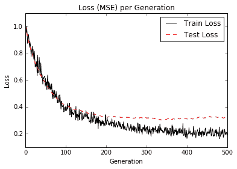

图 4：我们绘制了训练和测试装置的损失（MSE）。请注意，我们在 200 代之后略微过拟合模型，因为测试 MSE 不会进一步下降，但训练 MSE 确实

## 工作原理

我们的模型现已可视化为神经网络图，如下图所示：

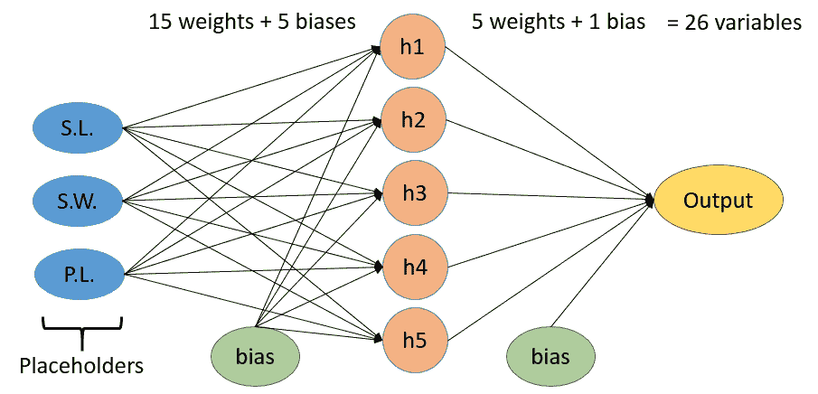

图 5：上图是我们的神经网络的可视化，在隐藏层中有五个节点。我们馈送三个值：萼片长度（S.L），萼片宽度（S.W.）和花瓣长度（P.L.）。目标将是花瓣宽度。总的来说，模型中总共有 26 个变量

## 更多

请注意，通过查看测试和训练集上的`loss`函数，我们可以确定模型何时开始过拟合训练数据。我们还可以看到训练损失并不像测试装置那样平稳。这是因为有两个原因：第一个原因是我们使用的批量小于测试集，尽管不是很多；第二个原因是由于我们正在训练训练组，而测试装置不会影响模型的变量。

# 实现不同的层

了解如何实现不同的层非常重要。在前面的秘籍中，我们实现了完全连接的层。在本文中，我们将进一步扩展我们对各层的了解。

## 准备

我们已经探索了如何连接数据输入和完全连接的隐藏层，但是 TensorFlow 中有更多类型的层是内置函数。最常用的层是卷积层和最大池化层。我们将向您展示如何使用输入数据和完全连接的数据创建和使用此类层。首先，我们将研究如何在一维数据上使用这些层，然后在二维数据上使用这些层。

虽然神经网络可以以任何方式分层，但最常见的用途之一是使用卷积层和完全连接的层来首先创建特征。如果我们有太多的特征，通常会有一个最大池化层。在这些层之后，通常引入非线性层作为激活函数。我们将在第 8 章卷积神经网络中考虑的卷积神经网络（CNN）通常具有卷积，最大池化，激活，卷积，最大池化和激活形式。

## 操作步骤

我们将首先看一维数据。我们需要使用以下步骤为此任务生成随机数据数组：

1.  我们首先加载我们需要的库并启动图会话，如下所示：

```py
import tensorflow as tf 
import numpy as np 
sess = tf.Session() 
```

1.  现在我们可以初始化我们的数据（长度为`25`的 NumPy 数组）并创建占位符，我们将通过以下代码提供它：

```py
data_size = 25 
data_1d = np.random.normal(size=data_size) 
x_input_1d = tf.placeholder(dtype=tf.float32, shape=[data_size])
```

1.  接下来，我们将定义一个将构成卷积层的函数。然后我们将声明一个随机过滤器并创建卷积层，如下所示：

> 请注意，许多 TensorFlow 的层函数都是为处理 4D 数据而设计的（`4D = [batch size, width, height, and channels]`）。我们需要修改输入数据和输出数据，以扩展或折叠所需的额外维度。对于我们的示例数据，我们的批量大小为 1，宽度为 1，高度为 25，通道大小为 1。要扩展大小，我们使用`expand_dims()`函数，并且为了折叠大小，我们使用`squeeze()`函数。另请注意，我们可以使用`output_size=(W-F+2P)/S+1`公式计算卷积层的输出大小，其中`W`是输入大小，`F`是滤镜大小，`P`是填充大小，`S`是步幅大小。

```py
def conv_layer_1d(input_1d, my_filter): 
    # Make 1d input into 4d 
    input_2d = tf.expand_dims(input_1d, 0) 
    input_3d = tf.expand_dims(input_2d, 0) 
    input_4d = tf.expand_dims(input_3d, 3) 
    # Perform convolution 
    convolution_output = tf.nn.conv2d(input_4d, filter=my_filter, strides=[1,1,1,1], padding="VALID") 
    # Now drop extra dimensions 
    conv_output_1d = tf.squeeze(convolution_output) 
    return(conv_output_1d) 

my_filter = tf.Variable(tf.random_normal(shape=[1,5,1,1])) 
my_convolution_output = conv_layer_1d(x_input_1d, my_filter) 
```

1.  默认情况下，TensorFlow 的激活函数将按元素方式执行。这意味着我们只需要在感兴趣的层上调用激活函数。我们通过创建激活函数然后在图上初始化它来完成此操作，如下所示：

```py
def activation(input_1d): 
    return tf.nn.relu(input_1d) 
my_activation_output = activation(my_convolution_output)
```

1.  现在我们将声明一个最大池化层函数。此函数将在我们的一维向量上的移动窗口上创建一个最大池化。对于此示例，我们将其初始化为宽度为 5，如下所示：

> TensorFlow 的最大池化参数与卷积层的参数非常相似。虽然最大池化参数没有过滤器，但它确实有`size`，`stride`和`padding`选项。由于我们有一个带有有效填充的 5 的窗口（没有零填充），因此我们的输出数组将减少 4 个条目。

```py
def max_pool(input_1d, width): 
    # First we make the 1d input into 4d. 
    input_2d = tf.expand_dims(input_1d, 0) 
    input_3d = tf.expand_dims(input_2d, 0) 
    input_4d = tf.expand_dims(input_3d, 3) 
    # Perform the max pool operation 
    pool_output = tf.nn.max_pool(input_4d, ksize=[1, 1, width, 1], strides=[1, 1, 1, 1], padding='VALID') 
    pool_output_1d = tf.squeeze(pool_output) 
    return pool_output_1d 

my_maxpool_output = max_pool(my_activation_output, width=5) 
```

1.  我们将要连接的最后一层是完全连接的层。在这里，我们想要创建一个多特征函数，输入一维数组并输出指示的数值。还要记住，要使用 1D 数组进行矩阵乘法，我们必须将维度扩展为 2D，如下面的代码块所示：

```py
def fully_connected(input_layer, num_outputs): 
    # Create weights 
    weight_shape = tf.squeeze(tf.stack([tf.shape(input_layer), [num_outputs]])) 
    weight = tf.random_normal(weight_shape, stddev=0.1) 
    bias = tf.random_normal(shape=[num_outputs]) 
    # Make input into 2d 
    input_layer_2d = tf.expand_dims(input_layer, 0) 
    # Perform fully connected operations 
    full_output = tf.add(tf.matmul(input_layer_2d, weight), bias) 
    # Drop extra dimensions 
    full_output_1d = tf.squeeze(full_output) 
    return full_output_1d

my_full_output = fully_connected(my_maxpool_output, 5)
```

1.  现在我们将初始化所有变量，运行图并打印每个层的输出，如下所示：

```py
init = tf.global_variable_initializer() 
sess.run(init) 
feed_dict = {x_input_1d: data_1d} 
# Convolution Output 
print('Input = array of length 25') 
print('Convolution w/filter, length = 5, stride size = 1, results in an array of length 21:') 
print(sess.run(my_convolution_output, feed_dict=feed_dict)) 
# Activation Output 
print('Input = the above array of length 21') 
print('ReLU element wise returns the array of length 21:') 
print(sess.run(my_activation_output, feed_dict=feed_dict)) 
# Maxpool Output 
print('Input = the above array of length 21') 
print('MaxPool, window length = 5, stride size = 1, results in the array of length 17:') 
print(sess.run(my_maxpool_output, feed_dict=feed_dict)) 
# Fully Connected Output 
print('Input = the above array of length 17') 
print('Fully connected layer on all four rows with five outputs:') 
print(sess.run(my_full_output, feed_dict=feed_dict)) 
```

1.  上一步应该产生以下输出：

```py
Input = array of length 25 
Convolution w/filter, length = 5, stride size = 1, results in an array of length 21: 
[-0.91608119  1.53731811 -0.7954089   0.5041104   1.88933098  
 -1.81099761  0.56695032  1.17945457 -0.66252393 -1.90287709 
  0.87184119  0.84611893 -5.25024986 -0.05473572  2.19293165 
 -4.47577858 -1.71364677  3.96857905 -2.0452652  -1.86647367 
 -0.12697852] 
Input = the above array of length 21 
ReLU element wise returns the array of length 21: 
[ 0\.          1.53731811  0\.          0.5041104   1.88933098 
  0\.          0\.          1.17945457  0\.          0\.          
  0.87184119  0.84611893  0\.          0\.          2.19293165 
  0\.          0\.          3.96857905  0\.          0\.         
  0\.         ] 
Input = the above array of length 21 
MaxPool, window length = 5, stride size = 1, results in the array of length 17: 
[ 1.88933098  1.88933098  1.88933098  1.88933098  1.88933098  
  1.17945457  1.17945457  1.17945457  0.87184119  0.87184119  
  2.19293165  2.19293165  2.19293165  3.96857905  3.96857905   
  3.96857905  3.96857905] 
Input = the above array of length 17 
Fully connected layer on all four rows with five outputs: 
[ 1.23588216 -0.42116445  1.44521213  1.40348077 -0.79607368] 
```

> 对于神经网络，一维数据非常重要。时间序列，信号处理和一些文本嵌入被认为是一维的并且经常在神经网络中使用。

我们现在将以相同的顺序考虑相同类型的层，但是对于二维数据：

1.  我们将从清除和重置计算图开始，如下所示：

```py
ops.reset_default_graph() 
sess = tf.Session() 
```

1.  然后我们将初始化我们的输入数组，使其为`10x10`矩阵，然后我们将为具有相同形状的图初始化占位符，如下所示：

```py
data_size = [10,10] 
data_2d = np.random.normal(size=data_size) 
x_input_2d = tf.placeholder(dtype=tf.float32, shape=data_size) 
```

1.  就像在一维示例中一样，我们现在需要声明卷积层函数。由于我们的数据已经具有高度和宽度，我们只需要将其扩展为二维（批量大小为 1，通道大小为 1），以便我们可以使用`conv2d()`函数对其进行操作。对于滤波器，我们将使用随机`2x2`滤波器，两个方向的步幅为 2，以及有效填充（换句话说，没有零填充）。因为我们的输入矩阵是`10x10`，我们的卷积输出将是`5x5`，如下所示：

```py
def conv_layer_2d(input_2d, my_filter): 
    # First, change 2d input to 4d 
    input_3d = tf.expand_dims(input_2d, 0) 
    input_4d = tf.expand_dims(input_3d, 3) 
    # Perform convolution 
    convolution_output = tf.nn.conv2d(input_4d, filter=my_filter, strides=[1,2,2,1], padding="VALID") 
    # Drop extra dimensions 
    conv_output_2d = tf.squeeze(convolution_output) 
    return(conv_output_2d) 

my_filter = tf.Variable(tf.random_normal(shape=[2,2,1,1])) 
my_convolution_output = conv_layer_2d(x_input_2d, my_filter)
```

1.  激活函数在逐个元素的基础上工作，因此我们现在可以创建激活操作并使用以下代码在图上初始化它：

```py
def activation(input_2d): 
    return tf.nn.relu(input_2d) 
my_activation_output = activation(my_convolution_output) 
```

1.  我们的最大池化层与一维情况非常相似，只是我们必须声明最大池化窗口的宽度和高度。就像我们的卷积 2D 层一样，我们只需要扩展到两个维度，如下所示：

```py
def max_pool(input_2d, width, height): 
    # Make 2d input into 4d 
    input_3d = tf.expand_dims(input_2d, 0) 
    input_4d = tf.expand_dims(input_3d, 3) 
    # Perform max pool 
    pool_output = tf.nn.max_pool(input_4d, ksize=[1, height, width, 1], strides=[1, 1, 1, 1], padding='VALID') 
    # Drop extra dimensions 
    pool_output_2d = tf.squeeze(pool_output) 
    return pool_output_2d 

my_maxpool_output = max_pool(my_activation_output, width=2, height=2) 
```

1.  我们的全连接层与一维输出非常相似。我们还应该注意到，此层的 2D 输入被视为一个对象，因此我们希望每个条目都连接到每个输出。为了实现这一点，我们需要完全展平二维矩阵，然后将其展开以进行矩阵乘法，如下所示：

```py
def fully_connected(input_layer, num_outputs): 
    # Flatten into 1d 
    flat_input = tf.reshape(input_layer, [-1]) 
    # Create weights 
    weight_shape = tf.squeeze(tf.stack([tf.shape(flat_input), [num_outputs]])) 
    weight = tf.random_normal(weight_shape, stddev=0.1) 
    bias = tf.random_normal(shape=[num_outputs]) 
    # Change into 2d 
    input_2d = tf.expand_dims(flat_input, 0) 
    # Perform fully connected operations 
    full_output = tf.add(tf.matmul(input_2d, weight), bias) 
    # Drop extra dimensions 
    full_output_2d = tf.squeeze(full_output) 
    return full_output_2d 

my_full_output = fully_connected(my_maxpool_output, 5) 
```

1.  现在我们需要初始化变量并使用以下代码为我们的操作创建一个馈送字典：

```py
init = tf.global_variables_initializer() 
sess.run(init) 

feed_dict = {x_input_2d: data_2d} 
```

1.  每个层的输出应如下所示：

```py
# Convolution Output 
print('Input = [10 X 10] array') 
print('2x2 Convolution, stride size = [2x2], results in the [5x5] array:') 
print(sess.run(my_convolution_output, feed_dict=feed_dict)) 
# Activation Output 
print('Input = the above [5x5] array') 
print('ReLU element wise returns the [5x5] array:') 
print(sess.run(my_activation_output, feed_dict=feed_dict)) 
# Max Pool Output 
print('Input = the above [5x5] array') 
print('MaxPool, stride size = [1x1], results in the [4x4] array:') 
print(sess.run(my_maxpool_output, feed_dict=feed_dict)) 
# Fully Connected Output 
print('Input = the above [4x4] array') 
print('Fully connected layer on all four rows with five outputs:') 
print(sess.run(my_full_output, feed_dict=feed_dict)) 
```

1.  上一步应该产生以下输出：

```py
Input = [10 X 10] array 
2x2 Convolution, stride size = [2x2], results in the [5x5] array: 
[[ 0.37630892 -1.41018617 -2.58821273 -0.32302785  1.18970704] 
 [-4.33685207  1.97415686  1.0844903  -1.18965471  0.84643292] 
 [ 5.23706436  2.46556497 -0.95119286  1.17715418  4.1117816 ] 
 [ 5.86972761  1.2213701   1.59536231  2.66231227  2.28650784] 
 [-0.88964868 -2.75502229  4.3449688   2.67776585 -2.23714781]] 
Input = the above [5x5] array 
ReLU element wise returns the [5x5] array: 
[[ 0.37630892  0\.          0\.          0\.          1.18970704] 
 [ 0\.          1.97415686  1.0844903   0\.          0.84643292] 
 [ 5.23706436  2.46556497  0\.          1.17715418  4.1117816 ] 
 [ 5.86972761  1.2213701   1.59536231  2.66231227  2.28650784] 
 [ 0\.          0\.          4.3449688   2.67776585  0\.        ]] 
Input = the above [5x5] array 
MaxPool, stride size = [1x1], results in the [4x4] array: 
[[ 1.97415686  1.97415686  1.0844903   1.18970704] 
 [ 5.23706436  2.46556497  1.17715418  4.1117816 ] 
 [ 5.86972761  2.46556497  2.66231227  4.1117816 ] 
 [ 5.86972761  4.3449688   4.3449688   2.67776585]] 
Input = the above [4x4] array 
Fully connected layer on all four rows with five outputs: 
[-0.6154139  -1.96987963 -1.88811922  0.20010889  0.32519674] 
```

## 工作原理

我们现在应该知道如何在 TensorFlow 中使用一维和二维数据中的卷积和最大池化层。无论输入的形状如何，我们最终都得到相同的大小输出。这对于说明神经网络层的灵活性很重要。本节还应该再次向我们强调形状和大小在神经网络操作中的重要性。

# 使用多层神经网络

我们现在将通过在低出生体重数据集上使用多层神经网络将我们对不同层的知识应用于实际数据。

## 准备

现在我们知道如何创建神经网络并使用层，我们将应用此方法，以预测低出生体重数据集中的出生体重。我们将创建一个具有三个隐藏层的神经网络。低出生体重数据集包括实际出生体重和出生体重是否高于或低于 2,500 克的指标变量。在这个例子中，我们将目标设为实际出生体重（回归），然后在最后查看分类的准确率。最后，我们的模型应该能够确定出生体重是否小于 2,500 克。

## 操作步骤

我们按如下方式处理秘籍：

1.  我们将首先加载库并初始化我们的计算图，如下所示：

```py
import tensorflow as tf 
import matplotlib.pyplot as plt 
import os
import csv
import requests 
import numpy as np 
sess = tf.Session() 
```

1.  我们现在将使用`requests`模块从网站加载数据。在此之后，我们将数据拆分为感兴趣的特征和目标值，如下所示：

```py
# Name of data file
birth_weight_file = 'birth_weight.csv'
birthdata_url = 'https://github.com/nfmcclure/tensorflow_cookbook/raw/master' \
'/01_Introduction/07_Working_with_Data_Sources/birthweight_data/birthweight.dat'

# Download data and create data file if file does not exist in current directory
if not os.path.exists(birth_weight_file):
    birth_file = requests.get(birthdata_url)
    birth_data = birth_file.text.split('\r\n')
    birth_header = birth_data[0].split('\t')
    birth_data = [[float(x) for x in y.split('\t') if len(x) >= 1]
                  for y in birth_data[1:] if len(y) >= 1]
    with open(birth_weight_file, "w") as f:
        writer = csv.writer(f)
        writer.writerows([birth_header])
        writer.writerows(birth_data)

# Read birth weight data into memory
birth_data = []
with open(birth_weight_file, newline='') as csvfile:
    csv_reader = csv.reader(csvfile)
    birth_header = next(csv_reader)
    for row in csv_reader:
        birth_data.append(row)

birth_data = [[float(x) for x in row] for row in birth_data]

# Pull out target variable
y_vals = np.array([x[0] for x in birth_data])
# Pull out predictor variables (not id, not target, and not birthweight)
x_vals = np.array([x[1:8] for x in birth_data])
```

1.  为了帮助实现可重复性，我们现在需要为 NumPy 和 TensorFlow 设置随机种子。然后我们声明我们的批量大小如下：

```py
seed = 4 
tf.set_random_seed(seed) 
np.random.seed(seed) 
batch_size = 100 
```

1.  接下来，我们将数据分成 80-20 训练测试分组。在此之后，我们需要正则化我们的输入特征，使它们在 0 到 1 之间，具有最小 - 最大缩放比例，如下所示：

```py
train_indices = np.random.choice(len(x_vals), round(len(x_vals)*0.8), replace=False) 
test_indices = np.array(list(set(range(len(x_vals))) - set(train_indices))) 
x_vals_train = x_vals[train_indices] 
x_vals_test = x_vals[test_indices] 
y_vals_train = y_vals[train_indices] 
y_vals_test = y_vals[test_indices] 

# Normalize by column (min-max norm)
def normalize_cols(m, col_min=np.array([None]), col_max=np.array([None])):
    if not col_min[0]:
        col_min = m.min(axis=0)
    if not col_max[0]:
        col_max = m.max(axis=0)
    return (m-col_min) / (col_max - col_min), col_min, col_max

x_vals_train, train_min, train_max = np.nan_to_num(normalize_cols(x_vals_train)) 
x_vals_test, _, _ = np.nan_to_num(normalize_cols(x_vals_test), train_min, train_max)
```

> 归一化输入特征是一种常见的特征转换，尤其适用于神经网络。如果我们的数据以 0 到 1 的中心为激活函数，它将有助于收敛。

1.  由于我们有多个层具有相似的初始化变量，我们现在需要创建一个函数来初始化权重和偏差。我们使用以下代码执行此操作：

```py
def init_weight(shape, st_dev): 
    weight = tf.Variable(tf.random_normal(shape, stddev=st_dev)) 
    return weight

def init_bias(shape, st_dev): 
    bias = tf.Variable(tf.random_normal(shape, stddev=st_dev)) 
    return bias 
```

1.  我们现在需要初始化占位符。将有八个输入特征和一个输出，出生重量以克为单位，如下所示：

```py
x_data = tf.placeholder(shape=[None, 8], dtype=tf.float32) 
y_target = tf.placeholder(shape=[None, 1], dtype=tf.float32) 
```

1.  对于所有三个隐藏层，完全连接的层将使用三次。为了防止重复代码，我们将在初始化模型时创建一个层函数，如下所示：

```py
def fully_connected(input_layer, weights, biases): 
    layer = tf.add(tf.matmul(input_layer, weights), biases) 
    return tf.nn.relu(layer) 
```

1.  现在是时候创建我们的模型了。对于每个层（和输出层），我们将初始化权重矩阵，偏置矩阵和完全连接的层。对于此示例，我们将使用大小为 25，10 和 3 的隐藏层：

> 我们使用的模型将有 522 个变量适合。为了得到这个数字，我们可以看到数据和第一个隐藏层之间有`8*25 +25=225`变量。如果我们以这种方式继续添加它们，我们将有`225+260+33+4=522`变量。这远远大于我们在逻辑回归模型中使用的九个变量。

```py
# Create second layer (25 hidden nodes) 
weight_1 = init_weight(shape=[8, 25], st_dev=10.0) 
bias_1 = init_bias(shape=[25], st_dev=10.0) 
layer_1 = fully_connected(x_data, weight_1, bias_1) 

# Create second layer (10 hidden nodes) 
weight_2 = init_weight(shape=[25, 10], st_dev=10.0) 
bias_2 = init_bias(shape=[10], st_dev=10.0) 
layer_2 = fully_connected(layer_1, weight_2, bias_2) 

# Create third layer (3 hidden nodes) 
weight_3 = init_weight(shape=[10, 3], st_dev=10.0) 
bias_3 = init_bias(shape=[3], st_dev=10.0) 
layer_3 = fully_connected(layer_2, weight_3, bias_3) 
# Create output layer (1 output value) 
weight_4 = init_weight(shape=[3, 1], st_dev=10.0)   
bias_4 = init_bias(shape=[1], st_dev=10.0) 
final_output = fully_connected(layer_3, weight_4, bias_4) 
```

1.  我们现在将使用 L1 损失函数（绝对值），声明我们的优化器（使用 Adam 优化），并按如下方式初始化变量：

```py
loss = tf.reduce_mean(tf.abs(y_target - final_output)) 
my_opt = tf.train.AdamOptimizer(0.05) 
train_step = my_opt.minimize(loss) 
init = tf.global_variables_initializer()
sess.run(init) 
```

> 虽然我们在前一步骤中用于 Adam 优化函数的学习率是 0.05，但有研究表明较低的学习率始终产生更好的结果。对于这个秘籍，由于数据的一致性和快速收敛的需要，我们使用了更大的学习率。

1.  接下来，我们需要训练我们的模型进行 200 次迭代。我们还将包含存储`train`和`test`损失的代码，选择随机批量大小，并每 25 代打印一次状态，如下所示：

```py
# Initialize the loss vectors 
loss_vec = [] 
test_loss = [] 
for i in range(200): 
    # Choose random indices for batch selection 
    rand_index = np.random.choice(len(x_vals_train), size=batch_size) 
    # Get random batch 
    rand_x = x_vals_train[rand_index] 
    rand_y = np.transpose([y_vals_train[rand_index]]) 
    # Run the training step 
    sess.run(train_step, feed_dict={x_data: rand_x, y_target: rand_y}) 
    # Get and store the train loss 
    temp_loss = sess.run(loss, feed_dict={x_data: rand_x, y_target: rand_y}) 
    loss_vec.append(temp_loss) 
    # Get and store the test loss 
    test_temp_loss = sess.run(loss, feed_dict={x_data: x_vals_test, y_target: np.transpose([y_vals_test])}) 
    test_loss.append(test_temp_loss) 
    if (i+1)%25==0: 
        print('Generation: ' + str(i+1) + '. Loss = ' + str(temp_loss)) 
```

1.  上一步应该产生以下输出：

```py
Generation: 25\. Loss = 5922.52 
Generation: 50\. Loss = 2861.66 
Generation: 75\. Loss = 2342.01 
Generation: 100\. Loss = 1880.59 
Generation: 125\. Loss = 1394.39 
Generation: 150\. Loss = 1062.43 
Generation: 175\. Loss = 834.641 
Generation: 200\. Loss = 848.54 
```

1.  以下是使用`matplotlib`绘制训练和测试损失的代码片段：

```py
plt.plot(loss_vec, 'k-', label='Train Loss') 
plt.plot(test_loss, 'r--', label='Test Loss') 
plt.title('Loss per Generation') 
plt.xlabel('Generation') 
plt.ylabel('Loss') 
plt.legend(loc='upper right') 
plt.show() 
```

我们通过绘制下图来继续秘籍：

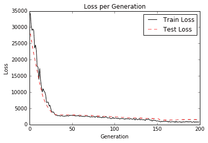

图 6：在上图中，我们绘制了我们训练的神经网络的训练和测试损失，以克数表示出生体重。请注意，大约 30 代后我们已经达到了良好的模型

1.  我们现在想将我们的出生体重结果与我们之前的后勤结果进行比较。使用逻辑线性回归（如第 3 章中的实现逻辑回归秘籍，线性回归），我们在数千次迭代后获得了大约 60% 的准确率结果。为了将其与我们在上一节中所做的进行比较，我们需要输出训练并测试回归结果，并通过创建指标（如果它们高于或低于 2,500 克）将其转换为分类结果。要找出模型的准确率，我们需要使用以下代码：

```py
actuals = np.array([x[1] for x in birth_data]) 
test_actuals = actuals[test_indices] 
train_actuals = actuals[train_indices] 
test_preds = [x[0] for x in sess.run(final_output, feed_dict={x_data: x_vals_test})] 
train_preds = [x[0] for x in sess.run(final_output, feed_dict={x_data: x_vals_train})] 
test_preds = np.array([1.0 if x<2500.0 else 0.0 for x in test_preds]) 
train_preds = np.array([1.0 if x<2500.0 else 0.0 for x in train_preds]) 
# Print out accuracies 
test_acc = np.mean([x==y for x,y in zip(test_preds, test_actuals)]) 
train_acc = np.mean([x==y for x,y in zip(train_preds, train_actuals)]) 
print('On predicting the category of low birthweight from regression output (<2500g):') 
print('Test Accuracy: {}'.format(test_acc)) 
print('Train Accuracy: {}'.format(train_acc)) 
```

1.  上一步应该产生以下输出：

```py
Test Accuracy: 0.631578947368421 
Train Accuracy: 0.7019867549668874 
```

## 工作原理

在这个秘籍中，我们创建了一个回归神经网络，其中包含三个完全连接的隐藏层，以预测低出生体重数据集的出生体重。当将其与物流输出进行比较以预测高于或低于 2,500 克时，我们获得了类似的结果并且在更少的几代中实现了它们。在下一个方案中，我们将尝试通过使其成为多层逻辑类神经网络来改进逻辑回归。

# 改进线性模型的预测

在前面的秘籍中，我们注意到我们拟合的参数数量远远超过等效的线性模型。在这个秘籍中，我们将尝试通过使用神经网络来改进我们的低出生体重的逻辑模型。

## 准备

对于这个秘籍，我们将加载低出生体重数据，并使用神经网络与两个隐藏的完全连接的层与 sigmoid 激活，以适应低出生体重的概率。

## 操作步骤

我们按如下方式处理秘籍：

1.  我们首先加载库并初始化我们的计算图，如下所示：

```py
import matplotlib.pyplot as plt 
import numpy as np 
import tensorflow as tf 
import requests 
sess = tf.Session() 
```

1.  接下来，我们按照前面的秘籍加载，提取和标准化我们的数据，除了在这里我们将使用低出生体重指示变量作为我们的目标而不是实际出生体重，如下所示：

```py
# Name of data file
birth_weight_file = 'birth_weight.csv'
birthdata_url = 'https://github.com/nfmcclure/tensorflow_cookbook/raw/master' \
                '/01_Introduction/07_Working_with_Data_Sources/birthweight_data/birthweight.dat'

# Download data and create data file if file does not exist in current directory
if not os.path.exists(birth_weight_file):
    birth_file = requests.get(birthdata_url)
    birth_data = birth_file.text.split('\r\n')
    birth_header = birth_data[0].split('\t')
    birth_data = [[float(x) for x in y.split('\t') if len(x) >= 1]
                  for y in birth_data[1:] if len(y) >= 1]
    with open(birth_weight_file, "w") as f:
        writer = csv.writer(f)
        writer.writerows([birth_header])
        writer.writerows(birth_data) 

# read birth weight data into memory
birth_data = []
with open(birth_weight_file, newline='') as csvfile:
    csv_reader = csv.reader(csvfile)
    birth_header = next(csv_reader)
    for row in csv_reader:
        birth_data.append(row)

birth_data = [[float(x) for x in row] for row in birth_data]

# Pull out target variable
y_vals = np.array([x[0] for x in birth_data])
# Pull out predictor variables (not id, not target, and not birthweight)
x_vals = np.array([x[1:8] for x in birth_data])

train_indices = np.random.choice(len(x_vals), round(len(x_vals)*0.8), replace=False) 
test_indices = np.array(list(set(range(len(x_vals))) - set(train_indices))) 
x_vals_train = x_vals[train_indices] 
x_vals_test = x_vals[test_indices] 
y_vals_train = y_vals[train_indices] 
y_vals_test = y_vals[test_indices] 

def normalize_cols(m, col_min=np.array([None]), col_max=np.array([None])):
    if not col_min[0]:
        col_min = m.min(axis=0)
    if not col_max[0]:
        col_max = m.max(axis=0)
    return (m - col_min) / (col_max - col_min), col_min, col_max

x_vals_train, train_min, train_max = np.nan_to_num(normalize_cols(x_vals_train))
x_vals_test, _, _ = np.nan_to_num(normalize_cols(x_vals_test, train_min, train_max))
```

1.  接下来，我们需要声明我们的批量大小和数据的占位符，如下所示：

```py
batch_size = 90 
x_data = tf.placeholder(shape=[None, 7], dtype=tf.float32) 
y_target = tf.placeholder(shape=[None, 1], dtype=tf.float32)
```

1.  如前所述，我们现在需要声明在模型中初始化变量和层的函数。为了创建更好的逻辑函数，我们需要创建一个在输入层上返回逻辑层的函数。换句话说，我们将使用完全连接的层并为每个层返回一个 sigmoid 元素。重要的是要记住我们的损失函数将包含最终的 sigmoid，因此我们要在最后一层指定我们不会返回输出的 sigmoid，如下所示：

```py
def init_variable(shape): 
    return tf.Variable(tf.random_normal(shape=shape)) 
# Create a logistic layer definition 
def logistic(input_layer, multiplication_weight, bias_weight, activation = True): 
    linear_layer = tf.add(tf.matmul(input_layer, multiplication_weight), bias_weight) 

    if activation: 
        return tf.nn.sigmoid(linear_layer) 
    else: 
        return linear_layer 
```

1.  现在我们将声明三个层（两个隐藏层和一个输出层）。我们将首先为每个层初始化权重和偏差矩阵，并按如下方式定义层操作：

```py
# First logistic layer (7 inputs to 14 hidden nodes) 
A1 = init_variable(shape=[7,14]) 
b1 = init_variable(shape=[14]) 
logistic_layer1 = logistic(x_data, A1, b1)

# Second logistic layer (14 hidden inputs to 5 hidden nodes) 
A2 = init_variable(shape=[14,5]) 
b2 = init_variable(shape=[5]) 
logistic_layer2 = logistic(logistic_layer1, A2, b2) 
# Final output layer (5 hidden nodes to 1 output) 
A3 = init_variable(shape=[5,1]) 
b3 = init_variable(shape=[1]) 
final_output = logistic(logistic_layer2, A3, b3, activation=False)
```

1.  接下来，我们声明我们的损失（交叉熵）和优化算法，并初始化以下变量：

```py
# Create loss function 
loss = tf.reduce_mean(tf.nn.sigmoid_cross_entropy_with_logits(logits=final_output, labels=y_target)) 
# Declare optimizer 
my_opt = tf.train.AdamOptimizer(learning_rate = 0.002) 
train_step = my_opt.minimize(loss) 
# Initialize variables 
init = tf.global_variables_initializer() 
sess.run(init)
```

> 交叉熵是一种测量概率之间距离的方法。在这里，我们想要测量确定性（0 或 1）与模型概率（`0 < x < 1`）之间的差异。 TensorFlow 使用内置的 sigmoid 函数实现交叉熵。这也是超参数调整的一部分，因为我们更有可能找到最佳的损失函数，学习率和针对当前问题的优化算法。为简洁起见，我们不包括超参数调整。

1.  为了评估和比较我们的模型与以前的模型，我们需要在图上创建预测和精度操作。这将允许我们提供整个测试集并确定准确率，如下所示：

```py
prediction = tf.round(tf.nn.sigmoid(final_output)) 
predictions_correct = tf.cast(tf.equal(prediction, y_target), tf.float32) 
accuracy = tf.reduce_mean(predictions_correct) 
```

1.  我们现在准备开始我们的训练循环。我们将训练 1500 代并保存模型损失并训练和测试精度以便以后进行绘图。我们的训练循环使用以下代码启动：

```py
# Initialize loss and accuracy vectors loss_vec = [] train_acc = [] test_acc = [] 
for i in range(1500): 
    # Select random indicies for batch selection 
    rand_index = np.random.choice(len(x_vals_train), size=batch_size) 
    # Select batch 
    rand_x = x_vals_train[rand_index] 
    rand_y = np.transpose([y_vals_train[rand_index]]) 
    # Run training step 
    sess.run(train_step, feed_dict={x_data: rand_x, y_target: rand_y}) 
    # Get training loss 
    temp_loss = sess.run(loss, feed_dict={x_data: rand_x, y_target: rand_y}) 
    loss_vec.append(temp_loss) 
    # Get training accuracy 
    temp_acc_train = sess.run(accuracy, feed_dict={x_data: x_vals_train, y_target: np.transpose([y_vals_train])}) 
    train_acc.append(temp_acc_train) 
    # Get test accuracy 
    temp_acc_test = sess.run(accuracy, feed_dict={x_data: x_vals_test, y_target: np.transpose([y_vals_test])}) 
    test_acc.append(temp_acc_test) 
    if (i+1)%150==0: 
        print('Loss = '' + str(temp_loss)) 
```

1.  上一步应该产生以下输出：

```py
Loss = 0.696393 
Loss = 0.591708 
Loss = 0.59214 
Loss = 0.505553 
Loss = 0.541974 
Loss = 0.512707 
Loss = 0.590149 
Loss = 0.502641 
Loss = 0.518047 
Loss = 0.502616 
```

1.  以下代码块说明了如何使用`matplotlib`绘制交叉熵损失以及训练和测试集精度：

```py
# Plot loss over time 
plt.plot(loss_vec, 'k-') 
plt.title('Cross Entropy Loss per Generation') 
plt.xlabel('Generation') 
plt.ylabel('Cross Entropy Loss') 
plt.show() 
# Plot train and test accuracy 
plt.plot(train_acc, 'k-', label='Train Set Accuracy') 
plt.plot(test_acc, 'r--', label='Test Set Accuracy') 
plt.title('Train and Test Accuracy') 
plt.xlabel('Generation') 
plt.ylabel('Accuracy') 
plt.legend(loc='lower right') 
plt.show()
```

我们得到每代交叉熵损失的图如下：

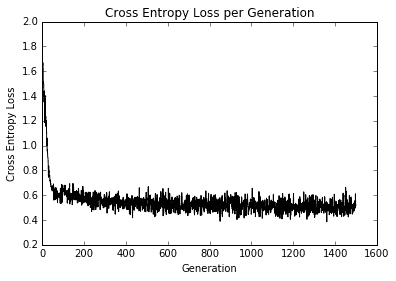

图 7：超过 1500 次迭代的训练损失

在大约 50 代之内，我们已经达到了良好的模式。在我们继续训练时，我们可以看到在剩余的迭代中获得的很少，如下图所示：

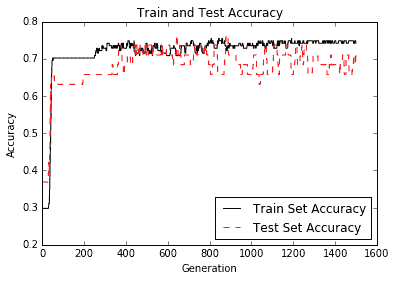

图 8：训练组和测试装置的准确率

正如您在上图中所看到的，我们很快就找到了一个好模型。

## 工作原理

在考虑使用神经网络建模数据时，您必须考虑优缺点。虽然我们的模型比以前的模型融合得更快，并且可能具有更高的准确率，但这需要付出代价；我们正在训练更多的模型变量，并且更有可能过拟合。为了检查是否发生过拟合，我们会查看测试和训练集的准确率。如果训练集的准确率继续增加而测试集的精度保持不变或甚至略微下降，我们可以假设过拟合正在发生。

为了对抗欠拟合，我们可以增加模型深度或训练模型以进行更多迭代。为了解决过拟合问题，我们可以为模型添加更多数据或添加正则化技术。

同样重要的是要注意我们的模型变量不像线性模型那样可解释。神经网络模型具有比线性模型更难解释的系数，因为它们解释了模型中特征的重要性。

# 学习玩井字棋

为了展示适应性神经网络的可用性，我们现在将尝试使用神经网络来学习井字棋的最佳动作。我们将知道井字棋是一种确定性游戏，并且最佳动作已经知道。

## 准备

为了训练我们的模型，我们将使用一系列的棋盘位置，然后对许多不同的棋盘进行最佳的最佳响应。我们可以通过仅考虑在对称性方面不同的棋盘位置来减少要训练的棋盘数量。井字棋棋盘的非同一性变换是 90 度，180 度和 270 度的旋转（在任一方向上），水平反射和垂直反射。鉴于这个想法，我们将使用最佳移动的候选棋盘名单，应用两个随机变换，然后将其输入神经网络进行学习。

> 由于井字棋是一个确定性的游戏，值得注意的是，无论谁先走，都应该赢或抽。我们希望能够以最佳方式响应我们的动作并最终获得平局的模型。

如果我们将`X`标注为 1，将`O`标注为 -1，将空格标注为 0，则下图说明了我们如何将棋盘位置和最佳移动视为一行数据：

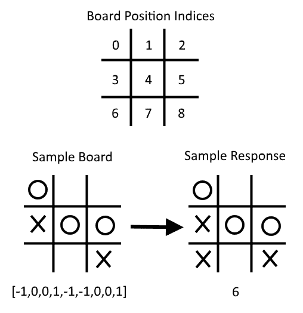Figure 9: Here, we illustrate how to consider a board and an optimal move as a row of data. Note that X = 1, O = -1, and empty spaces are 0, and we start indexing at 0

除了模型损失，要检查我们的模型如何执行，我们将做两件事。我们将执行的第一项检查是从训练集中删除位置和最佳移动行。这将使我们能够看到神经网络模型是否可以推广它以前从未见过的移动。我们将评估模型的第二种方法是在最后实际对抗它。

可以在此秘籍的 [GitHub 目录](https://github.com/nfmcclure/tensorflow_cookbook/tree/master/06_Neural_Networks/08_Learning_Tic_Tac_Toe) 和 [Packt 仓库](https://github.com/PacktPublishing/TensorFlow-Machine-Learning-Cookbook-Second-Edition)中找到可能的棋盘列表和最佳移动。

## 操作步骤

我们按如下方式处理秘籍：

1.  我们需要从为此脚本加载必要的库开始，如下所示：

```py
import tensorflow as tf 
import matplotlib.pyplot as plt 
import csv 
import random 
import numpy as np 
import random 
```

1.  接下来，我们声明以下批量大小来训练我们的模型：

```py
batch_size = 50 
```

1.  为了使棋盘更容易可视化，我们将创建一个输出带`X`和`O`的井字棋棋盘的函数。这是通过以下代码完成的：

```py
 def print_board(board):
    symbols = ['O', ' ', 'X']
    board_plus1 = [int(x) + 1 for x in board]
    board_line1 = ' {} | {} | {}'.format(symbols[board_plus1[0]],
                                         symbols[board_plus1[1]],
                                         symbols[board_plus1[2]])
    board_line2 = ' {} | {} | {}'.format(symbols[board_plus1[3]],
                                         symbols[board_plus1[4]],
                                         symbols[board_plus1[5]])
    board_line3 = ' {} | {} | {}'.format(symbols[board_plus1[6]],
                                         symbols[board_plus1[7]],
                                         symbols[board_plus1[8]])
    print(board_line1)
    print('___________')
    print(board_line2)
    print('___________')
    print(board_line3)
```

1.  现在我们必须创建一个函数，它将返回一个新的棋盘和一个转换下的最佳响应位置。这是通过以下代码完成的：

```py
def get_symmetry(board, response, transformation): 
    ''' 
    :param board: list of integers 9 long: 
     opposing mark = -1 
     friendly mark = 1 
     empty space = 0 
    :param transformation: one of five transformations on a board: 
     rotate180, rotate90, rotate270, flip_v, flip_h 
    :return: tuple: (new_board, new_response) 
    ''' 

    if transformation == 'rotate180': 
        new_response = 8 - response 
        return board[::-1], new_response 

    elif transformation == 'rotate90': 
        new_response = [6, 3, 0, 7, 4, 1, 8, 5, 2].index(response) 
        tuple_board = list(zip(*[board[6:9], board[3:6], board[0:3]])) 
        return [value for item in tuple_board for value in item], new_response 

    elif transformation == 'rotate270': 
        new_response = [2, 5, 8, 1, 4, 7, 0, 3, 6].index(response) 
        tuple_board = list(zip(*[board[0:3], board[3:6], board[6:9]]))[::-1] 
        return [value for item in tuple_board for value in item], new_response 

    elif transformation == 'flip_v': 
        new_response = [6, 7, 8, 3, 4, 5, 0, 1, 2].index(response) 
        return board[6:9] +  board[3:6] + board[0:3], new_response 

    elif transformation == 'flip_h': 
    # flip_h = rotate180, then flip_v 
        new_response = [2, 1, 0, 5, 4, 3, 8, 7, 6].index(response) 
        new_board = board[::-1] 
        return new_board[6:9] +  new_board[3:6] + new_board[0:3], new_response 

    else: 
        raise ValueError('Method not implmented.') 
```

1.  棋盘列表及其最佳响应位于目录中的`.csv`文件中，可从 [github 仓库](https://github.com/nfmcclure/tensorflow_cookbook)或 [Packt 仓库](https://github.com/PacktPublishing/TensorFlow-Machine-Learning-Cookbook-Second-Edition)获得。我们将创建一个函数，它将使用棋盘和响应加载文件，并将其存储为元组列表，如下所示：

```py
def get_moves_from_csv(csv_file): 
    ''' 
    :param csv_file: csv file location containing the boards w/ responses 
    :return: moves: list of moves with index of best response 
    ''' 
    moves = [] 
    with open(csv_file, 'rt') as csvfile: 
        reader = csv.reader(csvfile, delimiter=',') 
        for row in reader: 
            moves.append(([int(x) for x in row[0:9]],int(row[9]))) 
    return moves 
```

1.  现在我们需要将所有内容组合在一起以创建一个函数，该函数将返回随机转换的棋盘和响应。这是通过以下代码完成的：

```py
def get_rand_move(moves, rand_transforms=2): 
    # This function performs random transformations on a board. 
    (board, response) = random.choice(moves) 
    possible_transforms = ['rotate90', 'rotate180', 'rotate270', 'flip_v', 'flip_h'] 
    for i in range(rand_transforms): 
        random_transform = random.choice(possible_transforms) 
        (board, response) = get_symmetry(board, response, random_transform) 
    return board, response 
```

1.  接下来，我们需要初始化图会话，加载数据，并创建一个训练集，如下所示：

```py
sess = tf.Session() 
moves = get_moves_from_csv('base_tic_tac_toe_moves.csv') 
# Create a train set: 
train_length = 500 
train_set = [] 
for t in range(train_length): 
    train_set.append(get_rand_move(moves)) 
```

1.  请记住，我们希望从我们的训练集中删除一个棋盘和一个最佳响应，以查看该模型是否可以推广以实现最佳移动。以下棋盘的最佳举措将是在第 6 号指数进行：

```py
test_board = [-1, 0, 0, 1, -1, -1, 0, 0, 1] 
train_set = [x for x in train_set if x[0] != test_board] 
```

1.  我们现在可以创建函数来创建模型变量和模型操作。请注意，我们在以下模型中不包含`softmax()`激活函数，因为它包含在损失函数中：

```py
def init_weights(shape): 
    return tf.Variable(tf.random_normal(shape)) 

def model(X, A1, A2, bias1, bias2): 
    layer1 = tf.nn.sigmoid(tf.add(tf.matmul(X, A1), bias1)) 
    layer2 = tf.add(tf.matmul(layer1, A2), bias2) 
    return layer2 
```

1.  现在我们需要声明我们的占位符，变量和模型，如下所示：

```py
X = tf.placeholder(dtype=tf.float32, shape=[None, 9]) 
Y = tf.placeholder(dtype=tf.int32, shape=[None]) 
A1 = init_weights([9, 81]) 
bias1 = init_weights([81]) 
A2 = init_weights([81, 9]) 
bias2 = init_weights([9]) 
model_output = model(X, A1, A2, bias1, bias2)
```

1.  接下来，我们需要声明我们的`loss`函数，它将是最终输出对率的平均 softmax（非标准化输出）。然后我们将声明我们的训练步骤和优化器。如果我们希望将来能够对抗我们的模型，我们还需要创建一个预测操作，如下所示：

```py
loss = tf.reduce_mean(tf.nn.sparse_softmax_cross_entropy_with_logits(logits=model_output, labels=Y)) 
train_step = tf.train.GradientDescentOptimizer(0.025).minimize(loss) 
prediction = tf.argmax(model_output, 1) 
```

1.  我们现在可以使用以下代码初始化变量并循环遍历神经网络的训练：

```py
# Initialize variables 
init = tf.global_variables_initializer() 
sess.run(init) 
loss_vec = [] 
for i in range(10000): 
    # Select random indices for batch 
    rand_indices = np.random.choice(range(len(train_set)), batch_size, replace=False) 
    # Get batch 
    batch_data = [train_set[i] for i in rand_indices] 
    x_input = [x[0] for x in batch_data] 
    y_target = np.array([y[1] for y in batch_data]) 
    # Run training step 
    sess.run(train_step, feed_dict={X: x_input, Y: y_target}) 
    # Get training loss 
    temp_loss = sess.run(loss, feed_dict={X: x_input, Y: y_target}) 
    loss_vec.append(temp_loss)
```

```py
    if i%500==0: 
        print('iteration ' + str(i) + ' Loss: ' + str(temp_loss)) 
```

1.  以下是绘制模型训练损失所需的代码：

```py
plt.plot(loss_vec, 'k-', label='Loss') 
plt.title('Loss (MSE) per Generation') 
plt.xlabel('Generation') 
plt.ylabel('Loss') 
plt.show() 
```

我们应该得到以下每代损失的绘图：

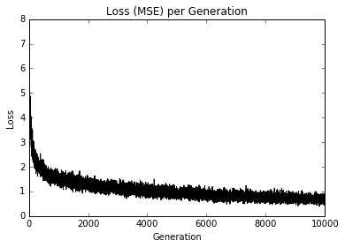

图 10：超过 10,000 次迭代的井字棋训练组损失

在上图中，我们绘制了训练步骤的损失。

1.  为了测试模型，我们需要看看它是如何在我们从训练集中删除的测试棋盘上执行的。我们希望模型可以推广和预测移动的最佳索引，这将是索引号 6。大多数时候模型将成功，如下所示：

```py
test_boards = [test_board] 
feed_dict = {X: test_boards} 
logits = sess.run(model_output, feed_dict=feed_dict) 
predictions = sess.run(prediction, feed_dict=feed_dict) 
print(predictions) 
```

1.  上一步应该产生以下输出：

```py
[6] 
```

1.  为了评估我们的模型，我们需要与我们训练的模型进行对比。要做到这一点，我们必须创建一个能够检查胜利的函数。这样，我们的程序将知道何时停止要求更多动作。这是通过以下代码完成的：

```py
def check(board): 
    wins = [[0,1,2], [3,4,5], [6,7,8], [0,3,6], [1,4,7], [2,5,8], [0,4,8], [2,4,6]] 
    for i in range(len(wins)): 
        if board[wins[i][0]]==board[wins[i][1]]==board[wins[i][2]]==1.: 
            return 1 
        elif board[wins[i][0]]==board[wins[i][1]]==board[wins[i][2]]==-1.: 
            return 1 
    return 0 
```

1.  现在我们可以使用我们的模型循环播放游戏。我们从一个空白棋盘（全零）开始，我们要求用户输入一个索引（0-8），然后我们将其输入到模型中进行预测。对于模型的移动，我们采用最大的可用预测，也是一个开放空间。从这个游戏中，我们可以看到我们的模型并不完美，如下所示：

```py
game_tracker = [0., 0., 0., 0., 0., 0., 0., 0., 0.] 
win_logical = False 
num_moves = 0 
while not win_logical: 
    player_index = input('Input index of your move (0-8): ') 
    num_moves += 1 
    # Add player move to game 
    game_tracker[int(player_index)] = 1\. 

    # Get model's move by first getting all the logits for each index 
    [potential_moves] = sess.run(model_output, feed_dict={X: [game_tracker]}) 
    # Now find allowed moves (where game tracker values = 0.0) 
    allowed_moves = [ix for ix,x in enumerate(game_tracker) if x==0.0] 
    # Find best move by taking argmax of logits if they are in allowed moves 
    model_move = np.argmax([x if ix in allowed_moves else -999.0 for ix,x in enumerate(potential_moves)]) 

    # Add model move to game 
    game_tracker[int(model_move)] = -1\. 
    print('Model has moved') 
    print_board(game_tracker) 
    # Now check for win or too many moves 
    if check(game_tracker)==1 or num_moves>=5: 
        print('Game Over!') 
       win_logical = True 
```

1.  上一步应该产生以下交互输出：

```py
Input index of your move (0-8): 4
Model has moved
 O |   |
___________ 
   | X | 
___________ 
   |   | 
Input index of your move (0-8): 6 
Model has moved 
O  |   | 
___________ 
   | X | 
___________ 
 X |   | O 
Input index of your move (0-8): 2 
Model has moved 
O  |   | X 
___________ 
O  | X | 
___________ 
X  |   | O 
Game Over! 
```

## 工作原理

在本节中，我们通过馈送棋盘位置和九维向量训练神经网络来玩井字棋，并预测最佳响应。我们只需要喂几个可能的井字棋棋盘并对每个棋盘应用随机变换以增加训练集大小。

为了测试我们的算法，我们删除了一个特定棋盘的所有实例，并查看我们的模型是否可以推广以预测最佳响应。最后，我们针对我们的模型玩了一个示例游戏。虽然它还不完善，但仍有不同的架构和训练程序可用于改进它。

