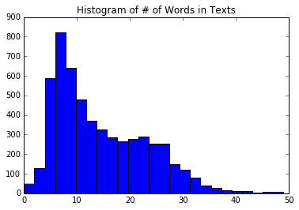
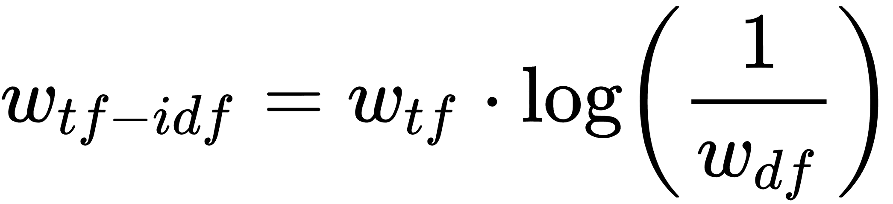
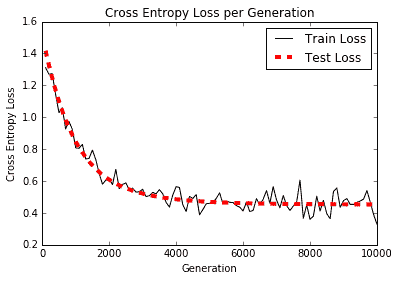
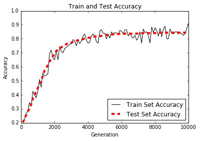
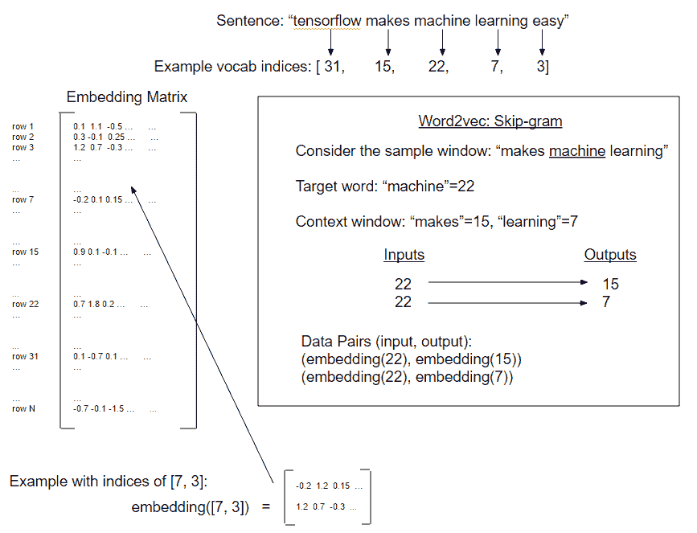
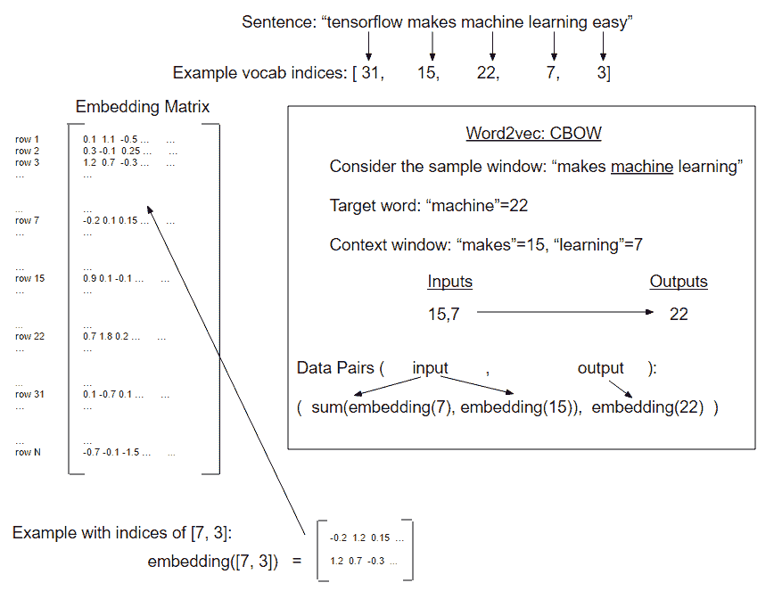
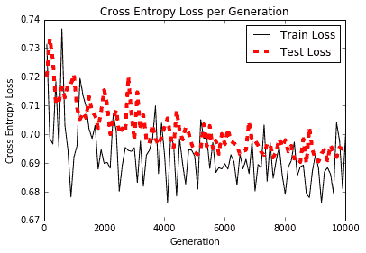
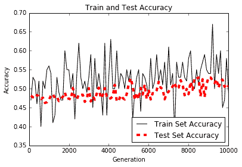

# 七、自然语言处理

在本章中，我们将向您介绍如何使用 TensorFlow 中的文本。我们将首先介绍单词嵌入如何使用词袋方法，然后我们将继续实现更高级的嵌入，如 word2vec 和 doc2vec。

在本章中，我们将介绍以下主题：

*   使用词袋
*   实现 TF-IDF
*   使用 Skip-Gram 嵌入
*   使用 CBOW 嵌入
*   使用 word2vec 进行预测
*   使用 doc2vec 进行情感分析

请注意，读者可以在 [Github](https://github.com/nfmcclure/tensorflow_cookbook) 和 [Packt 仓库](https://github.com/PacktPublishing/TensorFlow-Machine-Learning-Cookbook-Second-Edition)中找到本章的所有代码。

# 介绍

到目前为止，我们只考虑过主要使用数字输入的机器学习算法。如果我们想要使用文本，我们必须找到一种方法将文本转换为数字。有很多方法可以做到这一点，我们将在本章中探讨一些常用的方法。

如果我们考虑句子`TensorFlow makes machine learning easy`，我们可以按照我们观察它们的顺序将单词转换为数字。这将使句子成为`1 2 3 4 5`。然后，当我们看到一个新句子`machine learning is easy`时，我们可以将其翻译为`3 4 0 5,`，表示我们没有看到的索引为零的单词。通过这两个例子，我们将词汇量限制为六个数字。对于大块文本，我们可以选择我们想要保留多少单词，并且通常保留最常用的单词，用零索引标记其他所有单词。

如果单词`learning`的数值为 4，单词`makes`的数值为 2，则自然会认为`learning`是`makes`的两倍。由于我们不希望单词之间存在这种类型的数字关系，我们可以假设这些数字代表的是类别，而不是关系数字。

另一个问题是这两个句子的大小不同。我们所做的每个观察（在这种情况下，句子）需要具有与我们希望创建的模型相同的大小输入。为了解决这个问题，我们必须在稀疏向量中创建每个句子，如果该单词出现在该索引中，则该特定索引中的值为 1：

| `TensorFlow` | `makes` | `machine` | `learning` | `easy` |
| --- | --- | --- | --- | --- |
| 1 | 2 | 3 | 4 | 5 |

```py
first_sentence = [0,1,1,1,1,1] 
```

为了进一步解释前面的向量，我们的词汇由六个不同的单词组成（五个已知单词和一个未知单词）。对于这些单词中的每一个，我们要么具有零值或 1 值。零表示单词不出现在我们的句子中，1 表示它至少出现一次。因此值为零表示该单词不会出现，值为 1 表示它出现

| `machine` | `learning` | `is` | `easy` |
| --- | --- | --- | --- |
| 3 | 4 | 0 | 5 |

```py
second_sentence = [1,0,0,1,1,1] 
```

这种方法的缺点是我们失去了任何词序的指示。两个句子`TensorFlow makes machine learning easy`和`machine learning makes TensorFlow easy`将产生相同的句子向量。

值得注意的是，这些向量的长度等于我们选择的词汇量的大小。选择非常大的词汇量是很常见的，因此这些句子向量可能非常稀疏。这种类型的嵌入称为词袋。我们将在下一节中实现这一点。

另一个缺点是单词`is`和`TensorFlow`具有相同的数字索引值：1。有意义的是，单词`is`可能不如单词`TensorFlow`的出现重要。

我们将在本章中探索不同类型的嵌入，试图解决这些问题，但首先我们将开始实现字袋算法。

# 使用词袋嵌入

在本节中，我们将首先向您展示如何使用 TensorFlow 中的词袋嵌入。这种映射是我们在介绍中介绍的。在这里，我们将向您展示如何使用此类嵌入进行垃圾邮件预测。

## 准备

为了说明如何在文本数据集中使用词袋，我们将使用来自 UCI 机器学习数据仓库的[垃圾邮件电话文本数据库](https://archive.ics.uci.edu/ml/datasets/SMS+Spam+Collection)。这是垃圾邮件或非垃圾邮件（非垃圾邮件）的电话短信集合。我们将下载此数据，将其存储以备将来使用，然后继续使用词袋方法来预测文本是否为垃圾邮件。将在词袋算法上运行的模型将是没有隐藏层的逻辑模型。我们将使用批量大小为 1 的随机训练，并在最后的保持测试集上计算精度。

## 操作步骤

对于这个例子，我们将首先获取数据，正则化和分割文本，通过嵌入函数运行它，并训练逻辑函数来预测垃圾邮件：

1.  第一项任务是为此任务导入必要的库。在通常的库中，我们需要一个`.zip`文件库来解压缩来自 UCI 机器学习网站的数据，我们从中检索它：

```py
import tensorflow as tf 
import matplotlib.pyplot as plt 
import os 
import numpy as np 
import csv 
import string 
import requests 
import io 
from zipfile import ZipFile 
from tensorflow.contrib import learn 
sess = tf.Session() 
```

1.  我们不会在每次运行脚本时下载文本数据，而是保存它并检查文件之前是否已保存。如果我们想要更改脚本的参数，这可以防止我们反复下载数据。下载此数据后，我们将提取输入和目标数据，并将目标更改为`1`以查找垃圾邮件，将`0`更改为非垃圾邮件：

```py
save_file_name = os.path.join('temp','temp_spam_data.csv') 
if os.path.isfile(save_file_name): 
 text_data = [] 
    with open(save_file_name, 'r') as temp_output_file: 
        reader = csv.reader(temp_output_file) 
        for row in reader: 
            text_data.append(row) 
else: 
    zip_url = 'http://archive.ics.uci.edu/ml/machine-learning-databases/00228/smsspamcollection.zip' 
    r = requests.get(zip_url) 
    z = ZipFile(io.BytesIO(r.content)) 
    file = z.read('SMSSpamCollection') 
    # Format Data 
    text_data = file.decode() 
    text_data = text_data.encode('ascii',errors='ignore') 
    text_data = text_data.decode().split('\n') 
    text_data = [x.split('\t') for x in text_data if len(x)>=1] 

    # And write to csv 
    with open(save_file_name, 'w') as temp_output_file: 
        writer = csv.writer(temp_output_file) 
        writer.writerows(text_data) 
texts = [x[1] for x in text_data] 
target = [x[0] for x in text_data] 
# Relabel 'spam' as 1, 'ham' as 0 
target = [1 if x=='spam' else 0 for x in target] 
```

1.  为了减少潜在的词汇量，我们将文本正则化。为此，我们消除了文本中大小写和数字的影响。使用以下代码：

```py
# Convert to lower case 
texts = [x.lower() for x in texts] 
# Remove punctuation 
texts = [''.join(c for c in x if c not in string.punctuation) for x in texts] 
# Remove numbers 
texts = [''.join(c for c in x if c not in '0123456789') for x in texts] 
# Trim extra whitespace 
texts = [' '.join(x.split()) for x in texts] 
```

1.  我们还必须确定最大句子大小。为此，我们将查看数据集中文本长度的直方图。我们可以看到一个很好的截止可能是 25 个字左右。使用以下代码：

```py
# Plot histogram of text lengths 
text_lengths = [len(x.split()) for x in texts] 
text_lengths = [x for x in text_lengths if x < 50] 
plt.hist(text_lengths, bins=25) 
plt.title('Histogram of # of Words in Texts') 
sentence_size = 25 
min_word_freq = 3
```

由此，我们将得到以下绘图：



图 1：数据中每个文本中单词数的直方图。

We use this to establish a maximum length of words to consider in each text. We set this to 25 words, but it can easily be set to 30 or 40 as well.

1.  TensorFlow 有一个内置的处理工具，用于确定名为`VocabularyProcessor()`的词汇嵌入，它位于`learn.preprocessing`库中。请注意，您可能会使用此函数获得已弃用的警告：

```py
vocab_processor = learn.preprocessing.VocabularyProcessor(sentence_size, min_frequency=min_word_freq) 
vocab_processor.fit_transform(texts) 
transformed_texts = np.array([x for x in vocab_processor.transform(texts)])
embedding_size = len(np.unique(transformed_texts))
```

1.  现在我们将数据分成 80-20 训练和测试集：

```py
train_indices = np.random.choice(len(texts), round(len(texts)*0.8), replace=False) 
test_indices = np.array(list(set(range(len(texts))) - set(train_indices))) 
texts_train = [x for ix, x in enumerate(texts) if ix in train_indices] 
texts_test = [x for ix, x in enumerate(texts) if ix in test_indices] 
target_train = [x for ix, x in enumerate(target) if ix in train_indices] 
target_test = [x for ix, x in enumerate(target) if ix in test_indices] 
```

1.  接下来，我们声明单词的嵌入矩阵。句子词将被翻译成指数。这些索引将被转换为单热编码的向量，我们可以使用单位矩阵创建，这将是我们的单词嵌入的大小。我们将使用此矩阵查找每个单词的稀疏向量，并将它们一起添加到稀疏句子向量中。使用以下代码执行此操作：

```py
identity_mat = tf.diag(tf.ones(shape=[embedding_size])) 
```

1.  由于我们最终会执行逻辑回归来预测垃圾邮件的概率，因此我们需要声明逻辑回归变量。然后我们也可以声明我们的数据占位符。值得注意的是，`x_data`输入占位符应该是整数类型，因为它将用于查找我们的单位矩阵的行索引。 TensorFlow 要求此查找为整数：

```py
A = tf.Variable(tf.random_normal(shape=[embedding_size,1])) 
b = tf.Variable(tf.random_normal(shape=[1,1])) 
# Initialize placeholders 
x_data = tf.placeholder(shape=[sentence_size], dtype=tf.int32) 
y_target = tf.placeholder(shape=[1, 1], dtype=tf.float32) 
```

1.  现在我们将使用 TensorFlow 的嵌入查找函数，它将句子中单词的索引映射到我们单位矩阵的单热编码向量。当我们有这个矩阵时，我们通过总结上述单词向量来创建句子向量。使用以下代码执行此操作：

```py
x_embed = tf.nn.embedding_lookup(identity_mat, x_data) 
x_col_sums = tf.reduce_sum(x_embed, 0)
```

1.  现在我们为每个句子都有固定长度的句子向量，我们想要进行逻辑回归。为此，我们需要声明实际的模型操作。由于我们一次只做一个数据点（随机训练），我们将扩展输入的维度并对其进行线性回归操作。请记住，TensorFlow 具有包含 sigmoid 函数的损失函数，因此我们不需要在此输出中包含它：

```py
x_col_sums_2D = tf.expand_dims(x_col_sums, 0) 
model_output = tf.add(tf.matmul(x_col_sums_2D, A), b)
```

1.  我们现在将声明损失函数，预测操作和优化函数来训练模型。使用以下代码执行此操作：

```py
loss = tf.reduce_mean(tf.nn.sigmoid_cross_entropy_with_logits(logits=model_output, labels=y_target)) 
# Prediction operation 
prediction = tf.sigmoid(model_output) 
# Declare optimizer 
my_opt = tf.train.GradientDescentOptimizer(0.001) 
train_step = my_opt.minimize(loss) 
```

1.  接下来，我们将在开始训练生成之前初始化图变量：

```py
init = tf.global_variables_initializer() 
sess.run(init) 
```

1.  现在我们将开始对句子进行迭代。 TensorFlow 的`vocab_processor.fit()`函数是一次运行一个句子的生成器。我们将利用这一优势，以便我们可以对物流模型进行随机训练。为了更好地了解准确率趋势，我们将保留过去 50 个训练步骤的平均值。如果我们只是绘制当前的一个，我们会看到 1 或 0，这取决于我们是否预测训练数据是否正确。使用以下代码执行此操作：

```py
loss_vec = [] 
train_acc_all = [] 
train_acc_avg = [] 
for ix, t in enumerate(vocab_processor.fit_transform(texts_train)): 
    y_data = [[target_train[ix]]] 

    sess.run(train_step, feed_dict={x_data: t, y_target: y_data}) 

    temp_loss = sess.run(loss, feed_dict={x_data: t, y_target: y_data}) 
    loss_vec.append(temp_loss) 

    if (ix+1)%10==0: 
        print('Training Observation #{}: Loss= {}'.format(ix+1, temp_loss)) 

    # Keep trailing average of past 50 observations accuracy 
    # Get prediction of single observation 
    [[temp_pred]] = sess.run(prediction, feed_dict={x_data:t, y_target:y_data}) 
    # Get True/False if prediction is accurate 
    train_acc_temp = target_train[ix]==np.round(temp_pred) 
    train_acc_all.append(train_acc_temp) 
    if len(train_acc_all) >= 50: 
        train_acc_avg.append(np.mean(train_acc_all[-50:]))
```

1.  这产生以下输出：

```py
Starting Training Over 4459 Sentences. 
Training Observation #10: Loss = 5.45322 
Training Observation #20: Loss = 3.58226 
Training Observation #30: Loss = 0.0 
...
Training Observation #4430: Loss = 1.84636 
Training Observation #4440: Loss = 1.46626e-05 
Training Observation #4450: Loss = 0.045941 
```

1.  为了获得测试集的准确率，我们重复前面的过程，但仅限于预测操作，而不是测试集的训练操作：

```py
print('Getting Test Set Accuracy') 
test_acc_all = [] 
for ix, t in enumerate(vocab_processor.fit_transform(texts_test)): 
    y_data = [[target_test[ix]]] 

    if (ix+1)%50==0: 
        print('Test Observation #{}'.format(ix+1))     

    # Keep trailing average of past 50 observations accuracy 
    # Get prediction of single observation 
    [[temp_pred]] = sess.run(prediction, feed_dict={x_data:t, y_target:y_data}) 
    # Get True/False if prediction is accurate 
    test_acc_temp = target_test[ix]==np.round(temp_pred) 
    test_acc_all.append(test_acc_temp) 
print('\nOverall Test Accuracy: {}'.format(np.mean(test_acc_all)))

Getting Test Set Accuracy For 1115 Sentences. 
Test Observation #10 
Test Observation #20 
Test Observation #30 
...
Test Observation #1000 
Test Observation #1050 
Test Observation #1100 
Overall Test Accuracy: 0.8035874439461883 
```

## 工作原理

在本例中，我们使用了来自 UCI 机器学习库的垃圾邮件文本数据。我们使用 TensorFlow 的词汇处理函数来创建标准化词汇表来处理和创建句子向量，这些句子向量是每个文本的单词向量的总和。我们使用这个句子向量与逻辑回归并获得 80% 准确率模型来预测特定文本是否是垃圾邮件。

## 更多

值得一提的是限制句子（或文本）大小的动机。在此示例中，我们将文本大小限制为 25 个单词。这是词袋的常见做法，因为它限制了文本长度对预测的影响。你可以想象，如果我们找到一个单词，例如`meeting`，它可以预测文本是非垃圾邮件（而不是垃圾邮件），那么垃圾邮件可能会通过在最后输入该单词的多次出现来实现。实际上，这是目标数据不平衡的常见问题。在这种情况下可能会出现不平衡的数据，因为垃圾邮件可能很难找到，而非垃圾邮件可能很容易找到。由于这个事实，我们创建的词汇可能严重偏向于我们数据的非垃圾邮件部分中表示的单词（更多非垃圾邮件意味着更多的单词在非垃圾邮件中表示而不是垃圾邮件）。如果我们允许无限长度的文本，那么垃圾邮件发送者可能会利用这一点并创建非常长的文本，这些文本在我们的逻辑模型中触发非垃圾邮件词因素的概率更高。

在下一节中，我们将尝试通过使用单词出现的频率来更好地解决此问题，以确定单词嵌入的值。

# 实现 TF-IDF

由于我们可以为每个单词选择嵌入，我们可能会决定更改某些单词的加权。一种这样的策略是增加有用的单词和减轻过度常见或罕见单词的权重。我们将在此秘籍中探索的嵌入是尝试实现此目的。

## 准备

TF-IDF 是一个缩写，代表文本频率 - 反向文档频率。该术语基本上是每个单词的文本频率和反向文档频率的乘积。

在前面的秘籍中，我们介绍了词袋方法，它为句子中每个单词的出现赋值为 1。这可能并不理想，因为每个类别的句子（前一个秘籍中的垃圾邮件和非垃圾邮件）很可能具有`the`，`and`和其他单词的相同频率，而诸如`Viagra`和`sale`之类的单词]可能应该更加重视查明文本是否是垃圾邮件。

首先，我们要考虑词频。在这里，我们考虑单个条目中单词出现的频率。这部分（TF）的目的是找到在每个条目中看起来很重要的项。

但是`the`和`and`等词可能会在每个条目中频繁出现。我们希望减轻这些单词的重要性，因此将前面的文本频率（TF）乘以整个文档频率的倒数可能有助于找到重要的单词。然而，由于文本集（语料库）可能非常大，因此通常采用逆文档频率的对数。这为我们留下了每个文档条目中每个单词的 TF-IDF 的以下公式：



这里`w[tf]`是文档中的单词频率，`w[df]`是所有文档中这些单词的总频率。有意义的是，TF-IDF 的高值可能表示在确定文档内容时非常重要的单词。

创建 TF-IDF 向量要求我们将所有文本加载到内存中，并在开始训练模型之前计算每个单词的出现次数。因此，它没有在 TensorFlow 中完全实现，因此我们将使用 scikit-learn 来创建我们的 TF-IDF 嵌入，但是使用 TensorFlow 来适应逻辑模型。

## 操作步骤

我们将按如下方式处理秘籍：

1.  我们将从加载必要的库开始。这次，我们正在为我们的文本加载 scikit-learn TF-IDF 预处理库。使用以下代码执行此操作：

```py
import tensorflow as tf 
import matplotlib.pyplot as plt 
import csv 
import numpy as np 
import os 
import string 
import requests 
import io 
import nltk 
from zipfile import ZipFile 
from sklearn.feature_extraction.text import TfidfVectorizer
```

1.  我们将开始一个图会话，并为我们的词汇表声明我们的批量大小和最大特征大小：

```py
sess = tf.Session() 
batch_size= 200 
max_features = 1000 
```

1.  接下来，我们将从 Web 或我们的`temp`数据文件夹中加载数据（如果我们之前已保存过）。使用以下代码执行此操作：

```py
save_file_name = os.path.join('temp','temp_spam_data.csv') 
if os.path.isfile(save_file_name): 
    text_data = [] 
    with open(save_file_name, 'r') as temp_output_file: 
        reader = csv.reader(temp_output_file) 
        for row in reader: 
            text_data.append(row) 
else: 
    zip_url = 'http://archive.ics.uci.edu/ml/machine-learning-databases/00228/smsspamcollection.zip' 
    r = requests.get(zip_url) 
    z = ZipFile(io.BytesIO(r.content)) 
    file = z.read('SMSSpamCollection') 
    # Format Data 
    text_data = file.decode() 
    text_data = text_data.encode('ascii',errors='ignore') 
    text_data = text_data.decode().split('\n') 
    text_data = [x.split('\t') for x in text_data if len(x)>=1] 

    # And write to csv 
    with open(save_file_name, 'w') as temp_output_file: 
        writer = csv.writer(temp_output_file) 
        writer.writerows(text_data) 
texts = [x[1] for x in text_data] 
target = [x[0] for x in text_data] 
# Relabel 'spam' as 1, 'ham' as 0 
target = [1\. if x=='spam' else 0\. for x in target] 
```

1.  就像前面的秘籍一样，我们将通过将所有内容转换为小写，删除标点符号并删除数字来减少词汇量：

```py
# Lower case 
texts = [x.lower() for x in texts] 
# Remove punctuation 
texts = [''.join(c for c in x if c not in string.punctuation) for x in texts] 
# Remove numbers 
texts = [''.join(c for c in x if c not in '0123456789') for x in texts] 
# Trim extra whitespace 
texts = [' '.join(x.split()) for x in texts] 
```

1.  为了使用 scikt-learn 的 TF-IDF 处理函数，我们必须告诉它如何标记我们的句子。通过这个，我们只是指如何将句子分解为相应的单词。我们已经为我们构建了一个很好的标记器：`nltk`包可以很好地将句子分解为相应的单词：

```py
def tokenizer(text): 
    words = nltk.word_tokenize(text) 
    return words 
# Create TF-IDF of texts 
tfidf = TfidfVectorizer(tokenizer=tokenizer, stop_words='english', max_features=max_features) 
sparse_tfidf_texts = tfidf.fit_transform(texts) 
```

1.  接下来，我们将数据集分解为测试和训练集。使用以下代码执行此操作：

```py
train_indices = np.random.choice(sparse_tfidf_texts.shape[0], round(0.8*sparse_tfidf_texts.shape[0]), replace=False) 
test_indices = np.array(list(set(range(sparse_tfidf_texts.shape[0])) - set(train_indices))) 
texts_train = sparse_tfidf_texts[train_indices] 
texts_test = sparse_tfidf_texts[test_indices] 
target_train = np.array([x for ix, x in enumerate(target) if ix in train_indices]) 
target_test = np.array([x for ix, x in enumerate(target) if ix in test_indices]) 
```

1.  现在我们声明我们的逻辑回归模型变量和我们的数据占位符：

```py
A = tf.Variable(tf.random_normal(shape=[max_features,1])) 
b = tf.Variable(tf.random_normal(shape=[1,1])) 
# Initialize placeholders 
x_data = tf.placeholder(shape=[None, max_features], dtype=tf.float32) 
y_target = tf.placeholder(shape=[None, 1], dtype=tf.float32)
```

1.  我们现在可以声明模型操作和损失函数。请记住，逻辑回归的 sigmoid 部分在我们的损失函数中。使用以下代码执行此操作：

```py
model_output = tf.add(tf.matmul(x_data, A), b) 
loss = tf.reduce_mean(tf.nn.sigmoid_cross_entropy_with_logits(logits=model_output, labels=y_target)) 
```

1.  我们将预测和精度函数添加到图中，以便在我们的模型训练时我们可以看到训练和测试集的准确率：

```py
prediction = tf.round(tf.sigmoid(model_output)) 
predictions_correct = tf.cast(tf.equal(prediction, y_target), tf.float32) 
accuracy = tf.reduce_mean(predictions_correct) 
```

1.  然后我们将声明一个优化器并初始化我们的图变量：

```py
my_opt = tf.train.GradientDescentOptimizer(0.0025) 
train_step = my_opt.minimize(loss) 
# Intitialize Variables 
init = tf.global_variables_initializer() 
sess.run(init) 
```

1.  我们现在将训练我们的模型超过 10,000 代，并记录每 100 代的测试/训练损失和准确率，每 500 代打印一次。使用以下代码执行此操作：

```py
train_loss = [] 
test_loss = [] 
train_acc = [] 
test_acc = [] 
i_data = [] 
for i in range(10000): 
    rand_index = np.random.choice(texts_train.shape[0], size=batch_size) 
    rand_x = texts_train[rand_index].todense() 
    rand_y = np.transpose([target_train[rand_index]]) 
    sess.run(train_step, feed_dict={x_data: rand_x, y_target: rand_y}) 

    # Only record loss and accuracy every 100 generations 
    if (i+1)%100==0: 
        i_data.append(i+1) 
        train_loss_temp = sess.run(loss, feed_dict={x_data: rand_x, y_target: rand_y}) 
        train_loss.append(train_loss_temp) 

        test_loss_temp = sess.run(loss, feed_dict={x_data: texts_test.todense(), y_target: np.transpose([target_test])}) 
        test_loss.append(test_loss_temp) 

        train_acc_temp = sess.run(accuracy, feed_dict={x_data: rand_x, y_target: rand_y}) 
        train_acc.append(train_acc_temp) 

        test_acc_temp = sess.run(accuracy, feed_dict={x_data: texts_test.todense(), y_target: np.transpose([target_test])}) 
        test_acc.append(test_acc_temp) 
    if (i+1)%500==0: 
        acc_and_loss = [i+1, train_loss_temp, test_loss_temp, train_acc_temp, test_acc_temp] 
        acc_and_loss = [np.round(x,2) for x in acc_and_loss] 
        print('Generation # {}. Train Loss (Test Loss): {:.2f} ({:.2f}). Train Acc (Test Acc): {:.2f} ({:.2f})'.format(*acc_and_loss)) 
```

1.  这产生以下输出：

```py
Generation # 500\. Train Loss (Test Loss): 0.69 (0.73). Train Acc (Test Acc): 0.62 (0.57) 
Generation # 1000\. Train Loss (Test Loss): 0.62 (0.63). Train Acc (Test Acc): 0.68 (0.66) 
... 
Generation # 9500\. Train Loss (Test Loss): 0.39 (0.45). Train Acc (Test Acc): 0.89 (0.85) 
Generation # 10000\. Train Loss (Test Loss): 0.48 (0.45). Train Acc (Test Acc): 0.84 (0.85) 
```

以下是绘制训练和测试装置的准确率和损耗的绘图：



图 2：根据 TF-IDF 值构建的物流垃圾邮件模型的交叉熵损失

训练和测试精度图如下：



图 3：根据 TF-IDF 值构建的逻辑垃圾邮件模型的训练和测试集精度

## 工作原理

使用模型的 TF-IDF 值增加了我们对先前的词袋模型的预测，从 80% 的准确率到接近 90% 的准确率。我们通过使用 scikit-learn 的 TF-IDF 词汇处理函数并使用这些 TF-IDF 值进行逻辑回归来实现这一目标。

## 更多

虽然我们可能已经解决了重要性这个问题，但我们还没有解决字序问题。词袋和 TF-IDF 都没有考虑句子中的单词的顺序特征。我们将在接下来的几节中尝试解决这个问题，这将向我们介绍 word2vec 技术。

# 使用 Skip-Gram 嵌入

在之前的秘籍中，我们在训练模型之前决定了我们的文本嵌入。使用神经网络，我们可以使嵌入值成为训练过程的一部分。我们将探索的第一个这样的方法叫做 Skip-Gram 嵌入。

## 准备

在此秘籍之前，我们没有考虑与创建单词嵌入相关的单词顺序。 2013 年初，Tomas Mikolov 和谷歌的其他研究人员撰写了一篇关于创建解决这个问题的[单词嵌入的论文](https://arxiv.org/abs/1301.3781)，他们将他们的方法命名为 word2vec。

基本思想是创建捕获单词关系方面的单词嵌入。我们试图了解各种单词如何相互关联。这些嵌入可能如何表现的一些示例如下：

`king - man + woman = queen`

`India pale ale - hops + malt = stout`

如果我们只考虑它们之间的位置关系，我们可能会实现这样的数字表示。如果我们能够分析足够大的相关文档来源，我们可能会发现在我们的文本中，`king`，`man`和`queen`这两个词在彼此之间相互提及。如果我们也知道`man`和`woman`以不同的方式相关，那么我们可以得出结论，`man`是`king`，因为`woman`是`queen`，依此类推。

为了找到这样的嵌入，我们将使用一个神经网络来预测给定输入字的周围单词。我们可以轻松地切换它并尝试在给定一组周围单词的情况下预测目标单词，但我们将从前面的方法开始。两者都是 word2vec 过程的变体，但是从目标词预测周围词（上下文）的前述方法称为 Skip-Gram 模型。在下一个秘籍中，我们将实现另一个方法，从上下文预测目标词，这称为连续词袋方法（CBOW）：



图 4：word2vec 的 Skip-Gram 实现的图示。 Skip-Gram 预测目标词的上下文窗口（每侧窗口大小为 1）。

对于这个秘籍，我们将在康奈尔大学的一组电影评论数据上实现 [Skip-Gram 模型](http://www.cs.cornell.edu/people/pabo/movie-review-data/)。 word2vec 的 CBOW 方法将在下一个秘籍中实现。

## 操作步骤

对于这个秘籍，我们将创建几个辅助函数。这些函数将加载数据，正则化文本，生成词汇表并生成数据批量。只有在这之后我们才开始训练我们的单词嵌入。为了清楚起见，我们不是预测任何目标变量，而是我们将拟合单词嵌入：

1.  首先，我们将加载必要的库并启动图会话：

```py
import tensorflow as tf 
import matplotlib.pyplot as plt 
import numpy as np 
import random 
import os 
import string 
import requests 
import collections 
import io 
import tarfile 
import urllib.request 
from nltk.corpus import stopwords 
sess = tf.Session() 
```

1.  然后我们声明一些模型参数。我们将一次查看 50 对单词嵌入（批量大小）。每个单词的嵌入大小将是一个长度为 200 的向量，我们只考虑 10,000 个最常用的单词（每隔一个单词将被归类为未知单词）。我们将训练 5 万代，并每 500 代打印一次。然后我们将声明一个我们将在损失函数中使用的`num_sampled`变量（我们将在后面解释），并且我们还声明了我们的 Skip-Gram 窗口大小。在这里，我们将窗口大小设置为 2，因此我们将查看目标每侧的周围两个单词。我们将通过名为`nltk`的 Python 包设置我们的停用词。我们还想要一种方法来检查我们的单词嵌入是如何执行的，因此我们将选择一些常见的电影评论单词并从每 2,000 次迭代中打印出最近的邻居单词：

```py
batch_size = 50 
embedding_size = 200 
vocabulary_size = 10000 
generations = 50000 
print_loss_every = 500 
num_sampled = int(batch_size/2) 
window_size = 2 
stops = stopwords.words('english') 
print_valid_every = 2000 
valid_words = ['cliche', 'love', 'hate', 'silly', 'sad']
```

1.  接下来，我们将声明我们的数据加载函数，该函数会检查以确保在下载之前我们没有下载数据。否则，如果之前保存了数据，它将从磁盘加载数据。使用以下代码执行此操作：

```py
def load_movie_data(): 
    save_folder_name = 'temp' 
    pos_file = os.path.join(save_folder_name, 'rt-polarity.pos') 
    neg_file = os.path.join(save_folder_name, 'rt-polarity.neg') 
    # Check if files are already downloaded 
    if os.path.exists(save_folder_name): 
        pos_data = [] 
        with open(pos_file, 'r') as temp_pos_file: 
            for row in temp_pos_file: 
                pos_data.append(row) 
        neg_data = [] 
        with open(neg_file, 'r') as temp_neg_file: 
            for row in temp_neg_file: 
                neg_data.append(row) 
    else: # If not downloaded, download and save 
        movie_data_url = 'http://www.cs.cornell.edu/people/pabo/movie-review-data/rt-polaritydata.tar.gz' 
        stream_data = urllib.request.urlopen(movie_data_url) 
        tmp = io.BytesIO() 
        while True: 
            s = stream_data.read(16384) 
            if not s:   
                break 
            tmp.write(s) 
            stream_data.close() 
            tmp.seek(0) 
        tar_file = tarfile.open(fileobj=tmp, mode='r:gz') 
        pos = tar_file.extractfile('rt-polaritydata/rt-polarity.pos') 
        neg = tar_file.extractfile('rt-polaritydata/rt-polarity.neg') 
        # Save pos/neg reviews 
        pos_data = [] 
        for line in pos: 
            pos_data.append(line.decode('ISO-8859-1').encode('ascii',errors='ignore').decode()) 
        neg_data = [] 
        for line in neg: 
            neg_data.append(line.decode('ISO-8859-1').encode('ascii',errors='ignore').decode()) 
        tar_file.close() 
        # Write to file 
        if not os.path.exists(save_folder_name): 
            os.makedirs(save_folder_name) 
        # Save files 
        with open(pos_file, 'w') as pos_file_handler: 
            pos_file_handler.write(''.join(pos_data)) 
        with open(neg_file, 'w') as neg_file_handler: 
            neg_file_handler.write(''.join(neg_data)) 
    texts = pos_data + neg_data 
    target = [1]*len(pos_data) + [0]*len(neg_data) 
    return(texts, target) 
texts, target = load_movie_data() 
```

1.  接下来，我们将为文本创建正则化函数。此函数将输入字符串列表并使其为小写，删除标点，删除数字，删除额外的空格，并删除停用词。使用以下代码执行此操作：

```py
def normalize_text(texts, stops): 
    # Lower case 
    texts = [x.lower() for x in texts] 
    # Remove punctuation 
    texts = [''.join(c for c in x if c not in string.punctuation) for x in texts] 
    # Remove numbers 
    texts = [''.join(c for c in x if c not in '0123456789') for x in texts] 
    # Remove stopwords 
    texts = [' '.join([word for word in x.split() if word not in (stops)]) for x in texts] 
    # Trim extra whitespace 
    texts = [' '.join(x.split()) for x in texts] 

    return(texts) 
texts = normalize_text(texts, stops) 
```

1.  为了确保我们所有的电影评论都能提供信息，我们应该确保它们足够长，以包含重要的单词关系。我们会随意将其设置为三个或更多单词：

```py
target = [target[ix] for ix, x in enumerate(texts) if len(x.split()) > 2] 
texts = [x for x in texts if len(x.split()) > 2]
```

1.  为了构建我们的词汇表，我们将创建一个函数来创建一个带有计数的单词字典。任何不常见的词都不会使我们的词汇量大小被截止，将被标记为`RARE`。使用以下代码执行此操作：

```py
def build_dictionary(sentences, vocabulary_size): 
    # Turn sentences (list of strings) into lists of words 
    split_sentences = [s.split() for s in sentences] 
    words = [x for sublist in split_sentences for x in sublist] 
    # Initialize list of [word, word_count] for each word, starting with unknown 
    count = [['RARE', -1]] 
    # Now add most frequent words, limited to the N-most frequent (N=vocabulary size) 
count.extend(collections.Counter(words).most_common(vocabulary_size-1)) 
    # Now create the dictionary 
    word_dict = {} 
    # For each word, that we want in the dictionary, add it, then make it the value of the prior dictionary length 
    for word, word_count in count: 
        word_dict[word] = len(word_dict) 
    return(word_dict) 
```

1.  我们需要一个函数将一个句子列表转换为单词索引列表，我们可以将它们传递给嵌入查找函数。使用以下代码执行此操作：

```py
def text_to_numbers(sentences, word_dict): 
    # Initialize the returned data 
    data = [] 
    for sentence in sentences: 
        sentence_data = [] 
        # For each word, either use selected index or rare word index 
        for word in sentence: 
            if word in word_dict: 
                word_ix = word_dict[word] 
            else: 
                word_ix = 0 
            sentence_data.append(word_ix) 
        data.append(sentence_data) 
    return data
```

1.  现在我们可以实际创建我们的字典并将我们的句子列表转换为单词索引列表：

```py
word_dictionary = build_dictionary(texts, vocabulary_size) 
word_dictionary_rev = dict(zip(word_dictionary.values(), word_dictionary.keys())) 
text_data = text_to_numbers(texts, word_dictionary) 
```

1.  从前面的单词字典中，我们可以查找我们在步骤 2 中选择的验证字的索引。使用以下代码执行此操作：

```py
valid_examples = [word_dictionary[x] for x in valid_words]
```

1.  我们现在将创建一个将返回 Skip-Gram 批次的函数。我们想训练一对单词，其中一个单词是训练输入（来自我们窗口中心的目标单词），另一个单词是从窗口中选择的。例如，句子`the cat in the hat`可能导致（输入，输出）对，如下所示：（`the`，`in`），（`cat`，`in`），（`the`，`in`），（`hat`，`in`）如果是目标词，我们每个方向的窗口大小为 2：

```py
def generate_batch_data(sentences, batch_size, window_size, method='skip_gram'): 
    # Fill up data batch 
    batch_data = [] 
    label_data = [] 
    while len(batch_data) < batch_size: 
        # select random sentence to start 
        rand_sentence = np.random.choice(sentences) 
        # Generate consecutive windows to look at 
        window_sequences = [rand_sentence[max((ix-window_size),0):(ix+window_size+1)] for ix, x in enumerate(rand_sentence)] 
        # Denote which element of each window is the center word of interest 
        label_indices = [ix if ix<window_size else window_size for ix,x in enumerate(window_sequences)] 

        # Pull out center word of interest for each window and create a tuple for each window 
        if method=='skip_gram': 
            batch_and_labels = [(x[y], x[:y] + x[(y+1):]) for x,y in zip(window_sequences, label_indices)] 
            # Make it in to a big list of tuples (target word, surrounding word) 
            tuple_data = [(x, y_) for x,y in batch_and_labels for y_ in y] 
        else: 
            raise ValueError('Method {} not implmented yet.'.format(method)) 

        # extract batch and labels 
        batch, labels = [list(x) for x in zip(*tuple_data)] 
        batch_data.extend(batch[:batch_size]) 
        label_data.extend(labels[:batch_size]) 
    # Trim batch and label at the end 
    batch_data = batch_data[:batch_size] 
    label_data = label_data[:batch_size] 

    # Convert to numpy array 
    batch_data = np.array(batch_data) 
    label_data = np.transpose(np.array([label_data])) 

    return batch_data, label_data 
```

1.  我们现在可以初始化嵌入矩阵，声明占位符，并初始化嵌入查找函数。使用以下代码执行此操作：

```py
embeddings = tf.Variable(tf.random_uniform([vocabulary_size,  
    embedding_size], -1.0, 1.0)) 
# Create data/target placeholders 
x_inputs = tf.placeholder(tf.int32, shape=[batch_size]) 
y_target = tf.placeholder(tf.int32, shape=[batch_size, 1]) 
valid_dataset = tf.constant(valid_examples, dtype=tf.int32) 

# Lookup the word embedding: 
embed = tf.nn.embedding_lookup(embeddings, x_inputs) 
```

1.  损失函数应该是诸如`softmax`之类的东西，它计算预测错误单词类别时的损失。但由于我们的目标有 10,000 个不同的类别，因此非常稀疏。这种稀疏性导致关于模型的拟合或收敛的问题。为了解决这个问题，我们将使用称为噪声对比误差的损失函数。这种 NCE 损失函数通过预测单词类与随机噪声预测将我们的问题转化为二元预测。`num_sampled`参数指定批量变成随机噪声的程度：

```py
nce_weights = tf.Variable(tf.truncated_normal([vocabulary_size,  
    embedding_size], stddev=1.0 / np.sqrt(embedding_size))) 
nce_biases = tf.Variable(tf.zeros([vocabulary_size]))
loss = tf.reduce_mean(tf.nn.nce_loss(weights=nce_weights, 
                                     biases=nce_biases, 
                                     inputs=embed, 
                                     labels=y_target, 
                                     num_sampled=num_sampled, 
                                     num_classes=vocabulary_size))
```

1.  现在我们需要创建一种方法来查找附近的单词到我们的验证单词。我们将通过计算验证集和所有单词嵌入之间的余弦相似性来完成此操作，然后我们可以为每个验证字打印出最接近的单词集。使用以下代码执行此操作：

```py
norm = tf.sqrt(tf.reduce_sum(tf.square(embeddings), 1, keepdims=True)) 
normalized_embeddings = embeddings / norm 
valid_embeddings = tf.nn.embedding_lookup(normalized_embeddings, valid_dataset) 
similarity = tf.matmul(valid_embeddings, normalized_embeddings, transpose_b=True) 
```

1.  我们现在声明我们的优化函数并初始化我们的模型变量：

```py
optimizer = tf.train.GradientDescentOptimizer(learning_rate=1.0).minimize(loss) 
init = tf.global_variables_initializer() 
sess.run(init)
```

1.  现在我们可以训练我们的嵌入并在训练期间打印损失和最接近我们验证集的单词。使用以下代码执行此操作：

```py
loss_vec = [] 
loss_x_vec = [] 
for i in range(generations): 
    batch_inputs, batch_labels = generate_batch_data(text_data, batch_size, window_size) 
    feed_dict = {x_inputs : batch_inputs, y_target : batch_labels} 
    # Run the train step 
    sess.run(optimizer, feed_dict=feed_dict) 
    # Return the loss 
    if (i+1) % print_loss_every == 0: 
        loss_val = sess.run(loss, feed_dict=feed_dict) 
        loss_vec.append(loss_val) 
        loss_x_vec.append(i+1) 
        print("Loss at step {} : {}".format(i+1, loss_val)) 

    # Validation: Print some random words and top 5 related words 
    if (i+1) % print_valid_every == 0: 
        sim = sess.run(similarity, feed_dict=feed_dict) 
        for j in range(len(valid_words)): 
            valid_word = word_dictionary_rev[valid_examples[j]] 
            top_k = 5 # number of nearest neighbors 
            nearest = (-sim[j, :]).argsort()[1:top_k+1] 
            log_str = "Nearest to {}:".format(valid_word) 
            for k in range(top_k): 
                close_word = word_dictionary_rev[nearest[k]] 
                log_str = "%s %s," % (log_str, close_word) 
            print(log_str)
```

> 在前面的代码中，我们在调用`argsort`方法之前采用相似矩阵的否定。我们这样做是因为我们想要找到从最高相似度值到最低相似度值的索引，而不是相反。

1.  这产生以下输出：

```py
Loss at step 500 : 13.387781143188477 
Loss at step 1000 : 7.240757465362549 
Loss at step 49500 : 0.9395825862884521 
Loss at step 50000 : 0.30323168635368347 
Nearest to cliche: walk, intrigue, brim, eileen, dumber, 
Nearest to love: plight, fiction, complete, lady, bartleby, 
Nearest to hate: style, throws, players, fearlessness, astringent, 
Nearest to silly: delivers, meow, regain, nicely, anger, 
Nearest to sad: dizzying, variety, existing, environment, tunney, 
```

## 工作原理

我们通过`Skip-Gram`方法在电影评论数据集上训练了一个 word2vec 模型。我们下载了数据，将单词转换为带有字典的索引，并将这些索引号用作嵌入查找，我们对其进行了训练，以便附近的单词可以相互预测。

## 更多

乍一看，我们可能期望验证集的附近单词集合是同义词。事实并非如此，因为很少有同义词实际上在句子中彼此相邻。我们真正得到的是预测我们的数据集中哪些单词彼此接近。我们希望使用这样的嵌入将使预测更容易。

为了使用这些嵌入，我们必须使它们可重用并保存它们。我们将通过实现 CBOW 嵌入在下一个秘籍中执行此操作。

# 使用 CBOW 嵌入

在这个秘籍中，我们将实现 word2vec 的 CBOW（连续词袋）方法。它与`Skip-Gram`方法非常相似，除了我们预测来自环境词周围窗口的单个目标词。

## 准备

在这个秘籍中，我们将实现 word2vec 的`CBOW`方法。它与`Skip-Gram`方法非常相似，只是我们预测来自环境词周围窗口的单个目标词。

在前面的示例中，我们将窗口和目标的每个组合视为一组配对的输入和输出，但是使用 CBOW，我们将周围的窗口嵌入添加到一起以获得一个嵌入来预测目标字嵌入：



图 5：如何在一个例子的窗口上创建 CBOW 嵌入数据的描述（每侧窗口大小为 1）

大多数代码都保持不变，除了我们需要改变我们创建嵌入的方式以及如何从句子生成数据。

为了使代码更易于阅读，我们已将所有主要函数移动到同一目录中名为`text_helpers.py`的单独文件中。此函数保存数据加载，文本正则化，字典创建和批量生成函数。除非另有说明，否则这些函数与使用 Skip-Gram 嵌入秘籍中显示的完全相同。

## 操作步骤

我们将按如下方式处理秘籍：

1.  我们将首先加载必要的库，包括前面提到的`text_helpers.py`脚本，我们将把我们的函数用于文本加载和操作。然后我们将开始一个图会话：

```py
import tensorflow as tf 
import matplotlib.pyplot as plt 
import numpy as np 
import random 
import os 
import pickle 
import string 
import requests 
import collections 
import io 
import tarfile 
import urllib.request 
import text_helpers 
from nltk.corpus import stopwords 
sess = tf.Session() 
```

1.  我们要确保在开始保存之前存在临时数据和参数保存文件夹。使用以下代码检查：

```py
# Make a saving directory if it doesn't exist 
data_folder_name = 'temp' 
if not os.path.exists(data_folder_name): 
    os.makedirs(data_folder_name)
```

1.  然后我们将声明模型的参数，这与我们在上一个秘籍中对`Skip-Gram`方法所做的类似：

```py
# Declare model parameters 
batch_size = 500 
embedding_size = 200 
vocabulary_size = 2000 
generations = 50000 
model_learning_rate = 0.001 
num_sampled = int(batch_size/2 
window_size = 3 
# Add checkpoints to training 
save_embeddings_every = 5000 
print_valid_every = 5000 
print_loss_every = 100 
# Declare stop words 
stops = stopwords.words('english') 
# We pick some test words. We are expecting synonyms to appear 
valid_words = ['love', 'hate', 'happy', 'sad', 'man', 'woman'] 
```

1.  我们已将数据加载和文本正则化函数移动到我们在开始时导入的单独文件中，此文件在 [Github 仓库](https://github.com/nfmcclure/tensorflow_cookbook/tree/master/07_Natural_Language_Processing/05_Working_With_CBOW_Embeddings)和 [Packt 仓库](https://github.com/PacktPublishing/TensorFlow-Machine-Learning-Cookbook-Second-Edition)中都可用。现在我们可以打电话给他们我们也只想要包含三个或更多单词的评论。使用以下代码：

```py
texts, target = text_helpers.load_movie_data(data_folder_name) texts = text_helpers.normalize_text(texts, stops) # Texts must contain at least 3 words target = [target[ix] for ix, x in enumerate(texts) if len(x.split()) > 2] texts = [x for x in texts if len(x.split()) > 2] 
```

1.  现在我们将创建我们的词汇词典，这将帮助我们查找单词。当我们想要打印出最接近我们验证集的单词时，我们还需要一个反向字典来查找索引中的单词：

```py
word_dictionary = text_helpers.build_dictionary(texts,  
vocabulary_size) 
word_dictionary_rev = dict(zip(word_dictionary.values(), word_dictionary.keys())) 
text_data = text_helpers.text_to_numbers(texts, word_dictionary) 
# Get validation word keys 
valid_examples = [word_dictionary[x] for x in valid_words] 
```

1.  接下来，我们将初始化我们想要拟合的单词嵌入，并声明模型数据占位符。使用以下代码执行此操作：

```py
embeddings = tf.Variable(tf.random_uniform([vocabulary_size, embedding_size], -1.0, 1.0)) 
# Create data/target placeholders 
x_inputs = tf.placeholder(tf.int32, shape=[batch_size,  
2*window_size]) 
y_target = tf.placeholder(tf.int32, shape=[batch_size, 1]) 
valid_dataset = tf.constant(valid_examples, dtype=tf.int32) 
```

1.  我们现在可以创建一种处理嵌入一词的方法。由于 CBOW 模型添加了上下文窗口的嵌入，我们将创建一个循环并将所有嵌入添加到窗口中：

```py
# Lookup the word embeddings and 
# Add together window embeddings: 
embed = tf.zeros([batch_size, embedding_size]) 
for element in range(2*window_size): 
    embed += tf.nn.embedding_lookup(embeddings, x_inputs[:, element]) 
```

1.  我们将使用 TensorFlow 中内置的噪声对比误差损失函数，因为我们的分类输出太稀疏，无法使 softmax 收敛，如下所示：

```py
# NCE loss parameters 
nce_weights = tf.Variable(tf.truncated_normal([vocabulary_size,  
embedding_size], stddev=1.0 / np.sqrt(embedding_size))) 
nce_biases = tf.Variable(tf.zeros([vocabulary_size])) 
# Declare loss function (NCE) 
loss = tf.reduce_mean(tf.nn.nce_loss(weights=nce_weights, 
                                     biases=nce_biases, 
                                     inputs=embed, 
                                     labels=y_target, 
                                     num_sampled=num_sampled, 
                                     num_classes=vocabulary_size))
```

1.  就像我们在 Skip-Gram 秘籍中所做的那样，我们将使用余弦相似性来打印离我们的验证字数据集最近的单词，以了解我们的嵌入如何工作。使用以下代码执行此操作：

```py
norm = tf.sqrt(tf.reduce_sum(tf.square(embeddings), 1, keepdims=True)) 
normalized_embeddings = embeddings / norm 
valid_embeddings = tf.nn.embedding_lookup(normalized_embeddings, valid_dataset) 
similarity = tf.matmul(valid_embeddings, normalized_embeddings, transpose_b=True)
```

1.  要保存嵌入，我们必须加载 TensorFlow `train.Saver`方法。这个方法默认保存整个图，但是我们可以给它一个参数来保存嵌入变量，我们也可以给它一个特定的名称。在这里，我们给它的名称与图中的变量名称相同：

```py
saver = tf.train.Saver({"embeddings": embeddings})
```

1.  我们现在将声明我们的优化函数并初始化我们的模型变量。使用以下代码执行此操作：

```py
optimizer = tf.train.GradientDescentOptimizer(learning_rate=model_learning_rate).minimize(loss) 
init = tf.global_variables_initializer() 
sess.run(init) 
```

1.  最后，我们可以遍历我们的训练步骤，打印出损失，并将我们指定的嵌入和字典保存到：

```py
loss_vec = [] 
loss_x_vec = [] 
for i in range(generations): 
    batch_inputs, batch_labels = text_helpers.generate_batch_data(text_data, batch_size, window_size, method='cbow') 
    feed_dict = {x_inputs : batch_inputs, y_target : batch_labels} 
    # Run the train step 
    sess.run(optimizer, feed_dict=feed_dict) 
    # Return the loss 
    if (i+1) % print_loss_every == 0: 
        loss_val = sess.run(loss, feed_dict=feed_dict) 
        loss_vec.append(loss_val) 
        loss_x_vec.append(i+1) 
        print('Loss at step {} : {}'.format(i+1, loss_val)) 

    # Validation: Print some random words and top 5 related words 
    if (i+1) % print_valid_every == 0: 
        sim = sess.run(similarity, feed_dict=feed_dict) 
        for j in range(len(valid_words)): 
            valid_word = word_dictionary_rev[valid_examples[j]] 
            top_k = 5 # number of nearest neighbors 
            nearest = (-sim[j, :]).argsort()[1:top_k+1] 
            log_str = "Nearest to {}:".format(valid_word) 
            for k in range(top_k): 
                close_word = word_dictionary_rev[nearest[k]] 
                print_str = '{} {},'.format(log_str, close_word) 
            print(print_str) 

    # Save dictionary + embeddings 
    if (i+1) % save_embeddings_every == 0: 
        # Save vocabulary dictionary 
        with open(os.path.join(data_folder_name,'movie_vocab.pkl'), 'wb') as f: 
            pickle.dump(word_dictionary, f) 

        # Save embeddings 
        model_checkpoint_path = os.path.join(os.getcwd(),data_folder_name,'cbow_movie_embeddings.ckpt') 
        save_path = saver.save(sess, model_checkpoint_path) 
        print('Model saved in file: {}'.format(save_path)) 
```

1.  这产生以下输出：

```py
Loss at step 100 : 62.04829025268555 
Loss at step 200 : 33.182334899902344
... 
Loss at step 49900 : 1.6794960498809814 
Loss at step 50000 : 1.5071022510528564 
Nearest to love: clarity, cult, cliched, literary, memory, 
Nearest to hate: bringing, gifted, almost, next, wish, 
Nearest to happy: ensemble, fall, courage, uneven, girls, 
Nearest to sad: santa, devoid, biopic, genuinely, becomes, 
Nearest to man: project, stands, none, soul, away, 
Nearest to woman: crush, even, x, team, ensemble, 
Model saved in file: .../temp/cbow_movie_embeddings.ckpt 
```

1.  `text_helpers.py`文件中除了一个函数之外的所有函数都具有直接来自上一个秘籍的函数。我们将通过添加`cbow`方法对`generate_batch_data()`函数稍加补充，如下所示：

```py
elif method=='cbow': 
    batch_and_labels = [(x[:y] + x[(y+1):], x[y]) for x,y in zip(window_sequences, label_indices)] 
    # Only keep windows with consistent 2*window_size 
    batch_and_labels = [(x,y) for x,y in batch_and_labels if len(x)==2*window_size] 
    batch, labels = [list(x) for x in zip(*batch_and_labels)] 
```

## 工作原理

此秘籍与使用 Skip-Gram 创建嵌入非常相似。主要区别在于我们如何生成数据并组合嵌入。

对于这个秘籍，我们加载数据，正则化文本，创建词汇词典，使用字典查找嵌入，组合嵌入，并训练神经网络来预测目标词。

## 更多

值得注意的是，`CBOW`方法训练周围窗口的累加嵌入以预测目标字。这样做的一个结果是来自 word2vec 的`CBOW`方法具有`Skip-Gram`方法缺乏的平滑效果，并且认为这对于较小的文本数据集可能是优选的是合理的。

# 使用 word2vec 进行预测

在本文中，我们将使用先前学习的嵌入策略来执行分类。

## 准备

现在我们已经创建并保存了 CBOW 字嵌入，我们需要使用它们来对电影数据集进行情感预测。在本文中，我们将学习如何加载和使用预先训练的嵌入，并使用这些嵌入来通过训练逻辑线性模型来预测好的或坏的评论来执行情感分析。

情感分析是一项非常艰巨的任务，因为人类语言使得很难掌握所谓意义的真实含义的微妙之处和细微差别。讽刺，笑话和含糊不清的引用都使这项任务成倍增加。我们将在电影评论数据集上创建一个简单的逻辑回归，以查看我们是否可以从我们在上一个秘籍中创建并保存的 CBOW 嵌入中获取任何信息。由于本文的重点是加载和使用已保存的嵌入，我们不会追求更复杂的模型。

## 操作步骤

我们将按如下方式处理秘籍：

1.  我们将首先加载必要的库并启动图会话：

```py
import tensorflow as tf 
import matplotlib.pyplot as plt 
import numpy as np 
import random 
import os 
import pickle 
import string 
import requests 
import collections 
import io 
import tarfile 
import urllib.request 
import text_helpers 
from nltk.corpus import stopwords 
sess = tf.Session() 
```

1.  现在我们将声明模型参数。嵌入大小应与我们用于创建前面的 CBOW 嵌入的嵌入大小相同。使用以下代码执行此操作：

```py
embedding_size = 200 
vocabulary_size = 2000 
batch_size = 100 
max_words = 100 
stops = stopwords.words('english') 
```

1.  我们将从我们创建的`text_helpers.py`文件加载和转换文本数据。使用以下代码执行此操作：

```py
texts, target = text_helpers.load_movie_data() 
# Normalize text 
print('Normalizing Text Data') 
texts = text_helpers.normalize_text(texts, stops) 
# Texts must contain at least 3 words 
target = [target[ix] for ix, x in enumerate(texts) if len(x.split()) > 2] 
texts = [x for x in texts if len(x.split()) > 2] 
train_indices = np.random.choice(len(target), round(0.8*len(target)), replace=False) 
test_indices = np.array(list(set(range(len(target))) - set(train_indices))) 
texts_train = [x for ix, x in enumerate(texts) if ix in train_indices] 
texts_test = [x for ix, x in enumerate(texts) if ix in test_indices] 
target_train = np.array([x for ix, x in enumerate(target) if ix in train_indices]) 
target_test = np.array([x for ix, x in enumerate(target) if ix in test_indices])
```

1.  我们现在加载我们在拟合 CBOW 嵌入时创建的单词字典。重要的是我们加载它以便我们具有从单词到嵌入索引的完全相同的映射，如下所示：

```py
dict_file = os.path.join(data_folder_name, 'movie_vocab.pkl') 
word_dictionary = pickle.load(open(dict_file, 'rb')) 
```

1.  我们现在可以使用我们的单词字典将我们加载的句子数据转换为数字`numpy`数组：

```py
text_data_train = np.array(text_helpers.text_to_numbers(texts_train, word_dictionary)) 
text_data_test = np.array(text_helpers.text_to_numbers(texts_test, word_dictionary)) 
```

1.  由于电影评论的长度不同，我们将它们标准化，因此它们的长度都相同。在我们的例子中，我们将其设置为 100 个单词。如果评论少于 100 个单词，我们将用零填充它。使用以下代码执行此操作：

```py
text_data_train = np.array([x[0:max_words] for x in [y+[0]*max_words for y in text_data_train]]) 
text_data_test = np.array([x[0:max_words] for x in [y+[0]*max_words for y in text_data_test]]) 
```

1.  现在我们将声明我们的模型变量和占位符以进行逻辑回归。使用以下代码执行此操作：

```py
A = tf.Variable(tf.random_normal(shape=[embedding_size,1])) 
b = tf.Variable(tf.random_normal(shape=[1,1])) 
# Initialize placeholders 
x_data = tf.placeholder(shape=[None, max_words], dtype=tf.int32) 
y_target = tf.placeholder(shape=[None, 1], dtype=tf.float32)
```

1.  为了让 TensorFlow 恢复我们预先训练的嵌入，我们必须首先给`Saver`方法一个变量来恢复，所以我们将创建一个嵌入变量，其形状与我们将加载的嵌入相同：

```py
embeddings = tf.Variable(tf.random_uniform([vocabulary_size, embedding_size], -1.0, 1.0))
```

1.  现在我们将`embedding_lookup`函数放在图上，并将句子中所有单词的平均嵌入。使用以下代码执行此操作：

```py
embed = tf.nn.embedding_lookup(embeddings, x_data) 
# Take average of all word embeddings in documents 
embed_avg = tf.reduce_mean(embed, 1)
```

1.  接下来，我们将声明我们的模型操作和损失函数，记住我们的损失函数已经内置了 sigmoid 操作，如下所示：

```py
model_output = tf.add(tf.matmul(embed_avg, A), b) 
# Declare loss function (Cross Entropy loss) 
loss = tf.reduce_mean(tf.nn.sigmoid_cross_entropy_with_logits(logits=model_output, labels=y_target)) 
```

1.  现在我们将向图添加预测和精度函数，以便我们可以在使用以下代码训练模型时评估精度：

```py
prediction = tf.round(tf.sigmoid(model_output)) 
predictions_correct = tf.cast(tf.equal(prediction, y_target), tf.float32) 
accuracy = tf.reduce_mean(predictions_correct) 
```

1.  我们将声明我们的优化函数并初始化以下模型变量：

```py
my_opt = tf.train.AdagradOptimizer(0.005) 
train_step = my_opt.minimize(loss) 
init = tf.global_variables_initializer() 
sess.run(init) 
```

1.  现在我们有一个随机初始化嵌入，我们可以告诉`Saver`方法将我们之前的 CBOW 嵌入加载到嵌入变量中。使用以下代码执行此操作：

```py
model_checkpoint_path = os.path.join(data_folder_name,'cbow_movie_embeddings.ckpt') 
saver = tf.train.Saver({"embeddings": embeddings}) 
saver.restore(sess, model_checkpoint_path)
```

1.  现在我们可以开始训练几代。请注意，我们每 100 代就可以节省训练和测试损失和准确率。我们只会每 500 代打印一次模型状态，如下所示：

```py
train_loss = [] 
test_loss = [] 
train_acc = [] 
test_acc = [] 
i_data = [] 
for i in range(10000): 
    rand_index = np.random.choice(text_data_train.shape[0], size=batch_size) 
    rand_x = text_data_train[rand_index] 
    rand_y = np.transpose([target_train[rand_index]]) 
    sess.run(train_step, feed_dict={x_data: rand_x, y_target: rand_y}) 

    # Only record loss and accuracy every 100 generations 
    if (i+1)%100==0: 
        i_data.append(i+1) 
        train_loss_temp = sess.run(loss, feed_dict={x_data: rand_x, y_target: rand_y}) 
        train_loss.append(train_loss_temp) 

        test_loss_temp = sess.run(loss, feed_dict={x_data: text_data_test, y_target: np.transpose([target_test])}) 
        test_loss.append(test_loss_temp) 

        train_acc_temp = sess.run(accuracy, feed_dict={x_data: rand_x, y_target: rand_y}) 
        train_acc.append(train_acc_temp) 
        test_acc_temp = sess.run(accuracy, feed_dict={x_data: text_data_test, y_target: np.transpose([target_test])}) 
        test_acc.append(test_acc_temp) 
    if (i+1)%500==0: 
        acc_and_loss = [i+1, train_loss_temp, test_loss_temp, train_acc_temp, test_acc_temp] 
        acc_and_loss = [np.round(x,2) for x in acc_and_loss] 
        print('Generation # {}. Train Loss (Test Loss): {:.2f} ({:.2f}). Train Acc (Test Acc): {:.2f} ({:.2f})'.format(*acc_and_loss))
```

1.  结果如下：

```py
Generation # 500\. Train Loss (Test Loss): 0.70 (0.71). Train Acc (Test Acc): 0.52 (0.48) 
Generation # 1000\. Train Loss (Test Loss): 0.69 (0.72). Train Acc (Test Acc): 0.56 (0.47) 
... 
Generation # 9500\. Train Loss (Test Loss): 0.69 (0.70). Train Acc (Test Acc): 0.57 (0.55) 
Generation # 10000\. Train Loss (Test Loss): 0.70 (0.70). Train Acc (Test Acc): 0.59 (0.55) 
```

1.  以下是绘制训练和测试损失和准确率的代码，我们每 100 代保存一次：

```py
# Plot loss over time 
plt.plot(i_data, train_loss, 'k-', label='Train Loss') 
plt.plot(i_data, test_loss, 'r--', label='Test Loss', linewidth=4) 
plt.title('Cross Entropy Loss per Generation') 
plt.xlabel('Generation') 
plt.ylabel('Cross Entropy Loss') 
plt.legend(loc='upper right') 
plt.show() 

# Plot train and test accuracy 
plt.plot(i_data, train_acc, 'k-', label='Train Set Accuracy') 
plt.plot(i_data, test_acc, 'r--', label='Test Set Accuracy', linewidth=4) 
plt.title('Train and Test Accuracy') 
plt.xlabel('Generation') 
plt.ylabel('Accuracy') 
plt.legend(loc='lower right') 
plt.show() 
```

每代交叉熵损失的图如下：

Figure 6: Here we observe the train and test loss over 10,000 generations

上述代码的训练图和测试精度如下：



图 7：我们可以观察到训练和测试装置的准确率正在缓慢提高 10,000 代。值得注意的是，该模型表现非常差，并且仅比随机预测器略好。

## 工作原理

我们加载了我们之前的 CBOW 嵌入并对平均嵌入评论进行了逻辑回归。这里要注意的重要方法是我们如何将模型变量从磁盘加载到当前模型中已经初始化的变量。我们还必须记住在训练嵌入之前存储和加载我们创建的词汇表。使用相同的嵌入时，从单词到嵌入索引具有相同的映射非常重要。

## 更多

我们可以看到，我们在预测情感方面几乎达到了 60% 的准确率。例如，要知道单词`great;`背后的含义是一项艰巨的任务，它可以在评论中用于消极或积极的背景。

为了解决这个问题，我们希望以某种方式为文档本身创建嵌入并解决情感问题。通常，整个评论是积极的，或者整个评论是否定的。我们可以利用这个优势，我们将在下面的使用 doc2vec 以获取情感分析方法中查看如何执行此操作。

# 使用 doc2vec 进行情感分析

既然我们知道如何训练单词嵌入，我们也可以扩展这些方法以进行文档嵌入。我们将在以下部分中探讨如何执行此操作。

## 准备

在前面关于 word2vec 方法的部分中，我们设法捕获了单词之间的位置关系。我们没有做的是捕捉单词与它们来自的文档（或电影评论）之间的关系。 word2vec 的一个扩展来捕获文档效果，称为 doc2vec。

doc2vec 的基本思想是引入文档嵌入，以及可能有助于捕获文档基调的单词嵌入。例如，只知道单词`movie`和`love`彼此接近可能无法帮助我们确定评论的情感。评论可能是谈论他们如何热爱电影或他们如何不爱电影。但是如果评论足够长并且在文档中找到了更多否定词，那么我们可以采用可以帮助我们预测后续词语的整体语气。

Doc2vec 只是为文档添加了一个额外的嵌入矩阵，并使用一个单词窗口加上文档索引来预测下一个单词。文档中的所有文字窗口都具有相同的文档索引。值得一提的是，考虑如何将文档嵌入与单词嵌入相结合是很重要的。我们通过对它们求和来将单词嵌入组合在单词窗口中。将这些嵌入与文档嵌入相结合有两种主要方式：通常，文档嵌入要么添加到单词嵌入中，要么连接到单词嵌入的末尾。如果我们添加两个嵌入，我们将文档嵌入大小限制为与嵌入字大小相同的大小。如果我们连接，我们解除了这个限制，但增加了逻辑回归必须处理的变量数量。为了便于说明，我们将向您展示如何处理此秘籍中的连接。但总的来说，对于较小的数据集，添加是更好的选择。

第一步是将文档和单词嵌入适用于整个电影评论集。然后我们将进行训练测试分组，训练逻辑模型，看看我们是否可以更准确地预测评论情感。

## 操作步骤

我们将按如下方式处理秘籍：

1.  我们将从加载必要的库并启动图会话开始，如下所示：

```py
import tensorflow as tf 
import matplotlib.pyplot as plt 
import numpy as np 
import random 
import os 
import pickle 
import string 
import requests 
import collections 
import io 
import tarfile 
import urllib.request 
import text_helpers 
from nltk.corpus import stopwords 
sess = tf.Session() 
```

1.  我们将加载电影评论语料库，就像我们在前两个秘籍中所做的那样。使用以下代码执行此操作：

```py
texts, target = text_helpers.load_movie_data() 
```

1.  我们将声明模型参数，如下所示：

```py
batch_size = 500 
vocabulary_size = 7500 
generations = 100000 
model_learning_rate = 0.001 
embedding_size = 200   # Word embedding size 
doc_embedding_size = 100   # Document embedding size 
concatenated_size = embedding_size + doc_embedding_size 
num_sampled = int(batch_size/2) 
window_size = 3       # How many words to consider to the left. 
# Add checkpoints to training 
save_embeddings_every = 5000 
print_valid_every = 5000 
print_loss_every = 100 
# Declare stop words 
stops = stopwords.words('english') 
# We pick a few test words. 
valid_words = ['love', 'hate', 'happy', 'sad', 'man', 'woman'] 
```

1.  我们将正则化电影评论，并确保每个电影评论都大于所需的窗口大小。使用以下代码执行此操作：

```py
texts = text_helpers.normalize_text(texts, stops)
# Texts must contain at least as much as the prior window size
target = [target[ix] for ix, x in enumerate(texts) if len(x.split()) > window_size]
texts = [x for x in texts if len(x.split()) > window_size]
assert(len(target)==len(texts)) 
```

1.  现在我们将创建我们的单词字典。请务必注意，我们不必创建文档字典。文件索引只是文件的索引；每个文档都有一个唯一的索引：

```py
word_dictionary = text_helpers.build_dictionary(texts, vocabulary_size) 
word_dictionary_rev = dict(zip(word_dictionary.values(), word_dictionary.keys())) 
text_data = text_helpers.text_to_numbers(texts, word_dictionary) 
# Get validation word keys 
valid_examples = [word_dictionary[x] for x in valid_words] 
```

1.  接下来，我们将定义单词嵌入和文档嵌入。然后我们将声明我们的噪声对比损失参数。使用以下代码执行此操作：

```py
embeddings = tf.Variable(tf.random_uniform([vocabulary_size, embedding_size], -1.0, 1.0)) 
doc_embeddings = tf.Variable(tf.random_uniform([len(texts), doc_embedding_size], -1.0, 1.0)) 
# NCE loss parameters 
nce_weights = tf.Variable(tf.truncated_normal([vocabulary_size, concatenated_size], 
                                               stddev=1.0 / np.sqrt(concatenated_size))) 
nce_biases = tf.Variable(tf.zeros([vocabulary_size]))
```

1.  我们现在将声明 doc2vec 索引和目标词索引的占位符。请注意，输入索引的大小是窗口大小加 1。这是因为我们生成的每个数据窗口都有一个附加的文档索引，如下所示：

```py
x_inputs = tf.placeholder(tf.int32, shape=[None, window_size + 1]) 
y_target = tf.placeholder(tf.int32, shape=[None, 1]) 
valid_dataset = tf.constant(valid_examples, dtype=tf.int32)
```

1.  现在我们必须创建嵌入函数，它将单词嵌入加在一起，然后在最后连接文档嵌入。使用以下代码执行此操作：

```py
embed = tf.zeros([batch_size, embedding_size]) 
for element in range(window_size): 
    embed += tf.nn.embedding_lookup(embeddings, x_inputs[:, element]) 
doc_indices = tf.slice(x_inputs, [0,window_size],[batch_size,1]) 
doc_embed = tf.nn.embedding_lookup(doc_embeddings,doc_indices) 
# concatenate embeddings 
final_embed = tf.concat(axis=1, values=)
```

1.  我们还需要声明一组验证词的余弦距离，我们可以经常打印出来以观察 doc2vec 模型的进度。使用以下代码执行此操作：

```py
loss = tf.reduce_mean(tf.nn.nce_loss(weights=nce_weights, 
                                     biases=nce_biases, 
                                     labels=y_target,
                                     inputs=final_embed,
                                     num_sampled=num_sampled, 
                                     num_classes=vocabulary_size))

# Create optimizer 
optimizer =  
 tf.train.GradientDescentOptimizer(learning_rate=model_learning_rate) 
train_step = optimizer.minimize(loss)
```

1.  我们还需要从一组验证单词中声明余弦距离，我们可以经常打印出来以观察 doc2vec 模型的进度。使用以下代码执行此操作：

```py
norm = tf.sqrt(tf.reduce_sum(tf.square(embeddings), 1,  
keep_dims=True)) 
normalized_embeddings = embeddings / norm 
valid_embeddings = tf.nn.embedding_lookup(normalized_embeddings,  
valid_dataset) 
similarity = tf.matmul(valid_embeddings, normalized_embeddings,  
transpose_b=True) 
```

1.  为了以后保存我们的嵌入，我们将创建一个模型`saver`函数。然后我们可以初始化变量，这是我们开始训练单词嵌入之前的最后一步：

```py
saver = tf.train.Saver({"embeddings": embeddings, "doc_embeddings":  
doc_embeddings}) 
init = tf.global_variables_initializer() 
sess.run(init) 
loss_vec = [] 
loss_x_vec = [] 
for i in range(generations): 
    batch_inputs, batch_labels = text_helpers.generate_batch_data(text_data, batch_size, 
                                                                  window_size, method='doc2vec') 
    feed_dict = {x_inputs : batch_inputs, y_target : batch_labels} 

    # Run the train step 
    sess.run(train_step, feed_dict=feed_dict) 

    # Return the loss 
    if (i+1) % print_loss_every == 0: 
        loss_val = sess.run(loss, feed_dict=feed_dict) 
        loss_vec.append(loss_val) 
        loss_x_vec.append(i+1) 
        print('Loss at step {} : {}'.format(i+1, loss_val)) 

    # Validation: Print some random words and top 5 related words 
    if (i+1) % print_valid_every == 0: 
        sim = sess.run(similarity, feed_dict=feed_dict) 
        for j in range(len(valid_words)): 
            valid_word = word_dictionary_rev[valid_examples[j]] 
            top_k = 5 # number of nearest neighbors 
            nearest = (-sim[j, :]).argsort()[1:top_k+1] 
            log_str = "Nearest to {}:".format(valid_word) 
            for k in range(top_k): 
                close_word = word_dictionary_rev[nearest[k]] 
                log_str = '{} {},'.format(log_str, close_word) 
            print(log_str) 

    # Save dictionary + embeddings 
    if (i+1) % save_embeddings_every == 0: 
        # Save vocabulary dictionary 
        with open(os.path.join(data_folder_name,'movie_vocab.pkl'), 'wb') as f: 
            pickle.dump(word_dictionary, f) 

        # Save embeddings 
        model_checkpoint_path = os.path.join(os.getcwd(),data_folder_name,'doc2vec_movie_embeddings.ckpt') 
        save_path = saver.save(sess, model_checkpoint_path) 
        print('Model saved in file: {}'.format(save_path)) 
```

1.  这产生以下输出：

```py
Loss at step 100 : 126.176816940307617 
Loss at step 200 : 89.608322143554688
... 
Loss at step 99900 : 17.733346939086914 
Loss at step 100000 : 17.384489059448242 
Nearest to love: ride, with, by, its, start, 
Nearest to hate: redundant, snapshot, from, performances, extravagant, 
Nearest to happy: queen, chaos, them, succumb, elegance, 
Nearest to sad: terms, pity, chord, wallet, morality, 
Nearest to man: of, teen, an, our, physical, 
Nearest to woman: innocuous, scenes, prove, except, lady, 
Model saved in file: /.../temp/doc2vec_movie_embeddings.ckpt 
```

1.  现在我们已经训练了 doc2vec 嵌入，我们可以在逻辑回归中使用这些嵌入来预测评论情感。首先，我们为逻辑回归设置了一些参数。使用以下代码执行此操作：

```py
max_words = 20 # maximum review word length 
logistic_batch_size = 500 # training batch size 
```

1.  我们现在将数据集拆分为训练集和测试集：

```py
train_indices = np.sort(np.random.choice(len(target),  
round(0.8*len(target)), replace=False)) 
test_indices = np.sort(np.array(list(set(range(len(target))) -  
set(train_indices)))) 
texts_train = [x for ix, x in enumerate(texts) if ix in train_indices] 
texts_test = [x for ix, x in enumerate(texts) if ix in test_indices] 
target_train = np.array([x for ix, x in enumerate(target) if ix in train_indices]) 
target_test = np.array([x for ix, x in enumerate(target) if ix in test_indices]) 
```

1.  接下来，我们将评论转换为数字单词索引，并将每个评论填充或裁剪为 20 个单词，如下所示：

```py
text_data_train = np.array(text_helpers.text_to_numbers(texts_train, word_dictionary)) text_data_test = np.array(text_helpers.text_to_numbers(texts_test, word_dictionary)) # Pad/crop movie reviews to specific length text_data_train = np.array([x[0:max_words] for x in [y+[0]*max_words for y in text_data_train]]) text_data_test = np.array([x[0:max_words] for x in [y+[0]*max_words for y in text_data_test]])
```

1.  现在我们将声明图中与逻辑回归模型相关的部分。我们将添加数据占位符，变量，模型操作和损失函数，如下所示：

```py
# Define Logistic placeholders 
log_x_inputs = tf.placeholder(tf.int32, shape=[None, max_words + 1]) 
log_y_target = tf.placeholder(tf.int32, shape=[None, 1]) 
A = tf.Variable(tf.random_normal(shape=[concatenated_size,1])) 
b = tf.Variable(tf.random_normal(shape=[1,1])) 

# Declare logistic model (sigmoid in loss function) 
model_output = tf.add(tf.matmul(log_final_embed, A), b) 

# Declare loss function (Cross Entropy loss) 
logistic_loss = tf.reduce_mean(tf.nn.sigmoid_cross_entropy_with_logits(logits=model_output,  
labels=tf.cast(log_y_target, tf.float32))) 
```

1.  我们需要创建另一个嵌入函数。前半部分中的嵌入函数在三个单词（和文档索引）的较小窗口上进行训练，以预测下一个单词。在这里，我们将采用相同的方式进行 20 字复习。使用以下代码执行此操作：

```py
# Add together element embeddings in window: 
log_embed = tf.zeros([logistic_batch_size, embedding_size]) 
for element in range(max_words): 
    log_embed += tf.nn.embedding_lookup(embeddings, log_x_inputs[:, element]) 
log_doc_indices = tf.slice(log_x_inputs, [0,max_words],[logistic_batch_size,1]) 
log_doc_embed = tf.nn.embedding_lookup(doc_embeddings,log_doc_indices) 
# concatenate embeddings 
log_final_embed = tf.concat(1, [log_embed, tf.squeeze(log_doc_embed)]) 
```

1.  接下来，我们将在图上创建预测和准确率函数，以便我们可以在训练生成过程中评估模型的表现。然后我们将声明一个优化函数并初始化所有变量：

```py
prediction = tf.round(tf.sigmoid(model_output)) 
predictions_correct = tf.cast(tf.equal(prediction, tf.cast(log_y_target, tf.float32)), tf.float32) 
accuracy = tf.reduce_mean(predictions_correct) 
# Declare optimizer 
logistic_opt = tf.train.GradientDescentOptimizer(learning_rate=0.01) 
logistic_train_step = logistic_opt.minimize(logistic_loss, var_list=[A, b]) 
# Intitialize Variables 
init = tf.global_variables_initializer() 
sess.run(init) 
```

1.  现在我们可以开始 Logistic 模型训练了：

```py
train_loss = [] 
test_loss = [] 
train_acc = [] 
test_acc = [] 
i_data = [] 
for i in range(10000): 
    rand_index = np.random.choice(text_data_train.shape[0], size=logistic_batch_size) 
    rand_x = text_data_train[rand_index] 
    # Append review index at the end of text data 
    rand_x_doc_indices = train_indices[rand_index] 
    rand_x = np.hstack((rand_x, np.transpose([rand_x_doc_indices]))) 
    rand_y = np.transpose([target_train[rand_index]]) 

    feed_dict = {log_x_inputs : rand_x, log_y_target : rand_y} 
    sess.run(logistic_train_step, feed_dict=feed_dict) 

    # Only record loss and accuracy every 100 generations 
    if (i+1)%100==0: 
        rand_index_test = np.random.choice(text_data_test.shape[0], size=logistic_batch_size) 
        rand_x_test = text_data_test[rand_index_test] 
        # Append review index at the end of text data 
        rand_x_doc_indices_test = test_indices[rand_index_test] 
        rand_x_test = np.hstack((rand_x_test, np.transpose([rand_x_doc_indices_test]))) 
        rand_y_test = np.transpose([target_test[rand_index_test]]) 

        test_feed_dict = {log_x_inputs: rand_x_test, log_y_target: rand_y_test} 

        i_data.append(i+1) 
        train_loss_temp = sess.run(logistic_loss, feed_dict=feed_dict) 
        train_loss.append(train_loss_temp) 

        test_loss_temp = sess.run(logistic_loss, feed_dict=test_feed_dict) 
        test_loss.append(test_loss_temp) 

        train_acc_temp = sess.run(accuracy, feed_dict=feed_dict) 
        train_acc.append(train_acc_temp) 

        test_acc_temp = sess.run(accuracy, feed_dict=test_feed_dict) 
        test_acc.append(test_acc_temp) 
    if (i+1)%500==0: 
        acc_and_loss = [i+1, train_loss_temp, test_loss_temp, train_acc_temp, test_acc_temp] 
        acc_and_loss = [np.round(x,2) for x in acc_and_loss] 
        print('Generation # {}. Train Loss (Test Loss): {:.2f} ({:.2f}). Train Acc (Test Acc): {:.2f} ({:.2f})'.format(*acc_and_loss)) 
```

1.  这产生以下输出：

```py
Generation # 500\. Train Loss (Test Loss): 5.62 (7.45). Train Acc (Test Acc): 0.52 (0.48) Generation # 10000\. Train Loss (Test Loss): 2.35 (2.51). Train Acc (Test Acc): 0.59 (0.58) 
```

1.  我们还应该注意到，我们在名为 doc2vec 的`text_helpers.generate_batch_data()`函数中创建了一个单独的数据批量生成方法，我们在本文的第一部分中使用它来训练 doc2vec 嵌入。以下是与该方法有关的该函数的摘录：

```py
def generate_batch_data(sentences, batch_size, window_size, method='skip_gram'): 
    # Fill up data batch 
    batch_data = [] 
    label_data = [] 
    while len(batch_data) < batch_size: 
        # select random sentence to start 
        rand_sentence_ix = int(np.random.choice(len(sentences), size=1)) 
        rand_sentence = sentences[rand_sentence_ix] 
        # Generate consecutive windows to look at 
        window_sequences = [rand_sentence[max((ix-window_size),0):(ix+window_size+1)] for ix, x in enumerate(rand_sentence)] 
        # Denote which element of each window is the center word of interest 
        label_indices = [ix if ix<window_size else window_size for ix,x in enumerate(window_sequences)] 

        # Pull out center word of interest for each window and create a tuple for each window 
        if method=='skip_gram': 
            ... 
        elif method=='cbow': 
            ... 
        elif method=='doc2vec': 
            # For doc2vec we keep LHS window only to predict target word 
            batch_and_labels = [(rand_sentence[i:i+window_size], rand_sentence[i+window_size]) for i in range(0, len(rand_sentence)-window_size)] 
            batch, labels = [list(x) for x in zip(*batch_and_labels)] 
            # Add document index to batch!! Remember that we must extract the last index in batch for the doc-index 
            batch = [x + [rand_sentence_ix] for x in batch] 
        else: 
            raise ValueError('Method {} not implmented yet.'.format(method)) 

        # extract batch and labels 
        batch_data.extend(batch[:batch_size]) 
        label_data.extend(labels[:batch_size]) 
    # Trim batch and label at the end 
    batch_data = batch_data[:batch_size] 
    label_data = label_data[:batch_size] 

    # Convert to numpy array 
    batch_data = np.array(batch_data) 
    label_data = np.transpose(np.array([label_data])) 

    return batch_data, label_data 
```

## 工作原理

在这个秘籍中，我们进行了两个训练循环。第一个是适合 doc2vec 嵌入，第二个循环是为了适应电影情感的逻辑回归。

虽然我们没有大幅度提高情感预测准确率（它仍然略低于 60%），但我们在电影语料库中成功实现了 doc2vec 的连接版本。为了提高我们的准确率，我们应该为 doc2vec 嵌入和可能更复杂的模型尝试不同的参数，因为逻辑回归可能无法捕获自然语言中的所有非线性行为。

