# 九、循环神经网络

在本章中，我们将介绍循环神经网络（RNN）以及如何在 TensorFlow 中实现它们。我们将首先演示如何使用 RNN 来预测垃圾邮件。然后，我们将介绍一种用于创建莎士比亚文本的 RNN 变体。我们将通过创建 RNN 序列到序列模型来完成从英语到德语的翻译：

*   实现 RNN 以进行垃圾邮件预测
*   实现 LSTM 模型
*   堆叠多个 LSTM 层
*   创建序列到序列模型
*   训练 Siamese 相似性度量

本章的所有代码都可以在 [Github](https://github.com/nfmcclure/tensorflow_cookbook) 和 [Packt 在线仓库](https://github.com/PacktPublishing/TensorFlow-Machine-Learning-Cookbook-Second-Edition)。

# 介绍

在迄今为止我们考虑过的所有机器学习算法中，没有人将数据视为序列。为了考虑序列数据，我们扩展了存储先前迭代输出的神经网络。这种类型的神经网络称为 RNN。考虑完全连接的网络秘籍：

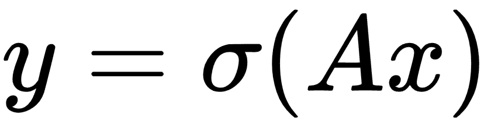

这里，权重由`A`乘以输入层`x`给出，然后通过激活函数`σ`，给出输出层`y`。

如果我们有一系列输入数据`x[1], x[2], x[3], ...`，我们可以调整完全连接的层以考虑先前的输入，如下所示：

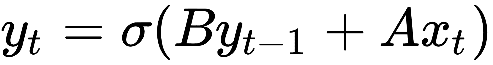

在此循环迭代之上获取下一个输入，我们希望得到概率分布输出，如下所示：


一旦我们有一个完整的序列输出`{S[1], S[2], S[3], ...}`，我们可以通过考虑最后的输出将目标视为数字或类别。有关通用架构的工作原理，请参见下图：


图 1：为了预测单个数字或类别，我们采用一系列输入（标记）并将最终输出视为预测输出

我们还可以将序列输出视为序列到序列模型中的输入：

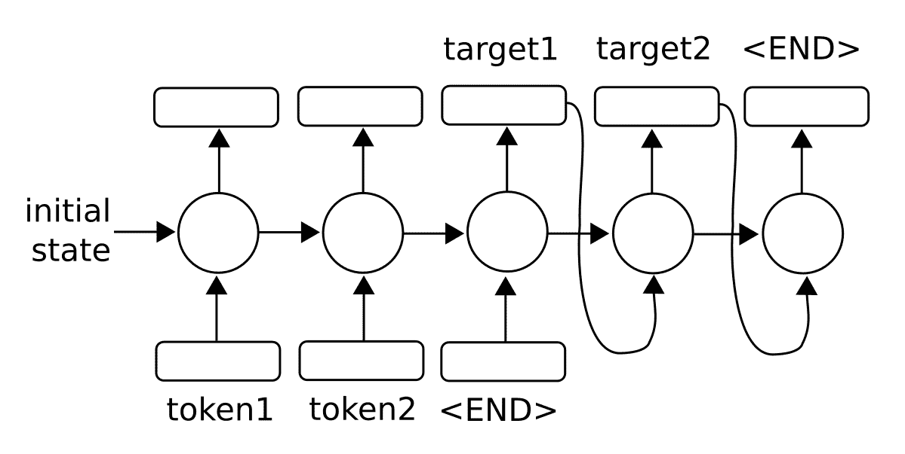

图 2：为了预测序列，我们还可以将输出反馈到模型中以生成多个输出

对于任意长序列，使用反向传播算法进行训练会产生长时间相关的梯度。因此，存在消失或爆炸的梯度问题。在本章的后面，我们将通过将 RNN 单元扩展为所谓的长短期记忆（LSTM）单元来探索该问题的解决方案。主要思想是 LSTM 单元引入另一个操作，称为门，它控制通过序列的信息流。我们将在后面的章节中详细介绍。

> 在处理 NLP 的 RNN 模型时，编码是用于描述将数据（NLP 中的字或字符）转换为数字 RNN 特征的过程的术语。术语解码是将 RNN 数字特征转换为输出字或字符的过程。

# 为垃圾邮件预测实现 RNN

首先，我们将应用标准 RNN 单元来预测奇异数值输出，即垃圾邮件概率。

## 准备

在此秘籍中，我们将在 TensorFlow 中实现标准 RNN，以预测短信是垃圾邮件还是非垃圾邮件。我们将使用 UCI 的 ML 仓库中的 SMS 垃圾邮件收集数据集。我们将用于预测的架构将是来自嵌入文本的输入 RNN 序列，我们将最后的 RNN 输出作为垃圾邮件或非垃圾邮件（1 或 0）的预测。

## 操作步骤

1.  我们首先加载此脚本所需的库：

```py
import os 
import re 
import io 
import requests 
import numpy as np 
import matplotlib.pyplot as plt 
import tensorflow as tf 
from zipfile import ZipFile 
```

1.  接下来，我们启动图会话并设置 RNN 模型参数。我们将通过`20`周期以`250`的批量大小运行数据。我们将考虑的每个文本的最大长度是`25`字；我们将更长的文本剪切为`25`或零填充短文本。 RNN 将是`10`单元。我们只考虑在词汇表中出现至少 10 次的单词，并且每个单词都将嵌入到可训练的大小`50`中。丢弃率将是我们可以在训练期间`0.5`或评估期间`1.0`设置的占位符：

```py
sess = tf.Session() 
epochs = 20 
batch_size = 250 
max_sequence_length = 25 
rnn_size = 10 
embedding_size = 50 
min_word_frequency = 10 
learning_rate = 0.0005 
dropout_keep_prob = tf.placeholder(tf.float32) 
```

1.  现在我们获取 SMS 文本数据。首先，我们检查它是否已经下载，如果是，请在文件中读取。否则，我们下载数据并保存：

```py
data_dir = 'temp' 
data_file = 'text_data.txt' 
if not os.path.exists(data_dir): 
   os.makedirs(data_dir) 
if not os.path.isfile(os.path.join(data_dir, data_file)): 
    zip_url = 'http://archive.ics.uci.edu/ml/machine-learning-databases/00228/smsspamcollection.zip' 
    r = requests.get(zip_url) 
    z = ZipFile(io.BytesIO(r.content)) 
    file = z.read('SMSSpamCollection') 
    # Format Data 
    text_data = file.decode() 
    text_data = text_data.encode('ascii',errors='ignore') 
    text_data = text_data.decode().split('\n') 
    # Save data to text file 
    with open(os.path.join(data_dir, data_file), 'w') as file_conn: 
        for text in text_data: 
            file_conn.write("{}\n".format(text)) 
else: 
    # Open data from text file 
    text_data = [] 
    with open(os.path.join(data_dir, data_file), 'r') as file_conn: 
        for row in file_conn: 
            text_data.append(row) 
    text_data = text_data[:-1] 
text_data = [x.split('\t') for x in text_data if len(x)>=1] 
[text_data_target, text_data_train] = [list(x) for x in zip(*text_data)] 
```

1.  为了减少我们的词汇量，我们将通过删除特殊字符和额外的空格来清理输入文本，并将所有内容放在小写中：

```py
def clean_text(text_string):
    text_string = re.sub(r'([^sw]|_|[0-9])+', '', text_string)
    text_string = " ".join(text_string.split())
    text_string = text_string.lower()
    return text_string

# Clean texts
text_data_train = [clean_text(x) for x in text_data_train]
```

> 请注意，我们的清洁步骤会删除特殊字符作为替代方案，我们也可以用空格替换它们。理想情况下，这取决于数据集的格式。

1.  现在我们使用 TensorFlow 的内置词汇处理器函数处理文本。这会将文本转换为适当的索引列表：

```py
vocab_processor = tf.contrib.learn.preprocessing.VocabularyProcessor(max_sequence_length,    min_frequency=min_word_frequency) 
text_processed = np.array(list(vocab_processor.fit_transform(text_data_train))) 
```

> 请注意，`contrib.learn.preprocessing`中的函数目前已弃用（使用当前的 TensorFlow 版本，1.10）。目前的替换建议 TensorFlow 预处理包仅在 Python2 中运行。将 TensorFlow 预处理移至 Python3 的工作目前正在进行中，并将取代前两行。请记住，所有当前和最新的代码都可以在[这个 GitHub 页面](https://www.github.com/nfmcclure/tensorflow_cookbook)，和 [Packt 仓库](https://github.com/PacktPublishing/TensorFlow-Machine-Learning-Cookbook-Second-Edition)找到。

1.  接下来，我们打乱数据以使其随机化：

```py
text_processed = np.array(text_processed) 
text_data_target = np.array([1 if x=='ham' else 0 for x in text_data_target]) 
shuffled_ix = np.random.permutation(np.arange(len(text_data_target))) 
x_shuffled = text_processed[shuffled_ix] 
y_shuffled = text_data_target[shuffled_ix] 
```

1.  我们还将数据拆分为 80-20 训练测试数据集：

```py
ix_cutoff = int(len(y_shuffled)*0.80) 
x_train, x_test = x_shuffled[:ix_cutoff], x_shuffled[ix_cutoff:] 
y_train, y_test = y_shuffled[:ix_cutoff], y_shuffled[ix_cutoff:] 
vocab_size = len(vocab_processor.vocabulary_) 
print("Vocabulary Size: {:d}".format(vocab_size)) 
print("80-20 Train Test split: {:d} -- {:d}".format(len(y_train), len(y_test)))
```

> 对于这个秘籍，我们不会进行任何超参数调整。如果读者朝这个方向前进，请记住在继续之前将数据集拆分为训练测试验证集。一个很好的选择是 Scikit-learn 函数`model_selection.train_test_split()`。

1.  接下来，我们声明图占位符。`x`输入将是一个大小为`[None, max_sequence_length]`的占位符，它将是根据文本消息允许的最大字长的批量大小。对于非垃圾邮件或垃圾邮件，`y_output`占位符只是一个 0 或 1 的整数：

```py
x_data = tf.placeholder(tf.int32, [None, max_sequence_length]) 
y_output = tf.placeholder(tf.int32, [None]) 
```

1.  我们现在为`x`输入数据创建嵌入矩阵和嵌入查找操作：

```py
embedding_mat = tf.Variable(tf.random_uniform([vocab_size, embedding_size], -1.0, 1.0)) 
embedding_output = tf.nn.embedding_lookup(embedding_mat, x_data) 
```

1.  我们将模型声明如下。首先，我们初始化一种要使用的 RNN 单元（RNN 大小为 10）。然后我们通过使其成为动态 RNN 来创建 RNN 序列。然后我们将退出添加到 RNN：

```py
cell = tf.nn.rnn_cell.BasicRNNCell(num_units = rnn_size)
output, state = tf.nn.dynamic_rnn(cell, embedding_output, dtype=tf.float32)
output = tf.nn.dropout(output, dropout_keep_prob)
```

> 注意，动态 RNN 允许可变长度序列。即使我们在这个例子中使用固定的序列长度，通常最好在 TensorFlow 中使用`dynamic_rnn`有两个主要原因。一个原因是，在实践中，动态 RNN 实际上运行速度更快；第二个是，如果我们选择，我们可以通过 RNN 运行不同长度的序列。

1.  现在要得到我们的预测，我们必须重新安排 RNN 并切掉最后一个输出：

```py
output = tf.transpose(output, [1, 0, 2]) 
last = tf.gather(output, int(output.get_shape()[0]) - 1) 
```

1.  为了完成 RNN 预测，我们通过完全连接的网络层将`rnn_size`输出转换为两个类别输出：

```py
weight = tf.Variable(tf.truncated_normal([rnn_size, 2], stddev=0.1)) 
bias = tf.Variable(tf.constant(0.1, shape=[2])) 
logits_out = tf.nn.softmax(tf.matmul(last, weight) + bias) 
```

1.  我们接下来宣布我们的损失函数。请记住，当使用 TensorFlow 中的`sparse_softmax`函数时，目标必须是整数索引（类型为`int`），并且对率必须是浮点数：

```py
losses = tf.nn.sparse_softmax_cross_entropy_with_logits(logits=logits_out, labels=y_output) 
loss = tf.reduce_mean(losses) 
```

1.  我们还需要一个精确度函数，以便我们可以比较测试和训练集上的算法：

```py
accuracy = tf.reduce_mean(tf.cast(tf.equal(tf.argmax(logits_out, 1), tf.cast(y_output, tf.int64)), tf.float32)) 
```

1.  接下来，我们创建优化函数并初始化模型变量：

```py
optimizer = tf.train.RMSPropOptimizer(learning_rate)
train_step = optimizer.minimize(loss)
init = tf.global_variables_initializer()
sess.run(init) 
```

1.  现在我们可以开始循环遍历数据并训练模型。在多次循环数据时，最好在每个周期对数据进行洗牌以防止过度训练：

```py
train_loss = [] 
test_loss = [] 
train_accuracy = [] 
test_accuracy = [] 
# Start training 
for epoch in range(epochs): 
    # Shuffle training data 
    shuffled_ix = np.random.permutation(np.arange(len(x_train))) 
    x_train = x_train[shuffled_ix] 
    y_train = y_train[shuffled_ix] 
    num_batches = int(len(x_train)/batch_size) + 1 
    for i in range(num_batches): 
        # Select train data 
        min_ix = i * batch_size 
        max_ix = np.min([len(x_train), ((i+1) * batch_size)]) 
        x_train_batch = x_train[min_ix:max_ix] 
        y_train_batch = y_train[min_ix:max_ix] 

        # Run train step 
        train_dict = {x_data: x_train_batch, y_output: y_train_batch, dropout_keep_prob:0.5} 
        sess.run(train_step, feed_dict=train_dict) 

    # Run loss and accuracy for training 
    temp_train_loss, temp_train_acc = sess.run([loss, accuracy], feed_dict=train_dict) 
    train_loss.append(temp_train_loss) 
    train_accuracy.append(temp_train_acc) 

    # Run Eval Step 
    test_dict = {x_data: x_test, y_output: y_test, dropout_keep_prob:1.0} 
    temp_test_loss, temp_test_acc = sess.run([loss, accuracy], feed_dict=test_dict) 
    test_loss.append(temp_test_loss) 
    test_accuracy.append(temp_test_acc) 
    print('Epoch: {}, Test Loss: {:.2}, Test Acc: {:.2}'.format(epoch+1, temp_test_loss, temp_test_acc)) 
```

1.  这产生以下输出：

```py
Vocabulary Size: 933 
80-20 Train Test split: 4459 -- 1115 
Epoch: 1, Test Loss: 0.59, Test Acc: 0.83 
Epoch: 2, Test Loss: 0.58, Test Acc: 0.83 
...
```

```py
Epoch: 19, Test Loss: 0.46, Test Acc: 0.86 
Epoch: 20, Test Loss: 0.46, Test Acc: 0.86 
```

1.  以下是绘制训练/测试损失和准确率的代码：

```py
epoch_seq = np.arange(1, epochs+1) 
plt.plot(epoch_seq, train_loss, 'k--', label='Train Set') 
plt.plot(epoch_seq, test_loss, 'r-', label='Test Set') 
plt.title('Softmax Loss') 
plt.xlabel('Epochs') 
plt.ylabel('Softmax Loss') 
plt.legend(loc='upper left') 
plt.show() 
# Plot accuracy over time 
plt.plot(epoch_seq, train_accuracy, 'k--', label='Train Set') 
plt.plot(epoch_seq, test_accuracy, 'r-', label='Test Set') 
plt.title('Test Accuracy') 
plt.xlabel('Epochs') 
plt.ylabel('Accuracy') 
plt.legend(loc='upper left') 
plt.show() 
```

## 工作原理

在这个秘籍中，我们创建了一个 RNN 到类别的模型来预测 SMS 文本是垃圾邮件还是非垃圾邮件。我们在测试装置上实现了大约 86% 的准确率。以下是测试和训练集的准确率和损失图：

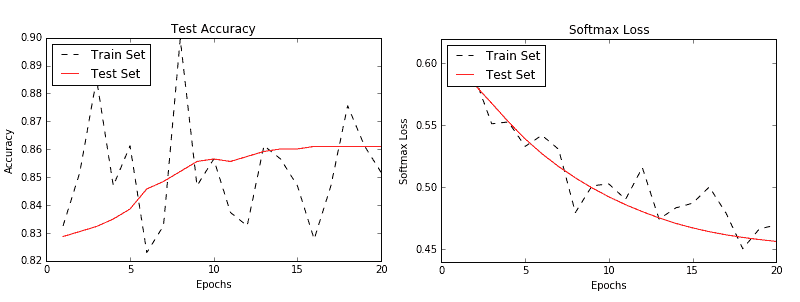

图 3：训练和测试集的准确率（左）和损失（右）

## 更多

强烈建议您多次浏览训练数据集以获取顺序数据（这也建议用于非顺序数据）。每次传递数据都称为周期。此外，在每个周期之前对数据进行混洗是非常常见的（并且强烈推荐），以最小化数据顺序对训练的影响。

# 实现 LSTM 模型

我们将扩展我们的 RNN 模型，以便通过在此秘籍中引入 LSTM 单元来使用更长的序列。

## 准备

长短期记忆（LSTM）是传统 RNN 的变体。 LSTM 是一种解决可变长度 RNN 所具有的消失/爆炸梯度问题的方法。为了解决这个问题，LSTM 单元引入了一个内部遗忘门，它可以修改从一个单元到下一个单元的信息流。为了概念化它的工作原理，我们将逐步介绍一个无偏置的 LSTM 方程式。第一步与常规 RNN 相同：

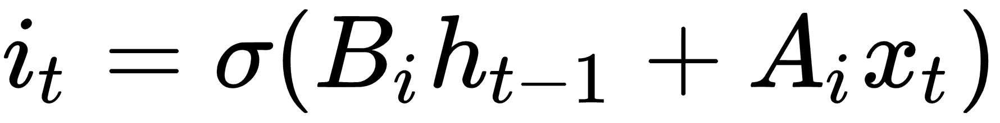

为了确定我们想要忘记或通过的值，我们将如下评估候选值。这些值通常称为存储单元：

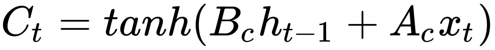

现在我们用一个遗忘矩阵修改候选存储单元，其计算方法如下：

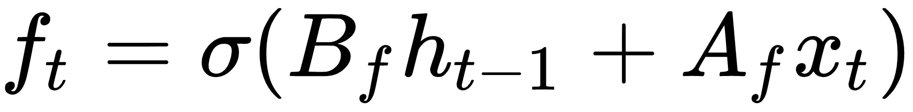

我们现在将遗忘存储器与先前的存储器步骤相结合，并将其添加到候选存储器单元以获得新的存储器值：

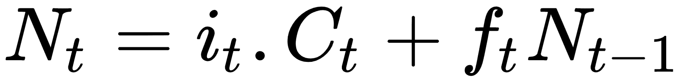

现在我们将所有内容组合起来以获取单元格的输出：

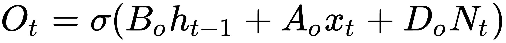

然后，对于下一次迭代，我们更新`h`如下：

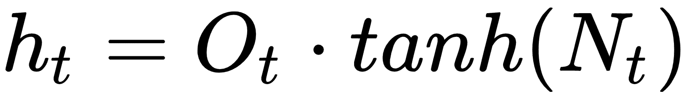

LSTM 的想法是通过基于输入到单元的信息可以忘记或修改的单元具有自我调节的信息流。

> 在这里使用 TensorFlow 的一个好处是我们不必跟踪这些操作及其相应的反向传播属性。 TensorFlow 将跟踪这些并根据我们的损失函数，优化器和学习率指定的梯度自动更新模型变量。

对于这个秘籍，我们将使用具有 LSTM 单元的序列 RNN 来尝试预测接下来的单词，对莎士比亚的作品进行训练。为了测试我们的工作方式，我们将提供模型候选短语，例如`thou art more`，并查看模型是否可以找出短语后面应该包含的单词。

## 操作步骤

1.  首先，我们为脚本加载必要的库：

```py
import os 
import re 
import string 
import requests 
import numpy as np 
import collections 
import random 
import pickle 
import matplotlib.pyplot as plt 
import tensorflow as tf 
```

1.  接下来，我们启动图会话并设置 RNN 参数：

```py
sess = tf.Session()

# Set RNN Parameters 
min_word_freq = 5 
rnn_size = 128 
epochs = 10 
batch_size = 100 
learning_rate = 0.001 
training_seq_len = 50  
embedding_size = rnn_size 
save_every = 500 
eval_every = 50 
prime_texts = ['thou art more', 'to be or not to', 'wherefore art thou'] 
```

1.  我们设置数据和模型文件夹和文件名，同时声明要删除的标点符号。我们希望保留连字符和撇号，因为莎士比亚经常使用它们来组合单词和音节：

```py
data_dir = 'temp' 
data_file = 'shakespeare.txt' 
model_path = 'shakespeare_model' 
full_model_dir = os.path.join(data_dir, model_path) 
# Declare punctuation to remove, everything except hyphens and apostrophe's 
punctuation = string.punctuation 
punctuation = ''.join([x for x in punctuation if x not in ['-', "'"]]) 
```

1.  接下来，我们获取数据。如果数据文件不存在，我们下载并保存莎士比亚文本。如果确实存在，我们加载数据：

```py
if not os.path.exists(full_model_dir): 
    os.makedirs(full_model_dir) 
# Make data directory 
if not os.path.exists(data_dir): 
    os.makedirs(data_dir) 
print('Loading Shakespeare Data') 
# Check if file is downloaded. 
if not os.path.isfile(os.path.join(data_dir, data_file)): 
    print('Not found, downloading Shakespeare texts from www.gutenberg.org') 
    shakespeare_url = 'http://www.gutenberg.org/cache/epub/100/pg100.txt' 
    # Get Shakespeare text 
    response = requests.get(shakespeare_url) 
    shakespeare_file = response.content 
    # Decode binary into string 
    s_text = shakespeare_file.decode('utf-8') 
    # Drop first few descriptive paragraphs. 
    s_text = s_text[7675:] 
    # Remove newlines 
    s_text = s_text.replace('\r\n', '') 
    s_text = s_text.replace('\n', '') 

    # Write to file 
    with open(os.path.join(data_dir, data_file), 'w') as out_conn: 
        out_conn.write(s_text) 
else: 
    # If file has been saved, load from that file 
    with open(os.path.join(data_dir, data_file), 'r') as file_conn: 
        s_text = file_conn.read().replace('\n', '') 
```

1.  我们通过删除标点符号和额外的空格来清理莎士比亚的文本：

```py
s_text = re.sub(r'[{}]'.format(punctuation), ' ', s_text) 
s_text = re.sub('s+', ' ', s_text ).strip().lower() 
```

1.  我们现在处理创建要使用的莎士比亚词汇。我们创建一个函数，它将返回两个字典（单词到索引和索引到单词），其中的单词出现的频率超过指定的频率：

```py
def build_vocab(text, min_word_freq): 
    word_counts = collections.Counter(text.split(' ')) 
    # limit word counts to those more frequent than cutoff 
    word_counts = {key:val for key, val in word_counts.items() if val>min_word_freq} 
    # Create vocab --> index mapping 
    words = word_counts.keys() 
    vocab_to_ix_dict = {key:(ix+1) for ix, key in enumerate(words)} 
    # Add unknown key --> 0 index 
    vocab_to_ix_dict['unknown']=0 
    # Create index --> vocab mapping 
    ix_to_vocab_dict = {val:key for key,val in vocab_to_ix_dict.items()} 

    return ix_to_vocab_dict, vocab_to_ix_dict 
ix2vocab, vocab2ix = build_vocab(s_text, min_word_freq) 
vocab_size = len(ix2vocab) + 1
```

> 请注意，在处理文本时，我们必须小心索引值为零的单词。我们应该保存填充的零值，也可能保存未知单词。

1.  现在我们有了词汇量，我们将莎士比亚的文本变成了一系列索引：

```py
s_text_words = s_text.split(' ') 
s_text_ix = [] 
for ix, x in enumerate(s_text_words): 
    try: 
        s_text_ix.append(vocab2ix[x]) 
    except: 
        s_text_ix.append(0) 
s_text_ix = np.array(s_text_ix) 
```

1.  在本文中，我们将展示如何在类对象中创建模型。这对我们很有帮助，因为我们希望使用相同的模型（具有相同的权重）来批量训练并从示例文本生成文本。如果没有采用内部抽样方法的类，这将很难做到。理想情况下，此类代码应位于单独的 Python 文件中，我们可以在此脚本的开头导入该文件：

```py
class LSTM_Model(): 
    def __init__(self, rnn_size, batch_size, learning_rate, 
                 training_seq_len, vocab_size, infer =False): 
        self.rnn_size = rnn_size 
        self.vocab_size = vocab_size 
        self.infer = infer 
        self.learning_rate = learning_rate 

        if infer: 
            self.batch_size = 1 
            self.training_seq_len = 1 
        else: 
            self.batch_size = batch_size 
            self.training_seq_len = training_seq_len 

        self.lstm_cell = tf.nn.rnn_cell.BasicLSTMCell(rnn_size) 
        self.initial_state = self.lstm_cell.zero_state(self.batch_size, tf.float32) 

        self.x_data = tf.placeholder(tf.int32, [self.batch_size, self.training_seq_len]) 
        self.y_output = tf.placeholder(tf.int32, [self.batch_size, self.training_seq_len]) 

        with tf.variable_scope('lstm_vars'): 
            # Softmax Output Weights 
            W = tf.get_variable('W', [self.rnn_size, self.vocab_size], tf.float32, tf.random_normal_initializer()) 
            b = tf.get_variable('b', [self.vocab_size], tf.float32, tf.constant_initializer(0.0)) 

            # Define Embedding 
            embedding_mat = tf.get_variable('embedding_mat', [self.vocab_size, self.rnn_size], tf.float32, tf.random_normal_initializer()) 

            embedding_output = tf.nn.embedding_lookup(embedding_mat, self.x_data)
            rnn_inputs = tf.split(embedding_output, num_or_size_splits=self.training_seq_len, axis=1) 
            rnn_inputs_trimmed = [tf.squeeze(x, [1]) for x in rnn_inputs] 

        # If we are inferring (generating text), we add a 'loop' function 
        # Define how to get the i+1 th input from the i th output 
        def inferred_loop(prev, count): 
            prev_transformed = tf.matmul(prev, W) + b 
            prev_symbol = tf.stop_gradient(tf.argmax(prev_transformed, 1)) 
            output = tf.nn.embedding_lookup(embedding_mat, prev_symbol) 
            return output 

        decoder = tf.nn.seq2seq.rnn_decoder 
        outputs, last_state = decoder(rnn_inputs_trimmed, 
                                      self.initial_state, 
                                      self.lstm_cell, 
                                      loop_function=inferred_loop if infer else None) 
        # Non inferred outputs 
        output = tf.reshape(tf.concat(1, outputs), [-1, self.rnn_size]) 
        # Logits and output 
        self.logit_output = tf.matmul(output, W) + b 
        self.model_output = tf.nn.softmax(self.logit_output) 
        loss_fun = tf.contrib.legacy_seq2seq.sequence_loss_by_example
        loss = loss_fun([self.logit_output],[tf.reshape(self.y_output, [-1])], 
                [tf.ones([self.batch_size * self.training_seq_len])], 
                self.vocab_size) 
        self.cost = tf.reduce_sum(loss) / (self.batch_size * self.training_seq_len) 
        self.final_state = last_state 
        gradients, _ = tf.clip_by_global_norm(tf.gradients(self.cost, tf.trainable_variables()), 4.5) 
        optimizer = tf.train.AdamOptimizer(self.learning_rate) 
        self.train_op = optimizer.apply_gradients(zip(gradients, tf.trainable_variables())) 

    def sample(self, sess, words=ix2vocab, vocab=vocab2ix, num=10, prime_text='thou art'): 
        state = sess.run(self.lstm_cell.zero_state(1, tf.float32)) 
        word_list = prime_text.split() 
        for word in word_list[:-1]: 
            x = np.zeros((1, 1)) 
            x[0, 0] = vocab[word] 
            feed_dict = {self.x_data: x, self.initial_state:state} 
            [state] = sess.run([self.final_state], feed_dict=feed_dict) 
        out_sentence = prime_text 
        word = word_list[-1] 
        for n in range(num): 
            x = np.zeros((1, 1)) 
            x[0, 0] = vocab[word] 
            feed_dict = {self.x_data: x, self.initial_state:state} 
            [model_output, state] = sess.run([self.model_output, self.final_state], feed_dict=feed_dict) 
            sample = np.argmax(model_output[0]) 
            if sample == 0: 
                break 
            word = words[sample] 
            out_sentence = out_sentence + ' ' + word 
        return out_sentence 
```

1.  现在我们将声明 LSTM 模型以及测试模型。我们将在变量范围内执行此操作，并告诉范围我们将重用测试 LSTM 模型的变量：

```py
with tf.variable_scope('lstm_model', reuse=tf.AUTO_REUSE) as scope: 
    # Define LSTM Model 
    lstm_model = LSTM_Model(rnn_size, batch_size, learning_rate, 
                     training_seq_len, vocab_size) 
    scope.reuse_variables() 
    test_lstm_model = LSTM_Model(rnn_size, batch_size, learning_rate, 
                     training_seq_len, vocab_size, infer=True) 
```

1.  我们创建一个保存操作，并将输入文本拆分为相等的批量大小的块。然后我们初始化模型的变量：

```py
saver = tf.train.Saver() 
# Create batches for each epoch 
num_batches = int(len(s_text_ix)/(batch_size * training_seq_len)) + 1 
# Split up text indices into subarrays, of equal size 
batches = np.array_split(s_text_ix, num_batches) 
# Reshape each split into [batch_size, training_seq_len] 
batches = [np.resize(x, [batch_size, training_seq_len]) for x in batches] 
# Initialize all variables 
init = tf.global_variables_initializer() 
sess.run(init) 
```

1.  我们现在可以遍历我们的周期，在每个周期开始之前对数据进行混洗。我们数据的目标只是相同的数据，但是移动了 1（使用`numpy.roll()`函数）：

```py
train_loss = [] 
iteration_count = 1 
for epoch in range(epochs): 
    # Shuffle word indices 
    random.shuffle(batches) 
    # Create targets from shuffled batches 
    targets = [np.roll(x, -1, axis=1) for x in batches] 
    # Run a through one epoch 
    print('Starting Epoch #{} of {}.'.format(epoch+1, epochs)) 
    # Reset initial LSTM state every epoch 
    state = sess.run(lstm_model.initial_state) 
    for ix, batch in enumerate(batches): 
        training_dict = {lstm_model.x_data: batch, lstm_model.y_output: targets[ix]} 
        c, h = lstm_model.initial_state 
        training_dict[c] = state.c 
        training_dict[h] = state.h 

        temp_loss, state, _ = sess.run([lstm_model.cost, lstm_model.final_state, lstm_model.train_op], feed_dict=training_dict) 
        train_loss.append(temp_loss) 

        # Print status every 10 gens 
        if iteration_count % 10 == 0: 
            summary_nums = (iteration_count, epoch+1, ix+1, num_batches+1, temp_loss) 
            print('Iteration: {}, Epoch: {}, Batch: {} out of {}, Loss: {:.2f}'.format(*summary_nums)) 

        # Save the model and the vocab 
        if iteration_count % save_every == 0: 
            # Save model 
            model_file_name = os.path.join(full_model_dir, 'model') 
            saver.save(sess, model_file_name, global_step = iteration_count) 
            print('Model Saved To: {}'.format(model_file_name)) 
            # Save vocabulary 
            dictionary_file = os.path.join(full_model_dir, 'vocab.pkl') 
            with open(dictionary_file, 'wb') as dict_file_conn: 
                pickle.dump([vocab2ix, ix2vocab], dict_file_conn) 

        if iteration_count % eval_every == 0: 
            for sample in prime_texts: 
                print(test_lstm_model.sample(sess, ix2vocab, vocab2ix, num=10, prime_text=sample)) 

        iteration_count += 1 
```

1.  这产生以下输出：

```py
Loading Shakespeare Data 
Cleaning Text 
Building Shakespeare Vocab 
Vocabulary Length = 8009 
Starting Epoch #1 of 10\. 
Iteration: 10, Epoch: 1, Batch: 10 out of 182, Loss: 10.37 
Iteration: 20, Epoch: 1, Batch: 20 out of 182, Loss: 9.54 
... 
Iteration: 1790, Epoch: 10, Batch: 161 out of 182, Loss: 5.68 
Iteration: 1800, Epoch: 10, Batch: 171 out of 182, Loss: 6.05 
thou art more than i am a 
to be or not to the man i have 
wherefore art thou art of the long 
Iteration: 1810, Epoch: 10, Batch: 181 out of 182, Loss: 5.99 
```

1.  最后，以下是我们如何绘制历史上的训练损失：

```py
plt.plot(train_loss, 'k-') 
plt.title('Sequence to Sequence Loss') 
plt.xlabel('Generation') 
plt.ylabel('Loss') 
plt.show() 
```

This results in the following plot of our loss values:

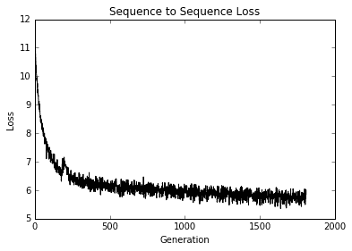

图 4：模型所有代的序列到序列损失

## 工作原理

在这个例子中，我们基于莎士比亚词汇构建了一个带有 LSTM 单元的 RNN 模型来预测下一个单词。可以采取一些措施来改进模型，可能会增加序列大小，具有衰减的学习率，或者训练模型以获得更多的周期。

## 更多

为了抽样，我们实现了一个贪婪的采样器。贪婪的采样器可能会一遍又一遍地重复相同的短语；例如，他们可能会卡住`for the for the` `for the....`为了防止这种情况，我们还可以实现一种更随机的采样方式，可能是根据输出的对数或概率分布制作加权采样器。

# 堆叠多个 LSTM 层

正如我们可以增加神经网络或 CNN 的深度，我们可以增加 RNN 网络的深度。在这个秘籍中，我们应用了一个三层深度的 LSTM 来改进我们的莎士比亚语言生成。

## 准备

我们可以通过将它们叠加在一起来增加循环神经网络的深度。从本质上讲，我们将获取目标输出并将其输入另一个网络。

要了解这对于两层的工作原理，请参见下图：

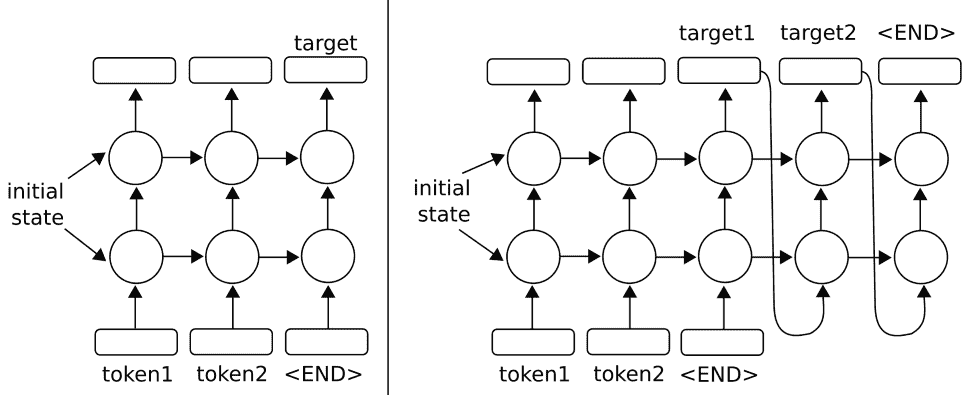

图 5：在上图中，我们扩展了单层 RNN，使它们具有两层。对于原始的单层版本，请参阅上一章简介中的绘图。左侧架构说明了使用多层 RNN 预测输出序列中的一个输出的方法。正确的架构显示了使用多层 RNN 预测输出序列的方法，该输出序列使用输出作为输入

TensorFlow 允许使用`MultiRNNCell()`函数轻松实现多个层，该函数接受 RNN 单元列表。有了这种行为，很容易用`MultiRNNCell([rnn_cell(num_units) for n in num_layers])`单元格从 Python 中的一个单元格创建多层 RNN。

对于这个秘籍，我们将执行我们在之前的秘籍中执行的相同的莎士比亚预测。将有两个变化：第一个变化将是具有三个堆叠的 LSTM 模型而不是仅一个层，第二个变化将是进行字符级预测而不是单词。进行字符级预测会将我们潜在的词汇量大大减少到只有 40 个字符（26 个字母，10 个数字，1 个空格和 3 个特殊字符）。

## 操作步骤

我们将说明本节中的代码与上一节的不同之处，而不是重新使用所有相同的代码。有关完整代码，请参阅 [GitHub 仓库](https://github.com/nfmcclure/tensorflow_cookbook)或 [Packt 仓库](https://github.com/PacktPublishing/TensorFlow-Machine-Learning-Cookbook-Second-Edition)。

1.  我们首先需要设置模型的层数。我们将此作为参数放在脚本的开头，并使用其他模型参数：

```py
num_layers = 3 
min_word_freq = 5
```

```py
rnn_size = 128 
epochs = 10 
```

1.  第一个主要变化是我们将按字符加载，处理和提供文本，而不是按字词加载。为了实现这一点，在清理文本之后，我们可以使用 Python 的`list()`命令逐个字符地分隔整个文本：

```py
s_text = re.sub(r'[{}]'.format(punctuation), ' ', s_text) 
s_text = re.sub('s+', ' ', s_text ).strip().lower() 
# Split up by characters 
char_list = list(s_text) 
```

1.  我们现在需要更改 LSTM 模型，使其具有多个层。我们接受`num_layers`变量并使用 TensorFlow 的`MultiRNNCell()`函数创建一个多层 RNN 模型，如下所示：

```py
class LSTM_Model(): 
    def __init__(self, rnn_size, num_layers, batch_size, learning_rate, 
                 training_seq_len, vocab_size, infer_sample=False): 
        self.rnn_size = rnn_size 
        self.num_layers = num_layers 
        self.vocab_size = vocab_size 
        self.infer_sample = infer_sample 
        self.learning_rate = learning_rate 
        ... 

        self.lstm_cell = tf.contrib.rnn.BasicLSTMCell(rnn_size)
        self.lstm_cell = tf.contrib.rnn.MultiRNNCell([self.lstm_cell for _ in range(self.num_layers)]) 
        self.initial_state = self.lstm_cell.zero_state(self.batch_size, tf.float32) 

        self.x_data = tf.placeholder(tf.int32, [self.batch_size, self.training_seq_len]) 
        self.y_output = tf.placeholder(tf.int32, [self.batch_size, self.training_seq_len])
```

> 请注意，TensorFlow 的`MultiRNNCell()`函数接受 RNN 单元列表。在这个项目中，RNN 层都是相同的，但您可以列出您希望堆叠在一起的任何 RNN 层。

1.  其他一切基本相同。在这里，我们可以看到一些训练输出：

```py
Building Shakespeare Vocab by Characters 
Vocabulary Length = 40 
Starting Epoch #1 of 10 
Iteration: 9430, Epoch: 10, Batch: 889 out of 950, Loss: 1.54 
Iteration: 9440, Epoch: 10, Batch: 899 out of 950, Loss: 1.46 
Iteration: 9450, Epoch: 10, Batch: 909 out of 950, Loss: 1.49 
thou art more than the  
to be or not to the serva 
wherefore art thou dost thou 
Iteration: 9460, Epoch: 10, Batch: 919 out of 950, Loss: 1.41 
Iteration: 9470, Epoch: 10, Batch: 929 out of 950, Loss: 1.45 
Iteration: 9480, Epoch: 10, Batch: 939 out of 950, Loss: 1.59 
Iteration: 9490, Epoch: 10, Batch: 949 out of 950, Loss: 1.42 
```

1.  以下是最终文本输出的示例：

```py
thou art more fancy with to be or not to be for be wherefore art thou art thou 
```

1.  最后，以下是我们如何绘制几代的训练损失：

```py
plt.plot(train_loss, 'k-') 
plt.title('Sequence to Sequence Loss') 
plt.xlabel('Generation') 
plt.ylabel('Loss') 
plt.show() 
```

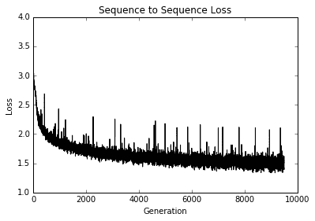

图 6：多层 LSTM 莎士比亚模型的训练损失与世代的关系图

## 工作原理

TensorFlow 只需一个 RNN 单元列表即可轻松将 RNN 层扩展到多个层。对于这个秘籍，我们使用与上一个秘籍相同的莎士比亚数据，但是用字符而不是单词处理它。我们通过三层 LSTM 模型来生成莎士比亚文本。我们可以看到，在仅仅 10 个周期之后，我们就能够以文字的形式产生古老的英语。

# 创建序列到序列模型

由于我们使用的每个 RNN 单元也都有输出，我们可以训练 RNN 序列来预测其他可变长度的序列。对于这个秘籍，我们将利用这一事实创建一个英语到德语的翻译模型。

## 准备

对于这个秘籍，我们将尝试构建一个语言翻译模型，以便从英语翻译成德语。

TensorFlow 具有用于序列到序列训练的内置模型类。我们将说明如何在下载的英语 - 德语句子上训练和使用它。我们将使用的数据来自 [www.manythings.org](http://www.manythings.org/) 的编译 zip 文件，该文件汇编了 [Tatoeba 项目](http://tatoeba.org/home) 的数据。这些数据是制表符分隔的英语 - 德语句子翻译；例如，一行可能包含句子`hello. /t hallo`。该数据包含数千种不同长度的句子。

此部分的代码已升级为使用 [TensorFlow 官方仓库提供的神经机器翻译模型](https://github.com/tensorflow/nmt)。

该项目将向您展示如何下载数据，使用，修改和添加到超参数，以及配置您自己的数据以使用项目文件。

虽然官方教程向您展示了如何通过命令行执行此操作，但本教程将向您展示如何使用提供的内部代码从头开始训练您自己的模型。

## 操作步骤

1.  我们首先加载必要的库：

```py
import os
import re
import sys
import json
import math
import time
import string
import requests
import io
import numpy as np
import collections
import random
import pickle
import string
import matplotlib.pyplot as plt
import tensorflow as tf
from zipfile import ZipFile
from collections import Counter
from tensorflow.python.ops import lookup_ops
from tensorflow.python.framework import ops
ops.reset_default_graph()

local_repository = 'temp/seq2seq'
```

1.  以下代码块将整个 NMT 模型仓库导入`temp`文件夹：

```py
if not os.path.exists(local_repository):
 from git import Repo
 tf_model_repository = 'https://github.com/tensorflow/nmt/'
 Repo.clone_from(tf_model_repository, local_repository)
 sys.path.insert(0, 'temp/seq2seq/nmt/')

# May also try to use 'attention model' by importing the attention model:
# from temp.seq2seq.nmt import attention_model as attention_model
from temp.seq2seq.nmt import model as model
from temp.seq2seq.nmt.utils import vocab_utils as vocab_utils
import temp.seq2seq.nmt.model_helper as model_helper
import temp.seq2seq.nmt.utils.iterator_utils as iterator_utils
import temp.seq2seq.nmt.utils.misc_utils as utils
import temp.seq2seq.nmt.train as train
```

1.  接下来，我们设置一些关于词汇量大小，我们将删除的标点符号以及数据存储位置的参数：

```py
# Model Parameters
vocab_size = 10000
punct = string.punctuation

# Data Parameters
data_dir = 'temp'
data_file = 'eng_ger.txt'
model_path = 'seq2seq_model'
full_model_dir = os.path.join(data_dir, model_path)
```

1.  我们将使用 TensorFlow 提供的超参数格式。这种类型的参数存储（在外部`json`或`xml`文件中）允许我们以编程方式迭代不同类型的架构（在不同的文件中）。对于本演示，我们将使用提供给我们的`wmt16.json`并进行一些更改：

```py
# Load hyper-parameters for translation model. (Good defaults are provided in Repository).
hparams = tf.contrib.training.HParams()
param_file = 'temp/seq2seq/nmt/standard_hparams/wmt16.json'
# Can also try: (For different architectures)
# 'temp/seq2seq/nmt/standard_hparams/iwslt15.json'
# 'temp/seq2seq/nmt/standard_hparams/wmt16_gnmt_4_layer.json',
# 'temp/seq2seq/nmt/standard_hparams/wmt16_gnmt_8_layer.json',

with open(param_file, "r") as f:
    params_json = json.loads(f.read())

for key, value in params_json.items():
    hparams.add_hparam(key, value)
hparams.add_hparam('num_gpus', 0)
hparams.add_hparam('num_encoder_layers', hparams.num_layers)
hparams.add_hparam('num_decoder_layers', hparams.num_layers)
hparams.add_hparam('num_encoder_residual_layers', 0)
hparams.add_hparam('num_decoder_residual_layers', 0)
hparams.add_hparam('init_op', 'uniform')
hparams.add_hparam('random_seed', None)
hparams.add_hparam('num_embeddings_partitions', 0)
hparams.add_hparam('warmup_steps', 0)
hparams.add_hparam('length_penalty_weight', 0)
hparams.add_hparam('sampling_temperature', 0.0)
hparams.add_hparam('num_translations_per_input', 1)
hparams.add_hparam('warmup_scheme', 't2t')
hparams.add_hparam('epoch_step', 0)
hparams.num_train_steps = 5000

# Not use any pretrained embeddings
hparams.add_hparam('src_embed_file', '')
hparams.add_hparam('tgt_embed_file', '')
hparams.add_hparam('num_keep_ckpts', 5)
hparams.add_hparam('avg_ckpts', False)

# Remove attention
hparams.attention = None 
```

1.  如果模型和数据目录尚不存在，请创建它们：

```py
# Make Model Directory
if not os.path.exists(full_model_dir):
    os.makedirs(full_model_dir)

# Make data directory
if not os.path.exists(data_dir):
    os.makedirs(data_dir)
```

1.  现在我们删除标点符号并将翻译数据拆分为英语和德语句子的单词列表：

```py
print('Loading English-German Data')
# Check for data, if it doesn't exist, download it and save it
if not os.path.isfile(os.path.join(data_dir, data_file)):
    print('Data not found, downloading Eng-Ger sentences from www.manythings.org')
    sentence_url = 'http://www.manythings.org/anki/deu-eng.zip'
    r = requests.get(sentence_url)
    z = ZipFile(io.BytesIO(r.content))
    file = z.read('deu.txt')
    # Format Data
    eng_ger_data = file.decode('utf-8')
    eng_ger_data = eng_ger_data.encode('ascii', errors='ignore')
    eng_ger_data = eng_ger_data.decode().split('\n')
    # Write to file
    with open(os.path.join(data_dir, data_file), 'w') as out_conn:
        for sentence in eng_ger_data:
            out_conn.write(sentence + '\n')
else:
    eng_ger_data = []
    with open(os.path.join(data_dir, data_file), 'r') as in_conn:
        for row in in_conn:
            eng_ger_data.append(row[:-1])
print('Done!') 
```

1.  现在我们删除英语和德语句子的标点符号：

```py
# Remove punctuation
eng_ger_data = [''.join(char for char in sent if char not in punct) for sent in eng_ger_data]
# Split each sentence by tabs 
eng_ger_data = [x.split('\t') for x in eng_ger_data if len(x) >= 1]
[english_sentence, german_sentence] = [list(x) for x in zip(*eng_ger_data)]
english_sentence = [x.lower().split() for x in english_sentence]
german_sentence = [x.lower().split() for x in german_sentence]
```

1.  为了使用 TensorFlow 中更快的数据管道函数，我们需要以适当的格式将格式化的数据写入磁盘。翻译模型期望的格式如下：

```py
train_prefix.source_suffix = train.en
 train_prefix.target_suffix = train.de
```

后缀将决定语言（`en = English`，`de = deutsch`），前缀决定数据集的类型（训练或测试）：

```py
# We need to write them to separate text files for the text-line-dataset operations.
train_prefix = 'train'
src_suffix = 'en' # English
tgt_suffix = 'de' # Deutsch (German)
source_txt_file = train_prefix + '.' + src_suffix
hparams.add_hparam('src_file', source_txt_file)
target_txt_file = train_prefix + '.' + tgt_suffix
hparams.add_hparam('tgt_file', target_txt_file)
with open(source_txt_file, 'w') as f:
    for sent in english_sentence:
        f.write(' '.join(sent) + '\n')

with open(target_txt_file, 'w') as f:
    for sent in german_sentence:
        f.write(' '.join(sent) + '\n')
```

1.  接下来，我们需要解析一些（~100）测试句子翻译。我们任意选择大约 100 个句子。然后我们也将它们写入适当的文件：

```py
# Partition some sentences off for testing files
test_prefix = 'test_sent'
hparams.add_hparam('dev_prefix', test_prefix)
hparams.add_hparam('train_prefix', train_prefix)
hparams.add_hparam('test_prefix', test_prefix)
hparams.add_hparam('src', src_suffix)
hparams.add_hparam('tgt', tgt_suffix)

num_sample = 100
total_samples = len(english_sentence)
# Get around 'num_sample's every so often in the src/tgt sentences
ix_sample = [x for x in range(total_samples) if x % (total_samples // num_sample) == 0]
test_src = [' '.join(english_sentence[x]) for x in ix_sample]
test_tgt = [' '.join(german_sentence[x]) for x in ix_sample]

# Write test sentences to file
with open(test_prefix + '.' + src_suffix, 'w') as f:
    for eng_test in test_src:
        f.write(eng_test + '\n')

with open(test_prefix + '.' + tgt_suffix, 'w') as f:
    for ger_test in test_src:
        f.write(ger_test + '\n')
```

1.  接下来，我们处理英语和德语句子的词汇表。然后我们将词汇表列表保存到适当的文件中：

```py
print('Processing the vocabularies.')
# Process the English Vocabulary
all_english_words = [word for sentence in english_sentence for word in sentence]
all_english_counts = Counter(all_english_words)
eng_word_keys = [x[0] for x in all_english_counts.most_common(vocab_size-3)] # -3 because UNK, S, /S is also in there
eng_vocab2ix = dict(zip(eng_word_keys, range(1, vocab_size)))
eng_ix2vocab = {val: key for key, val in eng_vocab2ix.items()}
english_processed = []
for sent in english_sentence:
    temp_sentence = []
    for word in sent:
        try:
            temp_sentence.append(eng_vocab2ix[word])
        except KeyError:
            temp_sentence.append(0)
    english_processed.append(temp_sentence)

# Process the German Vocabulary
all_german_words = [word for sentence in german_sentence for word in sentence]
all_german_counts = Counter(all_german_words)
ger_word_keys = [x[0] for x in all_german_counts.most_common(vocab_size-3)]
# -3 because UNK, S, /S is also in there
ger_vocab2ix = dict(zip(ger_word_keys, range(1, vocab_size)))
ger_ix2vocab = {val: key for key, val in ger_vocab2ix.items()}
german_processed = []
for sent in german_sentence:
    temp_sentence = []
    for word in sent:
        try:
            temp_sentence.append(ger_vocab2ix[word])
        except KeyError:
            temp_sentence.append(0)
    german_processed.append(temp_sentence)

# Save vocab files for data processing
source_vocab_file = 'vocab' + '.' + src_suffix
hparams.add_hparam('src_vocab_file', source_vocab_file)
eng_word_keys = ['<unk>', '<s>', '</s>'] + eng_word_keys

target_vocab_file = 'vocab' + '.' + tgt_suffix
hparams.add_hparam('tgt_vocab_file', target_vocab_file)
ger_word_keys = ['<unk>', '<s>', '</s>'] + ger_word_keys

# Write out all unique english words
with open(source_vocab_file, 'w') as f:
    for eng_word in eng_word_keys:
        f.write(eng_word + '\n')

# Write out all unique german words
with open(target_vocab_file, 'w') as f:
    for ger_word in ger_word_keys:
        f.write(ger_word + '\n')

# Add vocab size to hyper parameters
hparams.add_hparam('src_vocab_size', vocab_size)
hparams.add_hparam('tgt_vocab_size', vocab_size)

# Add out-directory
out_dir = 'temp/seq2seq/nmt_out'
hparams.add_hparam('out_dir', out_dir)
if not tf.gfile.Exists(out_dir):
    tf.gfile.MakeDirs(out_dir)
```

1.  接下来，我们将分别创建训练，推断和评估图。首先，我们创建训练图。我们用一个类来做这个并将参数设为`namedtuple`。此代码来自 NMT TensorFlow 仓库。有关更多信息，请参阅名为`model_helper.py`的仓库中的文件：

```py
class TrainGraph(collections.namedtuple("TrainGraph", ("graph", "model", "iterator", "skip_count_placeholder"))):
    pass

def create_train_graph(scope=None):
    graph = tf.Graph()
    with graph.as_default():
        src_vocab_table, tgt_vocab_table = vocab_utils.create_vocab_tables(hparams.src_vocab_file, hparams.tgt_vocab_file,share_vocab=False)

    src_dataset = tf.data.TextLineDataset(hparams.src_file)
    tgt_dataset = tf.data.TextLineDataset(hparams.tgt_file)
    skip_count_placeholder = tf.placeholder(shape=(), dtype=tf.int64)

    iterator = iterator_utils.get_iterator(src_dataset, tgt_dataset, src_vocab_table, tgt_vocab_table, batch_size=hparams.batch_size, sos=hparams.sos, eos=hparams.eos, random_seed=None, num_buckets=hparams.num_buckets, src_max_len=hparams.src_max_len, tgt_max_len=hparams.tgt_max_len, skip_count=skip_count_placeholder)

 final_model = model.Model(hparams, iterator=iterator, mode=tf.contrib.learn.ModeKeys.TRAIN, source_vocab_table=src_vocab_table, target_vocab_table=tgt_vocab_table, scope=scope)

 return TrainGraph(graph=graph, model=final_model, iterator=iterator, skip_count_placeholder=skip_count_placeholder)

train_graph = create_train_graph()
```

1.  我们现在创建评估图：

```py
# Create the evaluation graph
class EvalGraph(collections.namedtuple("EvalGraph", ("graph", "model", "src_file_placeholder", "tgt_file_placeholder","iterator"))):
    pass

def create_eval_graph(scope=None):
    graph = tf.Graph()

    with graph.as_default():
        src_vocab_table, tgt_vocab_table = vocab_utils.create_vocab_tables(
            hparams.src_vocab_file, hparams.tgt_vocab_file, hparams.share_vocab)
        src_file_placeholder = tf.placeholder(shape=(), dtype=tf.string)
        tgt_file_placeholder = tf.placeholder(shape=(), dtype=tf.string)
        src_dataset = tf.data.TextLineDataset(src_file_placeholder)
        tgt_dataset = tf.data.TextLineDataset(tgt_file_placeholder)
        iterator = iterator_utils.get_iterator(
            src_dataset,
            tgt_dataset,
            src_vocab_table,
            tgt_vocab_table,
            hparams.batch_size,
            sos=hparams.sos,
            eos=hparams.eos,
            random_seed=hparams.random_seed,
            num_buckets=hparams.num_buckets,
            src_max_len=hparams.src_max_len_infer,
            tgt_max_len=hparams.tgt_max_len_infer)
        final_model = model.Model(hparams,
                                  iterator=iterator,
                                  mode=tf.contrib.learn.ModeKeys.EVAL,
                                  source_vocab_table=src_vocab_table,
                                  target_vocab_table=tgt_vocab_table,
                                  scope=scope)
    return EvalGraph(graph=graph,
                     model=final_model,
                     src_file_placeholder=src_file_placeholder,
                     tgt_file_placeholder=tgt_file_placeholder,
                     iterator=iterator)

eval_graph = create_eval_graph()
```

1.  现在我们对推理图做同样的事情：

```py
# Inference graph
class InferGraph(collections.namedtuple("InferGraph", ("graph","model","src_placeholder", "batch_size_placeholder","iterator"))):
    pass

def create_infer_graph(scope=None):
    graph = tf.Graph()
    with graph.as_default():
        src_vocab_table, tgt_vocab_table = vocab_utils.create_vocab_tables(hparams.src_vocab_file,hparams.tgt_vocab_file, hparams.share_vocab)
        reverse_tgt_vocab_table = lookup_ops.index_to_string_table_from_file(hparams.tgt_vocab_file, default_value=vocab_utils.UNK)

        src_placeholder = tf.placeholder(shape=[None], dtype=tf.string)
        batch_size_placeholder = tf.placeholder(shape=[], dtype=tf.int64)
        src_dataset = tf.data.Dataset.from_tensor_slices(src_placeholder)
        iterator = iterator_utils.get_infer_iterator(src_dataset,
                                                     src_vocab_table,
                                                     batch_size=batch_size_placeholder,
                                                     eos=hparams.eos,
                                                     src_max_len=hparams.src_max_len_infer)
        final_model = model.Model(hparams,
                                  iterator=iterator,
                                  mode=tf.contrib.learn.ModeKeys.INFER,
                                  source_vocab_table=src_vocab_table,
                                  target_vocab_table=tgt_vocab_table,
                                  reverse_target_vocab_table=reverse_tgt_vocab_table,
                                  scope=scope)
    return InferGraph(graph=graph,
                      model=final_model,
                      src_placeholder=src_placeholder,
                      batch_size_placeholder=batch_size_placeholder,
                      iterator=iterator)

infer_graph = create_infer_graph()
```

1.  为了在训练期间提供更多说明性输出，我们提供了在训练迭代期间输出的任意源/目标翻译的简短列表：

```py
# Create sample data for evaluation
sample_ix = [25, 125, 240, 450]
sample_src_data = [' '.join(english_sentence[x]) for x in sample_ix]
sample_tgt_data = [' '.join(german_sentence[x]) for x in sample_ix]
print([x for x in zip(sample_src_data, sample_tgt_data)])
```

1.  接下来，我们加载训练图：

```py
config_proto = utils.get_config_proto()

train_sess = tf.Session(config=config_proto, graph=train_graph.graph)
eval_sess = tf.Session(config=config_proto, graph=eval_graph.graph)
infer_sess = tf.Session(config=config_proto, graph=infer_graph.graph)

# Load the training graph
with train_graph.graph.as_default():
    loaded_train_model, global_step = model_helper.create_or_load_model(train_graph.model,
                                                                        hparams.out_dir,
                                                                        train_sess,
                                                                    "train")

summary_writer = tf.summary.FileWriter(os.path.join(hparams.out_dir, 'Training'), train_graph.graph)
```

1.  现在我们将评估操作添加到图中：

```py
for metric in hparams.metrics:
    hparams.add_hparam("best_" + metric, 0)
    best_metric_dir = os.path.join(hparams.out_dir, "best_" + metric)
    hparams.add_hparam("best_" + metric + "_dir", best_metric_dir)
    tf.gfile.MakeDirs(best_metric_dir)

eval_output = train.run_full_eval(hparams.out_dir, infer_graph, infer_sess, eval_graph, eval_sess, hparams, summary_writer, sample_src_data, sample_tgt_data)

eval_results, _, acc_blue_scores = eval_output
```

1.  现在我们创建初始化操作并初始化图；我们还初始化了一些将更新每次迭代的参数（时间，全局步骤和周期步骤）：

```py
# Training Initialization
last_stats_step = global_step
last_eval_step = global_step
last_external_eval_step = global_step

steps_per_eval = 10 * hparams.steps_per_stats
steps_per_external_eval = 5 * steps_per_eval

avg_step_time = 0.0
step_time, checkpoint_loss, checkpoint_predict_count = 0.0, 0.0, 0.0
checkpoint_total_count = 0.0
speed, train_ppl = 0.0, 0.0

utils.print_out("# Start step %d, lr %g, %s" %
                (global_step, loaded_train_model.learning_rate.eval(session=train_sess),
                 time.ctime()))
skip_count = hparams.batch_size * hparams.epoch_step
utils.print_out("# Init train iterator, skipping %d elements" % skip_count)

train_sess.run(train_graph.iterator.initializer,
              feed_dict={train_graph.skip_count_placeholder: skip_count})
```

> 请注意，默认情况下，训练将每 1,000 次迭代保存模型。如果需要，您可以在超参数中更改此设置。目前，训练此模型并保存最新的五个模型占用大约 2 GB 的硬盘空间。

1.  以下代码将开始模型的训练和评估。训练的重要部分是在循环的最开始（前三分之一）。其余代码专门用于评估，从样本推断和保存模型，如下所示：

```py
# Run training
while global_step < hparams.num_train_steps:
    start_time = time.time()
    try:
        step_result = loaded_train_model.train(train_sess)
        (_, step_loss, step_predict_count, step_summary, global_step, step_word_count,
         batch_size, __, ___) = step_result
        hparams.epoch_step += 1
    except tf.errors.OutOfRangeError:
        # Next Epoch
        hparams.epoch_step = 0
        utils.print_out("# Finished an epoch, step %d. Perform external evaluation" % global_step)
        train.run_sample_decode(infer_graph,
                                infer_sess,
                                hparams.out_dir,
                                hparams,
                                summary_writer,
                                sample_src_data,
                                sample_tgt_data)
        dev_scores, test_scores, _ = train.run_external_eval(infer_graph,
                                                             infer_sess,
                                                             hparams.out_dir,
                                                             hparams,
                                                             summary_writer)
        train_sess.run(train_graph.iterator.initializer, feed_dict={train_graph.skip_count_placeholder: 0})
        continue

    summary_writer.add_summary(step_summary, global_step)

    # Statistics
    step_time += (time.time() - start_time)
    checkpoint_loss += (step_loss * batch_size)
    checkpoint_predict_count += step_predict_count
    checkpoint_total_count += float(step_word_count)

    # print statistics
    if global_step - last_stats_step >= hparams.steps_per_stats:
        last_stats_step = global_step
        avg_step_time = step_time / hparams.steps_per_stats
        train_ppl = utils.safe_exp(checkpoint_loss / checkpoint_predict_count)
        speed = checkpoint_total_count / (1000 * step_time)

        utils.print_out(" global step %d lr %g "
                       "step-time %.2fs wps %.2fK ppl %.2f %s" %
                        (global_step,
                         loaded_train_model.learning_rate.eval(session=train_sess),
                         avg_step_time, speed, train_ppl, train._get_best_results(hparams)))

        if math.isnan(train_ppl):
            break

        # Reset timer and loss.
        step_time, checkpoint_loss, checkpoint_predict_count = 0.0, 0.0, 0.0
        checkpoint_total_count = 0.0

    if global_step - last_eval_step >= steps_per_eval:
        last_eval_step = global_step
        utils.print_out("# Save eval, global step %d" % global_step)
        utils.add_summary(summary_writer, global_step, "train_ppl", train_ppl)

        # Save checkpoint
        loaded_train_model.saver.save(train_sess, os.path.join(hparams.out_dir, "translate.ckpt"), global_step=global_step)

        # Evaluate on dev/test
        train.run_sample_decode(infer_graph,
                                infer_sess,
                                out_dir,
                                hparams,
                                summary_writer,
                                sample_src_data,
                                sample_tgt_data)
        dev_ppl, test_ppl = train.run_internal_eval(eval_graph,
                                                    eval_sess,
                                                    out_dir,
                                                    hparams,
                                                    summary_writer)

    if global_step - last_external_eval_step >= steps_per_external_eval:
        last_external_eval_step = global_step

        # Save checkpoint
        loaded_train_model.saver.save(train_sess, os.path.join(hparams.out_dir, "translate.ckpt"), global_step=global_step)

        train.run_sample_decode(infer_graph,
                                infer_sess,
                                out_dir,
                                hparams,
                                summary_writer,
                                sample_src_data,
                                sample_tgt_data)
        dev_scores, test_scores, _ = train.run_external_eval(infer_graph,
                                                             infer_sess,
                                                             out_dir,
                                                             hparams,
                                                             summary_writer)
```

## 工作原理

对于这个秘籍，我们使用 TensorFlow 内置的序列到序列模型从英语翻译成德语。

由于我们没有为我们的测试句子提供完美的翻译，因此还有改进的余地。如果我们训练时间更长，并且可能组合一些桶（每个桶中有更多的训练数据），我们可能能够改进我们的翻译。

## 更多

在 ManyThings 网站上托管了其他类似的[双语句子数据集](http://www.manythings.org/anki/)。您可以随意替换任何吸引您的语言数据集。

# 训练 Siamese RNN 相似性度量

与许多其他模型相比，RNN 模型的一个重要特性是它们可以处理各种长度的序列。利用这一点，以及它们可以推广到之前未见过的序列这一事实，我们可以创建一种方法来衡量输入的相似序列是如何相互作用的。在这个秘籍中，我们将训练一个 Siamese 相似性 RNN 来测量地址之间的相似性以进行记录匹配。

## 准备

在本文中，我们将构建一个双向 RNN 模型，该模型将输入到一个完全连接的层，该层输出一个固定长度的数值向量。我们为两个输入地址创建双向 RNN 层，并将输出馈送到完全连接的层，该层输出固定长度的数字向量（长度 100）。然后我们将两个向量输出与余弦距离进行比较，余弦距离在 -1 和 1 之间。我们将输入数据表示为与目标 1 相似，并且目标为 -1。余弦距离的预测只是输出的符号（负值表示不相似，正表示相似）。我们可以使用此网络通过从查询地址获取在余弦距离上得分最高的参考地址来进行记录匹配。

请参阅以下网络架构图：

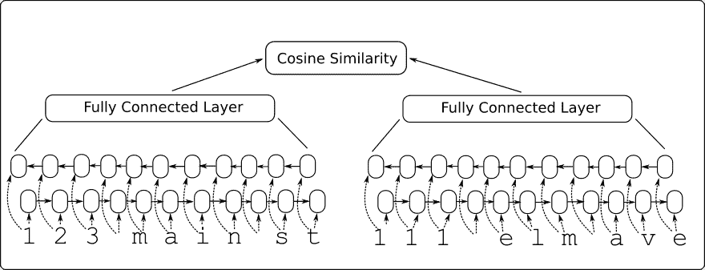

图 8：Siamese RNN 相似性模型架构

这个模型的优点还在于它接受以前没有见过的输入，并且可以将它们与 -1 到 1 的输出进行比较。我们将通过选择模型之前未见过的测试地址在代码中显示它并查看它是否可以匹配到类似的地址。

## 操作步骤

1.  我们首先加载必要的库并启动图会话：

```py
import os 
import random 
import string 
import numpy as np 
import matplotlib.pyplot as plt 
import tensorflow as tf 
sess = tf.Session() 
```

1.  我们现在设置模型参数如下：

```py
batch_size = 200 
n_batches = 300 
max_address_len = 20 
margin = 0.25 
num_features = 50 
dropout_keep_prob = 0.8 
```

1.  接下来，我们创建 Siamese RNN 相似性模型类，如下所示：

```py
def snn(address1, address2, dropout_keep_prob, 
        vocab_size, num_features, input_length): 

    # Define the Siamese double RNN with a fully connected layer at the end 
    def Siamese_nn(input_vector, num_hidden): 
        cell_unit = tf.nn.rnn_cell.BasicLSTMCell 

        # Forward direction cell 
        lstm_forward_cell = cell_unit(num_hidden, forget_bias=1.0) 
        lstm_forward_cell = tf.nn.rnn_cell.DropoutWrapper(lstm_forward_cell, output_keep_prob=dropout_keep_prob) 

        # Backward direction cell 
        lstm_backward_cell = cell_unit(num_hidden, forget_bias=1.0) 
        lstm_backward_cell = tf.nn.rnn_cell.DropoutWrapper(lstm_backward_cell, output_keep_prob=dropout_keep_prob) 

        # Split title into a character sequence 
        input_embed_split = tf.split(1, input_length, input_vector) 
        input_embed_split = [tf.squeeze(x, squeeze_dims=[1]) for x in input_embed_split] 

        # Create bidirectional layer 
        outputs, _, _ = tf.nn.bidirectional_rnn(lstm_forward_cell, 
                                                lstm_backward_cell, 
                                                input_embed_split, 
                                                dtype=tf.float32) 
        # Average The output over the sequence 
        temporal_mean = tf.add_n(outputs) / input_length 

        # Fully connected layer 
        output_size = 10 
        A = tf.get_variable(name="A", shape=[2*num_hidden, output_size], 
                            dtype=tf.float32, 
                            initializer=tf.random_normal_initializer(stddev=0.1)) 
        b = tf.get_variable(name="b", shape=[output_size], dtype=tf.float32, 
                            initializer=tf.random_normal_initializer(stddev=0.1)) 

        final_output = tf.matmul(temporal_mean, A) + b 
        final_output = tf.nn.dropout(final_output, dropout_keep_prob) 

        return(final_output) 

    with tf.variable_scope("Siamese") as scope: 
            output1 = Siamese_nn(address1, num_features) 
            # Declare that we will use the same variables on the second string 
            scope.reuse_variables() 
            output2 = Siamese_nn(address2, num_features) 

    # Unit normalize the outputs 
    output1 = tf.nn.l2_normalize(output1, 1) 
    output2 = tf.nn.l2_normalize(output2, 1) 
    # Return cosine distance 
    #   in this case, the dot product of the norms is the same. 
    dot_prod = tf.reduce_sum(tf.mul(output1, output2), 1) 

    return dot_prod
```

> 请注意，使用变量范围在两个地址输入的 Siamese 网络的两个部分之间共享参数。另外，请注意，余弦距离是通过归一化向量的点积来实现的。

1.  现在我们将声明我们的预测函数，它只是余弦距离的符号，如下所示：

```py
def get_predictions(scores): 
    predictions = tf.sign(scores, name="predictions") 
    return predictions 
```

1.  现在我们将如前所述声明我们的`loss`函数。请记住，我们希望为误差留下边距（类似于 SVM 模型）。我们还将有一个真正的积极和真正的消极的损失期限。使用以下代码进行损失：

```py
def loss(scores, y_target, margin): 
    # Calculate the positive losses 
    pos_loss_term = 0.25 * tf.square(tf.sub(1., scores)) 
    pos_mult = tf.cast(y_target, tf.float32) 

    # Make sure positive losses are on similar strings 
    positive_loss = tf.mul(pos_mult, pos_loss_term) 

    # Calculate negative losses, then make sure on dissimilar strings 
    neg_mult = tf.sub(1., tf.cast(y_target, tf.float32)) 

    negative_loss = neg_mult*tf.square(scores) 

    # Combine similar and dissimilar losses 
    loss = tf.add(positive_loss, negative_loss) 

    # Create the margin term.  This is when the targets are 0, and the scores are less than m, return 0\. 

    # Check if target is zero (dissimilar strings) 
    target_zero = tf.equal(tf.cast(y_target, tf.float32), 0.) 
    # Check if cosine outputs is smaller than margin 
    less_than_margin = tf.less(scores, margin) 
    # Check if both are true 
    both_logical = tf.logical_and(target_zero, less_than_margin) 
    both_logical = tf.cast(both_logical, tf.float32) 
    # If both are true, then multiply by (1-1)=0\. 
    multiplicative_factor = tf.cast(1\. - both_logical, tf.float32) 
    total_loss = tf.mul(loss, multiplicative_factor) 

    # Average loss over batch 
    avg_loss = tf.reduce_mean(total_loss) 
    return avg_loss 
```

1.  我们声明`accuracy`函数如下：

```py
def accuracy(scores, y_target): 
    predictions = get_predictions(scores) 
    correct_predictions = tf.equal(predictions, y_target) 
    accuracy = tf.reduce_mean(tf.cast(correct_predictions, tf.float32)) 
    return accuracy 
```

1.  我们将通过在地址中创建拼写错误来创建类似的地址。我们将这些地址（参考地址和拼写错误地址）表示为类似：

```py
def create_typo(s): 
    rand_ind = random.choice(range(len(s))) 
    s_list = list(s) 
    s_list[rand_ind]=random.choice(string.ascii_lowercase + '0123456789') 
    s = ''.join(s_list) 
    return s 
```

1.  我们将生成的数据将是街道号码，`street_names`和街道后缀的随机组合。名称和后缀来自以下列表：

```py
street_names = ['abbey', 'baker', 'canal', 'donner', 'elm', 'fifth', 'grandvia', 'hollywood', 'interstate', 'jay', 'kings'] 
street_types = ['rd', 'st', 'ln', 'pass', 'ave', 'hwy', 'cir', 'dr', 'jct'] 
```

1.  我们生成测试查询和引用如下：

```py
test_queries = ['111 abbey ln', '271 doner cicle', 
                '314 king avenue', 'tensorflow is fun'] 
test_references = ['123 abbey ln', '217 donner cir', '314 kings ave', '404 hollywood st', 'tensorflow is so fun']
```

> 请注意，最后一个查询和引用不是模型之前会看到的地址，但我们希望它们将是模型最终看到的最相似的地址。

1.  我们现在将定义如何生成一批数据。我们的批量数据将是 50% 类似的地址（参考地址和拼写错误地址）和 50% 不同的地址。我们通过占用地址列表的一半并将目标移动一个位置（使用`numpy.roll()`函数）来生成不同的地址：

```py
def get_batch(n): 
    # Generate a list of reference addresses with similar addresses that have 
    # a typo. 
    numbers = [random.randint(1, 9999) for i in range(n)] 
    streets = [random.choice(street_names) for i in range(n)] 
    street_suffs = [random.choice(street_types) for i in range(n)] 
    full_streets = [str(w) + ' ' + x + ' ' + y for w,x,y in zip(numbers, streets, street_suffs)] 
    typo_streets = [create_typo(x) for x in full_streets] 
    reference = [list(x) for x in zip(full_streets, typo_streets)] 

    # Shuffle last half of them for training on dissimilar addresses 
    half_ix = int(n/2) 
    bottom_half = reference[half_ix:] 
    true_address = [x[0] for x in bottom_half] 
    typo_address = [x[1] for x in bottom_half] 
    typo_address = list(np.roll(typo_address, 1)) 
    bottom_half = [[x,y] for x,y in zip(true_address, typo_address)] 
    reference[half_ix:] = bottom_half 

    # Get target similarities (1's for similar, -1's for non-similar) 
    target = [1]*(n-half_ix) + [-1]*half_ix 
    reference = [[x,y] for x,y in zip(reference, target)] 
    return reference 
```

1.  接下来，我们定义地址词汇表并指定如何将地址热编码为索引：

```py
vocab_chars = string.ascii_lowercase + '0123456789 ' 
vocab2ix_dict = {char:(ix+1) for ix, char in enumerate(vocab_chars)} 
vocab_length = len(vocab_chars) + 1 

# Define vocab one-hot encoding 
def address2onehot(address, 
                   vocab2ix_dict = vocab2ix_dict, 
                   max_address_len = max_address_len): 
    # translate address string into indices 
    address_ix = [vocab2ix_dict[x] for x in list(address)] 

    # Pad or crop to max_address_len 
    address_ix = (address_ix + [0]*max_address_len)[0:max_address_len] 
    return address_ix 
```

1.  处理完词汇后，我们将开始声明我们的模型占位符和嵌入查找。对于嵌入查找，我们将使用单一矩阵作为查找矩阵来使用单热编码嵌入。使用以下代码：

```py
address1_ph = tf.placeholder(tf.int32, [None, max_address_len], name="address1_ph") 
address2_ph = tf.placeholder(tf.int32, [None, max_address_len], name="address2_ph") 
y_target_ph = tf.placeholder(tf.int32, [None], name="y_target_ph") 
dropout_keep_prob_ph = tf.placeholder(tf.float32, name="dropout_keep_prob") 

# Create embedding lookup 
identity_mat = tf.diag(tf.ones(shape=[vocab_length])) 
address1_embed = tf.nn.embedding_lookup(identity_mat, address1_ph) 
address2_embed = tf.nn.embedding_lookup(identity_mat, address2_ph) 
```

1.  我们现在将声明`model`，`batch_accuracy`，`batch_loss`和`predictions`操作如下：

```py
# Define Model 
text_snn = model.snn(address1_embed, address2_embed, dropout_keep_prob_ph, 
                     vocab_length, num_features, max_address_len) 
# Define Accuracy 
batch_accuracy = model.accuracy(text_snn, y_target_ph) 
# Define Loss 
batch_loss = model.loss(text_snn, y_target_ph, margin) 
# Define Predictions 
predictions = model.get_predictions(text_snn) 
```

1.  最后，在我们开始训练之前，我们将优化和初始化操作添加到图中，如下所示：

```py
# Declare optimizer 
optimizer = tf.train.AdamOptimizer(0.01) 
# Apply gradients 
train_op = optimizer.minimize(batch_loss) 
# Initialize Variables 
init = tf.global_variables_initializer() 
sess.run(init) 
```

1.  我们现在将遍历训练世代并跟踪损失和准确率：

```py
train_loss_vec = [] 
train_acc_vec = [] 
for b in range(n_batches): 
    # Get a batch of data 
    batch_data = get_batch(batch_size) 
    # Shuffle data 
    np.random.shuffle(batch_data) 
    # Parse addresses and targets 
    input_addresses = [x[0] for x in batch_data] 
    target_similarity = np.array([x[1] for x in batch_data]) 
    address1 = np.array([address2onehot(x[0]) for x in input_addresses]) 
    address2 = np.array([address2onehot(x[1]) for x in input_addresses]) 

    train_feed_dict = {address1_ph: address1, 
                       address2_ph: address2, 
                       y_target_ph: target_similarity, 
                       dropout_keep_prob_ph: dropout_keep_prob} 

    _, train_loss, train_acc = sess.run([train_op, batch_loss, batch_accuracy], 
                                        feed_dict=train_feed_dict) 
    # Save train loss and accuracy 
    train_loss_vec.append(train_loss) 
    train_acc_vec.append(train_acc) 
```

1.  经过训练，我们现在处理测试查询和引用，以了解模型的执行方式：

```py
test_queries_ix = np.array([address2onehot(x) for x in test_queries]) 
test_references_ix = np.array([address2onehot(x) for x in test_references]) 
num_refs = test_references_ix.shape[0] 
best_fit_refs = [] 
for query in test_queries_ix: 
    test_query = np.repeat(np.array([query]), num_refs, axis=0) 
    test_feed_dict = {address1_ph: test_query, 
                      address2_ph: test_references_ix, 
                      y_target_ph: target_similarity, 
                      dropout_keep_prob_ph: 1.0} 
    test_out = sess.run(text_snn, feed_dict=test_feed_dict) 
    best_fit = test_references[np.argmax(test_out)] 
    best_fit_refs.append(best_fit) 
print('Query Addresses: {}'.format(test_queries)) 
print('Model Found Matches: {}'.format(best_fit_refs)) 
```

1.  这产生以下输出：

```py
Query Addresses: ['111 abbey ln', '271 doner cicle', '314 king avenue', 'tensorflow is fun'] 
Model Found Matches: ['123 abbey ln', '217 donner cir', '314 kings ave', 'tensorflow is so fun'] 
```

## 更多

我们可以从测试查询和参考中看到模型不仅能够识别正确的参考地址，而且还能够推广到非地址短语。我们还可以通过查看训练期间的损失和准确率来了解模型的执行情况：

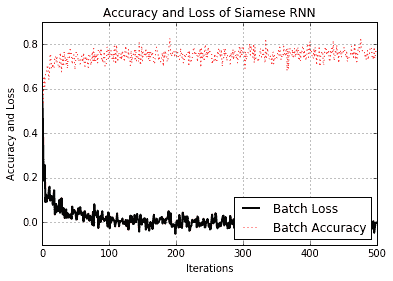

图 9：训练期间 Siamese RNN 相似性模型的准确率和损失

请注意，我们没有为此练习指定测试集。这是因为我们如何生成数据。我们创建了一个批量函数，每次调用它时都会创建新的批量数据，因此模型始终可以看到新数据。因此，我们可以使用批量损失和精度作为测试损失和准确率的替代项。但是，对于一组有限的实际数据，情况永远不会如此，因为我们总是需要训练和测试集来判断模型的表现。

