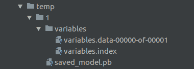

# 十、将 TensorFlow 投入生产

在本章中，我们将介绍以下主题：

*   实现单元测试
*   使用多个执行器
*   并行化 TensorFlow
*   将 TensorFlow 投入生产
*   生产环境 TensorFlow 的一个例子
*   使用 TensorFlow 服务

# 介绍

到目前为止，我们已经介绍了如何在 TensorFlow 中训练和评估各种模型。因此，在本章中，我们将向您展示如何编写可供生产使用的代码。生产就绪代码有各种定义，但对我们来说，生产代码将被定义为具有单元测试的代码，分离训练和评估代码，并有效地保存，并加载数据管道和图会话的各种所需部分。

> 本章提供的 Python 脚本应该从命令行运行。这允许运行测试，并将设备位置记录到屏幕上。

# 实现单元测试

测试代码可以加快原型设计速度，提高调试效率，加快更改速度，并且可以更轻松地共享代码。在 TensorFlow 中有许多简单的方法可以实现单元测试，我们将在本文中介绍它们。

## 准备

在编写 TensorFlow 模型时，有助于进行单元测试以检查程序的功能。这有助于我们，因为当我们想要对程序单元进行更改时，测试将确保这些更改不会以未知方式破坏模型。在这个秘籍中，我们将创建一个依赖于`MNIST`数据的简单 CNN 网络。有了它，我们将实现三种不同类型的单元测试来说明如何在 TensorFlow 中编写它们。

> 请注意，Python 有一个很棒的测试库，名为 Nose。 TensorFlow 还具有内置测试功能，我们将在其中查看，这样可以更轻松地测试 Tensor 对象的值，而无需评估会话中的值。

1.  首先，我们需要加载必要的库并格式化数据，如下所示：

```py
import sys
import numpy as np 
import tensorflow as tf 
from tensorflow.python.framework import ops 
ops.reset_default_graph() 
# Start a graph session 
sess = tf.Session() 
# Load data 
data_dir = 'temp' 
mnist = tf.keras.datasets.mnist
(train_xdata, train_labels), (test_xdata, test_labels) = mnist.load_data()
train_xdata = train_xdata / 255.0
test_xdata = test_xdata / 255.0
# Set model parameters 
batch_size = 100 
learning_rate = 0.005 
evaluation_size = 100 
image_width = train_xdata[0].shape[0] 
image_height = train_xdata[0].shape[1] 
target_size = max(train_labels) + 1 
num_channels = 1 # greyscale = 1 channel 
generations = 100 
eval_every = 5 
conv1_features = 25 
conv2_features = 50 
max_pool_size1 = 2 # NxN window for 1st max pool layer 
max_pool_size2 = 2 # NxN window for 2nd max pool layer 
fully_connected_size1 = 100 
dropout_prob = 0.75 
```

1.  然后，我们需要声明我们的占位符，变量和模型公式，如下所示：

```py
# Declare model placeholders 
x_input_shape = (batch_size, image_width, image_height, num_channels) 
x_input = tf.placeholder(tf.float32, shape=x_input_shape) 
y_target = tf.placeholder(tf.int32, shape=(batch_size)) 
eval_input_shape = (evaluation_size, image_width, image_height, num_channels) 
eval_input = tf.placeholder(tf.float32, shape=eval_input_shape) 
eval_target = tf.placeholder(tf.int32, shape=(evaluation_size)) 
dropout = tf.placeholder(tf.float32, shape=()) 
# Declare model parameters 
conv1_weight = tf.Variable(tf.truncated_normal([4, 4, num_channels, conv1_features], 
                                              stddev=0.1, dtype=tf.float32)) 
conv1_bias = tf.Variable(tf.zeros([conv1_features], dtype=tf.float32)) 
conv2_weight = tf.Variable(tf.truncated_normal([4, 4, conv1_features, conv2_features], 
                                               stddev=0.1, dtype=tf.float32)) 
conv2_bias = tf.Variable(tf.zeros([conv2_features], dtype=tf.float32)) 
# fully connected variables 
resulting_width = image_width // (max_pool_size1 * max_pool_size2) 
resulting_height = image_height // (max_pool_size1 * max_pool_size2) 
full1_input_size = resulting_width * resulting_height * conv2_features 
full1_weight = tf.Variable(tf.truncated_normal([full1_input_size, fully_connected_size1], 
                          stddev=0.1, dtype=tf.float32)) 
full1_bias = tf.Variable(tf.truncated_normal([fully_connected_size1], stddev=0.1, dtype=tf.float32)) 
full2_weight = tf.Variable(tf.truncated_normal([fully_connected_size1, target_size], 
                                               stddev=0.1, dtype=tf.float32)) 
full2_bias = tf.Variable(tf.truncated_normal([target_size], stddev=0.1, dtype=tf.float32)) 

# Initialize Model Operations 
def my_conv_net(input_data): 
    # First Conv-ReLU-MaxPool Layer 
    conv1 = tf.nn.conv2d(input_data, conv1_weight, strides=[1, 1, 1, 1], padding='SAME') 
    relu1 = tf.nn.relu(tf.nn.bias_add(conv1, conv1_bias)) 
    max_pool1 = tf.nn.max_pool(relu1, ksize=[1, max_pool_size1, max_pool_size1, 1], 
                               strides=[1, max_pool_size1, max_pool_size1, 1], padding='SAME') 
    # Second Conv-ReLU-MaxPool Layer 
    conv2 = tf.nn.conv2d(max_pool1, conv2_weight, strides=[1, 1, 1, 1], padding='SAME') 
    relu2 = tf.nn.relu(tf.nn.bias_add(conv2, conv2_bias)) 
    max_pool2 = tf.nn.max_pool(relu2, ksize=[1, max_pool_size2, max_pool_size2, 1], 
                               strides=[1, max_pool_size2, max_pool_size2, 1], padding='SAME') 
    # Transform Output into a 1xN layer for next fully connected layer 
    final_conv_shape = max_pool2.get_shape().as_list() 
    final_shape = final_conv_shape[1] * final_conv_shape[2] * final_conv_shape[3] 
    flat_output = tf.reshape(max_pool2, [final_conv_shape[0], final_shape]) 
    # First Fully Connected Layer 
    fully_connected1 = tf.nn.relu(tf.add(tf.matmul(flat_output, full1_weight), full1_bias)) 
    # Second Fully Connected Layer 
    final_model_output = tf.add(tf.matmul(fully_connected1, full2_weight), full2_bias) 

    # Add dropout 
    final_model_output = tf.nn.dropout(final_model_output, dropout) 
    return final_model_output 

model_output = my_conv_net(x_input) 
test_model_output = my_conv_net(eval_input) 
```

1.  接下来，我们创建我们的损失函数以及我们的预测和精确操作。然后，我们初始化以下模型变量：

```py
# Declare Loss Function (softmax cross entropy) 
loss = tf.reduce_mean(tf.nn.sparse_softmax_cross_entropy_with_logits(model_output, y_target)) 
# Create a prediction function 
prediction = tf.nn.softmax(model_output) 
test_prediction = tf.nn.softmax(test_model_output) 

# Create accuracy function 
def get_accuracy(logits, targets): 
    batch_predictions = np.argmax(logits, axis=1) 
    num_correct = np.sum(np.equal(batch_predictions, targets)) 
    return 100\. * num_correct/batch_predictions.shape[0] 

# Create an optimizer 
my_optimizer = tf.train.MomentumOptimizer(learning_rate, 0.9) 
train_step = my_optimizer.minimize(loss) 
# Initialize Variables 
init = tf.global_variables_initializer() 
sess.run(init) 
```

1.  对于我们的第一个单元测试，我们使用类`tf.test.TestCase`并创建一种方法来测试占位符（或变量）的值。对于此测试用例，我们确保损失概率（用于保持）大于`0.25`，因此模型不会更改为尝试训练超过 75% 的损失，如下所示：

```py
# Check values of tensors! 
class DropOutTest(tf.test.TestCase): 
    # Make sure that we don't drop too much 
    def dropout_greaterthan(self): 
        with self.test_session(): 
          self.assertGreater(dropout.eval(), 0.25) 
```

1.  接下来，我们需要测试我们的`accuracy`函数是否按预期运行。为此，我们创建一个概率样本数组和我们期望的样本，然后确保测试精度返回 100% ，如下所示：

```py
# Test accuracy function 
class AccuracyTest(tf.test.TestCase): 
    # Make sure accuracy function behaves correctly 
    def accuracy_exact_test(self): 
        with self.test_session(): 
            test_preds = [[0.9, 0.1],[0.01, 0.99]] 
            test_targets = [0, 1] 
            test_acc = get_accuracy(test_preds, test_targets) 
            self.assertEqual(test_acc.eval(), 100.) 
```

1.  我们还可以确保`Tensor`对象是我们期望的形状。要通过`target_size`测试模型输出是`batch_size`的预期形状，请输入以下代码：

```py
# Test tensorshape 
class ShapeTest(tf.test.TestCase): 
    # Make sure our model output is size [batch_size, num_classes] 
    def output_shape_test(self): 
        with self.test_session(): 
            numpy_array = np.ones([batch_size, target_size]) 
            self.assertShapeEqual(numpy_array, model_output) 
```

1.  现在我们需要在脚本中使用`main()`函数告诉 TensorFlow 我们正在运行哪个应用。脚本如下：

```py
def main(argv):
    # Start training loop
    train_loss = []
    train_acc = []
    test_acc = []
    for i in range(generations):
        rand_index = np.random.choice(len(train_xdata), size=batch_size)
        rand_x = train_xdata[rand_index]
        rand_x = np.expand_dims(rand_x, 3)
        rand_y = train_labels[rand_index]
        train_dict = {x_input: rand_x, y_target: rand_y, dropout: dropout_prob}

        sess.run(train_step, feed_dict=train_dict)
        temp_train_loss, temp_train_preds = sess.run([loss, prediction], feed_dict=train_dict)
        temp_train_acc = get_accuracy(temp_train_preds, rand_y)

        if (i + 1) % eval_every == 0:
            eval_index = np.random.choice(len(test_xdata), size=evaluation_size)
            eval_x = test_xdata[eval_index]
            eval_x = np.expand_dims(eval_x, 3)
            eval_y = test_labels[eval_index]
            test_dict = {eval_input: eval_x, eval_target: eval_y, dropout: 1.0}
            test_preds = sess.run(test_prediction, feed_dict=test_dict)
            temp_test_acc = get_accuracy(test_preds, eval_y)

            # Record and print results
            train_loss.append(temp_train_loss)
            train_acc.append(temp_train_acc)
            test_acc.append(temp_test_acc)
            acc_and_loss = [(i + 1), temp_train_loss, temp_train_acc, temp_test_acc]
            acc_and_loss = [np.round(x, 2) for x in acc_and_loss]
            print('Generation # {}. Train Loss: {:.2f}. Train Acc (Test Acc): {:.2f} 
                   ({:.2f})'.format(*acc_and_loss))
```

1.  要让我们的脚本执行测试或训练，我们需要以不同的方式从命令行调用它。以下代码段是主程序代码。如果程序收到参数`test`，它将执行测试；否则，它将运行训练：

```py
if __name__ == '__main__':
    cmd_args = sys.argv
    if len(cmd_args) > 1 and cmd_args[1] == 'test':
        # Perform unit-tests
        tf.test.main(argv=cmd_args[1:])
    else:
        # Run the TensorFlow app
        tf.app.run(main=None, argv=cmd_args)
```

1.  如果我们在命令行上运行程序，我们应该得到以下输出：

```py
$ python3 implementing_unit_tests.py test
...
----------------------------------------------------------------------
Ran 3 tests in 0.001s

OK 
```

前面步骤中描述的完整程序可以在[书籍的 GitHub 仓库](https://github.com/nfmcclure/tensorflow_cookbook/)和 [Packt 仓库](https://github.com/PacktPublishing/TensorFlow-Machine-Learning-Cookbook-Second-Edition)中找到。

## 工作原理

在本节中，我们实现了三种类型的单元测试：张量值，操作输出和张量形状。 TensorFlow 有更多类型的单元测试函数，[可在此处找到](https://www.tensorflow.org/versions/master/api_docs/python/test.html) 。

请记住，单元测试有助于确保代码能够按预期运行，为共享代码提供信心，并使再现性更易于访问。

# 使用多个执行器

您将意识到 TensorFlow 有许多功能，包括计算图，它们可以自然地并行计算。计算图可以分为不同的处理器以及处理不同的批量。我们将讨论如何在此秘籍中访问同一台机器上的不同处理器。

## 准备

对于此秘籍，我们将向您展示如何在同一系统上访问多个设备并对其进行训练。这是一种非常常见的情况：与 CPU 一起，机器可能具有一个或多个可以共享计算负载的 GPU。如果 TensorFlow 可以访问这些设备，它将通过贪婪的过程自动将计算分配给多个设备。但是，TensorFlow 还允许程序通过名称范围放置指定哪些设备将在哪个设备上。

要访问 GPU 设备，必须安装 GPU 版本的 TensorFlow。要安装 TensorFlow 的 GPU 版本，请访问[此链接](https://www.tensorflow.org/versions/master/get_started/os_setup.html)。下载，设置并按照特定系统的说明进行操作。请注意，TensorFlow 的 GPU 版本需要 CUDA 才能使用 GPU。

在本文中，我们将向您展示各种命令，允许您访问系统上的各种设备；我们还将演示如何找出 TensorFlow 正在使用的设备。

## 操作步骤

1.  为了找出 TensorFlow 用于哪些操作的设备，我们需要在会话参数中设置`config`，将`log_device_placement`设置为`True`。当我们从命令行运行脚本时，我们将看到特定的设备放置，如以下输出所示：

```py
import tensorflow as tf 
sess = tf.Session(config=tf.ConfigProto(log_device_placement=True)) 
a = tf.constant([1.0, 2.0, 3.0, 4.0, 5.0, 6.0], shape=[2, 3], name='a') 
b = tf.constant([1.0, 2.0, 3.0, 4.0, 5.0, 6.0], shape=[3, 2], name='b') 
c = tf.matmul(a, b) 
# Runs the op. 
print(sess.run(c)) 
```

1.  从终端，运行以下命令：

```py
$python3 using_multiple_devices.py 
Device mapping: no known devices. 
I tensorflow/core/common_runtime/direct_session.cc:175] Device mapping: 
MatMul: /job:localhost/replica:0/task:0/cpu:0 
I tensorflow/core/common_runtime/simple_placer.cc:818] MatMul: /job:localhost/replica:0/task:0/cpu:0 
b: /job:localhost/replica:0/task:0/cpu:0 
I tensorflow/core/common_runtime/simple_placer.cc:818] b: /job:localhost/replica:0/task:0/cpu:0 
a: /job:localhost/replica:0/task:0/cpu:0 
I tensorflow/core/common_runtime/simple_placer.cc:818] a: /job:localhost/replica:0/task:0/cpu:0 
[[ 22\.  28.] 
 [ 49\.  64.]] 
```

1.  默认情况下，TensorFlow 会自动决定如何跨计算设备（CPU 和 GPU）分配计算，有时我们需要了解这些展示位置。这在加载早期的现有模型时非常有用，该模型在我们的计算机具有不同设备时在图中分配了硬展示位置。我们可以在配置中设置软放置以解决此问题，如下所示：

```py
config = tf.ConfigProto() 
config.allow_soft_placement = True 
sess_soft = tf.Session(config=config) 
```

1.  使用 GPU 时，TensorFlow 会自动占用 GPU 内存的很大一部分。虽然通常需要这样做，但我们可以采取措施更加小心 GPU 内存分配。虽然 TensorFlow 从未发布 GPU 内存，但我们可以通过设置 GPU 内存增长选项，将其分配缓慢增加到最大限制（仅在需要时），如下所示：

```py
config.gpu_options.allow_growth = True 
sess_grow = tf.Session(config=config) 
```

1.  如果我们想对 TensorFlow 使用的 GPU 内存百分比设置硬限制，我们可以使用`config`设置`per_process_gpu_memory_fraction`，如下所示：

```py
config.gpu_options.per_process_gpu_memory_fraction = 0.4 
sess_limited = tf.Session(config=config) 
```

1.  有时我们可能需要编写可靠的代码来确定它是否在 GPU 可用的情况下运行。 TensorFlow 具有内置功能，可以测试 GPU 是否可用。当我们想要编写在可用时利用 GPU 并为其分配特定操作的代码时，这很有用。这是通过以下代码完成的：

```py
if tf.test.is_built_with_cuda(): 
    <Run GPU specific code here>
```

1.  如果我们需要为 GPU 分配特定操作，请输入以下代码。这将执行简单的计算并将操作分配给主 CPU 和两个辅助 GPU：

```py
with tf.device('/cpu:0'): 
    a = tf.constant([1.0, 3.0, 5.0], shape=[1, 3]) 
    b = tf.constant([2.0, 4.0, 6.0], shape=[3, 1]) 

    with tf.device('/gpu:0'): 
        c = tf.matmul(a,b) 
        c = tf.reshape(c, [-1]) 

    with tf.device('/gpu:1'): 
        d = tf.matmul(b,a) 
        flat_d = tf.reshape(d, [-1]) 

    combined = tf.multiply(c, flat_d) 
print(sess.run(combined)) 
```

## 工作原理

当我们想在我们的机器上为 TensorFlow 操作指定特定设备时，我们需要知道 TensorFlow 如何引用这些设备。 TensorFlow 中的设备名称遵循以下约定：

| 设备 | 设备名称 |
| --- | --- | --- |
| 主 CPU | `/CPU:0` |
| 第二个 CPU | `/CPU:1` |
| 主 GPU | `/GPU:0` |
| 第二个 GPU | `/GPU:1` |
| 第三个 GPU | `/GPU:2` |

## 更多

幸运的是，在云中运行 TensorFlow 现在比以往更容易。许多云计算服务提供商都提供 GPU 实例，其中包含主 CPU 和强大的 GPU。 Amazon Web Services（AWS）具有 G 实例和 P2 实例，允许使用功能强大的 GPU，为 TensorFlow 流程提供极快的速度。您甚至可以免费选择 AWS Machine Images（AMI），它将在安装了 TensorFlow 的 GPU 实例的情况下启动选定的实例。

# 并行化 TensorFlow

为了扩展 TensorFlow 并行化的范围，我们还可以以分布式方式在完全不同的机器上从我们的图执行单独的操作。这个秘籍将告诉你如何。

## 准备

在 TensorFlow 发布几个月后，谷歌发布了分布式 TensorFlow，它是对 TensorFlow 生态系统的一次重大升级，并且允许在不同的工作机器上设置 TensorFlow 集群，并分享训练和评估的计算任务楷模。使用分布式 TensorFlow 就像为工作器设置参数一样简单，然后为不同的工作器分配不同的工作。

在这个秘籍中，我们将建立两个本地工作器并将他们分配到不同的工作。

## 操作步骤

1.  首先，我们加载 TensorFlow 并使用配置字典文件（端口`2222`和`2223`）定义我们的两个本地 worker，如下所示：

```py
import tensorflow as tf 
# Cluster for 2 local workers (tasks 0 and 1): 
cluster = tf.train.ClusterSpec({'local': ['localhost:2222', 'localhost:2223']}) 
```

1.  现在，我们将两个工作器连接到服务器并使用以下任务编号标记它们：

```py
server = tf.train.Server(cluster, job_name="local", task_index=0) 
server = tf.train.Server(cluster, job_name="local", task_index=1) 
```

1.  现在我们将让每个工作器完成一项任务。第一个工作器将初始化两个矩阵（每个矩阵将是 25 乘 25）。第二个工作器将找到所有元素的总和。然后，我们将自动分配两个总和的总和并打印输出，如下所示：

```py
mat_dim = 25 
matrix_list = {} 
with tf.device('/job:local/task:0'): 
    for i in range(0, 2): 
        m_label = 'm_{}'.format(i) 
        matrix_list[m_label] = tf.random_normal([mat_dim, mat_dim]) 
# Have each worker calculate the sums 
sum_outs = {} 
with tf.device('/job:local/task:1'): 
    for i in range(0, 2): 
        A = matrix_list['m_{}'.format(i)] 
        sum_outs['m_{}'.format(i)] = tf.reduce_sum(A) 
    # Sum all the sums 
    summed_out = tf.add_n(list(sum_outs.values())) 
with tf.Session(server.target) as sess: 
    result = sess.run(summed_out) 
    print('Summed Values:{}'.format(result)) 
```

1.  输入上面的代码后，我们可以在命令提示符下运行以下命令：

```py
$ python3 parallelizing_tensorflow.py 
I tensorflow/core/distributed_runtime/rpc/grpc_channel.cc:197] Initialize GrpcChannelCache for job local -> {0 -> localhost:2222, 1 -> localhost:2223} 
I tensorflow/core/distributed_runtime/rpc/grpc_server_lib.cc:206] Started server with target: grpc://localhost:2222 
I tensorflow/core/distributed_runtime/rpc/grpc_channel.cc:197] Initialize GrpcChannelCache for job local -> {0 -> localhost:2222, 1 -> localhost:2223} 
I tensorflow/core/distributed_runtime/rpc/grpc_server_lib.cc:206] Started server with target: grpc://localhost:2223 
I tensorflow/core/distributed_runtime/master_session.cc:928] Start master session 252bb6f530553002 with config:  
Summed Values:-21.12611198425293 
```

## 工作原理

使用分布式 TensorFlow 非常简单。您所要做的就是将工作器 IP 分配给具有名称的服务器。然后，可以手动或自动为工作器分配操作。

# 将 TensorFlow 投入生产

如果我们想在生产环境中使用我们的机器学习脚本，我们首先需要考虑一些要点作为最佳实践。在本节中，我们将概述其中的一些内容。

## 准备

在本文中，我们想总结并浓缩将 TensorFlow 投入生产的各种技巧。我们将介绍如何最好地保存和加载词汇表，图，变量和模型检查点。我们还将讨论如何使用 TensorFlow 的命令行参数解析器并更改 TensorFlow 的日志记录详细程度。

## 操作步骤

1.  运行 TensorFlow 程序时，我们可能需要检查内存中是否已存在其他图会话，或者在调试程序后是否清除了图会话。我们可以使用以下命令行来完成此任务：

```py
from tensorflow.python.framework import ops 
ops.reset_default_graph() 
```

1.  在处理文本（或任何数据管道）时，我们需要确保我们保存处理数据的方式，以便我们可以以相同的方式处理未来的评估数据。例如，如果我们处理文本，我们需要确保我们可以保存并加载词汇表。以下代码是如何使用`JSON`库保存词汇表字典的示例：

```py
import json word_list = ['to', 'be', 'or', 'not', 'to', 'be']
vocab_list = list(set(word_list))
vocab2ix_dict = dict(zip(vocab_list, range(len(vocab_list))))
ix2vocab_dict = {val:key for key,val in vocab2ix_dict.items()}

# Save vocabulary
import json
with open('vocab2ix_dict.json', 'w') as file_conn:
    json.dump(vocab2ix_dict, file_conn)

# Load vocabulary
with open('vocab2ix_dict.json', 'r') as file_conn:
    vocab2ix_dict = json.load(file_conn)
```

> 在这里，我们以`JSON`格式保存了词汇词典，但我们也可以将其保存在`text`文件，`csv`甚至二进制格式中。如果词汇量很大，则首选二进制文件。您还可以考虑使用 Pickle 库来创建`pkl`二进制文件，但请注意，Pickle 文件在库和 Python 版本之间不能很好地转换。

1.  为了保存模型图和变量，我们创建了一个`Saver()`操作并将其添加到图中。建议我们在训练期间定期保存模型。要保存模型，请输入以下代码：

```py
After model declaration, add a saving operations 
saver = tf.train.Saver() 
# Then during training, save every so often, referencing the training generation 
for i in range(generations): 
    ... 
    if i%save_every == 0: 
        saver.save(sess, 'my_model', global_step=step) 
# Can also save only specific variables: 
saver = tf.train.Saver({"my_var": my_variable})
```

> 请注意，`Saver()`操作也会采用其他参数。如前面的示例所示，它可以使用变量和张量字典来保存特定元素。每隔`n`小时也可以检查一次，定期执行保存操作。默认情况下，保存操作仅保留最后五个模型保存（出于空间考虑）。可以使用`maximum_to_keep`选项更改此设置。

1.  在保存模型之前，请务必命名模型的重要操作。如果 TensorFlow 没有名称，则没有简单的方法来加载特定的占位符，操作或变量。 TensorFlow 中的大多数操作和函数都接受`name`参数，如下例所示：

```py
conv_weights = tf.Variable(tf.random_normal(), name='conv_weights') 
loss = tf.reduce_mean(... , name='loss') 
```

1.  TensorFlow 还可以使用`tf.apps.flags`库在命令行上轻松执行参数解析。使用这些函数，我们可以定义字符串，浮点数，整数或布尔值的命令行参数，如下面的代码片段所示。使用这些标志定义，我们可以运行`tf.app.run()`，它将使用以下标志参数运行`main()`函数：

```py
tf.flags.DEFINE_string("worker_locations", "", "List of worker addresses.")
tf.flags.DEFINE_float('learning_rate', 0.01, 'Initial learning rate.')
tf.flags.DEFINE_integer('generations', 1000, 'Number of training generations.')
tf.flags.DEFINE_boolean('run_unit_tests', False, 'If true, run tests.')
FLAGS = tf.flags.FLAGS
# Need to define a 'main' function for the app to run 
def main(_): 
    worker_ips = FLAGS.worker_locations.split(",") 
    learning_rate = FLAGS.learning_rate 
    generations = FLAGS.generations 
    run_unit_tests = FLAGS.run_unit_tests

# Run the Tensorflow app 
if __name__ == "__main__":
    # The following is looking for a "main()" function to run and will pass.
    tf.app.run()
    # Can modify this to be more custom:
    tf.app.run(main=my_main_function(), argv=my_arguments)
```

1.  TensorFlow 具有内置日志记录，我们可以为其设置级别参数。我们可以设定的水平是`DEBUG`，`INFO`，`WARN`，`ERROR`和`FATAL`。默认为`WARN`，如下所示：

```py
tf.logging.set_verbosity(tf.logging.WARN) 
# WARN is the default value, but to see more information, you can set it to 
#    INFO or DEBUG 
tf.logging.set_verbosity(tf.logging.DEBUG) 
```

## 工作原理

在本节中，我们提供了在 TensorFlow 中创建生产级代码的提示。我们想介绍应用标志，模型保存和日志记录等概念，以便用户可以使用这些工具一致地编写代码，并了解在其他代码中看到这些工具时的含义。还有许多其他方法可以编写好的生产代码，但下面的秘籍中将显示完整的示例。

# 生产环境 TensorFlow 的一个例子

生产机器学习模型的一个好方法是将训练和评估程序分开。在本节中，我们将说明一个评估脚本，该脚本已经扩展到包括单元测试，模型保存和加载以及评估。

## 准备

在本文中，我们将向您展示如何使用上述标准实现评估脚本。代码实际上包含一个训练脚本和一个评估脚本，但是对于这个秘籍，我们只会向您展示评估脚本。提醒一下，两个脚本都可以在[在线 GitHub 仓库](https://github.com/nfmcclure/tensorflow_cookbook/)和 [Packt 官方仓库](https://github.com/nfmcclure/tensorflow_cookbook/)中看到。

对于即将到来的示例，我们将实现第 9 章，回归神经网络中的第一个 RNN 示例，该示例试图预测文本消息是垃圾邮件还是非垃圾邮件。我们将假设 RNN 模型与词汇一起被训练和保存。

## 操作步骤

1.  首先，我们首先加载必要的库并声明 TensorFlow 应用标志，如下所示：

```py
import os 
import re 
import numpy as np 
import tensorflow as tf 
from tensorflow.python.framework import ops 
ops.reset_default_graph() 
# Define App Flags
tf.flags.DEFINE_string("storage_folder", "temp", "Where to store model and data.")
tf.flags.DEFINE_float('learning_rate', 0.0005, 'Initial learning rate.')
tf.flags.DEFINE_float('dropout_prob', 0.5, 'Per to keep probability for dropout.')
tf.flags.DEFINE_integer('epochs', 20, 'Number of epochs for training.')
tf.flags.DEFINE_integer('batch_size', 250, 'Batch Size for training.')
tf.flags.DEFINE_integer('rnn_size', 15, 'RNN feature size.')
tf.flags.DEFINE_integer('embedding_size', 25, 'Word embedding size.')
tf.flags.DEFINE_integer('min_word_frequency', 20, 'Word frequency cutoff.')
tf.flags.DEFINE_boolean('run_unit_tests', False, 'If true, run tests.')

FLAGS = tf.flags.FLAGS
```

1.  接下来，我们声明一个文本清理函数。这与训练脚本中使用的清洁函数相同，如下所示：

```py
def clean_text(text_string): 
    text_string = re.sub(r'([^sw]|_|[0-9])+', '', text_string) 
    text_string = " ".join(text_string.split()) 
    text_string = text_string.lower() 
    return text_string 
```

1.  现在，我们需要加载以下词汇处理函数：

```py
def load_vocab(): 
    vocab_path = os.path.join(FLAGS.storage_folder, "vocab") 
    vocab_processor = tf.contrib.learn.preprocessing.VocabularyProcessor.restore(vocab_path) 
    return vocab_processor 
```

1.  现在我们有了清理文本的方法，并且还有一个词汇处理器，我们可以将这些函数组合起来为给定的文本创建数据处理管道，如下所示：

```py
def process_data(input_data, vocab_processor): 
    input_data = clean_text(input_data) 
    input_data = input_data.split() 
    processed_input = np.array(list(vocab_processor.transform(input_data))) 
    return processed_input 
```

1.  接下来，我们需要一种方法来获取要评估的数据。为此，我们将要求用户在屏幕上键入文本。然后，我们将处理文本并返回以下处理过的文本：

```py
def get_input_data(): 
    input_text = input("Please enter a text message to evaluate: ") 
    vocab_processor = load_vocab() 
    return process_data(input_text, vocab_processor)
```

> 对于此示例，我们通过要求用户键入来创建评估数据。虽然许多应用将通过提供的文件或 API 请求获取数据，但我们可以相应地更改此输入数据函数。

1.  对于单元测试，我们需要使用以下代码确保我们的文本清理函数正常运行：

```py
class clean_test(tf.test.TestCase): 
    # Make sure cleaning function behaves correctly 
    def clean_string_test(self): 
        with self.test_session(): 
            test_input = '--Tensorflow's so Great! Dont you think so?   ' 
            test_expected = 'tensorflows so great don you think so' 
            test_out = clean_text(test_input) 
            self.assertEqual(test_expected, test_out) 
```

1.  现在我们有了模型和数据，我们可以运行`main`函数。`main`函数将获取数据，设置图，加载变量，输入处理过的数据，然后打印输出，如下面的代码片段所示：

```py
def main(args): 
    # Get flags 
    storage_folder = FLAGS.storage_folder 
    # Get user input text 
    x_data = get_input_data() 

    # Load model 
    graph = tf.Graph() 
    with graph.as_default(): 
        sess = tf.Session() 
        with sess.as_default(): 
            # Load the saved meta graph and restore variables 
            saver = tf.train.import_meta_graph("{}.meta".format(os.path.join(storage_folder, "model.ckpt"))) 
            saver.restore(sess, os.path.join(storage_folder, "model.ckpt")) 
            # Get the placeholders from the graph by name 
            x_data_ph = graph.get_operation_by_name("x_data_ph").outputs[0] 
            dropout_keep_prob = graph.get_operation_by_name("dropout_keep_prob").outputs[0] 
            probability_outputs = graph.get_operation_by_name("probability_outputs").outputs[0] 
            # Make the prediction 
            eval_feed_dict = {x_data_ph: x_data, dropout_keep_prob: 1.0} 
            probability_prediction = sess.run(tf.reduce_mean(probability_outputs, 0), eval_feed_dict) 

            # Print output (Or save to file or DB connection?) 
            print('Probability of Spam: {:.4}'.format(probability_prediction[1])) 
```

1.  最后，要运行`main()`函数或单元测试，请使用以下代码：

```py
if __name__ == "__main__": 
    if FLAGS.run_unit_tests: 
        # Perform unit tests 
        tf.test.main() 
    else: 
        # Run evaluation 
        tf.app.run() 
```

## 工作原理

为了评估模型，我们能够使用 TensorFlow 的应用标志加载命令行参数，加载模型和词汇处理器，然后通过模型运行处理过的数据并进行预测。

请记住通过命令行运行此脚本，并在创建模型和词汇表字典之前检查是否运行了训练脚本。

# 使用 TensorFlow 服务

在本节中，我们将向您展示如何设置 RNN 模型以预测 TensorFlow 上的垃圾邮件或非垃圾邮件文本消息。我们将首先说明如何以 protobuf 格式保存模型，然后将模型加载到本地服务器，监听端口`9000`以进行输入。

## 准备

我们通过鼓励读者阅读 [TensorFlow 服务网站](https://www.tensorflow.org/serving/serving_basic)上的官方文档和简短教程来开始本节。

对于这个例子，我们将在第 9 章，循环神经网络中重用我们在预测垃圾邮件中使用的大部分 RNN 代码和 RNNs 秘籍。我们将更改模型保存代码，以便将 protobuf 模型保存在使用 TensorFlow 服务所需的正确文件夹结构中。

> 请注意，本章中的所有脚本都应该从命令行 bash 提示符执行。

有关更新的安装说明，[请访问官方安装站点](https://www.tensorflow.org/serving/setup)。正常安装就像向 Linux 源添加 gpg-key 并运行以下安装命令一样简单：

```py
$ sudo apt install tensorflow-model-server
```

## 操作步骤

1.  在这里，我们将以与以前相同的方式开始，通过加载必要的库并设置 TensorFlow 标志，如下所示：

```py
import os
import re
import io
import sys
import requests
import numpy as np
import tensorflow as tf
from zipfile import ZipFile
from tensorflow.python.framework import ops

ops.reset_default_graph()

# Define App Flags
tf.flags.DEFINE_string("storage_folder", "temp", "Where to store model and data.")
tf.flags.DEFINE_float('learning_rate', 0.0005, 'Initial learning rate.')
tf.flags.DEFINE_float('dropout_prob', 0.5, 'Per to keep probability for dropout.')
tf.flags.DEFINE_integer('epochs', 20, 'Number of epochs for training.')
tf.flags.DEFINE_integer('batch_size', 250, 'Batch Size for training.')
tf.flags.DEFINE_integer('rnn_size', 15, 'RNN feature size.')
tf.flags.DEFINE_integer('embedding_size', 25, 'Word embedding size.')
tf.flags.DEFINE_integer('min_word_frequency', 20, 'Word frequency cutoff.')
tf.flags.DEFINE_boolean('run_unit_tests', False, 'If true, run tests.')

FLAGS = tf.flags.FLAGS

```

1.  我们将以完全相同的方式继续完成脚本。为简洁起见，我们只会在训练脚本中包含差异，这就是我们如何保存 protobuf 模型。这是通过在训练完成后插入以下代码来完成的：

> 请注意此代码与教程代码的相似之处。这里的主要区别在于模型名称，版本号以及我们正在保存 RNN 而不是 CNN 的事实。

```py
# Save the finished model for TensorFlow Serving (pb file)
# Here, it's our storage folder / version number
out_path = os.path.join(tf.compat.as_bytes(os.path.join(storage_folder, '1')))
print('Exporting finished model to : {}'.format(out_path))
builder = tf.saved_model.builder.SavedModelBuilder(out_path)

# Build the signature_def_map.
classification_inputs = tf.saved_model.utils.build_tensor_info(x_data_ph)
classification_outputs_classes = tf.saved_model.utils.build_tensor_info(rnn_model_outputs)

classification_signature = (tf.saved_model.signature_def_utils.build_signature_def(
                inputs={tf.saved_model.signature_constants.CLASSIFY_INPUTS:   
                        classification_inputs},
                outputs={tf.saved_model.signature_constants.CLASSIFY_OUTPUT_CLASSES: 
                         classification_outputs_classes},
                method_name=tf.saved_model.signature_constants.CLASSIFY_METHOD_NAME))

        tensor_info_x = tf.saved_model.utils.build_tensor_info(x_data_ph)
        tensor_info_y = tf.saved_model.utils.build_tensor_info(y_output_ph)

        prediction_signature = (
            tf.saved_model.signature_def_utils.build_signature_def(
                inputs={'texts': tensor_info_x},
                outputs={'scores': tensor_info_y},
                method_name=tf.saved_model.signature_constants.PREDICT_METHOD_NAME))

        legacy_init_op = tf.group(tf.tables_initializer(), name='legacy_init_op')
        builder.add_meta_graph_and_variables(
            sess, [tf.saved_model.tag_constants.SERVING],
            signature_def_map={
                'predict_spam': prediction_signature,
                tf.saved_model.signature_constants.DEFAULT_SERVING_SIGNATURE_DEF_KEY:
                    classification_signature,
            },
            legacy_init_op=legacy_init_op)

        builder.save()

        print('Done exporting!')
```

1.  对我们来说，重要的是要意识到 TensorFlow Serving 需要特定的文件或文件夹结构来加载模型。该脚本将以以下格式安装文件：



A screenshot of the directory structure that TensorFlow Serving expects.

上面的屏幕截图显示了所需的目录结构。在其中，我们有我们定义的数据目录`temp`，然后是我们的模型版本号`1`。在版本号目录中，我们保存我们的 protobuf 模型和一个包含要保存的所需变量的`variables`文件夹。

> 我们应该知道，在我们的数据目录中，TensorFlow 服务将查找整数文件夹。 TensorFlow 服务将自动启动并在最大整数下获取模型。这意味着要部署新模型，我们需要将其标记为版本 2，并将其粘贴在也标记为`2`的新文件夹下。然后，TensorFlow 服务将自动获取模型。

1.  要启动我们的服务器，我们使用端口，`model_name`和`model_base_path`参数调用命令`tensorflow_model_server`。然后，TensorFlow Serving 查找版本号文件夹并选择最大版本编号的模型。然后它将它部署到机器上，命令通过作为参数给出的端口运行。在以下示例中，我们在本地计算机（`0.0.0.0`）上运行，并且接受的默认端口是`9000`：

```py
$ tensorflow_model_server --port=9000 --model_name=spam_ham --model_base_path=<directory of our code>/tensorflow_cookbook/10_Taking_TensorFlow_to_Production/06_Using_TensorFlow_Serving/temp/

2018-08-09 12:05:16.206712: I tensorflow_serving/model_servers/main.cc:153] Building single TensorFlow model file config: model_name: spam_ham model_base_path: .../temp/
2018-08-09 12:05:16.206874: I tensorflow_serving/model_servers/server_core.cc:459] Adding/updating models.
2018-08-09 12:05:16.206903: I tensorflow_serving/model_servers/server_core.cc:514] (Re-)adding model: spam_ham
2018-08-09 12:05:16.307681: I tensorflow_serving/core/basic_manager.cc:716] Successfully reserved resources to load servable {name: spam_ham version: 1}
2018-08-09 12:05:16.307744: I tensorflow_serving/core/loader_harness.cc:66] Approving load for servable version {name: spam_ham version: 1}
2018-08-09 12:05:16.307773: I tensorflow_serving/core/loader_harness.cc:74] Loading servable version {name: spam_ham version: 1}
2018-08-09 12:05:16.307829: I external/org_tensorflow/tensorflow/contrib/session_bundle/bundle_shim.cc:360] Attempting to load native SavedModelBundle in bundle-shim from: .../temp/1
2018-08-09 12:05:16.307867: I external/org_tensorflow/tensorflow/cc/saved_model/loader.cc:242] Loading SavedModel with tags: { serve }; from: .../temp/1
2018-08-09 12:05:16.313811: I external/org_tensorflow/tensorflow/core/platform/cpu_feature_guard.cc:141] Your CPU supports instructions that this TensorFlow binary was not compiled to use: AVX2 FMA
2018-08-09 12:05:16.325866: I external/org_tensorflow/tensorflow/cc/saved_model/loader.cc:161] Restoring SavedModel bundle.
2018-08-09 12:05:16.329290: I external/org_tensorflow/tensorflow/cc/saved_model/loader.cc:196] Running LegacyInitOp on SavedModel bundle.
2018-08-09 12:05:16.332936: I external/org_tensorflow/tensorflow/cc/saved_model/loader.cc:291] SavedModel load for tags { serve }; Status: success. Took 25074 microseconds.
2018-08-09 12:05:16.332972: I tensorflow_serving/servables/tensorflow/saved_model_warmup.cc:83] No warmup data file found at .../temp/1/assets.extra/tf_serving_warmup_requests
2018-08-09 12:05:16.333335: I tensorflow_serving/core/loader_harness.cc:86] Successfully loaded servable version {name: spam_ham version: 1}
2018-08-09 12:05:16.334678: I tensorflow_serving/model_servers/main.cc:323] Running ModelServer at 0.0.0.0:9000 ...
```

1.  我们现在可以将二进制数据提交给`<host>:9000`并返回显示结果的 JSON 响应。我们可以通过任何机器和任何编程语言来完成。不必依赖客户端拥有 TensorFlow 的本地副本是非常有用的。

## 工作原理

如果我们将早期的生产规模部分与前一部分进行比较，主要区别在于我们在主机上部署了可以响应传入请求的模型服务器。前面的部分是一个很好的设置示例，用于执行批量结果或在可以加载 TensorFlow 的机器上工作，但秘籍不是很擅长部署可用的模型，可以进行计算，并将结果返回给任何客户。在本节中，我们将了解如何处理这种架构，如下表所示：

|  | 第 5 节 - 批量作业 | 第 6 节 - 通过 TensorFlow 服务的作业 |
| --- | --- | --- |
| 优点 | 不依赖于网络连接或主机 | 结果与客户端结构无关，唯一的要求是 Numpy 数组的正确格式化的二进制文件 |
| 缺点 | 客户端必须具有 TensorFlow 和模型文件 | 依靠可用的主机 |
| 理想的用途 | 大批量数据 | 生产服务始终可用，通常是小的请求 |

当然，每种方法的优缺点都值得商榷，两者都能满足每种情况的要求。还有许多其他可用的架构可以满足不同的需求，例如 Docker，Kubernetes，Luigi，Django/Flask，Celery，AWS 和 Azure。

## 更多

本章未涉及的架构工具和资源的链接如下：

*   [在 Docker 中使用 TensorFlow 服务](https://www.tensorflow.org/serving/docker)
*   [在 Kubernetes 中使用 TensorFlow 服务](https://www.tensorflow.org/serving/serving_inception)
*   [Luigi，批量作业的管道工具](https://github.com/spotify/luigi)
*   [在 Flask 中使用 TensorFlow](https://guillaumegenthial.github.io/serving.html)
*   [用于分布式任务排队的 Python 框架](http://www.celeryproject.org/community/)
*   [如何在 TensorFlow 模型中使用 AWS lambdas](https://aws.amazon.com/blogs/machine-learning/how-to-deploy-deep-learning-models-with-aws-lambda-and-tensorflow/)

