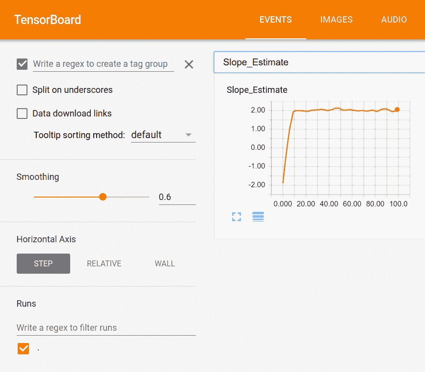
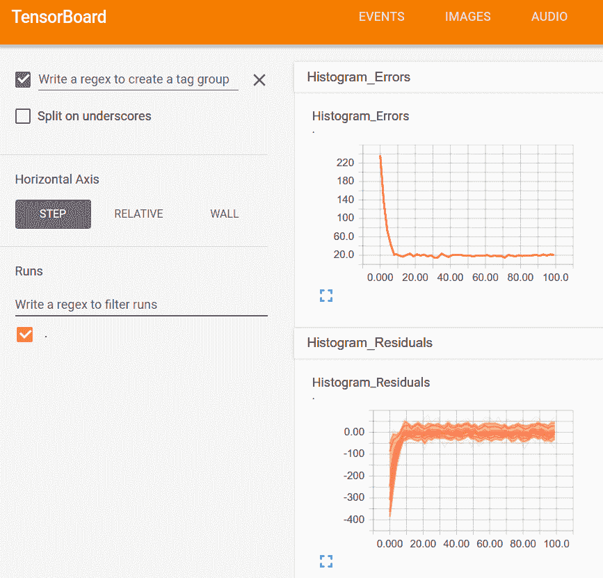
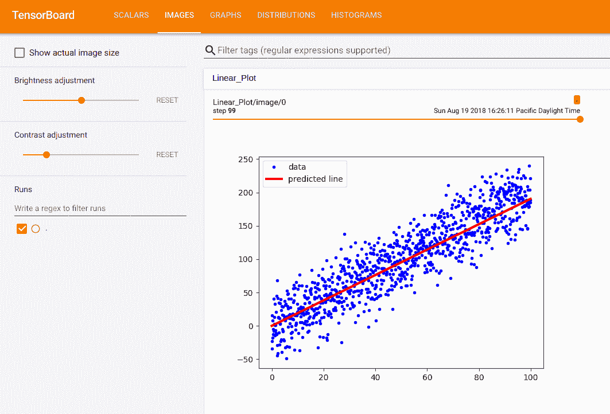
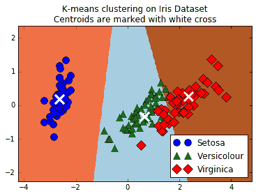
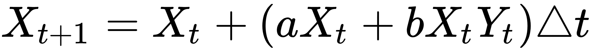
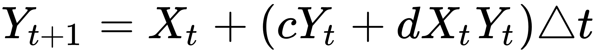
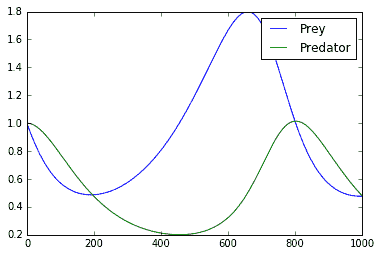
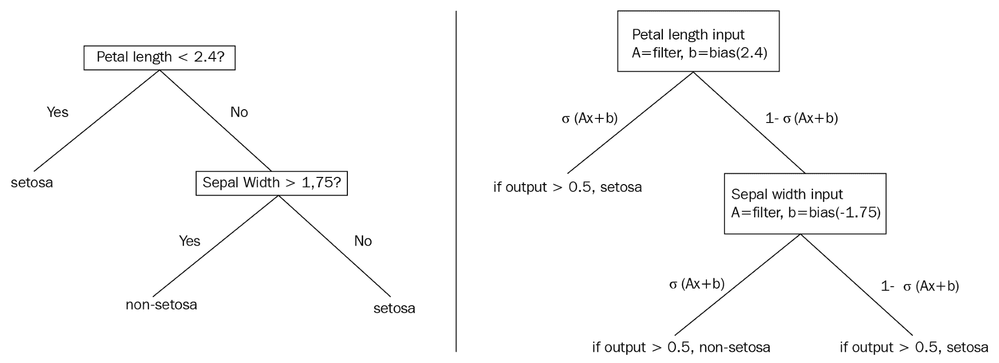

# 十一、更多 TensorFlow

在本章中，我们将介绍以下秘籍：

*   在 TensorBoard 中可视化的图
*   使用遗传算法
*   使用 K 均值聚类
*   求解常微分方程组
*   使用随机森林
*   使用 TensorFlow 和 Keras

本章中出现的所有代码均可在 [Github](https://github.com/nfmcclure/tensorflow_cookbook) 和 [Packt 仓库](https://github.com/PacktPublishing/TensorFlow-Machine-Learning-Cookbook-Second-Edition)中在线获取。

# 介绍

在本书中，我们已经看到 TensorFlow 能够实现许多模型，但 TensorFlow 可以做更多。本章将向您展示其中的一些内容。我们将首先展示如何使用 TensorBoard 的各个方面，这是 TensorFlow 附带的一项功能，它允许我们在模型训练时可视化摘要指标，图和图像。本章中的其余秘籍将展示如何使用 TensorFlow 的`group()`函数进行逐步更新。该函数将允许我们实现遗传算法，执行 k 均值聚类，求解 ODE 系统，甚至创建梯度提升随机森林。

# 可视化 TensorBoard 中的图

监视和排除机器学习算法可能是一项艰巨的任务，尤其是在您知道结果之前必须等待很长时间才能完成训练。为了解决这个问题，TensorFlow 包含一个名为 TensorBoard 的计算图可视化工具。使用 TensorBoard，即使在训练期间，我们也可以可视化和绘制重要值（损失，准确率，批次训练时间等）。

## 准备

为了说明我们可以使用 TensorBoard 的各种方法，我们将从第 3 章，线性回归中的线性回归方法的 TensorFlow 方法重新实现线性回归模型。我们将生成带有误差的线性数据，并使用 TensorFlow 损失和反向传播来匹配数据线。我们将展示如何监控数值，值集的直方图以及如何在 TensorBoard 中创建图像。

## 操作步骤

1.  首先，我们将加载脚本所需的库：

```py
import os 
import io 
import time 
import numpy as np 
import matplotlib.pyplot as plt 
import tensorflow as tf 
```

1.  我们现在将初始化一个会话并创建一个可以将 TensorBoard 摘要写入`tensorboard`文件夹的摘要编写器：

```py
sess = tf.Session() 
# Create a visualizer object 
summary_writer = tf.summary.FileWriter('tensorboard', sess.graph)
```

1.  我们需要确保`tensorboard`文件夹存在，以便摘要编写者编写`tensorboard`日志：

```py
if not os.path.exists('tensorboard'): 
   os.makedirs('tensorboard') 
```

1.  我们现在将设置模型参数并生成模型的线性数据。请注意，由于我们生成数据的方式，我们的真实斜率值是`2`。我们将随着时间的推移想象出变化的斜率，并看到它接近真正的值：

```py
batch_size = 50 
generations = 100 
# Create sample input data 
x_data = np.arange(1000)/10\. 
true_slope = 2\. 
y_data = x_data * true_slope + np.random.normal(loc=0.0, scale=25, size=1000) 
```

1.  接下来，我们将数据集拆分为训练和测试集：

```py
train_ix = np.random.choice(len(x_data), size=int(len(x_data)*0.9), replace=False) 
test_ix = np.setdiff1d(np.arange(1000), train_ix) 
x_data_train, y_data_train = x_data[train_ix], y_data[train_ix] 
x_data_test, y_data_test = x_data[test_ix], y_data[test_ix] 
```

1.  现在我们可以创建占位符，变量，模型运算，损失和优化操作：

```py
x_graph_input = tf.placeholder(tf.float32, [None]) 
y_graph_input = tf.placeholder(tf.float32, [None]) 
# Declare model variables 
m = tf.Variable(tf.random_normal([1], dtype=tf.float32), name='Slope') 
# Declare model 
output = tf.multiply(m, x_graph_input, name='Batch_Multiplication') 
# Declare loss function (L1) 
residuals = output - y_graph_input 
l2_loss = tf.reduce_mean(tf.abs(residuals), name="L2_Loss") 
# Declare optimization function 
my_optim = tf.train.GradientDescentOptimizer(0.01) 
train_step = my_optim.minimize(l2_loss) 
```

1.  我们现在可以创建一个 TensorBoard 操作来汇总标量值。我们将总结的标量值是模型的斜率估计值：

```py
with tf.name_scope('Slope_Estimate'): 
    tf.summary.scalar('Slope_Estimate', tf.squeeze(m))
```

1.  我们可以添加到 TensorBoard 的另一个摘要是直方图摘要，它在张量中输入多个值并输出图和直方图：

```py
with tf.name_scope('Loss_and_Residuals'): 
    tf.summary.histogram('Histogram_Errors', tf.squeeze(l1_loss))
    tf.summary.histogram('Histogram_Residuals', tf.squeeze(residuals)) 
```

1.  创建这些摘要操作后，我们需要创建一个将所有摘要组合在一起的摘要合并操作。然后我们可以初始化模型变量：

```py
summary_op = tf.summary.merge_all()
# Initialize Variables 
init = tf.global_variables_initializer()
sess.run(init) 
```

1.  现在，我们可以训练线性模型并编写每一代的摘要：

```py
for i in range(generations): 
    batch_indices = np.random.choice(len(x_data_train), size=batch_size) 
    x_batch = x_data_train[batch_indices] 
    y_batch = y_data_train[batch_indices] 
    _, train_loss, summary = sess.run([train_step, l2_loss, summary_op], 
                             feed_dict={x_graph_input: x_batch, 
                                        y_graph_input: y_batch}) 

    test_loss, test_resids = sess.run([l2_loss, residuals], feed_dict={x_graph_input: x_data_test, y_graph_input: y_data_test}) 

   if (i+1)%10==0: 
        print('Generation {} of {}. Train Loss: {:.3}, Test Loss: {:.3}.'.format(i+1, generations, train_loss, test_loss)) 

    log_writer = tf.train.SummaryWriter('tensorboard') 
    log_writer.add_summary(summary, i) 
```

1.  为了将最终的线性拟合图与 TensorBoard 中的数据点放在一起，我们必须以`protobuf`格式创建图的图像。为此，我们将创建一个输出`protobuf`图像的函数：

```py
def gen_linear_plot(slope): 
    linear_prediction = x_data * slope 
    plt.plot(x_data, y_data, 'b.', label='data') 
    plt.plot(x_data, linear_prediction, 'r-', linewidth=3, label='predicted line') 
    plt.legend(loc='upper left') 
    buf = io.BytesIO() 
    plt.savefig(buf, format='png') 
    buf.seek(0) 
    return(buf) 
```

1.  现在，我们可以创建`protobuf`图像并将其添加到 TensorBoard：

```py
# Get slope value
slope = sess.run(m)

# Generate the linear plot in buffer
plot_buf = gen_linear_plot(slope[0])

# Convert PNG buffer to TF image
image = tf.image.decode_png(plot_buf.getvalue(), channels=4)

# Add the batch dimension
image = tf.expand_dims(image, 0)

# Add image summary
image_summary_op = tf.summary.image("Linear_Plot", image)
image_summary = sess.run(image_summary_op)
log_writer.add_summary(image_summary, i)
log_writer.close()
```

Be careful writing image summaries too often to TensorBoard. For example, if we were to write an image summary every generation for 10,000 generations, that would generate 10,000 images worth of summary data. This tends to eat up disk space very quickly.

## 更多

1.  由于我们要从命令行运行描述的 python 脚本，我们打开命令提示符并运行以下命令：

```py
$ python3 using_tensorboard.py 

Run the command: $tensorboard --logdir="tensorboard"   Then navigate to http://127.0.0.0:6006 
Generation 10 of 100\. Train Loss: 20.4, Test Loss: 20.5\. 
Generation 20 of 100\. Train Loss: 17.6, Test Loss: 20.5\. 
Generation 90 of 100\. Train Loss: 20.1, Test Loss: 20.5\. 
Generation 100 of 100\. Train Loss: 19.4, Test Loss: 20.5\. 
```

1.  然后我们将运行前面指定的命令来启动 tensorboard：

```py
$ tensorboard --logdir="tensorboard" Starting tensorboard b'29' on port 6006 (You can navigate to http://127.0.0.1:6006) 
```

以下是我们在 TensorBoard 中可以看到的示例：



图 1：标量值，我们的斜率估计，在张量板中可视化

在这里，我们可以看到我们的标量总结的 100 代的绘图，斜率估计。事实上，我们可以看到它确实接近`2`的真正值：



图 2：在这里，我们可视化模型的误差和残差的直方图

上图显示了查看直方图摘要的一种方法，可以将其视为多个折线图：



图 3：张量板中插入的图片

前面是我们以`protobuf`格式放入的最终拟合和数据点图，并插入到 TensorBoard 中的图像摘要中。

# 使用遗传算法

TensorFlow 还可用于更新我们可以在计算图中表达的任何迭代算法。一种这样的迭代算法是遗传算法，即优化过程。

## 准备

在本文中，我们将说明如何实现简单的遗传算法。遗传算法是优化任何参数空间（离散，连续，平滑，非平滑等）的一种方法。我们的想法是创建一组随机初始化的解决方案，并应用选择，重组和变异来生成新的（可能更好的）子解决方案。整个想法取决于我们可以通过查看个人解决问题的程度来计算个体解决方案的适用性。

通常，遗传算法的概要是从随机初始化的群体开始，根据它们的适应性对它们进行排序，然后选择最适合的个体来随机重组（或交叉）以创建新的子解决方案。然后，这些子解决方案会稍微突变，以产生新的和看不见的改进，然后再添加回父群体。在我们将子代和父代结合起来之后，我们再次重复整个过程。

停止遗传算法的标准各不相同，但出于我们的目的，我们将迭代它们一定数量的世代。当我们最适合的人达到理想的适应水平或者在这么多代之后最大适应度没有改变时，我们也可以停止。

对于这个秘籍，我们将简单地说明如何在 Tensorflow 中执行此操作。我们要解决的问题是生成一个最接近地面实况函数的个体（50 个浮点数的数组）`f(x) = sin(2πx / 50)`。适应度将是个体与地面事实之间的均方误差（越高越好）的负值。

## 操作步骤

1.  我们首先加载脚本所需的库：

```py
import os 
import numpy as np 
import matplotlib.pyplot as plt 
import tensorflow as tf 
```

1.  接下来，我们将设置遗传算法的参数。在这里，我们将有`100`个体，每个个体的长度为`50`。选择百分比为 20%（保持前 20 名个人）。突变将被设置为特征数量的倒数，这是突变开始的常见位置。这意味着我们希望每个子解决方案的一个特征发生变化。我们将为`200`世代运行遗传算法：

```py
pop_size = 100 
features = 50 
selection = 0.2 
mutation = 1./ features 
generations = 200 
num_parents = int(pop_size*selection) 
num_children = pop_size - num_parents 
```

1.  我们将初始化图会话并创建基础事实函数，我们将使用它来快速计算适应度：

```py
sess = tf.Session() 
# Create ground truth 
truth = np.sin(2*np.pi*(np.arange(features, dtype=np.float32))/features) 
```

1.  接下来，我们将`population`初始化为具有随机正常输入的 TensorFlow 变量：

```py
population = tf.Variable(np.random.randn(pop_size, features), dtype=tf.float32) 
```

1.  我们现在可以为遗传算法创建占位符。占位符是为了事实，也是为了每一代都会改变的数据。由于我们希望父代之间的交叉位置发生变化，并且变异概率/值会发生变化，因此这些将是我们模型中的占位符：

```py
truth_ph = tf.placeholder(tf.float32, [1, features]) 
crossover_mat_ph = tf.placeholder(tf.float32, [num_children, features]) 
mutation_val_ph = tf.placeholder(tf.float32, [num_children, features]) 
```

1.  现在，我们将计算人口`fitness`（负均方误差），并找到表现最佳的人：

```py
fitness = -tf.reduce_mean(tf.square(tf.subtract(population, truth_ph)), 1) 
top_vals, top_ind = tf.nn.top_k(fitness, k=pop_size) 
```

1.  为了达到结果和绘图目的，我们还希望检索人群中最适合的个体：

```py
best_val = tf.reduce_min(top_vals) 
best_ind = tf.argmin(top_vals, 0) 
best_individual = tf.gather(population, best_ind) 
```

1.  接下来，我们对父代群体进行排序，并切断表现最佳的个体，使其成为下一代的父代：

```py
population_sorted = tf.gather(population, top_ind) 
parents = tf.slice(population_sorted, [0, 0], [num_parents, features]) 
```

1.  现在，我们将通过创建随机洗牌的两个父矩阵来创建子项。然后，我们将父矩阵乘以 1 和 0 的交叉矩阵，我们将为占位符生成每一代：

```py
# Indices to shuffle-gather parents 
rand_parent1_ix = np.random.choice(num_parents, num_children) 
rand_parent2_ix = np.random.choice(num_parents, num_children) 
# Gather parents by shuffled indices, expand back out to pop_size too 
rand_parent1 = tf.gather(parents, rand_parent1_ix) 
rand_parent2 = tf.gather(parents, rand_parent2_ix) 
rand_parent1_sel = tf.multiply(rand_parent1, crossover_mat_ph) 
rand_parent2_sel = tf.multiply(rand_parent2, tf.subtract(1., crossover_mat_ph)) 
children_after_sel = tf.add(rand_parent1_sel, rand_parent2_sel) 
```

1.  最后的步骤是改变子项，我们将通过向子矩阵中的少量条目添加随机正常量并将此矩阵连接回父族：

```py
mutated_children = tf.add(children_after_sel, mutation_val_ph) 
# Combine children and parents into new population 
new_population = tf.concat(0, [parents, mutated_children]) 
```

1.  我们模型的最后一步是使用 TensorFlow 的`group()`操作将新种群分配给旧种群的变量：

```py
step = tf.group(population.assign(new_population)) 
```

1.  我们现在可以初始化模型变量，如下所示：

```py
init = tf.global_variables_initializer() 
sess.run(init) 
```

1.  最后，我们遍历世代，重新创建随机交叉和变异矩阵并更新每一代的人口：

```py
for i in range(generations): 
    # Create cross-over matrices for plugging in. 
    crossover_mat = np.ones(shape=[num_children, features]) 
    crossover_point = np.random.choice(np.arange(1, features-1, step=1), num_children) 
    for pop_ix in range(num_children): 
        crossover_mat[pop_ix,0:crossover_point[pop_ix]]=0\. 
    # Generate mutation probability matrices 
    mutation_prob_mat = np.random.uniform(size=[num_children, features]) 
    mutation_values = np.random.normal(size=[num_children, features]) 
    mutation_values[mutation_prob_mat >= mutation] = 0 

    # Run GA step 
    feed_dict = {truth_ph: truth.reshape([1, features]), 
                 crossover_mat_ph: crossover_mat, 
                 mutation_val_ph: mutation_values} 
    step.run(feed_dict, session=sess) 
    best_individual_val = sess.run(best_individual, feed_dict=feed_dict) 

    if i % 5 == 0: 
       best_fit = sess.run(best_val, feed_dict = feed_dict) 
       print('Generation: {}, Best Fitness (lowest MSE): {:.2}'.format(i, -best_fit)) 
```

1.  这产生以下输出：

```py
Generation: 0, Best Fitness (lowest MSE): 1.5 
Generation: 5, Best Fitness (lowest MSE): 0.83 
Generation: 10, Best Fitness (lowest MSE): 0.55 
Generation: 185, Best Fitness (lowest MSE): 0.085 
Generation: 190, Best Fitness (lowest MSE): 0.15 
Generation: 195, Best Fitness (lowest MSE): 0.083 
```

## 工作原理

在本文中，我们向您展示了如何使用 TensorFlow 运行简单的遗传算法。为了验证它是否有效，我们还可以在一个图上查看最合适的个体解决方案和基本事实：


图 4：200 代后的真实情况和最适合个体的绘图图。我们可以看到，最合适的个体非常接近真相

## 更多

遗传算法有许多变化。我们可以有两个具有两个不同适合度标准的父代群体（例如，最低 MSE 和平滑度）。我们可以对突变值施加限制，使其不大于 1 或小于 -1。我们可以进行许多不同的更改，这些更改会有很大差异，具体取决于我们要优化的问题。对于这个人为的问题，很容易计算出适应度，但对于大多数遗传算法来说，计算适应度是一项艰巨的任务。例如，如果我们想使用遗传算法来优化卷积神经网络的架构，我们可以让个体成为参数数组。参数可以代表每个卷积层的滤波器大小，步幅大小等。这种个体的适应性将是在通过数据集的固定量的迭代之后的分类的准确率。如果我们在这个人口中有 100 个人，我们将不得不为每一代评估 100 个不同的 CNN 模型。这在计算上非常强烈。

在使用遗传算法解决问题之前，明智的做法是弄清楚计算个体的`fitness`需要多长时间。如果此操作耗时，遗传算法可能不是最佳使用工具。

# 使用 K 均值聚类

TensorFlow 还可用于实现迭代聚类算法，例如 K 均值。在本文中，我们展示了在`iris`数据集上使用 K 均值的示例。

## 准备

我们在本书中探讨的几乎所有机器学习模型都是监督模型。 TensorFlow 非常适合这些类型的问题。但是，如果我们愿意，我们也可以实现无监督的模型。例如，此秘籍将实现 K 均值聚类。

我们将实现聚类的数据集是`iris`数据集。这是一个很好的数据集的原因之一是因为我们已经知道有三种不同的目标（三种类型的鸢尾花）。这让我们知道我们正在寻找数据中的三个不同的集群。

我们将`iris`数据集聚类为三组，然后将这些聚类的准确率与实际标签进行比较。

## 操作步骤

1.  首先，我们加载必要的库。我们还从`sklearn`加载了一些 PCA 工具，以便我们可以将结果数据从四维更改为二维，以实现可视化目的：

```py
import numpy as np 
import matplotlib.pyplot as plt 
import tensorflow as tf 
from sklearn import datasets 
from scipy.spatial import cKDTree 
from sklearn.decomposition import PCA 
from sklearn.preprocessing import scale 
```

1.  我们启动图会话，并加载`iris`数据集：

```py
sess = tf.Session() 
iris = datasets.load_iris() 
num_pts = len(iris.data) 
num_feats = len(iris.data[0]) 
```

1.  我们现在将设置组，代，并创建图所需的变量：

```py
k=3  
generations = 25 
data_points = tf.Variable(iris.data) 
cluster_labels = tf.Variable(tf.zeros([num_pts], dtype=tf.int64)) 
```

1.  我们需要的下一个变量是每组的质心。我们将通过随机选择`iris`数据集的三个不同点来初始化 k-means 算法的质心：

```py
rand_starts = np.array([iris.data[np.random.choice(len(iris.data))] for _ in range(k)]) 
centroids = tf.Variable(rand_starts) 
```

1.  现在，我们需要计算每个数据点和每个`centroids`之间的距离。我们通过将`centroids`扩展为矩阵来实现这一点，对数据点也是如此。然后我们将计算两个矩阵之间的欧几里德距离：

```py
centroid_matrix = tf.reshape(tf.tile(centroids, [num_pts, 1]), [num_pts, k, num_feats]) 
point_matrix = tf.reshape(tf.tile(data_points, [1, k]), [num_pts, k, num_feats]) 
distances = tf.reduce_sum(tf.square(point_matrix - centroid_matrix), reduction_indices=2) 
```

1.  `centroids`赋值是每个数据点最接近的`centroids`（最小距离）：

```py
centroid_group = tf.argmin(distances, 1) 
```

1.  现在，我们必须计算组平均值以获得新的质心：

```py
def data_group_avg(group_ids, data): 
    # Sum each group 
    sum_total = tf.unsorted_segment_sum(data, group_ids, 3) 
    # Count each group 
    num_total = tf.unsorted_segment_sum(tf.ones_like(data), group_ids, 3) 
    # Calculate average 
    avg_by_group = sum_total/num_total 
    return(avg_by_group) 
means = data_group_avg(centroid_group, data_points) 
update = tf.group(centroids.assign(means), cluster_labels.assign(centroid_group)) 
```

1.  接下来，我们初始化模型变量：

```py
init = tf.global_variables_initializer() 
sess.run(init) 
```

1.  我们将遍历几代并相应地更新每个组的质心：

```py
for i in range(generations): 
    print('Calculating gen {}, out of {}.'.format(i, generations)) 
    _, centroid_group_count = sess.run([update, centroid_group]) 
    group_count = [] 
    for ix in range(k): 
        group_count.append(np.sum(centroid_group_count==ix)) 
    print('Group counts: {}'.format(group_count)) 
```

1.  这产生以下输出：

```py
Calculating gen 0, out of 25\. Group counts: [50, 28, 72] Calculating gen 1, out of 25\. Group counts: [50, 35, 65] Calculating gen 23, out of 25\. Group counts: [50, 38, 62] Calculating gen 24, out of 25\. Group counts: [50, 38, 62] 
```

1.  为了验证我们的聚类，我们可以使用聚类进行预测。我们现在看到有多少数据点位于相同鸢尾种类的相似簇中：

```py
[centers, assignments] = sess.run([centroids, cluster_labels]) 
def most_common(my_list): 
    return(max(set(my_list), key=my_list.count)) 
label0 = most_common(list(assignments[0:50])) 
label1 = most_common(list(assignments[50:100])) 
label2 = most_common(list(assignments[100:150])) 
group0_count = np.sum(assignments[0:50]==label0) 
group1_count = np.sum(assignments[50:100]==label1) 
group2_count = np.sum(assignments[100:150]==label2) 
accuracy = (group0_count + group1_count + group2_count)/150\. 
print('Accuracy: {:.2}'.format(accuracy)) 
```

1.  这产生以下输出：

```py
Accuracy: 0.89 
```

1.  为了直观地看到我们的分组，如果它们确实已经分离出`iris`物种，我们将使用 PCA 将四维转换为二维，并绘制数据点和组。在 PCA 分解之后，我们在 x-y 值网格上创建预测，以绘制颜色图：

```py
pca_model = PCA(n_components=2) 
reduced_data = pca_model.fit_transform(iris.data) 
# Transform centers 
reduced_centers = pca_model.transform(centers) 
# Step size of mesh for plotting 
h = .02 
x_min, x_max = reduced_data[:, 0].min() - 1, reduced_data[:, 0].max() + 1 
y_min, y_max = reduced_data[:, 1].min() - 1, reduced_data[:, 1].max() + 1 
xx, yy = np.meshgrid(np.arange(x_min, x_max, h), np.arange(y_min, y_max, h))  
# Get k-means classifications for the grid points 
xx_pt = list(xx.ravel()) 
yy_pt = list(yy.ravel()) 
xy_pts = np.array([[x,y] for x,y in zip(xx_pt, yy_pt)]) 
mytree = cKDTree(reduced_centers) 
dist, indexes = mytree.query(xy_pts) 
indexes = indexes.reshape(xx.shape) 
```

1.  并且，这里是`matplotlib`代码将我们的发现结合在一个绘图上。这个密码的绘图部分很大程度上改编自 [scikit-learn](http://scikit-learn.org/) [文档网站上的演示](http://scikit-learn.org/stable/auto_examples/cluster/plot_kmeans_digits.html)：

```py
plt.clf() 
plt.imshow(indexes, interpolation='nearest', 
           extent=(xx.min(), xx.max(), yy.min(), yy.max()), 
           cmap=plt.cm.Paired, 
           aspect='auto', origin='lower') 
# Plot each of the true iris data groups 
symbols = ['o', '^', 'D'] 
label_name = ['Setosa', 'Versicolour', 'Virginica'] 
for i in range(3): 
    temp_group = reduced_data[(i*50):(50)*(i+1)] 
    plt.plot(temp_group[:, 0], temp_group[:, 1], symbols[i], markersize=10, label=label_name[i]) 
# Plot the centroids as a white X 
plt.scatter(reduced_centers[:, 0], reduced_centers[:, 1], 
            marker='x', s=169, linewidths=3, 
            color='w', zorder=10) 
plt.title('K-means clustering on Iris Datasets' 
          'Centroids are marked with white cross') 
plt.xlim(x_min, x_max) 
plt.ylim(y_min, y_max) 
plt.legend(loc='lower right') 
plt.show() 
```

这个绘图代码将向我们展示三个类，三个类的预测空间以及每个组的质心：



图 5：显示 K 均值的无监督分类算法的屏幕截图；可以用来将三种鸢尾花种组合在一起。三个 K 均值组是三个阴影区域，三个不同的点（圆，三角形和菱形）是三个真正的物种分类

## 更多

对于此秘籍，我们使用 TensorFlow 将`iris`数据集聚类为三组。然后，我们计算了落入相似组的数据点的百分比（89%），并绘制了所得 K 均值组的图。由于 K 均值作为分类算法是局部线性的（线性分离器向上），因此很难学习杂色鸢尾和弗吉尼亚鸢尾之间的天然非线性边界。但是，一个优点是 K 均值算法根本不需要标记数据来执行。

# 求解常微分方程组

TensorFlow 可用于许多算法实现和过程。 TensorFlow 多功能性的一个很好的例子是实现 ODE 求解器。以数字方式求解 ODE 是一种迭代过程，可以在计算图中轻松描述。对于这个秘籍，我们将解决 Lotka-Volterra 捕食者 - 猎物系统。

## 准备

该秘籍将说明如何求解常微分方程（ODE）系统。我们可以使用与前两节类似的方法来更新值，因为我们迭代并解决 ODE 系统。

我们将考虑的 ODE 系统是着名的 Lotka-Volterra 捕食者 - 猎物系统。该系统显示了捕食者 - 食饵系统如何在给定特定参数的情况下振荡。

Lotka-Volterra 系统于 1920 年在一篇论文中发表（参见图 1，标量值，我们的斜率估计，在张量板中可视化）。我们将使用类似的参数来表明可以发生振荡系统。这是以数学上离散的方式表示的系统：





在这里，`X`是猎物，`Y`将成为捕食者。我们通过`a`，`b`，`c`和`d`的值来确定哪个是猎物，哪个是捕食者：对于猎物，`a > 0`，`b < 0`和捕食者，`c < 0`，`d > 0`。我们将在 TensorFlow 解决方案中将此离散版本实现到系统中。

## 操作步骤

1.  我们首先加载库并启动图会话：

```py
import matplotlib.pyplot as plt 
import tensorflow as tf 
sess = tf.Session() 
```

1.  然后我们在图中声明我们的常量和变量：

```py
x_initial = tf.constant(1.0) 
y_initial = tf.constant(1.0) 
X_t1 = tf.Variable(x_initial) 
Y_t1 = tf.Variable(y_initial) 
# Make the placeholders 
t_delta = tf.placeholder(tf.float32, shape=()) 
a = tf.placeholder(tf.float32, shape=()) 
b = tf.placeholder(tf.float32, shape=()) 
c = tf.placeholder(tf.float32, shape=()) 
d = tf.placeholder(tf.float32, shape=()) 
```

1.  接下来，我们将实现先前引入的离散系统，然后更新`X`和`Y`群体：

```py
X_t2 = X_t1 + (a * X_t1 + b * X_t1 * Y_t1) * t_delta 
Y_t2 = Y_t1 + (c * Y_t1 + d * X_t1 * Y_t1) * t_delta 
# Update to New Population 
step = tf.group( 
  X_t1.assign(X_t2), 
  Y_t1.assign(Y_t2)) 
```

1.  我们现在初始化图并运行离散 ODE 系统，并使用特定参数来说明循环行为：

```py
init = tf.global_variables_initializer() sess.run(init) # Run the ODE prey_values = [] predator_values = [] for i in range(1000): # Step simulation (using constants for a known cyclic solution) step.run({a: (2./3.), b: (-4./3.), c: -1.0, d: 1.0, t_delta: 0.01}, session=sess) # Store each outcome temp_prey, temp_pred = sess.run([X_t1, Y_t1]) prey_values.append(temp_prey) predator_values.append(temp_pred)
```

A steady state (and cyclic) solution to this specific system, the Lotka-Volterra equations, very much depends on specific parameters and population values. We encourage the reader to try different parameters and values to see what can happen.

1.  现在，我们可以绘制捕食者和猎物的值：

```py
plt.plot(prey_values, label="Prey") 
plt.plot(predator_values, label="Predator") 
plt.legend(loc='upper right') 
plt.show() 
```

这个绘图代码将生成一个屏幕截图，显示掠食者和猎物的振荡种群：



图 6：在这里，我们绘制 ODE 解决方案的捕食者和猎物值。事实上，我们可以看到周期确实发生了

## 工作原理

我们使用 TensorFlow 逐步求解 ODE 系统的离散版本。对于特定参数，我们看到捕食者 - 食饵系统确实可以具有循环解。这在我们的系统生物学上是有意义的，因为如果有太多的捕食者，猎物开始死亡，然后掠食者的食物就会减少，所以他们会死掉，等等。

## 另见

[Lotka，A.J.，关于有机系统中某些节奏关系的分析性说明](https://www.ncbi.nlm.nih.gov/pmc/articles/PMC1084562/)。

# 使用随机森林

随机森林算法建立在随机选择的观察和/或随机选择的特征上的聚合决策树上。我们不会介绍如何训练决策树，但会显示有些类型的随机森林可以使用梯度提升训练，TensorFlow 可以为我们计算。

## 准备

基于树的算法传统上是非平滑的，因为它们基于对数据进行分区以最小化目标输出中的方差。非光滑方法不适合基于梯度的方法。 TensorFlow 依赖于以下事实：模型中使用的函数是平滑的，并且它自动计算如何更改模型参数以最小化函数损失。 TensorFlow 绕过这个障碍的方式是对决策边界进行平滑逼近。可以使用 softmax 函数或类似形状函数来近似决策边界。

决策树将通过生成规则在数据集上提供硬拆分，例如，如果`x &gt; 0.5`，则移动到树的这个分支....这告诉我们整个数据子集将组合在一起或拆分，取决于`x`的值。这个的平滑近似处理概率而不是整个分裂。这意味着数据集的每次观察都有可能存在于树的每个末端节点中。下图比较传统决策树和概率决策树，可以更好地说明这些差异。

下图说明了两个示例决策树之间的区别：



This diagram illustrates a standard decision tree (left) which is non-differentiable, and a smooth decision tree (right), which illustrates the usage of sigmoid functions to develop probabilities of an observation appearing in a labeled leaf or end-node.

> 我们选择不详细介绍函数的可微性，连续性和平滑性。本节的目的是提供关于如何通过可微分模型近似非可微分模型的直观描述。有关更多数学详细信息，我们建议读者查看本秘籍末尾的“另见”部分。

## 操作步骤

TensorFlow 包含了一些我们将依赖于此秘籍的默认模型估计函数。有两个主要的梯度提升模型，回归树和分类树。对于此示例，我们将使用回归树来预测[波士顿房价数据集](https://www.cs.toronto.edu/~delve/data/boston/bostonDetail.html)。

1.  首先，我们加载必要的库：

```py
import numpy as np
import tensorflow as tf
from keras.datasets import boston_housing
from tensorflow.python.framework import ops
ops.reset_default_graph()
```

1.  接下来，我们从 TensorFlow 估计器库中设置我们将要使用的模型。在这里，我们将使用`BoostedTreesRegressor`模型，该模型用于使用梯度提升树进行回归：

```py
regression_classifier = tf.estimator.BoostedTreesRegressor
```

> 或者，对于二分类问题，读者可以使用估计器`BoostedTreesClassifier`。目前不支持多类别分类，尽管它将来会在路线图上。

1.  现在，我们可以使用 Keras 数据导入函数将波士顿住房价格数据集加载到一行中，如下所示：

```py
(x_train, y_train), (x_test, y_test) = boston_housing.load_data()
```

1.  在这里，我们可以设置一些模型参数；批量大小是一次训练的训练观测数量，我们将训练`500`迭代，梯度提升森林将有`100`树，每棵树的最大深度（分裂数）为`6`。

```py
# Batch size
batch_size = 32
# Number of training steps
train_steps = 500
# Number of trees in our 'forest'
n_trees = 100
# Maximum depth of any tree in forest
max_depth = 6
```

1.  TensorFlow 提供的模型估计器需要输入函数。我们将为估计器函数创建数据输入函数。但首先，我们需要将数据放入正确标记的`numpy`数组格式的字典中。这些在 TensorFlow 中称为特征列。纯数字列尚不支持，因此我们将数字列放入自动存储桶中，如下所示：（a）二元特征将具有两个存储桶，（b）其他连续数字特征将被划分为 5 个存储桶。

```py
binary_split_cols = ['CHAS', 'RAD']
col_names = ['CRIM', 'ZN', 'INDUS', 'CHAS', 'NOX', 'RM', 'AGE', 'DIS', 'RAD', 'TAX', 'PTRATIO', 'B', 'LSTAT']
X_dtrain = {col: x_train[:, ix] for ix, col in enumerate(col_names)}
X_dtest = {col: x_test[:, ix] for ix, col in enumerate(col_names)}

# Create feature columns!
feature_cols = []
for ix, column in enumerate(x_train.T):
    col_name = col_names[ix]

    # Create binary split feature
    if col_name in binary_split_cols:
        # To create 2 buckets, need 1 boundary - the mean
        bucket_boundaries = [column.mean()]
        numeric_feature = tf.feature_column.numeric_column(col_name)
        final_feature = tf.feature_column.bucketized_column(source_column=numeric_feature, boundaries=bucket_boundaries)
    # Create bucketed feature
    else:
        # To create 5 buckets, need 4 boundaries
        bucket_boundaries = list(np.linspace(column.min() * 1.1, column.max() * 0.9, 4))
        numeric_feature = tf.feature_column.numeric_column(col_name)
        final_feature = tf.feature_column.bucketized_column(source_column=numeric_feature, boundaries=bucket_boundaries)

    # Add feature to feature_col list
    feature_cols.append(final_feature)
```

> 将输入函数的`shuffle`选项设置为`True`进行训练，`False`进行测试是个好主意。我们想在每个周期改变`X`和`Y`训练集，但不是在测试期间。

1.  我们现在使用 TensorFlow 估计器中输入库的`numpy`输入函数声明我们的数据输入函数。我们将指定我们创建的训练观察词典和一组`y`目标。

```py
input_fun = tf.estimator.inputs.numpy_input_fn(X_dtrain, y=y_train, batch_size=batch_size,        num_epochs=10, shuffle=True)
```

1.  现在，我们定义我们的模型并开始训练：

```py
model = regression_classifier(feature_columns=feature_cols,
                              n_trees=n_trees,
                              max_depth=max_depth,
                              learning_rate=0.25,
                              n_batches_per_layer=batch_size)
model.train(input_fn=input_fun, steps=train_steps)
```

1.  在训练期间，我们应该看到类似的输出如下：

```py
INFO:tensorflow:Using default config.
WARNING:tensorflow:Using temporary folder as model directory: /tmp/tmpqxyd62cu
INFO:tensorflow:Using config: {'_model_dir': '/tmp/tmpqxyd62cu', '_tf_random_seed': None, '_save_summary_steps': 100, '_save_checkpoints_steps': None, '_save_checkpoints_secs': 600, '_session_config': None, '_keep_checkpoint_max': 5, '_keep_checkpoint_every_n_hours': 10000, '_log_step_count_steps': 100, '_train_distribute': None, '_device_fn': None, '_service': None, '_cluster_spec': <tensorflow.python.training.server_lib.ClusterSpec object at 0x7f43129d77b8>, '_task_type': 'worker', '_task_id': 0, '_global_id_in_cluster': 0, '_master': '', '_evaluation_master': '', '_is_chief': True, '_num_ps_replicas': 0, '_num_worker_replicas': 1}
INFO:tensorflow:Calling model_fn.
INFO:tensorflow:Done calling model_fn.
INFO:tensorflow:Create CheckpointSaverHook.
INFO:tensorflow:Graph was finalized.
INFO:tensorflow:Running local_init_op.
INFO:tensorflow:Done running local_init_op.
INFO:tensorflow:Saving checkpoints for 0 into /tmp/tmpqxyd62cu/model.ckpt.
INFO:tensorflow:loss = 691.09814, step = 1
INFO:tensorflow:global_step/sec: 587.923
INFO:tensorflow:loss = 178.62021, step = 101 (0.171 sec)
INFO:tensorflow:Saving checkpoints for 127 into /tmp/tmpqxyd62cu/model.ckpt.
INFO:tensorflow:Loss for final step: 37.436565.
Out[190]: <tensorflow.python.estimator.canned.boosted_trees.BoostedTreesRegressor at 0x7f43129d7470>
```

1.  为了评估我们的模型，我们为测试数据创建了另一个输入函数，并获得每个测试数据点的预测。以下是获取预测并打印平均绝对误差（MAE）的代码：

```py
p_input_fun = tf.estimator.inputs.numpy_input_fn(X_dtest, y=y_test, batch_size=batch_size, num_epochs=1, shuffle=False)
# Get predictions
predictions = list(model.predict(input_fn=p_input_fun))
final_preds = [pred['predictions'][0] for pred in predictions]

# Get accuracy (mean absolute error, MAE)
mae = np.mean([np.abs((actual - predicted) / predicted) for actual, predicted in zip(y_test, final_preds)])
print('Mean Abs Err on test set: {}'.format(acc))
```

1.  其中以`0.71`打印出误差。请注意，由于随机播放的随机性，读者可能会得到略微不同的结果。为了提高准确率，我们可以考虑增加数字周期或引入更低的学习率甚至是某种类型的衰减学习率（指数或线性）：

```py
Mean Abs Err on test set: 0.7111111111111111
```

## 工作原理

在本文中，我们将说明如何使用 TensorFlow 估计器和 TensorFlow 提供的数据输入函数。这些函数非常强大，不仅使我们的 TensorFlow 代码更短，更易读，而且还提高了算法的效率，减少了创建和测试算法所需的开发时间。

## 另见

有关决策树，随机森林，梯度提升森林以及可微分性，平滑性和连续性背后的数学的更多参考，我们鼓励读者阅读以下参考文献。

1.  决策树教程。来自[伯克利的机器学习速成课程](https://ml.berkeley.edu/blog/2017/12/26/tutorial-5/)。
2.  [随机森林 python 教程，克里斯阿尔邦](https://chrisalbon.com/machine_learning/trees_and_forests/random_forest_classifier_example/)
3.  关于凸函数的精美 PDF 演示，它们如何用于机器学习，以及平滑度，可微性和连续性之间的差异。作者为弗朗西斯巴赫。最后还有[大约 6 页有用的参考文献](https://www.di.ens.fr/~fbach/gradsto_allerton.pdf)，读者可能会觉得有用。 
4.  关于软决策树的文章：[将神经网络提炼为软决策树，Frosst 和 Hinton，2017](https://cex.inf.unibz.it/resources/Frosst+Hinton-CExAIIA_2017.pdf)。
5.  [TensorFlow 实现的一个神经树](https://github.com/benoitdescamps/Neural-Tree)。作者：Benoit Deschamps。

# 使用 TensorFlow 和 Keras

TensorFlow 非常适合为程序员提供的灵活性和强大功能。这样做的一个缺点是原型模型和迭代各种测试对程序员来说可能很麻烦。 Keras 是深度学习库的包装器，可以更轻松地处理模型的各个方面并使编程更容易。在这里，我们选择在 TensorFlow 之上使用 Keras。事实上，使用带有 TensorFlow 后端的 Keras 非常受欢迎，TensorFlow 中有一个 Keras 库。对于这个秘籍，我们将使用该 TensorFlow 库在 MNIST 数据集上进行完全连接的神经网络和简单的 CNN 图像网络。

## 准备

对于这个秘籍，我们将使用驻留在 TensorFlow 内部的 Keras 函数。 [Keras](https://keras.io/) 已经是一个可以安装的独立 python 库了。如果您选择使用纯 Keras 路线，则必须为 Keras 选择后端（如 TensorFlow）。

在本文中，我们将在 MNIST 图像识别数据集上执行两个单独的模型。第一个是直接完全连接的神经网络，而第二个是从第 8 章第 2 节“实现简单的 CNN”复制我们的 CNN 网络。

## 操作步骤

1.  我们将首先为脚本加载必要的库。

```py
import tensorflow as tf
from sklearn.preprocessing import MultiLabelBinarizer
from keras.utils import to_categorical
from tensorflow import keras
from tensorflow.python.framework import ops
ops.reset_default_graph()

# Load MNIST data
from tensorflow.examples.tutorials.mnist import input_data
```

1.  我们可以在 TensorFlow 中使用提供的 MNIST 数据导入函数加载库。虽然原始 MNIST 图像是 28 像素乘 28 像素，但导入的数据是它们的扁平版本，其中每个观察是 0 到 1 之间的 784 个灰度点的行。y 标签作为 0 到 9 之间的整数导入。

```py
mnist = input_data.read_data_sets("MNIST_data/")
x_train = mnist.train.images
x_test = mnist.test.images
y_train = mnist.train.labels
y_test = mnist.test.labels
y_train = [[i] for i in y_train]
y_test = [[i] for i in y_test]
```

1.  我们现在将使用 scikit-learn 的`MultiLabelBinarizer()`函数将目标整数转换为单热编码向量，如下所示：

```py
one_hot = MultiLabelBinarizer()
y_train = one_hot.fit_transform(y_train)
y_test = one_hot.transform(y_test)
```

1.  我们将创建一个三层完全连接的神经网络，其中包含 32，16 和 10 个相应的隐藏节点。然后最终输出的大小为 10（每个数字一个）。我们使用以下代码创建此网络：

```py
# We start with a 'sequential' model type (connecting layers together)
model = keras.Sequential()

# Adds a densely-connected layer with 32 units to the model, followed by an ReLU activation.
model.add(keras.layers.Dense(32, activation='relu'))

# Adds a densely-connected layer with 16 units to the model, followed by an ReLU activation.
model.add(keras.layers.Dense(16, activation='relu'))

# Add a softmax layer with 10 output units:
model.add(keras.layers.Dense(10, activation='softmax'))
```

1.  为了训练模型，我们接下来要做的就是使用适当的参数调用`compile()`方法。我们需要的参数是优化函数和损失类型。但我们也想记录模型的准确率，因此度量列表包括`accuracy`参数。

```py
model.compile(optimizer=tf.train.AdamOptimizer(0.001),
              loss='categorical_crossentropy',
              metrics=['accuracy'])
```

1.  这将使输出应类似于以下内容：

```py
Epoch 1/5
   64/55000 [..............................] - ETA: 1:44 - loss: 2.3504 - acc: 0.0625
 3776/55000 [=>............................] - ETA: 2s - loss: 1.7904 - acc: 0.3676 
...
47104/55000 [========================>.....] - ETA: 0s - loss: 0.1337 - acc: 0.9615
50880/55000 [==========================>...] - ETA: 0s - loss: 0.1336 - acc: 0.9617
55000/55000 [==============================] - 1s 13us/step - loss: 0.1335 - acc: 0.9615
Out[]: <tensorflow.python.keras.callbacks.History at 0x7f5768a40da0>
```

> 要配置均方误差损失的回归模型，我们将使用模型编译，如下所示：`model.compile(optimizer=tf.train.AdamOptimizer(0.01), loss='mse', metrics=['mae'])`

1.  接下来，我们将看到如何实现具有两个卷积层的 CNN 模型，其具有最大池，全部后面是完全连接的层。首先，我们必须将平面图像重塑为 2D 图像，并将 y 目标转换为 numpy 数组，如下所示：00

```py
x_train = x_tra0in.reshape(x_train.shape[0], 28, 28, 1)
x_test = x_test.reshape(x_test.shape[0], 28, 28, 1)
input_shape = (28, 28, 1)
num_classes = 10

# Categorize y targets
y_test = to_categorical(mnist.test.labels)
y_train = to_categorical(mnist.train.labels)
```

1.  我们将像以前一样以类似的顺序层方法创建 CNN。这次我们将使用`Conv2D()`，`MaxPooling2D()`和`Dense()` Keras 函数创建我们的 CNN 模型，如下所示：

```py
cnn_model = keras.Sequential()
# First convolution layer
cnn_model.add(keras.layers.Conv2D(25,
                                  kernel_size=(4, 4),
                                  strides=(1, 1),
                                  activation='relu',
                                  input_shape=input_shape))
# Max pooling
cnn_model.add(keras.layers.MaxPooling2D(pool_size=(2, 2),
                                        strides=(2, 2)))
# Second convolution layer
cnn_model.add(keras.layers.Conv2D(50,
                                  kernel_size=(5, 5),
                                  strides=(1, 1),
                                  activation='relu'))
# Max pooling
cnn_model.add(keras.layers.MaxPooling2D(pool_size=(2, 2),
                                        strides=(2, 2)))
# Flatten for dense (fully connected) layer
cnn_model.add(keras.layers.Flatten())
# Add dense (fully connected) layer
cnn_model.add(keras.layers.Dense(num_classes, activation='softmax'))
```

1.  接下来，我们将通过选择优化和损失函数来编译我们的模型。

```py
cnn_model.compile(optimizer=tf.train.AdamOptimizer(0.001),
                  loss='categorical_crossentropy',
                  metrics=['accuracy'])
```

1.  Keras 还允许我们将函数插入到名为`Callback`的训练代码中。回调是在代码中的某些时间执行的函数，可用于执行各种函数。有许多预制回调，可以保存模型，在特定标准下停止训练，记录值等等。有关各种选项的更多信息，请参阅[此链接](https://keras.io/callbacks/)。为了说明如何制作我们自己的自定义回调并显示它们如何工作，我们将创建一个名为`RecordAccuracy()`的回调，它是一个 Keras `Callback`类，并将在每个周期的末尾存储精度，如下所示：

```py
class RecordAccuracy(keras.callbacks.Callback):
    def on_train_begin(self, logs={}):
        self.acc = []

    def on_epoch_end(self, batch, logs={}):
        self.acc.append(logs.get('acc'))

accuracy = RecordAccuracy()
```

1.  接下来，我们将使用`fit()`方法训练我们的 CNN 模型。这里我们将提供`validation_data`和`callbacks`如下：

```py
cnn_model.fit(x_train,
              y_train,
              batch_size=64,
              epochs=3,
              validation_data=(x_test, y_test),
              callbacks=[accuracy])

print(accuracy.acc)
```

1.  此训练将产生类似的输出，如下所示：

```py
Train on 55000 samples, validate on 64 samples
Epoch 1/3
   64/55000 [..............................] - ETA: 2:59 - loss: 2.2805 - acc: 0.0625
  192/55000 [>.............................] - ETA: 1:14 - loss: 2.2729 - acc: 0.1302\
...
54848/55000 [============================>.] - ETA: 0s - loss: 0.0603 - acc: 0.9816
54976/55000 [============================>.] - ETA: 0s - loss: 0.0603 - acc: 0.9816
55000/55000 [==============================] - 26s 469us/step - loss: 0.0604 - acc: 0.9816 - val_loss: 0.0139 - val_acc: 1.0000
Out[]: <tensorflow.python.keras.callbacks.History at 0x7f69494c7780>

[0.9414363636450334, 0.9815818181731484, 0.9998980778226293]
```

## 工作原理

在这个秘籍中，我们展示了 Keras 的简洁创建和训练模型。您可以自动处理变量类型，维度和数据摄取的许多复杂细节。虽然这可以让人放心，但我们应该意识到，如果我们掩盖太多模型细节，我们可能无意中实现了错误的模型。

## 另见

有关 Keras 的更多信息，建议读者查看以下资源：

*   [Keras 官方文档](https://keras.io/)
*   [TensorFlow Keras 教程](https://www.tensorflow.org/guide/keras)
*   [“Keras 简介”，Francois Chollet 在斯坦福大学的客座讲座（幻灯片中的 PDF 格式）]https://web.stanford.edu/class/cs20si/lectures/march9guestlecture.pdf

