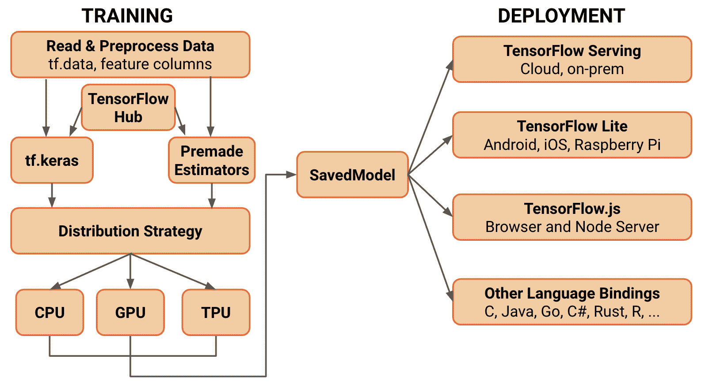

# 一、TensorFlow 2.0 入门

本书旨在使读者熟悉 **TensorFlow 2.0**（**TF 2.0**）中引入的新功能，并在构建机器学习应用时使您发挥其潜力。 本章概述了 TF 2.0 中新的架构和 API 级别的变化。 我们将介绍 TF 2.0 的安装和设置，并将比较有关 **TensorFlow 1.x**（**TF 1.x**）的更改，例如 Keras API 和 Layer API。 我们还将涵盖丰富的扩展，例如 TensorFlow 概率，Tensor2Tensor，参差不齐的 Tensors，以及新的针对损失函数的自定义训练逻辑。 本章还总结了对层 API 和其他 API 的更改。

本章将涵盖以下主题：

+   TF 2.0 的主要变化
+   适用于 TF 2.0 的推荐技术
+   使代码 TF 2.0 原生
+   常见问题
+   TF 2.0 的未来

# 技术要求

在开始执行前人脸分中描述的步骤之前，您需要具备以下条件：

*   Python 3.4 或更高版本
*   具有 Ubuntu 16.04 或更高版本的计算机（对于大多数基于 \*NIX 的系统，例如 macOS 或其他 Linux 变体，说明仍然相似）

# 什么是新增的？

TF 2.0 的理念基于简单性和易用性。 主要更新包括使用`tf.keras`轻松构建模型并急切执行，可在任何平台上进行生产和商业使用的强大模型部署，强大的实验技术和研究工具，以及用于简化 API 的 API 简化。

下图简化了 TF 2.0 的新组织：



上图着重于使用 Python API 进行训练和部署； 但是，其他受支持的语言（包括 Julia，JavaScript 和 R）也遵循相同的过程。TF 2.0 的流程是...

# 来自 TF 1.x 的更改

TF 1.x 和 TF 2.0 之间的第一个主要区别是 API 的组织。 TF 2.0 减少了 API 结构中的冗余。 主要更改包括删除`tf.app`，`tf.flags`和`tf.logging`，以支持其他 Python 模块，例如`absl-py`和内置的日志记录功能。

`tf.contrib`库现在也已从主要 TensorFlow 存储库中删除。 该库中实现的代码已移至其他位置或已移至 TensorFlow 附加库。 这样做的原因是`contrib`模块已经超出了单个存储库中可以维护的范围。

其他更改包括删除`QueueRunner`模块以支持使用`tf.data`，删除图集合以及更改如何处理变量。 `QueueRunner`模块是一种向模型提供数据以进行训练的方法，但是它比`tf.data`复杂且难于使用，后者现在是将数据提供给模型的默认方法。 在第 3 章“设计和构造输入数据管道”中，说明了将`tf.data`用于数据管道的其他好处。

TF 2.0 的另一个主要变化是没有更多的全局变量。 在 TF 1.x 中，使用`tf.Variable`创建的变量将被放在默认图中，并且仍可以通过其名称恢复。 TF 1.x 具有各种机制，旨在帮助用户恢复变量，例如变量作用域，全局集合以及诸如`tf.get_global_step`和`tf.global_variables_initializer`之类的辅助方法。 对于 TF 中的默认变量行为，所有这些都已在 TF 2.0 中删除。

# TF 2.0 安装和设置

本节介绍了使用不同方法和不同系统配置在系统上安装 TF 2.0 所需的步骤。 建议入门级用户从基于`pip`和`virtualenv`的方法开始。 对于 GPU 版本的用户，推荐使用`docker`。

# 安装和使用 PIP

对于初学者来说，`pip`是 Python 社区中流行的包管理系统。 如果您的系统上未安装此软件，请先安装它，然后再继续进行。 在许多 Linux 安装中，默认情况下安装了 Python 和`pip`。 您可以通过键入以下命令来检查是否已安装`pip`：

```py
python3 -m pip --help
```

如果看到`blurb`描述`pip`支持的不同命令，则说明`pip`已安装在系统上。 如果未安装`pip`，您将看到一条错误消息，类似于`No module named pip` <q>。</q>

隔离开发环境通常是一个好主意。 这极大地简化了依赖项管理并简化了软件开发过程。 我们可以使用 Python 中名为`virtualenv`的工具来实现环境隔离。 此步骤是可选的，但强烈建议：

```py
>>mkdir .venv
>>virtualenv --python=python3.6 .venv/
>>source .venv.bin/activate
```

您可以使用`pip`安装 TensorFlow，如以下命令所示：

```py
pip3 install tensorflow==version_tag
```

例如，如果要安装版本`2.0.0-beta1`，则命令应如下所示：

```py
pip3 install tensorflow==2.0.0-beta1
```

最新包更新的完整列表可在[这个页面](https://pypi.org/project/tensorflow/#history)中找到。

您可以通过运行以下命令来测试安装：

```py
python3 -c "import tensorflow as tf; a = tf.constant(1); print(tf.math.add(a, a))"
```

# 使用 Docker

如果您想将 TensorFlow 安装与系统的其余部分隔离开来，则可能要考虑使用 Docker 镜像进行安装。 这将要求您在系统上安装 Docker。 可在[这个页面](https://docs.docker.com/install/)上获得安装说明。

为了在 Linux 系统上使用不带`sudo`的 Docker，[请执行以下安装后步骤](https://docs.docker.com/install/linux/linux-postinstall/)。

TensorFlow 团队正式支持 Docker 镜像作为安装方式。 对于用户而言，这意味着可以在[这里](https://hub.docker.com/r/tensorflow/tensorflow/)下载更新的 Docker 镜像。

使用以下命令在本地下载 Docker 镜像：...

# GPU 安装

TensorFlow 的 GPU 版本的安装与 CPU 版本的过程稍有不同。 可以使用`pip`和 Docker 进行安装。 安装过程的选择归结为最终目标。 基于 Docker 的过程更容易，因为它涉及到安装更少的附加组件。 它还有助于避免库冲突。 但是，这可能会带来管理容器环境的额外开销。 基于`pip`的版本涉及安装更多的其他组件，但具有更高的灵活性和效率。 它使结果安装无需任何虚拟化即可直接在本地主机上运行。

要继续进行操作，假设您已经设置了必要的硬件，则至少需要以下软件。 [NVIDIA GPU 驱动程序的链接](https://www.nvidia.com/Download/index.aspx?lang=en-us)中提供了详细的安装说明。

# 使用 Docker 安装

在撰写本书时，此选项仅适用于在 Linux 主机上运行的 NVIDIA GPU。 如果您遇到平台限制，那么这是一个很好的选择，因为它可以大大简化流程。 通过利用预构建的容器，还可以最大程度地减少需要安装的其他软件组件的数量。 要继续，我们需要安装`nvidia-docker`。 请参考以下链接以获取更多详细信息：

*   [安装](https://github.com/NVIDIA/nvidia-docker)
*   [常见问题解答](https://github.com/NVIDIA/nvidia-docker/wiki/Frequently-Asked-Questions#platform-support)

完成上述链接中描述的步骤后，请执行以下步骤：

1.  测试 GPU 是否可用：...

# 使用 PIP 安装

如果您想将 TensorFlow 与 NVIDIA GPU 一起使用，则需要在系统上安装以下其他软件。 共享的链接中提供了详细的安装说明：

*   [CUDA 工具包：TensorFlow 支持 CUDA 10.0](https://developer.nvidia.com/cuda-toolkit-archive) ）
*   [CUPTI 随附 CUDA 工具包](https://docs.nvidia.com/cuda/cupti/)
*   [cuDNN SDK（版本 7.4.1 或更高版本）](https://developer.nvidia.com/cudnn)
*   [（可选）TensorRT 5.0 可以改善某些模型上的推理延迟和吞吐量](https://docs.nvidia.com/deeplearning/sdk/tensorrt-install-guide/index.html)

一旦安装了所有先前的组件，这是一个相当简单的过程。

使用`pip`安装 TensorFlow：

```py
pip3 install tensorflow-gpu==version_tag
```

例如，如果要安装`tensorflow-2.0:alpha`，则必须输入以下命令：

```py
pip3 install tensorflow-gpu==2.0.0-alpha0

```

有关最新包更新的完整列表，请访问[这里](https://pypi.org/project/tensorflow/#history)。

您可以通过运行以下命令来测试安装：

```py
python3 -c "import tensorflow as tf; a = tf.constant(1); print(tf.math.add(a, a))"
```

# 使用 TF 2.0

TF 2.0 可以通过两种主要方式使用-使用低级 API 和使用高级 API。 为了在 TF 2.0 中使用低级 API，需要实现诸如`tf.GradientTape`和`tf.function`之类的 API。

编写低级代码的代码流程是定义函数内部的前向传递，该函数将输入数据作为参数。 然后使用`tf.function`装饰器对该函数进行注解，以便在图模式下运行它及其所有优点。 为了记录和获得前向通过的梯度，装饰器函数和损失函数都在`tf.GradientTape`上下文管理器中运行，可以从中计算梯度并将其应用于模型变量。

训练代码也可以使用低级 API 编写，用于...

# 丰富的扩展

丰富的扩展功能是 TensorFlow 中引入的一组功能，可提高用户的工作效率并扩展功能。 在本节中，我们将介绍参差不齐的张量以及如何使用它们，并且还将介绍 TF 2.0 中引入的新模块。

# 参差不齐的张量

当训练和服务于机器学习模型时，可变大小的数据很常见。 在不同的基础媒体类型和模型架构中，此问题始终存在。 当代的解决方案是使用最大记录的大小，对较小的记录使用填充。 这不仅效率低下，不仅在内存或存储方面，而且在计算效率方面也是如此； 例如，当处理循环模型的输入时。

参差不齐的张量有助于解决此问题。 在非常高的水平上，参差不齐的张量可以被认为是变长链表的 TensorFlow 模拟。 这里要注意的一个重要事实是，这种可变性也可以存在于嵌套大小中。 这意味着有可能...

# 真正的参差不齐的张量是什么？

参差不齐的张量也可以定义为具有一个或多个参差不齐的大小的张量。 换句话说，具有可变长度切片的大小。 由于最常见的用例涉及处理有限数量的记录，因此参差不齐的张量要求最外面的维度是统一的，换句话说，该维度的所有切片都应具有相同的长度。 最外部大小之前的大小可以既参差不齐，也可以统一。 总结一下这些要点，我们可以指出，参差不齐的张量的形状目前仅限于以下形式：

*   单个统一大小
*   后跟一个或多个参差不齐的大小
*   后跟零个或更多个统一大小

# 构造参差不齐的张量

TF 2.0 提供了大量可用于创建或返回锯齿张量的方法。 最简单的方法之一是`tf.ragged.constant()`。 让我们用它来创建大小为[`num_sentences`，（`num_words`）的参差不齐的张量。 请注意，我们使用圆括号来指示参差不齐的大小：

```py
sentences = tf.ragged.constant([                          ["Hello", "World", "!"],                       ["We", "are", "testing", "tf.ragged.constant", "."]            ])print(sentences)
```

您应该会看到以下内容：

```py
<tf.RaggedTensor [[b'Hello', b'World', b'!'], [b'We', b'are', b'testing', b'tf.ragged.constant', b'.']]>
```

也可以从带有填充元素的旧式张量或 Python 列表中创建参差不齐的张量。 这可能非常...

# 参差不齐的张量的基本操作

在许多情况下，参差不齐的张量可以类似于常规张量的方式使用。 TensorFlow 提供了超过 100 个支持参差不齐的张量的运算符。 这些运算符大致可分为基本数学运算符，数组运算符或字符串运算符。

以下代码块显示了添加两个锯齿张量的过程：

```py
x = tf.ragged.constant([
                         [1, 2, 3, 4],
                         [1, 2]
                       ])
y = tf.ragged.constant([
                         [4, 3, 2, 1],
                         [5, 6]
                       ])
print(tf.add(x, y))
```

结果为以下输出：

```py
<tf.RaggedTensor [[5, 5, 5, 5], [6, 8]]>
```

另一个有趣的功能是为参差不齐的张量定义了运算符重载。 这意味着程序员可以像使用其他张量一样直观地使用`+, -, *, //, /, %, **, &, |, ^`和`>=`等运算符。

以下代码块显示了使用重载运算符的参差张量的乘法：

```py
x = tf.ragged.constant([
                          [1, 2, 3, 4],
                          [1, 2]
                       ])
print(x * 2)  # Multiply a ragged tensor with a scalar
print(x * x)  # Multiply a ragged tensor with another ragged tensor
```

结果输出如下：

```py
<tf.RaggedTensor [[2, 4, 6, 8], [2, 4]]>
<tf.RaggedTensor [[1, 4, 9, 16], [1, 4]]>
```

此外，`tf.ragged`包中定义了各种特定于参差不齐的张量的运算符。 可能有必要查看包的文档以了解更多信息。 请参阅以下链接以获取有关此文档的详细文档：

*   [`RaggedTensor`](https://www.tensorflow.org/versions/r2.0/api_docs/python/tf/RaggedTensor)
*   [`ragged`](https://www.tensorflow.org/versions/r2.0/api_docs/python/tf/ragged)

# 新的重要包

TF 2.0 的到来还伴随着 TensorFlow 下更多有趣且有用的包的到来，这些包可以单独安装。 其中一些包包括 TensorFlow 数据集，TensorFlow 插件，TensorFlow 文本和 TensorFlow 概率。

TensorFlow 数据集是一个 Python 模块，可轻松访问 100 多个数据集，从音频到自然语言再到图像。 这些数据集可以通过以下代码轻松下载并用于模型中：

```py
import tensorflow_datasets as tfdsdataset = tfds.load(name="mnist", split=tfds.Split.TRAIN)dataset = dataset.shuffle(1024).batch(32).prefetch(tf.data.experimental.AUTOTUNE)
```

从该库中获取的数据集是`tf.data.Dataset`对象，这些对象...

# 总结

TF 2.0 包含许多主要更改，例如 API 清理，热切执行和面向对象的哲学。 API 清理包括弃用具有等效标准 Python 库的冗余模块，以及删除`tf.contrib`模块并将其重新组织到主要 API 和 TensorFlow Addons 包中。 急切的执行和面向对象的 API 使调试更加有效和直接，并且导致变量被视为普通的 Python 变量。 这意味着不再需要变量集合和其他专用于处理全局变量的 API，因此在 TF 2.0 中已将其删除。

TF 2.0 还将默认的高级 API 从 TF 1.x 中的估计器转移到 TF 2.0 中的`tf.keras`，以简化和扩展。 `tf.keras` API 具有三种不同的编程类型，每种提供不同级别的抽象和可定制性。 可以使用`tf.GradientTape`编写低级 TF 2.0 代码，以处理操作的梯度，而使用`tf.function`编写基于图的执行。

本章还介绍了安装 TF 2.0 的不同方法，包括通过`pip`和 Docker 进行安装，以及 GPU 版本的安装。 有许多与 TF 2.0 兼容并与之一起发布的模块，这些模块进一步增强和扩展了基本 API 的可能性。 其中包括 TensorFlow 数据集，TensorFlow 插件，TensorFlow 文本和 TensorFlow 概率。

本章还包括参差不齐的张量，这对于存储具有可变长度和形状以及分层输入的数据很有用。 这意味着参差不齐的张量对于存储语言和序列数据很有用。

在下一章中，我们将了解 Keras 的默认集成和急切执行的知识。