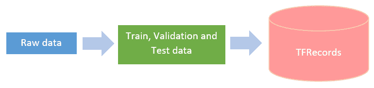
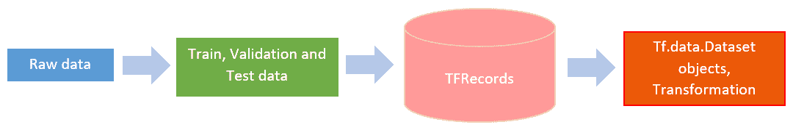
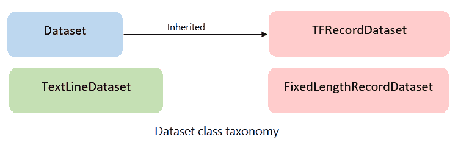
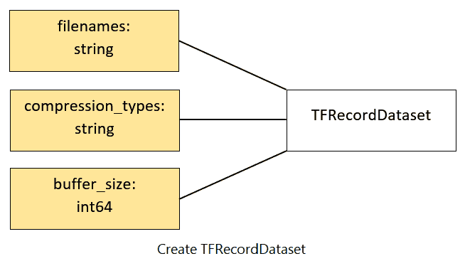
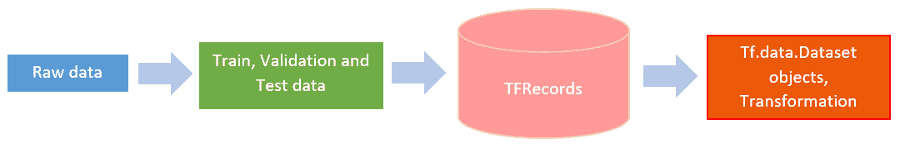

# 三、设计和构建输入数据管道

本章将概述如何构建复杂的输入数据管道，以使用由`TFRecords`组成的`tf.data` API 来以最常见的格式（例如 CSV 文件，图像，文本等）提取大型训练/推理数据集。 和`tf.data.Dataset`方法。 您还将获得有关协议缓冲区，协议消息以及如何使用 **TensorFlow 2.0**（**TF 2.0**）中的`TFRecords`和`tf.Example`方法实现的一般概念。 本章还说明了在数据的混洗，批量和预取方面使用`tf.data.Dataset`方法的最佳实践，并针对 TF 2.0 提供了建议。 最后，我们将讨论内置的 TensorFlow 数据集...

# 技术要求

您应该了解标准数据格式，例如 CSV 文件，图像（PNG 和 JPG）和 ASCII 文本格式。 不用说，本书的大多数章节都假定您了解基本的机器学习概念，Python 编程，`numpy` Python 模块，并且您已使用 TensorFlow 创建了一些机器学习模型。 尽管不是必需的，但熟悉 **TensorFlow 1.x**（**TF 1.x**）版本的`tf.data` API 会有所帮助。 即使您没有`tf.data` API 的先验知识，您也应该发现本章可以自学以了解它们。

本章中的某些主题需要 Python 模块，例如`argparse`和`tqdm`，这些模块已在本书的 GitHub 存储库中列出。 可在[这个页面](https://github.com/PacktPublishing/What-s-New-in-TensorFlow-2.0/tree/master/Chapter03)中获得本章的代码。

# 设计和构建数据管道

训练**机器学习**（**ML**）模型和**深度神经网络**（**DNN**）时，最重要的要求之一，是在给定的样本空间中具有同分布的大型训练数据集（通常是未知的，我们在 ML 或 DNN 训练中了解到），以便 ML 模型和 DNN 可以从给定的训练数据中学习，并很好地推广到看不见的未来或分离出来的测试数据。 此外，通常与训练集分布来自同一来源的验证数据集对于微调模型超参数至关重要。 在许多情况下，开发人员会从可用的数据（无论是少量还是大量）入手，以训练机器学习模型，包括大容量的深度学习...

# 原始数据

用于训练 ML 模型的原始数据可以是文本文件，CSV 文件，图像，视频或自定义格式的文件。 原始数据甚至可以是这些文件类型的组合。 原始数据也可以是有序数据，例如时间序列数据，或者，它甚至可以是文本的向量表示，例如单词嵌入。 重要的是要确保在将原始输入数据输入模型之前对其进行管理，因为它会影响运行时模型训练的效率。

在许多情况下，原始数据可以存储在数据库中，例如 MySQL，MS SQL，MongoDB 等。 就本书而言，假设甚至表格数据，SQL 或 NoSQL 数据都是原始数据，并且出于机器/深度学习模型的目的，需要将其拆分并转换为`TFRecords`。 解释 SQL 和 NoSQL 数据库超出了本书的范围。

# 将数据拆分为训练，验证和测试数据

ML 模型训练的数据准备的关键特征之一是能够将现有数据分为训练，验证和测试集。 训练数据是已看到并用于拟合或训练模型的数据； 例如，神经网络的学习权重和偏置。 验证数据（有时称为开发数据）用于微调模型的超参数，例如学习率，要使用的优化程序等等。 模型会经常查看此数据（例如，在每次迭代或新周期之后）并评估模型。

请注意，验证数据仅可帮助您微调模型。 它不会更新权重和偏置。

最后，测试数据是...

# 创建`TFRecords`

TFRecords 的创建是输入数据管道的核心，因此您可以创建`tf.data.Dataset`对象。 值得注意的是，您可以直接使用原始数据创建数据集，而无需创建`TFRecords`（将在下一部分中进行说明）。 但是，推荐的方法是首先从原始（拆分）数据创建`TFRecords`，然后将其用于数据集管道。 这是 TF 2.0 输入数据管道设计的关键部分。 下图显示了`TFRecords`的创建流程：



`TFRecords`通过将数据序列化到磁盘来帮助我们有效地读取数据，并且可以存储在一组`TFRecords`文件中。 每个文件的建议大小为 100 MB 到 200 MB。 应该注意的是`TFRecord`是可以存储任何类型数据的二进制格式。 由于是二进制格式，因此它占用的磁盘空间更少，并且从磁盘存储进行复制或读取所需的时间也更少。 当训练数据太大而无法存储在内存服务器，GPU 和/或 TPU 中时，还需要`TFRecords`。 使用带有数据集的`TFRecords`，可以按批形式从磁盘按需加载数据（将在本章稍后的*批量*中对此进行解释） 部分）。

`TFRecords`有四个重要组成部分：

*   `TFRecord`格式，用于存储二进制记录或数据序列。
*   [协议缓冲区](https://developers.google.com/protocol-buffers/)是跨平台的，并且具有跨语言库，用于以协议消息的形式对结构化数据进行有效的序列化。
*   协议消息是信息的小型逻辑记录，其中包含一系列名称/值对。
*   `tf.Example`是一种灵活的协议消息（也称为`protobuf`），旨在与 TensorFlow 一起使用。 **TensorFlow 扩展**（**TFX**）是 TF 2.0 中的另一个重要功能，用于部署生产级 ML 管道，我们将在第 5 章，“模型推理管道–多平台部署”中进行学习。

请注意，在 TF 2.0 中，`tf.Examples`已在诸如 [TFX](https://www.tensorflow.org/tfx/) 的所有 TensorFlow 高级 API 中使用。。

现在，让我们看看如何将数据存储在`TFRecords`中。 如前所述，任何转换为​​`TFRecords`格式的数据都存储为二进制字符串序列。 您可能会猜到，必须先指定数据结构，然后才能从`tfrecord`文件读取或写入数据。 为了读取和写入`tfrecords`文件，我们需要使用`tf.Example`协议消息。 请注意，数据中包含的每条小信息都必须使用`Etf.Example`进行存储。 此外，为了将信息写入磁盘，使用了`tf.io.TFRecordWriter`。 要从磁盘读回信息，您可以使用`tf.io.TFRecordReader`。

# TensorFlow 协议消息 - `tf.Example`

`tf.Example`是`{'string':tf.train.Feature}`映射（Python 词典），其中`'string'`可以是任何名称； 例如`'image'`，`'features'`或`'label'`。

`tf.train.Feature`可以是以下三种类型之一：

*   `tf.train.BytesList`：用于`string`或`byte`信息
*   `tf.train.FloatList`：用于`float`或`double`信息
*   `tf.train.Int64List`：用于`bool`，`enum`和所有整数，例如`int32`，`uint32`，`int64`，`uint64`等

通过使用以下快捷函数转换标准 TensorFlow 类型，可以将`tf.Example`消息序列化，写入和读取到`tfrecords`文件中：

以下代码块中的函数可用于将值转换为...

# `tf.data`数据集对象创建

如我们前面提到的，`tf.data` API 集提供了从原始数据构建复杂而有效的输入数据管道的工具。 例如，输入管道可以从分布式文件系统的图像文件构建。 如果您使用的是**自然语言处理**（**NLP**）模块，也可以从原始文本数据构建它。 下图显示了`tf.dataset`对象创建的流程：



`tf.data.Dataset`是`tf.data` API 集的主要类，代表一系列元素，其中每个元素包含一个或多个张量对象。 数据集有四种主要类型，如下图所示：



在本章中，为简单起见，所有四种类型的数据集都称为数据集和/或`tf.data.Dataset`。 在需要时将引用显式类型。

从定义上讲，`tf.data.Dataset`是一个或多个张量对象的元素序列，称为分量； 数据集中的每个元素都具有相同的结构。 要检查数据集的类型和形状，开发人员可以使用两个 Python API `tf.data.Dataset.output_types`和`tf.data.Dataset.output_shapes`，如以下代码块所示：

```py
# Check type and shape of Dataset

dataset = tf.data.Dataset.from_tensor_slices(...)
print(dataset.output_types)
print(dataset.output_shapes)
```

前面的代码是构建图像数据管道的示例。 数据集的元素可以是单张训练数据，由一对图像和标签张量组成。

在 TF 2.0 中，数据集对象是 Python `iterables`，这与 TF 1.x 版本的关键区别在于 TF 1.x 版本需要`tf.data.Iterator`来遍历数据集对象。 以下代码显示了在 TF 1.x 和 TF 2.0 中迭代数据集对象之间的区别：

```py
# The following code shows difference in iterating Dataset objects 
# in TensorFlow 1.x and TensorFlow 2.0 

dataset = tf.data.Dataset.from_tensor_slices(...)
dataset = dataset.shuffle(...)
dataset = dataset.map(...)
dataset = dataset.batch(...)

# TensorFlow 1.x (using one shot iterator, get_next)
iterator = dataset.make_one_shot_iterator()
next_element = iterator.get_next()

with tf.Session() as sess:
    for _ in range(...):
    element = sess.run(next_element)
    ...

# TensorFlow 2.0 (extremely simple where Datasets are Python iterables)

for element in dataset:
    ...
```

正如您在前面的代码块中看到的那样，现在遍历数据集对象非常简单。

# 创建数据集对象

可以使用两种主要方法创建数据集对象：

*   从源创建：
    *   来自内存中的`numpy` / `tensorflow`对象
    *   使用`TFRecords`来自磁盘
*   将转换应用于现有数据集：
    *   从一个或多个数据集构造一个数据集。 这将在“数据集转换”部分中更详细地说明。

由于建议使用`TFRecords`创建一个`tf.data.Dataset`，让我们看看它是如何工作的。 然后，我们将介绍从其他类型的输入创建数据集的方法。

# 使用 TFRecords 创建数据集

创建一些`TFRecords`后，我们可以直接使用`tf.data.Dataset` API 读取它们。 以下是使用`TFRecords`创建数据集的框图：



您可以使用以下代码从数据集中读取`tfrecords`文件：

```py
# You can read tfrecord files as below
dataset = tf.data.TFRecordDataset(tfrecords_file_names)
```

# 使用内存中的对象和张量创建数据集

从内存中对象创建`tf.data.Dataset`的最简单方法是使用`from_tensor_slices()`方法，该方法相对于数据中的第一个索引对数组进行切片。 我们将在此处引用`tf.data.Dataset.map()` API，该 API 在“数据集转换”部分中详细定义。 就目前而言，`map(...)`仅表示正在基于应用于数据集对象的每个元素的某些函数来修改（转换）数据集。

您可以使用两种 API 从内存中的张量创建数据集：

*   `tf.data.Dataset.from_tensors()`
*   `tf.data.Dataset.from_tensor_slices()`。

您可以在[这个页面](https://github.com/PacktPublishing/What-s-New-in-TensorFlow-2.0/blob/master/Chapter03/datasets/create_dataset_from_tensors.ipynb)中查看示例代码。

# 不使用 TFRecords 直接使用其他格式创建数据集

如前所述，您可以使用所有不同的文件格式直接创建`tf.data.Dataset`。 我们还解释了创建`TFRecords`的推荐方法。 但是，如果您想直接创建数据集而不经过`TFRecords`，那也是可能的。 以下是一些直接从原始数据创建`tf.data.Dataset`的示例：

*   使用 CSV 文件：

您可以使用`td.data.experimental.make_csv_dataset(...)` API 查找`.csv`文件。 您可以如下定义`.csv`文件和`batch_size`中可用的列。 完整的代码可以在[这个页面](https://github.com/PacktPublishing/What-s-New-in-TensorFlow-2.0/blob/master/Chapter03/datasets/create_dataset_from_csv.ipynb)中找到：

```py
csv_file = "./curated_data/train.csv"
csv_columns = ['square_ft', 'house_type', 'price']
dataset = tf.data.experimental.make_csv_dataset(csv_file, column_names=csv_columns, batch_size=8)
```

如果需要从 CSV 文件中选择几列，则可以使用`select_columns`参数来完成。 有关更详细的概述，请参阅 [tensorflow.org](http://tensorflow.org) 。

*   使用文本数据：

`tf.data.TextLineDataset(...)` API 旨在从文本文件创建数据集。 这主要用于文本数据，其中每一行包含一个数据样本。 一些示例包括日志消息，问题答案等。 我们将使用与上一节相同的示例向您展示如何使用文本数据创建`tf.data.Dataset`。 完整代码可在[这个页面](https://github.com/PacktPublishing/What-s-New-in-TensorFlow-2.0/blob/master/Chapter03/datasets/create_dataset_from_text.ipynb)中找到：

```py
def train_decode_line(row):   cols = tf.io.decode_csv(row, record_defaults=[[0.], ['house'], [0.]])   myfeatures = {'sq_footage':cols[0], 'type':cols[1]}   mylabel = cols[2] #price   
  return myfeatures, mylabel

def predict_decode_line(row):
  cols = tf.decode_csv(row, record_defaults=[[0.], ['house']])
  myfeatures = {'sq_footage':cols[0], 'type':cols[1]}
  return myfeatures

line_dataset = tf.data.TextLineDataset('./curated_data/train.csv')

train_dataset = line_dataset.map(train_decode_line)

```

*   使用图像：

最常见的输入数据管道之一是图像，可以是`.jpeg`或`.png`格式。 您的数据集中可能有成千上万的图像。 由于硬件内存（CPU 内存或 GPU 内存）的限制，我们无法将所有图像存储到内存中。 `tf.data.Dataset`提供了构建此管道的有效方法。

在以下示例中，我们有几个`.jpeg`/`.jpg`文件，我们将使用它们全部创建`tf.data.Dataset`。 您可以在[这个页面](https://github.com/PacktPublishing/What-s-New-in-TensorFlow-2.0/blob/master/Chapter03/datasets/create_dataset_from_images.ipynb)中找到更多详细信息：

```py
# Get images files
file_pattern = ["./curated_daimg/*.jpeg", "./curated_daimg/*.jpg"]
image_files = tf.io.gfile.glob(file_pattern)
# Get labels
labels = []
for img_path in image_files:
  labels.append(get_label(img_path))

# preprocess images
def preprocess_image(img_path, label):
  img_data = tf.io.read_file(img_path)
  feat = tf.image.decode_jpeg(img_data, channels=3)
  feat = tf.image.convert_image_dtype(feat, tf.float32)
  return feat, label, img_path

# Create dataset of all image files
image_path_dataset = tf.data.Dataset.from_tensor_slices((image_files, labels))

# Convert to image dataset
image_dataset = image_path_dataset.map(preprocess_image)
```

*   使用多个数据集：

我们还可以使用`tf.data.Dataset.map()`，`tf.data.Dataset.zip()`和`tf.data.Dataset.concatenate()` API 从现有数据集中创建数据集。 这些将在下一节中解释，我们将在其中讨论数据集的转换。

# 转换数据集

创建数据集对象后，需要根据模型要求对其进行转换。 下图显示了数据集转换的流程：



一些最重要的转换如下：

*   **数据重排**：选择部分数据而不是获取整个数据集可能需要这些。 它们对于使用数据子集进行实验很有用。
*   **数据清除**：这些非常重要。 就像清除日期格式（例如从`YYYY/MM/DD`到`MM-DD-YYYY`）或删除具有缺失值或错误数字的数据一样简单。 

# `map`函数

此转换 API 在数据集的每个元素上执行`map_func`输入。 对于那些使用 Pandas`Dataframe.apply(...)`的人来说，`map(...)`与之非常相似。 作为`map(...)` API 的自变量，它采用了一个应用于数据集每个元素的函数。 该函数继而从输入数据集中获取表示单个元素的`tf.Tensor`对象，并返回新转换的`tf.Tensor`对象。 请注意，输出中元素的顺序与输入数据集的顺序相同：

```py
ds = tf.data.Dataset.range(1, 6) # [1, 2, 3, 4, 5]
ds.map(lambda x: x + 1)
```

根据数据集中每个元素的结构，正确定义`map_func`的输入签名非常重要：

```py
a = [1, 2, 3, 4, 5]
ds = tf.data.Dataset.from_tensor_slices(a)
result = a.map(lambda x: ...)

b = [(2, 1), (3, 5), (6, 6)]
ds = tf.data.Dataset.from_tensor_slices(b)
def map_func(input):
  output1 = input[0] + 1
  output2 = input[1] + 2
  return output1, output2

ds=ds.map(map_func)
```

# `flat_map`函数

此转换将`map_func`输入映射到输入数据集并展平结果。 这用于确保数据集的顺序保持不变。 `map_func`必须在此处返回数据集：

```py
a = Dataset.from_tensor_slices([ [1, 2, 3], [4, 5, 6], [7, 8, 9] ])a.flat_map(lambda x: Dataset.from_tensor_slices(x + 1)) # ==># [ 2, 3, 4, 5, 6, 7, 8, 9, 10 ]
```

# `zip`函数

该 API 与 Python 的内置`zip(...)`函数相似。 Python 的`zip(...)`函数和`tf.data.Dataset.zip(...)`函数之间的区别在于，后者可以采用数据集的嵌套结构：

```py
a = Dataset.range(1, 4) # ==> [ 1, 2, 3 ]
b = Dataset.range(4, 7) # ==> [ 4, 5, 6 ]
c = Dataset.range(7, 13).batch(2) # ==> [ [7, 8], [9, 10], [11, 12] ]
d = Dataset.range(13, 15) # ==> [ 13, 14 ]

# The nested structure of the `datasets` argument determines the
# structure of elements in the resulting dataset.
Dataset.zip((a, b)) # ==> [ (1, 4), (2, 5), (3, 6) ]
Dataset.zip((b, a)) # ==> [ (4, 1), (5, 2), (6, 3) ]

# The `datasets` argument may contain an arbitrary number of
# datasets.
Dataset.zip((a, b, c)) # ==> [ (1, 4, [7, 8]),
                        # (2, 5, [9, 10]),
                        # (3, 6, [11, 12]) ]

# The number of elements in the resulting dataset is the same as
# the size of the smallest dataset in `datasets`.
Dataset.zip((a, d)) # ==> [ (1, 13), (2, 14) ]
```

# `concatenate`函数

此转换 API 通过将输入数据集与此数据集连接来创建新的数据集：

```py
a = tf.data.Dataset.range(1, 4) # ==> [ 1, 2, 3 ]
b = tf.data.Dataset.range(4, 8) # ==> [ 4, 5, 6, 7 ]
c = a.concatenate(b) # ==> [ 1, 2, 3, 4, 5, 6, 7 ]
```

# `interleave`函数

该 API 使用`map_func`转换数据集的每个元素，并交织结果。 例如，您可以使用`Dataset.interleave()`同时处理许多输入文件：

```py
# Preprocess 4 files concurrently, and interleave blocks of 16 records from
# each file.
filenames = ["/var/data/file1.txt", "/var/data/file2.txt", ...]
dataset = (Dataset.from_tensor_slices(filenames)
           .interleave(lambda x:
               TextLineDataset(x).map(parse_fn, num_parallel_calls=1),
               cycle_length=4, block_length=16))
```

`cycle_length`和`block_length`参数控制元素生成的顺序。 `cycle_length`控制同时处理的输入元素的数量。 例如，如果将`cycle_length`设置为 1，则此转换将一次处理一个输入元素，并将产生与`tf.data.Dataset.flat_map`相同的结果。 通常，此转换会将`map_func`应用于`cycle_length`输入元素，在返回的数据集对象上打开迭代器，并对其进行循环，从每个迭代器生成`block_length`连续元素，然后在每次到达迭代器的末尾时就使用下一个输入元素：

```py
a = Dataset.range(1, 6) # ==> [ 1, 2, 3, 4, 5 ]

# NOTE: New lines indicate "block" boundaries.
a.interleave(lambda x: Dataset.from_tensors(x).repeat(6),
            cycle_length=2, block_length=4)
 # ==> [1, 1, 1, 1,
 # 2, 2, 2, 2,
 # 1, 1,
 # 2, 2,
 # 3, 3, 3, 3,
 # 4, 4, 4, 4,
 # 3, 3,
 # 4, 4,
 # 5, 5, 5, 5,
 # 5, 5]
```

只要`map_func`是纯函数，此变换产生的元素的顺序就是确定性的。 如果`map_func`包含任何有状态操作，则该状态的访问顺序不确定。

# `take(count)`函数

`take(count)`函数使用当前数据集中的计数最多的元素创建一个新数据集。 通常，这可用于减少数据集的大小，以用于调试或简化目的。 此外，如果将计数指定为`-1`，或者如果计数大于数据集的大小，则新数据集将包含先前数据集的所有元素。

# `filter`函数

此 API 根据条件谓词函数过滤当前数据集：

```py
ds = tf.data.Dataset.from_tensor_slices([1, 2, 3])
ds = ds.filter(lambda x: x > 3) # ==> [1, 2]
```

# 打乱和重复`tf.data.Dataset`

机器学习模型必须从训练，验证和测试步骤的总体分布中合理地表示数据。 通常，原始数据可以按特定顺序存储，例如相对于每个类一起存储，或者数据可以一起存储在特定源中。 必须对原始数据进行混洗，以确保训练，验证和测试数据分布在整个数据分布中。 另外，建议在每个周期之后对数据进行混洗。 下图显示了打乱和重复使用`tf.data.Dataset`的流程：

良好的随机播放还有助于减少数据的差异，该数据用于模型...

# 批量

梯度下降与反向传播相结合是最近机器学习或深度神经网络系统中最流行的学习算法。 梯度下降有三种：

*   批量梯度下降，其中所有数据都呈现给模型以供学习
*   小批量梯度下降，其中将一批数据提供给模型以供学习
*   随机梯度下降，其中提供随机采样的数据以训练模型

在这里，由于大型数据集的硬件内存限制，在大多数情况下批量梯度下降是不实际的。 而且，由于模型一次从一个数据中学习，因此随机梯度下降可能会很慢。 由于这些原因，小批量梯度下降法是使用最广泛的算法。 下图显示了批量的流程：


此外，最近的机器学习算法和深度神经网络在 GPU，TPU 和大量 CPU 上进行了分布式训练。 这些 GPU 或 TPU 中的每一个都有自己的内存限制（例如，NVIDIA 的 1080Ti GPU 具有 11 GB 的可用内存，而 Tesla V100 GPU 具有 16 GB 的可用内存）。 由于基于反向传播的梯度下降用于训练和学习 ML 模型的权重和偏差，因此开发人员使用小批量梯度下降; 因此，重要的是要有足够的批量大小，以确保可用的 GPU（或 TPU）不会耗尽内存。

`tf.data.Dataset`提供了一种以高效且无缝的方式创建一批样本的好方法，如以下代码块所示：

```py
dataset = tf.data.TFRecordsDataset(...)
dataset = dataset.shuffle(buffer_size, seed=None, reshuffle_each_iteration=None)
dataset = dataset.repeat(count = None)
dataset = dataset.batch(batch_size, drop_remainder=True)
```

`batch(...)` API 将此数据集的连续元素合并为批量。 `batch_size`是传递给此 API 的超参数。 在第 4 章，“模型训练和 TensorBoard 的使用”中，我们将讨论并提供批量建议。

# 预取

批量完成后，建议使用`prefetch(...)` API。 该 API 将输入数据集转换为新数据集，该数据集可从输入数据集中预提取元素。 该 API 之所以重要，是因为它收集了在模型为当前批量提供服务时将加载到输入管道中的下一个批量：

```py
dataset = tf.data.TFRecordsDataset(...)dataset = dataset.shuffle(buffer_size, seed=None, reshuffle_each_iteration=None)dataset = dataset.repeat(count = None)dataset = dataset.batch(batch_size, drop_remainder=True)dataset = dataset.prefetch(buffer_size)
```

通常，为`prefetch(...)`函数指定的`buffer_size`参数应与为`batch(...) ...`指定的`batch_size`参数一样大。

# 在将数据管道输出输入模型之前，先对其进行验证

到目前为止，我们已经学习了使用几种提取和转换数据的方法和技术来构建输入数据管道。 作为建议，在将输入数据管道输入模型之前，验证输入数据管道是否正在提取和转换正确的数据非常有用。 在 TF 2.0 中，这样做非常简单，因为数据集对象现在是 Python 可迭代的。 您可以如下遍历创建的数据集以获取数据的打印值：

```py
ds = tf.data.Dataset.from_tensor_slices([1, 2, 3])
for data in ds:
    print(data)
```

# 将创建的数据集馈入模型

一旦创建，转换和打乱数据集对象并完成批量，就需要将其馈入模型（从本章开头记住 ETL 的 L）。 此步骤在 TF 2.0 中进行了重大更改。

TF 2.0 中创建输入数据管道的一个主要区别在于其简单性。 TF 1.x 需要一个迭代器才能将数据集提供给模型。 为了做到这一点，有几个迭代器可以迭代一批数据。 一种是通过使用数据集对象中的`tf.data.Iterator` API。 TF 1.x 中有一个一次性的，可初始化的，可重新初始化的和可填充的迭代器。 尽管这些迭代器功能非常强大，但它们也增加了大量的复杂性，无论从术语上还是...

# 完整的端到端数据管道示例

到目前为止，我们已经介绍了数据集对象的创建以及如何创建批量数据以馈入模型。 在本节中，我们将看一个端到端输入数据管道和模型训练的示例。 我们将使用 CIFAR10 数据构建图像分类器。

为了运行基于 CIFAR10 的端到端示例，您需要从[这里](https://www.cs.toronto.edu/~kriz/cifar.html)下载必要的数据。 该数据集摘自[《从微小图像中学习多层特征》](https://www.cs.toronto.edu/~kriz/learning-features-2009-TR.pdf)。 该数据集包含以下信息：

*   50,000 张带有标签的图像用于训练
*   10,000 张带有标签的图像用于测试
*   10 个类标签

下载并解压缩数据集后，您将看到一个名为`cifar-10-batches-py`的文件夹，其中包含以下文件：

*   `batches.meta`
*   `data_batch_2`
*   `data_batch_4`
*   `readme.html`
*   `data_batch_1`
*   `data_batch_3`
*   `data_batch_5`
*   `test_batch`

`data_batch_*`文件包含训练数据，而`test_batch`文件包含测试数据。 这些文件为 Python `pickle`格式。 在此端到端示例中，我们将从 pickle 文件中创建`tfrecords`。 完整的代码文件以及`README.md`文件可在本书的 GitHub 存储库中找到，两者均可在[这里](https://github.com/PacktPublishing/What-s-New-in-TensorFlow-2.0/blob/master/Chapter03/cifar10/README.md)找到。

# 使用 Pickle 文件创建 TFRecords

出于说明目的，我们将使用`data_batch_*`文件之一作为验证数据。 我们将其余的用于训练。 例如，如果我们选择`data_batch_4`作为验证数据，则`data_batch_1`，`data_batch_2`，`data_batch_3`和`data_batch_5`将用作训练数据。

1.  让我们使用 CIFAR10 数据创建 TFRecords：

```py
def create_tfrecords(cifar10_data_folder, validation_data_idx):  """ function to generate tfrecords  Creates three sub-folders, train, eval, test and put resp   tfr files  """  batch_files = _get_file_names(validation_data_idx)  tfrecords_outdir = './tfrecords'  for data_type in ['train', 'eval', 'test']:    input_files = [os.path.join(cifar10_data_folder, i) \ for i in batch_files[data_type]] ...
```

# TF 2.0 中数据管道的最佳实践和性能优化

这是在 TF 2.0 中建立有效的输入数据管道时应遵循的最佳实践的摘要：

*   建议在重复转换之前使用打乱（`shuffle`）API。
*   使用预取转换可以重叠生产者（获取下一批数据）和使用者（使用当前数据进行训练）的工作。 另外，非常重要的一点是要注意，在对数据管道进行打乱（打乱），重复（重复）和批量（批量）之后，应将预取转换添加到输入管道的末尾。 看起来应该像这样：

```py
# buffer_size could be either 1 or 2 which represents 1 or 2 batches of data
dataset = dataset.shuffle(count).repeat().batch(batch_size).prefetch(buffer_size)
```

*   强烈建议通过启用`num_parallel_calls`参数来并行化映射 API。
*   对于远程存储的数据集，建议使用`interleave(...)`转换来并行读取来自不同文件的数据。

# TF 2.0 中的内置数据集

TF 2.0 还提供了可与 TensorFlow 一起使用的数据集的集合。 它负责下载，准备数据，甚至自行构建`tf.data.Dataset`，然后可以将其直接输入模型中。

请按照以下步骤使用这些内置数据集：

1.  安装 TensorFlow 数据集：

```py
pip3 install tensorflow-datasets
```

请注意，`tensorflow-datasets`希望您正确且完整地安装 TF 2.0。

2.  安装`tensorflow-datasets`后，可以使用以下代码查看可用数据集的列表：

```py
import tensorflow_datasets as tfdstfds.list_builders()
```

这将给出以下输出：

```py
['abstract_reasoning', 'bair_robot_pushing_small', 'caltech101', ...
```

# 总结

本章以简单而富于启发性的方式展示了使用 TF 2.0 API 设计和构建输入数据管道的总体方法。 它提供了数据管道的不同组件的构建块，并提供了构建管道所需的 API 的详细信息。 提供了 TF 1.x API 和 TF 2.0 API 之间的比较。

总体流程可以概括为两个主要过程：原始数据管理和数据集处理。 原始数据管理处理原始数据； 将数据分为训练，验证和测试集； 并创建 TFRecords。 通常，这是一个一次性过程，其中还可以包括脱机数据转换。 数据集操作是一个在线转换过程，该过程创建数据集对象，应用转换，对数据进行混洗，然后重复进行此操作并通过预取创建一批数据； 稍后将它们输入模型。

无论模型训练/推理的训练数据大小和生命周期如何，始终建议使用输入数据管道。 由于数据集对象在 2.0 版中是 Python 可迭代的，因此将它们馈送到模型中非常简单。

在下一章中，我们将学习有关模型训练和使用 TensorBoard 的知识。

# 进一步阅读

尽管本章试图捕获有关如何构建输入数据管道的最新信息，但 TensorFlow 是一个快速变化的平台。 开发人员每天都在增加新功能。 社区中还有成千上万的开源贡献者，他们正在迅速添加功能。 强烈建议尽可能参考[这里](https://www.tensorflow.org)，以了解正确的 API 使用和/或更改。