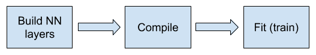
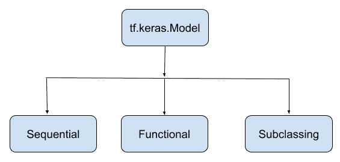
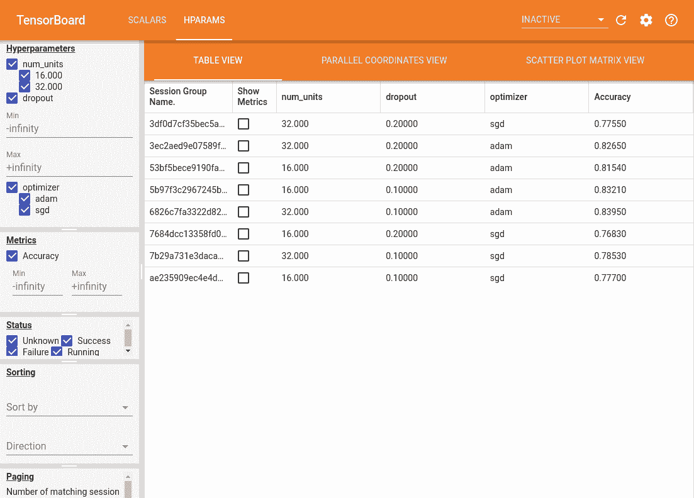
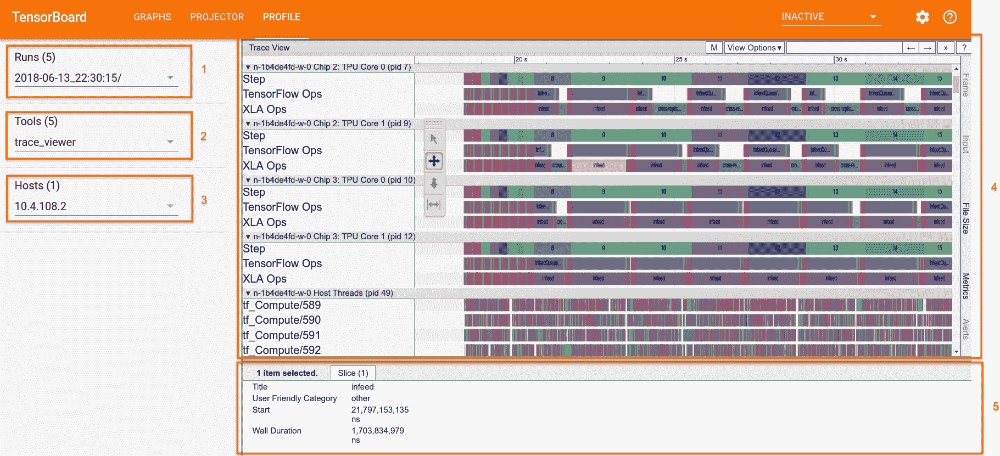

# 四、TensorBoard 的模型训练和使用

本章详细介绍了机器学习训练管道，以构建，训练和验证包括深度神经网络在内的最新机器学习模型。 它描述了如何集成输入数据管道，创建基于`tf.keras`的模型，以分布式方式进行训练以及运行验证以微调模型的超参数。 它还涉及有关如何导出和保存 TensorFlow 模型以进行部署和推理的各种概念。 模型调试和可视化是用于调试和提高模型准确率和表现的关键工具。 本章还概述了 TensorBoard 的用法，在 TF 2.0 中的更改以及如何使用 TensorBoard 进行模型调试以及对模型的速度和性能进行性能分析。

TensorFlow 1.x 版本强烈支持低级和中级 API，以构建机器学习模型。 它还具有 Estimator API，包括预制的估计器，例如`LinearClassifier`和`DNNRegressor`，以及用作高级 TF API 的定制估计器。 TF 1.x 中对估计器的支持是提供高级 API，与低级和中级 TF API 相比，它们更易于构建。 从 TensorFlow 2.0 开始，主要变化之一是采用 Keras API 标准作为高级 API 而不是 Estimators。 对于 TensorFlow 开发团队而言，这非常有意义，因为 Keras API 是迄今为止机器学习社区中采用的最大 API 集，并且 Keras 的创建者 Francois Chollet 也是一位出色的人工智能（AI）研究人员，现在已经加入 TensorFlow 开发团队的成员。 TensorFlow 1.x 版本已经提供对`tf.keras`的初始支持; 但是，在 TF 2.0 版本中可以获得`tf.keras`的完整而完整的体验。

在本章中，我们将浏览`tf.keras` API，包括 API 的顺序，函数式和模型子类类型。 您将学习如何使用`tf.data.Dataset`将输入数据流水线馈入模型流水线，以及特征列的可能分类结构。 我们还将介绍如何定义损失函数，最常见的优化器，基于 TensorBoard 的数据，模型调试，可视化和性能分析等。 从 TensorFlow 2.0 开始，`tf.keras` API 已紧密集成到 TensorFlow 生态系统中，其中包括对`tf.data`的改进支持和最新可用的分发策略，可用于跨多种 GPU 和 TPU 进行分布式训练。 `tf.keras`还无缝支持导出训练有素的模型，这些模型可以使用 TensorFlow 服务和其他技术在 TensorFlow Lite 的移动和嵌入式设备上进行服务和部署。

我们将在本章介绍以下主题：

*   比较 Keras 和`tf.keras`
*   使用`tf.keras` 2.0 创建模型
*   模型编译与训练
*   自定义训练逻辑
*   分布式训练
*   TensorBoard

# 技术要求

假定本章和本书的读者都知道机器学习，神经网络和深度神经网络的基础知识。 另外，作为前提条件，假设读者知道 TensorFlow 1.x API。 此外，还需要对深度神经网络中的卷积层，循环层和前馈层有基本的了解。

# 比较 Keras 和`tf.keras`

`tf.keras`是 TensorFlow 对 Keras API 规范的实现。 这是用于构建和训练模型的高级 API，其中包括对 TensorFlow 特定功能的一流支持，例如急切执行，`tf.data`管道和估计器。 `tf.keras`使 TensorFlow 易于使用，而不会牺牲灵活性和表现。

Keras（定义 Keras API 标准的原始网站）是一个开源项目，由于其简单和强大而受到 ML 工程师和数据科学家的极大关注。 最初，Keras 的默认后端引擎（请记住，Keras 是一组 API）是 Theano; 但是，最近它发生了变化，现在 TensorFlow 作为其默认后端引擎。 您还可以将默认后端引擎设置为 MXNet，CNTK 等。 Keras API 非常易于使用，模块化且可组合。 此外，还可以轻松扩展您的特定需求。 TensorFlow 采用了 Keras API 标准，从那时起，使用 TensorFlow 核心功能的`tf.keras`开发就如火如荼地进行。 现在，随着 TF 2.0 的发布，TF 开发团队为`tf.keras`高级 API 提供了紧密而有效的支持。 另外，值得一提的是 Keras 和`tf.keras`是两个完全不同的包，作为 TF 2.0 的一部分，应使用`tf.keras`。 在版本方面，在 TensorFlow 2.0 中，TensorFlow 和`tf.keras`的版本号仍然存在差异，您可以尝试使用`tf.__version__`和`tf.keras.__version__`查看此版本。

# 比较估计器和`tf.keras`

TensorFlow 1.x 已建议为其高级 API 集使用`tf.estimator` API，该 API 集具有内置模型（例如`LinearRegressor`和`DNNClassifier`）可用的预制估计器。 此外，对于更细化和定制的模型，TF 1.x 具有定制的估计器。 从 TF 2.0 开始，建议仅使用与线性分类器，DNN 分类器，组合 DNN 线性分类器和梯度提升树打包在一起的丰富的预制估计器 API 集。 这些模型已准备就绪，可以广泛使用。 对于任何自定义模型，建议直接使用`tf.keras`而不是`tf.estimator` API。 另外，值得注意的是，与`tf.keras, ...`有更好的协同作用

# 机器学习分类法和 TF 支持的快速回顾

可以使用三种主要的机器学习技术来解决大多数学习问题：

*   监督学习借助标签数据预测标签
*   无监督学习，对没有标签的数据进行分组和聚类
*   强化学习，其中存在一种环境，智能体可以通过该环境通过采取行动并从环境中获取反馈（奖励）来学习实现预期目标

生成模型和判别模型可以与这三种机器学习技术一起使用。 生成模型尝试从具有未知分布的给定数据集中凭经验学习模式和分布，并可能使用学习的模型来生成新数据，就好像它来自同一分布。 一些流行的生成模型是高斯混合模型，隐马尔可夫模型，贝叶斯网络（例如朴素贝叶斯）等。 生成对抗模型是 2014 年非常流行的生成模型，由于其强大的成功和潜力而备受关注。 除了仅学习可用于无监督学习的分布之外，生成模型还可以用于执行分类或预测任务（有监督学习），该任务使用样本`x`的条件概率， 通过使用朴素贝叶斯定理计算概率`P(y | x)`，属于`y`类。 与生成模型相反，判别模型用于直接学习条件概率`P(y | x)`，用于回归，分类和其他类型的监督学习问题。 深度神经网络可用于构建生成模型或判别模型。

TensorFlow 提供了丰富的 API 集来构建上述生成模型和判别模型。 此外，在 TF 2.0 中，通过引入急切的执行（在第 2 章， “Keras 默认集成和急切执行”中进行了解释），创建这些模型的理念发生了整体变化， 这使得`tf.keras`的使用非常简单且易于调试。 此外，TensorFlow 2.0 中的`tf.keras` API 丰富了 TF 在 TF 1.x 版本中可以执行的全部功能。 在本书中，除非另有说明，否则我们主要使用`tf.keras` API 来构建，训练和预测神经网络模型，并且不会讨论低级或中级 TF API。

TensorFlow 建立深度学习模型并对其进行训练时的理念是，首先定义神经网络层（也称为构建由节点和边组成的计算图）； 定义损失函数，准确率度量和适当的优化器； 然后训练模型以更新梯度。 这三个步骤在使用构建，编译和拟合的`tf.keras` API 中得到了体现，如下图所示：



在以下部分中，我们将首先了解如何使用`tf.keras` 2.0 API 构建模型，该 API 将详细介绍计算图节点和边的创建。 然后，我们将介绍编译和拟合，包括损失和准确率函数的定义。

# 使用 tf.keras 2.0 创建模型

在本节中，我们将学习`tf.keras` API 的三种主要类型，以定义神经网络层，即：

*   **顺序 API** ：这些基于堆叠的 NN 层，可以是密集（前馈）层，卷积层或循环层）
*   **函数式 API** ：这些有助于构建复杂的模型
*   **模型子类 API** ：这些是完全可自定义的模型； 这些 API 灵活，需要谨慎编写

下图显示了用于构建`tf.keras.Model`的这三个 API 的 Python 类层次结构：



让我们创建一个相对简单的神经网络来构建手写识别分类器...

# 顺序 API

顺序 API 是创建 TF 模型并提供大约 70-75% 模型类型的最简单方法。 您需要创建一个`tf.keras.models.Sequential(...)` Python 类并将所需的层顺序添加到模型中-这也称为**层栈**。 这些层可能是密集，卷积甚至是循环层。 您可能需要提供第一层的输入形状。 以下是使用顺序 API 创建 TF 模型的步骤：

1.  创建一个`Sequential`模型类：

```py
model = tf.keras.models.Sequential()
num_filters = 32
kernel_size = (5, 5)
pool_size = (2, 2)
num_classes = 10
```

2.  首先通过调用`build()`或`fit()`和一些数据来构建模型，或者在第一层中指定`input_shape`参数以进行自动构建。

（可选）第一层可以接收`input_shape`参数：

```py
model.add(tf.keras.layers.Conv2D(filters=num_filters, 
       kernel_size=kernel_size, 
      padding='valid', activation='relu',
      input_shape=input_shape))
```

3.  另一个`Conv2D`层：

```py
model.add(tf.keras.layers.Conv2D(filters=num_filters, 
       kernel_size=kernel_size, 
      padding='same', activation='relu'))
```

4.  添加最大池化层：

```py
model.add(tf.keras.layers.MaxPooling2D(pool_size=pool_size))
```

5.  并添加一个`Dropout`层：

```py
model.add(tf.keras.layers.Dropout(0.5))
```

6.  另外，添加`Flatten`层：

```py
model.add(tf.keras.layers.Flatten())
```

7.  添加具有 10 个输出单元的`softmax`层：

```py
model.add(tf.keras.layers.Dense(units=num_classes, 
    activation='softmax'))
```

请注意，使用`tf.keras.layers`代替`tf.layers`。 TensorFlow 2.0 明确建议使用`tf.keras.layers`。 使用`tf.keras.layers`，您可以指定权重，偏差，初始值设定项和正则化项。 使用`tf.layers`和`tf.keras.layers`时，权重初始化的方式以及获得确切的 API 定义的方式可能会有一些差异。 [建议在各个部分中查看](https://www.tensorflow.org/)。

# 函数式 API

函数式 API 比顺序 API 可以构建更高级的模型。 例如，如果您需要一个具有多个输入和多个输出的模型，则无法使用顺序 API。 函数式 API 提供了这种灵活性。 另外，使用函数式 API，您可以定义具有共享层的模型。 此外，只能使用函数式 API 定义具有剩余连接的模型。

使用函数式 API 的神经网络层的创建是通过 Python 可调用对象（可调用的 Python 对象）进行的。 作为构建深度学习模型的一部分，深度学习模型通常是分层的，与顺序 API 相反，在顺序 API 中，您首先创建`tf.keras.Sequential`模型，然后在函数式 API 中逐层添加层...

# 模型子类化 API

模型子类化 API 通过对`tf.keras.Model`类对象进行子类化（派生）来构建完全自定义的模型。 这是通过在派生类的构造器`__init__(...)`中创建层栈并将其设置为该类的属性来实现的。 此外，您可以在`call(...)`函数中实现前向通过图。

让我们使用以下类构建模型子类：

```py
class MyModel(tf.keras.Model):

  def __init__(self):
    super(MyModel, self).__init__()
self.num_filters = 32
        self.kernel_size = (5, 5)
        self.pool_size = (2, 2)
        self.num_classes = 10
        self.my_input_shape = (28, 28, 1)
```

现在定义层：

```py
        # first conv layer
        self.conv1_layer = tf.keras.layers.Conv2D(filters=self.num_filters,
          kernel_size=self.kernel_size, padding='valid', activation='relu', 
          input_shape=self.my_input_shape)
        # Another conv2d layer
        self.conv2_layer = tf.keras.layers.Conv2D(filters=self.num_filters,
          kernel_size=self.kernel_size, padding='same', activation='relu')
```

添加最大池化层：

```py
        self.mp_layer = tf.keras.layers.MaxPooling2D(pool_size=self.pool_size)
```

并添加一个丢弃：

```py
        self.do_layer = tf.keras.layers.Dropout(0.5)
```

展平层：

```py
        self.ft_layer = tf.keras.layers.Flatten()
```

添加一个带有 10 个输出单元的 softmax 层：

```py
        self.outputs_layer = tf.keras.layers.Dense(self.num_classes, activation='softmax')

  def call(self, inputs, training=False):
    conv1 = self.conv1_layer(inputs)
       conv2 = self.conv2_layer(conv1)
       mp = self.mp_layer(conv2)
       do = tf.keras.layers.Dropout(0.5)(mp)
       ft = tf.keras.layers.Flatten()(do)
       outputs = self.outputs_layer(ft)
       return outputs

```

使用任何 API 创建模型后，最好使用`model.summary()`和/或`tf.keras.utils.plot_model(...)`查看模型详细信息。

# 模型编译与训练

神经网络对复杂的非线性函数建模，例如`sin(x)`，`x ** 2`和`x ** 3`，仅举几个简单的函数， 由层的网络（栈）组成。 这些层可以是卷积层，循环层或简单的前馈层的混合。 每层由神经元组成。 神经元有两种模型化非线性的成分：前一层的加权总和，然后是激活函数。 神经网络试图以迭代方式学习给定训练数据的分布。 一旦通过指定激活函数以层栈的形式构建了神经网络，就需要定义一个目标函数（也称为损失函数）以使用适当的模型来改善模型权重。

# `compile()` API

`tf.keras.Model.compile(...)` API 有助于定义`loss`函数和优化器，如下所示：

```py
model.compile(optimizer='adam',
              loss='categorical_crossentropy',
              metrics=['accuracy'])
```

可以使用`mse`或`categorical_crossentropy`之类的字符串或通过指定`tf.keras.losses.CategoricalCrossentropy`来简单地定义损失，如以下代码块所示。 优化器也是如此。 但是，为了为优化器指定明确的学习率，您必须使用 Python 优化器类，例如`tf.keras.optimizers.Adam`，如下所示：

```py
# Specify the training configuration (optimizer, loss, metrics)
model.compile(optimizer=tf.keras.optimizers.Adam(learning_rate=0.1),
              # Loss function to minimize
              loss=tf.keras.losses.CategoricalCrossentropy(),
              # List of metrics to monitor
              metrics=[tf.keras.metrics.Accuracy()])
```

# `fit()` API

`tf.keras.Model.fit(...)`是训练模型的主要 API。 它以输入训练数据以及（可选）批量大小，回调等作为输入：

```py
model.fit(train_dataset, epochs=10,      callbacks=[tensorboard_callback],          validation_data=val_dataset)
```

回调是模型训练期间特定工具的挂钩。 它们被传递给`fit(...)`函数以自定义和扩展训练过程中模型的行为。 有很多有用的内置回调-以下是其中一些：

*   `tf.keras.callbacks.ModelCheckpoint`：定期保存模型的检查点
*   `tf.keras.callbacks.LearningRateScheduler`：动态更改学习率
*   `tf.keras.callbacks.EarlyStopping`：发生以下情况时中断训练

# 保存和还原模型

监视训练进度非常重要，并且在每次迭代或训练步骤中都能查看模型对于调试模型的表现同样重要。 此外，训练结束后，需要加载模型以进行推理和部署。 为了能够做到这一点，需要保存模型的训练权重和参数以备将来使用。

TF 2.0 提供了支持，可以轻松完成此操作，因为可以在训练期间和训练后保存模型。 这为用户提供了灵活性，允许从先前的检查点恢复训练，并且避免完全重新启动模型的训练以减少较长的训练时间。 此外，这些保存的模型可以在团队之间共享以进行进一步的工作。 在本节中，我们将主要讨论保存`tf.keras.Models`。

TF 提供了仅保存模型权重或保存整个模型的灵活性，包括模型权重，配置和优化器详细信息，等等。

# 在训练同时保存检查点

可以使用`tf.keras.callbacks`轻松实现保存检查点，如下所示：

```py
# Create checkpoint callbackcp_callback = tf.keras.callbacks.ModelCheckpoint(checkpoint_path,                                                 save_weights_only=True,                                                 verbose=1)model.fit(train_dataset, epochs=10, callbacks=[cp_callback],          validation_data=val_dataset)
```

之前的回调会创建多个 TensorFlow 检查点文件，这些文件会在每次训练完成后进行更新。 此外，要使用这些检查点，请使用与保存检查点的原始模型完全相同的架构来重新创建模型，构建模型，然后使用`tf.keras.Model.load_weight(...)` API 从任何检查点加载权重并将其用于评估：

```py
model.load_weights(checkpoint_path) ...
```

# 手动保存和恢复权重

模型权重也可以保存在检查点文件中。 这可以用来保存训练后的权重，以便将来进行进一步的训练：

```py
# Save the weights
model.save_weights('./checkpoints/my_checkpoint')
# Restore the weights
model = create_model()
model.load_weights('./checkpoints/my_checkpoint')
loss,acc = model.evaluate(test_images, test_labels)
print("Restored model, accuracy: {:5.2f}%".format(100*acc))
```

# 保存和还原整个模型

TF 还可以保存和恢复整个模型，包括权重，变量，参数和模型的配置。 这提供了加载整个模型的灵活性，而无需使用训练模型的原始代码。 整个模型可以使用`tf.keras.experimental.export_saved_model`以 HDF5 文件格式或即将发布的 TF 内部格式存储。 在这一点上，后者仍处于试验阶段，因此我们将不再描述：

```py
model = create_model()model.fit(train_images, train_labels, epochs=5)
```

将整个模型保存到 HDF5 文件中：

```py
model.save('my_model.h5')
```

重新创建完全相同的模型，包括权重和优化器：

```py
new_model = keras.models.load_model('my_model.h5') ...
```

# 自定义训练逻辑

如前所述，TF 2.0 带来了默认的紧急执行，这意味着基于图的代码流的传统 TF 1.x 自定义训练逻辑实现现在已过时。 为了在 TF 2.0 中实现有关急切执行的自定义训练逻辑，可以使用`tf.GradientTape`。 `tf.GradientTape`的目的是记录用于自动微分的运算，或者用于计算运算或计算相对于其输入变量的梯度。 这可以通过使用`tf.GradientTape`作为上下文管理器来完成。 TensorFlow 将在`tf.GradientTape`上下文中执行的所有操作记录到磁带上，然后将其与梯度一起与那些操作关联，以使用反向模式微分计算记录的操作的梯度。

例如，一个简单的立方体操作的梯度可以如下计算：

```py
x = tf.constant(2.0)
with tf.GradientTape() as tape:
  tape.watch(x)
  y = x ** 3
dy_dx = tape.gradient(y, x) # 12.0
```

`tf.GradientTape`记录所有涉及监视张量的操作，例如上例中的`x`。 会自动监视`tf.GradientTape`上下文中出现的所有可训练变量，并将其记录在磁带上。 可以通过将`watch_accessed_variables`设置为`False`来禁用此功能，以便仅记录程序员专门监视的变量。

通过将上下文管理器相互堆叠并计算相对于前一阶导数的梯度，也可以使用`tf.GradientTape`计算高阶导数。

`tf.GradientTape`还允许使用更多自定义训练逻辑，因为它提供了在使用优化程序之前操纵梯度的选项。 与内置的`tf.keras.Model.fit`相比，它提供了一种替代的，更加复杂且功能强大的深度学习模型训练方法。 为此，所有前向通过操作都记录在磁带上，并且为了计算这些操作的梯度，将磁带向后播放然后丢弃。 这里要注意的重要一点是，特定的`tf.GradientTape`模型只能计算一个梯度。

要首先使用`tf.GradientTape`实现模型的简单训练，请在`tf.GradentTape`上下文管理器内部的输入张量上调用前向传递，然后计算`loss`函数。 这样可以确保将所有计算结果记录在梯度磁带上。 然后，针对模型中的所有可训练变量计算梯度。 一旦计算出梯度，就可以在将其传递给优化器以将其应用于模型变量之前执行任何所需的梯度截断，归一化或变换。 看下面的例子：

```py
NUM_EXAMPLES = 2000

input_x = tf.random.normal([NUM_EXAMPLES])
noise = tf.random.normal([NUM_EXAMPLES])
input_y = input_x * 5 + 2 + noise

def loss_fn(model, inputs, targets):
  error = model(inputs) - targets
  return tf.reduce_mean(tf.square(error))

def gradients(model, inputs, targets):
  with tf.GradientTape() as tape:
    loss_value = loss_fn(model, inputs, targets)
  return tape.gradient(loss_value, model.trainable_variables)

model = tf.keras.Sequential(tf.keras.layers.Dense(1))
optimizer = tf.keras.optimizers.Adam(learning_rate=0.01)
print("Initial loss: {:.3f}".format(loss_fn(model, input_x, input_y)))
for i in range(500):
  grads = gradients(model, input_x, input_y)
  optimizer.apply_gradients(zip(grads, model.trainable_variables))
  if i % 20 == 0:
    print("Loss at step {:03d}: {:.3f}".format(i, loss_fn(model, input_x, input_y)))
print("Final loss: {:.3f}".format(loss(model, input_x, input_y)))
print("W = {}, B = {}".format(*model.trainable_variables))
```

TF 2.0 中添加的另一个功能是`tf.function`装饰器。 用`tf.function`注解函数时，它仍然像任何其他 Python 函数一样工作，但是将被编译成图，这提供了诸如执行速度更快，GPU 和 TPU 加速之类的好处，并且可以轻松导出到`SavedModel`。

并非所有函数都需要使用`tf.function`进行注解，因为在带注解的函数内部调用的任何函数也将在图模式下运行。 对于具有多个较小操作的图，此类函数速度更快，但对于其他具有较昂贵操作（例如卷积）的图，改进效果会较小。

`tf.function`装饰器还可以绘制 Python 控制流图，例如`if`，`while`，`for`，`break`，`continue`和`return`。 运行这些功能可实现更快的求值和硬件加速。

`tf.function`也可以在`tf.keras`模型和训练循环中使用。 `tf.function`装饰器通常用于模型的`call`方法上，以提供图模型来求值。 另一种更常见的做法是将`tf.function`用于一个训练循环，因为它仅控制流程。 这样，训练过程的更多计算可以带入 TensorFlow 内，并将受益于优化的操作。

以下代码段是`tf.keras`中`tf.function`的示例：

```py
class CustomModel(tf.keras.models.Model):

  @tf.function
  def call(self, input_data):
    if tf.reduce_mean(input_data) > 0:
      return input_data
    else:
      return input_data // 2
```

以下代码段是训练中的`tf.function`示例：

```py
compute_loss = tf.keras.losses.SparseCategoricalCrossentropy(from_logits=True)

compute_accuracy = tf.keras.metrics.SparseCategoricalAccuracy()

def train_one_step(model, optimizer, x, y):
  with tf.GradientTape() as tape:
    logits = model(x)
    loss = compute_loss(y, logits)

  grads = tape.gradient(loss, model.trainable_variables)
  optimizer.apply_gradients(zip(grads, model.trainable_variables))

  compute_accuracy(y, logits)
  return loss

@tf.function
def train(model, optimizer):
  train_ds = mnist_dataset()
  step = 0
  loss = 0.0
  accuracy = 0.0
  for x, y in train_ds:
    step += 1
    loss = train_one_step(model, optimizer, x, y)
    if tf.equal(step % 10, 0):
      tf.print('Step', step, ': loss', loss, '; accuracy', compute_accuracy.result())
  return step, loss, accuracy
```

TF 2.0 还提供了一种创建自定义梯度以覆盖默认梯度计算的方法。 这是通过使用`tf.custom_gradient`装饰器完成的。 使用自定义梯度的一个常见原因是为一系列操作提供数值稳定的梯度，并且它们也可以用于限制梯度的范数。

要使用`tf.custom_gradient`装饰器，我们必须定义一个函数，该函数既返回所需的计算结果，又返回计算的梯度。 一个示例是在反向传播过程中实现梯度裁剪：

```py
@tf.custom_gradient
def clip_gradient_by_norm(x, norm):
  y = tf.identity(x)
  def grad_fn(dresult):
    return [tf.clip_by_norm(dresult, norm), None]
  return y, grad_fn
```

正如我们在前面的示例中看到的那样，该函数不仅返回输入张量的副本，而且还返回以默认梯度作为参数并返回裁剪后的梯度的函数。

`tf.custom_gradient`装饰器的主要用途是允许在一系列操作的梯度上进行细粒度设置，并可用于创建一系列操作的更有效，更稳定的实现。

有关如何使用`tf.custom_gradient`的更多示例，请参见[这里](https://www.tensorflow.org/versions/r2.0/api_docs/python/tf/custom_gradient)。

# 分布式训练

TF 2.0 的优点之一是能够在多个 GPU 和 TPU 上以分布式方式训练和推断模型，而无需编写大量代码。 使用分发策略 API `tf.distribute.Strategy(...)`可以简化此过程，该 API 随时可用。 “`fit()` API”部分介绍了`tf.keras.Model.fit(...)`，该部分说明了如何使用此功能训练模型。 在本节中，我们将展示如何使用分布策略跨多个 GPU 和 TPU 训练基于`tf.keras`的模型。 值得注意的是，`tf.distribute.Strategy(...)`可与`tf.keras`和`tf.estimator`等高级 API 一起使用，并支持自定义训练循环或...中的任何计算。

# TensorBoard

TensorBoard 是 TensorFlow 平台最重要的优势之一，而有了 TF 2.0，TensorBoard 进入了一个新的高度。 在机器学习中，要改善模型权重，通常需要能够对其进行度量。 TensorBoard 是用于提供机器学习工作流程期间所需的测量和可视化的工具。 它可以跟踪实验指标，例如损失和准确率，可视化模型图，将嵌入投影到较低维度的空间等。 与 TF 1.x 相比，TF 2.0 提供了一种非常简单的方法来使用回调来集成和调用 TensorBoard，在“`fit()` API”部分中对此进行了解释。 TensorBoard 还提供了一些技巧来测量和可视化您的数据和模型图，并且具有假设分析和分析工具。 它还扩展了自身以进行调试。

# 使用回调和调用连接 TensorBoard

TensorBoard 可以在 TF 2.0 中以两种主要方式使用。 一种方法是在使用`tf.keras.Model.fit()`训练模型时将其用作回调，另一种方法是将`tf.summary`用于使用`tf.GradientTape`的较低级模型。

要在 Keras 模型训练中使用 TensorBoard，我们需要指定一个 TensorBoard 回调，该回调以`logdir`作为参数。 TensorBoard 回调的其他参数包括`histogram_freq`，`write_graph`，`write_images`和`update_freq`。 `histogram_freq`允许用户指定应该多久计算一次激活和权重直方图，并需要指定验证数据。 `write_graph`指定是否要在 TensorBoard 中可视化模型的图，...

# 可视化标量，度量，张量和图像数据

TensorBoard 还提供了可视化自定义标量和图像数据的功能。 这是前面描述的度量可视化的补充。 自定义标量日志记录可用于记录动态学习率。 为此，请使用以下步骤：

1.  使用`tf.summary.create_file_writer()`创建文件编写器：

```py
logdir = "logs/scalars/" + datetime.now().strftime("%Y%m%d-%H%M%S")
file_writer = tf.summary.create_file_writer(logdir + "/metrics")
file_writer.set_as_default()
```

2.  然后，定义一个自定义学习率函数，然后将其传递给 Keras `LearningRateScheduler`回调并将自定义学习率记录在该函数内：

```py
def lr_schedule(epoch):
  """
  Returns a custom learning rate that decreases as epochs progress.
  """
  learning_rate = 0.2
  if epoch > 10:
    learning_rate = 0.02
  if epoch > 20:
    learning_rate = 0.01
  if epoch > 50:
    learning_rate = 0.005
  tf.summary.scalar('learning rate', data=learning_rate, step=epoch)
  return learning_rate
lr_callback = keras.callbacks.LearningRateScheduler(lr_schedule)
tensorboard_callback = keras.callbacks.TensorBoard(log_dir=logdir)
model = keras.models.Sequential([
    keras.layers.Dense(16, input_dim=1),
    keras.layers.Dense(1),
])
model.compile(
    loss='mse', # keras.losses.mean_squared_error
    optimizer=keras.optimizers.SGD(),
)
```

3.  最后，将`LearningRateScheduler`与 TensorBoard 回调一起传递给`model.fit`回调：

```py
training_history = model.fit(
    x_train, # input
    y_train, # output
    batch_size=train_size,
    epochs=100,
    validation_data=(x_test, y_test),
    callbacks=[tensorboard_callback, lr_callback],
)
```

一般来说，要记录自定义标量，我们需要将`tf.summary.scalar()`与文件编写器一起使用，该文件编写器负责将运行数据写入特定目录并被隐式使用。

在 TensorBoard 中写入用于可视化的图像数据时，也使用文件编写器。 TensorFlow 图像摘要 API 可用于轻松记录张量和任意图像并在 TensorBoard 中查看它们。 这有助于采样和检查输入数据，并可视化模型权重和生成的图像。

为了可视化图像，在文件编写器的上下文中调用`tf.summary.image()`记录一个或多个图像。 此功能采用（批量，高度，宽度，通道）形式的 4 级张量，因此任何非该格式的图像都必须在将其记录到 TensorBoard 之前进行重塑。 只要将其转换为张量，该 API 还可用于记录任何种类的任意图像数据，例如 Matplotlib 图形。

以下代码段是如何将单个图像记录到 TensorBoard 的示例：

```py
img = np.reshape(train_images[0], (-1, 28, 28, 1))
# Sets up a timestamped log directory.
logdir = "logs/train_data/" + datetime.now().strftime("%Y%m%d-%H%M%S")
# Creates a file writer for the log directory.
file_writer = tf.summary.create_file_writer(logdir)
# Using the file writer, log the reshaped image.
with file_writer.as_default():
  tf.summary.image("Training data", img, step=0)
```

# 图形仪表板

TensorBoard 的图形仪表板提供可视化和检查 TensorFlow 模型的功能。 我们可以使用它来快速查看模型结构的概念图以验证其设计或查看操作级图以了解 TensorFlow 如何理解和执行程序。 检查操作级图还可以深入了解如何重新设计模型以获得更佳的运行时间。

在 TF 2.0 中，按照以下步骤查看操作级图非常简单：

1.  将 TensorBoard 回调添加到`Model.fit`以确保图数据记录在 TensorBoard 中。
2.  运行后，打开 TensorBoard 并导航到顶部栏上的“图”选项卡以查看图。 默认情况下，TensorBoard 显示操作级别图，该图显示...

# 超参数调优

建立良好的深度学习模型最重要的部分之一就是选择最佳超参数来训练模型本身。 超参数是工程师在模型训练之前设置的参数。 一些常见的超参数包括丢弃率，学习率和所用优化器的类型。 超参数的优化是一个耗时的过程，其中涉及对具有不同超参数的模型进行多次训练以找到最佳模型，因为目前尚无关于如何选择超参数的见解。

这样，TF 2.0 提供了一种智能执行超参数调优的工具，它可以协助确定执行最佳实验和尝试最有前途的超参数的过程。

为此，请使用以下步骤：

1.  列出要为特定超参数尝试的值，并将实验配置记录到 TensorBoard。 然后，修改 TensorFlow 模型以在模型构建中包括超参数。 完成此操作后，将`hp.KerasCallback`回调添加到`model.fit`函数中：

```py
def train_test_model(hparams):
  model = tf.keras.models.Sequential([
    tf.keras.layers.Flatten(),
    tf.keras.layers.Dense(hparams[HP_NUM_UNITS], activation=tf.nn.relu),
    tf.keras.layers.Dropout(hparams[HP_DROPOUT]),
    tf.keras.layers.Dense(10, activation=tf.nn.softmax),
  ])
  model.compile(
      optimizer=hparams[HP_OPTIMIZER],
      loss='sparse_categorical_crossentropy',
      metrics=['accuracy'],
  )
model.fit(
    ...,
    callbacks=[
        tf.keras.callbacks.TensorBoard(logdir),  # log metrics
        hp.KerasCallback(logdir, hparams),  # log hparams
    ],
)
  _, accuracy = model.evaluate(x_test, y_test)
  return accuracy
```

2.  定义模型后，下一步就是定义一种算法来循环遍历所有可能的超参数，例如网格搜索。 这将遍历离散超参数的所有值以及实值超参数的上限和下限：

```py
session_num = 0
for num_units in HP_NUM_UNITS.domain.values:
  for dropout_rate in (HP_DROPOUT.domain.min_value, HP_DROPOUT.domain.max_value):
    for optimizer in HP_OPTIMIZER.domain.values:
      hparams = {
          HP_NUM_UNITS: num_units,
          HP_DROPOUT: dropout_rate,
          HP_OPTIMIZER: optimizer,
      }
      run_name = "run-%d" % session_num
      print('--- Starting trial: %s' % run_name)
      print({h.name: hparams[h] for h in hparams})
      run('logs/hparam_tuning/' + run_name, hparams)
      session_num += 1
```

对于更复杂的超参数调优，随机搜索更加有效。 可以通过随机选择每个超参数并运行实验来进行，这可以比网格搜索快得多地探索超参数空间。 也可以使用其他更复杂的算法。

3.  最后，可以通过在`logdir`上运行 TensorBoard 来查看超参数日志，日志在其中写入：



仪表板的左窗格允许用户按超参数过滤日志，以方便访问和使用。 超参数仪表板具有三个视图-表视图，并行坐标视图和“散点图矩阵视图”-每个视图都提供了一种不同的方式来可视化结果。 `TABLE VIEW`列出运行和超参数并显示指标。 并行坐标视图将每个运行显示为一条穿过每个超参数和指标的轴的线，可用于查看哪个超参数更重要。 `SCATTER PLOT MATRIX VIEW`显示比较每个超参数和度量的图，并有助于识别相关性。

该工具可轻松调整超参数和详细的日志，并在 TensorBoard 中直观显示结果。

# What-If 工具

TensorFlow 2.0 引入了一个非常强大的工具，即 **What-If 工具**（**WIT**），该工具可在 TensorBoard 仪表板内部提供易于使用的界面。 但是，仅当使用 TensorFlow 服务为模型提供服务时，才可以使用 WIT。 在第 5 章，“模型推理管道 – 多平台部署”中解释了 TensorFlow 服务。 另外，为了使用 WIT，推理数据集必须为`TFRecords`格式。

WIT 的某些功能是可以将具有相同工作流程的多个模型进行比较，推理结果的可视化，基于相似度的数据排列以及通过编辑数据点执行模型的敏感性分析的能力。

# 分析工具

使用 TF 2.0 随附的 TensorBoard 时，如果您使用`tf.keras` API 构建和训练模型，则已经有一个 PROFILE 仪表板选项卡，可用于查看模型所花费的各种训练时间：



# 总结

本章详细介绍了如何使用 TF 2.0 `tf.keras` API 构建训练管道，以及如何使用分布策略在 GPU 上以分布方式在 GPU 上使用各种可用的损失函数，优化器和超参数查看构建，编译和拟合模型。 。 它还详细介绍了如何在训练时保存，恢复模型以进行将来的训练以及进行推断。 TensorBoard 是 TF 2.0 的主要优势之一，我们提供了有关如何有效地使用它来监视训练表现损失和准确率以及如何调试和分析它的详细信息。

在下一章中，我们将学习模型推理管道并将其部署在多平台上。

# 问题

**我应该使用`tf.keras` API 还是 TF 的低级和中级 API？**

查看本章，然后尝试找到答案。

**我应何时使用`tf.keras`顺序和函数式 API？ 为什么需要模型子类化？**

通常，对于更简单的模型，应使用`tf.keras`顺序。 大部分模型可以使用顺序 API 编写。 但是，对于那些需要多个输入和输出以及某些特定连接（例如残差）的模型，应使用函数式 API。 对于真正定制的模型，可以使用模型子类化。

# 进一步阅读

鼓励用户阅读[这里](https://www.tensorflow.org/)的迁移学习指南，该指南重用了预训练的模型权重和变量，[并将学习表示迁移到另一个数据集](https://www.tensorflow.org/beta/tutoriaimg/transfer_learning)。