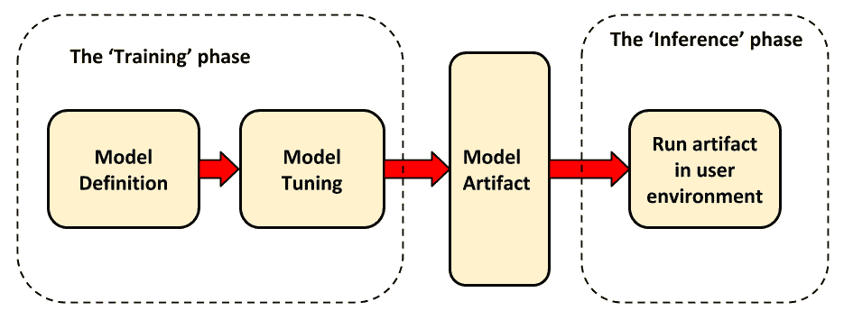
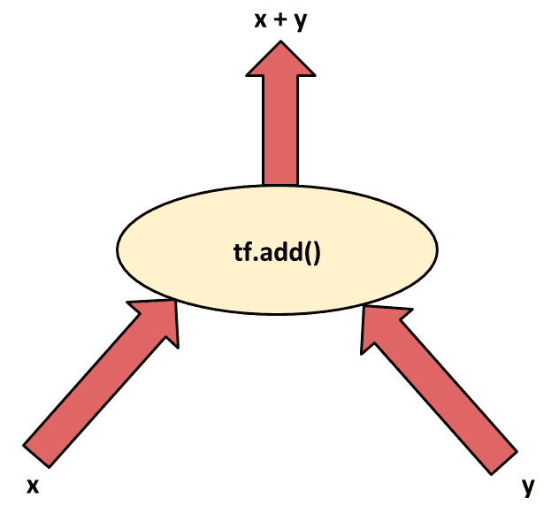
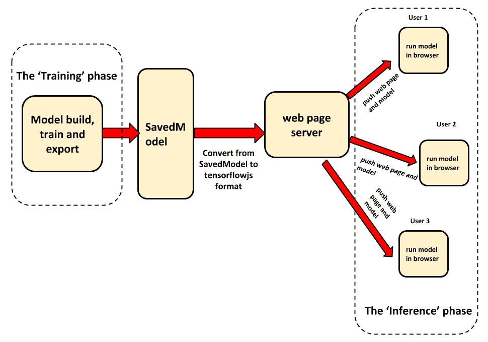

# 五、模型推理管道 - 多平台部署

训练完模型后您会怎么做？ 用它？ 如果答案是肯定的，那么您将如何使用它？ 您正在寻找的答案是**推理**。 简而言之，推理过程是确保机器学习模型可用于满足实际用户需求的基础。 正式地说，推理是有效地计算经过训练的机器学习模型以满足用户需求的过程。 可以在各种硬件类型上进行推断，包括服务器以及最终用户设备（例如电话和 Web 浏览器）。 根据用户要求，它也可以在不同的操作系统上执行。

前几章重点介绍了如何...

# 技术要求

为了运行本章中给出的代码摘录，您将需要以下硬件和软件：

*   **TensorFlow 2.0**（**TF 2.0**）或更高版本（CPU 或 GPU 版本都足够）
*   Python 3.4+（当前，TensorFlow 支持的最高 Python 版本是 3.6）
*   NumPy（如果不是由 TensorFlow 自动安装）
*   Docker（请参阅第 1 章和 “TensorFlow 2.0 入门”，有关如何安装 Docker 的详细信息）
*   [`curl`](https://curl.haxx.se/docs/install.html)
*   具有命令行界面的 Linux 计算机

本章中的每个 Python 代码段均假定已安装 TF 2.0，并且已将其导入到名称空间中。 这意味着在执行任何代码块之前，请先输入以下行：

```py
import tensorflow as tf
```

可在[这个页面](https://github.com/PacktPublishing/What-s-New-in-TensorFlow-2.0/tree/master/Chapter05)中获得本章的代码文件。

# 机器学习工作流程 - 推理阶段

机器学习应用的最常见子集之一遵循*构建一次，并多次使用*范式。 这种类型的应用涉及所谓的推理阶段。 在推断阶段，开发人员必须专注于运行模型以满足用户需求。 满足用户需求可能涉及从用户那里接受输入并对其进行处理以返回适当的输出。 下图描述了典型的高级机器学习应用工作流程：



从上图，我们可以看到推理过程如何适应整体情况。 在随后的应用中...

# 从推理的角度理解模型

实现基于机器学习的应用的开发人员可以依靠的一件事是使生活变得轻松，无论所服务模型中的实际计算如何，向用户提供模型的过程或多或少都是相同的。 这意味着，如果实现正确，工程师可能不必在每次数据科学家更新模型时都重新构建部署管道。 这可以通过利用抽象的力量来实现。 这里的一个关键抽象是模型存储和加载的格式。 通过引入标准化格式，TF 2.0 使得在一个环境中训练模型然后在各个平台上使用它变得容易。 在 TF 2.0 中，执行此操作的标准方法是通过`SavedModel`格式。 这种标准化格式类似于软件开发管道中的构建工件。 读者可以将模型工件视为快照，可用于重新创建模型而无需访问创建模型的实际代码。

实际上，在推理时，模型被简化为一个黑盒子，它具有一组预定义的输入和输出以及一个与底层模型进行交互的统一接口。 开发人员现在要做的就是建立在给定环境中实现和执行黑匣子所需的基础结构。 在以下各节中，我们将学习如何构建管道以服务于各种流行的软件和硬件环境中的模型。

# 模型工件 – SavedModel 格式

`SavedModel`格式是 TensorFlow 使用的默认模型序列化和反序列化格式。 用外行的术语来说，这可以理解为一个容器，它容纳了在不访问创建模型的原始代码的情况下从头开始重现模型的所有内容。 我们可以使用`SavedModel`将训练后的模型从训练阶段转移到推理阶段，甚至在训练过程的不同部分之间转移状态。 简而言之，可以说`SavedModel`包含完整的 TensorFlow 程序以及模型权重和所描述的各种计算操作的描述。 使用 TF 2.0 的 Python API 时，现在可以导出某些本机...

# 了解核心数据流模型

在我们研究`SavedModel`格式的细微差别之前，重要的是要首先了解 TensorFlow 模型的真正含义。 对于初学者，TensorFlow 实现数据流编程范例。 在这种范式下，程序被建模为在不同计算操作之间流动的数据的*有向图*。 这意味着每个节点代表一个操作（或计算），边代表数据。 输入边缘将代表该节点的输入，而输出边缘将对应于计算节点产生的输出。 为了说明这个想法，让我们看一下`tf.add()`操作的（粗略）数据流表示形式。 如下图所示，输入边对应于 x 和 y 的输入。 输出边缘`z(x + y)`对应于节点的输出，在这种特定情况下，该输出恰好是输入的总和：



使用数据流范例可以使 TensorFlow 在执行用户代码时利用某些好处：

*   **并行性**：将模型表示为有向图可以使 TensorFlow 识别哪些操作相互依赖，哪些不依赖。 这样，可以并行执行独立的操作，从而加快基础计算图的执行速度。
*   **分布式执行**：并行性的一个相关好处是，并行执行可以在同一台物理计算机上执行，也可以在另一台物理计算机上完成。 TensorFlow 还负责这些节点之间的通信。
*   **编译**：TensorFlow 的 XLA 编译器旨在利用数据流图中的信息，通过一系列优化来生成更快的代码。
*   **可移植性**：数据流图是模型中代码的语言无关表示形式。 这使得可以在 Python 中构建数据流图并以较低级别的语言（例如 C 或 Java）将其还原以进行低延迟推理。

我们已经看到了如何使用数据流范例来表示一个简单的操作。 实际的 TensorFlow 程序或模型将由许多这样的简单操作组成。 这意味着此类程序的数据流表示形式将由许多此类简单表示形式组成，每个操作通常具有一个或多个节点。 `SavedModel`格式可以理解为该基础数据流图的序列化。 这里有趣地提到了诸如 Keras 和 Estimators 之类的高级 API 的角色。 实际上，他们从用户那里抽象出了该数据流图的细节，以至于用户甚至不必考虑它。 它们为用户提供了一组高级操作，以供实现，然后将其转换为 TensorFlow 可以执行的数据流图。 这意味着，最终，在 TensorFlow 中创建的任何模型，无论其创建方式如何，都将转换为统一的计算图。 这样就可以使用一个统一的格式保存和加载所有模型。

# tf.function API

正如我们在第 1 章中看到的那样，第 2 章“TensorFlow 2.0 入门”， “Keras 默认集成和急切执行”，默认情况下启用急切执行是 TF 2.0 中引入的主要更改之一。 第 1 章和 “TensorFlow 2.0 入门”还简要提到了 TF 2.0 与 Python 编程语言更紧密地结合在一起。 此更改的核心是低级`tf.function` API。 实际上，这是通过使用户能够从 Python 函数创建 TensorFlow 图而将 TensorFlow 1.x 的功能与急切执行的优点相结合。 它既可以用作可调用函数，也可以用作装饰器。 在本节中，我们将简要介绍一下如何在每个人中使用它。

# `tf.autograph`函数

到目前为止，我们已经看到了如何从 Python 函数创建 TensorFlow 图的代码。 TF 2.0 将 Python-TensorFlow 耦合提升到了一个全新的水平。 新引入的 AutoGraph（`tf.autograph`）函数使用户可以使用本机 Python 语法编写图的代码。

当前，此功能仅支持 Python 语法的有限子集。 [这个页面](https://github.com/tensorflow/tensorflow/blob/master/tensorflow/python/autograph/LIMITATIONS.md)中提供了当前支持的语法元素的详细列表。

这样做的主要优点是，它使开发人员可以编写直观的 Python 代码来完成特定任务，然后自动将其转换为高性能的 TensorFlow 图代码。 这意味着开发人员可以以直观的 Python 形式描述基本的编程语言结构（例如循环和条件），而不是 TensorFlow 等效形式，并且具有可比的性能。

在 TF 2.0 中，调用`tf.function`时会自动调用 AutoGraph。 用户不需要单独调用它。 `tf.autograph`模块包含低级模块。 初学者或中级用户几乎不必直接使用它们，现在可以安全地忽略详细信息。

让我们看看执行此操作的示例。 考虑一个计算给定张量中所有值之和的函数。 让我们完全使用 Pythonic 语法实现它，然后使用`tf.function`将其转换为本地 TensorFlow 计算图代码：

```py
@tf.function
def sum_of_cubes(numbers):

    _sum = 0

    for number in numbers:
        _sum += number ** 3

    return _sum
```

为了测试到目前为止已经编写的代码，让我们创建一个介于 1 到 5 之间（包括两端）的整数张量。 然后，将它们传递给我们的函数：

```py
input_values = tf.constant([1, 2, 3, 4, 5])
result = sum_of_cubes(input_values)
print(type(result))
print(result)
```

这将导致以下输出：

```py
<class 'tensorflow.python.framework.ops.EagerTensor'>
tf.Tensor(225, shape=(), dtype=int32)
```

正如我们在提取的输出中看到的那样，我们已经编写的纯 Python 函数现在被转换为 TensorFlow 图。 函数现在返回张量而不是单个数字的事实证明了这一点。 输出值与预期值相同。 有效地，我们已经证明了特定于 Python 的语法结构（例如`for`循环和幂运算符）已成功转换为 TensorFlow 图的代码。 这是`tf.function`和 AutoGraph 的真正功能。 由于我们现在已经有效地将本机 Python 代码转换为 TensorFlow 计算图，因此可以使用`SavedModel`格式在环境之间共享此图。

# 导出自己的 SavedModel 模型

如前所述，`SavedModel`格式用于生成当前计算图（数据流图）的可再现表示。 此表示独立于用于创建计算图的特定代码。 它也独立于用于构造该图的特定过程。 例如，`SavedModel`格式没有积极地区分使用本机 TensorFlow 操作，Keras 甚至`tf.function`创建的计算图。 尽管我们可以互换地将此计算图称为模型，但从技术上讲，它也可以被认为是训练有素的数学模型和围绕它编写的一些其他代码的组合，以执行支持...

# 使用`tf.function` API

如前所述，`tf.function` API 使我们能够使用简单的 Python 编写 TensorFlow 图和模型。 让我们从构建一个简单模型开始，该模型接受一个数字或一个数字列表并返回列表中值的平方。 然后，我们将由此创建的模型导出为`SavedModel`格式。 这是本章以下大部分内容的重要步骤。 我们将几乎在所有地方都使用`SavedModel`工件。

首先，让我们首先编写一个简单的 Python 函数来计算平方。 然后，我们可以从那里向后退：

```py
def compute_square(number):
    return number ** 2

```

如我们所见，前面的 Python 方法接受一个数字作为输入并返回其平方。 我们的最终目标是构建用于执行此计算的 TensorFlow 图。 利用我们从前面的部分中学到的知识，我们知道一种实现方法是使用`tf.function`。 我们选择使用`tf.function`的装饰器形式。 如果仔细观察我们刚刚编写的代码段，您将意识到我们假设传递给`number`变量的值是一个数值。 在现实世界中，情况未必一定如此。 为了解决这个问题，我们可以在装饰器中指定此方法可以接受的值的类型。 这是通过在装饰器中固定输入签名来完成的。 我们将其固定为包含 32 位浮点数的一维张量。 任何不符合此标准的输入将被自动丢弃。 我们修改后的代码片段（带有实现错误检查的功能）现在看起来像这样：

```py
@tf.function(input_signature=[tf.TensorSpec(shape=None, dtype=tf.float32)])
def compute_square(number):
    return number ** 2

```

到目前为止，我们已经成功实现了一个 TensorFlow 计算图，该图可以计算给定一维张量的平方。 现在唯一要做的就是以`SavedModel`格式将此图导出到磁盘。 您可能还记得，`tf.saved_model`模块中提供了用于`SavedModel`的 API。 [在阅读该模块的文档](https://www.tensorflow.org/versions/r2.0/api_docs/python/tf/saved_model)时，我们发现`save`方法可能会对我们有所帮助。 一个粗糙的边缘是`tf.saved_model.save`方法仅适用于`Trackable`类型的对象，而我们所拥有的是`tf.function()`对象（属于`Trackable`类型或其子类）。 为了克服这个问题，我们只需将代码包装在实现`Trackable`接口的类中：

```py
class Square(tf.Module):

    @tf.function(
        input_signature=[
            tf.TensorSpec(shape=None, dtype=tf.float32)
        ]
    )
    def compute_square(self, number):
        return number ** 2​
```

现在，我们将逻辑封装在[H​​TG0]方法支持的表示形式中。 最后，我们创建一个`Square`类的对象（继承自`Trackable`）并将其传递给`save`方法：

```py
sos = Square()
tf.saved_model.save(sos, './square/1')
```

现在，您将看到模型已成功导出到`./square/1`目录。 可以通过列出前面目录的内容来验证。 打开终端并输入以下内容：

```py
cd <directory-containing-your-code>
ls -ax ./square/1
```

您将看到如下内容：

```py
.  ..  assets  saved_model.pb  variables 
```

在接下来的分析`SavedModel`工件的部分中，我们将研究这些文件中的每个文件所包含的内容以及它们在保存模型的过程中所起的作用。

# 分析 SavedModel 工件

在本小节中，我们将详细研究`SavedModel`如何序列化和反序列化 TensorFlow 图。 我们还将看看`SavedModel`命令行界面，这是一个功能强大的工具，可以分析磁盘上`SavedModel`的内容，甚至可以在本地运行`SavedModel`！

`SavedModel`格式本质上描述了一种在磁盘上存储 TensorFlow 图的方法。 在较低的级别上，其工作的一部分是编纂一种用于在文件中表示该图的格式。 按照这种格式，每个图都使用组成的底层函数及其状态的组合表示。 用 TensorFlow 的话来说，这些组成函数用名称标识，并称为签名或命名签名。 这些...

# SavedModel 命令行界面

`SavedModel` **命令行界面**（**CLI**）是非常方便的工具，可用于分析各种`SavedModel`实例并运行它们。 它在调试磁盘上的模型时非常有用，并且可以在不读取，编写或修改任何代码的情况下使用。 在本节中，我们将简要介绍如何安装此工具，使用它分析图的不同组件并运行计算图。

该工具与 TensorFlow 二进制文件捆绑在一起。 如果您通过从源代码构建 TensorFlow 来安装它，则必须单独安装它。 有关安装说明，请参见[这里](https://www.tensorflow.org/beta/guide/saved_model#details_of_the_savedmodel_command_line_interface)。

这里值得简要讨论的两个命令是`show`和`run`。 前者可用于列出 MetaGraph 信息，而后者可用于通过命令行在一组输入上执行图。 通过使用`-h`参数运行工具，可以在每个步骤中获取详细说明：

```py
saved_model_cli -h
```

可以通过在命令名称后调用`-h`参数来获取特定命令的说明。 例如，如果您想要有关`run`命令的详细说明，请键入以下内容：

```py
saved_model_cli run -h
```

为了亲身体验此工具，让我们回到在`tf.function` API 的较早部分中构建和训练的模型。 您可能还记得，模型接受任何维数的张量，并返回包含原始元素平方的相同形状的张量。 首先让我们看一下模型中存在的元图数量。 为此，请在“终端”窗口中键入以下内容：

```py
saved_model_cli show --dir <path-to-model-dir>
```

对于我们计算平方的模型，您应该看到以下内容：

```py
The given SavedModel contains the following tag-sets:
serve
```

如前所述，使用标记集来标识元图。 在这里，我们可以看到只有一个名为`serve`的标签集。 我们可能还想看一下构成该元图的组成函数。 要查看构成此标签集的`SignatureDefs`（有关详细信息，请参阅 [这里](https://www.tensorflow.org/tfx/serving/signature_defs)，您可以键入以下命令：

```py
saved_model_cli show \
 --dir <path-to-model-dir> \
 --tag_set serve
```

对于我们计算平方的模型，您应该看到以下内容：

```py
The given SavedModel MetaGraphDef contains SignatureDefs with the following keys:
SignatureDef key: "__saved_model_init_op"
SignatureDef key: "serving_default"
```

现在，让我们看看如何使用`run`函数与直接使用命令行通过`SavedModel`保存的 TensorFlow 计算图进行交互，而无需编写任何代码。 从上一阶段的输出中可以看到，有两个组件函数。 其中，我们选择使用`serving_default` SignatureDef。 现在，我们可以通过提供所需的输入并获得所需的结果，通过命令行运行它。 为此，我们需要将路径传递给模型，标签集，输入值以及要运行的组件的名称。 为了该测试的目的，我们要计算的张量由`[1, 2 , 3]`给出。 确切的命令如下：

```py
saved_model_cli run \
 --dir <path-to-model> \
 --tag_set serve \
 --input_exprs "number"="[1, 2, 3]" \
 --signature_def serving_default
```

以下是输出：

```py
Result for output key output_0:
[1\. 4\. 9.]
```

从上一阶段的输出中，我们可以观察到以下内容：

*   输出张量与输入张量具有相同的形状
*   输出张量中的值对应于我们输入张量中的值的平方

这些观察结果都确认`SavedModel`工作正常。

在随后的部分中，我们将探讨在各种硬件和软件环境中服务于此模型的方法。

# 后端服务器上的推理

在当今世界，分布式系统无处不在。 从我们浏览的网站到我们在手机上使用的应用范围，当我们不使用分布式系统时几乎没有一天。 鉴于这种无所不在的性质，将这种范例用于构建机器学习系统显然是一个选择。 构建分布式系统的典型模式是在后端服务器上执行资源密集型（和数据敏感型）计算，同时将较轻（且相对独立）的计算任务推向用户设备。 机器学习应用的很大一部分属于资源密集型类别。 此外，机器学习模型是使用数据构建的。 在现实世界中的很大一部分...

# TensorFlow 服务

**TensorFlow 服务**是 **TensorFlow 扩展**（**TFX**）平台的组成部分。 顾名思义，它旨在用于服务于机器学习模型。 简而言之，它是专为生产环境设计的高性能服务系统。 TensorFlow 服务的一个重要特征是它向下游用户公开了一致的 API，而与所服务模型的实际内容无关。 这使得快速进行实验和重新部署变得容易，而无需对其余软件栈进行任何其他更改。 它附带对 TensorFlow 模型的内置支持，并且可以扩展为服务于其他类型的模型。

在本节中，我们将详细介绍 TensorFlow 服务。 从基本的安装和设置开始，以下小节通过一系列动手示例描述如何设置服务器来为`SavedModel`服务。 我们还将简要介绍 TensorFlow 服务提供的一些关键 API。

# 设置 TensorFlow 服务

与 TensorFlow 平台的大多数其他组件一样，TensorFlow 服务也可以通过多种方式安装。 这里推荐通过 Docker 镜像使用它，因为它相对简单。

如果容器镜像对您不起作用，请在[这个页面](https://www.tensorflow.org/tfx/serving/setup)上获取其他安装 TensorFlow 服务方法的摘要。

使用 Docker 设置 TensorFlow 服务涉及一个简单的步骤。 但是，此步骤需要将 Docker 安装在主机上。 有关设置 Docker 的说明，请参阅第 1 章， “TensorFlow 2.0 入门”或本章的“技术要求”部分。 您需要做的就是拉相关的 Docker 镜像以...

# 设置并运行推理服务器

现在我们已经设置了 TensorFlow 服务，让我们使用它来执行一些实际任务。 我们可以看看如何设置后端服务器以服务于前面几节中构建的`SavedModel`格式。 我们可以使用上一节中下载的 Docker 镜像来运行`SavedModel`格式。 为此，我们需要做两件事：

*   将本地主机上包含模型的位置绑定到容器内的目录（`/models/<your-model_name>`）
*   绑定网络端口 TensorFlow 服务正在监听主机上的网络端口

该命令的一般形式如下：

```py
docker run -t --rm \
 -p <port-on-host>:8501 \
 -v <path-to-model-on-host>:/models/<model_name> \
 -e MODEL_NAME=<model_name> \
 tensorflow/serving&
```

现在，模型服务器应该在您的主机上`<port-on-host>`中指定的端口上运行。

现在让我们通过发送一些推断数据来测试我们的模型。 我们可以通过 RESTful API 与模型进行交互。 我们应该将带有输入值的 HTTP `POST`请求发送到服务器。 为此，请在“终端”窗口中键入以下命令：

```py
curl -X POST \
 http://localhost:<port-on-host>/v1/models/square:predict \
 -H 'Content-Type: application/json' \
 -d '{"instances": [1.0, 2.0, 3.0, 4.0]}'
```

您应该看到以下输出：

```py
{
 "predictions": [1.0, 4.0, 9.0, 16.0]
}
```

现在我们已经看到了如何使用 TensorFlow 服务在后端服务器上提供`SavedModel`。 可通过 gRPC 和 RESTful API 访问此模型。 有关这些的详细信息，请参见以下链接：

*   <https://www.tensorflow.org/tfx/serving/api_rest>
*   <https://github.com/tensorflow/serving/blob/master/tensorflow_serving/apis/prediction_service.proto>

请记住，每次调用`docker run`时，主机上都会启动一个新的 Docker 容器。 即使您已停止与该容器进行交互甚至关闭了“终端”窗口，该容器也可能会在后台继续刷新并运行。 这会导致大量的隐藏内存消耗。 需要有意识地停止容器。 为此，请执行以下步骤：

找出刚启动的容器的名称或 ID。 在“终端”窗口中键入以下内容：

```py
docker ps
```

如您在前面的命令的输出中看到的，每个容器都有一个名称和 ID。 这些中的任何一个都可以用来唯一地标识容器。 我们需要使用它来停止我们启动的容器。 可以按照以下步骤进行：

```py
docker stop <container-name>
```

您还可以使用以下内容：

```py
docker stop <container-id>
```

现在，您可以放心，容器已停止并且没有占用计算机的任何内存。

# 当 TensorFlow.js 与 Node.js 相遇时

TensorFlow.js 的引入使在 JavaScript 环境中运行 TensorFlow 模型成为可能。 您可能已经知道，Node.js 是一个跨平台的运行时环境，可以在浏览器外部执行 JavaScript 代码。 这样就可以使用 JavaScript 代码编写后端服务。 将 Node.js 与 TensorFlow.js 集成在一起，就可以从 JavaScript 环境在后端服务器上提供机器学习服务。 请参阅[这个页面](https://www.tensorflow.org/js/tutorials/setup)上有关如何执行此操作的文档。

# 浏览器中的推断

您可能还记得，在前面的部分中，我们简要讨论了分布式系统。 在那里，我们讨论了主要在主机服务器上执行基于机器学习的计算的场景。 在这里，我们将研究在浏览器中在用户端执行这些计算的场景。 这样做的两个重要优点如下：

*   计算被推送到用户端。 主机不必担心为执行计算而管理服务器。
*   将模型推送到用户端意味着不必将用户数据发送到主机。 对于使用敏感或私有用户数据的应用来说，这是一个巨大的优势。 因此，浏览器中的推理成为对隐私至关重要的机器学习应用的绝佳选择：



上图中描述的工作流说明了从头构建模型然后允许最终用户在其 Web 浏览器中运行它的端到端管道。 我们看到该过程分为两个主要阶段：训练和推理。 在训练阶段，数据科学家和其他机器学习从业者聚在一起，建立和训练模型。 现在，该模型以`SavedModel`格式导出。 但是，TensorFlow.js 尚不直接支持`SavedModel`格式。 因此，有必要将模型转换为 TensorFlow.js 支持的格式。

有关如何执行转换的详细信息，请参见[这里](https://www.tensorflow.org/js/tutorials/conversion/import_saved_model)。

现在，通过任何其他 JavaScript 代码，都可以通过 Web 服务器将转换后的模型提供给用户。 用户为模型提供必要的输入。 TensorFlow.js 模型在用户浏览器中处理这些输入并返回适当的输出。

Detailed resources for getting started with TensorFlow.js are available at the following links:

*   <https://www.tensorflow.org/js/guide>
*   <https://www.tensorflow.org/js/tutorials>
*   <https://www.tensorflow.org/js/demos>

# 移动和物联网设备上的推理

在过去几年中，智能手机的使用呈指数增长，并且以不减缓的方式持续增长。 其他物联网设备在我们的日常生活中也变得越来越普遍。 使用率的这些上升趋势对机器学习系统产生了有趣的影响。 与普通主机相比，这些平台通常资源有限。 结果，需要其他优化来在此类设备上进行推理。 TensorFlow 平台支持构建机器学习和基于深度学习的应用，这些应用可以在不同类型的边缘设备（例如手机和其他 IoT 设备）上运行。 实现此目的的主要工具是...

# 总结

在本章中，我们详细介绍了推理阶段。 首先，通过对端到端机器学习工作流的外观有了基本了解，我们了解了每个阶段涉及的主要步骤。 我们还了解了将模型从训练阶段转移到推理阶段时所起作用的不同抽象。 详细了解`SavedModel`格式和基础数据流模型，我们了解了可用于构建和导出模型的不同选项。 我们还了解了`tf.function`和`tf.autograph`等出色功能，使我们能够使用本地 Python 代码构建 TensorFlow 图。 在本章的后半部分，我们学习了如何构建推理管道，以便在后端服务器，Web 浏览器甚至边缘设备等不同环境中运行 TensorFlow 模型。

在下一章中，我们将了解有关 AIY 项目和 TensorFlow Lite 的更多信息。