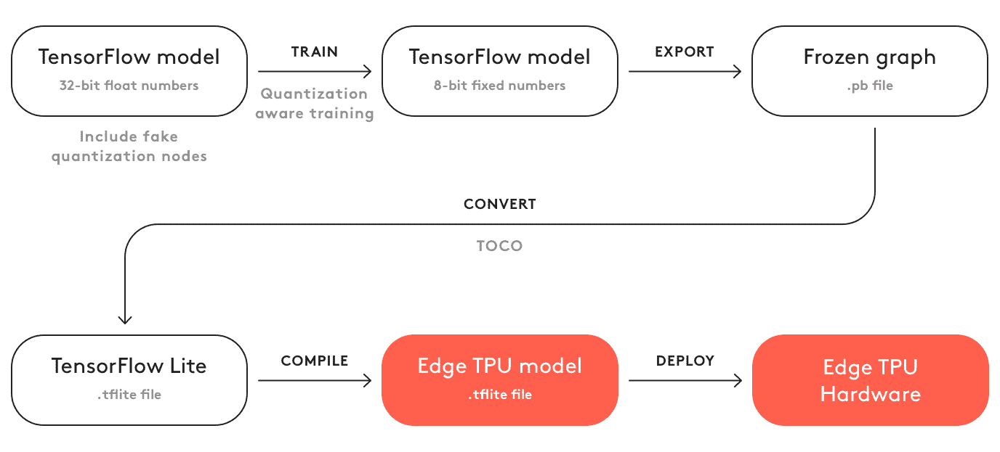
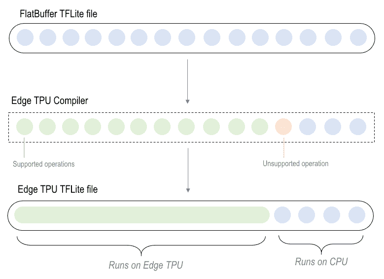
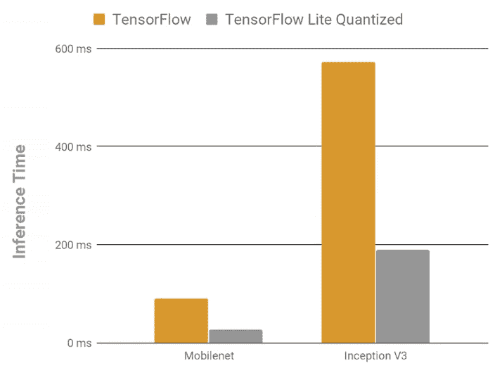

# 六、AIY 项目和 TensorFlow Lite

本章详细介绍如何在低功耗嵌入式系统（例如边缘设备，移动系统（例如 Android，iOS 和 Raspberry Pi），Edge TPU 和 NVIDIA Jetson Nano 上部署经过训练的 **TensorFlow 2.0**（**TF2.0**）模型。 本章还介绍了自己动手工具包的训练和部署模型，例如 Google **自己做人工智能**（**AIY**）工具包。 本章涵盖的其他主题是如何将经过训练的 **TensorFlow**（**TF**）模型转换为 **TensorFlow Lite**（**TFLite**）模型，他们之间的主要区别，以及两者的优势。

本章与前几章略有不同，从某种意义上说，它只是对 TF2.0 的更广泛关注的介绍。 也就是说，硬件领域...

# TFLite 简介

TFLite 是一组工具，可帮助开发人员在二进制大小较小且延迟较低的设备上运行 TF 模型。 TFLite 由两个主要组件组成：TFLite 解释器（`tf.lite.Interpreter`）和 TFLite 转换器（`tf.lite.TFLiteConverter`）。 TFLite 解释器实际上是在低功耗设备（例如手机，嵌入式 Linux 设备和微控制器）上运行 TFLite 模型的。 另一方面，TFLite 转换器在可用于训练 TF 模型的强大设备上运行，并将训练后的 TF 模型转换为解释器的有效形式。

TFLite 旨在简化在设备上执行机器学习的过程，而无需通过网络连接发送任何数据。 这样可以改善延迟时间（因为没有通过网络传输数据），提高了隐私性（因为没有数据会离开设备）和脱机功能（因为不需要互联网连接就可以在任何地方发送数据）。

TFLite 的一些关键功能包括针对设备的经过优化的优化解释器（它支持在二进制大小较小的设备上优化的一组核心操作），针对多种语言（例如 Swift，C，C++，Java 和 Python 的 API），预训练的模型和教程（新手可以在低功耗设备上轻松部署机器学习模型）。 TFLite 旨在通过硬件加速以及预融合的激活和偏差进行高效和优化。

TFLite 的基本开发工作流程是选择模型，转换模型，将其部署到所需的设备并优化模型。 该模型可以是任何东西，从`tf.keras`自定义训练模型到从 TF 本身获取的预训练模型。

# TFLite 入门

使用 TFLite 的第一步是选择要转换和使用的模型。 这包括使用预训练的模型，定制训练的模型或微调的模型。 TFLite 团队提供了一组预训练和预转换的模型，可以解决各种机器学习问题。 这些包括图像分类，对象检测，智能回复，姿势估计和分割。 使用经过微调的模型或经过定制训练的模型需要另一步骤，将它们转换为 TFLite 格式。

TFLite 旨在在设备上高效地执行模型，而这种效率的某些内在原因来自用于存储模型的特殊格式。 TF 模型必须先转换为这种格式，然后才能使用...

# 在移动设备上运行 TFLite

在本节中，我们将介绍如何在两种主要的移动操作系统（Android 和 iOS）上运行 TFLite。

# Android 上的 TFLite

在 Android 上使用 TFLite 就像在 Android Studio 的`build.gradle`文件中的`dependencies`字段中添加 TFLite 并将其导入 Android Studio 一样容易：

```py
dependencies {    implementation 'org.tensorflow:tensorflow-lite:0.0.0-nightly'}import org.tensorflow.lite.Interpreter;
```

一旦完成，下一步就是创建解释器的实例并加载模型。 可以使用 GitHub 上 TFLite 示例中的`getModelPath`函数`getModelPath`和`loadModelFile`加载转换后的 TFLite 文件来实现。 现在，要运行模型，只需使用解释器类的`.run`方法并为其提供所需的输入数据，如本例所示：

```py
tflite.run(inp,out);
```

`inp`参数是输入数据，它将...

# iOS 上的 TFLite

在 iOS 上使用 TFLite 的过程与此类似，其中包括安装 TFLite 解释器，加载模型并运行它。 再次按照“TFLite 入门”部分中的步骤操作，以创建和转换机器学习模型以在智能手机上使用。 我们将使用以下步骤在 iOS 上实现 TFLite：

1.  通过将 TFLite 添加到项目的`root`目录中的`pod`文件中来安装它：

```py
use_frameworks!
pod 'TensorFlowLiteSwift'
```

通过运行`pod install`来安装包，这将安装`pod`文件中包括的所有包，包括新添加的`TFLite`包。 安装后，可以通过在`swift`文件顶部附近添加`import TensorFlowLite`来导入包。

2.  要运行`interpreter`，首先为张量分配内存：

```py
let outputTensor: Tensor
do {
  try interpreter.allocateTensors()
 let inputTensor = try interpreter.input(at: 0)
```

3.  然后，从图像缓冲区中删除`alpha`组件以获取`rgbData`变量：

```py
guard let rgbData = rgbDataFromBuffer(
 thumbnailPixelBuffer,
 byteCount: batchSize * inputWidth * inputHeight * inputChannels,
 isModelQuantized: inputTensor.dataType == .uInt8
 ) else {
 print("Failed to convert the image buffer to RGB data.")
 return
 }
```

4.  接下来，将`rgbData`变量复制到`Tensor`输入模型中：

```py
try interpreter.copy(rgbData, toInputAt: 0)
```

5.  通过调用`interpreter`函数运行推理：

```py
try interpreter.invoke()
```

6.  获取`outputTensor`函数以处理推理结果：

```py
outputTensor = try interpreter.output(at: 0)
} catch let error {
  print("Failed to invoke the interpreter with error: \(error.localizedDescription)")
  return
}
```

然后可以处理结果并将其显示在应用中。

# 在低功率机器上运行 TFLite

TFLite 能够在低功耗和低二进制计算机上运行的能力使其在嵌入式 Linux 计算机上运行时非常强大。 TFLite 可以在许多流行的嵌入式 Linux 机器以及 Coral Dev Board 上运行。 在本节中，我们将介绍在三个设备上 TFLite 的构建，编译和运行。 涵盖的第一个设备是带有 Edge TPU 处理器的 Coral Dev Board，第二个设备是 NVIDIA Jetson Nano，最后一个是 Raspberry Pi。 NVIDIA Jetson Nano 是 NVIDIA 的小型而强大的计算机，可在图像分类，目标检测，分割和语音等应用中并行运行多个神经网络。

# 在 Edge TPU 处理器上运行 TFLite

Edge TPU 是一种小型处理器，能够执行深度前馈网络，例如卷积神经网络。 但是，它仅支持量化的 TFLite 模型。 **量化**是一种优化技术，可将所有 32 位浮点数转换为最接近的 8 位定点数。 这使模型更小，更快，尽管精度和准确率有所降低。

TF 支持两种类型的量化。 第一种量化方式是**训练后量化**。 通过将模型优化属性设置为带有`tf.lite.Optimize.OPTIMIZE_FOR_SIZE`的列表，可以在将 TF 模型转换为 TFLite 模型时完成此操作。 这导致权重被转换为 8 位精度，从而将延迟增加了多达 3 倍。 网络中其他更多计算密集型操作将转换为具有定点操作但具有浮点内存的混合操作。

另一种量化类型是**量化感知训练**，它使用伪造的量化节点来模拟前向和后向模型中量化的效果； 该量化是直接估计。 这是 Edge TPU 支持的唯一量化，并允许在其上运行 TFLite 模型。

Edge TPU 有两种可用方式：

*   Coral 开发板，其中包含 TPU 以及预安装的所有必需软件和 API
*   Edge TPU USB 扩展器，可在所需计算机上添加另一个处理器

USB 加速器与任何具有运行 Debian 的 USB 端口的 Linux 计算机兼容。 要设置 USB 加速器，请从[这里](https://dl.google.com/coral/edgetpu_api/edgetpu_api_latest.tar.gz)下载`.tar`文件，然后解压缩并运行`install.sh`。

这里要注意的一点是，在安装过程中，安装程序将要求启用最大工作频率，这将大大加快推理时间，但也会使 TPU 摸起来很烫。

下图显示了将 TF 模型转换为 Edge TPU 模型并在其上运行的过程：



但是，Edge TPU 有两个约束。 如前所述，必须使用量化感知训练对`Tensor`参数进行量化。 张量大小必须恒定（这样就不能有动态大小）； 模型参数必须恒定； 张量必须是一维，二维或三维张量，或者是三个最里面的大小大于 3 维的张量，并且只能包含 Edge TPU 支持的那些操作。 如果不满足这些要求，那么将仅编译某些模型。 模型图中发生不支持的操作的第一点是编译器将图分为两部分：一部分包含 Edge TPU 可以计算的所有操作，另一部分包含它不能计算的操作，这些部分将运行在 CPU 上：



一旦 TFLite 模型已编译并准备好运行，就可以使用 Edge TPU 运行时和 API 库执行该模型。 Edge TPU API 具有三个用于推理的关键 API：

*   `ClassificationEngine` API，执行图像分类。 要使用它，请通过指定模型来创建实例，然后将图像传递到该实例的`ClassifyWithImage()`方法，该方法返回标签和分数列表。
*   `DetectionEngine` API，用于执行对象检测。 与先前的 API 一样，通过指定模型文件来创建实例，然后运行`DetectWithImage()`方法，该方法返回检测候选对象的列表，每个候选对象包含一个标签，一个得分和该对象的坐标。
*   最终的关键 API 是允许压印的 API：一种迁移学习算法，可以进行模型重新训练而无需反向传播，并且可以在 Edge TPU 上运行。 要运行此 API，必须遵循三个步骤：
    1.  首先，确定嵌入张量，它是最后一个分类层的输入张量。
    2.  然后，切断最后一个分类层。
    3.  最后，完成嵌入提取器。

Edge TPU 的性能远远优于许多最强大的 CPU。 当在带或不带 USB 加速器的 IntelXeon®3.60 GHz 处理器上测试模型时，单个 Edge TPU 能够以每秒 2 瓦的功率每秒执行 4 万亿次操作； 嵌入式 1.5 GHz CPU； 和珊瑚开发委员会。 在运行 DeepLab 网络时，英特尔至强花费了 301 毫秒，带加速器的英特尔至强花费了 35 毫秒，嵌入式 CPU 花费了 1,210 毫秒，而珊瑚开发板花费了 156 毫秒。 显然，Edge TPU 对模型的延迟具有重大影响。

# 在 NVIDIA Jetson Nano 上运行 TF

NVIDIA Jetson Nano 是另一种嵌入式设备，可为机器学习应用提供强大的计算能力。 Jetson Nano 的前提与 Edge TPU 不同，因为 Jetson Nano 是一款小型而功能强大的 GPU 计算机。 Jetson Nano 可以像配置用于深度学习的任何机器一样使用，并且可以轻松安装 GPU 版本的 TF。 也不需要安装 CUDA 和 cuDNN，因为它已预先安装在系统上。

# 比较 TFLite 和 TF

如前所述，TFLite 模型与普通 TF 模型有很大不同。 TFLite 模型更快，更小且计算量更少。 这种区别来自 TFLite 模型的特殊存储和解释方式。

速度的首次提高来自模型存储的基本格式。`.tflite`模型文件以`FlatBuffer`格式存储，其中包含模型的简化形式和二进制形式。 `FlatBuffer`是适用于多种流行语言的高效跨平台序列化库，由 Google 创建，用于游戏开发和其他对性能至关重要的应用。 `FlatBuffer`格式在有效序列化模型数据并提供对这些数据的快速访问，同时保持较小的二进制大小方面起着至关重要的作用。 由于大量的数字数据，这对于模型存储很有用，这通常会在读取操作中产生很多延迟。 通过使用`FlatBuffers`，TFLite 可以绕过许多传统的文件解析和非解析操作，这在计算上非常昂贵。

TFLite 模型优化也一直延伸到设备上的硬件。 这是因为，由于电话处理器和嵌入式 CPU 的限制，必须以超高效标准使用所有处理器。 在 Android 上运行 TFLite 时，可访问 Android 神经​​网络 API，该接口可访问 Android 中的硬件加速推理操作，并且已接口，以利用有利的硬件加速来使用所使用的设备。 TFLite 还可以在电话和其他设备中使用内置的 GPU，从而使具有过多可并行化操作和量化敏感精度的模型的速度提高了近 7 倍。

如前所述，量化是另一种非常有影响力的优化技术。 量化被视为 TF 中的一种压缩技术。 神经网络中的权重和激活趋向于具有分布在相对较小范围内的三个值，因此可以有效地使用量化来压缩这些值。 由于神经网络往往对权重噪声具有鲁棒性，因此量化和舍入加到参数上的噪声对模型的整体准确率影响很小。 量化模型的好处在于，它可以有效地表示任意范围的范围，它们的线性扩展使乘法简单明了，而量化权重具有对称范围，可以实现下游硬件优化，而 32 位浮点数则无法实现。

如下图所示，将模型从 TF 转换为量化的 TFLite 模型会大大减少模型的推理时间和延迟：



# AIY

Google 为语音和视觉应用发布了自己的制造商套件，称为 AIY。 这些套件随附了所有必需的零件和组件，以及在线易于理解的教程。 AIY 当前提供两种套件-语音套件和视觉套件。

# 语音套件

语音工具包提供了构建自然语言处理器并将其连接到 Google Assistant 或 Cloud Speech-to-Text 服务的功能。 该套件随附 Raspberry Pi Zero，以及定制设计的语音引擎盖和用于音频功能的扬声器。 该套件还随附可插入 Pi 的 SD 卡，以及用于许多最常见应用的大量演示，示例和摘要。 它还带有一个在设备上运行 Google Assistant 并将其转变为智能家居设备的应用。

要开始使用语音工具包，请按照[这个页面](https://aiyprojects.withgoogle.com/voice/#assembly-guide)上的说明构建设备。 该设备设计合理，易于组装和设置。 要设置设备，可以使用计算机或手机。 该套件的设置非常简单，可以通过**安全外壳**（**SSH**）或 HDMI 连接来完成。 完成后，可以运行许多演示来进一步了解和探索该工具包，例如前面提到的 Google Assistant 应用。

语音工具包可以完成的一些事情包括创建自定义语音用户界面和使用助手控制 IoT 设备。

可以使用套件中`demo`文件夹中包含的 Google Cloud 语音转文本 API 和 AIY API 在语音工具包上创建自定义语音用户界面。 该 API 增加了使用 Cloud Speech API，语音转文本以及控制 Vision Bonnet 上的 GPIO 引脚的功能。

要使用语音工具包和助手来控制 IoT 设备，您可以使用几种强大的技术。 都使用了用于物联网项目的 Wi-Fi 开发套件 Particle Photon 和用于创建对话界面的`DialogFlow`。 语音套件中包含的演示提供了打开和关闭连接到 Photon 的 LED 的代码。

# 视觉套件

视觉套件提供了构建智能相机的功能，该相机可以使用机器学习来查看和识别对象，甚至可以在其上运行自定义 TF 模型。 与语音工具包一样，该工具包还附带 Raspberry Pi Zero，定制设计的 Vision Bonnet，压电蜂鸣器和 Raspberry Pi Camera V2。 该套件随附一个预先存储有 AIY 系统图像的 SD 卡，其中包括针对多种计算机视觉应用的演示，例如图像分类，物体检测，人脸检测，食物分类和自动拍照。

和以前一样，可以按照[这里](https://aiyprojects.withgoogle.com/vision/#assembly-guide)。 该设备有一个简单的...

# 总结

TFLite 是 TF2.0 的一项功能，它采用 TF 模型并对其进行压缩和优化，以在嵌入式 Linux 设备或低功耗和低二进制设备上运行。 可以通过三种方式将 TF 模型转换为 TFLite 模型：从已保存的模型，`tf.keras`模型或具体函数。 转换模型后，将创建一个`.tflite`文件，然后可以将其传输到所需的设备并使用 TFLite 解释器运行。 该模型经过优化以使用硬件加速，并以`FlatBuffer`格式存储，以提高读取速度。 可以将其他优化技术应用于该模型，例如量化，以最小的精度权衡将 32 位浮点数转换为 8 位定点数。 可以在 TFLite 上运行的某些设备是 Edge TPU，NVIDIA Jetson Nano 和 Raspberry Pi。 Google 还提供了两个工具包，可为用户提供创建与视觉和语音相关的机器学习应用所需的硬件。

在下一章中，我们将学习如何从 TF1.x 迁移到 TF2.0。