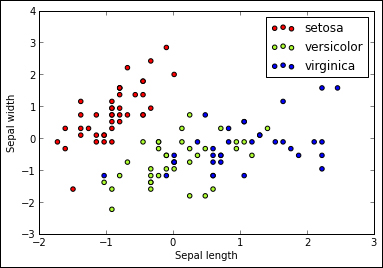
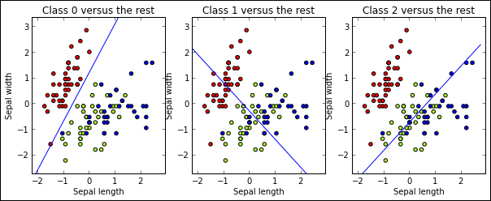

# 一、机器学习 - 温和的介绍

> “在数据变大之前，我已经进入了这个领域。” -- @ml_hipster

您最近可能听说过大数据。互联网，具有巨大计算能力的电子设备的爆炸式增长，以及我们世界上几乎每个流程都使用某种软件的事实，每分钟都在为我们提供大量数据。

想想社交网络，我们存储有关人员，他们的兴趣和他们的互动的信息。想想过程控制设备，从 Web 服务器到汽车和心脏起搏器，永久地保留关于其表现的数据记录。想想科学研究计划，例如基因组计划，它必须分析关于我们 DNA 的大量数据。

你可以用这些数据做很多事情：检查它，总结它，甚至以几种美妙的方式将它可视化。但是，本书讨论了数据的另一种用途：作为改善算法表现的经验来源。这些算法可以从以前的数据中学习，属于机器学习领域，这是人工智能的一个子领域。

任何机器学习问题都可以用以下三个概念表示：

*   我们将必须解决任务`T`。例如，构建一个垃圾邮件过滤器，学习将电子邮件归类为垃圾邮件或正常邮件。
*   我们需要一些经验`E`来学习执行任务。通常，经验通过数据集表示。对于垃圾邮件过滤器，体验来自一组电子邮件，由人工分类为垃圾邮件或正常邮件。
*   我们需要一定程度的表现`P`来了解我们解决任务的能力，以及了解经过一些修改后，我们的结果是在改善还是在恶化。我们的垃圾邮件过滤器将电子邮件正确分类为垃圾邮件或正常邮件的百分比，可能是我们的垃圾邮件过滤任务的`P`。

Scikit-learn 是一个开源的 Python 机器学习算法库，它允许我们构建这些类型的系统。该项目于 2007 年由 David Cournapeau 作为 Google Summer of Code 项目启动。那年晚些时候，Matthieu Brucher 作为他论文的一部分开始研究这个项目。2010 年，Fabian Pedregosa，Gael Varoquaux，Alexandre Gramfort，INRIA 的 Vincent Michel 领导项目并首次公开发布。如今，该项目正在由热情的贡献者社区积极开发。它建立在 [NumPy](http://www.numpy.org/) 和 [SciPy](http://scipy.org/) 之上，它是用于科学计算的标准 Python 库。通过本书，我们将使用它向您展示，如何将先前数据整合为经验来源，来有效解决几个常见的编程任务。

在本章的以下部分中，我们将开始查看如何安装 scikit-learn 并准备您的工作环境。之后，我们将以实用的方式简要介绍机器学习，尝试在解决简单实际任务的同时介绍关键机器学习概念。

## 安装 scikit-learn

有关 scikit-learn 的安装说明，请访问[这个页面](http://scikit-learn.org/stable/install.html)。本书中的几个例子包括可视化，因此您还应该从 [matplotlib.org](http://matplotlib.org/) 安装`matplotlib`包。 我们还建议安装 IPython 笔记本，这是一个非常有用的工具，包括一个基于 Web 的控制台来编辑和运行代码片段，并渲染结果。本书附带的源代码是通过 IPython 笔记本提供的。

安装所有包的简单方法是从 [store.continuum.io](https://store.continuum.io/) 下载并安装用于科学计算的 Anaconda 发行版，该发行版为 Linux，Mac 和 Windows 平台提供所有必需的包。或者，如果您愿意，以下部分提供了有关如何在每个特定平台上安装每个包的一些建议。

### Linux

安装环境的最简单方法可能是通过操作系统包。对于基于 Debian 的操作系统，例如 Ubuntu，您可以通过运行以下命令来安装包：

*   首先，要安装包，我们输入以下命令：

    ```py
    #sudo apt-get install build-essential python-dev python-numpy python-setuptools python-scipy libatlas-dev
    ```

*   然后，要安装 matplotlib，请运行以下命令：

    ```py
    #sudo apt-get install python-matplotlib
    ```

*   之后，我们应该准备通过键入以下命令来安装 scikit-learn：

    ```py
    #sudo pip install scikit-learn
    ```

*   要安装 IPython 笔记本，请运行以下命令：

    ```py
    #sudo apt-get install ipython-notebook
    ```

*   如果你想从源代码安装，假设在虚拟环境中安装所有库，你应该键入以下命令：

    ```py
    #pip install numpy
    #pip install scipy 
    #pip install scikit-learn
    ```

*   要安装 Matplotlib，您应该运行以下命令：

    ```py
    #pip install libpng-dev libjpeg8-dev libfreetype6-dev
    #pip install matplotlib
    ```

*   要安装 IPython 笔记本，你应该运行以下命令：

    ```py
    #pip install ipython
    #pip install tornado
    #pip install pyzmq
    ```

### Mac

您可以以类似方式使用 MacPorts 和 HomeBrew 等工具，它们包含这些包的预编译版本。

### Windows

要在 Windows 上安装 scikit-learn，你可以从[项目网页的下载部分](http://sourceforge.net/projects/scikit-learn/files/)下载 Windows 安装程序。

### 检查您的安装

要检查是否已准备好运行，只需打开 Python（或可能更好的 IPython）控制台并输入以下内容：

```py
>>> import sklearn as sk
>>> import numpy as np
>>> import matplotlib.pyplot as plt
```

我们决定在 Python 代码之前加上`>>>`将它与句子结果分开。 Python 将静默导入 scikit-learn，NumPy 和 matplotlib 包，我们将在本书的其余部分中使用它们。

如果要执行本书中介绍的代码，则应运行 IPython 笔记本：

```py
## ipython notebook
```

这将允许您直接在浏览器中打开相应的笔记本。

### 数据集

正如我们所说，机器学习方法依赖于以前的经验，通常由数据集表示。在 scikit-learn 上实现的每个方法，都假定数据来自数据集，这是一种特定形式的输入数据表示，使程序员可以更容易地对同一数据尝试不同的方法。Scikit-learn 包含一些众所周知的数据集。在本章中，我们将使用其中一个，鸢尾花数据集，由 Sir Ronald Fisher 在 1936 年引入，来显示统计方法（判别分析）如何工作（是的，他们在大数据出现之前就收集了数据。您可以在维基百科页面上找到该数据集的描述，但实际上，它包含来自三种不同鸢尾花物种的 150 个元素（或机器学习术语，实例）的信息，包括萼片和花瓣的长度和宽度。使用这个数据集解决的自然任务是，知道萼片和花瓣的测量值并学习猜测鸢尾种类。它已广泛用于机器学习任务，因为它是一个非常简单的数据集，我们稍后会看到。让我们导入数据集并显示第一个实例的值：

```py
>>> from sklearn import datasets
>>> iris = datasets.load_iris()
>>> X_iris, y_iris = iris.data, iris.target
>>> print X_iris.shape, y_iris.shape
  (150, 4) (150,)
>>> print X_iris[0], y_iris[0]
  [ 5.1  3.5  1.4  0.2] 0
```

我们可以看到`iris`数据集是一个对象（类似于字典），它有两个主要成分：

*   一个`data`数组，  ，其中，对于每个实例，我们都有萼片长度，萼片宽度，花瓣长度和花瓣宽度的实际值（请注意，出于效率原因，scikit-learn 方法使用了 NumPy `ndarrays`，而不是更具描述性但效率更低的 Python 词典或列表。这个数组的形状是`(150, 4)`，这意味着我们有 150 行（每个实例一个）和四列（每个特征一个）。
*   一个`target`数组，值在 0 到 2 的范围内，对应于每种鸢尾种类（0：山鸢尾，1：杂色鸢尾和 2：弗吉尼亚鸢尾），您可以通过打印`iris.target.target_names`值来验证。

虽然我们用于 scikit 的每个数据集都没有必要具有这种精确结构，但我们将看到每个方法都需要这个数据数组，其中每个实例都表示为一个特征或属性列表，另一个目标数组代表某个值，我们希望我们的学习方法能够学会预测。在我们的例子中，花瓣和萼片测量值是我们的实值属性，而花种是我们想要预测的几个类别之一。

## 我们的第一个机器学习方法 - 线性分类

为了处理 scikit-learn 中机器学习的问题，我们将从一个非常简单的机器学习问题开始：我们将尝试仅预测两个鸢尾花种属性：萼片宽度和萼片长度。这是分类问题的一个实例，我们希望根据其特征为项目分配标签（从离散集合中取得的值）。

让我们首先构建我们的训练数据集 - 原始样本的子集，由我们选择的两个属性及其各自的目标值表示。导入数据集后，我们将随机选择大约 75% 的实例，并保留剩余的实例（评估数据集）来用于评估目的（我们将在后面看到为什么我们应该总是这样做）：

```py
>>> from sklearn.cross_validation import train_test_split
>>> from sklearn import preprocessing
>>> # Get dataset with only the first two attributes
>>> X, y = X_iris[:, :2], y_iris
>>> # Split the dataset into a training and a testing set
>>> # Test set will be the 25% taken randomly
>>> X_train, X_test, y_train, y_test = train_test_split(X, y, test_size=0.25, random_state=33)
>>> print X_train.shape, y_train.shape
  (112, 2) (112,)
>>> # Standardize the features
>>> scaler = preprocessing.StandardScaler().fit(X_train)
>>> X_train = scaler.transform(X_train)
>>> X_test = scaler.transform(X_test)
```

`train_test_split`函数自动构建训练和评估数据集，随机选择样本。为什么不选择前 112 个例子呢？这是因为样本中的实例顺序可能很重要，并且第一个实例可能与最后一个实例不同。事实上，如果你看一下鸢尾数据集，实例按其目标类排序，这意味着新训练集中`0`和`1`类的比例将更高  ，与原始数据集进行比较。我们总是希望我们的训练数据成为他们所代表的总体的代表性样本。

前一代码的最后三行在通常称为特征缩放的过程中修改训练集。对于每个特征，  计算平均值，从特征值中减去平均值，并将结果除以它们的标准差。缩放后，每个特征的平均值为零，标准差为 1。这种值的标准化（不会改变它们的分布，因为你可以通过在缩放之前和之后绘制`X`值来验证）是机器学习方法的常见要求，来避免具有大值的特征可能在权重上过重。

现在，让我们看一下我们的训练实例如何在由学习特征生成的，二维空间中分布。来自 matplotlib 库的`pyplot`将帮助我们：

```py
>>> import matplotlib.pyplot as plt
>>> colors = ['red', 'greenyellow', 'blue']
>>> for i in xrange(len(colors)):
>>>     xs = X_train[:, 0][y_train == i]
>>>     ys = X_train[:, 1][y_train == i]
>>>     plt.scatter(xs, ys, c=colors[i])
>>> plt.legend(iris.target_names)
>>> plt.xlabel('Sepal length')
>>> plt.ylabel('Sepal width')
```

`scatter`函数简单地绘制每个实例的第一个特征值（萼片宽度）与其第二个特征值（萼片长度），并使用目标类值为每个类指定不同的颜色。通过这种方式，我们可以很好地了解这些属性如何有助于确定目标类。以下屏幕截图显示了生成的图：



看一下前面的截图，我们可以看到红点（对应于 Iris setosa）和绿点和蓝点（对应于另外两种鸢尾物种）之间的分离非常清楚，而鉴于这两个特征可用，将绿色与蓝点分开似乎非常任务艰巨。这是一个非常常见的场景：我们想要在机器学习任务中回答的第一个问题是，我们使用的特征集是否对我们正在解决的任务实际上有用，或者我们是否需要添加新属性或更改我们的方法。

鉴于可用数据，让我们在这里重新定义我们的学习任务：假设我们瞄准鸢尾花实例，预测它是否是一个山鸢尾。我们已经将我们的问题转换为二元分类任务（也就是说，我们只有两个可能的目标类）。

如果我们看一下图片，似乎我们可以绘制一条正确分隔两个集合的直线（可能除了一个或两个点，它们可能位于线的不正确的一侧）。这正是我们的第一种分类方法 - 线性分类模型试图做的：构建一条线（或更一般地说，在特征空间中的超平面），最优地分离两个目标类，并将其用作决策边界（是，类成员身份取决于实例在超平面的哪一侧）。

要实现线性分类，我们将使用 scikit-learn 中的`SGDClassifier`。 **SGD** 代表**随机梯度下降**，这是一种非常流行的数值过程，用于查找函数的局部最小值（在本例中为损失函数），测量每个实例离我们边界的距离。该算法将通过最小化损失函数来学习超平面的系数。

要在 scikit-learn，中使用任何方法，我们必须首先创建相应的分类器对象，初始化其参数，并训练拟合训练数据的模型。当你在本书中前进时，你会看到这个程序对于最初看起来非常不同的任务几乎是一样的。

```py
>>> from sklearn.linear_model import SGDClassifier
>>> clf = SGDClassifier()
>>> clf.fit(X_train, y_train) 
```

`SGDClassifier`初始化函数允许多个参数。目前，我们将使用默认值，但请记住，这些参数可能非常重要，尤其是当您面对更多真实世界的任务时，实例数量（甚至属性数量）可能非常大。 `fit`函数可能是 scikit-learn 中最重要的函数。它接收训练数据和训练类别，并构建分类器。 scikit-learn 中的每个监督学习方法都实现了这个函数。

在我们的线性模型方法中，分类器看起来像什么？正如我们已经说过的，每个未来的分类决策都只取决于超平面。那个超平面就是我们的模型。`clf`对象的`coef_`属性（暂时考虑，只考虑矩阵的第一行），现在具有线性边界的系数和`intercept_`属性，直线与 y 轴的交点。我们打印出来：

```py
>>> print clf.coef_
[[-28.53692691  15.05517618]
  [ -8.93789454  -8.13185613]
  [ 14.02830747 -12.80739966]]
>>> print clf.intercept_
[-17.62477802  -2.35658325  -9.7570213 ] 
```

实际上，在实际平面中，使用这三个值，我们可以绘制一条线，由以下等式表示：

```py
-17.62477802 - 28.53692691 * x1 + 15.05517618 * x2 = 0
```

现在，给定`x1`和`x2`（我们的实值特征），我们只需要计算等式左侧的值：如果它的值大于零，那么该点在决策边界（红色一侧）之上，否则它将在直线之下（绿色或蓝色一侧）。我们的预测算法将简单地检查这个并预测任何新鸢尾花的相应类别。

但是，为什么我们的系数矩阵有三行？因为我们没有告诉方法我们已经改变了我们的问题定义（我们怎么能这样做？），它面临着一个三类问题，而不是一个二元决策问题。在这种情况下，分类器的作用与我们所做的相同 - 它在一对一设置中将问题转换为三个二元分类问题（它提出了三个将一个类与其他类别分开的直线）。

以下代码绘制了三个决策边界，并告诉我们它们是否按预期工作：

```py
>>> x_min, x_max = X_train[:, 0].min() - .5, X_train[:, 0].max() +  
    .5
>>> y_min, y_max = X_train[:, 1].min() - .5, X_train[:, 1].max() + 
    .5
>>> xs = np.arange(x_min, x_max, 0.5)
>>> fig, axes = plt.subplots(1, 3)
>>> fig.set_size_inches(10, 6)
>>> for i in [0, 1, 2]:
>>>     axes[i].set_aspect('equal')
>>>     axes[i].set_title('Class '+ str(i) + ' versus the rest')
>>>     axes[i].set_xlabel('Sepal length')
>>>     axes[i].set_ylabel('Sepal width')
>>>     axes[i].set_xlim(x_min, x_max)
>>>     axes[i].set_ylim(y_min, y_max)
>>>     sca(axes[i])
>>>     plt.scatter(X_train[:, 0], X_train[:, 1], c=y_train,
        cmap=plt.cm.prism)
>>>     ys = (-clf.intercept_[i] –
        Xs * clf.coef_[i, 0]) / clf.coef_[i, 1]
>>>     plt.plot(xs, ys, hold=True)    
```



第一个图显示了为原始二元问题构建的模型。看起来这条线与其余的线条相当好地分离了山鸢尾。对于其他两个任务，正如我们所预料的那样，有几个点位于超平面的错误一侧。

现在，故事的结尾：假设我们有一个新的花，萼片宽度为 4.7，萼片长度为 3.1，我们想要预测它的类别。我们只需要使用我们全新的分类器（标准化后！）。预测方法接受实例列表（在这种情况下，仅使用一个元素）并返回预测类别的列表：

```py
>>>print clf.predict(scaler.transform([[4.7, 3.1]]))
[0]
```

如果我们的分类器是正确的，这个鸢尾花是一个山鸢尾。可能你已经注意到我们正在从可能的三个类中预测一个类，但是线性模型本质上是二元的：缺少某些东西。你是对的。我们的预测程序结合了三个二元分类器的结果，并选择了更有置信度的类。在这种情况下，我们将选择与实例的距离更长的边界线。我们可以使用分类器`decision_function`方法检查：

```py
>>>print clf.decision_function(scaler.transform([[4.7, 3.1]]))
[[ 19.73905808   8.13288449 -28.63499119]]
```

## 评估我们的结果

当我们谈论良好的分类器时，我们想要更正式一些。那是什么意思？分类器的表现是衡量其有效性的标准。最简单的表现测量是准确率：给定分类器和评估数据集，它测量由分类器正确分类的实例的比例。首先，让我们测试训练集的准确率：

```py
>>> from sklearn import metrics
>>> y_train_pred = clf.predict(X_train)
>>> print metrics.accuracy_score(y_train, y_train_pred)
0.821428571429 
```

这个数字告诉我们 82% 的训练集实例被我们的分类器正确分类。

也许，你应该从本章学到的最重要的事情是，测量训练集的准确率真的是一个坏主意。您已经使用此数据构建了模型，并且您的模型可能会很好地拟合它们，但将来表现不佳（以前看不见的数据），这就是它的目的。这种现象被称为**过拟合**，当你读这本书时，你会不时地看到它。如果您根据训练数据进行测量，则永远不会检测到过拟合。因此，永远不要根据您的训练数据进行衡量。

这就是为什么我们保留了原始数据集的一部分（测试部分） - 我们想要评估以前看不见的数据的表现。让我们再次检查准确率，现在在评估集上（回想一下它已经缩放）：

```py
>>> y_pred = clf.predict(X_test)
>>> print metrics.accuracy_score(y_test, y_pred)
0.684210526316 
```

我们在测试集中获得了 68% 的准确率。通常，测试集的准确率低于训练集的准确率，因为模型实际上是对训练集进行建模，而不是测试集。我们的目标始终是生成模型，以便在训练集上训练时避免过拟合，因此它们具有足够的泛化能力，可以正确地模拟看不见的数据。

当每个类的实例数相似时，测试集的准确率是一个很好的表现测量，也就是说，我们有均匀的类分布。但是如果你有一个偏斜的分布（比如 99% 的实例属于一个类），那么总是预测大多数类的分类器在准确率方面可以有很好的表现，尽管它是一种非常朴素的方法。

在 scikit-learn 中，有几个评估函数；我们将展示三种流行的：精确率，召回率和 F1 得分（或 F 度量）。他们假设二元分类问题和两个类 - 正面和负面。在我们的例子中，正类可以是山鸢尾，而其他两个将合并为一个负类。

*   **精确率**：  计算预测为正例的实例中，正确评估的比例（它测量分类器在表示实例为正时的正确程度） 。
*   **召回率**：计算正确评估的正例示例的比例（测量我们的分类器在面对正例实例时的正确率）。
*   **F1 得分**：这是精确率和召回率的调和平均值。

#### 注意

使用调和平均值代替算术平均值，因为后者补偿低精确率值和高召回率值（反之亦然）。另一方面，对于调和平均值，如果精确率或召回率较低，我们将始终具有低值。有关此问题的有趣描述，请参阅[文章](http://www.cs.odu.edu/~mukka/cs795sum12dm/Lecturenotes/Day3/F-measure-YS-26Oct07.pdf)。

我们可以用真假，正例负例来定义这些指标：

|  | 预测：正例 | 预测：负例 |
| --- | --- | --- |
| 目标：正例 | 真正例（TP） | 假负例（FN） |
| 目标：负例 | 假正例（FP） | 真负例（TN） |

`m`为样本量（即`TP + TN + FP + FN`），我们有以下公式：

*   `准确率 =(TP + TN) / m`
*   `精确率 = TP / (TP + FP)`
*   `召回率 = TP / (TP + FN)`
*   `F1 得分 = 2 * 精确率 * 召回 / (精确率 + 召回率)`

让我们在实践中看看它：

```py
>>> print metrics.classification_report(y_test, y_pred,target_names=iris.target_names)
               precision    recall  f1-score   support

setosa          1.00          1.00      1.00         8
versicolor      0.43          0.27      0.33        11
virginica       0.65          0.79      0.71        19

avg / total     0.66          0.68      0.66        38
```

我们计算了每个类别的精确率，召回率和 F1 得分及其平均值。我们在这张表中看到的是：

*   分类器在`setosa`类中获得 1.0 精确率和召回率。这意味着，对于精确率，100% 被归类为山鸢尾的实例实际上是山鸢尾实例，并且对于召回率，100% 的山鸢尾实例被归类为山鸢尾。
*   另一方面，在`versicolor`类中，结果不太好：我们的精确率为 0.43，也就是说，只有 43% 被分类为杂色鸢尾的实例才是真杂色鸢尾实例。此外，对于杂色鸢尾，我们召回率会 0.27，也就是说，只有 27% 的杂色鸢尾实例被正确分类。

现在，我们可以看到我们的方法（正如我们所期望的）非常擅长预测`setosa`，而当它必须分离`versicolor`或`virginica`类时它会受到影响。支持值显示我们在测试集中拥有的每个类的实例数。

另一个有用的指标（特别是对于多类问题）是混淆矩阵：在其`(i, j)`单元格中，它显示了预测为类`j`的类实例`i`的数量。良好的分类器将在混淆矩阵对角线上累积值，其中正确分类的实例属于该对角线。

```py
>>> print metrics.confusion_matrix(y_test, y_pred)
[[ 8  0  0]
[ 0  3  8]
[ 0  4 15]] 
```

在我们的评估中，我们的分类器在分类类别`0`的花（`setosa`）时，永远不会出错。但是，当它面对类别`1`和`2`的花（`versicolor`和`virginica`）时，它会混淆它们。混淆矩阵为我们提供了有用的信息，来了解分类器正在犯的错误类型。

为了完成我们的评估过程，我们将介绍一种非常有用的方法，称为交叉验证。如前所述，我们必须将数据集划分为训练集和测试集。但是，对数据进行划分，结果是训练的实例较少，而且，根据我们生成的特定分区（通常随机生成），我们可以得到更好或更差的结果。交叉验证允许我们避免这种特殊情况，减少结果差异并为我们的模型产生更真实的分数。K 折交叉验证的常用步骤如下：

1.  将数据集划分为`k`个不同的子集。
2.  通过训练`k-1`个子集并测试剩余子集来创建`k`不同模型。
3.  测量`k`个模型的每个的表现并采取平均测量。

让我们用线性分类器做到这一点。首先，我们必须创建一个由标准化和线性模型的管道制作的复合估计器。使用这种技术，我们确保每次迭代都将标准化数据，然后对转换后的数据进行训练/测试。 `Pipeline` 类也可用于简化更复杂模型的构建，它们是变换的链式乘法。我们将选择`k = 5`倍，因此每次我们将训练 80% 的数据并测试剩余的 20%。默认情况下，交叉验证使用准确率作为其表现度量，但我们可以通过将任何得分函数作为参数来选择度量。

```py
>>> from sklearn.cross_validation import cross_val_score, KFold
>>> from sklearn.pipeline import Pipeline
>>> # create a composite estimator made by a pipeline of the 
    standarization and the linear model
>>> clf = Pipeline([
        ('scaler', StandardScaler()),
        ('linear_model', SGDClassifier())
])
>>> # create a k-fold cross validation iterator of k=5 folds
>>> cv = KFold(X.shape[0], 5, shuffle=True, random_state=33)
>>> # by default the score used is the one returned by score 
    method of the estimator (accuracy)
>>> scores = cross_val_score(clf, X, y, cv=cv)
>>> print scores
[ 0.66666667  0.93333333  0.66666667  0.7         0.6       ]
```

我们获得了具有`k`个得分的数组。 我们可以计算平均值和标准差来获得最终数字：

```py
>>> from scipy.stats import sem
>>> def mean_score(scores):
    return ("Mean score: {0:.3f} (+/-
    {1:.3f})").format(np.mean(scores), sem(scores))
>>> print mean_score(scores)
Mean score: 0.713 (+/-0.057)
```

我们的模型的平均准确率为 0.71。

## 机器学习类别

分类只是可能的机器学习问题之一，可以通过 scikit-learn 解决。我们可以按以下类别组织它们：

*   在前面的示例中，我们有一组实例（即从群体中收集的一组数据），由某些特征和特定目标属性表示。监督学习算法尝试从这些数据构建模型，这使我们可以预测新实例的目标属性，只知道这些实例特征的情况。当目标类属于离散集（例如花的物种列表）时，我们面临着分类问题。
*   有时，我们想要预测的类不是属于离散集，而是连续集上的范围，例如实数行。在这种情况下，我们试图解决**回归**问题（该术语是由弗朗西斯·高尔顿创造的，他认为高大祖先的身高倾向于向正常值回归，人的平均身高）。例如，我们可以尝试根据其他三个特征预测花瓣宽度。我们将看到用于回归的方法与用于分类的方法完全不同。
*   另一种不同类型的机器学习问题是**无监督学习**。在这种情况下，我们没有要预测的目标类，而是希望根据可用的特征集合，和某些相似性度量对实例进行分组。例如，假设您有一个由电子邮件组成的数据集，并希望按主题对其进行分组（分组实例的任务称为**聚类**） 。我们可以将它用作特征，例如，每个特征中使用的不同单词。

## 与机器学习相关的重要概念

我们在上一节中提出的线性分类器看起来太简单了。如果我们使用更高次多项式怎么办？如果我们不仅将萼片的长度和宽度，还有花瓣长度和花瓣宽度作为特征，该怎么办？这是完全可能的，并且根据样本分布，它可以更好地拟合训练数据，从而提高准确率。这种方法的问题是，现在我们不仅要估计三个原始参数（`x1`，`x2`的系数，以及截距），还有新特征的参数`x3`和`x4`（花瓣长度和宽度）以及这四个特征乘积的组合。

直观地说，我们需要更多的训练数据来充分估计这些参数。如果我们添加更多特征或更高阶项，参数的数量（以及因此，充分估计它们所需的训练数据量）将迅速增加。这种现象存在于每种机器学习方法中，被称为维度的概念：当模型的参数数量增加时，学习它们所需的数据呈指数增长。

这个概念与前面提到的过拟合问题密切相关。由于我们的训练数据不够，我们就有风险生成一个模型，它非常擅长预测训练数据集上的目标类，但在面对新数据时是失败的，也就是说，我们的模型没有泛化能力。这就是为什么，在以前看不见的数据上评估我们的方法如此重要。

一般规则是，为了避免过拟合，我们应该偏向简单（即参数较少）的方法，这可以被视为奥卡姆剃刀的哲学原理的实例化，它指出在竞争假设中，应该选择假设最少的假设。

但是，我们也应该考虑到爱因斯坦的话：

> “一切都应尽可能简单，但并不是过于简单。”

维度诅咒可能暗示我们保持模型简单，但另一方面，如果我们的模型过于简单，我们就会面临遭受欠拟合风险。当我们的模型具有如此低的表现力，以及即使我们拥有我们想要的所有训练数据也无法对数据建模时，就会出现欠拟合问题。当我们的算法即使在训练集上进行测量时也无法拥有良好的表现测量，我们显然有不足之处。

因此，我们必须在过拟合和欠拟合之间取得平衡。这是我们在设计机器学习模型时必须解决的最重要问题之一。

要考虑的其他关键概念是机器学习方法的偏差和方差。考虑一种极端方法，在二元分类设置中，始终将任何新实例预测为正类。它的预测通常是相同的，或者在统计学上，它具有零方差；但它无法预测负例：它非常偏向于正面的结果。另一方面，考虑一种方法，将新实例预测为训练集中最近实例的类（实际上，此方法存在，并且它被称为 1 最近邻）。该方法使用的泛化假设非常小：它具有非常低的偏差；但是，如果我们改变训练数据，结果可能会发生巨大变化，也就是说，它的方差非常高。这些是**偏差 - 方差权衡**的极端例子。可以证明，无论我们使用哪种方法，如果我们减少偏差，方差将增加，反之亦然。

线性分类器通常具有低方差：无论我们选择哪种子集进行训练，结果都是相似的。但是，如果数据分布（如在杂色和维吉尼亚物种的情况下）使得目标类别不能由超平面分离，则这些结果将始终是错误的，即，该方法是高偏差的。

另一方面，kNN（我们将在本书中未涉及的基于记忆的方法）具有非常低的偏差但是方差很大：结果通常非常擅长描述训练数据，但是在训练不同的训练实例时往往变化很大。

还有其他与实际应用相关的重要概念，其中我们的数据不会自然地变为实值特征列表。在这些情况下，我们需要用方法将非实值特征转换为实值特征。此外，还有其他与特征标准化和规范化相关的步骤，正如我们在鸢尾示例中所看到的，需要避免不同值范围的非预期的影响。特征空间的这些变换称为**数据预处理**。

在定义了特征集之后，我们将看到并非原始数据集中的所有特征都可用于解决我们的任务。因此，我们还必须有方法来进行特征选择，即选择最有希望的特征的方法。

在本书中，我们将提出几个问题，在每个问题中，我们将展示不同的方法来转换和找到用于学习任务的最相关的特征，称为**特征工程**，根据我们对问题领域和/或数据分析方法的了。这些方法通常不够重要，但是取得良好结果的基本步骤。

## 总结

在本章中，我们介绍了机器学习中的主要一般概念，并介绍了 scikit-learn，我们将在本书的其余部分中使用的 Python 库。我们提供了一个非常简单的分类示例，试图展示学习的主要步骤，并包括我们将使用的最重要的评估措施。在本书的其余部分，我们计划向您展示使用不同的实际示例的，不同机器学习方法和技术。在几乎所有计算任务中，历史数据的存在可以使我们提高表现，在本章开头介绍的意义上。

下一章介绍了监督学习方法：我们有带注解的数据（即目标类/值已知的实例），我们希望为来自同一群体的未来数据预测相同的类/值。在分类任务的情况下，即离散值目标类，存在几种不同的模型，范围从统计方法，如简单**朴素贝叶斯**到高级线性分类器，例如**支持向量机（SVM）**。一些方法，例如**决策树**，将允许我们可视化特征的重要性，来区分不同目标类别，和对决策过程进行人工解释。我们还将讨论另一种类型的监督学习任务：回归，即尝试预测实值数据的方法。
